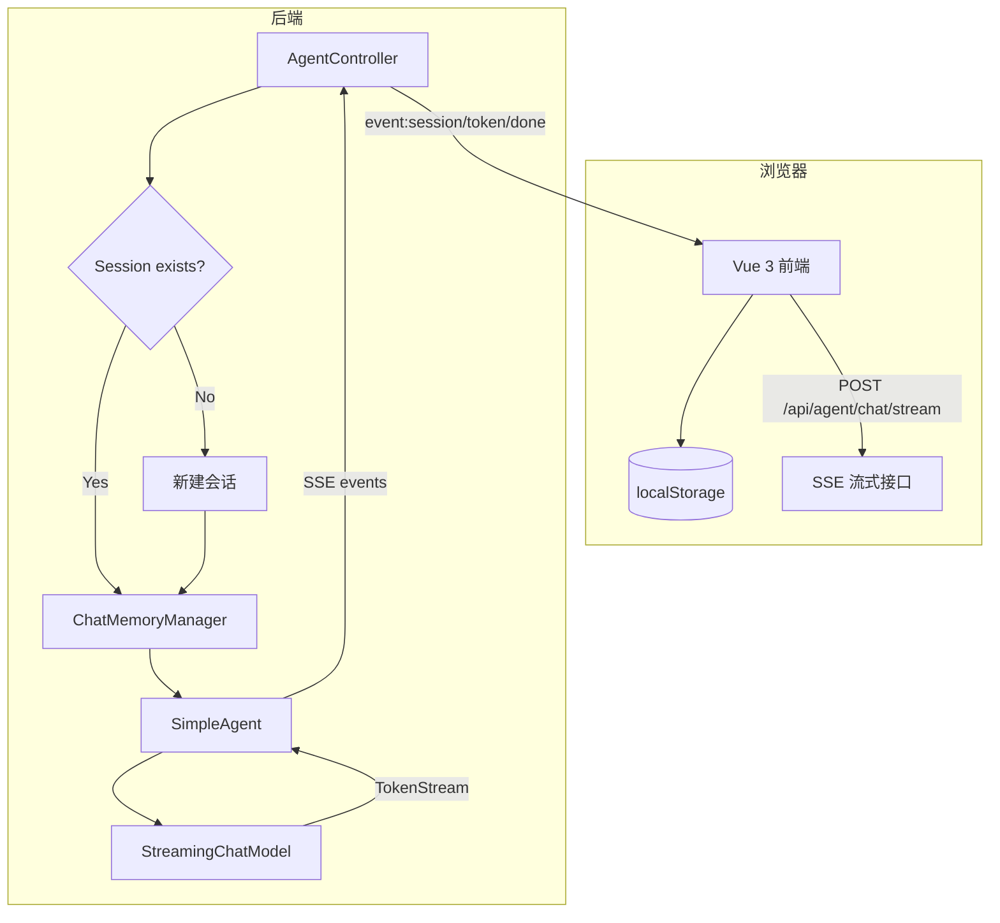
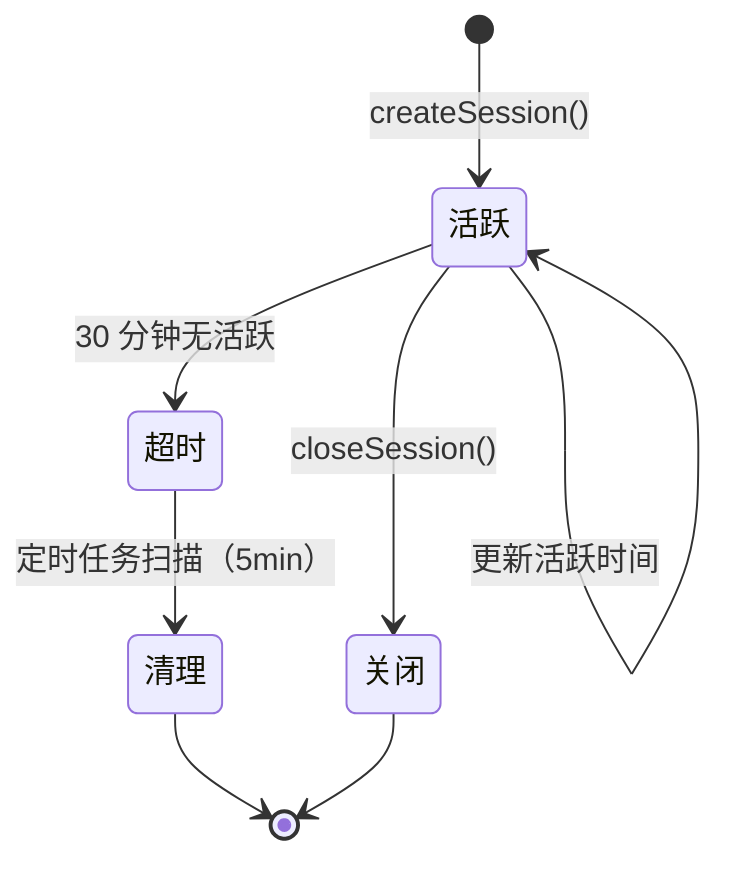
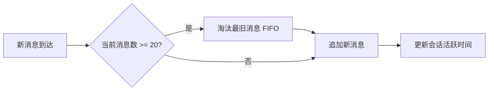
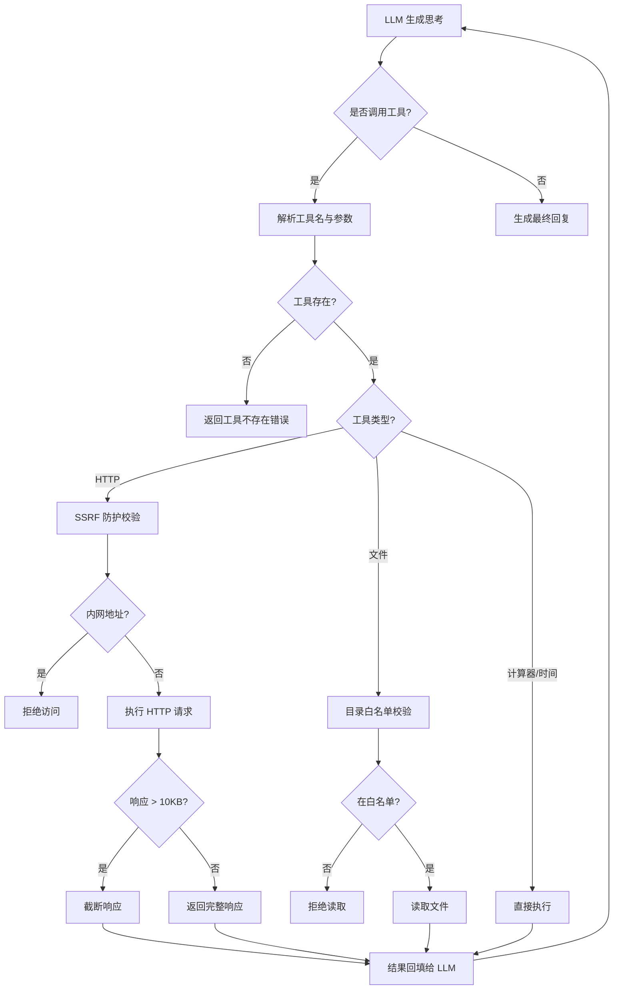
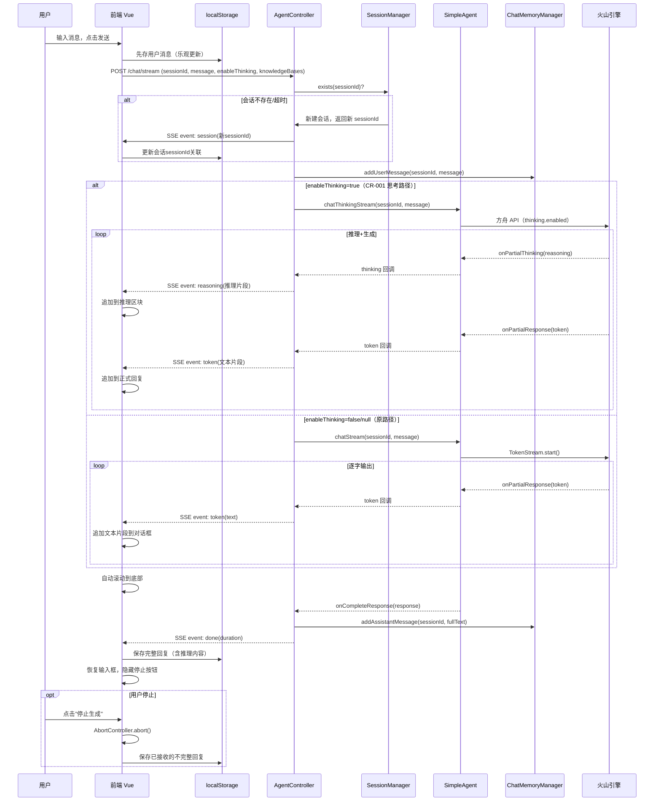
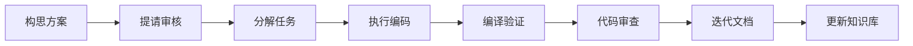

# AI Agent 示例项目 知识库 (KNOWLEDGE_BASE.md)

> **文档版本**：v1.5
> **基线日期**：2026-07-28
> **适用范围**：agent-demo（Java 后端 + Vue 3 前端工程）
> **数据来源**：项目源码 + `pom.xml` + `application.yml` + `package.json` + `specs/` 文档体系
> **维护方式**：每次功能迭代后由 `knowledge-base-generator` 技能增量更新

---

## 目录

- [一、项目概览](#一项目概览)
- [二、文档地图](#二文档地图)
- [三、技术栈速查](#三技术栈速查)
- [四、工程结构速查](#四工程结构速查)
- [五、业务域知识图谱](#五业务域知识图谱)
- [六、核心开发范式](#六核心开发范式)
- [七、数据库速查](#七数据库速查)
- [八、安全与权限体系](#八安全与权限体系)
- [九、关键业务规则清单](#九关键业务规则清单)
- [十、开发环境与构建](#十开发环境与构建)
- [十一、AI 驱动开发流程](#十一ai-驱动开发流程)
- [十二、常见问题与排障](#十二常见问题与排障)

---

## 一、项目概览

### 1.1 系统定位

**AI Agent 示例项目 (agent-demo)** 是一套面向 AI 应用开发学习者的**企业级 Agent 能力演练平台**。系统基于 Java 17 + Spring Boot 3.2.5 + LangChain4j 1.17.2 构建后端，以**单 Agent 工具调用（ReAct 循环）**为基础，扩展多 Agent 协作、RAG 知识库问答、MCP 协议互通、有状态工作流编排等能力。

LLM 提供商为**火山引擎方舟 Coding Plan**（按次计费，OpenAI 兼容协议）。

前端模块基于 **Vue 3 + Vite 5 + TypeScript 5 + Pinia 2** 构建，提供美观的**暗色科技风（Refined Dark Tech）** 对话界面，通过 SSE 流式接口与后端通信，使用浏览器 localStorage 持久化会话纪录。

### 1.2 核心价值

| # | 核心价值 | 说明 |
|---|---------|------|
| 1 | 企业级 Agent 能力覆盖 | 单 Agent、多 Agent、RAG、MCP、工作流 9 大能力域 |
| 2 | 声明式开发体验 | `@AiService` + `@Tool` + `@SystemMessage` 注解式编程，零样板 |
| 3 | 强类型契约 | Java 强类型直观呈现 Agent 接口，编译期检查 |
| 4 | 低成本 LLM 接入 | Coding Plan 按次计费 + 模型实例缓存复用 |
| 5 | 安全沙箱机制 | SSRF 防护 + 目录白名单 + 响应截断三重工具安全 |
| 6 | 模块化清晰 | 11 个 Maven 模块中等粒度拆分，职责边界明确 |
| 7 | BOM 统一版本 | 第三方依赖集中管理，避免版本冲突 |
| 8 | 渐进式演进 | 已实现核心 5 能力，RAG/MCP/多 Agent 分阶段补充 |

### 1.3 目标用户角色

| 角色 | 职责范围 | 主要操作模块 |
|------|---------|------------|
| **学习者** | 运行 Demo、调用 API、阅读源码理解原理 | bootstrap、web、agent |
| **开发者** | 扩展工具、新增 Agent、接入新 LLM | tools、agent、llm、memory |
| **API 调用方** | 通过 REST API 集成 Agent 能力 | web |
| **运维者** | 配置 API Key、监控 Token 消耗 | bootstrap、application.yml |

### 1.4 能力矩阵

| 能力域 | 实现状态 | 学习要点 |
|--------|---------|---------|
| LLM 调用 | ✅ 已实现 | 模型抽象、流式输出、参数调优、场景路由 |
| 工具调用 | ✅ 已实现 | ReAct 循环、Function Calling、声明式注册 |
| 记忆系统 | ✅ 已实现（短期） | 短期窗口记忆、会话隔离、超时清理 |
| Agent 编排 | ✅ 已实现（单 Agent） | AiServices 代理、ReAct 循环、懒加载 |
| Web 接口 | ✅ 已实现 | REST 同步对话、SSE 流式对话、会话管理、Swagger 文档 |
| 前端对话 | ✅ 已实现（v1） | Vue 3 对话框、SSE 流式逐字显示、localStorage 持久化、会话管理 UI |
| 前端知识库管理 | ✅ 已实现 | 知识库 CRUD、文档上传/轮询/删除、对话知识库选择器、左右分栏管理页面 |
| RAG 检索 | ✅ 已实现 | 知识库问答、文档分块、向量化（批量批处理）、向量检索、Agent 工具集成 |
| MCP 协议 | 🚧 规划中 | MCP 工具集成、A2A 通信 |
| 多 Agent 协作 | 🚧 规划中 | Sequential/Hierarchical 模式 |
| 工作流编排 | 🚧 规划中 | 状态机、分支重试、Human-in-the-loop |

> **数据来源**：`specs/SDD-工程业务背景文档.md` 第 2.3 节、`docs/ARCHITECTURE.md`

---

## 二、文档地图

### 2.1 TOGAF 架构文档（specs/ 根目录）

| 文档 | 路径 | 定位 |
|------|------|------|
| SDD-工程业务背景文档.md | `specs/SDD-工程业务背景文档.md` | 业务真理源，纯业务视角 |
| SDD-项目技术指南文档.md | `specs/SDD-项目技术指南文档.md` | 技术真理源，纯技术视角 |
| 业务架构文档.md | `specs/业务架构文档.md` | TOGAF Phase B |
| 技术架构文档-TOGAF.md | `specs/技术架构文档-TOGAF.md` | TOGAF Phase C/D |
| 数据架构文档-TOGAF.md | `specs/数据架构文档-TOGAF.md` | TOGAF Phase C-Data |

### 2.2 模块业务说明书（specs/modules/）

| 模块 | 文档路径 |
|------|---------|
| Agent 编排模块 | `specs/modules/Agent编排模块-业务说明书.md` |
| LLM 接入模块 | `specs/modules/LLM接入模块-业务说明书.md` |
| 工具调用模块 | `specs/modules/工具调用模块-业务说明书.md` |
| 记忆管理模块 | `specs/modules/记忆管理模块-业务说明书.md` |
| Web 接口模块 | `specs/modules/Web接口模块-业务说明书.md` |
| 公共组件模块 | `specs/modules/公共组件模块-业务说明书.md` |
| RAG 知识库模块 | `specs/modules/RAG模块-业务说明书.md` |

### 2.3 前端模块目录

| 路径 | 说明 |
|------|------|
| `agent-demo-frontend/` | Vue 3 前端项目根目录 |
| `agent-demo-frontend/src/api/` | SSE 流式调用封装（`chat.ts`）、RAG API 封装（`rag.ts`，7 个 REST 接口） |
| `agent-demo-frontend/src/stores/` | Pinia 状态管理（`session.ts` 含知识库选择器会话级状态、`rag.ts` 知识库/文档状态管理） |
| `agent-demo-frontend/src/utils/` | localStorage 缓存工具（`storage.ts`）、Markdown 渲染封装（`markdown.ts`） |
| `agent-demo-frontend/src/types/` | TypeScript 类型定义（`index.ts`，含 KnowledgeBase/DocumentInfo/DocumentStatus 等 RAG 类型） |
| `agent-demo-frontend/src/components/` | Vue 组件（对话：MessageItem/MessageList/MessageInput/ChatWindow/SessionList/NavBar；知识库：KnowledgeBasePage/KnowledgeBaseList/CreateKnowledgeBaseDialog/DocumentList/DocumentUploader/KnowledgeBaseSelector） |
| `agent-demo-frontend/src/styles/` | 全局样式系统（`global.css`，Refined Dark Tech） |

### 2.4 工程参考文档

| 文档 | 路径 | 说明 |
|------|------|------|
| 架构设计文档 | `docs/ARCHITECTURE.md` | 项目最初架构设计，含技术选型决策 |
| 功能迭代计划 | `feature/项目初始化搭建/plan/` | 9 个阶段的搭建计划文档 |
| AI Skills | `.agents/skills/` | 8 个 AI 辅助开发技能 |

### 2.5 迭代文档规范

```
features/{yyyy-MM-dd}/{功能名}/
├── 前端对话模块.md         # 功能规格
├── 前端对话模块_任务规划.md # 任务清单
└── 前端对话模块_技术方案.md # 技术设计
```

### 2.6 开发记录

| 文档 | 路径 |
|------|------|
| 阶段一 | `docs/开发记录/前端对话模块_阶段1_完成报告.md` |
| 阶段二 | `docs/开发记录/前端对话模块_阶段2_完成报告.md` |
| 阶段三 | `docs/开发记录/前端对话模块_阶段3_完成报告.md` |
| 阶段四 | `docs/开发记录/前端对话模块_阶段4_T16联调报告.md` |

> **数据来源**：`specs/` 目录扫描

---

## 三、技术栈速查

### 3.1 后端核心技术栈

> **数据来源**：`pom.xml` + `agent-demo-bom/pom.xml`

```properties
# 语言与框架
java.version=17
spring-boot.version=3.2.5
langchain4j.version=1.0.0

# AI 框架全家桶
langchain4j-open-ai=1.0.0          # 火山引擎接入适配器
langchain4j-milvus=1.0.0           # 向量数据库（规划中）
langchain4j-mcp=1.0.0              # MCP 协议（规划中）

# 数据访问
mybatis-plus.version=3.5.7         # ORM（规划中）
milvus.version=2.4.3               # 向量数据库 SDK（规划中）

# 工具库
hutool.version=5.8.27              # 通用工具
springdoc.version=2.5.0            # OpenAPI 文档
pdfbox.version=3.0.3               # PDF 文档解析（RAG 模块）

# 构建
maven.version=3.9+
project.version=1.0.0
```

### 3.2 LLM 提供商配置

| 配置项 | 值 |
|--------|---|
| 提供商 | 火山引擎方舟（Volcengine Ark） |
| 接入方式 | Coding Plan（按次计费） |
| Base URL | `https://ark.cn-beijing.volces.com/api/coding/v3` |
| 协议 | OpenAI 兼容 |
| 默认模型 | `doubao-seed-2.0-code` |
| API Key | 环境变量 `ARK_API_KEY` 注入 |

### 3.3 支持的 LLM 模型清单

| 模型 | Model Name | 场景 | 状态 |
|------|-----------|------|------|
| 豆包 Seed 2.0 Code | `doubao-seed-2.0-code` | 编程任务（默认） | ✅ |
| 豆包 Seed 2.0 Pro | `doubao-seed-2.0-pro` | 通用旗舰对话 | ✅ |
| 豆包 Seed 2.0 Lite | `doubao-seed-2.0-lite` | 轻量快速场景 | ✅ |
| MiniMax M2.7 | `minimax-m2.7` | 全栈任务 | 🚧 常量已定义 |
| GLM 5.2 | `glm-5.2` | Agent 能力强 | 🚧 常量已定义 |
| Kimi K2.7 Code | `kimi-k2.7-code` | 前端任务 | 🚧 常量已定义 |
| DeepSeek V4 Pro | `deepseek-v4-pro` | 推理任务 | 🚧 常量已定义 |
| 自动模式 | `ark-code-latest` | 效果+速度智能选择 | 🚧 常量已定义 |
| 豆包 Embedding | `doubao-embedding-large-text-240915` | RAG 向量化 | ✅ |

### 3.4 前端技术栈

> **数据来源**：`agent-demo-frontend/package.json`、`vite.config.ts`

```properties
# 语言与框架
node.version=18+
vue.version=3.4+
vite.version=5.4+
typescript.version=5.4+

# 核心依赖
pinia=2.1+               # Vue 状态管理
vue-router=4.3+          # 路由（预留）
marked=12+               # Markdown 解析（CR-001 新增，助手消息 Markdown 渲染）
dompurify=3+             # DOMPurify XSS 防护（CR-001 新增，与 marked 配合使用）

# 构建与开发
vitest=1.6+              # 单元测试框架
@vue/test-utils=2.4+     # Vue 组件测试工具
playwright=1.58+         # 浏览器端 E2E 测试

# 代理配置
vite.proxy=/api -> http://localhost:8080  # 开发期代理规避 CORS
```

### 3.5 前端设计系统

前端采用 **Refined Dark Tech（精致暗色科技风）** 设计美学：

| 设计维度 | 取值 |
|---------|------|
| 主色调 | 深蓝黑底（`#0a0e1a`）+ 青色 accent（`#00d4b8`） |
| 字体 | 英文 `JetBrains Mono`，中文 `Noto Sans SC` |
| 布局 | 左右分栏（280px 侧边栏 + 自适应对话框） |
| 交互 | hover 高亮、fadeIn 动画、流式光标 blink 动画 |
| 组件 | 13 个 Vue 组件：对话（MessageItem/MessageList/MessageInput/ChatWindow/SessionList/NavBar）+ 知识库（KnowledgeBasePage/KnowledgeBaseList/CreateKnowledgeBaseDialog/DocumentList/DocumentUploader/KnowledgeBaseSelector）+ App |

> **数据来源**：`agent-demo-bom/pom.xml`、`agent-demo-common/.../ModelConstants.java`

---

## 四、工程结构速查

### 4.1 后端模块拓扑

> **数据来源**：根 `pom.xml` + 各模块 `pom.xml`

```
agent-demo/
├── pom.xml                              # 根 POM，继承 spring-boot-starter-parent:3.2.5
├── agent-demo-bom/                      # BOM 物料清单（pom-only，统一版本）
├── agent-demo-common/                   # 公共组件（常量/枚举/异常/结果/工具类）
├── agent-demo-llm/                      # LLM 接入层（火山引擎适配 + 模型工厂）
├── agent-demo-tools/                    # 工具集（内置工具 + 注册中心）
├── agent-demo-memory/                   # 记忆模块（短期记忆 + 会话管理）
├── agent-demo-rag/                      # RAG 模块（知识库问答：文档解析、分块、向量化、检索、Agent 工具集成）
├── agent-demo-mcp/                      # MCP 协议模块（规划中，空模块）
├── agent-demo-agent/                    # Agent 核心模块（单 Agent ReAct）
├── agent-demo-app/                      # 应用编排层（规划中，空模块）
├── agent-demo-web/                      # Web 接口层（REST + SSE + DTO + 配置）
├── agent-demo-bootstrap/                # 启动模块（主启动类 + 配置 + 提示词）
└── agent-demo-frontend/                 # 前端模块（Vue 3 + Vite + TypeScript + Pinia）
    ├── package.json
    ├── vite.config.ts                    # Vite 配置（含 /api 代理到 :8080）
    ├── tsconfig.json
    ├── index.html
    └── src/
        ├── api/chat.ts                   # SSE 流式调用封装（fetch + ReadableStream，含 reasoning 事件处理，含 knowledgeBases 参数）
        ├── api/rag.ts                    # RAG API 封装（7 个 REST 接口 + 统一 request 函数）
        ├── stores/session.ts             # Pinia 会话状态管理（含 appendReasoning + knowledgeBasesBySession 会话级知识库选择状态）
        ├── stores/rag.ts                 # Pinia RAG 状态管理（知识库列表/文档列表/CRUD/状态轮询）
        ├── utils/markdown.ts             # Markdown 渲染封装（marked + DOMPurify）
        ├── utils/storage.ts              # localStorage 缓存工具（50 会话 FIFO 淘汰）
        ├── types/index.ts                # TypeScript 类型定义（Message.reasoning + StreamCallbacks + KnowledgeBase/DocumentInfo/DocumentStatus 等）
        ├── components/                   # Vue 组件
        │   ├── 对话组件                   # MessageItem/MessageList/MessageInput（含 KnowledgeBaseSelector 集成）/ChatWindow（含知识库选择状态管理）/SessionList/NavBar
        │   └── 知识库组件                 # KnowledgeBasePage/KnowledgeBaseList/CreateKnowledgeBaseDialog/DocumentList（含状态轮询）/DocumentUploader/KnowledgeBaseSelector
        ├── styles/global.css             # 全局样式系统（Refined Dark Tech）
        └── App.vue                       # 根组件（NavBar + 条件渲染切换对话/知识库页面）
```

### 4.2 模块依赖方向

| 模块 | 依赖方向 |
|------|---------|
| `agent-demo-bom` | 无（独立存在，不继承根 pom） |
| `agent-demo-common` | 无 |
| `agent-demo-llm` | common |
| `agent-demo-tools` | common |
| `agent-demo-memory` | common, llm |
| `agent-demo-rag` | common, llm |
| `agent-demo-mcp` | common, tools（规划中） |
| `agent-demo-agent` | common, llm, tools, memory |
| `agent-demo-app` | agent, rag, mcp（规划中） |
| `agent-demo-web` | app, agent, memory, rag |
| `agent-demo-bootstrap` | web（聚合全部） |
| `agent-demo-frontend` | 独立运行，通过 HTTP 调用后端 API（无 Maven 依赖） |

### 4.3 核心模块内部分层

**agent-demo-agent**（Agent 核心）：

```
agent-demo-agent/
├── config/                # AgentConfig（配置属性绑定，含 thinkingSystemPrompt/thinkingReactSystemPrompt，后者工具描述由 convertToDescriptionText() 动态追加）
├── core/                  # BaseAgent（Agent 抽象接口）+ ThinkingTokenStream（思考流式接口，CR-001 新增）
└── single/                # SimpleAgent（单 Agent 实现，含 chatStream/chatThinkingStream CR-001 扩展，buildReActMessagesWithMemory 动态拼接工具描述）
```

**agent-demo-llm**（LLM 接入）：

```
agent-demo-llm/
├── config/                # ArkProperties / LlmConfig（含 thinking-default-enabled CR-001 新增）
└── factory/               # ModelFactory（模型工厂，含 getThinkingStreamingChatModel CR-001 新增）
                           # ArkThinkingStreamingChatModel（自定义思考流式模型，CR-001 新增）
                           # ThinkingStreamHandler（思考流式回调接口，CR-001 新增）
```

**agent-demo-tools**（工具系统）：

```
agent-demo-tools/
├── builtin/               # 内置工具（Calculator/Time/Http/FileRead）
└── registry/              # ToolRegistry（注册中心）+ ToolSchemaConverter（Schema/描述转换，含 convertToDescriptionText 动态工具描述生成）
```

**agent-demo-memory**（记忆系统）：

```
agent-demo-memory/
├── longterm/              # 长期记忆（EmptyLongTermMemory 占位）
├── session/               # 会话管理（SessionManager/Metadata）
├── shortterm/             # 短期记忆（ChatMemoryManager）
└── store/                 # 记忆存储（MemoryRepository + InMemory 实现）
```

**agent-demo-rag**（RAG 知识库）：

```
agent-demo-rag/
├── config/                # RagProperties（配置属性绑定）+ RagAsyncConfig（异步线程池 @EnableAsync）
├── entity/                # DocumentStatus / KnowledgeBase / DocumentInfo
├── store/                 # KnowledgeBaseStore + InMemoryKnowledgeBaseStore（知识库元数据）
│                          # DocumentStore + InMemoryDocumentStore（文档元数据）
│                          # EmbeddingStoreFactory（向量存储工厂，可切换 InMemory/Milvus）
├── loader/                # DocumentLoader（文档解析：txt/md/pdf，PDFBox 3.x）
├── service/               # KnowledgeBaseService（创建/列表/级联删除）+ DocumentService（上传/@Async处理/状态/删除）
└── retriever/             # KnowledgeRetrieverTool（@Tool 知识库检索工具，Agent 自主调用）
```

**agent-demo-web**（Web 接口）：

```
agent-demo-web/
├── config/                # OpenApiConfig / TraceIdInterceptor / WebConfig
├── controller/            # AgentController
├── dto/                   # ChatRequest / ChatResponse
└── handler/               # GlobalExceptionHandler
```

**agent-demo-common**（公共组件）：

```
agent-demo-common/
├── constant/              # ModelConstants / StatusCode
├── enums/                 # AgentType / MemoryType / MessageType
├── exception/             # BusinessException / ErrorCode
├── result/                # Result / PageResult
└── utils/                 # DateUtils / JsonUtils
```

### 4.4 包命名规范

```
com.agentdemo
├── common.{constant,enums,exception,result,utils}
├── llm.{config,factory}
├── tools.{builtin,registry}
├── memory.{longterm,session,shortterm,store}
├── agent.{config,core,single}
├── web.{config,controller,dto,handler}
└── AgentDemoApplication                 # 启动类位于 com.agentdemo 根包
```

> **数据来源**：`docs/ARCHITECTURE.md` 第四章、各模块源码扫描

---

## 五、业务域知识图谱

### 5.1 端到端对话流程

> **数据来源**：`specs/业务架构文档.md` 第 6.1 节、`AgentController.java`、`SimpleAgent.java`、`agent-demo-frontend/src/api/chat.ts`



### 5.2 ReAct 循环机制

**核心机制**：LangChain4j AiServices 内置 ReAct 循环，无需手写。

```
用户输入 -> 构造 Prompt -> LLM 思考 -> 是否调用工具？
                                    ├─ 是 -> 执行工具 -> 结果回填 -> 回到 LLM 思考
                                    └─ 否 -> 生成最终回答 -> 返回
```

**关键约束**：
- 最大迭代次数：`agent.max-iterations=10`（防止无限循环消耗 Token）
- 工具调用决策由 LLM 自主完成（Function Calling）
- 工具结果自动回填到上下文，继续 LLM 思考

### 5.3 会话生命周期状态机

> **数据来源**：`specs/业务架构文档.md` 第 6.4 节、`SessionManager.java`



**关键规则**：
- 会话 ID：UUID 去横线生成，全局唯一
- 超时时间：默认 30 分钟（`session.timeout-minutes`）
- 扫描频率：每 5 分钟（`@Scheduled(fixedRate=5*60*1000L)`）
- 无效 sessionId：自动新建会话，不抛错

### 5.4 记忆窗口淘汰策略

> **数据来源**：`ChatMemoryManager.java`、`specs/数据架构文档-TOGAF.md` 第 10.3 节



**三级记忆架构**（规划中）：

| 记忆类型 | 实现状态 | 存储方式 | 用途 |
|---------|---------|---------|------|
| 短期记忆 | ✅ 已实现 | 内存 MessageWindowChatMemory | 当前对话上下文（20 条） |
| 中期记忆 | 🚧 规划中 | 内存/Redis | 历史对话摘要 |
| 长期记忆 | 🚧 规划中 | Milvus 向量 | 跨会话记忆检索 |

### 5.5 工具调用决策流程

> **数据来源**：`specs/业务架构文档.md` 第 6.5 节、`HttpTool.java`、`FileReadTool.java`



### 5.6 模型场景路由框架

> **数据来源**：`ModelFactory.java`、`ArkProperties.java`

| 场景标识 | 模型 | 适用场景 |
|---------|------|---------|
| `chat`（默认） | doubao-seed-2.0-pro | 通用旗舰对话 |
| `code` | doubao-seed-2.0-code | 编程任务 |
| `lite` | doubao-seed-2.0-lite | 轻量快速场景 |
| Embedding | doubao-embedding-large-text-240915 | RAG 向量化 |

- **路由方式**：`ModelFactory.getChatModel(scene)` 按场景查找
- **回退策略**：未命中场景配置时回退到 `default-model`
- **缓存策略**：模型实例线程安全，ConcurrentHashMap 缓存复用

### 5.8 前端 SSE 流式对话流程

> **数据来源**：`AgentController.java`、`agent-demo-frontend/src/api/chat.ts`、`agent-demo-frontend/src/stores/session.ts`



**SSE 事件协议**：

| 事件名 | 数据 | 触发时机 |
|--------|------|---------|
| `session` | 新 sessionId 字符串 | 会话不存在/超时，新建后发送 |
| `reasoning` | 推理文本片段（CR-001 新增） | 每收到一段推理内容（仅 enableThinking=true 时） |
| `token` | 文本片段 | 每收到一个 LLM token |
| `done` | 耗时毫秒数 | 流式完整结束 |
| `error` | 错误描述 | 流式过程异常 |

**关键约束**：
- 前端使用 `fetch` + `ReadableStream` 手动解析 SSE（EventSource 不支持 POST）
- 使用 `AbortController` 实现停止生成（AC-011）
- 开启深度思考时，推理片段与正式回复片段分别通过 `reasoning` 和 `token` 事件推送（CR-001）
- localStorage 缓存上限 50 个会话，按最后活跃时间 FIFO 淘汰（AC-016）
- 会话标题取首条消息前 20 字符（AC-006）
- 知识库选择器（knowledgeBases 参数）按会话维度保持状态，空数组表示"自动"模式由 Agent 自主决策，非空时提示词注入引导 LLM 检索指定知识库

### 5.9 特殊业务机制

#### 5.9.1 懒加载机制

> **数据来源**：`SimpleAgent.java`、`ToolRegistry.java`、`ModelFactory.java`

| 对象 | 懒加载方式 | 原因 |
|------|---------|------|
| SimpleAgent.delegate | volatile + synchronized 双重检查锁 | 避免构造时调用 listTools() 触发循环依赖 |
| ToolRegistry.scanned | volatile + synchronized 双重检查锁 | 避免 SimpleAgent 构造时触发 Tool 扫描循环依赖 |
| ModelFactory.embeddingModel | volatile + synchronized 双重检查锁 | 单例懒加载，首次使用时创建 |
| ChatMemoryManager.getMemory | computeIfAbsent | 会话记忆不存在时自动创建 |

#### 5.9.2 Agent 类型框架

> **数据来源**：`AgentType.java`

| 类型 | 含义 | 状态 |
|------|------|------|
| SINGLE | 单 Agent 独立完成任务 | ✅ 已实现 |
| MULTI | 多 Agent 角色协作（Sequential/Hierarchical） | 🚧 规划中 |
| WORKFLOW | 工作流编排（状态机 + HITL） | 🚧 规划中 |

---

## 六、核心开发范式

### 6.1 分层命名规范

> **数据来源**：`specs/SDD-项目技术指南文档.md` 第 3.7 节

| 类型 | 命名规范 | 示例 |
|------|---------|------|
| Controller | `{Domain}Controller` | `AgentController` |
| Service 接口 | `{Domain}Service`/`{Domain}Manager` | `SessionManager` |
| Service 实现 | `{Domain}ServiceImpl` / 委托模式 | `SimpleAgent` |
| 配置类 | `{Domain}Config` / `{Domain}Properties` | `AgentConfig` / `ArkProperties` |
| 工厂类 | `{Domain}Factory` | `ModelFactory` |
| 注册中心 | `{Domain}Registry` | `ToolRegistry` |
| 枚举 | `{Domain}{Type}Enum` | `AgentType`、`MemoryType` |
| 常量类 | `{Domain}Constants` | `ModelConstants` |
| DTO | `{Domain}{Action}Request`/`{Domain}{Action}Response` | `ChatRequest`/`ChatResponse` |
| 错误码 | 统一在 `ErrorCode` 枚举中定义 | `LLM_CALL_FAILED(5001)` |

### 6.2 Agent 开发范式

> **数据来源**：`SimpleAgent.java`、`BaseAgent.java`

**标准 Agent 实现模板**：

```java
// 1. 定义 Agent 接口（使用 LangChain4j 注解）
public interface BaseAgent {
    @MemoryId String sessionId,  // 会话隔离
    @UserMessage String message  // 用户消息
    String chat(...);
}

// 2. 实现 Agent（委托模式 + 懒加载）
@Service
public class SimpleAgent implements BaseAgent {
    private volatile BaseAgent delegate;  // 懒加载代理

    private BaseAgent getDelegate() {
        if (delegate == null) {
            synchronized (this) {
                if (delegate == null) {
                    delegate = AiServices.builder(BaseAgent.class)
                            .chatModel(modelFactory.getDefaultChatModel())
                            .chatMemoryProvider(memoryId -> memoryManager.getMemory((String) memoryId))
                            .tools(toolRegistry.listTools().toArray())
                            .systemMessageProvider(memoryId -> agentConfig.getDefaultSystemPrompt())
                            .build();
                }
            }
        }
        return delegate;
    }

    @Override
    public String chat(String sessionId, String message) {
        return getDelegate().chat(sessionId, message);
    }
}
```

### 6.3 工具开发范式

> **数据来源**：`HttpTool.java`、`CalculatorTool.java`、`TimeTool.java`

**标准工具模板**：

```java
@Component  // 必须：Spring Bean 自动扫描
public class XxxTool {

    @Tool("工具功能描述，Agent 通过此描述决定是否调用")  // 必须：LangChain4j 工具注解
    public String doSomething(String param) {
        // 1. 参数校验
        if (param == null || param.isEmpty()) {
            throw new BusinessException(ErrorCode.TOOL_PARAM_INVALID, "参数不能为空");
        }
        // 2. 安全防护（如 SSRF、目录白名单）
        validateSecurity(param);
        // 3. 执行业务逻辑
        try {
            String result = execute(param);
            // 4. 响应限制（如截断）
            return truncateIfNeeded(result);
        } catch (Exception e) {
            // 5. 异常封装为 BusinessException
            throw new BusinessException(ErrorCode.TOOL_EXECUTION_FAILED, "执行失败", e);
        }
    }
}
```

### 6.4 Controller 开发范式

> **数据来源**：`AgentController.java`

**标准 Controller 模板**：

```java
@Tag(name = "模块名", description = "模块描述")
@RestController
@RequestMapping("/api/{module}")
public class XxxController {

    private final XxxService xxxService;

    // 构造器注入（禁止 @Autowired 字段注入）
    public XxxController(XxxService xxxService) {
        this.xxxService = xxxService;
    }

    @Operation(summary = "接口摘要", description = "接口详细描述")
    @PostMapping("/action")
    public Result<XxxResponse> action(@Valid @RequestBody XxxRequest request) {
        XxxResponse response = xxxService.doAction(request);
        return Result.success(response);
    }
}
```

### 6.5 配置属性绑定范式

> **数据来源**：`ArkProperties.java`、`AgentConfig.java`

```java
@Data
@ConfigurationProperties(prefix = "ark.coding-plan")
public class ArkProperties {
    private String baseUrl = "https://ark.cn-beijing.volces.com/api/coding/v3";
    private String apiKey;  // 环境变量注入
    private String defaultModel = "doubao-seed-2.0-code";
    private Map<String, String> models = new HashMap<>();
    private Duration timeout = Duration.ofSeconds(60);
    // ...
}
```

### 6.6 统一返回结果范式

> **数据来源**：`Result.java`

```java
// 成功返回
return Result.success(data);
return Result.success(data, "操作成功");
return Result.success();

// 失败返回
return Result.error(ErrorCode.LLM_CALL_FAILED);
return Result.error(ErrorCode.LLM_CALL_FAILED, "补充信息");
return Result.error(5001, "自定义消息");
```

**Result 结构**：

```json
{
  "success": true,
  "code": 200,
  "message": "成功",
  "data": {...},
  "traceId": "a1b2c3d4"
}
```

### 6.7 全局异常处理范式

> **数据来源**：`GlobalExceptionHandler.java`

```java
@RestControllerAdvice
public class GlobalExceptionHandler {

    @ExceptionHandler(BusinessException.class)
    public Result<Void> handleBusiness(BusinessException e) {
        return Result.error(e.getErrorCode(), e.getMessage());
    }

    @ExceptionHandler(MethodArgumentNotValidException.class)
    @ResponseStatus(HttpStatus.BAD_REQUEST)
    public Result<Void> handleValidation(MethodArgumentNotValidException e) {
        return Result.error(ErrorCode.PARAM_INVALID, message);
    }

    @ExceptionHandler(Exception.class)
    @ResponseStatus(HttpStatus.INTERNAL_SERVER_ERROR)
    public Result<Void> handleUnknown(Exception e) {
        return Result.error(ErrorCode.SYSTEM_ERROR);
    }
}
```

> **数据来源**：各模块源码、`specs/SDD-项目技术指南文档.md` 第 4 节

---

## 七、数据库速查

### 7.1 当前存储形态

> **⚠️ 重要**：本项目当前**无传统关系数据库**，采用纯内存存储。以下为内存数据架构。

| 数据域 | 存储方式 | 数据量级 | 业务归属模块 |
|--------|---------|---------|------------|
| 会话数据域 | 内存 ConcurrentHashMap | 小（活跃会话数） | agent-demo-memory |
| 记忆数据域 | 内存 MessageWindowChatMemory | 小（20 条/会话） | agent-demo-memory |
| 模型缓存域 | 内存 ConcurrentHashMap | 极小（按 modelName） | agent-demo-llm |
| 配置数据域 | application.yml + 环境变量 | 极小 | agent-demo-bootstrap |
| 工具数据域 | 内存 CopyOnWriteArrayList | 极小（工具数） | agent-demo-tools |
| 日志数据域 | 文件 logs/agent-demo.log | 中 | 全局 |

### 7.2 核心内存数据结构

| 数据结构 | 类型 | 所属类 | 用途 |
|---------|------|--------|------|
| sessionMap | ConcurrentHashMap<String, SessionMetadata> | SessionManager | 会话管理 |
| memoryMap | ConcurrentHashMap<String, ChatMemory> | ChatMemoryManager | 记忆管理 |
| chatModelCache | ConcurrentHashMap<String, ChatModel> | ModelFactory | 对话模型缓存 |
| streamingModelCache | ConcurrentHashMap<String, StreamingChatModel> | ModelFactory | 流式模型缓存 |
| embeddingModel | volatile EmbeddingModel | ModelFactory | Embedding 单例 |
| tools | CopyOnWriteArrayList<Object> | ToolRegistry | 工具列表 |
| delegate | volatile BaseAgent | SimpleAgent | AiServices 代理 |

### 7.3 规划数据库（未来接入）

| 数据库 | 版本 | 用途 | 部署方式 |
|--------|------|------|---------|
| Milvus | 2.4.3 | 向量数据库（RAG + 长期记忆） | Docker |
| MySQL | 8.x | 关系数据库（会话/记忆持久化） | 独立部署 |

### 7.4 标准建表模板（未来接入 MySQL 时遵循）

> **数据来源**：`specs/SDD-项目技术指南文档.md` 第 3.6 节

```sql
CREATE TABLE `agent_{name}` (
  `id`          BIGINT NOT NULL AUTO_INCREMENT COMMENT '主键',
  -- 业务字段 --
  `creator`     VARCHAR(64) DEFAULT '' COMMENT '创建者',
  `create_time` DATETIME NOT NULL DEFAULT CURRENT_TIMESTAMP COMMENT '创建时间',
  `updater`     VARCHAR(64) DEFAULT '' COMMENT '更新者',
  `update_time` DATETIME NOT NULL DEFAULT CURRENT_TIMESTAMP ON UPDATE CURRENT_TIMESTAMP COMMENT '更新时间',
  `deleted`     BIT(1) NOT NULL DEFAULT b'0' COMMENT '是否删除',
  PRIMARY KEY (`id`)
) ENGINE=InnoDB DEFAULT CHARSET=utf8mb4 COLLATE=utf8mb4_unicode_ci COMMENT='{表注释}';
```

**建表约束**：
- 所有表必须包含 `deleted BIT(1) NOT NULL DEFAULT b'0'` 逻辑删除字段
- 所有表必须包含审计四字段 `creator`/`create_time`/`updater`/`update_time`
- 字段命名使用 snake_case
- 字符集统一 `utf8mb4`，排序规则 `utf8mb4_unicode_ci`
- 主键策略：`BIGINT NOT NULL AUTO_INCREMENT`
- 存储引擎使用 `InnoDB`
- 表间不使用数据库外键，关联关系通过应用层维护

> **数据来源**：`specs/数据架构文档-TOGAF.md`、项目无 `sql/` 目录

---

## 八、安全与权限体系

### 8.1 安全措施矩阵

> **数据来源**：`HttpTool.java`、`FileReadTool.java`、`GlobalExceptionHandler.java`、`TraceIdInterceptor.java`

| 安全场景 | 机制 | 实现类 |
|----------|------|--------|
| API Key 保护 | 环境变量 `${ARK_API_KEY}` 注入，禁止入库/日志 | ArkProperties |
| API Key 校验 | 创建模型前校验非空 | ModelFactory.validateApiKey() |
| HTTP 工具 SSRF 防护 | 禁止访问内网地址（10./172.16-31./192.168./127./localhost） | HttpTool.validateUrl() |
| HTTP 响应截断 | 超过 10KB 截断，防止 Token 消耗过大 | HttpTool.truncateResponse() |
| 文件读取目录限制 | `agent.file-allowed-dir` 白名单（默认 `./data`） | FileReadTool |
| 会话隔离 | 按 sessionId 隔离 ChatMemory | ChatMemoryManager |
| 全局异常处理 | `@RestControllerAdvice` 统一拦截，避免堆栈泄露 | GlobalExceptionHandler |
| traceId 链路追踪 | `TraceIdInterceptor` 自动注入 MDC | TraceIdInterceptor |
| 参数校验 | `@Valid` + Bean Validation（如 `@NotBlank`） | Controller |

### 8.2 SSRF 防护规则

> **数据来源**：`HttpTool.java` 第 33-38 行

**禁止访问的内网 IP 前缀**：

```java
private static final String[] PRIVATE_IP_PREFIXES = {
    "10.", "172.16.", "172.17.", "172.18.", "172.19.", "172.20.",
    "172.21.", "172.22.", "172.23.", "172.24.", "172.25.", "172.26.",
    "172.27.", "172.28.", "172.29.", "172.30.", "172.31.", "192.168.",
    "127.", "0.0.0.0", "localhost"
};
```

### 8.3 敏感字段清单

| 实体 | 字段 | 保护方式 | 说明 |
|------|------|---------|------|
| ArkProperties | apiKey | 环境变量注入 | 禁止入库/日志 |
| ChatModel | apiKey | 环境变量注入 | 禁止入库/日志 |
| ChatRequest | message | 日志脱敏（截断） | 不打印完整明文 |
| SessionMetadata | userId | - | 用户标识 |

### 8.4 权限体系说明

> **⚠️ 注意**：本项目为学习示例工程，**未接入认证机制**（无 Spring Security/JWT/RBAC）。所有 API 可被任意调用。

生产环境接入时建议：
- 引入 Spring Security + JWT 认证
- 增加 RBAC 权限控制
- 接入 API 限流（如 Sentinel）

> **数据来源**：`specs/业务架构文档.md` 第 9 节、`specs/SDD-工程业务背景文档.md` 第 5.6 节

---

## 九、关键业务规则清单

> **数据来源**：`specs/SDD-工程业务背景文档.md` 第 5 节、各模块业务说明书、核心源码校验逻辑

### 9.1 LLM 接入规则

| # | 编号 | 规则 | 范围 | 级别 |
|---|------|------|------|------|
| 1 | BR-LLM-001 | API Key 必须通过环境变量 `ARK_API_KEY` 注入，禁止硬编码入库 | LLM 接入 | 🔴 强制 |
| 2 | BR-LLM-002 | 必须使用 Coding Plan 专用地址 `/api/coding/v3`（按次计费） | LLM 接入 | 🔴 强制 |
| 3 | BR-LLM-003 | 模型名称必须通过 `ModelConstants` 常量类引用 | LLM 接入 | 🔴 强制 |
| 4 | BR-LLM-004 | 模型实例必须通过 `ModelFactory` 获取并缓存复用 | LLM 接入 | 🔴 强制 |
| 5 | BR-LLM-005 | 调用超时时间默认 60s | LLM 接入 | ⚪ 可覆盖 |
| 6 | BR-LLM-006 | 最大重试次数默认 3 次 | LLM 接入 | ⚪ 可覆盖 |
| 7 | BR-LLM-007 | 思考模式（thinking.enabled）必须通过自定义 ArkThinkingStreamingChatModel 直连方舟 API，不走 LangChain4j openai4j（因 openai4j 不透传 reasoning_content） | LLM 接入 | 🔴 强制 |

### 9.2 Agent 编排规则

| # | 编号 | 规则 | 范围 | 级别 |
|---|------|------|------|------|
| 7 | BR-AGT-001 | 所有 Agent 实现必须实现 `BaseAgent` 接口 | Agent 编排 | 🔴 强制 |
| 8 | BR-AGT-002 | ReAct 循环最大迭代次数默认 10 | Agent 编排 | 🔴 强制 |
| 9 | BR-AGT-003 | Agent delegate 必须懒加载，避免构造时触发循环依赖 | Agent 编排 | 🔴 强制 |
| 10 | BR-AGT-004 | 会话记忆按 sessionId 隔离，禁止跨会话读取记忆 | Agent 编排 | 🔴 强制 |
| 11 | BR-AGT-005 | 系统提示词通过 `systemMessageProvider` 动态提供 | Agent 编排 | 🟡 尽量 |
| 12 | BR-AGT-006 | Agent 调用日志默认开启 | Agent 编排 | ⚪ 可覆盖 |
| 13 | BR-AGT-007 | 思考模式必须使用专用系统提示词（thinkingSystemPrompt），不提及工具调用能力；正常模式使用 defaultSystemPrompt（含工具引导语） | Agent 编排 | 🔴 强制 |
| 14 | BR-THINK-002 | 深度思考 ReAct 模式系统提示词（thinkingReactSystemPrompt）必须包含 ReAct 格式引导，工具能力描述通过运行时动态生成（ToolSchemaConverter.convertToDescriptionText() 反射扫描 @Tool 方法），不硬编码在提示词配置中（深度思考 CR-001） | Agent 编排 | 🔴 强制 |

### 9.3 工具调用规则

| # | 编号 | 规则 | 范围 | 级别 |
|---|------|------|------|------|
| 13 | BR-TOOL-001 | 工具类必须加 `@Component`，工具方法必须加 `@Tool` 注解 | 工具调用 | 🔴 强制 |
| 14 | BR-TOOL-002 | 工具注册采用懒加载，首次调用 `listTools()` 时扫描 | 工具调用 | 🔴 强制 |
| 15 | BR-TOOL-003 | HTTP 工具必须执行 SSRF 防护，禁止访问内网地址 | 工具调用 | 🔴 强制 |
| 16 | BR-TOOL-004 | HTTP 工具响应超过 10KB 必须截断 | 工具调用 | 🔴 强制 |
| 17 | BR-TOOL-005 | 文件读取工具必须限定在 `agent.file-allowed-dir` 目录白名单内 | 工具调用 | 🔴 强制 |
| 18 | BR-TOOL-006 | 工具执行失败必须抛出 `BusinessException` + 对应 ErrorCode | 工具调用 | 🔴 强制 |
| 19 | BR-TOOL-007 | 动态注册工具应通过 `ToolRegistry.register()` 注册 | 工具调用 | 🟡 尽量 |

### 9.4 记忆与会话规则

| # | 编号 | 规则 | 范围 | 级别 |
|---|------|------|------|------|
| 20 | BR-MEM-001 | 会话 ID 必须使用 UUID 去横线生成，保证全局唯一 | 记忆管理 | 🔴 强制 |
| 21 | BR-MEM-002 | 会话超时默认 30 分钟，每 5 分钟扫描清理一次 | 记忆管理 | ⚪ 可覆盖 |
| 22 | BR-MEM-003 | 短期记忆窗口默认 20 条消息，超出自动淘汰旧消息 | 记忆管理 | ⚪ 可覆盖 |
| 23 | BR-MEM-004 | `ChatMemoryManager.getMemory()` 使用 `computeIfAbsent`，回调内禁止修改同一 map | 记忆管理 | 🔴 强制 |
| 24 | BR-MEM-005 | 传入无效 sessionId 时应自动新建会话，不应抛出错误 | 记忆管理 | 🔴 强制 |

### 9.5 数据安全与合规规则

| # | 编号 | 规则 | 范围 | 级别 |
|---|------|------|------|------|
| 25 | BR-SEC-001 | API Key 禁止明文打印到日志 | 安全合规 | 🔴 强制 |
| 26 | BR-SEC-002 | HTTP 工具禁止访问内网地址 | 安全合规 | 🔴 强制 |
| 27 | BR-SEC-003 | 文件读取工具禁止读取白名单目录外的文件 | 安全合规 | 🔴 强制 |
| 28 | BR-SEC-004 | 生产环境应关闭 Swagger UI 访问 | 安全合规 | 🟡 尽量 |
| 29 | BR-SEC-005 | 日志中不应打印用户消息完整明文（可截断或脱敏） | 安全合规 | 🟢 建议 |

### 9.6 RAG 知识库规则

| # | 编号 | 规则 | 范围 | 级别 |
|---|------|------|------|------|
| 30 | BR-RAG-001 | 知识库名称长度 1-50 个字符，仅允许中英文、数字、下划线和连字符 | RAG 知识库 | 🔴 强制 |
| 31 | BR-RAG-002 | 知识库名称不允许重复（全局唯一） | RAG 知识库 | 🔴 强制 |
| 32 | BR-RAG-003 | 知识库描述长度不超过 200 个字符 | RAG 知识库 | 🔴 强制 |
| 33 | BR-RAG-004 | 单个文档大小不超过 10MB | RAG 知识库 | 🔴 强制 |
| 34 | BR-RAG-005 | 支持的文档格式：txt、md、pdf（第一期） | RAG 知识库 | ⚪ 可覆盖 |
| 35 | BR-RAG-006 | 同一知识库下允许同名文档，以文档 ID 区分 | RAG 知识库 | 🔴 强制 |
| 36 | BR-RAG-007 | 文档处理采用异步模式，状态流转：待处理 -> 处理中 -> 已完成/失败 | RAG 知识库 | 🔴 强制 |
| 37 | BR-RAG-008 | 检索结果最多返回 5 个最相关文档片段，按相似度降序排列 | RAG 知识库 | ⚪ 可覆盖 |
| 38 | BR-RAG-009 | 删除知识库时级联删除其下所有文档记录和向量数据 | RAG 知识库 | 🔴 强制 |
| 39 | BR-RAG-010 | 删除文档时同步删除该文档对应的所有向量数据 | RAG 知识库 | 🔴 强制 |
| 40 | BR-RAG-011 | Agent 通过工具集成方式检索知识库，Agent 自主选择目标知识库 | RAG 知识库 | 🔴 强制 |
| 41 | BR-RAG-012 | 向量数据库不可用时检索工具返回错误提示，不导致 Agent 对话中断 | RAG 知识库 | 🔴 强制 |
| 42 | BR-RAG-013 | 文档向量化时 Embeddings API 单次输入上限为 10 个文本片段，超出时必须分批调用（batchEmbed，每批 10 条），避免 InvalidParameter 错误 | RAG 知识库 | 🔴 强制 |
| 43 | BR-RAG-014 | 对话知识库集成采用提示词注入方案：用户指定知识库时，将知识库名称注入用户消息末尾引导 LLM 检索；不指定时 Agent 自主决策（零回归） | RAG 知识库 | 🔴 强制 |

### 9.7 前端对话模块规则

| # | 编号 | 规则 | 范围 | 级别 |
|---|------|------|------|------|
| 34 | BR-FE-001 | 流式输出采用后端真流式（SSE），非前端模拟打字机 | 前端对话 | 🔴 强制 |
| 35 | BR-FE-002 | 会话纪录完整存储于浏览器 localStorage，独立于后端会话生命周期 | 前端对话 | 🔴 强制 |
| 36 | BR-FE-003 | 后端会话超时后前端透明续聊，本地历史连续展示 | 前端对话 | 🔴 强制 |
| 37 | BR-FE-004 | 会话标题取用户首条消息前 20 字符，超出省略号 | 前端对话 | 🔴 强制 |
| 38 | BR-FE-005 | 重命名标题长度上限 50 字符 | 前端对话 | 🔴 强制 |
| 39 | BR-FE-006 | 单条消息长度上限 4000 字符 | 前端对话 | 🔴 强制 |
| 40 | BR-FE-007 | 本地缓存保留最近 50 个会话，超出按最后活跃时间 FIFO 淘汰 | 前端对话 | 🔴 强制 |
| 41 | BR-FE-008 | 会话列表按最后活跃时间倒序排列 | 前端对话 | 🔴 强制 |
| 42 | BR-FE-009 | 流式输出过程中禁用输入框，提供"停止生成"按钮 | 前端对话 | 🔴 强制 |
| 43 | BR-FE-010 | 流式中断后已接收内容作为助手回复存入本地缓存 | 前端对话 | 🔴 强制 |
| 44 | BR-FE-011 | 深度思考开关（toggle）按消息维度控制，当前会话内保持状态，切换会话互不影响（CR-001） | 前端对话 | 🔴 强制 |
| 45 | BR-FE-012 | 推理内容通过可折叠区块展示：流式中展开（标题"思考中..."），完成后折叠（标题"已思考 X 秒"）（CR-001） | 前端对话 | 🔴 强制 |
| 46 | BR-FE-013 | 助手正式回复按 Markdown 格式渲染（marked + DOMPurify），用户消息保持纯文本（CR-001） | 前端对话 | 🔴 强制 |
| 47 | BR-FE-014 | 推理内容随消息持久化到 localStorage（Message.reasoning 字段），刷新页面后仍可展开回看（CR-001） | 前端对话 | 🔴 强制 |

### 9.8 错误码规则

| # | 编号 | 规则 | 范围 | 级别 |
|---|------|------|------|------|
| 30 | BR-ERR-001 | 错误码必须通过 `ErrorCode` 枚举统一定义 | 公共组件 | 🔴 强制 |
| 31 | BR-ERR-002 | 业务异常必须使用 `BusinessException` + `ErrorCode` | 公共组件 | 🔴 强制 |
| 32 | BR-ERR-003 | 错误码编号区间按业务域划分，不可重叠 | 公共组件 | 🔴 强制 |
| 33 | BR-ERR-004 | 新增错误码必须在 `ErrorCode` 枚举中分配编号并补充注释 | 公共组件 | 🔴 强制 |

### 9.9 错误码区间速查

| 区间 | 业务域 | 示例 |
|------|--------|------|
| 200 | 成功 | SUCCESS(200) |
| 400-404 | 客户端错误 | PARAM_INVALID(400)、UNAUTHORIZED(401)、FORBIDDEN(403)、NOT_FOUND(404) |
| 5000 | 系统异常 | SYSTEM_ERROR(5000) |
| 5001-5099 | LLM 相关 | LLM_CALL_FAILED(5001)、LLM_TIMEOUT(5002)、LLM_RATE_LIMITED(5003)、LLM_API_KEY_INVALID(5004) |
| 5100-5199 | 工具相关 | TOOL_EXECUTION_FAILED(5100)、TOOL_NOT_FOUND(5101)、TOOL_PARAM_INVALID(5102) |
| 5200-5299 | 记忆/会话 | MEMORY_NOT_FOUND(5200)、SESSION_NOT_FOUND(5201)、SESSION_EXPIRED(5202) |
| 5300-5399 | RAG 相关 | RAG_RETRIEVE_FAILED(5300)、RAG_EMBEDDING_FAILED(5301)、RAG_DOCUMENT_LOAD_FAILED(5302)、RAG_DOCUMENT_PARSE_FAILED(5303)、RAG_VECTOR_STORE_INIT_FAILED(5304)、RAG_KNOWLEDGE_BASE_NOT_FOUND(5305)、RAG_DOCUMENT_NOT_FOUND(5306)、RAG_KNOWLEDGE_BASE_NAME_EXISTS(5307)、RAG_DOCUMENT_SIZE_EXCEEDED(5308)、RAG_DOCUMENT_FORMAT_UNSUPPORTED(5309) |
| 5400-5499 | MCP 相关 | MCP_CONNECTION_FAILED(5400)、MCP_TOOL_CALL_FAILED(5401) |

### 9.10 约束分级标准

| 级别 | 标签 | 含义 | 违反后果 |
|------|------|------|---------|
| 🔴 强制 | `MUST` | 系统必须遵守，不可绕过 | 业务逻辑异常、数据不一致、资金风险 |
| 🟡 尽量 | `SHOULD` | 正常情况下必须遵守，极端场景可审批豁免 | 业务合规风险 |
| 🟢 建议 | `RECOMMENDED` | 推荐遵守，提升业务质量 | 体验下降、效率降低 |
| ⚪ 可覆盖 | `CONFIGURABLE` | 可由管理员配置 | 依赖管理员决策 |

### 9.11 前端知识库管理规则

| # | 编号 | 规则 | 范围 | 级别 |
|---|------|------|------|------|
| 48 | BR-RAG-FE-001 | 知识库名称长度 1-50 个字符，仅允许中英文、数字、下划线和连字符（前端实时校验，提交前拦截） | 前端知识库 | 🔴 强制 |
| 49 | BR-RAG-FE-002 | 知识库名称全局唯一（前端提交后接收后端唯一性校验结果并提示） | 前端知识库 | 🔴 强制 |
| 50 | BR-RAG-FE-003 | 知识库描述长度不超过 200 个字符（前端实时字数计数与拦截） | 前端知识库 | 🔴 强制 |
| 51 | BR-RAG-FE-004 | 单个文档大小不超过 10MB（前端上传前校验，超限直接拦截不发起请求） | 前端知识库 | 🔴 强制 |
| 52 | BR-RAG-FE-005 | 支持的文档格式：txt、md、pdf（前端按扩展名校验，不支持格式直接拦截） | 前端知识库 | 🔴 强制 |
| 53 | BR-RAG-FE-006 | 文档处理状态流转：待处理 -> 处理中 -> 已完成/失败（前端轮询展示，状态终态后停止轮询） | 前端知识库 | 🔴 强制 |
| 54 | BR-RAG-FE-007 | 删除知识库时级联删除其下所有文档和向量数据（前端确认框需明示连带删除数量） | 前端知识库 | 🔴 强制 |
| 55 | BR-RAG-FE-008 | 知识库选择器状态按会话维度保持，切换会话互不影响，同一会话内保持状态（与深度思考开关行为一致） | 前端知识库 | 🔴 强制 |
| 56 | BR-RAG-FE-009 | 知识库选择按消息维度控制（发送消息时使用当前选择器的知识库配置，不影响历史消息） | 前端知识库 | 🔴 强制 |
| 57 | BR-RAG-FE-010 | 文档状态轮询使用 setInterval 每 3 秒一次，仅对 PENDING/PROCESSING 文档发起请求，全部终态后自动停止，组件卸载时清理定时器 | 前端知识库 | 🔴 强制 |

> **数据来源**：`specs/SDD-工程业务背景文档.md` 第 5 节、`ErrorCode.java`、`specs/features/2026-07-27/RAG知识库前端/RAG知识库前端.md`（BR-RAG-FE-001~010）、`specs/features/2026-07-24/RAG知识库问答/RAG知识库问答.md`（BR-RAG-013~014）

---

## 十、开发环境与构建

### 10.1 后端环境

> **数据来源**：`application.yml`、`application-dev.yml`、`agent-demo-bootstrap/pom.xml`

| 配置项 | 值 |
|--------|---|
| JDK | OpenJDK 17+（推荐 Eclipse Temurin / Amazon Corretto） |
| Maven | 3.9+ |
| 端口 | 8080 |
| Profile | `application-dev.yml`（默认激活） |
| 启动类 | `com.agentdemo.AgentDemoApplication`（位于 `agent-demo-bootstrap`） |
| 接口文档 | `http://localhost:8080/swagger-ui.html` |
| OpenAPI JSON | `http://localhost:8080/v3/api-docs` |
| API Base Path | `http://localhost:8080/api/agent/` |
| 日志文件 | `logs/agent-demo.log` |

### 10.2 环境变量

| 变量名 | 必填 | 说明 |
|--------|------|------|
| `ARK_API_KEY` | ✅ 是 | 火山引擎方舟 API Key，禁止入库 |

### 10.3 多环境配置

> **数据来源**：`application.yml`、`application-dev.yml`、`application-prod.yml`

| 环境 | Profile | 默认模型 | 日志级别 | 说明 |
|------|---------|---------|---------|------|
| 开发 | `application-dev.yml` | doubao-seed-2.0-lite | DEBUG | 轻量模型节省成本 |
| 生产 | `application-prod.yml` | doubao-seed-2.0-pro | INFO | 旗舰模型保证质量 |

### 10.4 关键配置项

> **数据来源**：`application.yml`

```yaml
# Agent 配置
agent:
  max-iterations: 10                    # ReAct 循环最大迭代
  chat-memory-window-size: 20           # 短期记忆窗口大小
  default-system-prompt: "你是一个有用的 AI 助手..."
  enable-logging: true                  # 调用日志开关
  file-allowed-dir: ./data              # 文件读取白名单目录

# 会话配置
session:
  timeout-minutes: 30                   # 会话超时时间

# RAG 知识库配置
rag:
  store-type: memory                    # 向量存储类型：memory | milvus
  document:
    max-size: 10MB                      # 单个文档大小上限
    supported-formats: txt,md,pdf       # 支持的文档格式
    temp-dir: ./data/rag/temp           # 临时文件目录
  chunk:
    size: 1000                          # 分块大小（token 数）
    overlap: 200                        # 分块重叠（token 数）
  retrieval:
    max-results: 5                      # 检索返回最大片段数
    min-score: 0.0                      # 最小相似度阈值
  milvus:                               # Milvus 配置（store-type=milvus 时生效）
    host: ${MILVUS_HOST:localhost}
    port: ${MILVUS_PORT:19530}
    collection-name: agent_demo_rag

# 火山引擎配置
ark:
  coding-plan:
    base-url: https://ark.cn-beijing.volces.com/api/coding/v3
    api-key: ${ARK_API_KEY}
    default-model: doubao-seed-2.0-code
    models:
      chat: doubao-seed-2.0-pro
      code: doubao-seed-2.0-code
      lite: doubao-seed-2.0-lite
    timeout: 60s
    max-retries: 3
    temperature: 0.7

# 服务器配置
server:
  port: 8080
  tomcat:
    connection-timeout: 300000           # SSE 流式接口超时 5 分钟
```

### 10.5 构建与启动

**编译命令**：

```powershell
# 全量编译
mvn clean compile

# 单模块编译（含依赖模块）
mvn compile -pl agent-demo-agent -am

# 打包（跳过测试）
mvn clean install -DskipTests
```

**启动方式**：

```powershell
# 方式 1：IDE 启动
# 运行 agent-demo-bootstrap 模块的 AgentDemoApplication.main()

# 方式 2：JAR 包启动
$env:ARK_API_KEY="your-api-key-here"
java -jar agent-demo-bootstrap/target/agent-demo-bootstrap-1.0.0.jar

# 方式 3：项目提供的启动脚本
.\start.ps1
```

### 10.6 Maven 版本管理

| 管理项 | 机制 |
|--------|------|
| Spring Boot 版本 | 根 POM 继承 `spring-boot-starter-parent:3.2.5` |
| 第三方依赖版本 | `agent-demo-bom` BOM 统一管控 |
| 项目版本 | 统一 `1.0.0`，BOM 与子模块使用 `${project.version}` |
| 编译顺序 | bom -> common -> llm/tools/memory -> agent -> app -> web -> bootstrap |

### 10.8 前端开发环境

| 配置项 | 值 |
|--------|---|
| Node.js | 18+ |
| 包管理器 | npm |
| 开发端口 | 5173（Vite 默认，被占用时自动递增） |
| 代理配置 | `/api` -> `http://localhost:8080`（Vite proxy 规避 CORS） |
| 启动命令 | `npm run dev`（在 `agent-demo-frontend/` 目录） |
| 构建命令 | `npm run build` |
| 测试命令 | `npm run test`（Vitest） |
| 测试框架 | Vitest 1.6+ + @vue/test-utils 2.4+ |
| 浏览器测试 | Playwright 1.58+（Chromium 无头模式） |

### 10.9 接口调用示例

```bash
# 创建会话
curl -X POST http://localhost:8080/api/agent/session

# 同步对话
curl -X POST http://localhost:8080/api/agent/chat \
  -H "Content-Type: application/json" \
  -d '{"sessionId":"","message":"现在几点？"}'

# 流式对话（SSE）
curl -X POST http://localhost:8080/api/agent/chat/stream \
  -H "Content-Type: application/json" \
  -d '{"sessionId":"","message":"你好"}'

# 查询会话是否存在
curl -X GET http://localhost:8080/api/agent/session/{sessionId}

# 清空会话记忆
curl -X DELETE http://localhost:8080/api/agent/session/{sessionId}/memory
```

> **数据来源**：`application.yml`、`application-dev.yml`、`start.ps1`

---

## 十一、AI 驱动开发流程

### 11.1 标准迭代流程

> **数据来源**：用户规则中的"渐进式开发"与"结构化流程"



### 11.2 AI 编码核心约束

> **数据来源**：`specs/SDD-项目技术指南文档.md` 第 4 节

| 编号 | 约束描述 | 级别 |
|------|---------|------|
| TC-AI-001 | AI 生成的代码必须通过 `mvn compile -pl {模块名} -am` 编译验证 | 🔴 强制 |
| TC-AI-002 | AI 修改代码前必须先读取目标文件，理解上下文再动手 | 🔴 强制 |
| TC-AI-003 | AI 删除或修改已有代码前必须向用户确认 | 🔴 强制 |
| TC-AI-004 | AI 必须优先使用项目已有的工具函数和组件，不重复造轮子 | 🔴 强制 |
| TC-AI-005 | AI 生成新工具必须加 `@Component` + `@Tool` 注解 | 🔴 强制 |
| TC-AI-006 | AI 生成新 Agent 实现必须实现 `BaseAgent` 接口 | 🔴 强制 |
| TC-AI-007 | AI 生成新模型名必须先在 `ModelConstants` 中定义常量 | 🔴 强制 |
| TC-AI-008 | AI 不得使用任何 Java 21+ API | 🔴 强制 |
| TC-AI-009 | AI 遇到不确定的业务规则时应主动向用户确认而非假设 | 🔴 强制 |
| TC-AI-010 | AI 修改接口签名前必须枚举所有调用方 | 🔴 强制 |
| TC-AI-012 | 核心业务逻辑必须在代码块上方写明业务含义注释 | 🔴 强制 |
| TC-AI-013 | 接口变更需在 Javadoc 中补充调用方枚举与影响评估 | 🔴 强制 |
| TC-AI-016 | 禁止以 null 作为缺省参数传递（应重载方法） | 🔴 强制 |
| TC-AI-017 | 禁止将业务状态码硬编码在调用方（统一使用 `ErrorCode` 枚举） | 🔴 强制 |
| TC-AI-018 | 未经 review 不得修改抽象类共享逻辑 | 🔴 强制 |
| TC-AI-023 | 始终使用中文回复和书写文档 | 🔴 强制 |

### 11.3 AI 应参考的现有范式

> **数据来源**：`specs/SDD-项目技术指南文档.md` 第 4.4 节

| 需要写的东西 | 参考范式文件 |
|-------------|------------|
| 新 Controller | `agent-demo-web/.../controller/AgentController.java` |
| 新 Agent 实现 | `agent-demo-agent/.../single/SimpleAgent.java` |
| 新工具 | `agent-demo-tools/.../builtin/HttpTool.java` |
| 新配置类 | `agent-demo-llm/.../config/ArkProperties.java` |
| 新工厂类 | `agent-demo-llm/.../factory/ModelFactory.java` |
| 新枚举 | `agent-demo-common/.../enums/AgentType.java` |
| 新错误码 | `agent-demo-common/.../exception/ErrorCode.java` |
| 新常量类 | `agent-demo-common/.../constant/ModelConstants.java` |
| 新 Manager | `agent-demo-memory/.../shortterm/ChatMemoryManager.java` |
| 新 DTO | `agent-demo-web/.../dto/ChatRequest.java` |
| 新全局异常处理 | `agent-demo-web/.../handler/GlobalExceptionHandler.java` |

### 11.4 AI Skills 列表

> **数据来源**：`.agents/skills/` 目录扫描

| Skill 名称 | 用途 |
|-----------|------|
| `project-specs-creator` | 创建项目规格文档（specs/ 体系） |
| `knowledge-base-generator` | 生成/更新 KNOWLEDGE_BASE.md |
| `feature-requirements-clarification` | 功能需求澄清 |
| `feature-tech-design` | 功能技术设计 |
| `feature-task-planning` | 功能任务规划 |
| `feature-implementation` | 功能编码实现（TDD 驱动） |
| `feature-evolution` | 功能迭代变更管理 |
| `bugfix-workflow` | BUG 修复流程 |

### 11.5 迭代文档存放规范

```
specs/features/{yyyy-MM-dd}/{功能名}/
├── spec.md              # 功能规格（AC 验收标准）
├── tasks.md             # 任务清单（TDD 适配）
└── design.md            # 技术设计（API/数据库/核心逻辑）
```

> **数据来源**：`specs/SDD-项目技术指南文档.md` 第 4 节、`.agents/skills/` 目录

---

## 十二、常见问题与排障

### 12.1 编译与启动错误

| 错误现象 | 原因 | 解决方案 |
|---------|------|---------|
| `java: error: release version 17 not supported` | JDK 版本低于 17 | 安装 OpenJDK 17+，IDE 配置 JDK 17 |
| `cannot find symbol class Tool` | 未引入 langchain4j 依赖 | 检查 `agent-demo-tools/pom.xml` 是否引入 `langchain4j` |
| `ARK_API_KEY 未配置` | 环境变量未设置 | 设置 `ARK_API_KEY` 环境变量后重启 |
| `LLM API Key 无效` (5004) | API Key 错误或过期 | 检查火山引擎控制台 API Key 状态 |
| `端口 8080 被占用` | 端口冲突 | 修改 `application.yml` 的 `server.port` |
| `循环依赖` 错误 | 构造函数中调用了懒加载方法 | 确认 SimpleAgent/ToolRegistry 使用懒加载模式 |

### 12.2 运行时异常

| 错误码 | 异常现象 | 排查方法 |
|--------|---------|---------|
| 5001 | LLM 调用失败 | 检查网络、API Key、模型名是否正确 |
| 5002 | LLM 调用超时 | 调整 `ark.coding-plan.timeout`，或切换 Lite 模型 |
| 5003 | LLM 调用被限流 | 降低调用频率，检查套餐额度 |
| 5004 | LLM API Key 无效 | 重新配置 `ARK_API_KEY` 环境变量 |
| 5100 | 工具执行失败 | 查看日志堆栈，检查工具参数 |
| 5101 | 工具不存在 | 检查工具类是否加 `@Component` + `@Tool` 注解 |
| 5102 | 工具参数无效 | 检查工具方法参数校验逻辑 |
| 5201 | 会话不存在 | 传入无效 sessionId 会自动新建，无需处理 |
| 5202 | 会话已过期 | 会话超时自动清理，传入无效 sessionId 会自动新建 |
| 5000 | 系统异常 | 查看日志完整堆栈定位问题 |

### 12.3 必须遵守的技术规范

> **数据来源**：`specs/SDD-项目技术指南文档.md` 第 3 节

#### 12.3.1 Java 语言级约束（JDK 17 限定）

| 约束 | 说明 |
|------|------|
| 🔴 禁止使用虚拟线程 | Java 21+ 特性 |
| 🔴 禁止使用模式匹配 for switch | Java 21+ 正式版 |
| 🔴 禁止使用 `SequencedCollection` 接口 | Java 21+ |
| 🟢 允许使用 record/sealed/文本块 | Java 17 特性 |

#### 12.3.2 Spring Boot 框架约束

| 约束 | 说明 |
|------|------|
| 🔴 Spring Boot 版本锁定 3.2.5 | 禁止升级至 3.3+ |
| 🔴 Controller 返回值必须用 `Result<T>` 包装 | 前端统一解析 `code/data/msg` |
| 🔴 业务异常使用 `BusinessException` + `ErrorCode` | 禁止 `throw new RuntimeException` |
| 🔴 API 路径前缀统一 `/api/{module}/` | - |
| 🔴 全局异常通过 `@RestControllerAdvice` 统一拦截 | - |
| 🔴 定时任务使用 `@Scheduled`，主启动类需 `@EnableScheduling` | - |

#### 12.3.3 LangChain4j 约束

| 约束 | 说明 |
|------|------|
| 🔴 LangChain4j 版本锁定 1.0.0，所有子模块版本必须一致 | - |
| 🔴 Agent 接口必须通过 `AiServices.builder()` 构建代理 | 禁止手写 ReAct 循环 |
| 🔴 工具方法必须使用 `@Tool` 注解并填写功能描述 | - |
| 🔴 会话记忆使用 `MessageWindowChatMemory`，通过 `@MemoryId` 标识会话 | - |
| 🔴 LLM 模型实例必须缓存复用 | 禁止每次调用重新构建 |

#### 12.3.4 Maven 构建约束

| 约束 | 说明 |
|------|------|
| 🔴 根 POM 继承 `spring-boot-starter-parent:3.2.5` | - |
| 🔴 第三方依赖版本通过 `agent-demo-bom` BOM 管理 | 子模块禁止声明版本号 |
| 🔴 编译顺序：bom -> common -> llm/tools/memory -> agent -> app -> web -> bootstrap | - |
| 🔴 项目统一版本号 `1.0.0` | - |
| 🔴 全局属性：`java.version=17`、`sourceEncoding=UTF-8` | - |

### 12.4 调试技巧

| 场景 | 技巧 |
|------|------|
| Agent 不调用工具 | 检查工具类是否有 `@Component` + `@Tool` 注解，ToolRegistry 是否扫描到 |
| Agent 回复不准确 | 调整 `agent.default-system-prompt` 系统提示词 |
| Token 消耗过大 | 降低 `agent.chat-memory-window-size`，或切换 Lite 模型 |
| 会话记忆丢失 | 检查 sessionId 是否正确传递，记忆窗口是否过小 |
| HTTP 工具被拦截 | 检查 SSRF 防护规则，确认 URL 不含内网地址 |
| 文件读取失败 | 检查文件是否在 `agent.file-allowed-dir` 白名单目录内 |
| 日志无 traceId | 检查 `TraceIdInterceptor` 是否注册到 `WebConfig` |

### 12.5 Git 仓库

| 仓库类型 | 地址 |
|---------|------|
| 项目根目录 | `d:\project_demo\agent_demo` |
| Git 仓库 | 本地仓库（未配置远程） |

### 12.6 提交规范

> **数据来源**：用户规则中的"提交规范"

遵循 Conventional Commits 规范：

```
<type>[scope]: <description>

<body 用中文描述业务背景和变更原因>
```

**type 类型**：
- `feat`：新功能
- `fix`：BUG 修复
- `docs`：文档变更
- `style`：代码格式（不影响功能）
- `refactor`：重构
- `test`：测试
- `chore`：构建/工具变更

**示例**：

```
docs: update KNOWLEDGE_BASE.md to version 1.0

初始化项目知识库文档，覆盖 12 章标准结构，
基于 specs/ 文档体系与项目源码深度调研生成。
```

> **数据来源**：`specs/SDD-项目技术指南文档.md`、`specs/业务架构文档.md`、项目源码

---

## 附录：变更日志

| 版本 | 日期 | 变更内容 |
|------|------|---------|
| v1.0 | 2026-07-20 | 初始版本，基于 specs/ 文档体系与项目源码生成 12 章完整知识库 |
| v1.1 | 2026-07-21 | 新增前端对话模块（Vue 3 + Vite + TypeScript + Pinia），SSE 流式接口，10 条前端业务规则（BR-FE-001~010），前端设计系统（Refined Dark Tech），localStorage 持久化，更新项目结构（agent-demo-frontend 模块），更新技术栈与开发环境章节 |
| v1.2 | 2026-07-22 | CR-001 深度思考与 Markdown 渲染：新增 4 条前端规则（BR-FE-011~014）、1 条 LLM 规则（BR-LLM-007）、1 条 Agent 规则（BR-AGT-007）、1 条 Web 规则（BR-WEB-010）；更新 5.8 节 SSE 流式对话流程（含 enableThinking 分流 + reasoning 事件）；更新 4.1/4.3 节工程结构（新增 ArkThinkingStreamingChatModel/ThinkingTokenStream 等）；更新 3.4 节前端技术栈（marked + DOMPurify） |
| v1.3 | 2026-07-23 | 深度思考模式优化 CR-001（动态工具声明）：ToolSchemaConverter 新增 convertToDescriptionText() 方法动态生成工具描述；AgentConfig.thinkingReactSystemPrompt 移除硬编码工具描述；SimpleAgent.buildReActMessagesWithMemory() 动态拼接工具描述到系统提示词；新增 BR-THINK-002 业务规则（工具描述动态生成，不硬编码）；更新 4.3 节工程结构（tools/registry 新增 ToolSchemaConverter，agent/config 新增 thinkingReactSystemPrompt） |
| v1.4 | 2026-07-24 | RAG 知识库问答模块完整实现：agent-demo-rag 从空模块变为完整实现（20 个源文件）；新增知识库管理（创建/列表/级联删除）、文档管理（上传/异步处理/状态查询/删除）、文档解析（txt/md/pdf，PDFBox 3.x）、向量语义检索（InMemoryEmbeddingStore 可切换 MilvusEmbeddingStore）、Agent 工具集成（KnowledgeRetrieverTool @Tool）；新增 12 条 RAG 业务规则（BR-RAG-001~012）；新增 7 个错误码（5303-5309）；新增 7 个 REST API（/api/rag/*）；新增 pdfbox 3.0.3 依赖；新增 rag.* 配置段；更新能力矩阵 RAG 状态为已实现；更新工程结构/模块依赖/模块分层；web 模块新增 rag 依赖 |
| v1.5 | 2026-07-28 | RAG 知识库前端管理界面完整实现：新增 9 个前端组件（NavBar/KnowledgeBasePage/KnowledgeBaseList/CreateKnowledgeBaseDialog/DocumentList/DocumentUploader/KnowledgeBaseSelector）+ 1 个 API 封装（rag.ts）+ 1 个 Pinia Store（rag.ts）；修改 App.vue（条件渲染切换对话/知识库页面）、ChatWindow/MessageInput（知识库选择器集成）、session.ts（会话级知识库选择状态）、chat.ts（streamChat 新增 knowledgeBases 参数）；后端 ChatRequest 新增 knowledgeBases 字段、AgentController 提示词注入（3 处调用点）；新增 10 条前端知识库管理规则（BR-RAG-FE-001~010）；新增 2 条 RAG 规则（BR-RAG-013 批量向量化约束、BR-RAG-014 提示词注入方案）；修复向量化 API input limit 问题（batchEmbed 每批 10 条）；更新能力矩阵新增前端知识库管理能力；更新工程结构/前端模块目录 |

---

**文档维护说明**：

1. 本文档由 `knowledge-base-generator` 技能自动生成，每次功能迭代后应增量更新
2. 第五章（业务域知识图谱）与第九章（关键业务规则清单）需结合最新代码验证
3. 技术栈升级时，同步更新第三章与第十二章
4. 新增模块时，更新第四章工程结构与第二章文档地图
5. 所有数据来源已标注，便于追溯验证
