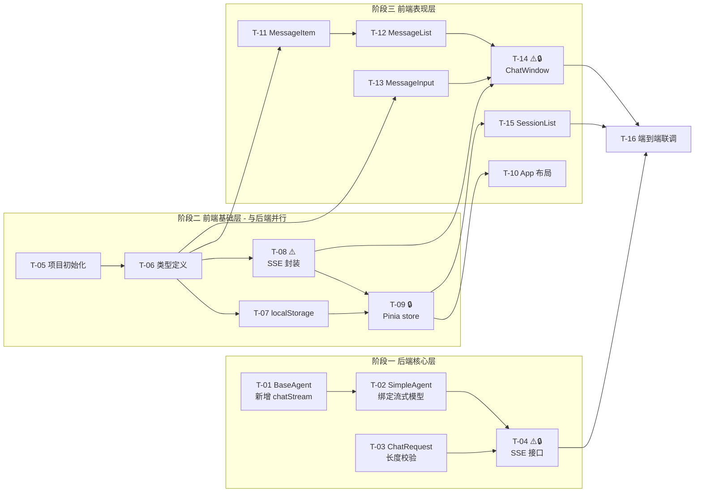

# 前端对话模块 开发任务计划文档

> **版本**：v1.0 | **基线日期**：2026-07-20 | **状态**：已确认
> **关联需求**：[前端对话模块.md](./前端对话模块.md)
> **关联设计**：[前端对话模块_技术方案.md](./前端对话模块_技术方案.md)
> **规划者**：技术主管 | **执行方式**：TDD 循环（RED-GREEN-REFACTOR）

---

## 1. 任务概览

### 1.1 总体信息

| 指标 | 值 |
|------|---|
| 任务总数 | 16 |
| 阶段数 | 4（后端核心层 / 前端基础层 / 前端表现层 / 集成验收） |
| 预计总工时 | 420 分钟（约 7 小时） |
| Mock 阶段 | 无（后端改动小可先行，前端直接联调） |
| 阻塞任务（🔒） | 3 个（T-04、T-09、T-14） |
| 风险任务（⚠️） | 3 个（T-04、T-08、T-14） |

### 1.2 依赖关系图

### 1.3 并行任务组

| 并行组 | 任务 | 说明 |
|--------|------|------|
| **并行组 A** | 阶段一全部 ↔ 阶段二全部 | 后端与前端基础层完全独立，可两人并行 |
| **并行组 B** | T-07 ↔ T-08 | 同依赖 T-06，互不冲突 |
| **并行组 C** | T-11 ↔ T-13 | 同依赖 T-06，互不冲突 |

### 1.4 关键路径

`T-05 → T-06 → T-08 → T-14 → T-16`（前端 SSE 封装到 ChatWindow 再到联调，为最长依赖链）

---

## 2. 阶段一：后端核心层 ✅ 已完成（2026-07-20，T-01~T-04，11 个测试全通过）

> 改动小、阻塞前端联调，建议优先完成。遵循 TC-AI-020：每个任务完成后执行 `mvn compile -pl {模块} -am` 编译验证。
> **完成报告**：[docs/开发记录/前端对话模块_阶段1_完成报告.md](../../docs/开发记录/前端对话模块_阶段1_完成报告.md)

### T-01：BaseAgent 接口新增 chatStream 流式方法

| 项 | 内容 |
|----|------|
| **通俗解释** | 让 Agent 具备"边想边说"的能力，不再等全部想完才一次性回复 |
| **依赖** | 无 |
| **关联 AC** | AC-002 |
| **技术方案章节** | 3.1.1 |
| **工时** | 15 分钟 |

**验证标准**：
1. `BaseAgent` 接口包含 `TokenStream chatStream(@MemoryId String sessionId, @UserMessage String message)` 方法
2. 接口编译通过（`mvn compile -pl agent-demo-agent -am`）
3. Javadoc 包含调用方枚举说明（web 层 AgentController 的 SSE 接口）

---

### T-02：SimpleAgent 绑定 streamingChatModel

| 项 | 内容 |
|----|------|
| **通俗解释** | 给 Agent 接上"流式大脑"，让它能逐字输出回复 |
| **依赖** | T-01 |
| **关联 AC** | AC-002 |
| **技术方案章节** | 3.1.2 |
| **工时** | 15 分钟 |

**验证标准**：
1. `SimpleAgent.getDelegate()` 中 `AiServices.builder()` 同时配置 `.chatModel(...)` 和 `.streamingChatModel(modelFactory.getDefaultStreamingChatModel())`
2. 调用 `agent.chatStream("test-session", "你好")` 返回非 null 的 `TokenStream` 对象
3. 调用 `TokenStream.start()` 后能触发 `onPartialResponse` 回调（可通过 mock 验证回调被调用）
4. 编译通过且不破坏现有 `chat()` 同步方法

---

### T-03：ChatRequest 新增消息长度校验

| 项 | 内容 |
|----|------|
| **通俗解释** | 防止用户发送超长消息导致系统卡顿或 Token 浪费 |
| **依赖** | 无 |
| **关联 AC** | AC-015 |
| **技术方案章节** | 3.2.3 |
| **工时** | 10 分钟 |

**验证标准**：
1. `ChatRequest.message` 字段标注 `@Size(max = 4000, message = "消息长度不能超过 4000 字符")`
2. 传入 4001 字符的 message，`@Valid` 校验失败返回 400 + 错误信息"消息长度不能超过 4000 字符"
3. 传入正好 4000 字符的 message，校验通过
4. 传入空字符串仍由 `@NotBlank` 拦截（两者共存）

---

### T-04 ⚠️🔒：AgentController 新增 SSE 流式对话接口

| 项 | 内容 |
|----|------|
| **通俗解释** | 提供一个"流式对话"接口，让前端能逐字接收大模型回复 |
| **依赖** | T-02、T-03 |
| **关联 AC** | AC-002、AC-003、AC-010、AC-013 |
| **技术方案章节** | 3.2.1、3.2.2、3.3、3.4 |
| **工时** | 45 分钟 |
| **风险说明** | SSE 异常处理复杂：流式过程异常无法走 GlobalExceptionHandler，需在接口内部完整捕获并通过 error 事件通知前端；TokenStream 回调时序需仔细处理 |

**验证标准**：
1. `POST /api/agent/chat/stream` 返回 `Content-Type: text/event-stream`
2. 传入空 sessionId，后端新建会话，首事件为 `event: session\ndata: <新sessionId>`
3. 传入后端不存在的 sessionId（模拟超时），同样新建并发 `session` 事件（AC-010 透明续聊）
4. 流式过程每收到 token，发送 `event: token\ndata: <文本片段>`
5. 流式完成后发送 `event: done\ndata: <耗时ms>`，且 `ChatMemoryManager` 中该 sessionId 存在对应的 AiMessage 助手回复（AC-003 写入记忆）
6. 流式过程 LLM 异常时发送 `event: error\ndata: <错误提示>`，emitter 正常 complete（AC-013）
7. 客户端断开连接时捕获 `IOException`，日志 WARN，不抛异常
8. 消息为空时返回 400（由 GlobalExceptionHandler 拦截，AC-014）
9. 消息超 4000 字符返回 400（AC-015）
10. 接口添加 `@Operation` OpenAPI 注解

---

## 3. 阶段二：前端基础层 ✅ 已完成（2026-07-20，T-05~T-09，28 个测试全通过）

> 可与阶段一完全并行。前端工程从零搭建。
> **完成报告**：[docs/开发记录/前端对话模块_阶段2_完成报告.md](../../docs/开发记录/前端对话模块_阶段2_完成报告.md)

### T-05：前端项目初始化

| 项 | 内容 |
|----|------|
| **通俗解释** | 搭好前端工程的"地基"，让后续页面有地方写 |
| **依赖** | 无 |
| **关联 AC** | 无（基础设施） |
| **技术方案章节** | 4.1、4.9 |
| **工时** | 20 分钟 |

**验证标准**：
1. `agent-demo-frontend/` 目录创建，包含 `package.json`、`vite.config.ts`、`tsconfig.json`、`index.html`
2. 依赖：vue@3.4+、vite@5+、typescript@5+、pinia@2+、`@vitejs/plugin-vue`
3. `npm run dev` 能在 `localhost:5173` 启动，浏览器显示默认页面
4. `vite.config.ts` 配置 `/api` 代理到 `http://localhost:8080`（changeOrigin: true）
5. `npm run build` 能成功构建到 `dist/`
6. TypeScript 严格模式开启（`tsconfig.json` 中 `strict: true`）

---

### T-06：前端类型定义

| 项 | 内容 |
|----|------|
| **通俗解释** | 定义好"消息"和"会话"的数据格式，让代码有统一规范 |
| **依赖** | T-05 |
| **关联 AC** | AC-016、AC-019 |
| **技术方案章节** | 4.2 |
| **工时** | 15 分钟 |

**验证标准**：
1. `src/types/index.ts` 导出 `MessageRole`、`MessageStatus`、`Message`、`SessionRecord`、`StreamCallbacks` 类型
2. `Message` 包含 `id`、`role`、`content`、`createdAt`、`status` 字段
3. `SessionRecord` 包含 `sessionId`、`title`、`createdAt`、`updatedAt`、`messages` 字段
4. `StreamCallbacks` 包含 `onSession`、`onToken`、`onDone`、`onError` 回调签名
5. `vue-tsc --noEmit` 类型检查通过

---

### T-07：localStorage 封装

| 项 | 内容 |
|----|------|
| **通俗解释** | 实现"会话记录自动保存到浏览器"的能力，关闭页面也不丢失 |
| **依赖** | T-06 |
| **关联 AC** | AC-016、AC-019 |
| **技术方案章节** | 4.3 |
| **工时** | 25 分钟 |

**验证标准**：
1. `loadSessions()` 从 `localStorage` 读取 key `agent-demo:sessions`，返回按 `updatedAt` 倒序的数组；无数据返回空数组
2. `saveSessions()` 传入 51 个会话，存储后 `loadSessions()` 返回 50 个，且最旧（updatedAt 最小）的被淘汰（AC-016）
3. `upsertSession()` 新会话插入到数组头部；已存在 sessionId 则更新
4. `deleteSession()` 删除指定 sessionId，返回剩余列表
5. `clearAllSessions()` 清空 key，`loadSessions()` 返回空数组
6. localStorage 写入失败（如容量超限）时捕获异常并返回 false，不抛出

---

### T-08 ⚠️：SSE 流式调用封装

| 项 | 内容 |
|----|------|
| **通俗解释** | 实现"调用后端接口逐字接收回复"的核心通信能力 |
| **依赖** | T-06 |
| **关联 AC** | AC-002、AC-011、AC-012、AC-013、AC-020 |
| **技术方案章节** | 4.4 |
| **工时** | 40 分钟 |
| **风险说明** | 需用 fetch + ReadableStream 手动解析 SSE 协议（EventSource 不支持 POST）；流式边界的半行处理、事件/数据配对需仔细处理 |

**验证标准**：
1. `streamChat(sessionId, message, callbacks, signal)` 发起 POST 到 `/api/agent/chat/stream`
2. 收到 `event: session` 时调用 `callbacks.onSession(data)`
3. 收到 `event: token` 时调用 `callbacks.onToken(data)`（AC-020 逐字）
4. 收到 `event: done` 时调用 `callbacks.onDone(Number(data))`
5. 收到 `event: error` 时调用 `callbacks.onError(data)`（AC-013）
6. 调用 `AbortController.abort()` 后 fetch 中断，不再触发回调（AC-011 停止生成）
7. 网络中断（非主动 abort）时 `callbacks.onError('网络中断，回复不完整')`（AC-012）
8. 后端返回非 200 状态码时 `callbacks.onError('服务暂时不可用，请稍后重试')`（AC-013）
9. SSE 半行缓冲正确：跨 chunk 的事件能正确拼接解析

---

### T-09 🔒：Pinia 会话状态管理

| 项 | 内容 |
|----|------|
| **通俗解释** | 管理"所有会话的当前状态"，让各组件共享同一份数据 |
| **依赖** | T-07、T-08 |
| **关联 AC** | AC-001、AC-006、AC-010、AC-018 |
| **技术方案章节** | 4.8 |
| **工时** | 35 分钟 |
| **阻塞说明** | 表现层所有组件依赖此 store，必须先完成 |

**验证标准**：
1. `init()` 从 localStorage 加载会话列表；无会话时自动 `createNewSession()`（AC-001）
2. `createNewSession()` 创建空会话（sessionId 为临时值），插入列表头部
3. `switchTo(sessionId)` 设置 `currentSessionId`（AC-005 切换）
4. `updateSessionId(oldId, newId)` 透明续聊：更新会话的 sessionId 关联，本地历史连续（AC-010）
5. `generateTitle(sessionId, firstMessage)` 生成标题：前 20 字符 + 超出省略号（AC-006）
6. `renameSession(sessionId, newTitle)` 重命名，标题限 50 字符（AC-007）
7. `deleteSession(sessionId)` 删除并持久化（AC-008）
8. `clearAll()` 清空并持久化（AC-009）
9. `addMessage`/`appendContent`/`markComplete`/`markError`/`touchSession` 方法正常工作
10. 所有变更操作同步写入 localStorage（AC-019 持久化）
11. `sessions` 默认按 `updatedAt` 倒序（AC-018）

---

## 4. 阶段三：前端表现层 ✅ 已完成（2026-07-20，T-10~T-15，35 个测试全通过）

> **UI 设计要求**：本阶段所有组件开发须注重 UI 设计质量。实现时可调用 `frontend-design` 技能获取设计指导。设计原则：视觉层次清晰、交互反馈即时、符合主流 AI 对话产品（如 ChatGPT）交互习惯、桌面端优先。
> **美学方向**：Refined Dark Tech（精致暗色科技风）- DFII 评分 15
> **完成报告**：[docs/开发记录/前端对话模块_阶段3_完成报告.md](../../docs/开发记录/前端对话模块_阶段3_完成报告.md)

### T-10：App.vue 左右分栏布局

| 项 | 内容 |
|----|------|
| **通俗解释** | 搭出"左边会话列表、右边对话框"的整体页面框架 |
| **依赖** | T-09 |
| **关联 AC** | AC-001 |
| **技术方案章节** | 4.5.1 |
| **工时** | 20 分钟 |
| **UI 要求** | 左侧栏宽 280px、右侧自适应；整体占满视口高度；配色简洁专业；可调用 `frontend-design` 技能 |

**验证标准**：
1. 页面分为左侧 280px 会话列表区 + 右侧自适应对话框区
2. 整体占满视口（`height: 100vh`），无滚动条溢出
3. 无会话时左侧显示引导提示"暂无会话，点击上方新建"
4. 调用 `sessionStore.init()` 初始化状态
5. 响应式：窗口缩放时布局不错位（最小宽度 768px）

---

### T-11：MessageItem.vue 单条消息组件

| 项 | 内容 |
|----|------|
| **通俗解释** | 实现"一条消息的展示"，区分用户和助手，支持逐字显示 |
| **依赖** | T-06 |
| **关联 AC** | AC-012、AC-020 |
| **技术方案章节** | 4.5.5 |
| **工时** | 25 分钟 |
| **UI 要求** | 用户消息右对齐、助手消息左对齐 + 头像区分；消息气泡圆角；`status: incomplete` 显示"回复不完整"灰色标记；`status: error` 显示红色错误提示；支持基础 Markdown（代码块、加粗、列表）；可调用 `frontend-design` 技能 |

**验证标准**：
1. `role: 'user'` 消息右对齐，背景色区分（如浅蓝）
2. `role: 'assistant'` 消息左对齐，显示助手头像
3. `content` 变化时 DOM 实时更新（支持流式追加，AC-020）
4. `status: 'incomplete'` 时消息底部显示"回复不完整"标记（AC-012）
5. `status: 'error'` 时显示错误提示样式（AC-013）
6. 代码块正确渲染（等宽字体 + 背景色）
7. 超长内容自动换行，不撑破布局

---

### T-12：MessageList.vue 消息列表组件

| 项 | 内容 |
|----|------|
| **通俗解释** | 把所有消息按顺序排列展示，新消息自动滚到底部 |
| **依赖** | T-11 |
| **关联 AC** | AC-005、AC-020 |
| **技术方案章节** | 4.5.4（部分） |
| **工时** | 15 分钟 |

**验证标准**：
1. 消息按 `createdAt` 正序展示
2. 流式追加新内容时，列表自动滚动到底部（AC-020）
3. 空会话（无消息）显示欢迎语"开始新的对话吧"
4. 切换会话时加载对应消息列表（AC-005）

---

### T-13：MessageInput.vue 输入框组件

| 项 | 内容 |
|----|------|
| **通俗解释** | 实现"输入消息并发送"的交互，流式时切换为"停止"按钮 |
| **依赖** | T-06 |
| **关联 AC** | AC-011、AC-014、AC-015、AC-017 |
| **技术方案章节** | 4.5.4（部分） |
| **工时** | 25 分钟 |
| **UI 要求** | textarea 自适应高度；字符计数显示（如 123/4000）；发送按钮主色调；停止按钮醒目（红色/橙色）；`Ctrl/Cmd+Enter` 快捷发送提示；可调用 `frontend-design` 技能 |

**验证标准**：
1. 输入框为空或仅空白字符时，发送按钮禁用或不触发发送（AC-014）
2. 输入超 4000 字符时显示"消息长度不能超过 4000 字符"，禁止发送（AC-015）
3. 字符计数实时显示（当前长度/4000）
4. `isStreaming: true` 时输入框禁用，发送按钮变为"停止生成"按钮（AC-011、AC-017）
5. 点击"停止生成"触发 `stop` 事件
6. `Ctrl/Cmd + Enter` 触发发送
7. 发送后清空输入框（流式开始后）

---

### T-14 ⚠️🔒：ChatWindow.vue 对话框容器

| 项 | 内容 |
|----|------|
| **通俗解释** | 组合消息列表和输入框，实现"发消息-收流式回复"的完整流程 |
| **依赖** | T-08、T-12、T-13 |
| **关联 AC** | AC-002、AC-003、AC-010、AC-011、AC-012、AC-013 |
| **技术方案章节** | 4.5.3、4.6、4.7 |
| **工时** | 45 分钟 |
| **风险说明** | 状态管理复杂：需协调流式回调、AbortController、透明续聊 sessionId 更新、乐观更新与回滚 |
| **阻塞说明** | 阻塞 T-16 联调 |
| **UI 要求** | 消息区与输入区过渡自然；流式时视觉反馈（如打字光标）；可调用 `frontend-design` 技能 |

**验证标准**：
1. 用户发送消息后，先乐观添加用户消息到列表，再创建助手消息占位（content 为空，status: incomplete）
2. 调用 `streamChat`，`onToken` 回调逐字追加到助手消息（AC-002、AC-020）
3. `onSession` 回调收到新 sessionId 时，调用 `store.updateSessionId()` 透明续聊（AC-010）
4. `onDone` 回调标记消息 complete，存入 localStorage，更新会话 updatedAt（AC-003）
5. 首条消息完成后调用 `store.generateTitle()` 生成标题（AC-006）
6. `onError` 回调标记消息 error，显示错误提示，已接收内容保留（AC-012、AC-013）
7. 点击"停止生成"调用 `AbortController.abort()`，已接收内容保留并标记 incomplete（AC-011）
8. 流式过程中 `isStreaming: true`，输入框禁用（AC-017）
9. 切换会话时加载该会话历史消息（AC-005）

---

### T-15：SessionList.vue 会话列表组件

| 项 | 内容 |
|----|------|
| **通俗解释** | 展示所有历史会话，支持切换、删除、重命名、清空 |
| **依赖** | T-09 |
| **关联 AC** | AC-005、AC-006、AC-007、AC-008、AC-009、AC-018 |
| **技术方案章节** | 4.5.2 |
| **工时** | 35 分钟 |
| **UI 要求** | 顶部"新建会话"按钮醒目；会话项 hover 显示操作按钮；当前选中会话高亮；标题超长省略号；重命名弹窗简洁；删除/清空二次确认对话框；空状态引导；可调用 `frontend-design` 技能 |

**验证标准**：
1. 会话按 `updatedAt` 倒序展示（AC-018）
2. 标题超 20 字符显示省略号（AC-006）
3. 当前选中会话高亮显示
4. 点击会话项触发切换（AC-005）
5. "新建会话"按钮触发 `store.createNewSession()`
6. 重命名：点击后弹出输入框，限 50 字符，确认后更新（AC-007）
7. 删除：点击后二次确认对话框，确认后删除（AC-008）
8. "清空全部"：二次确认后 `store.clearAll()`（AC-009）
9. 空列表显示"暂无会话"引导

---

## 5. 阶段四：集成验收 ✅ 已完成（2026-07-21，T-16 端到端联调通过）

> **完成报告**：[docs/开发记录/前端对话模块_阶段4_T16联调报告.md](../../docs/开发记录/前端对话模块_阶段4_T16联调报告.md)

### T-16：端到端联调

| 项 | 内容 |
|----|------|
| **通俗解释** | 前后端打通，验证完整对话流程，确保所有功能协同正常 |
| **依赖** | T-04、T-14、T-15 |
| **关联 AC** | AC-001 ~ AC-020 整体验收 |
| **技术方案章节** | 全文 |
| **工时** | 30 分钟 |

**验证标准**：
1. **AC-001**：打开页面（无历史），左侧空 + 引导提示，右侧空会话输入框聚焦
2. **AC-002**：输入"你好"发送，右侧逐字显示回复，输入框禁用 + 停止按钮
3. **AC-003**：流式完成后，左侧出现新会话项，标题为"你好"（首条消息）
4. **AC-004**：同一会话再发"1+1="，回复基于上下文
5. **AC-005**：切换到另一会话，加载其历史消息
6. **AC-006**：会话标题为首条消息前 20 字符
7. **AC-007**：重命名会话标题，刷新后保持
8. **AC-008**：删除当前会话，右侧切换到新空会话
9. **AC-009**：清空全部，左侧空 + 引导
10. **AC-010**：等待 30 分钟后（或手动清除后端会话）继续对话，回复正常显示，历史连续
11. **AC-011**：流式中点击"停止生成"，已接收内容保留
12. **AC-012**：模拟断网（DevTools offline），流式中断显示"回复不完整"
13. **AC-013**：关闭后端服务，发送消息显示"服务暂时不可用"
14. **AC-014**：空消息不发送
15. **AC-015**：输入 4001 字符不发送 + 提示
16. **AC-016**：创建 51 个会话后，最旧的被淘汰
17. **AC-017**：流式中输入框禁用
18. **AC-018**：会话列表按最近使用倒序
19. **AC-019**：关闭浏览器重开，历史会话完整
20. **AC-020**：流式逐字显示 + 自动滚动

---

## 6. 验收标准映射总表

| AC | 任务 | 验证方式 |
|----|------|---------|
| AC-001 | T-09、T-10、T-16 | 单测 store.init + 页面验证 |
| AC-002 | T-01、T-02、T-04、T-08、T-14、T-16 | 后端 SSE 接口测试 + 前端 streamChat 测试 + 联调 |
| AC-003 | T-04、T-14、T-16 | 后端写入记忆验证 + 前端 onDone 存缓存 |
| AC-004 | T-04、T-14、T-16 | 多轮对话上下文验证 |
| AC-005 | T-09、T-12、T-15、T-16 | 切换会话加载历史 |
| AC-006 | T-09、T-14、T-15、T-16 | 标题生成验证 |
| AC-007 | T-09、T-15、T-16 | 重命名 50 字符限制 |
| AC-008 | T-07、T-09、T-15、T-16 | 删除会话 |
| AC-009 | T-07、T-09、T-15、T-16 | 清空全部 |
| AC-010 | T-04、T-08、T-09、T-14、T-16 | 透明续聊 sessionId 更新 |
| AC-011 | T-08、T-13、T-14、T-16 | AbortController 中断 |
| AC-012 | T-08、T-11、T-14、T-16 | 网络断开标记 incomplete |
| AC-013 | T-04、T-08、T-11、T-14、T-16 | 服务不可用错误提示 |
| AC-014 | T-03、T-13、T-16 | 空消息拦截 |
| AC-015 | T-03、T-13、T-16 | 超长消息拦截 |
| AC-016 | T-07、T-09、T-16 | 缓存溢出淘汰 |
| AC-017 | T-13、T-14、T-16 | 流式中禁用输入 |
| AC-018 | T-07、T-09、T-15、T-16 | 列表倒序 |
| AC-019 | T-07、T-09、T-16 | 持久化 |
| AC-020 | T-04、T-08、T-11、T-12、T-14、T-16 | 逐字显示 |

---

## 7. 验证计划

| 检查项 | 关联任务 | 关联 AC | 验证方式 | 通过标准 |
|--------|---------|---------|---------|---------|
| BaseAgent 流式方法编译 | T-01 | AC-002 | `mvn compile -pl agent-demo-agent -am` | 编译通过 |
| SimpleAgent 流式调用 | T-02 | AC-002 | 单测调用 chatStream 返回非 null TokenStream | 回调被触发 |
| ChatRequest 长度校验 | T-03 | AC-015 | 单测 4001 字符校验失败、4000 通过 | 400/200 正确 |
| SSE 接口完整流程 | T-04 | AC-002,003,010,013 | curl/Postman 调用 `/api/agent/chat/stream` | 事件序列正确 + 记忆写入 |
| 前端项目构建 | T-05 | - | `npm run build` | 构建成功 |
| 类型检查 | T-06 | AC-016,019 | `vue-tsc --noEmit` | 无类型错误 |
| localStorage 淘汰 | T-07 | AC-016,019 | 单测 saveSessions 传入 51 个 | 返回 50 个最旧淘汰 |
| SSE 解析正确性 | T-08 | AC-002,011,012,013,020 | 单测 mock SSE 流 | 事件回调正确 + abort 中断 |
| Pinia store 状态 | T-09 | AC-001,006,010,018 | 单测各 action | 状态正确 + 持久化 |
| 布局渲染 | T-10 | AC-001 | 浏览器查看 | 左右分栏 + 引导提示 |
| 消息渲染 | T-11 | AC-012,020 | 浏览器查看 | 用户/助手区分 + 逐字 + 状态标记 |
| 消息列表滚动 | T-12 | AC-005,020 | 浏览器查看 | 自动滚动到底部 |
| 输入框交互 | T-13 | AC-011,014,015,017 | 浏览器交互 | 空拦截 + 长拦截 + 停止按钮 |
| ChatWindow 完整流程 | T-14 | AC-002,003,010,011,012,013 | 浏览器端到端 | 发送-流式-存储-中断-续聊 |
| 会话列表管理 | T-15 | AC-005~009,018 | 浏览器交互 | 切换/删除/重命名/清空 |
| 端到端全量验收 | T-16 | AC-001~020 | 逐条手动验证 20 条 AC | 全部通过 |

---

## 8. 工时汇总

| 阶段 | 任务 | 工时（分钟） | 小计 |
|------|------|------------|------|
| 一、后端核心层 | T-01~T-04 | 15+15+10+45 | 85 |
| 二、前端基础层 | T-05~T-09 | 20+15+25+40+35 | 135 |
| 三、前端表现层 | T-10~T-15 | 20+25+15+25+45+35 | 165 |
| 四、集成验收 | T-16 | 30 | 30 |
| **合计** | **16 个任务** | | **415 分钟（约 7 小时）** |

**并行优化预期**：若阶段一、二由两人并行，关键路径约为 `T-05→T-06→T-08→T-14→T-16` = 20+15+40+45+30 = 150 分钟。

---

## 9. 风险任务说明

### ⚠️ T-04：SSE 流式对话接口

- **风险点**：流式过程异常无法走 GlobalExceptionHandler，需在接口内部完整捕获；TokenStream 回调时序（onPartialResponse → onCompleteResponse → onError）需确保 onComplete 写入记忆后才 complete
- **建议**：优先编写异常路径测试用例（LLM 异常、客户端断开），再写正常流程
- **参考**：LangChain4j TokenStream 文档，注意 `start()` 是异步的

### ⚠️ T-08：SSE 流式调用封装

- **风险点**：fetch + ReadableStream 手动解析 SSE 协议，跨 chunk 的事件拼接是常见 bug 源
- **建议**：用固定的 SSE 测试数据（含跨 chunk 边界）验证解析器；先写解析函数单测，再集成

### ⚠️ T-14：ChatWindow 对话框容器

- **风险点**：状态管理复杂，需协调乐观更新、流式回调、AbortController、透明续聊
- **建议**：先画状态机图理清 isStreaming 各状态转换；透明续聊的 sessionId 更新需在 onSession 回调中第一时间处理，避免后续 token 写入错误会话

---

## 10. 执行注意事项

1. **TDD 循环**：每个任务按 RED（写测试）→ GREEN（写实现）→ REFACTOR（重构）执行，测试用例直接从「验证标准」转化
2. **后端编译验证**：每个后端任务完成后执行 `mvn compile -pl {模块} -am`（TC-AI-020）
3. **UI 设计**：阶段三表现层组件开发时，可调用 `frontend-design` 技能获取设计指导，确保视觉质量
4. **接口变更评估**：T-01 修改 BaseAgent 接口，已在技术方案 3.1.3 节完成全链路影响评估
5. **并行开发协调**：若前后端并行，前端在 T-08 阶段可用 mock SSE 数据先行，T-04 完成后联调（本规划未强制 Mock，按需选择）
6. **提交规范**：每个任务完成后按 Conventional Commits 提交，body 用中文描述业务背景

---

**文档维护**：
- 本文档为开发执行计划，任务状态变更时同步更新
- 每个任务完成后标注实际工时，用于后续估算校准
- 如遇设计调整，需同步更新技术方案文档与本任务规划
