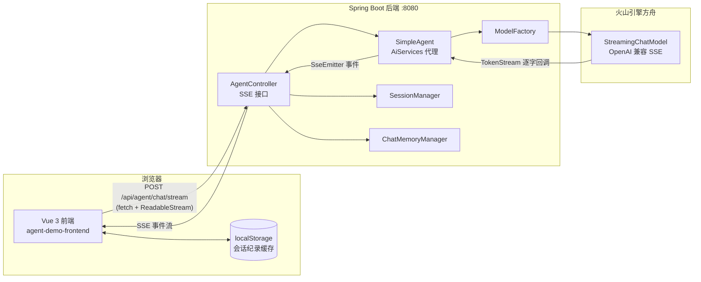
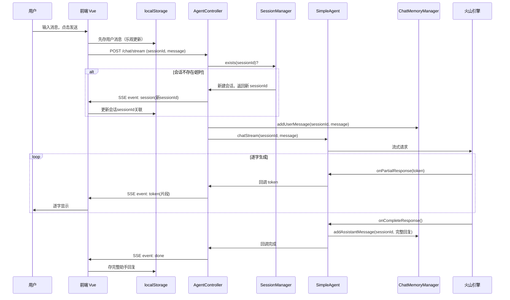

# 前端对话模块 技术方案文档

> **版本**：v1.0 | **基线日期**：2026-07-20 | **状态**：待评审
> **关联需求**：[前端对话模块.md](./前端对话模块.md)
> **设计者**：系统架构师 | **适用范围**：agent-demo 前后端

---

## 1. 设计概述

### 1.1 设计目标

基于《前端对话模块 功能需求说明书》的 20 条验收标准（AC-001 ~ AC-020），设计可落地的端到端技术方案，覆盖：
- 后端 SSE 流式对话接口新增（基于现有 ModelFactory 流式能力）
- 前端模块新建（Vue 3 + Vite + TypeScript）
- 浏览器本地缓存会话纪录
- 透明续聊机制实现

### 1.2 技术栈确认

| 层级 | 技术选型 | 版本 | 说明 |
|------|---------|------|------|
| 前端框架 | Vue 3 | 3.4+ | Composition API + `<script setup>` |
| 构建工具 | Vite | 5+ | HMR 热更新，开发体验好 |
| 前端语言 | TypeScript | 5+ | 类型安全 |
| 状态管理 | Pinia | 2+ | Vue 3 官方推荐 |
| 后端 SSE | SseEmitter | Spring MVC 内置 | 与现有 Web 层集成自然 |
| 流式模型 | OpenAiStreamingChatModel | LangChain4j 1.17.2 | ModelFactory 已具备 |
| 本地缓存 | localStorage | 浏览器原生 | 无需额外依赖 |

### 1.3 调研结论（关键复用点）

| 已有能力 | 复用方式 | 约束编号 |
|---------|---------|---------|
| `ModelFactory.getDefaultStreamingChatModel()` | SimpleAgent 绑定 streamingChatModel | TC-LC4J-007 |
| `spring-boot-starter-webflux` 依赖 | 已在 web 模块 pom（本方案用 SseEmitter，不直接用 Flux） | - |
| Tomcat `connection-timeout: 300000` | SSE 长连接 5 分钟超时 | application.yml |
| `WebConfig` CORS 配置 `/api/**` | 前端跨域调用（开发期用 Vite 代理规避） | BR-WEB-002 |
| `SessionManager.createSession()` | 透明续聊时新建会话 | BR-MEM-005 |
| `ChatMemoryManager.addUserMessage/addAssistantMessage` | 流式完成后写入记忆 | - |

---

## 2. 架构设计

### 2.1 整体架构



### 2.2 数据流向



### 2.3 模块改动范围

| 模块 | 改动类型 | 说明 |
|------|---------|------|
| `agent-demo-agent` | **修改** | BaseAgent 接口新增流式方法；SimpleAgent 绑定 streamingChatModel |
| `agent-demo-web` | **修改** | AgentController 新增 SSE 接口 |
| `agent-demo-frontend` | **新建** | Vue 3 前端模块（独立目录） |

> 后端改动遵循 TC-AI-010：接口签名变更已枚举所有调用方（见 3.1.3 节）。

---

## 3. 后端详细设计

### 3.1 BaseAgent 接口扩展

#### 3.1.1 接口变更

在 `BaseAgent` 接口新增流式方法，返回 LangChain4j 的 `TokenStream`：

```java
package com.agentdemo.agent.core;

import dev.langchain4j.service.MemoryId;
import dev.langchain4j.service.TokenStream;
import dev.langchain4j.service.UserMessage;

public interface BaseAgent {

    /**
     * 同步对话
     * 业务含义：Agent 接收用户消息，经过 ReAct 循环后返回完整回复
     *
     * @param sessionId 会话 ID（@MemoryId 让 LangChain4j 自动关联会话记忆）
     * @param message   用户消息
     * @return Agent 回复内容
     */
    String chat(@MemoryId String sessionId, @UserMessage String message);

    /**
     * 流式对话
     * 业务含义：Agent 接收用户消息，流式返回生成内容（逐字推送）。
     * LangChain4j AiServices 根据 StreamingChatModel 自动实现，返回 TokenStream 供调用方注册回调。
     *
     * 调用方：web 层 AgentController 的 SSE 接口
     *
     * @param sessionId 会话 ID
     * @param message   用户消息
     * @return TokenStream 流式令牌（需调用 start() 启动）
     */
    TokenStream chatStream(@MemoryId String sessionId, @UserMessage String message);
}
```

#### 3.1.2 SimpleAgent 流式实现

LangChain4j AiServices 支持同一接口混合同步与流式方法：返回 `String` 的方法使用 `chatModel`，返回 `TokenStream` 的方法使用 `streamingChatModel`。构建时同时配置两者：

```java
// SimpleAgent.getDelegate() 中修改 AiServices 构建
delegate = AiServices.builder(BaseAgent.class)
        .chatModel(modelFactory.getDefaultChatModel())                    // 同步对话
        .streamingChatModel(modelFactory.getDefaultStreamingChatModel())  // 流式对话（新增）
        .chatMemoryProvider(memoryId -> memoryManager.getMemory((String) memoryId))
        .tools(toolRegistry.listTools().toArray())
        .systemMessageProvider(memoryId -> agentConfig.getDefaultSystemPrompt())
        .build();
```

> SimpleAgent 不需要新增 `chatStream` 方法体，AiServices 动态代理会自动实现接口方法。

#### 3.1.3 接口变更全链路影响评估（TC-AI-010 / TC-AI-013）

| 调用方 | 影响评估 | 处理方式 |
|--------|---------|---------|
| `AgentController.chat()` | 仅用同步方法，不受影响 | 无需改动 |
| `AgentController.chatStream()`（新增） | 新增 SSE 接口调用流式方法 | 本方案新增 |
| app 层 `SceneService`（规划中） | 暂无实现，无影响 | 未来扩展时按需调用 |
| 实现类 `SimpleAgent` | AiServices 代理自动实现，无需手写 | 仅改 getDelegate() 构建 |

---

### 3.2 AgentController SSE 接口

#### 3.2.1 接口定义

| 项目 | 值 |
|------|---|
| 路径 | `POST /api/agent/chat/stream` |
| Content-Type | `application/json`（请求）|
| Accept | `text/event-stream`（响应）|
| 响应类型 | `SseEmitter` |
| 超时 | 300000ms（与 Tomcat connection-timeout 一致）|

#### 3.2.2 核心实现

```java
/**
 * 流式对话
 * 业务含义：接收用户消息，流式返回大模型生成内容（SSE 逐字推送）。
 * 透明续聊：sessionId 无效时自动新建会话，通过 session 事件通知前端更新关联。
 *
 * SSE 事件协议：
 * - session: 携带 sessionId（首次或会话超时新建时发送）
 * - token: 携带文本片段（逐字输出）
 * - done: 流式完成
 * - error: 错误信息
 *
 * @param request 对话请求
 * @return SseEmitter 流式响应
 */
@Operation(summary = "流式对话", description = "发送消息给 Agent，流式返回生成内容")
@PostMapping(value = "/chat/stream", produces = MediaType.TEXT_EVENT_STREAM_VALUE)
public SseEmitter chatStream(@Valid @RequestBody ChatRequest request) {
    // SSE 超时与 Tomcat connection-timeout 对齐
    SseEmitter emitter = new SseEmitter(300_000L);

    // 会话管理：sessionId 为空或不存在则新建（BR-MEM-005、BR-WEB-008）
    String sessionId = request.getSessionId();
    if (sessionId == null || sessionId.isEmpty() || !sessionManager.exists(sessionId)) {
        sessionId = sessionManager.createSession();
        // 通知前端会话 ID（支持透明续聊：前端据此更新本地会话关联）
        sendEvent(emitter, "session", sessionId);
    }

    // 记录用户消息到记忆
    memoryManager.addUserMessage(sessionId, request.getMessage());

    // 累积完整回复，流式完成后写入记忆（供后续多轮上下文使用）
    StringBuilder fullResponse = new StringBuilder();
    long start = System.currentTimeMillis();

    // 流式调用 Agent，注册回调
    agent.chatStream(sessionId, request.getMessage())
            .onPartialResponse(token -> {
                sendEvent(emitter, "token", token);
                fullResponse.append(token);
            })
            .onCompleteResponse(response -> {
                // 业务含义：流式完成后，将完整助手回复写入记忆，保证下一轮对话有上下文
                memoryManager.addAssistantMessage(sessionId, fullResponse.toString());
                long duration = System.currentTimeMillis() - start;
                sendEvent(emitter, "done", duration);
                emitter.complete();
            })
            .onError(error -> {
                // 业务含义：流式过程中的异常无法走 GlobalExceptionHandler（响应已开始），
                // 通过 SSE error 事件通知前端
                log.error("流式对话异常: sessionId={}", sessionId, error);
                sendEvent(emitter, "error", "生成回复时发生错误，请重试");
                emitter.complete();
            })
            .start();

    return emitter;
}

/**
 * 发送 SSE 事件（统一异常处理，避免 IOException 中断）
 */
private void sendEvent(SseEmitter emitter, String eventName, Object data) {
    try {
        emitter.send(SseEmitter.event().name(eventName).data(data));
    } catch (IOException e) {
        log.warn("SSE 发送失败（客户端可能已断开）: event={}", eventName);
    }
}
```

#### 3.2.3 ChatRequest 长度校验补充

AC-015 要求单条消息上限 4000 字符。当前 `ChatRequest.message` 仅有 `@NotBlank`，新增 `@Size`：

```java
@NotBlank(message = "消息内容不能为空")
@Size(max = 4000, message = "消息长度不能超过 4000 字符")
private String message;
```

> 后端校验作为兜底，前端输入框也做长度限制（见 4.5 节）。校验失败由现有 `GlobalExceptionHandler.handleValidation` 处理，返回 PARAM_INVALID(400)。但注意：SSE 接口的参数校验在响应体写入前发生，仍可被 GlobalExceptionHandler 正常拦截。

---

### 3.3 SSE 事件协议

| 事件名 | data 类型 | 触发时机 | 前端处理 |
|--------|----------|---------|---------|
| `session` | String（sessionId） | 首次对话或后端会话超时新建时 | 更新本地会话的 sessionId 关联（透明续聊） |
| `token` | String（文本片段） | 大模型每生成一段文本 | 追加到当前助手消息，逐字显示 |
| `done` | long（耗时 ms） | 流式正常完成 | 标记消息完成，存入本地缓存 |
| `error` | String（错误提示） | 流式过程异常 | 显示错误提示，保留已接收内容 |

SSE 数据格式示例：
```
event: session
data: a1b2c3d4e5f6

event: token
data: 你

event: token
data: 好

event: done
data: 2340
```

---

### 3.4 异常处理设计

| 异常场景 | 处理方式 | 对应 AC |
|---------|---------|---------|
| sessionId 无效/超时 | 自动新建会话，发 `session` 事件 | AC-010 |
| 流式过程 LLM 异常 | 发 `error` 事件，emitter.complete() | AC-013 |
| 客户端主动断开 | `IOException` 捕获，日志 WARN，不重试 | AC-011 |
| 参数校验失败（空消息/超长） | GlobalExceptionHandler 返回 400（响应未开始，可正常拦截） | AC-014、AC-015 |
| API Key 无效 | 流式启动即失败，发 `error` 事件 | AC-013 |

> 关键约束：SSE 流式响应一旦开始写入（首字节已发送），后续异常**无法**走 `@RestControllerAdvice`。因此 `chatStream` 方法内部必须完整捕获异常并通过 `error` 事件通知前端。仅参数校验异常（响应未开始）可被 GlobalExceptionHandler 拦截。

---

## 4. 前端详细设计

### 4.1 目录结构

```
agent-demo-frontend/
├── index.html
├── package.json
├── vite.config.ts            # Vite 配置（含 /api 代理）
├── tsconfig.json
├── env.d.ts
└── src/
    ├── main.ts               # 应用入口
    ├── App.vue               # 根组件（左右分栏布局）
    ├── api/
    │   └── chat.ts           # SSE 流式调用封装（fetch + ReadableStream）
    ├── stores/
    │   └── session.ts        # Pinia 会话状态管理
    ├── utils/
    │   ├── storage.ts        # localStorage 读写封装
    │   └── sse.ts            # SSE 流解析工具
    ├── components/
    │   ├── SessionList.vue   # 左侧会话列表
    │   ├── ChatWindow.vue    # 右侧对话框容器
    │   ├── MessageList.vue   # 消息列表展示
    │   ├── MessageItem.vue   # 单条消息（支持逐字渲染）
    │   └── MessageInput.vue  # 输入框 + 发送/停止按钮
    └── types/
        └── index.ts          # 类型定义
```

### 4.2 类型定义（src/types/index.ts）

```typescript
/** 消息角色 */
type MessageRole = 'user' | 'assistant';

/** 消息状态 */
type MessageStatus = 'complete' | 'incomplete' | 'error';

/** 单条消息 */
interface Message {
  id: string;                 // 消息唯一 ID（前端 UUID 生成）
  role: MessageRole;
  content: string;
  createdAt: number;          // 时间戳
  status: MessageStatus;      // AC-012: 网络中断标记 incomplete
}

/** 会话纪录（localStorage 存储单元） */
interface SessionRecord {
  sessionId: string;          // 后端会话 ID（透明续聊时可能变化）
  title: string;              // 会话标题（首条消息前 20 字符）
  createdAt: number;
  updatedAt: number;          // 最后活跃时间（AC-018 排序依据）
  messages: Message[];
}

/** SSE 事件回调 */
interface StreamCallbacks {
  onSession: (sessionId: string) => void;   // AC-010: 透明续聊
  onToken: (token: string) => void;         // AC-020: 逐字显示
  onDone: (duration: number) => void;
  onError: (message: string) => void;
}
```

### 4.3 本地缓存数据结构

**localStorage Key**：`agent-demo:sessions`

**存储格式**：JSON 序列化的 `SessionRecord[]` 数组。

**容量管理**（AC-016）：
- 上限：50 个会话
- 淘汰策略：按 `updatedAt` 升序，超出 50 个时删除最旧的

```typescript
// src/utils/storage.ts
const STORAGE_KEY = 'agent-demo:sessions';
const MAX_SESSIONS = 50;

/** 读取全部会话（按 updatedAt 倒序） */
function loadSessions(): SessionRecord[] {
  const raw = localStorage.getItem(STORAGE_KEY);
  if (!raw) return [];
  const sessions: SessionRecord[] = JSON.parse(raw);
  return sessions.sort((a, b) => b.updatedAt - a.updatedAt);
}

/** 保存会话列表（自动淘汰超限） */
function saveSessions(sessions: SessionRecord[]): void {
  // AC-016: 按 updatedAt 倒序后截断保留前 50 个
  const sorted = sessions.sort((a, b) => b.updatedAt - a.updatedAt);
  const trimmed = sorted.slice(0, MAX_SESSIONS);
  localStorage.setItem(STORAGE_KEY, JSON.stringify(trimmed));
}

/** 新增/更新单个会话 */
function upsertSession(session: SessionRecord): SessionRecord[] {
  const sessions = loadSessions();
  const idx = sessions.findIndex(s => s.sessionId === session.sessionId);
  if (idx >= 0) {
    sessions[idx] = session;
  } else {
    sessions.unshift(session);
  }
  saveSessions(sessions);
  return loadSessions();
}

/** 删除单个会话 */
function deleteSession(sessionId: string): SessionRecord[] {
  const sessions = loadSessions().filter(s => s.sessionId !== sessionId);
  saveSessions(sessions);
  return sessions;
}

/** 清空全部会话 */
function clearAllSessions(): void {
  localStorage.removeItem(STORAGE_KEY);
}
```

### 4.4 SSE 流式接收（src/api/chat.ts）

> **关键决策**：浏览器原生 `EventSource` 仅支持 GET 请求，无法发送 POST body。因此使用 `fetch` + `ReadableStream` 手动解析 SSE 协议。配合 `AbortController` 实现"停止生成"（AC-011）。

```typescript
// src/api/chat.ts

const API_BASE = '/api/agent';

/**
 * 流式对话
 * 业务含义：调用后端 SSE 接口，逐字接收大模型回复
 *
 * @param sessionId 会话 ID（首次为空字符串）
 * @param message 用户消息
 * @param callbacks SSE 事件回调
 * @param signal AbortController.signal，用于停止生成（AC-011）
 */
async function streamChat(
  sessionId: string,
  message: string,
  callbacks: StreamCallbacks,
  signal: AbortSignal,
): Promise<void> {
  let response: Response;
  try {
    response = await fetch(`${API_BASE}/agent/chat/stream`, {
      method: 'POST',
      headers: { 'Content-Type': 'application/json' },
      body: JSON.stringify({ sessionId, message }),
      signal,
    });
  } catch (err) {
    // AC-013: 后端服务不可用 / 网络错误
    if (signal.aborted) return;
    callbacks.onError('服务暂时不可用，请稍后重试');
    return;
  }

  if (!response.ok) {
    // AC-013: 后端返回错误状态码
    callbacks.onError('服务暂时不可用，请稍后重试');
    return;
  }

  // 解析 SSE 流
  const reader = response.body!.getReader();
  const decoder = new TextDecoder();
  let buffer = '';
  let currentEvent = '';

  try {
    while (true) {
      const { done, value } = await reader.read();
      if (done) break;

      buffer += decoder.decode(value, { stream: true });
      const lines = buffer.split('\n');
      buffer = lines.pop() || ''; // 保留不完整行

      for (const line of lines) {
        if (line.startsWith('event:')) {
          currentEvent = line.slice(6).trim();
        } else if (line.startsWith('data:')) {
          const data = line.slice(5).trim();
          handleSseEvent(currentEvent, data, callbacks);
          currentEvent = '';
        }
      }
    }
  } catch (err) {
    // AC-012: 流式过程网络断开
    if (!signal.aborted) {
      callbacks.onError('网络中断，回复不完整');
    }
  }
}

function handleSseEvent(event: string, data: string, cb: StreamCallbacks): void {
  switch (event) {
    case 'session':
      cb.onSession(data);          // AC-010: 透明续聊
      break;
    case 'token':
      cb.onToken(data);            // AC-020: 逐字显示
      break;
    case 'done':
      cb.onDone(Number(data));
      break;
    case 'error':
      cb.onError(data);            // AC-012/AC-013
      break;
  }
}
```

### 4.5 组件设计

#### 4.5.1 App.vue（根组件 - 左右分栏布局）

```
┌─────────────────────────────────────────────┐
│  ┌──────────────┐  ┌──────────────────────┐ │
│  │ SessionList  │  │    ChatWindow        │ │
│  │              │  │                      │ │
│  │ [+ 新建会话]  │  │  MessageList         │ │
│  │ ───────────  │  │  (消息列表)          │ │
│  │ • 会话A      │  │                      │ │
│  │ • 会话B      │  │                      │ │
│  │ • 会话C      │  │  ──────────────────  │ │
│  │              │  │  MessageInput        │ │
│  │ [清空全部]    │  │  (输入框+发送/停止)  │ │
│  └──────────────┘  └──────────────────────┘ │
└─────────────────────────────────────────────┘
```

职责：
- 左右分栏布局（左侧 280px，右侧自适应）
- 进入页面默认新建空会话（AC-001）
- 协调 SessionList 与 ChatWindow 的状态同步

#### 4.5.2 SessionList.vue（会话列表）

职责：
- 从 Pinia store 读取会话列表，按 `updatedAt` 倒序展示（AC-018）
- 顶部"新建会话"按钮
- 底部"清空全部"按钮（二次确认，AC-009）
- 每个会话项：标题 + 右键菜单/按钮组（重命名、删除）
- 标题展示：截取前 20 字符 + 省略号（AC-006）

交互：
- 点击会话项 -> 切换到该会话（AC-005）
- 重命名 -> 弹窗输入新标题，限 50 字符（AC-007）
- 删除 -> 二次确认后删除（AC-008）

#### 4.5.3 ChatWindow.vue（对话框容器）

职责：
- 加载当前会话的历史消息（AC-005）
- 流式输出过程中禁用输入框，显示"停止生成"按钮（AC-011、AC-017）
- 协调 MessageList 与 MessageInput

状态管理：
- `isStreaming`：是否正在流式输出
- `currentSessionId`：当前会话 ID（可能因透明续聊变化）

#### 4.5.4 MessageInput.vue（输入框）

职责：
- 文本输入区域（textarea，自适应高度）
- 字符计数（上限 4000，AC-015）
- 发送按钮 / 停止生成按钮（根据 `isStreaming` 切换）
- 空消息拦截（AC-014）
- Ctrl/Cmd + Enter 快捷发送

#### 4.5.5 MessageItem.vue（单条消息）

职责：
- 区分用户消息 / 助手消息样式（左右对齐 + 头像）
- 助手消息支持逐字渲染（流式追加）
- 不完整消息显示"回复不完整"标记（AC-012）
- 错误消息显示错误提示（AC-013）
- Markdown 渲染（基础支持：代码块、加粗、列表）

### 4.6 透明续聊实现（AC-010）

```typescript
// ChatWindow.vue 中处理 onSession 回调
function handleSession(newSessionId: string) {
  const currentSession = sessionStore.currentSession;
  if (currentSession && currentSession.sessionId !== newSessionId) {
    // AC-010: 后端会话超时，返回了新 sessionId
    // 业务含义：前端无感切换，本地历史纪录连续展示，仅更新 sessionId 关联
    sessionStore.updateSessionId(currentSession.sessionId, newSessionId);
    // 注意：Agent 实际已丢失旧上下文，但前端展示连续（用户无感知）
  }
}
```

### 4.7 流式中断实现（AC-011）

```typescript
// ChatWindow.vue
const abortController = ref<AbortController | null>(null);

async function sendMessage(message: string) {
  // AC-014: 空消息拦截
  if (!message.trim()) {
    return;
  }
  // AC-015: 超长拦截
  if (message.length > 4000) {
    return;
  }

  isStreaming.value = true;
  abortController.value = new AbortController();

  // 乐观更新：先存用户消息
  sessionStore.addMessage(currentSessionId, {
    role: 'user',
    content: message,
  });

  // 创建助手消息占位（流式追加）
  const assistantMsg = sessionStore.addMessage(currentSessionId, {
    role: 'assistant',
    content: '',
    status: 'incomplete',
  });

  await streamChat(
    currentSessionId,
    message,
    {
      onSession: handleSession,
      onToken: (token) => {
        // AC-020: 逐字追加
        sessionStore.appendContent(assistantMsg.id, token);
      },
      onDone: () => {
        sessionStore.markComplete(assistantMsg.id);
        sessionStore.touchSession(currentSessionId);  // 更新排序
      },
      onError: (msg) => {
        sessionStore.markError(assistantMsg.id, msg);
      },
    },
    abortController.value.signal,
  );

  isStreaming.value = false;
  abortController.value = null;
}

// AC-011: 停止生成
function stopGeneration() {
  abortController.value?.abort();
  // 已接收内容保留并存入本地缓存（状态标记 incomplete）
  isStreaming.value = false;
}
```

### 4.8 状态管理（src/stores/session.ts - Pinia）

```typescript
// src/stores/session.ts
import { defineStore } from 'pinia';
import * as storage from '@/utils/storage';

export const useSessionStore = defineStore('session', {
  state: () => ({
    sessions: [] as SessionRecord[],
    currentSessionId: '' as string,
  }),

  actions: {
    /** 初始化：从 localStorage 加载（AC-019） */
    init() {
      this.sessions = storage.loadSessions();
      if (this.sessions.length === 0) {
        this.createNewSession();  // AC-001: 默认新建空会话
      } else {
        this.currentSessionId = this.sessions[0].sessionId;
      }
    },

    /** 新建空会话 */
    createNewSession() {
      const session: SessionRecord = {
        sessionId: '',  // 首次对话后由后端返回
        title: '新会话',
        createdAt: Date.now(),
        updatedAt: Date.now(),
        messages: [],
      };
      this.sessions.unshift(session);
      this.currentSessionId = session.sessionId || 'temp-' + Date.now();
      storage.saveSessions(this.sessions);
    },

    /** 切换会话（AC-005） */
    switchTo(sessionId: string) {
      this.currentSessionId = sessionId;
    },

    /** 透明续聊：更新 sessionId 关联（AC-010） */
    updateSessionId(oldId: string, newId: string) {
      const s = this.sessions.find(s => s.sessionId === oldId);
      if (s) {
        s.sessionId = newId;
        storage.saveSessions(this.sessions);
      }
    },

    /** 生成会话标题（AC-006） */
    generateTitle(sessionId: string, firstMessage: string) {
      const s = this.sessions.find(s => s.sessionId === sessionId);
      if (s) {
        s.title = firstMessage.slice(0, 20) + (firstMessage.length > 20 ? '...' : '');
        storage.saveSessions(this.sessions);
      }
    },

    // ... addMessage / appendContent / markComplete / markError / 
    //     deleteSession / clearAll / renameSession / touchSession
  },
});
```

### 4.9 Vite 配置（开发代理）

```typescript
// vite.config.ts
import { defineConfig } from 'vite';
import vue from '@vitejs/plugin-vue';

export default defineConfig({
  plugins: [vue()],
  server: {
    port: 5173,
    proxy: {
      // 开发时将 /api 代理到后端 8080，规避 CORS
      '/api': {
        target: 'http://localhost:8080',
        changeOrigin: true,
      },
    },
  },
});
```

> 生产环境可选：前端构建产物部署到 `agent-demo-web/src/main/resources/static/`，由 Spring Boot 统一托管，无需 CORS。

---

## 5. 验收标准映射

| AC 编号 | 验收标准 | 后端实现 | 前端实现 |
|---------|---------|---------|---------|
| AC-001 | 打开页面默认新建空会话 | - | `sessionStore.init()` 无会话时 `createNewSession()` |
| AC-002 | 首次发送触发流式输出 | `chatStream` SSE 接口 | `streamChat()` 调用 + `isStreaming` 状态 |
| AC-003 | 流式完成后保存会话纪录 | `onCompleteResponse` 写入记忆 | `onDone` 回调存入 localStorage |
| AC-004 | 多轮对话上下文连续 | `ChatMemoryManager` 维护上下文 | 携带 sessionId 调用 |
| AC-005 | 切换会话加载历史 | - | `switchTo()` + ChatWindow 加载 messages |
| AC-006 | 会话标题自动生成 | - | `generateTitle()` 首条消息前 20 字符 |
| AC-007 | 重命名会话标题 | - | `renameSession()` 限 50 字符 |
| AC-008 | 删除单个会话 | - | `deleteSession()` 二次确认 |
| AC-009 | 清空全部会话 | - | `clearAll()` 二次确认 |
| AC-010 | 透明续聊 | sessionId 无效新建 + `session` 事件 | `onSession` 回调更新关联 |
| AC-011 | 停止生成保留内容 | - | `AbortController.abort()` |
| AC-012 | 流式网络断开 | - | `catch` 标记 incomplete |
| AC-013 | 后端服务不可用 | `error` 事件 | `onError` 提示 |
| AC-014 | 空消息拦截 | `@NotBlank` 兜底 | 前端 `trim()` 判断 |
| AC-015 | 超长消息拦截 | `@Size(max=4000)` 兜底 | 前端长度判断 + 计数 |
| AC-016 | 缓存溢出自动淘汰 | - | `saveSessions()` 截断 50 个 |
| AC-017 | 重复点击防护 | - | `isStreaming` 禁用输入框 |
| AC-018 | 会话列表排序 | - | `loadSessions()` 按 updatedAt 倒序 |
| AC-019 | 会话纪录持久化 | - | localStorage 读写 |
| AC-020 | 流式逐字显示 | `token` 事件 | `onToken` 追加 + 自动滚动 |

---

## 6. 技术决策说明

### 6.1 为什么用 SseEmitter 而非 Flux

| 维度 | SseEmitter（选用） | Flux<ServerSentEvent> |
|------|-------------------|----------------------|
| 编程模型 | 命令式，与项目 MVC 主体一致 | 响应式，需 FluxSink 桥接 |
| 与现有组件集成 | TraceIdInterceptor、WebConfig 直接兼容 | 需调整拦截器适配响应式 |
| TokenStream 对接 | 回调中 `emitter.send()`，直观 | 需 FluxSink.push()，额外桥接层 |
| 复杂度 | 低 | 中 |
| 风险 | 低 | 混用 MVC + WebFlux 可能引入隐性 bug |

> webflux 依赖虽已引入，但项目主体是 Spring MVC。混用响应式编程模型会增加复杂度，违背 KISS 原则。SseEmitter 在 MVC 下稳定且与 LangChain4j TokenStream 回调模型天然契合。

### 6.2 为什么用 fetch 而非 EventSource

| 维度 | fetch + ReadableStream（选用） | EventSource |
|------|-------------------------------|-------------|
| 请求方法 | 支持 POST + body | 仅支持 GET |
| 自定义 Header | 支持 | 不支持 |
| 中断控制 | AbortController（AC-011） | 需 close()，无法精细控制 |
| SSE 解析 | 需手动解析（已在 sse.ts 封装） | 浏览器自动解析 |

> EventSource 不支持 POST 是硬伤（后端接口是 POST）。fetch + ReadableStream 手动解析 SSE 协议虽多写代码，但封装一次后使用一致，且中断控制更灵活。

### 6.3 为什么扩展 BaseAgent 而非新建接口

| 维度 | 扩展 BaseAgent（选用） | 新建 StreamingAgent 接口 |
|------|----------------------|------------------------|
| 抽象层级 | 统一在 BaseAgent | 增加一层抽象 |
| AiServices 支持 | 同一代理同时支持同步+流式 | 需构建两个代理 |
| 影响范围 | 当前仅 SimpleAgent 实现，影响可控 | 调用方需区分两种 Agent |
| 未来扩展 | 多 Agent 实现统一实现两方法 | 接口分裂 |

> LangChain4j AiServices 天然支持同一接口混合同步与流式方法（返回类型决定用 chatModel 还是 streamingChatModel）。当前 BaseAgent 仅 SimpleAgent 一个实现，扩展接口影响可控，且保持抽象统一。

---

## 7. 风险与对策

| 风险 | 影响 | 对策 |
|------|------|------|
| SSE 长连接占用 Tomcat 线程 | 高并发下线程耗尽 | 第一版为示例项目，并发低；未来可切 WebFlux 或加异步支持 |
| 流式过程异常未捕获 | 前端卡在"生成中"状态 | `onError` 回调兜底 + 前端超时机制（30s 无 token 视为断开） |
| localStorage 容量不足（<5MB） | 会话写入失败 | `saveSessions` try-catch，失败时提示用户清理 |
| 透明续聊上下文丢失 | Agent "失忆"导致回复不连贯 | 第一版按需求接受此行为（AC-010 明确）；未来可考虑后端持久化会话 |
| 前端无 SSR/SEO | 不影响功能 | 示例项目无需 SEO |
| API Key 硬编码在 application.yml | 安全风险（BR-LLM-001） | 不在本次范围；建议后续改为纯环境变量 |

---

## 8. 配置变更清单

| 文件 | 变更类型 | 说明 |
|------|---------|------|
| `BaseAgent.java` | 修改 | 新增 `chatStream` 方法 |
| `SimpleAgent.java` | 修改 | getDelegate() 新增 `.streamingChatModel(...)` |
| `AgentController.java` | 修改 | 新增 `chatStream` SSE 接口 + `sendEvent` 私有方法 |
| `ChatRequest.java` | 修改 | message 新增 `@Size(max=4000)` |
| `agent-demo-frontend/` | 新建 | 完整前端模块 |
| `application.yml` | 无需改动 | connection-timeout 已为 300s |
| `WebConfig.java` | 无需改动 | CORS 已配置 `/api/**` |
| `pom.xml`（各模块） | 无需改动 | webflux 依赖已存在 |

---

## 9. 不在本次设计范围

- 前端单元测试 / E2E 测试框架选型（留待任务规划阶段）
- 前端 UI 组件库选型（第一版手写组件，保持轻量）
- Markdown 渲染库选型（第一版可基础实现或引入 marked）
- 生产环境部署方案（第一版聚焦开发环境）
- 后端流式接口的单元测试细节（留待任务规划阶段）

---

**文档维护**：
- 本文档为技术真理源，开发阶段以本文档为准
- 实现过程中如遇设计调整，需同步更新本文档并记录原因
- AC 变更需同步更新第 5 节验收标准映射表
