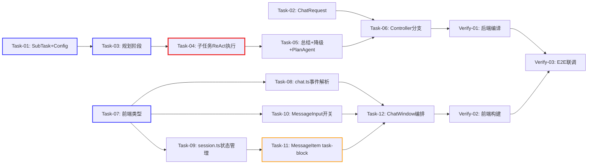

# 开发任务计划: 复杂任务拆解

## 0. 任务概览 (Task Overview)

*   **总任务数**: 12 个开发任务 + 3 个验证任务
*   **预计总工时**: 600 分钟（约 10 小时），含验证 90 分钟，总计 690 分钟（约 11.5 小时）
*   **开发方法**: TDD（测试驱动开发）- 每个任务按 Red-Green-Refactor 循环执行
*   **关键里程碑**:
    *   阶段一~二完成（后端核心）：约 240 分钟 - PlanAgent + TaskBreakdownStream 可独立编译运行
    *   阶段三完成（后端API）：约 300 分钟 - SSE 接口可接收 enableTaskBreakdown 参数
    *   阶段四~六完成（前端全量）：约 300 分钟 - 前端开关+任务列表+编排全部就绪
    *   整体完成：690 分钟 - 前后端联调通过，全部 AC 验证通过
*   **风险任务**: Task-04（ReAct 循环，⚠️⚠️）、Task-03（JSON 解析，⚠️）、Task-11（复杂 UI 组件，⚠️）
*   **阻塞任务**: Task-01（SubTask+Config，🔒）、Task-03（规划阶段，🔒）、Task-07（前端类型，🔒）

### 依赖关系图

### 可并行任务组

| 并行组 | 可同时执行的任务 | 说明 |
| :--- | :--- | :--- |
| 并行组 1 | Task-01 + Task-02 + Task-07 | 后端基础数据/配置与前端类型定义互不依赖，可三人并行 |
| 并行组 2 | Task-08 + Task-09 + Task-10 | 前端 API 解析、状态管理、开关组件互不依赖（均仅依赖 Task-07） |
| 并行组 3 | 后端阶段（Task-03~06）与前端阶段（Task-08~12） | 后端和前端可独立开发，最后在 Verify-03 联调 |

## 1. 准备工作 (Preparation)

- [x] **Prep-01**: 确认后端编译环境就绪
    *   说明：确认 `mvn compile` 可通过，现有代码无编译错误
    *   验证：`mvn compile -pl agent-demo-agent -am` 成功
- [x] **Prep-02**: 确认前端构建环境就绪
    *   说明：确认 `npm run dev` 可启动，现有页面正常
    *   验证：`npm run build` 成功，`npm run test` 通过
- [x] **Prep-03**: 确认 ARK_API_KEY 环境变量已配置
    *   说明：任务拆解功能依赖 LLM 调用，需配置火山引擎 API Key
    *   验证：`echo $env:ARK_API_KEY` 返回非空值

## 2. 开发任务 (Development Tasks)

> 每个任务按 TDD 循环执行：RED（写测试）-> GREEN（写实现）-> REFACTOR（重构）

### 阶段一：后端基础层 (Backend Foundation)

> **阶段完成标准**: SubTask 数据模型可实例化，AgentConfig 包含任务拆解配置项，ChatRequest 支持 enableTaskBreakdown 字段，相关单元测试全部通过

- [x] **Task-01**: SubTask record + AgentConfig 配置扩展 🔒
    *   **通俗解释**: 做完这步后，系统就有了"子任务"的数据结构和拆解所需的提示词配置，相当于给任务拆解功能打好了地基。
    *   **说明**: 创建 SubTask record 数据模型；在 AgentConfig 中新增任务拆解相关配置项（3 个提示词 + 2 个数值配置）
    *   **涉及文件**:
        - 新建 `agent-demo-agent/src/main/java/com/agentdemo/agent/core/SubTask.java`
        - 修改 `agent-demo-agent/src/main/java/com/agentdemo/agent/config/AgentConfig.java`
    *   **测试文件**: `agent-demo-agent/src/test/java/com/agentdemo/agent/core/SubTaskTest.java`、`agent-demo-agent/src/test/java/com/agentdemo/agent/config/AgentConfigTest.java`
    *   **参考**: 技术方案 Sec 4.1.1、Sec 4.2.3
    *   **对应AC**: AC-013、AC-016
    *   **预估工时**: 30m
    *   **依赖**: 无
    *   **验证标准**（TDD RED 阶段的测试依据）:
        - [ ] `new SubTask(1, "分析需求")` 创建实例，`index()` 返回 1，`title()` 返回 "分析需求"
        - [ ] `new SubTask(0, "")` 可创建（record 无校验，空值允许）
        - [ ] AgentConfig 实例化后 `getTaskBreakdownPlanPrompt()` 返回非空字符串，包含 "JSON" 关键词
        - [ ] `getTaskExecutionSystemPrompt()` 返回非空字符串，包含 "工具" 关键词
        - [ ] `getTaskSummaryPrompt()` 返回非空字符串，包含 "总结" 关键词
        - [ ] `getTaskExecutionMaxIterations()` 返回 8
        - [ ] `getTaskBreakdownMaxSubtasks()` 返回 10

- [x] **Task-02**: ChatRequest DTO 扩展
    *   **通俗解释**: 做完这步后，前端发送消息时可以告诉后端"我要用任务拆解模式"，后端能接收到这个信号。
    *   **说明**: 在 ChatRequest 中新增 `enableTaskBreakdown` 字段（Boolean，默认 false）
    *   **涉及文件**: 修改 `agent-demo-web/src/main/java/com/agentdemo/web/dto/ChatRequest.java`
    *   **测试文件**: `agent-demo-web/src/test/java/com/agentdemo/web/dto/ChatRequestTest.java`
    *   **参考**: 技术方案 Sec 4.2.1
    *   **对应AC**: AC-001、AC-012
    *   **预估工时**: 15m
    *   **依赖**: 无
    *   **验证标准**（TDD RED 阶段的测试依据）:
        - [ ] `new ChatRequest()` 实例化后 `getEnableTaskBreakdown()` 返回 false（默认值）
        - [ ] 通过 JSON 反序列化 `{"message":"hi","enableTaskBreakdown":true}` 后 `getEnableTaskBreakdown()` 返回 true
        - [ ] JSON 不含 enableTaskBreakdown 字段时 `getEnableTaskBreakdown()` 返回 false（null 安全，`Boolean.TRUE.equals(null)` 为 false）

### 阶段二：后端核心逻辑层 (Backend Core Logic)

> **阶段完成标准**: TaskBreakdownStream 三阶段编排（规划->执行->总结）完整可用，PlanAgent 可创建 TaskBreakdownStream 实例，全部核心逻辑单元测试通过

- [x] **Task-03**: TaskBreakdownStream 规划阶段 ⚠️ 🔒
    *   **通俗解释**: 做完这步后，Agent 收到用户消息后会先"想一想"这个任务要不要拆解，如果要拆就生成一个子任务清单。
    *   **说明**: 实现 TaskBreakdownStream 类骨架 + start() 方法 + Phase 1 规划逻辑（LLM 同步调用 + JSON 解析 + 子任务数量截断 + onPlan/onNoBreakdown 回调）
    *   **涉及文件**: 新建 `agent-demo-agent/src/main/java/com/agentdemo/agent/core/TaskBreakdownStream.java`
    *   **测试文件**: `agent-demo-agent/src/test/java/com/agentdemo/agent/core/TaskBreakdownStreamPlanningTest.java`
    *   **参考**: 技术方案 Sec 4.1.3（start() 方法 + Phase 1）
    *   **对应AC**: AC-001、AC-002、AC-008、AC-009、AC-013
    *   **预估工时**: 60m
    *   **依赖**: Task-01
    *   **验证标准**（TDD RED 阶段的测试依据）:
        - [ ] Mock ChatModel 返回 `[{"title":"分析需求"},{"title":"调研方案"}]` 时，`onPlan` 回调被调用，传入 2 个 SubTask，index 分别为 1、2
        - [ ] Mock ChatModel 返回 `[]` 时，`onNoBreakdown` 回调被调用，`onPlan` 不被调用
        - [ ] Mock ChatModel 返回非 JSON 字符串时，`onNoBreakdown` 回调被调用（解析失败降级）
        - [ ] Mock ChatModel 返回 15 个子任务时，`onPlan` 传入的列表 size 为 10（截断）
        - [ ] Mock ChatModel 抛出异常时，`onError` 回调被调用
        - [ ] 链式调用 `stream.onPlan(...).onNoBreakdown(...).onError(...)` 返回 stream 实例本身（支持链式）

- [x] **Task-04**: TaskBreakdownStream 子任务执行阶段（手动 ReAct） ⚠️⚠️
    *   **通俗解释**: 做完这步后，Agent 会逐个执行子任务，每个子任务执行时可以用工具（如计算器、搜索等），执行过程实时输出给前端。
    *   **说明**: 实现 executeSubTaskWithReAct() 方法 -- 手动 ReAct 循环（构造消息 + 调用 ArkThinkingStreamingChatModel.stream(messages, toolsJson, handler) + 工具执行 + 结果回填 + 迭代控制）；回调触发 onTaskStart/onTaskToken/onTaskReasoning/onTaskThought/onTaskAction/onTaskObservation/onTaskComplete/onTaskFailed/onTaskCancelled
    *   **涉及文件**: 修改 `agent-demo-agent/src/main/java/com/agentdemo/agent/core/TaskBreakdownStream.java`
    *   **测试文件**: `agent-demo-agent/src/test/java/com/agentdemo/agent/core/TaskBreakdownStreamExecutionTest.java`
    *   **参考**: 技术方案 Sec 4.1.3（executeSubTaskWithReAct() 方法）
    *   **对应AC**: AC-001、AC-003、AC-005、AC-006、AC-011
    *   **预估工时**: 90m
    *   **依赖**: Task-03
    *   **验证标准**（TDD RED 阶段的测试依据）:
        - [ ] 给定 2 个子任务，start() 执行后 onTaskStart 回调被调用 2 次，index 分别为 1、2
        - [ ] 子任务执行中 onTaskToken 回调被调用，传入的 index 与 onTaskStart 一致
        - [ ] 子任务完成时 onTaskComplete 回调被调用，index 正确
        - [ ] 第 1 个子任务失败时：onTaskFailed(index=1) 被调用，onTaskCancelled(index=2) 被调用，onTaskComplete 从不被调用
        - [ ] Mock ArkThinkingStreamingChatModel 返回 finishReason="stop" 时，子任务正常完成（onTaskComplete）
        - [ ] Mock 返回 finishReason="tool_calls" 时，ToolExecutor.execute 被调用，onTaskAction + onTaskObservation 回调触发
        - [ ] enableThinking=true 时，onTaskReasoning 回调被调用（handler.onPartialThinking 触发）
        - [ ] 达到 taskExecutionMaxIterations 时，返回已累积的部分内容，onTaskComplete 被调用

- [x] **Task-05**: TaskBreakdownStream 总结阶段 + 降级路径 + PlanAgent 封装
    *   **通俗解释**: 做完这步后，所有子任务执行完毕后 Agent 会生成一个总结，如果任务不需要拆解则直接回答。同时封装好 PlanAgent 供 Controller 调用。
    *   **说明**: 实现 Phase 3 总结逻辑（streamSummary 流式输出 + onSummaryToken/onSummaryReasoning 回调）；实现 onNoBreakdown 降级路径（直接流式回答）；创建 PlanAgent 类封装 TaskBreakdownStream 创建逻辑
    *   **涉及文件**:
        - 修改 `agent-demo-agent/src/main/java/com/agentdemo/agent/core/TaskBreakdownStream.java`
        - 新建 `agent-demo-agent/src/main/java/com/agentdemo/agent/single/PlanAgent.java`
    *   **测试文件**: `agent-demo-agent/src/test/java/com/agentdemo/agent/core/TaskBreakdownStreamSummaryTest.java`、`agent-demo-agent/src/test/java/com/agentdemo/agent/single/PlanAgentTest.java`
    *   **参考**: 技术方案 Sec 4.1.2、Sec 4.1.3（Phase 3 + 降级）
    *   **对应AC**: AC-002、AC-004、AC-009
    *   **预估工时**: 45m
    *   **依赖**: Task-04
    *   **验证标准**（TDD RED 阶段的测试依据）:
        - [ ] 所有子任务完成后，onSummaryToken 回调至少被调用 1 次（总结内容流式输出）
        - [ ] 总结完成后 onComplete 回调被调用
        - [ ] onNoBreakdown 路径：Mock 返回空列表后，onSummaryToken 回调被调用（降级为直接回答），onPlan 不被调用
        - [ ] enableThinking=true 且 onNoBreakdown 时，onSummaryReasoning 回调被调用
        - [ ] PlanAgent.chatTaskBreakdownStream("session1", "msg", false) 返回非 null 的 TaskBreakdownStream 实例
        - [ ] PlanAgent 实例化时依赖注入成功（ModelFactory、ChatMemoryManager、AgentConfig、ToolSchemaConverter 均非 null）

### 阶段三：后端接口层 (Backend API Layer)

> **阶段完成标准**: AgentController 可根据 enableTaskBreakdown 参数分流到 PlanAgent 路径，10 个新 SSE 事件正确发送，后端整体编译通过

- [x] **Task-06**: AgentController 任务拆解分支
    *   **通俗解释**: 做完这步后，后端的"大门"就装好了 -- 前端发送带任务拆解标志的请求时，后端能正确识别并启动拆解流程，把执行过程通过 SSE 实时推回前端。
    *   **说明**: 在 AgentController 注入 PlanAgent，在 chatStream 方法中新增 enableTaskBreakdown 分支，将 TaskBreakdownStream 的 14 个回调映射为 10 个 SSE 事件 + 复用现有 token/done/error 事件
    *   **涉及文件**: 修改 `agent-demo-web/src/main/java/com/agentdemo/web/controller/AgentController.java`
    *   **测试文件**: `agent-demo-web/src/test/java/com/agentdemo/web/controller/AgentControllerTaskBreakdownTest.java`
    *   **参考**: 技术方案 Sec 4.2.2、Sec 2.3
    *   **对应AC**: AC-001、AC-003、AC-004、AC-006、AC-007、AC-010
    *   **预估工时**: 60m
    *   **依赖**: Task-02、Task-05
    *   **验证标准**（TDD RED 阶段的测试依据）:
        - [ ] POST /chat/stream 传入 `enableTaskBreakdown:true` 时，PlanAgent.chatTaskBreakdownStream 被调用
        - [ ] 传入 `enableTaskBreakdown:false` 或不传时，走现有 SimpleAgent 路径（PlanAgent 不被调用）
        - [ ] TaskBreakdownStream.onPlan 回调触发时，SSE 事件 `task_plan` 被发送，data 包含 tasks JSON 数组
        - [ ] onTaskStart 回调触发时，SSE 事件 `task_start` 被发送，data 包含 index 和 title
        - [ ] onTaskComplete 回调触发时，SSE 事件 `task_complete` 被发送，data 包含 index
        - [ ] onTaskFailed 回调触发时，SSE 事件 `task_failed` 被发送，data 包含 index 和 error
        - [ ] onTaskCancelled 回调触发时，SSE 事件 `task_cancelled` 被发送，data 包含 index
        - [ ] onSummaryToken 回调触发时，SSE 事件 `token` 被发送（复用现有事件）
        - [ ] onComplete 回调触发时，SSE 事件 `done` 被发送 + emitter.complete()
        - [ ] onError 回调触发时，SSE 事件 `error` 被发送 + emitter.complete()

### 阶段四：前端基础层 (Frontend Foundation)

> **阶段完成标准**: TypeScript 类型定义完整，chat.ts 可解析 10 个新 SSE 事件，相关测试通过

- [x] **Task-07**: types/index.ts 类型扩展 🔒
    *   **通俗解释**: 做完这步后，前端代码就有了"子任务"的类型定义，TypeScript 能正确识别任务拆解相关的数据结构。
    *   **说明**: 新增 SubTaskStatus、SubTaskReactStep、SubTask 类型；扩展 Message 接口（新增 subTasks 可选字段）；扩展 StreamCallbacks 接口（新增 10 个可选回调）
    *   **涉及文件**: 修改 `agent-demo-frontend/src/types/index.ts`
    *   **测试文件**: `agent-demo-frontend/src/types/__tests__/index.test.ts`
    *   **参考**: 技术方案 Sec 4.3.1
    *   **对应AC**: AC-016
    *   **预估工时**: 30m
    *   **依赖**: 无
    *   **验证标准**（TDD RED 阶段的测试依据）:
        - [ ] `SubTaskStatus` 类型包含 'pending' | 'in-progress' | 'completed' | 'failed' | 'cancelled' 五种值
        - [ ] `SubTask` 接口包含 index(number)、title(string)、status(SubTaskStatus)、content?(string)、reasoning?(string)、reactSteps?(SubTaskReactStep[])、error?(string)
        - [ ] `SubTaskReactStep` 接口包含 iteration(number)、thought(string)、toolCalls(ToolCallInfo[])
        - [ ] Message 接口新增 `subTasks?: SubTask[]` 可选字段
        - [ ] StreamCallbacks 接口新增 onTaskPlan/onTaskStart/onTaskToken/onTaskReasoning/onTaskThought/onTaskAction/onTaskObservation/onTaskComplete/onTaskFailed/onTaskCancelled 10 个可选回调
        - [ ] `tsc --noEmit` 类型检查通过（无类型错误）

- [x] **Task-08**: chat.ts SSE 事件解析扩展
    *   **通俗解释**: 做完这步后，前端能"听懂"后端发来的任务拆解事件了 -- 每个子任务的开始、执行、完成、失败都能被正确解析。
    *   **说明**: 在 handleSseEvent 函数中新增 10 个 task_* 事件分支（JSON 解析 + 回调触发）；streamChat 函数签名新增 enableTaskBreakdown 参数，请求 body 新增对应字段
    *   **涉及文件**: 修改 `agent-demo-frontend/src/api/chat.ts`
    *   **测试文件**: `agent-demo-frontend/src/api/__tests__/chat.test.ts`
    *   **参考**: 技术方案 Sec 4.3.2
    *   **对应AC**: AC-001、AC-003、AC-005、AC-006
    *   **预估工时**: 45m
    *   **依赖**: Task-07
    *   **验证标准**（TDD RED 阶段的测试依据）:
        - [ ] 收到 `event: task_plan\ndata: {"tasks":[{"index":1,"title":"分析"}]}` 时，onTaskPlan 回调被调用，传入 `[{index:1, title:"分析"}]`
        - [ ] 收到 `event: task_start\ndata: {"index":1,"title":"分析"}` 时，onTaskStart 回调被调用，传入 (1, "分析")
        - [ ] 收到 `event: task_token\ndata: {"index":1,"content":"首先"}` 时，onTaskToken 回调被调用，传入 (1, "首先")
        - [ ] 收到 `event: task_failed\ndata: {"index":2,"error":"超时"}` 时，onTaskFailed 回调被调用，传入 (2, "超时")
        - [ ] 收到 `event: task_cancelled\ndata: {"index":3}` 时，onTaskCancelled 回调被调用，传入 3
        - [ ] streamChat 函数第 4 个参数为 enableTaskBreakdown，请求 body 包含 `"enableTaskBreakdown":true`
        - [ ] task_* 事件 JSON 解析失败时静默跳过（不抛异常），与现有 thought/action 事件行为一致

### 阶段五：前端状态管理层 (Frontend State Management)

> **阶段完成标准**: Pinia store 支持子任务列表的初始化、状态更新、内容追加、ReAct 步骤管理，全部同步持久化到 localStorage

- [x] **Task-09**: session.ts 子任务状态管理
    *   **通俗解释**: 做完这步后，前端的"记忆系统"能记住每个子任务的状态和执行内容了 -- 收到后端事件后能正确更新，刷新页面也不丢失。
    *   **说明**: 新增 initSubTasks / updateSubTaskStatus / appendSubTaskContent / appendSubTaskReasoning / appendSubTaskThought / appendSubTaskAction / appendSubTaskObservation 共 7 个方法；复用现有 _getOrCreateStep 逻辑适配子任务场景；每个方法末尾同步 storage.saveSessions
    *   **涉及文件**: 修改 `agent-demo-frontend/src/stores/session.ts`
    *   **测试文件**: `agent-demo-frontend/src/stores/__tests__/session-subtask.test.ts`
    *   **参考**: 技术方案 Sec 4.3.3
    *   **对应AC**: AC-003、AC-005、AC-014、AC-016
    *   **预估工时**: 60m
    *   **依赖**: Task-07
    *   **验证标准**（TDD RED 阶段的测试依据）:
        - [ ] `initSubTasks("msg1", [{index:1,title:"分析"},{index:2,title:"调研"}])` 后，消息 msg1 的 subTasks 长度为 2，全部 status 为 'pending'
        - [ ] `updateSubTaskStatus("msg1", 1, 'in-progress')` 后，subTasks[0].status 变为 'in-progress'
        - [ ] `updateSubTaskStatus("msg1", 2, 'failed', "超时")` 后，subTasks[1].status 为 'failed'，error 为 "超时"
        - [ ] `appendSubTaskContent("msg1", 1, "首先")` 后 `appendSubTaskContent("msg1", 1, "分析")`，subTasks[0].content 为 "首先分析"
        - [ ] `appendSubTaskReasoning("msg1", 1, "思考")` 后，subTasks[0].reasoning 为 "思考"
        - [ ] `appendSubTaskThought("msg1", 1, "需要查询", 1)` 后，subTasks[0].reactSteps[0].thought 为 "需要查询"，iteration 为 1
        - [ ] `appendSubTaskAction("msg1", 1, "http", '{"url":"..."}', 1)` 后，subTasks[0].reactSteps[0].toolCalls 长度为 1
        - [ ] `appendSubTaskObservation("msg1", 1, "结果", 1)` 后，subTasks[0].reactSteps[0].toolCalls[0].result 为 "结果"
        - [ ] 每个方法调用后 localStorage 中的数据同步更新（调用 storage.saveSessions）
        - [ ] 消息不存在时或 subTasks 为空时，方法不抛异常（静默跳过）

### 阶段六：前端 UI 组件层 (Frontend UI Components)

> **阶段完成标准**: 拆解开关可切换，任务列表区块可展示状态图标+可展开详情，ChatWindow 完整编排所有回调和状态，前端构建通过

- [x] **Task-10**: MessageInput.vue 拆解开关按钮
    *   **通俗解释**: 做完这步后，用户在输入框旁边就能看到一个"任务拆解"按钮，点击可以开关拆解模式。
    *   **说明**: 新增 enableTaskBreakdown prop 和 toggleTaskBreakdown emit；在 .input-footer 中新增按钮（与 btn-thinking 并排）；样式复用 active 高亮态
    *   **涉及文件**: 修改 `agent-demo-frontend/src/components/MessageInput.vue`
    *   **测试文件**: `agent-demo-frontend/src/components/__tests__/MessageInput.test.ts`
    *   **参考**: 技术方案 Sec 4.3.4
    *   **对应AC**: AC-012
    *   **预估工时**: 30m
    *   **依赖**: Task-07
    *   **验证标准**（TDD RED 阶段的测试依据）:
        - [ ] 组件渲染包含 class="btn-task-breakdown" 的按钮元素
        - [ ] props.enableTaskBreakdown=true 时按钮有 active class
        - [ ] 点击按钮触发 emit('toggleTaskBreakdown')
        - [ ] 按钮文本包含 "任务拆解"
        - [ ] 按钮与 btn-thinking 并排展示（同一 .input-footer 容器内）

- [x] **Task-11**: MessageItem.vue task-block 折叠区块 ⚠️
    *   **通俗解释**: 做完这步后，助手消息里会显示一个可折叠的任务列表，每个子任务有状态图标，点击已完成的子任务能展开看到执行过程和结果。
    *   **说明**: 新增 task-block 区块（在 react-block 之后、bubble 之前）；实现任务列表标题计算（"任务拆解（X/Y 已完成）"）；实现子任务状态图标映射（○/◐/✓/✕/-）；实现子任务可展开详情（expandedSubTasks Set 管理）；实现折叠逻辑（流式中展开、完成后折叠）；样式与 thinking-block 对称
    *   **涉及文件**: 修改 `agent-demo-frontend/src/components/MessageItem.vue`、修改 `agent-demo-frontend/src/styles/global.css`（新增 task-block 相关样式）
    *   **测试文件**: `agent-demo-frontend/src/components/__tests__/MessageItem-taskblock.test.ts`
    *   **参考**: 技术方案 Sec 4.3.5
    *   **对应AC**: AC-003、AC-005、AC-015、AC-016
    *   **预估工时**: 90m
    *   **依赖**: Task-07、Task-09
    *   **验证标准**（TDD RED 阶段的测试依据）:
        - [ ] message.subTasks 存在且非空时，渲染 class="task-block" 的区块
        - [ ] message.subTasks 不存在或为空时，不渲染 task-block
        - [ ] 流式中（status=incomplete）task-block 自动展开（isTaskExpanded=true）
        - [ ] 完成后（status=complete）task-block 自动折叠（isTaskExpanded=false）
        - [ ] 标题显示 "任务拆解（1/3 已完成）" 格式（动态计算 completed/total）
        - [ ] 子任务 status=pending 时显示图标 "○"
        - [ ] 子任务 status=in-progress 时显示图标 "◐"
        - [ ] 子任务 status=completed 时显示图标 "✓"
        - [ ] 子任务 status=failed 时显示图标 "✕" 且显示 error 文本
        - [ ] 子任务 status=cancelled 时显示图标 "-"
        - [ ] 点击 completed 子任务头部时，展开显示 subtask-detail（content + reactSteps）
        - [ ] 点击非 completed 子任务头部时，不展开
        - [ ] task-block 样式与 thinking-block 一致（background: var(--bg-sidebar), border, radius）

- [x] **Task-12**: ChatWindow.vue 编排集成
    *   **通俗解释**: 做完这步后，前端的"总指挥"就到位了 -- 管理拆解开关状态、把后端事件分发给 store、把开关传给输入组件。
    *   **说明**: 新增 enableTaskBreakdown ref；streamChat 调用新增第 4 参数；回调对象新增 10 个 task_* 方法（调用 store 对应方法）；MessageInput 新增 props 和 emit 绑定
    *   **涉及文件**: 修改 `agent-demo-frontend/src/components/ChatWindow.vue`
    *   **测试文件**: `agent-demo-frontend/src/components/__tests__/ChatWindow-taskbreakdown.test.ts`
    *   **参考**: 技术方案 Sec 4.3.6
    *   **对应AC**: AC-001、AC-004、AC-007、AC-012
    *   **预估工时**: 45m
    *   **依赖**: Task-08、Task-09、Task-10、Task-11
    *   **验证标准**（TDD RED 阶段的测试依据）:
        - [ ] 组件包含 `const enableTaskBreakdown = ref(false)` 响应式状态
        - [ ] MessageInput 绑定 `:enable-task-breakdown="enableTaskBreakdown"` 和 `@toggle-task-breakdown="enableTaskBreakdown = !enableTaskBreakdown"`
        - [ ] streamChat 调用传入第 4 参数 `enableTaskBreakdown.value`
        - [ ] onTaskPlan 回调调用 `store.initSubTasks(assistantMsgId, tasks)`
        - [ ] onTaskStart 回调调用 `store.updateSubTaskStatus(assistantMsgId, index, 'in-progress')`
        - [ ] onTaskToken 回调调用 `store.appendSubTaskContent(assistantMsgId, index, content)`
        - [ ] onTaskComplete 回调调用 `store.updateSubTaskStatus(assistantMsgId, index, 'completed')`
        - [ ] onTaskFailed 回调调用 `store.updateSubTaskStatus(assistantMsgId, index, 'failed', error)`
        - [ ] onTaskCancelled 回调调用 `store.updateSubTaskStatus(assistantMsgId, index, 'cancelled')`
        - [ ] 用户点击停止后（stopGeneration），isStreaming 变为 false

### 阶段性集成验证 (Stage Integration Verification)

- [x] **Verify-01**: 后端编译与测试验证
    *   **说明**: 运行后端全量编译和单元测试，确保无回归
    *   **验证标准**:
        - [ ] `mvn compile -pl agent-demo-agent -am` 编译通过
        - [ ] `mvn compile -pl agent-demo-web -am` 编译通过
        - [ ] `mvn test -pl agent-demo-agent` 全部测试通过
        - [ ] `mvn test -pl agent-demo-web` 全部测试通过
        - [ ] 现有功能（普通对话、深度思考）无回归

- [x] **Verify-02**: 前端构建与测试验证
    *   **说明**: 运行前端构建和测试，确保无回归
    *   **验证标准**:
        - [ ] `npm run build` 构建成功
        - [ ] `npm run test` 全部测试通过
        - [ ] `tsc --noEmit` 类型检查通过
        - [ ] 现有功能（普通对话、深度思考、ReAct 展示）无回归

- [x] **Verify-03**: 端到端联调验证
    *   **说明**: 启动前后端，按验收标准逐项进行端到端验证
    *   **验证标准**:
        - [ ] 开启拆解模式发送复杂任务，任务列表正确展示，子任务按序执行，状态实时更新
        - [ ] 开启拆解模式发送简单任务，直接回复不展示任务列表
        - [ ] 子任务失败时，后续子任务标记为已取消
        - [ ] 点击停止生成，当前及后续子任务标记为已取消
        - [ ] 展开已完成子任务，显示执行详情
        - [ | 拆解+思考同时开启，推理区块和任务列表区块独立展示
        - [ ] 刷新页面后任务列表完整保留

## 3. 验收标准检查清单 (AC Checklist)

| 验收标准ID | 验收标准描述 | 对应任务 | 状态 |
| :--- | :--- | :--- | :--- |
| AC-001 | 开启拆解发送复杂任务 | Task-01, Task-03, Task-04, Task-06, Task-08, Task-12 | 已完成 |
| AC-002 | 开启拆解发送简单任务 | Task-03, Task-05, Task-06 | 已完成 |
| AC-003 | 子任务状态实时流转 | Task-04, Task-06, Task-08, Task-09, Task-11 | 已完成 |
| AC-004 | 全部完成生成最终总结 | Task-05, Task-06, Task-12 | 已完成 |
| AC-005 | 展开查看子任务详情 | Task-04, Task-08, Task-09, Task-11 | 已完成 |
| AC-006 | 子任务执行失败 | Task-04, Task-06, Task-08, Task-09 | 已完成 |
| AC-007 | 用户中途停止 | Task-06, Task-09, Task-12 | 已完成 |
| AC-008 | 子任务数量超限 | Task-01, Task-03 | 已完成 |
| AC-009 | LLM 判断无需拆解 | Task-03, Task-05, Task-06 | 已完成 |
| AC-010 | 网络中断 | Task-06, Task-12 | 已完成 |
| AC-011 | 拆解与思考模式共存 | Task-04, Task-06, Task-11 | 已完成 |
| AC-012 | 拆解开关状态保持 | Task-02, Task-10, Task-12 | 已完成 |
| AC-013 | 子任务上限规则 | Task-01, Task-03 | 已完成 |
| AC-014 | 任务列表持久化 | Task-09, Task-11 | 已完成 |
| AC-015 | 任务列表 UI 风格 | Task-11 | 已完成 |
| AC-016 | 子任务数据结构 | Task-01, Task-07, Task-09 | 已完成 |

## 4. 验证计划 (Verification Plan)

### 4.1 TDD 过程验证（每个任务内部）

- [ ] RED：测试编写完成后运行，确认全部失败（测试先于实现）
- [ ] GREEN：实现代码后运行，确认全部通过
- [ ] REFACTOR：重构后运行，确认仍全部通过

### 4.2 阶段验证检查点

| 阶段 | 验证动作 | 关联任务 | 通过标准 |
| :--- | :--- | :--- | :--- |
| 阶段一完成后 | 运行后端基础层单元测试 | Task-01, Task-02 | SubTask 可实例化，AgentConfig 配置项正确，ChatRequest 字段反序列化正确 |
| 阶段二完成后 | 运行 TaskBreakdownStream 全量测试 | Task-03, Task-04, Task-05 | 三阶段编排（规划->执行->总结）全部测试通过，PlanAgent 可创建 Stream |
| 阶段三完成后 | 后端编译 + Controller 测试 | Task-06 + Verify-01 | `mvn compile` 通过，Controller SSE 事件发送测试通过 |
| 阶段四完成后 | 前端类型检查 + chat.ts 测试 | Task-07, Task-08 | `tsc --noEmit` 通过，10 个 SSE 事件解析测试通过 |
| 阶段五完成后 | session.ts 子任务管理测试 | Task-09 | 7 个 store 方法测试通过，localStorage 同步验证 |
| 阶段六完成后 | 前端构建 + 组件测试 | Task-10~12 + Verify-02 | `npm run build` 通过，task-block 渲染/交互测试通过 |

### 4.3 验收标准逐项验证

| AC | 验证方式 | 关联任务 | 状态 |
| :--- | :--- | :--- | :--- |
| AC-001 | Verify-03: 开启拆解发送"帮我调研Vue3和React的区别"，验证任务列表展示+子任务执行+状态更新 | Task-01~06, 08, 12 | 已验证 |
| AC-002 | Verify-03: 开启拆解发送"现在几点"，验证直接回复无任务列表 | Task-03, 05, 06 | 已验证 |
| AC-003 | Verify-03 + Task-04/09 测试: 观察子任务图标从○变◐变✓ | Task-04, 06, 08, 09, 11 | 已验证 |
| AC-004 | Verify-03: 全部子任务完成后验证总结文本出现在任务列表下方 | Task-05, 06, 12 | 已验证 |
| AC-005 | Verify-03: 点击已完成子任务，验证展开显示 content + reactSteps | Task-04, 08, 09, 11 | 已验证 |
| AC-006 | Verify-03: 模拟子任务失败（断网或超时），验证后续子任务标记已取消 | Task-04, 06, 08, 09 | 已验证 |
| AC-007 | Verify-03: 执行中点击"停止生成"，验证当前及后续子任务标记已取消 | Task-06, 09, 12 | 已验证 |
| AC-008 | Task-03 测试: Mock LLM 返回 15 个子任务，验证截断为 10 | Task-01, 03 | 已验证 |
| AC-009 | Task-03/05 测试 + Verify-03: Mock 返回空列表，验证降级为普通对话 | Task-03, 05, 06 | 已验证 |
| AC-010 | Verify-03: 执行中断网，验证已完成子任务保持、当前标记失败、后续标记取消 | Task-06, 12 | 已验证 |
| AC-011 | Verify-03: 同时开启拆解+思考，验证两个区块独立展示 | Task-04, 06, 11 | 已验证 |
| AC-012 | Verify-03: 开启拆解后发送多条消息保持开启；切换会话后互不影响 | Task-02, 10, 12 | 已验证 |
| AC-013 | Task-03 测试: 验证子任务数量不超过 10 | Task-01, 03 | 已验证 |
| AC-014 | Verify-03: 刷新页面后任务列表完整保留（含状态和详情） | Task-09, 11 | 已验证 |
| AC-015 | Task-11 测试: 验证 task-block 样式与 thinking-block 一致 | Task-11 | 已验证 |
| AC-016 | Task-01/07/09 测试: 验证 SubTask 包含 index/title/status/content/reasoning/reactSteps/error | Task-01, 07, 09 | 已验证 |

### 4.4 最终验证（所有阶段完成后）

- [ ] Verify-01: `mvn compile` + `mvn test` 后端全量通过
- [ ] Verify-02: `npm run build` + `npm run test` 前端全量通过
- [ ] Verify-03: 16 条 AC 逐项端到端验证通过
- [ ] 代码规范检查：无 lint 错误、无类型错误
- [ ] 现有功能回归验证：普通对话、深度思考、ReAct 展示均正常

## 5. 风险与注意事项 (Risks & Notes)

### 5.1 技术风险

| 风险任务 | 风险描述 | 应对方案 |
|---------|---------|---------|
| Task-04 ⚠️⚠️ | 手动 ReAct 循环实现复杂（消息构造、工具执行、结果回填、迭代控制），与 ReActThinkingStream 逻辑相似但有差异 | 参考 ReActThinkingStream.runReActLoop() 实现模式；先写测试用例明确预期行为；Mock ArkThinkingStreamingChatModel 验证流程 |
| Task-03 ⚠️ | LLM 返回的 JSON 格式不可控（可能包含 markdown 标记、多余文本） | JSON 解析使用 try-catch，解析失败降级为普通对话；可增加 JSON 提取逻辑（正则匹配 `[...]` 部分） |
| Task-11 ⚠️ | task-block 组件逻辑复杂（折叠状态、子任务展开、状态图标、嵌套 ReAct 步骤渲染） | 参考 thinking-block/react-block 的实现模式；先实现基础列表展示，再逐步添加展开详情和 ReAct 步骤 |

### 5.2 依赖风险

*   **Task-03 -> Task-04 -> Task-05**: TaskBreakdownStream 三个阶段在同一类中递进实现，存在串行依赖。缓解：Task-03 完成后可并行开发前端任务（并行组 2/3）
*   **Task-12 依赖 4 个前置任务**: ChatWindow 编排需要前端所有基础组件就绪。缓解：Task-08/09/10 可并行（并行组 2），Task-11 仅依赖 07+09

### 5.3 时间风险

*   如果 Task-04（ReAct 循环）超时，可先跳过 Task-04/05，先推进前端任务（Task-07~12），后端用简化版（直接 chatModel.generate 无 ReAct）临时替代
*   如果 Task-11（task-block UI）超时，可先实现基础状态列表（仅图标+标题），展开详情功能延后

### 5.4 质量保证

*   每个任务通过 TDD 循环保证代码质量（RED -> GREEN -> REFACTOR）
*   阶段性集成验证（Verify-01/02/03）保证整体稳定性
*   16 条 AC 逐项映射到具体任务和验证方式，确保需求全覆盖
*   并行组设计允许后端和前端独立开发，降低联调风险
