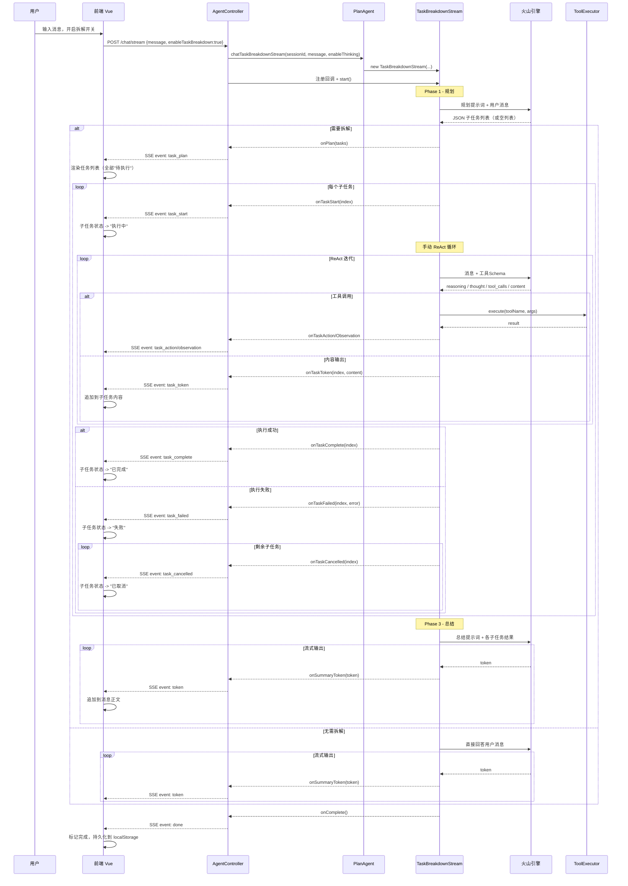
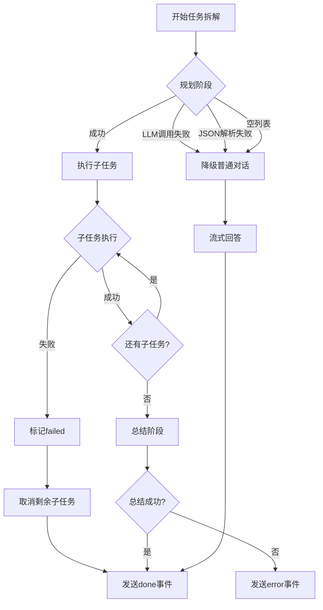

# 技术设计文档: 复杂任务拆解

## 0. 设计概要 (Design Summary)

* **功能描述**：为 Agent 新增复杂任务拆解能力，通过新建 PlanAgent 实现任务规划 -> 子任务流式 ReAct 执行 -> 最终总结的三阶段编排，前端提供开关控制和可视化任务列表。

* **影响范围**：

  * 后端：agent-demo-agent（新增 PlanAgent + TaskBreakdownStream + SubTask 模型）、agent-demo-web（Controller 分支 + DTO 扩展）、agent-demo-bootstrap（配置项 + 提示词）

  * 前端：types/index.ts（类型扩展）、api/chat.ts（SSE 事件解析）、stores/session.ts（状态管理）、components/MessageInput.vue（开关）、components/MessageItem.vue（任务列表区块）、components/ChatWindow\.vue（编排）、utils/storage.ts（持久化）

* **技术难点**：

  * TaskBreakdownStream 需在单次 SSE 连接中完成三阶段编排（规划 -> 执行 -> 总结），每个子任务内部运行手动 ReAct 循环

  * 子任务执行过程中的流式事件需携带 taskIndex 以便前端正确归集

  * 任务列表与推理内容两个折叠区块的独立展示与状态联动

* **依赖关系**：复用现有 ArkThinkingStreamingChatModel（手动 ReAct + 流式）、ToolSchemaConverter（工具描述/Schema）、ToolExecutor（工具执行）、ChatMemoryManager（记忆管理）

***

## 1. 架构概览 (Architecture Overview)

### 1.1 模块交互关系

```
agent-demo-web (Controller)
    ├── 注入 SimpleAgent（普通/思考对话）
    ├── 注入 PlanAgent（任务拆解）-- 新增
    └── chatStream() 根据 enableTaskBreakdown 分流:
         ├── false -> 现有路径（SimpleAgent.chatStream / chatThinkingReActStream）
         └── true  -> PlanAgent.chatTaskBreakdownStream() -> TaskBreakdownStream
                        ├── Phase 1: 规划（LLM 同步调用 -> JSON 解析子任务列表）
                        ├── Phase 2: 执行（逐个子任务手动 ReAct 流式循环）
                        └── Phase 3: 总结（LLM 流式调用 -> token 事件）

agent-demo-agent -- 新增
    ├── single/PlanAgent.java          -- 任务拆解 Agent
    ├── core/TaskBreakdownStream.java  -- 三阶段编排流
    └── core/SubTask.java              -- 子任务数据模型

agent-demo-frontend
    ├── ChatWindow.vue    -- 持有 enableTaskBreakdown 状态，编排回调
    ├── MessageInput.vue  -- 新增拆解开关按钮
    ├── MessageItem.vue   -- 新增 task-block 折叠区块
    ├── api/chat.ts       -- 新增 task_* 事件解析
    ├── stores/session.ts -- 新增子任务状态管理方法
    └── types/index.ts    -- 新增 SubTask / SubTaskReactStep 类型
```

### 1.2 端到端数据流



### 1.3 UI/逻辑映射

| 前端组件               | 消费后端事件                                                                                                                                                                   | 说明                                                               |
| ------------------ | ------------------------------------------------------------------------------------------------------------------------------------------------------------------------ | ---------------------------------------------------------------- |
| MessageInput.vue   | -                                                                                                                                                                        | 新增「任务拆解」开关，emit `toggleTaskBreakdown`                            |
| ChatWindow\.vue    | task\_plan, task\_start, task\_token, task\_reasoning, task\_thought, task\_action, task\_observation, task\_complete, task\_failed, task\_cancelled, token, done, error | 持有 enableTaskBreakdown 状态，组装回调，调用 streamChat                     |
| MessageItem.vue    | -                                                                                                                                                                        | 新增 task-block 折叠区块，渲染子任务列表+状态图标+可展开详情                            |
| session.ts (store) | -                                                                                                                                                                        | 新增 initSubTasks / updateSubTaskStatus / appendSubTaskContent 等方法 |

***

## 2. API 设计 (API Design)

### 2.1 接口列表

| 接口名称     | 方法   | 路径                     | 描述                                        | 对应验收标准      |
| :------- | :--- | :--------------------- | :---------------------------------------- | :---------- |
| 流式对话（扩展） | POST | /api/agent/chat/stream | 新增 enableTaskBreakdown 请求参数，复用现有 SSE 流式接口 | AC-001\~016 |

> **设计决策**：不新增接口，复用现有 `/api/agent/chat/stream`，通过 `enableTaskBreakdown` 参数分流。原因：前端只需一个入口，后端根据参数选择执行路径，符合开闭原则。

### 2.2 接口详情

#### 接口: POST /api/agent/chat/stream

* **描述**: 流式对话接口，根据请求参数选择普通对话/深度思考/任务拆解模式

* **鉴权**: 无（学习示例项目，未接入认证）

* **Request** (ChatRequest DTO 扩展):

  ```json
  {
    "sessionId": "abc123",
    "message": "帮我调研 Vue3 和 React 的区别，并给出技术选型建议",
    "enableThinking": false,
    "enableTaskBreakdown": true
  }
  ```

  * **新增字段**: `enableTaskBreakdown`（Boolean，默认 false）

  * **模式组合矩阵**:

  | enableTaskBreakdown | enableThinking | 执行路径                                                  |
  | :-----------------: | :------------: | :---------------------------------------------------- |
  |        false        |      false     | 现有普通流式（SimpleAgent.chatStream）                        |
  |        false        |      true      | 现有深度思考 ReAct（SimpleAgent.chatThinkingReActStream）     |
  |         true        |      false     | 任务拆解（PlanAgent.chatTaskBreakdownStream），子任务执行无推理      |
  |         true        |      true      | 任务拆解 + 推理（PlanAgent.chatTaskBreakdownStream），子任务执行含推理 |

* **Response**: SSE 事件流（TEXT\_EVENT\_STREAM）

### 2.3 SSE 事件协议（完整）

#### 2.3.1 复用事件（现有）

| 事件名         | 数据类型               | 触发时机                          | 说明       |
| ----------- | ------------------ | ----------------------------- | -------- |
| `session`   | String (sessionId) | 会话新建/超时                       | 透明续聊     |
| `token`     | String             | 总结阶段流式输出                      | 最终总结文本片段 |
| `reasoning` | String             | 总结阶段推理输出（enableThinking=true） | 最终总结推理片段 |
| `done`      | Long (毫秒)          | 全部完成                          | 总耗时      |
| `error`     | String             | 异常                            | 错误描述     |

#### 2.3.2 新增事件（任务拆解专用）

| 事件名                | 数据格式                                                                           | 触发时机                         | 对应 AC          |
| ------------------ | ------------------------------------------------------------------------------ | ---------------------------- | -------------- |
| `task_plan`        | JSON: `{"tasks":[{"index":1,"title":"分析需求"},...]}`                             | 规划完成，有子任务                    | AC-001         |
| `task_start`       | JSON: `{"index":1,"title":"分析需求"}`                                             | 子任务开始执行                      | AC-003         |
| `task_token`       | JSON: `{"index":1,"content":"首先..."}`                                          | 子任务执行中内容片段                   | AC-005         |
| `task_reasoning`   | JSON: `{"index":1,"content":"让我思考..."}`                                        | 子任务推理片段（enableThinking=true） | AC-011         |
| `task_thought`     | JSON: `{"index":1,"content":"需要查询...","iteration":1}`                          | 子任务 ReAct 思考                 | AC-005         |
| `task_action`      | JSON: `{"index":1,"toolName":"http","args":"{\"url\":\"...\"}","iteration":1}` | 子任务工具调用                      | AC-005         |
| `task_observation` | JSON: `{"index":1,"result":"...","iteration":1}`                               | 子任务工具结果                      | AC-005         |
| `task_complete`    | JSON: `{"index":1}`                                                            | 子任务执行完成                      | AC-003         |
| `task_failed`      | JSON: `{"index":1,"error":"工具调用失败"}`                                           | 子任务执行失败                      | AC-006         |
| `task_cancelled`   | JSON: `{"index":2}`                                                            | 子任务被取消（前序失败或用户停止）            | AC-006, AC-007 |

* **事件顺序示例**（3 个子任务，第 2 个失败）:

  ```
  event: task_plan
  data: {"tasks":[{"index":1,"title":"分析需求"},{"index":2,"title":"调研方案"},{"index":3,"title":"生成建议"}]}

  event: task_start
  data: {"index":1,"title":"分析需求"}

  event: task_thought
  data: {"index":1,"content":"需要理解用户需求","iteration":1}

  event: task_token
  data: {"index":1,"content":"根据您的需求..."}

  event: task_complete
  data: {"index":1}

  event: task_start
  data: {"index":2,"title":"调研方案"}

  event: task_failed
  data: {"index":2,"error":"HTTP 工具调用超时"}

  event: task_cancelled
  data: {"index":3}

  event: done
  data: 15234
  ```

***

## 3. 数据库设计 (Database Schema)

> 本项目无传统关系数据库，采用纯内存存储（参见 KNOWLEDGE\_BASE.md 第七章）。任务拆解功能不新增持久化存储，子任务数据随前端 localStorage 持久化。

### 3.1 后端内存数据结构

| 数据结构                | 类型             | 用途             | 生命周期  |
| ------------------- | -------------- | -------------- | ----- |
| TaskBreakdownStream | 流式对象           | 三阶段编排，持有所有中间状态 | 单次请求  |
| SubTask List        | List\<SubTask> | 子任务列表（规划阶段产出）  | 单次请求内 |
| 子任务执行上下文            | StringBuilder  | 累积每个子任务的完整回答   | 单次请求内 |

### 3.2 前端持久化数据结构

localStorage 中 Message 结构扩展（`agent-demo:sessions` key 下）:

```json
{
  "id": "msg_001",
  "role": "assistant",
  "content": "综上所述，Vue3 和 React 各有优势...",
  "createdAt": 1784800000000,
  "status": "complete",
  "reasoning": "",
  "subTasks": [
    {
      "index": 1,
      "title": "分析需求",
      "status": "completed",
      "content": "根据您的需求，需要对比...",
      "reasoning": "",
      "reactSteps": [
        {
          "iteration": 1,
          "thought": "需要理解用户的技术背景",
          "toolCalls": []
        }
      ]
    },
    {
      "index": 2,
      "title": "调研方案",
      "status": "failed",
      "content": "",
      "error": "HTTP 工具调用超时"
    },
    {
      "index": 3,
      "title": "生成建议",
      "status": "cancelled"
    }
  ]
}
```

> **持久化策略**：`subTasks` 完整持久化（含 status / content / reasoning / reactSteps / error），与 `reasoning` 字段一样保留。与 `reactSteps`（不持久化）不同，因为任务拆解是消息的核心组成部分。

***

## 4. 核心逻辑与算法 (Core Logic)

### 4.1 后端新增类设计

#### 4.1.1 SubTask（子任务数据模型）

* **路径**: `agent-demo-agent/src/main/java/com/agentdemo/agent/core/SubTask.java`

* **类型**: Java record（不可变值对象）

```java
/**
 * 子任务数据模型
 * 业务含义：任务拆解规划阶段产出的单个子任务定义
 */
public record SubTask(
    int index,        // 序号，1-based
    String title      // 子任务标题描述
) {}
```

#### 4.1.2 PlanAgent（任务拆解 Agent）

* **路径**: `agent-demo-agent/src/main/java/com/agentdemo/agent/single/PlanAgent.java`

* **职责**: 接收用户消息，创建 TaskBreakdownStream 进行三阶段编排

* **依赖**: ModelFactory, ChatMemoryManager, AgentConfig, ToolSchemaConverter

* **不实现 BaseAgent 接口**：PlanAgent 是专用 Agent，不需要 chat/chatStream 方法

```java
@Service
public class PlanAgent {

    private final ModelFactory modelFactory;
    private final ChatMemoryManager memoryManager;
    private final AgentConfig agentConfig;
    private final ToolSchemaConverter toolSchemaConverter;

    // 构造器注入（禁止 @Autowired 字段注入）

    /**
     * 任务拆解流式对话
     * 业务含义：创建三阶段编排流（规划->执行->总结），由 Controller 注册回调后 start()
     */
    public TaskBreakdownStream chatTaskBreakdownStream(
            String sessionId, String message, boolean enableThinking) {
        return new TaskBreakdownStream(
            sessionId, message, enableThinking,
            modelFactory, memoryManager, agentConfig, toolSchemaConverter
        );
    }
}
```

#### 4.1.3 TaskBreakdownStream（三阶段编排流）

* **路径**: `agent-demo-agent/src/main/java/com/agentdemo/agent/core/TaskBreakdownStream.java`

* **职责**: 编排规划 -> 执行 -> 总结三阶段，通过回调与 Controller 通信

* **设计模式**: 参考 `ReActThinkingStream`，链式回调 + start() 同步执行

**回调接口定义**（内部 @FunctionalInterface）:

```java
// 规划阶段
PlanConsumer onPlan;           // (List<SubTask> tasks) -> 规划完成
Runnable onNoBreakdown;        // () -> LLM判断无需拆解

// 子任务执行阶段
TaskStartConsumer onTaskStart;     // (int index, String title) -> 子任务开始
TaskTokenConsumer onTaskToken;     // (int index, String content) -> 子任务内容片段
TaskReasoningConsumer onTaskReasoning; // (int index, String content) -> 子任务推理片段
TaskThoughtConsumer onTaskThought;     // (int index, String content, int iteration)
TaskActionConsumer onTaskAction;       // (int index, String toolName, String args, int iteration)
TaskObservationConsumer onTaskObservation; // (int index, String result, int iteration)
TaskCompleteConsumer onTaskComplete;   // (int index) -> 子任务完成
TaskFailedConsumer onTaskFailed;       // (int index, String error) -> 子任务失败
TaskCancelledConsumer onTaskCancelled; // (int index) -> 子任务取消

// 总结阶段
TokenConsumer onSummaryToken;      // (String token) -> 总结文本片段
ReasoningConsumer onSummaryReasoning; // (String reasoning) -> 总结推理片段

// 生命周期
Runnable onComplete;               // () -> 全部完成
ErrorConsumer onError;             // (Throwable error) -> 异常
```

**start() 方法核心流程**:

```
function start():
    try:
        // ===== Phase 1: 规划 =====
        planningMessages = [SystemMessage(规划提示词), UserMessage(用户消息)]
        planningResponse = chatModel.generate(planningMessages)  // 同步调用

        tasks = parseTaskPlan(planningResponse)  // 解析 JSON

        if tasks.isEmpty():
            onNoBreakdown.run()
            // 降级为普通对话：直接调用 LLM 流式回答
            streamDirectAnswer(sessionId, message)
            onComplete.run()
            return

        // 子任务数量上限校验（AC-008, AC-013）
        if tasks.size() > 10:
            tasks = tasks.subList(0, 10)  // 截断至 10 个

        onPlan.accept(tasks)

        // ===== Phase 2: 逐个子任务执行 =====
        subtaskResults = []
        for each task in tasks:
            onTaskStart.accept(task.index, task.title)

            try:
                result = executeSubTaskWithReAct(sessionId, task, subtaskResults)
                subtaskResults.add(result)
                onTaskComplete.accept(task.index)
            catch Exception e:
                onTaskFailed.accept(task.index, e.message)
                // 取消剩余子任务（AC-006）
                for each remainingTask in tasks after task:
                    onTaskCancelled.accept(remainingTask.index)
                onComplete.run()
                return

        // ===== Phase 3: 总结 =====
        summaryMessages = [SystemMessage(总结提示词), UserMessage(用户原始消息 + 各子任务结果)]
        streamSummary(summaryMessages)  // 流式输出总结

        onComplete.run()

    catch Exception e:
        onError.accept(e)
```

**executeSubTaskWithReAct() 方法核心流程**（手动 ReAct 循环，参考 ReActThinkingStream）:

```
function executeSubTaskWithReAct(sessionId, task, previousResults):
    // 构造子任务执行消息
    systemPrompt = agentConfig.getTaskExecutionSystemPrompt()
                 + "\n" + toolSchemaConverter.convertToDescriptionText()  // 动态工具描述
    messages = [SystemMessage(systemPrompt)]

    // 注入历史记忆 + 上下文
    messages.addAll(memoryManager.getMemory(sessionId).messages())
    messages.add(UserMessage("子任务：${task.title}\n之前子任务结果：${previousResults}"))

    toolsJson = toolSchemaConverter.convertToJson()  // OpenAI 兼容工具 Schema
    iteration = 0
    fullResponse = StringBuilder()

    while iteration < agentConfig.getTaskExecutionMaxIterations():
        iteration++

        // 调用方舟 API（支持 thinking + tools）
        result = arkThinkingStreamingChatModel.stream(messages, toolsJson, handler)

        // handler 回调：
        //   onPartialThinking -> onTaskReasoning(index, thinking)
        //   onPartialResponse -> onTaskToken(index, token) + fullResponse.append(token)
        //   onComplete(fullResponse, finishReason):
        //     if finishReason == "stop": return fullResponse  // 最终答案
        //     if finishReason == "tool_calls": 执行工具 -> onTaskAction/onTaskObservation
        //                                        -> 回填消息 -> continue loop

        if result.finishReason == "stop":
            // 将子任务结果写入会话记忆
            memoryManager.addUserMessage(sessionId, "子任务：${task.title}")
            memoryManager.addAssistantMessage(sessionId, fullResponse.toString())
            return fullResponse.toString()

        // 工具调用处理
        for toolCall in result.toolCalls:
            onTaskAction.accept(index, toolCall.functionName, toolCall.arguments, iteration)
            toolResult = toolExecutor.execute(toolCall.functionName, toolCall.arguments)
            onTaskObservation.accept(index, toolResult, iteration)
            messages.add(ToolExecutionResultMessage(toolCall, toolResult))

    // 达到最大迭代次数，强制返回
    return fullResponse.toString()
```

### 4.2 后端修改类设计

#### 4.2.1 ChatRequest（DTO 扩展）

* **路径**: `agent-demo-web/src/main/java/com/agentdemo/web/dto/ChatRequest.java`

* **变更**: 新增 `enableTaskBreakdown` 字段

```java
/**
 * 是否开启复杂任务拆解模式
 * 业务含义：用户通过前端开关控制，开启后 Agent 先拆解为子任务再逐个执行
 */
private Boolean enableTaskBreakdown = false;
```

#### 4.2.2 AgentController（Controller 分支扩展）

* **路径**: `agent-demo-web/src/main/java/com/agentdemo/web/controller/AgentController.java`

* **变更**: 注入 PlanAgent，在 chatStream 方法中新增任务拆解分支

```java
// 新增注入
private final PlanAgent planAgent;

// chatStream 方法中新增分支（在现有 enableThinking 分支之前）:
if (Boolean.TRUE.equals(request.getEnableTaskBreakdown())) {
    // 任务拆解路径
    planAgent.chatTaskBreakdownStream(sessionId, message,
            Boolean.TRUE.equals(request.getEnableThinking()))
        .onPlan(tasks -> sendTaskPlanEvent(emitter, tasks))
        .onNoBreakdown(() -> { /* 无事件，后续 token 事件自动处理 */ })
        .onTaskStart((index, title) -> sendEvent(emitter, "task_start",
                Map.of("index", index, "title", title)))
        .onTaskToken((index, content) -> sendEvent(emitter, "task_token",
                Map.of("index", index, "content", content)))
        .onTaskReasoning((index, content) -> sendEvent(emitter, "task_reasoning",
                Map.of("index", index, "content", content)))
        .onTaskThought((index, content, iter) -> sendEvent(emitter, "task_thought",
                Map.of("index", index, "content", content, "iteration", iter)))
        .onTaskAction((index, name, args, iter) -> sendEvent(emitter, "task_action",
                Map.of("index", index, "toolName", name, "args", args, "iteration", iter)))
        .onTaskObservation((index, result, iter) -> sendEvent(emitter, "task_observation",
                Map.of("index", index, "result", result, "iteration", iter)))
        .onTaskComplete(index -> sendEvent(emitter, "task_complete",
                Map.of("index", index)))
        .onTaskFailed((index, error) -> sendEvent(emitter, "task_failed",
                Map.of("index", index, "error", error)))
        .onTaskCancelled(index -> sendEvent(emitter, "task_cancelled",
                Map.of("index", index)))
        .onSummaryToken(token -> sendEvent(emitter, "token", token))
        .onSummaryReasoning(reasoning -> sendEvent(emitter, "reasoning", reasoning))
        .onComplete(() -> {
            sendEvent(emitter, "done", System.currentTimeMillis() - startTime);
            emitter.complete();
        })
        .onError(error -> {
            log.error("任务拆解异常: sessionId={}", effectiveSessionId, error);
            sendEvent(emitter, "error", "任务拆解执行失败，请重试");
            emitter.complete();
        })
        .start();
    return emitter;
}
// ... 现有 enableThinking 分支保持不变
```

#### 4.2.3 AgentConfig（配置扩展）

* **路径**: `agent-demo-agent/src/main/java/com/agentdemo/agent/config/AgentConfig.java`

* **变更**: 新增任务拆解相关配置项

```java
/**
 * 任务拆解 - 规划提示词
 * 业务含义：指导 LLM 分析任务复杂度并生成子任务列表
 */
private String taskBreakdownPlanPrompt = """
    你是一个任务规划专家。分析用户的任务，判断是否需要拆解为多个子任务。

    规则：
    1. 简单任务（如问候、查询时间、简单计算）不需要拆解
    2. 复杂任务（如调研、分析、多步骤操作）需要拆解
    3. 最多拆解为 10 个子任务
    4. 每个子任务应该是一个可独立执行的明确步骤

    请以 JSON 数组格式返回，格式如下：
    - 需要拆解：[{"title": "子任务标题1"}, {"title": "子任务标题2"}]
    - 不需要拆解：[]

    只返回 JSON 数组，不要其他内容。
    """;

/**
 * 任务拆解 - 子任务执行系统提示词
 * 业务含义：指导 LLM 执行单个子任务，支持 ReAct 工具调用
 */
private String taskExecutionSystemPrompt = """
    你是一个任务执行专家。请执行分配给你的子任务。

    你可以使用以下工具来完成任务。如果需要使用工具，请按照 ReAct 格式调用。
    完成任务后，请给出该子任务的执行结果摘要。
    """;

/**
 * 任务拆解 - 总结提示词
 * 业务含义：指导 LLM 根据各子任务结果生成最终总结
 */
private String taskSummaryPrompt = """
    请根据以上各子任务的执行结果，生成一份简洁的总结。
    概括主要发现、结论和建议。不要重复每个子任务的详细过程。
    """;

/**
 * 任务拆解 - 子任务执行最大 ReAct 迭代次数
 */
private int taskExecutionMaxIterations = 8;

/**
 * 任务拆解 - 子任务数量上限
 */
private int taskBreakdownMaxSubtasks = 10;
```

#### 4.2.4 application.yml（配置文件扩展）

```yaml
agent:
  # ... 现有配置 ...
  task-execution-max-iterations: 8
  task-breakdown-max-subtasks: 10
  # 提示词通过 AgentConfig 默认值提供，可在 yml 中覆盖
```

### 4.3 前端设计

#### 4.3.1 类型定义扩展（types/index.ts）

```typescript
/** 子任务执行状态 */
type SubTaskStatus = 'pending' | 'in-progress' | 'completed' | 'failed' | 'cancelled';

/** 子任务 ReAct 步骤（与 ReactStep 结构一致，但归属于子任务） */
interface SubTaskReactStep {
  iteration: number;
  thought: string;
  toolCalls: ToolCallInfo[];
}

/** 单个子任务 */
interface SubTask {
  index: number;              // 序号，1-based
  title: string;              // 标题描述
  status: SubTaskStatus;      // 执行状态
  content?: string;           // 执行内容（从 task_token 累积）
  reasoning?: string;         // 推理内容（enableThinking=true 时）
  reactSteps?: SubTaskReactStep[]; // ReAct 步骤
  error?: string;             // 失败原因（status=failed 时）
}

// Message 接口扩展（新增可选字段）:
interface Message {
  // ... 现有字段不变 ...
  subTasks?: SubTask[];       // 任务拆解列表（CR-002 新增）
}

// StreamCallbacks 接口扩展（新增可选回调）:
interface StreamCallbacks {
  // ... 现有回调不变 ...
  onTaskPlan?: (tasks: { index: number; title: string }[]) => void;
  onTaskStart?: (index: number, title: string) => void;
  onTaskToken?: (index: number, content: string) => void;
  onTaskReasoning?: (index: number, content: string) => void;
  onTaskThought?: (index: number, content: string, iteration: number) => void;
  onTaskAction?: (index: number, toolName: string, args: string, iteration: number) => void;
  onTaskObservation?: (index: number, result: string, iteration: number) => void;
  onTaskComplete?: (index: number) => void;
  onTaskFailed?: (index: number, error: string) => void;
  onTaskCancelled?: (index: number) => void;
}
```

#### 4.3.2 SSE 事件解析扩展（api/chat.ts）

在 `handleSseEvent` 函数中新增事件分支:

```typescript
case 'task_plan':
  onTaskPlan?.(JSON.parse(data).tasks);
  break;
case 'task_start': {
  const d = JSON.parse(data);
  onTaskStart?.(d.index, d.title);
  break;
}
case 'task_token': {
  const d = JSON.parse(data);
  onTaskToken?.(d.index, d.content);
  break;
}
case 'task_reasoning': {
  const d = JSON.parse(data);
  onTaskReasoning?.(d.index, d.content);
  break;
}
case 'task_thought': {
  const d = JSON.parse(data);
  onTaskThought?.(d.index, d.content, d.iteration);
  break;
}
case 'task_action': {
  const d = JSON.parse(data);
  onTaskAction?.(d.index, d.toolName, d.args, d.iteration);
  break;
}
case 'task_observation': {
  const d = JSON.parse(data);
  onTaskObservation?.(d.index, d.result, d.iteration);
  break;
}
case 'task_complete': {
  const d = JSON.parse(data);
  onTaskComplete?.(d.index);
  break;
}
case 'task_failed': {
  const d = JSON.parse(data);
  onTaskFailed?.(d.index, d.error);
  break;
}
case 'task_cancelled': {
  const d = JSON.parse(data);
  onTaskCancelled?.(d.index);
  break;
}
```

`streamChat` 函数签名扩展:

```typescript
export async function streamChat(
  sessionId: string,
  message: string,
  enableThinking: boolean,
  enableTaskBreakdown: boolean,  // 新增参数
  callbacks: StreamCallbacks,
  signal: AbortSignal,
): Promise<void> {
  // body 新增 enableTaskBreakdown 字段
  const body = JSON.stringify({ sessionId, message, enableThinking, enableTaskBreakdown });
  // ... 其余逻辑不变 ...
}
```

#### 4.3.3 状态管理扩展（stores/session.ts）

新增方法:

```typescript
/**
 * 初始化子任务列表（task_plan 事件触发）
 */
initSubTasks(messageId: string, tasks: { index: number; title: string }[]) {
  // 查找消息，设置 subTasks = tasks.map(t => ({...t, status: 'pending'}))
  // 同步持久化
}

/**
 * 更新子任务状态（task_start/complete/failed/cancelled 事件触发）
 */
updateSubTaskStatus(messageId: string, index: number, status: SubTaskStatus, error?: string) {
  // 查找消息 -> 查找 subTask by index -> 更新 status/error
  // 同步持久化
}

/**
 * 追加子任务内容（task_token 事件触发）
 */
appendSubTaskContent(messageId: string, index: number, content: string) {
  // 查找 -> 初始化 content='' if undefined -> content += content
  // 同步持久化
}

/**
 * 追加子任务推理（task_reasoning 事件触发）
 */
appendSubTaskReasoning(messageId: string, index: number, content: string) {
  // 类似 appendReasoning，但定位到 subTask
  // 同步持久化
}

/**
 * 追加子任务 ReAct 步骤（task_thought/action/observation 事件触发）
 * 复用现有 _getOrCreateStep 逻辑，但操作 subTask.reactSteps
 */
appendSubTaskThought(messageId: string, index: number, thought: string, iteration: number) { ... }
appendSubTaskAction(messageId: string, index: number, toolName: string, args: string, iteration: number) { ... }
appendSubTaskObservation(messageId: string, index: number, result: string, iteration: number) { ... }
```

#### 4.3.4 MessageInput.vue（新增拆解开关）

```html
<!-- 在 .input-footer 中，紧邻 btn-thinking 后新增 -->
<button
  class="btn-task-breakdown"
  :class="{ active: props.enableTaskBreakdown }"
  @click="emit('toggleTaskBreakdown')"
>
  📋 任务拆解
</button>
```

Props/Emits 扩展:

```typescript
props: {
  isStreaming: boolean;
  enableThinking?: boolean;
  enableTaskBreakdown?: boolean;  // 新增
}
emits: {
  send; stop; toggleThinking;
  toggleTaskBreakdown;  // 新增
}
```

样式与 `btn-thinking` 对称（复用 active 高亮态）。

#### 4.3.5 MessageItem.vue（新增 task-block 折叠区块）

在 `react-block` 之后、`bubble` 之前新增 `task-block`:

```html
<!-- 任务拆解区块（CR-002） -->
<div v-if="role === 'assistant' && message.subTasks && message.subTasks.length > 0"
     class="task-block">
  <div class="task-header" @click="toggleTaskList">
    <span class="task-icon">{{ isTaskExpanded ? '▼' : '▶' }}</span>
    <span class="task-title">{{ taskListTitle }}</span>
  </div>
  <div class="task-content" :style="{ display: isTaskExpanded ? 'block' : 'none' }">
    <div v-for="subTask in message.subTasks"
         :key="subTask.index"
         class="subtask-item"
         :class="subTask.status">
      <!-- 子任务头部：状态图标 + 序号 + 标题 -->
      <div class="subtask-header" @click="toggleSubTask(subTask.index)">
        <span class="subtask-status-icon">{{ statusIcon(subTask.status) }}</span>
        <span class="subtask-index">{{ subTask.index }}.</span>
        <span class="subtask-title">{{ subTask.title }}</span>
      </div>
      <!-- 子任务详情（in-progress/completed 可展开，CR-001 更新） -->
      <div v-if="expandedSubTasks.has(subTask.index) && (subTask.status === 'completed' || subTask.status === 'in-progress')"
           class="subtask-detail">
        <!-- 推理内容（如有） -->
        <div v-if="subTask.reasoning" class="subtask-reasoning">{{ subTask.reasoning }}</div>
        <!-- ReAct 步骤 -->
        <div v-for="step in subTask.reactSteps" :key="step.iteration" class="react-step">
          <div v-if="step.thought" class="react-thought">
            <span class="react-label">Thought</span>
            <span class="react-thought-text">{{ step.thought }}</span>
          </div>
          <div v-for="tc in step.toolCalls" :key="tc.toolName" class="tool-card">
            <div class="tool-card-header">
              <span class="tool-icon">🔧</span>
              <span class="tool-name">{{ tc.toolName }}</span>
            </div>
            <div class="tool-args">{{ tc.arguments }}</div>
            <div v-if="tc.result" class="tool-result">{{ tc.result }}</div>
          </div>
        </div>
        <!-- 执行结果 -->
        <div class="subtask-result">{{ subTask.content }}</div>
      </div>
      <!-- 失败原因 -->
      <div v-if="subTask.status === 'failed' && subTask.error"
           class="subtask-error">{{ subTask.error }}</div>
    </div>
  </div>
</div>
```

**状态图标映射**:

| 状态          | 图标 | 颜色                   |
| ----------- | -- | -------------------- |
| pending     | ○  | var(--text-muted)    |
| in-progress | ◐  | var(--accent) + 旋转动画 |
| completed   | ✓  | var(--success)       |
| failed      | ✕  | var(--danger)        |
| cancelled   | -  | var(--text-muted)    |

**标题计算**:

```typescript
const taskListTitle = computed(() => {
  if (!message.subTasks) return '';
  const completed = message.subTasks.filter(t => t.status === 'completed').length;
  const total = message.subTasks.length;
  if (message.status === 'incomplete') {
    return `任务拆解（${completed}/${total} 已完成）`;
  }
  return `已完成 ${total} 个子任务`;
});
```

**折叠逻辑**（与现有 thinking-block/react-block 一致）:

* 流式中（status=incomplete）自动展开

* 完成后（status=complete）自动折叠

* 流式中禁止手动切换

**子任务展开逻辑**（新增，CR-001 更新）:

* `expandedSubTasks: Set<number>` 管理已展开的子任务序号

* `in-progress` 和 `completed` 状态的子任务可展开（CR-001 变更：原仅 `completed` 可展开）

* 子任务状态从 `pending` 变为 `in-progress` 时自动展开（CR-001 新增：watcher 监听 subTasks 状态变化）

* 点击子任务头部切换展开/折叠（仅 in-progress/completed 状态响应点击）

* 默认折叠（pending 状态不可展开）

#### 4.3.6 ChatWindow\.vue（编排扩展）

```typescript
// 新增状态
const enableTaskBreakdown = ref(false);

// sendMessage 方法扩展:
// 1. 传参新增 enableTaskBreakdown.value
// 2. 回调新增 task_* 系列方法

await streamChat(
  sessionId,
  message,
  enableThinking.value,
  enableTaskBreakdown.value,  // 新增
  {
    // ... 现有回调 ...

    // 任务拆解回调（CR-002）
    onTaskPlan: (tasks) => {
      store.initSubTasks(assistantMsgId, tasks);
    },
    onTaskStart: (index, title) => {
      store.updateSubTaskStatus(assistantMsgId, index, 'in-progress');
    },
    onTaskToken: (index, content) => {
      store.appendSubTaskContent(assistantMsgId, index, content);
    },
    onTaskReasoning: (index, content) => {
      store.appendSubTaskReasoning(assistantMsgId, index, content);
    },
    onTaskThought: (index, content, iteration) => {
      store.appendSubTaskThought(assistantMsgId, index, content, iteration);
    },
    onTaskAction: (index, toolName, args, iteration) => {
      store.appendSubTaskAction(assistantMsgId, index, toolName, args, iteration);
    },
    onTaskObservation: (index, result, iteration) => {
      store.appendSubTaskObservation(assistantMsgId, index, result, iteration);
    },
    onTaskComplete: (index) => {
      store.updateSubTaskStatus(assistantMsgId, index, 'completed');
    },
    onTaskFailed: (index, error) => {
      store.updateSubTaskStatus(assistantMsgId, index, 'failed', error);
    },
    onTaskCancelled: (index) => {
      store.updateSubTaskStatus(assistantMsgId, index, 'cancelled');
    },
  },
  abortController.signal,
);
```

Template 扩展:

```html
<MessageInput
  :is-streaming="isStreaming"
  :enable-thinking="enableThinking"
  :enable-task-breakdown="enableTaskBreakdown"
  @send="sendMessage"
  @stop="stopGeneration"
  @toggle-thinking="enableThinking = !enableThinking"
  @toggle-task-breakdown="enableTaskBreakdown = !enableTaskBreakdown"
/>
```

#### 4.3.7 Storage 持久化（storage.ts）

**不修改** **`stripReactSteps`**：该函数仅剥离 `Message.reactSteps`，不影响 `Message.subTasks`。`subTasks` 内部的 `reactSteps` 字段也会被保留（因为 `stripReactSteps` 只处理顶层 `reactSteps`）。

> **确认**：`subTasks` 完整持久化到 localStorage，包括各子任务的 content / reasoning / reactSteps / error / status。刷新页面后可完整回看（AC-014）。

***

## 5. 异常处理 (Error Handling)

| 异常场景                    | 对应验收标准         | 处理方案                                                           | 用户提示                                  |
| :---------------------- | :------------- | :------------------------------------------------------------- | :------------------------------------ |
| 规划阶段 LLM 调用失败           | AC-009         | catch 异常，降级为普通对话，直接流式回答                                        | 无特殊提示，行为与未开启拆解一致                      |
| 规划阶段 JSON 解析失败          | AC-009         | 解析失败视为"无需拆解"，降级为普通对话                                           | 同上                                    |
| 子任务执行中工具调用失败            | AC-006         | ToolExecutor 返回错误字符串（不抛异常），ReAct 循环继续；若 LLM 无法恢复，达到最大迭代后返回部分结果 | 子任务标记 failed + 错误原因                   |
| 子任务执行中 LLM 超时           | AC-006         | catch 异常，标记 task\_failed，取消剩余子任务                               | "任务拆解执行失败，请重试"                        |
| 用户中途停止（AbortController） | AC-007         | 前端 abort -> SSE 连接断开 -> 后端 IOException                         | 前端标记当前子任务为 cancelled，后续子任务为 cancelled |
| 网络中断                    | AC-010         | SSE 流断开，后端 sendEvent 捕获 IOException 降级日志                       | 前端 onError 回调，当前子任务标记 failed          |
| 子任务数量超过 10              | AC-008, AC-013 | TaskBreakdownStream 中 `tasks.subList(0, 10)` 截断                | 无提示，静默截断                              |
| LLM 返回空子任务列表            | AC-009         | 触发 onNoBreakdown，降级为普通流式对话                                     | 无特殊提示                                 |
| 总结阶段 LLM 失败             | -              | catch 异常，发送 error 事件                                           | "任务拆解执行失败，请重试"                        |

### 5.1 错误处理流程图



***

## 6. 安全与性能 (Security & Performance)

* **鉴权机制**: 无（学习示例项目，与现有保持一致）

* **数据校验**:

  * `ChatRequest.message` 已有 `@NotBlank` + `@Size(max=4000)` 校验

  * `enableTaskBreakdown` 使用 `Boolean.TRUE.equals()` 判断，null 安全

  * 子任务数量后端二次校验（max 10），不信任 LLM 输出

  * JSON 解析使用 try-catch，解析失败降级为普通对话

* **限流策略**: 无（与现有保持一致）

* **缓存策略**: 复用 ModelFactory 的模型实例缓存（ConcurrentHashMap）

* **性能指标**:

  * 规划阶段：1 次 LLM 同步调用（\~2-5s）

  * 每个子任务：1-8 次 LLM 流式调用（ReAct 迭代，每次 \~3-10s）

  * 总结阶段：1 次 LLM 流式调用（\~3-5s）

  * 总耗时：与子任务数量和复杂度正相关，SSE 超时 5 分钟（300s）

* **安全考虑**:

  * 子任务执行中的工具调用复用现有安全机制（SSRF 防护、目录白名单、响应截断）

  * LLM 返回的 JSON 不直接执行，仅解析为 SubTask 列表

  * 错误信息不透传原始异常堆栈（与现有模式一致）

***

## 7. 验收标准映射 (AC Mapping)

| 验收标准ID | 验收标准描述     | 对应技术实现                                                                                                                                  |
| :----- | :--------- | :-------------------------------------------------------------------------------------------------------------------------------------- |
| AC-001 | 开启拆解发送复杂任务 | PlanAgent.chatTaskBreakdownStream -> Phase 1 规划 -> task\_plan 事件 -> Phase 2 执行 -> task\_start/token/complete 事件                         |
| AC-002 | 开启拆解发送简单任务 | TaskBreakdownStream 规划阶段 LLM 判断无需拆解 -> onNoBreakdown -> 降级为普通流式对话（token 事件）                                                             |
| AC-003 | 子任务状态实时流转  | task\_start 事件（pending->in-progress）+ task\_complete 事件（in-progress->completed）-> 前端 updateSubTaskStatus                                |
| AC-004 | 全部完成生成最终总结 | Phase 3 总结阶段 -> streamSummary -> onSummaryToken -> token 事件 -> 前端 appendContent                                                         |
| AC-005 | 展开查看子任务详情（执行中/已完成）  | task\_token/thought/action/observation 事件 -> 前端累积到 SubTask.content/reactSteps -> MessageItem task-block 展开（CR-001：in-progress 也可展开） |
| AC-006 | 子任务执行失败    | catch 异常 -> onTaskFailed -> task\_failed 事件 + onTaskCancelled -> task\_cancelled 事件（剩余子任务）                                              |
| AC-007 | 用户中途停止     | 前端 AbortController.abort() -> SSE 断开 -> 前端 onTaskCancelled 标记当前及后续子任务                                                                   |
| AC-008 | 子任务数量超限    | TaskBreakdownStream `tasks.subList(0, 10)` 截断 + AgentConfig.taskBreakdownMaxSubtasks                                                    |
| AC-009 | LLM 判断无需拆解 | 规划阶段 JSON 解析得到空列表 -> onNoBreakdown -> 降级普通对话                                                                                            |
| AC-010 | 网络中断       | SSE 流断开 -> 后端 sendEvent 捕获 IOException -> 前端 onError -> 标记当前子任务 failed                                                                  |
| AC-011 | 拆解与思考模式共存  | PlanAgent.chatTaskBreakdownStream(enableThinking=true) -> 子任务执行使用 ArkThinkingStreamingChatModel(thinking.enabled) -> task\_reasoning 事件 |
| AC-012 | 拆解开关状态保持   | ChatWindow\.vue enableTaskBreakdown ref（与 enableThinking 同模式，会话内保持）                                                                     |
| AC-013 | 子任务上限规则    | TaskBreakdownStream 截断逻辑 + AgentConfig.taskBreakdownMaxSubtasks=10                                                                      |
| AC-014 | 任务列表持久化    | Message.subTasks 完整持久化到 localStorage（storage.ts 不剥离 subTasks）                                                                           |
| AC-015 | 任务列表 UI 风格 | MessageItem.vue task-block 复用 thinking-block/react-block 样式模式（Refined Dark Tech）                                                        |
| AC-016 | 子任务数据结构    | SubTask 接口：index + title + status + content + reasoning + reactSteps + error                                                            |
| AC-017 | 执行中实时展示 ReAct | task\_start 事件 -> 子任务 status 变为 in-progress -> watcher 自动展开 -> task\_thought/action/observation 实时追加到 reactSteps -> Vue 响应式渲染（CR-001 新增） |

***

## 8. 技术决策说明 (Technical Decisions)

### 决策 1: 新建 PlanAgent 而非扩展 SimpleAgent

* **理由**: PlanAgent 的职责（三阶段编排）与 SimpleAgent（单轮 ReAct）完全不同。分离遵循单一职责原则，避免 SimpleAgent 过度膨胀。PlanAgent 不实现 BaseAgent 接口，因为其方法签名不同（返回 TaskBreakdownStream 而非 TokenStream）。

* **替代方案**: 在 SimpleAgent 中新增 chatTaskBreakdownStream 方法。否决原因：SimpleAgent 已有 chatStream + chatThinkingReActStream 两条路径，再加一条会导致类过于复杂。

### 决策 2: 复用现有 SSE 接口（不新增 API 路径）

* **理由**: 前端只需一个入口（/api/agent/chat/stream），通过 enableTaskBreakdown 参数分流。减少前端 API 调用逻辑复杂度，符合开闭原则。

* **替代方案**: 新增 /api/agent/chat/task-breakdown/stream 接口。否决原因：前端需要维护两个 API 调用路径，且 SSE 事件解析逻辑重复。

### 决策 3: 子任务执行使用手动 ReAct（ArkThinkingStreamingChatModel）

* **理由**: 用户指定。手动 ReAct 可完全控制流式事件输出（task\_token/task\_thought/task\_action/task\_observation），实现子任务执行过程的实时展示。复用 ReActThinkingStream 已验证的 ReAct 循环模式。

* **替代方案 A**: 复用 SimpleAgent.chat()（AiServices 自动 ReAct）。否决原因：无法获取中间过程（thought/action/observation），只能得到最终结果。

* **替代方案 B**: 直接 chatModel.generate()（无 ReAct）。否决原因：无工具调用能力，不满足需求 5.3 节"子任务可使用工具"。

### 决策 4: 规划阶段使用同步 LLM 调用

* **理由**: 规划结果需要完整解析为 JSON 后才能开始执行，流式无意义。使用 `chatModel.generate()` 同步获取完整响应，简化实现。

* **替代方案**: 流式调用 + 累积完整响应。否决原因：增加复杂度无实际收益。

### 决策 5: 子任务结果写入会话记忆

* **理由**: 子任务执行使用 `memoryManager.getMemory(sessionId).messages()` 获取上下文，执行后写入记忆。后续子任务可看到前序子任务的执行结果，提供更好的上下文连贯性。总结阶段也受益于完整的记忆上下文。

* **风险**: 记忆窗口（20 条）可能被中间步骤占满。缓解：子任务执行消息简洁，且记忆窗口 FIFO 淘汰最旧消息。

### 决策 6: 前端 subTasks 完整持久化（不剥离 reactSteps）

* **理由**: AC-014 要求"任务列表完整保留（含各子任务的标题、状态、执行详情）"。与现有 `reactSteps`（不持久化）不同，`subTasks` 是消息的核心组成部分，刷新后需完整回看。

* **实现**: `storage.ts` 的 `stripReactSteps` 函数仅剥离 `Message.reactSteps`（顶层），不影响 `Message.subTasks[].reactSteps`（嵌套层），无需修改。

***

## 9. 风险与注意事项 (Risks & Notes)

### 9.1 技术风险

| 风险                                     | 级别 | 缓解措施                                            |
| -------------------------------------- | -- | ----------------------------------------------- |
| LLM 规划阶段返回非 JSON 格式                    | 中  | try-catch JSON 解析，失败降级为普通对话                     |
| 子任务执行耗时过长导致 SSE 超时（5分钟）                | 中  | taskExecutionMaxIterations=8 限制单子任务迭代；子任务数上限 10 |
| 记忆窗口被子任务中间步骤占满                         | 低  | 记忆窗口 FIFO 淘汰最旧消息；子任务消息简洁                        |
| 用户同时开启拆解+思考导致 Token 消耗大                | 低  | 学习项目无成本敏感要求；用户可自行关闭                             |
| 前端 task-block 与 react-block 同时展示导致界面拥挤 | 低  | 折叠机制：完成后自动折叠，用户按需展开                             |

### 9.2 兼容性

* **向后兼容**: `enableTaskBreakdown` 默认 false，不传参时行为与现有完全一致

* **前端类型兼容**: `subTasks` 为可选字段（`?`），旧消息无此字段不受影响

* **SSE 事件兼容**: 新增事件不影响现有事件解析，前端可选回调（`?.`）兼容旧调用方

### 9.3 性能影响

* 任务拆解模式的 LLM 调用次数 = 1（规划）+ N×M（N 个子任务 × M 次 ReAct 迭代）+ 1（总结），Token 消耗显著高于普通对话

* 单次请求最大耗时：规划 \~5s + 10 子任务 × 8 迭代 × \~10s + 总结 \~5s = \~810s（超过 SSE 超时 300s）

* **缓解**: 实际场景中多数子任务 1-2 次迭代即可完成，且 `taskExecutionMaxIterations` 可配置

### 9.4 回滚方案

* 前端：`enableTaskBreakdown` 默认 false，关闭开关即回退到现有行为

* 后端：Controller 中 `enableTaskBreakdown` 分支为独立 if 块，注释/删除即回退

* 配置：AgentConfig 新增字段有默认值，不修改 application.yml 也不影响现有功能

---

## 变更日志 (Change Log)

### CR-001: 子任务执行中实时展示 ReAct 过程 (2026-07-24)

**影响范围**: 表现层（MessageItem.vue 组件展开逻辑）
**变更内容摘要**:
- [修改] Sec 4.3.5 子任务展开逻辑：`completed` 状态限制扩展为 `in-progress` + `completed`；新增 watcher 监听 subTasks 状态变化，pending->in-progress 时自动展开
- [修改] Sec 4.3.5 模板代码：v-if 条件从 `subTask.status === 'completed'` 扩展为 `(subTask.status === 'completed' || subTask.status === 'in-progress')`
- [修改] Sec 7 AC 映射表：AC-005 描述更新，新增 AC-017 映射行
- [无影响] 后端（TaskBreakdownStream / AgentController）、前端数据层（types/session.ts/chat.ts）、SSE 事件协议均无需变更--ReAct 事件已实时推送，仅前端展示时机需调整

