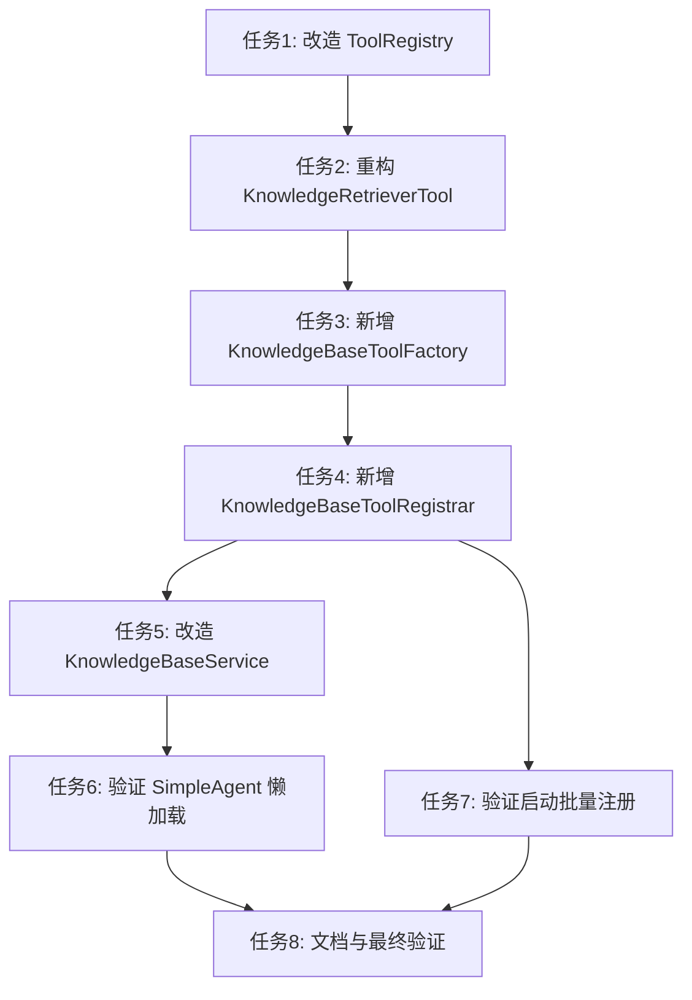

# 增量任务计划: CR-003 知识库动态 Tool 注册

> **变更原因**: 原有单 Tool + 参数化调用模式下，LLM 需指定知识库名称作为参数，存在 LLM 幻觉生成未知知识库名称的风险。改为每个知识库独立注册为 Tool，由 LLM 通过 Function Calling 选择具体 Tool。

> **需求/技术方案文档**: 
> - 需求: `specs/features/2026-07-24/RAG知识库问答/RAG知识库问答.md`
> - 技术方案: `specs/features/2026-07-24/RAG知识库问答/RAG知识库问答_技术方案.md`

> **关联 AC**: AC-033 (创建知识库时自动注册 Tool)、AC-034 (删除知识库时自动注销 Tool)、AC-035 (系统启动时批量注册已有知识库 Tool)

> **关联业务规则**: BR-RAG-011、BR-RAG-019、BR-RAG-020

---

## 任务清单

| # | 任务描述 | 优先级 | 关联 AC | 状态 | 涉及文件 |
|---|---------|--------|---------|------|---------|
| 1 | **改造 ToolRegistry 支持动态注册/注销** | P0 | AC-033, AC-034 | 已完成 | `agent-demo-tools/src/main/java/com/agentdemo/tools/registry/ToolRegistry.java` |
| 2 | **重构 KnowledgeRetrieverTool 为核心检索逻辑** | P0 | AC-006, AC-033 | 已完成 | `agent-demo-rag/src/main/java/com/agentdemo/rag/retriever/KnowledgeRetrieverTool.java` |
| 3 | **新增 KnowledgeBaseToolFactory 动态工具工厂** | P0 | AC-033 | 已完成 | `agent-demo-rag/src/main/java/com/agentdemo/rag/retriever/KnowledgeBaseToolFactory.java` (新增) |
| 4 | **新增 KnowledgeBaseToolRegistrar 生命周期管理** | P0 | AC-033, AC-034, AC-035 | 已完成 | `agent-demo-rag/src/main/java/com/agentdemo/rag/retriever/KnowledgeBaseToolRegistrar.java` (新增) |
| 5 | **改造 KnowledgeBaseService 联动 Tool 生命周期** | P0 | AC-033, AC-034 | 已完成 | `agent-demo-rag/src/main/java/com/agentdemo/rag/service/KnowledgeBaseService.java` |
| 6 | **验证 SimpleAgent 懒加载绑定动态 Tool** | P1 | AC-006, AC-035 | 已完成 | `agent-demo-agent/src/main/java/com/agentdemo/agent/single/SimpleAgent.java`、`agent-demo-agent/src/test/java/com/agentdemo/agent/single/SimpleAgentTest.java` |
| 7 | **验证系统启动批量注册流程** | P1 | AC-035 | 已完成 | `agent-demo-rag/src/test/java/com/agentdemo/rag/retriever/KnowledgeBaseToolRegistrarTest.java` (新增) |
| 8 | **更新文档与最终验证** | P2 | 全部 AC | 已完成 | `KNOWLEDGE_BASE.md`、`specs/features/2026-07-24/RAG知识库问答/RAG知识库问答_技术方案.md` |

---

## 任务详情

### 任务 1: 改造 ToolRegistry 支持动态注册/注销

**描述**: 在 `ToolRegistry` 中新增 `register(Object tool)` 和 `unregisterTool(String toolName)` 方法，支持运行时动态添加/移除工具。`unregisterTool` 通过遍历工具方法名匹配移除。

**详细步骤**:
1. 在 `ToolRegistry` 中新增 `public void register(Object tool)` 方法（线程安全，添加到 `tools` 列表）
2. 新增 `public void unregisterTool(String toolName)` 方法（通过 `Method.getName()` 匹配工具名，使用 `removeIf` 移除）
3. 新增 `public int getToolCount()` 方法
4. 编写单元测试 `ToolRegistryTest` 验证注册/注销逻辑

**验收标准**: 动态 register/unregister 后，`listTools()` 返回正确的工具列表

**关联 AC**: AC-033 (创建知识库时自动注册 Tool)、AC-034 (删除知识库时自动注销 Tool)

---

### 任务 2: 重构 KnowledgeRetrieverTool 为核心检索逻辑

**描述**: 将 `KnowledgeRetrieverTool` 从 `@Tool` Bean 改为 `@Component`，移除 `@Tool` 注解的 `searchKnowledge()` 方法。新增 `searchByKbId(String kbId, String query)` 方法供动态 Tool 代理委托调用。

**详细步骤**:
1. 移除 `searchKnowledge(String knowledgeBaseName, String query)` 方法上的 `@Tool` 注解
2. 将 `searchKnowledge` 方法标记为 `@Deprecated`，保留实现逻辑（避免破坏现有测试）
3. 新增 `public String searchByKbId(String kbId, String query)` 方法：
   - 从 `knowledgeBaseStore.findById(kbId)` 查找知识库
   - 校验知识库存在且非空
   - 向量化 + 向量检索（复用现有逻辑）
   - 组装结果（携带来源元数据，CR-002）
4. 确保原有 `searchKnowledge()` 方法内部委托给 `searchByKbId()`

**验收标准**: `searchByKbId()` 正确执行检索，原有 `searchKnowledge()` 仍可使用（标记废弃）

**关联 AC**: AC-006 (Agent 选择知识库 Tool 检索)

---

### 任务 3: 新增 KnowledgeBaseToolFactory 动态工具工厂

**描述**: 创建 `KnowledgeBaseToolFactory`，使用 CGLIB 动态代理为每个知识库生成独立的 Tool 实例。生成的 Tool 绑定 kbId，方法调用时自动委托给 `KnowledgeRetrieverTool.searchByKbId()`。

**详细步骤**:
1. 创建 `KnowledgeBaseToolFactory` 类（`@Component`）
2. 实现 `public Object createTool(KnowledgeBase kb)` 方法：
   - 使用 `Enhancer.create()` 创建 CGLIB 代理
   - `MethodInterceptor` 拦截非 Object 方法，调用 `retrieverTool.searchByKbId(kb.getId(), query)`
   - 实现 `hashCode()` / `equals()` / `toString()` 基本代理
3. 实现 `public String buildToolDescription(KnowledgeBase kb)` 方法（动态生成 @Tool 描述）
4. 实现 `public String buildToolMethodName(KnowledgeBase kb)` 方法（返回 `kb_{kbId}`）
5. 编写单元测试验证代理创建和方法拦截

**验收标准**: 生成的 Tool 调用时正确委托到 `KnowledgeRetrieverTool.searchByKbId()`

**关联 AC**: AC-033 (创建知识库时自动注册 Tool)

---

### 任务 4: 新增 KnowledgeBaseToolRegistrar 生命周期管理

**描述**: 创建 `KnowledgeBaseToolRegistrar`，实现 `ApplicationRunner` 接口。系统启动时扫描所有知识库并批量注册 Tool；提供 `registerToolForKb()` 和 `unregisterToolForKb()` 方法供 Service 层调用。

**详细步骤**:
1. 创建 `KnowledgeBaseToolRegistrar` 类（`@Component`），实现 `ApplicationRunner`
2. 实现 `run()` 方法：
   - 注入 `KnowledgeBaseStore`、`KnowledgeBaseToolFactory`、`ToolRegistry`
   - 遍历 `knowledgeBaseStore.findAll()`，对每个 KnowledgeBase 调用 `registerToolForKb()`
   - 单个知识库异常不中断其他知识库注册
3. 实现 `public void registerToolForKb(KnowledgeBase kb)` 方法
4. 实现 `public void unregisterToolForKb(String kbId)` 方法
5. 编写单元测试验证启动批量注册和单个注册/注销逻辑

**验收标准**: 系统启动后所有已有知识库 Tool 均已注册；单个知识库注册/注销不影响其他

**关联 AC**: AC-033、AC-034、AC-035

---

### 任务 5: 改造 KnowledgeBaseService 联动 Tool 生命周期

**描述**: 修改 `KnowledgeBaseService.create()` 在创建知识库后调用 `KnowledgeBaseToolRegistrar.registerToolForKb()`；修改 `KnowledgeBaseService.delete()` 在删除知识库前调用 `unregisterToolForKb()`。

**详细步骤**:
1. 在 `InMemoryKnowledgeBaseService` 中注入 `KnowledgeBaseToolRegistrar`
2. 修改 `create()` 方法：创建知识库记录后，调用 `toolRegistrar.registerToolForKb(kb)`
3. 修改 `delete()` 方法：在删除知识库记录前，调用 `toolRegistrar.unregisterToolForKb(kbId)`
4. 更新 `KnowledgeBaseService` 接口（如需要）
5. 编写/更新单元测试验证创建/删除联动 Tool 注册/注销

**验收标准**: 创建知识库后 Tool 自动注册；删除知识库后 Tool 自动注销

**关联 AC**: AC-033、AC-034

---

### 任务 6: 验证 SimpleAgent 懒加载绑定动态 Tool

**描述**: 验证 `SimpleAgent.delegate` 懒加载机制确保新注册的动态 Tool 在下次 `getDelegate()` 调用时自动绑定。更新 `SimpleAgentTest` 新增测试用例。

**详细步骤**:
1. 在 `SimpleAgentTest` 中新增测试：
   - 创建知识库 → 验证 Agent 可以调用该知识库的 Tool
   - 删除知识库 → 验证 Agent 不再能调用该知识库的 Tool
2. 验证 `SimpleAgent.getDelegate()` 在 Tool 列表变化后重建 delegate
3. 验证懒加载逻辑：首次调用创建 delegate，后续复用；Tool 变化后重建

**验收标准**: Tool 增减后 Agent 自动感知，无需重启

**关联 AC**: AC-006、AC-035

---

### 任务 7: 验证系统启动批量注册流程

**描述**: 编写 `KnowledgeBaseToolRegistrarTest` 验证系统启动时批量注册已有知识库 Tool 的完整流程。

**详细步骤**:
1. 创建 `KnowledgeBaseToolRegistrarTest` 测试类
2. 测试场景：
   - 空知识库列表：系统启动后 ToolRegistry 为空
   - 多个知识库：系统启动后所有知识库 Tool 均已注册
   - 部分知识库注册异常：不影响其他知识库注册
3. 验证 `ApplicationRunner` 的执行时机（在所有 Bean 初始化完成后）

**验收标准**: 所有已有知识库在系统启动后自动注册为 Tool

**关联 AC**: AC-035

---

### 任务 8: 更新文档与最终验证

**描述**: 更新 `KNOWLEDGE_BASE.md` 中 RAG 模块描述，生成验证报告。

**详细步骤**:
1. 更新 `KNOWLEDGE_BASE.md`：
   - RAG 模块描述更新为反映动态 Tool 注册模式
   - 更新涉及的类清单（新增 KnowledgeBaseToolFactory、KnowledgeBaseToolRegistrar）
2. 运行全量测试验证：
   - `ToolRegistryTest` 全部通过
   - `KnowledgeRetrieverToolTest` 全部通过（含新的 searchByKbId 测试）
   - `KnowledgeBaseToolFactoryTest` 全部通过
   - `KnowledgeBaseToolRegistrarTest` 全部通过
   - `SimpleAgentTest` 全部通过
3. 生成验证报告 `验证报告_CR-003.md`

**验收标准**: 所有测试通过，文档更新完成

**关联 AC**: 全部 AC

---

## 实施顺序

**建议实施顺序**: 任务 1 → 2 → 3 → 4 → 5 → 6+7（可并行）→ 8

---

## 风险与注意事项

1. **~~CGLIB 代理与 LangChain4j @Tool 注解兼容性~~（已解决）**: CGLIB 代理生成的方法不继承 `@Tool` 注解（@Tool 无 @Inherited），LangChain4j ToolSpecifications 无法识别代理方法。**实际解决方案**：改用 ByteBuddy 运行时字节码生成，在生成的方法上直接写入 `@Tool` 注解，被 LangChain4j 正确识别
2. **Agent 会话上下文**: Tool 变化后重建 delegate 不影响现有会话的 memoryId 绑定
3. **并发安全**: ToolRegistry.register/unregister 需考虑并发场景（多线程同时操作知识库）
4. **性能影响**: 大量知识库（>100）时，ByteBuddy 动态类生成和 Tool 列表遍历的性能需关注
5. **异常隔离**: 单个知识库 Tool 注册失败不应影响其他知识库 Tool 注册和系统启动