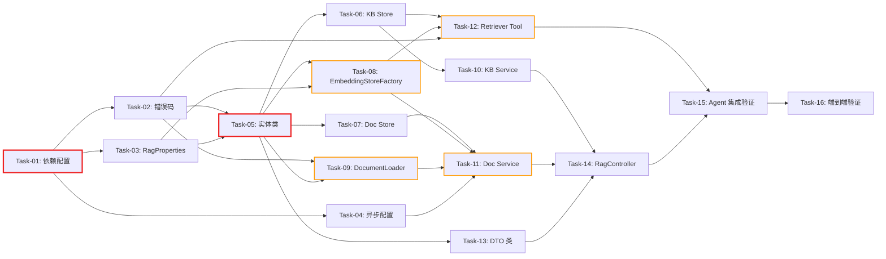

# 开发任务计划: RAG 知识库问答

## 0. 任务概览 (Task Overview)

*   **总任务数**: 16 个
*   **预计总工时**: 990 分钟（约 16.5 小时）
*   **开发方法**: TDD（测试驱动开发）- 每个任务按 Red-Green-Refactor 循环执行
*   **关键里程碑**:
    *   阶段一完成（基础设施层）：120 分钟 - 依赖/配置/错误码就绪
    *   阶段二完成（数据层）：240 分钟 - 实体/存储/向量工厂可用
    *   阶段三完成（业务逻辑层）：300 分钟 - 知识库/文档/解析服务可用
    *   阶段四完成（检索层）：90 分钟 - Agent 检索工具可用
    *   阶段五完成（接口层）：120 分钟 - REST API 全部可用
    *   阶段六完成（集成验证）：120 分钟 - 端到端流程跑通
*   **风险任务**: Task-08, Task-09, Task-11, Task-12
*   **阻塞任务**: Task-01, Task-05

### 依赖关系图

图例：🔴 红色粗边 = 阻塞任务 | 🟠 橙色边 = 风险任务

### 可并行任务组

| 并行组 | 可同时执行的任务 | 前置条件 | 说明 |
| :--- | :--- | :--- | :--- |
| 并行组 1 | Task-02 + Task-03 + Task-04 | Task-01 完成 | 错误码/配置/异步配置互不依赖 |
| 并行组 2 | Task-06 + Task-07 + Task-09 + Task-13 | Task-02 + Task-05 完成 | KB Store/Doc Store/DocumentLoader/DTO 互不依赖 |
| 并行组 3 | Task-10 + Task-12 | Task-06 + Task-08 完成 | KB Service 和 Retriever Tool 分别依赖不同组件 |

## 1. 准备工作 (Preparation)

- [ ] **Prep-01**: 确认开发环境就绪
    *   说明：JDK 17 + Maven 3.9+ + ARK_API_KEY 环境变量已配置
    *   验证：`mvn compile -pl agent-demo-rag -am` 编译通过
- [ ] **Prep-02**: 确认测试环境就绪
    *   说明：JUnit 5 + Mockito 测试框架可用，现有测试套件可运行
    *   验证：`mvn test -pl agent-demo-common -am` 通过
- [ ] **Prep-03**: 确认需求文档和技术方案文档已审阅
    *   说明：`RAG知识库问答.md`（27 条 AC）和 `RAG知识库问答_技术方案.md` 已确认
    *   验证：文档存在且内容完整

## 2. 开发任务 (Development Tasks)

> 每个任务按 TDD 循环执行：RED（写测试）-> GREEN（写实现）-> REFACTOR（重构）
> 编译验证命令：`mvn compile -pl {模块名} -am`

### 阶段一：基础设施层 (Infrastructure Layer)

> 依赖配置、错误码、配置类、异步配置
>
> **阶段完成标准**: 所有依赖可编译通过、错误码枚举完整、配置属性可注入、异步线程池可工作

- [ ] **Task-01**: 依赖配置（BOM + RAG 模块 + Web 模块 pom.xml）
    *   **通俗解释**: 做完这步后，项目就引入了 RAG 所需的全部工具包，后续代码可以直接使用这些工具。
    *   **说明**: BOM 新增 pdfbox 版本管理；agent-demo-rag/pom.xml 新增 langchain4j-milvus、milvus-sdk-java、pdfbox、spring-boot-starter、spring-boot-starter-validation 依赖；agent-demo-web/pom.xml 新增 agent-demo-rag 依赖
    *   **涉及文件**: `agent-demo-bom/pom.xml`, `agent-demo-rag/pom.xml`, `agent-demo-web/pom.xml`
    *   **测试文件**: 无（配置验证通过编译即可）
    *   **参考**: 技术方案 Sec 10（依赖变更清单）
    *   **对应AC**: 无（基础设施）
    *   **预估工时**: 30m
    *   **依赖**: 无
    *   **阻塞标注**: 🔒 所有后续任务的前置条件
    *   **验证标准**:
        - [ ] `mvn compile -pl agent-demo-rag -am` 编译通过
        - [ ] `mvn compile -pl agent-demo-web -am` 编译通过
        - [ ] BOM 中 pdfbox.version 属性已声明
        - [ ] agent-demo-rag/pom.xml 包含 langchain4j-milvus、pdfbox 依赖声明
        - [ ] agent-demo-web/pom.xml 包含 agent-demo-rag 依赖声明

- [ ] **Task-02**: ErrorCode 新增 RAG 错误码
    *   **通俗解释**: 做完这步后，系统就为 RAG 模块定义了一套专属的错误编号，出错时能精准定位是哪个环节的问题。
    *   **说明**: 在 ErrorCode 枚举中新增 7 个 RAG 错误码（5303-5309）
    *   **涉及文件**: `agent-demo-common/src/main/java/com/agentdemo/common/exception/ErrorCode.java`
    *   **测试文件**: `agent-demo-common/src/test/java/com/agentdemo/common/exception/ErrorCodeTest.java`
    *   **参考**: 技术方案 Sec 3.3
    *   **对应AC**: AC-011, AC-013, AC-017, AC-018, AC-020, AC-021, AC-022, AC-023
    *   **预估工时**: 20m
    *   **依赖**: Task-01
    *   **验证标准**:
        - [ ] ErrorCode 枚举包含 RAG_DOCUMENT_PARSE_FAILED(5303)
        - [ ] ErrorCode 枚举包含 RAG_VECTOR_STORE_INIT_FAILED(5304)
        - [ ] ErrorCode 枚举包含 RAG_KNOWLEDGE_BASE_NOT_FOUND(5305)
        - [ ] ErrorCode 枚举包含 RAG_DOCUMENT_NOT_FOUND(5306)
        - [ ] ErrorCode 枚举包含 RAG_KNOWLEDGE_BASE_NAME_EXISTS(5307)
        - [ ] ErrorCode 枚举包含 RAG_DOCUMENT_SIZE_EXCEEDED(5308)
        - [ ] ErrorCode 枚举包含 RAG_DOCUMENT_FORMAT_UNSUPPORTED(5309)
        - [ ] 所有错误码的 code 值在 5303-5309 区间，不与现有码重复
        - [ ] `mvn compile -pl agent-demo-common -am` 编译通过

- [ ] **Task-03**: RagProperties 配置类 + application.yml 配置
    *   **通俗解释**: 做完这步后，RAG 模块的各种设置（如文档大小限制、分块参数、检索数量等）都可以通过配置文件调整，不用改代码。
    *   **说明**: 创建 RagProperties 配置属性绑定类（含 StoreType 枚举、Document/Chunk/Retrieval/Milvus 内部类）；在 application.yml 中新增 rag.* 配置段
    *   **涉及文件**: `agent-demo-rag/src/main/java/com/agentdemo/rag/config/RagProperties.java`, `agent-demo-bootstrap/src/main/resources/application.yml`
    *   **测试文件**: `agent-demo-rag/src/test/java/com/agentdemo/rag/config/RagPropertiesTest.java`
    *   **参考**: 技术方案 Sec 6.2
    *   **对应AC**: AC-012, AC-013, AC-027
    *   **预估工时**: 40m
    *   **依赖**: Task-01
    *   **验证标准**:
        - [ ] RagProperties 类标注 @ConfigurationProperties(prefix = "rag")
        - [ ] storeType 默认值为 MEMORY，可配置为 MILVUS
        - [ ] document.maxSize 默认 "10MB"，supportedFormats 默认 [txt, md, pdf]
        - [ ] chunk.size 默认 1000，chunk.overlap 默认 200
        - [ ] retrieval.maxResults 默认 5，retrieval.minScore 默认 0.0
        - [ ] milvus.host 默认 localhost，milvus.port 默认 19530
        - [ ] application.yml 包含完整的 rag.* 配置段
        - [ ] Spring 容器能注入 RagProperties Bean

- [ ] **Task-04**: RagAsyncConfig 异步线程池配置
    *   **通俗解释**: 做完这步后，系统就有了一个专门处理文档上传的后台"工作队"，不会因为处理大文档而卡住主线程。
    *   **说明**: 创建 RagAsyncConfig 配置类（@EnableAsync + ragTaskExecutor 线程池 Bean）；在启动类或配置类上启用 @EnableAsync
    *   **涉及文件**: `agent-demo-rag/src/main/java/com/agentdemo/rag/config/RagAsyncConfig.java`
    *   **测试文件**: `agent-demo-rag/src/test/java/com/agentdemo/rag/config/RagAsyncConfigTest.java`
    *   **参考**: 技术方案 Sec 6.1
    *   **对应AC**: AC-003
    *   **预估工时**: 30m
    *   **依赖**: Task-01
    *   **验证标准**:
        - [ ] RagAsyncConfig 类标注 @Configuration 和 @EnableAsync
        - [ ] ragTaskExecutor Bean 核心线程数 2，最大 4，队列容量 50
        - [ ] 线程名前缀为 "rag-async-"
        - [ ] 拒绝策略为 CallerRunsPolicy
        - [ ] Spring 容器能注入 ragTaskExecutor Bean

### 阶段二：数据层 (Data Layer)

> 实体类、存储接口与实现、向量存储工厂
>
> **阶段完成标准**: 实体类可实例化、内存存储 CRUD 正常、EmbeddingStore 可按配置创建

- [ ] **Task-05**: 实体类（DocumentStatus + KnowledgeBase + DocumentInfo）
    *   **通俗解释**: 做完这步后，系统就有了描述"知识库"和"文档"的数据模型，就像给仓库里的货物设计了标签格式。
    *   **说明**: 创建 DocumentStatus 枚举（PENDING/PROCESSING/COMPLETED/FAILED）；创建 KnowledgeBase 实体（id/name/description/documentCount/createTime）；创建 DocumentInfo 实体（id/knowledgeBaseId/fileName/fileSize/format/status/chunkCount/failReason/uploadTime）
    *   **涉及文件**: `agent-demo-rag/src/main/java/com/agentdemo/rag/entity/DocumentStatus.java`, `KnowledgeBase.java`, `DocumentInfo.java`
    *   **测试文件**: `agent-demo-rag/src/test/java/com/agentdemo/rag/entity/EntityTest.java`
    *   **参考**: 技术方案 Sec 3.1
    *   **对应AC**: AC-001, AC-003, AC-004
    *   **预估工时**: 30m
    *   **依赖**: Task-01
    *   **阻塞标注**: 🔒 被 6 个后续任务依赖
    *   **验证标准**:
        - [ ] DocumentStatus 枚举包含 PENDING, PROCESSING, COMPLETED, FAILED 四个值
        - [ ] KnowledgeBase 包含 id(String), name(String), description(String), documentCount(int), createTime(LocalDateTime) 字段
        - [ ] DocumentInfo 包含 id, knowledgeBaseId, fileName, fileSize(long), format, status(DocumentStatus), chunkCount(int), failReason(String), uploadTime(LocalDateTime) 字段
        - [ ] 所有实体类使用 @Data 注解（Lombok）
        - [ ] `mvn compile -pl agent-demo-rag -am` 编译通过

- [ ] **Task-06**: KnowledgeBaseStore 接口 + InMemoryKnowledgeBaseStore 实现
    *   **通俗解释**: 做完这步后，系统就能在内存中创建、查找、删除知识库记录了，相当于知识库的"登记处"。
    *   **说明**: 创建 KnowledgeBaseStore 接口（save/findById/findByName/findAll/delete/updateDocumentCount）；创建 InMemoryKnowledgeBaseStore 实现（ConcurrentHashMap + 名称索引）
    *   **涉及文件**: `agent-demo-rag/src/main/java/com/agentdemo/rag/store/KnowledgeBaseStore.java`, `InMemoryKnowledgeBaseStore.java`
    *   **测试文件**: `agent-demo-rag/src/test/java/com/agentdemo/rag/store/InMemoryKnowledgeBaseStoreTest.java`
    *   **参考**: 技术方案 Sec 3.1
    *   **对应AC**: AC-001, AC-002, AC-011
    *   **预估工时**: 60m
    *   **依赖**: Task-05
    *   **验证标准**:
        - [ ] save(kb) 存储知识库后，findById(kb.getId()) 返回该知识库
        - [ ] findByName("产品文档") 返回匹配的知识库
        - [ ] findByName("不存在") 返回 null
        - [ ] findAll() 返回所有知识库列表
        - [ ] delete(id) 删除后，findById(id) 返回 null
        - [ ] delete(id) 同时删除名称索引
        - [ ] updateDocumentCount(id, count) 更新文档计数
        - [ ] 并发调用 save 线程安全（ConcurrentHashMap）

- [ ] **Task-07**: DocumentStore 接口 + InMemoryDocumentStore 实现
    *   **通俗解释**: 做完这步后，系统就能在内存中管理文档的元信息了，包括记录文档状态、按知识库查询文档列表。
    *   **说明**: 创建 DocumentStore 接口（save/findById/findByKnowledgeBaseId/delete/updateStatus）；创建 InMemoryDocumentStore 实现（ConcurrentHashMap + 知识库索引）
    *   **涉及文件**: `agent-demo-rag/src/main/java/com/agentdemo/rag/store/DocumentStore.java`, `InMemoryDocumentStore.java`
    *   **测试文件**: `agent-demo-rag/src/test/java/com/agentdemo/rag/store/InMemoryDocumentStoreTest.java`
    *   **参考**: 技术方案 Sec 3.1
    *   **对应AC**: AC-003, AC-004, AC-005, AC-008
    *   **预估工时**: 60m
    *   **依赖**: Task-05
    *   **验证标准**:
        - [ ] save(doc) 存储文档后，findById(doc.getId()) 返回该文档
        - [ ] findByKnowledgeBaseId(kbId) 返回该知识库下所有文档列表
        - [ ] findByKnowledgeBaseId(kbId) 当无文档时返回空列表
        - [ ] delete(id) 删除后，findById(id) 返回 null
        - [ ] delete(id) 同时从知识库索引中移除
        - [ ] updateStatus(id, PROCESSING, null) 更新状态为处理中
        - [ ] updateStatus(id, COMPLETED, 15) 更新状态为已完成并设置分块数
        - [ ] updateStatus(id, FAILED, "解析失败") 更新状态为失败并记录原因

- [ ] **Task-08**: EmbeddingStoreFactory 向量存储工厂 ⚠️
    *   **通俗解释**: 做完这步后，系统就有了一个"向量仓库"的创建器，默认用内存存储，也可以切换到 Milvus 专业向量数据库。
    *   **说明**: 创建 EmbeddingStoreFactory（懒加载 + 双重检查锁 + 根据配置创建 InMemoryEmbeddingStore 或 MilvusEmbeddingStore），动态获取 Embedding 维度
    *   **涉及文件**: `agent-demo-rag/src/main/java/com/agentdemo/rag/store/EmbeddingStoreFactory.java`
    *   **测试文件**: `agent-demo-rag/src/test/java/com/agentdemo/rag/store/EmbeddingStoreFactoryTest.java`
    *   **参考**: 技术方案 Sec 3.2
    *   **对应AC**: AC-003, AC-006, AC-020
    *   **预估工时**: 90m
    *   **依赖**: Task-03, Task-05
    *   **风险标注**: ⚠️ 涉及 LangChain4j EmbeddingStore API，需确认 1.17.2 版本的 metadata filtering API
    *   **验证标准**:
        - [ ] storeType=MEMORY 时，getEmbeddingStore() 返回 InMemoryEmbeddingStore 实例
        - [ ] storeType=MILVUS 时，getEmbeddingStore() 返回 MilvusEmbeddingStore 实例（需 Mock Milvus 连接）
        - [ ] 多次调用 getEmbeddingStore() 返回同一实例（单例）
        - [ ] 并发调用 getEmbeddingStore() 线程安全（双重检查锁）
        - [ ] Embedding 维度通过 modelFactory.getEmbeddingModel().dimension() 动态获取
        - [ ] Mock ModelFactory 测试时不实际调用 Embedding API

### 阶段三：业务逻辑层 (Business Logic Layer)

> 文档加载器、知识库服务、文档服务
>
> **阶段完成标准**: 文档可解析分块、知识库 CRUD 完整、文档上传异步处理全流程可用

- [ ] **Task-09**: DocumentLoader 文档加载与解析 ⚠️
    *   **通俗解释**: 做完这步后，系统能读取 txt、Markdown、PDF 三种格式的文件并提取出文字内容，就像一个能读懂不同格式文档的"翻译官"。
    *   **说明**: 创建 DocumentLoader（格式白名单校验、大小校验、txt/md 直接读取、PDF 用 Apache PDFBox 解析），解析失败抛 BusinessException
    *   **涉及文件**: `agent-demo-rag/src/main/java/com/agentdemo/rag/loader/DocumentLoader.java`
    *   **测试文件**: `agent-demo-rag/src/test/java/com/agentdemo/rag/loader/DocumentLoaderTest.java`
    *   **参考**: 技术方案 Sec 4.2
    *   **对应AC**: AC-012, AC-013, AC-017, AC-018
    *   **预估工时**: 90m
    *   **依赖**: Task-02, Task-05
    *   **风险标注**: ⚠️ PDFBox API 使用，需准备测试用 PDF 文件
    *   **验证标准**:
        - [ ] load(txtFile, "txt") 返回文件文本内容
        - [ ] load(mdFile, "md") 返回 Markdown 原文
        - [ ] load(pdfFile, "pdf") 返回 PDF 提取的文本
        - [ ] load(file, "docx") 抛出 BusinessException(ErrorCode.RAG_DOCUMENT_FORMAT_UNSUPPORTED)
        - [ ] load(11MBFile, "txt") 抛出 BusinessException(ErrorCode.RAG_DOCUMENT_SIZE_EXCEEDED)
        - [ ] load(10MBFile, "txt") 正常解析（边界值）
        - [ ] load(corruptedPdf, "pdf") 抛出 BusinessException(ErrorCode.RAG_DOCUMENT_PARSE_FAILED)

- [ ] **Task-10**: KnowledgeBaseService 知识库管理服务
    *   **通俗解释**: 做完这步后，用户就能创建、查看、删除知识库了，删除时会自动清理里面的所有文档和向量数据。
    *   **说明**: 创建 KnowledgeBaseService（创建知识库含名称唯一性校验、查询列表、级联删除含向量数据清理），构造器注入 KnowledgeBaseStore + DocumentStore + EmbeddingStoreFactory
    *   **涉及文件**: `agent-demo-rag/src/main/java/com/agentdemo/rag/service/KnowledgeBaseService.java`
    *   **测试文件**: `agent-demo-rag/src/test/java/com/agentdemo/rag/service/KnowledgeBaseServiceTest.java`
    *   **参考**: 技术方案 Sec 4.1, 4.4
    *   **对应AC**: AC-001, AC-002, AC-009, AC-011, AC-021
    *   **预估工时**: 90m
    *   **依赖**: Task-06, Task-07, Task-08
    *   **验证标准**:
        - [ ] create("产品文档", "描述") 返回包含 id 的 KnowledgeBase，documentCount=0
        - [ ] create("产品文档", null) 当名称已存在时抛出 BusinessException(ErrorCode.RAG_KNOWLEDGE_BASE_NAME_EXISTS)
        - [ ] list() 返回所有知识库列表
        - [ ] delete(existingId) 删除知识库及其下所有文档记录和向量数据
        - [ ] delete(nonExistentId) 抛出 BusinessException(ErrorCode.RAG_KNOWLEDGE_BASE_NOT_FOUND)
        - [ ] delete(kbId) 当知识库下有文档时，级联删除 DocumentStore 中对应记录
        - [ ] delete(kbId) 调用 EmbeddingStore 清理 knowledgeBaseId 对应的向量数据
        - [ ] 所有 Service 方法使用 Mock Store 进行单元测试

- [ ] **Task-11**: DocumentService 文档管理服务 ⚠️
    *   **通俗解释**: 做完这步后，用户上传文档后系统会在后台自动完成解析、分块、向量化、入库的全流程，并能随时查询处理进度。
    *   **说明**: 创建 DocumentService（上传校验+创建PENDING记录+保存临时文件+触发@Async；异步处理：解析->分块->向量化->存入EmbeddingStore->更新状态；查询状态；查询列表；删除文档含向量清理），构造器注入 DocumentStore + KnowledgeBaseStore + DocumentLoader + EmbeddingStoreFactory + ModelFactory + RagProperties
    *   **涉及文件**: `agent-demo-rag/src/main/java/com/agentdemo/rag/service/DocumentService.java`
    *   **测试文件**: `agent-demo-rag/src/test/java/com/agentdemo/rag/service/DocumentServiceTest.java`
    *   **参考**: 技术方案 Sec 4.1, 4.5
    *   **对应AC**: AC-003, AC-004, AC-005, AC-008, AC-012, AC-013, AC-017, AC-018, AC-019, AC-022, AC-023, AC-025
    *   **预估工时**: 120m
    *   **依赖**: Task-04, Task-07, Task-08, Task-09
    *   **风险标注**: ⚠️ 异步处理流程复杂，涉及多组件协作和状态管理
    *   **验证标准**:
        - [ ] upload(kbId, txtFile) 返回 DocumentInfo，status=PENDING
        - [ ] upload(nonExistentKbId, file) 抛出 BusinessException(ErrorCode.RAG_KNOWLEDGE_BASE_NOT_FOUND)
        - [ ] upload(kbId, 11MBFile) 抛出 BusinessException(ErrorCode.RAG_DOCUMENT_SIZE_EXCEEDED)
        - [ ] upload(kbId, docxFile) 抛出 BusinessException(ErrorCode.RAG_DOCUMENT_FORMAT_UNSUPPORTED)
        - [ ] upload(kbId, "产品手册.pdf") 和 upload(kbId, "产品手册.pdf") 两次上传均成功，documentId 不同
        - [ ] processDocument(docId) 成功后 status=COMPLETED，chunkCount>0
        - [ ] processDocument(docId) 解析失败时 status=FAILED，failReason="文档解析失败"
        - [ ] processDocument(docId) 向量化失败时 status=FAILED，failReason="向量化失败"
        - [ ] getStatus(docId) 返回当前状态和分块数/失败原因
        - [ ] listByKnowledgeBase(kbId) 返回该知识库下所有文档
        - [ ] delete(existingDocId) 删除文档记录和对应向量数据
        - [ ] delete(nonExistentDocId) 抛出 BusinessException(ErrorCode.RAG_DOCUMENT_NOT_FOUND)
        - [ ] TextSegment metadata 包含 knowledgeBaseId 和 documentId

### 阶段四：检索层 (Retrieval Layer)

> Agent 知识库检索工具
>
> **阶段完成标准**: Agent 可通过 @Tool 自主调用知识库检索，返回 Top-5 文档片段

- [ ] **Task-12**: KnowledgeRetrieverTool 知识库检索工具 ⚠️
    *   **通俗解释**: 做完这步后，Agent 在对话中就能像查字典一样，从知识库里找到和用户问题最相关的 5 段内容，用来辅助回答。
    *   **说明**: 创建 KnowledgeRetrieverTool（@Component + @Tool），searchKnowledge 方法接收 knowledgeBaseName + query，执行向量语义检索（metadata 过滤 + Top-5），异常降级为文本返回不中断对话
    *   **涉及文件**: `agent-demo-rag/src/main/java/com/agentdemo/rag/retriever/KnowledgeRetrieverTool.java`
    *   **测试文件**: `agent-demo-rag/src/test/java/com/agentdemo/rag/retriever/KnowledgeRetrieverToolTest.java`
    *   **参考**: 技术方案 Sec 4.3
    *   **对应AC**: AC-006, AC-014, AC-016, AC-020, AC-024, AC-027
    *   **预估工时**: 90m
    *   **依赖**: Task-02, Task-06, Task-08
    *   **风险标注**: ⚠️ LangChain4j EmbeddingSearchRequest + metadata filter API 需确认版本兼容性
    *   **验证标准**:
        - [ ] searchKnowledge("产品文档", "价格") 返回包含"【片段1】"等前缀的文本
        - [ ] searchKnowledge("不存在", "query") 返回 "知识库 '不存在' 不存在"
        - [ ] searchKnowledge("空知识库", "query") 返回 "知识库 '空知识库' 为空，暂无文档内容"
        - [ ] searchKnowledge(kbName, "无关问题") 当无匹配结果时返回 "未找到与问题相关的文档"
        - [ ] searchKnowledge(kbName, "query") 当 EmbeddingStore 异常时返回 "知识库服务暂时不可用，请稍后重试"
        - [ ] 检索结果最多返回 5 个片段
        - [ ] @Tool 注解描述包含工具用途和参数说明
        - [ ] 检索使用 metadata filter 按 knowledgeBaseId 过滤
        - [ ] Mock ModelFactory 和 EmbeddingStore 进行单元测试

### 阶段五：接口层 (Presentation Layer)

> DTO + Controller
>
> **阶段完成标准**: 7 个 REST API 接口全部可用，Swagger 文档可访问

- [ ] **Task-13**: DTO 类（请求/响应数据传输对象）
    *   **通俗解释**: 做完这步后，API 接口就有了标准的数据格式，调用方知道该传什么参数、会收到什么响应。
    *   **说明**: 创建 CreateKnowledgeBaseRequest（name @NotBlank @Pattern @Size, description @Size(max=200)）、KnowledgeBaseResponse、DocumentResponse、DocumentStatusResponse
    *   **涉及文件**: `agent-demo-web/src/main/java/com/agentdemo/web/dto/CreateKnowledgeBaseRequest.java`, `KnowledgeBaseResponse.java`, `DocumentResponse.java`, `DocumentStatusResponse.java`
    *   **测试文件**: `agent-demo-web/src/test/java/com/agentdemo/web/dto/DtoValidationTest.java`
    *   **参考**: 技术方案 Sec 2.2
    *   **对应AC**: AC-010, AC-026
    *   **预估工时**: 30m
    *   **依赖**: Task-05
    *   **验证标准**:
        - [ ] CreateKnowledgeBaseRequest.name 标注 @NotBlank
        - [ ] CreateKnowledgeBaseRequest.name 标注 @Pattern 匹配中英文/数字/下划线/连字符
        - [ ] CreateKnowledgeBaseRequest.name 标注 @Size(min=1, max=50)
        - [ ] CreateKnowledgeBaseRequest.description 标注 @Size(max=200)
        - [ ] KnowledgeBaseResponse 包含 id, name, description, documentCount, createTime
        - [ ] DocumentResponse 包含 documentId, fileName, fileSize, format, status, chunkCount, failReason, uploadTime
        - [ ] DocumentStatusResponse 包含 documentId, status, chunkCount, failReason
        - [ ] 传入空 name 时校验失败
        - [ ] 传入 51 字符 name 时校验失败
        - [ ] 传入 201 字符 description 时校验失败

- [ ] **Task-14**: RagController REST API 控制器
    *   **通俗解释**: 做完这步后，用户就可以通过 HTTP 接口创建知识库、上传文档、查询状态了，就像操作一个知识库管理后台。
    *   **说明**: 创建 RagController（@RestController @RequestMapping("/api/rag")），实现 7 个接口（创建知识库/列表/删除/上传文档/文档列表/查询状态/删除文档），统一返回 Result<T>
    *   **涉及文件**: `agent-demo-web/src/main/java/com/agentdemo/web/controller/RagController.java`
    *   **测试文件**: `agent-demo-web/src/test/java/com/agentdemo/web/controller/RagControllerTest.java`
    *   **参考**: 技术方案 Sec 2.1, 2.2
    *   **对应AC**: AC-001, AC-002, AC-003, AC-004, AC-005, AC-008, AC-009, AC-010, AC-011, AC-013, AC-017, AC-021, AC-022, AC-023, AC-025, AC-026
    *   **预估工时**: 90m
    *   **依赖**: Task-10, Task-11, Task-13
    *   **验证标准**:
        - [ ] POST /api/rag/knowledges 传入合法 name+description 返回 200 + KnowledgeBaseResponse
        - [ ] POST /api/rag/knowledges 传入空 name 返回 400
        - [ ] POST /api/rag/knowledges 传入重复 name 返回 5307
        - [ ] GET /api/rag/knowledges 返回知识库列表
        - [ ] DELETE /api/rag/knowledges/{id} 删除成功返回 200
        - [ ] DELETE /api/rag/knowledges/{不存在id} 返回 5305
        - [ ] POST /api/rag/knowledges/{id}/documents 上传 txt 文件返回 200 + DocumentResponse(status=PENDING)
        - [ ] POST /api/rag/knowledges/{不存在id}/documents 返回 5305
        - [ ] POST /api/rag/knowledges/{id}/documents 上传 11MB 文件返回 5308
        - [ ] POST /api/rag/knowledges/{id}/documents 上传 .docx 返回 5309
        - [ ] GET /api/rag/knowledges/{id}/documents 返回文档列表
        - [ ] GET /api/rag/documents/{id}/status 返回 DocumentStatusResponse
        - [ ] DELETE /api/rag/documents/{id} 删除成功返回 200
        - [ ] DELETE /api/rag/documents/{不存在id} 返回 5306
        - [ ] 所有接口返回 Result<T> 包装
        - [ ] 使用 @Tag 和 @Operation 标注 Swagger 文档
        - [ ] Controller 使用 Mock Service 进行单元测试

### 阶段六：集成验证 (Integration Verification)

> Agent 工具集成 + 端到端流程
>
> **阶段完成标准**: KnowledgeRetrieverTool 被 ToolRegistry 自动注册、Agent 可自主调用检索、完整流程跑通

- [ ] **Task-15**: Agent 工具集成验证
    *   **通俗解释**: 做完这步后，Agent 就自动"学会"了查知识库这个新技能，在对话中遇到知识库相关的问题会主动去检索。
    *   **说明**: 验证 KnowledgeRetrieverTool 被 ToolRegistry 自动扫描注册；验证 SimpleAgent delegate 构建时绑定该工具；验证 Agent 可通过 ReAct 循环自主调用检索工具
    *   **涉及文件**: `agent-demo-agent/`（验证现有代码兼容）, `agent-demo-rag/src/main/java/com/agentdemo/rag/retriever/KnowledgeRetrieverTool.java`
    *   **测试文件**: `agent-demo-rag/src/test/java/com/agentdemo/rag/integration/AgentToolIntegrationTest.java`
    *   **参考**: 技术方案 Sec 1.1, 4.3
    *   **对应AC**: AC-006, AC-007, AC-015
    *   **预估工时**: 60m
    *   **依赖**: Task-12, Task-14
    *   **验证标准**:
        - [ ] Spring 启动后 ToolRegistry.listTools() 包含 KnowledgeRetrieverTool 实例
        - [ ] SimpleAgent.getDelegate() 构建时 toolRegistry.size() 包含 RAG 工具
        - [ ] Agent 对话中提问知识库相关问题时调用 searchKnowledge 工具
        - [ ] Agent 对话中提问无关问题（如"你好"）时不调用 searchKnowledge 工具
        - [ ] Agent 调用工具后基于检索结果生成回答（非空回答）
        - [ ] 工具异常时 Agent 对话不中断，返回降级提示

- [ ] **Task-16**: 端到端流程验证
    *   **通俗解释**: 做完这步后，从创建知识库到上传文档到 Agent 检索回答的完整流程都能跑通，功能全部就绪。
    *   **说明**: 验证完整业务流程：创建知识库 -> 上传文档 -> 等待异步处理完成 -> Agent 对话检索 -> 基于知识库回答；验证删除流程
    *   **涉及文件**: 全模块
    *   **测试文件**: `agent-demo-rag/src/test/java/com/agentdemo/rag/integration/RagE2ETest.java`
    *   **参考**: 需求文档全部 AC
    *   **对应AC**: AC-001 ~ AC-027（全部）
    *   **预估工时**: 60m
    *   **依赖**: Task-15
    *   **验证标准**:
        - [ ] 创建知识库 -> 上传 txt 文档 -> 等待 COMPLETED -> Agent 提问 -> 收到基于文档内容的回答
        - [ ] 创建知识库 -> 上传 PDF 文档 -> 等待 COMPLETED -> Agent 提问 -> 收到基于文档内容的回答
        - [ ] 删除文档 -> Agent 检索不再返回该文档内容
        - [ ] 删除知识库 -> Agent 检索返回"知识库不存在"
        - [ ] 上传损坏 PDF -> 状态为 FAILED -> Agent 检索不返回该文档内容
        - [ ] `mvn compile -pl agent-demo-bootstrap -am` 全量编译通过
        - [ ] `mvn test -pl agent-demo-rag -am` 模块测试全部通过

## 3. 验收标准检查清单 (AC Checklist)

> 确保所有验收标准都有对应的任务

| 验收标准ID | 验收标准描述 | 对应任务 | 状态 |
| :--- | :--- | :--- | :--- |
| AC-001 | 创建知识库 | Task-05, Task-10, Task-13, Task-14 | 待完成 |
| AC-002 | 查看知识库列表 | Task-06, Task-10, Task-14 | 待完成 |
| AC-003 | 上传文档（异步启动） | Task-04, Task-08, Task-11, Task-14 | 待完成 |
| AC-004 | 查询文档处理状态 | Task-07, Task-11, Task-14 | 待完成 |
| AC-005 | 查看文档列表 | Task-07, Task-11, Task-14 | 待完成 |
| AC-006 | Agent 检索知识库 | Task-08, Task-12, Task-15 | 待完成 |
| AC-007 | Agent 基于检索结果回答 | Task-15, Task-16 | 待完成 |
| AC-008 | 删除文档 | Task-07, Task-11, Task-14 | 待完成 |
| AC-009 | 删除知识库（级联） | Task-06, Task-07, Task-08, Task-10, Task-14 | 待完成 |
| AC-010 | 知识库命名规则 | Task-13, Task-14 | 待完成 |
| AC-011 | 知识库名称重复 | Task-02, Task-06, Task-10, Task-14 | 待完成 |
| AC-012 | 文档大小在限制内 | Task-09, Task-11 | 待完成 |
| AC-013 | 文档超过大小限制 | Task-02, Task-09, Task-11, Task-14 | 待完成 |
| AC-014 | 检索无结果 | Task-12 | 待完成 |
| AC-015 | Agent 判断无需检索 | Task-15, Task-16 | 待完成 |
| AC-016 | 空知识库检索 | Task-12 | 待完成 |
| AC-017 | 上传不支持格式 | Task-02, Task-09, Task-11, Task-14 | 待完成 |
| AC-018 | 文档解析失败 | Task-02, Task-09, Task-11 | 待完成 |
| AC-019 | 向量化失败 | Task-11 | 待完成 |
| AC-020 | 向量数据库不可用 | Task-08, Task-12 | 待完成 |
| AC-021 | 删除不存在的知识库 | Task-02, Task-10, Task-14 | 待完成 |
| AC-022 | 删除不存在的文档 | Task-02, Task-11, Task-14 | 待完成 |
| AC-023 | 向不存在的知识库上传 | Task-02, Task-11, Task-14 | 待完成 |
| AC-024 | 检索不存在的知识库 | Task-12 | 待完成 |
| AC-025 | 重复上传同名文档 | Task-11, Task-14 | 待完成 |
| AC-026 | 知识库描述长度限制 | Task-13, Task-14 | 待完成 |
| AC-027 | 检索结果数量限制 | Task-03, Task-12 | 待完成 |

## 4. 验证计划 (Verification Plan)

### 4.1 TDD 过程验证（每个任务内部）
- [ ] RED：测试编写完成后运行 `mvn test -pl {模块} -am "-Dtest=XXX" "-Dsurefire.failIfNoSpecifiedTests=false"`，确认全部失败
- [ ] GREEN：实现代码后运行，确认全部通过
- [ ] REFACTOR：重构后运行，确认仍全部通过

### 4.2 阶段验证检查点

| 阶段 | 验证动作 | 关联任务 | 通过标准 |
| :--- | :--- | :--- | :--- |
| 阶段一完成后 | 编译验证 + 配置注入验证 | Task-01~04 | `mvn compile -pl agent-demo-rag -am` 通过；RagProperties 可注入；ragTaskExecutor 可注入 |
| 阶段二完成后 | 存储层单元测试 | Task-05~08 | KB Store / Doc Store CRUD 测试通过；EmbeddingStoreFactory 单例测试通过 |
| 阶段三完成后 | 业务逻辑单元测试 | Task-09~11 | DocumentLoader 格式解析测试通过；KB Service 级联删除测试通过；Doc Service 异步处理状态流转测试通过 |
| 阶段四完成后 | 检索工具单元测试 | Task-12 | 检索结果 Top-5 限制测试通过；异常降级测试通过；metadata 过滤测试通过 |
| 阶段五完成后 | Controller API 测试 | Task-13~14 | 7 个 REST 接口测试通过；参数校验测试通过；Swagger 文档可访问 |
| 阶段六完成后 | 集成 + 端到端测试 | Task-15~16 | Agent 工具自动注册验证通过；完整流程（创建->上传->检索->回答->删除）跑通 |

### 4.3 验收标准逐项验证

| AC | 验证方式 | 关联任务 | 状态 |
| :--- | :--- | :--- | :--- |
| AC-001 | 运行 Task-10/14 测试：POST /api/rag/knowledges 传入合法参数返回 200 + KnowledgeBaseResponse | Task-10, Task-14 | 待验证 |
| AC-002 | 运行 Task-14 测试：GET /api/rag/knowledges 返回知识库列表 | Task-14 | 待验证 |
| AC-003 | 运行 Task-11/14 测试：上传文档返回 documentId + status=PENDING | Task-11, Task-14 | 待验证 |
| AC-004 | 运行 Task-11/14 测试：GET 状态接口返回 PENDING/PROCESSING/COMPLETED/FAILED | Task-11, Task-14 | 待验证 |
| AC-005 | 运行 Task-14 测试：GET 文档列表返回所有文档信息 | Task-14 | 待验证 |
| AC-006 | 运行 Task-12/15 测试：Agent 调用 searchKnowledge 返回文档片段 | Task-12, Task-15 | 待验证 |
| AC-007 | 运行 Task-15/16 测试：Agent 基于检索结果生成回答 | Task-15, Task-16 | 待验证 |
| AC-008 | 运行 Task-11/14 测试：DELETE 文档后列表中移除 | Task-11, Task-14 | 待验证 |
| AC-009 | 运行 Task-10/14 测试：DELETE 知识库后文档和向量数据级联删除 | Task-10, Task-14 | 待验证 |
| AC-010 | 运行 Task-13 测试：name 校验 @Pattern @Size | Task-13 | 待验证 |
| AC-011 | 运行 Task-10 测试：重复名称抛出 5307 | Task-10 | 待验证 |
| AC-012 | 运行 Task-09 测试：10MB 文件正常解析 | Task-09 | 待验证 |
| AC-013 | 运行 Task-09/11/14 测试：11MB 文件抛出 5308 | Task-09, Task-11, Task-14 | 待验证 |
| AC-014 | 运行 Task-12 测试：无结果返回"未找到相关文档" | Task-12 | 待验证 |
| AC-015 | 运行 Task-15 测试：无关问题不调用工具 | Task-15 | 待验证 |
| AC-016 | 运行 Task-12 测试：空知识库返回提示 | Task-12 | 待验证 |
| AC-017 | 运行 Task-09/11/14 测试：.docx 抛出 5309 | Task-09, Task-11, Task-14 | 待验证 |
| AC-018 | 运行 Task-09/11 测试：损坏 PDF 状态为 FAILED | Task-09, Task-11 | 待验证 |
| AC-019 | 运行 Task-11 测试：Embedding 不可用时状态为 FAILED | Task-11 | 待验证 |
| AC-020 | 运行 Task-12 测试：Store 异常返回降级提示 | Task-12 | 待验证 |
| AC-021 | 运行 Task-10/14 测试：删除不存在知识库抛出 5305 | Task-10, Task-14 | 待验证 |
| AC-022 | 运行 Task-11/14 测试：删除不存在文档抛出 5306 | Task-11, Task-14 | 待验证 |
| AC-023 | 运行 Task-11/14 测试：向不存在知识库上传抛出 5305 | Task-11, Task-14 | 待验证 |
| AC-024 | 运行 Task-12 测试：检索不存在知识库返回提示 | Task-12 | 待验证 |
| AC-025 | 运行 Task-11 测试：同名文档以不同 ID 共存 | Task-11 | 待验证 |
| AC-026 | 运行 Task-13 测试：description @Size(max=200) 校验 | Task-13 | 待验证 |
| AC-027 | 运行 Task-12 测试：结果最多 5 条 | Task-12 | 待验证 |

### 4.4 最终验证（所有阶段完成后）
- [ ] `mvn compile -pl agent-demo-bootstrap -am` 全量编译通过
- [ ] `mvn test -pl agent-demo-rag -am` RAG 模块测试全部通过
- [ ] `mvn test -pl agent-demo-web -am` Web 模块测试全部通过
- [ ] 按照验收标准逐项端到端验证（AC-001 ~ AC-027）
- [ ] Swagger UI（http://localhost:8080/swagger-ui.html）可访问 RAG 接口文档

### 4.5 上线前检查
- [ ] 代码审查（Code Review）
- [ ] 更新 KNOWLEDGE_BASE.md（RAG 模块状态从"规划中"改为"已实现"）
- [ ] 确认 application.yml 中 rag.* 配置段完整
- [ ] 确认 @EnableAsync 已启用
- [ ] 确认回滚方案：移除 web 对 rag 依赖 + 删除 rag 配置即可回滚

## 5. 风险与注意事项 (Risks & Notes)

*   **技术风险**:
    *   ⚠️ Task-08（EmbeddingStoreFactory）：LangChain4j 1.17.2 的 InMemoryEmbeddingStore metadata filtering API 需确认具体用法。建议：先查阅 LangChain4j 1.17.2 源码或文档确认 `EmbeddingSearchRequest.filter()` 和 `metadataKey()` 的 API 签名。
    *   ⚠️ Task-09（DocumentLoader）：Apache PDFBox 3.0.3 的 API（`Loader.loadPDF()`、`PDFTextStripper`）需确认。建议：准备 3 个测试文件（txt/md/pdf）和 1 个损坏 PDF 用于异常测试。
    *   ⚠️ Task-11（DocumentService）：@Async 方法在单元测试中需特殊处理（同步执行或 Mock）。建议：测试时使用 `@Async` 注解的代理验证，或直接调用内部方法测试逻辑。
    *   ⚠️ Task-12（KnowledgeRetrieverTool）：metadata filter 的 `metadataKey("knowledgeBaseId").isEqualTo(value)` 语法需确认 LangChain4j 1.17.2 兼容性。建议：先写一个最简测试验证 filter API。

*   **依赖风险**:
    *   Task-01 是所有任务的前置条件，必须首先完成
    *   Task-05（实体类）被 6 个任务依赖，是关键阻塞点
    *   Task-08（EmbeddingStoreFactory）被 Task-11 和 Task-12 依赖，是检索能力的基石
    *   并行组 2（Task-06/07/09/13）需在 Task-05 完成后同时启动，避免成为瓶颈

*   **时间风险**:
    *   如果 Task-08/12 的 LangChain4j API 调研耗时超预期，可先跳过 metadata filter 用全量检索+内存过滤降级
    *   如果 Task-11 的异步测试困难，可先验证同步逻辑，异步集成验证留到 Task-16
    *   Task-15/16 的集成验证依赖 ARK_API_KEY 和实际 LLM 调用，如环境不可用可 Mock

*   **质量保证**:
    *   每个任务通过 TDD 循环保证代码质量
    *   阶段性集成验证保证整体稳定性
    *   风险任务（Task-08/09/11/12）建议完成后立即进行代码审查
    *   所有测试使用 Mock 隔离外部依赖（ModelFactory、EmbeddingStore、Milvus）
