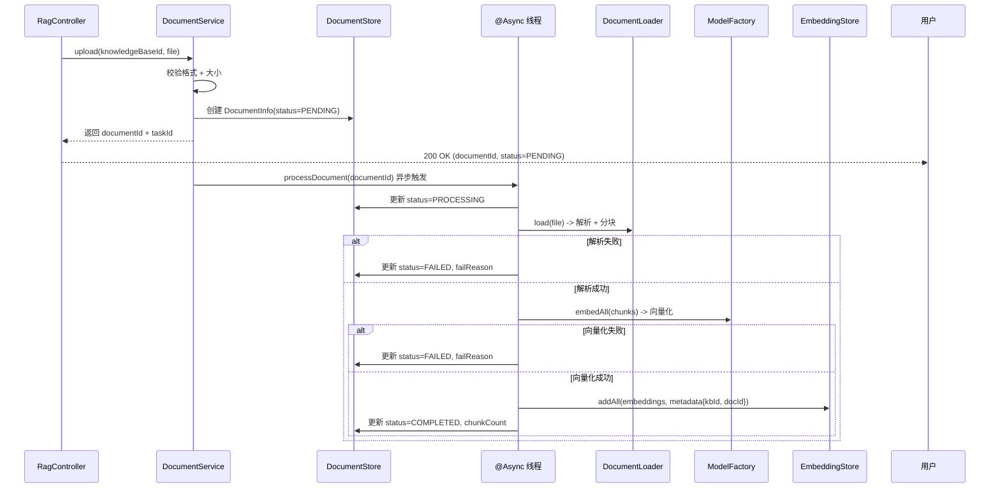
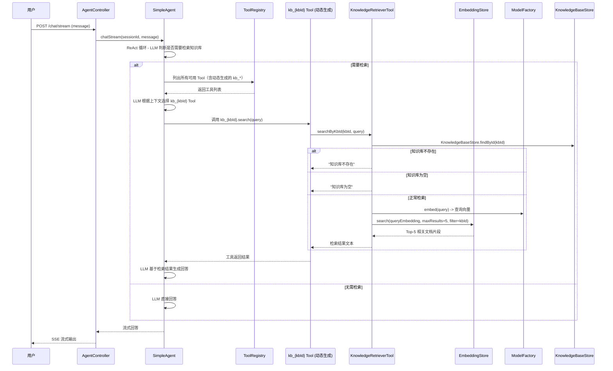

# 技术设计文档: RAG 知识库问答

## 0. 设计概要 (Design Summary)

* **功能描述**：为 Agent 提供知识库问答能力，用户通过 API 上传文档构建知识库，Agent 在对话中自主检索知识库并基于文档内容回答问题。

* **影响范围**：`agent-demo-rag`（核心实现）、`agent-demo-web`（Controller + DTO）、`agent-demo-common`（新增错误码）、`agent-demo-bom`（新增依赖版本）、`agent-demo-bootstrap`（配置项 + @EnableAsync）

* **技术难点**：

  * 向量存储可切换架构（InMemory / Milvus），通过接口抽象 + Spring 配置实现

  * 多知识库隔离：通过 TextSegment metadata 中的 `knowledgeBaseId` 实现检索时过滤

  * 异步文档处理：@Async + 内存任务状态管理，需处理解析失败、向量化失败等异常状态

  * Agent 工具集成：每个知识库动态生成独立的 @Tool 工具，Agent 通过 Function Calling 选择具体知识库工具（CR-003）

* **依赖关系**：

  * 复用 `ModelFactory.getEmbeddingModel()`（豆包 Embedding 模型）

  * 复用 `ToolRegistry` 自动扫描注册机制 + 动态注册 API

  * 复用 `SimpleAgent` 的 AiServices.builder().tools() 工具绑定机制

  * CR-003 新增：`KnowledgeBaseToolRegistrar`（启动批注册 + 生命周期监听）、`KnowledgeBaseToolFactory`（ByteBuddy 动态生成带 @Tool 注解的知识库工具类）

  * 新增依赖：`langchain4j-milvus`（BOM 已声明）、`apache-pdfbox`（PDF 解析）

## 1. 架构概览 (Architecture Overview)

### 1.1 模块交互关系

```
agent-demo-web (Controller + DTO)
    │
    ├── RagController ── 调用 ──> KnowledgeBaseService / DocumentService
    │                                   │
    │                                   ├── agent-demo-rag (Service + Store + Retriever)
    │                                   │       │
    │                                   │       ├── KnowledgeBaseService ──> KnowledgeBaseStore (内存)
    │                                   │       ├── DocumentService ──> DocumentStore (内存)
    │                                   │       │                  ──> DocumentLoader (解析+分块)
    │                                   │       │                  ──> EmbeddingStoreFactory (可切换)
    │                                   │       │                       ├── InMemoryEmbeddingStore (默认)
    │                                   │       │                       └── MilvusEmbeddingStore (可选)
    │                                   │       ├── KnowledgeBaseToolRegistrar (CR-003: 启动/创建/删除时动态管理 Tool)
    │                                   │       ├── KnowledgeBaseToolFactory (CR-003: ByteBuddy 动态生成带 @Tool 注解的知识库工具类)
    │                                   │       └── KnowledgeRetrieverTool (@Component, 核心检索逻辑，被动态 Tool 委托调用)
    │                                   │
    │                                   └── agent-demo-llm (ModelFactory.getEmbeddingModel())
    │
    └── AgentController ── SimpleAgent ── ToolRegistry ── 自动扫描静态 Tool + 动态注册知识库 Tool (CR-003)
```

### 1.2 数据流向

**文档入库流程（异步）：**



**检索问答流程（CR-003 更新：动态 Tool 模式）：**



### 1.3 RAG 模块内部分层

```
agent-demo-rag/
└── src/main/java/com/agentdemo/rag/
    ├── config/
    │   └── RagProperties.java              # RAG 配置属性绑定
    ├── entity/
    │   ├── KnowledgeBase.java              # 知识库实体
    │   ├── DocumentInfo.java               # 文档信息实体
    │   └── DocumentStatus.java             # 文档处理状态枚举
    ├── store/
    │   ├── KnowledgeBaseStore.java         # 知识库元数据存储接口
    │   ├── InMemoryKnowledgeBaseStore.java # 内存实现
    │   ├── DocumentStore.java              # 文档元数据存储接口
    │   ├── InMemoryDocumentStore.java      # 内存实现
    │   └── EmbeddingStoreFactory.java      # 向量存储工厂（可切换 InMemory/Milvus）
    ├── service/
    │   ├── KnowledgeBaseService.java       # 知识库管理服务
    │   └── DocumentService.java            # 文档管理服务（含 @Async 异步处理）
    ├── loader/
    │   └── DocumentLoader.java             # 文档加载与解析（txt/md/pdf）
    ├── retriever/
        ├── KnowledgeRetrieverTool.java        # @Component 核心检索逻辑（被动态 Tool 委托调用）
        ├── KnowledgeBaseToolRegistrar.java    # CR-003: 启动时扫描知识库并批量注册 Tool
        └── KnowledgeBaseToolFactory.java       # CR-003: ByteBuddy 动态生成带 @Tool 注解的知识库工具类
```

```
agent-demo-web/ (新增)
└── src/main/java/com/agentdemo/web/
    ├── controller/
    │   └── RagController.java              # RAG 管理 REST API
    └── dto/
        ├── CreateKnowledgeBaseRequest.java
        ├── KnowledgeBaseResponse.java
        ├── DocumentResponse.java
        └── DocumentStatusResponse.java
```

## 2. API 设计 (API Design)

> 遵循项目 RESTful 约定，路径前缀 `/api/rag/`，统一返回 `Result<T>`

### 2.1 接口列表

| 接口名称    | 方法     | 路径                                              | 描述         | 对应验收标准                                         |
| :------ | :----- | :---------------------------------------------- | :--------- | :--------------------------------------------- |
| 创建知识库   | POST   | /api/rag/knowledges                             | 创建新知识库     | AC-001, AC-010, AC-011, AC-026                 |
| 查询知识库列表 | GET    | /api/rag/knowledges                             | 获取所有知识库    | AC-002                                         |
| 删除知识库   | DELETE | /api/rag/knowledges/{knowledgeBaseId}           | 级联删除知识库及文档 | AC-009, AC-021                                 |
| 上传文档    | POST   | /api/rag/knowledges/{knowledgeBaseId}/documents | 上传文档到指定知识库 | AC-003, AC-012, AC-013, AC-017, AC-023, AC-025 |
| 查询文档列表  | GET    | /api/rag/knowledges/{knowledgeBaseId}/documents | 获取知识库下所有文档 | AC-005                                         |
| 查询文档状态  | GET    | /api/rag/documents/{documentId}/status          | 查询文档处理状态   | AC-004, AC-018, AC-019                         |
| 删除文档    | DELETE | /api/rag/documents/{documentId}                 | 删除文档及向量数据  | AC-008, AC-022                                 |

### 2.2 接口详情

#### 接口 1: 创建知识库

* **路径**: `POST /api/rag/knowledges`

* **描述**: 创建新的知识库，名称全局唯一

* **鉴权**: 无（学习项目无认证）

* **Request**:

  ```json
  {
    "name": "产品文档",
    "description": "产品相关技术文档"
  }
  ```

  * `name`: 必填，1-50 字符，仅允许中英文、数字、下划线、连字符

  * `description`: 可选，最长 200 字符

* **Response (成功)**:

  ```json
  {
    "success": true,
    "code": 200,
    "message": "成功",
    "data": {
      "id": "a1b2c3d4e5f6",
      "name": "产品文档",
      "description": "产品相关技术文档",
      "documentCount": 0,
      "createTime": "2026-07-24T10:00:00"
    },
    "traceId": "xxx"
  }
  ```

* **Response (失败)**:

  * 名称重复 -> `code: 5307, message: "知识库名称已存在"`

  * 名称格式不合法 -> `code: 400, message: "参数无效：知识库名称..."`

  * 描述超长 -> `code: 400, message: "参数无效：描述长度不能超过 200 字符"`

#### 接口 2: 查询知识库列表

* **路径**: `GET /api/rag/knowledges`

* **描述**: 获取所有知识库列表

* **Response (成功)**:

  ```json
  {
    "success": true,
    "code": 200,
    "data": [
      {
        "id": "a1b2c3d4e5f6",
        "name": "产品文档",
        "description": "产品相关技术文档",
        "documentCount": 5,
        "createTime": "2026-07-24T10:00:00"
      }
    ],
    "traceId": "xxx"
  }
  ```

#### 接口 3: 删除知识库

* **路径**: `DELETE /api/rag/knowledges/{knowledgeBaseId}`

* **描述**: 删除知识库，级联删除其下所有文档记录和向量数据

* **Response (成功)**: `Result.success()`

* **Response (失败)**:

  * 知识库不存在 -> `code: 5305, message: "知识库不存在"`

#### 接口 4: 上传文档

* **路径**: `POST /api/rag/knowledges/{knowledgeBaseId}/documents`

* **描述**: 上传文档到指定知识库，异步处理

* **Request**: `multipart/form-data`

  * `file`: 文件（必填，最大 10MB，支持 txt/md/pdf）

* **Response (成功)**:

  ```json
  {
    "success": true,
    "code": 200,
    "data": {
      "documentId": "d1e2f3g4h5i6",
      "fileName": "产品手册.pdf",
      "fileSize": 5242880,
      "format": "pdf",
      "status": "PENDING",
      "uploadTime": "2026-07-24T10:05:00"
    },
    "traceId": "xxx"
  }
  ```

* **Response (失败)**:

  * 知识库不存在 -> `code: 5305`

  * 文件超过 10MB -> `code: 5308, message: "文档大小超过 10MB 限制"`

  * 不支持的格式 -> `code: 5309, message: "不支持的文档格式，仅支持 txt、md、pdf"`

#### 接口 5: 查询文档列表

* **路径**: `GET /api/rag/knowledges/{knowledgeBaseId}/documents`

* **描述**: 获取指定知识库下所有文档

* **Response (成功)**:

  ```json
  {
    "success": true,
    "code": 200,
    "data": [
      {
        "documentId": "d1e2f3g4h5i6",
        "fileName": "产品手册.pdf",
        "fileSize": 5242880,
        "format": "pdf",
        "status": "COMPLETED",
        "chunkCount": 15,
        "failReason": null,
        "uploadTime": "2026-07-24T10:05:00"
      }
    ],
    "traceId": "xxx"
  }
  ```

#### 接口 6: 查询文档处理状态

* **路径**: `GET /api/rag/documents/{documentId}/status`

* **描述**: 查询文档异步处理状态

* **Response (成功)**:

  ```json
  {
    "success": true,
    "code": 200,
    "data": {
      "documentId": "d1e2f3g4h5i6",
      "status": "COMPLETED",
      "chunkCount": 15,
      "failReason": null
    },
    "traceId": "xxx"
  }
  ```

  * `status`: `PENDING`（待处理）/ `PROCESSING`（处理中）/ `COMPLETED`（已完成）/ `FAILED`（失败）

  * `failReason`: 失败时记录原因（"文档解析失败" / "向量化失败"）

#### 接口 7: 删除文档

* **路径**: `DELETE /api/rag/documents/{documentId}`

* **描述**: 删除文档记录和对应的向量数据

* **Response (成功)**: `Result.success()`

* **Response (失败)**:

  * 文档不存在 -> `code: 5306, message: "文档不存在"`

### 2.3 Agent 检索工具 API（非 REST，@Tool 方法）

```java
@Tool("从指定知识库中检索与用户问题相关的文档片段。" +
      "当用户的问题可能涉及知识库中的内容时调用此工具。" +
      "参数 knowledgeBaseName 为知识库名称，query 为检索问题。")
public String searchKnowledge(String knowledgeBaseName, String query)
```

* **调用方**: Agent（ReAct 循环中自主调用）

* **参数**:

  * `knowledgeBaseName`: 知识库名称（Agent 根据用户问题自主判断）

  * `query`: 检索问题文本

* **返回**: 检索到的 Top-5 文档片段文本（拼接），或错误提示信息

* **对应验收标准**: AC-006, AC-007, AC-014, AC-015, AC-016, AC-020, AC-024, AC-027

## 3. 数据模型设计 (Data Model)

> 项目当前纯内存存储（无数据库），RAG 元数据沿用此模式。向量数据通过 EmbeddingStore 存储。

### 3.1 内存数据结构

#### KnowledgeBase（知识库实体）

| 字段名           | 类型            | 约束           | 说明                |
| :------------ | :------------ | :----------- | :---------------- |
| id            | String        | UUID 去横线，主键  | 知识库 ID            |
| name          | String        | 1-50 字符，全局唯一 | 知识库名称             |
| description   | String        | 最长 200 字符    | 知识库描述             |
| documentCount | int           | 默认 0         | 文档数量（冗余字段，加速列表查询） |
| createTime    | LocalDateTime | 非空           | 创建时间              |

* **存储方式**: `ConcurrentHashMap<String, KnowledgeBase>`（key = id）

* **名称索引**: 额外维护 `ConcurrentHashMap<String, String>`（name -> id），用于唯一性校验和按名查找

#### DocumentInfo（文档信息实体）

| 字段名             | 类型             | 约束           | 说明               |
| :-------------- | :------------- | :----------- | :--------------- |
| id              | String         | UUID 去横线，主键  | 文档 ID            |
| knowledgeBaseId | String         | 非空，外键        | 所属知识库 ID         |
| fileName        | String         | 非空           | 文件名              |
| fileSize        | long           | > 0, <= 10MB | 文件大小（字节）         |
| format          | String         | txt/md/pdf   | 文档格式             |
| status          | DocumentStatus | 枚举           | 处理状态             |
| chunkCount      | int            | 默认 0         | 分块数量（处理完成后填充）    |
| failReason      | String         | 可空           | 失败原因（FAILED 时填充） |
| uploadTime      | LocalDateTime  | 非空           | 上传时间             |

* **存储方式**: `ConcurrentHashMap<String, DocumentInfo>`（key = id）

* **知识库索引**: 额外维护 `ConcurrentHashMap<String, List<String>>`（knowledgeBaseId -> List<documentId>），加速按知识库查询文档列表

#### DocumentStatus（文档处理状态枚举）

```java
public enum DocumentStatus {
    PENDING,      // 待处理
    PROCESSING,   // 处理中
    COMPLETED,    // 已完成
    FAILED        // 失败
}
```

#### 向量数据结构（EmbeddingStore）

* **存储类型**: `EmbeddingStore<TextSegment>`（LangChain4j 接口）

* **默认实现**: `InMemoryEmbeddingStore<TextSegment>`（零部署）

* **可选实现**: `MilvusEmbeddingStore`（需 Docker 部署 Milvus）

* **TextSegment metadata**:

  ```json
  {
    "knowledgeBaseId": "a1b2c3d4e5f6",
    "documentId": "d1e2f3g4h5i6",
    "fileName": "产品手册.pdf",
    "chunkIndex": "0"
  }
  ```

* **多知识库隔离**: 检索时通过 `metadata filter` 按 `knowledgeBaseId` 过滤

### 3.2 向量存储可切换设计

```java
/**
 * 向量存储工厂
 * 业务含义：根据配置动态创建 EmbeddingStore 实例，支持 InMemory（开发）和 Milvus（生产）切换
 */
@Component
public class EmbeddingStoreFactory {

    private final RagProperties ragProperties;
    private final ModelFactory modelFactory;
    private volatile EmbeddingStore<TextSegment> embeddingStore;

    /**
     * 获取 EmbeddingStore 实例（懒加载，双重检查锁）
     * 业务含义：首次调用时根据配置创建实例，后续复用
     */
    public EmbeddingStore<TextSegment> getEmbeddingStore() {
        if (embeddingStore == null) {
            synchronized (this) {
                if (embeddingStore == null) {
                    embeddingStore = createEmbeddingStore();
                }
            }
        }
        return embeddingStore;
    }

    private EmbeddingStore<TextSegment> createEmbeddingStore() {
        // 动态获取 Embedding 维度（豆包模型），不硬编码
        int dimension = modelFactory.getEmbeddingModel().dimension();
        return switch (ragProperties.getStoreType()) {
            case MEMORY -> new InMemoryEmbeddingStore<>();
            case MILVUS -> createMilvusEmbeddingStore(dimension);
        };
    }

    private EmbeddingStore<TextSegment> createMilvusEmbeddingStore(int dimension) {
        // 需要 langchain4j-milvus 依赖（pom 中 optional 或条件引入）
        return MilvusEmbeddingStore.builder()
                .host(ragProperties.getMilvus().getHost())
                .port(ragProperties.getMilvus().getPort())
                .collectionName(ragProperties.getMilvus().getCollectionName())
                .dimension(dimension)
                .indexType(IndexType.FLAT)
                .metricType(MetricType.COSINE)
                .build();
    }
}
```

* **配置切换**:

  ```yaml
  rag:
    store-type: memory  # memory | milvus
  ```

* **依赖管理**: `langchain4j-milvus` 依赖在 `agent-demo-rag/pom.xml` 中声明（BOM 已管理版本），切换到 milvus 时无需修改 pom，只需改配置 + 部署 Milvus

### 3.3 新增错误码

在 `ErrorCode.java` 枚举中新增（5300-5399 区间，已用 5300-5302）：

| 错误码  | 枚举名                                | 消息        | 对应 AC                  |
| :--- | :--------------------------------- | :-------- | :--------------------- |
| 5303 | RAG\_DOCUMENT\_PARSE\_FAILED       | 文档解析失败    | AC-018                 |
| 5304 | RAG\_VECTOR\_STORE\_INIT\_FAILED   | 向量存储初始化失败 | AC-020                 |
| 5305 | RAG\_KNOWLEDGE\_BASE\_NOT\_FOUND   | 知识库不存在    | AC-021, AC-023, AC-024 |
| 5306 | RAG\_DOCUMENT\_NOT\_FOUND          | 文档不存在     | AC-022                 |
| 5307 | RAG\_KNOWLEDGE\_BASE\_NAME\_EXISTS | 知识库名称已存在  | AC-011                 |
| 5308 | RAG\_DOCUMENT\_SIZE\_EXCEEDED      | 文档大小超过限制  | AC-013                 |
| 5309 | RAG\_DOCUMENT\_FORMAT\_UNSUPPORTED | 不支持的文档格式  | AC-017                 |

## 4. 核心逻辑与算法 (Core Logic)

### 4.1 文档上传与异步处理

* **触发条件**: 用户调用 `POST /api/rag/knowledges/{id}/documents` 上传文件

* **处理步骤**:

  1. **同步校验**：校验知识库存在 -> 校验文件格式（txt/md/pdf）-> 校验文件大小（<= 10MB）
  2. **创建记录**：生成 documentId（UUID），创建 DocumentInfo（status=PENDING），存入 DocumentStore
  3. **保存文件**：将上传文件保存到临时目录（`./data/rag/temp/{documentId}`）
  4. **返回响应**：返回 documentId + status=PENDING
  5. **异步触发**：调用 `@Async processDocument(documentId)` 方法

* **异步处理步骤**（`@Async processDocument`）:

  1. 更新 status=PROCESSING
  2. 调用 `DocumentLoader.load(filePath, format)` 解析文档为文本
  3. 调用 `DocumentSplitters.recursive(chunkSize, overlap)` 分块
  4. 为每个 TextSegment 添加 metadata（knowledgeBaseId, documentId, fileName, chunkIndex）
  5. 调用 `ModelFactory.getEmbeddingModel().embedAll(chunks)` 向量化
  6. 调用 `EmbeddingStore.addAll(embeddings, chunks)` 存入向量存储
  7. 更新 status=COMPLETED, chunkCount=分块数
  8. 删除临时文件

* **状态机**:

  ```
  [PENDING] --开始处理--> [PROCESSING]
  [PROCESSING] --全部成功--> [COMPLETED]
  [PROCESSING] --解析/向量化/存储失败--> [FAILED]
  ```

* **异常处理**:

  * 解析失败（损坏文件）: 捕获异常 -> status=FAILED, failReason="文档解析失败"

  * 向量化失败（Embedding 服务不可用）: 捕获异常 -> status=FAILED, failReason="向量化失败"

  * 向量存储失败: 捕获异常 -> status=FAILED, failReason="向量存储失败"

### 4.2 文档加载与解析

```java
/**
 * 文档加载器
 * 业务含义：根据文件格式选择解析策略，将文件内容解析为纯文本。
 * PDF 格式采用混合提取策略：tabula-java 提取表格结构（转为 Markdown）+ PDFBox 提取纯文本（CR-001 优化）。
 */
@Component
public class DocumentLoader {

    private static final Set<String> SUPPORTED_FORMATS = Set.of("txt", "md", "pdf");
    private static final long MAX_SIZE = 10 * 1024 * 1024; // 10MB

    /**
     * 加载并解析文档
     * @param fileBytes 文件字节数组
     * @param format 文件格式（txt/md/pdf）
     * @return 解析后的纯文本（PDF 含 Markdown 表格）
     */
    public String load(byte[] fileBytes, String format) {
        // 1. 校验格式
        if (!SUPPORTED_FORMATS.contains(format.toLowerCase())) {
            throw new BusinessException(ErrorCode.RAG_DOCUMENT_FORMAT_UNSUPPORTED,
                    "不支持的文档格式：" + format + "，仅支持 txt、md、pdf");
        }
        // 2. 校验大小
        long size = FileUtil.size(filePath);
        if (size > MAX_SIZE) {
            throw new BusinessException(ErrorCode.RAG_DOCUMENT_SIZE_EXCEEDED,
                    "文档大小超过 10MB 限制");
        }
        // 3. 按格式解析
        return switch (format.toLowerCase()) {
            case "txt", "md" -> Files.readString(filePath, StandardCharsets.UTF_8);
            case "pdf" -> parsePdf(filePath);
            default -> throw new BusinessException(ErrorCode.RAG_DOCUMENT_FORMAT_UNSUPPORTED,
                    "不支持的文档格式：" + format);
        };
    }

    /** PDF 解析：混合提取策略（tabula-java 表格 + PDFBox 纯文本）（CR-001 优化） */
    private String parsePdf(byte[] fileBytes) throws Exception {
        try (PDDocument document = Loader.loadPDF(fileBytes)) {
            // 1. 使用 tabula-java 检测并提取表格，转为 Markdown 格式
            String tableText = extractTablesAsMarkdown(document);

            // 2. 使用 PDFBox 提取纯文本（含表格区域的线性文本）
            PDFTextStripper stripper = new PDFTextStripper();
            String plainText = stripper.getText(document);

            // 3. 合并结果：如果检测到表格，将 Markdown 表格追加到纯文本末尾
            if (tableText.isEmpty()) {
                return plainText;
            }
            return plainText + "\n\n--- 表格内容 ---\n\n" + tableText;
        }
    }

    /** 使用 tabula-java 提取 PDF 中的表格为 Markdown 格式 */
    private String extractTablesAsMarkdown(PDDocument document) {
        SpreadsheetExtractionAlgorithm extractor = new SpreadsheetExtractionAlgorithm();
        ObjectExtractor objectExtractor = new ObjectExtractor(document);
        PageIterator pages = objectExtractor.extract();
        StringBuilder markdown = new StringBuilder();

        while (pages.hasNext()) {
            Page page = pages.next();
            List<Table> tables = extractor.extract(page);
            for (Table table : tables) {
                // 将表格转为 Markdown 格式
                for (int i = 0; i < table.getRowCount(); i++) {
                    List<RectangularTextContainer> row = table.getRows().get(i);
                    markdown.append("| ");
                    for (RectangularTextContainer cell : row) {
                        markdown.append(cell.getText().replace("|", "\\|")).append(" | ");
                    }
                    markdown.append("\n");
                    // 第一行后添加 Markdown 表头分隔符
                    if (i == 0) {
                        markdown.append("|");
                        for (int j = 0; j < row.size(); j++) {
                            markdown.append(" --- |");
                        }
                        markdown.append("\n");
                    }
                }
                markdown.append("\n");
            }
        }
        return markdown.toString();
    }
}
```

### 4.3 知识库检索（CR-003 动态 Tool 模式）

#### 4.3.1 核心检索逻辑（KnowledgeRetrieverTool）

```java
/**
 * 知识库检索核心逻辑
 * 业务含义：封装向量检索的完整流程，供动态 Tool 实例委托调用。
 * 不再直接暴露为 @Tool Bean，而是被每个知识库动态生成的 Tool 代理所引用。
 */
@Component
public class KnowledgeRetrieverTool {

    private static final Logger log = LoggerFactory.getLogger(KnowledgeRetrieverTool.class);
    private static final int MAX_RESULTS = 5;

    private final KnowledgeBaseStore knowledgeBaseStore;
    private final EmbeddingStoreFactory embeddingStoreFactory;
    private final ModelFactory modelFactory;

    /**
     * 按知识库 ID 检索
     * 业务含义：被动态 Tool 代理委托调用，kbId 由动态 Tool 构造时绑定，无需 LLM 传递。
     */
    public String searchByKbId(String kbId, String query) {
        // 1. 查找知识库
        KnowledgeBase kb = knowledgeBaseStore.findById(kbId);
        if (kb == null) {
            return "知识库不存在";
        }

        // 2. 检查知识库是否有文档
        if (kb.getDocumentCount() == 0) {
            return "知识库「" + kb.getName() + "」为空，暂无文档内容";
        }

        try {
            // 3. 向量化查询
            EmbeddingModel embeddingModel = modelFactory.getEmbeddingModel();
            Embedding queryEmbedding = embeddingModel.embed(query).content();

            // 4. 向量检索（按 knowledgeBaseId 过滤，返回 Top-5）
            EmbeddingSearchRequest searchRequest = EmbeddingSearchRequest.builder()
                    .queryEmbedding(queryEmbedding)
                    .maxResults(MAX_RESULTS)
                    .filter(metadataKey("knowledgeBaseId").isEqualTo(kbId))
                    .build();

            List<EmbeddingMatch<TextSegment>> matches =
                    embeddingStoreFactory.getEmbeddingStore().search(searchRequest).matches();

            // 5. 组装结果（携带来源元数据，CR-002）
            if (matches.isEmpty()) {
                return "未找到与问题相关的文档";
            }

            StringBuilder result = new StringBuilder();
            for (int i = 0; i < matches.size(); i++) {
                TextSegment segment = matches.get(i).embedded();
                result.append("【片段").append(i + 1).append("】\n");
                // 携带来源元数据
                String source = extractSource(segment.metadata());
                if (source != null) {
                    result.append(source).append("\n");
                }
                result.append(segment.text()).append("\n\n");
            }
            return result.toString();

        } catch (Exception e) {
            log.error("知识库检索失败: kbId={}, query={}", kbId, query, e);
            return "知识库服务暂时不可用，请稍后重试";
        }
    }

    /**
     * 从 metadata 中提取来源信息（CR-002）
     */
    private String extractSource(Map<String, Object> metadata) {
        if (metadata == null || metadata.isEmpty()) return null;
        StringBuilder sb = new StringBuilder("来源: ");
        String fileName = (String) metadata.get("fileName");
        String pageNumber = (String) metadata.get("pageNumber");
        String headerText = (String) metadata.get("headerText");
        if (fileName != null) sb.append(fileName);
        if (pageNumber != null) sb.append(" 第").append(pageNumber).append("页");
        if (headerText != null) sb.append(" 章节:").append(headerText);
        return sb.length() > 6 ? sb.toString() : null;
    }
}
```

#### 4.3.2 动态 Tool 工厂（KnowledgeBaseToolFactory）

```java
/**
 * 知识库动态 Tool 工厂
 * 业务含义：为每个知识库创建独立的 Tool 类（ByteBuddy 动态生成），
 * 方法上直接写入 @Tool 注解，使 LangChain4j ToolSpecifications 能够识别，
 * 从而消除 LLM 传递知识库名称参数的幻觉风险。
 *
 * 生成的 Tool 命名规则：kb_{kbId}
 * 生成的 Tool 描述格式：从知识库「{kbName}」中检索与用户问题相关的文档片段...
 */
@Component
public class KnowledgeBaseToolFactory {

    private final KnowledgeRetrieverTool retrieverTool;

    public KnowledgeBaseToolFactory(KnowledgeRetrieverTool retrieverTool) {
        this.retrieverTool = retrieverTool;
    }

    /**
     * 为指定知识库创建动态 Tool 实例
     * 使用 ByteBuddy 生成带 @Tool 注解的类，方法调用时绑定 kbId 并委托给 KnowledgeRetrieverTool
     */
    public Object createTool(KnowledgeBase kb) {
        String methodName = buildToolMethodName(kb);
        String className = "com.agentdemo.rag.retriever.KbTool_" + kb.getId();
        String description = buildToolDescription(kb);

        try {
            Class<?> toolClass = new ByteBuddy()
                    .subclass(Object.class)
                    .name(className)
                    .defineMethod(methodName, String.class, Modifier.PUBLIC)
                    .withParameter(String.class, "query")
                    .intercept(MethodDelegation.to(new SearchInterceptor(kb.getId(), retrieverTool)))
                    .annotateMethod(AnnotationDescription.Builder.ofType(Tool.class)
                            .defineArray("value", description)
                            .build())
                    .make()
                    .load(getClass().getClassLoader())
                    .getLoaded();

            return toolClass.getDeclaredConstructor().newInstance();
        } catch (Exception e) {
            throw new RuntimeException("生成知识库 Tool 失败, kbId=" + kb.getId(), e);
        }
    }

    /**
     * 构建 Tool 的 @Tool 描述
     */
    public String buildToolDescription(KnowledgeBase kb) {
        return "从知识库「" + kb.getName() + "」中检索与用户问题相关的文档片段。" +
               "当用户的问题涉及「" + kb.getName() + "」相关内容时调用此工具。";
    }

    /**
     * 构建 Tool 的方法名
     */
    public String buildToolMethodName(KnowledgeBase kb) {
        return "kb_" + kb.getId();
    }

    /**
     * ByteBuddy 方法拦截器：绑定 kbId 并委托给 KnowledgeRetrieverTool.searchByKbId
     */
    public static class SearchInterceptor {

        private final String kbId;
        private final KnowledgeRetrieverTool retrieverTool;

        public SearchInterceptor(String kbId, KnowledgeRetrieverTool retrieverTool) {
            this.kbId = kbId;
            this.retrieverTool = retrieverTool;
        }

        @RuntimeType
        public String search(@AllArguments Object[] args) {
            String query = (String) args[0];
            return retrieverTool.searchByKbId(kbId, query);
        }
    }
}
```

#### 4.3.3 Tool 注册管理（KnowledgeBaseToolRegistrar）

```java
/**
 * 知识库 Tool 注册管理
 * 业务含义：管理知识库 Tool 的全生命周期——启动时批量注册、创建时注册、删除时注销。
 * 实现 ApplicationRunner 确保启动后立即注册已有知识库的 Tool。
 */
@Component
public class KnowledgeBaseToolRegistrar implements ApplicationRunner {

    private static final Logger log = LoggerFactory.getLogger(KnowledgeBaseToolRegistrar.class);

    private final KnowledgeBaseStore knowledgeBaseStore;
    private final KnowledgeBaseToolFactory toolFactory;
    private final ToolRegistry toolRegistry;

    public KnowledgeBaseToolRegistrar(KnowledgeBaseStore knowledgeBaseStore,
                                       KnowledgeBaseToolFactory toolFactory,
                                       ToolRegistry toolRegistry) {
        this.knowledgeBaseStore = knowledgeBaseStore;
        this.toolFactory = toolFactory;
        this.toolRegistry = toolRegistry;
    }

    /**
     * 系统启动后批量注册已有知识库的 Tool
     */
    @Override
    public void run(ApplicationRunner args) {
        log.info("开始注册已有知识库的 Tool...");
        for (KnowledgeBase kb : knowledgeBaseStore.findAll()) {
            registerToolForKb(kb);
        }
        log.info("知识库 Tool 注册完成，共注册 {} 个", toolRegistry.getToolCount());
    }

    /**
     * 为指定知识库注册 Tool（创建知识库时调用）
     */
    public void registerToolForKb(KnowledgeBase kb) {
        Object tool = toolFactory.createTool(kb);
        toolRegistry.register(tool);
        log.info("注册知识库 Tool: kb_{} ({})", kb.getId(), kb.getName());
    }

    /**
     * 注销指定知识库的 Tool（删除知识库时调用）
     */
    public void unregisterToolForKb(String kbId) {
        toolRegistry.unregisterTool("kb_" + kbId);
        log.info("注销知识库 Tool: kb_{}", kbId);
    }
}
```

#### 4.3.4 改造 ToolRegistry 支持动态注册/注销

```java
/**
 * 工具注册表
 * 业务含义：扫描所有带 @Tool 注解的 Bean，提供工具列表给 Agent。
 * CR-003 新增 register/unregisterTool 方法支持知识库 Tool 的动态管理。
 */
@Component
public class ToolRegistry {

    private static final Logger log = LoggerFactory.getLogger(ToolRegistry.class);

    private final List<Object> tools = new CopyOnWriteArrayList<>();

    /**
     * 扫描并注册所有带 @Tool 注解的 Bean（原有逻辑）
     */
    @PostConstruct
    public void scanAndRegister() {
        // ... 原有扫描逻辑保持不变 ...
    }

    /**
     * 动态注册工具（CR-003：知识库 Tool 注册）
     */
    public void register(Object tool) {
        if (tool != null) {
            tools.add(tool);
            log.info("动态注册工具: {}", tool.getClass().getSimpleName());
        }
    }

    /**
     * 动态注销工具（CR-003：知识库 Tool 注销）
     */
    public void unregisterTool(String toolName) {
        // 根据工具名称匹配并移除
        // 遍历工具列表，移除工具名匹配的工具
        tools.removeIf(tool -> {
            // 动态 Tool 为 ByteBuddy 生成的类，方法上带有 @Tool 注解
            // 对于知识库 Tool，方法名为 kb_{kbId}
            return hasToolMethod(tool, toolName);
        });
        log.info("动态注销工具: {}", toolName);
    }

    /**
     * 检查工具是否有指定名称的方法
     */
    private boolean hasToolMethod(Object tool, String methodName) {
        for (Method method : tool.getClass().getMethods()) {
            if (methodName.equals(method.getName())) {
                return true;
            }
        }
        return false;
    }

    /**
     * 获取所有工具列表
     */
    public List<Object> listTools() {
        return tools;
    }

    /**
     * 获取工具数量
     */
    public int getToolCount() {
        return tools.size();
    }
}
```

* **设计要点**:

  * 动态 Tool 使用 ByteBuddy 生成带 @Tool 注解的类实现，kbId 在 Tool 创建时绑定，LLM 无需传递（消除幻觉风险）

  * 每个知识库独立 Tool，LLM 通过 Function Calling 选择具体 Tool，由系统自动路由到对应知识库

  * 异常不抛出，而是返回错误提示文本，避免 Agent 对话中断（AC-020）

  * `@Tool` 注解描述由知识库名称动态生成，LLM 据此判断是否调用

### 4.4 知识库 CRUD 与 Tool 生命周期联动（CR-003 更新）

* **创建知识库时**：
  1. KnowledgeBaseService.create() 创建知识库记录
  2. 调用 KnowledgeBaseToolRegistrar.registerToolForKb(kb) 注册动态 Tool
  3. Tool 立即可被 Agent 使用（SimpleAgent.delegate 为懒加载）

* **删除知识库时**：
  1. 校验知识库存在
  2. 调用 KnowledgeBaseToolRegistrar.unregisterToolForKb(kbId) 注销动态 Tool
  3. 查询该知识库下所有文档 ID
  4. 从 EmbeddingStore 中删除所有匹配 `knowledgeBaseId` 的向量数据
  5. 从 DocumentStore 中删除所有文档记录
  6. 从 KnowledgeBaseStore 中删除知识库记录
  6. 删除名称索引

* **事务性**: 内存操作顺序执行，异常时记录日志并返回错误。

* **CR-003 Tool 生命周期管理**：
  * 创建知识库后自动调用 `KnowledgeBaseToolRegistrar.registerToolForKb(kb)` 注册动态 Tool
  * 删除知识库前自动调用 `KnowledgeBaseToolRegistrar.unregisterToolForKb(kbId)` 注销动态 Tool
  * 动态 Tool 通过 ByteBuddy 生成带 @Tool 注解的类实现，kbId 在 Tool 创建时绑定，LLM 调用时无需传递（消除知识库名称幻觉风险）
  * Agent 懒加载机制确保新注册的 Tool 立即可用（下次 `getDelegate()` 时重建）

### 4.5 删除文档

* **触发条件**: 用户调用 `DELETE /api/rag/documents/{id}`

* **处理步骤**:

  1. 校验文档存在
  2. 从 EmbeddingStore 中删除所有匹配 `documentId` 的向量数据
  3. 从 DocumentStore 中删除文档记录
  4. 更新知识库的 documentCount

## 5. 异常处理 (Error Handling)

| 异常场景                 | 对应 AC  | 处理方案                            | 用户提示/错误码                       |
| :------------------- | :----- | :------------------------------ | :----------------------------- |
| 知识库名称重复              | AC-011 | KnowledgeBaseService 校验名称唯一性    | 5307 "知识库名称已存在"                |
| 知识库名称格式不合法           | AC-010 | @Valid + Bean Validation 校验     | 400 "参数无效"                     |
| 知识库描述超长              | AC-026 | @Size(max=200) 校验               | 400 "描述长度不能超过 200 字符"          |
| 文档超过 10MB            | AC-013 | DocumentService 校验文件大小          | 5308 "文档大小超过 10MB 限制"          |
| 文档大小在限制内（10MB）       | AC-012 | 校验通过，正常处理                       | 无                              |
| 不支持的文档格式             | AC-017 | DocumentService 校验扩展名           | 5309 "不支持的文档格式，仅支持 txt、md、pdf" |
| 文档解析失败（损坏文件）         | AC-018 | @Async 方法 catch 异常，标记 FAILED    | 状态查询返回 FAILED + "文档解析失败"       |
| 向量化失败（Embedding 不可用） | AC-019 | @Async 方法 catch 异常，标记 FAILED    | 状态查询返回 FAILED + "向量化失败"        |
| 向量数据库不可用             | AC-020 | KnowledgeRetrieverTool catch 异常 | 工具返回 "知识库服务暂时不可用"              |
| 删除不存在的知识库            | AC-021 | KnowledgeBaseService 校验存在性      | 5305 "知识库不存在"                  |
| 删除不存在的文档             | AC-022 | DocumentService 校验存在性           | 5306 "文档不存在"                   |
| 向不存在的知识库上传           | AC-023 | DocumentService 校验知识库存在性        | 5305 "知识库不存在"                  |
| 检索不存在的知识库            | AC-024 | KnowledgeRetrieverTool 返回提示文本   | "知识库不存在"（CR-003: kbId 绑定，理论上不会触发） |
| 重复上传同名文档             | AC-025 | 不校验文件名唯一性，以 documentId 区分       | 正常处理，返回新 documentId            |
| 检索无结果                | AC-014 | EmbeddingStore.search 返回空列表     | "未找到与问题相关的文档"                  |
| 空知识库检索               | AC-016 | 检查 documentCount == 0           | "知识库「xxx」为空，暂无文档内容"          |
| Agent 判断无需检索         | AC-015 | LLM 自主决策，不调用工具                  | Agent 直接回答                     |
| 创建知识库 Tool 注册失败        | AC-033 | KnowledgeBaseToolRegistrar 捕获异常，不影响知识库创建 | 日志 WARN + Tool 未注册（可手动重启恢复）   |
| 删除知识库 Tool 注销失败        | AC-034 | ToolRegistry.removeIf 失败不抛出       | 日志 WARN + 继续删除流程                |
| 启动时批量 Tool 注册异常        | AC-035 | ApplicationRunner 内捕获单个知识库异常，继续注册其他 | 日志 ERROR + 启动不受影响，异常知识库 Tool 缺失 |

## 6. 安全与性能 (Security & Performance)

* **鉴权机制**: 本项目为学习示例，无认证机制（与现有模块一致）

* **数据校验**:

  * 知识库名称：Bean Validation（@NotBlank, @Pattern, @Size）

  * 文档格式：白名单校验（txt/md/pdf）

  * 文档大小：10MB 限制

* **限流策略**: 无（学习项目，与现有模块一致）

* **缓存策略**:

  * EmbeddingModel 单例缓存（ModelFactory 已实现）

  * EmbeddingStore 单例缓存（EmbeddingStoreFactory 懒加载）

  * 知识库/文档元数据内存存储，直接 ConcurrentHashMap 读写

* **性能指标**:

  * 文档上传（同步部分）：< 100ms（校验 + 创建记录）

  * 异步处理：取决于文档大小和 Embedding API 响应时间

  * 检索：< 2s（向量化 + 向量搜索，含网络往返）

* **安全考虑**:

  * 上传文件保存到临时目录，处理完成后删除

  * PDF 解析使用 Apache PDFBox（成熟库，无已知安全漏洞）

  * 文档内容不打印到日志（脱敏原则，与现有消息脱敏一致）

  * 检索工具异常降级为文本提示，不泄露堆栈信息

### 6.1 异步线程池配置

```java
/**
 * RAG 异步处理配置
 * 业务含义：为文档异步处理提供独立线程池，避免阻塞主线程
 */
@Configuration
@EnableAsync
public class RagAsyncConfig {

    @Bean("ragTaskExecutor")
    public Executor ragTaskExecutor() {
        ThreadPoolTaskExecutor executor = new ThreadPoolTaskExecutor();
        executor.setCorePoolSize(2);
        executor.setMaxPoolSize(4);
        executor.setQueueCapacity(50);
        executor.setThreadNamePrefix("rag-async-");
        executor.setRejectedExecutionHandler(new ThreadPoolExecutor.CallerRunsPolicy());
        executor.initialize();
        return executor;
    }
}
```

* **配置说明**:

  * 核心线程数 2，最大 4：学习项目并发量低

  * 队列容量 50：防止 OOM

  * CallerRunsPolicy：队列满时由调用线程执行（降级为同步）

### 6.2 配置项设计

在 `application.yml` 中新增：

```yaml
# RAG 知识库配置
rag:
  store-type: memory  # 向量存储类型：memory | milvus
  document:
    max-size: 10MB    # 单个文档大小上限
    supported-formats: txt,md,pdf  # 支持的文档格式
    temp-dir: ./data/rag/temp  # 临时文件目录
  chunk:
    size: 1000        # 分块大小（token 数）
    overlap: 200      # 分块重叠（token 数）
  retrieval:
    max-results: 5    # 检索返回最大片段数
    min-score: 0.0    # 最小相似度阈值（0-1，0 表示不过滤）
  milvus:             # Milvus 配置（store-type=milvus 时生效）
    host: ${MILVUS_HOST:localhost}
    port: ${MILVUS_PORT:19530}
    collection-name: agent_demo_rag
```

对应的 `RagProperties` 配置类：

```java
@Data
@ConfigurationProperties(prefix = "rag")
public class RagProperties {
    private StoreType storeType = StoreType.MEMORY;
    private Document document = new Document();
    private Chunk chunk = new Chunk();
    private Retrieval retrieval = new Retrieval();
    private Milvus milvus = new Milvus();

    public enum StoreType { MEMORY, MILVUS }

    @Data
    public static class Document {
        private String maxSize = "10MB";
        private List<String> supportedFormats = List.of("txt", "md", "pdf");
        private String tempDir = "./data/rag/temp";
    }

    @Data
    public static class Chunk {
        private int size = 1000;
        private int overlap = 200;
    }

    @Data
    public static class Retrieval {
        private int maxResults = 5;
        private double minScore = 0.0;
    }

    @Data
    public static class Milvus {
        private String host = "localhost";
        private int port = 19530;
        private String collectionName = "agent_demo_rag";
    }
}
```

## 7. 验收标准映射 (AC Mapping)

| 验收标准 ID | 验收标准描述         | 对应技术实现                                                                                       |
| :------ | :------------- | :------------------------------------------------------------------------------------------- |
| AC-001  | 创建知识库          | KnowledgeBaseService.create() + RagController POST /api/rag/knowledges                       |
| AC-002  | 查看知识库列表        | KnowledgeBaseService.list() + RagController GET /api/rag/knowledges                          |
| AC-003  | 上传文档（异步启动）     | DocumentService.upload() -> 创建 PENDING 记录 -> @Async processDocument()                        |
| AC-004  | 查询文档处理状态       | DocumentService.getStatus() + RagController GET /api/rag/documents/{id}/status               |
| AC-005  | 查看文档列表         | DocumentService.listByKnowledgeBase() + RagController GET /api/rag/knowledges/{id}/documents |
| AC-006  | Agent 检索知识库    | CR-003: LLM 通过 Function Calling 选择 kb_{kbId} 动态 Tool -> KnowledgeRetrieverTool.searchByKbId() |
| AC-007  | Agent 基于检索结果回答 | SimpleAgent ReAct 循环自动处理（动态 Tool 返回结果回填 LLM）                                                                       |
| AC-008  | 删除文档           | DocumentService.delete() -> 删除 EmbeddingStore 向量 + DocumentStore 记录                          |
| AC-009  | 删除知识库（级联）      | KnowledgeBaseService.delete() -> 级联删除文档 + 向量数据                                               |
| AC-010  | 知识库命名规则        | CreateKnowledgeBaseRequest @Pattern + @Size 校验                                               |
| AC-011  | 知识库名称重复        | KnowledgeBaseStore 名称唯一性校验 -> ErrorCode 5307                                                 |
| AC-012  | 文档大小在限制内       | DocumentService 校验 fileSize <= 10MB                                                          |
| AC-013  | 文档超过大小限制       | DocumentService 校验 -> ErrorCode 5308                                                         |
| AC-014  | 检索无结果          | EmbeddingStore.search 返回空列表 -> 返回 "未找到相关文档"                                                  |
| AC-015  | Agent 判断无需检索   | LLM ReAct 自主决策，不调用工具                                                                         |
| AC-016  | 空知识库检索         | KnowledgeRetrieverTool 检查 documentCount == 0                                                 |
| AC-017  | 上传不支持格式        | DocumentService 白名单校验 -> ErrorCode 5309                                                      |
| AC-018  | 文档解析失败         | @Async catch 异常 -> status=FAILED, failReason="文档解析失败"                                        |
| AC-019  | 向量化失败          | @Async catch 异常 -> status=FAILED, failReason="向量化失败"                                         |
| AC-020  | 向量数据库不可用       | KnowledgeRetrieverTool catch -> 返回 "知识库服务暂时不可用"                                              |
| AC-021  | 删除不存在的知识库      | KnowledgeBaseService 校验 -> ErrorCode 5305                                                    |
| AC-022  | 删除不存在的文档       | DocumentService 校验 -> ErrorCode 5306                                                         |
| AC-023  | 向不存在的知识库上传     | DocumentService 校验 -> ErrorCode 5305                                                         |
| AC-024  | 检索不存在的知识库      | CR-003: kbId 绑定，理论上不会触发；KnowledgeRetrieverTool 查找为 null 时返回提示文本                                |
| AC-025  | 重复上传同名文档       | 不校验文件名唯一性，UUID 区分                                                                            |
| AC-026  | 知识库描述长度限制      | CreateKnowledgeBaseRequest @Size(max=200) 校验                                                 |
| AC-027  | 检索结果数量限制       | KnowledgeRetrieverTool MAX\_RESULTS=5 + EmbeddingSearchRequest.maxResults                    |
| AC-028  | PDF 表格解析为 Markdown   | DocumentLoader.parsePdf() -> extractTablesAsMarkdown()（tabula-java 表格提取 + Markdown 转换）  |
| AC-029  | PDF 无表格回退纯文本     | DocumentLoader.parsePdf() -> tableText.isEmpty() 时返回 plainText（PDFTextStripper 提取）       |
| AC-030  | PDF 表格结构完整性      | tabula-java SpreadsheetExtractionAlgorithm 自动检测行列 + Markdown 表格格式保留结构             |
| AC-031  | 检索结果包含来源元数据   | KnowledgeRetrieverTool.searchByKbId() 从 TextSegment.metadata 提取 fileName/pageNumber/headerText 注入结果文本（CR-002） |
| AC-032  | DocumentChunk 存储分块元数据 | DocumentService.processDocument() 从 TextSegment.metadata 提取来源信息存入 DocumentChunk.metadata（Map<String, String>）（CR-002） |
| AC-033  | 创建知识库时自动注册 Tool | KnowledgeBaseToolRegistrar.registerToolForKb() -> ToolRegistry.register() 动态注册 ByteBuddy 生成的带 @Tool 注解的 Tool 类（CR-003） |
| AC-034  | 删除知识库时自动注销 Tool | KnowledgeBaseToolRegistrar.unregisterToolForKb() -> ToolRegistry.unregisterTool() 移除 Tool（CR-003） |
| AC-035  | 系统启动时批量注册 Tool | KnowledgeBaseToolRegistrar.run() -> ApplicationRunner 扫描所有知识库批量注册（CR-003） |

## 8. 技术决策说明 (Technical Decisions)

* **决策 1: RAG 作为 @Tool 工具集成（而非 ContentRetriever，CR-003 更新）**

  * 理由：需求要求 Agent 自主选择知识库，ContentRetriever 在 AiServices 构建时绑定，无法运行时动态切换。CR-003 改为每个知识库独立注册为 @Tool，LLM 通过 Function Calling 选择具体工具，消除知识库名称幻觉风险。

  * 对比：ContentRetriever 方式更简单（自动检索注入上下文），但不满足多知识库自主选择需求。原单 Tool + 参数化方式有 LLM 幻觉风险。CR-003 动态 Tool 方式彻底消除此风险。

* **决策 2: 向量存储可切换方案（InMemory + Milvus）**

  * 理由：InMemoryEmbeddingStore 零部署成本，开发即用；MilvusEmbeddingStore 生产级持久化。通过 EmbeddingStore 接口抽象 + Spring 配置切换，开发环境零门槛，生产可扩展。

  * 对比：纯 InMemory 无生产可扩展性；纯 Milvus 开发门槛高（需 Docker）。

* **决策 3: 多知识库隔离通过 metadata 过滤实现**

  * 理由：所有知识库共用一个 EmbeddingStore 实例，通过 TextSegment metadata 中的 knowledgeBaseId 过滤检索。避免为每个知识库创建独立 Collection/Store 实例的管理复杂度。

  * 前提：InMemoryEmbeddingStore 和 MilvusEmbeddingStore 均支持 metadata filtering。

* **决策 4: 元数据内存存储（ConcurrentHashMap）**

  * 理由：项目当前纯内存存储模式（会话、记忆均为内存），保持一致性。学习项目重启丢失可接受。

  * 对比：引入 MySQL 增加部署复杂度，与项目现状不一致。

* **决策 5: 异步处理使用 Spring @Async**

  * 理由：Spring 原生支持，简单直接。独立线程池避免阻塞主线程。学习项目无需消息队列的可靠性和持久性。

  * 对比：消息队列（RabbitMQ/Kafka）过于复杂，不适合学习项目。

* **决策 6: PDF 解析使用 Apache PDFBox + tabula-java 混合提取（CR-001 优化）**

  * 理由：PDFBox 的 PDFTextStripper 仅提取线性文本，无法识别表格行列结构。tabula-java 是专门用于 PDF 表格提取的库，基于 PDFBox 构建，可自动检测表格并保留行列关系。两者结合实现混合提取：tabula-java 提取表格为 Markdown 格式，PDFBox 提取纯文本，结果合并。

  * 对比：纯 PDFBox 无法解析表格；Apache Tika 依赖重且表格提取不如 tabula-java 专注；自定义区域提取开发量大且效果有限。

* **决策 7: 文档分块使用 DocumentSplitters.recursive()**

  * 理由：LangChain4j 原生支持递归分块（按段落 -> 句子 -> 词），保持语义完整性。分块大小 1000 token、重叠 200 token 是 RAG 最佳实践。

  * 对比：固定长度分块可能截断语义；自定义分块增加开发成本。

* **决策 8: 检索工具异常降级为文本返回**

  * 理由：Agent 工具抛异常会中断 ReAct 循环和用户对话。降级为文本提示让 Agent 自行处理（告知用户服务不可用），保证对话连续性。

* **决策 9: 知识库 Tool 通过 ByteBuddy 动态生成带 @Tool 注解的类实现（CR-003 新增）**

  * 理由：每个知识库需独立注册为 @Tool Bean，但知识库数量动态变化（创建/删除），无法通过静态 @Component 扫描实现。ByteBuddy 可以在运行时生成带 @Tool 注解的方法，LangChain4j 的 `ToolSpecifications.toolSpecificationsFrom(Object)` 能够正确识别。kbId 在类生成时绑定，调用时无需 LLM 传递，彻底消除知识库名称幻觉风险。

  * 对比：CGLIB/JDK 动态代理生成的方法不会继承 @Tool 注解（@Tool 无 @Inherited），LangChain4j 无法识别代理方法；静态 Bean 注册无法支持动态增减；Spring BeanDefinition 注册过于底层且需处理循环依赖。ByteBuddy 直接写入注解是最简可行方案。

* **决策 10: ToolRegistry 支持动态注册/注销（CR-003 新增）**

  * 理由：原有 ToolRegistry 仅支持 @PostConstruct 静态扫描，无法处理运行时动态 Tool。新增 register/unregisterTool 方法，确保知识库 Tool 可随时增删，SimpleAgent 通过懒加载 delegate 自动感知变更。

  * 对比：每次增删重建 AiServices 实例会导致会话上下文丢失；保持懒加载 + 动态注册，对现有 Agent 逻辑零侵入。

## 9. 风险与注意事项 (Risks & Notes)

* **技术风险**:

  * LangChain4j 1.17.2-beta27 的 MilvusEmbeddingStore 为 beta 版本，切换到 Milvus 时需充分测试

  * 豆包 Embedding 模型维度需通过 `EmbeddingModel.dimension()` 动态获取，Milvus Collection 创建时需传入正确维度

  * InMemoryEmbeddingStore 的 metadata filtering API 在不同 LangChain4j 版本中可能有差异，需确认 1.17.2 的具体 API

* **兼容性**:

  * 新增 `langchain4j-milvus` 依赖到 agent-demo-rag/pom.xml（BOM 已管理版本，不影响其他模块）

  * 新增 `apache-pdfbox` 依赖到 agent-demo-rag/pom.xml（需在 BOM 中声明版本）

  * agent-demo-web/pom.xml 需新增 `agent-demo-rag` 依赖

  * agent-demo-bootstrap 启动类或配置类需添加 `@EnableAsync`

  * KnowledgeRetrieverTool 作为 @Component 自动被 ToolRegistry 扫描注册（CR-003: 改为被动态 Tool 委托调用，不再直接作为 @Tool 暴露）

  * CR-003 兼容性：原有单 Tool 模式的 `KnowledgeRetrieverTool.searchKnowledge()` 方法保留，但标记为 @Deprecated，新调用路径为 `searchByKbId(kbId, query)`，由动态 Tool 代理委托调用

* **性能影响**:

  * 文档异步处理不影响主请求线程性能

  * 检索时需调用 Embedding API 向量化查询（网络往返 \~500ms-1s），可接受

  * InMemoryEmbeddingStore 全量扫描检索，数据量大时性能下降（学习项目数据量小，可接受）

* **回滚方案**:

  * RAG 模块为新增功能，不影响现有功能

  * 回滚方式：移除 agent-demo-web 对 agent-demo-rag 的依赖 + 删除 RAG 配置项

  * KnowledgeRetrieverTool 被 ToolRegistry 扫描后自动注册到 SimpleAgent，移除依赖后 Agent 自动不再有此工具

## 10. 依赖变更清单

### 10.1 agent-demo-bom/pom.xml（新增）

```xml
<!-- Apache PDFBox - PDF 文档解析 -->
<dependency>
    <groupId>org.apache.pdfbox</groupId>
    <artifactId>pdfbox</artifactId>
    <version>${pdfbox.version}</version>
</dependency>
```

新增 property: `<pdfbox.version>3.0.3</pdfbox.version>`

```xml
<!-- Tabula-Java - PDF 表格提取（CR-001 新增） -->
<dependency>
    <groupId>technology.tabula</groupId>
    <artifactId>tabula</artifactId>
    <version>${tabula.version}</version>
</dependency>
```

新增 property: `<tabula.version>1.0.5</tabula.version>`

### 10.2 agent-demo-rag/pom.xml（新增依赖）

```xml
<!-- 向量存储 - Milvus 集成（可切换，默认不使用，配置 store-type=milvus 时生效） -->
<dependency>
    <groupId>dev.langchain4j</groupId>
    <artifactId>langchain4j-milvus</artifactId>
</dependency>

<!-- Milvus SDK -->
<dependency>
    <groupId>io.milvus</groupId>
    <artifactId>milvus-sdk-java</artifactId>
</dependency>

<!-- PDF 解析 -->
<dependency>
    <groupId>org.apache.pdfbox</groupId>
    <artifactId>pdfbox</artifactId>
</dependency>

<!-- PDF 表格提取（CR-001 新增） -->
<dependency>
    <groupId>technology.tabula</groupId>
    <artifactId>tabula</artifactId>
</dependency>

<!-- Spring Web（RagProperties 需要 @ConfigurationProperties，DTO 需要 Bean Validation） -->
<dependency>
    <groupId>org.springframework.boot</groupId>
    <artifactId>spring-boot-starter</artifactId>
</dependency>
<dependency>
    <groupId>org.springframework.boot</groupId>
    <artifactId>spring-boot-starter-validation</artifactId>
</dependency>
```

### 10.3 agent-demo-web/pom.xml（新增依赖）

```xml
<!-- RAG 模块（新增 RagController） -->
<dependency>
    <groupId>com.agentdemo</groupId>
    <artifactId>agent-demo-rag</artifactId>
</dependency>
```

### 10.4 agent-demo-bootstrap（配置变更）

* `application.yml`: 新增 `rag.*` 配置段（见 6.2 节）

* 启动类或配置类: 新增 `@EnableAsync` 注解

---
## 变更日志 (Change Log)

### CR-001: PDF 表格解析优化 (2026-07-27)
**影响范围**: 依赖层 / 业务逻辑层（DocumentLoader）
**变更原因**: PDFBox 的 PDFTextStripper 仅提取线性文本，无法识别表格结构，导致 PDF 中的表格信息丢失。
**变更内容摘要**:
- [新增] 依赖：`technology.tabula:tabula:1.0.5`（BOM + agent-demo-rag/pom.xml）
- [修改] DocumentLoader.parsePdf()：从纯 PDFTextStripper 提取改为混合提取策略（tabula-java 表格 + PDFBox 纯文本）
- [新增] DocumentLoader.extractTablesAsMarkdown()：使用 tabula-java 的 SpreadsheetExtractionAlgorithm 检测表格并转为 Markdown 格式
- [修改] 技术决策 6：从"PDF 解析使用 Apache PDFBox"改为"PDFBox + tabula-java 混合提取"
- [修改] AC 映射表：新增 AC-028/029/030 的技术实现映射
- [修改] 依赖变更清单：BOM 和 RAG pom.xml 新增 tabula 依赖声明

### CR-002: 分块数据携带文件元数据 (2026-07-30)
**影响范围**: 业务逻辑层（DocumentSplitterRegistry / DocumentService / KnowledgeRetrieverTool / DocumentChunk）
**变更原因**: 当前检索结果仅返回文本内容，Agent 无法引用文档来源；DocumentChunk 不存储分块级元数据，前端无法展示来源信息。
**变更内容摘要**:
- [修改] DocumentSplitterRegistry.split()：方法签名新增 `fileName` 参数，enrichMetadata() 注入 `fileName` 到 TextSegment metadata
- [修改] DocumentService.processDocument()：传入 `fileName` 到 splitterRegistry.split()；保存 DocumentChunk 时从 TextSegment.metadata 提取来源信息存入 metadata 字段
- [修改] KnowledgeRetrieverTool.searchKnowledge()：检索结果中从 TextSegment.metadata 提取 fileName/pageNumber/headerText，注入结果文本前缀（如"来源: 产品手册.pdf 第3页"）
- [修改] DocumentChunk 实体：新增 `metadata` 字段（Map<String, String>），存储分块级来源元数据
- [修改] AC 映射表：新增 AC-031/032 的技术实现映射

### CR-003: 知识库动态 Tool 注册 (2026-07-31)
**影响范围**: 业务逻辑层（KnowledgeRetrieverTool / ToolRegistry / 新增 KnowledgeBaseToolFactory / KnowledgeBaseToolRegistrar / KnowledgeBaseService）
**变更原因**: 原有单 Tool + 参数化调用模式下，LLM 需指定知识库名称作为参数，存在 LLM 幻觉生成未知知识库名称的风险。改为每个知识库独立注册为 Tool，由 LLM 通过 Function Calling 选择具体 Tool，消除知识库名称传递风险。
**变更内容摘要**:
- [新增] `KnowledgeBaseToolFactory`（retriever 层）：ByteBuddy 动态生成带 @Tool 注解的知识库工具类，kbId 在类生成时绑定，方法调用时自动委托给 KnowledgeRetrieverTool
- [新增] `KnowledgeBaseToolRegistrar`（retriever 层）：实现 ApplicationRunner，启动时批量注册已有知识库 Tool；提供 registerToolForKb/unregisterToolForKb 方法供 Service 层调用
- [新增] `agent-demo-rag/pom.xml`：新增 `net.bytebuddy:byte-buddy` 依赖和 `agent-demo-tools` 模块依赖
- [修改] `KnowledgeRetrieverTool`：从 @Tool 改为 @Component，移除 @Tool 注解；新增 `searchByKbId(kbId, query)` 方法供动态 Tool 委托调用；原 `searchKnowledge()` 标记为 @Deprecated
- [修改] `ToolRegistry`（agent-demo-tools）：新增 `register(Object tool)` 和 `unregisterTool(String toolName)` 方法支持动态 Tool 管理
- [修改] `KnowledgeBaseService.create()`：创建知识库后调用 `KnowledgeBaseToolRegistrar.registerToolForKb()` 注册动态 Tool
- [修改] `KnowledgeBaseService.delete()`：删除知识库前调用 `KnowledgeBaseToolRegistrar.unregisterToolForKb()` 注销动态 Tool
- [修改] SimpleAgent：delegate 懒加载，并增加 lastToolCount 检测，Tool 数量变化后重建 delegate 绑定最新工具
- [修改] 架构图（1.1）、检索流程时序图（1.2）、模块分层（1.3）：更新为动态 Tool 模式
- [修改] 技术决策 1：从"单 Tool + 参数化"改为"每个知识库独立 @Tool + Function Calling"
- [新增] 技术决策 9：知识库 Tool 通过 ByteBuddy 动态生成带 @Tool 注解的类实现
- [新增] 技术决策 10：ToolRegistry 支持动态注册/注销
- [修改] AC 映射表：新增 AC-033/034/035 的技术实现映射
- [修改] 异常处理表：新增 Tool 注册失败、注销失败、启动批量注册异常场景

