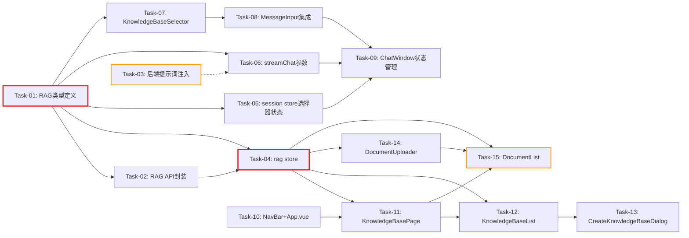

# 开发任务计划: RAG 知识库前端

## 0. 任务概览 (Task Overview)

*   **总任务数**: 15 个
*   **预计总工时**: 810 分钟（约 13.5 小时）
*   **开发方法**: TDD（测试驱动开发）- 每个任务按 Red-Green-Refactor 循环执行
*   **关键里程碑**:
    *   阶段一完成（数据基础层）：Task-01 ~ Task-02，约 90m
    *   阶段二完成（后端改动）：Task-03，约 40m
    *   阶段三完成（状态管理）：Task-04 ~ Task-05，约 90m
    *   阶段四完成（对话集成）：Task-06 ~ Task-09，约 160m
    *   阶段五完成（知识库页面）：Task-10 ~ Task-15，约 430m
*   **风险任务**: Task-03（后端提示词注入）、Task-15（文档状态轮询）
*   **阻塞任务**: Task-01（类型定义，所有前端任务基础）、Task-04（rag store，页面层基础）

### 依赖关系图

### 可并行任务组

| 并行组 | 可同时执行的任务 | 说明 |
| :--- | :--- | :--- |
| 并行组 1 | Task-03（后端） + Task-01（前端类型） | 后端改动与前端类型定义互不依赖 |
| 并行组 2 | Task-05 + Task-06 + Task-07 | 均仅依赖 Task-01，三者互不依赖 |
| 并行组 3 | Task-12 + Task-14 | 均仅依赖 Task-04，知识库列表与文档上传互不依赖 |

## 1. 准备工作 (Preparation)

- [ ] **Prep-01**: 确认后端 RAG 服务可用
    *   说明：启动后端，验证 `/api/rag/knowledges` GET 返回空列表
    *   验证：`curl http://localhost:8080/api/rag/knowledges` 返回 `{"success":true,"code":200,"data":[]}`
- [ ] **Prep-02**: 确认前端开发环境就绪
    *   说明：在 `agent-demo-frontend/` 目录执行 `npm run dev`，确认 Vite 启动无报错
    *   验证：浏览器访问 `http://localhost:5173` 显示对话页面
- [ ] **Prep-03**: 确认测试环境就绪
    *   说明：执行 `npm run test`，确认现有测试套件全部通过
    *   验证：Vitest 输出全部通过，无失败用例

## 2. 开发任务 (Development Tasks)

### 阶段一：数据基础层 (Data Foundation Layer)
> 定义前端类型和 API 调用封装，为后续所有组件提供数据基础
>
> **阶段完成标准**: RAG 类型定义完整、API 封装可正确调用后端接口并解析 Result<T> 结构

- [ ] **Task-01**: 新增 RAG 类型定义
    *   **通俗解释**: 做完这步后，代码里就有了"知识库"和"文档"的数据样板，后续所有功能都能按这个样板来读写数据。
    *   **说明**: 在 `types/index.ts` 中新增 KnowledgeBase、DocumentInfo、DocumentStatus、DocumentStatusResponse 类型定义
    *   **涉及文件**: `src/types/index.ts`
    *   **测试文件**: `src/types/types.test.ts`
    *   **参考**: 技术方案 Sec 2.2、后端 DTO（KnowledgeBaseResponse / DocumentResponse / DocumentStatusResponse）
    *   **对应AC**: AC-003, AC-005, AC-009（数据结构基础）
    *   **预估工时**: 30m
    *   **依赖**: 无
    *   **验证标准**（TDD RED 阶段的测试依据）:
        - [ ] `KnowledgeBase` 类型包含 id/name/description/documentCount/createTime 五个字段
        - [ ] `DocumentInfo` 类型包含 documentId/fileName/fileSize/format/status/chunkCount/failReason/uploadTime 八个字段
        - [ ] `DocumentStatus` 类型为 `'PENDING' | 'PROCESSING' | 'COMPLETED' | 'FAILED'` 联合类型
        - [ ] `DocumentStatusResponse` 类型包含 documentId/status/chunkCount/failReason 四个字段
        - [ ] 类型可通过 TypeScript 编译检查（`vue-tsc --noEmit` 无错误）

- [ ] **Task-02**: 新增 RAG API 封装
    *   **通俗解释**: 做完这步后，前端就有了和后端知识库系统"打电话"的能力，能创建知识库、上传文档、查询状态等。
    *   **说明**: 新建 `api/rag.ts`，封装 7 个 RAG REST API + 统一 request 函数（解析 Result<T> 结构）
    *   **涉及文件**: `src/api/rag.ts`
    *   **测试文件**: `src/api/rag.test.ts`
    *   **参考**: 技术方案 Sec 2.2
    *   **对应AC**: AC-003, AC-004, AC-005, AC-006, AC-007, AC-009, AC-010, AC-027
    *   **预估工时**: 60m
    *   **依赖**: Task-01
    *   **验证标准**（TDD RED 阶段的测试依据）:
        - [ ] `createKnowledgeBase('测试库', '描述')` 发送 POST /api/rag/knowledges，body 为 `{name, description}`，返回 KnowledgeBase 对象
        - [ ] `listKnowledgeBases()` 发送 GET /api/rag/knowledges，返回 KnowledgeBase 数组
        - [ ] `deleteKnowledgeBase('kb-123')` 发送 DELETE /api/rag/knowledges/kb-123，返回 void
        - [ ] `uploadDocument('kb-123', file)` 发送 POST multipart/form-data，返回 DocumentInfo
        - [ ] `listDocuments('kb-123')` 发送 GET /api/rag/knowledges/kb-123/documents，返回 DocumentInfo 数组
        - [ ] `getDocumentStatus('doc-456')` 发送 GET /api/rag/documents/doc-456/status，返回 DocumentStatusResponse
        - [ ] `deleteDocument('doc-456')` 发送 DELETE /api/rag/documents/doc-456，返回 void
        - [ ] 后端返回 `{success:false, message:'名称已存在'}` 时，抛出 Error('名称已存在')（AC-027）
        - [ ] 网络请求失败（response.ok=false）时，抛出 Error('网络异常，请稍后重试')（AC-027）

### 阶段二：后端改动层 (Backend Modification Layer)
> 修改对话接口，支持前端传入知识库参数
>
> **阶段完成标准**: ChatRequest 支持 knowledgeBases 字段，AgentController 提示词注入生效，`mvn compile` 通过

- [ ] **Task-03**: ChatRequest 新增 knowledgeBases 字段 + AgentController 提示词注入 ⚠️
    *   **通俗解释**: 做完这步后，用户在对话时选择的知识库信息能传到后端，AI 会优先从指定知识库里找答案。
    *   **说明**: ChatRequest 新增 `List<String> knowledgeBases` 字段；AgentController 在三处调用点将知识库名称注入用户消息
    *   **涉及文件**: `agent-demo-web/.../dto/ChatRequest.java`、`agent-demo-web/.../controller/AgentController.java`
    *   **测试文件**: 无（后端编译验证为主）
    *   **参考**: 技术方案 Sec 2.3
    *   **对应AC**: AC-012, AC-013, AC-014
    *   **预估工时**: 40m
    *   **依赖**: 无（可与前端任务并行）
    *   **风险标注**: 提示词注入依赖 LLM 遵循引导，非强制约束。`memoryManager.addUserMessage` 必须存原始消息，不能存注入后的消息
    *   **验证标准**（TDD RED 阶段的测试依据）:
        - [ ] `mvn compile -pl agent-demo-web -am` 编译通过，无错误
        - [ ] ChatRequest 新增 `private List<String> knowledgeBases` 字段，有 Javadoc 注释
        - [ ] knowledgeBases 为 null 或空列表时，AgentController 传给 Agent 的消息与原行为一致（零回归）
        - [ ] knowledgeBases 为 `['产品手册']` 时，传给 Agent 的消息末尾包含 `[系统提示：请优先使用以下知识库检索相关信息：产品手册]`
        - [ ] knowledgeBases 为 `['产品手册', '常见问题']` 时，注入文本包含 `产品手册、常见问题`
        - [ ] `memoryManager.addUserMessage` 仍存入 `request.getMessage()`（原始消息），不存注入后的消息

### 阶段三：状态管理层 (State Management Layer)
> 实现 Pinia Store，管理知识库数据和选择器状态
>
> **阶段完成标准**: rag store 可管理知识库/文档 CRUD，session store 可按会话保持知识库选择

- [ ] **Task-04**: 新增 rag store 🔒
    *   **通俗解释**: 做完这步后，系统有了一个"记忆中心"，记住当前有哪些知识库、选中了哪个、里面有哪些文档。
    *   **说明**: 新建 `stores/rag.ts`，管理知识库列表、当前选中知识库、文档列表、加载状态
    *   **涉及文件**: `src/stores/rag.ts`
    *   **测试文件**: `src/stores/rag.test.ts`
    *   **参考**: 技术方案 Sec 4.2
    *   **对应AC**: AC-003, AC-004, AC-005, AC-006, AC-009, AC-010
    *   **预估工时**: 60m
    *   **依赖**: Task-01, Task-02
    *   **阻塞标注**: 知识库页面所有组件依赖此 store
    *   **验证标准**（TDD RED 阶段的测试依据）:
        - [ ] `loadKnowledgeBases()` 调用后，`knowledgeBases` state 填充为数组
        - [ ] `createKnowledgeBase('新库', '描述')` 调用后，新知识库插入列表头部且 `currentKnowledgeBaseId` 更新
        - [ ] `selectKnowledgeBase('kb-123')` 调用后，`currentKnowledgeBaseId` 更新且 `currentDocuments` 加载
        - [ ] `deleteKnowledgeBase('kb-123')` 调用后，该知识库从列表移除；若删除的是当前选中项，`currentKnowledgeBaseId` 清空
        - [ ] `uploadDocument(file)` 调用后，新文档插入 `currentDocuments` 头部
        - [ ] `deleteDocument('doc-456')` 调用后，该文档从 `currentDocuments` 移除
        - [ ] `updateDocumentStatus('doc-456', 'COMPLETED', 5, null)` 调用后，对应文档状态更新为 COMPLETED
        - [ ] `loading` state 在异步操作期间为 true，完成后为 false

- [ ] **Task-05**: session store 新增知识库选择器会话级状态
    *   **通俗解释**: 做完这步后，用户在对话 A 里选了知识库，切到对话 B 再切回来，A 的选择还在，两个对话互不影响。
    *   **说明**: 在 `stores/session.ts` 中新增 `knowledgeBasesBySession` state + getter/setter
    *   **涉及文件**: `src/stores/session.ts`
    *   **测试文件**: `src/stores/session.test.ts`
    *   **参考**: 技术方案 Sec 4.5
    *   **对应AC**: AC-015, AC-037
    *   **预估工时**: 30m
    *   **依赖**: Task-01
    *   **验证标准**（TDD RED 阶段的测试依据）:
        - [ ] `getKnowledgeBases('session-A')` 无记录时返回空数组 `[]`（自动模式）
        - [ ] `setKnowledgeBases('session-A', ['产品手册'])` 后，`getKnowledgeBases('session-A')` 返回 `['产品手册']`
        - [ ] `setKnowledgeBases('session-A', ['产品手册'])` 后，`getKnowledgeBases('session-B')` 仍返回 `[]`（会话隔离）
        - [ ] `setKnowledgeBases('session-A', [])` 后，`getKnowledgeBases('session-A')` 返回 `[]`（重置为自动）

### 阶段四：对话知识库集成层 (Chat Integration Layer)
> 在对话界面集成知识库选择器，实现"两者结合"模式
>
> **阶段完成标准**: 对话输入框旁可选择知识库，选择状态按会话保持，发送消息时携带知识库信息

- [ ] **Task-06**: streamChat 新增 knowledgeBases 参数
    *   **通俗解释**: 做完这步后，发消息时能把选中的知识库信息一起发给后端了。
    *   **说明**: 修改 `api/chat.ts` 的 streamChat 函数，新增 knowledgeBases 参数并加入请求体
    *   **涉及文件**: `src/api/chat.ts`
    *   **测试文件**: `src/api/chat.test.ts`
    *   **参考**: 技术方案 Sec 2.4
    *   **对应AC**: AC-012, AC-013, AC-014
    *   **预估工时**: 20m
    *   **依赖**: Task-01
    *   **验证标准**（TDD RED 阶段的测试依据）:
        - [ ] `streamChat(sessionId, msg, false, false, [], callbacks, signal)` 发送的 body 包含 `knowledgeBases: []`
        - [ ] `streamChat(sessionId, msg, false, false, ['产品手册'], callbacks, signal)` 发送的 body 包含 `knowledgeBases: ['产品手册']`
        - [ ] 现有 streamChat 调用方传入空数组后行为不变（向前兼容）

- [ ] **Task-07**: 新增 KnowledgeBaseSelector 组件
    *   **通俗解释**: 做完这步后，对话输入框旁边就多了一个下拉选择器，用户可以选"自动"或具体知识库。
    *   **说明**: 新建 `KnowledgeBaseSelector.vue`，下拉多选组件，默认"自动"，支持多选，流式时禁用
    *   **涉及文件**: `src/components/KnowledgeBaseSelector.vue`
    *   **测试文件**: `src/components/knowledge-base-selector.test.ts`
    *   **参考**: 技术方案 Sec 4.7
    *   **对应AC**: AC-011, AC-014, AC-028, AC-029
    *   **预估工时**: 60m
    *   **依赖**: Task-01
    *   **验证标准**（TDD RED 阶段的测试依据）:
        - [ ] modelValue 为 `[]` 时，显示"自动"标签
        - [ ] modelValue 为 `['产品手册']` 时，显示"产品手册"标签
        - [ ] modelValue 为 `['产品手册', '常见问题']` 时，显示两个标签
        - [ ] 点击下拉展开知识库列表，点击某项可切换选中/取消
        - [ ] knowledgeBases 为空数组时，下拉显示"暂无知识库，请先在知识库页面创建"（AC-028）
        - [ ] disabled 为 true 时，组件置灰不可点击（AC-029）
        - [ ] 切换某项后，emit `update:modelValue` 传出新的数组

- [ ] **Task-08**: MessageInput 集成 KnowledgeBaseSelector
    *   **通俗解释**: 做完这步后，知识库选择器就正式出现在对话页面的输入框旁边了，和深度思考开关并排。
    *   **说明**: 修改 `MessageInput.vue`，在 input-footer 区域集成 KnowledgeBaseSelector，新增 props 和 emits
    *   **涉及文件**: `src/components/MessageInput.vue`
    *   **测试文件**: `src/components/components.test.ts`
    *   **参考**: 技术方案 Sec 1.2 组件树
    *   **对应AC**: AC-011, AC-029
    *   **预估工时**: 40m
    *   **依赖**: Task-07
    *   **验证标准**（TDD RED 阶段的测试依据）:
        - [ ] MessageInput 渲染包含 KnowledgeBaseSelector 组件
        - [ ] knowledgeBases prop 透传给 KnowledgeBaseSelector 的 modelValue
        - [ ] isStreaming 为 true 时，KnowledgeBaseSelector 的 disabled 为 true（AC-029）
        - [ ] KnowledgeBaseSelector emit update:modelValue 时，MessageInput emit `update:knowledgeBases`

- [ ] **Task-09**: ChatWindow 管理知识库选择状态
    *   **通俗解释**: 做完这步后，对话页面能记住每个会话选了哪个知识库，发消息时也会把知识库信息带上。
    *   **说明**: 修改 `ChatWindow.vue`，从 session store 读取/写入知识库选择，发送消息时传入 streamChat
    *   **涉及文件**: `src/components/ChatWindow.vue`
    *   **测试文件**: `src/components/components.test.ts`
    *   **参考**: 技术方案 Sec 4.5
    *   **对应AC**: AC-012, AC-013, AC-014, AC-015, AC-037
    *   **预估工时**: 40m
    *   **依赖**: Task-05, Task-06, Task-08
    *   **验证标准**（TDD RED 阶段的测试依据）:
        - [ ] ChatWindow 从 session store 读取当前会话的知识库选择作为 KnowledgeBaseSelector 的 modelValue
        - [ ] KnowledgeBaseSelector 变更时，调用 `store.setKnowledgeBases(currentSessionId, newValue)`
        - [ ] 切换会话后，KnowledgeBaseSelector 显示新会话的知识库选择（AC-015）
        - [ ] 发送消息时，streamChat 接收的 knowledgeBases 参数为当前会话的选择值
        - [ ] 知识库选择为空数组时，streamChat 传空数组（自动模式，AC-012）

### 阶段五：知识库管理页面层 (Knowledge Base Page Layer)
> 实现知识库管理页面，支持知识库/文档的全生命周期管理
>
> **阶段完成标准**: 知识库页面可创建/查看/删除知识库，上传/查看/删除文档，文档状态自动轮询

- [ ] **Task-10**: 新增 NavBar 组件 + App.vue 条件渲染
    *   **通俗解释**: 做完这步后，页面顶部多了"对话"和"知识库"两个标签，点一下就能切换。
    *   **说明**: 新建 `NavBar.vue` 顶部导航栏；修改 `App.vue` 增加 NavBar + 条件渲染切换对话/知识库页面
    *   **涉及文件**: `src/components/NavBar.vue`、`src/App.vue`
    *   **测试文件**: `src/components/components.test.ts`
    *   **参考**: 技术方案 Sec 4.1
    *   **对应AC**: AC-001
    *   **预估工时**: 40m
    *   **依赖**: 无（但 App.vue 导入 KnowledgeBasePage 需 Task-11 完成）
    *   **验证标准**（TDD RED 阶段的测试依据）:
        - [ ] NavBar 渲染"对话"和"知识库"两个导航项
        - [ ] 当前激活的导航项高亮显示
        - [ ] 点击"知识库"时，App.vue 的 currentView 变为 'knowledge'
        - [ ] currentView 为 'chat' 时渲染对话页面，为 'knowledge' 时渲染知识库页面
        - [ ] 切换页面后，对话页的会话选择状态保持不变（AC-001）

- [ ] **Task-11**: 新增 KnowledgeBasePage 页面容器
    *   **通俗解释**: 做完这步后，知识库页面有了左右分栏的框架，左边放知识库列表，右边放文档列表。
    *   **说明**: 新建 `KnowledgeBasePage.vue`，左右分栏布局，onMounted 时加载知识库列表
    *   **涉及文件**: `src/components/KnowledgeBasePage.vue`
    *   **测试文件**: `src/components/components.test.ts`
    *   **参考**: 技术方案 Sec 4.1、Sec 1.2 组件树
    *   **对应AC**: AC-002
    *   **预估工时**: 30m
    *   **依赖**: Task-04
    *   **验证标准**（TDD RED 阶段的测试依据）:
        - [ ] 组件渲染后包含左侧知识库列表区域和右侧文档列表区域
        - [ ] 左侧区域宽度固定，右侧区域自适应（左右分栏布局）
        - [ ] onMounted 时调用 `ragStore.loadKnowledgeBases()`
        - [ ] 左侧选中某知识库时，右侧展示该知识库的文档

- [ ] **Task-12**: 新增 KnowledgeBaseList 组件
    *   **通俗解释**: 做完这步后，左侧能看到所有知识库的列表，能点选、能删除（删除有二次确认）。
    *   **说明**: 新建 `KnowledgeBaseList.vue`，展示知识库列表（名称/文档数/创建时间），支持选中、删除（二次确认）
    *   **涉及文件**: `src/components/KnowledgeBaseList.vue`
    *   **测试文件**: `src/components/knowledge-base-list.test.ts`
    *   **参考**: 技术方案 Sec 4.6
    *   **对应AC**: AC-003, AC-005, AC-006, AC-016, AC-026, AC-036
    *   **预估工时**: 90m
    *   **依赖**: Task-04, Task-11
    *   **验证标准**（TDD RED 阶段的测试依据）:
        - [ ] 知识库列表按创建时间倒序排列，每项显示名称、文档数、创建时间（AC-003）
        - [ ] 点击某知识库项时，高亮选中并触发 selectKnowledgeBase
        - [ ] 选中项高亮显示（AC-005）
        - [ ] 点击删除按钮弹出确认框，显示"将连带删除 N 个文档及向量数据，不可恢复"（AC-036）
        - [ ] 确认框点击"确认删除"后调用 deleteKnowledgeBase，列表移除该项（AC-006）
        - [ ] 确认框点击"取消"后关闭，列表不变（AC-026）
        - [ ] 知识库列表为空时，显示空状态引导文案 + "新建知识库"入口（AC-016）

- [ ] **Task-13**: 新增 CreateKnowledgeBaseDialog 组件
    *   **通俗解释**: 做完这步后，点"新建知识库"会弹出表单，填名字和描述，填错了会实时提示。
    *   **说明**: 新建 `CreateKnowledgeBaseDialog.vue`，弹窗表单（名称必填+格式校验，描述可选+长度校验），实时校验
    *   **涉及文件**: `src/components/CreateKnowledgeBaseDialog.vue`
    *   **测试文件**: `src/components/create-knowledge-base-dialog.test.ts`
    *   **参考**: 技术方案 Sec 5 异常处理表
    *   **对应AC**: AC-004, AC-018, AC-019, AC-020, AC-021, AC-030, AC-031, AC-032
    *   **预估工时**: 90m
    *   **依赖**: Task-04, Task-12
    *   **验证标准**（TDD RED 阶段的测试依据）:
        - [ ] 名称输入框为空时，"确定"按钮禁用
        - [ ] 名称输入超过 50 字符时，实时提示"名称不能超过 50 个字符"，"确定"禁用（AC-018/AC-032）
        - [ ] 名称包含空格或特殊字符（如 @#）时，实时提示"仅允许中英文、数字、下划线和连字符"，"确定"禁用（AC-019/AC-030）
        - [ ] 描述输入超过 200 字符时，实时提示"描述不能超过 200 个字符"并显示字数计数（AC-021）
        - [ ] 提交合法数据后，调用 createKnowledgeBase，成功后弹窗关闭（AC-004）
        - [ ] 后端返回名称重复错误时，弹窗内提示"知识库名称已存在"，弹窗不关闭（AC-020/AC-031）
        - [ ] 名称正则校验：`^[\u4e00-\u9fa5a-zA-Z0-9_-]+$`（AC-030）

- [ ] **Task-14**: 新增 DocumentUploader 组件
    *   **通俗解释**: 做完这步后，用户可以拖拽文件或点击选文件上传，文件太大或格式不对会被拦住。
    *   **说明**: 新建 `DocumentUploader.vue`，支持拖拽+点击选择+批量上传，前端校验格式和大小
    *   **涉及文件**: `src/components/DocumentUploader.vue`
    *   **测试文件**: `src/components/document-uploader.test.ts`
    *   **参考**: 技术方案 Sec 4.3
    *   **对应AC**: AC-007, AC-008, AC-022, AC-023, AC-025, AC-033, AC-034
    *   **预估工时**: 90m
    *   **依赖**: Task-04
    *   **验证标准**（TDD RED 阶段的测试依据）:
        - [ ] 拖拽文件到上传区域时，区域高亮反馈（AC-007）
        - [ ] 拖拽 .txt 文件释放后，调用 uploadDocument，文档出现在列表中
        - [ ] 同时选择 3 个文件（txt/md/pdf）时，逐个上传，各自独立显示状态（AC-008）
        - [ ] 文件大小 15MB 时，Toast 提示"文件大小不能超过 10MB"，不发起请求（AC-022/AC-033）
        - [ ] 文件扩展名 .docx 时，Toast 提示"仅支持 txt、md、pdf 格式"，不发起请求（AC-023/AC-034）
        - [ ] 批量上传 3 个文件（1 个超大、1 个不支持格式、1 个合法）时，仅合法文件上传成功，另两个各自 Toast 提示（AC-025）
        - [ ] 点击上传区域可触发文件选择对话框

- [ ] **Task-15**: 新增 DocumentList 组件（含状态轮询）⚠️
    *   **通俗解释**: 做完这步后，右侧能看到选中知识库的所有文档，文档处理中会自动刷新状态，失败了会显示原因。
    *   **说明**: 新建 `DocumentList.vue`，展示文档列表+状态标签+删除，集成自动轮询逻辑（setInterval 3s）
    *   **涉及文件**: `src/components/DocumentList.vue`
    *   **测试文件**: `src/components/document-list.test.ts`
    *   **参考**: 技术方案 Sec 4.4
    *   **对应AC**: AC-005, AC-009, AC-010, AC-017, AC-024, AC-035
    *   **预估工时**: 90m
    *   **依赖**: Task-04, Task-14, Task-11
    *   **风险标注**: 轮询定时器的生命周期管理（启动/停止/清理）是技术难点，需确保组件卸载时清理定时器
    *   **验证标准**（TDD RED 阶段的测试依据）:
        - [ ] 文档列表每项显示文件名、大小、格式、状态标签、上传时间（AC-005）
        - [ ] 状态为 PENDING 时显示灰色"待处理"标签
        - [ ] 状态为 PROCESSING 时显示蓝色"处理中"标签 + 加载动画
        - [ ] 状态为 COMPLETED 时显示绿色"已完成"标签 + 分块数
        - [ ] 状态为 FAILED 时显示红色"失败"标签 + 失败原因，hover 显示完整原因（AC-024）
        - [ ] 存在 PENDING/PROCESSING 文档时，每 3 秒自动轮询状态（AC-009）
        - [ ] 所有文档到达终态（COMPLETED/FAILED）后停止轮询（AC-035）
        - [ ] 组件卸载时清理轮询定时器（无内存泄漏）
        - [ ] 点击文档删除按钮后，文档从列表移除 + Toast 提示"删除成功"（AC-010）
        - [ ] 知识库无文档时，显示空状态引导 + 上传区域（AC-017）
        - [ ] 切换知识库时停止旧轮询，加载新文档列表并重启轮询

### 阶段性集成验证 (Stage Integration Verification)

- [ ] **Verify-01**: 前端全量测试运行
    *   **说明**: 运行所有前端测试套件，确保无回归
    *   **验证标准**:
        - [ ] `npm run test` 全部通过
        - [ ] `vue-tsc --noEmit` 类型检查无错误
        - [ ] 无遗留的未使用变量或导入

- [ ] **Verify-02**: 后端编译验证
    *   **说明**: 验证后端改动编译通过
    *   **验证标准**:
        - [ ] `mvn compile -pl agent-demo-web -am` 编译通过
        - [ ] 现有对话功能不受影响（knowledgeBases 为 null 时零回归）

- [ ] **Verify-03**: 端到端验证
    *   **说明**: 启动前后端，按验收标准逐项验证
    *   **验证标准**:
        - [ ] 知识库页面可创建/查看/删除知识库
        - [ ] 可拖拽上传文档并看到状态轮询
        - [ ] 对话页可选择知识库并发送消息
        - [ ] 切换会话知识库选择保持

## 3. 验收标准检查清单 (AC Checklist)

> 确保所有验收标准都有对应的任务

| 验收标准ID | 验收标准描述 | 对应任务 | 状态 |
| :--- | :--- | :--- | :--- |
| AC-001 | 顶部导航切换页面 | Task-10 | 待完成 |
| AC-002 | 知识库页面左右分栏布局 | Task-11 | 待完成 |
| AC-003 | 查看知识库列表 | Task-12 | 待完成 |
| AC-004 | 创建知识库 | Task-13 | 待完成 |
| AC-005 | 选中知识库查看文档列表 | Task-12, Task-15 | 待完成 |
| AC-006 | 删除知识库（二次确认） | Task-12 | 待完成 |
| AC-007 | 拖拽上传文档 | Task-14 | 待完成 |
| AC-008 | 批量上传文档 | Task-14 | 待完成 |
| AC-009 | 文档处理状态自动轮询 | Task-15 | 待完成 |
| AC-010 | 删除文档 | Task-15 | 待完成 |
| AC-011 | 知识库选择器展示 | Task-07, Task-08 | 待完成 |
| AC-012 | 选择"自动"模式发送消息 | Task-06, Task-09 | 待完成 |
| AC-013 | 手动选择知识库发送消息 | Task-03, Task-06, Task-09 | 待完成 |
| AC-014 | 多选知识库发送消息 | Task-03, Task-06, Task-07, Task-09 | 待完成 |
| AC-015 | 知识库选择器会话级保持 | Task-05, Task-09 | 待完成 |
| AC-016 | 空状态-无知识库 | Task-12 | 待完成 |
| AC-017 | 空状态-知识库无文档 | Task-15 | 待完成 |
| AC-018 | 知识库名称超长输入校验 | Task-13 | 待完成 |
| AC-019 | 知识库名称非法字符校验 | Task-13 | 待完成 |
| AC-020 | 知识库名称重复创建 | Task-13 | 待完成 |
| AC-021 | 知识库描述超长输入校验 | Task-13 | 待完成 |
| AC-022 | 文档超大上传校验 | Task-14 | 待完成 |
| AC-023 | 文档格式不支持校验 | Task-14 | 待完成 |
| AC-024 | 文档处理失败状态展示 | Task-15 | 待完成 |
| AC-025 | 批量上传部分失败 | Task-14 | 待完成 |
| AC-026 | 删除知识库取消确认 | Task-12 | 待完成 |
| AC-027 | 接口异常错误提示 | Task-02 | 待完成 |
| AC-028 | 选择器-无可用知识库 | Task-07 | 待完成 |
| AC-029 | 流式输出时选择器禁用 | Task-08 | 待完成 |
| AC-030 | 知识库名称格式规则 | Task-13 | 待完成 |
| AC-031 | 知识库名称唯一性规则 | Task-13 | 待完成 |
| AC-032 | 知识库描述长度规则 | Task-13 | 待完成 |
| AC-033 | 文档大小限制规则 | Task-14 | 待完成 |
| AC-034 | 文档格式白名单规则 | Task-14 | 待完成 |
| AC-035 | 文档状态流转展示规则 | Task-15 | 待完成 |
| AC-036 | 删除知识库级联提示规则 | Task-12 | 待完成 |
| AC-037 | 知识库选择器状态保持规则 | Task-05, Task-09 | 待完成 |

## 4. 验证计划 (Verification Plan)

### 4.1 TDD 过程验证（每个任务内部）
- [ ] RED：测试编写完成后运行 `npm run test`，确认新增测试全部失败
- [ ] GREEN：实现代码后运行 `npm run test`，确认全部通过
- [ ] REFACTOR：重构后运行 `npm run test`，确认仍全部通过

### 4.2 阶段验证检查点

| 阶段 | 验证动作 | 关联任务 | 通过标准 |
| :--- | :--- | :--- | :--- |
| 阶段一完成后 | 运行 Task-01/02 的测试，验证类型和 API 封装 | Task-01, Task-02 | 类型编译通过、API 封装测试通过 |
| 阶段二完成后 | 运行 `mvn compile -pl agent-demo-web -am` | Task-03 | 编译通过、ChatRequest 字段存在 |
| 阶段三完成后 | 运行 Task-04/05 的测试，验证 store 状态管理 | Task-04, Task-05 | rag store CRUD 测试通过、选择器会话隔离测试通过 |
| 阶段四完成后 | 运行 Task-06~09 的测试，验证对话集成 | Task-06~09 | streamChat 参数测试通过、选择器组件测试通过、会话保持测试通过 |
| 阶段五完成后 | 运行 Task-10~15 的测试，验证知识库页面 | Task-10~15 | 导航切换、知识库 CRUD、文档上传轮询测试全部通过 |

### 4.3 验收标准逐项验证

| AC | 验证方式 | 关联任务 | 状态 |
| :--- | :--- | :--- | :--- |
| AC-001 | 运行 Task-10 测试，点击导航切换页面 | Task-10 | 待验证 |
| AC-002 | 运行 Task-11 测试，验证左右分栏渲染 | Task-11 | 待验证 |
| AC-003 | 运行 Task-12 测试，验证知识库列表展示 | Task-12 | 待验证 |
| AC-004 | 运行 Task-13 测试，提交合法数据创建成功 | Task-13 | 待验证 |
| AC-005 | 运行 Task-12/15 测试，选中知识库后文档列表加载 | Task-12, Task-15 | 待验证 |
| AC-006 | 运行 Task-12 测试，删除确认后列表移除 | Task-12 | 待验证 |
| AC-007 | 运行 Task-14 测试，拖拽文件上传成功 | Task-14 | 待验证 |
| AC-008 | 运行 Task-14 测试，批量上传各自独立 | Task-14 | 待验证 |
| AC-009 | 运行 Task-15 测试，3 秒轮询且终态停止 | Task-15 | 待验证 |
| AC-010 | 运行 Task-15 测试，删除文档 + Toast | Task-15 | 待验证 |
| AC-011 | 运行 Task-07/08 测试，选择器渲染在输入框旁 | Task-07, Task-08 | 待验证 |
| AC-012 | 运行 Task-06/09 测试，空数组走自动模式 | Task-06, Task-09 | 待验证 |
| AC-013 | 运行 Task-03/06/09 测试，非空数组携带注入 | Task-03, Task-06, Task-09 | 待验证 |
| AC-014 | 运行 Task-07/09 测试，多选知识库发送 | Task-07, Task-09 | 待验证 |
| AC-015 | 运行 Task-05/09 测试，切换会话选择保持 | Task-05, Task-09 | 待验证 |
| AC-016 | 运行 Task-12 测试，空列表引导文案 | Task-12 | 待验证 |
| AC-017 | 运行 Task-15 测试，空文档引导上传 | Task-15 | 待验证 |
| AC-018 | 运行 Task-13 测试，超 50 字符禁用 | Task-13 | 待验证 |
| AC-019 | 运行 Task-13 测试，非法字符禁用 | Task-13 | 待验证 |
| AC-020 | 运行 Task-13 测试，重复名称提示 | Task-13 | 待验证 |
| AC-021 | 运行 Task-13 测试，描述超长禁用 | Task-13 | 待验证 |
| AC-022 | 运行 Task-14 测试，超大文件拦截 | Task-14 | 待验证 |
| AC-023 | 运行 Task-14 测试，不支持格式拦截 | Task-14 | 待验证 |
| AC-024 | 运行 Task-15 测试，失败状态红色标签 | Task-15 | 待验证 |
| AC-025 | 运行 Task-14 测试，批量部分失败独立提示 | Task-14 | 待验证 |
| AC-026 | 运行 Task-12 测试，取消确认不变 | Task-12 | 待验证 |
| AC-027 | 运行 Task-02 测试，接口异常 Toast | Task-02 | 待验证 |
| AC-028 | 运行 Task-07 测试，无知识库引导 | Task-07 | 待验证 |
| AC-029 | 运行 Task-08 测试，流式时禁用 | Task-08 | 待验证 |
| AC-030 | 运行 Task-13 测试，正则校验 | Task-13 | 待验证 |
| AC-031 | 运行 Task-13 测试，唯一性提示 | Task-13 | 待验证 |
| AC-032 | 运行 Task-13 测试，描述计数 | Task-13 | 待验证 |
| AC-033 | 运行 Task-14 测试，10MB 校验 | Task-14 | 待验证 |
| AC-034 | 运行 Task-14 测试，格式白名单 | Task-14 | 待验证 |
| AC-035 | 运行 Task-15 测试，状态流转 + 终态停止 | Task-15 | 待验证 |
| AC-036 | 运行 Task-12 测试，级联数量提示 | Task-12 | 待验证 |
| AC-037 | 运行 Task-05/09 测试，会话隔离 | Task-05, Task-09 | 待验证 |

### 4.4 最终验证（所有阶段完成后）
- [ ] 运行前端全量测试 `npm run test`，全部通过
- [ ] 运行类型检查 `vue-tsc --noEmit`，无错误
- [ ] 运行后端编译 `mvn compile -pl agent-demo-web -am`，通过
- [ ] 启动前后端，按 AC-001 ~ AC-037 逐项端到端验证
- [ ] 确认现有对话功能无回归（深度思考、任务拆解、SSE 流式正常）

### 4.5 上线前检查
- [ ] 代码审查（Code Review）
- [ ] 确认无遗留 console.log / debugger
- [ ] 确认新增组件样式遵循 Refined Dark Tech 设计系统
- [ ] 回滚方案准备（技术方案 Sec 9.4）

## 5. 风险与注意事项 (Risks & Notes)

*   **技术风险**:
    *   Task-03（提示词注入）：LLM 可能不严格遵循注入的知识库提示。这是"两者结合"模式的固有限制，可接受。验证时关注 LLM 是否调用了 searchKnowledge 工具。
    *   Task-15（文档轮询）：定时器生命周期管理是难点。必须确保 onUnmounted 清理定时器、切换知识库时停止旧轮询。测试时使用 `vi.useFakeTimers()` 验证。
*   **依赖风险**:
    *   Task-01（类型定义）是所有前端任务的阻塞基础，必须最先完成。
    *   Task-04（rag store）是知识库页面层的阻塞基础，必须在阶段五前完成。
    *   后端 Task-03 可与前端任务并行，但端到端验证 AC-013/014 需后端就绪。
*   **时间风险**:
    *   若工时超出预期，Task-13（创建弹窗）和 Task-15（文档列表+轮询）是最耗时的两个任务，可考虑拆分。
    *   Task-10（NavBar+App.vue）可与 Task-11 并行推进。
*   **质量保证**:
    *   每个任务通过 TDD 循环保证代码质量（RED -> GREEN -> REFACTOR）。
    *   阶段性集成验证确保各层对接正确。
    *   最终端到端验证覆盖全部 37 条 AC。
    *   特别关注现有功能零回归（对话 SSE、深度思考、任务拆解）。
