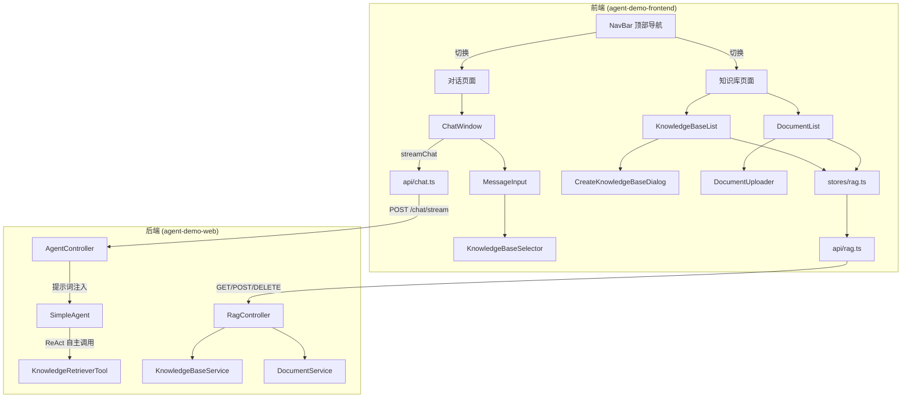

# 技术设计文档: RAG 知识库前端

## 0. 设计概要 (Design Summary)

*   **功能描述**：为后端已实现的 RAG 知识库能力补齐前端管理界面，并提供对话时的知识库选择集成，形成"管理知识库 -> 上传文档 -> 对话检索"闭环。
*   **影响范围**：
    *   **前端**（主）：新增 7 个 Vue 组件、1 个 API 封装、1 个 Pinia Store、RAG 类型定义；修改 App.vue / ChatWindow.vue / MessageInput.vue / chat.ts / session.ts / types/index.ts
    *   **后端**（次）：修改 ChatRequest.java（新增 knowledgeBases 字段）、AgentController.java（提示词注入），共 2 个文件
*   **技术难点**：
    *   文档异步处理状态的自动轮询与生命周期管理
    *   知识库选择器按会话维度保持（切换会话恢复选择，互不影响）
    *   对话知识库集成的提示词注入（引导 LLM 使用指定知识库）
*   **依赖关系**：依赖后端已实现的 7 个 RAG REST API（`/api/rag/*`）和对话 SSE 接口（`/api/agent/chat/stream`）

---

## 1. 架构概览 (Architecture Overview)

### 1.1 模块交互关系



### 1.2 前端组件树（改动后）

```
App.vue (修改：增加 NavBar + 条件渲染)
├── NavBar.vue (新增)
│   └── 导航项：对话 / 知识库
├── 对话页面 (currentView === 'chat')
│   ├── SessionList.vue (不变)
│   └── ChatWindow.vue (修改：管理知识库选择状态)
│       ├── MessageList.vue (不变)
│       └── MessageInput.vue (修改：集成 KnowledgeBaseSelector)
│           └── KnowledgeBaseSelector.vue (新增)
└── 知识库页面 (currentView === 'knowledge')
    └── KnowledgeBasePage.vue (新增)
        ├── KnowledgeBaseList.vue (新增)
        │   └── CreateKnowledgeBaseDialog.vue (新增)
        └── DocumentList.vue (新增)
            ├── DocumentUploader.vue (新增)
            └── DocumentChunkDrawer.vue (CR-001 新增，分块详情抽屉面板)
```

### 1.3 数据流向

**知识库管理数据流**：
```
用户操作 -> KnowledgeBasePage 组件 -> rag store action -> rag.ts API 封装
-> fetch /api/rag/* -> RagController -> Service -> Store
-> 返回 Result<T> -> rag store 更新 state -> 组件响应式渲染
```

**对话知识库集成数据流**：
```
用户选择知识库 -> KnowledgeBaseSelector -> session store 记录(会话级)
-> 用户发送消息 -> ChatWindow 读取当前会话的知识库选择
-> streamChat(sessionId, message, ..., knowledgeBases)
-> POST /chat/stream { sessionId, message, knowledgeBases }
-> AgentController 提示词注入 -> SimpleAgent -> LLM 自主调用 searchKnowledge
```

---

## 2. API 设计 (API Design)

### 2.1 接口列表

后端 RAG 接口已完整实现，前端直接调用，无需新增后端 RAG API。仅需修改对话接口请求体。

| 接口名称 | 方法 | 路径 | 描述 | 对应验收标准 |
| :--- | :--- | :--- | :--- | :--- |
| 创建知识库 | POST | /api/rag/knowledges | 创建新知识库 | AC-004 |
| 查询知识库列表 | GET | /api/rag/knowledges | 返回所有知识库 | AC-003 |
| 删除知识库 | DELETE | /api/rag/knowledges/{id} | 级联删除 | AC-006 |
| 上传文档 | POST | /api/rag/knowledges/{id}/documents | 异步处理 | AC-007, AC-008 |
| 查询文档列表 | GET | /api/rag/knowledges/{id}/documents | 返回文档列表 | AC-005 |
| 查询文档状态 | GET | /api/rag/documents/{id}/status | 供轮询 | AC-009 |
| 删除文档 | DELETE | /api/rag/documents/{id} | 删除文档+向量 | AC-010 |
| 查询文档分块列表 | GET | /api/rag/documents/{id}/chunks | 返回文档的分块详情列表 | AC-038, AC-039 |
| 流式对话（修改） | POST | /api/agent/chat/stream | 新增 knowledgeBases 字段 | AC-012, AC-013, AC-014 |

### 2.2 前端 API 封装设计（新增 `src/api/rag.ts`）

```typescript
/**
 * RAG 知识库 API 封装
 * 封装后端 /api/rag/* 接口，统一处理 Result<T> 返回结构
 */
const API_BASE = '/api/rag';

/** 统一请求封装：解析 Result<T> 结构，失败抛异常 */
async function request<T>(url: string, options?: RequestInit): Promise<T> {
  const response = await fetch(url, options);
  if (!response.ok) {
    const errorResult = await response.json().catch(() => null);
    throw new Error(errorResult?.message || '网络异常，请稍后重试');
  }
  const result = await response.json();
  if (!result.success) {
    throw new Error(result.message || '操作失败');
  }
  return result.data;
}

/** 创建知识库 */
export async function createKnowledgeBase(name: string, description: string): Promise<KnowledgeBase> {
  return request<KnowledgeBase>(`${API_BASE}/knowledges`, {
    method: 'POST',
    headers: { 'Content-Type': 'application/json' },
    body: JSON.stringify({ name, description }),
  });
}

/** 查询知识库列表 */
export async function listKnowledgeBases(): Promise<KnowledgeBase[]> {
  return request<KnowledgeBase[]>(`${API_BASE}/knowledges`);
}

/** 删除知识库（级联） */
export async function deleteKnowledgeBase(id: string): Promise<void> {
  return request<void>(`${API_BASE}/knowledges/${id}`, { method: 'DELETE' });
}

/** 上传文档（multipart/form-data） */
export async function uploadDocument(knowledgeBaseId: string, file: File): Promise<DocumentInfo> {
  const formData = new FormData();
  formData.append('file', file);
  return request<DocumentInfo>(`${API_BASE}/knowledges/${knowledgeBaseId}/documents`, {
    method: 'POST',
    body: formData,
  });
}

/** 查询文档列表 */
export async function listDocuments(knowledgeBaseId: string): Promise<DocumentInfo[]> {
  return request<DocumentInfo[]>(`${API_BASE}/knowledges/${knowledgeBaseId}/documents`);
}

/** 查询文档状态（轮询用） */
export async function getDocumentStatus(documentId: string): Promise<DocumentStatusResponse> {
  return request<DocumentStatusResponse>(`${API_BASE}/documents/${documentId}/status`);
}

/** 删除文档 */
export async function deleteDocument(documentId: string): Promise<void> {
  return request<void>(`${API_BASE}/documents/${documentId}`, { method: 'DELETE' });
}

/** 查询文档分块列表（CR-001 新增） */
export async function getDocumentChunks(documentId: string): Promise<DocumentChunk[]> {
  return request<DocumentChunk[]>(`${API_BASE}/documents/${documentId}/chunks`);
}
```

### 2.3 后端分块存储设计（CR-001 新增）

#### DocumentChunk 实体

```java
/**
 * 文档分块实体
 * <p>
 * 业务含义：文档处理完成后的分块信息，包含分块索引、文本内容和字符数。
 * 在文档异步处理（processDocument）阶段 3 分块完成后保存。
 * 删除文档时级联删除对应分块记录。
 * </p>
 */
@Data
public class DocumentChunk {
    /** 分块 ID（UUID 去横线） */
    private String id;
    /** 所属文档 ID（外键，关联 DocumentInfo.id） */
    private String documentId;
    /** 分块索引（从 0 开始，按原文档顺序） */
    private int chunkIndex;
    /** 分块文本内容 */
    private String content;
    /** 分块字符数 */
    private int charCount;
}
```

#### DocumentChunkStore 接口 + InMemoryDocumentChunkStore

```java
public interface DocumentChunkStore {
    /** 保存文档的分块列表 */
    void saveChunks(String documentId, List<DocumentChunk> chunks);
    /** 查询文档的分块列表 */
    List<DocumentChunk> getChunks(String documentId);
    /** 删除文档的所有分块（文档删除时级联调用） */
    void deleteChunks(String documentId);
}
```

InMemoryDocumentChunkStore 使用 `ConcurrentHashMap<String, List<DocumentChunk>>` 存储，与 InMemoryDocumentStore 模式一致。

#### DocumentService 修改

在 `processDocument()` 阶段 5（向量入库）之后、阶段 6（标记完成）之前，新增分块保存逻辑：

```java
// 阶段 5.5：保存分块信息到 DocumentChunkStore（CR-001 新增）
// 业务含义：将分块文本内容独立存储，供前端查询展示。
// 与 EmbeddingStore 中的 TextSegment 不同，此处保留分块索引和原始文本。
List<DocumentChunk> chunks = new ArrayList<>();
for (int i = 0; i < segments.size(); i++) {
    DocumentChunk chunk = new DocumentChunk();
    chunk.setId(UUID.randomUUID().toString().replace("-", ""));
    chunk.setDocumentId(documentId);
    chunk.setChunkIndex(i);
    chunk.setContent(segments.get(i).text());
    chunk.setCharCount(segments.get(i).text().length());
    chunks.add(chunk);
}
documentChunkStore.saveChunks(documentId, chunks);
```

在 `deleteDocument()` 中新增级联删除分块：

```java
// 删除分块记录（CR-001 新增）
documentChunkStore.deleteChunks(documentId);
```

#### RagController 新增端点

```java
@Operation(summary = "查询文档分块列表", description = "返回文档的分块详情列表")
@GetMapping("/documents/{documentId}/chunks")
public Result<List<DocumentChunkResponse>> getDocumentChunks(@PathVariable String documentId) {
    List<DocumentChunk> chunks = documentChunkStore.getChunks(documentId);
    List<DocumentChunkResponse> response = chunks.stream()
            .map(c -> new DocumentChunkResponse(c.getChunkIndex(), c.getContent(), c.getCharCount()))
            .toList();
    return Result.success(response);
}
```

### 2.3 对话接口修改（后端 ChatRequest + AgentController）

#### ChatRequest.java 新增字段

```java
/**
 * 用户指定的知识库名称列表（可选）
 * <p>
 * 业务含义：前端知识库选择器选中的知识库名称。为空或 null 时 Agent 自主决策；
 * 非空时 AgentController 将其注入用户消息，引导 LLM 调用 searchKnowledge 时使用指定知识库。
 * </p>
 */
private List<String> knowledgeBases;
```

#### AgentController.java 提示词注入

在 `chatStream` 方法中，调用 Agent 前构建有效消息：

```java
// 业务含义：用户指定知识库时，将知识库名称注入用户消息末尾，
// 引导 LLM 在 ReAct 循环中调用 searchKnowledge 工具时使用指定知识库。
// 不指定时走原有路径（Agent 自主决策），零回归。
String effectiveMessage = request.getMessage();
List<String> knowledgeBases = request.getKnowledgeBases();
if (knowledgeBases != null && !knowledgeBases.isEmpty()) {
    effectiveMessage = request.getMessage()
        + "\n\n[系统提示：请优先使用以下知识库检索相关信息："
        + String.join("、", knowledgeBases) + "]";
}
// 三处调用点将 request.getMessage() 替换为 effectiveMessage
```

**三处调用点**（均将 `request.getMessage()` 替换为 `effectiveMessage`）：
1. 任务拆解路径：`planAgent.chatTaskBreakdownStream(effectiveSessionId, effectiveMessage, ...)`
2. 思考 ReAct 路径：`simpleAgent.chatThinkingReActStream(effectiveSessionId, effectiveMessage)`
3. 原始路径：`simpleAgent.chatStream(effectiveSessionId, effectiveMessage)`

**注意**：`memoryManager.addUserMessage` 仍存入原始 `request.getMessage()`，避免记忆污染；仅传给 Agent 的消息包含注入内容。

### 2.4 streamChat 函数修改（前端 `src/api/chat.ts`）

```typescript
export async function streamChat(
  sessionId: string,
  message: string,
  enableThinking: boolean,
  enableTaskBreakdown: boolean,
  knowledgeBases: string[],  // 新增：知识库名称列表，空数组表示"自动"模式
  callbacks: StreamCallbacks,
  signal: AbortSignal,
): Promise<void> {
  // ...
  response = await fetch(`${API_BASE}/chat/stream`, {
    method: 'POST',
    headers: { 'Content-Type': 'application/json' },
    body: JSON.stringify({ sessionId, message, enableThinking, enableTaskBreakdown, knowledgeBases }),
    signal,
  });
  // ...
}
```

---

## 3. 数据库设计 (Database Schema)

> 本项目无传统关系数据库，采用纯内存存储（参考 KNOWLEDGE_BASE.md 第七章）。本期不涉及数据库改动。

---

## 4. 核心逻辑与算法 (Core Logic)

### 4.1 视图切换机制

**触发条件**：用户点击顶部导航栏的"对话"/"知识库"入口。

**设计方案**：在 App.vue 中使用响应式变量 `currentView` 控制条件渲染，不引入 vue-router。

```vue
<!-- App.vue 核心逻辑 -->
<script setup lang="ts">
import { ref } from 'vue';
const currentView = ref<'chat' | 'knowledge'>('chat');
</script>

<template>
  <div class="app-layout">
    <NavBar v-model:current-view="currentView" />
    <div class="content-area">
      <ChatView v-if="currentView === 'chat'" />
      <KnowledgeBasePage v-else />
    </div>
  </div>
</template>
```

**状态保持**：切换页面时，对话页的会话选择和知识库页的选中知识库均为各组件内部状态，Vue 的 `v-if` 会销毁/重建组件。为保持状态，对话页拆分为 `ChatView`（状态容器）包裹现有 `SessionList + ChatWindow`，知识库页状态由 Pinia store 持有（切换后恢复）。

### 4.2 知识库管理流程（stores/rag.ts）

**新增 Pinia Store**：

```typescript
export const useRagStore = defineStore('rag', {
  state: () => ({
    /** 知识库列表 */
    knowledgeBases: [] as KnowledgeBase[],
    /** 当前选中的知识库 ID */
    currentKnowledgeBaseId: '' as string,
    /** 当前知识库的文档列表 */
    currentDocuments: [] as DocumentInfo[],
    /** 加载状态 */
    loading: false,
  }),
  actions: {
    /** 加载知识库列表 */
    async loadKnowledgeBases() {
      this.loading = true;
      try {
        this.knowledgeBases = await listKnowledgeBases();
      } finally {
        this.loading = false;
      }
    },
    /** 创建知识库 */
    async createKnowledgeBase(name: string, description: string) {
      const kb = await ragApi.createKnowledgeBase(name, description);
      this.knowledgeBases.unshift(kb);
      this.currentKnowledgeBaseId = kb.id;
      this.currentDocuments = [];
      return kb;
    },
    /** 选中知识库并加载文档 */
    async selectKnowledgeBase(id: string) {
      this.currentKnowledgeBaseId = id;
      this.currentDocuments = await listDocuments(id);
    },
    /** 删除知识库（级联） */
    async deleteKnowledgeBase(id: string) {
      await ragApi.deleteKnowledgeBase(id);
      this.knowledgeBases = this.knowledgeBases.filter(kb => kb.id !== id);
      if (this.currentKnowledgeBaseId === id) {
        this.currentKnowledgeBaseId = '';
        this.currentDocuments = [];
      }
    },
    /** 上传文档 */
    async uploadDocument(file: File) {
      const doc = await ragApi.uploadDocument(this.currentKnowledgeBaseId, file);
      this.currentDocuments.unshift(doc);
      return doc;
    },
    /** 删除文档 */
    async deleteDocument(documentId: string) {
      await ragApi.deleteDocument(documentId);
      this.currentDocuments = this.currentDocuments.filter(d => d.documentId !== documentId);
    },
    /** 更新单个文档状态（轮询用） */
    updateDocumentStatus(documentId: string, status: string, chunkCount: number, failReason: string | null) {
      const doc = this.currentDocuments.find(d => d.documentId === documentId);
      if (doc) {
        doc.status = status;
        doc.chunkCount = chunkCount;
        doc.failReason = failReason;
      }
    },
  },
});
```

### 4.3 文档上传与前端的校验

**触发条件**：用户拖拽文件到上传区域或点击选择文件。

**处理步骤**：
1. 前端校验文件格式（扩展名必须在 txt/md/pdf 范围内）
2. 前端校验文件大小（不超过 10MB）
3. 校验通过的文件调用 `uploadDocument` API
4. 校验失败的文件 Toast 提示，不发起请求
5. 批量上传时逐个校验、逐个上传，互不影响

```typescript
/** 文档上传校验常量 */
const MAX_FILE_SIZE = 10 * 1024 * 1024; // 10MB
const SUPPORTED_FORMATS = ['txt', 'md', 'pdf'];

/** 校验单个文件，返回错误消息或 null */
function validateFile(file: File): string | null {
  const ext = file.name.split('.').pop()?.toLowerCase() ?? '';
  if (!SUPPORTED_FORMATS.includes(ext)) {
    return '仅支持 txt、md、pdf 格式';
  }
  if (file.size > MAX_FILE_SIZE) {
    return '文件大小不能超过 10MB';
  }
  return null;
}

/** 批量上传处理 */
async function handleFiles(files: File[]) {
  for (const file of files) {
    const error = validateFile(file);
    if (error) {
      showToast(error);  // AC-022, AC-023, AC-025
      continue;          // 跳过非法文件，继续处理其他文件
    }
    try {
      await ragStore.uploadDocument(file);  // 成功后文档出现在列表
    } catch (e) {
      showToast(e instanceof Error ? e.message : '上传失败');
    }
  }
}
```

### 4.4 文档状态自动轮询

**触发条件**：文档列表中存在 PENDING 或 PROCESSING 状态的文档。

**处理步骤**：
1. DocumentList 组件 `onMounted` 时启动轮询定时器（`setInterval`，每 3000ms）
2. 每次轮询：筛选 PENDING/PROCESSING 状态文档，逐个调用 `getDocumentStatus`
3. 收到 COMPLETED 或 FAILED 状态时，更新 store 中的文档信息
4. 所有待处理文档均到达终态后，停止轮询（`clearInterval`）
5. 组件 `onUnmounted` 时清理定时器，避免内存泄漏
6. 切换知识库时（`watch(currentKnowledgeBaseId)`）重启轮询

```typescript
const POLL_INTERVAL = 3000; // 3 秒
let pollTimer: ReturnType<typeof setInterval> | null = null;

/** 启动轮询 */
function startPolling() {
  stopPolling();
  pollTimer = setInterval(pollPendingDocuments, POLL_INTERVAL);
  // 立即执行一次
  pollPendingDocuments();
}

/** 停止轮询 */
function stopPolling() {
  if (pollTimer) {
    clearInterval(pollTimer);
    pollTimer = null;
  }
}

/** 轮询待处理文档 */
async function pollPendingDocuments() {
  const pending = ragStore.currentDocuments.filter(
    d => d.status === 'PENDING' || d.status === 'PROCESSING'
  );
  if (pending.length === 0) {
    stopPolling(); // 全部终态，停止轮询
    return;
  }
  for (const doc of pending) {
    try {
      const status = await getDocumentStatus(doc.documentId);
      ragStore.updateDocumentStatus(doc.documentId, status.status, status.chunkCount, status.failReason);
    } catch {
      // 单个文档轮询失败不影响其他文档，下次轮询继续
    }
  }
}

onMounted(startPolling);
onUnmounted(stopPolling);
// 切换知识库时重新加载文档并重启轮询
watch(() => ragStore.currentKnowledgeBaseId, async () => {
  stopPolling();
  await ragStore.selectKnowledgeBase(ragStore.currentKnowledgeBaseId);
  startPolling();
});
```

**文档状态流转展示**：

```
PENDING（灰色标签）──> PROCESSING（蓝色 + 加载动画）──> COMPLETED（绿色 + 分块数）
                                                  └──> FAILED（红色 + 失败原因）
```

### 4.5 知识库选择器会话级保持

**设计方案**：在 session store 中新增 `knowledgeBasesBySession` 状态，按 sessionId 映射知识库名称列表。不持久化到 localStorage（与深度思考开关行为一致，刷新后重置为"自动"）。

```typescript
// session.ts 新增 state
knowledgeBasesBySession: {} as Record<string, string[]>,

// session.ts 新增 actions
/** 获取指定会话的知识库选择（无记录返回空数组=自动模式） */
getKnowledgeBases(sessionId: string): string[] {
  return this.knowledgeBasesBySession[sessionId] ?? [];
},

/** 设置指定会话的知识库选择 */
setKnowledgeBases(sessionId: string, bases: string[]) {
  this.knowledgeBasesBySession[sessionId] = bases;
},
```

**ChatWindow 中的使用**：

```typescript
// ChatWindow.vue
const selectedKnowledgeBases = computed(() => {
  return store.getKnowledgeBases(store.currentSessionId);
});

function updateKnowledgeBases(bases: string[]) {
  store.setKnowledgeBases(store.currentSessionId, bases);
}

// 发送消息时传入
await streamChat(
  sessionId, message, enableThinking.value, enableTaskBreakdown.value,
  selectedKnowledgeBases.value,  // 新增参数
  callbacks, signal
);
```

### 4.6 知识库删除二次确认

**设计方案**：知识库删除弹出确认框，明示级联删除的文档数量；文档删除直接执行 + Toast。

```typescript
// KnowledgeBaseList.vue
async function handleDelete(kb: KnowledgeBase) {
  const confirmed = await showConfirmDialog(
    `确认删除`,
    `将连带删除 ${kb.documentCount} 个文档及向量数据，不可恢复。`
  );
  if (!confirmed) return;  // AC-026: 取消确认
  try {
    await ragStore.deleteKnowledgeBase(kb.id);
    showToast('删除成功');
  } catch (e) {
    showToast(e instanceof Error ? e.message : '删除失败');
  }
}
```

### 4.7 知识库选择器组件

**设计方案**：下拉多选组件，默认"自动"，选中知识库后显示为标签集合。

```vue
<!-- KnowledgeBaseSelector.vue 核心逻辑 -->
<script setup lang="ts">
const props = defineProps<{
  modelValue: string[];        // 选中的知识库名称列表
  knowledgeBases: KnowledgeBase[]; // 可选知识库列表
  disabled?: boolean;          // 流式输出时禁用（AC-029）
}>();
const emit = defineEmits<{ 'update:modelValue': [string[]] }>();

const isOpen = ref(false);
const isAuto = computed(() => props.modelValue.length === 0);

function toggle(name: string) {
  const current = [...props.modelValue];
  const idx = current.indexOf(name);
  if (idx >= 0) {
    current.splice(idx, 1);
  } else {
    current.push(name);
  }
  emit('update:modelValue', current);
}
</script>
```

### 4.8 文档分块详情抽屉（CR-001 新增）

**设计方案**：右侧滑出抽屉面板，展示文档的分块列表，支持展开/收起分块内容。

```vue
<!-- DocumentChunkDrawer.vue 核心逻辑 -->
<script setup lang="ts">
const props = defineProps<{
  visible: boolean;           // 抽屉显示状态
  documentId: string;         // 当前查看的文档 ID
  chunkCount: number;         // 分块总数（用于标题展示）
}>();
const emit = defineEmits<{ 'update:visible': [boolean] }>();

const chunks = ref<DocumentChunk[]>([]);
const loading = ref(false);
const expandedChunks = ref<Set<number>>(new Set()); // 展开的分块索引集合

// 加载分块数据
async function loadChunks() {
  loading.value = true;
  try {
    chunks.value = await getDocumentChunks(props.documentId);
  } catch (e) {
    showToast(e instanceof Error ? e.message : '加载分块失败');
    emit('update:visible', false); // AC-042: 接口异常不打开抽屉
  } finally {
    loading.value = false;
  }
}

// 展开/收起分块
function toggleExpand(index: number) {
  if (expandedChunks.value.has(index)) {
    expandedChunks.value.delete(index);
  } else {
    expandedChunks.value.add(index);
  }
}

// 截断显示阈值
const TRUNCATE_LENGTH = 200;

watch(() => props.visible, (val) => {
  if (val && props.documentId) {
    loadChunks();
  } else {
    chunks.value = [];
    expandedChunks.value.clear();
  }
});
</script>
```

**DocumentList 中的集成**：

```typescript
// DocumentList.vue 新增
const showChunkDrawer = ref(false);
const chunkDocumentId = ref('');
const chunkDocumentName = ref('');
const chunkCount = ref(0);

function handleViewChunks(doc: DocumentInfo) {
  if (doc.status !== 'COMPLETED') return; // AC-040: 非已完成不可查看
  chunkDocumentId.value = doc.documentId;
  chunkDocumentName.value = doc.fileName;
  chunkCount.value = doc.chunkCount;
  showChunkDrawer.value = true;
}
```

---

## 5. 异常处理 (Error Handling)

| 异常场景 | 对应验收标准 | 处理方案 | 用户提示 |
| :--- | :--- | :--- | :--- |
| 知识库列表为空 | AC-016 | 左侧列表区域展示空状态引导 + "新建知识库"入口 | "还没有知识库，点击新建创建第一个" |
| 知识库无文档 | AC-017 | 右侧展示空状态引导 + 上传区域 | "还没有文档，拖拽文件到此处上传" |
| 知识库名称超长 | AC-018, AC-032 | 输入框实时校验，超 50 字符禁用确定按钮 | "名称不能超过 50 个字符" |
| 知识库名称非法字符 | AC-019, AC-030 | 输入框实时正则校验 | "仅允许中英文、数字、下划线和连字符" |
| 知识库名称重复 | AC-020, AC-031 | 提交后捕获后端 5307 错误，弹窗内提示 | "知识库名称已存在" |
| 知识库描述超长 | AC-021 | 输入框实时字数计数 | "描述不能超过 200 字符" |
| 文档超大 | AC-022, AC-033 | 前端上传前校验，拦截不发起请求 | "文件大小不能超过 10MB" |
| 文档格式不支持 | AC-023, AC-034 | 前端按扩展名校验，拦截不发起请求 | "仅支持 txt、md、pdf 格式" |
| 文档处理失败 | AC-024, AC-035 | 轮询到 FAILED 状态，红色标签 + 失败原因 | 状态标签 + hover 显示完整原因 |
| 批量上传部分失败 | AC-025 | 逐个校验上传，非法文件 Toast 跳过 | 各文件独立 Toast 提示 |
| 删除知识库取消 | AC-026 | 确认框取消按钮关闭弹窗 | 无 |
| 接口异常/网络错误 | AC-027 | Toast 提示，不阻塞页面 | "网络异常，请稍后重试"或后端错误消息 |
| 选择器无知识库 | AC-028 | 下拉列表为空 + 引导提示 | "暂无知识库，请先在知识库页面创建" |
| 流式输出时操作 | AC-029 | 选择器置灰禁用 | 无（视觉反馈） |
| 级联删除提示 | AC-036 | 确认框明示文档数量 | "将连带删除 N 个文档及向量数据，不可恢复" |
| 选择器会话保持 | AC-037 | session store 按 sessionId 映射 | 无 |
| 轮询单个文档失败 | - | 静默跳过，下次轮询继续 | 无 |
| 轮询组件卸载 | - | onUnmounted 清理定时器 | 无 |
| 非已完成文档查看分块 | AC-040 | "查看分块"按钮不显示或禁用 | 无（视觉反馈） |
| 分块数据为空 | AC-041 | 抽屉面板展示空状态提示 | "该文档无分块数据" |
| 分块查询接口异常 | AC-042 | Toast 提示错误，不打开抽屉 | "网络异常，请稍后重试"或后端错误消息 |

---

## 6. 安全与性能 (Security & Performance)

*   **鉴权机制**：本项目无认证机制（学习示例），所有 API 可被任意调用。前端不做鉴权。
*   **数据校验**：
    *   前端双重校验：知识库名称正则 `^[\u4e00-\u9fa5a-zA-Z0-9_-]+$` + 长度限制；文档扩展名 + 大小限制
    *   后端已有 Bean Validation 校验（`@Pattern` / `@Size`），前端校验为第一道拦截，后端为最终保障
*   **轮询性能**：
    *   轮询频率 3 秒/次，仅对 PENDING/PROCESSING 文档发起请求
    *   全部到达终态后自动停止轮询，避免空转
    *   组件卸载时清理定时器，避免内存泄漏
    *   切换知识库时停止旧轮询、启动新轮询
*   **批量上传性能**：文件逐个上传（非并行），避免后端并发压力；每个文件独立处理，互不影响
*   **状态管理性能**：知识库列表和文档列表由 Pinia store 集中管理，组件间共享避免重复请求
*   **XSS 防护**：知识库名称/描述仅展示为文本（v-text），不渲染 HTML；失败原因同样文本展示
*   **内存管理**：知识库选择器状态（`knowledgeBasesBySession`）不持久化，会话删除时同步清理

---

## 7. 验收标准映射 (AC Mapping)

| 验收标准ID | 验收标准描述 | 对应技术实现 |
| :--- | :--- | :--- |
| AC-001 | 顶部导航切换页面 | App.vue 条件渲染 + NavBar.vue |
| AC-002 | 知识库页面左右分栏布局 | KnowledgeBasePage.vue 左右分栏 CSS |
| AC-003 | 查看知识库列表 | rag store.loadKnowledgeBases + KnowledgeBaseList.vue |
| AC-004 | 创建知识库 | CreateKnowledgeBaseDialog.vue + rag store.createKnowledgeBase |
| AC-005 | 选中知识库查看文档列表 | rag store.selectKnowledgeBase + DocumentList.vue |
| AC-006 | 删除知识库（二次确认） | 确认弹窗 + rag store.deleteKnowledgeBase |
| AC-007 | 拖拽上传文档 | DocumentUploader.vue drag/drop 事件 + validateFile |
| AC-008 | 批量上传文档 | DocumentUploader.vue 循环处理多文件 |
| AC-009 | 文档处理状态自动轮询 | setInterval 3s + getDocumentStatus API |
| AC-010 | 删除文档 | rag store.deleteDocument + Toast |
| AC-011 | 知识库选择器展示 | KnowledgeBaseSelector.vue 组件 |
| AC-012 | 选择"自动"模式发送消息 | knowledgeBases 为空数组，streamChat 原路径 |
| AC-013 | 手动选择知识库发送消息 | knowledgeBases 非空，ChatRequest 携带 + 提示词注入 |
| AC-014 | 多选知识库发送消息 | knowledgeBases 多元素数组，提示词注入拼接 |
| AC-015 | 知识库选择器会话级保持 | session store.knowledgeBasesBySession 映射 |
| AC-016 | 空状态-无知识库 | KnowledgeBaseList.vue 空状态分支 |
| AC-017 | 空状态-知识库无文档 | DocumentList.vue 空状态分支 |
| AC-018 | 知识库名称超长校验 | CreateKnowledgeBaseDialog 实时长度校验 |
| AC-019 | 知识库名称非法字符校验 | CreateKnowledgeBaseDialog 实时正则校验 |
| AC-020 | 知识库名称重复创建 | 捕获后端 5307 错误 + 弹窗内提示 |
| AC-021 | 知识库描述超长校验 | CreateKnowledgeBaseDialog 实时字数计数 |
| AC-022 | 文档超大上传校验 | validateFile 大小校验 + Toast |
| AC-023 | 文档格式不支持校验 | validateFile 扩展名校验 + Toast |
| AC-024 | 文档处理失败状态展示 | 轮询 FAILED 状态 + 红色标签 + 失败原因 |
| AC-025 | 批量上传部分失败 | 逐个校验，非法文件 Toast 跳过 |
| AC-026 | 删除知识库取消确认 | 确认框取消按钮 |
| AC-027 | 接口异常错误提示 | request() 封装统一 catch + Toast |
| AC-028 | 选择器-无可用知识库 | KnowledgeBaseSelector 空列表分支 |
| AC-029 | 流式输出时选择器禁用 | KnowledgeBaseSelector disabled prop |
| AC-030 | 知识库名称格式规则 | 正则 `^[\u4e00-\u9fa5a-zA-Z0-9_-]+$` + 长度 1-50 |
| AC-031 | 知识库名称唯一性规则 | 后端 5307 错误码 + 前端提示 |
| AC-032 | 知识库描述长度规则 | 实时字数计数，上限 200 |
| AC-033 | 文档大小限制规则 | validateFile 10MB 校验 |
| AC-034 | 文档格式白名单规则 | validateFile txt/md/pdf 校验 |
| AC-035 | 文档状态流转展示规则 | 状态标签颜色映射 + 轮询终态停止 |
| AC-036 | 删除知识库级联提示规则 | 确认框动态拼接文档数量 |
| AC-037 | 知识库选择器状态保持规则 | session store sessionId 映射 |
| AC-038 | 查看文档分块列表 | DocumentChunkDrawer.vue + getDocumentChunks API + DocumentChunkStore |
| AC-039 | 分块内容展开查看 | DocumentChunkDrawer toggleExpand + TRUNCATE_LENGTH 截断 |
| AC-040 | 非已完成文档不可查看分块 | DocumentList handleViewChunks 状态判断 |
| AC-041 | 无分块数据的空状态 | DocumentChunkDrawer 空状态分支 |
| AC-042 | 分块查询接口异常 | request() 封装 catch + Toast + 关闭抽屉 |

---

## 8. 技术决策说明 (Technical Decisions)

### 决策 1：视图切换使用条件渲染而非 vue-router

*   **理由**：项目仅有"对话"和"知识库"两个主页面，package.json 中未安装 vue-router。条件渲染（`v-if`）足够简单，引入 vue-router 属于过度工程化。知识库页状态由 Pinia store 持有，切换后可恢复。

### 决策 2：对话知识库集成采用提示词注入方案

*   **理由**：后端 KnowledgeRetrieverTool 由 LLM 自主调用，`knowledgeBaseName` 参数由 LLM 决定。提示词注入方案仅需在 ChatRequest 新增字段 + AgentController 拼接消息，不改 BaseAgent 接口签名、不改 SimpleAgent 实现、不改 KnowledgeRetrieverTool，改动 2 个后端文件，零回归风险。虽然依赖 LLM 遵循引导（非强制），但符合"两者结合"需求（用户可选"自动"让 Agent 自主，或指定知识库引导 Agent）。
*   **备选方案**：接口签名变更（BaseAgent 新增知识库参数）侵入性高，需改 5+ 文件且影响 AiServices 代理构建逻辑，不采用。

### 决策 3：知识库选择器状态不持久化到 localStorage

*   **理由**：与现有深度思考开关（enableThinking）行为一致，均为组件级状态，刷新页面后重置。AC-015/AC-037 仅要求"切换会话时保持"，不要求"刷新后保持"。持久化会增加 localStorage 体积且需处理知识库删除后的清理逻辑。状态由 session store 的 `knowledgeBasesBySession` 内存映射管理。

### 决策 4：文档状态轮询使用 setInterval 而非 SSE

*   **理由**：后端文档状态查询接口（GET /documents/{id}/status）已实现，轮询是最简方案。SSE 需后端新增推送接口，改动大。轮询频率 3 秒，仅对未终态文档发起，全部终态后自动停止，性能可控。

### 决策 5：知识库管理状态独立为 rag store，不混入 session store

*   **理由**：知识库管理与对话会话是两个独立的数据域，职责分离。session store 管理会话和消息，rag store 管理知识库和文档。仅知识库选择器状态（会话级映射）存入 session store，因为它跟随会话生命周期。

---

## 9. 风险与注意事项 (Risks & Notes)

### 9.1 技术风险

*   **提示词注入的 LLM 遵循度**：LLM 可能不严格遵循注入的知识库提示，仍自主选择其他知识库或不检索。这是"两者结合"模式的固有限制，可接受。后续如需强制约束，可升级为接口签名变更方案。
*   **轮询的实时性**：3 秒轮询间隔意味着状态更新有最多 3 秒延迟。对于文档处理这种异步长任务，延迟可接受。

### 9.2 兼容性

*   **后端 ChatRequest 向前兼容**：新增 `knowledgeBases` 字段为可选（null/空数组），旧前端不传该字段时走原有路径，零回归。
*   **前端 streamChat 向前兼容**：新增 `knowledgeBases` 参数，旧调用方传空数组即可。
*   **session store 向前兼容**：`knowledgeBasesBySession` 新增 state，旧数据无此字段时 `getKnowledgeBases` 返回空数组（自动模式）。
*   **知识库选择器与深度思考/任务拆解独立共存**：三个控件互不影响，可同时启用。

### 9.3 性能影响

*   轮询仅对未终态文档发起请求，知识库无待处理文档时零开销。
*   批量上传逐个处理，不产生并发压力。
*   知识库列表/文档列表数据量小（学习示例项目），无分页需求。

### 9.4 回滚方案

*   **前端回滚**：将 App.vue 恢复为原有布局（移除 NavBar + 条件渲染），删除新增组件和 store，恢复 MessageInput/chat.ts 原始签名。
*   **后端回滚**：ChatRequest 移除 knowledgeBases 字段，AgentController 恢复 `request.getMessage()` 传参。三处调用点恢复即可。

### 9.5 文件变更清单

**新增文件（9 个）**：

| 文件路径 | 用途 |
| :--- | :--- |
| `src/api/rag.ts` | RAG API 封装 |
| `src/stores/rag.ts` | 知识库状态管理 |
| `src/components/NavBar.vue` | 顶部导航栏 |
| `src/components/KnowledgeBasePage.vue` | 知识库管理页面容器 |
| `src/components/KnowledgeBaseList.vue` | 左侧知识库列表 |
| `src/components/CreateKnowledgeBaseDialog.vue` | 创建知识库弹窗 |
| `src/components/DocumentList.vue` | 右侧文档列表 + 轮询 |
| `src/components/DocumentUploader.vue` | 文档上传区域 |
| `src/components/KnowledgeBaseSelector.vue` | 对话页知识库选择器 |

**修改文件（8 个）**：

| 文件路径 | 改动内容 |
| :--- | :--- |
| `src/App.vue` | 增加 NavBar + 条件渲染切换对话/知识库页面 |
| `src/types/index.ts` | 新增 KnowledgeBase / DocumentInfo / DocumentStatus 等类型 |
| `src/api/chat.ts` | streamChat 新增 knowledgeBases 参数 |
| `src/stores/session.ts` | 新增 knowledgeBasesBySession 状态 + getter/setter |
| `src/components/ChatWindow.vue` | 管理知识库选择状态，传递给 streamChat |
| `src/components/MessageInput.vue` | 集成 KnowledgeBaseSelector 组件 |
| `agent-demo-web/.../dto/ChatRequest.java` | 新增 knowledgeBases 字段 |
| `agent-demo-web/.../controller/AgentController.java` | 提示词注入（3 处调用点） |

#### CR-001 增量文件变更

**新增文件（5 个）**：

| 文件路径 | 用途 |
| :--- | :--- |
| `agent-demo-rag/.../entity/DocumentChunk.java` | 文档分块实体 |
| `agent-demo-rag/.../store/DocumentChunkStore.java` | 分块存储接口 |
| `agent-demo-rag/.../store/InMemoryDocumentChunkStore.java` | 内存分块存储实现 |
| `agent-demo-web/.../dto/DocumentChunkResponse.java` | 分块响应 DTO |
| `src/components/DocumentChunkDrawer.vue` | 分块详情抽屉面板 |

**修改文件（5 个）**：

| 文件路径 | 改动内容 |
| :--- | :--- |
| `agent-demo-rag/.../service/DocumentService.java` | processDocument 新增阶段 5.5 保存分块；deleteDocument 级联删除分块 |
| `agent-demo-web/.../controller/RagController.java` | 新增 GET /documents/{id}/chunks 端点 |
| `src/types/index.ts` | 新增 DocumentChunk 类型 |
| `src/api/rag.ts` | 新增 getDocumentChunks 函数 |
| `src/stores/rag.ts` | 新增 currentChunks state + loadDocumentChunks action |
| `src/components/DocumentList.vue` | 新增"查看分块"按钮 + 集成 DocumentChunkDrawer |

---

## 变更日志 (Change Log)
### CR-001: 文档分块详情查看功能 (2026-07-28)
**影响范围**: 数据层（新增 DocumentChunk 实体 + Store）、API 层（新增 GET /documents/{id}/chunks）、表现层（新增 DocumentChunkDrawer 组件）、业务逻辑（DocumentService 修改）
**变更内容摘要**:
- [新增] DocumentChunk 实体 + DocumentChunkStore 接口 + InMemoryDocumentChunkStore 实现
- [新增] DocumentChunkResponse DTO
- [新增] API: GET /api/rag/documents/{id}/chunks
- [新增] 前端 API 封装: getDocumentChunks
- [新增] 前端组件: DocumentChunkDrawer.vue（抽屉面板，支持展开/收起分块内容）
- [修改] DocumentService.processDocument(): 新增阶段 5.5 保存分块信息
- [修改] DocumentService.deleteDocument(): 级联删除分块记录
- [修改] RagController: 新增分块查询端点
- [修改] DocumentList.vue: 新增"查看分块"按钮 + 集成抽屉
- [修改] types/index.ts: 新增 DocumentChunk 类型
- [修改] api/rag.ts: 新增 getDocumentChunks 函数
- [修改] stores/rag.ts: 新增 currentChunks state + loadDocumentChunks action
