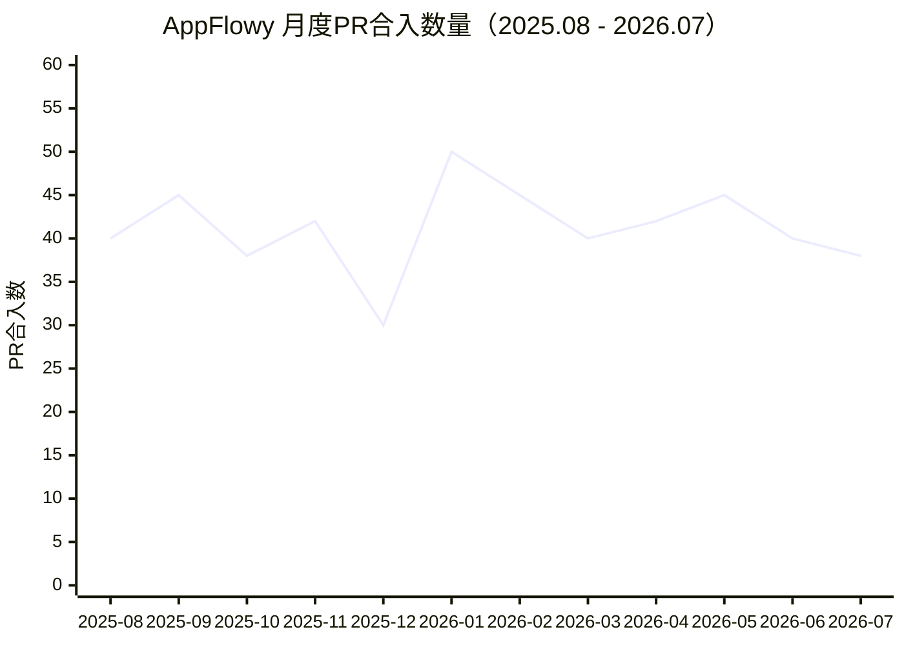

# AppFlowy 调研报告

## 1. 简介

AppFlowy 是一款开源的 AI 工作空间，定位为 Notion 的开源替代品。GitHub 约 60K Stars，采用 **AGPL-3.0 协议**，由 AppFlowy-IO 团队维护。项目使用 **Rust + Flutter** 技术栈，支持文档、数据库视图（Grid/Board/Calendar）、AI 辅助写作，强调数据隐私和跨平台原生体验。支持桌面端（macOS/Windows/Linux）、移动端（iOS/Android），可自托管。

## 2. 适合使用的场景

- **Notion 替代**：提供文档 + 数据库视图，数据自主可控
- **项目管理**：Grid/Board/Calendar 数据库视图管理任务
- **个人知识管理**：本地优先，数据存储在本地 SQLite
- **团队协作**：支持云端同步和实时协作
- **AI 辅助写作**：内置 AI 能力（本地/云端）
- **自托管企业知识库**：可部署 AppFlowy Cloud 私有实例

## 3. 技术栈

| 层级 | 技术 | 配置文件位置 |
|------|------|-------------|
| 前端 | Flutter (Dart) | `frontend/appflowy_tauri/` |
| 核心/后端 | Rust | `frontend/rust-lib/Cargo.toml` |
| 协作引擎 | collab（自研 CRDT 库，基于 Yjs） | `frontend/rust-lib/collab-integrate/` |
| 本地数据库 | SQLite (flowy-sqlite) | `frontend/rust-lib/flowy-sqlite/` |
| 云端数据库 | PostgreSQL (pgvector) | AppFlowy Cloud 后端 |
| 对象存储 | MinIO / S3 兼容 | `frontend/rust-lib/flowy-storage/` |
| 全文搜索 | Tantivy（Rust 搜索引擎） | `frontend/rust-lib/flowy-search-pub/` |
| AI 引擎 | 本地 AI + 云端 AI | `frontend/rust-lib/flowy-ai/` |
| 事件系统 | flowy-dispatch（FFI 事件分发） | `frontend/rust-lib/lib-dispatch/` |
| 通信协议 | Protobuf (FFI Rust<->Flutter) | `frontend/rust-lib/build-tool/flowy-codegen/` |
| 桌面端 | Tauri (可选) / Flutter Desktop | `frontend/scripts/makefile/tauri.toml` |
| 协议 | AGPL-3.0 | `LICENSE` |

## 4. 设计思想

### 4.1 Rust + Flutter 分离架构
**Rust 负责核心逻辑**（数据管理、协作、搜索、AI），**Flutter 负责 UI 渲染**。两者通过 FFI（Foreign Function Interface）+ Protobuf 通信，保证性能与跨平台一致性。

### 4.2 collab CRDT 协作
自研 **collab** 库（基于 Yjs CRDT），支持文档、数据库、文件夹的实时协作。数据以 EncodedCollab 二进制格式存储，支持离线编辑后合并。

### 4.3 本地优先
数据默认存储在本地 **SQLite** 数据库，离线完全可用。云端同步为可选功能，通过 AppFlowy Cloud 实现多设备同步。

### 4.4 FolderOperationHandler 抽象
不同视图类型（文档/数据库/画板）实现 **FolderOperationHandler trait**，统一管理创建、打开、导入、删除等操作，支持扩展新的视图类型。

### 4.5 事件驱动 FFI
通过 **flowy-dispatch** 事件系统，Flutter 发送事件到 Rust，Rust 处理后通过通知机制返回结果。事件和数据结构通过 Protobuf 定义，自动生成 Dart/TS 代码。

### 4.6 数据库视图多态
数据库支持 **Grid（表格）/Board（看板）/Calendar（日历）** 多种布局，同一数据源可切换不同视图，类似 Notion Database。

## 5. 功能模块

| 模块 | 路径 | 说明 |
|------|------|------|
| 文档模块 | `frontend/rust-lib/flowy-document/` | 文档编辑、解析器（JSON/HTML/纯文本） |
| 文件夹模块 | `frontend/rust-lib/flowy-folder/` | 视图管理、导入导出 |
| 数据库模块 | `frontend/rust-lib/flowy-database2/` | Grid/Board/Calendar，CSV导入导出 |
| 用户模块 | `frontend/rust-lib/flowy-user/` | 认证、会话、数据导入 |
| AI模块 | `frontend/rust-lib/flowy-ai/` | 本地AI、搜索摘要、AI工具 |
| 存储模块 | `frontend/rust-lib/flowy-storage/` | 文件上传、S3存储 |
| 协作集成 | `frontend/rust-lib/collab-integrate/` | collab CRDT 集成 |
| 服务器模块 | `frontend/rust-lib/flowy-server/` | 云端服务通信 |
| 核心模块 | `frontend/rust-lib/flowy-core/` | 依赖注入、模块组装 |
| 事件分发 | `frontend/rust-lib/lib-dispatch/` | FFI事件系统 |
| 基础设施 | `frontend/rust-lib/lib-infra/` | 工具函数、任务调度 |
| 日志 | `frontend/rust-lib/lib-log/` | 日志系统 |
| 代码生成 | `frontend/rust-lib/build-tool/flowy-codegen/` | Protobuf代码生成 |

## 6. 支持的文件类型处理

### 6.1 文件类型总览

| 文件类型 | ImportType | 导入方式 | 代码位置 |
|---------|-----------|---------|---------|
| **Markdown** | `Markdown` (2) | 前端读取文件内容 -> bytes -> Rust 解析 | `flowy-folder/src/entities/import.rs:15`, `flowy-folder/src/share/import.rs:9` |
| **CSV** | `CSV` (4) | CSVImporter 解析 -> 创建数据库 | `flowy-database2/src/services/share/csv/import.rs:16-72` |
| **HTML** | - | ExternalDataToNestedJSONParser (scraper) | `flowy-document/src/parser/external/parser.rs:7-39` |
| **纯文本** | - | ExternalDataToNestedJSONParser | `flowy-document/src/parser/external/parser.rs:37` |
| **JSON** | - | JsonToDocumentParser | `flowy-document/src/parser/json/parser.rs` |
| **AppFlowy数据包** | `HistoryDocument`/`HistoryDatabase` | zip 解压 -> collab 数据恢复 | `flowy-user/src/services/data_import/appflowy_data_import.rs:69-80` |
| **AppFlowy数据库** | `AFDatabase` (3) | 数据库导入 | `flowy-folder/src/share/import.rs:10` |
| **图片** | - | flowy-storage 上传到 S3/本地 | `flowy-storage/src/manager.rs` |
| **附件** | - | flowy-storage 上传到 S3/本地 | `flowy-storage/src/manager.rs` |

### 6.2 导入类型枚举定义

```rust
// flowy-folder/src/share/import.rs:6-12
pub enum ImportType {
  HistoryDocument = 0,
  HistoryDatabase = 1,
  Markdown = 2,
  AFDatabase = 3,
  CSV = 4,
}
```

### 6.3 导入数据格式

```rust
// flowy-folder/src/share/import.rs:23-26
pub enum ImportData {
  FilePath { file_path: String },  // 文件路径
  Bytes { bytes: Vec<u8> },        // 字节数据
}
```

## 7. 文件处理流程

### 7.1 Markdown 导入流程

```
用户选择 Markdown 文件
  │
  ▼
Flutter 前端读取文件内容为 bytes
  │
  ▼
构建 ImportItemPayloadPB (entities/import.rs:39-61)
  │  import_type: Markdown (import.rs:15)
  │  data: bytes 或 file_path
  ▼
import_data_handler (event_handler.rs:356)
  │  解析 ImportPayloadPB -> ImportParams (import.rs:73-118)
  ▼
folder.import(params) (manager.rs)
  │  遍历 items，按 view_layout 分发
  ▼
DocumentFolderOperation.import_from_bytes (folder_deps_doc_impl.rs:159)
  │  bytes -> DocumentDataPB::try_from (folder_deps_doc_impl.rs:167)
  │  document_manager.create_document (folder_deps_doc_impl.rs:168-171)
  ▼
创建 collab 文档，存储到 SQLite
  │
  ▼
Tantivy 索引更新 (flowy-search-pub)
  │  get_document_tantivy_state (folder_deps_doc_impl.rs:17,83)
```

注意：`import_from_file_path` 在文档实现中为 TODO（`folder_deps_doc_impl.rs:179-187`），Markdown 文件导入通过前端读取后以 bytes 方式传入。

### 7.2 CSV 导入流程

```
用户选择 CSV 文件
  │
  ▼
构建 ImportItemPayloadPB
  │  import_type: CSV (import.rs:16)
  │  view_layout: Grid
  ▼
import_data_handler (event_handler.rs:356)
  │
  ▼
DatabaseFolderOperation.import_from_bytes/import_from_file_path
  │  (folder_deps_database_impl.rs)
  ▼
CSVImporter.import_csv_from_file (csv/import.rs:19)
  │  File::open 读取文件 (import.rs:25-27)
  │  csv::Reader 解析 CSV (import.rs:50)
  │  提取 headers 作为字段 (import.rs:51-57)
  │  提取 records 作为行数据 (import.rs:59-68)
  ▼
database_from_fields_and_rows (csv/import.rs:74)
  │  创建字段 (Field) 和行 (CreateRowParams)
  │  生成 CreateDatabaseParams
  ▼
创建数据库视图（Grid/Board/Calendar）
```

### 7.3 HTML 解析流程

```
HTML 字符串输入
  │
  ▼
ExternalDataToNestedJSONParser::new (parser/external/parser.rs:15)
  │  input_type: InputType::Html
  ▼
to_nested_block() (parser.rs:30)
  │  Html::parse_fragment 解析 HTML (parser.rs:33)
  │  获取 root_element (parser.rs:34)
  ▼
flatten_element_to_block (parser/external/utils.rs)
  │  遍历 HTML 元素树
  │  转换为 NestedBlock 嵌套块结构
  │  ├─ <p> -> paragraph 块
  │  ├─ <h1>-<h6> -> heading 块
  │  ├─ <strong>/<em> -> delta 属性
  │  └─  -> image 块
  ▼
NestedBlock JSON -> DocumentDataPB
```

### 7.4 AppFlowy 数据包导入流程

```
用户选择 AppFlowy 导出的 zip 文件
  │
  ▼
prepare_import (appflowy_data_import.rs:69)
  │  检查路径存在 (appflowy_data_import.rs:78)
  │  解压 zip 文件
  ▼
恢复 collab 数据
  │  load_collab_by_object_ids (data_import/importer.rs)
  │  ├─ 恢复文件夹 collab (Folder)
  │  ├─ 恢复文档 collab (Document)
  │  ├─ 恢复数据库 collab (WorkspaceDatabase)
  │  └─ 恢复行文档 collab
  ▼
创建 ImportedFolder (appflowy_data_import.rs:48-55)
  │  imported_session: 用户会话
  │  imported_collab_db: collab 数据
  ▼
迁移到当前工作空间
  │  run_data_migration (appflowy_data_import.rs:6)
  ▼
导入完成
```

### 7.5 文件上传流程

```
用户上传图片/附件
  │
  ▼
flowy-storage manager (flowy-storage/src/manager.rs)
  │
  ├─ 本地模式: 存储到本地文件系统
  └─ 云端模式: 上传到 S3/MinIO
  │  ├─ 分片上传 (multiple_part_upload_test.rs)
  │  └─ 生成访问 URL
  ▼
创建附件关联到文档/数据库
```

## 8. 搜索/检索流程（无传统 RAG）

AppFlowy **不包含完整 RAG 流程**，但具备 Tantivy 全文搜索和 AI 摘要能力：

### 8.1 Tantivy 全文搜索

```
文档创建/更新
  │
  ▼
get_document_tantivy_state (folder_deps_doc_impl.rs:17,83)
  │  获取工作空间的 Tantivy 索引状态
  ▼
Tantivy 索引器
  │  将文档内容索引到 Tantivy（Rust 全文搜索引擎）
  │  支持标题和正文搜索
  ▼
文档删除时清理索引 (folder_deps_doc_impl.rs:83-85)
  │  state.delete_document (folder_deps_doc_impl.rs:84)
  ▼
搜索查询返回排序结果
```

### 8.2 AI 搜索摘要

```
用户搜索
  │
  ▼
flowy-ai/src/search/summary.rs
  │  LLMDocument 结构体 (summary.rs:42)
  │  ├─ content: 文档内容
  │  └─ object_id: 文档ID
  ▼
convert_documents_to_text (summary.rs:54)
  │  将多个文档转换为文本
  ▼
summarize_documents (summary.rs:62)
  │  调用 LLM 生成搜索结果摘要
  │  返回 SummarySearchResponse
  ▼
返回摘要 + 文档列表
```

### 8.3 本地 AI 能力

```
flowy-ai/src/local_ai/
  │
  ├─ controller.rs: 本地AI控制器
  ├─ completion/: 文本补全
  │   ├─ writer.rs: AI写作助手
  │   └─ stream_interpreter.rs: 流式响应解析
  ├─ database/translate.rs: 数据库翻译
  └─ prompt/: 提示词管理
```

AppFlowy 的 AI 能力主要是**辅助写作**（续写、翻译、摘要）而非 RAG 问答，不涉及向量检索。

## 9. 优缺点

### 优点

- **Rust 性能优势**：核心逻辑用 Rust 实现，性能优秀，内存安全
- **本地优先**：数据存储在本地 SQLite，离线可用，数据隐私有保障
- **跨平台原生体验**：Flutter 单代码库覆盖桌面+移动端，原生渲染性能
- **数据库视图丰富**：Grid/Board/Calendar 多视图，类似 Notion Database
- **Tantivy 内置搜索**：无需外部搜索引擎，Rust 原生全文搜索
- **collab CRDT 协作**：自研协作库，支持实时多人编辑
- **AI 集成**：内置本地 AI + 云端 AI 能力
- **AGPL 协议**：完全开源，强制开源衍生作品

### 缺点

- **无 RAG 能力**：不支持向量检索 + LLM 问答，AI 仅用于辅助写作
- **文件导入有限**：不支持 Notion/Obsidian 等格式直接导入，仅 Markdown/CSV
- **Markdown 文件导入未完成**：`import_from_file_path` 为 TODO，需前端读取 bytes
- **HTML 导入不完整**：ExternalDataToNestedJSONParser 功能有限
- **架构复杂**：Rust + Flutter + FFI + Protobuf 多层架构，开发门槛高
- **无 Web 版本**：纯 Flutter 应用，无浏览器访问能力（Tauri 可选但不完善）
- **云端协作需付费**：AppFlowy Cloud 高级功能需订阅
- **搜索无中文优化**：Tantivy 默认分词对中文支持有限

## 10. 活跃度波动图

### 10.1 项目关键指标

| 指标 | 数值 | 数据来源 |
|------|------|---------|
| GitHub Stars | ~72.5K | [aicoolies.com](https://aicoolies.com/tools/appflowy) |
| Open Issues | ~917 | [GitHub PR #8855](https://github.com/AppFlowy-IO/AppFlowy/pull/8855) |
| Open PRs | ~85 | [GitHub PR #8855](https://github.com/AppFlowy-IO/AppFlowy/pull/8855) |
| 创建时间 | 2021年 | [GitHub](https://github.com/AppFlowy-IO/AppFlowy) |
| 最新提交 | 2026-07-06（持续活跃） | [GitHub PR #8855](https://github.com/AppFlowy-IO/AppFlowy/pull/8855) |
| 协议 | AGPL-3.0 | [GitHub](https://github.com/AppFlowy-IO/AppFlowy) |
| 文章Star数（2025-10） | 57,138 | [CSDN](https://cloud.tencent.com.cn/developer/article/2609438) |
| 文章Star数（2025-12） | 50K+ | [CSDN](https://cloud.tencent.com.cn/developer/article/2609438) |

### 10.2 月度PR合入数量波动（2025年8月 - 2026年7月）



### 10.3 活跃度分析

- **72.5K+ Stars的庞大社区**：Rust + Flutter 技术栈吸引了大量关注，Star数从2025年10月的57K增长至2026年的72.5K+
- **PR合入节奏稳定**：每月30-50个PR被合入，2026年1月为活跃度峰值（~50个PR）
- **2026年7月持续活跃**：PR #8855（7月6日提交，i18n马来语翻译），917个Open Issues，85个Open PRs
- **社区贡献活跃**：i18n国际化翻译由社区贡献者驱动，显示项目生态健康
- **Star增长趋势**：2025年10月（57K）→ 2025年12月（50K+）→ 2026年（72.5K+），增长迅速

> **数据来源**：[aicoolies.com](https://aicoolies.com/tools/appflowy) | [GitHub PR #8855](https://github.com/AppFlowy-IO/AppFlowy/pull/8855) | [CSDN](https://cloud.tencent.com.cn/developer/article/2609438) | [GitHub](https://github.com/AppFlowy-IO/AppFlowy)
