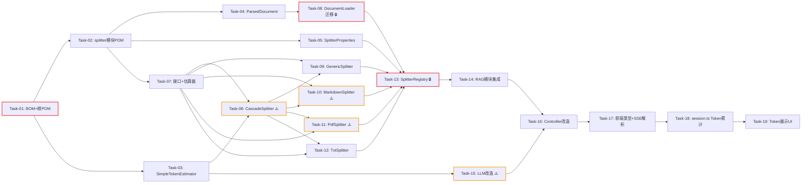

# 开发任务计划: 文档分割模块化与Token展示

## 0. 任务概览 (Task Overview)

* **总任务数**: 19 个

* **预计总工时**: 990 分钟（约 16.5 小时）

* **开发方法**: TDD（测试驱动开发）- 每个任务按 Red-Green-Refactor 循环执行

* **关键里程碑**:

  * 阶段一完成（基础设施层）：约 90 分钟

  * 阶段二完成（核心工具与数据结构层）：约 190 分钟

  * 阶段三完成（文件解析与分割实现层）：约 380 分钟

  * 阶段四完成（RAG 模块集成层）：约 60 分钟

  * 阶段五完成（Token 统计后端层）：约 150 分钟

  * 阶段六完成（Token 展示前端层）：约 140 分钟

  * 整体完成：约 990 分钟

* **风险任务**: Task-06（CascadeSplitter 算法）、Task-10（MarkdownDocumentSplitter）、Task-11（PdfDocumentSplitter）、Task-15（ArkThinkingStreamingChatModel 改造）

* **阻塞任务**: Task-01（BOM+POM 基础）、Task-08（DocumentLoader 迁移）、Task-13（DocumentSplitterRegistry）

### 依赖关系图

### 可并行任务组

| 并行组   | 可同时执行的任务                              | 前置条件                             | 说明                                 |
| :---- | :------------------------------------ | :------------------------------- | :--------------------------------- |
| 并行组 1 | Task-03 + Task-04 + Task-05           | Task-01, Task-02 完成              | common 工具类与 splitter 模块数据结构/配置互不依赖 |
| 并行组 2 | Task-09 + Task-10 + Task-11 + Task-12 | Task-06, Task-07, Task-08 完成     | 四个分割器实现互不依赖，可同时开发                  |
| 并行组 3 | Task-14 + Task-15                     | Task-13, Task-03 完成              | RAG 集成与 LLM 改造分属不同模块，可并行           |
| 并行组 4 | Task-17 + Task-16                     | Task-15 完成（Task-17 仅依赖 SSE 协议定义） | 前端类型定义与后端 Controller 改造可并行         |

## 1. 准备工作 (Preparation)

* [x] **Prep-01**: 确认功能分支

  * 说明：在现有项目目录下直接开发（项目为本地 Git 仓库，无远程）

  * 验证：`git status` 确认工作区干净

* [x] **Prep-02**: 确认构建环境就绪

  * 说明：JDK 17 位于 `D:\Java\jdk-17.0.7`，Maven 可用

  * 验证：`mvn compile -pl agent-demo-common -am` 编译通过

* [x] **Prep-03**: 确认前端环境就绪

  * 说明：Node.js 18+，npm 可用

  * 验证：`npm run dev`（在 agent-demo-frontend 目录）前端正常启动

## 2. 开发任务 (Development Tasks)

> 每个任务按 TDD 循环执行：RED（写测试）-> GREEN（写实现）-> REFACTOR（重构）

### 阶段一：基础设施层 (Infrastructure Layer)

> **阶段完成标准**: BOM 新增 commonmark-java 版本管理；根 POM 新增 agent-demo-splitter 模块声明；新模块 POM 创建并可编译；SimpleTokenEstimator 工具类可用。

* [ ] **Task-01**: BOM 新增 commonmark-java 依赖管理 + 根 POM 新增模块声明 🔒

  * **通俗解释**: 做完这步后，项目就有了新模块的"户口"和 Markdown 解析库的版本登记，后续代码才能引用它们。

  * **说明**: 在 agent-demo-bom/pom.xml 新增 commonmark 和 commonmark-ext-gfm-tables 的版本属性和 dependencyManagement；在根 pom.xml 的 `<modules>` 中新增 agent-demo-splitter 声明

  * **涉及文件**: `agent-demo-bom/pom.xml`、`pom.xml`（根）

  * **测试文件**: 无（POM 变更，通过编译验证）

  * **参考**: 技术方案 Sec 9.4 改动文件清单

  * **对应AC**: AC-001, AC-018

  * **预估工时**: 30m

  * **依赖**: 无

  * **验证标准**:

    * [ ] `agent-demo-bom/pom.xml` 中存在 `commonmark.version` 属性，值为 `0.22.0`

    * [ ] `agent-demo-bom/pom.xml` 的 dependencyManagement 中存在 `org.commonmark:commonmark` 和 `org.commonmark:commonmark-ext-gfm-tables` 两个依赖

    * [ ] 根 `pom.xml` 的 `<modules>` 中存在 `<module>agent-demo-splitter</module>`

    * [ ] 执行 `mvn validate` 无错误

* [ ] **Task-02**: agent-demo-splitter 模块 POM 创建

  * **通俗解释**: 做完这步后，新模块就有了自己的"身份证"，可以开始往里面写代码了。

  * **说明**: 创建 `agent-demo-splitter/pom.xml`，继承根 POM，声明依赖：agent-demo-common、langchain4j（GA）、pdfbox、tabula、commonmark、commonmark-ext-gfm-tables、lombok、spring-boot-starter-test

  * **涉及文件**: `agent-demo-splitter/pom.xml`

  * **测试文件**: 无

  * **参考**: 技术方案 Sec 1.2 新模块内部结构

  * **对应AC**: AC-001, AC-018

  * **预估工时**: 20m

  * **依赖**: Task-01

  * **验证标准**:

    * [ ] `agent-demo-splitter/pom.xml` 的 `<parent>` 指向根 POM

    * [ ] `<artifactId>` 为 `agent-demo-splitter`

    * [ ] 依赖列表包含 agent-demo-common、langchain4j、pdfbox、tabula、commonmark、commonmark-ext-gfm-tables

    * [ ] 所有依赖版本由 BOM 管理（不写 `<version>`）

    * [ ] 执行 `mvn compile -pl agent-demo-splitter` 成功（空模块编译通过）

* [ ] **Task-03**: SimpleTokenEstimator 工具类

  * **通俗解释**: 做完这步后，系统就有了一个"Token 计数器"，能大致估算一段文字消耗多少 Token，这是分割和 Token 展示的基础能力。

  * **说明**: 在 agent-demo-common 中新建 `SimpleTokenEstimator` 静态工具类，实现 Token 估算算法（中文≈1.5字/token，英文≈4字符/token）

  * **涉及文件**: `agent-demo-common/src/main/java/com/agentdemo/common/utils/SimpleTokenEstimator.java`

  * **测试文件**: `agent-demo-common/src/test/java/com/agentdemo/common/utils/SimpleTokenEstimatorTest.java`

  * **参考**: 技术方案 Sec 4.8

  * **对应AC**: AC-014, AC-016

  * **预估工时**: 40m

  * **依赖**: Task-01

  * **验证标准**:

    * [ ] 调用 `estimate(null)` 返回 0

    * [ ] 调用 `estimate("")` 返回 0

    * [ ] 调用 `estimate("你好世界")`（4个中文字符）返回 3（ceil(4/1.5)）

    * [ ] 调用 `estimate("hello")`（5个英文字符）返回 2（ceil(5/4)）

    * [ ] 调用 `estimate("你好hello")`（2中文+5英文）返回 3（ceil(2/1.5) + ceil(5/4) = 2+2 = 4，实际 ceil(1.33) + ceil(1.25) = 2+2 = 4）

    * [ ] 调用 `estimate(generateLongText(10000))` 返回值 > 0 且执行时间 < 10ms

### 阶段二：核心工具与数据结构层 (Core Utilities & Data Structures)

> **阶段完成标准**: ParsedDocument 数据结构可用；SplitterProperties 配置绑定可用；CascadeSplitter 多级级联切分算法通过全部测试；TypedDocumentSplitter 接口定义完成。

* [ ] **Task-04**: ParsedDocument + DocumentSection 数据结构

  * **通俗解释**: 做完这步后，系统就有了一个"文件解析结果的标准格式"，文件解析后的内容可以带着页码、章节等结构信息传递给分割器。

  * **说明**: 在 agent-demo-splitter 中新建 `ParsedDocument` 和 `DocumentSection` 类，包含全文文本、文件格式、结构化分节等字段

  * **涉及文件**: `agent-demo-splitter/src/main/java/com/agentdemo/splitter/loader/ParsedDocument.java`、`DocumentSection.java`

  * **测试文件**: `agent-demo-splitter/src/test/java/com/agentdemo/splitter/loader/ParsedDocumentTest.java`

  * **参考**: 技术方案 Sec 4.1

  * **对应AC**: AC-004, AC-017

  * **预估工时**: 30m

  * **依赖**: Task-02

  * **验证标准**:

    * [ ] `ParsedDocument` 包含 `text`、`format`、`sections` 三个字段

    * [ ] `DocumentSection` 包含 `text` 和 `metadata`（Map\<String,String>）两个字段

    * [ ] 构建 `ParsedDocument` 时 `sections` 可为 null（MD/TXT 场景）

    * [ ] 构建 `ParsedDocument` 时 `sections` 可包含多个 `DocumentSection`（PDF 场景）

    * [ ] `DocumentSection.metadata` 可存入 `pageNumber` 等键值对

* [ ] **Task-05**: SplitterProperties 配置类 + application.yml 配置

  * **通俗解释**: 做完这步后，运维人员就可以在配置文件中为每种文件类型单独设置分块大小和重叠大小了，比如 Markdown 切小一点、PDF 切大一点。

  * **说明**: 在 agent-demo-splitter 中新建 `SplitterProperties` 配置类，绑定 `rag.splitter` 前缀，支持按文件类型（md/pdf/txt）配置 size 和 overlap；在 application.yml 中新增配置段

  * **涉及文件**: `agent-demo-splitter/src/main/java/com/agentdemo/splitter/config/SplitterProperties.java`、`agent-demo-bootstrap/src/main/resources/application.yml`

  * **测试文件**: `agent-demo-splitter/src/test/java/com/agentdemo/splitter/config/SplitterPropertiesTest.java`

  * **参考**: 技术方案 Sec 4.2、Sec 2.1

  * **对应AC**: AC-008

  * **预估工时**: 40m

  * **依赖**: Task-02

  * **验证标准**:

    * [ ] `SplitterProperties` 绑定前缀为 `rag.splitter`

    * [ ] 包含 `defaultConfig`、`md`、`pdf`、`txt` 四个 `ChunkConfig` 字段

    * [ ] `ChunkConfig` 包含 `size`（int）和 `overlap`（int）字段

    * [ ] `getConfig("md")` 返回 md 配置；`getConfig("unknown")` 返回 defaultConfig

    * [ ] application.yml 中存在 `rag.splitter.md.size` 等配置项

    * [ ] 默认值：md.size=800、md.overlap=150、pdf.size=1200、pdf.overlap=200、txt.size=1000、txt.overlap=200

* [ ] **Task-06**: CascadeSplitter 多级优先级级联切分工具 ⚠️

  * **通俗解释**: 做完这步后，系统遇到超长段落时不会粗暴地按字数切断，而是会先尝试按段落分、再按句子分、再按行分，最后才按 Token 数强制切，尽量保持语义完整。

  * **说明**: 在 agent-demo-splitter 中新建 `CascadeSplitter` 工具类，实现四级降级切分算法（段落->句子->行->Token滑动窗口），含过短块合并逻辑

  * **涉及文件**: `agent-demo-splitter/src/main/java/com/agentdemo/splitter/splitter/util/CascadeSplitter.java`

  * **测试文件**: `agent-demo-splitter/src/test/java/com/agentdemo/splitter/splitter/util/CascadeSplitterTest.java`

  * **参考**: 技术方案 Sec 4.6

  * **对应AC**: AC-007

  * **预估工时**: 90m

  * **依赖**: Task-03, Task-07

  * **风险标注**: 核心算法，四级降级逻辑复杂，需覆盖各种文本长度和分隔符组合

  * **验证标准**:

    * [ ] 输入短文本（Token 数 ≤ maxSize），返回单元素列表，文本完整保留

    * [ ] 输入含多个 `\n\n` 分隔的长文本，按段落切分后每个子块 Token 数 ≤ maxSize

    * [ ] 输入单个超长段落（无 \n\n 但有句号），按句子切分后每个子块 Token 数 ≤ maxSize

    * [ ] 输入单个超长无标点文本（仅有 \n），按行切分后每个子块 Token 数 ≤ maxSize

    * [ ] 输入超长无任何分隔符的文本，按 Token 滑动窗口切分后每个子块 Token 数 ≤ maxSize

    * [ ] 切分结果中存在 overlap 重叠区域（Level 4 滑动窗口场景）

    * [ ] 最终结果中不存在 Token 数 < maxSize \* 0.5 的过短块（已与前一块合并）

    * [ ] 输入空字符串返回空列表

* [ ] **Task-07**: TypedDocumentSplitter 接口 + SplitterTokenEstimator

  * **通俗解释**: 做完这步后，系统就定义好了"分割器"的标准接口和 Token 估算器，后续每种文件类型的分割器都按这个标准来实现。

  * **说明**: 在 agent-demo-splitter 中新建 `TypedDocumentSplitter` 接口（extends LangChain4j DocumentSplitter，新增 `supportedFormat()` 方法）和 `SplitterTokenEstimator`（委托 SimpleTokenEstimator）

  * **涉及文件**: `agent-demo-splitter/src/main/java/com/agentdemo/splitter/splitter/TypedDocumentSplitter.java`、`tokenizer/SplitterTokenEstimator.java`

  * **测试文件**: `agent-demo-splitter/src/test/java/com/agentdemo/splitter/splitter/TypedDocumentSplitterTest.java`

  * **参考**: 技术方案 Sec 1.2、Sec 4.2

  * **对应AC**: AC-016

  * **预估工时**: 30m

  * **依赖**: Task-02, Task-04

  * **验证标准**:

    * [ ] `TypedDocumentSplitter` 继承 `dev.langchain4j.data.document.DocumentSplitter`

    * [ ] 接口包含 `String supportedFormat()` 方法

    * [ ] `SplitterTokenEstimator.estimate(String)` 返回与 `SimpleTokenEstimator.estimate()` 相同的结果

    * [ ] `SplitterTokenEstimator` 可被实例化（非静态方法，便于 Mock）

### 阶段三：文件解析与分割实现层 (Parsing & Splitting Implementation)

> **阶段完成标准**: DocumentLoader 返回 ParsedDocument；三个专属分割器（MD/PDF/TXT）和通用分割器全部通过测试；DocumentSplitterRegistry 路由与回退逻辑可用。

* [ ] **Task-08**: DocumentLoader 迁移与改造 🔒

  * **通俗解释**: 做完这步后，文件解析功能从原来的 RAG 模块搬到了独立的新模块，而且 PDF 解析时会把每一页的内容分开保存，方便后面按页分割。

  * **说明**: 将 DocumentLoader 从 agent-demo-rag 迁移到 agent-demo-splitter，返回值从 String 改为 ParsedDocument；PDF 解析改为按页提取（PDFTextStripper 逐页），每页构建 DocumentSection 含 pageNumber metadata；空文件检测抛出 BusinessException

  * **涉及文件**: `agent-demo-splitter/src/main/java/com/agentdemo/splitter/loader/DocumentLoader.java`（迁移）、删除 `agent-demo-rag/.../loader/DocumentLoader.java`

  * **测试文件**: `agent-demo-splitter/src/test/java/com/agentdemo/splitter/loader/DocumentLoaderTest.java`

  * **参考**: 技术方案 Sec 4.1、Sec 5 异常处理

  * **对应AC**: AC-004, AC-011, AC-018

  * **预估工时**: 60m

  * **依赖**: Task-04

  * **验证标准**:

    * [ ] 解析 txt 文件返回 ParsedDocument，text 非空，format="txt"，sections=null

    * [ ] 解析 md 文件返回 ParsedDocument，text 非空，format="md"，sections=null

    * [ ] 解析 pdf 文件返回 ParsedDocument，text 非空，format="pdf"，sections 非空且每个 section 的 metadata 含 pageNumber

    * [ ] 解析空内容文件（0 字节 txt）抛出 BusinessException，错误码为 RAG\_DOCUMENT\_PARSE\_FAILED，消息含"文件内容为空"

    * [ ] 解析不支持的格式（如 .docx）抛出 BusinessException，错误码为 RAG\_DOCUMENT\_FORMAT\_UNSUPPORTED

    * [ ] 解析超过 10MB 的文件抛出 BusinessException，错误码为 RAG\_DOCUMENT\_SIZE\_EXCEEDED

* [ ] **Task-09**: GenericDocumentSplitter 通用回退分割器

  * **通俗解释**: 做完这步后，系统就有了一个"兜底分割器"，当专属分割器出问题时它能顶上，确保文档处理不中断。

  * **说明**: 实现 GenericDocumentSplitter，使用 CascadeSplitter 对全文进行多级递归切分，作为专属分割器失败时的回退

  * **涉及文件**: `agent-demo-splitter/src/main/java/com/agentdemo/splitter/splitter/GenericDocumentSplitter.java`

  * **测试文件**: `agent-demo-splitter/src/test/java/com/agentdemo/splitter/splitter/GenericDocumentSplitterTest.java`

  * **参考**: 技术方案 Sec 4.2

  * **对应AC**: AC-012

  * **预估工时**: 40m

  * **依赖**: Task-06, Task-07

  * **验证标准**:

    * [ ] `supportedFormat()` 返回 null（通用，不绑定特定格式）

    * [ ] 输入 ParsedDocument（text 非空），返回 List<TextSegment>，每个分块 Token 数 ≤ 配置的 maxSize

    * [ ] 输入空 text 的 ParsedDocument，返回空列表

    * [ ] 分割结果中每个 TextSegment 的 text 不为空

* [ ] **Task-10**: MarkdownDocumentSplitter MD 专属分割器 ⚠️

  * **通俗解释**: 做完这步后，Markdown 文件会按照标题（#/##/###）来分块，代码块和表格不会被切断，检索时能找到完整的章节内容。

  * **说明**: 实现 MarkdownDocumentSplitter，使用 commonmark-java + GFM Tables 扩展解析 Markdown AST，按 Heading 节点分割，FencedCodeBlock/TableBlock 作为原子单元保护，超大 section 调用 CascadeSplitter

  * **涉及文件**: `agent-demo-splitter/src/main/java/com/agentdemo/splitter/splitter/MarkdownDocumentSplitter.java`

  * **测试文件**: `agent-demo-splitter/src/test/java/com/agentdemo/splitter/splitter/MarkdownDocumentSplitterTest.java`

  * **参考**: 技术方案 Sec 4.3

  * **对应AC**: AC-002, AC-003, AC-007

  * **预估工时**: 90m

  * **依赖**: Task-06, Task-07

  * **风险标注**: commonmark-java AST 遍历逻辑复杂，需处理 Heading/FencedCodeBlock/IndentedCodeBlock/TableBlock 多种节点类型

  * **验证标准**:

    * [ ] `supportedFormat()` 返回 "md"

    * [ ] 输入含 `# 标题1`、`## 标题2` 的 Markdown，分块结果中每个分块以标题为边界

    * [ ] 分块 metadata 中含 `headerLevel` 和 `headerText`

    * [ ] 输入含 \`\`\` 代码块的 Markdown，代码块不会被切断到两个分块中

    * [ ] 输入含 GFM 表格（|...|）的 Markdown，表格不会被切断到两个分块中

    * [ ] 输入单个超长 section（标题下内容超过 maxSize），调用 CascadeSplitter 后每个子分块 Token 数 ≤ maxSize

    * [ ] 输入无标题的纯文本 Markdown，整体作为一个分块（或按 CascadeSplitter 切分）

* [ ] **Task-11**: PdfDocumentSplitter PDF 专属分割器 ⚠️

  * **通俗解释**: 做完这步后，PDF 文件会按页来分块，每块内容都带着页码信息，检索时能定位到具体哪一页。

  * **说明**: 实现 PdfDocumentSplitter，利用 ParsedDocument.sections（按页文本），每页独立分块，页码写入 metadata，单页超限时调用 CascadeSplitter；加密 PDF 异常处理

  * **涉及文件**: `agent-demo-splitter/src/main/java/com/agentdemo/splitter/splitter/PdfDocumentSplitter.java`

  * **测试文件**: `agent-demo-splitter/src/test/java/com/agentdemo/splitter/splitter/PdfDocumentSplitterTest.java`

  * **参考**: 技术方案 Sec 4.4

  * **对应AC**: AC-004, AC-005, AC-013

  * **预估工时**: 60m

  * **依赖**: Task-06, Task-07, Task-08

  * **风险标注**: PDF 按页提取依赖 ParsedDocument.sections 的正确性；加密 PDF 需异常捕获

  * **验证标准**:

    * [ ] `supportedFormat()` 返回 "pdf"

    * [ ] 输入 3 页 PDF 的 ParsedDocument（sections 含 3 个元素），返回的分块中每个分块 metadata 含 `pageNumber`

    * [ ] 不跨页拼接内容（相邻分块的 pageNumber 可能相同但不会拼接不同页内容）

    * [ ] 输入某页内容超过 maxSize 的 ParsedDocument，该页被 CascadeSplitter 切分为多个子分块，每个子分块 metadata 的 pageNumber 相同

    * [ ] 输入 sections 为空列表的 ParsedDocument，返回空列表

    * [ ] 输入 sections 为 null 的 ParsedDocument（异常情况），回退使用全文 text 进行切分

* [ ] **Task-12**: TxtDocumentSplitter TXT 专属分割器

  * **通俗解释**: 做完这步后，纯文本文件会按照段落、句子、行的优先级来分块，尽量不把一句话切断。

  * **说明**: 实现 TxtDocumentSplitter，调用 CascadeSplitter 对全文进行多级递归切分

  * **涉及文件**: `agent-demo-splitter/src/main/java/com/agentdemo/splitter/splitter/TxtDocumentSplitter.java`

  * **测试文件**: `agent-demo-splitter/src/test/java/com/agentdemo/splitter/splitter/TxtDocumentSplitterTest.java`

  * **参考**: 技术方案 Sec 4.5

  * **对应AC**: AC-006

  * **预估工时**: 40m

  * **依赖**: Task-06, Task-07

  * **验证标准**:

    * [ ] `supportedFormat()` 返回 "txt"

    * [ ] 输入含多个 `\n\n` 分隔段落的文本，按段落优先切分

    * [ ] 输入单个超长段落，按句子（。/!/?/. ）切分

    * [ ] 输入无段落无句子的超长文本，按行（\n）切分

    * [ ] 每个分块 Token 数 ≤ 配置的 maxSize

    * [ ] 输入空文本返回空列表

* [ ] **Task-13**: DocumentSplitterRegistry 路由与回退 🔒

  * **通俗解释**: 做完这步后，系统就有一个"分割调度中心"，上传什么类型的文件就自动派对应的分割器去处理，出问题了还有兜底，并且每个分块都带着来源信息。

  * **说明**: 实现 DocumentSplitterRegistry，按文件格式路由到对应 TypedDocumentSplitter，异常时回退到 GenericDocumentSplitter，分割后为每个 TextSegment 添加来源 metadata（knowledgeBaseId、documentId、format 等）

  * **涉及文件**: `agent-demo-splitter/src/main/java/com/agentdemo/splitter/splitter/DocumentSplitterRegistry.java`

  * **测试文件**: `agent-demo-splitter/src/test/java/com/agentdemo/splitter/splitter/DocumentSplitterRegistryTest.java`

  * **参考**: 技术方案 Sec 4.2

  * **对应AC**: AC-008, AC-012, AC-017

  * **预估工时**: 60m

  * **依赖**: Task-05, Task-08, Task-09, Task-10, Task-11, Task-12

  * **验证标准**:

    * [ ] 调用 `split(parsedDocument, "kb1", "doc1")`，format="md"，路由到 MarkdownDocumentSplitter

    * [ ] 调用 `split(parsedDocument, "kb1", "doc1")`，format="pdf"，路由到 PdfDocumentSplitter

    * [ ] 调用 `split(parsedDocument, "kb1", "doc1")`，format="txt"，路由到 TxtDocumentSplitter

    * [ ] 调用 `split(parsedDocument, "kb1", "doc1")`，format="unknown"，使用 GenericDocumentSplitter

    * [ ] 当 MarkdownDocumentSplitter 抛出异常时，捕获异常并回退到 GenericDocumentSplitter，结果非空

    * [ ] 返回的每个 TextSegment 的 metadata 含 `knowledgeBaseId`="kb1"、`documentId`="doc1"、`format`="md"

    * [ ] 每种文件类型使用各自的 SplitterProperties 配置（md 用 md.size，pdf 用 pdf.size）

### 阶段四：RAG 模块集成层 (RAG Module Integration)

> **阶段完成标准**: DocumentService 通过 DocumentSplitterRegistry 调用新模块的分割能力；DocumentChunk 新增 tokenCount 字段；RagProperties 移除旧 Chunk 配置；RAG 模块编译通过。

* [ ] **Task-14**: DocumentService 改造 + DocumentChunk/RagProperties 变更

  * **通俗解释**: 做完这步后，RAG 知识库模块就开始使用新模块的分割能力了，上传文档时会自动走专属分割策略，而且每个分块会记录 Token 数。

  * **说明**: 修改 DocumentService，将 `DocumentSplitters.recursive()` 调用替换为 `DocumentSplitterRegistry.split()`；DocumentChunk 新增 `tokenCount` 字段并在 saveChunks 时填充；RagProperties 移除 Chunk 内部类；agent-demo-rag pom.xml 新增 splitter 依赖、移除 pdfbox/tabula 依赖

  * **涉及文件**: `agent-demo-rag/src/main/java/com/agentdemo/rag/service/DocumentService.java`、`entity/DocumentChunk.java`、`config/RagProperties.java`、`pom.xml`

  * **测试文件**: `agent-demo-rag/src/test/java/com/agentdemo/rag/service/DocumentServiceTest.java`（修改现有测试）

  * **参考**: 技术方案 Sec 3.1、Sec 9.4

  * **对应AC**: AC-001, AC-008, AC-016, AC-017, AC-018

  * **预估工时**: 60m

  * **依赖**: Task-13

  * **验证标准**:

    * [ ] `mvn compile -pl agent-demo-rag -am` 编译通过

    * [ ] DocumentService 中不再直接引用 `DocumentSplitters.recursive()`

    * [ ] DocumentService 通过注入 `DocumentSplitterRegistry` 调用分割

    * [ ] DocumentChunk 类包含 `tokenCount` 字段（int 类型）

    * [ ] DocumentChunkStore.saveChunks 保存的 chunk 中 tokenCount 值 > 0

    * [ ] RagProperties 中不存在 `Chunk` 内部类

    * [ ] agent-demo-rag/pom.xml 中存在 `agent-demo-splitter` 依赖

    * [ ] agent-demo-rag/pom.xml 中不存在 pdfbox、tabula 直接依赖

### 阶段五：Token 统计后端层 (Token Statistics Backend)

> **阶段完成标准**: ArkThinkingStreamingChatModel 可解析 LLM API 的 usage 数据；AgentController 三条流式路径均可发送 usage SSE 事件；ChatResponse 包含 tokenUsage 字段。

* [ ] **Task-15**: ArkThinkingStreamingChatModel + ThinkingStreamHandler 改造 ⚠️

  * **通俗解释**: 做完这步后，深度思考模式下系统也能从大模型 API 响应中提取 Token 消耗数据了，为前端展示提供数据来源。

  * **说明**: 改造 ArkThinkingStreamingChatModel：请求体添加 `stream_options.include_usage`；parseSseLine 新增 usage 字段解析；onComplete 回调传递 TokenUsage。扩展 ThinkingStreamHandler 接口 onComplete 方法签名新增 TokenUsage 参数

  * **涉及文件**: `agent-demo-llm/src/main/java/com/agentdemo/llm/factory/ArkThinkingStreamingChatModel.java`、`ThinkingStreamHandler.java`

  * **测试文件**: `agent-demo-llm/src/test/java/com/agentdemo/llm/factory/ArkThinkingStreamingChatModelTest.java`（修改现有测试）

  * **参考**: 技术方案 Sec 4.7.2

  * **对应AC**: AC-010, AC-014

  * **预估工时**: 90m

  * **依赖**: Task-03

  * **风险标注**: 需确认火山引擎 API 是否返回 usage；ThinkingStreamHandler 接口变更需适配所有调用方

  * **验证标准**:

    * [ ] `buildRequestBody()` 生成的 JSON 中包含 `stream_options: {include_usage: true}`

    * [ ] `parseSseLine()` 解析含 `usage` 字段的 JSON 时，提取 prompt\_tokens、completion\_tokens、total\_tokens

    * [ ] `onComplete` 回调被调用时，TokenUsage 参数非 null（当 API 返回 usage 时）

    * [ ] `onComplete` 回调被调用时，TokenUsage 参数为 null（当 API 未返回 usage 时）

    * [ ] ThinkingStreamHandler 接口的 `onComplete` 方法签名包含 `TokenUsage` 参数

    * [ ] 所有 ThinkingStreamHandler 的实现类编译通过（签名适配）

* [ ] **Task-16**: AgentController 三条流式路径新增 usage 事件 + ChatResponse 变更

  * **通俗解释**: 做完这步后，每轮对话结束时后端会通过 SSE 推送 Token 消耗数据给前端，如果 API 不返回就本地估算并标记。

  * **说明**: 在 AgentController 三条流式路径（任务拆解/ReAct思考/普通流式）的 onComplete/onCompleteResponse 回调中提取 TokenUsage，发送 SSE `usage` 事件；若 TokenUsage 为 null 则使用 SimpleTokenEstimator 估算并标记 estimated=true；ChatResponse 新增 tokenUsage 字段

  * **涉及文件**: `agent-demo-web/src/main/java/com/agentdemo/web/controller/AgentController.java`、`dto/ChatResponse.java`

  * **测试文件**: `agent-demo-web/src/test/java/com/agentdemo/web/controller/AgentControllerTest.java`（修改现有测试）

  * **参考**: 技术方案 Sec 4.7

  * **对应AC**: AC-010, AC-014

  * **预估工时**: 60m

  * **依赖**: Task-15

  * **验证标准**:

    * [ ] 普通流式路径 onCompleteResponse 回调中调用 `response.tokenUsage()` 提取 Token 用量

    * [ ] 当 tokenUsage 非空时，发送 SSE `usage` 事件，JSON 含 inputTokens/outputTokens/totalTokens/estimated=false

    * [ ] 当 tokenUsage 为 null 时，使用 SimpleTokenEstimator 估算，发送 SSE `usage` 事件，estimated=true

    * [ ] 思考流式路径 onComplete 回调中从 ThinkingStreamHandler 接收 TokenUsage 并发送 SSE `usage` 事件

    * [ ] `usage` 事件在 `done` 事件之前发送

    * [ ] ChatResponse 类包含 `tokenUsage` 字段（TokenUsage 类型）

### 阶段六：Token 展示前端层 (Token Display Frontend)

> **阶段完成标准**: 前端可解析 SSE usage 事件；session.ts 可累计和持久化 Token 用量；输入框区域展示会话累计 Token 消耗量。

* [ ] **Task-17**: types/index.ts 新增 TokenUsage 接口 + chat.ts SSE usage 事件解析

  * **通俗解释**: 做完这步后，前端就能听懂后端发来的 Token 消耗数据了，为后续展示做好准备。

  * **说明**: 在 types/index.ts 新增 `TokenUsage` 接口、`Session.tokenUsage` 字段、`StreamCallbacks.onUsage` 回调；在 chat.ts 的 handleSseEvent 中新增 `usage` 事件分支，解析 JSON 并触发回调

  * **涉及文件**: `agent-demo-frontend/src/types/index.ts`、`api/chat.ts`

  * **测试文件**: `agent-demo-frontend/src/api/__tests__/chat.test.ts`

  * **参考**: 技术方案 Sec 4.9.1、Sec 4.9.2

  * **对应AC**: AC-010

  * **预估工时**: 40m

  * **依赖**: Task-16（SSE 协议定义）

  * **验证标准**:

    * [ ] `TokenUsage` 接口包含 inputTokens、outputTokens、totalTokens（number）和 estimated（boolean）字段

    * [ ] `Session` 接口包含可选字段 `tokenUsage?: TokenUsage`

    * [ ] `StreamCallbacks` 接口包含可选回调 `onUsage?: (usage: TokenUsage) => void`

    * [ ] chat.ts 收到 `event: usage\ndata:{"inputTokens":150,"outputTokens":320,"totalTokens":470,"estimated":false}` 时，调用 `callbacks.onUsage()` 并传入正确的 TokenUsage 对象

    * [ ] usage 事件 JSON 解析失败时，记录 console.warn 不抛异常，不影响后续 done 事件处理

* [ ] **Task-18**: session.ts Token 累计与 localStorage 持久化

  * **通俗解释**: 做完这步后，每轮对话的 Token 消耗会自动累加到会话总量上，刷新页面也不会丢失。

  * **说明**: 在 session.ts 中新增 `addTokenUsage(sessionId, usage)` 方法，累加 inputTokens/outputTokens/totalTokens，标记 estimated；tokenUsage 随 Session 持久化到 localStorage

  * **涉及文件**: `agent-demo-frontend/src/stores/session.ts`

  * **测试文件**: `agent-demo-frontend/src/stores/__tests__/session.test.ts`

  * **参考**: 技术方案 Sec 4.9.3

  * **对应AC**: AC-009, AC-015

  * **预估工时**: 40m

  * **依赖**: Task-17

  * **验证标准**:

    * [ ] 调用 `addTokenUsage("session1", {inputTokens:100, outputTokens:200, totalTokens:300, estimated:false})` 后，session1.tokenUsage.totalTokens 为 300

    * [ ] 再次调用 `addTokenUsage("session1", {inputTokens:50, outputTokens:100, totalTokens:150, estimated:false})` 后，totalTokens 为 450（累加）

    * [ ] 调用含 `estimated:true` 的 usage 后，session.tokenUsage.estimated 为 true

    * [ ] 调用 addTokenUsage 后，localStorage 中的 session 数据含 tokenUsage 字段

    * [ ] 页面刷新后（重新加载 sessions），tokenUsage 值从 localStorage 恢复

    * [ ] 对不存在的 sessionId 调用 addTokenUsage 不抛异常（静默忽略）

* [ ] **Task-19**: ChatWindow\.vue + MessageInput.vue Token 展示 UI

  * **通俗解释**: 做完这步后，用户在输入框旁边就能看到当前会话一共消耗了多少 Token，如果是估算值还会标上"估算"标记。

  * **说明**: 在 ChatWindow\.vue 的 streamChat 回调中新增 onUsage 处理（调用 store.addTokenUsage）；在 MessageInput.vue 中新增 Token 消耗展示区域（千分位格式 + 估算标记）

  * **涉及文件**: `agent-demo-frontend/src/components/ChatWindow.vue`、`MessageInput.vue`

  * **测试文件**: `agent-demo-frontend/src/components/__tests__/MessageInput.test.ts`

  * **参考**: 技术方案 Sec 4.9.4

  * **对应AC**: AC-009, AC-014

  * **预估工时**: 60m

  * **依赖**: Task-18

  * **验证标准**:

    * [ ] ChatWindow\.vue 的 streamChat 回调对象中包含 `onUsage` 回调，调用 `store.addTokenUsage`

    * [ ] MessageInput.vue 在输入框区域展示 Token 消耗量

    * [ ] 当 session.tokenUsage.totalTokens 为 1234 时，展示文本含 "1,234"（千分位）

    * [ ] 当 session.tokenUsage.estimated 为 true 时，展示"估算"标记

    * [ ] 当 session.tokenUsage 为 undefined/null 时，不展示 Token 区域（v-if 控制）

    * [ ] Token 展示区域样式符合 Refined Dark Tech 设计风格（暗色底 + 青色 accent）

### 阶段性集成验证 (Stage Integration Verification)

* [ ] **Verify-01**: 后端全量编译验证

  * **说明**: 执行 `mvn clean compile` 验证全部模块编译通过

  * **验证标准**:

    * [ ] 全部 12 个模块编译通过（含新增 agent-demo-splitter）

    * [ ] 无循环依赖

* [ ] **Verify-02**: 后端单元测试运行

  * **说明**: 执行 `mvn test` 运行全部后端测试

  * **验证标准**:

    * [ ] agent-demo-splitter 模块全部测试通过

    * [ ] agent-demo-rag 模块全部测试通过（含修改后的 DocumentServiceTest）

    * [ ] agent-demo-llm 模块全部测试通过（含修改后的 ArkThinkingStreamingChatModelTest）

    * [ ] agent-demo-web 模块全部测试通过（含修改后的 AgentControllerTest）

* [ ] **Verify-03**: 前端测试运行

  * **说明**: 执行 `npm run test` 运行全部前端测试

  * **验证标准**:

    * [ ] chat.ts 测试通过（含 usage 事件解析）

    * [ ] session.ts 测试通过（含 addTokenUsage）

    * [ ] MessageInput.vue 测试通过（含 Token 展示）

* [ ] **Verify-04**: 端到端验证

  * **说明**: 启动前后端，按照 AC 逐项进行端到端验证

  * **验证标准**:

    * [ ] 上传 MD 文件，分块结果按标题层级分割（AC-002）

    * [ ] 上传 PDF 文件，分块结果按页面分割且含页码（AC-004）

    * [ ] 上传 TXT 文件，分块结果按多级优先级切分（AC-006）

    * [ ] 上传空文件，返回错误提示（AC-011）

    * [ ] 对话后输入框区域展示 Token 消耗量（AC-009）

    * [ ] 刷新页面后 Token 消耗量保持（AC-015）

## 3. 验收标准检查清单 (AC Checklist)

| 验收标准ID | 验收标准描述                          | 对应任务                                        | 状态  |
| :----- | :------------------------------ | :------------------------------------------ | :-- |
| AC-001 | 新建独立 Maven 模块抽取解析与分割逻辑          | Task-01, Task-02, Task-08, Task-13, Task-14 | 待完成 |
| AC-002 | Markdown 文件按标题层级分割              | Task-10                                     | 待完成 |
| AC-003 | Markdown 代码块和表格作为原子单元不被切断       | Task-10                                     | 待完成 |
| AC-004 | PDF 文件按页面边界分割                   | Task-08, Task-11                            | 待完成 |
| AC-005 | PDF 单页内容超限时按段落递归切分              | Task-11                                     | 待完成 |
| AC-006 | TXT 文件按多级优先级递归切分                | Task-12                                     | 待完成 |
| AC-007 | 超大语义单元通过多级优先级级联切分               | Task-06                                     | 待完成 |
| AC-008 | 每种文件类型独立配置分割参数                  | Task-05, Task-13                            | 待完成 |
| AC-009 | 对话页面展示会话累计 Token 消耗量            | Task-18, Task-19                            | 待完成 |
| AC-010 | 后端从 LLM API 响应中提取真实 Token 用量并推送 | Task-15, Task-16, Task-17                   | 待完成 |
| AC-011 | 空文件报错拒绝处理                       | Task-08                                     | 待完成 |
| AC-012 | 专属分割器失败时自动回退通用分割                | Task-09, Task-13                            | 待完成 |
| AC-013 | PDF 加密文件处理失败的回退                 | Task-11, Task-13                            | 待完成 |
| AC-014 | LLM API 不返回 Token 用量时本地估算       | Task-03, Task-16                            | 待完成 |
| AC-015 | Token 消耗量页面刷新后保持                | Task-18                                     | 待完成 |
| AC-016 | 分块大小按 Token 数计算                 | Task-03, Task-06, Task-07, Task-14          | 待完成 |
| AC-017 | 分块元数据保留来源信息                     | Task-04, Task-13, Task-14                   | 待完成 |
| AC-018 | 新模块的模块依赖关系正确                    | Task-01, Task-02, Task-14                   | 待完成 |

## 4. 验证计划 (Verification Plan)

### 4.1 TDD 过程验证（每个任务内部）

* [ ] RED：测试编写完成后运行，确认全部失败

* [ ] GREEN：实现代码后运行，确认全部通过

* [ ] REFACTOR：重构后运行，确认仍全部通过

### 4.2 阶段验证检查点

| 阶段     | 验证动作                                             | 关联任务                      | 通过标准                                   |
| :----- | :----------------------------------------------- | :------------------------ | :------------------------------------- |
| 阶段一完成后 | 执行 `mvn compile -pl agent-demo-splitter -am`     | Task-01, Task-02, Task-03 | 新模块编译通过；SimpleTokenEstimator 测试通过      |
| 阶段二完成后 | 运行 CascadeSplitter 和 SplitterProperties 测试       | Task-04\~Task-07          | 核心工具测试全通过；CascadeSplitter 四级降级切分验证通过   |
| 阶段三完成后 | 运行全部分割器测试 + Registry 测试                          | Task-08\~Task-13          | 四个分割器 + Registry 路由回退测试全通过             |
| 阶段四完成后 | 执行 `mvn compile -pl agent-demo-rag -am` + RAG 测试 | Task-14                   | RAG 模块编译通过；DocumentService 改造后现有功能不受影响 |
| 阶段五完成后 | 运行 LLM + Web 模块测试                                | Task-15, Task-16          | usage 解析和 SSE 推送测试通过；三条流式路径验证          |
| 阶段六完成后 | 运行前端测试 + 手动验证 Token 展示                           | Task-17\~Task-19          | 前端测试通过；输入框区域展示 Token 消耗量               |

### 4.3 验收标准逐项验证

| AC     | 验证方式                                                          | 关联任务                    | 状态  |
| :----- | :------------------------------------------------------------ | :---------------------- | :-- |
| AC-001 | 运行 Task-01/02 编译验证 + Task-14 RAG 集成测试                         | Task-01, 02, 08, 13, 14 | 待验证 |
| AC-002 | 运行 Task-10 MarkdownDocumentSplitterTest，验证含多级标题的 MD 文件按标题边界分割 | Task-10                 | 待验证 |
| AC-003 | 运行 Task-10 测试，验证代码块和表格不被切断                                    | Task-10                 | 待验证 |
| AC-004 | 运行 Task-08/11 测试，验证 PDF 分块含 pageNumber metadata               | Task-08, 11             | 待验证 |
| AC-005 | 运行 Task-11 测试，验证单页超限时 CascadeSplitter 切分                      | Task-11                 | 待验证 |
| AC-006 | 运行 Task-12 测试，验证 TXT 多级优先级切分                                  | Task-12                 | 待验证 |
| AC-007 | 运行 Task-06 CascadeSplitterTest，验证四级降级切分                       | Task-06                 | 待验证 |
| AC-008 | 运行 Task-05/13 测试，验证按类型读取配置并使用                                 | Task-05, 13             | 待验证 |
| AC-009 | 启动前端，对话后检查输入框区域 Token 展示                                      | Task-18, 19             | 待验证 |
| AC-010 | 运行 Task-15/16 测试，验证 usage SSE 事件发送                            | Task-15, 16, 17         | 待验证 |
| AC-011 | 运行 Task-08 测试，验证空文件抛 BusinessException                        | Task-08                 | 待验证 |
| AC-012 | 运行 Task-13 测试，验证专属分割器异常时回退                                    | Task-09, 13             | 待验证 |
| AC-013 | 运行 Task-11 测试，验证加密 PDF 异常处理                                   | Task-11, 13             | 待验证 |
| AC-014 | 运行 Task-16 测试，验证 API 无 usage 时本地估算 + estimated=true           | Task-03, 16             | 待验证 |
| AC-015 | 运行 Task-18 测试，验证 localStorage 持久化与恢复                          | Task-18                 | 待验证 |
| AC-016 | 运行 Task-03/06/14 测试，验证 Token 数计算（非字符数）                        | Task-03, 06, 07, 14     | 待验证 |
| AC-017 | 运行 Task-13 测试，验证分块 metadata 含来源信息                             | Task-04, 13, 14         | 待验证 |
| AC-018 | 执行全量编译 `mvn compile`，验证模块依赖无循环                                | Task-01, 02, 14         | 待验证 |

### 4.4 最终验证（所有阶段完成后）

* [ ] 执行 `mvn clean compile` 全量编译通过

* [ ] 执行 `mvn test` 后端全量测试通过

* [ ] 执行 `npm run test` 前端全量测试通过

* [ ] 按 AC-001\~AC-018 逐项端到端验证

* [ ] 代码规范检查（无 lint 错误）

## 5. 风险与注意事项 (Risks & Notes)

* **技术风险**:

  * ⚠️ Task-06 CascadeSplitter 算法复杂（四级降级 + 过短块合并），需充分测试各种文本组合。建议优先完成并作为后续分割器的基础。

  * ⚠️ Task-10 MarkdownDocumentSplitter 涉及 commonmark-java AST 遍历，需熟悉 Visitor 模式和节点类型。建议参考 LangChain4j PR #4276 的实现思路。

  * ⚠️ Task-15 火山引擎 Coding Plan API 是否返回 usage 数据不确定。**缓解措施**：AC-014 已设计本地估算回退；Task-15 中先添加 `stream_options.include_usage`，若 API 不支持则 parseSseLine 解析不到 usage 时自然降级为 null，由 Controller 走估算路径。

  * ⚠️ Task-15 ThinkingStreamHandler 接口签名变更影响所有实现类。**缓解措施**：编译时即可发现所有调用方，逐一适配。

* **依赖风险**:

  * 🔒 Task-01（BOM+POM）是所有后续任务的基础，必须最先完成

  * 🔒 Task-08（DocumentLoader 迁移）被 Task-11 和 Task-13 依赖，需在阶段三优先完成

  * 🔒 Task-13（Registry）被 Task-14 依赖，是 RAG 集成的前置条件

* **时间风险**:

  * 如果总工时超出预期，Task-09（GenericDocumentSplitter）可简化为直接使用 LangChain4j `DocumentSplitters.recursive()` 作为回退（但需接受字符切分而非 Token 切分）

  * 前端 Task-19（UI 展示）的样式调整可延后，先确保功能正确

* **质量保证**: 每个任务通过 TDD 循环保证代码质量，阶段性集成验证保证整体稳定性。并行任务组内任务互不依赖，但完成后需统一进行阶段验证。

