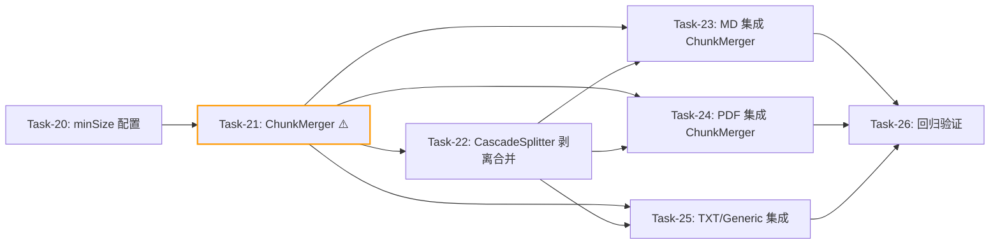

# 功能变更记录: 文档分割模块化与Token展示 - CR-001

## 0. 变更概览 (Change Overview)

*   **变更标题**: 分割后合并过短分块，避免 chunk 太小太碎
*   **变更类型**: 扩展 (Extension)
*   **变更原因**: 文件分割逻辑会出现 chunk 太小太碎的问题，第一轮拆分后如果 chunk 太小太碎需要进行合并操作，避免检索精度下降和向量存储碎片化
*   **发起日期**: 2026-07-29
*   **开发方法**: TDD（测试驱动开发）- 每个任务按 Red-Green-Refactor 循环执行
*   **关联功能**: 文档分割模块化与Token展示
*   **关联文档**:
    -   需求文档: `specs/features/2026-07-29_文档分割模块化与Token展示/文档分割模块化与Token展示.md`
    -   技术方案: `specs/features/2026-07-29_文档分割模块化与Token展示/文档分割模块化与Token展示_技术方案.md`
    -   任务规划: `specs/features/2026-07-29_文档分割模块化与Token展示/文档分割模块化与Token展示_任务规划.md`

## 1. 影响分析 (Impact Analysis)

### 1.1 需求影响

| 影响项 | 变更类型 | 详情 |
| :--- | :--- | :--- |
| AC-019 | 新增 | 分割后合并过短分块：低于 minSize 的分块与同组相邻分块合并，合并后不超过 maxSize |
| AC-020 | 新增 | 每种文件类型独立配置 minSize 参数，默认为 size 的 50% |
| AC-007 | 修改 | 级联切分后补充合并后处理步骤（原仅描述切分，现增加合并） |

### 1.2 技术影响

| 影响层 | 影响范围 | 详情 |
| :--- | :--- | :--- |
| 数据层 | 无影响 | 不涉及数据库/存储结构变更 |
| API 层 | 无影响 | 不涉及 REST API / SSE 协议变更 |
| 表现层 | 无影响 | 纯后端分割逻辑优化 |
| 业务逻辑 | 修改逻辑 | 新增 ChunkMerger 工具类；CascadeSplitter 剥离合并职责仅负责切分；MD/PDF/TXT/Generic 四个分割器在最终输出前统一调用 ChunkMerger |

### 1.3 代码影响

| 文件路径 | 操作 | 影响说明 |
| :--- | :--- | :--- |
| `splitter/util/ChunkMerger.java` | 新增 | 独立合并工具类，支持全局合并 + 按 metadata key 分组合并 |
| `config/SplitterProperties.java` | 修改 | ChunkConfig 新增 minSize 字段（默认 = size * 0.5） |
| `splitter/util/CascadeSplitter.java` | 修改 | 移除 mergeShortBlocks 调用，仅保留纯切分职责 |
| `splitter/MarkdownDocumentSplitter.java` | 修改 | 最终输出前调用 ChunkMerger（按 headerText 分组合并） |
| `splitter/PdfDocumentSplitter.java` | 修改 | 最终输出前调用 ChunkMerger（按 pageNumber 分组合并） |
| `splitter/TxtDocumentSplitter.java` | 修改 | 用 ChunkMerger 替代 CascadeSplitter 内部合并 |
| `splitter/GenericDocumentSplitter.java` | 修改 | 同 TxtDocumentSplitter |
| `application.yml` | 修改 | rag.splitter 各类型新增 min-size 配置项 |

### 1.4 测试影响

| 测试文件 | 影响类型 | 说明 |
| :--- | :--- | :--- |
| `ChunkMergerTest.java` | 需新增 | 全局合并、分组合并、边界条件测试 |
| `CascadeSplitterTest.java` | 需修改 | 移除合并相关断言，仅验证切分结果 |
| `MarkdownDocumentSplitterTest.java` | 需修改 | 新增验证：短 section 合并后无碎片块 |
| `PdfDocumentSplitterTest.java` | 需修改 | 新增验证：短页合并后无碎片块 |
| `TxtDocumentSplitterTest.java` | 需修改 | 验证合并由 ChunkMerger 接管 |
| `SplitterPropertiesTest.java` | 需修改 | 新增 minSize 字段验证 |

### 1.5 回归风险评估

*   **高风险区域**: CascadeSplitter 移除合并逻辑后，需确保各分割器正确调用 ChunkMerger 补位；Txt/Generic 分割器原先依赖 CascadeSplitter 内部合并，迁移后需验证合并效果一致
*   **已有测试覆盖**: CascadeSplitterTest 已覆盖四级降级切分 + 合并逻辑；各分割器测试已覆盖基本分割行为
*   **需要补充的测试**: ChunkMerger 合并算法（全局/分组/边界）、各分割器集成后的碎片块消除验证

## 2. 需求变更详情 (Requirements Delta)

### 2.1 新增/修改的用户故事

- **US-006**: 作为 **开发者**，我想要 **第一轮分割后自动合并过短的分块**，以便 **避免 chunk 太小太碎导致检索精度下降和向量存储碎片化**。
    - 关联验收标准：AC-007, AC-019, AC-020

### 2.2 新增/修改的验收标准

#### 正常流程 (Happy Path)

- **AC-019**: 分割后合并过短分块
    - Given: 系统对文件执行第一轮分割后产生了多个分块，其中部分分块的 Token 数低于配置的 minSize
    - When: 系统对分割结果执行合并后处理
    - Then: 低于 minSize 的分块与同组（同页/同节/全局）相邻分块合并，合并后 Token 数不超过 maxSize，最终结果中不存在低于 minSize 的碎片块（最后一个分块除外）

#### 业务规则 (Business Rules)

- **AC-020**: 每种文件类型独立配置 minSize 参数
    - Given: 运维人员在 application.yml 中为不同文件类型配置不同的 minSize
    - When: 系统对不同类型的文件执行分割后合并
    - Then: 每种文件类型使用各自配置的 minSize 参数作为合并阈值，未配置时默认为 size 的 50%

#### 修改的验收标准

- **AC-007**（修改）: 超大语义单元通过多级优先级级联切分
    - Given: 某个语义单元超过配置的最大分块大小
    - When: 系统对该语义单元执行切分
    - Then: 依次尝试按段落->句子->行->Token滑动窗口逐级切分，直到每个分块不超过配置大小；切分后对过短分块执行合并后处理

### 2.3 移除的内容

无

## 3. 技术变更详情 (Technical Delta)

### 3.1 数据库变更

无（纯内存存储，不涉及数据库结构变更）

### 3.2 API 变更

无（不涉及 REST API / SSE 协议变更）

### 3.3 组件变更

| 操作 | 组件 | 说明 |
| :--- | :--- | :--- |
| 新增 | `splitter/util/ChunkMerger.java` | 独立合并工具类，支持全局合并 + 按 metadata key 分组合并 |
| 修改 | `config/SplitterProperties.java` | ChunkConfig 新增 minSize 字段 |
| 修改 | `splitter/util/CascadeSplitter.java` | 移除 mergeShortBlocks 调用，仅保留纯切分职责 |
| 修改 | `splitter/MarkdownDocumentSplitter.java` | 最终输出前调用 ChunkMerger（按 headerText 分组） |
| 修改 | `splitter/PdfDocumentSplitter.java` | 最终输出前调用 ChunkMerger（按 pageNumber 分组） |
| 修改 | `splitter/TxtDocumentSplitter.java` | 用 ChunkMerger 替代 CascadeSplitter 内部合并 |
| 修改 | `splitter/GenericDocumentSplitter.java` | 同 TxtDocumentSplitter |
| 修改 | `application.yml` | rag.splitter 各类型新增 min-size 配置 |

### 3.4 兼容性说明

*   **向前兼容**: 是。minSize 配置项默认值为 size * 0.5，与原 CascadeSplitter.mergeShortBlocks 的阈值行为一致，不影响已有分割效果
*   **迁移方案**: 无需数据迁移。CascadeSplitter 移除合并逻辑后，各分割器通过 ChunkMerger 补位，合并覆盖范围反而扩大（覆盖了 MD/PDF 的快捷路径盲区）

## 4. 增量开发任务 (Incremental Tasks)

> 任务编号从 Task-20 开始（原任务规划最后一个为 Task-19）
> 每个任务耗时 < 2h (120m)
> 每个任务按 TDD 循环执行：RED（写测试）-> GREEN（写实现）-> REFACTOR（重构）

### 阶段一：配置层变更 (Config Layer Delta)

- [x] **Task-20**: SplitterProperties 新增 minSize 配置项
    *   **说明**: 在 SplitterProperties.ChunkConfig 中新增 minSize 字段（int 类型），默认值为 size * 0.5。同时更新 application.yml 中 rag.splitter 各文件类型配置段新增 min-size。更新 SplitterPropertiesTest 验证 minSize 字段的默认值和读取
    *   **变更类型**: 修改
    *   **涉及文件**: `agent-demo-splitter/src/main/java/com/agentdemo/splitter/config/SplitterProperties.java`、`agent-demo-bootstrap/src/main/resources/application.yml`
    *   **测试文件**: `agent-demo-splitter/src/test/java/com/agentdemo/splitter/config/SplitterPropertiesTest.java`
    *   **参考**: 技术方案 Sec 4.10、本文档 Sec 3.3
    *   **对应AC**: AC-020
    *   **预估工时**: 30m
    *   **依赖**: 无（基于已完成的 Task-05 SplitterProperties）
    *   **验证标准**（TDD RED 阶段的测试依据）:
        - [ ] `ChunkConfig` 类包含 `minSize` 字段（int 类型）
        - [ ] `ChunkConfig` 的全参构造函数包含 minSize 参数
        - [ ] `SplitterProperties.getConfig("md")` 返回的 minSize 值为 400（md.size=800 * 0.5）
        - [ ] `SplitterProperties.getConfig("pdf")` 返回的 minSize 值为 600（pdf.size=1200 * 0.5）
        - [ ] `SplitterProperties.getConfig("txt")` 返回的 minSize 值为 500（txt.size=1000 * 0.5）
        - [ ] application.yml 中存在 `rag.splitter.md.min-size` 等配置项

### 阶段二：核心工具层变更 (Core Utility Layer Delta)

- [x] **Task-21**: ChunkMerger 独立合并工具类 ⚠️
    *   **说明**: 新建 ChunkMerger 工具类，实现分割后合并过短块逻辑。支持两种模式：全局合并（TXT/Generic 使用）和分组合并（MD/PDF 使用，按 metadata key 分组）。合并规则：当前块或前一块 Token 数 < minSize 且合并后不超过 maxSize 时合并；分组合并时仅同组块合并；最后一个块允许低于 minSize
    *   **变更类型**: 新增
    *   **涉及文件**: `agent-demo-splitter/src/main/java/com/agentdemo/splitter/splitter/util/ChunkMerger.java`
    *   **测试文件**: `agent-demo-splitter/src/test/java/com/agentdemo/splitter/splitter/util/ChunkMergerTest.java`
    *   **参考**: 技术方案 Sec 4.10
    *   **对应AC**: AC-019
    *   **预估工时**: 80m
    *   **依赖**: Task-20（需要 minSize 配置）
    *   **风险标注**: 核心算法，需覆盖全局合并、分组合并、边界条件（空列表、单元素、全部过短、全部超限）
    *   **验证标准**（TDD RED 阶段的测试依据）:
        - [ ] 输入空列表，返回空列表
        - [ ] 输入单元素列表，返回单元素列表（不合并）
        - [ ] 输入两个短块（均 < minSize，合并后 ≤ maxSize），全局合并返回单元素列表
        - [ ] 输入两个短块（均 < minSize，合并后 > maxSize），不合并，返回两元素列表
        - [ ] 输入一个长块（≥ minSize）+ 一个短块（< minSize，合并后 ≤ maxSize），合并为单元素
        - [ ] 输入一个长块（≥ minSize）+ 一个短块（< minSize，合并后 > maxSize），不合并
        - [ ] 输入三个块 [长, 短, 长]，中间短块与前一块合并后 ≤ maxSize，结果为两元素
        - [ ] 输入分组合并场景：两个块 groupByKey 不同（如 pageNumber=1 和 pageNumber=2），均过短，不合并
        - [ ] 输入分组合并场景：两个块 groupByKey 相同，均过短，合并后 ≤ maxSize，合并为单元素
        - [ ] 合并后的 TextSegment 文本为两块文本用 "\n" 连接
        - [ ] 合并后的 TextSegment metadata 保留前一块的 metadata
        - [ ] 最后一个分块允许低于 minSize（不强制合并）

### 阶段三：分割器适配层变更 (Splitter Adapter Layer Delta)

- [x] **Task-22**: CascadeSplitter 剥离合并职责
    *   **说明**: 修改 CascadeSplitter，移除 split 方法中的 mergeShortBlocks 调用，使其仅负责纯切分。可保留 mergeShortBlocks 私有方法（标注 @Deprecated 或直接删除）。修改 CascadeSplitterTest，移除合并相关断言（如"不存在 Token 数 < maxSize * 0.5 的过短块"），仅验证切分结果
    *   **变更类型**: 修改
    *   **涉及文件**: `agent-demo-splitter/src/main/java/com/agentdemo/splitter/splitter/util/CascadeSplitter.java`
    *   **测试文件**: `agent-demo-splitter/src/test/java/com/agentdemo/splitter/splitter/util/CascadeSplitterTest.java`
    *   **参考**: 技术方案 Sec 4.6（CR-001 变更说明）
    *   **对应AC**: AC-007
    *   **预估工时**: 40m
    *   **依赖**: Task-21（ChunkMerger 可用，作为后续替代）
    *   **验证标准**（TDD RED 阶段的测试依据）:
        - [ ] CascadeSplitter.split 方法中不再调用 mergeShortBlocks
        - [ ] 输入含多个短段落的长文本，切分后可能存在短块（不再被内部合并）
        - [ ] 输入短文本（≤ maxSize），仍返回单元素列表
        - [ ] 四级降级切分逻辑不变（段落->句子->行->Token滑动窗口）
        - [ ] 原"不存在 Token 数 < maxSize * 0.5 的过短块"断言移除或改为"切分结果非空"

- [x] **Task-23**: MarkdownDocumentSplitter 集成 ChunkMerger
    *   **说明**: 修改 MarkdownDocumentSplitter，在 split 方法最终返回前调用 ChunkMerger.merge(segments, minSize, maxSize, "headerText") 按 headerText 分组合并过短块。确保 metadata 中 headerText 已正确设置。修改 MarkdownDocumentSplitterTest 新增验证：含多个短 section 的 MD 文件分割后无低于 minSize 的碎片块
    *   **变更类型**: 修改
    *   **涉及文件**: `agent-demo-splitter/src/main/java/com/agentdemo/splitter/splitter/MarkdownDocumentSplitter.java`
    *   **测试文件**: `agent-demo-splitter/src/test/java/com/agentdemo/splitter/splitter/MarkdownDocumentSplitterTest.java`
    *   **参考**: 技术方案 Sec 4.3（步骤 8）
    *   **对应AC**: AC-019
    *   **预估工时**: 50m
    *   **依赖**: Task-21, Task-22
    *   **验证标准**（TDD RED 阶段的测试依据）:
        - [ ] 输入含多个短 section（每个 section Token 数 < minSize）的 MD 文件，同 headerText 的短 section 被合并
        - [ ] 合并后同一 headerText 组内不存在低于 minSize 的碎片块（最后一个除外）
        - [ ] 不同 headerText 的 section 不合并（边界约束）
        - [ ] 代码块/表格原子单元保护行为不变（AC-003 不回归）
        - [ ] 含超长 section 的 MD 文件，CascadeSplitter 切分后再经 ChunkMerger 合并，无碎片块

- [x] **Task-24**: PdfDocumentSplitter 集成 ChunkMerger
    *   **说明**: 修改 PdfDocumentSplitter，在 split 方法最终返回前调用 ChunkMerger.merge(segments, minSize, maxSize, "pageNumber") 按 pageNumber 分组合并过短块。确保 metadata 中 pageNumber 已正确设置。修改 PdfDocumentSplitterTest 新增验证：含多个短页的 PDF 分割后无低于 minSize 的碎片块
    *   **变更类型**: 修改
    *   **涉及文件**: `agent-demo-splitter/src/main/java/com/agentdemo/splitter/splitter/PdfDocumentSplitter.java`
    *   **测试文件**: `agent-demo-splitter/src/test/java/com/agentdemo/splitter/splitter/PdfDocumentSplitterTest.java`
    *   **参考**: 技术方案 Sec 4.4（步骤 4）
    *   **对应AC**: AC-019
    *   **预估工时**: 50m
    *   **依赖**: Task-21, Task-22
    *   **验证标准**（TDD RED 阶段的测试依据）:
        - [ ] 输入含多个短页（每页 Token 数 < minSize）的 PDF ParsedDocument，同 pageNumber 的短块被合并
        - [ ] 合并后同一 pageNumber 组内不存在低于 minSize 的碎片块（最后一个除外）
        - [ ] 不同 pageNumber 的分块不合并（不跨页约束，AC-004 不回归）
        - [ ] 含超长单页的 PDF，CascadeSplitter 切分后再经 ChunkMerger 合并，同页内无碎片块
        - [ ] 合并后的分块 metadata 保留 pageNumber 信息

- [x] **Task-25**: TxtDocumentSplitter + GenericDocumentSplitter 集成 ChunkMerger
    *   **说明**: 修改 TxtDocumentSplitter 和 GenericDocumentSplitter，在调用 CascadeSplitter.split 后（此时不再内部合并），调用 ChunkMerger.merge(segments, minSize, maxSize) 全局合并过短块。修改对应测试验证合并由 ChunkMerger 接管后无碎片块
    *   **变更类型**: 修改
    *   **涉及文件**: `agent-demo-splitter/src/main/java/com/agentdemo/splitter/splitter/TxtDocumentSplitter.java`、`GenericDocumentSplitter.java`
    *   **测试文件**: `agent-demo-splitter/src/test/java/com/agentdemo/splitter/splitter/TxtDocumentSplitterTest.java`、`GenericDocumentSplitterTest.java`
    *   **参考**: 技术方案 Sec 4.5（步骤 3）
    *   **对应AC**: AC-019
    *   **预估工时**: 40m
    *   **依赖**: Task-21, Task-22
    *   **验证标准**（TDD RED 阶段的测试依据）:
        - [ ] TxtDocumentSplitter 输入含多个短段落的文本，分割合并后不存在低于 minSize 的碎片块（最后一个除外）
        - [ ] GenericDocumentSplitter 同上验证
        - [ ] 全局合并不受 metadata 分组约束（TXT/Generic 无分组 key）
        - [ ] 合并后分块 Token 数 ≤ maxSize
        - [ ] 原 CascadeSplitter 内部合并的测试用例（无碎片块）在 ChunkMerger 接管后仍然通过

### 阶段四：回归验证 (Regression Verification)

- [x] **Task-26**: 回归验证
    *   **说明**: 运行全量已有测试套件，确保变更未破坏原有功能。重点验证：CascadeSplitter 移除合并后各分割器通过 ChunkMerger 正确补位；MD 代码块/表格原子保护不回归；PDF 不跨页约束不回归；Token 展示功能不受影响
    *   **变更类型**: 验证
    *   **涉及文件**: `agent-demo-splitter/src/test/` 目录下所有测试文件
    *   **对应AC**: 所有受影响的 AC（AC-002\~AC-008, AC-012, AC-019, AC-020）
    *   **预估工时**: 40m
    *   **依赖**: Task-20\~Task-25 全部完成
    *   **验证标准**:
        - [ ] `mvn compile -pl agent-demo-splitter -am` 编译通过
        - [ ] `mvn test -pl agent-demo-splitter` 全部测试通过
        - [ ] `mvn compile -pl agent-demo-rag -am` 编译通过（RAG 模块依赖 splitter）
        - [ ] `mvn test -pl agent-demo-rag` 全部测试通过（DocumentService 集成不回归）
        - [ ] `mvn clean compile` 全量编译通过（12 个模块）
        - [ ] 原有全量测试通过（无回归）
        - [ ] 本次变更的所有新增测试通过
        - [ ] 测试覆盖率未下降

## 5. 增量验收标准检查清单 (Incremental AC Checklist)

| 验收标准ID | 验收标准描述 | 状态 | 对应任务 | 操作 |
| :--- | :--- | :--- | :--- | :--- |
| AC-019 | 分割后合并过短分块 | 已完成 | Task-21, Task-23, Task-24, Task-25 | 新增 |
| AC-020 | 每种文件类型独立配置 minSize 参数 | 已完成 | Task-20 | 新增 |
| AC-007 | 超大语义单元通过多级优先级级联切分（修改：补充合并后处理） | 已更新 | Task-22 | 修改 |

## 6. 依赖关系图

## 7. 可并行任务组

| 并行组 | 可同时执行的任务 | 前置条件 | 说明 |
| :--- | :--- | :--- | :--- |
| 并行组 1 | Task-23 + Task-24 + Task-25 | Task-21, Task-22 完成 | 三个分割器集成互不依赖，可同时开发 |

## 8. 变更总结 (Change Summary)

*   **总新增任务数**: 7 个（Task-20 \~ Task-26）
*   **预计总工时**: 330 分钟（约 5.5 小时）
*   **风险等级**: 中
*   **风险说明**: CascadeSplitter 移除合并逻辑是核心变更，需确保各分割器正确调用 ChunkMerger 补位。Txt/Generic 分割器原先完全依赖 CascadeSplitter 内部合并，迁移后需验证合并效果一致。MD/PDF 分割器的快捷路径首次接入合并逻辑，需验证分组合并的正确性
*   **测试影响**: 需修改 5 个已有测试（CascadeSplitterTest、MarkdownDocumentSplitterTest、PdfDocumentSplitterTest、TxtDocumentSplitterTest、SplitterPropertiesTest），新增 1 个测试（ChunkMergerTest）
*   **预期效果**: 变更完成后，所有文件类型的分割结果中不再存在过短的碎片块（低于 minSize），chunk 大小分布更均匀，RAG 检索精度提升，向量存储碎片化减少
