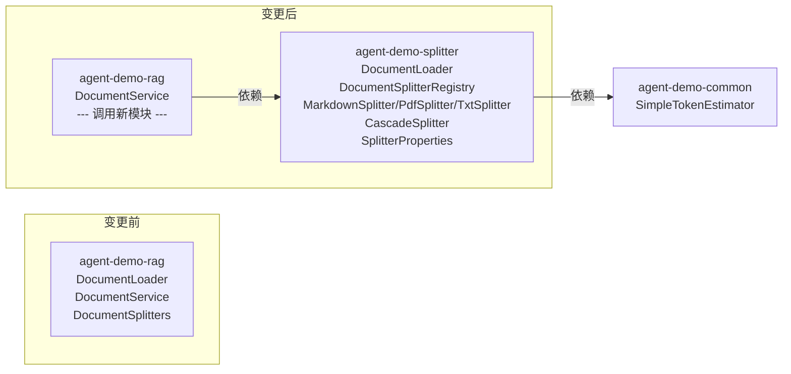
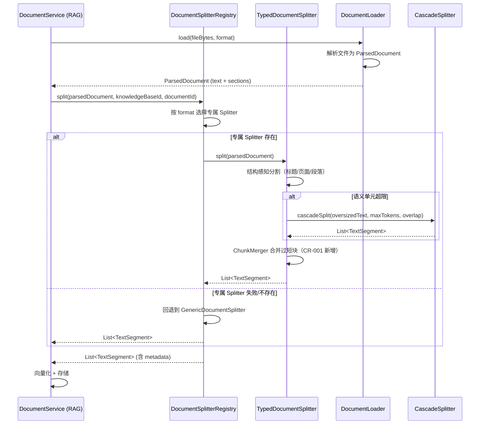
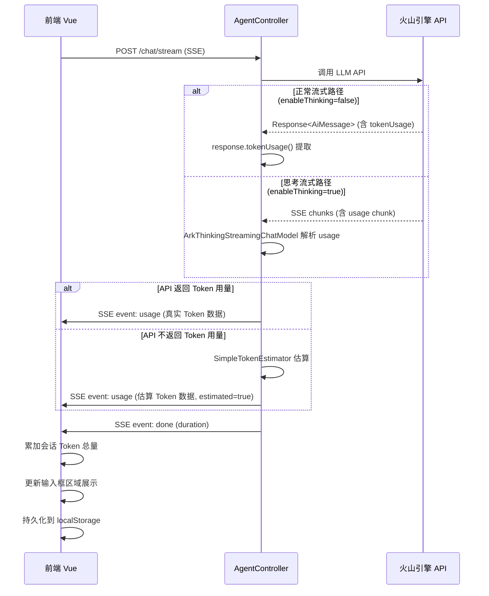

# 技术设计文档: 文档分割模块化与Token展示

## 0. 设计概要 (Design Summary)

*   **功能描述**：将文件解析和分割逻辑抽取为独立 Maven 模块并为 txt/md/pdf 实现专属结构感知分割策略，同时在对话页面添加会话级 Token 消耗实时展示。
*   **影响范围**：新建 `agent-demo-splitter` 模块；改造 `agent-demo-rag`（移除解析/分割代码，改为依赖新模块）；改造 `agent-demo-llm`（ArkThinkingStreamingChatModel 添加 Token usage 解析）；改造 `agent-demo-web`（AgentController 添加 usage SSE 事件）；改造 `agent-demo-frontend`（Token 展示组件）；改造 `agent-demo-common`（新增 SimpleTokenEstimator）；改造 `agent-demo-bom`（新增 commonmark-java 依赖管理）；改造根 `pom.xml`（新增模块声明）。
*   **技术难点**：
    1. Markdown AST 解析与结构感知分割（标题层级 + 代码块/表格原子保护）
    2. PDF 按页提取与页码元数据保留
    3. 超大语义单元多级优先级级联切分算法
    4. 火山引擎 API Token usage 提取（需确认 API 是否返回 usage，可能需要 `stream_options.include_usage`）
    5. SSE 协议扩展（新增 usage 事件）与前端解析适配
*   **依赖关系**：新模块依赖 `agent-demo-common` + langchain4j + pdfbox + tabula + commonmark-java；RAG 模块改为依赖新模块。

## 1. 架构概览 (Architecture Overview)

### 1.1 模块变更总览



### 1.2 新模块内部结构

```
agent-demo-splitter/
├── pom.xml
└── src/main/java/com/agentdemo/splitter/
    ├── config/
    │   └── SplitterProperties.java          # 按文件类型配置 size + overlap
    ├── loader/
    │   ├── DocumentLoader.java              # 从 RAG 模块迁移（解析文件为 ParsedDocument）
    │   └── ParsedDocument.java              # 解析结果（含全文 + 分页/分节信息）
    ├── splitter/
    │   ├── TypedDocumentSplitter.java        # 分割器接口（extends DocumentSplitter）
    │   ├── DocumentSplitterRegistry.java     # 分割器注册中心（按文件类型路由 + 回退）
    │   ├── MarkdownDocumentSplitter.java     # MD 专属分割器（commonmark-java AST）
    │   ├── PdfDocumentSplitter.java          # PDF 专属分割器（PDFBox 按页）
    │   ├── TxtDocumentSplitter.java          # TXT 专属分割器（多级递归）
    │   ├── GenericDocumentSplitter.java      # 通用递归分割器（回退用）
    │   └── util/
    │       ├── CascadeSplitter.java          # 多级优先级级联切分工具（仅切分，不合并）
    │       └── ChunkMerger.java              # 分割后合并过短块工具（CR-001 新增）
    └── tokenizer/
        └── SplitterTokenEstimator.java       # 分割用 Token 估算器
```

### 1.3 文档处理数据流



### 1.4 Token 消耗展示数据流



### 1.5 UI/逻辑映射

| 前端组件 | 消费方式 | 说明 |
|---------|---------|------|
| ChatWindow.vue | 接收 SSE `usage` 事件，调用 store 更新 Token 累计 | 新增 `onUsage` 回调 |
| MessageInput.vue | 展示会话累计 Token 消耗量 | 新增 Token 展示区域 |
| session.ts (store) | 管理会话级 Token 累计状态，持久化到 localStorage | 新增 `tokenUsage` 字段和 `addTokenUsage` 方法 |
| chat.ts (API) | 解析 SSE `usage` 事件，触发回调 | 新增 `onUsage` 回调到 StreamCallbacks |

## 2. API 设计 (API Design)

### 2.1 SSE 事件协议变更

本次不新增 REST API，仅扩展现有 SSE 流式接口的事件类型。

| 事件名 | 数据格式 | 触发时机 | 对应验收标准 |
| :--- | :--- | :--- | :--- |
| `usage` (新增) | JSON 对象 | 每轮对话 LLM 响应完成后，`done` 事件之前 | AC-010, AC-014 |
| `done` (不变) | 数字（耗时毫秒） | 流式完整结束 | 无变更 |

#### `usage` 事件数据格式

```json
{
  "inputTokens": 150,
  "outputTokens": 320,
  "totalTokens": 470,
  "estimated": false
}
```

| 字段 | 类型 | 说明 |
| :--- | :--- | :--- |
| inputTokens | int | 输入 Token 数（提示词消耗） |
| outputTokens | int | 输出 Token 数（生成内容消耗） |
| totalTokens | int | 总 Token 数（inputTokens + outputTokens） |
| estimated | boolean | true=本地估算值，false=API 真实返回值 |

### 2.2 SSE 事件时序

```
event: session
data: abc123def456

event: token
data: 你

event: token
data: 好

event: usage
data:{"inputTokens":150,"outputTokens":320,"totalTokens":470,"estimated":false}

event: done
data: 1234
```

## 3. 数据库设计 (Database Schema)

> 本项目当前无传统关系数据库，采用纯内存存储。本次不涉及数据库设计变更。

### 3.1 内存数据结构变更

#### DocumentChunk 实体新增字段

**变更说明**：为支持 Token 级别统计，DocumentChunk 新增 `tokenCount` 字段。

```java
// agent-demo-rag: DocumentChunk.java 变更
@Data
public class DocumentChunk {
    private String id;
    private String documentId;
    private int chunkIndex;
    private String content;
    private int charCount;
    private int tokenCount;  // 新增：分块 Token 数（通过 SplitterTokenEstimator 估算）
}
```

#### 前端 Session 接口新增字段

```typescript
// agent-demo-frontend: types/index.ts 变更
export interface TokenUsage {
  inputTokens: number;
  outputTokens: number;
  totalTokens: number;
  estimated: boolean;
}

export interface Session {
  sessionId: string;
  title: string;
  messages: Message[];
  createdAt: number;
  lastActiveAt: number;
  tokenUsage?: TokenUsage;  // 新增：会话级累计 Token 消耗
}
```

## 4. 核心逻辑与算法 (Core Logic)

### 4.1 ParsedDocument 数据结构

**触发条件**：DocumentLoader 解析文件时构建。

```java
@Data
public class ParsedDocument {
    /** 全文文本（所有分割器可用） */
    private String text;
    /** 文件格式（txt/md/pdf） */
    private String format;
    /** 结构化分节（PDF 为按页文本，MD/TXT 为 null） */
    private List<DocumentSection> sections;
}

@Data
public class DocumentSection {
    /** 分节文本 */
    private String text;
    /** 元数据（如 page_number、header_level 等） */
    private Map<String, String> metadata;
}
```

**PDF 解析行为**：DocumentLoader 使用 PDFBox 的 `PDFTextStripper` 按页提取文本，每页构建一个 `DocumentSection`，metadata 中写入 `pageNumber`。表格提取（tabula）结果合并到对应页面的文本中。

**MD/TXT 解析行为**：DocumentLoader 直接返回全文文本，`sections` 为 null。结构解析由各自的专属分割器负责。

### 4.2 DocumentSplitterRegistry 路由与回退

**触发条件**：DocumentService 调用分割时。

**处理步骤**：
1. 根据文件扩展名（format）查找对应的 `TypedDocumentSplitter`
2. 调用专属分割器的 `split()` 方法
3. 若专属分割器抛出异常，捕获后记录 WARN 日志，回退到 `GenericDocumentSplitter`
4. 返回分割结果

```java
public List<TextSegment> split(ParsedDocument doc, String knowledgeBaseId, String documentId) {
    TypedDocumentSplitter splitter = splitters.get(doc.getFormat());
    List<TextSegment> segments;
    try {
        if (splitter != null) {
            segments = splitter.split(doc);
        } else {
            segments = genericSplitter.split(doc);
        }
    } catch (Exception e) {
        log.warn("专属分割器 [{}] 执行失败，回退到通用分割器: {}", doc.getFormat(), e.getMessage());
        segments = genericSplitter.split(doc);
    }
    // 为每个分块添加来源 metadata
    return enrichMetadata(segments, knowledgeBaseId, documentId, doc.getFormat());
}
```

### 4.3 MarkdownDocumentSplitter 算法

**触发条件**：文件格式为 `md` 时由 Registry 路由调用。

**技术方案**：使用 commonmark-java（0.22.0）+ GFM Tables 扩展解析 Markdown AST，通过 Visitor 模式遍历节点。

**处理步骤**：
1. 使用 `Parser.builder().extensions([TablesExtension.create()]).build()` 构建 Parser
2. 解析全文为 AST `Node document = parser.parse(text)`
3. 遍历 AST，按 `Heading` 节点分割为多个 Section
4. 遇到 `FencedCodeBlock`、`IndentedCodeBlock`、`TableBlock` 时标记为原子单元
5. 每个 Section 构建为一个 `TextSegment`，metadata 写入 `headerLevel` 和 `headerText`
6. 若 Section 文本 Token 数超过配置的 `maxSize`，调用 `CascadeSplitter` 二次切分
7. 原子单元（代码块/表格）即使超限也不在首次分割中切断，而是作为独立分块输出；若原子单元本身超过 `maxSize`，才调用 `CascadeSplitter` 强制切分
8. 调用 `ChunkMerger.merge(segments, minSize, maxSize, "headerText")` 按 headerText 分组合并过短块（CR-001 新增）

**伪代码**：
```
function splitMarkdown(text, maxSize, overlap):
    ast = commonmarkParser.parse(text)
    sections = []
    currentSection = new StringBuilder()
    currentHeader = null

    ast.accept(new AbstractVisitor() {
        visitHeading(heading):
            if currentSection.notEmpty():
                sections.add(buildSection(currentSection, currentHeader))
            currentSection = new StringBuilder()
            currentHeader = {level: heading.getLevel(), text: heading.getText()}
            currentSection.append(heading.getText()).append("\n")

        visitFencedCodeBlock(code):
            // 代码块作为原子单元
            codeText = code.getContent()
            if currentSection.notEmpty() and estimateTokens(currentSection) + estimateTokens(codeText) > maxSize:
                sections.add(buildSection(currentSection, currentHeader))
                currentSection = new StringBuilder()
            currentSection.append("```").append(code.getInfo()).append("\n")
            currentSection.append(codeText)
            currentSection.append("```\n")

        visitTableBlock(table):
            // 表格作为原子单元，类似代码块处理
            tableText = renderTableToMarkdown(table)
            // 同代码块逻辑...

        visitText(text):
            currentSection.append(text.getLiteral())
    })

    if currentSection.notEmpty():
        sections.add(buildSection(currentSection, currentHeader))

    // 检查每个 section 是否超限
    result = []
    for section in sections:
        tokens = estimateTokens(section.text)
        if tokens > maxSize:
            result.addAll(cascadeSplitter.split(section.text, maxSize, overlap))
        else:
            result.add(section)
    return result
```

### 4.4 PdfDocumentSplitter 算法

**触发条件**：文件格式为 `pdf` 时由 Registry 路由调用。

**技术方案**：利用 `ParsedDocument.sections`（DocumentLoader 已按页提取），每页文本独立分块。

**处理步骤**：
1. 从 `ParsedDocument.sections` 获取每页文本（每个 section metadata 含 `pageNumber`）
2. 对每页文本：
   - 若 Token 数 ≤ `maxSize`，整页作为一个 `TextSegment`，metadata 写入 `pageNumber`
   - 若 Token 数 > `maxSize`，调用 `CascadeSplitter` 按段落递归切分，每个子分块 metadata 均写入相同 `pageNumber`
3. 不跨页拼接内容（AC-004 要求）
4. 调用 `ChunkMerger.merge(segments, minSize, maxSize, "pageNumber")` 按 pageNumber 分组合并过短块（CR-001 新增）

**伪代码**：
```
function splitPdf(parsedDocument, maxSize, overlap):
    result = []
    for section in parsedDocument.sections:
        pageNumber = section.metadata["pageNumber"]
        tokens = estimateTokens(section.text)
        if tokens <= maxSize:
            result.add(TextSegment(section.text, metadata={pageNumber: pageNumber}))
        else:
            subSegments = cascadeSplitter.split(section.text, maxSize, overlap)
            for seg in subSegments:
                seg.metadata.put("pageNumber", pageNumber)
                result.add(seg)
    return result
```

### 4.5 TxtDocumentSplitter 算法

**触发条件**：文件格式为 `txt` 时由 Registry 路由调用。

**技术方案**：多级分隔符优先级递归切分，与 `CascadeSplitter` 策略一致。

**处理步骤**：
1. 获取全文文本
2. 调用 `CascadeSplitter.split(text, maxSize, overlap)` 执行多级递归切分
3. 调用 `ChunkMerger.merge(segments, minSize, maxSize)` 全局合并过短块（CR-001 修改：合并职责从 CascadeSplitter 迁移到 ChunkMerger）

### 4.6 CascadeSplitter 多级优先级级联切分算法

**触发条件**：任何语义单元（段落、章节、页面）超过 `maxSize` 时调用。

**处理步骤**：
1. **Level 1**：按段落分隔符 `\n\n` 切分
2. 对每个子块检查 Token 数：
   - 若 ≤ `maxSize`，保留
   - 若 > `maxSize`，进入 Level 2
3. **Level 2**：按句子分隔符 `。`、`！`、`？`、`. `、`! `、`? ` 切分
4. 对每个子块检查 Token 数：
   - 若 ≤ `maxSize`，保留
   - 若 > `maxSize`，进入 Level 3
5. **Level 3**：按行分隔符 `\n` 切分
6. 对每个子块检查 Token 数：
   - 若 ≤ `maxSize`，保留
   - 若 > `maxSize`，进入 Level 4
7. **Level 4**：按 Token 数强制滑动窗口切分（step = maxSize - overlap）

> **CR-001 变更**：原步骤 8"合并过短块"已移除，合并职责迁移至独立的 `ChunkMerger` 工具类（见 Sec 4.10）。CascadeSplitter 仅负责纯切分，合并由各分割器在最终输出前统一调用 ChunkMerger 完成。

**伪代码**：
```
function cascadeSplit(text, maxSize, overlap):
    # Level 1: 段落
    blocks = splitBy(text, ["\n\n"])
    result = []
    for block in blocks:
        if estimateTokens(block) <= maxSize:
            result.add(block)
        else:
            result.addAll(level2Split(block, maxSize, overlap))
    # CR-001: 移除 mergeShortBlocks 调用，合并由 ChunkMerger 统一处理
    return result

function level2Split(text, maxSize, overlap):
    # Level 2: 句子
    blocks = splitBy(text, ["。", "！", "？", ". ", "! ", "? "])
    result = []
    for block in blocks:
        if estimateTokens(block) <= maxSize:
            result.add(block)
        else:
            result.addAll(level3Split(block, maxSize, overlap))
    return result

function level3Split(text, maxSize, overlap):
    # Level 3: 行
    blocks = splitBy(text, ["\n"])
    result = []
    for block in blocks:
        if estimateTokens(block) <= maxSize:
            result.add(block)
        else:
            result.addAll(level4Split(block, maxSize, overlap))
    return result

function level4Split(text, maxSize, overlap):
    # Level 4: Token 滑动窗口
    tokens = estimateTokens(text)
    if tokens <= maxSize:
        return [text]
    # 按字符比例估算切分位置
    charsPerToken = text.length() / tokens
    segmentCharSize = (int)(maxSize * charsPerToken)
    overlapCharSize = (int)(overlap * charsPerToken)
    step = segmentCharSize - overlapCharSize
    result = []
    for i in range(0, text.length(), step):
        end = min(i + segmentCharSize, text.length())
        result.add(text.substring(i, end))
    return result
```

### 4.7 Token Usage 提取逻辑

#### 4.7.1 正常流式路径（enableThinking=false/null）

**现有代码**：`AgentController` 第 258 行 `onCompleteResponse(Response<AiMessage> response)` 回调已包含 `response.tokenUsage()`。

**改造方案**：在 `onCompleteResponse` 回调中提取 `response.tokenUsage()`，若非空则发送 `usage` SSE 事件；若为空则使用 `SimpleTokenEstimator` 估算。

```java
.onCompleteResponse(response -> {
    memoryManager.addAssistantMessage(effectiveSessionId, fullResponse.toString());

    // 新增：提取 Token usage
    TokenUsage tokenUsage = response.tokenUsage();
    if (tokenUsage != null) {
        sendEvent(emitter, "usage", buildUsageJson(
            tokenUsage.inputTokenCount(),
            tokenUsage.outputTokenCount(),
            tokenUsage.totalTokenCount(),
            false));
    } else {
        // API 未返回 usage，本地估算
        int inputTokens = SimpleTokenEstimator.estimate(userMessage + systemPrompt);
        int outputTokens = SimpleTokenEstimator.estimate(fullResponse.toString());
        sendEvent(emitter, "usage", buildUsageJson(
            inputTokens, outputTokens, inputTokens + outputTokens, true));
    }

    long duration = System.currentTimeMillis() - start;
    sendEvent(emitter, "done", duration);
    emitter.complete();
})
```

#### 4.7.2 思考流式路径（enableThinking=true）

**现有代码**：`ArkThinkingStreamingChatModel.parseSseLine()` 未解析 `usage` 字段，请求体未设置 `stream_options.include_usage`。

**改造方案**：

1. **请求体**（`buildRequestBody` 方法）：添加 `stream_options: {include_usage: true}`
2. **解析逻辑**（`parseSseLine` 方法）：新增 `usage` 字段解析
3. **回调接口**（`ThinkingStreamHandler`）：`onComplete` 方法签名扩展，新增 `TokenUsage` 参数

```java
// ArkThinkingStreamingChatModel.buildRequestBody() 新增
requestBody.put("stream_options", Map.of("include_usage", true));

// parseSseLine() 新增 usage 解析
JsonNode usageNode = root.path("usage");
if (!usageNode.isMissingNode() && !usageNode.isNull()) {
    int promptTokens = usageNode.path("prompt_tokens").asInt(0);
    int completionTokens = usageNode.path("completion_tokens").asInt(0);
    int totalTokens = usageNode.path("total_tokens").asInt(promptTokens + completionTokens);
    this.capturedUsage = new TokenUsage(promptTokens, completionTokens, totalTokens);
}

// onComplete 回调时传递 capturedUsage
handler.onComplete(fullResponse.toString(), finishReason, capturedUsage);
```

4. **AgentController** 中思考路径的 `onComplete` 回调提取 `TokenUsage`，发送 `usage` SSE 事件。

#### 4.7.3 任务拆解路径（enableTaskBreakdown=true）

与正常流式路径类似，在 `onComplete` 回调中提取 Token usage。若 LangChain4j `AiServices` 代理的 `Response` 包含 `tokenUsage()` 则直接使用，否则本地估算。

### 4.8 SimpleTokenEstimator 估算算法

**位置**：`agent-demo-common/src/main/java/com/agentdemo/common/utils/SimpleTokenEstimator.java`

**算法**：
- 中文字符（Unicode CJK 区间）：约 1.5 字符 / Token
- 其他字符（英文、数字、符号）：约 4 字符 / Token
- 混合文本：分别统计后加权求和

```java
public class SimpleTokenEstimator {
    public static int estimate(String text) {
        if (text == null || text.isEmpty()) return 0;
        int cjkChars = 0;
        int otherChars = 0;
        for (char c : text.toCharArray()) {
            if (isCJK(c)) {
                cjkChars++;
            } else {
                otherChars++;
            }
        }
        return (int) Math.ceil(cjkChars / 1.5 + otherChars / 4.0);
    }

    private static boolean isCJK(char c) {
        Character.UnicodeBlock block = Character.UnicodeBlock.of(c);
        return block == Character.UnicodeBlock.CJK_UNIFIED_IDEOGRAPHS
                || block == Character.UnicodeBlock.CJK_SYMBOLS_AND_PUNCTUATION
                || block == Character.UnicodeBlock.HALFWIDTH_AND_FULLWIDTH_FORMS
                || block == Character.UnicodeBlock.HIRAGANA
                || block == Character.UnicodeBlock.KATAKANA;
    }
}
```

### 4.9 前端 Token 展示逻辑

#### 4.9.1 SSE 事件解析（chat.ts）

新增 `usage` 事件处理分支：

```typescript
// chat.ts handleSseEvent() 新增
case 'usage':
  const usageData = JSON.parse(data) as TokenUsage;
  callbacks.onUsage?.(usageData);
  break;
```

#### 4.9.2 StreamCallbacks 接口扩展（types/index.ts）

```typescript
export interface StreamCallbacks {
  // ... 现有回调 ...
  onUsage?: (usage: TokenUsage) => void;  // 新增
}
```

#### 4.9.3 会话 Token 累计（session.ts）

```typescript
// Session 接口新增 tokenUsage 字段
// 新增 addTokenUsage 方法
addTokenUsage(sessionId: string, usage: TokenUsage): void {
  const session = this.sessions.find(s => s.sessionId === sessionId);
  if (!session) return;
  if (!session.tokenUsage) {
    session.tokenUsage = { inputTokens: 0, outputTokens: 0, totalTokens: 0, estimated: false };
  }
  session.tokenUsage.inputTokens += usage.inputTokens;
  session.tokenUsage.outputTokens += usage.outputTokens;
  session.tokenUsage.totalTokens += usage.totalTokens;
  // 任意一次为估算值，整体标记为估算
  if (usage.estimated) {
    session.tokenUsage.estimated = true;
  }
  this.persist();
}
```

#### 4.9.4 Token 展示 UI（MessageInput.vue）

在输入框上方或右侧添加 Token 消耗展示区域：

```vue
<template>
  <div class="input-container">
    <!-- Token 消耗展示 -->
    <div class="token-usage" v-if="sessionTokenUsage">
      <span class="token-count">{{ formatTokens(sessionTokenUsage.totalTokens) }} Tokens</span>
      <span class="token-badge" v-if="sessionTokenUsage.estimated">估算</span>
    </div>
    <!-- 现有输入框 -->
    <div class="input-box">...</div>
  </div>
</template>
```

### 4.10 ChunkMerger 分割后合并过短块算法（CR-001 新增）

**触发条件**：各分割器完成第一轮分割后，在最终输出前调用。

**职责**：对分割结果中低于 `minSize` 的过短分块执行合并，避免 chunk 太小太碎。

**核心 API**：

```java
public class ChunkMerger {
    private final SplitterTokenEstimator tokenEstimator;

    /**
     * 全局合并（TXT/Generic 使用）：所有分块参与合并，无分组约束
     */
    public List<TextSegment> merge(List<TextSegment> segments, int minSize, int maxSize);

    /**
     * 分组合并（MD/PDF 使用）：按指定 metadata key 分组，仅同组内短块合并
     * @param groupByKey metadata 中的键名（如 "pageNumber"、"headerText"）
     */
    public List<TextSegment> merge(List<TextSegment> segments, int minSize, int maxSize, String groupByKey);
}
```

**合并规则**：
1. 遍历分块列表，计算每个分块的 Token 数
2. 当当前块 **或** 前一块 Token 数 < `minSize` 时尝试合并
3. 合并约束：合并后总 Token 数 ≤ `maxSize` 时才执行合并
4. 分组合并时：仅当两块的 `groupByKey` metadata 值相同时才合并（保证 PDF 不跨页、MD 不跨节）
5. 合并方向：当前块内容追加到前一块尾部，metadata 保留前一块的值
6. 最后一个分块允许低于 minSize（无法再合并）

**伪代码**：

```
function merge(segments, minSize, maxSize, groupByKey):
    if segments is empty:
        return segments

    result = [segments[0]]
    for i in 1..segments.length:
        current = segments[i]
        prev = result.last()
        currentTokens = estimateTokens(current)
        prevTokens = estimateTokens(prev)

        # 分组检查：groupByKey 不为空时，仅同组才合并
        if groupByKey != null:
            if prev.metadata[groupByKey] != current.metadata[groupByKey]:
                result.add(current)
                continue

        # 合并条件：当前块或前一块过短，且合并后不超限
        if (currentTokens < minSize or prevTokens < minSize)
           and (prevTokens + currentTokens <= maxSize):
            prev.text = prev.text + "\n" + current.text
            # metadata 保留 prev 的值
        else:
            result.add(current)

    return result
```

**与 CascadeSplitter 的关系**：
- CR-001 前：`CascadeSplitter` 内部 `mergeShortBlocks` 在切分后立即合并，但仅覆盖走 CascadeSplitter 的路径
- CR-001 后：`CascadeSplitter` 仅负责切分（移除 mergeShortBlocks），`ChunkMerger` 统一负责所有分割器的合并后处理，覆盖 MD/PDF 的快捷路径盲区

## 5. 异常处理 (Error Handling)

| 异常场景 | 对应验收标准 | 处理方案 | 用户提示 |
| :--- | :--- | :--- | :--- |
| 空文件（解析后无文本） | AC-011 | DocumentLoader 检测到 text 为空白后抛出 BusinessException(RAG_DOCUMENT_PARSE_FAILED, "文件内容为空") | "文件内容为空，请上传有内容的文件" |
| 专属分割器执行失败 | AC-012 | DocumentSplitterRegistry 捕获异常，记录 WARN 日志，回退到 GenericDocumentSplitter | 无前端提示（用户无感知，文档正常处理） |
| PDF 加密无法解析 | AC-013 | PdfDocumentSplitter 捕获 PDFBox 加密异常，尝试仅提取可提取文本；若完全无法提取则抛 BusinessException | "PDF 文件已加密，无法解析内容" |
| LLM API 不返回 Token 用量 | AC-014 | AgentController 检测 response.tokenUsage() 为 null，使用 SimpleTokenEstimator 估算 | 前端展示"估算"标记 |
| Markdown 格式异常 | AC-012 | commonmark-java Parser 具有容错性，格式异常不会抛异常（按原文处理）。若极端情况抛异常，回退到通用分割器 | 无前端提示 |
| 页面刷新 | AC-015 | Token 累计值随 Session 对象持久化到 localStorage，页面加载时从 localStorage 恢复 | 无提示，自动恢复 |
| SSE usage 事件解析失败 | - | chat.ts 中 JSON.parse 异常捕获，记录 console.warn，不影响 done 事件处理 | 无提示（降级为不展示 Token） |

## 6. 安全与性能 (Security & Performance)

*   **鉴权机制**：无变更（项目无认证机制）
*   **数据校验**：DocumentLoader 现有的格式校验和大小校验不变
*   **性能影响**：
    - commonmark-java AST 解析性能高（比 pegdown 快 10-20 倍），对 10MB 以内文件无感知延迟
    - PDFBox 按页提取需逐页调用 `PDFTextStripper`，对大 PDF 文件（100+页）可能有数秒延迟，但现有 10MB 限制可控制
    - SimpleTokenEstimator 为纯字符遍历，性能可忽略
    - SSE `usage` 事件仅增加一个轻量 JSON 推送，对流式性能无影响
*   **缓存策略**：无变更（分割器无状态，无需缓存）
*   **安全考虑**：commonmark-java 解析 Markdown 不会执行嵌入脚本；PDFBox 解析 PDF 不会执行嵌入 JavaScript

## 7. 验收标准映射 (AC Mapping)

| 验收标准ID | 验收标准描述 | 对应技术实现 |
| :--- | :--- | :--- |
| AC-001 | 新建独立 Maven 模块抽取解析与分割逻辑 | 新建 `agent-demo-splitter` 模块，迁移 DocumentLoader，新建分割器体系 |
| AC-002 | Markdown 文件按标题层级分割 | `MarkdownDocumentSplitter` + commonmark-java Heading 节点遍历 |
| AC-003 | Markdown 代码块和表格作为原子单元不被切断 | `MarkdownDocumentSplitter` 中 FencedCodeBlock/TableBlock 原子标记 |
| AC-004 | PDF 文件按页面边界分割 | `PdfDocumentSplitter` + DocumentLoader 按页提取（PDFTextStripper） |
| AC-005 | PDF 单页内容超限时按段落递归切分 | `PdfDocumentSplitter` 调用 `CascadeSplitter` 二次切分 |
| AC-006 | TXT 文件按多级优先级递归切分 | `TxtDocumentSplitter` 调用 `CascadeSplitter` |
| AC-007 | 超大语义单元通过多级优先级级联切分 | `CascadeSplitter` 四级降级算法（段落->句子->行->Token滑动窗口） |
| AC-008 | 每种文件类型独立配置分割参数 | `SplitterProperties` 配置类 + application.yml `rag.splitter.{format}.size/overlap` |
| AC-009 | 对话页面展示会话累计 Token 消耗量 | `MessageInput.vue` Token 展示区域 + `session.ts` addTokenUsage 方法 |
| AC-010 | 后端从 LLM API 响应中提取真实 Token 用量并推送 | AgentController `onCompleteResponse` 提取 `response.tokenUsage()` + SSE `usage` 事件 |
| AC-011 | 空文件报错拒绝处理 | DocumentLoader 检测空文本抛 BusinessException |
| AC-012 | 专属分割器失败时自动回退通用分割 | `DocumentSplitterRegistry.split()` try-catch 回退逻辑 |
| AC-013 | PDF 加密文件处理失败的回退 | `PdfDocumentSplitter` 捕获加密异常，尝试降级提取或报错 |
| AC-014 | LLM API 不返回 Token 用量时本地估算 | `SimpleTokenEstimator` + `estimated=true` 标记 |
| AC-015 | Token 消耗量页面刷新后保持 | `session.ts` tokenUsage 字段持久化到 localStorage |
| AC-016 | 分块大小按 Token 数计算 | `SplitterTokenEstimator` + `SimpleTokenEstimator` 替代字符数切分 |
| AC-017 | 分块元数据保留来源信息 | `DocumentSplitterRegistry.enrichMetadata()` 添加 knowledgeBaseId/documentId/format/pageNumber/headerLevel |
| AC-018 | 新模块的模块依赖关系正确 | 根 pom.xml 新增模块声明 + agent-demo-rag pom.xml 新增 splitter 依赖 + BOM 版本管理 |
| AC-019 | 分割后合并过短分块 | `ChunkMerger` 合并工具类 + 各分割器最终输出前调用（MD 按 headerText 分组、PDF 按 pageNumber 分组、TXT/Generic 全局合并）（CR-001 新增） |
| AC-020 | 每种文件类型独立配置 minSize 参数 | `SplitterProperties.ChunkConfig` 新增 minSize 字段 + application.yml `rag.splitter.{format}.min-size`（CR-001 新增） |

## 8. 技术决策说明 (Technical Decisions)

### 8.1 新建独立 Maven 模块 vs RAG 模块内新建包

*   **决策**：新建独立 Maven 模块 `agent-demo-splitter`
*   **理由**：用户明确要求独立模块；职责边界更清晰；未来可独立扩展新文件类型而不影响 RAG 模块；符合项目现有的中等粒度模块拆分风格（11 个模块）

### 8.2 commonmark-java vs 正则表达式 vs flexmark-java

*   **决策**：使用 commonmark-java（0.22.0）+ GFM Tables 扩展
*   **理由**：
    - commonmark-java：轻量（~200KB，零核心依赖）、快速（比 pegdown 快 10-20 倍）、AST 解析准确、活跃维护（2026.06 最新提交）、LangChain4j PR #4276 使用同一库
    - 正则表达式：无法处理嵌套结构、YAML front matter、列表中的标题等边界情况
    - flexmark-java：功能过剩（数十种扩展）、体积大（~1MB+）、API 复杂

### 8.3 新增 SSE `usage` 事件 vs 改造 `done` 事件为 JSON

*   **决策**：新增独立 `usage` SSE 事件
*   **理由**：非破坏性新增，`done` 事件保持原有格式（纯数字 duration），前后端向后兼容性更好；职责分离（duration 和 tokenUsage 独立传输）

### 8.4 简易字符估算 vs OpenAiTokenizer

*   **决策**：在 `agent-demo-common` 中新建 `SimpleTokenEstimator`，基于字符数估算
*   **理由**：项目为学习/演示性质，简易估算已满足需求；无需引入 langchain4j-open-ai 重依赖到 common 模块；估算逻辑透明可理解

### 8.5 ParsedDocument 结构化解析 vs 纯文本传递

*   **决策**：DocumentLoader 返回 `ParsedDocument`（含全文 + 可选 sections）
*   **理由**：PDF 按页分割需要页码信息，纯文本无法承载；MD/TXT 不需要 sections（splitter 自行解析结构），设为 null 保持简洁；向后兼容（全文字段始终存在）

### 8.6 DocumentSplitters.recursive 字符切分 -> Token 切分

*   **决策**：废弃 `DocumentSplitters.recursive(size, overlap)` 默认字符切分，改用自定义 Token 估算
*   **理由**：调研发现现有代码注释标注"token 数"但实际按字符切分（未传 Tokenizer 参数），存在设计偏差；新模块统一使用 `SimpleTokenEstimator` 估算 Token 数进行切分，修正此偏差

## 9. 风险与注意事项 (Risks & Notes)

### 9.1 技术风险

*   **火山引擎 API Token usage 返回不确定性**：Coding Plan（按次计费）模式的 API 响应中是否包含 `usage` 字段需实际验证。若不包含，`stream_options.include_usage` 可能也无效。**缓解措施**：AC-014 已设计本地估算回退方案，确保功能可用。
*   **commonmark-java 版本兼容性**：0.22.0 需 Java 8+，与项目 Java 17 兼容。需在 BOM 中新增版本管理。
*   **PDF 按页提取性能**：大 PDF 文件（100+页）逐页提取可能有数秒延迟。**缓解措施**：现有 10MB 文件大小限制可控制页数；异步处理机制（`@Async`）已有。

### 9.2 兼容性

*   **DocumentLoader 返回值类型变更**：从 `String` 变为 `ParsedDocument`，需同步修改 `DocumentService` 中的调用方代码。
*   **DocumentSplitter 接口变更**：从直接使用 `DocumentSplitters.recursive()` 变为通过 `DocumentSplitterRegistry` 路由，`DocumentService` 中的分割调用需重写。
*   **SSE 协议扩展**：新增 `usage` 事件对现有前端无破坏（前端按事件名分发，未注册的事件自动忽略）。
*   **DocumentChunk 新增 tokenCount 字段**：InMemory 存储无需数据迁移，但需更新 `DocumentChunkStore` 实现中的 `saveChunks` 逻辑。

### 9.3 回滚方案

*   **模块抽取回滚**：若新模块出现问题，可将 DocumentLoader 和分割逻辑回退到 RAG 模块内（Git 回退即可）
*   **Token 展示回滚**：若 Token 统计出现问题，前端可忽略 `usage` 事件（不影响对话功能），后端可注释掉 `usage` 事件发送代码
*   **SSE 协议回滚**：`usage` 事件为新增，移除后不影响现有 `done` 事件

### 9.4 改动文件清单

| 模块 | 文件 | 改动类型 | 说明 |
| :--- | :--- | :--- | :--- |
| 根 pom.xml | `pom.xml` | 修改 | 新增 `agent-demo-splitter` 模块声明 |
| agent-demo-bom | `pom.xml` | 修改 | 新增 commonmark-java、commonmark-ext-gfm-tables 版本管理 |
| **agent-demo-splitter** | `pom.xml` | 新建 | 模块 POM |
| | `config/SplitterProperties.java` | 新建 | 按类型配置 |
| | `loader/DocumentLoader.java` | 迁移+修改 | 从 RAG 迁移，返回值改为 ParsedDocument |
| | `loader/ParsedDocument.java` | 新建 | 解析结果数据结构 |
| | `splitter/TypedDocumentSplitter.java` | 新建 | 分割器接口 |
| | `splitter/DocumentSplitterRegistry.java` | 新建 | 路由与回退 |
| | `splitter/MarkdownDocumentSplitter.java` | 新建 | MD 专属分割器 |
| | `splitter/PdfDocumentSplitter.java` | 新建 | PDF 专属分割器 |
| | `splitter/TxtDocumentSplitter.java` | 新建 | TXT 专属分割器 |
| | `splitter/GenericDocumentSplitter.java` | 新建 | 通用回退分割器 |
| | `splitter/util/CascadeSplitter.java` | 新建 | 多级级联切分 |
| | `splitter/util/ChunkMerger.java` | 新建（CR-001） | 分割后合并过短块工具 |
| | `tokenizer/SplitterTokenEstimator.java` | 新建 | 分割用 Token 估算 |
| agent-demo-common | `utils/SimpleTokenEstimator.java` | 新建 | Token 估算工具类 |
| agent-demo-rag | `pom.xml` | 修改 | 新增 splitter 依赖，移除 pdfbox/tabula 依赖 |
| | `service/DocumentService.java` | 修改 | 改为调用 DocumentSplitterRegistry |
| | `loader/DocumentLoader.java` | 删除 | 迁移到 splitter 模块 |
| | `entity/DocumentChunk.java` | 修改 | 新增 tokenCount 字段 |
| | `config/RagProperties.java` | 修改 | 移除 Chunk 内部类（迁移到 SplitterProperties） |
| agent-demo-llm | `factory/ArkThinkingStreamingChatModel.java` | 修改 | 添加 stream_options.include_usage + usage 解析 |
| | `factory/ThinkingStreamHandler.java` | 修改 | onComplete 签名新增 TokenUsage 参数 |
| agent-demo-web | `controller/AgentController.java` | 修改 | 三条流式路径新增 usage 事件发送 |
| | `dto/ChatResponse.java` | 修改 | 新增 tokenUsage 字段（同步对话用） |
| agent-demo-bootstrap | `application.yml` | 修改 | 新增 rag.splitter 配置段 |
| agent-demo-frontend | `types/index.ts` | 修改 | 新增 TokenUsage 接口、Session.tokenUsage 字段、onUsage 回调 |
| | `api/chat.ts` | 修改 | 新增 usage 事件解析 |
| | `stores/session.ts` | 修改 | 新增 addTokenUsage 方法、tokenUsage 持久化 |
| | `components/ChatWindow.vue` | 修改 | 新增 onUsage 回调处理 |
| | `components/MessageInput.vue` | 修改 | 新增 Token 展示区域 |

---
## 变更日志 (Change Log)

### CR-001: 分割后合并过短分块 (2026-07-29)
**影响范围**: 业务逻辑层（分割器后处理逻辑）、配置层（SplitterProperties）
**变更内容摘要**:
- [新增] `ChunkMerger.java`：独立合并工具类，支持全局合并 + 按 metadata key 分组合并
- [新增] `SplitterProperties.ChunkConfig.minSize` 字段：最小分块大小，默认为 size * 0.5
- [新增] 技术方案 Sec 4.10 ChunkMerger 算法描述
- [修改] `CascadeSplitter.java`：移除 mergeShortBlocks 调用，仅保留纯切分职责
- [修改] `MarkdownDocumentSplitter.java`：最终输出前调用 ChunkMerger（按 headerText 分组合并）
- [修改] `PdfDocumentSplitter.java`：最终输出前调用 ChunkMerger（按 pageNumber 分组合并）
- [修改] `TxtDocumentSplitter.java`：用 ChunkMerger 替代 CascadeSplitter 内部合并
- [修改] `GenericDocumentSplitter.java`：同 TxtDocumentSplitter
- [修改] `application.yml`：rag.splitter 各类型新增 min-size 配置项
- [修改] AC-007：级联切分后补充合并后处理步骤
- [新增] AC-019、AC-020 验收标准映射
