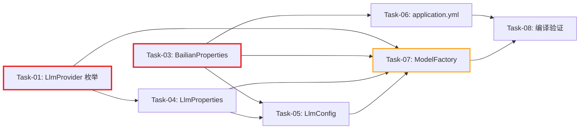

# 开发任务计划: 多 LLM 提供商支持（阿里百炼）

## 0. 任务概览 (Task Overview)

- **总任务数**: 8 个
- **预计总工时**: 75 分钟（约 1.25 小时）
- **开发方法**: TDD（测试驱动开发）- 每个任务按 Red-Green-Refactor 循环执行
- **关键里程碑**:
  - 阶段一完成（基础组件层）：25 分钟 - 枚举/常量/配置类就绪
  - 阶段二完成（配置层）：15 分钟 - 配置绑定/注册/application.yml 就绪
  - 阶段三完成（核心逻辑层）：30 分钟 - ModelFactory 路由逻辑就绪
  - 阶段四完成（编译验证）：5 分钟 - 全量编译通过
- **风险任务**: Task-07（ModelFactory 核心路由逻辑，涉及构造器变更、现有测试兼容）
- **阻塞任务**: Task-01（LlmProvider 枚举被 Task-04 依赖）、Task-03（BailianProperties 被 Task-05/Task-06/Task-07 依赖）
- **无 Mock 阶段**: 本次功能不涉及 Mock 数据，跳过 Mock 对接任务

### 依赖关系图

图例：🔴 红色粗边 = 阻塞任务 | 🟠 橙色边 = 风险任务

### 可并行任务组

| 并行组 | 可同时执行的任务 | 前置条件 | 说明 |
| :--- | :--- | :--- | :--- |
| 并行组 1 | Task-01 + Task-02 + Task-03 | 无 | 三个文件分布在 `llm/config`、`common/constant`、`llm/config` 三个不同包，互不依赖 |
| 并行组 2 | Task-04 + Task-05 + Task-06 | 并行组 1 完成 | 配置层任务互不依赖，可并行执行 |

## 1. 准备工作 (Preparation)

- [x] **Prep-01**: 确认开发环境就绪
  - 说明：JDK 17 + Maven 3.9+ + ARK_API_KEY 环境变量已配置
  - 验证：`mvn compile -pl agent-demo-llm -am` 编译通过
- [x] **Prep-02**: 确认测试环境就绪
  - 说明：JUnit 5 + Mockito 测试框架可用，现有测试套件可运行
  - 验证：`mvn test -pl agent-demo-llm -am` 通过
- [x] **Prep-03**: 确认需求文档和技术方案文档已审阅
  - 说明：`多LLM提供商支持-阿里百炼.md`（14 条 AC）和 `多LLM提供商支持-阿里百炼_技术方案.md` 已确认
  - 验证：文档存在且内容完整

## 2. 开发任务 (Development Tasks)

### 阶段一：基础组件层 (Foundation Layer)

---

#### Task-01: 新增 LlmProvider 枚举

| 字段 | 内容 |
|:---|:---|
| **通俗解释** | 定义 LLM 提供商的"类型清单"，让系统知道当前用的是火山引擎还是阿里百炼 |
| **涉及文件** | 新增 `agent-demo-llm/src/main/java/.../config/LlmProvider.java` |
| **对应技术方案** | 第 2.1.1 节 |
| **对应 AC** | AC-009 |
| **前置依赖** | 无 |

**验证标准**：
1. `LlmProvider.ARK` 和 `LlmProvider.BAILIAN` 两个枚举值存在
2. 枚举类型可作为 `LlmProperties` 的字段类型被 Spring Boot 配置绑定识别

---

#### Task-02: 新增阿里百炼模型常量

| 字段 | 内容 |
|:---|:---|
| **通俗解释** | 给阿里百炼的模型名（deepseek-v4-flash 等）贴上"标签"，开发者通过常量名引用，避免写错名字 |
| **涉及文件** | 修改 `agent-demo-common/src/main/java/.../constant/ModelConstants.java` |
| **对应技术方案** | 第 2.2.3 节 |
| **对应 AC** | AC-013 |
| **前置依赖** | 无 |

**验证标准**：
1. `ModelConstants.MODEL_BAILIAN_DEEPSEEK_V4_FLASH` 的值为 `"deepseek-v4-flash"`
2. `ModelConstants.MODEL_BAILIAN_EMBEDDING` 的值为 `"text-embedding-v4"`
3. 现有火山引擎常量不受影响

---

#### Task-03: 新增 BailianProperties 配置类

| 字段 | 内容 |
|:---|:---|
| **通俗解释** | 创建阿里百炼的"设置面板"，运维人员通过 application.yml 配置阿里百炼的地址、密钥、模型等参数 |
| **涉及文件** | 新增 `agent-demo-llm/src/main/java/.../config/BailianProperties.java` |
| **对应技术方案** | 第 2.1.3 节 |
| **对应 AC** | AC-005, AC-010, AC-012 |
| **前置依赖** | 无 |

**验证标准**：
1. `@ConfigurationProperties(prefix = "bailian")` 注解存在
2. 默认 `baseUrl` 为 `"https://dashscope.aliyuncs.com/compatible-mode/v1"`
3. 默认 `defaultModel` 为 `"deepseek-v4-flash"`
4. 默认 `embeddingModel` 为 `"text-embedding-v4"`
5. 默认 `timeout` 为 `Duration.ofSeconds(60)`
6. 默认 `maxRetries` 为 `3`
7. 默认 `temperature` 为 `0.7`
8. `getModelName(null)` 返回 `defaultModel`
9. `getModelName("chat")` 返回 `models` 中 `chat` 对应的值，未配置时回退到 `defaultModel`
10. `apiKey` 字段无默认值（从环境变量注入）

---

### 阶段二：配置层 (Configuration Layer)

---

#### Task-04: 新增 LlmProperties 配置类

| 字段 | 内容 |
|:---|:---|
| **通俗解释** | 新增一个"提供商选择开关"，运维人员通过 `llm.provider: bailian` 一句话就能切换到阿里百炼 |
| **涉及文件** | 新增 `agent-demo-llm/src/main/java/.../config/LlmProperties.java` |
| **对应技术方案** | 第 2.1.2 节 |
| **对应 AC** | AC-009 |
| **前置依赖** | Task-01（LlmProvider 枚举） |

**验证标准**：
1. `@ConfigurationProperties(prefix = "llm")` 注解存在
2. `provider` 字段默认值为 `LlmProvider.ARK`
3. 配置 `llm.provider: bailian` 时，`provider` 值为 `LlmProvider.BAILIAN`
4. 配置 `llm.provider: unknown` 时，Spring Boot 启动报错（配置绑定失败）

---

#### Task-05: 修改 LlmConfig 注册新配置绑定

| 字段 | 内容 |
|:---|:---|
| **通俗解释** | 让系统"认识"新加的阿里百炼设置面板和提供商选择开关，确保配置能被正确读取 |
| **涉及文件** | 修改 `agent-demo-llm/src/main/java/.../config/LlmConfig.java` |
| **对应技术方案** | 第 2.2.1 节 |
| **对应 AC** | AC-009, AC-010, AC-012 |
| **前置依赖** | Task-03（BailianProperties）、Task-04（LlmProperties） |

**验证标准**：
1. `@EnableConfigurationProperties` 注解中同时包含 `ArkProperties.class`、`LlmProperties.class`、`BailianProperties.class`
2. `ArkProperties` 原有注册不受影响
3. 编译通过

---

#### Task-06: 新增 application.yml 配置项

| 字段 | 内容 |
|:---|:---|
| **通俗解释** | 在配置文件中写好阿里百炼的"样板设置"，运维人员只需改 `provider` 值并设置环境变量就能切换 |
| **涉及文件** | 修改 `agent-demo-bootstrap/src/main/resources/application.yml` |
| **对应技术方案** | 第 2.3 节 |
| **对应 AC** | AC-001, AC-002, AC-003, AC-005, AC-010 |
| **前置依赖** | Task-03（BailianProperties—需知配置结构） |

**验证标准**：
1. `llm.provider: ark` 默认配置存在
2. `bailian.*` 配置段完整，包含 `base-url`、`api-key`、`default-model`、`models`、`timeout`、`max-retries`、`temperature`、`embedding-model`
3. 火山引擎 `ark.coding-plan.*` 配置段保持不变
4. 启动应用时配置被正确加载

---

### 阶段三：核心逻辑层 (Core Logic Layer)

---

#### ⚠️ Task-07: 修改 ModelFactory 新增阿里百炼路由逻辑

| 字段 | 内容 |
|:---|:---|
| **通俗解释** | 改造"模型工厂"——当系统需要创建一个对话模型时，它会根据当前选中的提供商（火山引擎或阿里百炼）去对应的配置中取参数来创建 |
| **涉及文件** | 修改 `agent-demo-llm/src/main/java/.../factory/ModelFactory.java` |
| **对应技术方案** | 第 2.2.2 节 |
| **对应 AC** | AC-001, AC-002, AC-003, AC-004, AC-006, AC-007, AC-008, AC-011, AC-014 |
| **前置依赖** | Task-01（LlmProvider）、Task-03（BailianProperties）、Task-04（LlmProperties）、Task-05（LlmConfig） |

**风险说明**：这是本次核心改动。涉及：
1. 构造器从单参数变为三参数（影响现有测试）
2. 在每个模型创建方法中增加 if-else 路由
3. 新增阿里百炼专用的创建方法和 API Key 校验
4. 需要同步更新 `ModelFactoryTest.java` 的构造器调用

**验证标准**：

**正常流程**：
1. `provider = ARK` 时，`getChatModel("code")` 返回火山引擎模型（baseUrl 为 `ark.cn-beijing.volces.com`）
2. `provider = BAILIAN` 时，`getChatModel("chat")` 返回阿里百炼模型（baseUrl 为 `dashscope.aliyuncs.com`）
3. `provider = BAILIAN` 时，`getStreamingChatModel("chat")` 返回阿里百炼流式模型
4. `provider = BAILIAN` 时，`getEmbeddingModel()` 返回阿里百炼 Embedding 模型（modelName 为 `text-embedding-v4`）
5. `provider = ARK` 时，`getThinkingStreamingChatModel()` 正常返回（与之前行为一致）
6. 多次调用 `getChatModel("chat")` 返回同一实例（缓存复用，AC-014）

**异常流程**：
7. `provider = BAILIAN` 且 `apiKey` 为 null 时，`getChatModel("chat")` 抛出 `BusinessException`，提示 "BAILIAN_API_KEY 未配置"（AC-006）
8. `provider = BAILIAN` 且 `apiKey` 为空字符串时，`getChatModel("chat")` 抛出 `BusinessException`（AC-006）
9. `provider = BAILIAN` 时，`getThinkingStreamingChatModel()` 抛出 `UnsupportedOperationException`，提示"阿里百炼模式暂不支持深度思考"
10. `provider = BAILIAN` 且 `ARK_API_KEY` 未配置时，`getChatModel("chat")` 正常调用阿里百炼，不因 `ARK_API_KEY` 缺失而报错（AC-011）

**回归测试**：
11. `provider = ARK` 时，`getChatModel("chat")` 的行为与改动前完全一致
12. `provider = ARK` 时，`getEmbeddingModel()` 使用 `ModelConstants.MODEL_DOUBAO_EMBEDDING`

---

### 阶段四：编译验证

---

#### Task-08: 编译验证

| 字段 | 内容 |
|:---|:---|
| **通俗解释** | 确保所有改动后的代码能正确编译，项目能正常启动 |
| **涉及文件** | 全部变更文件 |
| **对应技术方案** | 全部 |
| **对应 AC** | 全部 |
| **前置依赖** | Task-06、Task-07 |

**验证标准**：
1. `mvn compile -pl agent-demo-llm -am` 编译通过，无编译错误
2. `mvn test -pl agent-demo-llm -am` 全部测试通过（包括现有测试和新增测试）
3. 应用启动成功，`ArkProperties`、`LlmProperties`、`BailianProperties` 均被正确加载

## 3. 验证计划 (Verification Plan)

| 检查项 | 涉及任务 | 涉及 AC | 验证方式 | 通过标准 |
|:---|:---|:---|:---|:---|
| 枚举定义 | Task-01 | AC-009 | 编译检查 + 单元测试 | `LlmProvider.ARK` 和 `LlmProvider.BAILIAN` 存在 |
| 模型常量 | Task-02 | AC-013 | 编译检查 + 单元测试 | 常量值正确，现有常量不受影响 |
| BailianProperties | Task-03 | AC-005, AC-010, AC-012 | 单元测试验证 getModelName 路由、默认值、getter/setter | 8 项验证标准全部通过 |
| LlmProperties | Task-04 | AC-009 | 单元测试验证默认值和配置绑定 | 默认值为 ARK，非法值报错 |
| LlmConfig 注册 | Task-05 | AC-009, AC-010, AC-012 | 编译检查 | 三个配置类均已注册 |
| application.yml | Task-06 | AC-001, AC-002, AC-003, AC-005, AC-010 | 启动应用验证 | 配置被正确加载，ark 段不变 |
| ModelFactory 路由 | Task-07 | AC-001~AC-008, AC-011, AC-014 | 单元测试 + 集成测试 | 12 项验证标准全部通过 |
| 全量编译 | Task-08 | 全部 | `mvn compile -pl agent-demo-llm -am` + 测试 | 编译通过，测试全部通过 |

## 4. 风险评估 (Risk Assessment)

| 风险 | 等级 | 说明 | 缓解措施 |
|:---|:---|:---|:---|
| ModelFactory 构造器变更 | 中 | 现有单参数构造器改为三参数，影响现有测试代码 | Task-07 中同步更新 `ModelFactoryTest.java` 的构造器调用 |
| 阿里百炼 API 兼容性 | 低 | 阿里百炼 OpenAI 兼容协议可能存在细微差异（如 `text-embedding-v4` 的 API 路径） | 使用已验证的兼容协议地址 `/compatible-mode/v1`，运行集成测试验证 |
| 配置项冲突 | 低 | `llm` 前缀与其他配置冲突的可能性 | 检查项目已有配置，确认无 `llm.*` 前缀冲突 |

---

## 变更日志

| 版本 | 日期 | 变更内容 |
|:---|:---|:---|
| v1.0 | 2026-07-30 | 初始版本 — 多 LLM 提供商支持（阿里百炼）任务规划，8 个任务，75 分钟 |