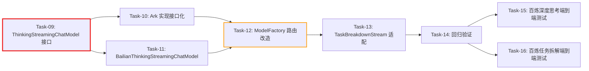

# 增量开发任务计划: 阿里百炼深度思考与任务拆解支持 (CR-001)

## 0. 变更概览 (Change Overview)

- **变更编号**: CR-001
- **变更类型**: 扩展 (Extension)
- **关联功能**: 多 LLM 提供商支持（阿里百炼）
- **变更原因**: 用户需要阿里百炼厂商支持深度思考流程和任务拆解流程，解除原 Out of Scope 限制
- **前置条件**: 原功能（Task-01 ~ Task-08）已全部完成并通过验证
- **总任务数**: 8 个（Task-09 ~ Task-16）
- **预计总工时**: 120 分钟（约 2 小时）
- **开发方法**: TDD（测试驱动开发）- 每个任务按 Red-Green-Refactor 循环执行
- **关键里程碑**:
  - 阶段一完成（接口抽象层）：30 分钟 - ThinkingStreamingChatModel 接口 + Ark 实现接口化就绪
  - 阶段二完成（百炼实现层）：45 分钟 - BailianThinkingStreamingChatModel 实现 + ModelFactory 路由改造就绪
  - 阶段三完成（适配层）：20 分钟 - TaskBreakdownStream 类型适配 + 回归验证通过
  - 阶段四完成（端到端验证）：25 分钟 - 百炼深度思考 + 任务拆解端到端测试通过

### 依赖关系图

图例：🔴 红色粗边 = 阻塞任务 | 🟠 橙色边 = 风险任务

### 可并行任务组

| 并行组 | 可同时执行的任务 | 前置条件 | 说明 |
| :--- | :--- | :--- | :--- |
| 并行组 1 | Task-09 + Task-10 | 无 | 接口定义与 Ark 实现接口化互不依赖，可并行 |
| 并行组 2 | Task-11 | Task-09 完成 | 百炼实现依赖接口定义 |
| 并行组 3 | Task-15 + Task-16 | Task-14 完成 | 两个端到端测试互不依赖，可并行 |

---

## 1. 开发任务 (Development Tasks)

### 阶段一：接口抽象层 (Interface Abstraction Layer)

---

#### Task-09: 新增 ThinkingStreamingChatModel 抽象接口

| 字段 | 内容 |
|:---|:---|
| **通俗解释** | 把火山引擎思考模型的"能力清单"抽象成一个通用接口，让系统不再绑定到具体厂商的实现类 |
| **涉及文件** | 新增 `agent-demo-llm/src/main/java/.../factory/ThinkingStreamingChatModel.java` |
| **对应技术方案** | 第 2.1.4 节 |
| **对应 AC** | AC-015, AC-016, AC-017 |
| **前置依赖** | 无 |

**验证标准**：
1. 接口定义包含 `void stream(List<ChatMessage> messages, ThinkingStreamHandler handler)` 方法
2. 接口定义包含 `void stream(List<ChatMessage> messages, String toolsJson, ThinkingStreamHandler handler)` 方法
3. 接口可被 `ArkThinkingStreamingChatModel` 和 `BailianThinkingStreamingChatModel` 实现
4. 编译通过

---

#### Task-10: 修改 ArkThinkingStreamingChatModel 实现接口

| 字段 | 内容 |
|:---|:---|
| **通俗解释** | 让火山引擎的思考模型"声明"自己实现了这个通用接口，保持原有逻辑不变 |
| **涉及文件** | 修改 `agent-demo-llm/src/main/java/.../factory/ArkThinkingStreamingChatModel.java` |
| **对应技术方案** | 第 2.1.4 节（接口实现部分） |
| **对应 AC** | AC-004（回归验证） |
| **前置依赖** | Task-09（接口定义） |

**验证标准**：
1. `ArkThinkingStreamingChatModel` 声明 `implements ThinkingStreamingChatModel`
2. 原有 `stream()` 方法签名与接口一致（无需修改方法体）
3. 编译通过
4. 现有 `ArkThinkingStreamingChatModelTest` 测试通过（无回归）

---

### 阶段二：百炼实现层 (Bailian Implementation Layer)

---

#### ⚠️ Task-11: 新增 BailianThinkingStreamingChatModel 百炼深度思考实现

| 字段 | 内容 |
|:---|:---|
| **通俗解释** | 为阿里百炼创建一个与火山引擎思考模型"能力相同"的实现类，通过原生 HTTP 直连百炼端点，手动解析推理内容 |
| **涉及文件** | 新增 `agent-demo-llm/src/main/java/.../factory/BailianThinkingStreamingChatModel.java` |
| **对应技术方案** | 第 2.1.5 节 |
| **对应 AC** | AC-015, AC-017 |
| **前置依赖** | Task-09（接口定义） |

**风险说明**：这是本次核心改动。涉及：
1. 复用 `ArkThinkingStreamingChatModel` 的 SSE 解析逻辑（`HttpURLConnection`、`ObjectMapper`、`parseSseLine` 等）
2. 请求体不发送 `thinking.type=enabled`（阿里百炼 DeepSeek 模型通过模型名称自身触发思考能力）
3. 需验证百炼 OpenAI 兼容端点是否确实返回 `delta.reasoning_content` 字段

**验证标准**：

**单元测试**（Mock HTTP）：
1. `stream(messages, handler)` 正确解析包含 `reasoning_content` 的 SSE 流，回调 `onPartialThinking` 和 `onPartialResponse`
2. `stream(messages, toolsJson, handler)` 正确解析包含 `tool_calls` 的 SSE 流，回调 `onToolCalls`
3. `finish_reason=stop` 时回调 `onComplete`
4. 请求体中不包含 `thinking.type` 字段（与方舟的区别）
5. 请求 URL 使用百炼 `baseUrl`，Authorization 使用百炼 `apiKey`

---

#### ⚠️ Task-12: 改造 ModelFactory 思考模式路由

| 字段 | 内容 |
|:---|:---|
| **通俗解释** | 改造"模型工厂"的思考模型获取逻辑——根据当前选中的提供商，返回对应厂商的思考模型实现（接口） |
| **涉及文件** | 修改 `agent-demo-llm/src/main/java/.../factory/ModelFactory.java` |
| **对应技术方案** | 第 2.2.2 节（CR-001 改造部分） |
| **对应 AC** | AC-015, AC-016, AC-017 |
| **前置依赖** | Task-09（接口）、Task-10（Ark 实现接口化）、Task-11（百炼实现） |

**风险说明**：这是本次改动影响面最大的任务。涉及：
1. `getThinkingStreamingChatModel()` 返回类型从 `ArkThinkingStreamingChatModel` 改为 `ThinkingStreamingChatModel`
2. 移除 BAILIAN 模式的 `UnsupportedOperationException` 拦截
3. `thinkingStreamingModelCache` 泛型类型从 `ArkThinkingStreamingChatModel` 改为 `ThinkingStreamingChatModel`
4. 新增 `createArkThinkingStreamingChatModel()` 和 `createBailianThinkingStreamingChatModel()` 私有方法
5. 需要同步更新 `ModelFactoryTest.java` 中的相关测试（移除百炼异常测试，新增百炼正常创建测试）

**验证标准**：

**正常流程**：
1. `provider = ARK` 时，`getThinkingStreamingChatModel()` 返回 `ArkThinkingStreamingChatModel` 实例（与之前行为一致）
2. `provider = BAILIAN` 时，`getThinkingStreamingChatModel()` 返回 `BailianThinkingStreamingChatModel` 实例（不再抛异常）
3. 多次调用返回同一实例（缓存复用）

**异常流程**：
4. `provider = BAILIAN` 且 `apiKey` 为 null 时，`getThinkingStreamingChatModel()` 抛出 `BusinessException`，提示 "BAILIAN_API_KEY 未配置"

**回归测试**：
5. `provider = ARK` 时，思考模型的行为与改动前完全一致
6. 现有 `ModelFactoryTest` 全部通过（构造器调用、ARK 模式测试等无回归）

---

### 阶段三：适配层 (Adapter Layer)

---

#### Task-13: 修改 TaskBreakdownStream 类型引用

| 字段 | 内容 |
|:---|:---|
| **通俗解释** | 把任务拆解流程中硬编码的"火山引擎思考模型"类型，改成通用的"思考模型接口"类型，让它能同时支持两个厂商 |
| **涉及文件** | 修改 `agent-demo-agent/src/main/java/.../core/TaskBreakdownStream.java` |
| **对应技术方案** | 文件变更清单（CR-001） |
| **对应 AC** | AC-016 |
| **前置依赖** | Task-12（ModelFactory 返回接口） |

**改动点**（3 处局部变量类型变更）：
1. `executeSubTaskWithReAct()` 方法中 `thinkingModel` 变量类型：`ArkThinkingStreamingChatModel` → `ThinkingStreamingChatModel`
2. `streamResponse()` 方法中 `thinkingModel` 变量类型：`ArkThinkingStreamingChatModel` → `ThinkingStreamingChatModel`
3. （如有其他直接引用 `ArkThinkingStreamingChatModel` 的位置一并修改）

**验证标准**：
1. 编译通过
2. `TaskBreakdownStreamPlanningTest`、`TaskBreakdownStreamExecutionTest`、`TaskBreakdownStreamSummaryTest` 测试通过（无回归）
3. `PlanAgentTest` 测试通过（无回归）

---

#### Task-14: 回归验证

| 字段 | 内容 |
|:---|:---|
| **通俗解释** | 运行所有已有测试，确认本次变更没有破坏任何已有功能 |
| **涉及文件** | 全部已有测试文件 |
| **对应技术方案** | 全部 |
| **对应 AC** | AC-004（回切火山引擎不受影响） |
| **前置依赖** | Task-10, Task-12, Task-13 |

**验证标准**：
1. `mvn test -pl agent-demo-llm -am` 全部测试通过（含 `ModelFactoryTest`、`ArkThinkingStreamingChatModelTest` 等）
2. `mvn test -pl agent-demo-agent -am` 全部测试通过（含 `TaskBreakdownStream*`、`PlanAgentTest`、`SimpleAgentTest` 等）
3. `mvn test -pl agent-demo-web -am` 全部测试通过（含 `AgentControllerTest`、`AgentControllerTaskBreakdownTest` 等）
4. 火山引擎模式（`llm.provider=ark`）的深度思考功能端到端正常
5. 火山引擎模式（`llm.provider=ark`）的任务拆解功能端到端正常

---

### 阶段四：端到端验证 (End-to-End Verification)

---

#### Task-15: 百炼深度思考端到端测试

| 字段 | 内容 |
|:---|:---|
| **通俗解释** | 在阿里百炼模式下，验证深度思考模式的完整流式输出（推理内容 + 正式回复）和 ReAct 工具调用 |
| **涉及文件** | 新增/修改测试文件（如 `BailianThinkingStreamingChatModelTest`、`ModelFactoryBailianThinkingTest`） |
| **对应技术方案** | 第 4 节 AC Mapping（AC-015、AC-017） |
| **对应 AC** | AC-015, AC-017 |
| **前置依赖** | Task-14（回归验证通过） |

**验证标准**：
1. 配置 `llm.provider=bailian`，调用 `ModelFactory.getThinkingStreamingChatModel()` 成功返回 `BailianThinkingStreamingChatModel` 实例（不抛异常）
2. 单轮思考流式调用：SSE 流式输出包含 `reasoning_content`（推理内容）和 `content`（正式回复），两者完整无中断
3. ReAct 思考流式调用：LLM 决定调用工具时，正确解析 `tool_calls`，执行工具并回填结果，完成多轮 ReAct 循环
4. 百炼模式下 `enableThinking=true` 时，`AgentController.chatStream()` 正常响应，不抛 `UnsupportedOperationException`

---

#### Task-16: 百炼任务拆解端到端测试

| 字段 | 内容 |
|:---|:---|
| **通俗解释** | 在阿里百炼模式下，验证任务拆解功能的完整三阶段流程（规划→执行→总结）全部可用 |
| **涉及文件** | 新增/修改测试文件（如 `TaskBreakdownStreamBailianTest`、`AgentControllerBailianTaskBreakdownTest`） |
| **对应技术方案** | 第 4 节 AC Mapping（AC-016） |
| **对应 AC** | AC-016 |
| **前置依赖** | Task-14（回归验证通过） |

**验证标准**：
1. 配置 `llm.provider=bailian`，启用 `enableTaskBreakdown=true`，发送复杂任务消息
2. Phase 1 规划：`task_plan` 事件正常推送，前端展示任务列表
3. Phase 2 执行：每个子任务的 `task_start`、`task_token`、`task_complete` 事件正常推送，子任务执行成功
4. Phase 3 总结：总结内容通过 `token` 事件正常推送，最终写入会话记忆
5. 降级路径（LLM 判断无需拆解）：`streamDirectAnswer()` 正常返回直接回答，不抛异常
6. 百炼模式下 `enableTaskBreakdown=true` 时，`AgentController.chatStream()` 正常响应，不抛 `UnsupportedOperationException`

---

## 2. 验证计划 (Verification Plan)

| 检查项 | 涉及任务 | 涉及 AC | 验证方式 | 通过标准 |
|:---|:---|:---|:---|:---|
| 接口定义 | Task-09 | AC-015~017 | 编译检查 | `ThinkingStreamingChatModel` 接口包含两个 `stream` 方法 |
| Ark 接口化 | Task-10 | AC-004 | 编译检查 + 单元测试 | `ArkThinkingStreamingChatModel implements ThinkingStreamingChatModel`，现有测试通过 |
| 百炼思考实现 | Task-11 | AC-015, AC-017 | 单元测试（Mock HTTP） | 5 项验证标准全部通过 |
| ModelFactory 路由 | Task-12 | AC-015~017 | 单元测试 | 6 项验证标准全部通过 |
| TaskBreakdownStream 适配 | Task-13 | AC-016 | 编译检查 + 单元测试 | 3 项验证标准全部通过 |
| 全量回归 | Task-14 | AC-004 | `mvn test` 全量运行 | 所有模块测试全部通过 |
| 百炼深度思考 E2E | Task-15 | AC-015, AC-017 | 集成测试（需真实/模拟百炼 API） | 4 项验证标准全部通过 |
| 百炼任务拆解 E2E | Task-16 | AC-016 | 集成测试（需真实/模拟百炼 API） | 6 项验证标准全部通过 |

---

## 3. 风险评估 (Risk Assessment)

| 风险 | 等级 | 说明 | 缓解措施 |
|:---|:---|:---|:---|
| 百炼 OpenAI 兼容端点 reasoning_content 字段行为差异 | 高 | 阿里百炼 DeepSeek 模型通过 OpenAI 兼容协议返回的 `reasoning_content` 字段格式可能与方舟存在细微差异（如字段名、嵌套层级、空值处理） | Task-11 中充分 Mock 各种 SSE 报文格式；Task-15 中使用真实 API 验证 |
| ArkThinkingStreamingChatModel 内部逻辑复用难度 | 中 | `ArkThinkingStreamingChatModel` 中部分逻辑（如 `capturedUsage`、`ToolCall` 解析）与方舟特性耦合，直接复用可能需要提取公共方法 | Task-11 中先尝试复用，如无法直接复用则提取公共工具类（如 `SseStreamParser`） |
| ModelFactory 返回类型变更的编译影响 | 中 | `getThinkingStreamingChatModel()` 返回类型从具体类改为接口，可能影响调用方（如 `SimpleAgent` 中是否有直接调用 Ark 特有方法） | Task-12 中同步检查所有调用方；Task-14 全量编译验证 |
| TaskBreakdownStream 之外的其他调用方 | 低 | 项目中可能有其他类直接引用 `ArkThinkingStreamingChatModel` | Task-13 中全局搜索 `ArkThinkingStreamingChatModel` 引用，确保全部改为接口类型 |

---

## 4. 变更关联矩阵

| 变更点 | 新增文件 | 修改文件 | 影响测试 |
|:---|:---|:---|:---|
| 抽象接口 | `ThinkingStreamingChatModel.java` | - | - |
| Ark 实现接口化 | - | `ArkThinkingStreamingChatModel.java` | `ArkThinkingStreamingChatModelTest` |
| 百炼思考实现 | `BailianThinkingStreamingChatModel.java` | - | `BailianThinkingStreamingChatModelTest`（新增） |
| ModelFactory 路由 | - | `ModelFactory.java` | `ModelFactoryTest`（修改） |
| TaskBreakdownStream 适配 | - | `TaskBreakdownStream.java` | `TaskBreakdownStream*`（回归） |
| 端到端验证 | - | - | `AgentController*` 集成测试（新增/修改） |

---

## 变更日志

| 版本 | 日期 | 变更内容 |
|:---|:---|:---|
| v1.0 | 2026-07-31 | 初始版本 — CR-001 增量任务计划，8 个任务（Task-09 ~ Task-16），预计 120 分钟 |
| v1.1 | 2026-07-31 | Task-09~Task-16 全部完成，13 个模块全量回归通过，详见 [完成报告](../../../docs/开发记录/CR-001_阿里百炼深度思考与任务拆解_全阶段_完成报告.md) |

### 任务完成状态

- [x] **Task-09**: 新增 ThinkingStreamingChatModel 抽象接口
- [x] **Task-10**: 修改 ArkThinkingStreamingChatModel 实现接口
- [x] **Task-11**: 新增 BailianThinkingStreamingChatModel 百炼实现
- [x] **Task-12**: 改造 ModelFactory 思考模式路由
- [x] **Task-13**: 修改 TaskBreakdownStream 类型引用
- [x] **Task-14**: 回归验证
- [x] **Task-15**: 百炼深度思考端到端测试
- [x] **Task-16**: 百炼任务拆解端到端测试
