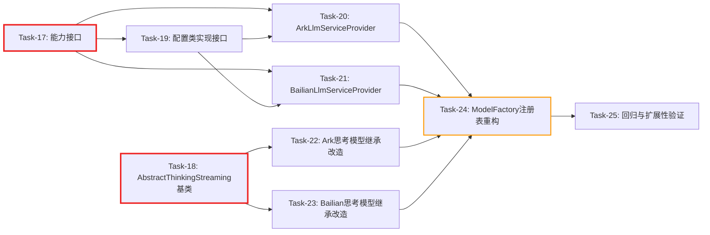

# 增量开发任务计划: agent-demo-llm 模块重构（CR-002）

## 0. 变更概览 (Change Overview)

* 变更编号  : CR-002

* 变更标题  : agent-demo-llm 模块重构 —— 能力矩阵 + 提供商策略 + 注册表

* 变更类型  : 重构 (Refactor)

* 关联功能  : 多 LLM 提供商支持（阿里百炼）

* 变更原因  : 当前 `ModelFactory` 存在 7 处 `if (provider == BAILIAN) {...} else {...}` 硬编码分支；`ArkThinkingStreamingChatModel` 与 `BailianThinkingStreamingChatModel` 代码重复度高达 95%；新增厂商需修改多处核心代码，扩展性低、维护成本高。

* 发起日期  : 2026-08-04

* 开发方法  : TDD（测试驱动开发）— 每个任务按 Red-Green-Refactor 循环执行

* 前置条件  : 原功能 Task-01 \~ Task-08 与 CR-001 (Task-09 \~ Task-16) 已全部完成并通过验证

* 总任务数  : 9 个（Task-17 \~ Task-25）

* 预计总工时  : 380 分钟（约 6.3 小时）

* 关键里程碑  :

* 阶段一完成（契约层）：60 分钟 — 能力接口 + 配置访问契约就绪

* 阶段二完成（抽象基类层）：50 分钟 — AbstractThinkingStreamingChatModel 抽象基类就绪

* 阶段三完成（厂商实现层）：120 分钟 — 两个厂商策略实现 + 思考模型继承改造就绪

* 阶段四完成（编排层重构）：90 分钟 — ModelFactory 注册表改造就绪

* 阶段五完成（回归与扩展性验证）：60 分钟 — 全量回归 + 新增厂商零核心改动验证

### 设计依据

批判性参考 `specs/features/2026-07-30_多LLM提供商支持-阿里百炼/多LLM提供商设计模式.md`，结合本项目实际（进程内调用、Spring 依赖注入、仅 2 家厂商且能力基本对齐）做以下裁剪：

| 设计模式文档建议             | CR-002 采纳情况                                 | 理由                                                         |
| :------------------- | :------------------------------------------ | :--------------------------------------------------------- |
| 五层架构（接入/编排/契约/桥接/执行） | 裁剪为三层  ：契约层 + 厂商实现层 + 编排层                   | 项目为进程内调用，无远程桥接需求；接入层（管理界面）不在本次范围                           |
| 服务商代码独立部署（容器/子进程）    | 不采纳                                         | 当前规模（2 家厂商）独立部署为过度工程，进程内 Spring Bean 隔离足够                  |
| 凭证加解密入库 + 租户隔离       | 不采纳                                         | 单租户场景，沿用 `@ConfigurationProperties` + 环境变量注入               |
| 能力矩阵：每种能力 = 一个抽象基类   | 采纳但调整为接口  （接口隔离原则 ISP）                      | 厂商按需实现能力接口；未实现的能力在运行时明确报错而非隐式失败                            |
| 注册表（服务定位）            | 采纳  ：Spring `List<LlmServiceProvider>` 自动注入 | 利用 Spring 已有的依赖注入能力，避免自研注册表                                |
| 抽象基类 + 模板方法          | 采纳  ：仅用于思考流式模型（重复度最高）                       | 其他能力（ChatModel/EmbeddingModel 等）差异仅在配置值，无需模板方法             |
| 策略模式                 | 采纳  ：厂商即策略，按 provider name 路由               | 通过 `LlmServiceProvider.getProviderName()` 自描述，编排层零 if-else |

### 依赖关系图



图例：🔴 红色粗边 = 阻塞任务 | 🟠 橙色边 = 风险任务

### 可并行任务组

| 并行组   | 可同时执行的任务                              | 前置条件                       | 说明                  |
| :---- | :------------------------------------ | :------------------------- | :------------------ |
| 并行组 1 | Task-17 + Task-18                     | 无                          | 能力接口与抽象基类位于不同包，互不依赖 |
| 并行组 2 | Task-20 + Task-21 + Task-22 + Task-23 | Task-17、Task-18、Task-19 完成 | 四个厂商实现改造互不依赖，可并行    |

***

## 1. 影响分析 (Impact Analysis)

### 1.1 需求影响

| 影响项    | 变更类型 | 详情                                                                                                    |
| :----- | :--- | :---------------------------------------------------------------------------------------------------- |
| AC-018 | 新增   | 新增厂商时，agent-demo-llm 核心代码（ModelFactory）零修改，仅新增一个 `LlmServiceProvider` 实现类 + 一个 `LlmProviderConfig` 实现 |
| AC-019 | 新增   | ModelFactory 中不存在任何 `if (provider == XXX)` 形式的硬编码厂商分支（静态扫描验证）                                         |
| AC-020 | 新增   | `ArkThinkingStreamingChatModel` 与 `BailianThinkingStreamingChatModel` 代码重复率 ≤ 30%（行级重复行检测）            |
| AC-014 | 修改   | 缓存复用语义不变，但缓存持有者从 ModelFactory 内部 Map 迁移到 ModelFactory 委托给 Provider 实例的 Map（对外行为不变）                    |
| AC-004 | 修改   | 火山引擎模式回归验证范围扩大：包括思考流式模型继承改造后的行为一致性                                                                    |

### 1.2 技术影响

| 影响层   | 影响范围            | 详情                                                           |
| :---- | :-------------- | :----------------------------------------------------------- |
| 数据层   | 无影响             | 不涉及数据库结构变更                                                   |
| API 层 | 新增接口            | 新增 6 个能力接口 + 1 个配置访问接口 + 1 个抽象基类                             |
| 表现层   | 无影响             | 不涉及 Controller / 前端                                          |
| 业务逻辑  | 重构 ModelFactory | 从硬编码分支改为注册表查找；从直接持有 Properties 改为通过 `LlmProviderConfig` 接口访问 |

### 1.3 代码影响

| 文件路径                                                                 | 操作 | 影响说明                                                                                     |
| :------------------------------------------------------------------- | :- | :--------------------------------------------------------------------------------------- |
| `agent-demo-llm/.../factory/LlmServiceProvider.java`                 | 新增 | 能力聚合标记接口，所有厂商策略实现此接口                                                                     |
| `agent-demo-llm/.../factory/ChatModelProvider.java`                  | 新增 | 同步对话能力接口                                                                                 |
| `agent-demo-llm/.../factory/StreamingChatModelProvider.java`         | 新增 | 流式对话能力接口                                                                                 |
| `agent-demo-llm/.../factory/ThinkingStreamingChatModelProvider.java` | 新增 | 思考流式对话能力接口（继承原 `ThinkingStreamingChatModel`）                                             |
| `agent-demo-llm/.../factory/EmbeddingModelProvider.java`             | 新增 | 向量化能力接口                                                                                  |
| `agent-demo-llm/.../factory/VisionChatModelProvider.java`            | 新增 | 视觉对话能力接口                                                                                 |
| `agent-demo-llm/.../factory/LlmProviderConfig.java`                  | 新增 | 配置访问契约接口（baseUrl/apiKey/timeout/maxRetries/temperature/getModelName）                     |
| `agent-demo-llm/.../factory/AbstractThinkingStreamingChatModel.java` | 新增 | 思考流式模型抽象基类（模板方法），上提 SSE 解析/HTTP 调用等通用逻辑                                                  |
| `agent-demo-llm/.../factory/ArkLlmServiceProvider.java`              | 新增 | 火山引擎厂商策略实现，实现所有能力接口                                                                      |
| `agent-demo-llm/.../factory/BailianLlmServiceProvider.java`          | 新增 | 阿里百炼厂商策略实现，实现所有能力接口                                                                      |
| `agent-demo-llm/.../config/LlmProvider.java`                         | 修改 | 新增 `code` 字段（如 `"ark"`、`"bailian"`），用于与 `LlmServiceProvider.getProviderCode()` 匹配        |
| `agent-demo-llm/.../config/ArkProperties.java`                       | 修改 | 实现 `LlmProviderConfig` 接口（仅声明 implements，方法已存在）                                          |
| `agent-demo-llm/.../config/BailianProperties.java`                   | 修改 | 实现 `LlmProviderConfig` 接口（仅声明 implements，方法已存在）                                          |
| `agent-demo-llm/.../config/LlmProperties.java`                       | 修改 | 新增 `providerCode` 派生属性（从 `LlmProvider.code` 取），便于注册表查找                                   |
| `agent-demo-llm/.../factory/ModelFactory.java`                       | 重构 | 注入 `List<LlmServiceProvider>`；按 `providerCode` 路由；移除全部 if-else 分支；缓存委托给 Provider 实例      |
| `agent-demo-llm/.../factory/ArkThinkingStreamingChatModel.java`      | 修改 | 改为继承 `AbstractThinkingStreamingChatModel`，仅保留差异（请求体 `thinking.type=enabled` 字段、模型名等）     |
| `agent-demo-llm/.../factory/BailianThinkingStreamingChatModel.java`  | 修改 | 改为继承 `AbstractThinkingStreamingChatModel`，仅保留差异（不发送 `thinking.type`、模型名等）                |
| `agent-demo-llm/.../config/LlmConfig.java`                           | 修改 | 注册新增的 `ArkLlmServiceProvider`、`BailianLlmServiceProvider`（通过 `@Component` 自动扫描，可能无需显式注册） |

### 1.4 测试影响

| 测试文件                                                                                                    | 影响类型 | 说明                                                                                                                                |
| :------------------------------------------------------------------------------------------------------ | :--- | :-------------------------------------------------------------------------------------------------------------------------------- |
| `ModelFactoryTest.java`                                                                                 | 需修改  | 构造器从 `(ArkProperties, LlmProperties, BailianProperties)` 改为 `(LlmProperties, List<LlmServiceProvider>)`；现有用例改为通过 Provider Mock 验证 |
| `ArkThinkingStreamingChatModelTest.java`                                                                | 需修改  | 改造为继承基类后的测试，验证模板方法调用链路；现有断言大部分保留                                                                                                  |
| `BailianThinkingStreamingChatModelTest.java`                                                            | 需修改  | 同上                                                                                                                                |
| `ArkLlmServiceProviderTest.java`                                                                        | 需新增  | 验证火山引擎 Provider 的所有能力接口实现                                                                                                         |
| `BailianLlmServiceProviderTest.java`                                                                    | 需新增  | 验证阿里百炼 Provider 的所有能力接口实现                                                                                                         |
| `AbstractThinkingStreamingChatModelTest.java`                                                           | 需新增  | 验证抽象基类的 SSE 解析、HTTP 调用、回调分发等模板方法逻辑（使用匿名子类或 Mock）                                                                                  |
| `LlmProviderConfigTest.java`                                                                            | 需新增  | 验证 `ArkProperties`、`BailianProperties` 实现接口后的方法契约                                                                                 |
| `TaskBreakdownStream*Test.java`、`PlanAgentTest.java`、`SimpleAgentTest.java`、`AgentController*Test.java` | 回归验证 | 接口签名未变，应全部通过；若失败需排查是否漏改调用方                                                                                                        |

### 1.5 回归风险评估

* 高风险区域  :

* `ModelFactory` 构造器签名变更 → 影响所有直接 new 或注入 ModelFactory 的位置

* `ArkThinkingStreamingChatModel` / `BailianThinkingStreamingChatModel` 继承改造 → 影响所有调用 `stream()` 方法的位置（行为应保持一致）

* 缓存持有者迁移 → 若 Provider 实例非单例，可能导致缓存失效（需保证 Provider 为单例）

* 已有测试覆盖  :

* `ModelFactoryTest` 覆盖了 7 处分支逻辑，可作为重构后行为对照基线

* `ArkThinkingStreamingChatModelTest`、`BailianThinkingStreamingChatModelTest` 覆盖了 SSE 解析逻辑，可作为基类抽取后的行为对照

* 需要补充的测试  :

* 扩展性验证测试：模拟新增第三个厂商（如 `MockLlmServiceProvider`），验证 ModelFactory 零修改即可路由

* 能力缺失降级测试：验证厂商未实现某能力接口时，调用该能力方法抛出明确异常（如 `UnsupportedCapabilityException`）

***

## 2. 需求变更详情 (Requirements Delta)

> 仅记录本次变更涉及的需求变化，已有需求不重复列出

### 2.1 新增/修改的用户故事

* US-LLM-002  : 作为开发者，我希望新增 LLM 厂商时只需新增一个 `LlmServiceProvider` 实现类，以便在不修改 `ModelFactory` 核心代码的前提下完成接入

* 关联验收标准：AC-018, AC-019

* US-LLM-003  : 作为维护者，我希望火山引擎和阿里百炼的思考流式模型共享 SSE 解析逻辑，以便修复 Bug 时只改一处

* 关联验收标准：AC-020

### 2.2 新增/修改的验收标准

#### 正常流程 (Happy Path)

* AC-018  : 新增厂商零核心改动

* Given: 系统已接入火山引擎和阿里百炼两家厂商，`ModelFactory` 通过注册表路由

* When: 新增第三个厂商 `MockLlmServiceProvider`（实现 `LlmServiceProvider` 接口）并标注 `@Component`

* Then: 配置 `llm.provider=mock` 后，`ModelFactory.getChatModel()` 自动返回 Mock 厂商的 ChatModel，且 `ModelFactory.java` 文件无任何修改

* AC-019  : ModelFactory 无厂商硬编码分支

* Given: `ModelFactory.java` 完成重构

* When: 静态扫描 `ModelFactory.java` 中的 `if.*provider.*==.*BAILIAN` 或 `if.*provider.*==.*ARK` 模式

* Then: 扫描结果为 0 处匹配

* AC-020  : 思考流式模型代码重复率达标

* Given: `ArkThinkingStreamingChatModel` 与 `BailianThinkingStreamingChatModel` 完成继承改造

* When: 对两个文件做行级重复行检测（如使用 `jscpd` 或人工对比）

* Then: 重复率 ≤ 30%

#### 业务规则 (Business Rules)

* AC-021  : 能力缺失时明确报错

* Given: 某厂商未实现 `VisionChatModelProvider` 接口

* When: 在该厂商模式下调用 `ModelFactory.getVisionChatModel()`

* Then: 抛出 `UnsupportedCapabilityException`，错误信息包含厂商名和缺失能力名

* AC-022  : 缓存复用语义保持不变

* Given: `ModelFactory` 重构后，缓存委托给 Provider 实例

* When: 同一 provider + 同一 modelName 多次调用 `getChatModel()`

* Then: 返回同一实例（与原行为一致，AC-014 不回归）

***

## 3. 技术变更详情 (Technical Delta)

> 仅记录本次变更涉及的技术变化

### 3.1 数据库变更

无（不涉及数据库）

### 3.2 API 变更

| 操作 | 接口/类                                 | 路径/包                        | 说明                                                                                                  |
| :- | :----------------------------------- | :-------------------------- | :-------------------------------------------------------------------------------------------------- |
| 新增 | `LlmServiceProvider`                 | `com.agentdemo.llm.factory` | 厂商策略聚合接口，含 `String getProviderCode()` 方法                                                            |
| 新增 | `ChatModelProvider`                  | `com.agentdemo.llm.factory` | 同步对话能力接口，含 `ChatModel getChatModel(String scene)`                                                   |
| 新增 | `StreamingChatModelProvider`         | `com.agentdemo.llm.factory` | 流式对话能力接口                                                                                            |
| 新增 | `ThinkingStreamingChatModelProvider` | `com.agentdemo.llm.factory` | 思考流式能力接口，继承 `ThinkingStreamingChatModel`                                                            |
| 新增 | `EmbeddingModelProvider`             | `com.agentdemo.llm.factory` | 向量化能力接口                                                                                             |
| 新增 | `VisionChatModelProvider`            | `com.agentdemo.llm.factory` | 视觉对话能力接口                                                                                            |
| 新增 | `LlmProviderConfig`                  | `com.agentdemo.llm.factory` | 配置访问契约：`getBaseUrl()/getApiKey()/getTimeout()/getMaxRetries()/getTemperature()/getModelName(scene)` |
| 新增 | `AbstractThinkingStreamingChatModel` | `com.agentdemo.llm.factory` | 思考流式模型抽象基类（模板方法）                                                                                    |
| 新增 | `ArkLlmServiceProvider`              | `com.agentdemo.llm.factory` | 火山引擎厂商策略实现                                                                                          |
| 新增 | `BailianLlmServiceProvider`          | `com.agentdemo.llm.factory` | 阿里百炼厂商策略实现                                                                                          |
| 修改 | `LlmProvider`                        | `com.agentdemo.llm.config`  | 新增 `code` 字段（如 `ARK("ark")`、`BAILIAN("bailian")`）                                                   |
| 重构 | `ModelFactory`                       | `com.agentdemo.llm.factory` | 注入 `List<LlmServiceProvider>`；移除直接持有的 `ArkProperties`/`BailianProperties`                           |

### 3.3 核心设计示意

#### 3.3.1 能力矩阵接口设计

```java
// 配置访问契约（ArkProperties / BailianProperties 实现）
public interface LlmProviderConfig {
    String getBaseUrl();
    String getApiKey();
    Duration getTimeout();
    int getMaxRetries();
    double getTemperature();
    String getModelName(String scene);
    String getEmbeddingModel();  // 默认实现可返回 null，由 Provider 决定是否使用
    String getVisionModel();      // 同上
}

// 能力接口（厂商按需实现）
public interface ChatModelProvider {
    ChatModel getChatModel(String scene);
}
public interface StreamingChatModelProvider {
    StreamingChatModel getStreamingChatModel(String scene);
}
public interface ThinkingStreamingChatModelProvider extends ThinkingStreamingChatModel {
    // 继承原有 stream() 方法签名，保持调用方零改动
}
public interface EmbeddingModelProvider {
    EmbeddingModel getEmbeddingModel();
}
public interface VisionChatModelProvider {
    ChatModel getVisionChatModel();
}

// 厂商策略聚合接口
public interface LlmServiceProvider extends ChatModelProvider, StreamingChatModelProvider,
        ThinkingStreamingChatModelProvider, EmbeddingModelProvider, VisionChatModelProvider {
    String getProviderCode();  // 如 "ark"、"bailian"，用于与 LlmProvider.code 匹配
}
```

> 设计决策（接口隔离原则 ISP）  ：用户明确要求"LlmServiceProvider 接口按能力拆分为多接口"。每个能力一个独立接口，厂商按需实现。若某厂商不支持某能力（如视觉），可不实现 `VisionChatModelProvider`，调用时由编排层检测并抛出 `UnsupportedCapabilityException`。
>
> 聚合接口的取舍  ：保留 `LlmServiceProvider` 聚合接口是为了让 `ModelFactory` 通过 `List<LlmServiceProvider>` 一次注入所有厂商；同时通过 `instanceof` 检测能力，避免调用方处理 5 个独立 List。
>
> 批判性参考设计模式文档  ：设计模式文档建议"每种能力 = 一个抽象基类"，但本项目各厂商能力差异仅在配置值（baseUrl/apiKey/modelName），抽象基类会退化为仅传递参数的空壳。因此仅对思考流式模型（重复度 95%）采用抽象基类 + 模板方法，其他能力采用接口 + 厂商直接实现。

#### 3.3.2 ModelFactory 注册表路由

```java
@Component
public class ModelFactory {
    private final LlmProperties llmProperties;
    private final Map<String, LlmServiceProvider> providerRegistry;  // 按 providerCode 索引

    public ModelFactory(LlmProperties llmProperties, List<LlmServiceProvider> providers) {
        this.llmProperties = llmProperties;
        this.providerRegistry = providers.stream()
            .collect(Collectors.toUnmodifiableMap(
                LlmServiceProvider::getProviderCode, Function.identity()));
    }

    public ChatModel getChatModel(String scene) {
        return getProvider().getChatModel(scene);
    }

    public ThinkingStreamingChatModel getThinkingStreamingChatModel() {
        return getProvider().getThinkingStreamingChatModel(null);  // 委托给 Provider
    }

    public ChatModel getVisionChatModel() {
        LlmServiceProvider provider = getProvider();
        if (!(provider instanceof VisionChatModelProvider)) {
            throw new UnsupportedCapabilityException(provider.getProviderCode(), "vision");
        }
        return ((VisionChatModelProvider) provider).getVisionChatModel();
    }

    private LlmServiceProvider getProvider() {
        String code = llmProperties.getProvider().getCode();
        LlmServiceProvider provider = providerRegistry.get(code);
        if (provider == null) {
            throw new BusinessException(ErrorCode.LLM_PROVIDER_NOT_FOUND,
                "未找到 LLM 提供商: " + code + "，已注册: " + providerRegistry.keySet());
        }
        return provider;
    }
}
```

> 关键变化  ：
>
> 1. ModelFactory 不再持有 `ArkProperties` / `BailianProperties`，仅持有 `LlmProperties`（用于读取当前 provider code）和 `Map<String, LlmServiceProvider>` 注册表
> 2. 缓存（`chatModelCache` 等）迁移到各 Provider 实现内部，Provider 为 Spring 单例，缓存语义不变
> 3. 通过 `instanceof` 检测能力是否支持，未支持时抛 `UnsupportedCapabilityException`，符合 AC-021

#### 3.3.3 思考流式模型抽象基类

```java
public abstract class AbstractThinkingStreamingChatModel implements ThinkingStreamingChatModelProvider {
    protected final String baseUrl;
    protected final String apiKey;
    protected final String modelName;
    protected final Duration timeout;
    protected final ObjectMapper objectMapper = new ObjectMapper();

    protected AbstractThinkingStreamingChatModel(String baseUrl, String apiKey,
                                                  String modelName, Duration timeout) { ... }

    // 模板方法：通用的流式调用流程
    @Override
    public void stream(List<ChatMessage> messages, ThinkingStreamHandler handler) {
        String body = buildRequestBody(messages, null);
        executeStream(body, handler);
    }

    @Override
    public void stream(List<ChatMessage> messages, String toolsJson, ThinkingStreamHandler handler) {
        String body = buildRequestBody(messages, toolsJson);
        executeStream(body, handler);
    }

    // 子类差异化实现：请求体构建（如是否包含 thinking.type=enabled）
    protected abstract String buildRequestBody(List<ChatMessage> messages, String toolsJson);

    // 通用实现：HTTP 调用 + SSE 解析 + 回调分发（从原 ArkThinkingStreamingChatModel 上提）
    private void executeStream(String body, ThinkingStreamHandler handler) { ... }

    // 通用实现：SSE 行解析（从原 ArkThinkingStreamingChatModel 上提）
    protected void parseSseLine(String line, ThinkingStreamHandler handler,
                                 StringBuilder fullResponse,
                                 Map<Integer, ToolCall> toolCallAccumulator) { ... }
}
```

> 批判性参考  ：设计模式文档建议"基类实现通用流程，子类只写差异"，与本次设计一致。但文档进一步建议"提供能力→基类的映射表"，本项目能力差异小，无需映射表，直接通过接口多态分派即可。

### 3.4 兼容性说明

* 向前兼容  :

* `ThinkingStreamingChatModel` 接口签名不变 → `TaskBreakdownStream` 等调用方零改动

* `ModelFactory` 公开方法签名（`getChatModel`、`getStreamingChatModel`、`getThinkingStreamingChatModel`、`getEmbeddingModel`、`getVisionChatModel`）全部保持不变

* `application.yml` 配置结构不变 → 运维侧零改动

* `LlmProvider` 枚举值不变（ARK / BAILIAN），仅新增 `code` 字段，向后兼容

* 构造器不兼容  :

* `ModelFactory` 构造器从 `(ArkProperties, LlmProperties, BailianProperties)` 改为 `(LlmProperties, List<LlmServiceProvider>)` → 需同步修改 `ModelFactoryTest`

* `ArkThinkingStreamingChatModel` / `BailianThinkingStreamingChatModel` 构造器保持 `(baseUrl, apiKey, modelName, timeout)` → 调用方（Provider）零改动

* 迁移方案  :

* 不需要数据迁移

* 测试迁移：`ModelFactoryTest` 重写为基于 Provider Mock 的测试（删除直接断言 ArkProperties/BailianProperties 的部分，改为断言 Provider 方法调用）

***

## 4. 增量开发任务 (Incremental Tasks)

> 任务编号从 CR-001 最后一个任务 Task-16 之后继续
> 每个任务耗时 < 2h (120m)
> 每个任务按 TDD 循环执行：RED（写测试）→ GREEN（写实现）→ REFACTOR（重构）

### 阶段一：契约层 (Contract Layer)

* [x] Task-17  : 新增能力接口与配置访问契约

* 说明  : 新增 6 个能力接口（`ChatModelProvider`、`StreamingChatModelProvider`、`ThinkingStreamingChatModelProvider`、`EmbeddingModelProvider`、`VisionChatModelProvider`、`LlmServiceProvider`）和 1 个配置访问接口（`LlmProviderConfig`）。`LlmServiceProvider` 聚合所有能力接口，新增 `getProviderCode()` 方法。

* 变更类型  : 新增

* 涉及文件  :

```
* 新增 `agent-demo-llm/src/main/java/com/agentdemo/llm/factory/LlmServiceProvider.java`
```

```
* 新增 `agent-demo-llm/src/main/java/com/agentdemo/llm/factory/ChatModelProvider.java`

* 新增 `agent-demo-llm/src/main/java/com/agentdemo/llm/factory/StreamingChatModelProvider.java`

* 新增 `agent-demo-llm/src/main/java/com/agentdemo/llm/factory/ThinkingStreamingChatModelProvider.java`

* 新增 `agent-demo-llm/src/main/java/com/agentdemo/llm/factory/EmbeddingModelProvider.java`

* 新增 `agent-demo-llm/src/main/java/com/agentdemo/llm/factory/VisionChatModelProvider.java`

* 新增 `agent-demo-llm/src/main/java/com/agentdemo/llm/factory/LlmProviderConfig.java`

* 修改 `agent-demo-llm/src/main/java/com/agentdemo/llm/config/LlmProvider.java`（新增 `code` 字段）

* 修改 `agent-demo-llm/src/main/java/com/agentdemo/llm/config/LlmProperties.java`（新增 `getProviderCode()` 派生方法）
```

* 测试文件  : 新增 `agent-demo-llm/src/test/java/com/agentdemo/llm/factory/LlmProviderConfigTest.java`（验证 `LlmProvider.code` 取值正确）

* 参考  : 本文档 Sec 3.3.1

* 对应AC  : AC-018, AC-019, AC-021

* 预估工时  : 60m

* 依赖  : 无

* 验证标准  （TDD RED 阶段的测试依据）:

```
* [x] `LlmProvider.ARK.getCode()` 返回 `"ark"`
```

```
* [x] `LlmProvider.BAILIAN.getCode()` 返回 `"bailian"`

* [x] `LlmServiceProvider` 接口继承所有 5 个能力接口，且声明 `String getProviderCode()` 方法

* [x] `ThinkingStreamingChatModelProvider` 继承 `ThinkingStreamingChatModel`（保持调用方零改动）

* [x] `LlmProviderConfig` 接口包含 `getBaseUrl/getApiKey/getTimeout/getMaxRetries/getTemperature/getModelName` 方法

* [x] 编译通过
```

***

### 阶段二：抽象基类层 (Abstract Base Class Layer)

* [x] Task-18  : 新增 AbstractThinkingStreamingChatModel 抽象基类

* 说明  : 从 `ArkThinkingStreamingChatModel` 上提通用的 SSE 解析、HTTP 调用、回调分发逻辑，作为抽象基类。子类仅实现 `buildRequestBody()` 差异化方法。基类实现 `ThinkingStreamingChatModelProvider` 接口。

* 变更类型  : 新增

* 涉及文件  :

```
* 新增 `agent-demo-llm/src/main/java/com/agentdemo/llm/factory/AbstractThinkingStreamingChatModel.java`
```

* 测试文件  : 新增 `agent-demo-llm/src/test/java/com/agentdemo/llm/factory/AbstractThinkingStreamingChatModelTest.java`（使用匿名子类或 Mock 子类验证模板方法逻辑）

* 参考  : 本文档 Sec 3.3.3

* 对应AC  : AC-020

* 预估工时  : 50m

* 依赖  : Task-17（`ThinkingStreamingChatModelProvider` 接口）

* 验证标准  （TDD RED 阶段的测试依据）:

```
* [x] `AbstractThinkingStreamingChatModel` 声明为 `abstract`，实现 `ThinkingStreamingChatModelProvider`
```

```
* [x] `stream(messages, handler)` 调用 `buildRequestBody(messages, null)` 后委托给 `executeStream`

* [x] `stream(messages, toolsJson, handler)` 调用 `buildRequestBody(messages, toolsJson)` 后委托给 `executeStream`

* [x] `executeStream(body, handler)` 正确执行 HTTP 调用、SSE 解析、回调分发（Mock HTTP 验证）

* [x] `parseSseLine(...)` 正确处理 `data:` 前缀、`[DONE]` 标记、`reasoning_content`、`content`、`tool_calls` 字段

* [x] 子类仅需实现 `buildRequestBody`，无需重写 `stream` 方法

* [x] 编译通过
```

***

### 阶段三：厂商实现层 (Provider Implementation Layer)

* [x] Task-19  : 修改 ArkProperties 和 BailianProperties 实现 LlmProviderConfig 接口

* 说明  : 让两个配置类显式声明 `implements LlmProviderConfig`。由于方法已全部存在（`getBaseUrl`、`getApiKey`、`getTimeout`、`getMaxRetries`、`getTemperature`、`getModelName`），仅需添加 `implements` 关键字。`BailianProperties` 需补齐 `getEmbeddingModel`/`getVisionModel` 已有方法（实际已存在）。`ArkProperties` 需新增 `getEmbeddingModel` 方法（返回 `ModelConstants.MODEL_DOUBAO_EMBEDDING`，因为当前 ark 配置未单独抽 embeddingModel 字段，沿用常量）。

* 变更类型  : 修改

* 涉及文件  :

```
* 修改 `agent-demo-llm/src/main/java/com/agentdemo/llm/config/ArkProperties.java`
```

```
* 修改 `agent-demo-llm/src/main/java/com/agentdemo/llm/config/BailianProperties.java`
```

* 测试文件  : 扩展 `LlmProviderConfigTest.java`（验证两个实现类均满足接口契约）

* 参考  : 本文档 Sec 3.3.1

* 对应AC  : AC-018

* 预估工时  : 30m

* 依赖  : Task-17（`LlmProviderConfig` 接口）

* 验证标准  （TDD RED 阶段的测试依据）:

```
* [x] `ArkProperties` 声明 `implements LlmProviderConfig`，所有接口方法均有实现
```

```
* [x] `BailianProperties` 声明 `implements LlmProviderConfig`，所有接口方法均有实现

* [x] `ArkProperties.getEmbeddingModel()` 返回 `ModelConstants.MODEL_DOUBAO_EMBEDDING`

* [x] 现有配置绑定行为不变（`@ConfigurationProperties` 仍生效）

* [x] 现有 `ArkPropertiesTest`、`BailianPropertiesTest` 全部通过（无回归）
```

***

* [x] Task-20  : 新增 ArkLlmServiceProvider 火山引擎厂商策略实现

* 说明  : 将 `ModelFactory` 中所有 `createArkXxx` 方法的逻辑迁移到 `ArkLlmServiceProvider`。实现 `LlmServiceProvider` 接口，`getProviderCode()` 返回 `"ark"`。内部持有 `ArkProperties`（即 `LlmProviderConfig`）和缓存 Map。

* 变更类型  : 新增

* 涉及文件  :

```
* 新增 `agent-demo-llm/src/main/java/com/agentdemo/llm/factory/ArkLlmServiceProvider.java`
```

* 测试文件  : 新增 `agent-demo-llm/src/test/java/com/agentdemo/llm/factory/ArkLlmServiceProviderTest.java`

* 参考  : 本文档 Sec 3.3.2、原 `ModelFactory.createArkXxx` 方法

* 对应AC  : AC-018, AC-022

* 预估工时  : 60m

* 依赖  : Task-17（接口）、Task-19（ArkProperties 实现接口）

* 验证标准  （TDD RED 阶段的测试依据）:

```
* [x] `getProviderCode()` 返回 `"ark"`
```

```
* [x] `getChatModel(scene)` 返回 `OpenAiChatModel`，baseUrl 为 `ark.cn-beijing.volces.com`，modelName 来自 `ArkProperties.getModelName(scene)`

* [x] `getStreamingChatModel(scene)` 返回 `OpenAiStreamingChatModel`

* [x] `getEmbeddingModel()` 返回 `OpenAiEmbeddingModel`，modelName 为 `ModelConstants.MODEL_DOUBAO_EMBEDDING`

* [x] `getVisionChatModel()` 返回 `OpenAiChatModel`，modelName 来自 `ArkProperties.getVisionModel()`

* [x] `getThinkingStreamingChatModel(scene)` 返回 `ArkThinkingStreamingChatModel` 实例

* [x] `apiKey` 为 null 时，所有方法抛出 `BusinessException`（错误码 LLM\_API\_KEY\_INVALID）

* [x] 多次调用同一 scene 返回同一实例（缓存复用，AC-022）
```

***

* [x] Task-21  : 新增 BailianLlmServiceProvider 阿里百炼厂商策略实现

* 说明  : 将 `ModelFactory` 中所有 `createBailianXxx` 方法的逻辑迁移到 `BailianLlmServiceProvider`。实现 `LlmServiceProvider` 接口，`getProviderCode()` 返回 `"bailian"`。

* 变更类型  : 新增

* 涉及文件  :

```
* 新增 `agent-demo-llm/src/main/java/com/agentdemo/llm/factory/BailianLlmServiceProvider.java`
```

* 测试文件  : 新增 `agent-demo-llm/src/test/java/com/agentdemo/llm/factory/BailianLlmServiceProviderTest.java`

* 参考  : 本文档 Sec 3.3.2、原 `ModelFactory.createBailianXxx` 方法

* 对应AC  : AC-018, AC-022

* 预估工时  : 60m

* 依赖  : Task-17（接口）、Task-19（BailianProperties 实现接口）

* 验证标准  （TDD RED 阶段的测试依据）:

```
* [x] `getProviderCode()` 返回 `"bailian"`
```

```
* [x] `getChatModel(scene)` 返回 `OpenAiChatModel`，baseUrl 为 `dashscope.aliyuncs.com/compatible-mode/v1`

* [x] `getStreamingChatModel(scene)` 返回 `OpenAiStreamingChatModel`

* [x] `getEmbeddingModel()` 返回 `OpenAiEmbeddingModel`，modelName 为 `BailianProperties.getEmbeddingModel()`（默认 `text-embedding-v4`）

* [x] `getVisionChatModel()` 返回 `OpenAiChatModel`，modelName 来自 `BailianProperties.getVisionModel()`

* [x] `getThinkingStreamingChatModel(scene)` 返回 `BailianThinkingStreamingChatModel` 实例

* [x] `apiKey` 为 null 时，所有方法抛出 `BusinessException`

* [x] 多次调用同一 scene 返回同一实例（缓存复用，AC-022）
```

***

* [x] Task-22  : 修改 ArkThinkingStreamingChatModel 继承 AbstractThinkingStreamingChatModel

* 说明  : 让 `ArkThinkingStreamingChatModel` 继承 `AbstractThinkingStreamingChatModel`，删除与基类重复的代码（`stream` 方法、`executeStream`、`parseSseLine` 等），仅保留 `buildRequestBody` 差异化实现（火山引擎需要发送 `thinking.type=enabled` 字段）。

* 变更类型  : 修改

* 涉及文件  :

```
* 修改 `agent-demo-llm/src/main/java/com/agentdemo/llm/factory/ArkThinkingStreamingChatModel.java`
```

* 测试文件  : 修改 `agent-demo-llm/src/test/java/com/agentdemo/llm/factory/ArkThinkingStreamingChatModelTest.java`（验证继承后行为不变）

* 参考  : 本文档 Sec 3.3.3

* 对应AC  : AC-020

* 预估工时  : 40m

* 依赖  : Task-18（抽象基类）

* 验证标准  （TDD RED 阶段的测试依据）:

```
* [x] `ArkThinkingStreamingChatModel` 声明 `extends AbstractThinkingStreamingChatModel`
```

```
* [x] 类体仅保留 `buildRequestBody` 方法（及必要的常量/字段），其余逻辑由基类提供

* [x] 请求体包含 `thinking.type=enabled` 字段（火山引擎 DeepSeek 模型需要显式触发思考能力）

* [x] `stream(messages, handler)` 行为与改造前一致（现有测试用例不修改应全部通过）

* [x] `stream(messages, toolsJson, handler)` 行为与改造前一致

* [x] 文件行数较改造前减少 ≥ 60%（约从 460 行降至 ≤ 180 行）
```

***

* [x] Task-23  : 修改 BailianThinkingStreamingChatModel 继承 AbstractThinkingStreamingChatModel

* 说明  : 同 Task-22，让 `BailianThinkingStreamingChatModel` 继承 `AbstractThinkingStreamingChatModel`，仅保留 `buildRequestBody` 差异化实现（阿里百炼不发送 `thinking.type=enabled`，通过模型名称自身触发思考能力）。

* 变更类型  : 修改

* 涉及文件  :

```
* 修改 `agent-demo-llm/src/main/java/com/agentdemo/llm/factory/BailianThinkingStreamingChatModel.java`
```

* 测试文件  : 修改 `agent-demo-llm/src/test/java/com/agentdemo/llm/factory/BailianThinkingStreamingChatModelTest.java`

* 参考  : 本文档 Sec 3.3.3

* 对应AC  : AC-020

* 预估工时  : 40m

* 依赖  : Task-18（抽象基类）

* 验证标准  （TDD RED 阶段的测试依据）:

```
* [x] `BailianThinkingStreamingChatModel` 声明 `extends AbstractThinkingStreamingChatModel`
```

```
* [x] 类体仅保留 `buildRequestBody` 方法

* [x] 请求体不包含 `thinking.type` 字段（与火山引擎的差异）

* [x] `stream(messages, handler)` 行为与改造前一致（现有测试用例不修改应全部通过）

* [x] `stream(messages, toolsJson, handler)` 行为与改造前一致

* [x] 文件行数较改造前减少 ≥ 60%（约从 454 行降至 ≤ 180 行）

* [x] 与 `ArkThinkingStreamingChatModel` 的行级重复率 ≤ 30%（AC-020）
```

***

### 阶段四：编排层重构 (Orchestration Layer Refactor)

* [x] ⚠️ Task-24  : 重构 ModelFactory 为注册表路由模式

* 说明  : 重构 `ModelFactory`，注入 `List<LlmServiceProvider>`，按 `providerCode` 路由。移除全部 7 处 `if (provider == BAILIAN) {...} else {...}` 硬编码分支。缓存委托给 Provider 实例。新增 `UnsupportedCapabilityException` 处理（用于厂商未实现某能力接口时）。

* 变更类型  : 重构

* 涉及文件  :

```
* 修改 `agent-demo-llm/src/main/java/com/agentdemo/llm/factory/ModelFactory.java`
```

```
* 新增 `agent-demo-llm/src/main/java/com/agentdemo/llm/exception/UnsupportedCapabilityException.java`（如不存在）

* 修改 `agent-demo-common/src/main/java/com/agentdemo/common/exception/ErrorCode.java`（新增 `LLM_PROVIDER_NOT_FOUND`、`LLM_CAPABILITY_NOT_SUPPORTED` 错误码，如不存在）
```

* 测试文件  : 重写 `agent-demo-llm/src/test/java/com/agentdemo/llm/factory/ModelFactoryTest.java`

* 参考  : 本文档 Sec 3.3.2

* 对应AC  : AC-018, AC-019, AC-021, AC-022

* 预估工时  : 90m

* 依赖  : Task-17、Task-20、Task-21、Task-22、Task-23

* 风险说明  : 这是本次重构的核心任务。涉及：

```
1. 构造器从 `(ArkProperties, LlmProperties, BailianProperties)` 改为 `(LlmProperties, List<LlmServiceProvider>)`，现有测试全部需要重写
```

```
2. 7 处硬编码分支全部移除，改为通过 `providerRegistry.get(code)` 查找
3. 缓存迁移：原 `chatModelCache`、`streamingModelCache`、`thinkingStreamingModelCache`、`visionModelCache` 删除，由 Provider 内部持有
4. `getVisionChatModel()` 需新增 `instanceof VisionChatModelProvider` 检测
5. 公开方法签名必须保持不变（`getChatModel`、`getStreamingChatModel`、`getThinkingStreamingChatModel`、`getEmbeddingModel`、`getVisionChatModel`）
```

* 验证标准  （TDD RED 阶段的测试依据）:

  正常流程  :

```
* [x] 构造器签名：`ModelFactory(LlmProperties, List<LlmServiceProvider>)`
```

```
* [x] `provider = ARK` 时，`getChatModel("code")` 返回火山引擎模型（委托给 `ArkLlmServiceProvider`）

* [x] `provider = BAILIAN` 时，`getChatModel("chat")` 返回阿里百炼模型（委托给 `BailianLlmServiceProvider`）

* [x] `provider = ARK` 时，`getThinkingStreamingChatModel()` 返回 `ArkThinkingStreamingChatModel` 实例

* [x] `provider = BAILIAN` 时，`getThinkingStreamingChatModel()` 返回 `BailianThinkingStreamingChatModel` 实例

* [x] `provider = ARK` 时，`getEmbeddingModel()` 返回火山引擎 Embedding 模型

* [x] `provider = BAILIAN` 时，`getEmbeddingModel()` 返回阿里百炼 Embedding 模型

* [x] `provider = ARK` 且配置 `visionModel` 时，`getVisionChatModel()` 返回火山引擎视觉模型

* [x] `provider = BAILIAN` 且配置 `visionModel` 时，`getVisionChatModel()` 返回阿里百炼视觉模型

* [x] 多次调用 `getChatModel("chat")` 返回同一实例（缓存复用，AC-022）

  异常流程  :

* [x] `provider` 配置为未注册的 code（如 `"unknown"`）时，抛出 `BusinessException`（错误码 LLM\_PROVIDER\_NOT\_FOUND）

* [x] 厂商未实现 `VisionChatModelProvider` 接口时（通过 Mock Provider 验证），`getVisionChatModel()` 抛出 `UnsupportedCapabilityException`（AC-021）

* [x] Provider 内部 `apiKey` 为 null 时，调用任意能力方法抛出 `BusinessException`（错误码 LLM\_API\_KEY\_INVALID）

  扩展性验证  :

* [x] 新增 `MockLlmServiceProvider`（`getProviderCode()` 返回 `"mock"`，标注 `@Component`）后，配置 `llm.provider=mock` 即可路由到 Mock 厂商，`ModelFactory.java` 文件无任何修改（AC-018）

  静态扫描  :

* [x] `ModelFactory.java` 中不存在 `if.*provider.*==.*BAILIAN` 或 `if.*provider.*==.*ARK` 模式（AC-019）

  回归测试  :

* [x] `provider = ARK` 时，所有模型获取行为与改造前完全一致
```

***

### 阶段五：回归与扩展性验证 (Regression & Extensibility Verification)

* [x] Task-25  : 全量回归与扩展性验证

* 说明  : 运行全量已有测试套件，确保变更未破坏原有功能。同时执行扩展性验证测试（新增第三个 Mock 厂商验证零核心改动）。

* 变更类型  : 验证

* 涉及文件  : 全部测试文件 + 新增扩展性验证测试

* 对应AC  : AC-004（回切火山引擎不受影响）、AC-018、AC-019、AC-020

* 预估工时  : 60m

* 依赖  : Task-24

* 验证标准  :

```
* [x] `mvn test -pl agent-demo-llm -am` 全部测试通过（含 `ModelFactoryTest`、`ArkLlmServiceProviderTest`、`BailianLlmServiceProviderTest`、`AbstractThinkingStreamingChatModelTest`、`ArkThinkingStreamingChatModelTest`、`BailianThinkingStreamingChatModelTest`、`LlmProviderConfigTest` 等）
```

```
* [x] `mvn test -pl agent-demo-agent -am` 全部测试通过（含 `TaskBreakdownStream*`、`PlanAgentTest`、`SimpleAgentTest`）

* [x] `mvn test -pl agent-demo-web -am` 全部测试通过（含 `AgentController*`）

* [x] `mvn test -pl agent-demo-rag -am` 全部测试通过（含 RAG 模块的 Embedding 调用）

* [x] 火山引擎模式（`llm.provider=ark`）的深度思考、任务拆解、对话、Embedding、视觉模型端到端正常

* [x] 阿里百炼模式（`llm.provider=bailian`）的深度思考、任务拆解、对话、Embedding、视觉模型端到端正常

* [x] 扩展性验证：新增 `MockLlmServiceProvider` 后，配置 `llm.provider=mock` 可路由，且 `ModelFactory.java` 无修改

* [x] 静态扫描：`ModelFactory.java` 中无厂商硬编码分支（AC-019）

* [x] 代码重复率：`ArkThinkingStreamingChatModel` 与 `BailianThinkingStreamingChatModel` 重复率 ≤ 30%（AC-020）

* [x] 测试覆盖率未下降（与 CR-001 完成后基线对比）
```

***

## 5. 增量验收标准检查清单 (Incremental AC Checklist)

> 仅包含本次变更涉及的验收标准

| 验收标准ID | 验收标准描述                | 状态  | 对应任务                               | 操作 |
| :----- | :-------------------- | :-- | :--------------------------------- | :- |
| AC-018 | 新增厂商零核心改动             | 已完成 | Task-17, Task-24, Task-25          | 新增 |
| AC-019 | ModelFactory 无厂商硬编码分支 | 已完成 | Task-24, Task-25                   | 新增 |
| AC-020 | 思考流式模型代码重复率 ≤ 30%     | 已完成 | Task-18, Task-22, Task-23, Task-25 | 新增 |
| AC-021 | 能力缺失时明确报错             | 已完成 | Task-17, Task-24                   | 新增 |
| AC-022 | 缓存复用语义保持不变            | 已完成 | Task-20, Task-21, Task-24          | 新增 |
| AC-014 | 缓存复用（已有）              | 已验证 | Task-25                            | 修改 |
| AC-004 | 回切火山引擎不受影响（已有）        | 已验证 | Task-25                            | 修改 |

***

## 6. 变更总结 (Change Summary)

* 总新增任务数  : 9 个（Task-17 \~ Task-25）

* 预计总工时  : 380 分钟（约 6.3 小时）

* 阶段一：60m（Task-17）

* 阶段二：50m（Task-18）

* 阶段三：170m（Task-19 + Task-20 + Task-21 + Task-22 + Task-23）

* 阶段四：90m（Task-24）

* 阶段五：60m（Task-25）

* 风险等级  : 中

* 风险说明  :

* 高风险 1  : `ModelFactory` 构造器签名变更，影响所有直接注入的调用方。。。缓解措施。。：Task-24 中全局搜索 `new ModelFactory(` 和 `@Autowired ModelFactory`，确保所有调用方通过 Spring 注入（构造器注入），不直接 new；Task-25 全量回归验证。

* 高风险 2  : `ArkThinkingStreamingChatModel` / `BailianThinkingStreamingChatModel` 继承改造可能引入行为差异（如 SSE 解析的边界情况）。。。缓解措施。。：Task-22、Task-23 中保留原有测试用例不修改，作为行为对照基线；若原有用例失败，必须先修复再继续。

* 中风险  : 缓存持有者从 ModelFactory 迁移到 Provider，需保证 Provider 为 Spring 单例，否则缓存失效。。。缓解措施。。：Provider 类标注 `@Component`，Spring 默认单例；Task-20、Task-21 中通过多次调用断言验证缓存语义。

* 测试影响  : 需修改 3 个已有测试（`ModelFactoryTest`、`ArkThinkingStreamingChatModelTest`、`BailianThinkingStreamingChatModelTest`），新增 5 个测试（`LlmProviderConfigTest`、`AbstractThinkingStreamingChatModelTest`、`ArkLlmServiceProviderTest`、`BailianLlmServiceProviderTest`、扩展性验证测试）

* 预期效果  :

1. 新增 LLM 厂商仅需新增一个 `LlmServiceProvider` 实现类，`ModelFactory` 零修改（扩展性提升）
2. `ModelFactory` 代码行数从约 410 行降至约 80 行，无厂商硬编码分支（可维护性提升）
3. `ArkThinkingStreamingChatModel` 与 `BailianThinkingStreamingChatModel` 代码重复率从 95% 降至 ≤ 30%（维护成本降低）
4. 能力接口按 ISP 原则拆分，厂商按需实现，未实现的能力有明确报错（代码层级清晰）
5. `LlmProviderConfig` 接口统一配置访问方式，新增厂商配置类只需实现接口（代码层级清晰）

***

## 变更日志

| 版本   | 日期         | 变更内容                                                                                                                                                                                                                                                                                                                  |
| :--- | :--------- | :-------------------------------------------------------------------------------------------------------------------------------------------------------------------------------------------------------------------------------------------------------------------------------------------------------------------- |
| v1.0 | 2026-08-04 | 初始版本 — CR-002 增量任务计划，9 个任务（Task-17 \~ Task-25），预计 380 分钟，方案 B+（能力矩阵 + 提供商策略 + 注册表，能力接口按 ISP 拆分）                                                                                                                                                                                                                       |
| v1.1 | 2026-08-04 | Task-17 \~ Task-25 全部完成。Task-24 实施时发现 ISP 设计缺陷并修正：将 `VisionChatModelProvider` 从 `LlmServiceProvider` 聚合接口中拆出作为可选能力接口，厂商显式 `implements`，编排层通过 `instanceof` 检测。新增 `UnsupportedCapabilityException` 与错误码 `LLM_PROVIDER_NOT_FOUND`、`LLM_CAPABILITY_NOT_SUPPORTED`。回归测试：4 模块共 377 个测试全部通过，无回归。AC-018/019/020/021/022 全部满足。 |

