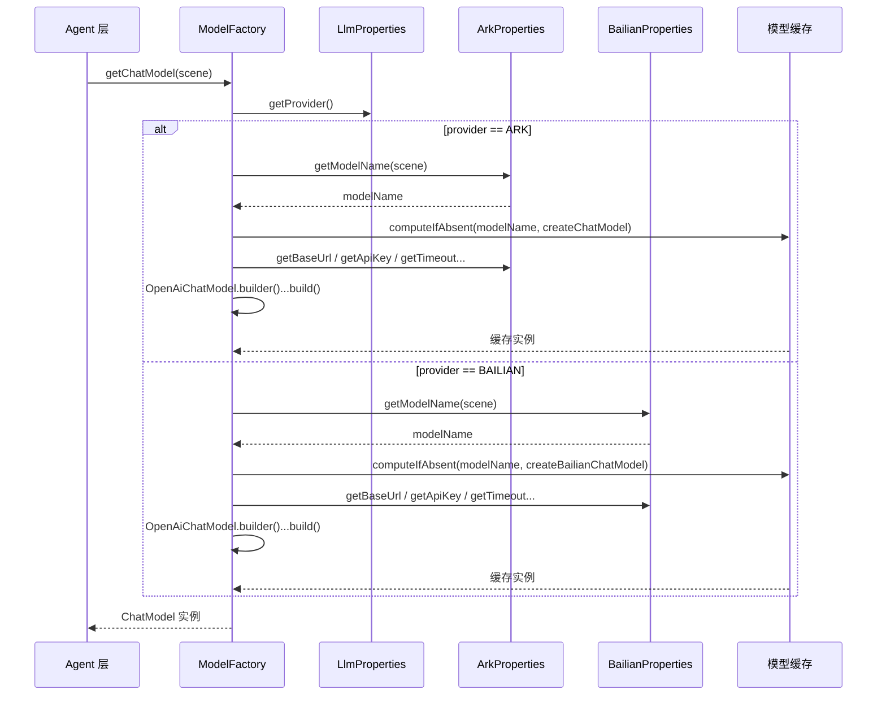
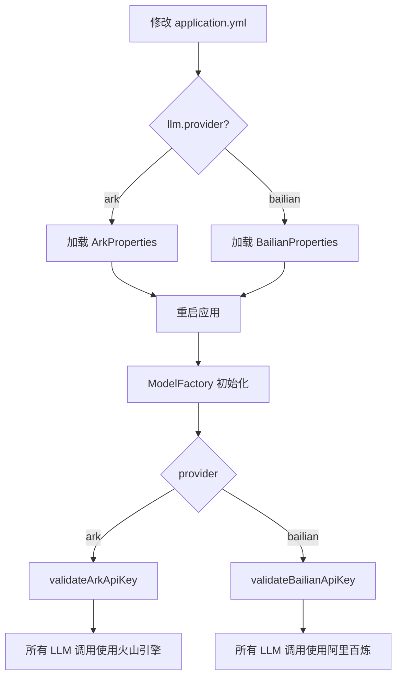

# 技术设计文档: 多 LLM 提供商支持（阿里百炼）

## 0. 设计概要 (Design Summary)

- **功能描述**：通过配置级切换（`llm.provider`）支持阿里百炼作为 LLM 提供商，保持火山引擎原有配置零改动，实现阿里百炼的同步对话、流式对话、Embedding 模型的创建与缓存复用。

- **影响范围**：
  - `agent-demo-llm`（核心实现：新增 `LlmProperties`、`BailianProperties`、`LlmProvider` 枚举；修改 `LlmConfig`、`ModelFactory`）
  - `agent-demo-common`（扩展 `ModelConstants`：新增阿里百炼模型常量）
  - `agent-demo-bootstrap`（配置项：新增 `llm.provider` + `bailian.*` 配置段）

- **技术难点**：
  - **提供商路由**：`ModelFactory` 需根据当前激活的提供商，在创建模型时路由到不同的配置源（ArkProperties / BailianProperties），同时保持缓存结构一致
  - **API Key 隔离校验**：切换提供商后只校验当前提供商的 API Key，不校验另一个
  - **向后兼容**：`llm.provider` 默认值为 `ark`，现有配置不受任何影响

- **依赖关系**：
  - 复用 `langchain4j-open-ai` 适配器（阿里百炼 OpenAI 兼容协议）
  - 复用 `ModelFactory` 的缓存机制（`ConcurrentHashMap`）
  - 复用 `ArkProperties` 的配置绑定模式（`@ConfigurationProperties`）
  - 无需新增任何第三方依赖

## 1. 架构概览 (Architecture Overview)

### 1.1 模块交互关系

```
agent-demo-llm (LLM 接入层)
    │
    ├── config/
    │   ├── LlmProperties          [NEW]  llm.provider 提供商选择配置
    │   ├── LlmProvider            [NEW]  提供商枚举 (ARK / BAILIAN)
    │   ├── ArkProperties          [保持] 火山引擎配置（零改动）
    │   ├── BailianProperties      [NEW]  阿里百炼配置
    │   └── LlmConfig              [修改] 注册新增的配置属性绑定
    │
    └── factory/
        └── ModelFactory           [修改] 根据 LlmProvider 路由创建逻辑
                │
                ├── LlmProvider.ARK    → ArkProperties → 创建模型（现有逻辑）
                └── LlmProvider.BAILIAN → BailianProperties → 创建模型（新增逻辑）

agent-demo-common (公共组件)
    └── constant/
        └── ModelConstants         [修改] 新增阿里百炼模型常量

agent-demo-bootstrap (启动模块)
    └── resources/
        └── application.yml        [修改] 新增 llm.provider + bailian.* 配置段
```

### 1.2 数据流向

**模型获取流程（运行时）：**



**配置切换流程：**



## 2. 详细设计 (Detailed Design)

### 2.1 新增类设计

#### 2.1.1 `LlmProvider` 枚举

**包路径**：`com.agentdemo.llm.config.LlmProvider`

```java
package com.agentdemo.llm.config;

/**
 * LLM 提供商枚举
 * <p>
 * 业务含义：通过配置项 llm.provider 选择当前使用的 LLM 提供商，
 * 支持 ark（火山引擎方舟）和 bailian（阿里百炼）两种取值。
 * 默认值为 ark（向后兼容）。
 * </p>
 */
public enum LlmProvider {
    ARK,
    BAILIAN
}
```

#### 2.1.2 `LlmProperties` 配置类

**包路径**：`com.agentdemo.llm.config.LlmProperties`

```java
package com.agentdemo.llm.config;

import lombok.Data;
import org.springframework.boot.context.properties.ConfigurationProperties;

/**
 * LLM 提供商选择配置
 * <p>
 * 业务含义：绑定 application.yml 中 llm.provider 配置项，
 * 用于选择当前使用的 LLM 提供商。
 * 默认值为 ark（火山引擎方舟），以保持向后兼容。
 * </p>
 * <p>
 * 配置示例：
 * <pre>
 * llm:
 *   provider: ark    # ark | bailian
 * </pre>
 * </p>
 */
@Data
@ConfigurationProperties(prefix = "llm")
public class LlmProperties {

    /**
     * LLM 提供商
     * 业务含义：指定当前使用的 LLM 提供商，支持 ark（火山引擎方舟）和 bailian（阿里百炼）
     * 默认值 ARK 确保不配置时不影响现有功能
     */
    private LlmProvider provider = LlmProvider.ARK;
}
```

#### 2.1.3 `BailianProperties` 配置类

**包路径**：`com.agentdemo.llm.config.BailianProperties`

```java
package com.agentdemo.llm.config;

import lombok.Data;
import org.springframework.boot.context.properties.ConfigurationProperties;

import java.time.Duration;
import java.util.HashMap;
import java.util.Map;

/**
 * 阿里百炼 OpenAI 兼容协议配置
 * <p>
 * 业务含义：绑定 application.yml 中 bailian.* 配置项，
 * 提供阿里百炼 LLM 接入所需的 Base URL、API Key、模型列表等参数。
 * 阿里百炼通过 OpenAI 兼容协议（/compatible-mode/v1）提供服务。
 * </p>
 * <p>
 * 配置示例（application.yml）：
 * <pre>
 * bailian:
 *   base-url: https://dashscope.aliyuncs.com/compatible-mode/v1
 *   api-key: ${BAILIAN_API_KEY}
 *   default-model: deepseek-v4-flash
 *   models:
 *     chat: deepseek-v4-flash
 *     code: deepseek-v4-flash
 *     lite: deepseek-v4-flash
 *   timeout: 60s
 *   max-retries: 3
 *   temperature: 0.7
 *   embedding-model: text-embedding-v4
 * </pre>
 * </p>
 */
@Data
@ConfigurationProperties(prefix = "bailian")
public class BailianProperties {

    /**
     * 阿里百炼 OpenAI 兼容协议 Base URL
     * 业务含义：使用 /compatible-mode/v1 路径，兼容 OpenAI 协议格式，
     * 可通过 LangChain4j openai4j 适配器直接接入
     */
    private String baseUrl = "https://dashscope.aliyuncs.com/compatible-mode/v1";

    /**
     * API Key（从环境变量 BAILIAN_API_KEY 注入，禁止硬编码）
     */
    private String apiKey;

    /**
     * 默认模型名称（当 scene 未命中 models 时回退使用）
     */
    private String defaultModel = "deepseek-v4-flash";

    /**
     * 按场景配置的模型映射
     * key: 场景标识（chat/code/lite 等）
     * value: 模型名称（如 deepseek-v4-flash）
     */
    private Map<String, String> models = new HashMap<>();

    /**
     * 调用超时时间
     */
    private Duration timeout = Duration.ofSeconds(60);

    /**
     * 最大重试次数（网络异常时自动重试）
     */
    private int maxRetries = 3;

    /**
     * 温度参数（0.0-1.0，值越高回复越发散，值越低越确定）
     */
    private double temperature = 0.7;

    /**
     * Embedding 模型名称
     * 业务含义：RAG 文档向量化使用的阿里百炼 Embedding 模型，
     * 独立于对话模型配置，便于单独指定
     */
    private String embeddingModel = "text-embedding-v4";

    /**
     * 根据场景获取模型名称
     * 业务含义：优先从 models Map 查找，未命中时回退到 defaultModel
     *
     * @param scene 场景标识（chat/code/lite 等）
     * @return 模型名称
     */
    public String getModelName(String scene) {
        if (scene == null || scene.isEmpty()) {
            return defaultModel;
        }
        return models.getOrDefault(scene, defaultModel);
    }
}
```

#### 2.1.4 `ThinkingStreamingChatModel` 接口（CR-001 新增）

**包路径**：`com.agentdemo.llm.factory.ThinkingStreamingChatModel`

```java
package com.agentdemo.llm.factory;

import dev.langchain4j.data.message.ChatMessage;

import java.util.List;

/**
 * 思考流式对话模型抽象接口
 * <p>
 * 业务含义：统一火山引擎方舟和阿里百炼的思考流式模型调用方式，
 * 为 Agent 层的深度思考模式和任务拆解功能提供与提供商无关的抽象。
 * </p>
 * <p>
 * 设计决策：将原 {@link ArkThinkingStreamingChatModel} 中对外暴露的流式调用方法抽象为接口，
 * 使 {@link ModelFactory#getThinkingStreamingChatModel()} 可以返回不同提供商的实现，
 * 解除返回类型对火山引擎具体类的硬编码依赖。
 * </p>
 */
public interface ThinkingStreamingChatModel {

    /**
     * 单轮思考流式对话（不带工具调用）
     *
     * @param messages 消息列表
     * @param handler  流式回调处理器
     */
    void stream(List<ChatMessage> messages, ThinkingStreamHandler handler);

    /**
     * ReAct 思考流式对话（带工具调用）
     *
     * @param messages  消息列表
     * @param toolsJson 工具 JSON Schema 描述
     * @param handler   流式回调处理器
     */
    void stream(List<ChatMessage> messages, String toolsJson, ThinkingStreamHandler handler);
}
```

#### 2.1.5 `BailianThinkingStreamingChatModel` 类（CR-001 新增）

**包路径**：`com.agentdemo.llm.factory.BailianThinkingStreamingChatModel`

**设计说明**：
- 与 `ArkThinkingStreamingChatModel` 采用相同的实现策略：**原生 HTTP 直连**阿里百炼 OpenAI 兼容端点，手动解析 SSE 流
- 原因：LangChain4j 的 `OpenAiStreamingChatModel` 适配器不会透传 `reasoning_content` 扩展字段，而阿里百炼 DeepSeek 系列模型通过 OpenAI 兼容协议会返回 `delta.reasoning_content`，必须手动解析
- 实现方式：复用 `ArkThinkingStreamingChatModel` 中成熟的 SSE 解析逻辑（`HttpURLConnection` + `ObjectMapper`），仅修改 Base URL、API Key、模型名称的来源为 `BailianProperties`
- 请求体构建：与方舟保持一致（`model`、`stream`、`stream_options.include_usage`、`messages`、`tools`），**不发送 `thinking.type=enabled`**（阿里百炼 DeepSeek 模型通过模型名称自身触发思考能力，无需额外字段）

```java
package com.agentdemo.llm.factory;

import com.fasterxml.jackson.databind.JsonNode;
import com.fasterxml.jackson.databind.ObjectMapper;
import dev.langchain4j.data.message.ChatMessage;

import java.net.HttpURLConnection;
import java.time.Duration;
import java.util.List;

/**
 * 阿里百炼思考流式对话模型实现
 * <p>
 * 业务含义：通过原生 HTTP 直连阿里百炼 OpenAI 兼容协议端点，
 * 解析 SSE 流中的 reasoning_content（推理内容）和 content（正式回复），
 * 为阿里百炼提供商提供与方舟一致的深度思考能力。
 * </p>
 */
public class BailianThinkingStreamingChatModel implements ThinkingStreamingChatModel {

    private final String baseUrl;
    private final String apiKey;
    private final String modelName;
    private final Duration timeout;
    private final ObjectMapper objectMapper = new ObjectMapper();

    public BailianThinkingStreamingChatModel(String baseUrl, String apiKey,
                                              String modelName, Duration timeout) {
        this.baseUrl = baseUrl;
        this.apiKey = apiKey;
        this.modelName = modelName;
        this.timeout = timeout;
    }

    @Override
    public void stream(List<ChatMessage> messages, ThinkingStreamHandler handler) {
        // 复用 ArkThinkingStreamingChatModel 的 SSE 解析逻辑
        // 仅变更请求 URL 和认证信息来源
    }

    @Override
    public void stream(List<ChatMessage> messages, String toolsJson, ThinkingStreamHandler handler) {
        // 复用 ArkThinkingStreamingChatModel 的 ReAct SSE 解析逻辑
        // 仅变更请求 URL 和认证信息来源
    }
}
```

### 2.2 修改类设计

#### 2.2.1 `LlmConfig` 修改

```java
@Configuration
@EnableConfigurationProperties({ArkProperties.class, LlmProperties.class, BailianProperties.class})
public class LlmConfig {
}
```

- 新增注册 `LlmProperties` 和 `BailianProperties` 配置属性绑定
- `ArkProperties` 保持不变

#### 2.2.2 `ModelFactory` 修改

**核心改动**：

1. 注入 `LlmProperties` 和 `BailianProperties`
2. 每个创建方法增加阿里百炼分支
3. 新增 `validateBailianApiKey()` 方法
4. 新增阿里百炼专用的创建方法（`createBailianChatModel`、`createBailianStreamingChatModel`、`createBailianEmbeddingModel`、`createBailianThinkingStreamingChatModel`）
5. ~~思考流式模型在阿里百炼模式下抛出 `UnsupportedOperationException`~~（已于 CR-001 改造为返回 `ThinkingStreamingChatModel` 接口并根据提供商路由）

**关键代码结构**：

```java
@Component
public class ModelFactory {

    private final ArkProperties arkProperties;
    private final LlmProperties llmProperties;
    private final BailianProperties bailianProperties;

    // 缓存结构保持不变（按 modelName 缓存，与提供商无关）
    private final ConcurrentHashMap<String, ChatModel> chatModelCache = new ConcurrentHashMap<>();
    private final ConcurrentHashMap<String, StreamingChatModel> streamingModelCache = new ConcurrentHashMap<>();
    // CR-001: 缓存类型改为接口，支持不同提供商的实现实例
    private final ConcurrentHashMap<String, ThinkingStreamingChatModel> thinkingStreamingModelCache = new ConcurrentHashMap<>();
    private volatile EmbeddingModel embeddingModel;

    public ModelFactory(ArkProperties arkProperties, LlmProperties llmProperties,
                        BailianProperties bailianProperties) {
        this.arkProperties = arkProperties;
        this.llmProperties = llmProperties;
        this.bailianProperties = bailianProperties;
    }

    // ========== 对外公开方法 ==========

    public ChatModel getChatModel(String scene) {
        String modelName = getModelName(scene);
        return chatModelCache.computeIfAbsent(modelName, this::createChatModel);
    }

    public ChatModel getDefaultChatModel() {
        return getChatModel(null);
    }

    public StreamingChatModel getStreamingChatModel(String scene) {
        String modelName = getModelName(scene);
        return streamingModelCache.computeIfAbsent(modelName, this::createStreamingChatModel);
    }

    public StreamingChatModel getDefaultStreamingChatModel() {
        return getStreamingChatModel(null);
    }

    public ThinkingStreamingChatModel getThinkingStreamingChatModel() {
        // CR-001: 根据当前提供商路由到对应的思考流式模型实现
        String modelName = getModelName(null);
        return thinkingStreamingModelCache.computeIfAbsent(modelName, this::createThinkingStreamingChatModel);
    }

    public EmbeddingModel getEmbeddingModel() {
        if (embeddingModel == null) {
            synchronized (this) {
                if (embeddingModel == null) {
                    if (llmProperties.getProvider() == LlmProvider.BAILIAN) {
                        embeddingModel = createBailianEmbeddingModel();
                    } else {
                        embeddingModel = createArkEmbeddingModel();
                    }
                }
            }
        }
        return embeddingModel;
    }

    // ========== 私有辅助方法 ==========

    /**
     * 根据当前激活的提供商获取模型名称
     * 业务含义：根据 llm.provider 从对应的配置对象中获取模型名称，
     * 优先从 models Map 查找，未命中时回退到 defaultModel
     *
     * @param scene 场景标识
     * @return 模型名称
     */
    private String getModelName(String scene) {
        if (llmProperties.getProvider() == LlmProvider.BAILIAN) {
            return bailianProperties.getModelName(scene);
        }
        return arkProperties.getModelName(scene);
    }

    // ========== 模型创建方法 ==========

    private ChatModel createChatModel(String modelName) {
        if (llmProperties.getProvider() == LlmProvider.BAILIAN) {
            return createBailianChatModel(modelName);
        }
        return createArkChatModel(modelName);
    }

    private ChatModel createArkChatModel(String modelName) {
        validateArkApiKey();
        return OpenAiChatModel.builder()
                .baseUrl(arkProperties.getBaseUrl())
                .apiKey(arkProperties.getApiKey())
                .modelName(modelName)
                .temperature(arkProperties.getTemperature())
                .timeout(arkProperties.getTimeout())
                .maxRetries(arkProperties.getMaxRetries())
                .build();
    }

    private ChatModel createBailianChatModel(String modelName) {
        validateBailianApiKey();
        return OpenAiChatModel.builder()
                .baseUrl(bailianProperties.getBaseUrl())
                .apiKey(bailianProperties.getApiKey())
                .modelName(modelName)
                .temperature(bailianProperties.getTemperature())
                .timeout(bailianProperties.getTimeout())
                .maxRetries(bailianProperties.getMaxRetries())
                .build();
    }

    private ThinkingStreamingChatModel createThinkingStreamingChatModel(String modelName) {
        if (llmProperties.getProvider() == LlmProvider.BAILIAN) {
            return createBailianThinkingStreamingChatModel(modelName);
        }
        return createArkThinkingStreamingChatModel(modelName);
    }

    private ThinkingStreamingChatModel createArkThinkingStreamingChatModel(String modelName) {
        validateArkApiKey();
        return new ArkThinkingStreamingChatModel(
                arkProperties.getBaseUrl(),
                arkProperties.getApiKey(),
                modelName,
                arkProperties.getTimeout());
    }

    private ThinkingStreamingChatModel createBailianThinkingStreamingChatModel(String modelName) {
        validateBailianApiKey();
        return new BailianThinkingStreamingChatModel(
                bailianProperties.getBaseUrl(),
                bailianProperties.getApiKey(),
                modelName,
                bailianProperties.getTimeout());
    }

    // 流式模型、Embedding 模型同理...
    // 各创建方法先校验当前提供商的 API Key，再构建模型

    private void validateArkApiKey() {
        if (arkProperties.getApiKey() == null || arkProperties.getApiKey().isEmpty()) {
            throw new BusinessException(ErrorCode.LLM_API_KEY_INVALID,
                    "ARK_API_KEY 未配置，请通过环境变量注入");
        }
    }

    private void validateBailianApiKey() {
        if (bailianProperties.getApiKey() == null || bailianProperties.getApiKey().isEmpty()) {
            throw new BusinessException(ErrorCode.LLM_API_KEY_INVALID,
                    "BAILIAN_API_KEY 未配置，请通过环境变量注入");
        }
    }
}
```

**设计说明**：
- 通过 `getModelName(scene)` 私有方法统一路由，对外部方法隐藏提供商差异
- 各创建方法（`createChatModel`、`createStreamingChatModel` 等）内部根据 `llmProperties.getProvider()` 再次路由到具体实现
- `createArkXxx` 保留原有完整逻辑，零改动；`createBailianXxx` 使用阿里百炼的配置参数

#### 2.2.3 `ModelConstants` 修改

```java
public final class ModelConstants {

    // ... 现有火山引擎常量保持不变 ...

    // ========== 阿里百炼模型常量 ==========

    /** 阿里百炼 DeepSeek V4 Flash 模型（默认对话模型） */
    public static final String MODEL_BAILIAN_DEEPSEEK_V4_FLASH = "deepseek-v4-flash";

    /** 阿里百炼 Embedding 模型 */
    public static final String MODEL_BAILIAN_EMBEDDING = "text-embedding-v4";
}
```

### 2.3 配置设计

#### application.yml 配置变更

```yaml
# ========== 新增：LLM 提供商选择 ==========
llm:
  provider: ark    # ark（火山引擎）| bailian（阿里百炼），默认 ark

# ========== 火山引擎（保持不变） ==========
ark:
  coding-plan:
    base-url: https://ark.cn-beijing.volces.com/api/coding/v3
    api-key: ${ARK_API_KEY}
    default-model: doubao-seed-2.0-code
    models:
      chat: doubao-seed-2.0-pro
      code: doubao-seed-2.0-code
      lite: doubao-seed-2.0-lite
    timeout: 60s
    max-retries: 3
    temperature: 0.7

# ========== 新增：阿里百炼配置 ==========
bailian:
  base-url: https://dashscope.aliyuncs.com/compatible-mode/v1
  api-key: ${BAILIAN_API_KEY}
  default-model: deepseek-v4-flash
  models:
    chat: deepseek-v4-flash
    code: deepseek-v4-flash
    lite: deepseek-v4-flash
  timeout: 60s
  max-retries: 3
  temperature: 0.7
  embedding-model: text-embedding-v4
```

### 2.4 异常处理设计

| 异常场景 | 对应 AC | 触发条件 | 处理方式 | 错误码 |
|---------|---------|---------|---------|--------|
| BAILIAN_API_KEY 未配置 | AC-006 | `provider=bailian` 且 `apiKey` 为空 | `validateBailianApiKey()` 抛出 BusinessException | 5004 (LLM_API_KEY_INVALID) |
| 阿里百炼 API Key 无效 | AC-007 | 阿里百炼返回 401 | LangChain4j 自动抛出异常，GlobalExceptionHandler 捕获 | 5001 (LLM_CALL_FAILED) |
| 阿里百炼服务不可用 | AC-008 | 连接超时/网络不可达 | LangChain4j 超时异常，全局异常处理 | 5001/5002 |
| 不支持的提供商值 | AC-009 | `llm.provider` 配置为非法值 | Spring Boot 绑定失败，启动时报错 | 系统启动失败 |
| base-url 未配置 | AC-010 | `bailian.base-url` 未配置 | 使用默认值，不报错 | 无 |
| 切换后不校验 ARK | AC-011 | `provider=bailian` 且 `ARK_API_KEY` 未设置 | 不校验，正常调用阿里百炼 | 无 |

### 2.5 缓存策略

- 缓存架构不变：`ConcurrentHashMap<String, ChatModel>` 按 modelName 缓存
- 阿里百炼的模型实例与火山引擎共用同一缓存池，但由于 modelName 不同（如 `deepseek-v4-flash` vs `doubao-seed-2.0-code`），不会冲突
- 切换提供商后，因 modelName 不同，缓存自动隔离，无需清空
- 思考流式模型缓存类型改为 `ThinkingStreamingChatModel` 接口（CR-001），按 modelName 缓存不同提供商的实现实例，缓存隔离机制与上述一致

## 3. 技术决策说明

| 决策项 | 选择 | 理由 |
|--------|------|------|
| 提供商路由方式 | ModelFactory 内 if-else 分支 | 仅 2 个提供商，逻辑简单；不引入策略模式避免过度工程；后续新增提供商时再考虑策略模式重构 |
| API Key 校验 | 各自独立校验方法 | 每个创建方法只校验当前提供商，符合 BR-LLM-012 |
| 阿里百炼配置前缀 | `bailian.*` | 独立前缀，与现有 `ark.coding-plan.*` 无冲突，扩展性好 |
| 思考模式处理 | ~~阿里百炼模式抛出 UnsupportedOperationException~~ 抽象为 `ThinkingStreamingChatModel` 接口，百炼新增原生 HTTP 实现（CR-001） | 解除 Out of Scope 限制，通过接口抽象支持双提供商的思考模式，复用已有 SSE 解析逻辑 |
| 环境变量 | `BAILIAN_API_KEY` | 与 `ARK_API_KEY` 命名一致，符合项目规范 |
| 无需新增依赖 | 复用 `langchain4j-open-ai` | 阿里百炼提供 OpenAI 兼容协议，无需引入新依赖 |

## 4. 验收标准映射 (AC Mapping)

| 验收标准 | 实现方式 | 验证方法 |
|---------|---------|---------|
| **AC-001**: 阿里百炼同步对话正常 | `ModelFactory.getChatModel()` → `createBailianChatModel()` | 集成测试：配置 `llm.provider=bailian`，调用同步对话 API |
| **AC-002**: 阿里百炼流式对话正常 | `ModelFactory.getStreamingChatModel()` → `createBailianStreamingChatModel()` | 集成测试：配置 `llm.provider=bailian`，调用流式对话 API |
| **AC-003**: 阿里百炼 Embedding 正常 | `ModelFactory.getEmbeddingModel()` → `createBailianEmbeddingModel()` | 集成测试：配置 `llm.provider=bailian`，调用 Embedding |
| **AC-004**: 回切火山引擎不受影响 | 默认 `llm.provider=ark`，走原有逻辑 | 回归测试：确认火山引擎原有功能正常 |
| **AC-005**: 阿里百炼场景路由正常 | `BailianProperties.getModelName(scene)` 按 Map 查找 | 单元测试：配置场景模型，验证路由结果 |
| **AC-006**: BAILIAN_API_KEY 未配置 | `validateBailianApiKey()` 抛出异常 | 单元测试：apiKey 为 null 时调用验证 |
| **AC-007**: API Key 无效 | 阿里百炼返回 401，LangChain4j 异常处理 | 集成测试：使用无效 Key 调用 |
| **AC-008**: 服务不可用 | 超时/连接异常，全局异常处理 | 集成测试：使用无效 baseUrl 调用 |
| **AC-009**: 不支持的提供商值 | Spring Boot 配置绑定失败 | 启动测试：配置非法值观察启动行为 |
| **AC-010**: base-url 未配置 | `BailianProperties.baseUrl` 有默认值 | 单元测试：验证默认值 |
| **AC-011**: 切换后不校验 ARK | `validateBailianApiKey()` 不检查 `ARK_API_KEY` | 集成测试：无 ARK_API_KEY 时使用 bailian |
| **AC-012**: API Key 环境变量注入 | `@Value("${BAILIAN_API_KEY}")` 或 `application.yml` 中 `${BAILIAN_API_KEY}` | 代码审查 |
| **AC-013**: 模型名常量化 | `ModelConstants` 中定义常量 | 代码审查 |
| **AC-014**: 缓存复用 | `ConcurrentHashMap.computeIfAbsent()` 复用 | 单元测试：多次调用返回同一实例 |
| **AC-015**: 阿里百炼深度思考正常 | `ModelFactory.getThinkingStreamingChatModel()` → `createBailianThinkingStreamingChatModel()` → `BailianThinkingStreamingChatModel.stream()` | 集成测试：配置 `llm.provider=bailian`，启用 `enableThinking=true`，验证 SSE 流式输出包含 reasoning_content 和 content |
| **AC-016**: 阿里百炼任务拆解完整可用 | `PlanAgent.chatTaskBreakdownStream()` → `TaskBreakdownStream` 三阶段均使用 `getThinkingStreamingChatModel()` 接口 | 集成测试：配置 `llm.provider=bailian`，启用 `enableTaskBreakdown=true`，验证 task_plan/task_start/task_complete 全流程 |
| **AC-017**: 阿里百炼深度思考 ReAct 工具调用正常 | `BailianThinkingStreamingChatModel.stream(messages, toolsJson, handler)` 解析 tool_calls 并执行 ReAct 循环 | 集成测试：百炼模式下发送需要调用工具的消息，验证 tool_calls 解析、工具执行、结果回填完整 |

## 5. 文件变更清单

| 操作 | 文件路径 | 说明 |
|------|---------|------|
| 新增 | `agent-demo-llm/.../config/LlmProvider.java` | 提供商枚举 |
| 新增 | `agent-demo-llm/.../config/LlmProperties.java` | 提供商选择配置 |
| 新增 | `agent-demo-llm/.../config/BailianProperties.java` | 阿里百炼配置属性 |
| 修改 | `agent-demo-llm/.../config/LlmConfig.java` | 注册新增配置属性绑定 |
| 修改 | `agent-demo-llm/.../factory/ModelFactory.java` | 新增阿里百炼路由逻辑 |
| 修改 | `agent-demo-common/.../constant/ModelConstants.java` | 新增阿里百炼模型常量 |
| 修改 | `agent-demo-bootstrap/.../application.yml` | 新增 `llm.provider` + `bailian.*` 配置段 |
| 新增（CR-001） | `agent-demo-llm/.../factory/ThinkingStreamingChatModel.java` | 思考流式模型抽象接口 |
| 新增（CR-001） | `agent-demo-llm/.../factory/BailianThinkingStreamingChatModel.java` | 阿里百炼思考流式模型实现（原生 HTTP 直连 + SSE 解析） |
| 修改（CR-001） | `agent-demo-llm/.../factory/ModelFactory.java` | `getThinkingStreamingChatModel()` 返回类型改为接口；新增百炼思考模型创建逻辑；缓存类型改为接口 |
| 修改（CR-001） | `agent-demo-llm/.../factory/ArkThinkingStreamingChatModel.java` | 实现 `ThinkingStreamingChatModel` 接口 |
| 修改（CR-001） | `agent-demo-agent/.../core/TaskBreakdownStream.java` | 局部变量类型从 `ArkThinkingStreamingChatModel` 改为 `ThinkingStreamingChatModel`（3 处） |

---

## 变更日志

| 版本 | 日期 | 变更内容 |
|------|------|---------|
| v1.0 | 2026-07-30 | 初始版本 — 多 LLM 提供商支持（阿里百炼）技术方案设计 |

### CR-001: 阿里百炼深度思考与任务拆解支持 (2026-07-31)
**影响范围**: 接口抽象 / ModelFactory 路由 / TaskBreakdownStream 适配 / 新增实现类
**变更内容摘要**:
- [新增] `ThinkingStreamingChatModel` 接口：抽象 `stream(messages, handler)` 和 `stream(messages, toolsJson, handler)` 两个方法
- [新增] `BailianThinkingStreamingChatModel` 类：原生 HTTP 直连阿里百炼 OpenAI 兼容端点，复用方舟 SSE 解析逻辑，手动解析 `delta.reasoning_content` 和 `delta.content`
- [修改] `ModelFactory.getThinkingStreamingChatModel()`: 返回类型从 `ArkThinkingStreamingChatModel` 改为 `ThinkingStreamingChatModel`；移除 BAILIAN 模式异常拦截；新增 `createBailianThinkingStreamingChatModel()` 方法
- [修改] `ModelFactory.thinkingStreamingModelCache`: 泛型类型从 `ArkThinkingStreamingChatModel` 改为 `ThinkingStreamingChatModel`
- [修改] `TaskBreakdownStream`: `executeSubTaskWithReAct()`、`streamResponse()` 等方法的局部变量类型改为接口
- [修改] `ArkThinkingStreamingChatModel`: 实现 `ThinkingStreamingChatModel` 接口