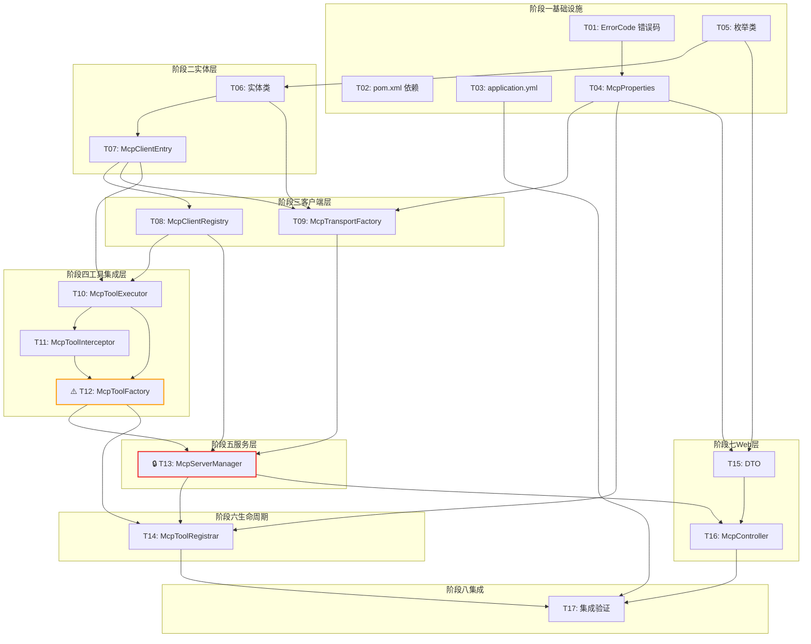

# 开发任务计划: MCP 协议模块

## 0. 任务概览 (Task Overview)

*   **总任务数**: 17 个
*   **预计总工时**: 685 分钟（约 11.4 小时）
*   **开发方法**: TDD（测试驱动开发）— 每个任务按 Red-Green-Refactor 循环执行
*   **关键里程碑**:
    *   阶段一完成（基础设施层）：约 70m — 错误码、配置、依赖就绪
    *   阶段二完成（实体层）：约 75m — 所有实体类与聚合对象就绪
    *   阶段三完成（客户端层）：约 105m — 存储层与传输工厂就绪
    *   阶段四完成（工具集成层）：约 180m — ByteBuddy 代理类生成机制就绪
    *   阶段五完成（服务层）：约 120m — 核心 McpServerManager 就绪
    *   阶段六完成（生命周期层）：约 45m — 启动加载器就绪
    *   阶段七完成（Web 接口层）：约 90m — REST API 可调用
    *   整体完成（含集成验证）：约 685m
*   **风险任务**: ⚠️ Task-12（McpToolFactory，ByteBuddy 动态生成）
*   **阻塞任务**: 🔒 Task-13（McpServerManager，被 Task-14/15/16 依赖）

### 依赖关系图

### 可并行任务组

| 并行组 | 可同时执行的任务 | 说明 |
| :--- | :--- | :--- |
| 并行组 1 | T01 + T02 + T03 + T05 | 基础设施层四个无依赖任务可并行 |
| 并行组 2 | T04 + T06 | T04 依赖 T01，T06 依赖 T05，但两者相互独立 |
| 并行组 3 | T11 + T15 | T11（拦截器）依赖 T10，T15（DTO）依赖 T04/T05，相互独立 |

## 1. 准备工作 (Preparation)

- [ ] **Prep-01**: 创建功能分支 `feature/mcp-module`
    *   说明：从 main 分支创建新分支
    *   验证：分支创建成功
- [ ] **Prep-02**: 确认 BOM 中 langchain4j-mcp 版本可用
    *   说明：检查 `agent-demo-bom/pom.xml` 中 `langchain4j.beta.version=1.17.2-beta27` 与 `langchain4j-mcp` artifact 是否已声明
    *   验证：能解析 `dev.langchain4j:langchain4j-mcp:1.17.2-beta27`
- [ ] **Prep-03**: 确认 ByteBuddy 依赖可用
    *   说明：检查 BOM 中 `byte-buddy` 版本（1.14.19）已声明
    *   验证：能解析 `net.bytebuddy:byte-buddy:1.14.19`

## 2. 开发任务 (Development Tasks)

> 每个任务按 TDD 循环执行：RED（写测试）→ GREEN（写实现）→ REFACTOR（重构）

### 阶段一：基础设施层 (Infrastructure Layer)

> **阶段完成标准**：错误码、配置类、依赖、YAML 配置全部就绪；项目可正常编译通过

- [ ] **Task-01**: ErrorCode 新增 5 个 MCP 错误码
    *   **通俗解释**: 做完这步后，系统就有了专门描述 MCP 相关错误的"标准术语"，比如"Server 名称已存在"、"Server 不存在"等，后续代码遇到这些情况时能说出准确的错误原因。
    *   **说明**: 在 ErrorCode 枚举的 MCP 区间（5400-5499）新增 5 个错误码：MCP_SERVER_NAME_EXISTS(5402)、MCP_SERVER_NOT_FOUND(5403)、MCP_TRANSPORT_UNSUPPORTED(5404)、MCP_MODULE_DISABLED(5405)、MCP_SERVER_ALREADY_CONNECTED(5406)
    *   **涉及文件**: `agent-demo-common/src/main/java/com/agentdemo/common/exception/ErrorCode.java`
    *   **测试文件**: `agent-demo-common/src/test/java/com/agentdemo/common/exception/ErrorCodeTest.java`（新增测试方法）
    *   **参考**: 技术方案 Sec 5.1
    *   **对应AC**: AC-019, AC-020, AC-021, AC-022, AC-026
    *   **预估工时**: 15m
    *   **依赖**: 无
    *   **验证标准**（TDD RED 阶段的测试依据）:
        - [ ] `ErrorCode.MCP_SERVER_NAME_EXISTS.getCode()` 返回 5402
        - [ ] `ErrorCode.MCP_SERVER_NAME_EXISTS.getMessage()` 返回 "MCP Server 名称已存在"
        - [ ] `ErrorCode.MCP_SERVER_NOT_FOUND.getCode()` 返回 5403
        - [ ] `ErrorCode.MCP_TRANSPORT_UNSUPPORTED.getCode()` 返回 5404
        - [ ] `ErrorCode.MCP_MODULE_DISABLED.getCode()` 返回 5405
        - [ ] `ErrorCode.MCP_SERVER_ALREADY_CONNECTED.getCode()` 返回 5406
        - [ ] 5 个新错误码均在 5400-5499 区间内，不与已有错误码冲突

- [ ] **Task-02**: pom.xml 依赖添加
    *   **通俗解释**: 做完这步后，项目的"工具箱"里就装好了 MCP 协议相关的工具包，代码里可以使用 LangChain4j 提供的 MCP 客户端类了。
    *   **说明**: 在 `agent-demo-mcp/pom.xml` 添加 `langchain4j-mcp` 和 `byte-buddy` 依赖（BOM 已声明版本，无需指定）；在 `agent-demo-bootstrap/pom.xml` 添加 `agent-demo-mcp` 依赖
    *   **涉及文件**: `agent-demo-mcp/pom.xml`、`agent-demo-bootstrap/pom.xml`
    *   **测试文件**: 无（编译验证）
    *   **参考**: 技术方案 Sec 9.5
    *   **对应AC**: 无直接对应（基础设施）
    *   **预估工时**: 10m
    *   **依赖**: 无
    *   **验证标准**:
        - [ ] `mvn compile -pl agent-demo-mcp -am` 编译通过
        - [ ] `mvn dependency:tree -pl agent-demo-mcp` 包含 `dev.langchain4j:langchain4j-mcp` 和 `net.bytebuddy:byte-buddy`
        - [ ] `agent-demo-bootstrap` 模块依赖树包含 `agent-demo-mcp`

- [ ] **Task-03**: application.yml 新增 mcp.* 配置段
    *   **通俗解释**: 做完这步后，运维人员就可以在配置文件里预先写好要连接的 MCP Server 列表，应用启动时会自动按这个清单去连接。
    *   **说明**: 在 `application.yml` 新增 `mcp:` 配置段，包含 `enabled`、`default-tool-timeout`、`servers` 列表，提供 stdio 和 sse 两种示例配置（注释说明）
    *   **涉及文件**: `agent-demo-bootstrap/src/main/resources/application.yml`
    *   **测试文件**: 无（由 Task-04 McpProperties 测试覆盖）
    *   **参考**: 技术方案 Sec 10.1
    *   **对应AC**: AC-030, AC-032, AC-035
    *   **预估工时**: 15m
    *   **依赖**: 无（与 Task-04 并行，但 Task-04 完成后才能验证绑定）
    *   **验证标准**:
        - [ ] 配置文件包含 `mcp.enabled: true`
        - [ ] 配置文件包含 `mcp.default-tool-timeout: 60s`
        - [ ] 配置文件包含 `mcp.servers` 列表（可为空或含注释示例）
        - [ ] 应用启动不报配置绑定错误

- [ ] **Task-04**: McpProperties 配置类
    *   **通俗解释**: 做完这步后，代码就能"读懂"配置文件里的 mcp 段了，把 yaml 里的文字转换成 Java 对象，方便后续代码使用。
    *   **说明**: 实现 `@ConfigurationProperties(prefix = "mcp")` 配置类，包含 enabled、defaultToolTimeout、servers 列表；内部 ServerConfig 类含 name/transport/enabled/command/args/env/url/headers/toolTimeout 字段；TransportType 枚举（STDIO/SSE）
    *   **涉及文件**: `agent-demo-mcp/src/main/java/com/agentdemo/mcp/config/McpProperties.java`
    *   **测试文件**: `agent-demo-mcp/src/test/java/com/agentdemo/mcp/config/McpPropertiesTest.java`
    *   **参考**: 技术方案 Sec 10.2
    *   **对应AC**: AC-030, AC-032, AC-035
    *   **预估工时**: 30m
    *   **依赖**: Task-01
    *   **验证标准**:
        - [ ] 默认值：`enabled=true`、`defaultToolTimeout=Duration.ofSeconds(60)`、`servers=空列表`
        - [ ] ServerConfig 默认值：`enabled=true`、`args=空列表`、`env=空Map`、`headers=空Map`
        - [ ] YAML 中配置 `mcp.enabled=false` 时，`mcpProperties.isEnabled()` 返回 false
        - [ ] YAML 中配置 `mcp.default-tool-timeout=30s` 时，`getDefaultToolTimeout()` 返回 Duration.ofSeconds(30)
        - [ ] ServerConfig 的 transport 字段能正确绑定枚举值 STDIO/SSE（不区分大小写）
        - [ ] ServerConfig 的 toolTimeout 字段能解析 Duration 格式（如 "60s"、"PT1M"）

### 阶段二：实体层 (Entity Layer)

> **阶段完成标准**：所有实体类、枚举、聚合对象就绪；单元测试覆盖字段默认值与状态转换

- [ ] **Task-05**: 枚举类（McpServerStatus + McpTransportType）
    *   **通俗解释**: 做完这步后，系统就有了描述 MCP Server 当前状态的"标准词汇表"，比如"已连接"、"已断线"、"配置禁用"等。
    *   **说明**: 实现两个枚举：McpServerStatus（CONNECTED/DISCONNECTED/ERROR/DISABLED）、McpTransportType（STDIO/SSE）
    *   **涉及文件**: `agent-demo-mcp/src/main/java/com/agentdemo/mcp/entity/McpServerStatus.java`、`McpTransportType.java`
    *   **测试文件**: `agent-demo-mcp/src/test/java/com/agentdemo/mcp/entity/McpServerStatusTest.java`
    *   **参考**: 技术方案 Sec 3.3
    *   **对应AC**: AC-034, AC-035
    *   **预估工时**: 15m
    *   **依赖**: 无
    *   **验证标准**:
        - [ ] `McpServerStatus` 包含恰好 4 个枚举值：CONNECTED、DISCONNECTED、ERROR、DISABLED
        - [ ] `McpTransportType` 包含恰好 2 个枚举值：STDIO、SSE
        - [ ] `McpServerStatus.valueOf("CONNECTED")` 返回对应枚举
        - [ ] `McpServerStatus.valueOf("INVALID")` 抛出 IllegalArgumentException

- [ ] **Task-06**: 实体类（McpServer + McpToolInfo）
    *   **通俗解释**: 做完这步后，系统就有了"档案卡"来记录每个 MCP Server 的信息（名字、传输方式、连接配置等）以及每个工具的元数据（原始名、注册名、参数格式）。
    *   **说明**: 实现两个实体类：McpServer（含 name/transport/enabled/command/args/env/url/headers/toolTimeout/tools/connectTime/lastActiveTime 字段）；McpToolInfo（含 originalName/registeredName/description/parametersSchema 字段）
    *   **涉及文件**: `agent-demo-mcp/src/main/java/com/agentdemo/mcp/entity/McpServer.java`、`McpToolInfo.java`
    *   **测试文件**: `agent-demo-mcp/src/test/java/com/agentdemo/mcp/entity/McpServerTest.java`
    *   **参考**: 技术方案 Sec 3.3
    *   **对应AC**: AC-004, AC-011
    *   **预估工时**: 30m
    *   **依赖**: Task-05
    *   **验证标准**:
        - [ ] `new McpServer()` 默认值：`enabled=true`、`args=空ArrayList`、`env=空HashMap`、`headers=空HashMap`、`tools=空ArrayList`
        - [ ] `McpServer.setName("weather").setTransport(STDIO)` 后 getter 返回对应值
        - [ ] `new McpToolInfo()` setter 设置 originalName/registeredName/description/parametersSchema 后 getter 返回对应值
        - [ ] `McpServer` 的 toolTimeout 字段支持 Duration 类型

- [ ] **Task-07**: McpClientEntry 聚合对象
    *   **通俗解释**: 做完这步后，系统就有了一个"档案袋"，把某个 MCP Server 的客户端实例、传输对象、当前状态打包在一起管理，方便统一操作。
    *   **说明**: 实现 McpClientEntry 类，聚合 McpServer + McpClient + McpTransport + status + lastError + tools；提供 close() 方法安全释放 McpClient 资源
    *   **涉及文件**: `agent-demo-mcp/src/main/java/com/agentdemo/mcp/client/McpClientEntry.java`
    *   **测试文件**: `agent-demo-mcp/src/test/java/com/agentdemo/mcp/client/McpClientEntryTest.java`
    *   **参考**: 技术方案 Sec 3.3
    *   **对应AC**: AC-009, AC-027
    *   **预估工时**: 30m
    *   **依赖**: Task-06
    *   **验证标准**:
        - [ ] 构造 `new McpClientEntry(server, mcpClient, transport)` 后 getter 返回对应值
        - [ ] `entry.setStatus(McpServerStatus.CONNECTED)` 后 `getStatus()` 返回 CONNECTED
        - [ ] `entry.setLastError("连接超时")` 后 `getLastError()` 返回对应值
        - [ ] `entry.close()` 调用 mcpClient.close()，不抛异常
        - [ ] `entry.close()` 内部 mcpClient.close() 抛 IOException 时，仅记录 WARN 日志，不向上抛出
        - [ ] `entry.close()` 当 mcpClient 为 null 时不抛 NPE

### 阶段三：客户端层 (Client Layer)

> **阶段完成标准**：McpClientRegistry 存储层与 McpTransportFactory 传输工厂就绪；可独立测试存储与传输创建逻辑

- [ ] **Task-08**: McpClientRegistry 独立存储层
    *   **通俗解释**: 做完这步后，系统就有了一个"储物柜"专门存放所有 MCP Server 的档案袋，后续任何代码想要查找/添加/删除某个 Server，都通过这个储物柜来操作，不需要直接接触业务管理器。
    *   **说明**: 实现 McpClientRegistry 组件，作为 McpClientEntry 的纯存储层；使用 ConcurrentHashMap<String, McpClientEntry>；提供 put/get/remove/list/contains 方法；无任何业务逻辑
    *   **涉及文件**: `agent-demo-mcp/src/main/java/com/agentdemo/mcp/client/McpClientRegistry.java`
    *   **测试文件**: `agent-demo-mcp/src/test/java/com/agentdemo/mcp/client/McpClientRegistryTest.java`
    *   **参考**: 方案 B 设计（循环依赖破解）
    *   **对应AC**: AC-029, AC-033
    *   **预估工时**: 30m
    *   **依赖**: Task-07
    *   **验证标准**:
        - [ ] `registry.put("weather", entry)` 后 `registry.get("weather")` 返回同一 entry 引用
        - [ ] `registry.get("nonexistent")` 返回 null
        - [ ] `registry.contains("weather")` 返回 true；`contains("nonexistent")` 返回 false
        - [ ] `registry.remove("weather")` 返回被移除的 entry，且 `contains("weather")` 返回 false
        - [ ] `registry.remove("nonexistent")` 返回 null
        - [ ] `registry.list()` 返回所有 entry 的 Collection（空时返回空集合，不返回 null）
        - [ ] 并发场景：多线程同时 put 不同 key 不抛异常（ConcurrentHashMap 保证）

- [ ] **Task-09**: McpTransportFactory 传输工厂
    *   **通俗解释**: 做完这步后，系统就学会了根据配置文件里的"传输方式"字段，自动创建对应的连接通道——是启动本地子进程，还是连接远程 HTTP 服务。
    *   **说明**: 实现 McpTransportFactory 组件，根据 ServerConfig.transport 字段创建 StdioMcpTransport 或 HttpMcpTransport；非法 transport 抛 MCP_TRANSPORT_UNSUPPORTED
    *   **涉及文件**: `agent-demo-mcp/src/main/java/com/agentdemo/mcp/client/McpTransportFactory.java`
    *   **测试文件**: `agent-demo-mcp/src/test/java/com/agentdemo/mcp/client/McpTransportFactoryTest.java`
    *   **参考**: 技术方案 Sec 4.3
    *   **对应AC**: AC-002, AC-003, AC-021
    *   **预估工时**: 45m
    *   **依赖**: Task-04, Task-06, Task-07
    *   **验证标准**:
        - [ ] `factory.createTransport(serverConfig)` 当 transport=STDIO 且 command="node" args=[/path/server.js] 时，返回 StdioMcpTransport 实例
        - [ ] `factory.createTransport(serverConfig)` 当 transport=SSE 且 url="https://example.com/sse" 时，返回 HttpMcpTransport 实例
        - [ ] `factory.createTransport(serverConfig)` 当 transport=null 时，抛 BusinessException(MCP_TRANSPORT_UNSUPPORTED)
        - [ ] stdio 模式 env 配置正确传递给 StdioMcpTransport
        - [ ] sse 模式 headers 配置正确传递给 HttpMcpTransport

### 阶段四：工具集成层 (Tool Integration Layer)

> **阶段完成标准**：ByteBuddy 动态工具生成机制可用；McpToolExecutor 可执行工具调用；⚠️ 风险阶段，重点验证

- [ ] **Task-10**: McpToolExecutor 工具执行器
    *   **通俗解释**: 做完这步后，系统就有了"翻译官"，能把 Agent 调用工具的请求翻译成 MCP 协议的调用，再把 MCP Server 返回的结果翻译回来；同时还会处理超时、断线等异常情况。
    *   **说明**: 实现 McpToolExecutor 组件，依赖 McpClientRegistry（不依赖 McpServerManager，避免循环）；提供 execute(serverName, toolName, argsJson) 方法；内部解析 argsJson 为 Map，调用 mcpClient.executeTool；处理超时/断线/连接异常
    *   **涉及文件**: `agent-demo-mcp/src/main/java/com/agentdemo/mcp/tool/McpToolExecutor.java`
    *   **测试文件**: `agent-demo-mcp/src/test/java/com/agentdemo/mcp/tool/McpToolExecutorTest.java`
    *   **参考**: 技术方案 Sec 4.3
    *   **对应AC**: AC-012, AC-013, AC-018, AC-027
    *   **预估工时**: 60m
    *   **依赖**: Task-07, Task-08
    *   **验证标准**:
        - [ ] `executor.execute("weather", "getForecast", "{\"city\":\"北京\"}")` 当 Server CONNECTED 时，调用 mcpClient.executeTool 并返回结果字符串
        - [ ] `executor.execute("weather", "getForecast", null)` 当 argsJson 为 null 时，传入空 Map 不抛异常
        - [ ] `executor.execute("weather", "getForecast", "invalid json")` 当 argsJson 格式错误时，抛 BusinessException(MCP_TOOL_CALL_FAILED)
        - [ ] `executor.execute("nonexistent", "tool", "{}")` 当 Server 不存在时，抛 BusinessException(MCP_TOOL_CALL_FAILED)
        - [ ] `executor.execute("weather", "tool", "{}")` 当 Server 状态非 CONNECTED（如 DISCONNECTED）时，抛 BusinessException(MCP_TOOL_CALL_FAILED)
        - [ ] `executor.execute(...)` 当 mcpClient.executeTool 抛超时异常时，包装为 BusinessException(MCP_TOOL_CALL_FAILED, "工具调用超时")
        - [ ] `executor.execute(...)` 当 mcpClient.executeTool 抛 IOException 时，调用 markDisconnected 并抛 BusinessException(MCP_TOOL_CALL_FAILED, "MCP Server 已断开")

- [ ] **Task-11**: McpToolInterceptor ByteBuddy 拦截器
    *   **通俗解释**: 做完这步后，系统就有了一个"中转站"，ByteBuddy 动态生成的方法被调用时，会先经过这个中转站，再把请求转给 McpToolExecutor 真正执行。
    *   **说明**: 实现 McpToolInterceptor，使用 @RuntimeType 注解；持有 serverName、toolName、toolExecutor；execute(@AllArguments Object[] args) 方法接收 argsJson 参数，委托给 toolExecutor.execute
    *   **涉及文件**: `agent-demo-mcp/src/main/java/com/agentdemo/mcp/tool/McpToolInterceptor.java`
    *   **测试文件**: `agent-demo-mcp/src/test/java/com/agentdemo/mcp/tool/McpToolInterceptorTest.java`
    *   **参考**: 技术方案 Sec 4.3（参考 [KnowledgeBaseToolInterceptor](file:///d:/project_demo/agent_demo/agent-demo-rag/src/main/java/com/agentdemo/rag/retriever/KnowledgeRetrieverTool.java)）
    *   **对应AC**: AC-012
    *   **预估工时**: 30m
    *   **依赖**: Task-10
    *   **验证标准**:
        - [ ] `new McpToolInterceptor("weather", "getForecast", toolExecutor)` 构造成功
        - [ ] `interceptor.execute(new Object[]{"{\"city\":\"北京\"}"})` 调用 toolExecutor.execute("weather", "getForecast", "{\"city\":\"北京\"}") 并返回其结果
        - [ ] `interceptor.execute(new Object[]{null})` 传入 null 时不抛 NPE，转给 toolExecutor 处理
        - [ ] `interceptor.execute(new Object[]{})` 当参数数组为空时，抛友好异常（不应抛 ArrayIndexOutOfBoundsException）

- [ ] **Task-12**: ⚠️ McpToolFactory ByteBuddy 工具生成器
    *   **通俗解释**: 做完这步后，系统就学会了"魔法"——能把 MCP Server 提供的工具元数据，动态"变"出对应的 Java 类和方法，让 Agent 以为这些工具和本地工具一样，可以通过同样的方式调用。
    *   **说明**: 实现 McpToolFactory 组件，依赖 McpToolExecutor；提供 createTools(serverName, List<McpToolInfo>) 方法；使用 ByteBuddy 为每个工具生成带 @Tool 注解的代理类；方法名 mcp_{serverName}_{toolName}；方法签名 String execute(String argsJson)；@Tool 描述包含 Server 名 + 工具描述 + JSON Schema
    *   **涉及文件**: `agent-demo-mcp/src/main/java/com/agentdemo/mcp/tool/McpToolFactory.java`
    *   **测试文件**: `agent-demo-mcp/src/test/java/com/agentdemo/mcp/tool/McpToolFactoryTest.java`
    *   **参考**: 技术方案 Sec 4.3、CR-003 [KnowledgeBaseToolFactory.java](file:///d:/project_demo/agent_demo/agent-demo-rag/src/main/java/com/agentdemo/rag/retriever/KnowledgeBaseToolFactory.java)
    *   **对应AC**: AC-005, AC-025, AC-031
    *   **预估工时**: 90m
    *   **依赖**: Task-10, Task-11
    *   **风险标注**: ⚠️ ByteBuddy 动态字节码生成技术复杂度高，需参考 CR-003 已验证的 KnowledgeBaseToolFactory 模式；建议先编写最简单的"单工具生成"测试用例，再扩展到多工具
    *   **验证标准**:
        - [ ] `factory.createTools("weather", [toolInfo1])` 返回非空 List，size=1
        - [ ] 生成的代理类 name 为 `com.agentdemo.mcp.tool.McpTool_weather_getForecast`
        - [ ] 生成的代理类包含一个 public 方法，方法名为 `mcp_weather_getForecast`
        - [ ] 该方法有 `@dev.langchain4j.agent.tool.Tool` 注解，注解 value 包含 "weather" 和 "getForecast"
        - [ ] 该方法有 `@Tool` 注解，注解 value 包含工具描述和 JSON Schema
        - [ ] 调用该方法 `method.invoke(toolInstance, "{\"city\":\"北京\"}")` 时，委托给 toolExecutor.execute 并返回结果
        - [ ] `factory.createTools("weather", [tool1, tool2])` 返回 size=2 的 List，两个工具类名不同
        - [ ] `factory.createTools("github", [searchTool])` 和 `factory.createTools("gitlab", [searchTool])` 生成的方法名分别为 `mcp_github_search` 和 `mcp_gitlab_search`，不冲突（验证 AC-025）
        - [ ] `factory.createTools("weather", [])` 当工具列表为空时，返回空 List 不抛异常

### 阶段五：服务层 (Service Layer)

> **阶段完成标准**：McpServerManager 核心服务就绪；CRUD + 连接 + 状态机可用；🔒 阻塞任务，后续任务依赖

- [ ] **Task-13**: 🔒 McpServerManager 核心服务
    *   **通俗解释**: 做完这步后，系统就有了 MCP 模块的"总管家"——负责接发"添加/删除/重连 Server"的指令、协调传输工厂建立连接、协调存储层管理 entry、协调工具注册器注册工具、维护 Server 状态机。
    *   **说明**: 实现 McpServerManager 核心服务，依赖 McpClientRegistry + McpTransportFactory + McpToolRegistrar；提供 connect()、addServer()、deleteServer()、reconnect()、markDisconnected()、list()、getServer()、listTools() 方法；实现名称唯一性校验、transport 配置校验、状态机管理
    *   **涉及文件**: `agent-demo-mcp/src/main/java/com/agentdemo/mcp/service/McpServerManager.java`
    *   **测试文件**: `agent-demo-mcp/src/test/java/com/agentdemo/mcp/service/McpServerManagerTest.java`
    *   **参考**: 技术方案 Sec 4.1~4.5
    *   **对应AC**: AC-001, AC-007~AC-011, AC-014~AC-017, AC-019~AC-020, AC-026, AC-029, AC-033, AC-034
    *   **预估工时**: 120m
    *   **依赖**: Task-08, Task-09, Task-12
    *   **阻塞标注**: 🔒 被 Task-14（Registrar 启动调用 Manager）、Task-16（Controller 调用 Manager）依赖
    *   **验证标准**:
        - [ ] `manager.connect(server)` 当配置合法时，建立 McpClient、拉取工具、存入 Registry、调用 Registrar.registerTools、状态置为 CONNECTED，返回含工具列表的 McpServer
        - [ ] `manager.connect(server)` 当 McpClient 创建失败时，抛 BusinessException(MCP_CONNECTION_FAILED)
        - [ ] `manager.addServer(request)` 当 name 已存在（Registry.contains 返回 true）时，抛 BusinessException(MCP_SERVER_NAME_EXISTS)
        - [ ] `manager.addServer(request)` 当 transport=STDIO 且 command 为空时，抛 BusinessException(PARAM_INVALID)
        - [ ] `manager.addServer(request)` 当 transport=SSE 且 url 格式非法（非 HTTP/HTTPS）时，抛 BusinessException(PARAM_INVALID)
        - [ ] `manager.deleteServer("weather")` 当 Server 存在时，调用 Registrar.unregisterTools、调用 entry.close()、从 Registry 移除
        - [ ] `manager.deleteServer("nonexistent")` 当 Server 不存在时，抛 BusinessException(MCP_SERVER_NOT_FOUND)
        - [ ] `manager.reconnect("weather")` 当 Server 状态为 DISCONNECTED 时，关闭旧连接、重新 connect、状态置为 CONNECTED
        - [ ] `manager.reconnect("weather")` 当 Server 状态为 CONNECTED 时，抛 BusinessException(MCP_SERVER_ALREADY_CONNECTED)
        - [ ] `manager.reconnect("nonexistent")` 当 Server 不存在时，抛 BusinessException(MCP_SERVER_NOT_FOUND)
        - [ ] `manager.markDisconnected("weather")` 当 Server 存在时，状态置为 DISCONNECTED、调用 Registrar.unregisterTools
        - [ ] `manager.list()` 返回所有 Server 元数据列表（含静态和动态）
        - [ ] `manager.listTools("weather")` 返回该 Server 的工具元数据列表
        - [ ] `manager.listTools("nonexistent")` 抛 BusinessException(MCP_SERVER_NOT_FOUND)

### 阶段六：生命周期层 (Lifecycle Layer)

> **阶段完成标准**：应用启动时能自动加载静态配置的 MCP Server；enabled=false 时跳过；单 Server 失败不阻塞启动

- [ ] **Task-14**: McpToolRegistrar 启动加载器
    *   **通俗解释**: 做完这步后，应用一启动就会自动按配置文件里的清单去连接所有 MCP Server，把它们的工具准备好给 Agent 使用；如果某个 Server 连不上，系统会记下错误继续启动其他 Server，不会卡死整个应用。
    *   **说明**: 实现 McpToolRegistrar 组件，实现 ApplicationRunner 接口；依赖 McpProperties + McpServerManager + McpToolFactory + ToolRegistry；启动时遍历静态配置加载 Server；提供 registerTools(entry)/unregisterTools(entry) 方法供 McpServerManager 调用
    *   **涉及文件**: `agent-demo-mcp/src/main/java/com/agentdemo/mcp/tool/McpToolRegistrar.java`
    *   **测试文件**: `agent-demo-mcp/src/test/java/com/agentdemo/mcp/tool/McpToolRegistrarTest.java`
    *   **参考**: 技术方案 Sec 4.1
    *   **对应AC**: AC-001, AC-014, AC-022, AC-032
    *   **预估工时**: 45m
    *   **依赖**: Task-04, Task-12, Task-13
    *   **验证标准**:
        - [ ] `registrar.run()` 当 mcpProperties.isEnabled()=true 且 servers 非空时，调用 manager.connect 加载每个 Server
        - [ ] `registrar.run()` 当 mcpProperties.isEnabled()=false 时，跳过整个加载流程，不调用 manager.connect
        - [ ] `registrar.run()` 当某个 Server enabled=false 时，跳过该 Server（状态标记为 DISABLED），继续加载其他
        - [ ] `registrar.run()` 当某个 Server 加载失败（manager.connect 抛异常）时，记录 ERROR 日志，继续加载其他 Server，不抛出异常
        - [ ] `registrar.registerTools(entry)` 调用 toolFactory.createTools 生成代理类，对每个工具调用 toolRegistry.register
        - [ ] `registrar.unregisterTools(entry)` 对 entry 中每个工具调用 toolRegistry.unregisterTool(registeredName)

### 阶段七：Web 接口层 (Web Layer)

> **阶段完成标准**：5 个 REST API 接口可调用；参数校验生效；错误响应格式正确

- [ ] **Task-15**: DTO 类（CreateMcpServerRequest + McpServerResponse + McpToolResponse）
    *   **通俗解释**: 做完这步后，系统就有了"标准表格"，规定了 API 调用方添加 Server 时要填什么信息、查询时返回什么格式的数据，避免字段混乱。
    *   **说明**: 实现三个 DTO 类：CreateMcpServerRequest（含 @NotBlank/@Pattern/@Size 校验注解，按 transport 条件校验 command/url）、McpServerResponse（含 name/transport/status/toolCount/lastError/connectTime）、McpToolResponse（含 originalName/registeredName/description/parametersSchema）
    *   **涉及文件**: `agent-demo-web/src/main/java/com/agentdemo/web/dto/CreateMcpServerRequest.java`、`McpServerResponse.java`、`McpToolResponse.java`
    *   **测试文件**: `agent-demo-web/src/test/java/com/agentdemo/web/dto/CreateMcpServerRequestTest.java`
    *   **参考**: 技术方案 Sec 2.2
    *   **对应AC**: AC-023, AC-024, AC-028
    *   **预估工时**: 30m
    *   **依赖**: Task-04, Task-05
    *   **验证标准**:
        - [ ] `CreateMcpServerRequest` name 字段有 `@NotBlank` + `@Pattern(regexp="^[\\u4e00-\\u9fa5a-zA-Z0-9_-]{1,50}$")` + `@Size(max=50)` 注解
        - [ ] `CreateMcpServerRequest` transport 字段有 `@NotNull` 注解
        - [ ] Bean Validation 校验 name="abc@def" 时失败（含非法字符）
        - [ ] Bean Validation 校验 name=""（空字符串）时失败
        - [ ] Bean Validation 校验 name 长度 > 50 时失败
        - [ ] Bean Validation 校验 name="weather" 时通过
        - [ ] `CreateMcpServerRequest` 自定义校验：transport=STDIO 且 command 为空时失败
        - [ ] `CreateMcpServerRequest` 自定义校验：transport=SSE 且 url="ftp://invalid" 时失败
        - [ ] `CreateMcpServerRequest` 自定义校验：transport=SSE 且 url="https://example.com" 时通过
        - [ ] `McpServerResponse` 包含 name/transport/status/toolCount/lastError/connectTime 字段
        - [ ] `McpToolResponse` 包含 originalName/registeredName/description/parametersSchema 字段

- [ ] **Task-16**: McpController REST API
    *   **通俗解释**: 做完这步后，外部就能通过 HTTP 接口管理 MCP Server 了——查询列表、添加新 Server、删除 Server、重连、查询工具列表，所有操作都有标准的成功/失败响应。
    *   **说明**: 实现 McpController，提供 5 个 REST API：GET /api/mcp/servers（列表）、POST /api/mcp/servers（添加）、DELETE /api/mcp/servers/{name}（删除）、POST /api/mcp/servers/{name}/reconnect（重连）、GET /api/mcp/servers/{name}/tools（工具列表）；统一使用 Result 包装；mcp.enabled=false 时所有 API 返回 MCP_MODULE_DISABLED
    *   **涉及文件**: `agent-demo-web/src/main/java/com/agentdemo/web/controller/McpController.java`
    *   **测试文件**: `agent-demo-web/src/test/java/com/agentdemo/web/controller/McpControllerTest.java`
    *   **参考**: 技术方案 Sec 2.2、参考 [RagController.java](file:///d:/project_demo/agent_demo/agent-demo-web/src/main/java/com/agentdemo/web/controller/RagController.java) 范式
    *   **对应AC**: AC-007~AC-011, AC-020, AC-022
    *   **预估工时**: 60m
    *   **依赖**: Task-13, Task-15
    *   **验证标准**:
        - [ ] `GET /api/mcp/servers` 返回 200 + Result.success(serverList)
        - [ ] `POST /api/mcp/servers` 传入合法请求体，返回 200 + Result.success(serverDetail)，状态为 CONNECTED
        - [ ] `POST /api/mcp/servers` 传入 name 已存在的请求，返回 400 + Result.error(MCP_SERVER_NAME_EXISTS)
        - [ ] `POST /api/mcp/servers` 传入 transport=websocket（非法），返回 400 + Result.error(MCP_TRANSPORT_UNSUPPORTED)
        - [ ] `POST /api/mcp/servers` 传入 name 格式非法（如 "abc@def"），返回 400 + 参数校验错误
        - [ ] `DELETE /api/mcp/servers/weather` 当 Server 存在时，返回 200 + Result.success()
        - [ ] `DELETE /api/mcp/servers/nonexistent` 当 Server 不存在时，返回 404 + Result.error(MCP_SERVER_NOT_FOUND)
        - [ ] `POST /api/mcp/servers/weather/reconnect` 当 Server 状态为 DISCONNECTED 时，返回 200 + Result.success(serverDetail)
        - [ ] `POST /api/mcp/servers/weather/reconnect` 当 Server 状态为 CONNECTED 时，返回 400 + Result.error(MCP_SERVER_ALREADY_CONNECTED)
        - [ ] `GET /api/mcp/servers/weather/tools` 当 Server 存在时，返回 200 + Result.success(toolList)
        - [ ] `GET /api/mcp/servers/nonexistent/tools` 当 Server 不存在时，返回 404 + Result.error(MCP_SERVER_NOT_FOUND)
        - [ ] `mcp.enabled=false` 时所有 API 返回 400 + Result.error(MCP_MODULE_DISABLED)

### 阶段八：集成验证 (Integration Verification)

> **阶段完成标准**：应用启动加载静态 Server；MCP 工具能被 Agent 通过 Function Calling 调用；完整链路验证通过

- [ ] **Task-17**: 应用启动集成验证
    *   **通俗解释**: 做完这步后，整个 MCP 模块就真正"活"起来了——应用启动会自动连接配置的 MCP Server，Agent 在对话中能自动选择并调用 MCP 工具，结果能正确回填到对话中。
    *   **说明**: 验证完整链路：应用启动加载静态 Server → ToolRegistry 包含 MCP 工具 → SimpleAgent delegate 重建 → Agent 对话中通过 Function Calling 调用 MCP 工具 → 结果回填到 ReAct 循环；使用 Mock McpClient 模拟外部 MCP Server
    *   **涉及文件**: `agent-demo-mcp/src/test/java/com/agentdemo/mcp/integration/McpIntegrationTest.java`
    *   **测试文件**: 同上
    *   **参考**: 技术方案 Sec 12.2
    *   **对应AC**: AC-001, AC-005, AC-006, AC-012, AC-013, AC-035
    *   **预估工时**: 30m
    *   **依赖**: Task-14, Task-16, Task-03
    *   **验证标准**:
        - [ ] 应用启动后 ToolRegistry.getToolCount() 包含 MCP 工具数量（非零）
        - [ ] ToolRegistry.listTools() 包含 `mcp_{serverName}_{toolName}` 命名的工具
        - [ ] 应用启动日志包含 "MCP Server weather 状态: CONNECTED" 类似记录
        - [ ] 模拟 Agent 对话调用 MCP 工具，工具结果能正确回填
        - [ ] 静态配置 stdio 和 sse 两种传输方式的 Server 同时加载成功（验证 AC-035）
        - [ ] 应用启动后 SimpleAgent.getDelegate() 返回的 delegate 已绑定 MCP 工具（验证 lastToolCount 机制触发 delegate 重建）

## 3. 验收标准检查清单 (AC Checklist)

> 确保所有 35 条验收标准都有对应的任务

| 验收标准ID | 验收标准描述 | 对应任务 | 状态 |
| :--- | :--- | :--- | :--- |
| AC-001 | 应用启动加载 MCP 静态配置 | Task-13, Task-14, Task-17 | 待完成 |
| AC-002 | stdio 传输方式建立子进程连接 | Task-09 | 待完成 |
| AC-003 | HTTP+SSE 传输方式建立远程连接 | Task-09 | 待完成 |
| AC-004 | 连接成功后拉取工具列表 | Task-13 | 待完成 |
| AC-005 | 工具按前缀规则注册到 ToolRegistry | Task-12, Task-14, Task-17 | 待完成 |
| AC-006 | 静态 Server 加载完成后触发 delegate 重建 | Task-17 | 待完成 |
| AC-007 | GET /api/mcp/servers 返回 Server 列表 | Task-13, Task-16 | 待完成 |
| AC-008 | POST /api/mcp/servers 动态添加 Server | Task-13, Task-16 | 待完成 |
| AC-009 | DELETE /api/mcp/servers/{name} 删除并注销工具 | Task-13, Task-16 | 待完成 |
| AC-010 | POST /api/mcp/servers/{name}/reconnect 重连 | Task-13, Task-16 | 待完成 |
| AC-011 | GET /api/mcp/servers/{name}/tools 查询工具 | Task-13, Task-16 | 待完成 |
| AC-012 | Agent 通过 Function Calling 调用 MCP 工具 | Task-10, Task-11, Task-17 | 待完成 |
| AC-013 | MCP 工具调用结果回填到 ReAct 循环 | Task-10, Task-17 | 待完成 |
| AC-014 | 静态 Server 连接失败不阻塞应用启动 | Task-14 | 待完成 |
| AC-015 | 动态添加 Server 连接失败返回 5400 | Task-13, Task-16 | 待完成 |
| AC-016 | 已连接 Server 断线标记 DISCONNECTED | Task-10, Task-13 | 待完成 |
| AC-017 | 断线 Server 工具自动注销 | Task-13, Task-14 | 待完成 |
| AC-018 | MCP 工具调用超时返回 5401 | Task-10 | 待完成 |
| AC-019 | 重复添加同名 Server 返回 5402 | Task-01, Task-13, Task-16 | 待完成 |
| AC-020 | 操作不存在的 Server 返回 5403 | Task-01, Task-13, Task-16 | 待完成 |
| AC-021 | transport 值非 stdio/sse 返回 5404 | Task-01, Task-09, Task-16 | 待完成 |
| AC-022 | mcp.enabled=false 时模块不加载 | Task-01, Task-14, Task-16 | 待完成 |
| AC-023 | stdio 模式 command 字段为空校验失败 | Task-13, Task-15, Task-16 | 待完成 |
| AC-024 | sse 模式 url 字段非法校验失败 | Task-13, Task-15, Task-16 | 待完成 |
| AC-025 | 不同 Server 同名工具前缀隔离 | Task-12 | 待完成 |
| AC-026 | 重连已 CONNECTED Server 返回 5406 | Task-01, Task-13, Task-16 | 待完成 |
| AC-027 | 删除 Server 时正在执行的工具调用优雅失败 | Task-07, Task-10 | 待完成 |
| AC-028 | Server 名称长度与字符规则 | Task-15, Task-16 | 待完成 |
| AC-029 | Server 名称全局唯一 | Task-08, Task-13 | 待完成 |
| AC-030 | 工具调用超时默认 60s 可覆盖 | Task-04, Task-13 | 待完成 |
| AC-031 | 工具名加前缀 mcp_{serverName}_{toolName} | Task-12 | 待完成 |
| AC-032 | 静态 Server enabled=false 时跳过 | Task-04, Task-14 | 待完成 |
| AC-033 | 动态添加的 Server 仅存内存重启丢失 | Task-08, Task-13 | 待完成 |
| AC-034 | MCP Server 状态枚举完整 | Task-05, Task-13 | 待完成 |
| AC-035 | 配置同时支持 stdio 和 sse 两种传输方式 | Task-04, Task-09, Task-17 | 待完成 |

## 4. 验证计划 (Verification Plan)

### 4.1 TDD 过程验证（每个任务内部）

- [ ] RED：测试编写完成后运行，确认全部失败
- [ ] GREEN：实现代码后运行，确认全部通过
- [ ] REFACTOR：重构后运行，确认仍全部通过

### 4.2 阶段验证检查点

| 阶段 | 验证动作 | 关联任务 | 通过标准 |
| :--- | :--- | :--- | :--- |
| 阶段一完成后 | 运行 `mvn compile -pl agent-demo-mcp -am` 验证编译 | Task-01~Task-04 | 编译通过，无错误 |
| 阶段二完成后 | 运行实体类单元测试 | Task-05~Task-07 | 枚举/实体/聚合对象测试全部通过 |
| 阶段三完成后 | 运行客户端层单元测试 | Task-08~Task-09 | Registry/TransportFactory 测试通过 |
| 阶段四完成后 | 运行工具集成层单元测试 | Task-10~Task-12 | Executor/Interceptor/Factory 测试通过，ByteBuddy 生成验证通过 |
| 阶段五完成后 | 运行 McpServerManager 单元测试 | Task-13 | 所有 CRUD/状态机测试通过 |
| 阶段六完成后 | 运行 McpToolRegistrar 单元测试 | Task-14 | 启动加载/容错测试通过 |
| 阶段七完成后 | 运行 McpController 单元测试 | Task-15~Task-16 | 5 个 REST API 测试通过 |
| 阶段八完成后 | 运行集成测试 + 全量回归 | Task-17 | 集成验证通过，全量测试无回归 |

### 4.3 验收标准逐项验证

| AC | 验证方式 | 关联任务 | 状态 |
| :--- | :--- | :--- | :--- |
| AC-001 | 运行 Task-17 集成测试，验证启动加载 | Task-13, Task-14, Task-17 | 待验证 |
| AC-002 | 运行 Task-09 测试，验证 stdio 传输创建 | Task-09 | 待验证 |
| AC-003 | 运行 Task-09 测试，验证 sse 传输创建 | Task-09 | 待验证 |
| AC-004 | 运行 Task-13 测试，验证 listTools 调用 | Task-13 | 待验证 |
| AC-005 | 运行 Task-12 + Task-17 测试，验证工具注册 | Task-12, Task-17 | 待验证 |
| AC-006 | 运行 Task-17 集成测试，验证 delegate 重建 | Task-17 | 待验证 |
| AC-007 | 运行 Task-16 测试，GET /api/mcp/servers | Task-16 | 待验证 |
| AC-008 | 运行 Task-16 测试，POST /api/mcp/servers | Task-16 | 待验证 |
| AC-009 | 运行 Task-16 测试，DELETE 接口 | Task-16 | 待验证 |
| AC-010 | 运行 Task-16 测试，reconnect 接口 | Task-16 | 待验证 |
| AC-011 | 运行 Task-16 测试，tools 接口 | Task-16 | 待验证 |
| AC-012 | 运行 Task-10 + Task-17 测试，验证工具调用 | Task-10, Task-17 | 待验证 |
| AC-013 | 运行 Task-17 集成测试，验证结果回填 | Task-17 | 待验证 |
| AC-014 | 运行 Task-14 测试，验证容错不阻塞启动 | Task-14 | 待验证 |
| AC-015 | 运行 Task-13 + Task-16 测试，动态添加失败 | Task-13, Task-16 | 待验证 |
| AC-016 | 运行 Task-10 + Task-13 测试，断线检测 | Task-10, Task-13 | 待验证 |
| AC-017 | 运行 Task-13 + Task-14 测试，工具自动注销 | Task-13, Task-14 | 待验证 |
| AC-018 | 运行 Task-10 测试，超时处理 | Task-10 | 待验证 |
| AC-019 | 运行 Task-13 + Task-16 测试，名称重复 | Task-13, Task-16 | 待验证 |
| AC-020 | 运行 Task-16 测试，Server 不存在 | Task-16 | 待验证 |
| AC-021 | 运行 Task-09 + Task-16 测试，非法 transport | Task-09, Task-16 | 待验证 |
| AC-022 | 运行 Task-14 + Task-16 测试，模块禁用 | Task-14, Task-16 | 待验证 |
| AC-023 | 运行 Task-15 + Task-16 测试，stdio command 校验 | Task-15, Task-16 | 待验证 |
| AC-024 | 运行 Task-15 + Task-16 测试，sse url 校验 | Task-15, Task-16 | 待验证 |
| AC-025 | 运行 Task-12 测试，工具名前缀隔离 | Task-12 | 待验证 |
| AC-026 | 运行 Task-13 + Task-16 测试，重连已连接 | Task-13, Task-16 | 待验证 |
| AC-027 | 运行 Task-10 测试，并发删除 | Task-10 | 待验证 |
| AC-028 | 运行 Task-15 测试，名称格式校验 | Task-15 | 待验证 |
| AC-029 | 运行 Task-08 + Task-13 测试，唯一性校验 | Task-08, Task-13 | 待验证 |
| AC-030 | 运行 Task-04 + Task-13 测试，超时配置 | Task-04, Task-13 | 待验证 |
| AC-031 | 运行 Task-12 测试，工具名前缀规则 | Task-12 | 待验证 |
| AC-032 | 运行 Task-04 + Task-14 测试，enabled=false | Task-04, Task-14 | 待验证 |
| AC-033 | 运行 Task-08 + Task-13 测试，内存存储 | Task-08, Task-13 | 待验证 |
| AC-034 | 运行 Task-05 + Task-13 测试，状态枚举 | Task-05, Task-13 | 待验证 |
| AC-035 | 运行 Task-04 + Task-09 + Task-17 测试，双传输 | Task-04, Task-09, Task-17 | 待验证 |

### 4.4 最终验证（所有阶段完成后）

- [ ] 运行全量测试套件：`mvn test -pl agent-demo-mcp,agent-demo-web,agent-demo-common -am`
- [ ] 按照验收标准逐项端到端验证（35 条 AC 全部通过）
- [ ] 代码规范检查（无 lint 错误）
- [ ] 测试覆盖率 > 80%
- [ ] 无阻塞性问题

### 4.5 上线前检查

- [ ] 代码审查（Code Review）
- [ ] 文档更新：KNOWLEDGE_BASE.md 能力矩阵第 9 项 MCP 状态由 🚧 规划中 改为 ✅ 已实现
- [ ] 错误码文档更新（5402-5406）
- [ ] 回滚方案验证：`mcp.enabled=false` 后应用启动正常

## 5. 风险与注意事项 (Risks & Notes)

### 5.1 技术风险

| 风险点 | 影响任务 | 应对方案 |
|--------|---------|---------|
| ⚠️ ByteBuddy 动态字节码生成 | Task-12 | 参考 CR-003 [KnowledgeBaseToolFactory.java](file:///d:/project_demo/agent_demo/agent-demo-rag/src/main/java/com/agentdemo/rag/retriever/KnowledgeBaseToolFactory.java) 已验证模式；先编写最简单的"单工具生成"测试用例；遇到 `@Tool` 注解注入问题时，使用 `AnnotationDescription.Builder` 而非反射 |
| 🔒 McpServerManager 业务复杂度高 | Task-13 | 任务拆分时保留为单一任务（避免破坏内聚性）；测试用例按方法分组（connect/addServer/deleteServer/reconnect 各一组）；优先编写 happy path 测试，再补全异常场景 |
| LangChain4j 1.17.2-beta27 API 不稳定 | Task-09, Task-13 | 锁定 BOM 版本；McpTransportFactory 封装 API 变化；编码阶段通过 IDE 验证 `DefaultMcpClient.Builder()`、`StdioMcpTransport.Builder()`、`HttpMcpTransport.Builder()`、`McpClient.listTools()`、`McpClient.executeTool()` 方法签名 |
| McpClient 资源释放失败 | Task-07, Task-13 | McpClientEntry.close() 内部 try-catch，仅记录 WARN 日志，不阻塞主流程；删除 Server 时强制调用 close() |
| stdio 子进程崩溃 | Task-13, Task-14 | 状态机管理（DISCONNECTED）+ reconnect 接口恢复；McpToolExecutor 检测到 IOException 时调用 markDisconnected |

### 5.2 依赖风险

| 风险点 | 影响任务 | 应对方案 |
|--------|---------|---------|
| Task-13 阻塞后续任务 | Task-14, Task-16 | 优先完成 Task-13；Task-14 和 Task-16 可在 Task-13 完成后立即并行启动 |
| Task-12 阻塞 Task-13 | Task-13 | Task-12 是风险任务，预留 90m 缓冲；若 Task-12 延期，可先用 Mock McpToolFactory 推进 Task-13（接口已定义） |
| 外部 MCP Server 不可用 | Task-17 集成测试 | 使用 Mock McpClient 模拟外部 Server；不依赖真实 MCP Server 进行集成测试 |

### 5.3 时间风险

*   若总工时超出预期，以下任务可延后：
    *   Task-17 集成验证（核心功能已通过单元测试验证，集成验证可后续补充）
    *   Task-15 DTO 校验注解的边界用例（核心校验已覆盖，边界用例可后续补全）

### 5.4 质量保证

*   每个任务通过 TDD 循环保证代码质量（RED → GREEN → REFACTOR）
*   阶段性集成验证保证整体稳定性（每个阶段完成后运行该阶段所有测试）
*   AC 覆盖度自检：35 条 AC 全部映射到任务（见第 3 节）
*   风险任务（Task-12）和阻塞任务（Task-13）单独标注，重点关注

## 变更日志

| 日期 | 版本 | 变更内容 | 变更人 |
|---|---|---|---|
| 2026-08-05 | v1.0 | 初始版本：基于方案 B（McpClientRegistry 解耦）产出 17 个细粒度任务（含 McpClientRegistry 新增任务），总工时 685m，覆盖 35 条 AC 全映射，含 Mermaid 依赖图、并行任务组、风险标注（Task-12 ByteBuddy）、阻塞标注（Task-13 McpServerManager） | feature-task-planning |
