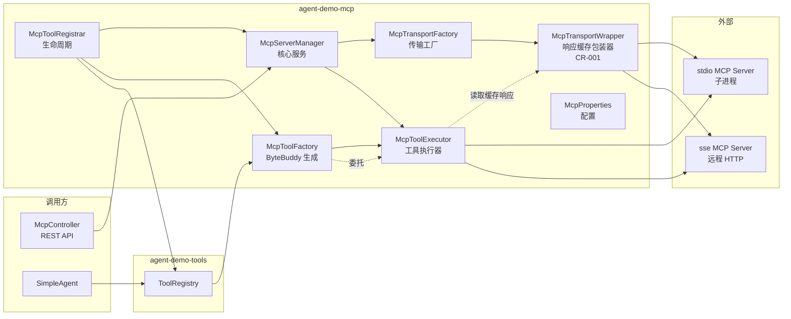
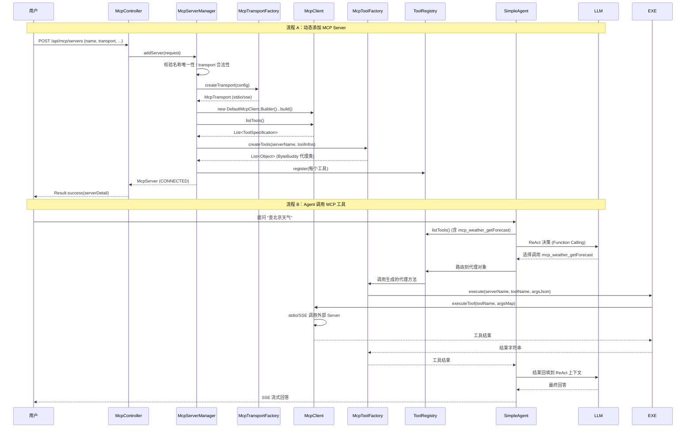
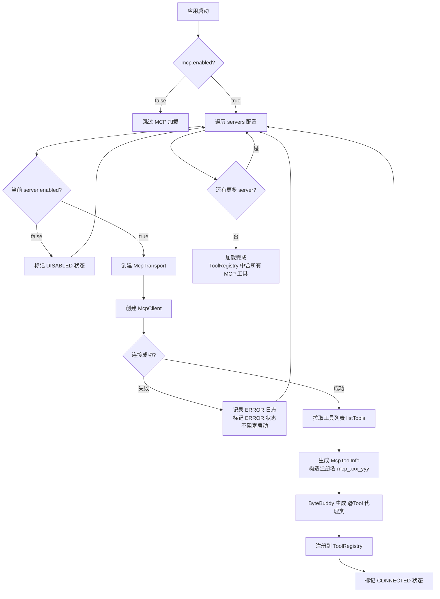
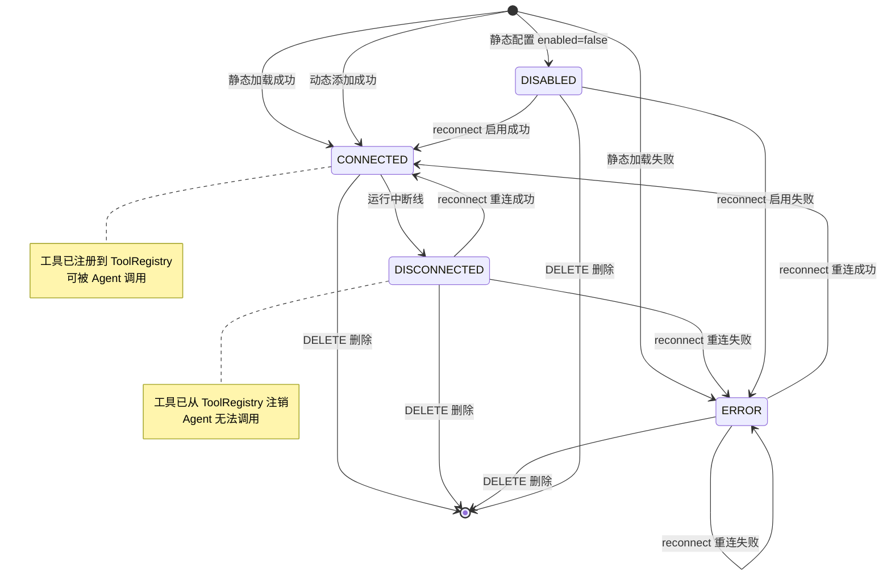
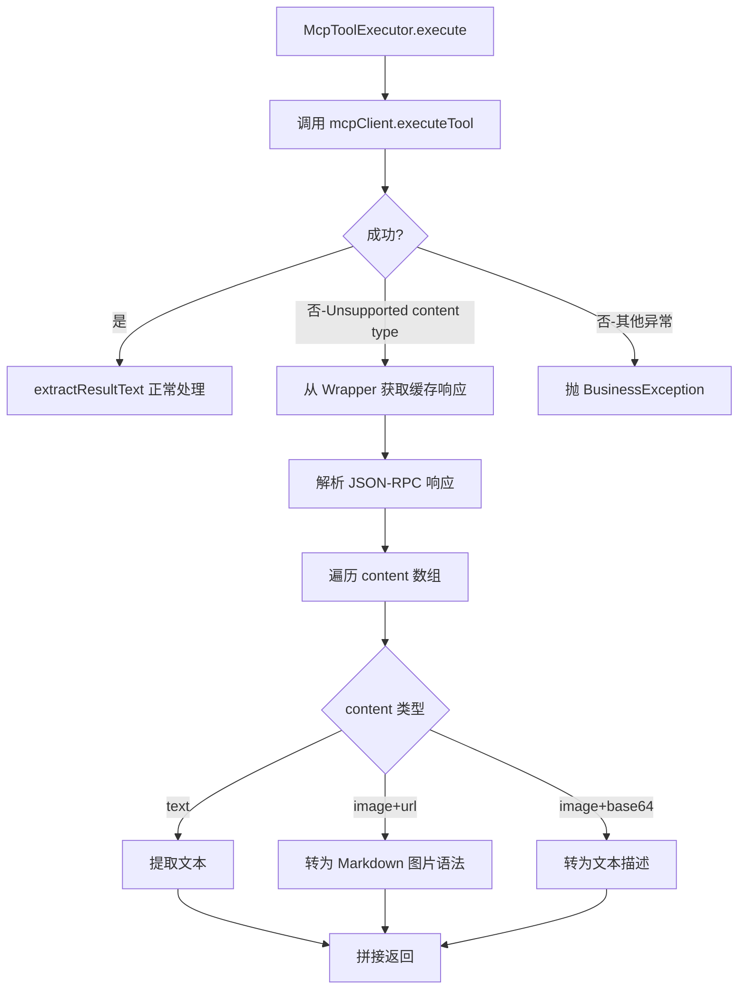
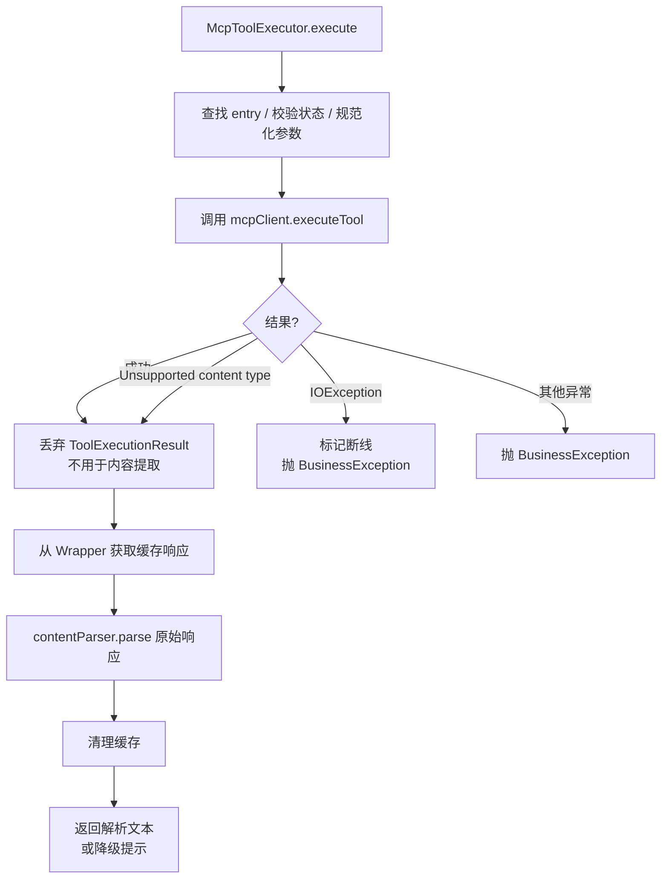

# 技术设计文档：MCP 协议模块

> **功能名称**：MCP 协议模块（agent-demo-mcp）
> **创建日期**：2026-08-05
> **阶段**：P2 架构与设计
> **关联需求**：`specs/features/2026-08-05/MCP协议模块/MCP协议模块.md`
> **关联守卫**：`specs/GUARDRAILS.md` 第 3.2 节 P2 阶段规则
> **依赖版本**：LangChain4j 1.17.2-beta27（langchain4j-mcp）、ByteBuddy 1.14.19

---

## 0. 设计概要 (Design Summary)

*   **功能描述**：为 Agent 提供 MCP（Model Context Protocol）客户端能力，支持通过 stdio / HTTP+SSE 双传输方式连接外部 MCP Server，自动发现工具并以 `mcp_{serverName}_{toolName}` 前缀注册到现有 `ToolRegistry`，使 Agent 通过 ReAct 循环自主调用外部 MCP 工具。
*   **影响范围**：
    *   **新增模块**：`agent-demo-mcp`（从空模块变为完整实现）
    *   **修改模块**：`agent-demo-common`（新增 5 个错误码）、`agent-demo-web`（新增 McpController + DTO）、`agent-demo-bootstrap`（application.yml 新增 `mcp.*` 段、pom 新增 mcp 依赖）
    *   **零修改模块**：`agent-demo-agent`（SimpleAgent 复用 lastToolCount 机制）、`agent-demo-tools`（ToolRegistry 已支持动态注册）
*   **技术难点**：
    1.  MCP 工具参数 Schema（JSON Schema）与 Java 强类型 @Tool 方法的桥接 — 采用统一 `String argsJson` 单参数方案（决策 2）
    2.  ByteBuddy 动态生成 @Tool 代理类，方法内部委托给 McpClient.executeTool — 参考 CR-003 KnowledgeBaseToolFactory 模式
    3.  MCP Server 状态机管理（4 种状态流转 + 断线工具自动注销）
*   **依赖关系**：
    *   **外部库**：`dev.langchain4j:langchain4j-mcp:1.17.2-beta27`（已在 BOM 声明）、`net.bytebuddy:byte-buddy:1.14.19`（已在 BOM 声明）
    *   **内部模块**：`agent-demo-common`、`agent-demo-tools`
    *   **被依赖方**：`agent-demo-app`（规划中，本期不修改）

---

## 1. 架构概览 (Architecture Overview)

### 1.1 模块交互关系



### 1.2 数据流向（从用户请求到工具调用结果）



### 1.3 模块内部分层

```
agent-demo-mcp/
├── config/                       # 配置层
│   └── McpProperties.java       # @ConfigurationProperties(prefix = "mcp")
├── entity/                       # 实体层
│   ├── McpServer.java            # Server 元数据
│   ├── McpServerStatus.java      # 状态枚举（CONNECTED/DISCONNECTED/ERROR/DISABLED）
│   ├── McpTransportType.java     # 传输方式枚举（STDIO/SSE）
│   └── McpToolInfo.java          # 工具元数据（原始名/注册名/描述/参数Schema）
├── client/                       # 客户端层
│   ├── McpTransportFactory.java  # 传输工厂（按 transport 类型创建 McpTransport）
│   ├── McpTransportWrapper.java  # Transport 包装器（CR-001：拦截缓存原始 JSON-RPC 响应）
│   └── McpClientEntry.java       # McpClient + Transport + 状态聚合对象
├── tool/                         # 工具集成层（核心）
│   ├── McpToolFactory.java       # ByteBuddy 生成 @Tool 代理类
│   ├── McpToolInterceptor.java   # ByteBuddy 方法拦截器
│   ├── McpToolExecutor.java      # 工具执行器（接收 serverName+toolName+argsJson）
│   └── McpToolRegistrar.java     # 生命周期管理（ApplicationRunner 启动批量注册）
├── service/                      # 服务层
│   └── McpServerManager.java     # 核心 Service（CRUD + 连接 + 状态机）
└── exception/                    # 异常层
    └── （复用 common 的 BusinessException + ErrorCode，无新增异常类）
```

**包命名规范**：`com.agentdemo.mcp.{config,entity,client,tool,service}`（参考项目 4.4 节包命名规范）

---

## 2. API 设计 (API Design)

> 遵循项目 RESTful 风格，参考 [RagController.java](file:///d:/project_demo/agent_demo/agent-demo-web/src/main/java/com/agentdemo/web/controller/RagController.java) 范式。

### 2.1 接口列表

| 接口名称 | 方法 | 路径 | 描述 | 对应 AC |
| :--- | :--- | :--- | :--- | :--- |
| 查询 Server 列表 | GET | `/api/mcp/servers` | 返回所有 MCP Server 及状态 | AC-007, AC-022 |
| 添加 Server | POST | `/api/mcp/servers` | 动态添加并立即连接 | AC-008, AC-015, AC-019, AC-021, AC-023, AC-024, AC-028 |
| 删除 Server | DELETE | `/api/mcp/servers/{name}` | 断开连接并注销工具 | AC-009, AC-020, AC-027 |
| 重连 Server | POST | `/api/mcp/servers/{name}/reconnect` | 重新连接已断线 Server | AC-010, AC-026 |
| 查询工具列表 | GET | `/api/mcp/servers/{name}/tools` | 返回 Server 暴露的工具 | AC-011, AC-020 |

### 2.2 接口详情

#### 接口 1：查询 Server 列表

*   **路径**：`GET /api/mcp/servers`
*   **描述**：返回所有已加载的 MCP Server 列表（含静态配置和动态添加的）
*   **鉴权**：无（项目无认证机制）
*   **Request**：无参数
*   **Response（成功）**：
    ```json
    {
      "success": true,
      "code": 200,
      "message": "成功",
      "data": [
        {
          "name": "weather",
          "transport": "STDIO",
          "status": "CONNECTED",
          "enabled": true,
          "toolCount": 2,
          "lastError": null,
          "connectTime": "2026-08-05T10:30:00",
          "lastActiveTime": "2026-08-05T10:35:00"
        }
      ],
      "traceId": "a1b2c3d4"
    }
    ```
*   **Response（模块禁用）**：
    ```json
    {
      "success": false,
      "code": 5405,
      "message": "MCP 模块已禁用",
      "data": null,
      "traceId": "a1b2c3d4"
    }
    ```

#### 接口 2：添加 Server

*   **路径**：`POST /api/mcp/servers`
*   **描述**：动态添加新 MCP Server 并立即建立连接、拉取工具、注册到 ToolRegistry
*   **Request Body**：
    ```json
    {
      "name": "weather",
      "transport": "STDIO",
      "enabled": true,
      "command": "node",
      "args": ["/path/to/weather-server.js"],
      "env": { "API_KEY": "xxx" },
      "url": null,
      "headers": null,
      "toolTimeout": "PT60S"
    }
    ```
*   **Response（成功）**：
    ```json
    {
      "success": true,
      "code": 200,
      "data": {
        "name": "weather",
        "transport": "STDIO",
        "status": "CONNECTED",
        "toolCount": 2,
        "connectTime": "2026-08-05T10:30:00"
      }
    }
    ```
*   **Response（失败 - 名称重复）**：HTTP 400，code=5402
    ```json
    { "success": false, "code": 5402, "message": "MCP Server 名称已存在: weather" }
    ```
*   **Response（失败 - 连接失败）**：HTTP 500，code=5400
    ```json
    { "success": false, "code": 5400, "message": "连接 MCP Server 失败: ..." }
    ```
*   **Response（失败 - 参数校验）**：HTTP 400，code=400
    ```json
    { "success": false, "code": 400, "message": "stdio 传输方式必须指定 command 字段" }
    ```
*   **异常处理**：
    *   名称重复 → `MCP_SERVER_NAME_EXISTS(5402)`
    *   transport 非法 → `MCP_TRANSPORT_UNSUPPORTED(5404)`
    *   stdio 缺 command → `PARAM_INVALID(400)`
    *   sse url 非法 → `PARAM_INVALID(400)`
    *   名称格式错误 → `PARAM_INVALID(400)`（Bean Validation @Pattern）
    *   连接失败 → `MCP_CONNECTION_FAILED(5400)`

#### 接口 3：删除 Server

*   **路径**：`DELETE /api/mcp/servers/{name}`
*   **描述**：断开 Server 连接、注销其所有工具、从内存移除
*   **Path 参数**：`name` — Server 名称
*   **Response（成功）**：`{ "success": true, "code": 200, "data": null }`
*   **Response（不存在）**：HTTP 404，code=5403
*   **并发处理**：若有正在执行的工具调用，工具调用方收到 `MCP_TOOL_CALL_FAILED(5401)` 异常（AC-027）

#### 接口 4：重连 Server

*   **路径**：`POST /api/mcp/servers/{name}/reconnect`
*   **描述**：重新连接已断线或处于 ERROR 状态的 Server
*   **Path 参数**：`name` — Server 名称
*   **Response（成功）**：返回更新后的 Server 详情（status=CONNECTED）
*   **Response（已连接）**：HTTP 400，code=5406
    ```json
    { "success": false, "code": 5406, "message": "MCP Server 已连接，无需重连: weather" }
    ```
*   **Response（不存在）**：HTTP 404，code=5403
*   **Response（连接失败）**：HTTP 500，code=5400

#### 接口 5：查询工具列表

*   **路径**：`GET /api/mcp/servers/{name}/tools`
*   **描述**：返回指定 Server 暴露的所有工具元数据
*   **Path 参数**：`name` — Server 名称
*   **Response（成功）**：
    ```json
    {
      "success": true,
      "code": 200,
      "data": [
        {
          "originalName": "getForecast",
          "registeredName": "mcp_weather_getForecast",
          "description": "查询指定城市天气预报",
          "parametersSchema": "{\"type\":\"object\",\"properties\":{\"city\":{\"type\":\"string\"}}}"
        }
      ]
    }
    ```
*   **Response（不存在）**：HTTP 404，code=5403

---

## 3. 数据存储设计 (Data Storage)

> **本项目无传统关系数据库**（参考 KNOWLEDGE_BASE.md 第 7 节）。MCP 模块采用**纯内存存储**，与 RAG 模块风格一致。

### 3.1 核心内存数据结构

| 数据结构 | 类型 | 所属类 | 用途 |
|---------|------|--------|------|
| `servers` | `ConcurrentHashMap<String, McpClientEntry>` | `McpServerManager` | Server 注册表，按 name 索引 |
| `mcpClient` | `McpClient`（LangChain4j） | `McpClientEntry` | MCP 客户端实例（每个 Server 一个） |
| `transport` | `McpTransport`（LangChain4j） | `McpClientEntry` | 传输对象（stdio/sse） |
| `tools` | `List<McpToolInfo>` | `McpClientEntry` | 该 Server 暴露的工具元数据列表 |
| `status` | `McpServerStatus`（枚举） | `McpClientEntry` | 当前连接状态 |

### 3.2 配置数据来源

| 配置来源 | 加载时机 | 持久化 | 重启行为 |
|---------|---------|--------|---------|
| `application.yml` 的 `mcp.servers` | 应用启动时（ApplicationRunner） | 不持久化 | 重启后自动重新加载 |
| REST API 动态添加 | API 调用时 | 仅内存 | 重启后丢失（BR-MCP-013） |

### 3.3 实体类设计

#### McpServer（Server 元数据）

```java
@Data
public class McpServer {
    private String name;                       // 唯一标识
    private McpTransportType transport;         // STDIO / SSE
    private boolean enabled = true;             // 是否启用
    // stdio 专用
    private String command;
    private List<String> args = new ArrayList<>();
    private Map<String, String> env = new HashMap<>();
    // sse 专用
    private String url;
    private Map<String, String> headers = new HashMap<>();
    // 通用
    private Duration toolTimeout;               // null 时使用全局默认
    // 运行时元数据
    private List<McpToolInfo> tools = new ArrayList<>();
    private LocalDateTime connectTime;
    private LocalDateTime lastActiveTime;
}
```

#### McpServerStatus（状态枚举）

```java
public enum McpServerStatus {
    CONNECTED,      // 已连接，工具可用
    DISCONNECTED,   // 已断线，工具已注销
    ERROR,          // 连接失败（静态加载或重连失败）
    DISABLED        // 配置 enabled=false，未连接
}
```

#### McpTransportType（传输方式枚举）

```java
public enum McpTransportType {
    STDIO,   // 本地子进程
    SSE      // 远程 HTTP+SSE
}
```

#### McpToolInfo（工具元数据）

```java
@Data
public class McpToolInfo {
    private String originalName;        // MCP Server 返回的原始工具名
    private String registeredName;      // 注册名：mcp_{serverName}_{originalName}
    private String description;         // 工具描述（来自 ToolSpecification）
    private String parametersSchema;    // 参数 JSON Schema（来自 ToolSpecification）
}
```

#### McpClientEntry（聚合对象）

```java
@Data
public class McpClientEntry {
    private final McpServer server;          // Server 元数据
    private McpClient mcpClient;             // LangChain4j 客户端
    private McpTransport transport;          // 传输对象
    private McpServerStatus status;          // 当前状态
    private String lastError;                // 失败原因（ERROR 状态时填充）
    
    /** 关闭客户端，释放资源（McpClient 实现了 AutoCloseable） */
    public void close() {
        if (mcpClient != null) {
            try {
                mcpClient.close();
            } catch (Exception e) {
                log.warn("关闭 McpClient 失败: {}", server.getName(), e);
            }
        }
    }
}
```

---

## 4. 核心逻辑与算法 (Core Logic)

### 4.1 静态配置加载流程（应用启动）

*   **触发条件**：应用启动后 `McpToolRegistrar.run()` 执行（实现 `ApplicationRunner`）
*   **处理步骤**：
    1. 检查 `mcpProperties.isEnabled()`，false 时跳过整个加载流程
    2. 遍历 `mcpProperties.getServers()` 静态配置列表
    3. 对每个 ServerConfig：
       - 转换为 `McpServer` 实体
       - 若 `enabled=false`：标记 `DISABLED` 状态，存入 `servers` Map，跳过连接
       - 否则调用 `McpServerManager.connect(server)` 建立连接
    4. `connect()` 内部：
       - 通过 `McpTransportFactory.createTransport()` 创建 `McpTransport`
       - 通过 `DefaultMcpClient.Builder().key(name).toolExecutionTimeout(timeout).transport(transport).build()` 创建 `McpClient`
       - 调用 `mcpClient.listTools()` 拉取工具列表
       - 转换 `ToolSpecification` 为 `McpToolInfo`（构造注册名 `mcp_{name}_{toolName}`）
    5. 连接成功后调用 `McpToolRegistrar.registerTools(server)` 注册工具
    6. 单个 Server 加载失败时记录 ERROR 日志、标记 `ERROR` 状态、跳过，**不抛出异常**（不阻塞应用启动，参考 BR-MCP-009）

*   **Mermaid 流程图**：


### 4.2 动态添加 Server 流程

*   **触发条件**：API 调用方发起 `POST /api/mcp/servers`
*   **处理步骤**：
    1. Bean Validation 校验 name 格式（`@Pattern`）、必填字段
    2. 业务校验 name 全局唯一性（含 DISABLED 状态的 Server），重复抛 `MCP_SERVER_NAME_EXISTS(5402)`
    3. 业务校验 transport 配置完整性：
       - STDIO 必须 command 非空
       - SSE 必须 url 合法（HTTP/HTTPS）
    4. 调用 `McpServerManager.connect(server)`（与静态加载相同）
    5. 连接失败时抛 `MCP_CONNECTION_FAILED(5400)` 业务异常（与静态加载不同，必须反馈给调用方，参考 BR-MCP-010）
    6. 连接成功后注册工具到 ToolRegistry
    7. 返回 Server 详情（含工具数量）

### 4.3 MCP 工具生成与调用机制（核心算法）

*   **触发条件**：MCP Server 连接成功后，遍历 `mcpClient.listTools()` 返回的 `ToolSpecification` 列表
*   **处理步骤**：
    1. 对每个 ToolSpecification，构造 `McpToolInfo`：
       - `originalName = spec.name()`
       - `registeredName = "mcp_" + serverName + "_" + spec.name()`
       - `description = spec.description()`
       - `parametersSchema = toJson(spec.parameters())`（JsonSchema 序列化为字符串）
    2. 调用 `McpToolFactory.createTool(serverName, toolInfo)` 生成 ByteBuddy 代理类：
       - 类名：`com.agentdemo.mcp.tool.McpTool_{serverName}_{toolName}`
       - 方法名：`mcp_{serverName}_{toolName}`（与 registeredName 一致）
       - 方法签名：`String {methodName}(String argsJson)`
       - 方法上的 `@Tool` 注解描述包含：Server 名 + 工具描述 + 参数 JSON Schema
       - 方法实现：`MethodDelegation.to(new McpToolInterceptor(serverName, originalName, toolExecutor))`
    3. `McpToolInterceptor.execute(@AllArguments Object[] args)` 接收 argsJson
    4. 委托给 `McpToolExecutor.execute(serverName, originalName, argsJson)`
    5. `McpToolExecutor` 内部：
       - 从 `McpServerManager.getEntry(serverName)` 获取 `McpClientEntry`
       - 检查状态是否 `CONNECTED`，否则抛 `MCP_TOOL_CALL_FAILED(5401)`
       - 解析 argsJson 为 `Map<String, Object>`（使用 `JsonUtils.fromJson`）
       - 调用 `mcpClient.executeTool(originalName, argsMap)`
       - 返回结果字符串
    6. 异常处理：
       - 超时异常 → `MCP_TOOL_CALL_FAILED(5401)` "工具调用超时"
       - 连接断开异常 → 标记 `DISCONNECTED` + 注销工具 + 抛 `MCP_TOOL_CALL_FAILED(5401)`

*   **ByteBuddy 生成代码伪示例**（参考 [KnowledgeBaseToolFactory.java:60-72](file:///d:/project_demo/agent_demo/agent-demo-rag/src/main/java/com/agentdemo/rag/retriever/KnowledgeBaseToolFactory.java#L60-L72)）：
    ```java
    Class<?> toolClass = new ByteBuddy()
        .subclass(Object.class)
        .name("com.agentdemo.mcp.tool.McpTool_" + serverName + "_" + toolName)
        .defineMethod("mcp_" + serverName + "_" + toolName, String.class, Modifier.PUBLIC)
        .withParameter(String.class, "argsJson")
        .intercept(MethodDelegation.to(new McpToolInterceptor(serverName, toolName, toolExecutor)))
        .annotateMethod(AnnotationDescription.Builder.ofType(Tool.class)
            .defineArray("value", buildToolDescription(serverName, toolInfo))
            .build())
        .make()
        .load(getClass().getClassLoader())
        .getLoaded();
    ```

### 4.4 Server 状态机



**状态转换触发动作**：
- 进入 `CONNECTED`：调用 `registerTools()` 注册工具
- 离开 `CONNECTED`（→ DISCONNECTED/ERROR/删除）：调用 `unregisterTools()` 注销工具
- 进入 `DISCONNECTED`/`ERROR`：记录 `lastError` 字段

### 4.5 删除 Server 流程（含并发处理）

*   **触发条件**：API 调用方发起 `DELETE /api/mcp/servers/{name}`
*   **处理步骤**：
    1. 从 `servers` Map 中移除 entry（`remove` 操作原子）
    2. 若不存在 → 抛 `MCP_SERVER_NOT_FOUND(5403)`
    3. 调用 `McpToolRegistrar.unregisterTools(name, entry.getTools())` 注销所有工具
    4. 调用 `entry.close()` 关闭 McpClient（释放子进程或 HTTP 连接）
*   **并发场景（AC-027）**：
    - 若此时有正在执行的工具调用（在 McpToolExecutor 中），McpClient.close() 会触发 IOException
    - McpToolExecutor 捕获异常后抛 `MCP_TOOL_CALL_FAILED(5401)` "MCP Server 已断开"
    - Agent 接收异常信息，由 LLM 决定是否重试或换工具

### 4.6 非文本内容处理机制（CR-001 扩展）

*   **触发条件**：MCP Server 返回包含 `ImageContent` 等非文本内容类型的响应
*   **问题根因**：`DefaultMcpClient.executeTool()` 内部调用 `ToolExecutionHelper.extractResult()` 处理 MCP 响应，该方法遇到 `ImageContent` 类型时抛出 `Unsupported content type: "image"` 异常，**在返回 `ToolExecutionResult` 之前就已失败**，导致 `McpToolExecutor.extractResultText()` 方法永远无法被执行
*   **解决方案**：McpTransportWrapper 拦截原始响应

#### 4.6.1 McpTransportWrapper 设计

*   **职责**：包装 `McpTransport` 实例，透明代理所有方法调用，同时拦截工具调用响应进行缓存
*   **实现要点**：
    1. 实现 `McpTransport` 接口，持有原始 `delegate` Transport 对象
    2. 所有接口方法直接委托给 `delegate` 执行（`delegate.method(args)`）
    3. 对工具调用相关的方法（如 `executeRequest`），在委托前后的 hook 中缓存原始 JSON-RPC 响应字符串
    4. 提供 `getLastRawResponse()` 方法供 `McpToolExecutor` 在 catch 块中检索
    5. 缓存使用 `ThreadLocal` 或请求作用域变量，避免并发问题

#### 4.6.2 集成方式

```
McpTransportFactory.createTransport()
    ↓ 创建原始 Transport (Stdio/Http/StreamableHttp)
    ↓ 用 McpTransportWrapper 包装
    ↓ 返回 Wrapper 给 McpServerManager
McpServerManager.createMcpClient()
    ↓ 使用 Wrapper 作为 transport 传给 DefaultMcpClient.Builder
    ↓ McpClient 内部通过 Wrapper 调用原始 Transport
McpClientEntry
    ↓ 存储 Wrapper 引用（通过 getTransport() 可获取）
McpToolExecutor.execute()
    ↓ 正常路径：mcpClient.executeTool() 成功 -> extractResultText()
    ↓ 异常路径：捕获 "Unsupported content type" -> 从 Wrapper 缓存提取图片信息
```

#### 4.6.3 原始响应解析逻辑

当 `executeTool()` 抛出 `Unsupported content type` 异常时，`McpToolExecutor` 执行以下步骤：

1. 从 `McpClientEntry` 获取 `McpTransportWrapper` 实例
2. 调用 `wrapper.getLastRawResponse()` 获取原始 JSON-RPC 响应字符串
3. 解析 JSON-RPC 响应，提取 `result.content` 数组
4. 遍历 content 数组，按类型处理：
   - `type=text` -> 提取 `text` 字段
   - `type=image` + `url` 字段 -> 转为 Markdown 格式 ``
   - `type=image` + `data` 字段（base64） -> 转为文本描述 `[图片] 已生成 {mimeType} 格式图片，base64 数据长度: {length} 字符`
5. 拼接所有内容返回给 LLM

*   **Mermaid 流程图**：


---

### 4.7 输出解析结构化重构（CR-002）

> **注意**：本节描述的 CR-002 重构方案**取代**了 Section 4.6 中 CR-001 的"异常驱动双重解析"路径。Section 4.6 的 Wrapper 缓存机制仍然有效，但 `McpToolExecutor` 中的 `extractResultText()` 和 `extractFromRawResponse()` 被 `McpContentParser` 统一解析替代。

#### 4.7.1 重构动机

CR-001 的非文本内容处理存在以下结构性缺陷：

1. **异常驱动控制流**：非文本内容是 MCP 协议的正常返回类型，但当前设计通过 catch 块触发处理，控制流与业务语义错位
2. **双重解析路径违反 DRY**：`extractResultText()` 和 `extractFromRawResponse()` 有近乎相同的 IMAGE 处理逻辑
3. **耦合 LangChain4j 内部行为**：依赖 `ToolExecutionHelper.extractResult()` 抛出 `Unsupported content type` 异常这一实现细节
4. **协议覆盖不完整**：仅处理 text + image，缺少 audio / embeddedResource / structuredContent / 未知类型

#### 4.7.2 McpContentParser 设计

**职责**：将原始 JSON-RPC 响应字符串解析为 LLM 可消费的文本，按内容类型策略分发。

**设计模式**：单类方法分发（参考 Dify 单类模式，非策略模式多类）

```java
@Slf4j
@Component
public class McpContentParser {

    private final ObjectMapper objectMapper = new ObjectMapper();

    /**
     * 解析原始 JSON-RPC 响应为 LLM 可消费的文本
     *
     * @param rawResponse 原始 JSON-RPC 响应字符串（来自 McpTransportWrapper 缓存）
     * @return 解析后的文本；无法解析时返回 null
     */
    public String parse(String rawResponse) {
        // 1. JSON 解析 -> root
        // 2. 提取 result.content 数组 + result.isError 标记
        // 3. 遍历 content[]，按 type 分发到各处理器
        // 4. 检查 result.structuredContent（若有）
        // 5. isError=true 时添加 [工具错误] 前缀
        // 6. 聚合返回
    }

    // ============ 内容类型处理器 ============

    /** 文本内容：直接提取 text 字段 */
    private String processText(JsonNode content) { ... }

    /** 图片内容：URL -> Markdown 图片语法；base64 -> 文本描述 */
    private String processImage(JsonNode content) { ... }

    /** 音频内容：返回文本描述（对话中无法播放音频） */
    private String processAudio(JsonNode content) { ... }

    /** 内嵌资源：TextResourceContents -> 提取文本；BlobResourceContents -> 描述 */
    private String processResource(JsonNode content) { ... }

    /** 结构化输出：序列化为 JSON 文本 */
    private String processStructuredContent(JsonNode structuredContent) { ... }

    /** 未知类型：记录 WARNING 日志，返回空（静默跳过） */
    private String processUnknown(String type, JsonNode content) { ... }
}
```

#### 4.7.3 内容类型处理矩阵

| MCP 内容类型 | JSON 结构 | 处理策略 | 输出示例 |
|:---|:---|:---|:---|
| TextContent | `{"type":"text","text":"..."}` | 直接提取 text | `北京今天晴，25°C` |
| ImageContent (URL) | `{"type":"image","url":"https://..."}` | Markdown 图片语法 | `` |
| ImageContent (base64) | `{"type":"image","data":"base64...","mimeType":"image/png"}` | 文本描述 | `[图片] 已生成 image/png 格式图片，base64 数据长度: 12345 字符` |
| AudioContent | `{"type":"audio","data":"base64...","mimeType":"audio/wav"}` | 文本描述 | `[音频] 已生成 audio/wav 格式音频，base64 数据长度: 67890 字符` |
| EmbeddedResource (Text) | `{"type":"resource","resource":{"text":"..."}}` | 提取 resource.text | `（资源内容文本）` |
| EmbeddedResource (Blob) | `{"type":"resource","resource":{"blob":"base64...","mimeType":"..."}}` | 文本描述 | `[资源] application/pdf 格式二进制资源，base64 数据长度: 54321 字符` |
| structuredContent | `result.structuredContent: {...}` | JSON 序列化 | `{"key":"value","count":42}` |
| 未知类型 | `{"type":"future_type",...}` | 静默跳过 + WARNING | （不产出） |
| isError=true | `result.isError: true` | 内容前缀 `[工具错误]` | `[工具错误] 参数无效` |

> **与 Dify 方案的关键差异**：Dify 有文件存储系统（ToolFileManager），可将二进制内容落盘生成 URL。本项目是纯内存学习项目，无文件存储，因此二进制内容（image base64 / audio / blob resource）返回**文本描述**而非文件 URL。只有 image URL 类型可转为 Markdown 图片语法（URL 指向外部资源）。

#### 4.7.4 重构后 McpToolExecutor 控制流



**关键变更**：
- `executeTool()` 的返回值 `ToolExecutionResult` 被**有意丢弃**，仅用于触发 MCP 协议交换
- `Unsupported content type` 异常被视为**预期行为**（非文本内容的正常返回），不作为错误处理
- 所有内容类型（包括纯文本）统一从 Wrapper 缓存的原始响应解析
- `extractResultText()` 和 `extractFromRawResponse()` 方法被删除，替换为 `parseFromWrapper()` + `McpContentParser.parse()`

#### 4.7.5 关键设计决策

| 决策 | 选择 | 理由 |
|:---|:---|:---|
| 解析器架构 | 单类方法分发（非策略模式多类） | MCP 内容类型是有限集合（6 种），不会频繁新增；与 Dify 参考方案一致；KISS 原则 |
| executeTool 返回值 | 丢弃，统一从缓存解析 | 真正的单一解析路径，消除 DRY 违反；"重复解析"代价极小（O(1) 字符串提取） |
| Wrapper 缓存 | 不修改（AtomicReference 保持不变） | CR-001 已验证跨线程可见性；MCP 工具调用同步阻塞，无并发覆盖风险 |
| JSON 嗅探 | 不实现 | 本项目所有内容最终转为字符串返回 LLM，text/JSON 对 LLM 是相同字符串，嗅探无价值 |
| isError 处理 | `[工具错误]` 前缀 | 帮助 LLM 区分正常结果与工具业务错误，优化 ReAct 决策 |

---

## 5. 异常处理 (Error Handling)

| 异常场景 | 对应 AC | 处理方案 | 错误码 | HTTP 状态 |
| :--- | :--- | :--- | :--- | :--- |
| 静态 Server 启动连接失败 | AC-014 | 记录 ERROR 日志，标记状态 `ERROR`，跳过，不阻塞启动 | - (内部) | - |
| 动态添加 Server 连接失败 | AC-015 | 抛 `MCP_CONNECTION_FAILED`，不污染 ToolRegistry | 5400 | 500 |
| 已连接 Server 运行中断线 | AC-016 | 工具调用时检测到异常，调用 `markDisconnected()`，记录 WARN 日志 | - (内部) | - |
| 断线 Server 工具自动注销 | AC-017 | `markDisconnected()` 内部调用 `unregisterTools()`，触发 SimpleAgent delegate 重建 | - (内部) | - |
| MCP 工具调用超时 | AC-018 | McpClient 内置 `toolExecutionTimeout` 触发超时异常，包装为 `MCP_TOOL_CALL_FAILED` | 5401 | 500 |
| 重复添加同名 Server | AC-019 | `McpServerManager.addServer()` 校验名称唯一性（含所有状态） | 5402 | 400 |
| 操作不存在的 Server | AC-020 | DELETE/reconnect/tools 接口校验存在性 | 5403 | 404 |
| transport 值非 stdio/sse | AC-021 | `McpTransportFactory.createTransport()` 抛 `MCP_TRANSPORT_UNSUPPORTED` | 5404 | 400 |
| `mcp.enabled=false` 时模块不加载 | AC-022 | ApplicationRunner 跳过；所有 REST API 拦截返回 `MCP_MODULE_DISABLED` | 5405 | 400 |
| stdio 模式 command 字段为空 | AC-023 | `CreateMcpServerRequest` 中按 transport 条件校验（自定义 Validator） | 400 (PARAM_INVALID) | 400 |
| sse 模式 url 字段非法 | AC-024 | `CreateMcpServerRequest` 中校验 URL 协议为 HTTP/HTTPS | 400 (PARAM_INVALID) | 400 |
| 不同 Server 同名工具 | AC-025 | 工具名前缀 `mcp_{serverName}_` 隔离，天然不冲突 | - (无需处理) | - |
| 重连已 CONNECTED Server | AC-026 | `reconnect()` 校验当前状态，已连接时抛 `MCP_SERVER_ALREADY_CONNECTED` | 5406 | 400 |
| 删除时正在执行工具调用 | AC-027 | `entry.close()` 触发调用方 IOException，包装为 `MCP_TOOL_CALL_FAILED` | 5401 | - |
| Server 名称格式错误 | AC-028 | Bean Validation `@Pattern(regexp = "^[\\u4e00-\\u9fa5a-zA-Z0-9_-]{1,50}$")` | 400 (PARAM_INVALID) | 400 |
| Server 名称超长 | AC-028 | Bean Validation `@Size(max = 50)` | 400 (PARAM_INVALID) | 400 |
| MCP 工具返回非文本内容（CR-001） | AC-036~038 | `McpToolExecutor` catch 块捕获 `Unsupported content type` 异常，从 `McpTransportWrapper` 缓存的原始 JSON-RPC 响应中提取图片 URL/base64 信息，以 Markdown 格式返回 | - (内部处理) | - |
| Transport 包装器回归（CR-001） | AC-040 | `McpTransportWrapper` 透明代理所有方法，仅缓存响应不改行为 | - (无影响) | - |

### 5.1 错误码新增

在 [ErrorCode.java:65-66](file:///d:/project_demo/agent_demo/agent-demo-common/src/main/java/com/agentdemo/common/exception/ErrorCode.java#L65-L66) 的 MCP 区间（5400-5499）新增：

```java
// MCP 相关错误（5400-5499）
MCP_CONNECTION_FAILED(5400, "MCP 连接失败"),
MCP_TOOL_CALL_FAILED(5401, "MCP 工具调用失败"),
MCP_SERVER_NAME_EXISTS(5402, "MCP Server 名称已存在"),
MCP_SERVER_NOT_FOUND(5403, "MCP Server 不存在"),
MCP_TRANSPORT_UNSUPPORTED(5404, "不支持的传输方式"),
MCP_MODULE_DISABLED(5405, "MCP 模块已禁用"),
MCP_SERVER_ALREADY_CONNECTED(5406, "MCP Server 已连接，无需重连"),
```

---

## 6. 安全与性能 (Security & Performance)

### 6.1 安全考虑

*   **API Key 保护**：MCP Server 配置中的 `env.API_KEY` 和 `headers.Authorization` 通过配置文件注入，**禁止明文打印到日志**（参考 BR-SEC-001）。日志中仅打印 Server name 和 transport 类型，不打印 command/url/headers 等敏感字段
*   **stdio 命令执行风险**：stdio 模式会启动子进程执行 `command`，存在命令注入风险。本期作为学习示例不实现沙箱，但**用户必须自行确保 command 路径可信**（生产环境应增加命令白名单）
*   **SSE URL SSRF 防护**：本期作为学习示例不实现 SSRF 校验（与项目 HttpTool 风格一致，但 MCP Server 是用户主动配置的可信端点，类似数据库连接）
*   **资源释放**：McpClient 实现 AutoCloseable，删除 Server 时必须调用 close() 释放子进程或 HTTP 连接，避免资源泄漏

### 6.2 性能考虑

*   **McpClient 缓存**：每个 Server 对应一个 McpClient 实例（长期持有），不重复创建
*   **ByteBuddy 类加载**：动态生成的代理类存入 JVM Metaspace，**风险**：大量 Server + 工具可能占用 Metaspace。本期作为学习示例不实现类卸载，建议 Server 总数 < 20，单 Server 工具数 < 50
*   **工具调用超时**：默认 60s（与 LLM 调用一致），防止单次工具调用阻塞 Agent ReAct 循环
*   **连接初始化**：静态 Server 加载在 ApplicationRunner 中同步执行，**可能延长启动时间**。建议 Server 数量 < 10，单个 Server 连接超时由 MCP SDK 控制

### 6.3 限流策略

本期不实现限流（项目无认证机制，参考 RAG 模块风格）

---

## 7. 验收标准映射 (AC Mapping)

> 确保 35 条 AC 全部有对应技术实现，无遗漏。

| AC ID | 验收标准描述 | 对应技术实现 |
| :--- | :--- | :--- |
| AC-001 | 应用启动加载 MCP 静态配置 | `McpToolRegistrar.run()` + `McpProperties.servers` |
| AC-002 | stdio 传输方式建立子进程连接 | `McpTransportFactory.createTransport()` → `StdioMcpTransport.Builder()` |
| AC-003 | HTTP+SSE 传输方式建立远程连接 | `McpTransportFactory.createTransport()` → `HttpMcpTransport.Builder()` |
| AC-004 | 连接成功后拉取工具列表 | `McpClient.listTools()` |
| AC-005 | 工具按前缀规则注册到 ToolRegistry | `McpToolFactory` 生成 `mcp_{serverName}_{toolName}` + `ToolRegistry.register()` |
| AC-006 | 静态 Server 加载完成后触发 delegate 重建 | SimpleAgent `lastToolCount` 检测（**零修改**） |
| AC-007 | GET /api/mcp/servers 返回 Server 列表 | `McpController.list()` + `McpServerManager.list()` |
| AC-008 | POST /api/mcp/servers 动态添加 Server | `McpController.add()` + `McpServerManager.addServer()` |
| AC-009 | DELETE /api/mcp/servers/{name} 删除并注销工具 | `McpController.delete()` + `McpServerManager.deleteServer()` + `unregisterTools()` |
| AC-010 | POST /api/mcp/servers/{name}/reconnect 重连 | `McpController.reconnect()` + `McpServerManager.reconnect()` |
| AC-011 | GET /api/mcp/servers/{name}/tools 查询工具 | `McpController.listTools()` + `McpClientEntry.getTools()` |
| AC-012 | Agent 通过 Function Calling 调用 MCP 工具 | LangChain4j AiServices 自动通过 ToolRegistry 选择工具 |
| AC-013 | MCP 工具调用结果回填到 ReAct 循环 | LangChain4j ReAct 内置机制 |
| AC-014 | 静态 Server 连接失败不阻塞应用启动 | `McpToolRegistrar.run()` try-catch 单 Server 失败 |
| AC-015 | 动态添加 Server 连接失败返回 5400 | `McpServerManager.addServer()` 抛 `MCP_CONNECTION_FAILED` |
| AC-016 | 已连接 Server 断线标记 DISCONNECTED | `McpServerManager.markDisconnected()` |
| AC-017 | 断线 Server 工具自动注销 | `markDisconnected()` 内部调用 `unregisterTools()` |
| AC-018 | MCP 工具调用超时返回 5401 | `DefaultMcpClient.Builder().toolExecutionTimeout()` + `McpToolExecutor` 异常包装 |
| AC-019 | 重复添加同名 Server 返回 5402 | `addServer()` 校验唯一性 |
| AC-020 | 操作不存在的 Server 返回 5403 | DELETE/reconnect/tools 接口校验 |
| AC-021 | transport 值非 stdio/sse 返回 5404 | `McpTransportFactory.createTransport()` 抛 `MCP_TRANSPORT_UNSUPPORTED` |
| AC-022 | mcp.enabled=false 时模块不加载 | `McpToolRegistrar.run()` 检查 enabled；`McpController` 拦截返回 `MCP_MODULE_DISABLED` |
| AC-023 | stdio 模式 command 字段为空校验失败 | `CreateMcpServerRequest` 自定义 Validator（按 transport 条件校验） |
| AC-024 | sse 模式 url 字段非法校验失败 | `CreateMcpServerRequest` 自定义 Validator（校验 HTTP/HTTPS 协议） |
| AC-025 | 不同 Server 同名工具前缀隔离 | `McpToolFactory` 工具名前缀 `mcp_{serverName}_` 天然隔离 |
| AC-026 | 重连已 CONNECTED Server 返回 5406 | `reconnect()` 校验当前状态 |
| AC-027 | 删除 Server 时正在执行的工具调用优雅失败 | `entry.close()` 触发调用方异常 + `McpToolExecutor` 包装为 5401 |
| AC-028 | Server 名称长度与字符规则 | `@Pattern(regexp="^[\\u4e00-\\u9fa5a-zA-Z0-9_-]{1,50}$")` + `@Size(max=50)` |
| AC-029 | Server 名称全局唯一 | `addServer()` 校验（含所有状态） |
| AC-030 | 工具调用超时默认 60s 可覆盖 | `McpProperties.defaultToolTimeout` + 单 Server `toolTimeout` 覆盖 |
| AC-031 | 工具名加前缀 mcp_{serverName}_{toolName} | `McpToolFactory.createTool()` 命名规则 |
| AC-032 | 静态 Server enabled=false 时跳过 | `McpToolRegistrar.run()` 检查 `serverConfig.isEnabled()` |
| AC-033 | 动态添加的 Server 仅存内存重启丢失 | 内存 `ConcurrentHashMap` 存储，无持久化层 |
| AC-034 | MCP Server 状态枚举完整 | `McpServerStatus` 枚举 4 个值 |
| AC-035 | 配置同时支持 stdio 和 sse 两种传输方式 | `McpTransportFactory` 按 `transport` 字段路由 |
| AC-041 | 系统统一从原始 JSON-RPC 响应解析所有内容类型 | `McpToolExecutor.parseFromWrapper()` + `McpContentParser.parse()`（CR-002） |
| AC-042 | 系统支持 AudioContent 类型内容处理 | `McpContentParser.processAudio()`（CR-002） |
| AC-043 | 系统支持 EmbeddedResource 内容类型处理 | `McpContentParser.processResource()`（CR-002） |
| AC-044 | 系统支持 structuredContent 结构化输出处理 | `McpContentParser.processStructuredContent()`（CR-002） |
| AC-045 | 系统对未知内容类型静默跳过不崩溃 | `McpContentParser.processUnknown()`（CR-002） |

---

## 8. 技术决策说明 (Technical Decisions)

### 决策 1：MCP 工具集成方式 — ByteBuddy 生成 @Tool 代理类注册到 ToolRegistry

*   **选择方案**：A — 使用 ByteBuddy 生成 `@Tool` 代理类注册到 `ToolRegistry`（参考 [KnowledgeBaseToolFactory.java](file:///d:/project_demo/agent_demo/agent-demo-rag/src/main/java/com/agentdemo/rag/retriever/KnowledgeBaseToolFactory.java) CR-003 模式）
*   **备选方案**：
    *   B：使用 LangChain4j 原生 `McpToolProvider` + `AiServices.toolProvider()`（不进 ToolRegistry）
    *   C：混合方案（ToolRegistry + McpToolProvider 双轨）
*   **理由**：
    1. 严格符合需求文档 AC-005（避免需求回改）
    2. 复用 CR-003 已验证的 ByteBuddy 动态 Tool 模式，技术风险低
    3. SimpleAgent 零修改，遵循 BR-AGT-003 已有的 `lastToolCount` 重建机制
    4. 工具调用链路统一（本地工具 + RAG 知识库工具 + MCP 工具走同一套 ToolRegistry）
    5. 与 RAG 知识库动态 Tool 设计风格完全对称，降低学习认知负担

### 决策 2：MCP 工具方法签名 — 统一单参数 `String execute(String argsJson)`

*   **选择方案**：A — 所有 MCP 工具统一为单参数 `String execute(String argsJson)`
*   **备选方案**：
    *   B：根据 MCP 工具 inputSchema 动态生成多参数强类型方法
    *   C：单参数 `String execute(String toolName, String argsJson)`（方法名固定）
*   **理由**：
    1. KISS 原则，ByteBuddy 生成逻辑与 KnowledgeBaseToolFactory 几乎一致（仅参数名从 query 改为 argsJson）
    2. MCP 工具参数 schema 复杂多样（含 object/array 嵌套），动态生成强类型 Java 方法技术风险高
    3. @Tool 描述中包含完整 JSON Schema，LLM 可理解参数格式
    4. 适配所有 MCP 工具的 inputSchema（无论简单复杂），无需为每个工具单独处理
    5. 与 LangChain4j ToolSpecifications 反射机制兼容

### 决策 3：MCP 工具调用超时控制 — 使用 McpClient 内置 toolExecutionTimeout

*   **选择方案**：A — 使用 LangChain4j 原生 `DefaultMcpClient.Builder().toolExecutionTimeout(Duration)`
*   **备选方案**：
    *   B：在 `McpToolExecutor` 中包装 Future + 超时取消
*   **理由**：
    1. LangChain4j 1.0+ 原生支持，配置简单（Builder 链式调用）
    2. 与项目 LLM 模块"超时由底层 SDK 管理"风格一致（参考 `ark.coding-plan.timeout`）
    3. 不引入额外线程池，符合 KISS
    4. 单 Server 可通过配置 `tool-timeout` 覆盖全局默认 `default-tool-timeout`

### 决策 4：传输方式选择 — stdio + HttpSseMcpTransport（旧版 HTTP/SSE）

*   **选择方案**：使用 `StdioMcpTransport` + `HttpMcpTransport`（旧版 HTTP/SSE，sseUrl 配置）
*   **备选方案**：使用 `StreamableHttpMcpTransport`（新版 2025-06-18 规范）
*   **理由**：
    1. 旧版 HttpMcpTransport API 更稳定，社区示例多
    2. 配置更简单（仅需 sseUrl 单一字段），符合需求文档 AC-003 描述
    3. StreamableHttpMcpTransport 是新版规范，部分 MCP Server 尚未适配
    4. 后续 CR 可平滑升级到 StreamableHttpMcpTransport（Builder API 兼容）

### 决策 5：配置结构 — 统一配置 + 类型字段

*   **选择方案**：C — 单一 ServerConfig 对象，按 `transport` 字段条件生效对应字段
*   **备选方案**：
    *   A：扁平结构（所有字段平铺）
    *   B：按传输方式分组（stdio: {...}, sse: {...}）
*   **理由**：
    1. 一个 Server 只能用一种传输方式，分组会让 YAML 出现互斥块，校验复杂
    2. 与项目已有的 `ark.coding-plan` 配置风格一致（扁平 + 类型字段路由）
    3. 字段名与 LangChain4j Builder 参数对齐（command/args/env/url/headers），降低学习成本

---

## 9. 风险与注意事项 (Risks & Notes)

### 9.1 技术风险

| 风险点 | 影响 | 缓解方案 |
|--------|------|---------|
| ByteBuddy 动态生成大量类占用 Metaspace | 大量 Server + 工具时 OOM | 文档建议 Server 总数 < 20，单 Server 工具数 < 50；监控 Metaspace |
| McpClient.close() 资源释放失败 | 子进程残留 / HTTP 连接泄漏 | close() 内部 try-catch，记录 WARN 日志，不阻塞主流程 |
| stdio 子进程管理 | 子进程崩溃导致 Server 不可用 | 状态机管理 + reconnect 接口恢复 |
| SSE 长连接稳定性 | 网络波动导致连接断开 | markDisconnected 机制 + reconnect 接口 |
| LangChain4j 1.17.2-beta27 API 不稳定 | beta 版本可能 API 变更 | 锁定 BOM 版本，封装 McpTransportFactory 隔离 API 变化 |

### 9.2 兼容性

*   **对现有功能零影响**：MCP 模块完全独立，`mcp.enabled=false` 时不加载任何组件，不影响 Agent 现有对话能力
*   **对 SimpleAgent 零修改**：复用 `lastToolCount` 检测机制，MCP 工具增删自动触发 delegate 重建
*   **对 ToolRegistry 零修改**：使用现有 `register()` / `unregisterTool()` API
*   **对 RAG 模块零影响**：MCP 工具与 RAG 知识库工具命名空间隔离（`mcp_` vs `kb_` 前缀）

### 9.3 性能影响

*   **应用启动**：静态 Server 加载在 ApplicationRunner 同步执行，每个 Server 连接约 1-3 秒，建议 Server 数量 < 10
*   **运行时**：MCP 工具调用走网络/子进程，受 MCP Server 响应速度影响，超时 60s 兜底
*   **内存**：每个 McpClient 持有连接资源，建议定期清理长期不用的动态 Server

### 9.4 回滚方案

*   **配置回滚**：`application.yml` 中 `mcp.enabled=false` 即可完全禁用 MCP 模块
*   **代码回滚**：删除 `agent-demo-mcp/src/main/java/com/agentdemo/mcp/` 包，移除 web 模块的 `McpController`，移除 `application.yml` 中 `mcp.*` 段
*   **数据回滚**：无持久化数据，重启即清空（动态 Server 内存存储）

### 9.5 实施注意事项

1. **langchain4j-mcp 依赖添加**：BOM 已声明版本，仅需在 `agent-demo-mcp/pom.xml` 添加依赖（无需指定版本）
2. **包扫描**：启动类 `AgentDemoApplication` 已配置 `scanBasePackages = "com.agentdemo"`，新增 `com.agentdemo.mcp.*` 包自动扫描
3. **测试目录结构**：测试包需与主代码包结构完全镜像（参考 CR-002 重构后的测试结构），如 `test/java/com/agentdemo/mcp/tool/McpToolFactoryTest.java`
4. **ByteBuddy 类加载器**：动态生成的代理类使用 `getClass().getClassLoader()` 加载，与 KnowledgeBaseToolFactory 保持一致
5. **McpClient API 兼容性**：`DefaultMcpClient.Builder()` 的 `key()`、`toolExecutionTimeout()`、`transport()` 方法在 1.17.2-beta27 版本可用，需在编码阶段通过 IDE 验证具体方法签名

---

## 10. 配置项设计 (Configuration)

### 10.1 application.yml 新增配置段

```yaml
# MCP 协议模块配置
# 业务含义：MCP 客户端管理，让 Agent 能消费外部 MCP Server 暴露的工具
mcp:
  enabled: true                              # MCP 模块总开关，false 时模块完全不加载（BR-MCP-001）
  default-tool-timeout: 60s                  # 全局默认工具调用超时（BR-MCP-008）
  servers:                                   # 静态预配置 Server 列表（动态添加的 Server 仅存内存，重启丢失）
    # 示例 1：stdio 本地子进程 Server
    - name: weather                          # 唯一标识（1-50 字符，中英文/数字/下划线/连字符，BR-MCP-002）
      transport: stdio                       # 传输方式：stdio | sse（BR-MCP-004）
      enabled: true                          # 是否启用，false 时跳过连接状态为 DISABLED（BR-MCP-014）
      # ↓ stdio 专用配置（BR-MCP-005）
      command: node                          # 启动命令（必填）
      args:                                  # 命令参数（可选）
        - /path/to/weather-server.js
      env:                                   # 环境变量（可选，敏感字段禁止日志打印）
        API_KEY: ${WEATHER_API_KEY}
      # ↓ sse 专用配置（此 Server 不生效，已 transport=stdio）
      url: null
      headers: null
      # ↓ 通用配置
      tool-timeout: 60s                      # 单 Server 工具调用超时，覆盖 default-tool-timeout（BR-MCP-008）
    
    # 示例 2：sse 远程 HTTP Server
    - name: fetch
      transport: sse
      enabled: true
      command: null
      args: null
      env: null
      url: https://mcp.example.com/sse       # SSE 端点 URL（必填，HTTP/HTTPS，BR-MCP-006）
      headers:                               # HTTP 请求头（可选，敏感字段禁止日志打印）
        Authorization: Bearer ${FETCH_TOKEN}
      tool-timeout: 30s                      # 该 Server 工具调用超时 30s
```

### 10.2 McpProperties 类设计

```java
@Data
@Component
@ConfigurationProperties(prefix = "mcp")
public class McpProperties {
    
    /** MCP 模块总开关（BR-MCP-001） */
    private boolean enabled = true;
    
    /** 全局默认工具调用超时（BR-MCP-008） */
    private Duration defaultToolTimeout = Duration.ofSeconds(60);
    
    /** 静态预配置 Server 列表 */
    private List<ServerConfig> servers = new ArrayList<>();
    
    @Data
    public static class ServerConfig {
        /** 唯一标识（1-50 字符） */
        private String name;
        /** 传输方式 */
        private TransportType transport;
        /** 是否启用 */
        private boolean enabled = true;
        // ↓ stdio 专用
        private String command;
        private List<String> args = new ArrayList<>();
        private Map<String, String> env = new HashMap<>();
        // ↓ sse 专用
        private String url;
        private Map<String, String> headers = new HashMap<>();
        // ↓ 通用
        private Duration toolTimeout;
    }
    
    public enum TransportType {
        STDIO, SSE
    }
}
```

---

## 11. 类设计清单 (Class Design)

### 11.1 新增类（共 15 个）

| 类名 | 包路径 | 职责 | 行数估算 |
|------|--------|------|---------|
| `McpProperties` | `com.agentdemo.mcp.config` | @ConfigurationProperties 配置绑定 | 60 |
| `McpServer` | `com.agentdemo.mcp.entity` | Server 元数据实体 | 50 |
| `McpServerStatus` | `com.agentdemo.mcp.entity` | 状态枚举（4 个值） | 10 |
| `McpTransportType` | `com.agentdemo.mcp.entity` | 传输方式枚举（2 个值） | 10 |
| `McpToolInfo` | `com.agentdemo.mcp.entity` | 工具元数据实体 | 30 |
| `McpClientEntry` | `com.agentdemo.mcp.client` | McpClient + Transport + 状态聚合 | 50 |
| `McpTransportFactory` | `com.agentdemo.mcp.client` | 传输工厂（按 transport 创建 McpTransport） | 60 |
| `McpTransportWrapper` | `com.agentdemo.mcp.client` | Transport 包装器（CR-001：拦截缓存原始 JSON-RPC 响应） | 80 |
| `McpToolExecutor` | `com.agentdemo.mcp.tool` | 工具执行器（委托给 McpClient + 统一解析委托 McpContentParser） | 100 |
| `McpContentParser` | `com.agentdemo.mcp.tool` | 内容类型策略分发器（CR-002 新增：解析原始 JSON-RPC 响应，按 type 分发处理） | 120 |
| `McpToolFactory` | `com.agentdemo.mcp.tool` | ByteBuddy 生成 @Tool 代理类 | 100 |
| `McpToolInterceptor` | `com.agentdemo.mcp.tool` | ByteBuddy 方法拦截器 | 30 |
| `McpToolRegistrar` | `com.agentdemo.mcp.tool` | 生命周期管理（ApplicationRunner） | 90 |
| `McpServerManager` | `com.agentdemo.mcp.service` | 核心服务（CRUD + 连接 + 状态机） | 250 |
| `McpController` | `com.agentdemo.web.controller` | REST API 控制器 | 100 |
| `CreateMcpServerRequest` | `com.agentdemo.web.dto` | 添加 Server 请求 DTO（含校验注解） | 50 |
| `McpServerResponse` | `com.agentdemo.web.dto` | Server 列表响应 DTO | 40 |
| `McpToolResponse` | `com.agentdemo.web.dto` | 工具列表响应 DTO | 30 |

### 11.2 修改类（共 2 个）

| 类名 | 修改内容 | 影响范围 |
|------|---------|---------|
| `ErrorCode` | 新增 5 个 MCP 错误码（5402-5406） | 无影响（仅新增枚举值） |
| `agent-demo-mcp/pom.xml` | 新增 `langchain4j-mcp` 依赖 + `byte-buddy` 依赖 | 无影响（仅新增依赖） |
| `agent-demo-bootstrap/pom.xml` | 新增 `agent-demo-mcp` 依赖 | 无影响（启用模块） |
| `application.yml` | 新增 `mcp.*` 配置段 | 无影响（新增独立配置段） |

### 11.3 零修改类（关键）

| 类名 | 原因 |
|------|------|
| `ToolRegistry` | 已支持 `register()` / `unregisterTool()` / `getToolCount()`（CR-003 已扩展） |
| `SimpleAgent` | `lastToolCount` 检测机制自动处理工具增删（BR-AGT-003） |
| `BaseAgent` | 接口无变化 |
| `AgentController` | 不涉及 MCP |
| `KnowledgeBaseToolFactory` | 独立的动态 Tool 机制，无相互影响 |
| `GlobalExceptionHandler` | 已支持 BusinessException，自动处理新错误码 |

---

## 12. 测试策略 (Test Strategy)

### 12.1 单元测试覆盖

| 测试类 | 测试范围 | 对应 AC |
|--------|---------|---------|
| `McpPropertiesTest` | 配置绑定、默认值、枚举映射 | AC-030, AC-032 |
| `McpTransportFactoryTest` | stdio/sse 传输创建、非法 transport 抛异常 | AC-002, AC-003, AC-021 |
| `McpToolFactoryTest` | ByteBuddy 生成代理类、方法名前缀、@Tool 注解 | AC-005, AC-025, AC-031 |
| `McpToolExecutorTest` | 工具调用、超时处理、断线检测、参数解析 | AC-012, AC-013, AC-018, AC-027 |
| `McpToolRegistrarTest` | 启动批量注册、enabled=false 跳过、单 Server 失败不阻塞 | AC-001, AC-014, AC-022, AC-032 |
| `McpServerManagerTest` | CRUD、状态机、唯一性校验、重连、删除并发 | AC-007~AC-011, AC-015~AC-020, AC-026, AC-029, AC-033, AC-034 |
| `McpControllerTest` | REST API 5 个接口、参数校验、错误响应 | AC-007~AC-011, AC-023, AC-024, AC-028 |
| `McpClientEntryTest` | close() 资源释放、状态变更 | AC-009, AC-027 |

### 12.2 集成测试方案

由于 MCP Server 是外部依赖，集成测试采用 **Mock McpClient** 策略：
- Mock `McpClient.listTools()` 返回固定的 `ToolSpecification` 列表
- Mock `McpClient.executeTool()` 返回固定结果或抛超时异常
- 验证完整的"添加 Server → 注册工具 → Agent 调用 → 返回结果"链路

### 12.3 验证标准（门禁）

参考 GUARDRAILS.md 第 2.3 节门禁 P4→下一功能：
- ✅ `mvn compile -pl agent-demo-mcp -am` 编译通过
- ✅ `mvn test -pl agent-demo-mcp -am` 全部测试通过
- ✅ 无阻塞性 lint 或类型错误

---

## 变更日志

| 日期 | 版本 | 变更内容 | 变更人 |
|---|---|---|---|
| 2026-08-05 | v1.0 | 初始版本：基于 3 个核心技术决策（ByteBuddy 代理类 / 单参数 argsJson / McpClient 内置超时）产出完整技术方案，覆盖 35 条 AC 全映射、模块包结构、5 个 REST API、状态机、异常处理矩阵、配置项设计、14 个新增类清单 | feature-tech-design |
| 2026-08-07 | v1.1 (CR-001) | 新增 Section 4.6（非文本内容处理机制）：McpTransportWrapper 设计 + 原始响应解析逻辑；架构图新增 TW 节点；类设计清单新增 McpTransportWrapper；异常处理表新增非文本内容处理行。影响范围：client 层 + tool 层 + 前端 | feature-evolution |
| 2026-08-07 | v1.2 (CR-002) | 新增 Section 4.7（输出解析结构化重构）：McpContentParser 内容类型策略分发器设计 + 内容类型处理矩阵 + 重构后控制流 + 关键设计决策；类设计清单新增 McpContentParser；AC 映射表新增 AC-041~045。影响范围：tool 层（McpToolExecutor 重构 + McpContentParser 新增），Wrapper/Factory/Entry 无变更 | feature-evolution |
