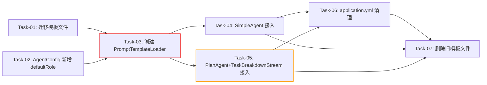

# 开发任务计划: Prompt 优化

## 0. 任务概览 (Task Overview)

*   **总任务数**: 7 个
*   **预计总工时**: 330 分钟（约 5.5 小时）
*   **开发方法**: TDD（测试驱动开发）- 每个任务按 Red-Green-Refactor 循环执行
*   **关键里程碑**:
    *   阶段一完成：基础设施就绪（~40m）
    *   阶段二完成：PromptTemplateLoader 可用（~90m）
    *   阶段三完成：全部调用点接入（~230m）
    *   整体完成：配置清理与验证（~330m）
*   **风险任务**: Task-05（PlanAgent + TaskBreakdownStream 联动改造，构造器签名变更影响编译）
*   **阻塞任务**: Task-03（PromptTemplateLoader 是所有集成任务的前置依赖）

### 依赖关系图

### 可并行任务组

| 并行组 | 可同时执行的任务 | 说明 |
| :--- | :--- | :--- |
| 并行组 1 | Task-01 + Task-02 | 文件迁移与配置类修改互不依赖 |
| 并行组 2 | Task-04 + Task-05 | SimpleAgent 与 PlanAgent/TaskBreakdownStream 改动不同类，互不冲突 |

## 1. 准备工作 (Preparation)

- [x] **Prep-01**: 确认技术方案文档完整
    *   说明：`specs/features/2026-08-07/Prompt优化/Prompt优化_技术方案.md` 已存在且已审阅
- [x] **Prep-02**: 确认模板文件已创建
    *   说明：4 个角色模板 + 6 个场景模板已在 prompt 设计阶段创建（当前在 bootstrap 模块）
- [x] **Prep-03**: 确认 @Tool 描述和硬编码提示词优化已生效
    *   说明：已在 prompt 设计阶段完成修改，编译通过

## 2. 开发任务 (Development Tasks)

### 阶段一：基础设施层 (Infrastructure)

> **阶段完成标准**: 模板文件在 agent 模块就绪，AgentConfig 支持 defaultRole 配置

- [x] **Task-01**: 迁移模板文件到 agent 模块
    *   **通俗解释**: 把提示词模板文件从启动模块搬到 Agent 模块，让模板和使用它的代码在同一个模块里，方便测试和管理。
    *   **说明**: 将 `agent-demo-bootstrap/src/main/resources/prompts/` 下的 roles/ 和 scenarios/ 目录迁移到 `agent-demo-agent/src/main/resources/prompts/`
    *   **涉及文件**:
        - 源：`agent-demo-bootstrap/src/main/resources/prompts/roles/*.txt`（4 个文件）
        - 源：`agent-demo-bootstrap/src/main/resources/prompts/scenarios/*.txt`（6 个文件）
        - 目标：`agent-demo-agent/src/main/resources/prompts/roles/*.txt`
        - 目标：`agent-demo-agent/src/main/resources/prompts/scenarios/*.txt`
    *   **测试文件**: 无（文件迁移，无代码逻辑）
    *   **参考**: 技术方案 Sec 4.1
    *   **对应AC**: AC-001, AC-002, AC-025
    *   **预估工时**: 15m
    *   **依赖**: 无
    *   **验证标准**:
        - [ ] `agent-demo-agent/src/main/resources/prompts/roles/` 目录下存在 4 个文件：general.txt, code.txt, data-analyst.txt, doc-writer.txt
        - [ ] `agent-demo-agent/src/main/resources/prompts/scenarios/` 目录下存在 6 个文件：chat.txt, thinking.txt, react.txt, task-plan.txt, task-execute.txt, task-summary.txt
        - [ ] 迁移后文件内容与原文件一致
        - [ ] `agent-demo-bootstrap/src/main/resources/prompts/roles/` 和 `scenarios/` 目录已清空（旧文件待 Task-07 清理 bootstrap 下的所有旧文件）

- [x] **Task-02**: AgentConfig 新增 defaultRole 字段
    *   **通俗解释**: 给 Agent 配置类加一个"角色选择"开关，让系统知道默认用哪个角色模板。
    *   **说明**: 在 AgentConfig 类中新增 `defaultRole` 字段，默认值 "general"
    *   **涉及文件**: `agent-demo-agent/src/main/java/com/agentdemo/agent/config/AgentConfig.java`
    *   **测试文件**: `agent-demo-agent/src/test/java/com/agentdemo/agent/config/AgentConfigTest.java`
    *   **参考**: 技术方案 Sec 4.5 AgentConfig 改造
    *   **对应AC**: AC-030
    *   **预估工时**: 15m
    *   **依赖**: 无
    *   **验证标准**:
        - [ ] AgentConfig 类包含 `defaultRole` 字段，类型为 String
        - [ ] `new AgentConfig().getDefaultRole()` 返回 "general"
        - [ ] 通过 yml 配置 `agent.default-role: code` 时，`agentConfig.getDefaultRole()` 返回 "code"
        - [ ] 字段有 Javadoc 注释说明业务含义

### 阶段二：核心逻辑层 (Core Logic)

> **阶段完成标准**: PromptTemplateLoader 可加载模板文件并组合提示词，缺失时正确回退

- [x] **Task-03**: 创建 PromptTemplateLoader 类 🔒
    *   **通俗解释**: 创建一个"提示词组装器"，它从文件中读取角色模板和场景模板，拼成完整的系统提示词给 Agent 用。文件找不到时自动回退到旧版提示词，保证系统不中断。
    *   **说明**: 新建 PromptTemplateLoader 类，实现模板加载、角色+场景组合、三级回退逻辑
    *   **涉及文件**: `agent-demo-agent/src/main/java/com/agentdemo/agent/prompt/PromptTemplateLoader.java`（新建）
    *   **测试文件**: `agent-demo-agent/src/test/java/com/agentdemo/agent/prompt/PromptTemplateLoaderTest.java`（新建）
    *   **参考**: 技术方案 Sec 2.1（完整类设计）
    *   **对应AC**: AC-003, AC-024, AC-025
    *   **预估工时**: 90m
    *   **依赖**: Task-01（模板文件就绪）, Task-02（AgentConfig.defaultRole 可用）
    *   **阻塞标注**: Task-04 和 Task-05 的前置依赖
    *   **验证标准**（TDD RED 阶段的测试依据）:
        - [ ] `composeSystemPrompt("general", "chat")` 返回非空字符串，内容包含 general.txt 和 chat.txt 的组合（以 "\n\n" 分隔）
        - [ ] `composeSystemPrompt("code", "react")` 返回内容包含 code.txt 角色身份和 react.txt 的 ReAct 格式引导
        - [ ] `composeSystemPrompt("nonexistent", "chat")` 回退到 general.txt 角色模板，记录 WARNING 日志
        - [ ] `composeSystemPrompt("general", "nonexistent")` 回退到 `agentConfig.getDefaultSystemPrompt()`，记录 WARNING 日志
        - [ ] `composeSystemPrompt("general", "chat")` 结果中 general.txt 内容在前，chat.txt 内容在后
        - [ ] 使用 `agentConfig.getDefaultRole()` 作为默认角色时，`composeSystemPrompt("chat")` 等价于 `composeSystemPrompt(agentConfig.getDefaultRole(), "chat")`
        - [ ] 场景常量 `SCENARIO_CHAT`, `SCENARIO_THINKING`, `SCENARIO_REACT`, `SCENARIO_TASK_PLAN`, `SCENARIO_TASK_EXECUTE`, `SCENARIO_TASK_SUMMARY` 值分别为 "chat", "thinking", "react", "task-plan", "task-execute", "task-summary"
        - [ ] react.txt 模板中的 `{{tools}}` 占位符在 composeSystemPrompt 返回值中原样保留（由调用方替换）

### 阶段三：集成层 (Integration)

> **阶段完成标准**: SimpleAgent 和 TaskBreakdownStream 均通过 PromptTemplateLoader 获取系统提示词，编译通过且现有测试无回归

- [x] **Task-04**: SimpleAgent 接入 PromptTemplateLoader
    *   **通俗解释**: 把 SimpleAgent 中三处直接读配置类提示词的代码，改成通过"提示词组装器"获取组合后的提示词。改完后普通对话、深度思考、ReAct 三种模式都用上了新的角色+场景模板。
    *   **说明**: SimpleAgent 构造器注入 PromptTemplateLoader，替换 3 处提示词调用
    *   **涉及文件**: `agent-demo-agent/src/main/java/com/agentdemo/agent/single/SimpleAgent.java`
    *   **测试文件**: `agent-demo-agent/src/test/java/com/agentdemo/agent/single/SimpleAgentTest.java`（修改或新建）
    *   **参考**: 技术方案 Sec 4.5 SimpleAgent 改造表
    *   **对应AC**: AC-003, AC-027, AC-028, AC-029
    *   **预估工时**: 60m
    *   **依赖**: Task-03
    *   **验证标准**（TDD RED 阶段的测试依据）:
        - [ ] SimpleAgent 构造器包含 PromptTemplateLoader 参数
        - [ ] `getDelegate()` 中的 `systemMessageProvider` 调用 `promptTemplateLoader.composeSystemPrompt(SCENARIO_CHAT)` 而非 `agentConfig.getDefaultSystemPrompt()`
        - [ ] `buildMessagesWithMemory()` 中 SystemMessage 来自 `composeSystemPrompt(SCENARIO_THINKING)`
        - [ ] `buildReActMessagesWithMemory()` 中 SystemMessage 来自 `composeSystemPrompt(SCENARIO_REACT).replace("{{tools}}", convertToDescriptionText())`
        - [ ] 模块编译通过：`mvn compile -pl agent-demo-agent -am`
        - [ ] 现有 SimpleAgent 测试无回归（如有）

- [ ] **Task-05**: PlanAgent + TaskBreakdownStream 接入 PromptTemplateLoader ⚠️
    *   **通俗解释**: 把任务拆解流程中四处读配置类提示词的代码也改成通过"提示词组装器"获取。因为 PlanAgent 创建 TaskBreakdownStream 时需要透传依赖，两个类必须一起改才能编译通过。
    *   **说明**: PlanAgent 构造器新增 PromptTemplateLoader 依赖并透传给 TaskBreakdownStream；TaskBreakdownStream 构造器新增第 9 个参数，替换 4 处提示词调用
    *   **涉及文件**:
        - `agent-demo-agent/src/main/java/com/agentdemo/agent/single/PlanAgent.java`
        - `agent-demo-agent/src/main/java/com/agentdemo/agent/core/TaskBreakdownStream.java`
    *   **测试文件**: `agent-demo-agent/src/test/java/com/agentdemo/agent/core/TaskBreakdownStreamTest.java`（修改或新建）
    *   **参考**: 技术方案 Sec 4.5 PlanAgent 改造 + TaskBreakdownStream 改造表
    *   **对应AC**: AC-003, AC-027, AC-028
    *   **预估工时**: 90m
    *   **依赖**: Task-03
    *   **风险标注**: 构造器签名变更，PlanAgent 和 TaskBreakdownStream 必须同步修改否则编译失败
    *   **验证标准**（TDD RED 阶段的测试依据）:
        - [ ] PlanAgent 构造器包含 PromptTemplateLoader 参数
        - [ ] PlanAgent.chatTaskBreakdownStream() 创建 TaskBreakdownStream 时传入 promptTemplateLoader
        - [ ] TaskBreakdownStream 构造器第 9 个参数为 PromptTemplateLoader 类型
        - [ ] `planTasks()` 中 SystemMessage 来自 `composeSystemPrompt(SCENARIO_TASK_PLAN)`
        - [ ] `executeSubTaskWithReAct()` 中 SystemMessage 来自 `composeSystemPrompt(SCENARIO_TASK_EXECUTE).replace("{{tools}}", convertToDescriptionText())`
        - [ ] `streamSummary()` 中 SystemMessage 来自 `composeSystemPrompt(SCENARIO_TASK_SUMMARY)`
        - [ ] `streamDirectAnswer()` 中 SystemMessage 来自 `composeSystemPrompt(SCENARIO_THINKING)`
        - [ ] 模块编译通过：`mvn compile -pl agent-demo-agent -am`
        - [ ] 现有 TaskBreakdownStream 测试无回归（如有）

### 阶段四：配置与清理层 (Config & Cleanup)

> **阶段完成标准**: yml 配置已清理，旧模板文件已删除，全量编译通过

- [x] **Task-06**: application.yml 配置清理
    *   **通俗解释**: 把配置文件中写死的提示词文本删掉，换成一行简单的角色配置。提示词内容以后从模板文件读取，不再放在配置文件里。
    *   **说明**: 移除 application.yml 中的 default-system-prompt、thinking-system-prompt、thinking-react-system-prompt 配置项，新增 default-role: general
    *   **涉及文件**:
        - `agent-demo-bootstrap/src/main/resources/application.yml`
        - `agent-demo-bootstrap/src/main/resources/application-dev.yml`（如有相关配置）
    *   **测试文件**: 无（配置文件修改）
    *   **参考**: 技术方案 Sec 4.5 application.yml 改造
    *   **对应AC**: AC-030
    *   **预估工时**: 15m
    *   **依赖**: Task-04, Task-05（确保代码不再依赖 yml 中的提示词配置）
    *   **验证标准**:
        - [ ] application.yml 中 agent 配置段不含 `default-system-prompt`、`thinking-system-prompt`、`thinking-react-system-prompt` 字段
        - [ ] application.yml 中 agent 配置段包含 `default-role: general`
        - [ ] 全量编译通过：`mvn compile -pl agent-demo-bootstrap -am`
        - [ ] 应用可正常启动（AgentConfig 默认值生效，PromptTemplateLoader 加载模板）

- [x] **Task-07**: 删除旧模板文件
    *   **通俗解释**: 清理掉旧的提示词模板文件，它们已经被新的角色×场景模板替代了。
    *   **说明**: 删除 `agent-demo-bootstrap/src/main/resources/prompts/` 下的 3 个旧文件：default.txt, code-assistant.txt, general-assistant.txt
    *   **涉及文件**:
        - 删除：`agent-demo-bootstrap/src/main/resources/prompts/default.txt`
        - 删除：`agent-demo-bootstrap/src/main/resources/prompts/code-assistant.txt`
        - 删除：`agent-demo-bootstrap/src/main/resources/prompts/general-assistant.txt`
    *   **测试文件**: 无（文件删除）
    *   **参考**: 技术方案 Sec 4.1 + AC-026
    *   **对应AC**: AC-026
    *   **预估工时**: 10m
    *   **依赖**: Task-06（确保系统不再依赖 bootstrap 模块下的任何模板文件）
    *   **验证标准**:
        - [ ] `agent-demo-bootstrap/src/main/resources/prompts/default.txt` 不存在
        - [ ] `agent-demo-bootstrap/src/main/resources/prompts/code-assistant.txt` 不存在
        - [ ] `agent-demo-bootstrap/src/main/resources/prompts/general-assistant.txt` 不存在
        - [ ] 全量编译通过：`mvn compile`
        - [ ] 无任何 Java 代码引用这 3 个文件（Grep 验证）

### 阶段性集成验证 (Stage Integration Verification)

- [ ] **Verify-01**: 全量编译验证
    *   **说明**: 所有任务完成后，执行全量编译确保无回归
    *   **验证标准**:
        - [ ] `mvn compile` 全量编译通过
        - [ ] `mvn test -pl agent-demo-agent -am` agent 模块测试通过

- [x] **Verify-02**: 模板加载端到端验证
    *   **说明**: 验证应用启动后 PromptTemplateLoader 正确加载模板
    *   **验证标准**:
        - [ ] 应用启动无 ERROR 日志
        - [ ] 普通对话使用 general 角色 + chat 场景模板
        - [ ] 深度思考使用 general 角色 + thinking 场景模板
        - [ ] ReAct 模式使用 general 角色 + react 场景模板，{{tools}} 被正确替换为工具描述

## 3. 验收标准检查清单 (AC Checklist)

> AC-001~AC-013（模板内容）和 AC-014~AC-023（@Tool 描述+硬编码提示词）已在 prompt 设计阶段完成

| 验收标准 ID | 验收标准描述 | 对应任务 | 状态 |
| :--- | :--- | :--- | :--- |
| AC-001 | 角色模板文件创建 | Task-01（迁移到 agent 模块） | 已完成（prompt 设计阶段创建） |
| AC-002 | 场景模板文件创建 | Task-01（迁移到 agent 模块） | 已完成（prompt 设计阶段创建） |
| AC-003 | 提示词组合机制 | Task-03, Task-04, Task-05 | 已完成 |
| AC-024 | 模板文件缺失降级 | Task-03 | 已完成 |
| AC-025 | 模板文件加载机制 | Task-01, Task-03 | 已完成 |
| AC-026 | 旧模板文件清理 | Task-07 | 已完成 |
| AC-027 | 防幻觉规则一致性 | Task-03（场景模板含规则，组合后自动包含） | 已验证 |
| AC-028 | 输出格式规则一致性 | Task-03（场景模板含规则，组合后自动包含） | 已验证 |
| AC-029 | 工具调用透明化规则 | Task-03 + Task-04（chat/react 模板含规则） | 已验证 |
| AC-030 | 配置外部化一致性 | Task-02, Task-06 | 已完成 |

## 4. 验证计划 (Verification Plan)

### 4.1 TDD 过程验证（每个任务内部）

- [x] RED：测试编写完成后运行，确认全部失败
- [x] GREEN：实现代码后运行，确认全部通过
- [x] REFACTOR：重构后运行，确认仍全部通过

### 4.2 阶段验证检查点

| 阶段 | 验证动作 | 关联任务 | 通过标准 |
| :--- | :--- | :--- | :--- |
| 阶段一完成后 | 确认模板文件在 agent 模块就绪 + AgentConfig 编译通过 | Task-01, Task-02 | 文件存在 + `mvn compile -pl agent-demo-agent -am` 通过 |
| 阶段二完成后 | 运行 PromptTemplateLoader 单元测试 | Task-03 | 全部测试通过（含正常/回退/边界场景） |
| 阶段三完成后 | 运行 agent 模块全量编译 + 现有测试无回归 | Task-04, Task-05 | `mvn compile -pl agent-demo-agent -am` + `mvn test` 通过 |
| 阶段四完成后 | 全量编译 + 应用启动验证 | Task-06, Task-07 | `mvn compile` 通过 + 应用正常启动 |

### 4.3 验收标准逐项验证

| AC | 验证方式 | 关联任务 | 状态 |
| :--- | :--- | :--- | :--- |
| AC-001 | 检查 `agent-demo-agent/src/main/resources/prompts/roles/` 下 4 个文件存在且内容完整 | Task-01 | 待验证 |
| AC-002 | 检查 `agent-demo-agent/src/main/resources/prompts/scenarios/` 下 6 个文件存在且内容完整 | Task-01 | 待验证 |
| AC-003 | 运行 PromptTemplateLoader 测试，验证 composeSystemPrompt 返回角色+场景组合文本 | Task-03 | 待验证 |
| AC-024 | 运行 PromptTemplateLoader 测试，验证不存在的角色/场景模板正确回退 | Task-03 | 待验证 |
| AC-025 | 运行 PromptTemplateLoader 测试，验证从 classpath 加载 + AgentConfig 回退 | Task-03 | 待验证 |
| AC-026 | 确认 bootstrap 模块下 3 个旧文件已删除 + 无代码引用 | Task-07 | 待验证 |
| AC-027 | 检查所有场景模板含防幻觉规则 + composeSystemPrompt 组合后包含 | Task-03 | 待验证 |
| AC-028 | 检查所有场景模板含输出格式约束 + composeSystemPrompt 组合后包含 | Task-03 | 待验证 |
| AC-029 | 检查 chat.txt/react.txt 含工具透明化要求 + ToolSchemaConverter 引导文本含此规则 | Task-04 | 待验证 |
| AC-030 | 检查 yml 不含 prompt 文本 + 含 default-role: general | Task-06 | 待验证 |

### 4.4 最终验证（所有阶段完成后）

- [x] `mvn compile` 全量编译通过
- [x] `mvn test -pl agent-demo-agent -am` agent 模块测试通过
- [ ] 应用启动无 ERROR，PromptTemplateLoader 加载模板成功
- [ ] 普通对话系统提示词 = general.txt + chat.txt 组合
- [ ] ReAct 模式系统提示词 = general.txt + react.txt 组合，{{tools}} 被替换

## 5. 风险与注意事项 (Risks & Notes)

*   **技术风险**: Task-05 中 PlanAgent 和 TaskBreakdownStream 构造器签名同时变更，若只改一个会导致编译失败。建议在同一个 TDD 循环中完成两个类的修改。
*   **依赖风险**: Task-03 是阻塞任务，被 Task-04 和 Task-05 依赖。若 Task-03 延期，后续任务全部阻塞。建议优先完成 Task-03。
*   **回归风险**: SimpleAgent.getDelegate() 中 systemMessageProvider 是 lambda，改造后每次对话都会调用 composeSystemPrompt。需确保方法无副作用、线程安全（PromptTemplateLoader 无状态，可安全并发调用）。
*   **兼容性**: 改造后系统提示词变长（角色模板 + 场景模板），LLM 回答风格可能有变化。这是预期行为（提升对话质量），不是回归。
*   **回滚方案**: 删除 PromptTemplateLoader，恢复 SimpleAgent/PlanAgent/TaskBreakdownStream/AgentConfig 原始代码，恢复 application.yml 配置。模板文件可保留不影响系统。
