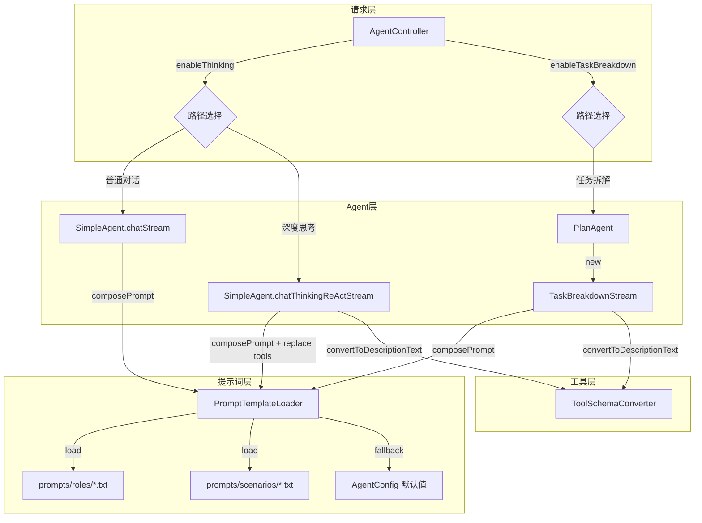
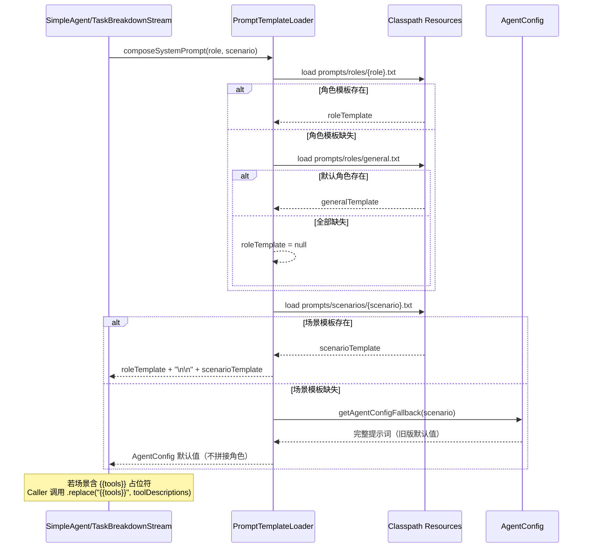

# 技术设计文档: Prompt 优化

## 0. 设计概要 (Design Summary)

* **功能描述**：将项目中所有系统提示词外部化为模板文件，建立"角色×场景"二维矩阵的提示词管理架构，通过 PromptTemplateLoader 运行时组合最终提示词。

* **影响范围**：agent-demo-agent（核心改动）、agent-demo-bootstrap（模板文件迁移、配置清理）

* **技术难点**：模板文件缺失时的优雅降级；{{tools}} 占位符的运行时替换；TaskBreakdownStream 非 Spring Bean 的依赖传递

* **依赖关系**：无外部依赖新增；依赖已有的 ToolSchemaConverter.convertToDescriptionText()

## 1. 架构概览 (Architecture Overview)

### 1.1 改动涉及的模块

| 模块                   | 改动类型        | 说明                                                                               |
| -------------------- | ----------- | -------------------------------------------------------------------------------- |
| agent-demo-agent     | 新增类 + 修改类   | 新增 PromptTemplateLoader；修改 AgentConfig、SimpleAgent、PlanAgent、TaskBreakdownStream |
| agent-demo-bootstrap | 文件迁移 + 配置修改 | 模板文件迁移到 agent 模块；application.yml 清理提示词配置                                         |

### 1.2 数据流向



### 1.3 提示词组合流程



## 2. API 设计 (API Design)

> 本次改动不涉及 REST API 变更。以下为内部接口设计。

### 2.1 PromptTemplateLoader 接口

```java
package com.agentdemo.agent.prompt;

/**
 * 提示词模板加载器
 * <p>
 * 业务含义：从 classpath 加载角色模板和场景模板，组合为最终系统提示词。
 * 模板文件位于 resources/prompts/roles/ 和 resources/prompts/scenarios/ 目录。
 * 模板缺失时回退到 AgentConfig 默认值，保证系统可用性。
 * </p>
 */
@Slf4j
@Component
public class PromptTemplateLoader {

    public static final String DEFAULT_ROLE = "general";

    // 场景名称常量（对应 prompts/scenarios/ 目录下的文件名）
    public static final String SCENARIO_CHAT = "chat";
    public static final String SCENARIO_THINKING = "thinking";
    public static final String SCENARIO_REACT = "react";
    public static final String SCENARIO_TASK_PLAN = "task-plan";
    public static final String SCENARIO_TASK_EXECUTE = "task-execute";
    public static final String SCENARIO_TASK_SUMMARY = "task-summary";

    private static final String ROLES_DIR = "prompts/roles/";
    private static final String SCENARIOS_DIR = "prompts/scenarios/";

    private final AgentConfig agentConfig;

    public PromptTemplateLoader(AgentConfig agentConfig) {
        this.agentConfig = agentConfig;
    }

    /**
     * 使用配置的默认角色组合提示词
     */
    public String composeSystemPrompt(String scenarioName) {
        return composeSystemPrompt(agentConfig.getDefaultRole(), scenarioName);
    }

    /**
     * 组合最终系统提示词 = 角色模板 + "\n\n" + 场景模板
     * <p>
     * 回退策略：
     * 1. 角色模板缺失 -> 回退到 general.txt
     * 2. general.txt 也缺失 -> 仅使用场景模板（或 AgentConfig 默认值）
     * 3. 场景模板缺失 -> 回退到 AgentConfig 对应默认值（不拼接角色）
     * </p>
     */
    public String composeSystemPrompt(String roleName, String scenarioName) {
        String roleTemplate = loadRoleTemplate(roleName);
        String scenarioTemplate = loadScenarioTemplate(scenarioName);

        // 场景模板缺失 -> 回退到 AgentConfig（完整提示词，不再拼接角色）
        if (scenarioTemplate == null) {
            log.warn("场景模板 [{}] 不存在，回退到 AgentConfig 默认值", scenarioName);
            return getAgentConfigFallback(scenarioName);
        }

        // 角色模板存在 -> 拼接角色 + 场景
        if (roleTemplate != null) {
            return roleTemplate + "\n\n" + scenarioTemplate;
        }

        // 角色模板缺失，场景模板存在 -> 仅使用场景模板
        log.warn("角色模板 [{}] 及默认角色模板均不存在，仅使用场景模板", roleName);
        return scenarioTemplate;
    }

    private String loadRoleTemplate(String roleName) {
        String content = loadTemplate(ROLES_DIR + roleName + ".txt");
        if (content == null && !DEFAULT_ROLE.equals(roleName)) {
            log.warn("角色模板 [{}] 不存在，回退到默认角色 [{}]", roleName, DEFAULT_ROLE);
            content = loadTemplate(ROLES_DIR + DEFAULT_ROLE + ".txt");
        }
        return content;
    }

    private String loadScenarioTemplate(String scenarioName) {
        return loadTemplate(SCENARIOS_DIR + scenarioName + ".txt");
    }

    /**
     * 场景模板缺失时，回退到 AgentConfig 中的旧版提示词默认值
     */
    private String getAgentConfigFallback(String scenarioName) {
        return switch (scenarioName) {
            case SCENARIO_CHAT -> agentConfig.getDefaultSystemPrompt();
            case SCENARIO_THINKING -> agentConfig.getThinkingSystemPrompt();
            case SCENARIO_REACT -> agentConfig.getThinkingReactSystemPrompt();
            case SCENARIO_TASK_PLAN -> agentConfig.getTaskBreakdownPlanPrompt();
            case SCENARIO_TASK_EXECUTE -> agentConfig.getTaskExecutionSystemPrompt();
            case SCENARIO_TASK_SUMMARY -> agentConfig.getTaskSummaryPrompt();
            default -> agentConfig.getDefaultSystemPrompt();
        };
    }

    /**
     * 从 classpath 加载模板文件
     *
     * @param path classpath 相对路径，如 "prompts/roles/general.txt"
     * @return 文件内容字符串，文件不存在时返回 null
     */
    private String loadTemplate(String path) {
        try (InputStream is = getClass().getClassLoader().getResourceAsStream(path)) {
            if (is == null) {
                return null;
            }
            return new String(is.readAllBytes(), StandardCharsets.UTF_8);
        } catch (IOException e) {
            log.error("加载模板文件失败: {}", path, e);
            return null;
        }
    }
}
```

## 3. 数据库设计 (Database Schema)

> 本次改动不涉及数据库变更。项目当前为纯内存存储。

## 4. 核心逻辑与算法 (Core Logic)

### 4.1 模板文件目录结构

```
agent-demo-agent/src/main/resources/prompts/
├── roles/                          # 角色模板（4个）
│   ├── general.txt                 # 通用助手
│   ├── code.txt                    # 代码助手
│   ├── data-analyst.txt            # 数据分析助手
│   └── doc-writer.txt              # 文档助手
└── scenarios/                      # 场景模板（6个）
    ├── chat.txt                    # 普通对话（含工具引导）
    ├── thinking.txt                # 深度思考（无工具）
    ├── react.txt                   # ReAct 深度思考（含 {{tools}} 占位符）
    ├── task-plan.txt               # 任务规划（JSON 输出约束）
    ├── task-execute.txt            # 任务执行（含 {{tools}} 占位符）
    └── task-summary.txt            # 任务总结
```

### 4.2 场景与执行路径映射

| 场景名            | 场景模板文件           | 调用方                                                                              | 原始 AgentConfig 字段         | 含 {{tools}} |
| -------------- | ---------------- | -------------------------------------------------------------------------------- | ------------------------- | ----------- |
| `chat`         | chat.txt         | SimpleAgent.getDelegate()                                                        | defaultSystemPrompt       | 否           |
| `thinking`     | thinking.txt     | SimpleAgent.buildMessagesWithMemory() / TaskBreakdownStream.streamDirectAnswer() | thinkingSystemPrompt      | 否           |
| `react`        | react.txt        | SimpleAgent.buildReActMessagesWithMemory()                                       | thinkingReactSystemPrompt | 是           |
| `task-plan`    | task-plan.txt    | TaskBreakdownStream.planTasks()                                                  | taskBreakdownPlanPrompt   | 否           |
| `task-execute` | task-execute.txt | TaskBreakdownStream.executeSubTaskWithReAct()                                    | taskExecutionSystemPrompt | 是           |
| `task-summary` | task-summary.txt | TaskBreakdownStream.streamSummary()                                              | taskSummaryPrompt         | 否           |

### 4.3 {{tools}} 占位符替换流程

```java
// SimpleAgent.buildReActMessagesWithMemory() 改造后
String systemPrompt = promptTemplateLoader.composeSystemPrompt(PromptTemplateLoader.SCENARIO_REACT)
        .replace("{{tools}}", toolSchemaConverter.convertToDescriptionText());
messages.add(SystemMessage.from(systemPrompt));

// TaskBreakdownStream.executeSubTaskWithReAct() 改造后
String systemPrompt = promptTemplateLoader.composeSystemPrompt(PromptTemplateLoader.SCENARIO_TASK_EXECUTE)
        .replace("{{tools}}", toolSchemaConverter.convertToDescriptionText());
messages.add(SystemMessage.from(systemPrompt));
```

**注意**：仅 react 和 task-execute 两个场景含 `{{tools}}` 占位符。若场景模板缺失回退到 AgentConfig 默认值，AgentConfig 默认值中不含 `{{tools}}`，`.replace()` 不会产生副作用（无匹配则原样返回）。

### 4.4 模板回退策略

```
composeSystemPrompt(role, scenario) 执行流程：

1. 加载角色模板: prompts/roles/{role}.txt
   ├─ 存在 -> roleTemplate = 文件内容
   └─ 不存在 -> 尝试 prompts/roles/general.txt
       ├─ 存在 -> roleTemplate = general.txt 内容
       └─ 不存在 -> roleTemplate = null

2. 加载场景模板: prompts/scenarios/{scenario}.txt
   ├─ 存在 -> scenarioTemplate = 文件内容
   └─ 不存在 -> 返回 AgentConfig 对应默认值（不拼接角色）★

3. 组合:
   ├─ roleTemplate != null -> 返回 roleTemplate + "\n\n" + scenarioTemplate
   └─ roleTemplate == null -> 返回 scenarioTemplate（仅场景模板）
```

### 4.5 各调用点改造详情

#### SimpleAgent 改造

| 方法                             | 行号      | 原始代码                                                                             | 改造后代码                                                                                  |
| ------------------------------ | ------- | -------------------------------------------------------------------------------- | -------------------------------------------------------------------------------------- |
| getDelegate()                  | 106     | `agentConfig.getDefaultSystemPrompt()`                                           | `promptTemplateLoader.composeSystemPrompt(SCENARIO_CHAT)`                              |
| buildMessagesWithMemory()      | 250     | `agentConfig.getThinkingSystemPrompt()`                                          | `promptTemplateLoader.composeSystemPrompt(SCENARIO_THINKING)`                          |
| buildReActMessagesWithMemory() | 228-229 | `agentConfig.getThinkingReactSystemPrompt() + "\n" + convertToDescriptionText()` | `composeSystemPrompt(SCENARIO_REACT).replace("{{tools}}", convertToDescriptionText())` |

SimpleAgent 构造器新增 `PromptTemplateLoader` 参数。

#### PlanAgent 改造

PlanAgent 构造器新增 `PromptTemplateLoader` 参数，透传给 TaskBreakdownStream。

#### TaskBreakdownStream 改造

构造器新增 `PromptTemplateLoader` 参数（第 9 个参数）。

| 方法                        | 行号      | 原始代码                                                                             | 改造后代码                                                                                         |
| ------------------------- | ------- | -------------------------------------------------------------------------------- | --------------------------------------------------------------------------------------------- |
| planTasks()               | 252     | `agentConfig.getTaskBreakdownPlanPrompt()`                                       | `promptTemplateLoader.composeSystemPrompt(SCENARIO_TASK_PLAN)`                                |
| executeSubTaskWithReAct() | 423-424 | `agentConfig.getTaskExecutionSystemPrompt() + "\n" + convertToDescriptionText()` | `composeSystemPrompt(SCENARIO_TASK_EXECUTE).replace("{{tools}}", convertToDescriptionText())` |
| streamSummary()           | 597     | `agentConfig.getTaskSummaryPrompt()`                                             | `promptTemplateLoader.composeSystemPrompt(SCENARIO_TASK_SUMMARY)`                             |
| streamDirectAnswer()      | 613     | `agentConfig.getThinkingSystemPrompt()`                                          | `promptTemplateLoader.composeSystemPrompt(SCENARIO_THINKING)`                                 |

#### AgentConfig 改造

新增字段：

```java
/**
 * 默认角色名称
 * <p>
 * 业务含义：对应 prompts/roles/ 目录下的模板文件名（不含 .txt 扩展名）。
 * 运行时与场景模板组合为最终系统提示词。默认 "general"（通用助手）。
 * </p>
 */
private String defaultRole = "general";
```

保留所有现有提示词字段作为最终回退默认值，不删除。

#### application.yml 改造

```yaml
# 改造前
agent:
  default-system-prompt: "你是一个有用的 AI 助手..."  # 移除
  thinking-system-prompt: "你是一个有用的 AI 助手..."  # 移除
  thinking-react-system-prompt: "你是一个深度思考..."  # 移除

# 改造后
agent:
  default-role: general  # 新增：默认角色
  # 系统提示词已外部化到 prompts/roles/ 和 prompts/scenarios/ 模板文件
  # AgentConfig 中的默认值作为模板缺失时的最终回退
```

## 5. 异常处理 (Error Handling)

| 异常场景                 | 对应验收标准 | 处理方案                        | 日志级别    |
| -------------------- | ------ | --------------------------- | ------- |
| 角色模板文件不存在            | AC-024 | 回退到 general.txt             | WARNING |
| 默认角色模板也不存在           | AC-024 | 仅使用场景模板（不拼接角色）              | WARNING |
| 场景模板文件不存在            | AC-024 | 回退到 AgentConfig 对应默认值       | WARNING |
| 模板文件 IO 读取失败         | AC-024 | 视同文件不存在，走回退路径               | ERROR   |
| {{tools}} 占位符在模板中不存在 | -      | `.replace()` 无匹配返回原字符串，无副作用 | -       |

## 6. 安全与性能 (Security & Performance)

* **性能**：模板文件在首次调用时从 classpath 读取，文件极小（< 1KB），读取开销可忽略。如需优化可加 ConcurrentHashMap 缓存。

* **安全**：模板文件为 classpath 内静态资源，不接受外部输入，无注入风险。`{{tools}}` 占位符由 `ToolSchemaConverter` 内部生成，来源可信。

* **兼容性**：AgentConfig 保留所有旧提示词默认值，模板全部缺失时系统行为与改造前完全一致。

## 7. 验收标准映射 (AC Mapping)

> AC-001\~AC-013（模板文件创建与内容）和 AC-014\~AC-023（@Tool 描述和硬编码提示词优化）已在 prompt 设计阶段完成，本表仅列出技术方案阶段需实现的 AC。

| 验收标准 ID | 验收标准描述    | 对应技术实现                                                           |
| ------- | --------- | ---------------------------------------------------------------- |
| AC-001  | 角色模板文件创建  | 模板文件迁移到 `agent-demo-agent/src/main/resources/prompts/roles/`     |
| AC-002  | 场景模板文件创建  | 模板文件迁移到 `agent-demo-agent/src/main/resources/prompts/scenarios/` |
| AC-003  | 提示词组合机制   | `PromptTemplateLoader.composeSystemPrompt(role, scenario)`       |
| AC-024  | 模板文件缺失降级  | `loadRoleTemplate()` 三级回退 + `getAgentConfigFallback()`           |
| AC-025  | 模板文件加载机制  | `loadTemplate()` 从 classpath 读取 + AgentConfig 保留为最终回退            |
| AC-026  | 旧模板文件清理   | 删除 `bootstrap/src/main/resources/prompts/default.txt` 等 3 个旧文件   |
| AC-027  | 防幻觉规则一致性  | 场景模板均含防幻觉规则；组合后自动包含                                              |
| AC-028  | 输出格式规则一致性 | 场景模板均含输出格式约束；组合后自动包含                                             |
| AC-029  | 工具调用透明化规则 | chat.txt 和 react.txt 含透明化要求 + ToolSchemaConverter 引导文本含此规则       |
| AC-030  | 配置外部化一致性  | application.yml 移除 prompt 文本，新增 `default-role: general`          |

## 8. 技术决策说明 (Technical Decisions)

* **决策1：模板文件放在 agent 模块而非 bootstrap 模块**

  * 理由：与使用方代码同模块，单元测试可直接加载模板文件验证；遵循"资源就近原则"

* **决策2：PromptTemplateLoader 不使用缓存**

  * 理由：模板文件极小（< 1KB），classpath 读取开销可忽略；KISS 原则，不过度设计

  * 如后续有性能需求，可加 ConcurrentHashMap 缓存

* **决策3：{{tools}} 占位符由调用方替换**

  * 理由：PromptTemplateLoader 职责单一（加载+组合），工具描述生成依赖 ToolSchemaConverter（tools 模块），避免 agent.prompt 包反向依赖 tools 包

* **决策4：AgentConfig 保留旧提示词默认值不删除**

  * 理由：作为模板文件全部缺失时的最终回退，保证系统零中断；后续迭代可逐步移除

* **决策5：TaskBreakdownStream 通过构造器传参获取 PromptTemplateLoader**

  * 理由：TaskBreakdownStream 是非 Spring Bean 的临时对象，由 PlanAgent 实例化，沿用现有依赖传递模式

## 9. 风险与注意事项 (Risks & Notes)

* **技术风险**：`{{tools}}` 占位符在 AgentConfig 回退路径中不存在，`.replace()` 无副作用。但需确保 react.txt 和 task-execute.txt 模板中占位符名称与代码一致。

* **兼容性**：改造后行为变化 -- 普通对话的系统提示词从"一句话"变为"角色模板 + 场景模板"（更长更规范），LLM 回答风格可能有变化。这是预期行为（提升对话质量）。

* **回归风险**：SimpleAgent.getDelegate() 中 systemMessageProvider 是 lambda，改造后每次调用都会执行 composeSystemPrompt。需确保方法无副作用、线程安全。

* **回滚方案**：删除 PromptTemplateLoader，恢复 SimpleAgent/TaskBreakdownStream/AgentConfig 原始代码，恢复 application.yml 配置。模板文件可保留不影响系统。

