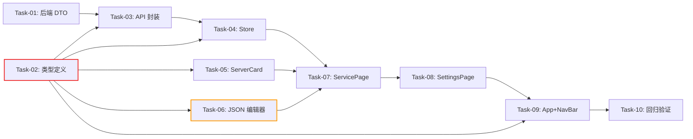

# 开发任务计划：MCP 服务管理页面

## 0. 任务概览 (Task Overview)

*   **总任务数**: 10 个
*   **预计总工时**: 625 分钟（约 10.4 小时）
*   **开发方法**: TDD（测试驱动开发）— 每个任务按 Red-Green-Refactor 循环执行
*   **关键里程碑**:
    *   阶段一（基础设施层）完成：120m
    *   阶段二（组件层）完成：+325m，累计 445m
    *   阶段三（集成层 + 回归）完成：+180m，累计 625m
*   **风险任务**: Task-06（JSON 解析逻辑 + 批量添加部分失败处理）
*   **阻塞任务**: Task-02（前端类型定义，被 4 个任务依赖）

### 依赖关系图

### 可并行任务组

| 并行组 | 可同时执行的任务 | 说明 |
| :--- | :--- | :--- |
| 并行组 1 | Task-01 + Task-02 | 后端 DTO 与前端类型定义互不依赖，可同时开发 |
| 并行组 2 | Task-05 + Task-06 | 两个叶子组件互不依赖，可同时开发 |
| 并行组 3 | Task-03 + (Task-05/Task-06 已完成时) | API 封装仅依赖类型定义，可与组件并行 |

## 1. 准备工作 (Preparation)

- [ ] **Prep-01**: 确认后端 MCP API 就绪
    *   说明：确认已有 5 个 REST API 可正常调用（`/api/mcp/servers` CRUD + reconnect + tools）
    *   验证：启动应用后 curl 调用 `GET /api/mcp/servers` 返回正常响应
- [ ] **Prep-02**: 确认前端项目可正常编译和运行
    *   说明：`cd agent-demo-frontend && npm run dev` 正常启动
    *   验证：`npm run test` 已有测试全部通过
- [ ] **Prep-03**: 确认前端测试环境就绪（Vitest + @vue/test-utils + Playwright）
    *   说明：Vue 组件测试和浏览器端 E2E 测试框架已配置
    *   验证：现有组件测试（如 VendorCard.test.ts）能正常运行

## 2. 开发任务 (Development Tasks)

> 按依赖顺序排列，每个任务耗时 < 120m
> 每个任务按 TDD 循环执行：RED（写测试）→ GREEN（写实现）→ REFACTOR（重构）
> 本次无 Mock 阶段：后端 API 已就绪，所有组件直接对接真实 API

### 阶段一：基础设施层 (Foundation Layer)
> 先完成后端 DTO 扩展 + 前端类型/API/Store 基础设施
>
> **阶段完成标准**: 后端 DTO 包含 url/command 字段；前端类型定义完整；API 封装和 Store 可调用真实接口；所有单元测试通过

- [x] **Task-01**: 后端 McpServerResponse 新增 url 和 command 字段
    *   **通俗解释**: 做完这步后，后端查询 Server 列表的接口会多返回两个字段（url 和 command），前端可以据此在卡片上展示 Server 的连接地址。
    *   **说明**: 在 `McpServerResponse.java` 中新增 `url` 和 `command` 字段，在 `McpController.toServerResponse()` 中补充映射逻辑
    *   **涉及文件**:
        - `agent-demo-web/src/main/java/com/agentdemo/web/dto/McpServerResponse.java`
        - `agent-demo-web/src/main/java/com/agentdemo/web/controller/McpController.java`
    *   **测试文件**: `agent-demo-web/src/test/java/com/agentdemo/web/controller/McpControllerTest.java`（已有测试，需验证新增字段不破坏现有测试）
    *   **参考**: 技术方案 Sec 2.2
    *   **对应 AC**: AC-036
    *   **预估工时**: 30m
    *   **依赖**: 无
    *   **验证标准**（TDD RED 阶段的测试依据）:
        - [ ] `McpServerResponse` 类包含 `url` 字段（String, nullable）
        - [ ] `McpServerResponse` 类包含 `command` 字段（String, nullable）
        - [ ] `toServerResponse()` 将 `server.getUrl()` 正确映射到 `response.setUrl()`
        - [ ] `toServerResponse()` 将 `server.getCommand()` 正确映射到 `response.setCommand()`
        - [ ] 现有 McpControllerTest 全部通过（无回归）

- [x] **Task-02**: 前端 TypeScript 类型定义
    *   **通俗解释**: 做完这步后，前端代码中所有与 MCP 相关的数据结构都有了明确的类型定义，TypeScript 编译时能检查类型错误，后续所有组件和 API 封装都基于这些类型。
    *   **说明**: 在 `types/index.ts` 末尾新增 MCP 相关类型定义：`McpTransportType`、`McpServerStatus`、`McpServerInfo`、`McpToolInfo`、`CreateMcpServerRequest`、`AddResult`
    *   **涉及文件**: `agent-demo-frontend/src/types/index.ts`
    *   **测试文件**: 无（TypeScript 类型定义无需单独测试，编译时类型检查即为验证）
    *   **参考**: 技术方案 Sec 5.3
    *   **对应 AC**: AC-004, AC-005, AC-008, AC-009, AC-010, AC-011, AC-017, AC-018, AC-036
    *   **预估工时**: 30m
    *   **依赖**: 无
    *   **验证标准**（TDD RED 阶段的测试依据）:
        - [ ] `McpTransportType` 定义包含 `'STDIO' | 'SSE' | 'HTTP'`
        - [ ] `McpServerStatus` 定义包含 `'CONNECTED' | 'DISCONNECTED' | 'ERROR' | 'DISABLED'`
        - [ ] `McpServerInfo` 包含 name, transport, status, enabled, toolCount, lastError, connectTime, url, command 字段
        - [ ] `McpToolInfo` 包含 originalName, registeredName, description, parametersSchema 字段
        - [ ] `CreateMcpServerRequest` 包含 name, transport, enabled, command?, args?, env?, url?, headers? 字段
        - [ ] `AddResult` 包含 name, success, error? 字段
        - [ ] `npm run build` 或 `npx vue-tsc --noEmit` 类型检查通过

- [x] **Task-03**: 前端 MCP API 封装
    *   **通俗解释**: 做完这步后，前端有了一个专门与后端 MCP 接口通信的模块，其他组件只需要调用简单的方法（如 `getServers()`）就能获取数据，不需要自己写 fetch 请求。
    *   **说明**: 创建 `api/mcp.ts`，封装 5 个后端 REST API 调用，复用 `llm.ts` 中的 `Result<T>` 接口和 `request<T>()` 统一请求函数
    *   **涉及文件**: `agent-demo-frontend/src/api/mcp.ts`（新建）
    *   **测试文件**: `agent-demo-frontend/src/api/mcp.test.ts`（新建）
    *   **参考**: 技术方案 Sec 2.3
    *   **对应 AC**: AC-004, AC-008, AC-012, AC-014, AC-018
    *   **预估工时**: 45m
    *   **依赖**: Task-02（类型定义）
    *   **验证标准**（TDD RED 阶段的测试依据）:
        - [ ] `getServers()` 发送 GET `/api/mcp/servers`，返回 `Promise<McpServerInfo[]>`
        - [ ] `addServer(request)` 发送 POST `/api/mcp/servers`，body 为 JSON 序列化的 `CreateMcpServerRequest`，返回 `Promise<McpServerInfo>`
        - [ ] `deleteServer(name)` 发送 DELETE `/api/mcp/servers/{name}`，返回 `Promise<void>`
        - [ ] `reconnectServer(name)` 发送 POST `/api/mcp/servers/{name}/reconnect`，返回 `Promise<McpServerInfo>`
        - [ ] `getServerTools(name)` 发送 GET `/api/mcp/servers/{name}/tools`，返回 `Promise<McpToolInfo[]>`
        - [ ] 所有方法在请求失败时（HTTP 非 200 或 result.success=false）抛出 Error，错误 message 包含后端返回的错误信息

- [x] **Task-04**: 前端 Pinia MCP Store
    *   **通俗解释**: 做完这步后，页面上所有组件共享同一份 MCP Server 数据，一个地方的数据变了（比如添加了新 Server），其他所有组件都会自动更新显示。
    *   **说明**: 创建 `stores/mcp.ts`，管理 servers 列表、toolsCache、loading 状态，封装 loadServers/deleteServer/reconnectServer/loadServerTools 等 actions
    *   **涉及文件**: `agent-demo-frontend/src/stores/mcp.ts`（新建）
    *   **测试文件**: `agent-demo-frontend/src/stores/mcp.test.ts`（新建）
    *   **参考**: 技术方案 Sec 5.4
    *   **对应 AC**: AC-004, AC-006, AC-012, AC-014, AC-018, AC-034
    *   **预估工时**: 60m
    *   **依赖**: Task-03（API 封装）
    *   **验证标准**（TDD RED 阶段的测试依据）:
        - [ ] `loadServers()` 调用 API 获取 servers 列表，成功后 `state.servers` 更新为返回数据，loading 状态正确切换
        - [ ] `loadServers()` 调用失败时 `state.servers` 保持为空数组，不崩溃
        - [ ] `deleteServer(name)` 调用 API 删除后，自动调用 `loadServers()` 刷新列表
        - [ ] `reconnectServer(name)` 调用 API 重连后，loading 状态正确切换，自动调用 `loadServers()` 刷新列表
        - [ ] `loadServerTools(name)` 调用 API 获取工具列表，成功后 `state.toolsCache[name]` 更新

### 阶段二：组件层 (Component Layer)
> 实现所有前端页面组件，包含交互逻辑和异常处理
>
> **阶段完成标准**: 所有组件可正常渲染和交互；JSON 配置解析正确；表单校验、批量添加、部分失败处理、空状态等场景均可用；所有组件测试通过

- [x] **Task-05**: McpServerCard 组件
    *   **通俗解释**: 做完这步后，每个 MCP Server 会以一张卡片的形式展示，卡片上能看到名称、状态（绿/灰/红/橙徽章）、连接地址、工具数量，还有删除和重连按钮。
    *   **说明**: 创建 `McpServerCard.vue`，展示 Server 信息（名称、状态徽章、地址、工具数、操作按钮），实现 formatAddress 计算属性、statusColor 映射、canReconnect 判断
    *   **涉及文件**: `agent-demo-frontend/src/components/McpServerCard.vue`（新建）
    *   **测试文件**: `agent-demo-frontend/src/components/McpServerCard.test.ts`（新建）
    *   **参考**: 技术方案 Sec 5.2
    *   **对应 AC**: AC-005, AC-015, AC-017, AC-036
    *   **预估工时**: 60m
    *   **依赖**: Task-02（类型定义）
    *   **验证标准**（TDD RED 阶段的测试依据）:
        - [ ] 传入 CONNECTED 状态的 server，渲染绿色状态徽章，文本为 "已连接"
        - [ ] 传入 DISCONNECTED 状态的 server，渲染灰色状态徽章，文本为 "已断线"
        - [ ] 传入 ERROR 状态的 server，渲染红色状态徽章，文本为 "错误"
        - [ ] 传入 DISABLED 状态的 server，渲染橙色状态徽章，文本为 "已禁用"
        - [ ] 传入 transport=STDIO、command="npx"、args=["mcp-fetch-server"] 的 server，地址显示 "npx mcp-fetch-server"
        - [ ] 传入 transport=HTTP、url="https://mcp.mermaid.ai/mcp" 的 server，地址显示 "https://mcp.mermaid.ai/mcp"
        - [ ] 传入 toolCount=3 的 server，显示 "3 个工具"
        - [ ] 传入 toolCount=0 的 server，显示 "0 个工具"
        - [ ] CONNECTED 状态的 server，"重连" 按钮禁用（disabled）
        - [ ] DISCONNECTED 状态的 server，"重连" 按钮可点击
        - [ ] 点击 "删除" 按钮时 emit 'delete' 事件，参数为 server.name
        - [ ] 点击 "重连" 按钮时 emit 'reconnect' 事件，参数为 server.name

- [x] **Task-06**: McpJsonConfigEditor 组件
    *   **通俗解释**: 做完这步后，用户点击"添加服务"会弹出一个窗口，里面有一个文本编辑区，用户可以直接粘贴 Claude Desktop / Cursor 的 MCP 配置 JSON，系统会自动识别传输方式并逐个添加 Server。
    *   **说明**: 创建 `McpJsonConfigEditor.vue`，包含 JSON 文本编辑区（textarea 等宽字体）、配置格式说明（可折叠）、JSON 解析逻辑（格式校验 → 传输方式推断 → 字段映射 → 逐个调用 API）、批量添加结果展示（成功/失败列表）
    *   **涉及文件**: `agent-demo-frontend/src/components/McpJsonConfigEditor.vue`（新建）
    *   **测试文件**: `agent-demo-frontend/src/components/McpJsonConfigEditor.test.ts`（新建）
    *   **参考**: 技术方案 Sec 4.1, 4.2
    *   **对应 AC**: AC-007, AC-008, AC-009, AC-010, AC-011, AC-019, AC-020, AC-021, AC-022, AC-023, AC-024, AC-028, AC-029, AC-030, AC-031, AC-032, AC-033
    *   **预估工时**: 120m
    *   **依赖**: Task-02（类型定义）、Task-03（API 封装）
    *   **风险标注**: ⚠️ JSON 解析逻辑 + 传输方式推断 + 批量添加部分失败处理，逻辑较复杂
    *   **验证标准**（TDD RED 阶段的测试依据）:
        - [ ] 弹窗打开时，textarea 为空，显示占位提示 JSON 格式示例
        - [ ] 输入 `{"command": "npx", "args": ["mcp-fetch-server"]}` 无 mcpServers 字段，点击保存时显示 "配置必须包含 mcpServers 字段"
        - [ ] 输入非法 JSON `{invalid`，点击保存时显示 "JSON 格式错误：[详情]"
        - [ ] 输入 `{"mcpServers": {"bad": {}}}` 既无 command 也无 url，点击保存时显示 "Server 'bad' 配置无效：必须包含 command 或 url"
        - [ ] 输入 `{"mcpServers": {"fetch": {"command": "npx", "args": ["mcp-fetch-server"]}}}`，解析后调用 `addServer({name:"fetch", transport:"STDIO", command:"npx", args:["mcp-fetch-server"], enabled: true})`
        - [ ] 输入 `{"mcpServers": {"mermaid": {"url": "https://mcp.mermaid.ai/mcp"}}}`，解析后 transport 推断为 HTTP
        - [ ] 输入 `{"mcpServers": {"myserver": {"url": "https://example.com/sse", "transport": "sse"}}}`，解析后 transport 推断为 SSE
        - [ ] 输入含 headers 的配置，headers 字段正确传递到 addServer 请求
        - [ ] 输入含 env 的 stdio 配置，env 字段正确传递到 addServer 请求
        - [ ] 输入 2 个 Server 的配置，全部添加成功时：弹窗关闭 + emit 'saved' 事件
        - [ ] 输入 2 个 Server 的配置，1 个成功 1 个失败时：弹窗保持打开 + 显示结果列表（成功→失败）+ emit 'saved' 不触发 + 点击 "关闭" 可关闭弹窗
        - [ ] 添加过程中按钮显示 loading 状态，disabled 不可点击（防止重复提交）

- [x] **Task-07**: McpServicePage 组件
    *   **通俗解释**: 做完这步后，用户进入 MCP 服务标签页就能看到完整的 MCP 管理界面——Server 卡片列表、空状态引导、添加/删除/重连/查看工具等所有操作。
    *   **说明**: 创建 `McpServicePage.vue`，组合 McpServerCard + McpJsonConfigEditor，实现 Server 列表渲染、空状态引导、删除/重连操作、工具列表展开/折叠
    *   **涉及文件**: `agent-demo-frontend/src/components/McpServicePage.vue`（新建）
    *   **测试文件**: `agent-demo-frontend/src/components/McpServicePage.test.ts`（新建）
    *   **参考**: 技术方案 Sec 5.2
    *   **对应 AC**: AC-002, AC-004, AC-006, AC-012, AC-013, AC-014, AC-016, AC-018, AC-025, AC-026, AC-027
    *   **预估工时**: 90m
    *   **依赖**: Task-04（Store）、Task-05（ServerCard）、Task-06（JSON 编辑器）
    *   **验证标准**（TDD RED 阶段的测试依据）:
        - [ ] `onMounted` 时自动调用 `mcpStore.loadServers()` 加载 Server 列表
        - [ ] servers 为空时，显示 "暂无 MCP 服务" 空状态 + "添加服务" 引导按钮
        - [ ] servers 有数据时，渲染 `McpServerCard` 列表（v-for）
        - [ ] 点击 "添加服务" 按钮，显示 `McpJsonConfigEditor` 弹窗
        - [ ] 编辑器 emit 'saved' 时，关闭弹窗 + 刷新列表 + 显示 "添加成功" Toast
        - [ ] 点击卡片 "删除" 按钮，弹出二次确认框（window.confirm），确认后调用 `mcpStore.deleteServer(name)`
        - [ ] 二次确认框文本包含 "将断开连接并注销所有工具"
        - [ ] 取消删除确认时，不调用 deleteServer
        - [ ] 删除已不存在的 Server 时（后端返回 5403），显示 "MCP Server 不存在" 错误提示
        - [ ] 点击卡片 "重连" 按钮，调用 `mcpStore.reconnectServer(name)`，成功后显示 "重连成功" Toast
        - [ ] 重连已连接的 Server 时（后端返回 5406），显示 "MCP Server 已连接，无需重连" 错误提示
        - [ ] 点击卡片 "3 个工具"，展开工具详情列表，显示每个工具的 originalName、registeredName、description、parametersSchema；再次点击折叠
        - [ ] 后端返回 MCP_MODULE_DISABLED 错误时，显示 "MCP 模块已禁用" 提示，"添加服务" 按钮禁用
        - [ ] 网络异常时（fetch 失败），显示 "网络异常，请检查后端服务是否运行" 提示，页面不崩溃

- [x] **Task-08**: SettingsPage 组件
    *   **通俗解释**: 做完这步后，用户打开设置页面就能看到两个标签页——"LLM 配置"（原来的 LLM 配置页面原封不动搬过来）和 "MCP 服务"（新做的 MCP 管理页面），在同一个页面里切换管理。
    *   **说明**: 创建 `SettingsPage.vue`，作为标签页容器，包含 "LLM 配置" 和 "MCP 服务" 两个标签页，切换时保持各自页面状态
    *   **涉及文件**: `agent-demo-frontend/src/components/SettingsPage.vue`（新建）
    *   **测试文件**: `agent-demo-frontend/src/components/SettingsPage.test.ts`（新建）
    *   **参考**: 技术方案 Sec 5.2
    *   **对应 AC**: AC-001, AC-002, AC-003, AC-035
    *   **预估工时**: 45m
    *   **依赖**: Task-07（McpServicePage）
    *   **验证标准**（TDD RED 阶段的测试依据）:
        - [ ] 组件渲染时默认显示 "LLM 配置" 标签页，`<LlmConfigPage />` 可见
        - [ ] 顶部显示 "LLM 配置" 和 "MCP 服务" 两个标签按钮，当前激活标签高亮
        - [ ] 点击 "MCP 服务" 标签，切换到 `<McpServicePage />` 可见
        - [ ] 点击 "LLM 配置" 标签，切换回 `<LlmConfigPage />` 可见
        - [ ] 切换标签页时，之前标签页的内容状态保持不变（如 LLM 配置的厂商列表不丢失）
        - [ ] LlmConfigPage 的所有功能（添加/编辑/删除/测试连接）行为与迁移前完全一致

### 阶段三：集成层 (Integration Layer)
> 完成 App.vue 和 NavBar.vue 的导航改造，将 SettingsPage 接入应用路由
>
> **阶段完成标准**: 用户可通过 NavBar "设置" 按钮进入设置页面；LLM 配置空状态引导跳转正确；所有组件测试和回归测试通过

- [x] **Task-09**: App.vue 和 NavBar.vue 导航改造
    *   **通俗解释**: 做完这步后，顶部导航栏原来的 "LLM 配置" 按钮变成了 "设置" 按钮，点击后进入统一的设置页面；对话页的 "去配置" 引导也会正确跳转到设置的 LLM 标签页。
    *   **说明**: 修改 `NavBar.vue` 的 `ViewKey` 类型（`'llm-config'` → `'settings'`）和 `navItems` 数组（"LLM 配置" → "设置"）；修改 `App.vue` 的 `currentView` 类型、视图切换逻辑（`'settings'` 渲染 `<SettingsPage />`）、`navigateToConfig` 事件处理
    *   **涉及文件**:
        - `agent-demo-frontend/src/components/NavBar.vue`（修改）
        - `agent-demo-frontend/src/App.vue`（修改）
    *   **测试文件**: 已有测试文件需适配
        - `agent-demo-frontend/src/components/NavBar.test.ts`（适配）
        - `agent-demo-frontend/src/App.test.ts`（适配，如有）
    *   **参考**: 技术方案 Sec 1.3
    *   **对应 AC**: AC-001, AC-035
    *   **预估工时**: 45m
    *   **依赖**: Task-08（SettingsPage）、Task-02（类型定义）
    *   **验证标准**（TDD RED 阶段的测试依据）:
        - [ ] NavBar 显示三个导航项："对话"、"知识库"、"设置"
        - [ ] 点击 "设置" 按钮，emit 'update:currentView' 事件，值为 'settings'
        - [ ] App.vue `currentView === 'settings'` 时渲染 `<SettingsPage />`
        - [ ] `currentView` 类型从 `'chat' | 'knowledge' | 'llm-config'` 改为 `'chat' | 'knowledge' | 'settings'`
        - [ ] 对话页空状态引导（ChatWindow emit navigate-to-config）将 `currentView` 设为 'settings'（AC-035 不回归）
        - [ ] 现有 NavBar 测试和 App 测试全部通过（适配后无回归）

- [x] **Task-10**: 全量回归验证
    *   **通俗解释**: 做完这步后，整个功能开发完成并通过了所有测试——新功能正常、老功能没被破坏，可以放心交付了。
    *   **说明**: 运行全量测试套件（前端 + 后端），逐项验证所有 AC，浏览器端 E2E 验证
    *   **涉及文件**: 所有新建和修改的文件
    *   **测试文件**: 所有测试文件
    *   **参考**: 需求文档验收标准
    *   **对应 AC**: 全部 AC-001 ~ AC-036
    *   **预估工时**: 90m
    *   **依赖**: Task-01 ~ Task-09 全部完成
    *   **验证标准**（TDD RED 阶段的测试依据）:
        - [ ] 前端全量测试通过（`npm run test`），覆盖率 > 80%
        - [ ] 后端 MCP 模块全量测试通过（`mvn test -pl agent-demo-mcp -am`）
        - [ ] 后端 Web 模块全量测试通过（`mvn test -pl agent-demo-web -am`）
        - [ ] 浏览器端 E2E 验证（Playwright）：打开 http://localhost:5173 → 点击 "设置" → 切换到 "MCP 服务" 标签页 → 页面正常渲染
        - [ ] 浏览器端 E2E 验证：粘贴 JSON 配置添加 Server → 卡片出现 → 工具列表可展开 → 删除/重连操作正常
        - [ ] 浏览器端 E2E 验证：切换回 "LLM 配置" 标签页 → 原有功能正常

## 3. 验收标准检查清单 (AC Checklist)

> 确保所有验收标准都有对应的任务

| 验收标准 ID | 验收标准描述 | 对应任务 | 状态 |
| :--- | :--- | :--- | :--- |
| AC-001 | 设置页面导航 | Task-08, Task-09 | 已完成 |
| AC-002 | 切换到 MCP 服务标签页 | Task-07, Task-08 | 已完成 |
| AC-003 | 切换回 LLM 配置标签页 | Task-08 | 已完成 |
| AC-004 | 查看 Server 列表 | Task-02, Task-03, Task-04, Task-07 | 已完成 |
| AC-005 | Server 状态徽章正确显示 | Task-02, Task-05 | 已完成 |
| AC-006 | 空列表引导 | Task-04, Task-07 | 已完成 |
| AC-007 | 打开 JSON 配置编辑器 | Task-06 | 已完成 |
| AC-008 | JSON 配置添加 stdio 成功 | Task-02, Task-03, Task-06 | 已完成 |
| AC-009 | JSON 配置添加 http 成功 | Task-02, Task-06 | 已完成 |
| AC-010 | JSON 配置添加 SSE 成功 | Task-02, Task-06 | 已完成 |
| AC-011 | JSON 批量添加多个 Server | Task-02, Task-06 | 已完成 |
| AC-012 | 删除 Server 成功 | Task-03, Task-04, Task-07 | 已完成 |
| AC-013 | 删除二次确认 | Task-07 | 已完成 |
| AC-014 | 重连 Server 成功 | Task-03, Task-04, Task-07 | 已完成 |
| AC-015 | 重连按钮可用性 | Task-05 | 已完成 |
| AC-016 | 重连已连接 Server 报错 | Task-07 | 已完成 |
| AC-017 | 工具列表展示 | Task-02, Task-05 | 已完成 |
| AC-018 | 展开工具详情 | Task-02, Task-03, Task-04, Task-07 | 已完成 |
| AC-019 | JSON 格式校验失败 | Task-06 | 已完成 |
| AC-020 | JSON 缺少 mcpServers 字段 | Task-06 | 已完成 |
| AC-021 | Server 配置缺少必要字段 | Task-06 | 已完成 |
| AC-022 | 名称重复 | Task-06 | 已完成 |
| AC-023 | 连接失败 | Task-06 | 已完成 |
| AC-024 | 部分成功部分失败 | Task-06 | 已完成 |
| AC-025 | 删除不存在的 Server | Task-07 | 已完成 |
| AC-026 | MCP 模块禁用 | Task-07 | 已完成 |
| AC-027 | 网络异常 | Task-07 | 已完成 |
| AC-028 | 重复提交防护 | Task-06 | 已完成 |
| AC-029 | 传输推断 stdio | Task-06 | 已完成 |
| AC-030 | 传输推断 HTTP | Task-06 | 已完成 |
| AC-031 | 传输推断 SSE | Task-06 | 已完成 |
| AC-032 | Headers 传递 | Task-06 | 已完成 |
| AC-033 | env 传递 | Task-06 | 已完成 |
| AC-034 | 操作后自动刷新 | Task-04 | 已完成 |
| AC-035 | LLM 配置迁移无回归 | Task-08, Task-09 | 已完成 |
| AC-036 | Server 卡片地址显示 | Task-01, Task-02, Task-05 | 已完成 |

## 4. 验证计划 (Verification Plan)

### 4.1 TDD 过程验证（每个任务内部）
- [ ] RED：测试编写完成后运行，确认全部失败
- [ ] GREEN：实现代码后运行，确认全部通过
- [ ] REFACTOR：重构后运行，确认仍全部通过

### 4.2 阶段验证检查点

| 阶段 | 验证动作 | 关联任务 | 通过标准 |
| :--- | :--- | :--- | :--- |
| 阶段一完成后 | 运行 Task-01 后端测试 + Task-03/04 前端测试 | Task-01, Task-03, Task-04 | 后端 DTO 测试通过；前端 API 和 Store 测试通过 |
| 阶段二完成后 | 运行 Task-05/06/07/08 组件测试 | Task-05, Task-06, Task-07, Task-08 | 所有组件测试通过；JSON 解析逻辑覆盖所有 AC |
| 阶段三完成后 | 运行 Task-09 导航测试 + Task-10 全量回归 | Task-09, Task-10 | 导航改造测试通过；全量测试通过；浏览器 E2E 通过 |

### 4.3 验收标准逐项验证

| AC | 验证方式 | 关联任务 | 状态 |
| :--- | :--- | :--- | :--- |
| AC-001~003 | 运行 SettingsPage 组件测试 + 浏览器点击验证 | Task-08, Task-09 | 待验证 |
| AC-004~006 | 运行 McpServicePage + McpServerCard 组件测试 | Task-04, Task-05, Task-07 | 待验证 |
| AC-007~011 | 运行 McpJsonConfigEditor 组件测试（JSON 解析 + 传输推断） | Task-06 | 待验证 |
| AC-012~013 | 运行 McpServicePage 删除流程测试 | Task-07 | 待验证 |
| AC-014~016 | 运行 McpServicePage + McpServerCard 重连流程测试 | Task-05, Task-07 | 待验证 |
| AC-017~018 | 运行 McpServerCard + McpServicePage 工具列表测试 | Task-05, Task-07 | 待验证 |
| AC-019~033 | 运行 McpJsonConfigEditor 组件测试（校验 + 边界 + 字段映射） | Task-06 | 待验证 |
| AC-034 | 运行 Store 测试（操作后自动刷新） | Task-04 | 待验证 |
| AC-035 | 运行 SettingsPage + App/NavBar 测试 | Task-08, Task-09 | 待验证 |
| AC-036 | 运行 McpServerCard 地址显示测试 + 后端 DTO 测试 | Task-01, Task-05 | 待验证 |

### 4.4 最终验证（所有阶段完成后）
- [ ] 运行前端全量测试套件（`npm run test`，覆盖率 > 80%）
- [ ] 运行后端 MCP + Web 模块全量测试（`mvn test -pl agent-demo-mcp,agent-demo-web -am`）
- [ ] 浏览器端 E2E 验证：完整业务流程走通（添加 stdio + http Server → 查看工具 → 重连 → 删除）
- [ ] 浏览器端 E2E 验证：LLM 配置标签页原有功能无回归
- [ ] 代码规范检查（`npx eslint` + `npx vue-tsc --noEmit`）

## 5. 风险与注意事项 (Risks & Notes)

*   **技术风险**: Task-06（McpJsonConfigEditor）JSON 解析逻辑涉及传输方式推断、字段映射、批量添加部分失败处理，逻辑较复杂，建议优先 review 设计稿中的解析流程
*   **依赖风险**: Task-02（类型定义）被 4 个任务依赖，是阻塞任务，建议优先完成并确保类型定义准确
*   **时间风险**: 如果工时超出预期，Task-01（后端 DTO）和 Task-02（类型定义）为独立任务，可延后但不影响前端组件开发（组件可先用内联类型）
*   **质量保证**: 每个任务通过 TDD 循环保证代码质量，阶段三的集成验证和全量回归保证整体稳定性
*   **LLM 配置迁移零回归**: Task-08 和 Task-09 涉及 LlmConfigPage 的包裹与导航改造，需确保 ChatWindow 的 `navigateToConfig` 事件跳转正确且 LLM 配置功能无退化