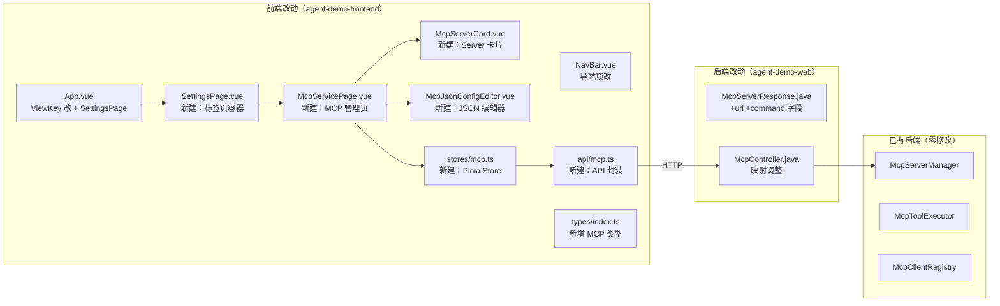
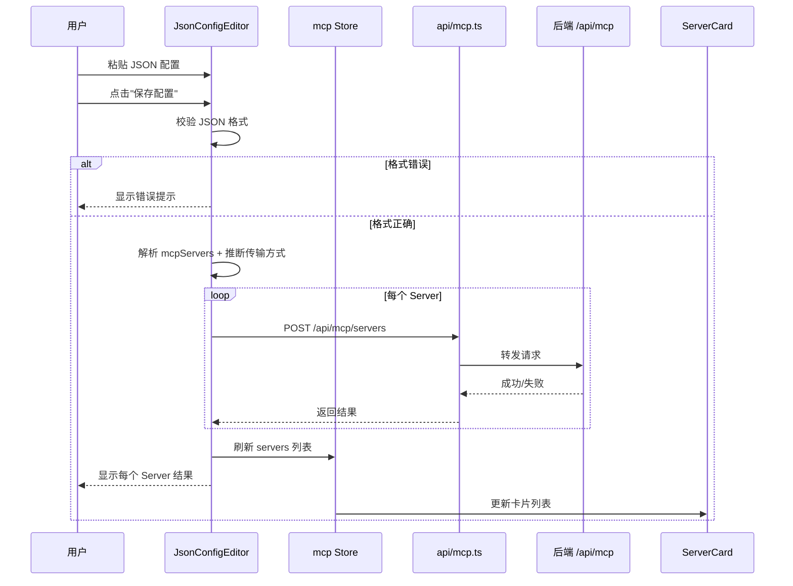

# 技术设计文档：MCP 服务管理页面

## 0. 设计概要 (Design Summary)

*   **功能描述**：创建统一设置页面（LLM 配置迁移 + MCP 服务管理新增），用户通过 JSON 配置编辑器（业界通用 mcpServers 格式）在页面上添加/删除/重连/查看 MCP Server。
*   **影响范围**：
    *   前端（主）：`agent-demo-frontend` — 4 个新组件 + 1 个 API 封装 + 1 个 Store + 类型定义 + 2 个组件修改
    *   后端（微）：`agent-demo-web` — 1 个 DTO 新增 2 个字段 + Controller 映射调整
*   **技术难点**：JSON 配置解析与传输方式自动推断（command->stdio, url->http, transport:sse->sse）、批量添加部分失败处理
*   **依赖关系**：依赖已有后端 MCP REST API（`/api/mcp/servers` CRUD + reconnect + tools），无新增后端接口

## 1. 架构概览 (Architecture Overview)

### 1.1 改动范围



### 1.2 数据流（JSON 配置添加 Server）



### 1.3 导航结构变更

```
旧结构:
  NavBar: 对话 | 知识库 | LLM 配置
  App.vue: currentView = 'chat' | 'knowledge' | 'llm-config'

新结构:
  NavBar: 对话 | 知识库 | 设置
  App.vue: currentView = 'chat' | 'knowledge' | 'settings'
  SettingsPage:
    Tab: LLM 配置 | MCP 服务
    Tab LLM -> <LlmConfigPage />（迁移，零修改）
    Tab MCP -> <McpServicePage />（新建）
```

## 2. API 设计 (API Design)

> 本次无新增后端接口，复用已有 5 个 REST API。仅修改 `McpServerResponse` DTO 新增 2 个字段。

### 2.1 接口列表

| 接口名称 | 方法 | 路径 | 描述 | 对应验收标准 |
| :--- | :--- | :--- | :--- | :--- |
| 查询 Server 列表 | GET | `/api/mcp/servers` | 获取所有 Server 列表 | AC-004, AC-005, AC-006 |
| 添加 Server | POST | `/api/mcp/servers` | 动态添加 Server 并连接 | AC-008, AC-009, AC-010, AC-011 |
| 删除 Server | DELETE | `/api/mcp/servers/{name}` | 删除 Server 并注销工具 | AC-012, AC-013 |
| 重连 Server | POST | `/api/mcp/servers/{name}/reconnect` | 重连断线 Server | AC-014, AC-015, AC-016 |
| 查询工具列表 | GET | `/api/mcp/servers/{name}/tools` | 获取 Server 暴露的工具 | AC-017, AC-018 |

### 2.2 后端 DTO 变更

#### McpServerResponse.java — 新增 2 个字段

```java
// 新增字段（用于前端卡片地址显示，AC-036）
private String url;      // sse/http Server 的连接 URL（stdio 类型为 null）
private String command;  // stdio Server 的执行命令（sse/http 类型为 null）
```

#### McpController.toServerResponse() — 映射调整

```java
private McpServerResponse toServerResponse(McpServer server) {
    McpServerResponse response = new McpServerResponse();
    response.setName(server.getName());
    response.setTransport(server.getTransport());
    response.setUrl(server.getUrl());           // 新增
    response.setCommand(server.getCommand());   // 新增
    response.setStatus(server.getStatus());
    response.setEnabled(server.isEnabled());
    response.setToolCount(server.getTools() != null ? server.getTools().size() : 0);
    response.setLastError(server.getLastError());
    response.setConnectTime(server.getConnectTime());
    return response;
}
```

### 2.3 前端 API 封装（api/mcp.ts）

```typescript
const API_BASE = '/api/mcp';

// 复用 llm.ts 中的 Result<T> 接口和 request<T>() 统一请求函数
async function request<T>(url: string, options?: RequestInit): Promise<T> {
  const response = await fetch(url, options);
  if (!response.ok) {
    const errorResult = await response.json().catch(() => null);
    throw new Error(errorResult?.message || '网络异常，请稍后重试');
  }
  const result: Result<T> = await response.json();
  if (!result.success) {
    throw new Error(result.message || '操作失败');
  }
  return result.data;
}

// API 方法
export function getServers(): Promise<McpServerInfo[]>
export function addServer(data: CreateMcpServerRequest): Promise<McpServerInfo>
export function deleteServer(name: string): Promise<void>
export function reconnectServer(name: string): Promise<McpServerInfo>
export function getServerTools(name: string): Promise<McpToolInfo[]>
```

## 3. 数据库设计 (Database Schema)

> 本项目无传统关系数据库，采用纯内存存储。本次不涉及数据存储变更。

## 4. 核心逻辑与算法 (Core Logic)

### 4.1 JSON 配置解析与传输方式推断

*   **触发条件**：用户在 JSON 配置编辑器中点击"保存配置"
*   **处理步骤**：
    1. JSON.parse 校验格式合法性（AC-019）
    2. 检查顶层 `mcpServers` 字段存在性（AC-020）
    3. 遍历每个 Server 条目，推断传输方式（AC-029/030/031）
    4. 校验必要字段（AC-021）
    5. 映射为 `CreateMcpServerRequest[]`

*   **传输方式推断逻辑**：

```
function inferTransport(serverConfig):
    if serverConfig has "command":
        return "STDIO"
    if serverConfig has "transport" and serverConfig.transport == "sse":
        return "SSE"
    if serverConfig has "url":
        return "HTTP"  // 默认
    throw Error("配置无效：必须包含 command 或 url 字段")
```

*   **字段映射表**：

| JSON 配置字段 | 后端请求字段 | 传输方式 | 说明 |
| :--- | :--- | :--- | :--- |
| `mcpServers` 的 key | `name` | 通用 | Server 名称 |
| `command` | `command` | STDIO | 执行命令 |
| `args` | `args` | STDIO | 命令参数数组 |
| `env` | `env` | STDIO | 环境变量 |
| `url` | `url` | SSE/HTTP | 连接 URL |
| `headers` | `headers` | SSE/HTTP | 请求头 |
| `transport` | `transport` | SSE | 显式指定（仅 sse 需要显式指定，http 为默认） |
| — | `enabled` | 通用 | 默认 `true` |

### 4.2 批量添加 Server

*   **触发条件**：JSON 配置包含多个 Server 条目
*   **处理步骤**：
    1. 解析 JSON 配置为 `CreateMcpServerRequest[]`
    2. 对每个请求依次调用 `POST /api/mcp/servers`
    3. 收集每个请求的结果（成功/失败 + 错误信息）
    4. 全部完成后：
       - 全部成功 -> 关闭弹窗 + 刷新列表 + Toast "添加成功"（AC-011）
       - 部分成功 -> 弹窗内显示结果列表 + 刷新列表（AC-024）
       - 全部失败 -> 弹窗不关闭 + 显示错误信息

*   **伪代码**：

```typescript
async function saveConfig(jsonText: string) {
  // 1. 解析
  const requests = parseMcpServersConfig(jsonText);

  // 2. 逐个添加
  const results: AddResult[] = [];
  for (const req of requests) {
    try {
      const server = await mcpApi.addServer(req);
      results.push({ name: req.name, success: true, server });
    } catch (e) {
      results.push({ name: req.name, success: false, error: e.message });
    }
  }

  // 3. 刷新列表
  await mcpStore.loadServers();

  // 4. 处理结果
  const allSuccess = results.every(r => r.success);
  const anySuccess = results.some(r => r.success);

  if (allSuccess) {
    emit('saved');
    toast.success('添加成功');
  } else {
    // 显示结果列表（AC-024）
    results.value = results;
  }
}
```

### 4.3 Server 卡片地址显示逻辑

```
function formatAddress(server: McpServerInfo): string {
  if (server.transport === 'STDIO') {
    // stdio: command + args 拼接
    return server.command + (server.args ? ' ' + server.args.join(' ') : '');
  } else {
    // sse/http: 显示 URL
    return server.url || '';
  }
}
```

## 5. 前端组件设计

### 5.1 组件树

```
App.vue
└── SettingsPage.vue (新建)
    ├── Tab: LLM 配置
    │   └── LlmConfigPage.vue (迁移，零修改)
    └── Tab: MCP 服务
        └── McpServicePage.vue (新建)
            ├── McpServerCard.vue (新建) × N
            └── McpJsonConfigEditor.vue (新建，模态弹窗)
```

### 5.2 组件接口定义

#### SettingsPage.vue

```typescript
// Props: 无
// State:
const activeTab = ref<'llm' | 'mcp'>('llm');

// Template:
// - 顶部标签页按钮组（LLM 配置 | MCP 服务）
// - v-if="activeTab === 'llm'" -> <LlmConfigPage />
// - v-if="activeTab === 'mcp'" -> <McpServicePage />
```

#### McpServicePage.vue

```typescript
// Props: 无
// 依赖: useMcpStore()
// State:
const showEditor = ref(false);
const expandedTools = ref<Record<string, McpToolInfo[]>>({});

// Actions:
onMounted(() => mcpStore.loadServers());
function handleAdd() { showEditor.value = true; }
async function handleDelete(name: string) { await mcpStore.deleteServer(name); }
async function handleReconnect(name: string) { await mcpStore.reconnectServer(name); }
async function toggleTools(name: string) { /* 加载/折叠工具列表 */ }
```

#### McpServerCard.vue

```typescript
// Props:
defineProps<{
  server: McpServerInfo;
  tools: McpToolInfo[] | null;
}>();

// Events:
defineEmits<{
  delete: [name: string];
  reconnect: [name: string];
  toggleTools: [name: string];
}>();

// Computed:
const address = computed(() => formatAddress(props.server));
const statusColor = computed(() => STATUS_COLORS[props.server.status]);
const canReconnect = computed(() =>
  props.server.status === 'DISCONNECTED' || props.server.status === 'ERROR'
);
```

#### McpJsonConfigEditor.vue

```typescript
// Props:
defineProps<{ visible: boolean }>();

// Events:
defineEmits<{ close: []; saved: [] }>();

// State:
const jsonText = ref('');
const loading = ref(false);
const results = ref<AddResult[] | null>(null);
const showFormatHelp = ref(false);

// Actions:
async function handleSave() {
  loading.value = true;
  results.value = null;
  try {
    const requests = parseMcpServersConfig(jsonText.value);
    const addResults: AddResult[] = [];
    for (const req of requests) {
      try {
        await mcpApi.addServer(req);
        addResults.push({ name: req.name, success: true });
      } catch (e) {
        addResults.push({ name: req.name, success: false, error: e.message });
      }
    }
    results.value = addResults;
    if (addResults.every(r => r.success)) {
      emit('saved');
    }
  } catch (e) {
    // JSON 解析错误
    results.value = [{ name: '', success: false, error: e.message }];
  } finally {
    loading.value = false;
  }
}
```

### 5.3 前端类型定义（types/index.ts 新增）

```typescript
// ========== MCP 服务管理相关类型 ==========

/** MCP 传输方式 */
type McpTransportType = 'STDIO' | 'SSE' | 'HTTP';

/** MCP Server 状态 */
type McpServerStatus = 'CONNECTED' | 'DISCONNECTED' | 'ERROR' | 'DISABLED';

/** MCP Server 信息（后端响应映射） */
interface McpServerInfo {
  name: string;
  transport: McpTransportType;
  status: McpServerStatus;
  enabled: boolean;
  toolCount: number;
  lastError: string | null;
  connectTime: string | null;
  url: string | null;       // 新增字段
  command: string | null;   // 新增字段
}

/** MCP 工具信息 */
interface McpToolInfo {
  originalName: string;
  registeredName: string;
  description: string;
  parametersSchema: string;
}

/** 添加 MCP Server 请求体 */
interface CreateMcpServerRequest {
  name: string;
  transport: McpTransportType;
  enabled: boolean;
  command?: string;
  args?: string[];
  env?: Record<string, string>;
  url?: string;
  headers?: Record<string, string>;
}

/** 批量添加结果 */
interface AddResult {
  name: string;
  success: boolean;
  error?: string;
}
```

### 5.4 Pinia Store 设计（stores/mcp.ts）

```typescript
export const useMcpStore = defineStore('mcp', {
  state: () => ({
    servers: [] as McpServerInfo[],
    loading: false,
    toolsCache: {} as Record<string, McpToolInfo[]>,
  }),

  actions: {
    async loadServers() {
      this.loading = true;
      try {
        this.servers = await mcpApi.getServers();
      } finally {
        this.loading = false;
      }
    },

    async deleteServer(name: string) {
      await mcpApi.deleteServer(name);
      await this.loadServers(); // 自动刷新
    },

    async reconnectServer(name: string) {
      this.loading = true;
      try {
        await mcpApi.reconnectServer(name);
        await this.loadServers(); // 自动刷新
      } finally {
        this.loading = false;
      }
    },

    async loadServerTools(name: string) {
      const tools = await mcpApi.getServerTools(name);
      this.toolsCache[name] = tools;
    },
  },
});
```

## 6. 异常处理 (Error Handling)

| 异常场景 | 对应验收标准 | 处理方案 | 用户提示 |
| :--- | :--- | :--- | :--- |
| JSON 格式错误 | AC-019 | 前端 JSON.parse catch，不发起 API 请求 | "JSON 格式错误：[详情]" |
| 缺少 mcpServers 字段 | AC-020 | 前端校验后拦截 | "配置必须包含 mcpServers 字段" |
| Server 配置缺少必要字段 | AC-021 | 前端校验后拦截 | "Server '{name}' 配置无效：必须包含 command 或 url" |
| 名称重复 | AC-022 | 后端返回 5402，前端显示错误 | "{name}: MCP Server 名称已存在" |
| 连接失败 | AC-023 | 后端返回 5400，前端显示错误 | "{name}: MCP 连接失败：[详情]" |
| 部分成功部分失败 | AC-024 | 逐个处理，收集结果，弹窗保持打开 | 显示每个 Server 的成功/失败状态 |
| 重连已连接 Server | AC-016 | 后端返回 5406，前端显示错误 | "MCP Server 已连接，无需重连" |
| 删除不存在的 Server | AC-025 | 后端返回 5403，前端显示错误 | "MCP Server 不存在" |
| MCP 模块禁用 | AC-026 | 后端返回 5405，前端禁用操作 | "MCP 模块已禁用，请在配置中启用" |
| 网络异常 | AC-027 | request<T>() catch fetch 错误 | "网络异常，请检查后端服务是否运行" |
| 重复提交 | AC-028 | loading 状态 + 按钮 disabled | 按钮不可点击 |

## 7. 验收标准映射 (AC Mapping)

| 验收标准 ID | 验收标准描述 | 对应技术实现 |
| :--- | :--- | :--- |
| AC-001 | 设置页面导航 | App.vue ViewKey 改为 'settings' + SettingsPage.vue 标签页容器 |
| AC-002 | 切换到 MCP 服务标签页 | SettingsPage.vue activeTab 状态切换 |
| AC-003 | 切换回 LLM 配置标签页 | SettingsPage.vue 标签页保持状态（LlmConfigPage 迁移零修改） |
| AC-004 | 查看 Server 列表 | McpServicePage onMounted -> mcpStore.loadServers() -> GET /api/mcp/servers |
| AC-005 | 状态徽章颜色 | McpServerCard statusColor computed（CONNECTED->green, DISCONNECTED->gray, ERROR->red, DISABLED->orange） |
| AC-006 | 空列表引导 | McpServicePage v-if="servers.length === 0" 空状态 |
| AC-007 | 打开 JSON 配置编辑器 | McpServicePage "添加服务"按钮 -> showEditor=true -> McpJsonConfigEditor visible |
| AC-008 | stdio 添加成功 | parseMcpServersConfig 推断 STDIO -> POST /api/mcp/servers |
| AC-009 | http 添加成功 | parseMcpServersConfig 推断 HTTP（有 url 无 command） |
| AC-010 | SSE 添加成功 | parseMcpServersConfig 识别 transport:"sse" |
| AC-011 | 批量添加 | for 循环逐个调用 POST，全部成功后关闭弹窗 |
| AC-012 | 删除成功 | mcpStore.deleteServer -> DELETE /api/mcp/servers/{name} |
| AC-013 | 删除二次确认 | window.confirm("确认删除 {name}？将断开连接并注销所有工具。") |
| AC-014 | 重连成功 | mcpStore.reconnectServer -> POST /api/mcp/servers/{name}/reconnect |
| AC-015 | 重连按钮可用性 | McpServerCard canReconnect computed（仅 DISCONNECTED/ERROR 可点击） |
| AC-016 | 重连已连接报错 | 后端返回 5406 -> request<T>() throw -> catch 显示错误 |
| AC-017 | 工具列表展示 | McpServerCard 显示 server.toolCount |
| AC-018 | 展开工具详情 | toggleTools -> mcpStore.loadServerTools -> GET /api/mcp/servers/{name}/tools |
| AC-019 | JSON 格式校验 | JSON.parse try-catch |
| AC-020 | 缺少 mcpServers | 校验 config.mcpServers 存在性 |
| AC-021 | 缺少必要字段 | 校验 command 或 url 存在性 |
| AC-022 | 名称重复 | 后端 5402 错误 -> 前端显示 |
| AC-023 | 连接失败 | 后端 5400 错误 -> 前端显示 |
| AC-024 | 部分成功部分失败 | results 数组收集 -> 弹窗保持打开 |
| AC-025 | 删除不存在 | 后端 5403 错误 -> 前端显示 |
| AC-026 | MCP 模块禁用 | 后端 5405 错误 -> 前端禁用操作 |
| AC-027 | 网络异常 | request<T>() fetch catch -> 显示错误 |
| AC-028 | 重复提交防护 | loading ref + button :disabled |
| AC-029 | 传输推断 stdio | parseMcpServersConfig: has command -> STDIO |
| AC-030 | 传输推断 HTTP | parseMcpServersConfig: has url, no command, no transport -> HTTP |
| AC-031 | 传输推断 SSE | parseMcpServersConfig: transport === 'sse' -> SSE |
| AC-032 | Headers 传递 | 解析 headers 字段 -> CreateMcpServerRequest.headers |
| AC-033 | env 传递 | 解析 env 字段 -> CreateMcpServerRequest.env |
| AC-034 | 操作后自动刷新 | Store actions 中 await loadServers() |
| AC-035 | LLM 配置无回归 | LlmConfigPage 迁移零修改，仅包裹在 SettingsPage 标签页中 |
| AC-036 | 卡片地址显示 | McpServerCard formatAddress: STDIO->command+args, SSE/HTTP->url（需后端 DTO 新增字段） |

## 8. 技术决策说明 (Technical Decisions)

*   **决策 1：JSON 配置编辑器 vs 表单填空**
    *   选择：JSON 配置编辑器
    *   理由：与 Claude Desktop / Cursor 业界通用格式一致，用户可直接粘贴复用配置；支持所有传输方式（含 stdio）；一次可添加多个 Server

*   **决策 2：传输方式自动推断 vs 用户显式选择**
    *   选择：自动推断（command->stdio, url->http, transport:sse->sse）
    *   理由：降低用户认知负担；业界通用 JSON 配置中不包含显式 transport 字段，通过字段类型推断是标准做法

*   **决策 3：前端解析 JSON vs 后端新增批量接口**
    *   选择：前端解析 JSON + 逐个调用已有 POST 接口
    *   理由：后端零新增接口，复用已有 `POST /api/mcp/servers`；前端解析逻辑简单（JSON.parse + 字段映射）；逐个调用便于独立错误处理（部分失败不影响其他）

*   **决策 4：后端 DTO 新增 url/command 字段**
    *   选择：在 McpServerResponse 新增 url 和 command 字段
    *   理由：AC-036 要求卡片显示 Server 地址（stdio 显示 command+args，sse/http 显示 url），现有 DTO 不包含这些字段；McpServer 实体已有这些字段，仅需在响应 DTO 中映射出来

*   **决策 5：LlmConfigPage 迁移方式**
    *   选择：零修改包裹，在 SettingsPage 中通过标签页条件渲染
    *   理由：LlmConfigPage 已是独立组件，直接嵌入标签页即可；ChatWindow 的 `navigateToConfig` 事件改为设置 `currentView = 'settings'` + `activeTab = 'llm'`

## 9. 风险与注意事项 (Risks & Notes)

*   **技术风险**：stdio 传输方式允许用户通过页面配置执行任意命令（如 `npx mcp-fetch-server`），存在安全风险。本项目为学习示例工程，暂不做安全限制。生产环境应考虑命令白名单或禁用 stdio。
*   **兼容性**：NavBar 的 `ViewKey` 类型变更影响 App.vue 和 ChatWindow.vue 的 `navigateToConfig` 事件，需同步修改。
*   **Windows 适配**：stdio 模式在 Windows 下需使用 `npx.cmd`（而非 `npx`），用户在 JSON 配置中需自行注意。可在配置格式说明中提示。
*   **性能影响**：批量添加 Server 时逐个调用 API，如果 Server 数量较多（>10）会有延迟。但实际场景中用户一次添加 1-3 个 Server，性能可接受。
*   **回滚方案**：前端改动为主，回滚仅需还原 App.vue、NavBar.vue 的 ViewKey 类型 + 删除新增组件文件。后端 DTO 新增字段为可选字段（null 兼容），回滚安全。
