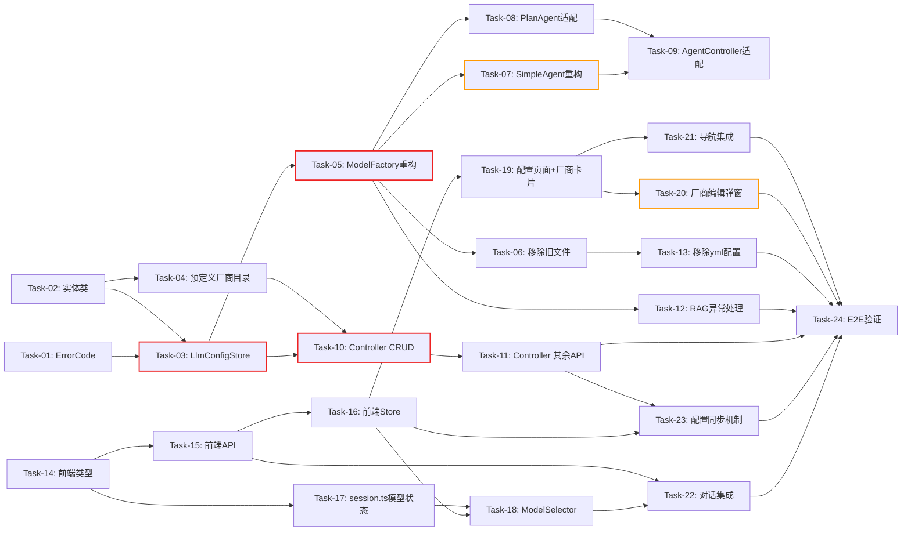

# 开发任务计划: LLM 厂商模型配置

## 0. 任务概览 (Task Overview)

*   **总任务数**: 24 个
*   **预计总工时**: 1360 分钟（约 23 小时）
*   **开发方法**: TDD（测试驱动开发）- 每个任务按 Red-Green-Refactor 循环执行
*   **关键里程碑**:
    *   阶段一~二完成（后端核心就绪）：约 470m
    *   阶段三~四完成（后端接口+配置清理）：约 665m
    *   阶段五~六完成（前端全部就绪）：约 1225m
    *   整体完成：约 1360m
*   **风险任务**: Task-05（ModelFactory 完整重构）、Task-07（SimpleAgent delegate 缓存重构）、Task-20（VendorEditDialog 复杂表单）
*   **阻塞任务**: Task-03（LlmConfigStore）、Task-05（ModelFactory）、Task-10（Controller CRUD）

### 依赖关系图

### 可并行任务组

| 并行组 | 可同时执行的任务 | 说明 |
| :--- | :--- | :--- |
| 1 | Task-01 + Task-02 + Task-14 | 错误码、实体类、前端类型定义互不依赖 |
| 2 | Task-03 + Task-04 | 配置存储与预定义目录均依赖实体类但互不依赖 |
| 3 | Task-07 + Task-08 + Task-12 | SimpleAgent/PlanAgent/RAG 均依赖 ModelFactory 但互不依赖 |
| 4 | Task-15 + Task-17 | 前端 API 封装与会话状态均依赖前端类型但互不依赖 |
| 5 | Task-18 + Task-19 | 模型选择器与配置页面依赖不同前端模块 |

## 1. 准备工作 (Preparation)

- [ ] **Prep-01**: 确认 JDK 17 和 Maven 环境就绪
    *   说明：`$env:JAVA_HOME="D:\Java\jdk-17.0.7"`，验证 `mvn -version`
    *   验证：Maven 命令可正常执行
- [ ] **Prep-02**: 确认前端开发环境就绪
    *   说明：在 `agent-demo-frontend/` 执行 `npm install`
    *   验证：`npm run dev` 可正常启动
- [ ] **Prep-03**: 确认现有测试可运行
    *   说明：后端 `mvn compile` + 前端 `npm run build` 均通过
    *   验证：现有代码基线编译无误

## 2. 开发任务 (Development Tasks)

### 阶段一：后端数据层 (Backend Data Layer)
> 先完成配置实体、内存存储和预定义厂商目录
>
> **阶段完成标准**: LlmConfigStore CRUD 正常、预定义厂商目录可查询、相关单元测试全部通过

- [ ] **Task-01**: ErrorCode 新增 LLM 配置错误码
    *   **通俗解释**: 做完这步后，系统在遇到"厂商不存在""模型未配置"等问题时，能给出具体的错误编号和提示信息。
    *   **说明**: 在 ErrorCode 枚举中新增 8 个 LLM 配置相关错误码（5008-5015）
    *   **涉及文件**: `agent-demo-common/src/main/java/com/agentdemo/common/exception/ErrorCode.java`
    *   **测试文件**: `agent-demo-common/src/test/java/com/agentdemo/common/exception/ErrorCodeTest.java`
    *   **参考**: 技术方案 Sec 5.1
    *   **对应AC**: AC-018, AC-020, AC-022
    *   **预估工时**: 20m
    *   **依赖**: 无
    *   **验证标准**（TDD RED 阶段的测试依据）:
        - [ ] ErrorCode 枚举包含 LLM_CONFIG_NOT_FOUND(5008)
        - [ ] ErrorCode 枚举包含 LLM_VENDOR_NOT_FOUND(5009)
        - [ ] ErrorCode 枚举包含 LLM_MODEL_NOT_FOUND(5010)
        - [ ] ErrorCode 枚举包含 LLM_VENDOR_NAME_EXISTS(5011)
        - [ ] ErrorCode 枚举包含 LLM_MODEL_NAME_EXISTS(5012)
        - [ ] ErrorCode 枚举包含 LLM_CONNECTION_TEST_FAILED(5013)
        - [ ] ErrorCode 枚举包含 LLM_NO_CHAT_MODEL(5014)
        - [ ] ErrorCode 枚举包含 LLM_NO_EMBEDDING_MODEL(5015)

- [ ] **Task-02**: LlmModelConfig + LlmVendorConfig 实体类
    *   **通俗解释**: 做完这步后，系统有了描述"一个AI厂商长什么样"和"一个AI模型有哪些属性"的数据结构。
    *   **说明**: 创建厂商配置和模型配置两个实体类，使用 Lombok @Data
    *   **涉及文件**: `agent-demo-llm/src/main/java/com/agentdemo/llm/config/LlmVendorConfig.java`, `LlmModelConfig.java`
    *   **测试文件**: `agent-demo-llm/src/test/java/com/agentdemo/llm/config/LlmConfigEntityTest.java`
    *   **参考**: 技术方案 Sec 3.2, 3.3
    *   **对应AC**: AC-024
    *   **预估工时**: 30m
    *   **依赖**: 无
    *   **验证标准**:
        - [ ] LlmVendorConfig 包含字段: id, name, type, baseUrl, apiKey, thinkingTrigger, timeout(Duration), maxRetries(int), temperature(double), models(List<LlmModelConfig>)
        - [ ] LlmModelConfig 包含字段: id, vendorId, modelName, displayName, type, supportsVision(boolean)
        - [ ] LlmModelConfig.type 接受值: "chat", "embedding", "rerank", "multimodal"
        - [ ] LlmVendorConfig.thinkingTrigger 接受值: "enabled", "none"
        - [ ] 默认值: timeout=60s, maxRetries=3, temperature=0.7, supportsVision=false

- [ ] **Task-03**: 🔒 LlmConfigStore 内存配置存储
    *   **通俗解释**: 做完这步后，系统有了一个专门管理所有AI厂商和模型配置的"仓库"，可以增删改查。
    *   **说明**: 创建 @Component 内存配置存储，使用 ConcurrentHashMap，包含 CRUD、查询、校验方法
    *   **涉及文件**: `agent-demo-llm/src/main/java/com/agentdemo/llm/config/LlmConfigStore.java`
    *   **测试文件**: `agent-demo-llm/src/test/java/com/agentdemo/llm/config/LlmConfigStoreTest.java`
    *   **参考**: 技术方案 Sec 3.1, 4.1
    *   **对应AC**: AC-001, AC-002, AC-011, AC-018, AC-022
    *   **预估工时**: 60m
    *   **依赖**: Task-01, Task-02
    *   **阻塞标注**: 后续 ModelFactory 和 Controller 均依赖此任务
    *   **验证标准**:
        - [ ] addVendor(vendor) 成功添加，自动生成 id，返回完整 vendor
        - [ ] addVendor 重复 name 抛出 BusinessException(LLM_VENDOR_NAME_EXISTS)
        - [ ] addVendor 同厂商同 type 下重复 modelName 抛出 BusinessException(LLM_MODEL_NAME_EXISTS)
        - [ ] addVendor name 为空抛出 BusinessException(PARAM_INVALID)
        - [ ] addVendor baseUrl 为空抛出 BusinessException(PARAM_INVALID)
        - [ ] addVendor apiKey 为空抛出 BusinessException(PARAM_INVALID)
        - [ ] addVendor models 中 modelName 为空抛出 BusinessException(PARAM_INVALID)
        - [ ] updateVendor(id, vendor) 更新成功，apiKey 为空时保留原值
        - [ ] updateVendor 不存在 id 抛出 BusinessException(LLM_VENDOR_NOT_FOUND)
        - [ ] updateVendor name 与其他厂商重复抛出 BusinessException(LLM_VENDOR_NAME_EXISTS)
        - [ ] deleteVendor(id) 删除成功，连带删除所有模型
        - [ ] deleteVendor 不存在 id 抛出 BusinessException(LLM_VENDOR_NOT_FOUND)
        - [ ] getVendor(id) 返回厂商，不存在返回 null
        - [ ] getAllVendors() 返回所有厂商列表
        - [ ] getModel(modelId) 返回模型配置，不存在返回 null
        - [ ] getFirstChatModel() 返回第一个 chat 模型，无则返回 null
        - [ ] getFirstEmbeddingModel() 返回第一个 embedding 模型，无则返回 null
        - [ ] hasConfig() 无厂商返回 false，有厂商返回 true
        - [ ] clear() 清空所有配置
        - [ ] replaceAll(vendors) 批量替换所有配置（sync 用）

- [ ] **Task-04**: PredefinedVendorCatalog 预定义厂商目录
    *   **通俗解释**: 做完这步后，用户在添加厂商时可以从"火山引擎""阿里百炼"等预置选项中快速选择，不用手动填所有信息。
    *   **说明**: 创建 @Component 预定义厂商目录，提供静态厂商列表和常用模型
    *   **涉及文件**: `agent-demo-llm/src/main/java/com/agentdemo/llm/config/PredefinedVendorCatalog.java`
    *   **测试文件**: `agent-demo-llm/src/test/java/com/agentdemo/llm/config/PredefinedVendorCatalogTest.java`
    *   **参考**: 技术方案 Sec 3.4, 接口 1
    *   **对应AC**: AC-001, AC-023
    *   **预估工时**: 30m
    *   **依赖**: Task-02
    *   **验证标准**:
        - [ ] getPredefinedVendors() 返回至少 5 个预定义厂商
        - [ ] 包含 code="ark" name="火山引擎方舟" baseUrl 含 ark.cn-beijing.volces.com thinkingTrigger="enabled"
        - [ ] 包含 code="bailian" name="阿里百炼" baseUrl 含 dashscope.aliyuncs.com thinkingTrigger="none"
        - [ ] 包含 code="openai" name="OpenAI" baseUrl 含 api.openai.com
        - [ ] 包含 code="deepseek" name="DeepSeek"
        - [ ] 包含 code="ollama" name="Ollama (本地)" models 为空列表
        - [ ] 火山引擎模型列表包含 chat 类型模型（含 displayName）
        - [ ] 火山引擎 chat 模型中 doubao-vision-pro 的 supportsVision=true
        - [ ] 阿里百炼模型列表包含 embedding 类型模型

### 阶段二：后端核心重构 (Backend Core Refactor)
> 重构 ModelFactory、SimpleAgent、PlanAgent，移除旧 Provider 模式
>
> **阶段完成标准**: ModelFactory 从 LlmConfigStore 创建模型实例、SimpleAgent 支持 per-modelId delegate、旧 Provider/Properties 文件已移除、后端编译通过

- [ ] **Task-05**: ⚠️ 🔒 ModelFactory 重构
    *   **通俗解释**: 做完这步后，系统不再依赖配置文件来创建AI模型，而是根据用户在前端配置的信息动态创建模型实例。
    *   **说明**: 完全重构 ModelFactory，移除 Provider 路由，从 LlmConfigStore 读取配置创建 OpenAI 兼容模型实例，按 vendorId+modelName 缓存
    *   **涉及文件**: `agent-demo-llm/src/main/java/com/agentdemo/llm/registry/ModelFactory.java`
    *   **测试文件**: `agent-demo-llm/src/test/java/com/agentdemo/llm/registry/ModelFactoryTest.java`
    *   **参考**: 技术方案 Sec 4.1, 决策 1
    *   **对应AC**: AC-006, AC-026, AC-027
    *   **预估工时**: 120m
    *   **依赖**: Task-03
    *   **风险标注**: 核心架构变更，SimpleAgent/PlanAgent/DocumentService/EmbeddingStoreFactory 均依赖此任务
    *   **阻塞标注**: 后续 7 个任务依赖此任务
    *   **验证标准**:
        - [ ] 构造器注入 LlmConfigStore（不注入 LlmProperties 和 List<LlmServiceProvider>）
        - [ ] 无 providerRegistry 字段
        - [ ] getChatModelByModelId(modelId) 从 LlmConfigStore 查找模型，创建 OpenAiChatModel 并缓存
        - [ ] getChatModelByModelId 不存在 modelId 抛出 BusinessException(LLM_MODEL_NOT_FOUND)
        - [ ] getChatModelByModelId 非 chat 类型抛出 BusinessException(LLM_MODEL_NOT_FOUND)
        - [ ] getDefaultChatModel() 返回第一个 chat 模型实例
        - [ ] getDefaultChatModel() 无 chat 模型抛出 BusinessException(LLM_NO_CHAT_MODEL)
        - [ ] getStreamingChatModelByModelId(modelId) 创建 OpenAiStreamingChatModel 并缓存
        - [ ] getDefaultStreamingChatModel() 同理
        - [ ] getThinkingStreamingChatModelByModelId(modelId) 按 vendor.thinkingTrigger 选择实现类
        - [ ] thinkingTrigger="enabled" 时创建 ArkThinkingStreamingChatModel
        - [ ] thinkingTrigger="none" 时创建 BailianThinkingStreamingChatModel
        - [ ] getDefaultThinkingStreamingChatModel() 同理
        - [ ] getEmbeddingModel() 返回第一个 embedding 模型实例
        - [ ] getEmbeddingModel() 无 embedding 模型抛出 BusinessException(LLM_NO_EMBEDDING_MODEL)
        - [ ] 相同 vendorId+modelName 第二次调用返回同一缓存实例
        - [ ] clearCacheForVendor(vendorId) 清除指定厂商的所有缓存
        - [ ] clearAllCache() 清除全部缓存

- [ ] **Task-06**: 移除旧 Provider/Properties/capability 文件
    *   **通俗解释**: 做完这步后，项目中不再有旧的静态配置相关代码，系统更加简洁。
    *   **说明**: 删除 14 个旧文件（Properties 类 6 个、Provider 类 3 个、capability 接口 5 个），确保无残留引用
    *   **涉及文件**: 见技术方案 Sec 9.5 移除文件清单
    *   **测试文件**: 无（编译验证为主）
    *   **参考**: 技术方案 Sec 9.5
    *   **对应AC**: 间接支持所有 AC
    *   **预估工时**: 30m
    *   **依赖**: Task-05
    *   **验证标准**:
        - [ ] 删除 LlmProperties, ArkProperties, BailianProperties, LlmProvider, LlmProviderConfig, LlmConfig
        - [ ] 删除 LlmServiceProvider, ArkLlmServiceProvider, BailianLlmServiceProvider
        - [ ] 删除 capability 包下所有接口（ChatModelProvider 等 5 个）
        - [ ] `mvn compile -pl agent-demo-llm -am` 编译通过
        - [ ] 全项目 `mvn compile` 编译通过（需配合 Task-07/08/09/12 修改调用方）

- [ ] **Task-07**: ⚠️ SimpleAgent delegate 缓存重构
    *   **通俗解释**: 做完这步后，每个对话会话可以使用不同的AI模型，系统能同时维护多个模型对应的对话代理。
    *   **说明**: 将 SimpleAgent 的单一 volatile delegate 改为 ConcurrentHashMap<String, BaseAgent>，新增带 modelId 的重载方法
    *   **涉及文件**: `agent-demo-agent/src/main/java/com/agentdemo/agent/single/SimpleAgent.java`
    *   **测试文件**: `agent-demo-agent/src/test/java/com/agentdemo/agent/single/SimpleAgentTest.java`
    *   **参考**: 技术方案 Sec 4.2, 决策 3
    *   **对应AC**: AC-006, AC-007, AC-030
    *   **预估工时**: 90m
    *   **依赖**: Task-05
    *   **风险标注**: delegate 缓存并发安全需仔细处理
    *   **验证标准**:
        - [ ] delegateCache 为 ConcurrentHashMap<String, BaseAgent>
        - [ ] delegateToolCounts 为 ConcurrentHashMap<String, Integer>
        - [ ] chat(sessionId, message, modelId) 使用指定 modelId 的 delegate
        - [ ] chat(sessionId, message) 使用 null modelId（等价 "default" key）
        - [ ] chatStream(sessionId, message, modelId) 同理
        - [ ] chatThinkingReActStream(sessionId, message, modelId) 使用指定 modelId 的 thinkingModel
        - [ ] getDelegate(modelId) 相同 modelId 返回同一 delegate 实例
        - [ ] getDelegate(null) 使用 "default" 作为 cacheKey
        - [ ] Tool 数量变化时对应 modelId 的 delegate 被重建
        - [ ] 不同 modelId 的 delegate 互不影响（Tool 变化只重建对应的）
        - [ ] synchronized 双重检查锁保证并发安全

- [ ] **Task-08**: PlanAgent modelId 支持
    *   **通俗解释**: 做完这步后，任务拆解模式也支持用户选择不同的AI模型。
    *   **说明**: PlanAgent 新增带 modelId 的重载方法，内部使用 ModelFactory 获取指定模型
    *   **涉及文件**: `agent-demo-agent/src/main/java/com/agentdemo/agent/single/PlanAgent.java`
    *   **测试文件**: `agent-demo-agent/src/test/java/com/agentdemo/agent/single/PlanAgentTest.java`
    *   **参考**: 技术方案 Sec 4.2
    *   **对应AC**: AC-006
    *   **预估工时**: 60m
    *   **依赖**: Task-05
    *   **验证标准**:
        - [ ] chatTaskBreakdownStream(sessionId, message, modelId, ...) 新增 modelId 参数
        - [ ] chatTaskBreakdownStream(sessionId, message, ...) 保留原签名（modelId=null）
        - [ ] 内部使用 modelFactory.getThinkingStreamingChatModelByModelId(modelId) 获取思考模型
        - [ ] modelId=null 时使用 getDefaultThinkingStreamingChatModel()

- [ ] **Task-09**: AgentController + ChatRequest modelId 传递
    *   **通俗解释**: 做完这步后，前端发送的对话请求中携带的模型选择信息能被后端正确接收和使用。
    *   **说明**: ChatRequest.model 字段注释更新，AgentController 各对话路径传递 modelId 给 Agent
    *   **涉及文件**: `agent-demo-web/src/main/java/com/agentdemo/web/controller/AgentController.java`, `dto/ChatRequest.java`
    *   **测试文件**: `agent-demo-web/src/test/java/com/agentdemo/web/controller/AgentControllerTest.java`
    *   **参考**: 技术方案 Sec 2.3
    *   **对应AC**: AC-006, AC-016
    *   **预估工时**: 30m
    *   **依赖**: Task-07, Task-08
    *   **验证标准**:
        - [ ] ChatRequest.model 注释更新为"模型 ID（可选，为空使用第一个可用 chat 模型）"
        - [ ] chatStream 方法读取 request.getModel() 传给 simpleAgent.chatStream(sessionId, message, modelId)
        - [ ] chat 方法同理
        - [ ] enableThinking 路径传 modelId 给 chatThinkingReActStream
        - [ ] enableTaskBreakdown 路径传 modelId 给 planAgent.chatTaskBreakdownStream
        - [ ] modelId 为 null 时不报错（使用默认模型）

### 阶段三：后端接口层 (Backend Interface Layer)
> 实现 LLM 配置管理 REST API
>
> **阶段完成标准**: 9 个 API 接口全部可用、参数校验正常、API Key 脱敏、测试连接功能正常

- [ ] **Task-10**: 🔒 LlmConfigController DTOs + Vendor CRUD API
    *   **通俗解释**: 做完这步后，前端可以通过接口获取、添加、修改、删除AI厂商配置，也能获取预定义厂商列表。
    *   **说明**: 创建 LlmConfigController、DTO 类、实现预定义厂商查询 + 厂商 CRUD 5 个接口
    *   **涉及文件**: `agent-demo-web/src/main/java/com/agentdemo/web/controller/LlmConfigController.java`, `dto/VendorRequest.java`, `dto/VendorResponse.java`, `dto/ModelResponse.java`, `dto/PredefinedVendorResponse.java`
    *   **测试文件**: `agent-demo-web/src/test/java/com/agentdemo/web/controller/LlmConfigControllerTest.java`
    *   **参考**: 技术方案 Sec 2.2 接口 1-5
    *   **对应AC**: AC-001, AC-002, AC-003, AC-010, AC-011, AC-012, AC-018, AC-019, AC-020, AC-022, AC-023
    *   **预估工时**: 90m
    *   **依赖**: Task-03, Task-04, Task-05
    *   **阻塞标注**: 前端 API 封装依赖此任务
    *   **验证标准**:
        - [ ] GET /api/llm/config/predefined 返回 200 + 预定义厂商列表（含模型）
        - [ ] GET /api/llm/config/vendors 返回 200 + 已配置厂商列表
        - [ ] VendorResponse 中 apiKeyMasked 脱敏（保留后 4 位，如 sk-****7890）
        - [ ] VendorResponse 中 apiKeyConfigured 反映是否有 API Key
        - [ ] POST /api/llm/config/vendors 添加成功返回 200 + 完整厂商信息（apiKey 脱敏）
        - [ ] POST 重复 name 返回 5011 + "厂商名称已存在"
        - [ ] POST 缺少 name 返回 400
        - [ ] POST 缺少 baseUrl 返回 400
        - [ ] POST 缺少 apiKey 返回 400
        - [ ] POST 同类型同名模型返回 5012
        - [ ] PUT /api/llm/config/vendors/{id} 更新成功
        - [ ] PUT apiKey 为空时保留原值
        - [ ] PUT 不存在 id 返回 5009
        - [ ] DELETE /api/llm/config/vendors/{id} 删除成功返回 200
        - [ ] DELETE 不存在 id 返回 5009
        - [ ] 添加/编辑/删除后调用 modelFactory.clearCacheForVendor(id)

- [ ] **Task-11**: LlmConfigController 测试连接 + 模型查询 + 状态 + 同步 API
    *   **通俗解释**: 做完这步后，用户可以测试API Key是否有效、获取可用模型列表、检查配置状态，以及后端重启后恢复配置。
    *   **说明**: 实现测试连接、模型查询、配置状态、同步配置 4 个接口
    *   **涉及文件**: `LlmConfigController.java`（扩展）, `dto/TestConnectionRequest.java`, `dto/TestConnectionResponse.java`, `dto/SyncConfigRequest.java`, `dto/ConfigStatusResponse.java`
    *   **测试文件**: `LlmConfigControllerTest.java`（扩展）
    *   **参考**: 技术方案 Sec 2.2 接口 6-9
    *   **对应AC**: AC-005, AC-015, AC-013, AC-014, AC-009, AC-021, AC-025
    *   **预估工时**: 60m
    *   **依赖**: Task-10
    *   **验证标准**:
        - [ ] POST /api/llm/config/test 有效 Key 返回 data.success=true
        - [ ] POST /api/llm/config/test 无效 Key 返回 data.success=false + message 含"无效"
        - [ ] POST /api/llm/config/test 网络不通返回 data.success=false + 网络错误描述
        - [ ] POST /api/llm/config/test 返回 latency 毫秒数
        - [ ] GET /api/llm/config/models 返回所有模型列表
        - [ ] GET /api/llm/config/models?type=chat 仅返回 chat 类型
        - [ ] GET /api/llm/config/models?type=embedding 仅返回 embedding 类型
        - [ ] 模型列表每项包含 vendorId, vendorName, modelName, displayName, type, supportsVision
        - [ ] GET /api/llm/config/status 无配置返回 hasConfig=false
        - [ ] GET /api/llm/config/status 无 chat 模型返回 hasChatModel=false
        - [ ] GET /api/llm/config/status 有配置返回 vendorCount, chatModelCount
        - [ ] POST /api/llm/config/sync 成功恢复返回 vendorCount, modelCount
        - [ ] POST /api/llm/config/sync 后 LlmConfigStore 包含传入配置

### 阶段四：RAG 适配 + 配置清理 (RAG Adaptation & Config Cleanup)
> 适配 RAG 模块的 embedding 模型获取，移除 yml LLM 配置
>
> **阶段完成标准**: RAG 在无 embedding 模型时正确报错、application.yml 无 LLM 配置段、项目启动正常

- [ ] **Task-12**: RAG DocumentService/EmbeddingStoreFactory 异常处理
    *   **通俗解释**: 做完这步后，如果用户没配置向量化模型就上传文档，系统会提示"请先配置 embedding 模型"，而不是报错崩溃。
    *   **说明**: DocumentService 和 EmbeddingStoreFactory 调用 ModelFactory.getEmbeddingModel() 时处理无配置异常
    *   **涉及文件**: `agent-demo-rag/src/main/java/com/agentdemo/rag/service/DocumentService.java`, `store/EmbeddingStoreFactory.java`
    *   **测试文件**: `agent-demo-rag/src/test/java/com/agentdemo/rag/service/DocumentServiceTest.java`
    *   **参考**: 技术方案 Sec 5
    *   **对应AC**: AC-027, AC-028
    *   **预估工时**: 30m
    *   **依赖**: Task-05
    *   **验证标准**:
        - [ ] DocumentService.processDocument 在无 embedding 模型时抛出 BusinessException(LLM_NO_EMBEDDING_MODEL)
        - [ ] EmbeddingStoreFactory.createMilvusEmbeddingStore 在无 embedding 模型时抛出 BusinessException(LLM_NO_EMBEDDING_MODEL)
        - [ ] 有 embedding 模型时正常获取 EmbeddingModel 实例
        - [ ] `mvn compile -pl agent-demo-rag -am` 编译通过

- [ ] **Task-13**: 移除 application.yml LLM 配置段
    *   **通俗解释**: 做完这步后，项目的配置文件中不再有AI相关的配置项，全部由前端页面管理。
    *   **说明**: 从 application.yml 和 application-dev.yml 中移除 llm、ark、bailian 配置段
    *   **涉及文件**: `agent-demo-bootstrap/src/main/resources/application.yml`, `application-dev.yml`
    *   **测试文件**: 无（启动验证为主）
    *   **参考**: 技术方案 Sec 9.2
    *   **对应AC**: BR-LLM-CONF-019
    *   **预估工时**: 15m
    *   **依赖**: Task-06
    *   **验证标准**:
        - [ ] application.yml 中无 `llm:` 配置段
        - [ ] application.yml 中无 `ark:` 配置段
        - [ ] application.yml 中无 `bailian:` 配置段
        - [ ] application-dev.yml 中无 ark.coding-plan 覆盖
        - [ ] 项目启动不报错（不依赖 yml 中的 LLM 配置）

### 阶段五：前端数据层 (Frontend Data Layer)
> 实现前端类型定义、API 封装、状态管理和会话级模型状态
>
> **阶段完成标准**: 类型定义完整、API 封装可调用、Pinia store 可管理配置状态、会话级模型选择状态可用

- [ ] **Task-14**: 前端类型定义
    *   **通俗解释**: 做完这步后，前端代码有了描述AI厂商和模型的数据类型定义，后续编写代码时有类型检查保护。
    *   **说明**: 在 types/index.ts 中新增 LLM 配置相关 TypeScript 接口
    *   **涉及文件**: `agent-demo-frontend/src/types/index.ts`
    *   **测试文件**: `agent-demo-frontend/src/types/__tests__/llm-types.test.ts`
    *   **参考**: 技术方案 Sec 1.2
    *   **对应AC**: AC-024, AC-025
    *   **预估工时**: 30m
    *   **依赖**: 无
    *   **验证标准**:
        - [ ] 定义 LlmVendor 接口（id, name, type, baseUrl, apiKeyMasked, apiKeyConfigured, thinkingTrigger, timeout, maxRetries, temperature, models）
        - [ ] 定义 LlmModel 接口（id, vendorId, vendorName, modelName, displayName, type, supportsVision）
        - [ ] 定义 PredefinedVendor 接口（code, name, baseUrl, thinkingTrigger, models）
        - [ ] 定义 PredefinedModel 接口（modelName, displayName, type, supportsVision）
        - [ ] 定义 TestConnectionResult 接口（success, message, latency）
        - [ ] 定义 ConfigStatus 接口（hasConfig, hasChatModel, hasEmbeddingModel, vendorCount, chatModelCount）
        - [ ] 定义 VendorRequest 接口（用于添加/编辑厂商请求体）
        - [ ] 定义 SyncConfigRequest 接口（vendors 数组）

- [ ] **Task-15**: 前端 API 封装
    *   **通俗解释**: 做完这步后，前端有了调用后端AI配置接口的函数，其他组件可以直接调用这些函数来获取或修改配置。
    *   **说明**: 创建 api/llm.ts，封装 9 个 REST API 调用
    *   **涉及文件**: `agent-demo-frontend/src/api/llm.ts`
    *   **测试文件**: `agent-demo-frontend/src/api/__tests__/llm.test.ts`
    *   **参考**: 技术方案 Sec 2.2
    *   **对应AC**: AC-001, AC-005, AC-009, AC-012
    *   **预估工时**: 60m
    *   **依赖**: Task-14
    *   **验证标准**:
        - [ ] getPredefinedVendors() 调用 GET /api/llm/config/predefined，返回 PredefinedVendor[]
        - [ ] getVendors() 调用 GET /api/llm/config/vendors，返回 LlmVendor[]
        - [ ] addVendor(data) 调用 POST /api/llm/config/vendors，返回 LlmVendor
        - [ ] updateVendor(id, data) 调用 PUT /api/llm/config/vendors/{id}，返回 LlmVendor
        - [ ] deleteVendor(id) 调用 DELETE /api/llm/config/vendors/{id}
        - [ ] testConnection(baseUrl, apiKey) 调用 POST /api/llm/config/test，返回 TestConnectionResult
        - [ ] getModels(type?) 调用 GET /api/llm/config/models?type={type}，返回 LlmModel[]
        - [ ] getConfigStatus() 调用 GET /api/llm/config/status，返回 ConfigStatus
        - [ ] syncConfig(vendors) 调用 POST /api/llm/config/sync
        - [ ] 所有函数返回 Promise，错误时抛出含错误信息的 Error

- [ ] **Task-16**: 前端状态管理 + localStorage
    *   **通俗解释**: 做完这步后，前端的AI配置信息有了统一的管理中心，配置变更会自动保存到浏览器本地，刷新页面不丢失。
    *   **说明**: 创建 stores/llm.ts (Pinia store) + utils/llm-storage.ts (localStorage 工具)
    *   **涉及文件**: `agent-demo-frontend/src/stores/llm.ts`, `src/utils/llm-storage.ts`
    *   **测试文件**: `agent-demo-frontend/src/stores/__tests__/llm.test.ts`
    *   **参考**: 技术方案 Sec 4.4, 决策 6
    *   **对应AC**: AC-008, AC-009, AC-029
    *   **预估工时**: 90m
    *   **依赖**: Task-15
    *   **验证标准**:
        - [ ] store state 包含: vendors, chatModels, configStatus, lastUsedModelId
        - [ ] loadVendors() 从后端获取并更新 vendors
        - [ ] loadChatModels() 从后端获取 chat 模型并更新 chatModels
        - [ ] loadConfigStatus() 从后端获取状态并更新 configStatus
        - [ ] addVendor(data) 调用 API 后刷新 vendors + chatModels
        - [ ] updateVendor(id, data) 调用 API 后刷新 vendors + chatModels
        - [ ] deleteVendor(id) 调用 API 后刷新 vendors + chatModels
        - [ ] setLastUsedModelId(modelId) 更新 state 并持久化到 localStorage
        - [ ] getLastUsedModelId() 从 localStorage 读取
        - [ ] llm-storage.ts 使用 key 'agent-demo:llm-config'
        - [ ] saveConfig(vendors) 将完整配置（含 apiKey 明文）写入 localStorage
        - [ ] loadConfig() 从 localStorage 读取完整配置
        - [ ] clearConfig() 清除 localStorage 配置

- [ ] **Task-17**: session.ts 模型选择会话级状态
    *   **通俗解释**: 做完这步后，每个对话会话能记住自己使用的是哪个AI模型，切换会话时互不影响。
    *   **说明**: 在 session.ts 中新增 modelBySession 会话级状态，与 knowledgeBasesBySession 行为一致
    *   **涉及文件**: `agent-demo-frontend/src/stores/session.ts`
    *   **测试文件**: `agent-demo-frontend/src/stores/__tests__/session-model.test.ts`
    *   **参考**: 技术方案 Sec 4.5
    *   **对应AC**: AC-007, AC-008, AC-030
    *   **预估工时**: 30m
    *   **依赖**: Task-14
    *   **验证标准**:
        - [ ] state 新增 modelBySession: Record<string, string>
        - [ ] getModel(sessionId) 返回该会话的 modelId
        - [ ] getModel 无记录时返回 lastUsedModelId（从 llm store 获取）
        - [ ] getModel 无 lastUsedModelId 时返回空字符串
        - [ ] setModel(sessionId, modelId) 设置该会话的 modelId
        - [ ] modelBySession 不持久化到 localStorage
        - [ ] 删除会话时清理对应的 modelBySession 记录

### 阶段六：前端表现层 (Frontend Presentation Layer)
> 实现配置页面、模型选择器、导航集成和对话集成
>
> **阶段完成标准**: 配置页面可增删改查厂商、模型选择器在对话中可用、导航集成完成、前端构建通过

- [ ] **Task-18**: ModelSelector 组件
    *   **通俗解释**: 做完这步后，用户在对话界面底部能看到一个模型选择器，可以从中选择不同的AI模型进行对话。
    *   **说明**: 创建 ModelSelector.vue 组件，参考 KnowledgeBaseSelector 实现，下拉按厂商分组
    *   **涉及文件**: `agent-demo-frontend/src/components/ModelSelector.vue`
    *   **测试文件**: `agent-demo-frontend/src/components/__tests__/ModelSelector.test.ts`
    *   **参考**: 技术方案 Sec 5.2, KnowledgeBaseSelector 组件
    *   **对应AC**: AC-006, AC-025
    *   **预估工时**: 60m
    *   **依赖**: Task-16, Task-17
    *   **验证标准**:
        - [ ] 组件接收 modelValue(string)、models(LlmModel[])、disabled(boolean) props
        - [ ] 下拉菜单按 vendorName 分组展示模型
        - [ ] 每个模型显示 displayName
        - [ ] supportsVision=true 的模型显示"支持视图"标记（图标或标签）
        - [ ] 点击模型触发 update:modelValue 事件
        - [ ] disabled=true 时点击无响应，opacity 降低
        - [ ] 下拉向上展开（位于输入区底部）
        - [ ] 空模型列表时显示"暂无可用模型"
        - [ ] 样式遵循 Refined Dark Tech（使用 CSS 变量）

- [ ] **Task-19**: LlmConfigPage + VendorCard
    *   **通俗解释**: 做完这步后，用户打开配置页面能看到所有已添加的AI厂商以卡片形式展示，每张卡片显示厂商名称、模型数量等信息。
    *   **说明**: 创建配置页面和厂商卡片组件，展示厂商列表，支持删除确认
    *   **涉及文件**: `agent-demo-frontend/src/components/LlmConfigPage.vue`, `src/components/VendorCard.vue`
    *   **测试文件**: `agent-demo-frontend/src/components/__tests__/LlmConfigPage.test.ts`
    *   **参考**: 技术方案 Sec 5.2 (UI/UX Rules)
    *   **对应AC**: AC-011, AC-012, AC-013
    *   **预估工时**: 90m
    *   **依赖**: Task-16
    *   **验证标准**:
        - [ ] LlmConfigPage 展示厂商卡片列表
        - [ ] 无厂商时显示空状态引导文案 + "添加厂商"按钮
        - [ ] VendorCard 显示: 厂商名称、类型标签（预定义/自定义）、Base URL、模型数量及类型摘要、API Key 状态
        - [ ] VendorCard 包含"编辑"和"删除"按钮
        - [ ] 点击"删除"弹出二次确认框，提示"将删除该厂商及旗下所有模型配置"
        - [ ] 确认删除后调用 store.deleteVendor，列表刷新
        - [ ] 点击"添加厂商"按钮触发打开 VendorEditDialog（emit 事件）
        - [ ] 点击"编辑"触发打开 VendorEditDialog（emit 事件，传入厂商数据）
        - [ ] 页面加载时从 llm store 获取厂商列表
        - [ ] 样式遵循 Refined Dark Tech

- [ ] **Task-20**: ⚠️ VendorEditDialog 添加/编辑厂商弹窗
    *   **通俗解释**: 做完这步后，用户可以通过弹窗填写厂商名称、API Key、选择模型等信息来添加或修改AI厂商配置。
    *   **说明**: 创建复杂的厂商编辑弹窗，包含厂商选择、API Key 输入+测试、模型配置区域
    *   **涉及文件**: `agent-demo-frontend/src/components/VendorEditDialog.vue`
    *   **测试文件**: `agent-demo-frontend/src/components/__tests__/VendorEditDialog.test.ts`
    *   **参考**: 技术方案 Sec 5.2, 接口 1-4
    *   **对应AC**: AC-001, AC-002, AC-003, AC-004, AC-005, AC-015, AC-018, AC-019, AC-020, AC-022, AC-023, AC-024
    *   **预估工时**: 90m
    *   **依赖**: Task-19
    *   **风险标注**: 表单复杂度高（厂商选择+API Key+多类型模型配置+测试连接）
    *   **验证标准**:
        - [ ] 弹窗包含厂商选择区（预定义下拉 + "自定义"选项）
        - [ ] 选择预定义厂商后自动填充 Base URL、thinkingTrigger
        - [ ] 自定义厂商需手动填写厂商名称和 Base URL
        - [ ] API Key 输入框为密码类型（type="password"），支持显示/隐藏切换
        - [ ] 编辑模式下 API Key 脱敏显示（如 sk-****7890），需重新输入才更新
        - [ ] "测试连接"按钮点击后显示 loading 状态
        - [ ] 测试成功显示绿色"连接成功"提示
        - [ ] 测试失败显示红色提示 + 错误原因
        - [ ] 测试失败时不允许保存（保存按钮禁用）
        - [ ] 模型配置区按类型分组（chat/embedding/rerank/multimodal）
        - [ ] 每类下可添加多个模型行（模型名 + 显示名 + 删除按钮）
        - [ ] 预定义厂商的模型选择提供常用模型下拉 + 自定义输入
        - [ ] 仅 chat 类型显示"支持视图理解"勾选框
        - [ ] 模型名称为空时显示校验提示，不允许保存
        - [ ] 保存成功后弹窗关闭，emit 事件通知父组件刷新
        - [ ] 厂商名称重复时显示后端返回的错误提示

- [ ] **Task-21**: NavBar + App.vue 导航集成
    *   **通俗解释**: 做完这步后，导航栏上多了一个"LLM 配置"入口，点击就能进入配置页面。
    *   **说明**: NavBar 新增导航项，App.vue 支持配置页面视图切换
    *   **涉及文件**: `agent-demo-frontend/src/components/NavBar.vue`, `src/App.vue`
    *   **测试文件**: `agent-demo-frontend/src/components/__tests__/NavBar.test.ts`
    *   **参考**: 技术方案 Sec 5.2
    *   **对应AC**: AC-012
    *   **预估工时**: 30m
    *   **依赖**: Task-19
    *   **验证标准**:
        - [ ] NavBar 导航项新增 { key: 'llm-config', label: 'LLM 配置' }
        - [ ] App.vue currentView 类型支持 'llm-config'
        - [ ] currentView === 'llm-config' 时渲染 LlmConfigPage
        - [ ] 点击导航项切换视图正常
        - [ ] 激活项高亮样式与现有导航项一致
        - [ ] currentView 类型定义更新（'chat' | 'knowledge' | 'llm-config'）

- [ ] **Task-22**: ChatWindow + MessageInput + chat.ts 模型选择集成
    *   **通俗解释**: 做完这步后，用户在对话界面可以选择AI模型，选择后发送的消息会使用选中的模型进行对话。
    *   **说明**: streamChat 新增 modelId 参数，MessageInput 嵌入 ModelSelector，ChatWindow 传递模型选择状态
    *   **涉及文件**: `agent-demo-frontend/src/components/ChatWindow.vue`, `src/components/MessageInput.vue`, `src/api/chat.ts`
    *   **测试文件**: `agent-demo-frontend/src/components/__tests__/ChatWindow-model.test.ts`
    *   **参考**: 技术方案 Sec 4.5, 2.3
    *   **对应AC**: AC-006, AC-007, AC-008, AC-013, AC-014, AC-016, AC-017, AC-030
    *   **预估工时**: 60m
    *   **依赖**: Task-18, Task-15
    *   **验证标准**:
        - [ ] streamChat 函数新增 modelId 参数，请求 body 包含 model: modelId
        - [ ] MessageInput 嵌入 ModelSelector 组件
        - [ ] ModelSelector 的 models 从 llmStore.chatModels 获取
        - [ ] ModelSelector 的 modelValue 从 sessionStore.getModel(currentSessionId) 获取
        - [ ] ModelSelector 变更时调用 sessionStore.setModel(currentSessionId, modelId)
        - [ ] 发送消息时从 sessionStore 获取 modelId 传给 streamChat
        - [ ] 发送消息后调用 llmStore.setLastUsedModelId(modelId)
        - [ ] 无 chatModels 时输入框禁用，显示"请先配置 chat 类型模型" + "去配置"链接
        - [ ] configStatus.hasConfig=false 时显示"请先配置 LLM 模型"
        - [ ] 对话 API 返回错误时显示错误提示（不崩溃）
        - [ ] 流式输出时 ModelSelector 禁用
        - [ ] 删除模型后选中模型不存在时自动切换到第一个可用模型

### 阶段七：集成验证 (Integration & Verification)
> 配置同步机制和端到端验证
>
> **阶段完成标准**: localStorage 配置同步正常、后端重启恢复正常、30 条 AC 逐项验证通过

- [ ] **Task-23**: 前端配置同步机制 (localStorage -> 后端)
    *   **通俗解释**: 做完这步后，即使后端重启了，用户打开页面时前端会自动把之前保存的配置推送到后端，不用重新配置。
    *   **说明**: 在 App.vue onMounted 中实现配置同步逻辑：检测后端状态 -> 拉取或推送配置
    *   **涉及文件**: `agent-demo-frontend/src/App.vue`, `src/stores/llm.ts`
    *   **测试文件**: `agent-demo-frontend/src/__tests__/config-sync.test.ts`
    *   **参考**: 技术方案 Sec 4.4
    *   **对应AC**: AC-009, AC-021, AC-029
    *   **预估工时**: 60m
    *   **依赖**: Task-16, Task-11
    *   **验证标准**:
        - [ ] 页面加载时调用 llmStore.loadConfigStatus()
        - [ ] hasConfig=true 时从后端拉取最新配置并更新 localStorage
        - [ ] hasConfig=false 且 localStorage 有配置时调用 syncConfig 推送到后端
        - [ ] hasConfig=false 且 localStorage 也无配置时不操作（显示空状态）
        - [ ] sync 成功后 llmStore 更新 vendors 和 chatModels
        - [ ] sync 失败时显示错误提示
        - [ ] 同步完成后 configStatus 更新为 hasConfig=true

- [ ] **Task-24**: 端到端集成验证
    *   **通俗解释**: 做完这步后，整个功能从配置到对话完整跑通一遍，确认所有场景都能正常工作。
    *   **说明**: 后端编译 + 前端构建 + 关键 AC 场景逐项验证
    *   **涉及文件**: 全部涉及文件
    *   **测试文件**: 无（手动/集成验证）
    *   **参考**: 需求文档全部 AC
    *   **对应AC**: 所有 AC
    *   **预估工时**: 90m
    *   **依赖**: 所有任务
    *   **验证标准**:
        - [ ] `mvn compile` 全项目编译通过
        - [ ] `npm run build` 前端构建通过
        - [ ] `npm run test` 前端测试通过
        - [ ] AC-001: 添加预定义厂商（选火山引擎->填 Key->测试连接->选模型->保存）流程正常
        - [ ] AC-006: 对话选择模型发送消息，流式回复正常
        - [ ] AC-007: 两个会话分别选不同模型，互不影响
        - [ ] AC-009: 后端重启后刷新页面，配置自动恢复
        - [ ] AC-013: 无配置时对话禁用，显示引导链接
        - [ ] AC-015: 测试连接输入错误 Key，显示失败提示
        - [ ] AC-019: 已保存的 API Key 脱敏显示
        - [ ] AC-028: 无 embedding 模型时上传文档被阻止并提示
        - [ ] AC-030: 会话间模型选择状态隔离

### 阶段性集成验证 (Stage Integration Verification)

- [ ] **Verify-01**: 后端全量编译验证
    *   **说明**: 后端所有阶段完成后运行全量编译
    *   **验证标准**:
        - [ ] `mvn compile` 全项目编译通过
        - [ ] `mvn test -pl agent-demo-llm -am` LLM 模块测试通过
        - [ ] `mvn test -pl agent-demo-agent -am` Agent 模块测试通过
        - [ ] `mvn test -pl agent-demo-web -am` Web 模块测试通过

- [ ] **Verify-02**: 前端全量构建验证
    *   **说明**: 前端所有阶段完成后运行全量构建和测试
    *   **验证标准**:
        - [ ] `npm run build` 构建通过
        - [ ] `npm run test` 测试通过
        - [ ] 无 TypeScript 类型错误

## 3. 验收标准检查清单 (AC Checklist)

| 验收标准 ID | 验收标准描述 | 对应任务 | 状态 |
| :--- | :--- | :--- | :--- |
| AC-001 | 添加预定义厂商配置 | Task-04, Task-10, Task-20 | 待完成 |
| AC-002 | 添加自定义厂商配置 | Task-10, Task-20 | 待完成 |
| AC-003 | 为同一厂商配置多个不同类型模型 | Task-10, Task-20 | 待完成 |
| AC-004 | chat 模型标注视图理解支持 | Task-02, Task-20 | 待完成 |
| AC-005 | 测试 API Key 连接成功 | Task-11, Task-20 | 待完成 |
| AC-006 | 在对话中选择模型并发送消息 | Task-05, Task-07, Task-09, Task-18, Task-22 | 待完成 |
| AC-007 | 不同会话使用不同模型 | Task-17, Task-22 | 待完成 |
| AC-008 | 新会话默认选择上次使用的模型 | Task-16, Task-17 | 待完成 |
| AC-009 | 后端重启后自动恢复配置 | Task-11, Task-23 | 待完成 |
| AC-010 | 编辑已有厂商配置 | Task-10, Task-20 | 待完成 |
| AC-011 | 删除厂商配置 | Task-10, Task-19 | 待完成 |
| AC-012 | 查看配置列表 | Task-10, Task-19, Task-21 | 待完成 |
| AC-013 | 无任何配置时的空状态引导 | Task-11, Task-22 | 待完成 |
| AC-014 | 有厂商但无 chat 模型时对话禁用 | Task-11, Task-22 | 待完成 |
| AC-015 | 测试连接失败 | Task-11, Task-20 | 待完成 |
| AC-016 | 对话过程中 API Key 失效 | Task-09, Task-22 | 待完成 |
| AC-017 | 删除正在使用模型的厂商后自动切换 | Task-10, Task-22 | 待完成 |
| AC-018 | 重复厂商名称校验 | Task-03, Task-10, Task-20 | 待完成 |
| AC-019 | API Key 脱敏显示 | Task-10, Task-20 | 待完成 |
| AC-020 | 模型名称为空校验 | Task-03, Task-10, Task-20 | 待完成 |
| AC-021 | 后端重启且 localStorage 也无配置 | Task-11, Task-23 | 待完成 |
| AC-022 | 同一厂商下同类型模型名称重复 | Task-03, Task-10, Task-20 | 待完成 |
| AC-023 | 预定义厂商自动填充 Base URL | Task-04, Task-10, Task-20 | 待完成 |
| AC-024 | 模型类型分类管理 | Task-02, Task-14, Task-20 | 待完成 |
| AC-025 | 模型选择器按厂商分组并显示视图标记 | Task-11, Task-14, Task-18 | 待完成 |
| AC-026 | 配置修改即时生效 | Task-05, Task-10 | 待完成 |
| AC-027 | RAG 使用已配置的 embedding 模型 | Task-05, Task-12 | 待完成 |
| AC-028 | 无 embedding 模型时 RAG 阻止文档上传 | Task-05, Task-12 | 待完成 |
| AC-029 | 配置同步至 localStorage 持久化 | Task-16, Task-23 | 待完成 |
| AC-030 | 会话级模型选择状态隔离 | Task-17, Task-22 | 待完成 |

## 4. 验证计划 (Verification Plan)

### 4.1 TDD 过程验证（每个任务内部）
- [ ] RED：测试编写完成后运行，确认全部失败
- [ ] GREEN：实现代码后运行，确认全部通过
- [ ] REFACTOR：重构后运行，确认仍全部通过

### 4.2 阶段验证检查点

| 阶段 | 验证动作 | 关联任务 | 通过标准 |
| :--- | :--- | :--- | :--- |
| 阶段一完成后 | 运行 LlmConfigStore 单元测试 | Task-01~04 | CRUD + 校验 + 查询测试全部通过 |
| 阶段二完成后 | 运行 ModelFactory + SimpleAgent 单元测试 + 全量编译 | Task-05~09 | 模型创建/缓存/路由测试通过，旧文件已移除，编译通过 |
| 阶段三完成后 | 运行 LlmConfigController 单元测试 | Task-10~11 | 9 个 API 接口测试全部通过，API Key 脱敏验证 |
| 阶段四完成后 | 运行 RAG 模块测试 + 项目启动验证 | Task-12~13 | RAG 异常处理测试通过，yml 清理后启动正常 |
| 阶段五完成后 | 运行前端 store + API 单元测试 | Task-14~17 | 类型检查通过，API 封装调用正确，store 状态管理正常 |
| 阶段六完成后 | 运行前端组件测试 + npm run build | Task-18~22 | 组件渲染正常，交互逻辑正确，构建通过 |
| 阶段七完成后 | 端到端场景验证 | Task-23~24 | 30 条 AC 逐项验证通过 |

### 4.3 验收标准逐项验证

| AC | 验证方式 | 关联任务 | 状态 |
| :--- | :--- | :--- | :--- |
| AC-001 | 后端: Task-04/10 单元测试; 前端: Task-20 弹窗测试 + Task-24 E2E | Task-04, 10, 20, 24 | 待验证 |
| AC-006 | 后端: Task-05/07/09 单元测试; 前端: Task-18/22 组件测试 + Task-24 E2E | Task-05, 07, 09, 18, 22, 24 | 待验证 |
| AC-009 | Task-23 同步机制测试 + Task-24 后端重启 E2E | Task-11, 23, 24 | 待验证 |
| AC-013 | Task-22 空状态测试 + Task-24 E2E | Task-11, 22, 24 | 待验证 |
| AC-028 | Task-12 RAG 异常测试 + Task-24 E2E | Task-05, 12, 24 | 待验证 |
| ... | （其余 AC 按同理逐项验证，详见 AC Checklist） | ... | 待验证 |

### 4.4 最终验证（所有阶段完成后）
- [ ] `mvn compile` 全项目编译通过
- [ ] `mvn test` 后端全量测试通过
- [ ] `npm run build` 前端构建通过
- [ ] `npm run test` 前端全量测试通过
- [ ] 30 条 AC 逐项端到端验证
- [ ] 代码无残留旧类引用（全局搜索 ArkProperties/BailianProperties/LlmServiceProvider）

### 4.5 上线前检查
- [ ] 代码审查（Code Review）
- [ ] KNOWLEDGE_BASE.md 更新
- [ ] 回滚方案确认（Git revert + 恢复 yml 配置）

## 5. 风险与注意事项 (Risks & Notes)

*   **技术风险**:
    *   ⚠️ Task-05（ModelFactory 重构）：核心架构变更，影响 SimpleAgent/PlanAgent/DocumentService/EmbeddingStoreFactory 4 个调用方。**应对**：先完成 ModelFactory 重构和单元测试，再逐一适配调用方。
    *   ⚠️ Task-07（SimpleAgent delegate 缓存）：并发安全需仔细处理。**应对**：使用 ConcurrentHashMap + synchronized 双重检查锁，参考现有 volatile delegate 模式扩展。
    *   ⚠️ Task-20（VendorEditDialog）：表单复杂度高。**应对**：分区域实现（厂商选择 -> API Key -> 模型配置），每个区域独立测试。
*   **依赖风险**:
    *   🔒 Task-05 被 7 个任务依赖，是关键路径上的瓶颈。**应对**：优先完成，确保不阻塞后续任务。
    *   🔒 Task-10 被前端 API 封装（Task-15）依赖。**应对**：后端 API 优先于前端开发。
*   **时间风险**:
    *   如果工时超出预期，Task-08（PlanAgent）和 Task-13（yml 清理）可延后，不影响核心对话功能。
    *   Task-24（E2E）可根据实际情况选择性验证关键 AC。
*   **质量保证**: 每个任务通过 TDD 循环保证代码质量，阶段性集成验证保证整体稳定性。后端每个阶段完成后 `mvn compile` 验证编译，前端每个阶段完成后 `npm run build` 验证构建。
