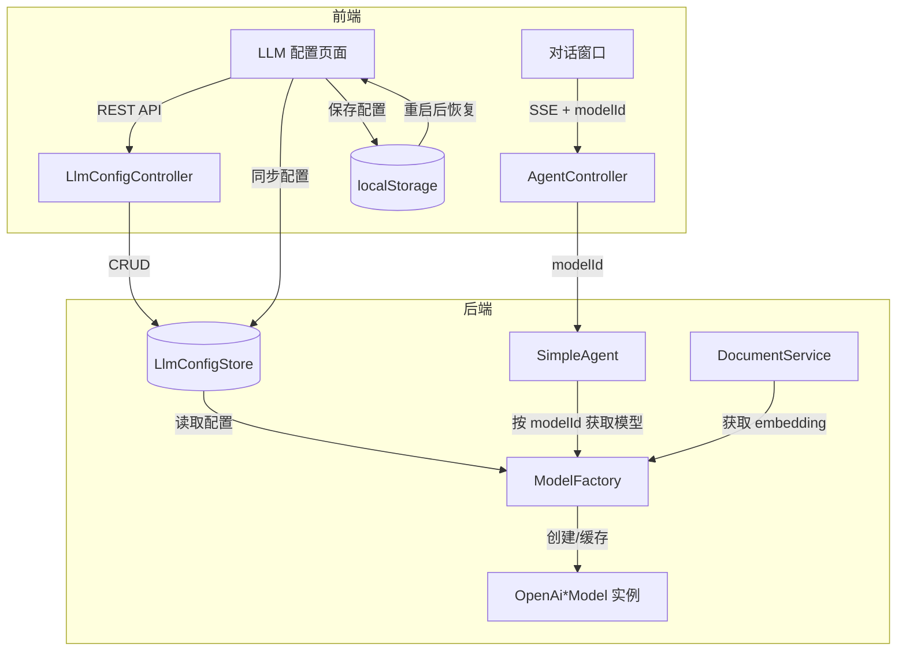

# 技术设计文档: LLM 厂商模型配置

## 0. 设计概要 (Design Summary)

*   **功能描述**：将 LLM 厂商和模型配置从静态 `application.yml` 提取到前端页面，由用户动态配置和管理，支持多厂商同时配置、按会话维度选择模型、API Key 测试连接，配置即生效无需重启。
*   **影响范围**：agent-demo-llm（重大重构）、agent-demo-web（新增 Controller + DTO）、agent-demo-agent（修改 SimpleAgent/PlanAgent）、agent-demo-rag（修改 DocumentService）、agent-demo-common（新增错误码）、agent-demo-bootstrap（移除 yml 配置）、agent-demo-frontend（新增配置页面 + 模型选择器）
*   **技术难点**：
    1.  移除 CR-002 Provider 模式后，ModelFactory 需直接从内存配置创建模型实例并管理缓存
    2.  SimpleAgent delegate 缓存从单一 volatile 改为按 modelId 维度的 Map，需处理并发与 Tool 变化重建
    3.  前后端配置同步机制（localStorage → 后端内存）的时序与一致性
    4.  Thinking 模型按 vendor thinkingTrigger 配置动态选择
*   **依赖关系**：无外部新增依赖，复用现有 LangChain4j OpenAI 适配器

## 1. 架构概览 (Architecture Overview)

### 1.1 改动前架构（CR-002 现状）

```
application.yml (llm.provider: ark|bailian)
  → LlmProperties (读取 provider 枚举)
  → ModelFactory (注入 List<LlmServiceProvider>, 按 providerCode 路由)
  → ArkLlmServiceProvider / BailianLlmServiceProvider (读取 ArkProperties/BailianProperties)
  → LangChain4j OpenAi*Model (底层模型实例, 按 modelName 缓存)
```

- 单厂商激活，配置来自 yml，API Key 从环境变量注入
- `SimpleAgent` 使用单一 volatile delegate，通过 `modelFactory.getDefaultChatModel()` 获取模型

### 1.2 改动后架构

```
前端 LLM 配置页面
  → POST /api/llm/config/vendors (CRUD)
  → LlmConfigController
  → LlmConfigStore (内存 ConcurrentHashMap)
  → ModelFactory (从 LlmConfigStore 获取配置, 按 vendorId+modelName 缓存模型实例)
  → LangChain4j OpenAi*Model (底层模型实例)

对话请求 (携带 modelId)
  → AgentController.chatStream(ChatRequest.model = modelId)
  → SimpleAgent.getDelegate(modelId) (按 modelId 缓存 delegate)
  → ModelFactory.getStreamingChatModelByModelId(modelId)
  → OpenAiStreamingChatModel (缓存复用)
```

- 多厂商同时配置，配置来自内存 LlmConfigStore
- `SimpleAgent` 维护 `Map<String, BaseAgent> delegateCache`，按 modelId 缓存

### 1.3 模块交互关系



### 1.4 数据流向

**配置流向**：前端配置页面 → REST API → LlmConfigStore（内存）→ ModelFactory 缓存失效 → 后续请求使用新配置

**对话流向**：用户选择模型 → ChatRequest.model(modelId) → SimpleAgent.getDelegate(modelId) → ModelFactory.getStreamingChatModelByModelId(modelId) → 解析 vendorId + modelName → 创建/获取缓存的 OpenAiStreamingChatModel → SSE 流式返回

**RAG 向量化流向**：DocumentService → ModelFactory.getEmbeddingModel() → 从 LlmConfigStore 获取第一个可用 embedding 模型 → 创建/获取缓存的 OpenAiEmbeddingModel → 批量向量化

**重启恢复流向**：前端加载 → GET /api/llm/config/status → hasConfig=false → 前端读取 localStorage → POST /api/llm/config/sync → LlmConfigStore 恢复全部配置

## 2. API 设计 (API Design)

> 遵循项目 RESTful 风格，统一 `/api` 前缀，返回 `Result<T>` 包装

### 2.1 接口列表

| 接口名称 | 方法 | 路径 | 描述 | 对应验收标准 |
| :--- | :--- | :--- | :--- | :--- |
| 获取预定义厂商目录 | GET | /api/llm/config/predefined | 返回预定义厂商列表及常用模型 | AC-001, AC-023 |
| 获取已配置厂商列表 | GET | /api/llm/config/vendors | 返回所有已配置厂商（API Key 脱敏） | AC-012 |
| 添加厂商 | POST | /api/llm/config/vendors | 添加厂商配置（含模型列表） | AC-001, AC-002, AC-003 |
| 编辑厂商 | PUT | /api/llm/config/vendors/{vendorId} | 修改厂商配置 | AC-010 |
| 删除厂商 | DELETE | /api/llm/config/vendors/{vendorId} | 删除厂商及其所有模型 | AC-011, AC-017 |
| 测试 API Key 连接 | POST | /api/llm/config/test | 验证 API Key 有效性 | AC-005, AC-015 |
| 获取模型列表 | GET | /api/llm/config/models?type=chat | 获取模型列表（可按类型过滤） | AC-006, AC-025 |
| 获取配置状态 | GET | /api/llm/config/status | 返回是否有配置/是否有 chat 模型/是否有 embedding 模型 | AC-013, AC-014 |
| 同步配置 | POST | /api/llm/config/sync | 前端推送完整配置到后端（重启恢复） | AC-009, AC-021 |

### 2.2 接口详情

#### 接口 1: 获取预定义厂商目录

*   **路径**: `GET /api/llm/config/predefined`
*   **描述**: 返回系统预定义的厂商列表，每个厂商包含默认 Base URL、thinkingTrigger 类型和常用模型清单
*   **鉴权**: 无（项目无认证机制）
*   **Response (成功)**:
    ```json
    {
      "success": true,
      "code": 200,
      "data": [
        {
          "code": "ark",
          "name": "火山引擎方舟",
          "baseUrl": "https://ark.cn-beijing.volces.com/api/coding/v3",
          "thinkingTrigger": "enabled",
          "models": [
            {"modelName": "doubao-seed-2.0-pro", "displayName": "豆包Seed 2.0 Pro", "type": "chat", "supportsVision": false},
            {"modelName": "doubao-seed-2.0-code", "displayName": "豆包Seed 2.0 Code", "type": "chat", "supportsVision": false},
            {"modelName": "doubao-seed-2.0-lite", "displayName": "豆包Seed 2.0 Lite", "type": "chat", "supportsVision": false},
            {"modelName": "doubao-vision-pro", "displayName": "豆包Vision Pro", "type": "chat", "supportsVision": true},
            {"modelName": "doubao-embedding-large-text-240915", "displayName": "豆包Embedding Large", "type": "embedding", "supportsVision": false}
          ]
        },
        {
          "code": "bailian",
          "name": "阿里百炼",
          "baseUrl": "https://dashscope.aliyuncs.com/compatible-mode/v1",
          "thinkingTrigger": "none",
          "models": [
            {"modelName": "deepseek-v4-flash", "displayName": "DeepSeek V4 Flash", "type": "chat", "supportsVision": false},
            {"modelName": "glm-5.2", "displayName": "GLM 5.2", "type": "chat", "supportsVision": false},
            {"modelName": "qwen3.7-plus", "displayName": "通义千问VL", "type": "chat", "supportsVision": true},
            {"modelName": "text-embedding-v4", "displayName": "Text Embedding V4", "type": "embedding", "supportsVision": false}
          ]
        },
        {
          "code": "openai",
          "name": "OpenAI",
          "baseUrl": "https://api.openai.com/v1",
          "thinkingTrigger": "none",
          "models": [
            {"modelName": "gpt-4o", "displayName": "GPT-4o", "type": "chat", "supportsVision": true},
            {"modelName": "gpt-4o-mini", "displayName": "GPT-4o Mini", "type": "chat", "supportsVision": false},
            {"modelName": "text-embedding-3-small", "displayName": "Text Embedding 3 Small", "type": "embedding", "supportsVision": false}
          ]
        },
        {
          "code": "deepseek",
          "name": "DeepSeek",
          "baseUrl": "https://api.deepseek.com/v1",
          "thinkingTrigger": "none",
          "models": [
            {"modelName": "deepseek-chat", "displayName": "DeepSeek Chat", "type": "chat", "supportsVision": false},
            {"modelName": "deepseek-reasoner", "displayName": "DeepSeek Reasoner", "type": "chat", "supportsVision": false}
          ]
        },
        {
          "code": "ollama",
          "name": "Ollama (本地)",
          "baseUrl": "http://localhost:11434/v1",
          "thinkingTrigger": "none",
          "models": []
        }
      ]
    }
    ```

#### 接口 2: 获取已配置厂商列表

*   **路径**: `GET /api/llm/config/vendors`
*   **描述**: 返回所有已配置的厂商，API Key 脱敏显示
*   **Response (成功)**:
    ```json
    {
      "success": true,
      "code": 200,
      "data": [
        {
          "id": "vendor-uuid-1",
          "name": "火山引擎方舟",
          "type": "predefined",
          "baseUrl": "https://ark.cn-beijing.volces.com/api/coding/v3",
          "apiKeyMasked": "sk-****7890",
          "apiKeyConfigured": true,
          "thinkingTrigger": "enabled",
          "timeout": 60,
          "maxRetries": 3,
          "temperature": 0.7,
          "models": [
            {
              "id": "model-uuid-1",
              "vendorId": "vendor-uuid-1",
              "vendorName": "火山引擎方舟",
              "modelName": "doubao-seed-2.0-pro",
              "displayName": "豆包Seed 2.0 Pro",
              "type": "chat",
              "supportsVision": false
            }
          ]
        }
      ]
    }
    ```

#### 接口 3: 添加厂商

*   **路径**: `POST /api/llm/config/vendors`
*   **描述**: 添加厂商配置，包含 API Key 和模型列表
*   **Request**:
    ```json
    {
      "name": "火山引擎方舟",
      "type": "predefined",
      "baseUrl": "https://ark.cn-beijing.volces.com/api/coding/v3",
      "apiKey": "sk-xxxxxxxxxxxx",
      "thinkingTrigger": "enabled",
      "timeout": 60,
      "maxRetries": 3,
      "temperature": 0.7,
      "models": [
        {
          "modelName": "doubao-seed-2.0-pro",
          "displayName": "豆包Seed 2.0 Pro",
          "type": "chat",
          "supportsVision": false
        },
        {
          "modelName": "doubao-embedding-large-text-240915",
          "displayName": "豆包Embedding Large",
          "type": "embedding",
          "supportsVision": false
        }
      ]
    }
    ```
*   **Response (成功)**:
    ```json
    {
      "success": true,
      "code": 200,
      "data": {
        "id": "vendor-uuid-1",
        "name": "火山引擎方舟",
        "type": "predefined",
        "baseUrl": "https://ark.cn-beijing.volces.com/api/coding/v3",
        "apiKeyMasked": "sk-****7890",
        "apiKeyConfigured": true,
        "thinkingTrigger": "enabled",
        "timeout": 60,
        "maxRetries": 3,
        "temperature": 0.7,
        "models": [...]
      }
    }
    ```
*   **Response (失败)**:
    ```json
    {"success": false, "code": 5011, "message": "厂商名称已存在"}
    ```
*   **异常处理**:
    *   厂商名称为空 -> 返回 400 + PARAM_INVALID
    *   厂商名称重复 -> 返回 5011 + LLM_VENDOR_NAME_EXISTS
    *   Base URL 为空 -> 返回 400 + PARAM_INVALID
    *   API Key 为空 -> 返回 400 + PARAM_INVALID
    *   同一厂商下同类型模型名称重复 -> 返回 5012 + LLM_MODEL_NAME_EXISTS
    *   模型名称为空 -> 返回 400 + PARAM_INVALID

#### 接口 4: 编辑厂商

*   **路径**: `PUT /api/llm/config/vendors/{vendorId}`
*   **描述**: 修改厂商配置，API Key 为空时保留原 Key（不修改），非空时更新
*   **Request**: 同接口 3（id 由路径参数指定，apiKey 可选）
*   **Response (成功)**: 同接口 3 返回更新后的厂商
*   **异常处理**:
    *   厂商不存在 -> 返回 5009 + LLM_VENDOR_NOT_FOUND
    *   厂商名称与其他厂商重复 -> 返回 5011

#### 接口 5: 删除厂商

*   **路径**: `DELETE /api/llm/config/vendors/{vendorId}`
*   **描述**: 删除厂商及其所有模型配置，清除对应模型实例缓存
*   **Response (成功)**:
    ```json
    {"success": true, "code": 200, "data": null}
    ```
*   **异常处理**:
    *   厂商不存在 -> 返回 5009

#### 接口 6: 测试 API Key 连接

*   **路径**: `POST /api/llm/config/test`
*   **描述**: 使用提供的 Base URL 和 API Key 发送验证请求，不保存配置
*   **Request**:
    ```json
    {
      "baseUrl": "https://ark.cn-beijing.volces.com/api/coding/v3",
      "apiKey": "sk-xxxxxxxxxxxx"
    }
    ```
*   **Response (成功)**:
    ```json
    {"success": true, "code": 200, "data": {"success": true, "message": "连接成功", "latency": 234}}
    ```
*   **Response (连接失败)**:
    ```json
    {"success": true, "code": 200, "data": {"success": false, "message": "API Key 无效（认证失败）", "latency": 123}}
    ```
*   **实现逻辑**:
    1. 向 `{baseUrl}/models` 发送 GET 请求，Header: `Authorization: Bearer {apiKey}`
    2. HTTP 200 -> 连接成功
    3. HTTP 401 -> API Key 无效
    4. HTTP 404 -> Base URL 错误或端点不支持（提示"连接失败：服务端点不存在"）
    5. 连接超时/网络异常 -> 连接失败（提示具体网络错误）

#### 接口 7: 获取模型列表

*   **路径**: `GET /api/llm/config/models?type={type}`
*   **描述**: 获取所有已配置的模型，可按类型过滤。用于对话模型选择器（type=chat）和 RAG embedding 检测（type=embedding）
*   **Query 参数**: `type` (可选) - chat / embedding / rerank / multimodal
*   **Response (成功)**:
    ```json
    {
      "success": true,
      "code": 200,
      "data": [
        {
          "id": "model-uuid-1",
          "vendorId": "vendor-uuid-1",
          "vendorName": "火山引擎方舟",
          "modelName": "doubao-seed-2.0-pro",
          "displayName": "豆包Seed 2.0 Pro",
          "type": "chat",
          "supportsVision": false
        },
        {
          "id": "model-uuid-2",
          "vendorId": "vendor-uuid-2",
          "vendorName": "阿里百炼",
          "modelName": "deepseek-v4-flash",
          "displayName": "DeepSeek V4 Flash",
          "type": "chat",
          "supportsVision": false
        }
      ]
    }
    ```

#### 接口 8: 获取配置状态

*   **路径**: `GET /api/llm/config/status`
*   **描述**: 返回当前配置状态，用于前端判断是否需要从 localStorage 同步配置
*   **Response (成功)**:
    ```json
    {
      "success": true,
      "code": 200,
      "data": {
        "hasConfig": true,
        "hasChatModel": true,
        "hasEmbeddingModel": true,
        "vendorCount": 2,
        "chatModelCount": 3
      }
    }
    ```

#### 接口 9: 同步配置

*   **路径**: `POST /api/llm/config/sync`
*   **描述**: 前端将 localStorage 中的完整配置推送到后端，用于后端重启后恢复。仅在后端无配置时调用
*   **Request**:
    ```json
    {
      "vendors": [
        {
          "id": "vendor-uuid-1",
          "name": "火山引擎方舟",
          "type": "predefined",
          "baseUrl": "https://ark.cn-beijing.volces.com/api/coding/v3",
          "apiKey": "sk-xxxxxxxxxxxx",
          "thinkingTrigger": "enabled",
          "timeout": 60,
          "maxRetries": 3,
          "temperature": 0.7,
          "models": [
            {
              "id": "model-uuid-1",
              "vendorId": "vendor-uuid-1",
              "modelName": "doubao-seed-2.0-pro",
              "displayName": "豆包Seed 2.0 Pro",
              "type": "chat",
              "supportsVision": false
            }
          ]
        }
      ]
    }
    ```
*   **Response (成功)**:
    ```json
    {"success": true, "code": 200, "data": {"vendorCount": 2, "modelCount": 5}}
    ```
*   **实现逻辑**: 清空当前 LlmConfigStore → 逐个添加传入的厂商配置 → 返回统计信息

### 2.3 修改的现有接口

#### AgentController.chatStream (修改)

*   **路径**: `POST /api/agent/chat/stream` (不变)
*   **变更说明**: `ChatRequest.model` 字段从"预留未使用"改为"传递 modelId"
*   **ChatRequest 变更**:
    ```java
    // 变更前
    private String model;  // 指定模型（可选，为空用默认模型，当前未被 Controller 使用）

    // 变更后
    private String model;  // 模型 ID（可选，为空使用第一个可用 chat 模型）
    ```
*   **Controller 实现变更**:
    ```java
    // 变更前
    simpleAgent.chatStream(sessionId, message);

    // 变更后
    String modelId = request.getModel();
    simpleAgent.chatStream(sessionId, message, modelId);
    ```
*   **同步对话接口** `POST /api/agent/chat` 同理变更

## 3. 数据库设计 (Database Schema)

> 本项目无数据库，使用内存存储。以下为内存数据结构设计。

### 3.1 LlmConfigStore（内存配置存储）

*   **用途**: 存储所有厂商和模型配置，作为 LLM 配置的唯一事实来源
*   **所属模块**: agent-demo-llm
*   **类名**: `LlmConfigStore`
*   **注解**: `@Component`
*   **内部数据结构**:
    ```java
    // 厂商配置，按 vendorId 索引
    private final ConcurrentHashMap<String, LlmVendorConfig> vendors = new ConcurrentHashMap<>();
    ```

### 3.2 LlmVendorConfig（厂商配置实体）

*   **所属模块**: agent-demo-llm
*   **类名**: `LlmVendorConfig`
*   **字段定义**:

| 字段名 | 类型 | 约束 | 说明 |
| :--- | :--- | :--- | :--- |
| id | String | NOT NULL, UNIQUE | UUID 去横线，全局唯一 |
| name | String | NOT NULL, UNIQUE | 厂商显示名称 |
| type | String | NOT NULL | "predefined" 或 "custom" |
| baseUrl | String | NOT NULL | API Base URL |
| apiKey | String | NOT NULL | API Key（明文存储在内存中） |
| thinkingTrigger | String | NOT NULL | "enabled" 或 "none" |
| timeout | Duration | DEFAULT 60s | 请求超时时间 |
| maxRetries | int | DEFAULT 3 | 最大重试次数 |
| temperature | double | DEFAULT 0.7 | 温度参数 |
| models | List\<LlmModelConfig\> | | 模型列表 |

### 3.3 LlmModelConfig（模型配置实体）

*   **所属模块**: agent-demo-llm
*   **类名**: `LlmModelConfig`
*   **字段定义**:

| 字段名 | 类型 | 约束 | 说明 |
| :--- | :--- | :--- | :--- |
| id | String | NOT NULL, UNIQUE | UUID 去横线，全局唯一 |
| vendorId | String | NOT NULL | 所属厂商 ID |
| modelName | String | NOT NULL | API 模型名称（如 doubao-seed-2.0-pro） |
| displayName | String | NOT NULL | 显示名称 |
| type | String | NOT NULL | chat / embedding / rerank / multimodal |
| supportsVision | boolean | DEFAULT false | 是否支持视图理解（仅 chat 类型有意义） |

### 3.4 PredefinedVendorCatalog（预定义厂商目录）

*   **所属模块**: agent-demo-llm
*   **类名**: `PredefinedVendorCatalog`
*   **注解**: `@Component`
*   **用途**: 提供预定义厂商列表和常用模型，供前端选择
*   **实现**: 静态常量列表，包含 5 个预定义厂商（火山引擎方舟、阿里百炼、OpenAI、DeepSeek、Ollama）

## 4. 核心逻辑与算法 (Core Logic)

### 4.1 ModelFactory 重构（核心）

*   **触发条件**: 任何需要获取 LLM 模型实例的调用
*   **处理步骤**:
    1. 调用方传入 `modelId`（或 null 表示使用默认模型）
    2. 若 modelId 不为 null，从 `LlmConfigStore` 查找模型配置，获取 `vendorId` 和 `modelName`
    3. 若 modelId 为 null，从 `LlmConfigStore` 获取第一个 chat 类型模型
    4. 使用 `vendorId + ":" + modelName` 作为缓存 key
    5. 从缓存获取模型实例，未命中则创建新实例并缓存
    6. 返回模型实例

*   **伪代码**:
    ```java
    @Component
    public class ModelFactory {
        private final LlmConfigStore configStore;
        // 缓存 key: vendorId + ":" + modelName
        private final ConcurrentHashMap<String, ChatModel> chatModelCache = new ConcurrentHashMap<>();
        private final ConcurrentHashMap<String, StreamingChatModel> streamingModelCache = new ConcurrentHashMap<>();
        private final ConcurrentHashMap<String, ThinkingStreamingChatModel> thinkingModelCache = new ConcurrentHashMap<>();
        private final ConcurrentHashMap<String, EmbeddingModel> embeddingModelCache = new ConcurrentHashMap<>();

        // 按 modelId 获取 chat 模型
        public ChatModel getChatModelByModelId(String modelId) {
            LlmModelConfig model = configStore.getModel(modelId);
            if (model == null || !"chat".equals(model.getType())) {
                throw new BusinessException(ErrorCode.LLM_MODEL_NOT_FOUND, "模型不存在或类型不是 chat");
            }
            LlmVendorConfig vendor = configStore.getVendor(model.getVendorId());
            String cacheKey = vendor.getId() + ":" + model.getModelName();
            return chatModelCache.computeIfAbsent(cacheKey, k -> createChatModel(vendor, model.getModelName()));
        }

        // 获取默认 chat 模型（第一个可用）
        public ChatModel getDefaultChatModel() {
            LlmModelConfig model = configStore.getFirstChatModel();
            if (model == null) {
                throw new BusinessException(ErrorCode.LLM_NO_CHAT_MODEL, "未配置 chat 模型");
            }
            return getChatModelByModelId(model.getId());
        }

        // 流式模型、思考模型同理
        public StreamingChatModel getStreamingChatModelByModelId(String modelId) { ... }
        public StreamingChatModel getDefaultStreamingChatModel() { ... }
        public ThinkingStreamingChatModel getThinkingStreamingChatModelByModelId(String modelId) { ... }
        public ThinkingStreamingChatModel getDefaultThinkingStreamingChatModel() { ... }

        // Embedding 模型（第一个可用，RAG 使用）
        public EmbeddingModel getEmbeddingModel() {
            LlmModelConfig model = configStore.getFirstEmbeddingModel();
            if (model == null) {
                throw new BusinessException(ErrorCode.LLM_NO_EMBEDDING_MODEL, "未配置 embedding 模型");
            }
            LlmVendorConfig vendor = configStore.getVendor(model.getVendorId());
            String cacheKey = vendor.getId() + ":" + model.getModelName();
            return embeddingModelCache.computeIfAbsent(cacheKey, k -> createEmbeddingModel(vendor, model.getModelName()));
        }

        // 创建 ChatModel 实例（OpenAI 兼容）
        private ChatModel createChatModel(LlmVendorConfig vendor, String modelName) {
            return OpenAiChatModel.builder()
                    .baseUrl(vendor.getBaseUrl())
                    .apiKey(vendor.getApiKey())
                    .modelName(modelName)
                    .temperature(vendor.getTemperature())
                    .timeout(vendor.getTimeout())
                    .maxRetries(vendor.getMaxRetries())
                    .build();
        }

        // 创建 StreamingChatModel 实例
        private StreamingChatModel createStreamingChatModel(LlmVendorConfig vendor, String modelName) {
            return OpenAiStreamingChatModel.builder()
                    .baseUrl(vendor.getBaseUrl())
                    .apiKey(vendor.getApiKey())
                    .modelName(modelName)
                    .temperature(vendor.getTemperature())
                    .timeout(vendor.getTimeout())
                    .maxRetries(vendor.getMaxRetries())
                    .build();
        }

        // 创建 ThinkingStreamingChatModel（按 thinkingTrigger 选择实现类）
        private ThinkingStreamingChatModel createThinkingStreamingChatModel(LlmVendorConfig vendor, String modelName) {
            if ("enabled".equals(vendor.getThinkingTrigger())) {
                return new ArkThinkingStreamingChatModel(
                    vendor.getBaseUrl(), vendor.getApiKey(), modelName, vendor.getTimeout());
            } else {
                return new BailianThinkingStreamingChatModel(
                    vendor.getBaseUrl(), vendor.getApiKey(), modelName, vendor.getTimeout());
            }
        }

        // 创建 EmbeddingModel 实例
        private EmbeddingModel createEmbeddingModel(LlmVendorConfig vendor, String modelName) {
            return OpenAiEmbeddingModel.builder()
                    .baseUrl(vendor.getBaseUrl())
                    .apiKey(vendor.getApiKey())
                    .modelName(modelName)
                    .timeout(vendor.getTimeout())
                    .build();
        }

        // 清除指定厂商的缓存（配置变更时调用）
        public void clearCacheForVendor(String vendorId) {
            String prefix = vendorId + ":";
            chatModelCache.keySet().removeIf(k -> k.startsWith(prefix));
            streamingModelCache.keySet().removeIf(k -> k.startsWith(prefix));
            thinkingModelCache.keySet().removeIf(k -> k.startsWith(prefix));
            embeddingModelCache.keySet().removeIf(k -> k.startsWith(prefix));
        }

        // 清除全部缓存（sync 时调用）
        public void clearAllCache() {
            chatModelCache.clear();
            streamingModelCache.clear();
            thinkingModelCache.clear();
            embeddingModelCache.clear();
        }
    }
    ```

### 4.2 SimpleAgent delegate 缓存重构

*   **触发条件**: 对话请求（chat / chatStream / chatThinkingStream / chatThinkingReActStream）
*   **处理步骤**:
    1. 接收 modelId 参数（可为 null）
    2. 若 modelId 为 null，使用 "default" 作为缓存 key
    3. 检查缓存中是否存在该 key 的 delegate
    4. 检查 Tool 数量是否变化（与该 key 上次记录的 toolCount 比较）
    5. 若 delegate 不存在或 Tool 数量变化，创建新 delegate（使用指定 modelId 对应的模型）
    6. 返回 delegate 执行对话

*   **伪代码**:
    ```java
    @Service
    public class SimpleAgent implements BaseAgent {
        private final ModelFactory modelFactory;
        // delegate 缓存，按 modelId（或 "default"）索引
        private final ConcurrentHashMap<String, BaseAgent> delegateCache = new ConcurrentHashMap<>();
        // 每个 delegate 上次绑定时的 Tool 数量
        private final ConcurrentHashMap<String, Integer> delegateToolCounts = new ConcurrentHashMap<>();

        // 新增重载方法：带 modelId
        public TokenStream chatStream(String sessionId, String message, String modelId) {
            return getDelegate(modelId).chatStream(sessionId, message);
        }

        // 原有方法保留（向后兼容）
        public TokenStream chatStream(String sessionId, String message) {
            return chatStream(sessionId, message, null);
        }

        // chat / chatThinkingStream / chatThinkingReActStream 同理新增重载方法

        private BaseAgent getDelegate(String modelId) {
            String cacheKey = (modelId != null) ? modelId : "default";
            int currentToolCount = toolRegistry.getToolCount();
            Integer lastCount = delegateToolCounts.get(cacheKey);

            if (lastCount == null || lastCount != currentToolCount) {
                synchronized (this) {
                    lastCount = delegateToolCounts.get(cacheKey);
                    if (lastCount == null || lastCount != currentToolCount) {
                        // 按 modelId 获取模型实例
                        ChatModel chatModel = (modelId != null)
                            ? modelFactory.getChatModelByModelId(modelId)
                            : modelFactory.getDefaultChatModel();
                        StreamingChatModel streamingModel = (modelId != null)
                            ? modelFactory.getStreamingChatModelByModelId(modelId)
                            : modelFactory.getDefaultStreamingChatModel();

                        BaseAgent delegate = AiServices.builder(BaseAgent.class)
                                .chatModel(chatModel)
                                .streamingChatModel(streamingModel)
                                .chatMemoryProvider(memoryId -> memoryManager.getMemory((String) memoryId))
                                .tools(toolRegistry.listTools().toArray())
                                .systemMessageProvider(memoryId -> promptTemplateLoader.composeSystemPrompt(...))
                                .build();

                        delegateCache.put(cacheKey, delegate);
                        delegateToolCounts.put(cacheKey, currentToolCount);
                    }
                }
            }
            return delegateCache.get(cacheKey);
        }
    }
    ```

*   **思考模式同理**:
    ```java
    public ThinkingTokenStream chatThinkingReActStream(String sessionId, String message, String modelId) {
        ThinkingStreamingChatModel thinkingModel = (modelId != null)
            ? modelFactory.getThinkingStreamingChatModelByModelId(modelId)
            : modelFactory.getDefaultThinkingStreamingChatModel();
        // 组装消息（系统提示词 + 历史 + 当前消息）
        List<ChatMessage> messages = buildReActMessagesWithMemory(sessionId, message);
        String toolsJson = ...;
        return new ReActThinkingStream(thinkingModel, messages, toolsJson, toolExecutor, maxIterations);
    }
    ```

*   **PlanAgent 同理修改**：`chatTaskBreakdownStream(sessionId, message, modelId, ...)` 新增 modelId 参数

### 4.3 配置变更缓存失效

*   **触发条件**: 添加/编辑/删除厂商、同步配置
*   **处理步骤**:
    1. LlmConfigController 接收到变更请求
    2. 更新 LlmConfigStore
    3. 调用 `ModelFactory.clearCacheForVendor(vendorId)` 或 `clearAllCache()`
    4. 后续请求创建新的模型实例（使用新配置）

### 4.4 前端配置同步流程

*   **触发条件**: 页面加载/刷新时
*   **处理步骤**:
    1. 前端调用 `GET /api/llm/config/status`
    2. 若 `hasConfig === true`：从后端拉取最新配置 `GET /api/llm/config/vendors`，更新 localStorage
    3. 若 `hasConfig === false`：
        a. 检查 localStorage 是否有配置
        b. 有配置：调用 `POST /api/llm/config/sync` 推送到后端
        c. 无配置：显示空状态，引导用户配置

### 4.5 前端模型选择器会话级状态管理

*   **触发条件**: 用户在对话界面选择模型
*   **处理步骤**:
    1. 用户在 ModelSelector 中选择模型
    2. 触发 `store.setModel(sessionId, modelId)` 写入 `modelBySession` Map
    3. 发送消息时从 `store.getModel(sessionId)` 读取 modelId
    4. 传给 `streamChat(..., modelId, ...)`
    5. 同时更新 `lastUsedModelId` 到 llm store（持久化到 localStorage）

*   **数据结构** (session.ts):
    ```typescript
    // 会话级模型选择（不持久化，与 knowledgeBasesBySession 行为一致）
    modelBySession: {} as Record<string, string>,

    // 全局上次使用模型（持久化到 localStorage，用于新会话默认值）
    // 存储在 llm store 中
    ```

## 5. 异常处理 (Error Handling)

| 异常场景 | 对应验收标准 | 处理方案 | 用户提示 |
| :--- | :--- | :--- | :--- |
| 无任何 LLM 配置 | AC-013 | 后端 `LlmConfigStore.getFirstChatModel()` 返回 null，前端检测 `hasConfig=false` | "请先配置 LLM 模型" + 跳转链接 |
| 有厂商但无 chat 模型 | AC-014 | 后端 `hasChatModel=false`，前端检测后禁用对话 | "请先配置 chat 类型模型才能对话" |
| 测试连接 API Key 无效 | AC-015 | HTTP 401 响应，返回 `success=false, message="API Key 无效"` | "连接失败：API Key 无效（认证失败）" |
| 测试连接网络不通 | AC-015 | 连接超时/拒绝，返回 `success=false, message=网络错误描述` | "连接失败：网络不通，请检查 Base URL" |
| 对话过程中 API Key 失效 | AC-016 | LLM API 返回 401，SimpleAgent 抛出异常，Controller 捕获后发送 SSE error 事件 | "API Key 无效，请检查配置" |
| 删除正在使用模型的厂商 | AC-017 | 后端删除厂商+清除缓存，前端检测 selectedModelId 不存在后回退 | 模型选择器自动切换到第一个可用模型 |
| 重复厂商名称 | AC-018 | 后端 `LlmConfigStore` 查重，返回 5011 错误码 | "厂商名称已存在" |
| 模型名称为空 | AC-020 | 后端参数校验 `@NotBlank`，返回 400 | "模型名称不能为空" |
| 后端重启且 localStorage 无配置 | AC-021 | 前端 `hasConfig=false` + localStorage 为空，显示空状态 | "首次使用，请配置 LLM 模型" |
| 同类型同名模型 | AC-022 | 后端在 `LlmConfigStore.addVendor` 时校验同 vendor+type 下 modelName 唯一 | "该类型下已存在同名模型" |
| 无 embedding 模型时上传文档 | AC-028 | 后端 `DocumentService.processDocument()` 调用 `ModelFactory.getEmbeddingModel()` 抛出 `LLM_NO_EMBEDDING_MODEL` | "请先配置 embedding 模型才能上传文档" |

### 5.1 新增错误码

| 错误码 | 枚举名 | 说明 | 区间 |
| :--- | :--- | :--- | :--- |
| 5008 | LLM_CONFIG_NOT_FOUND | LLM 配置不存在 | 5001-5099 |
| 5009 | LLM_VENDOR_NOT_FOUND | 厂商不存在 | 5001-5099 |
| 5010 | LLM_MODEL_NOT_FOUND | 模型不存在 | 5001-5099 |
| 5011 | LLM_VENDOR_NAME_EXISTS | 厂商名称已存在 | 5001-5099 |
| 5012 | LLM_MODEL_NAME_EXISTS | 同类型同名模型已存在 | 5001-5099 |
| 5013 | LLM_CONNECTION_TEST_FAILED | 连接测试失败 | 5001-5099 |
| 5014 | LLM_NO_CHAT_MODEL | 未配置 chat 模型 | 5001-5099 |
| 5015 | LLM_NO_EMBEDDING_MODEL | 未配置 embedding 模型 | 5001-5099 |

## 6. 安全与性能 (Security & Performance)

*   **鉴权机制**: 项目无认证机制，所有 API 可被任意调用（与现有行为一致）
*   **API Key 保护**:
    *   API Key 明文存储在后端内存中（与现有环境变量注入方式等效）
    *   API Key 在 API 响应中脱敏显示（保留后 4 位）
    *   API Key 禁止明文打印到日志（遵循 BR-SEC-001）
    *   前端 localStorage 存储完整 API Key（浏览器本地存储，不通过网络传输除同步时）
*   **数据校验**:
    *   厂商名称：`@NotBlank`，后端查重
    *   Base URL：`@NotBlank`
    *   API Key：`@NotBlank`（添加时必填，编辑时可选）
    *   模型名称：`@NotBlank`，同厂商同类型下查重
    *   模型类型：枚举校验（chat/embedding/rerank/multimodal）
*   **缓存策略**:
    *   ModelFactory 按 `vendorId:modelName` 缓存模型实例（ConcurrentHashMap）
    *   SimpleAgent 按 modelId 缓存 delegate（ConcurrentHashMap）
    *   配置变更时清除对应缓存（精准失效，不影响其他厂商）
    *   sync 时清除全部缓存
*   **并发安全**:
    *   LlmConfigStore 使用 ConcurrentHashMap
    *   SimpleAgent delegate 创建使用 synchronized 双重检查锁
    *   ModelFactory 模型创建使用 computeIfAbsent
*   **性能指标**:
    *   配置 CRUD：内存操作，<1ms
    *   模型实例创建：首次约 50-100ms（OpenAI client 初始化），后续缓存命中 <1ms
    *   测试连接：取决于目标 API 响应时间，通常 <2s
*   **安全考虑**:
    *   测试连接使用独立的 HTTP 请求，不缓存任何模型实例
    *   同步接口仅在 `hasConfig=false` 时允许调用（前端逻辑控制）
    *   删除厂商时级联清除模型缓存，防止内存泄漏

## 7. 验收标准映射 (AC Mapping)

| 验收标准 ID | 验收标准描述 | 对应技术实现 |
| :--- | :--- | :--- |
| AC-001 | 添加预定义厂商配置 | POST /api/llm/config/vendors + 预定义厂商目录 GET /api/llm/config/predefined |
| AC-002 | 添加自定义厂商配置 | POST /api/llm/config/vendors（type=custom） |
| AC-003 | 为同一厂商配置多个不同类型模型 | VendorRequest.models[] 支持多类型多模型 |
| AC-004 | chat 模型标注视图理解支持 | LlmModelConfig.supportsVision 字段 |
| AC-005 | 测试 API Key 连接成功 | POST /api/llm/config/test（GET /models 验证） |
| AC-006 | 在对话中选择模型并发送消息 | ChatRequest.model(modelId) → SimpleAgent.chatStream(sessionId, message, modelId) |
| AC-007 | 不同会话使用不同模型 | 前端 session.ts modelBySession 会话级隔离 |
| AC-008 | 新会话默认选择上次使用的模型 | 前端 llm store lastUsedModelId 持久化到 localStorage |
| AC-009 | 后端重启后自动恢复配置 | GET /api/llm/config/status → POST /api/llm/config/sync |
| AC-010 | 编辑已有厂商配置 | PUT /api/llm/config/vendors/{id} + ModelFactory.clearCacheForVendor |
| AC-011 | 删除厂商配置 | DELETE /api/llm/config/vendors/{id} + 级联清除缓存 |
| AC-012 | 查看配置列表 | GET /api/llm/config/vendors（API Key 脱敏） |
| AC-013 | 无任何配置时的空状态引导 | GET /api/llm/config/status hasConfig=false → 前端禁用对话+引导 |
| AC-014 | 有厂商但无 chat 模型时对话禁用 | GET /api/llm/config/status hasChatModel=false → 前端禁用对话 |
| AC-015 | 测试连接失败 | POST /api/llm/config/test 返回 success=false + 错误原因 |
| AC-016 | 对话过程中 API Key 失效 | LLM API 401 → SimpleAgent 异常 → SSE error 事件 |
| AC-017 | 删除正在使用模型的厂商后自动切换 | 后端删除厂商 → 前端检测 modelId 不存在 → 切换到第一个可用模型 |
| AC-018 | 重复厂商名称校验 | LlmConfigStore 查重 → 返回 5011 LLM_VENDOR_NAME_EXISTS |
| AC-019 | API Key 脱敏显示 | VendorResponse.apiKeyMasked 字段（保留后 4 位） |
| AC-020 | 模型名称为空校验 | @NotBlank 参数校验 → 返回 400 |
| AC-021 | 后端重启且 localStorage 也无配置 | GET status hasConfig=false + localStorage 空 → 前端空状态 |
| AC-022 | 同一厂商下同类型模型名称重复 | LlmConfigStore 查重 → 返回 5012 LLM_MODEL_NAME_EXISTS |
| AC-023 | 预定义厂商自动填充 Base URL | GET /api/llm/config/predefined → 前端自动填充 |
| AC-024 | 模型类型分类管理 | LlmModelConfig.type 枚举 + 前端类型选择器 |
| AC-025 | 模型选择器按厂商分组并显示视图标记 | GET /api/llm/config/models?type=chat → 前端按 vendorName 分组 + supportsVision 标记 |
| AC-026 | 配置修改即时生效 | PUT/DELETE → LlmConfigStore 更新 → ModelFactory.clearCache → 后续请求新实例 |
| AC-027 | RAG 使用已配置的 embedding 模型 | DocumentService → ModelFactory.getEmbeddingModel() → 从 LlmConfigStore 获取 |
| AC-028 | 无 embedding 模型时 RAG 阻止文档上传 | ModelFactory.getEmbeddingModel() 抛出 5015 → 前端提示 |
| AC-029 | 配置同步至 localStorage 持久化 | 前端 llm store 每次 CRUD 操作后写入 localStorage |
| AC-030 | 会话级模型选择状态隔离 | session.ts modelBySession Record<string, string> |

## 8. 技术决策说明 (Technical Decisions)

### 决策 1: 移除 CR-002 Provider 模式，ModelFactory 直接创建模型实例

*   **方案**: 移除 `ArkLlmServiceProvider`、`BailianLlmServiceProvider`、`LlmServiceProvider` 接口、capability 包接口，ModelFactory 直接从 `LlmConfigStore` 读取配置并创建 OpenAI 兼容模型实例
*   **理由**:
    *   所有厂商均使用 OpenAI 兼容协议，差异仅为配置参数（baseUrl、apiKey、thinkingTrigger），无需厂商特定策略类
    *   Provider 模式的核心价值是"新增厂商零修改 ModelFactory"，但动态配置下厂商由用户运行时添加，Provider 类无法预先存在
    *   ModelFactory 直接创建模型实例更简单直接，符合 KISS 原则
*   **影响**: `ModelFactory` 构造器从 `(LlmProperties, List<LlmServiceProvider>)` 变为 `(LlmConfigStore)`；移除 `providerRegistry`；所有公开方法签名变更
*   **调用方枚举**: `SimpleAgent`、`PlanAgent`、`DocumentService`、`EmbeddingStoreFactory` 均需适配新方法签名

### 决策 2: 保留 Thinking 模型实现类，按 thinkingTrigger 配置选择

*   **方案**: 保留 `ArkThinkingStreamingChatModel`（thinkingTrigger=enabled）和 `BailianThinkingStreamingChatModel`（thinkingTrigger=none），ModelFactory 根据 vendor 配置选择
*   **理由**:
    *   两个类已通过 CR-002 重构，代码重复率 ≤30%（继承 AbstractThinkingStreamingChatModel）
    *   差异仅在 `customizeRequestBody` 钩子（Ark 添加 `thinking.type=enabled`，Bailian 空实现）
    *   复用现有代码减少风险，避免引入新类
*   **技术债务**: 类名 Ark/Bailian 在非对应厂商场景下有语义误导，后续可重命名为 `EnabledThinkingStreamingChatModel`/`PassthroughThinkingStreamingChatModel`

### 决策 3: SimpleAgent delegate 缓存改为 ConcurrentHashMap

*   **方案**: 从 `volatile BaseAgent delegate`（单一）改为 `ConcurrentHashMap<String, BaseAgent> delegateCache`（按 modelId 索引）
*   **理由**:
    *   不同会话可能使用不同模型，需要多个 delegate 并存
    *   ConcurrentHashMap + synchronized 双重检查锁保证并发安全
    *   Tool 数量变化时仅重建受影响的 delegate（按 cacheKey 检查 lastToolCount）
*   **影响**: `SimpleAgent.getDelegate()` 方法签名变更，新增 `getDelegate(String modelId)` 重载

### 决策 4: ChatRequest.model 字段语义变更

*   **方案**: `ChatRequest.model` 从"预留未使用"改为"模型 ID（modelId）"
*   **理由**: 字段已存在，无需新增字段，仅需启用。前端发送 modelId（UUID），后端通过 modelId 查找配置
*   **影响**: `AgentController` 需将 `request.getModel()` 传递给 `SimpleAgent`/`PlanAgent`；前端 `streamChat()` 需在请求 body 中包含 `model` 字段

### 决策 5: 测试连接使用 GET /models 端点

*   **方案**: 向 `{baseUrl}/models` 发送 GET 请求验证 API Key
*   **理由**:
    *   OpenAI 兼容协议的 /models 端点不消耗 Token，免费验证
    *   401 响应明确表示 API Key 无效
    *   200 响应表示连接成功
    *   404 或其他错误可提示用户检查 Base URL
*   **兼容性**: 主流 OpenAI 兼容服务（火山引擎、阿里百炼、OpenAI、DeepSeek）均支持 /models 端点

### 决策 6: 前端配置 localStorage 独立 key

*   **方案**: 新增 localStorage key `agent-demo:llm-config`，与现有 `agent-demo:sessions` 独立
*   **理由**: 配置数据与会话数据生命周期不同，独立管理避免相互影响；配置数据量小（几个厂商+模型），不触发 50 条 FIFO 淘汰

## 9. 风险与注意事项 (Risks & Notes)

### 9.1 技术风险

*   **ModelFactory 接口签名变更影响面大**: `SimpleAgent`、`PlanAgent`、`DocumentService`、`EmbeddingStoreFactory` 均依赖 ModelFactory。需逐一适配新方法签名，确保编译通过。
    *   **缓解**: 保留 `getDefaultChatModel()`、`getDefaultStreamingChatModel()`、`getEmbeddingModel()` 等方法名（语义不变），仅改变内部实现；新增 `getChatModelByModelId()` 等方法
*   **delegate 缓存内存泄漏**: 用户频繁切换模型可能导致 delegateCache 积压。每个 delegate 持有 AiServices 代理和模型实例。
    *   **缓解**: 缓存 key 为 modelId（UUID），数量有限（等于已配置 chat 模型数）；删除厂商时清除对应 delegate（SimpleAgent 新增 `clearDelegateForVendor` 方法）
*   **配置同步竞态**: 多个浏览器同时检测到 `hasConfig=false` 并同时 sync。
    *   **缓解**: sync 接口使用 `ConcurrentHashMap.putAll` 原子操作；学习/演示项目场景下可接受最后写入胜出

### 9.2 兼容性

*   **移除 application.yml 配置**: 移除 `llm`、`ark`、`bailian` 配置段后，`ArkProperties`、`BailianProperties`、`LlmProperties`、`LlmConfig` 类不再有配置绑定。这些类需删除或标记为 `@Deprecated`。
*   **环境变量 ARK_API_KEY / BAILIAN_API_KEY 不再需要**: API Key 由前端配置。若用户仍设置了环境变量，不影响功能（Properties 类已移除，不读取）。
*   **PlanAgent 变更**: `PlanAgent` 内部也使用 ModelFactory 获取模型，需同步修改。具体变更需阅读 PlanAgent 源码后确定。
*   **application-dev.yml 中的 ark.coding-plan.default-model 覆盖**: 随 yml 配置段移除而消失。开发/生产环境模型选择由前端配置决定。

### 9.3 性能影响

*   **首次对话延迟**: 新 modelId 首次创建 delegate + 模型实例约 100-200ms（AiServices 代理构建 + OpenAI client 初始化）。后续缓存命中 <1ms。
*   **配置变更后首次对话**: 缓存失效后需重建，同首次延迟。影响范围仅限变更的厂商。

### 9.4 回滚方案

*   **Git 回滚**: 所有变更通过 Git 版本控制，可整体 revert 回 CR-002 架构
*   **配置恢复**: 若需回滚到 yml 配置模式，恢复 application.yml 中的 llm/ark/bailian 配置段 + Properties 类即可
*   **前端兼容**: 前端变更独立于后端，可通过 `currentView` 不渲染配置页面来禁用功能

### 9.5 移除的文件清单

| 文件 | 模块 | 说明 |
| :--- | :--- | :--- |
| `LlmProperties.java` | agent-demo-llm/config | yml `llm.*` 配置绑定，不再需要 |
| `ArkProperties.java` | agent-demo-llm/config | yml `ark.coding-plan.*` 配置绑定，不再需要 |
| `BailianProperties.java` | agent-demo-llm/config | yml `bailian.*` 配置绑定，不再需要 |
| `LlmProvider.java` | agent-demo-llm/config | 厂商枚举，被 PredefinedVendorCatalog 替代 |
| `LlmProviderConfig.java` | agent-demo-llm/config | 配置访问契约接口，不再需要 |
| `LlmConfig.java` | agent-demo-llm/config | @Configuration 注册类，不再需要 |
| `LlmServiceProvider.java` | agent-demo-llm/provider | 聚合接口，不再需要 |
| `ArkLlmServiceProvider.java` | agent-demo-llm/provider | Ark 策略实现，被 ModelFactory 直接创建替代 |
| `BailianLlmServiceProvider.java` | agent-demo-llm/provider | Bailian 策略实现，被 ModelFactory 直接创建替代 |
| `ChatModelProvider.java` | agent-demo-llm/capability | 能力接口，随 Provider 模式移除 |
| `StreamingChatModelProvider.java` | agent-demo-llm/capability | 同上 |
| `EmbeddingModelProvider.java` | agent-demo-llm/capability | 同上 |
| `VisionChatModelProvider.java` | agent-demo-llm/capability | 同上（supportsVision 改为模型配置属性） |
| `ThinkingStreamingChatModelProvider.java` | agent-demo-llm/capability | 同上 |

### 9.6 新增文件清单

| 文件 | 模块 | 说明 |
| :--- | :--- | :--- |
| `LlmConfigStore.java` | agent-demo-llm/config | 内存配置存储，CRUD + 查询 |
| `LlmVendorConfig.java` | agent-demo-llm/config | 厂商配置实体 |
| `LlmModelConfig.java` | agent-demo-llm/config | 模型配置实体 |
| `PredefinedVendorCatalog.java` | agent-demo-llm/config | 预定义厂商目录 |
| `LlmConfigController.java` | agent-demo-web/controller | LLM 配置管理 REST API |
| `VendorRequest.java` | agent-demo-web/dto | 添加/编辑厂商请求 DTO |
| `VendorResponse.java` | agent-demo-web/dto | 厂商响应 DTO（API Key 脱敏） |
| `ModelResponse.java` | agent-demo-web/dto | 模型响应 DTO |
| `TestConnectionRequest.java` | agent-demo-web/dto | 测试连接请求 DTO |
| `TestConnectionResponse.java` | agent-demo-web/dto | 测试连接响应 DTO |
| `SyncConfigRequest.java` | agent-demo-web/dto | 同步配置请求 DTO |
| `ConfigStatusResponse.java` | agent-demo-web/dto | 配置状态响应 DTO |
| `PredefinedVendorResponse.java` | agent-demo-web/dto | 预定义厂商响应 DTO |
| `LlmConfigPage.vue` | agent-demo-frontend/components | LLM 配置管理页面 |
| `VendorCard.vue` | agent-demo-frontend/components | 厂商卡片组件 |
| `VendorEditDialog.vue` | agent-demo-frontend/components | 添加/编辑厂商弹窗 |
| `ModelSelector.vue` | agent-demo-frontend/components | 对话模型选择器 |
| `api/llm.ts` | agent-demo-frontend/api | LLM 配置 API 封装 |
| `stores/llm.ts` | agent-demo-frontend/stores | LLM 配置状态管理 + localStorage |
| `utils/llm-storage.ts` | agent-demo-frontend/utils | LLM 配置 localStorage 工具 |

### 9.7 修改文件清单

| 文件 | 模块 | 变更说明 |
| :--- | :--- | :--- |
| `ErrorCode.java` | agent-demo-common | 新增 5008-5015 错误码 |
| `ModelFactory.java` | agent-demo-llm/registry | 重构：从 LlmConfigStore 创建模型，移除 Provider 路由 |
| `AgentController.java` | agent-demo-web/controller | 传递 modelId 给 SimpleAgent/PlanAgent |
| `ChatRequest.java` | agent-demo-web/dto | model 字段语义变更（启用） |
| `SimpleAgent.java` | agent-demo-agent/single | delegate 缓存改为 Map，新增 modelId 重载方法 |
| `PlanAgent.java` | agent-demo-agent | 同 SimpleAgent，新增 modelId 参数 |
| `BaseAgent.java` | agent-demo-agent/core | 新增带 modelId 的重载方法（可选，或仅 SimpleAgent 层面） |
| `DocumentService.java` | agent-demo-rag/service | getEmbeddingModel 异常处理（无配置时提示） |
| `EmbeddingStoreFactory.java` | agent-demo-rag/store | 同上 |
| `application.yml` | agent-demo-bootstrap | 移除 llm/ark/bailian 配置段 |
| `application-dev.yml` | agent-demo-bootstrap | 移除 ark.coding-plan.default-model 覆盖 |
| `App.vue` | agent-demo-frontend | 新增 LLM 配置页面视图切换 |
| `NavBar.vue` | agent-demo-frontend | 新增"LLM 配置"导航入口 |
| `ChatWindow.vue` | agent-demo-frontend | 传递 modelId，集成 ModelSelector |
| `MessageInput.vue` | agent-demo-frontend | 嵌入 ModelSelector 组件 |
| `session.ts` | agent-demo-frontend/stores | 新增 modelBySession 会话级状态 |
| `chat.ts` | agent-demo-frontend/api | streamChat 新增 modelId 参数 |
| `types/index.ts` | agent-demo-frontend/types | 新增 LLM 配置相关类型定义 |
