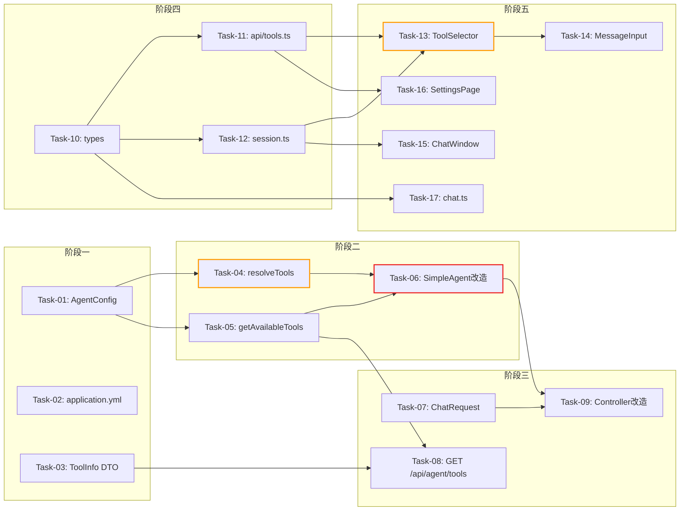

# 开发任务计划：Agent 工具按需加载

## 0. 任务概览 (Task Overview)

- **总任务数**: 17 个
- **预计总工时**: 590 分钟（约 10 小时）
- **开发方法**: TDD（测试驱动开发）— 每个任务按 Red-Green-Refactor 循环执行
- **关键里程碑**:
  - 阶段一完成（配置+DTO）：65m
  - 阶段二完成（核心逻辑）：195m
  - 阶段三完成（接口层）：90m
  - 阶段四完成（前端基础）：55m
  - 阶段五完成（前端组件）：245m
  - 整体完成：650m（含集成验证）
- **风险任务**: Task-04（工具标识解析逻辑复杂）、Task-13（@ 语法 textarea 交互）
- **阻塞任务**: Task-04、Task-05（被 Task-06、Task-08 等多个任务依赖）

### 依赖关系图

### 可并行任务组

| 并行组   | 可同时执行的任务                    | 说明                                    |
| :---- | :-------------------------- | :------------------------------------ |
| 并行组 1 | Task-01 + Task-02 + Task-03 | 配置类、yml、DTO 互不依赖                      |
| 并行组 2 | Task-04 + Task-05           | resolveTools 和 getAvailableTools 独立方法 |
| 并行组 3 | Task-07 + Task-08           | ChatRequest 和 /api/agent/tools 接口互不依赖 |
| 并行组 4 | Task-10 + Task-11 + Task-12 | 类型定义、API 封装、Store 可并行                 |
| 并行组 5 | Task-15 + Task-16 + Task-17 | ChatWindow、SettingsPage、chat.ts 互不依赖  |

## 1. 准备工作 (Preparation)

- [ ] **Prep-01**: 确认功能分支
  - 说明：在 `feature/tool-on-demand` 分支上开发
  - 验证：分支创建成功，基于最新 main
- [ ] **Prep-02**: 确认项目可编译启动
  - 说明：`mvn compile -pl agent-demo-bootstrap -am` 通过，前端 `npm run dev` 正常
  - 验证：编译无错误，服务正常启动

## 2. 开发任务 (Development Tasks)

### 阶段一：配置与数据层 (Config & Data Layer)

> 先完成配置绑定和 DTO 定义，为后续所有任务提供基础
>
> **阶段完成标准**: AgentConfig 可读取 agent.tools 配置，ToolInfo DTO 可正常序列化

- [ ] **Task-01**: AgentConfig 新增 ToolProperties 配置绑定
  - **通俗解释**: 做完这步后，系统就能从 application.yml 中读取"哪些工具默认加载、哪些可选"的配置了。
  - **说明**: 在 AgentConfig 中新增 `ToolProperties` 静态内部类，添加 `tools` 字段，绑定 `agent.tools.*` 配置前缀
  - **涉及文件**: `agent-demo-agent/src/main/java/com/agentdemo/agent/config/AgentConfig.java`
  - **测试文件**: `agent-demo-agent/src/test/java/com/agentdemo/agent/config/AgentConfigTest.java`
  - **参考**: 技术方案 Sec 4.1、Sec 10
  - **对应AC**: AC-001, AC-008
  - **预估工时**: 30m
  - **依赖**: 无
  - **验证标准**（TDD RED 阶段的测试依据）:
    - [ ] ToolProperties 类包含 `defaultTools`（List\<String>）和 `optional`（List\<String>）字段
    - [ ] 配置绑定前缀为 `agent.tools`，通过 `@ConfigurationProperties` 生效
    - [ ] 配置为空时，defaultTools 和 optional 均为空列表（非 null）
    - [ ] yml 中配置 `agent.tools.default: [builtin:getCurrentTime]` 后，AgentConfig.getTools().getDefaultTools() 返回 `["builtin:getCurrentTime"]`
- [ ] **Task-02**: application.yml 新增 agent.tools 配置段
  - **通俗解释**: 做完这步后，开发者就能在配置文件中直观地管理工具清单了——哪些默认加载、哪些可选一目了然。
  - **说明**: 在 application.yml 中新增 `agent.tools` 配置段，含 default 和 optional 两个列表，内置工具默认全部加入 default
  - **涉及文件**: `agent-demo-bootstrap/src/main/resources/application.yml`
  - **测试文件**: 无（配置验证通过 Task-01 的测试覆盖）
  - **参考**: 技术方案 Sec 附录
  - **对应AC**: AC-001
  - **预估工时**: 15m
  - **依赖**: 无
  - **验证标准**:
    - [ ] `agent.tools.default` 包含 `builtin:getCurrentTime`、`builtin:calculate`、`builtin:getCurrentTimeByZone`、`builtin:getCurrentDate`
    - [ ] `agent.tools.optional` 包含 `builtin:httpGet`、`builtin:httpPost`、`builtin:readFile`、`mcp:*`、`rag:*`
    - [ ] 配置格式正确，启动无 YAML 解析错误
- [ ] **Task-03**: 新增 ToolInfo DTO
  - **通俗解释**: 做完这步后，前后端之间就有了统一的"工具名片"格式——包含标识、类别、描述、是否默认加载。
  - **说明**: 创建 ToolInfo DTO，包含 id、category、name、description、isDefault 字段
  - **涉及文件**: `agent-demo-web/src/main/java/com/agentdemo/web/dto/ToolInfo.java`
  - **测试文件**: `agent-demo-web/src/test/java/com/agentdemo/web/dto/ToolInfoTest.java`
  - **参考**: 技术方案 Sec 2.2 接口1
  - **对应AC**: AC-004, AC-006
  - **预估工时**: 20m
  - **依赖**: 无
  - **验证标准**:
    - [ ] ToolInfo 包含字段：id(String)、category(String)、name(String)、description(String)、isDefault(boolean)
    - [ ] JSON 序列化后 key 为驼峰命名（如 `isDefault`）
    - [ ] 构造器或 Builder 可正常创建实例

### 阶段二：核心逻辑层 (Core Logic Layer)

> 实现工具标识解析、可用工具查询、SimpleAgent 工具绑定改造
>
> **阶段完成标准**: ToolRegistry 可正确解析 category:name 标识，SimpleAgent 可按指定工具列表绑定

- [ ] **Task-04**: ToolRegistry 新增 resolveTools 方法（⚠️ 风险任务）
  - **通俗解释**: 做完这步后，系统就能把"mcp:mermaid"这样的简短标识，翻译成实际的工具对象，Agent 才知道该调用哪个工具。
  - **说明**: 实现标识解析逻辑：按 `:` 分割 → 校验格式 → 按 category 分发到不同策略（builtin 按方法名查找、mcp 按前缀匹配、rag 按前缀匹配、支持 `*` 通配符展开）
  - **涉及文件**: `agent-demo-tools/src/main/java/com/agentdemo/tools/registry/ToolRegistry.java`
  - **测试文件**: `agent-demo-tools/src/test/java/com/agentdemo/tools/registry/ToolRegistryResolveTest.java`
  - **参考**: 技术方案 Sec 4.1
  - **对应AC**: AC-002, AC-003, AC-007, AC-014
  - **预估工时**: 90m
  - **依赖**: Task-01（需要 AgentConfig 读取 optional 列表校验）
  - **风险标注**: 3 种 category 解析策略 + 通配符展开 + 异常处理，逻辑较复杂
  - **验证标准**:
    - [ ] `resolveTools(["builtin:getCurrentTime"])` 返回包含 TimeTool Bean 的列表
    - [ ] `resolveTools(["mcp:mermaid-mcp"])` 返回所有 `mcp_mermaid-mcp_` 前缀的工具
    - [ ] `resolveTools(["mcp:*"])` 返回所有 `mcp_` 前缀的工具
    - [ ] `resolveTools(["rag:kb-abc123"])` 返回方法名为 `kb_abc123` 的工具
    - [ ] `resolveTools(["rag:*"])` 返回所有 `kb_` 前缀的工具
    - [ ] `resolveTools(["builtin:nonExistent"])` 抛出 BusinessException(TOOL\_NOT\_FOUND, 5101)
    - [ ] `resolveTools(["invalidFormat"])` 抛出 BusinessException(TOOL\_PARAM\_INVALID, 5102)
    - [ ] `resolveTools(["unknown:xxx"])` 抛出 BusinessException(TOOL\_PARAM\_INVALID, 5102)
- [ ] **Task-05**: ToolRegistry 新增 getAvailableTools / getDefaultTools 方法
  - **通俗解释**: 做完这步后，前端就能通过 API 查询到"系统里有哪些工具可用、哪些是默认的"，为工具选择器提供数据。
  - **说明**: 实现 getAvailableTools（遍历所有工具，反射获取 @Tool 信息，构建 ToolInfo 列表）、getDefaultTools（解析 default 配置为工具对象列表）
  - **涉及文件**: `agent-demo-tools/src/main/java/com/agentdemo/tools/registry/ToolRegistry.java`
  - **测试文件**: `agent-demo-tools/src/test/java/com/agentdemo/tools/registry/ToolRegistryQueryTest.java`
  - **参考**: 技术方案 Sec 4.2
  - **对应AC**: AC-004, AC-006, AC-008, AC-009, AC-010
  - **预估工时**: 45m
  - **依赖**: Task-01（需要 AgentConfig 读取 default 列表）
  - **验证标准**:
    - [ ] `getAvailableTools()` 返回的列表包含所有已注册工具，每项有 id、category、name、description、isDefault
    - [ ] 内置工具 category 为 "builtin"，id 格式为 "builtin:{methodName}"
    - [ ] MCP 工具 category 为 "mcp"，id 格式为 "mcp:{serverName}"
    - [ ] 知识库工具 category 为 "rag"，id 格式为 "rag:{kbId}"
    - [ ] default 配置中的工具 isDefault 为 true，其余为 false
    - [ ] `getDefaultTools()` 返回仅包含配置中 default 列表的工具对象
    - [ ] default 列表中存在不存在的工具时，日志 ERROR 输出，不抛异常，不阻塞启动
- [ ] **Task-06**: SimpleAgent 新增 sessionToolIds 缓存 + 工具绑定改造（🔒 阻塞任务）
  - **通俗解释**: 做完这步后，Agent 就不再把所有工具一股脑加载了，而是只听"指挥"——默认加载安全工具，用户指定了才加载额外工具，而且选过一次后整个会话都记住。
  - **说明**: 新增 `sessionToolIds` ConcurrentHashMap，新增带 `List<String> toolIds` 参数的方法重载（chat/chatStream/chatThinkingStream/chatThinkingReActStream），delegate 缓存键改为 modelId+toolsFingerprint
  - **涉及文件**: `agent-demo-agent/src/main/java/com/agentdemo/agent/single/SimpleAgent.java`
  - **测试文件**: `agent-demo-agent/src/test/java/com/agentdemo/agent/single/SimpleAgentToolBindingTest.java`
  - **参考**: 技术方案 Sec 4.3
  - **对应AC**: AC-001, AC-002, AC-012, AC-013
  - **预估工时**: 60m
  - **依赖**: Task-04, Task-05（需要 resolveTools、getDefaultTools）
  - **阻塞标注**: 被 Task-09 依赖，影响所有对话接口
  - **验证标准**:
    - [ ] 无 tools 参数时，delegate 仅绑定默认工具（验证 listTools 返回的仅默认工具）
    - [ ] 传入 `tools=["builtin:httpGet"]` 时，delegate 绑定默认工具 + httpGet
    - [ ] 传入 `tools=[]` 时，清除 sessionToolIds，仅绑定默认工具
    - [ ] 首次传入 tools 后，再次不传 tools，仍沿用首次的工具（会话缓存生效）
    - [ ] 传入 tools 后，再次传入不同 tools，更新缓存并使用新工具
    - [ ] delegate 缓存按 modelId+toolsFingerprint 隔离，不同工具集不共享
    - [ ] 默认工具始终在绑定列表中，即使 tools 参数未包含（AC-013）

### 阶段三：接口层 (API Layer)

> 扩展 ChatRequest、新增工具查询接口、改造对话接口
>
> **阶段完成标准**: API 可正确接收 tools 参数，GET /api/agent/tools 返回正确数据

- [ ] **Task-07**: ChatRequest 新增 tools 字段
  - **通俗解释**: 做完这步后，API 调用方就能在对话请求中携带"这次想用哪些工具"了。
  - **说明**: 在 ChatRequest DTO 中新增 `List<String> tools` 字段，可选，无校验注解
  - **涉及文件**: `agent-demo-web/src/main/java/com/agentdemo/web/dto/ChatRequest.java`
  - **测试文件**: 无（简单字段，通过 Task-09 的集成测试覆盖）
  - **参考**: 技术方案 Sec 2.2 接口2
  - **对应AC**: AC-002
  - **预估工时**: 15m
  - **依赖**: 无
  - **验证标准**:
    - [ ] ChatRequest 包含 `tools` 字段（List\<String>），默认 null
    - [ ] JSON 反序列化 `{"tools": ["mcp:mermaid"]}` 后 getTools() 返回 `["mcp:mermaid"]`
    - [ ] 不传 tools 时 getTools() 返回 null
- [ ] **Task-08**: AgentController 新增 GET /api/agent/tools 接口
  - **通俗解释**: 做完这步后，前端就能通过这个接口拿到所有可用工具的清单，展示在工具选择器和设置页面中。
  - **说明**: 新增 `GET /api/agent/tools` 接口，调用 ToolRegistry.getAvailableTools()，返回 ToolInfo 列表 + defaults 列表
  - **涉及文件**: `agent-demo-web/src/main/java/com/agentdemo/web/controller/AgentController.java`
  - **测试文件**: `agent-demo-web/src/test/java/com/agentdemo/web/controller/AgentControllerToolsTest.java`
  - **参考**: 技术方案 Sec 2.2 接口1
  - **对应AC**: AC-004, AC-006
  - **预估工时**: 30m
  - **依赖**: Task-03, Task-05（需要 ToolInfo DTO、getAvailableTools）
  - **验证标准**:
    - [ ] `GET /api/agent/tools` 返回 200，Response body 包含 `tools` 数组和 `defaults` 数组
    - [ ] `tools` 数组中每项包含 id、category、name、description、isDefault
    - [ ] `defaults` 数组包含配置中的默认工具 ID 列表
    - [ ] 内置工具按 category 分组正确，MCP 工具动态反映当前连接状态
- [ ] **Task-09**: AgentController 改造对话接口解析 tools 参数
  - **通俗解释**: 做完这步后，前端传过来的 tools 参数就能真正生效了——Agent 会根据指定的工具来加载能力。
  - **说明**: 在 chat/chatStream 方法中，解析 request.getTools()，调用 ToolRegistry.resolveTools() 校验，将工具列表传入 SimpleAgent；不传或空时 SimpleAgent 内部处理会话缓存
  - **涉及文件**: `agent-demo-web/src/main/java/com/agentdemo/web/controller/AgentController.java`
  - **测试文件**: `agent-demo-web/src/test/java/com/agentdemo/web/controller/AgentControllerChatToolsTest.java`
  - **参考**: 技术方案 Sec 4.4
  - **对应AC**: AC-002, AC-003, AC-007, AC-012, AC-014
  - **预估工时**: 45m
  - **依赖**: Task-06, Task-07（需要 SimpleAgent 新方法、ChatRequest.tools）
  - **验证标准**:
    - [ ] `POST /chat/stream` 传入 `tools: ["mcp:mermaid-mcp"]`，Agent 可调用 mermaid 工具（AC-002）
    - [ ] `POST /chat/stream` 传入 `tools: ["mcp:*"]`，Agent 可调用所有 MCP 工具（AC-003）
    - [ ] `POST /chat/stream` 传入 `tools: ["builtin:nonExistent"]`，SSE 返回 error 事件，code=5101（AC-007）
    - [ ] `POST /chat/stream` 传入 `tools: ["invalidFormat"]`，SSE 返回 error 事件，code=5102（AC-014）
    - [ ] `POST /chat/stream` 不传 tools 或传空数组，仅加载默认工具（AC-012）
    - [ ] 同步接口 `/chat` 同样支持 tools 参数

### 阶段四：前端基础层 (Frontend Foundation)

> 定义类型、封装 API、扩展 Store
>
> **阶段完成标准**: 前端能获取工具列表，session store 支持 toolsBySession 状态

- [ ] **Task-10**: types/index.ts 新增 ToolInfo 类型
  - **通俗解释**: 做完这步后，前端代码就有了统一的"工具信息"类型定义，其他地方引用时不会写错字段名。
  - **说明**: 新增 `ToolInfo` 接口（id、category、name、description、isDefault），新增 `ToolsResponse` 接口（tools、defaults）
  - **涉及文件**: `agent-demo-frontend/src/types/index.ts`
  - **测试文件**: 无（类型定义，编译时检查）
  - **参考**: 技术方案 Sec 2.2 接口1
  - **对应AC**: AC-004, AC-006
  - **预估工时**: 15m
  - **依赖**: 无
  - **验证标准**:
    - [ ] `ToolInfo` 接口包含 id、category、name、description、isDefault 字段
    - [ ] `ToolsResponse` 接口包含 tools(ToolInfo\[])、defaults(string\[])
    - [ ] TypeScript 编译无类型错误
- [ ] **Task-11**: api/tools.ts 新增 API 封装
  - **通俗解释**: 做完这步后，前端就能通过调用 `fetchAvailableTools()` 获取后端返回的工具清单了。
  - **说明**: 新建 `api/tools.ts`，封装 `GET /api/agent/tools` 请求，返回 `ToolsResponse`
  - **涉及文件**: `agent-demo-frontend/src/api/tools.ts`
  - **测试文件**: 无（API 封装，通过组件集成测试覆盖）
  - **参考**: 技术方案 Sec 2.2 接口1
  - **对应AC**: AC-004, AC-006
  - **预估工时**: 20m
  - **依赖**: Task-10（需要 ToolInfo 类型）
  - **验证标准**:
    - [ ] `fetchAvailableTools()` 调用 `GET /api/agent/tools`
    - [ ] 成功时返回 `ToolsResponse` 对象
    - [ ] 失败时抛出错误，包含错误信息
- [ ] **Task-12**: session.ts 新增 toolsBySession 状态
  - **通俗解释**: 做完这步后，前端就能记住"每个会话分别选了哪些工具"，切换会话时工具选择自动切换。
  - **说明**: 在 sessionStore 中新增 `toolsBySession: Record<string, string[]>` 状态，新增 `getTools`/`setTools`/`clearTools` actions，不持久化
  - **涉及文件**: `agent-demo-frontend/src/stores/session.ts`
  - **测试文件**: 无（Store 逻辑，通过组件集成测试覆盖）
  - **参考**: 技术方案 Sec 4.5
  - **对应AC**: AC-015
  - **预估工时**: 20m
  - **依赖**: Task-10（需要 ToolInfo 类型）
  - **验证标准**:
    - [ ] `setTools(sessionId, ["mcp:mermaid"])` 后 `getTools(sessionId)` 返回 `["mcp:mermaid"]`
    - [ ] 切换 sessionId 后，getTools 返回各自的工具列表
    - [ ] `clearTools(sessionId)` 后 getTools 返回 undefined
    - [ ] toolsBySession 不写入 localStorage（刷新后丢失）

### 阶段五：前端组件层 (Frontend Components)

> 实现工具选择器、工具标签栏、设置页面，对接到 API
>
> **阶段完成标准**: 用户可通过 @ 选择工具，标签栏持久展示，设置页面可查看工具清单

- [ ] **Task-13**: ToolSelector 组件（@ 语法 + 下拉面板）（⚠️ 风险任务）
  - **通俗解释**: 做完这步后，用户在输入框里输入 @ 就能弹出工具列表，勾选后输入框上方会出现对应的工具标签。
  - **说明**: 新建 ToolSelector.vue，实现：监听 textarea 中 @ 输入 → 弹出下拉面板 → 按类别分组展示 → 默认工具锁定不可取消 → 勾选/取消可选工具 → 通过 v-model 双向绑定选中工具列表
  - **涉及文件**: `agent-demo-frontend/src/components/ToolSelector.vue`
  - **测试文件**: 无（组件，通过 E2E 验证）
  - **参考**: 技术方案 Sec 4.5；参考组件 KnowledgeBaseSelector.vue 的交互模式
  - **对应AC**: AC-004, AC-011
  - **预估工时**: 90m
  - **依赖**: Task-11, Task-12（需要 API 和 Store）
  - **风险标注**: textarea 中光标位置跟踪、@ 检测和文本替换逻辑较复杂
  - **验证标准**:
    - [ ] 输入 @ 时弹出下拉面板，按类别分组展示（内置/MCP/知识库）
    - [ ] 默认工具已勾选且显示锁定图标，不可取消
    - [ ] 点击可选工具切换勾选状态
    - [ ] 输入 @ + 关键词时，面板按关键词过滤
    - [ ] 输入不存在的工具名时，过滤结果为空，不创建标签
    - [ ] 点击面板外或按 Esc 关闭面板
    - [ ] 关闭面板后 textarea 中的 @ 及搜索文本被移除
    - [ ] 通过 v-model 输出选中的工具 ID 列表
- [ ] **Task-14**: MessageInput 集成工具标签栏
  - **通俗解释**: 做完这步后，输入框上方就会持久展示工具标签——默认工具（蓝色锁定）和用户选的可选工具（绿色/橙色，可删除），一目了然。
  - **说明**: 修改 MessageInput.vue，集成 ToolSelector 组件，在 textarea 上方新增工具标签栏，展示默认工具标签（不可删除）和可选工具标签（可 × 删除），标签颜色按类别区分
  - **涉及文件**: `agent-demo-frontend/src/components/MessageInput.vue`
  - **测试文件**: 无（组件，通过 E2E 验证）
  - **参考**: 技术方案 Sec 4.5 标签栏设计
  - **对应AC**: AC-004, AC-005, AC-015
  - **预估工时**: 45m
  - **依赖**: Task-13（需要 ToolSelector 组件）
  - **验证标准**:
    - [ ] 输入框上方显示工具标签栏，默认工具 🔒 蓝色标签 + 可选工具标签
    - [ ] 内置工具标签为蓝色，MCP 工具标签为绿色，知识库工具标签为橙色
    - [ ] 默认工具标签无 × 按钮，不可删除
    - [ ] 可选工具标签有 × 按钮，点击后标签消失
    - [ ] 无选中可选工具时，仅显示默认工具标签
    - [ ] 流式生成中，× 按钮禁用
    - [ ] 切换会话时，标签栏随 toolsBySession 切换（AC-015）
    - [ ] 通过 @ 选择工具后，标签即刻出现在标签栏
- [ ] **Task-15**: ChatWindow 传递 tools 到 API
  - **通俗解释**: 做完这步后，用户选的工具就会在实际发送消息时生效——Agent 只加载用户指定的工具。
  - **说明**: 修改 ChatWindow\.vue 的 sendMessage 方法，从 sessionStore 读取 toolsBySession，传入 streamChat 的 tools 参数
  - **涉及文件**: `agent-demo-frontend/src/components/ChatWindow.vue`
  - **测试文件**: 无（组件，通过 E2E 验证）
  - **参考**: 技术方案 Sec 1.2 时序图
  - **对应AC**: AC-005
  - **预估工时**: 30m
  - **依赖**: Task-12（需要 toolsBySession）
  - **验证标准**:
    - [ ] 发送消息时，streamChat 的 tools 参数为当前会话的 toolsBySession
    - [ ] 无选中可选工具时，tools 传空数组（清除后端绑定）
    - [ ] 选中可选工具时，tools 传选中工具的 ID 列表
    - [ ] 发送后标签栏保持不变（持久展示）
- [ ] **Task-16**: SettingsPage 新增工具管理标签页
  - **通俗解释**: 做完这步后，用户就能在设置页面看到所有工具清单——包括工具名称、描述、属于哪个类别、是否默认加载。
  - **说明**: 修改 SettingsPage.vue，新增"工具管理"标签页，调用 fetchAvailableTools() 获取数据，按类别分组展示工具清单，标注默认/可选状态
  - **涉及文件**: `agent-demo-frontend/src/components/SettingsPage.vue`
  - **测试文件**: 无（组件，通过 E2E 验证）
  - **参考**: 技术方案 Sec 1.3 UI/逻辑映射
  - **对应AC**: AC-006, AC-009, AC-010
  - **预估工时**: 45m
  - **依赖**: Task-11（需要 fetchAvailableTools API）
  - **验证标准**:
    - [ ] 设置页面新增"工具管理"标签页
    - [ ] 标签页展示所有工具，按类别分组（内置/MCP/知识库）
    - [ ] 每项显示工具标识、描述、默认/可选状态
    - [ ] 默认工具标注"默认加载"，可选工具标注"需指定"
    - [ ] MCP Server 断开后，其工具从列表中消失（AC-009）
    - [ ] 知识库删除后，其工具从列表中消失（AC-010）
- [ ] **Task-17**: chat.ts streamChat 新增 tools 参数
  - **通俗解释**: 做完这步后，前端就能把工具选择信息随对话请求一起发给后端了。
  - **说明**: 修改 streamChat 函数签名，新增 `tools: string[]` 参数，在请求 body 中传递
  - **涉及文件**: `agent-demo-frontend/src/api/chat.ts`
  - **测试文件**: 无（API 封装，通过 E2E 验证）
  - **参考**: 技术方案 Sec 2.2 接口2
  - **对应AC**: AC-005
  - **预估工时**: 15m
  - **依赖**: Task-10（需要 ToolInfo 类型）
  - **验证标准**:
    - [ ] streamChat 函数签名新增 `tools: string[]` 参数
    - [ ] POST 请求 body 中包含 `tools` 字段
    - [ ] tools 为空数组时 body 中 `tools: []`
    - [ ] 向后兼容：不传 tools 时 body 中不含 tools 字段

### 阶段性集成验证 (Stage Integration Verification)

- [ ] **Verify-01**: 后端编译验证
  - **说明**: 运行 `mvn compile -pl agent-demo-bootstrap -am`，确保所有后端改动编译通过
  - **验证标准**:
    - [ ] 编译无错误
    - [ ] 所有单元测试通过
- [ ] **Verify-02**: 前端编译验证
  - **说明**: 运行 `npm run build`（在 agent-demo-frontend 目录），确保无 TypeScript 错误
  - **验证标准**:
    - [ ] 构建无错误
    - [ ] 无类型错误
- [ ] **Verify-03**: 端到端验证
  - **说明**: 启动完整服务，按照验收标准逐项验证
  - **验证标准**:
    - [ ] 不选工具时，Agent 仅能使用默认工具（AC-001）
    - [ ] 通过 @ 选择工具后，Agent 可使用指定工具（AC-002, AC-005）
    - [ ] 指定不存在的工具返回错误（AC-007）
    - [ ] 设置页面可查看工具清单（AC-006）
    - [ ] 标签栏持久展示，切换会话生效（AC-015）

## 3. 验收标准检查清单 (AC Checklist)

| 验收标准   | 描述                  | 对应任务                                                          | 状态  |
| :----- | :------------------ | :------------------------------------------------------------ | :-- |
| AC-001 | Agent 启动后仅加载默认工具    | Task-01, Task-02, Task-06                                     | 待完成 |
| AC-002 | API 追加可选工具          | Task-04, Task-06, Task-07, Task-09                            | 待完成 |
| AC-003 | 通配符加载整类工具           | Task-04, Task-09                                              | 待完成 |
| AC-004 | 前端 @ 语法弹出工具选择器      | Task-03, Task-05, Task-08, Task-10, Task-11, Task-13, Task-14 | 待完成 |
| AC-005 | 前端 @ 选择工具后发送消息      | Task-14, Task-15, Task-17                                     | 待完成 |
| AC-006 | 设置页面查看工具清单          | Task-03, Task-05, Task-08, Task-10, Task-11, Task-16          | 待完成 |
| AC-007 | API 指定不存在的工具报错      | Task-04, Task-09                                              | 待完成 |
| AC-008 | 默认工具配置不存在时启动不阻塞     | Task-01, Task-05                                              | 待完成 |
| AC-009 | MCP Server 断开后工具不可用 | Task-05, Task-16                                              | 待完成 |
| AC-010 | 知识库删除后工具自动注销        | Task-05, Task-16                                              | 待完成 |
| AC-011 | 前端 @ 输入不存在的工具名      | Task-13                                                       | 待完成 |
| AC-012 | 空 tools 参数仅加载默认工具   | Task-06, Task-09                                              | 待完成 |
| AC-013 | 默认工具不可通过 API 排除     | Task-06                                                       | 待完成 |
| AC-014 | 工具标识格式校验            | Task-04, Task-09                                              | 待完成 |
| AC-015 | 前端工具选择器按会话保持        | Task-12, Task-14                                              | 待完成 |

## 4. 验证计划 (Verification Plan)

### 4.1 TDD 过程验证（每个任务内部）

- [ ] RED：测试编写完成后运行，确认全部失败
- [ ] GREEN：实现代码后运行，确认全部通过
- [ ] REFACTOR：重构后运行，确认仍全部通过

### 4.2 阶段验证检查点

| 阶段     | 验证动作                 | 关联任务                      | 通过标准                               |
| :----- | :------------------- | :------------------------ | :--------------------------------- |
| 阶段一完成后 | 运行 AgentConfig 单元测试  | Task-01, Task-03          | 配置绑定正确，ToolInfo 序列化正确              |
| 阶段二完成后 | 运行 ToolRegistry 单元测试 | Task-04, Task-05, Task-06 | resolveTools 解析正确，SimpleAgent 缓存生效 |
| 阶段三完成后 | 运行 Controller 集成测试   | Task-07, Task-08, Task-09 | API 返回正确，tools 参数生效                |
| 阶段四完成后 | 前端编译 + Store 单元测试    | Task-10, Task-11, Task-12 | 编译无错误，Store 状态管理正确                 |
| 阶段五完成后 | 前端构建 + E2E 验证        | Task-13\~17               | 构建无错误，交互流程正确                       |

### 4.3 验收标准逐项验证

| AC     | 验证方式                                           | 关联任务                               | 状态  |
| :----- | :--------------------------------------------- | :--------------------------------- | :-- |
| AC-001 | 启动服务，不传 tools，Agent 对话中仅可见默认工具                 | Task-01, Task-02, Task-06          | 待验证 |
| AC-002 | 传 tools=\["builtin:httpGet"]，Agent 可调用 httpGet | Task-04, Task-06, Task-07, Task-09 | 待验证 |
| AC-003 | 传 tools=\["mcp:\*"]，Agent 可调用所有 MCP 工具         | Task-04, Task-09                   | 待验证 |
| AC-004 | 输入框输入 @，弹出分组工具面板，默认工具锁定                        | Task-13, Task-14                   | 待验证 |
| AC-005 | @ 选择工具后发送消息，Agent 可调用选中工具                      | Task-14, Task-15, Task-17          | 待验证 |
| AC-006 | 设置页 > 工具管理，展示所有工具清单                            | Task-16                            | 待验证 |
| AC-007 | API 传不存在的工具，返回 5101 错误                         | Task-04, Task-09                   | 待验证 |
| AC-008 | yml 配置不存在的默认工具，启动不阻塞                           | Task-05                            | 待验证 |
| AC-009 | MCP 断开后，工具列表不包含该工具，API 指定时报错                   | Task-05, Task-16                   | 待验证 |
| AC-010 | 删除知识库后，工具列表不包含该工具                              | Task-05, Task-16                   | 待验证 |
| AC-011 | @ 输入不存在的工具名，面板无结果，不创建标签                        | Task-13                            | 待验证 |
| AC-012 | 不传 tools，Agent 仅加载默认工具                         | Task-06, Task-09                   | 待验证 |
| AC-013 | 默认工具始终在绑定列表中                                   | Task-06                            | 待验证 |
| AC-014 | 传格式错误的标识，返回 5102                               | Task-04, Task-09                   | 待验证 |
| AC-015 | 切换会话，工具标签栏跟随切换                                 | Task-12, Task-14                   | 待验证 |

### 4.4 最终验证（所有阶段完成后）

- [ ] 运行 `mvn compile -pl agent-demo-bootstrap -am` 编译通过
- [ ] 运行 `npm run build` 前端构建通过
- [ ] 按照验收标准逐项端到端验证（15 条 AC）
- [ ] 无 TypeScript 类型错误
- [ ] 无 lint 错误

## 5. 风险与注意事项 (Risks & Notes)

- **技术风险**:
  - **Task-04**（resolveTools）：3 种 category + 通配符解析，逻辑分支多，需充分测试边界情况。建议先写测试覆盖所有 case，再逐步实现
  - **Task-13**（ToolSelector）：textarea 中 @ 检测和光标位置处理较复杂。建议先实现独立的下拉面板组件，再集成 @ 触发逻辑
- **依赖风险**:
  - **Task-06**（SimpleAgent）改造涉及所有对话方法（chat/chatStream/chatThinkingStream/chatThinkingReActStream），改动面广，需注意向后兼容
  - 前端阶段（四、五）依赖后端接口（Task-08、Task-09）就绪，可先使用 Mock 数据并行开发前端组件
- **时间风险**: 若工时超出预期，Task-16（设置页工具管理）和 Task-13 的 @ 过滤功能可降级为简单列表展示
- **质量保证**: 每个任务通过 TDD 循环保证代码质量，阶段三和阶段五完成后进行集成验证

