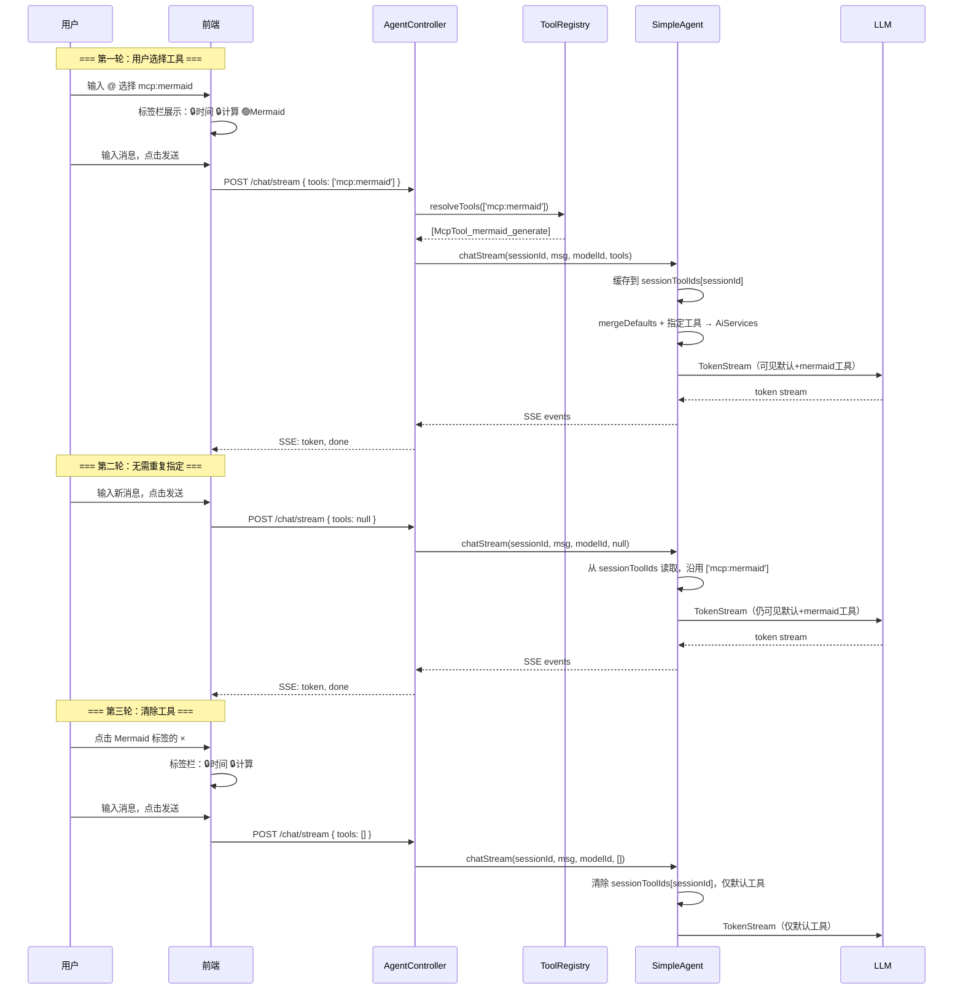

# 技术设计文档：Agent 工具按需加载

## 0. 设计概要 (Design Summary)

- **功能描述**：Agent 默认仅加载配置中指定的通用工具，其他工具需通过 API 或前端显式指定后才加载，实现工具按需加载。
- **影响范围**：`agent-demo-tools`（ToolRegistry）、`agent-demo-agent`（AgentConfig、SimpleAgent）、`agent-demo-web`（ChatRequest、AgentController、新增 /api/agent/tools 接口）、`agent-demo-bootstrap`（application.yml）、`agent-demo-frontend`（chat.ts、session.ts、types、MessageInput、SettingsPage、ChatWindow、新增 ToolSelector）
- **技术难点**：工具标识与对象的双向映射（`category:name` → 工具对象）；SimpleAgent delegate 缓存需感知工具集变化；前端 `@` 语法在 textarea 中的实现
- **依赖关系**：无外部依赖，基于现有 ToolRegistry 和 SimpleAgent 扩展

## 1. 架构概览 (Architecture Overview)

### 1.1 模块交互关系

```
┌─────────────────────────────────────────────────────────────────┐
│                        application.yml                          │
│  agent.tools.default: [builtin:getCurrentTime, ...]            │
│  agent.tools.optional: [builtin:httpGet, mcp:*, rag:*]         │
└─────────────────────────┬───────────────────────────────────────┘
                          │ @ConfigurationProperties
                          ▼
┌─────────────────────────────────────────────────────────────────┐
│                       AgentConfig                                │
│  + tools: ToolProperties { default, optional }                   │
└─────────────────────────┬───────────────────────────────────────┘
                          │
                          ▼
┌─────────────────────────────────────────────────────────────────┐
│                      ToolRegistry                                │
│  + resolveTools(ids): List<Object>    ← 标识→对象映射           │
│  + getAvailableTools(): List<ToolInfo> ← 前端查询              │
│  + getDefaultToolIds(): List<String>                              │
└──────────┬──────────────────────────────────────────────────────┘
           │                         │
           ▼                         ▼
┌──────────────────┐    ┌──────────────────────────┐
│   SimpleAgent     │    │    AgentController        │
│ getDelegate(      │    │ chatStream(request):      │
│   modelId,        │    │   1. 解析 request.tools    │
│   toolObjects)    │    │   2. resolveTools 校验     │
│ delegateCache:    │    │   3. 传入 SimpleAgent      │
│   key = modelId   │    │ GET /api/agent/tools       │
│   + toolsHash     │    │   → getAvailableTools()    │
└──────────────────┘    └──────────────────────────┘
           │                         │
           ▼                         ▼
┌──────────────────┐    ┌──────────────────────────┐
│  LangChain4j      │    │     前端 (Vue 3)          │
│  AiServices       │    │ chat.ts: +tools 参数      │
│  .tools(list)     │    │ session.ts: +toolsBySession│
└──────────────────┘    │ ToolSelector.vue: @ 语法   │
                        │ SettingsPage: 工具管理Tab  │
                        └──────────────────────────┘
```

### 1.2 数据流向（对话场景）



### 1.3 UI/逻辑映射

| 前端组件 | 操作 | 后端 API |
|---------|------|---------|
| `ToolSelector`（@ 触发） | 获取可用工具列表 | `GET /api/agent/tools` |
| `MessageInput > 工具标签栏` | 持久展示当前会话已选工具（默认+可选） | —（前端状态） |
| `MessageInput` | 发送消息（携带 tools，含空数组清除） | `POST /api/agent/chat/stream` (ChatRequest.tools) |
| `SettingsPage > 工具管理` | 查看工具清单 | `GET /api/agent/tools` |

## 2. API 设计 (API Design)

### 2.1 接口列表

| 接口名称 | 方法 | 路径 | 描述 | 对应验收标准 |
|:---|:---|:---|:---|:---|
| 获取可用工具列表 | GET | /api/agent/tools | 返回所有已注册工具，含类别、默认/可选状态 | AC-004, AC-006 |
| 流式对话（扩展） | POST | /api/agent/chat/stream | ChatRequest 新增 tools 字段 | AC-002, AC-003, AC-007 |
| 同步对话（扩展） | POST | /api/agent/chat | 同上 | AC-002 |

### 2.2 接口详情

#### 接口 1：获取可用工具列表

- **路径**: `GET /api/agent/tools`
- **描述**: 返回所有已注册的工具信息，按类别分组，供前端展示工具选择器
- **鉴权**: 无需鉴权（学习项目）
- **Response (成功)**:
  ```json
  {
    "code": 200,
    "data": {
      "defaults": ["builtin:getCurrentTime", "builtin:calculate"],
      "tools": [
        {
          "id": "builtin:getCurrentTime",
          "category": "builtin",
          "name": "getCurrentTime",
          "description": "获取当前时间",
          "isDefault": true
        },
        {
          "id": "builtin:calculate",
          "category": "builtin",
          "name": "calculate",
          "description": "执行数学计算",
          "isDefault": true
        },
        {
          "id": "builtin:httpGet",
          "category": "builtin",
          "name": "httpGet",
          "description": "发送 HTTP GET 请求",
          "isDefault": false
        },
        {
          "id": "mcp:mermaid-mcp",
          "category": "mcp",
          "name": "mermaid-mcp",
          "description": "Mermaid 图表生成（mermaid-mcp Server）",
          "isDefault": false
        },
        {
          "id": "rag:kb-abc123",
          "category": "rag",
          "name": "kb-abc123",
          "description": "检索知识库：我的文档",
          "isDefault": false
        }
      ]
    }
  }
  ```

#### 接口 2：流式对话（ChatRequest 扩展）

- **路径**: `POST /api/agent/chat/stream`
- **描述**: 原有接口，ChatRequest 新增 `tools` 字段
- **Request (新增字段)**:
  ```json
  {
    "sessionId": "abc123",
    "message": "帮我画一个流程图",
    "enableThinking": true,
    "knowledgeBases": [],
    "model": "ark:doubao-seed-2.0-code",
    "tools": ["mcp:mermaid-mcp"]
  }
  ```
- **tools 字段语义（会话级）**：
  | tools 值 | 行为 |
  |:---|:---|
  | `["mcp:mermaid"]` | 绑定到会话，后续轮次沿用 |
  | `null` / 不传 | 沿用会话已绑定的工具（无绑定时用默认） |
  | `[]`（空数组） | 清除会话绑定，恢复仅默认工具 |
  | `["rag:kb-abc"]` | 替换会话绑定为新工具 |
- **Response (失败 - 工具不存在)**:
  ```json
  {
    "code": 5101,
    "message": "工具不存在: builtin:nonExistent"
  }
  ```
- **Response (失败 - 格式错误)**:
  ```json
  {
    "code": 5102,
    "message": "工具标识格式错误: invalidFormat，正确格式为 category:name（如 builtin:getCurrentTime）"
  }
  ```
- **异常处理**:
  - 工具标识格式不合法 → 返回 5102 (TOOL_PARAM_INVALID)
  - 工具不存在（不在 optional 列表中或未注册）→ 返回 5101 (TOOL_NOT_FOUND)
  - 默认工具不可通过 API 排除，最终工具 = 默认 ∪ 指定（BR-TOOL-010）

## 3. 数据库设计 (Database Schema)

> 本次不涉及数据库变更，所有数据均使用内存存储（ConcurrentHashMap）。

## 4. 核心逻辑与算法 (Core Logic)

### 4.1 工具标识解析（ToolRegistry.resolveTools）

**触发条件**：AgentController 收到 ChatRequest 后，调用 ToolRegistry 将 `category:name` 标识列表解析为工具对象列表。

**处理步骤**：

1. 解析每个标识，按 `:` 分割为 `category` 和 `name`
2. 格式校验：必须包含 `:`，且 category 为 `builtin` / `mcp` / `rag`
3. 按 category 分发到不同的解析策略：
   - `builtin:{methodName}` → 在工具列表中查找包含该方法的 Bean
   - `mcp:{serverName}` → 查找所有 `mcp_{serverName}_` 前缀的工具
   - `mcp:*` → 查找所有 `mcp_` 前缀的工具
   - `rag:{kbId}` → 查找方法名为 `kb_{kbId}` 的工具
   - `rag:*` → 查找所有 `kb_` 前缀的工具
4. 通配符 `*` 展开为所有匹配的工具
5. 若某标识未匹配到任何工具 → 抛出 `BusinessException(TOOL_NOT_FOUND)`

**伪代码**：

```
function resolveTools(identifiers, allTools):
    result = new LinkedHashSet()
    
    for id in identifiers:
        parts = id.split(":", 2)
        if parts.length != 2:
            throw TOOL_PARAM_INVALID
        
        category = parts[0]
        name = parts[1]
        
        switch category:
            case "builtin":
                tool = findToolByMethodName(allTools, name)
                if tool == null: throw TOOL_NOT_FOUND
                result.add(tool)
            
            case "mcp":
                if name == "*":
                    result.addAll(findToolsByPrefix(allTools, "mcp_"))
                else:
                    matched = findToolsByPrefix(allTools, "mcp_" + name + "_")
                    if matched.isEmpty(): throw TOOL_NOT_FOUND
                    result.addAll(matched)
            
            case "rag":
                if name == "*":
                    result.addAll(findToolsByPrefix(allTools, "kb_"))
                else:
                    tool = findToolByMethodName(allTools, "kb_" + name)
                    if tool == null: throw TOOL_NOT_FOUND
                    result.add(tool)
            
            default:
                throw TOOL_PARAM_INVALID
    
    return result
```

### 4.2 工具信息构建（ToolRegistry.getAvailableTools）

**触发条件**：前端调用 `GET /api/agent/tools` 时。

**处理步骤**：

1. 遍历所有已注册工具 `listTools()`
2. 对每个工具 Bean，反射获取其 `@Tool` 方法
3. 根据方法名推断 category 和构建 `id`：
   - 方法名以 `mcp_` 开头 → category = `mcp`，id = `mcp:{serverName}`（提取 mcp_ 和下一个 _ 之间的部分）
   - 方法名以 `kb_` 开头 → category = `rag`，id = `rag:{kbId}`（去掉 kb_ 前缀）
   - 其他 → category = `builtin`，id = `builtin:{methodName}`
4. 从 AgentConfig 读取 `default` 列表，判断每个工具是否为默认工具
5. 返回 `ToolInfo` 列表

### 4.3 SimpleAgent 工具绑定改造

**核心变更**：`getDelegate` 方法从"全量绑定"改为"按传入列表绑定"，并支持会话级工具缓存。

**会话级工具缓存**：

```java
// SimpleAgent 新增字段
private final ConcurrentHashMap<String, List<String>> sessionToolIds = new ConcurrentHashMap<>();
```

**方法签名变更**：

```java
// 新方法：带 tools 参数（前端传入的工具ID列表）
public TokenStream chatStream(String sessionId, String message, String modelId, List<String> toolIds)

// 处理逻辑
public TokenStream chatStream(String sessionId, String message, String modelId, List<String> toolIds) {
    List<Object> tools;
    if (toolIds != null) {
        if (toolIds.isEmpty()) {
            // 空数组 → 清除会话绑定，仅默认工具
            sessionToolIds.remove(sessionId);
            tools = toolRegistry.getDefaultTools();
        } else {
            // 指定工具 → 解析 + 缓存
            tools = toolRegistry.resolveTools(toolIds);
            sessionToolIds.put(sessionId, toolIds);
        }
    } else {
        // 未指定 → 从会话缓存读取
        toolIds = sessionToolIds.get(sessionId);
        tools = toolIds != null ? toolRegistry.resolveTools(toolIds) : toolRegistry.getDefaultTools();
    }
    // 合并默认工具（默认工具不可排除）
    tools = mergeDefaults(tools);
    return getDelegate(modelId, tools).chatStream(sessionId, message);
}
```

**Delegate 缓存键改造**：

```
原缓存 key: modelId (如 "ark:doubao-seed-2.0-code")
新缓存 key: modelId + ":" + toolsFingerprint
  toolsFingerprint = 工具方法名排序后拼接的 hash
  如: "ark:doubao-seed-2.0-code:getCurrentTime,calculate,httpGet"
```

**向后兼容**：保留原有方法签名（无 tools 参数），内部调用 `toolRegistry.getDefaultTools()` 作为默认工具列表。

### 4.4 AgentController 流程改造

**chatStream 方法新增逻辑**（在原有三路分流之前）：

```
1. 解析 request.getTools()
2. 若 tools 不为空：
   a. 调用 toolRegistry.resolveTools(tools) 解析并校验
   b. 捕获 BusinessException → 通过 SSE error 事件返回
3. 获取默认工具：toolRegistry.getDefaultTools()
4. 合并工具列表：mergedTools = 默认工具 ∪ 解析出的指定工具
5. 将 mergedTools 传入 SimpleAgent.chatStream(sessionId, message, modelId, mergedTools)
```

**提示词注入**（同现有 knowledgeBases 注入模式）：
- 当用户指定了工具时，在系统提示词中无需额外注入（工具已通过 AiServices.tools() 绑定给 LLM）

### 4.5 前端 @ 语法工具选择器 + 持久标签展示

**组件设计**：`ToolSelector` 组件，嵌入 `MessageInput` 内部。

**标签栏（持久展示）**：

```
┌─────────────────────────────────────────────────────┐
│  🔒 时间查询  🔒 计算器  🟢 Mermaid  ×  │  ← 工具标签栏
├─────────────────────────────────────────────────────┤
│  [@ 帮我画一个流程图...]                    [发送]   │  ← 输入框
└─────────────────────────────────────────────────────┘
```

| 标签样式 | 含义 | 交互 |
|---------|------|------|
| 🔒 蓝色标签 | 默认工具（始终加载） | 不可删除，无 × 按钮 |
| 🟢 绿色标签 | MCP 工具（用户选的） | 点击 × 移除，发送空 tools 清除 |
| 🟠 橙色标签 | 知识库工具（用户选的） | 点击 × 移除 |

**标签栏行为**：
- 始终展示在输入框上方，不随 @ 面板关闭而消失
- 切换会话时标签随 `toolsBySession` 切换
- 无选中可选工具时，仅显示默认工具标签
- 流式生成中仍可见，但 × 按钮禁用（不可移除）

**@ 选择交互流程**：

```
1. 用户在 textarea 中输入 "@"
2. 监听 input 事件，检测到 "@" 字符后：
   - 显示下拉面板（position: absolute 定位在 @ 下方）
   - 提取 @ 后的文本作为搜索关键词
3. 下拉面板：
   - 从 GET /api/agent/tools 获取工具列表
   - 按类别分组显示（内置/MCP/知识库）
   - 默认工具已勾选且锁定（灰色 + 🔒图标）
   - 根据搜索关键词过滤
   - 点击可选工具切换勾选状态
4. 用户选择完成（点击面板外或按 Esc 关闭）：
   - 从 textarea 中移除 "@" 及搜索文本
   - 选中的可选工具立即显示为标签（在输入框上方）
   - 标签持久可见，不随面板关闭消失
5. 发送消息时：
   - 选中的工具 ID 列表作为 tools 参数传入 API
   - 后续轮次无需重复指定，标签栏自动保持
6. 移除工具：
   - 点击可选工具标签的 ×，标签即刻消失
   - 下次发送时 tools 传空数组，后端清除会话绑定
```

**状态管理**：
- `sessionStore.toolsBySession: Record<string, string[]>` — 按会话隔离的选中工具列表
- 不持久化到 localStorage（与 knowledgeBasesBySession 行为一致）

**标签颜色**：
- 内置工具：蓝色（`#4a9eff`）
- MCP 工具：绿色（`#00d4b8`）
- 知识库工具：橙色（`#ff8c42`）

## 5. 异常处理 (Error Handling)

| 异常场景 | 对应验收标准 | 处理方案 | 用户提示 |
|:---|:---|:---|:---|
| API 指定不存在的工具 | AC-007 | AgentController 调用 resolveTools 时捕获 BusinessException，通过 SSE error 事件返回 | "工具不存在: builtin:nonExistent" |
| 默认工具配置了不存在的工具 | AC-008 | 启动时 ToolRegistry 校验 default 列表，ERROR 日志记录，跳过无效项 | 启动日志，不阻塞 |
| MCP Server 断开 | AC-009 | `getAvailableTools()` 只返回已连接的工具；resolveTools 时若工具已断开则报 TOOL_NOT_FOUND | "工具不存在: mcp:mermaid-mcp" |
| 知识库删除 | AC-010 | 同 MCP，删除时 unregisterTool 已移除；resolveTools 时报 TOOL_NOT_FOUND | "工具不存在: rag:kb-abc123" |
| 前端 @ 输入不存在的工具名 | AC-011 | 下拉面板过滤结果为空，不创建标签 | 下拉面板显示"无匹配工具" |
| 空 tools 参数 | AC-012 | 不传或为空时，仅加载默认工具 | 正常对话 |
| 工具标识格式错误 | AC-014 | resolveTools 中校验格式，不符合抛 TOOL_PARAM_INVALID | "工具标识格式错误: xxx，正确格式为 category:name" |
| 默认工具不可排除 | AC-013 | 合并逻辑：mergedTools = 默认 ∪ 指定，不会因 API 未指定而丢失 | 无需提示 |

## 6. 安全与性能 (Security & Performance)

- **鉴权机制**：本项目为学习项目，无鉴权
- **数据校验**：
  - 工具标识格式：`category:name`，category 取值限定 `builtin/mcp/rag`
  - tools 参数数组长度限制：建议 ≤ 50
- **限流策略**：无需额外限流
- **缓存策略**：
  - SimpleAgent delegate 缓存：按 `modelId + toolsFingerprint` 缓存，避免重复构建 AiServices 代理
  - 前端工具列表：首次加载后缓存在组件内，切换 MCP 连接时刷新
- **性能指标**：
  - `GET /api/agent/tools` 响应时间 < 50ms（纯内存操作）
  - `resolveTools` 解析时间 < 10ms（O(n) 遍历，工具数通常 < 100）
  - delegate 缓存命中时，对话启动无额外开销
- **安全考虑**：
  - 默认工具不可通过 API 排除（BR-TOOL-010），防止绕过安全限制
  - HTTP 工具、文件读取工具等高风险工具不在默认列表中

## 7. 验收标准映射 (AC Mapping)

| 验收标准 | 描述 | 对应技术实现 |
|:---|:---|:---|
| AC-001 | Agent 启动后仅加载默认工具 | SimpleAgent.getDelegate() 使用 toolRegistry.getDefaultTools() 而非 listTools() |
| AC-002 | API 追加可选工具 | AgentController 解析 request.tools → resolveTools → 合并默认工具 → 传入 SimpleAgent |
| AC-003 | 通配符加载整类工具 | ToolRegistry.resolveTools() 中 `*` 展开逻辑 |
| AC-004 | 前端 @ 语法弹出工具选择器 | ToolSelector 组件，监听 @ 输入，调用 GET /api/agent/tools |
| AC-005 | 前端 @ 选择工具后发送 | ChatWindow.sendMessage() 传递 toolsBySession 到 streamChat |
| AC-006 | 设置页面查看工具清单 | SettingsPage 新增"工具管理"Tab，调用 GET /api/agent/tools |
| AC-007 | API 指定不存在的工具报错 | ToolRegistry.resolveTools() 抛出 BusinessException(TOOL_NOT_FOUND) |
| AC-008 | 默认工具配置不存在时启动不阻塞 | ToolRegistry 启动校验，ERROR 日志 + 跳过 |
| AC-009 | MCP Server 断开后工具不可用 | getAvailableTools() 实时过滤；resolveTools() 校验报错 |
| AC-010 | 知识库删除后工具自动注销 | 知识库删除时 unregisterTool 已移除，resolveTools() 校验报错 |
| AC-011 | 前端 @ 输入不存在的工具名 | ToolSelector 本地过滤，无匹配时不创建标签 |
| AC-012 | 空 tools 参数仅加载默认工具 | AgentController 中 tools 为空时跳过合并，直接传默认工具 |
| AC-013 | 默认工具不可通过 API 排除 | tools 合并逻辑：mergedTools = defaults ∪ resolved |
| AC-014 | 工具标识格式校验 | resolveTools() 中 `split(":")` 校验，不符合抛 TOOL_PARAM_INVALID |
| AC-015 | 前端工具选择器按会话保持 | sessionStore.toolsBySession: Record<string, string[]> |

## 8. 技术决策说明 (Technical Decisions)

### 决策 1：工具标识采用 `category:name` 字符串格式

- **方案 A**：`category:name` 字符串（选用）
- **方案 B**：JSON 对象 `{category: "mcp", name: "mermaid"}`
- **理由**：字符串格式更简洁，适合 API 参数和 yml 配置；与知识库 `knowledgeBases` 参数（直接传名称列表）风格一致；前端标签展示更自然

### 决策 2：Delegate 缓存键加入 toolsFingerprint

- **方案 A**：modelId + toolsFingerprint 复合键（选用）
- **方案 B**：每次重建 delegate，不缓存
- **理由**：AiServices.builder().build() 有一定开销，同一工具集应复用；但不同工具集必须重建（LangChain4j 工具列表在 build 时固化）；toolsFingerprint 用排序后的工具方法名拼接，简单可靠

### 决策 3：保留原有方法签名（向后兼容）

- **方案 A**：新增重载方法（选用）
- **方案 B**：直接修改方法签名
- **理由**：避免破坏现有调用方（如测试代码、其他内部调用）；原有方法内部调用 `getDefaultTools()` 作为默认行为

### 决策 4：ToolSelector 组件复用 KnowledgeBaseSelector 的交互模式

- **方案 A**：新建 ToolSelector 组件，复用 v-model + 下拉 + 多选模式（选用）
- **方案 B**：将 KnowledgeBaseSelector 改造为通用选择器
- **理由**：工具选择器有独特的 @ 触发语法和不可取消的默认项，与知识库选择器差异较大，独立组件更清晰；但仍复用相同的 props/emit 协议和样式模式

### 决策 5：前端工具列表通过 API 实时获取

- **方案 A**：每次打开选择器时调用 GET /api/agent/tools（选用）
- **方案 B**：启动时一次获取，缓存在 store
- **理由**：MCP 工具和知识库工具会动态变化（连接/断开/增删），实时获取保证数据准确性；API 响应极快（纯内存操作）

## 9. 风险与注意事项 (Risks & Notes)

- **技术风险**：
  - `@` 语法在 textarea 中的实现较复杂，需精确处理光标位置和文本替换
  - 通配符 `mcp:*` 展开时，若 MCP Server 数量多可能导致工具列表过大，建议后续加上限
- **兼容性**：
  - 新增方法重载，原有调用方无需修改
  - application.yml 新增 `agent.tools` 配置段，未配置时行为不变（全量加载）
- **性能影响**：
  - Delegate 缓存键变长，但缓存命中率仍然很高（同一会话中工具集通常不变）
  - GET /api/agent/tools 每次调用遍历所有工具，O(n) 可接受
- **回滚方案**：
  - 若 `agent.tools` 配置段不存在，回退到全量加载（与当前行为一致）
  - 若 ChatRequest.tools 为空，仅加载默认工具（等同于无配置时的行为）

## 10. 变更清单

### 后端

| 模块 | 文件 | 变更类型 | 说明 |
|------|------|:---:|------|
| agent-demo-agent | `AgentConfig.java` | 修改 | 新增 `ToolProperties` 内部类，绑定 `agent.tools.*` |
| agent-demo-tools | `ToolRegistry.java` | 修改 | 新增 `resolveTools()`、`getAvailableTools()`、`getDefaultTools()` |
| agent-demo-agent | `SimpleAgent.java` | 修改 | 新增 `sessionToolIds` 会话缓存、带 `tools` 参数的方法重载，delegate 缓存键改为 modelId+toolsFingerprint |
| agent-demo-web | `ChatRequest.java` | 修改 | 新增 `tools` 字段 |
| agent-demo-web | `AgentController.java` | 修改 | 解析 tools 参数，调用 resolveTools，新增 `GET /api/agent/tools` 接口 |
| agent-demo-web | `dto/ToolInfo.java` | 新增 | 工具信息 DTO（id, category, name, description, isDefault） |
| agent-demo-bootstrap | `application.yml` | 修改 | 新增 `agent.tools` 配置段 |

### 前端

| 文件 | 变更类型 | 说明 |
|------|:---:|------|
| `src/types/index.ts` | 修改 | 新增 `ToolInfo` 接口 |
| `src/api/tools.ts` | 新增 | 封装 `GET /api/agent/tools` |
| `src/stores/session.ts` | 修改 | 新增 `toolsBySession` 状态和相关 actions |
| `src/components/ToolSelector.vue` | 新增 | @ 语法工具选择器 |
| `src/components/MessageInput.vue` | 修改 | 集成 ToolSelector，展示工具标签 |
| `src/components/ChatWindow.vue` | 修改 | 传递 tools 参数到 API |
| `src/components/SettingsPage.vue` | 修改 | 新增"工具管理"标签页 |
| `src/api/chat.ts` | 修改 | `streamChat()` 新增 `tools` 参数 |

---

## 附录：配置示例

```yaml
agent:
  tools:
    # 默认加载的工具（Agent 始终可用，无需指定）
    default:
      - builtin:getCurrentTime    # 时间查询
      - builtin:calculate         # 计算器
    # 可选工具（需通过 API 显式指定才加载）
    optional:
      - builtin:httpGet           # HTTP GET 请求
      - builtin:httpPost          # HTTP POST 请求
      - builtin:readFile          # 文件读取
      - mcp:*                     # 所有 MCP 工具
      - rag:*                     # 所有知识库工具
```