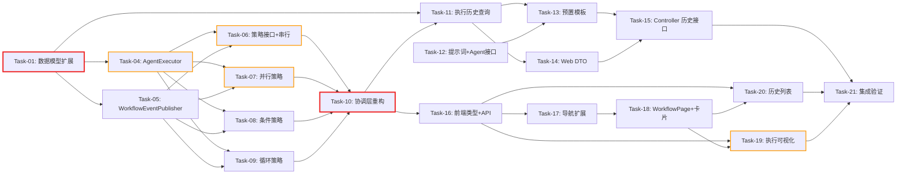

# 开发任务计划: 应用编排层 P2（多模式编排 + 前端管理页面）

## 0. 任务概览 (Task Overview)

* **总任务数**: 21 个
* **预计总工时**: 790 分钟（约 13.2 小时）
* **开发方法**: TDD（测试驱动开发）— 每个任务按 Red-Green-Refactor 循环执行
* **关键里程碑**:
  * 核心模型 + 执行基础设施完成：Task-01 ~ Task-05（约 135m）
  * 策略层完成：Task-06 ~ Task-09（约 210m）
  * 协调层重构 + 模板 + Web 完成：Task-10 ~ Task-15（约 215m）
  * 前端 + 集成验证完成：Task-16 ~ Task-21（约 230m）
* **风险任务**: Task-04（AgentExecutor P1 抽取回归）, Task-06（串行迁移 + P1 测试适配）, Task-07（并行多线程 SSE）, Task-19（前端 SSE 多面板实时渲染）
* **阻塞任务**: Task-01（数据模型，策略层前置）, Task-04（AgentExecutor，策略层依赖）, Task-06（策略接口，协调层重构依赖）, Task-10（协调层重构，Web/模板依赖）

### 依赖关系图

### 可并行任务组

| 并行组 | 可同时执行的任务 | 说明 |
| :--- | :--- | :--- |
| 并行组 1 | Task-02 + Task-03 | 数据类扩展与 WorkflowExecution 扩展/ErrorCode 互不依赖 |
| 并行组 2 | Task-04 + Task-05 | AgentExecutor 与 WorkflowEventPublisher 独立抽取 |
| 并行组 3 | Task-07 + Task-08 + Task-09 | 三个策略类互不依赖，依赖相同的 AgentExecutor/EventPublisher，可同时开发 |
| 并行组 4 | Task-12 + Task-11 | 提示词/Agent 接口与执行历史查询互不依赖 |
| 并行组 5 | Task-16 + Task-17 + Task-18 | 前端类型/API 封装、导航扩展、主页面可并行（但执行视图依赖 API 封装） |

## 1. 准备工作 (Preparation)

- [ ] **Prep-01**: 确认功能分支
    * 说明：当前在 main 分支，可直接开发（项目为学习示例项目，与 P1 一致）
    * 验证：分支无冲突
- [ ] **Prep-02**: 确认 P1 已交付基线
    * 说明：确认 `WorkflowExecutionService` 的 execute/executeSequential/executeAgentWithRetry/executeAgentStreaming/sendEvent 均已实现且测试通过（P2 需从其中抽取）
    * 验证：`agent-demo-app` 现有测试全部通过
- [ ] **Prep-03**: 确认测试环境就绪
    * 说明：项目已配置 spring-boot-starter-test（JUnit 5）+ Mockito，现有测试可正常运行
    * 验证：能成功运行 agent-demo-app 现有测试套件

## 2. 开发任务 (Development Tasks)

> 按依赖顺序排列，每个任务按 TDD 循环执行：RED（写测试）-> GREEN（写实现）-> REFACTOR（重构）
>
> **项目技术栈提示**：Java 17 + Spring Boot 3.2.5 + Lombok + JUnit 5 + Mockito + 构造器注入
>
> **架构说明（P2 核心）**：策略模式三层分离 —— 协调层（WorkflowExecutionService 薄化）+ 策略层（WorkflowExecutionStrategy 接口 + 4 实现）+ 基础设施（AgentExecutor / WorkflowEventPublisher / WorkflowContext）

### 阶段一：核心模型扩展 (Core Model)

> **阶段完成标准**: WorkflowContext 可用，并行/条件/循环数据类可构建，WorkflowTemplate/WorkflowExecution 扩展字段就绪，ErrorCode 新增 5506

- [x] **Task-01**: 🔒 创建 WorkflowContext 状态容器
    * **通俗解释**: 做完这步后，工作流中的多个 Agent 就有了一个"公共记事本"，可以互相传递数据和记录每轮结果，并行和循环模式的数据交换都靠它。
    * **说明**: 创建 `WorkflowContext` 类（ConcurrentHashMap state + agentOutputs + AtomicInteger iterationCount），提供 write/read/readAsString/recordOutput/getOutput/incrementIteration/getIterationCount 方法，替代 P1 的单字符串 currentInput 传递
    * **涉及文件**: `agent-demo-app/src/main/java/com/agentdemo/app/core/WorkflowContext.java`（新增）
    * **测试文件**: `agent-demo-app/src/test/java/com/agentdemo/app/core/WorkflowContextTest.java`
    * **参考**: 技术方案 Sec 4.1.1
    * **对应AC**: AC-004（并行分组共享状态）, AC-006（循环迭代计数）, AC-029（iterationCount）
    * **预估工时**: 20m
    * **依赖**: 无
    * **验证标准**（TDD RED 阶段的测试依据）:
        - [ ] `new WorkflowContext()` 后 `write("key", value)` 再 `read("key")` 返回同一 value
        - [ ] `read("non-existent")` 返回 null，`readAsString("non-existent")` 返回 ""
        - [ ] `recordOutput("agentA", "out")` 后 `getOutput("agentA")` 返回 "out"，`getOutput("non-existent")` 返回 ""
        - [ ] `incrementIteration()` 连续调用 3 次返回 1,2,3，`getIterationCount()` 返回 3
        - [ ] 并行线程并发 `write`/`recordOutput` 不抛 ConcurrentModificationException（ConcurrentHashMap 保证）
    * **通俗解释** 完成标准: 状态容器测试全绿

- [x] **Task-02**: 创建并行/条件/循环数据类并扩展 WorkflowTemplate
    * **通俗解释**: 做完这步后，工作流模板的"设计图"上就能画上"多个并行分支"、"条件判断"和"循环圈"了，开发者可以定义这三种模式的编排结构。
    * **说明**: 创建 `ParallelGroup`（name + agents）、`BranchDefinition`（name + conditionDescription + @JsonIgnore Predicate + agents）、`LoopDefinition`（maxIterations + exitConditionDescription + @JsonIgnore Predicate + agents）三个数据类；扩展 `WorkflowTemplate` 新增 parallelGroups/branches/loop 字段（@Builder 可空）
    * **涉及文件**:
        * `agent-demo-app/src/main/java/com/agentdemo/app/core/ParallelGroup.java`（新增）
        * `agent-demo-app/src/main/java/com/agentdemo/app/core/BranchDefinition.java`（新增）
        * `agent-demo-app/src/main/java/com/agentdemo/app/core/LoopDefinition.java`（新增）
        * `agent-demo-app/src/main/java/com/agentdemo/app/core/WorkflowTemplate.java`（修改）
    * **测试文件**: `agent-demo-app/src/test/java/com/agentdemo/app/core/ModeDefinitionTest.java`
    * **参考**: 技术方案 Sec 4.1.2
    * **对应AC**: AC-004（parallelGroups）, AC-005（branches）, AC-006/029（loop.maxIterations）
    * **预估工时**: 30m
    * **依赖**: 无（可并行 Task-01，但编译验证需 Task-01 不冲突）
    * **验证标准**（TDD RED 阶段的测试依据）:
        - [ ] `ParallelGroup.builder().name("安全审查").agents(List.of(agent)).build()` 创建成功，getAgents() 返回列表
        - [ ] `BranchDefinition.builder().name("复杂拆解").conditionDescription("问题复杂").condition(ctx -> true).agents(List.of()).build()` 创建成功，condition.test(任意ctx) 返回 true
        - [ ] `LoopDefinition.builder().maxIterations(5).exitConditionDescription("评分≥90退出").exitCondition(ctx -> true).agents(List.of()).build()` 创建成功
        - [ ] `WorkflowTemplate.builder().id("t").mode(OrchestrationMode.LOOP).loop(loopDef).build()` 的 getLoop() 返回 loopDef，parallelGroups/branches 为 null（可空不报错）
        - [ ] 序列化含 Predicate 的 BranchDefinition 时 Predicate 字段被 @JsonIgnore 排除（无序列化错误）
    * **通俗解释** 完成标准: 三种模式的数据结构可构建且模板可承载

- [x] **Task-03**: 扩展 WorkflowExecution + 新增 ErrorCode 5506
    * **通俗解释**: 做完这步后，系统执行工作流时会记下"这次用的是什么编排模式"和"循环了几轮"，并且在遇到"不认识的编排模式"时能给出明确的错误提示。
    * **说明**: `WorkflowExecution` 新增 mode（OrchestrationMode）与 iterationCount（int）字段及 setter；`ErrorCode` 新增 `WORKFLOW_MODE_NOT_SUPPORTED(5506, "不支持的编排模式")`
    * **涉及文件**:
        * `agent-demo-app/src/main/java/com/agentdemo/app/core/WorkflowExecution.java`（修改）
        * `agent-demo-common/src/main/java/com/agentdemo/common/exception/ErrorCode.java`（修改）
    * **测试文件**: `agent-demo-common/src/test/java/com/agentdemo/common/exception/ErrorCodeTest.java`（修改）, `agent-demo-app/src/test/java/com/agentdemo/app/core/ModelTest.java`（修改）
    * **参考**: 技术方案 Sec 4.2.4 + Sec 5 异常处理
    * **对应AC**: AC-027（历史列表展示 mode/iterationCount）, AC-029（iterationCount）
    * **预估工时**: 15m
    * **依赖**: 无（可并行 Task-02）
    * **验证标准**（TDD RED 阶段的测试依据）:
        - [ ] `WorkflowExecution.setMode(OrchestrationMode.LOOP)` 后 getMode() 返回 LOOP
        - [ ] `WorkflowExecution.setIterationCount(3)` 后 getIterationCount() 返回 3（默认 0）
        - [ ] `ErrorCode.WORKFLOW_MODE_NOT_SUPPORTED.getCode()` 返回 5506
        - [ ] `ErrorCode.WORKFLOW_MODE_NOT_SUPPORTED.getMessage()` 返回非空中文描述
        - [ ] 现有 5500-5505 错误码编号不变（无回归）
    * **通俗解释** 完成标准: 执行记录带上模式/迭代信息，错误码新增可编译

### 阶段二：执行基础设施抽取 (Execution Infrastructure)

> **阶段完成标准**: AgentExecutor 与 WorkflowEventPublisher 独立可用，P1 的 Agent 执行与 SSE 发送逻辑被完整抽取，无功能回归

- [x] **Task-04**: ⚠️ 🔒 抽取 AgentExecutor（从 P1 WorkflowExecutionService）
    * **通俗解释**: 做完这步后，"执行单个 Agent"这个动作被独立封装成一个小模块，串行、并行、条件、循环四种模式都能复用同一套"执行+重试+流式输出"逻辑，不会重复造轮子。
    * **说明**: 新建 `AgentExecutor` @Component，将 P1 的 `executeAgentWithRetry`（重试循环 + step_retry/step_error 事件）与 `executeAgentStreaming`（反射调用 @Agent 方法 + TokenStream 回调 + 超时）从 WorkflowExecutionService 迁移过来，新增静态 `checkCancelled(AtomicBoolean)` 方法；提供默认 5 分钟超时构造器 + 可注入超时构造器
    * **涉及文件**: `agent-demo-app/src/main/java/com/agentdemo/app/execution/AgentExecutor.java`（新增）
    * **测试文件**: `agent-demo-app/src/test/java/com/agentdemo/app/execution/AgentExecutorTest.java`（新建，迁移 P1 AgentStreamingRetryTest/TimeoutCancelTest 相关用例）
    * **参考**: 技术方案 Sec 4.2.2
    * **对应AC**: AC-009（流式输出）, AC-015（自动重试）, AC-022（取消检查）, AC-023（超时）, AC-026（重试次数）
    * **预估工时**: 60m
    * **依赖**: Task-01（数据模型）
    * **风险标注**: ⚠️ P1 逻辑迁移需保证行为一致，`executeAgentWithRetry`/`executeAgentStreaming` 的测试从 Service 迁移到 AgentExecutor，Mock 目标变化
    * **验证标准**（TDD RED 阶段的测试依据）:
        - [ ] `executeWithRetry(agentDef, input, emitter, i, maxRetries, modelId)` 成功时返回完整输出
        - [ ] Agent 首次失败时推送 step_retry 事件（retryCount=1, remainingRetries=maxRetries-1）
        - [ ] 重试耗尽推送 step_error 事件（retryCount=maxRetries）并抛 BusinessException(WORKFLOW_EXECUTION_FAILED)
        - [ ] maxRetries=5 时重试 5 次而非默认 3
        - [ ] `checkCancelled(new AtomicBoolean(true))` 抛出 WorkflowCancelledException；flag=false 或 null 时不抛
        - [ ] 超时（注入小超时值）时抛 WorkflowTimeoutException
    * **通俗解释** 完成标准: Agent 执行逻辑抽取后测试全绿，行为与 P1 一致

- [x] **Task-05**: 抽取 WorkflowEventPublisher
    * **通俗解释**: 做完这步后，所有"给前端发实时进度消息"的动作统一走一个入口，发送失败也不会打断整个工作流。
    * **说明**: 新建 `WorkflowEventPublisher` 静态工具类，将 P1 的 `sendEvent`（SseEmitter 事件发送 + try-catch 降级 WARN）迁移过来
    * **涉及文件**: `agent-demo-app/src/main/java/com/agentdemo/app/execution/WorkflowEventPublisher.java`（新增）
    * **测试文件**: `agent-demo-app/src/test/java/com/agentdemo/app/execution/WorkflowEventPublisherTest.java`
    * **参考**: 技术方案 Sec 4.2.3
    * **对应AC**: AC-008（步骤进度事件）, AC-009（token 事件）, AC-010（workflow_complete）
    * **预估工时**: 10m
    * **依赖**: Task-01（无直接依赖，但需与 AgentExecutor 同批编译）
    * **验证标准**（TDD RED 阶段的测试依据）:
        - [ ] `WorkflowEventPublisher.send(emitter, "step_start", data)` 调用 emitter.send 一次，event name 与 data 正确
        - [ ] emitter.send 抛异常时 send 方法不抛异常（降级 WARN，记录日志）
        - [ ] send 为静态方法，可直接调用（无需 Spring 注入）
    * **通俗解释** 完成标准: SSE 发送统一入口可用且异常安全

### 阶段三：策略层 (Strategy Layer)

> **阶段完成标准**: WorkflowExecutionStrategy 接口 + 4 个策略实现类完整，每个策略可独立测试（Mock AgentExecutor），编排算法正确

- [x] **Task-06**: 🔒 创建策略接口 + SequentialExecutionStrategy（P1 迁移）
    * **通俗解释**: 做完这步后，系统定义了一套"编排插件"的标准接口，串行这种最基础的编排方式被改造成第一个插件；以后新增编排方式只要照着插一个插件就行，不用改主程序。
    * **说明**: 新建 `WorkflowExecutionStrategy` 接口（supportedMode() + execute(template, params, emitter, execution, modelId, cancelFlag)）；新建 `SequentialExecutionStrategy` @Component 实现串行逻辑（迁移 P1 executeSequential，改为使用 AgentExecutor + WorkflowEventPublisher + WorkflowContext，mode 标注 SEQUENTIAL）
    * **涉及文件**:
        * `agent-demo-app/src/main/java/com/agentdemo/app/strategy/WorkflowExecutionStrategy.java`（新增）
        * `agent-demo-app/src/main/java/com/agentdemo/app/strategy/SequentialExecutionStrategy.java`（新增）
    * **测试文件**: `agent-demo-app/src/test/java/com/agentdemo/app/strategy/SequentialExecutionStrategyTest.java`（迁移 P1 SequentialExecutionTest）
    * **参考**: 技术方案 Sec 4.2.1 + Sec 4.2.5
    * **对应AC**: AC-003（串行）, AC-008（步骤进度）, AC-010（最终结果）, AC-021（空输出传递）
    * **预估工时**: 45m
    * **依赖**: Task-04（AgentExecutor）, Task-05（EventPublisher）
    * **风险标注**: ⚠️ P1 串行测试迁移 + 行为对齐；验证标准需覆盖 P1 全部串行场景
    * **验证标准**（TDD RED 阶段的测试依据）:
        - [ ] `supportedMode()` 返回 OrchestrationMode.SEQUENTIAL
        - [ ] 3 个 Agent 的工作流，Mock AgentExecutor 按序返回，execute 返回最后一个 Agent 输出
        - [ ] 每次 Agent 执行调用 `agentExecutor.executeWithRetry(agentDef, input, emitter, i, maxRetries, modelId)`，且 input 为前一个 Agent 的输出
        - [ ] workflow_start 事件含 mode="SEQUENTIAL"，step_start 事件 agentIndex 依次 0,1,2
        - [ ] workflow_complete 事件含 finalResult 与 mode="SEQUENTIAL"
        - [ ] cancelFlag=true 时在执行前抛 WorkflowCancelledException
        - [ ] 空输出时后续 Agent 正常执行（不抛异常）
    * **通俗解释** 完成标准: 串行策略可独立测试，与 P1 行为一致

- [x] **Task-07**: ⚠️ 实现 ParallelExecutionStrategy（AC-004）
    * **通俗解释**: 做完这步后，系统就能让多个"审查小组"同时干活了，比如安全、性能、风格三个角度一起审查，最后把各自结果拼成一份综合报告。
    * **说明**: 新建 `ParallelExecutionStrategy` @Component（supportedMode=PARALLEL）；parallelGroups 分组用 CompletableFuture + 并行线程池并发执行，组内 Agent 串行，group_start/group_complete 事件，最后按分组顺序汇总为综合报告
    * **涉及文件**: `agent-demo-app/src/main/java/com/agentdemo/app/strategy/ParallelExecutionStrategy.java`（新增）
    * **测试文件**: `agent-demo-app/src/test/java/com/agentdemo/app/strategy/ParallelExecutionStrategyTest.java`
    * **参考**: 技术方案 Sec 4.2.6
    * **对应AC**: AC-004（执行并行工作流）, AC-009（多 Agent 流式面板）, AC-022（取消）
    * **预估工时**: 60m
    * **依赖**: Task-04, Task-05, Task-01（WorkflowContext）
    * **风险标注**: ⚠️ 多线程并发执行 + 共享 WorkflowContext 写安全 + SSE 事件线程安全；测试需验证各分组输出独立、事件齐全
    * **验证标准**（TDD RED 阶段的测试依据）:
        - [ ] `supportedMode()` 返回 PARALLEL
        - [ ] 3 个分组的模板（每个分组 1 个 Agent，Mock AgentExecutor），execute 返回包含 3 个分组名称与输出的综合报告
        - [ ] 每个分组推送 group_start（含 groupIndex/groupName/agentCount）与 group_complete（含 durationMs/outputLength）事件
        - [ ] 分组内多个 Agent 时按顺序执行（Mock 验证调用顺序）
        - [ ] 某分组 Agent 抛异常时，execute 抛异常（join 的 CompletionException），不返回半截结果
        - [ ] cancelFlag=true 时分组内执行前抛 WorkflowCancelledException
        - [ ] 各组结果写入共享 ctx（ctx.getOutput(agentName) 返回各自输出）
    * **通俗解释** 完成标准: 并行策略可独立测试，3 分组并发汇总正确

- [x] **Task-08**: 实现 ConditionalExecutionStrategy（AC-005）
    * **通俗解释**: 做完这步后，系统就能"看情况走不同路线"了——简单问题交给一个 Agent 直接回答，复杂问题走"研究→分析→总结"多 Agent 协作，只走被选中的那一条路。
    * **说明**: 新建 `ConditionalExecutionStrategy` @Component（supportedMode=CONDITIONAL）；依次评估 branches 的 condition 谓词，命中第一个 true 的分支执行其 Agent 序列，推送 branch_selected 事件；复用 executeAgentList 公共方法
    * **涉及文件**: `agent-demo-app/src/main/java/com/agentdemo/app/strategy/ConditionalExecutionStrategy.java`（新增）
    * **测试文件**: `agent-demo-app/src/test/java/com/agentdemo/app/strategy/ConditionalExecutionStrategyTest.java`
    * **参考**: 技术方案 Sec 4.2.7 + Sec 4.2.9
    * **对应AC**: AC-005（执行条件分支）, AC-022（取消）
    * **预估工时**: 45m
    * **依赖**: Task-04, Task-05, Task-01（WorkflowContext）
    * **验证标准**（TDD RED 阶段的测试依据）:
        - [ ] `supportedMode()` 返回 CONDITIONAL
        - [ ] 分支 1 condition 返回 true 时，仅执行分支 1 的 Agent（Mock 验证分支 2 的 AgentExecutor 未被调用）
        - [ ] 分支 1 condition 返回 false、分支 2 返回 true 时，执行分支 2
        - [ ] 命中分支时推送 branch_selected 事件（含 branchIndex/branchName/agentCount）
        - [ ] 所有分支均未命中时，execute 返回空字符串（或按设计走兜底，不抛异常）
        - [ ] workflow_complete 事件含 mode="CONDITIONAL" 与 finalResult
        - [ ] cancelFlag=true 时抛 WorkflowCancelledException
    * **通俗解释** 完成标准: 条件策略可独立测试，分支选择正确且只执行选中分支

- [x] **Task-09**: 实现 LoopExecutionStrategy（AC-006, AC-029）
    * **通俗解释**: 做完这步后，系统就能"反复打磨"了——评分 Agent 给内容打分，分数不达标就让修订 Agent 改一遍，再打分再改，直到达标或改满 5 轮。
    * **说明**: 新建 `LoopExecutionStrategy` @Component（supportedMode=LOOP）；校验 maxIterations > 0，循环执行 loop.agents，每轮 incrementIteration + loop_iteration 事件，结束后评估 exitCondition，达标或达上限退出，workflow_complete 标注 exitReason
    * **涉及文件**: `agent-demo-app/src/main/java/com/agentdemo/app/strategy/LoopExecutionStrategy.java`（新增）
    * **测试文件**: `agent-demo-app/src/test/java/com/agentdemo/app/strategy/LoopExecutionStrategyTest.java`
    * **参考**: 技术方案 Sec 4.2.8 + Sec 4.2.9
    * **对应AC**: AC-006（执行循环）, AC-029（最大迭代限制）, AC-022（取消）
    * **预估工时**: 60m
    * **依赖**: Task-04, Task-05, Task-01（WorkflowContext iterationCount）
    * **验证标准**（TDD RED 阶段的测试依据）:
        - [ ] `supportedMode()` 返回 LOOP
        - [ ] loop.maxIterations=5，exitCondition 始终 false 时，循环体执行 5 次，execute 返回第 5 次结果，workflow_complete 含 iterationCount=5 与 exitReason="达到最大迭代次数退出"
        - [ ] 第 2 轮后 exitCondition 返回 true 时，仅执行 2 轮，exitReason="退出条件满足"
        - [ ] 每轮推送 loop_iteration 事件（含 iteration/maxIterations/agentCount）
        - [ ] maxIterations=0 时抛 BusinessException(WORKFLOW_PARAM_MISSING)
        - [ ] execution.setIterationCount 被正确调用（第 3 轮退出时 iterationCount=3）
        - [ ] cancelFlag=true 时抛 WorkflowCancelledException
    * **通俗解释** 完成标准: 循环策略可独立测试，达标提前退出与达上限退出均正确

### 阶段四：协调层重构 + 执行历史 (Coordinator + History)

> **阶段完成标准**: WorkflowExecutionService 瘦身为薄协调层（策略注入 + 分发 + 异常处理），P1 测试同步适配通过，执行历史查询可用

- [x] **Task-10**: 🔒 重构 WorkflowExecutionService 为薄协调层 + P1 测试适配
    * **通俗解释**: 做完这步后，工作流主程序变得"轻"了——它只管"创建执行记录、把任务交给对应插件、统一处理错误"，具体的编排算法都交给各个策略插件，主程序不再是一大坨代码。
    * **说明**: 重构 `WorkflowExecutionService`：构造器改为注入 `List<WorkflowExecutionStrategy>` 构建 `Map<OrchestrationMode, Strategy>` 分发表；execute() 按 mode 查找策略（无策略抛 WORKFLOW_MODE_NOT_SUPPORTED）+ 异步执行 + 统一异常处理（handleTerminated/handleTimeout/handleFailure 保留）+ emitter 生命周期回调；execute 时写入 execution.mode；移除 executeSequential/executeAgentWithRetry/executeAgentStreaming/sendEvent（已迁移）；**同步适配 P1 的 WorkflowExecutionServiceTest**（Mock 目标从内部方法改为 Mock 策略类）
    * **涉及文件**:
        * `agent-demo-app/src/main/java/com/agentdemo/app/service/WorkflowExecutionService.java`（修改，重构）
        * `agent-demo-app/src/test/java/com/agentdemo/app/service/WorkflowExecutionServiceTest.java`（修改，适配）
        * `agent-demo-app/src/test/java/com/agentdemo/app/service/SequentialExecutionTest.java`（删除或迁移至策略测试）
        * `agent-demo-app/src/test/java/com/agentdemo/app/service/AgentStreamingRetryTest.java`（删除或迁移至 AgentExecutorTest）
        * `agent-demo-app/src/test/java/com/agentdemo/app/service/TimeoutCancelTest.java`（删除或迁移）
    * **测试文件**: `agent-demo-app/src/test/java/com/agentdemo/app/service/WorkflowExecutionServiceTest.java`
    * **参考**: 技术方案 Sec 4.2.4
    * **对应AC**: AC-011（REST 调用）, AC-020（并发执行）, AC-022（终止）, AC-023（超时）, AC-030（P1 无回归）
    * **预估工时**: 60m
    * **依赖**: Task-06, Task-07, Task-08, Task-09（策略全就绪）
    * **风险标注**: ⚠️ 这是 P2 最高风险重构任务——P1 测试适配 + 策略分发正确性；需保证 execute() 对 SEQUENTIAL 模板行为与 P1 一致
    * **验证标准**（TDD RED 阶段的测试依据）:
        - [ ] 构造器注入含 Mock SequentialExecutionStrategy 的列表，execute(SEQUENTIAL 模板) 调用该策略的 execute 方法
        - [ ] execute 生成唯一 executionId，execution.mode 被设置为 template.mode，状态为 RUNNING
        - [ ] 模板 mode 无对应策略时抛 BusinessException(WORKFLOW_MODE_NOT_SUPPORTED=5506)
        - [ ] 策略执行成功返回后 execution.complete(result) 被调用，emitter.complete() 被调用
        - [ ] 策略抛 WorkflowCancelledException 时 handleTerminated 推送 workflow_failed(status=TERMINATED)
        - [ ] 策略抛 BusinessException 时 handleFailure 推送 workflow_failed(status=FAILED)
        - [ ] 并发调用 execute() 两次生成不同 executionId，两个执行独立（AC-020）
        - [ ] terminate(executionId) 将状态置 TERMINATED，已终止的执行再次 terminate 抛 WORKFLOW_ALREADY_TERMINATED
        - [ ] P1 原 WorkflowExecutionServiceTest 中被迁移的用例全部在新测试中覆盖（无行为回归）
    * **通俗解释** 完成标准: 协调层瘦身成功，策略分发正确，P1 测试全绿

- [ ] **Task-11**: 实现执行历史查询（AC-027）
    * **通俗解释**: 做完这步后，用户就能看到"以前跑过哪些工作流、分别是什么状态、用了多久、结果是什么"，方便回顾。
    * **说明**: `WorkflowExecutionService` 新增 `listExecutions()` 方法，从 executions map 取出全部执行实例，按 startTime 倒序返回
    * **涉及文件**: `agent-demo-app/src/main/java/com/agentdemo/app/service/WorkflowExecutionService.java`（修改）
    * **测试文件**: `agent-demo-app/src/test/java/com/agentdemo/app/service/WorkflowExecutionServiceTest.java`（扩展）
    * **参考**: 技术方案 Sec 4.3
    * **对应AC**: AC-027（查看执行历史）
    * **预估工时**: 20m
    * **依赖**: Task-10（协调层重构完成）
    * **验证标准**（TDD RED 阶段的测试依据）:
        - [ ] 执行 2 个工作流后 `listExecutions()` 返回大小为 2 的列表
        - [ ] 列表按 startTime 倒序排列（先执行的排后面）
        - [ ] 无任何执行时 `listExecutions()` 返回空列表（不抛异常）
        - [ ] 返回的执行实例含 mode 字段（Task-03 已加）
    * **通俗解释** 完成标准: 执行历史可查询且排序正确

### 阶段五：模板层 (Template)

> **阶段完成标准**: 3 个预置模板（循环/条件/并行）自动注册，新 Agent 接口与提示词可编译加载

- [ ] **Task-12**: 创建新场景提示词与 Agent 接口
    * **通俗解释**: 做完这步后，系统就新增了一批"专业角色"——评分员、修订员、安全审查员、性能审查员、风格审查员，还有简单问答和复杂拆解助手，每个角色都配有专属的"岗位说明书"。
    * **说明**: 创建 6 个新场景提示词模板文件（app-scoring / app-revise / app-security-review / app-performance-review / app-style-review / app-quick-answer / app-complex-solve 等，按模板需求增减）与对应 Agent 接口（@Agent + @UserMessage + 返回 TokenStream）
    * **涉及文件**:
        * `agent-demo-app/src/main/resources/prompts/app/scoring.txt`（新增）
        * `agent-demo-app/src/main/resources/prompts/app/revise.txt`（新增）
        * `agent-demo-app/src/main/resources/prompts/app/security-review.txt`（新增）
        * `agent-demo-app/src/main/resources/prompts/app/performance-review.txt`（新增）
        * `agent-demo-app/src/main/resources/prompts/app/style-review.txt`（新增）
        * `agent-demo-app/src/main/java/com/agentdemo/app/template/ScoringAgent.java`（新增）
        * `agent-demo-app/src/main/java/com/agentdemo/app/template/ReviseAgent.java`（新增）
        * `agent-demo-app/src/main/java/com/agentdemo/app/template/SecurityReviewAgent.java`（新增）
        * `agent-demo-app/src/main/java/com/agentdemo/app/template/PerformanceReviewAgent.java`（新增）
        * `agent-demo-app/src/main/java/com/agentdemo/app/template/StyleReviewAgent.java`（新增）
        * （智能路由的简单回答/复杂拆解可复用现有 Research/Analysis/Summary Agent 或新增 QuickAnswerAgent）
    * **测试文件**: `agent-demo-app/src/test/java/com/agentdemo/app/template/AgentInterfaceTest.java`（扩展）
    * **参考**: 技术方案 Sec 4.4 + Sec 10 文件清单
    * **对应AC**: AC-004（审查 Agent）, AC-005（路由 Agent）, AC-006（评分/修订 Agent）, AC-012（开发者定义模板）
    * **预估工时**: 40m
    * **依赖**: Task-01（数据模型）
    * **验证标准**（TDD RED 阶段的测试依据）:
        - [ ] 每个 Agent 接口含 @Agent 注解方法，返回 TokenStream
        - [ ] 每个提示词模板文件存在于 classpath 且内容非空
        - [ ] 提示词模板通过 `promptTemplateLoader.composeSystemPrompt(role, scenario)` 可加载（引用 scenarioName 与文件名一致）
    * **通俗解释** 完成标准: 新角色与岗位说明书就绪

- [x] **Task-13**: 实现 3 个预置模板（循环/条件/并行）
    * **通俗解释**: 做完这步后，系统启动时会自动注册三个可用的"工作流套餐"——"质量评分-修订"（循环打磨）、"智能路由"（看情况走路线）、"多角度审查"（多组同时审查），用户立刻就能用上。
    * **说明**: 创建 3 个 @Configuration 类：`QualityReviewLoopTemplate`（LOOP，循环体评分→修订，exitCondition 评分≥90，maxIterations=5，maxRetries 可配）、`SmartRoutingTemplate`（CONDITIONAL，分支1 简单回答 / 分支2 复杂拆解）、`MultiPerspectiveReviewTemplate`（PARALLEL，安全/性能/风格 3 分组），各 @Bean 注册到 WorkflowTemplateRegistry
    * **涉及文件**:
        * `agent-demo-app/src/main/java/com/agentdemo/app/template/QualityReviewLoopTemplate.java`（新增）
        * `agent-demo-app/src/main/java/com/agentdemo/app/template/SmartRoutingTemplate.java`（新增）
        * `agent-demo-app/src/main/java/com/agentdemo/app/template/MultiPerspectiveReviewTemplate.java`（新增）
    * **测试文件**: `agent-demo-app/src/test/java/com/agentdemo/app/template/WorkflowTemplatesTest.java`
    * **参考**: 技术方案 Sec 4.4
    * **对应AC**: AC-004, AC-005, AC-006, AC-012, AC-024（自动注册）, AC-025（工具预定义）, AC-026（maxRetries）, AC-029（maxIterations=5）
    * **预估工时**: 45m
    * **依赖**: Task-12（Agent 接口 + 提示词）, Task-11（Registry 已可用）
    * **验证标准**（TDD RED 阶段的测试依据）:
        - [ ] Spring 启动后 `registry.getTemplate("quality-review-loop")` 返回模板，mode=LOOP，loop.maxIterations=5，loop.exitCondition 非 null
        - [ ] `registry.getTemplate("smart-routing")` 返回模板，mode=CONDITIONAL，branches 大小为 2，各 branch.conditionDescription 非空，condition 非 null
        - [ ] `registry.getTemplate("multi-perspective-review")` 返回模板，mode=PARALLEL，parallelGroups 大小为 3（安全/性能/风格）
        - [ ] 各模板 name/description/parameters 与代码定义一致
        - [ ] 各模板 maxRetries 可配置（默认 3，循环模板可设 5）
    * **通俗解释** 完成标准: 三个模板自动注册且结构正确

### 阶段六：Web 层 (Web)

> **阶段完成标准**: 执行历史 DTO 就绪，GET /api/app/workflows/executions 接口可用，WorkflowExecutionResponse 含 mode/iterationCount

- [x] **Task-14**: 创建执行历史 DTO + 扩展 WorkflowExecutionResponse
    * **通俗解释**: 做完这步后，系统就规定了"执行历史列表"和"执行详情"的返回格式，前端知道会收到什么数据。
    * **说明**: 新建 `WorkflowExecutionSummaryResponse`（executionId/templateId/templateName/mode/status/startTime/endTime/finalResult/iterationCount）；`WorkflowExecutionResponse` 新增 mode/iterationCount 字段
    * **涉及文件**:
        * `agent-demo-web/src/main/java/com/agentdemo/web/dto/WorkflowExecutionSummaryResponse.java`（新增）
        * `agent-demo-web/src/main/java/com/agentdemo/web/dto/WorkflowExecutionResponse.java`（修改）
    * **测试文件**: `agent-demo-web/src/test/java/com/agentdemo/web/dto/WorkflowDtoTest.java`（扩展）
    * **参考**: 技术方案 Sec 2.2 接口 1
    * **对应AC**: AC-027（执行历史列表返回格式）
    * **预估工时**: 20m
    * **依赖**: Task-11（listExecutions）, Task-03（mode/iterationCount 字段）
    * **验证标准**（TDD RED 阶段的测试依据）:
        - [ ] `WorkflowExecutionSummaryResponse` 含 executionId/templateId/templateName/mode/status/startTime/endTime/finalResult/iterationCount 字段
        - [ ] `WorkflowExecutionResponse` 新增 mode 与 iterationCount 字段（getter/setter 可用）
        - [ ] 从 WorkflowExecution 对象构建 SummaryResponse 的映射方法字段正确
    * **通俗解释** 完成标准: DTO 就绪可映射

- [ ] **Task-15**: WorkflowController 新增执行历史接口
    * **通俗解释**: 做完这步后，前端和 API 调用方就能通过 GET /api/app/workflows/executions 一次性获取所有历史执行记录了。
    * **说明**: `WorkflowController` 新增 `GET /api/app/workflows/executions` 端点，调用 `workflowExecutionService.listExecutions()` 映射为 SummaryResponse 列表返回；注意与现有 GET /executions/{id} 路径不冲突
    * **涉及文件**: `agent-demo-web/src/main/java/com/agentdemo/web/controller/WorkflowController.java`（修改）
    * **测试文件**: `agent-demo-web/src/test/java/com/agentdemo/web/controller/WorkflowControllerTest.java`（扩展）
    * **参考**: 技术方案 Sec 2.1 + Sec 2.2
    * **对应AC**: AC-027（GET /executions 返回列表）
    * **预估工时**: 30m
    * **依赖**: Task-14（DTO）, Task-11（listExecutions）
    * **验证标准**（TDD RED 阶段的测试依据）:
        - [ ] `GET /api/app/workflows/executions` 返回 `Result.success(List<WorkflowExecutionSummaryResponse>)`
        - [ ] 无执行记录时返回空列表（code=200）
        - [ ] 列表按 startTime 倒序，含 mode/iterationCount 字段
        - [ ] `GET /api/app/workflows/executions/{executionId}` 与列表接口路径不冲突（两者均正常）
    * **通俗解释** 完成标准: 历史接口可用且与详情接口不冲突

### 阶段七：前端层 (Frontend)

> **阶段完成标准**: 前端"编排"入口可用，模板列表/执行可视化（SSE）/历史列表三个视图完整，与后端真实 API 对接

- [ ] **Task-16**: 前端类型定义 + workflow API 封装
    * **通俗解释**: 做完这步后，前端代码就"认识"了工作流相关数据的样子，并且有了一套调用后端接口（模板列表/执行/历史/终止）的函数。
    * **说明**: `types/index.ts` 新增 OrchestrationMode/WorkflowExecutionStatus/WorkflowTemplateSummary/WorkflowTemplateDetail/WorkflowExecutionSummary/WorkflowExecutionDetail/WorkflowStreamCallbacks 等类型；新建 `api/workflow.ts` 封装 listTemplates/getTemplate/listExecutions/getExecution/terminate/streamExecute（streamExecute 复用 chat.ts 的 fetch + ReadableStream SSE 解析模式）
    * **涉及文件**:
        * `agent-demo-frontend/src/types/index.ts`（修改）
        * `agent-demo-frontend/src/api/workflow.ts`（新增）
    * **测试文件**: `agent-demo-frontend/src/api/__tests__/workflow.test.ts`
    * **参考**: 技术方案 Sec 7.4 + Sec 7.5
    * **对应AC**: AC-027（前端历史数据）, AC-032（前端模板列表数据）
    * **预估工时**: 30m
    * **依赖**: Task-15（后端接口可用）
    * **验证标准**（TDD RED 阶段的测试依据）:
        - [ ] `listTemplates()` fetch GET /api/app/workflows 并返回 WorkflowTemplateSummary[]
        - [ ] `streamExecute()` 通过 ReadableStream 解析 SSE 事件，事件名正确分发到 callbacks（workflow_start/step_start/token/step_complete/branch_selected/loop_iteration/group_start/group_complete/workflow_complete/workflow_failed）
        - [ ] `terminate(id)` 调用 DELETE /api/app/workflows/executions/{id}
        - [ ] 类型定义与后端 DTO 字段一致（mode 枚举含 SEQUENTIAL/PARALLEL/CONDITIONAL/LOOP/SUPERVISOR）
    * **通俗解释** 完成标准: 前端 API 封装可用，SSE 解析正确

- [ ] **Task-17**: 导航扩展（NavBar + App.vue）
    * **通俗解释**: 做完这步后，前端顶部导航栏会出现一个"编排"入口，用户点击就能进入工作流管理页面。
    * **说明**: `NavBar.vue` 的 ViewKey 扩展为 `'chat' | 'knowledge' | 'workflow' | 'settings'`，navItems 增加 `{ key: 'workflow', label: '编排' }`；`App.vue` currentView 类型扩展，新增 `<WorkflowPage v-else-if="currentView === 'workflow'" />` 分支
    * **涉及文件**:
        * `agent-demo-frontend/src/components/NavBar.vue`（修改）
        * `agent-demo-frontend/src/App.vue`（修改）
    * **测试文件**: `agent-demo-frontend/src/components/__tests__/NavBar.test.ts`, `agent-demo-frontend/src/__tests__/App.test.ts`
    * **参考**: 技术方案 Sec 7.1
    * **对应AC**: AC-032（前端编排管理页面独立入口）, AC-030（现有对话页面不受影响）
    * **预估工时**: 20m
    * **依赖**: Task-18 前置（WorkflowPage 需先存在，或 Task-18 与 Task-17 并行后合并验证）
    * **验证标准**（TDD RED 阶段的测试依据）:
        - [ ] NavBar 渲染 4 个导航项（对话/知识库/编排/设置），点击"编排"触发 currentView='workflow'
        - [ ] App.vue 中 currentView==='workflow' 时渲染 WorkflowPage 组件
        - [ ] 现有"对话/知识库/设置"视图行为不变（AC-030 无回归）
    * **通俗解释** 完成标准: 编排入口可见可切换，原页面不受影响

- [ ] **Task-18**: 实现 WorkflowPage 主页面 + 模板卡片
    * **通俗解释**: 做完这步后，用户打开"编排"页面就能看到所有可用的工作流模板卡片（名字、简介、模式标签），点击卡片就能进入该模板的执行页面。
    * **说明**: 新建 `WorkflowPage.vue`（内部分 3 个子视图：模板列表/详情执行/历史，用 ref + v-if 切换）；新建 `WorkflowTemplateCard.vue`（名称/描述/模式标签/Agent 数量）
    * **涉及文件**:
        * `agent-demo-frontend/src/components/WorkflowPage.vue`（新增）
        * `agent-demo-frontend/src/components/WorkflowTemplateCard.vue`（新增）
    * **测试文件**: `agent-demo-frontend/src/components/__tests__/WorkflowPage.test.ts`, `agent-demo-frontend/src/components/__tests__/WorkflowTemplateCard.test.ts`
    * **参考**: 技术方案 Sec 7.2 + Sec 7.3
    * **对应AC**: AC-001（模板列表展示）, AC-032（进入编排页面展示模板列表）
    * **预估工时**: 45m
    * **依赖**: Task-16（workflow API）
    * **验证标准**（TDD RED 阶段的测试依据）:
        - [ ] WorkflowPage 挂载后调用 `listTemplates()` 并渲染模板卡片网格
        - [ ] 模板卡片显示名称/描述/模式标签（串行/并行/条件/循环）/Agent 数量
        - [ ] 点击模板卡片切换到执行视图（传入选中 templateId）
        - [ ] 加载失败时显示错误提示而非白屏
        - [ ] 空列表时显示空状态"暂无可用模板"
    * **通俗解释** 完成标准: 模板列表页可用

- [x] **Task-19**: ⚠️ 实现 WorkflowExecuteView（SSE 执行可视化）
    * **通俗解释**: 做完这步后，用户点击"执行"就能实时看到工作流的运行过程——进度条往前走、每个 Agent 的输出像打字机一样逐字出现，还能随时点"停止"。
    * **说明**: 新建 `WorkflowExecuteView.vue`：参数表单动态生成（按模板 parameters）、执行按钮/停止按钮（AbortController）、步骤进度条（按 mode 区分：串行按 Agent 数、并行按分组、循环按迭代、条件按分支）、Agent 输出折叠面板（Map<agentIndex, panel>，token 事件实时追加）、状态标签（COMPLETED/FAILED/TERMINATED/TIMEOUT）
    * **涉及文件**: `agent-demo-frontend/src/components/WorkflowExecuteView.vue`（新增）
    * **测试文件**: `agent-demo-frontend/src/components/__tests__/WorkflowExecuteView.test.ts`
    * **参考**: 技术方案 Sec 7.3 + Sec 7.6
    * **对应AC**: AC-004/005/006（三种模式执行可视化）, AC-008（步骤进度）, AC-009（流式输出）, AC-010（最终结果）, AC-022（停止）
    * **预估工时**: 60m
    * **依赖**: Task-16（streamExecute）, Task-18（从模板卡片进入）
    * **风险标注**: ⚠️ 前端 SSE 多事件实时渲染 + AbortController 停止 + 多 Agent 面板并发更新，需组件测试覆盖事件回调
    * **验证标准**（TDD RED 阶段的测试依据）:
        - [ ] 参数表单按模板 parameters 动态渲染，必填项标星
        - [ ] 必填参数为空时点击执行不发起请求并提示
        - [ ] 执行中调用 streamExecute 并注册全部 callbacks，step_start/token/step_complete 事件正确更新进度与输出面板
        - [ ] branch_selected/loop_iteration/group_start 事件正确更新模式相关 UI
        - [ ] workflow_complete 显示最终结果与状态标签 COMPLETED
        - [ ] 点击"停止"调用 abort()，终止后按钮恢复
        - [ ] 并行模式多个 Agent 面板各自独立追加输出（不互相覆盖）
    * **通俗解释** 完成标准: 执行可视化完整可用

- [ ] **Task-20**: 实现 WorkflowHistoryList
    * **通俗解释**: 做完这步后，用户就能在"历史"视图看到所有工作流执行记录，包括状态、时间、结果摘要，方便回顾。
    * **说明**: 新建 `WorkflowHistoryList.vue`：调用 listExecutions() 展示执行历史列表（executionId 摘要、模板名、模式、状态标签、开始/结束时间、结果摘要、iterationCount）
    * **涉及文件**: `agent-demo-frontend/src/components/WorkflowHistoryList.vue`（新增）
    * **测试文件**: `agent-demo-frontend/src/components/__tests__/WorkflowHistoryList.test.ts`
    * **参考**: 技术方案 Sec 7.2 + Sec 7.3
    * **对应AC**: AC-027（前端执行历史展示）
    * **预估工时**: 30m
    * **依赖**: Task-16（listExecutions）
    * **验证标准**（TDD RED 阶段的测试依据）:
        - [ ] 挂载后调用 listExecutions() 并渲染历史列表
        - [ ] 每条记录显示模板名/模式/状态标签/时间/结果摘要
        - [ ] 状态标签颜色区分：COMPLETED 绿、FAILED 红、TERMINATED/TIMEOUT 灰
        - [ ] 空历史时显示空状态"暂无执行记录"
        - [ ] 加载失败显示错误提示
    * **通俗解释** 完成标准: 历史列表可用

### 阶段八：集成验证 (Integration)

> **阶段完成标准**: 全量编译通过，P1 无回归，P2 的 6 条 AC 端到端验证通过

- [x] **Task-21**: 编译验证与集成测试
    * **通俗解释**: 做完这步后，整个 P2 功能就能从头到尾跑通了——从页面选模板、填参数、看实时执行过程，到查看执行历史，还能确认原有功能没被破坏。
    * **说明**: 执行全量编译验证（agent-demo-app + agent-demo-web + agent-demo-frontend build），验证 P1 现有功能无回归，执行端到端集成测试
    * **涉及文件**: 无新增文件（验证性任务）
    * **测试文件**: `agent-demo-app/src/test/java/com/agentdemo/app/integration/WorkflowP2IntegrationTest.java`（新增）, `agent-demo-frontend` vitest 全量
    * **参考**: 技术方案 Sec 9 + Sec 12
    * **对应AC**: AC-004, AC-005, AC-006, AC-027, AC-029, AC-032 + P1 全量 AC 回归
    * **预估工时**: 45m
    * **依赖**: Task-13, Task-15, Task-19, Task-20（全部功能任务完成）
    * **验证标准**（TDD RED 阶段的测试依据）:
        - [ ] `mvn compile -pl agent-demo-app -am` 编译通过，0 error
        - [ ] `mvn compile -pl agent-demo-web -am` 编译通过，0 error
        - [ ] `npm run build`（前端）编译通过，0 error
        - [ ] agent-demo-app 全部测试通过（含 P1 迁移适配后的策略测试）
        - [ ] agent-demo-web 全部测试通过（含 P1 原有 Controller 测试，AC-030 无回归）
        - [ ] 集成测试：GET /api/app/workflows 返回 4 个模板（研究-分析-总结 + 质量评分-修订 + 智能路由 + 多角度审查）
        - [ ] 集成测试：POST execute（LOOP 模板）收到 workflow_start/loop_iteration/.../workflow_complete 事件序列
        - [ ] 集成测试：GET /api/app/workflows/executions 返回历史列表含 mode/iterationCount
        - [ ] 前端 vitest 全部通过
    * **通俗解释** 完成标准: 全量集成验证通过，P1 无回归

## 3. 验收标准检查清单 (AC Checklist)

> P2 阶段 6 条 AC + P1 复用 AC 增强点与任务的映射关系

| 验收标准ID | 验收标准描述 | 对应任务 | 状态 |
| :--- | :--- | :--- | :--- |
| AC-004 [P2] | 执行并行工作流 | Task-01, Task-02, Task-07, Task-13, Task-19 | 已完成 |
| AC-005 [P2] | 执行条件分支工作流 | Task-01, Task-02, Task-08, Task-13, Task-19 | 已完成 |
| AC-006 [P2] | 执行循环工作流 | Task-01, Task-02, Task-09, Task-13, Task-19 | 已完成 |
| AC-027 [P2] | 查看执行历史记录 | Task-03, Task-11, Task-14, Task-15, Task-16, Task-20 | 已完成 |
| AC-029 [P2] | 循环工作流最大迭代限制 | Task-02, Task-03, Task-09, Task-13 | 已完成 |
| AC-032 [P2] | 前端编排管理页面独立入口 | Task-16, Task-17, Task-18 | 已完成 |
| AC-001 [P1 增强] | 查看模板列表（DTO 新增 mode） | Task-13, Task-18 | 已完成 |
| AC-002 [P1 增强] | 查看模板详情（并行/条件/循环结构） | Task-02, Task-13 | 已完成 |
| AC-003 [P1] | 执行串行工作流（迁移策略） | Task-06, Task-10 | 已完成 |
| AC-008 [P1 增强] | 实时查看步骤进度（按模式适配） | Task-06, Task-07, Task-08, Task-09, Task-19 | 已完成 |
| AC-009 [P1 增强] | 查看 Agent 流式输出（并行多面板） | Task-04, Task-07, Task-19 | 已完成 |
| AC-010 [P1 增强] | 查看工作流最终结果（新增 mode） | Task-06, Task-07, Task-08, Task-09 | 已完成 |
| AC-011 [P1] | 通过 REST API 调用工作流 | Task-10, Task-15 | 已完成 |
| AC-012 [P1 增强] | 开发者定义模板（3 新模式） | Task-12, Task-13 | 已完成 |
| AC-015 [P1] | 失败自动重试（策略复用） | Task-04, Task-06~09 | 已完成 |
| AC-020 [P1] | 并发执行 | Task-10 | 已完成 |
| AC-021 [P1] | Agent 输出为空 | Task-06, Task-09 | 已完成 |
| AC-022 [P1 增强] | 用户中止（checkCancelled 复用） | Task-04, Task-06~10, Task-19 | 已完成 |
| AC-023 [P1] | 执行超时 | Task-04, Task-10 | 已完成 |
| AC-024 [P1 增强] | 模板自动注册（新增 3 个） | Task-13 | 已完成 |
| AC-025 [P1] | 工具预定义不可修改 | Task-13 | 已完成 |
| AC-026 [P1 增强] | 重试次数可配置 | Task-04, Task-13 | 已完成 |
| AC-030 [P1] | 现有对话页面不受影响 | Task-17, Task-21 | 已完成 |

## 4. 验证计划 (Verification Plan)

### 4.1 TDD 过程验证（每个任务内部）

- [ ] RED：测试编写完成后运行，确认全部失败
- [ ] GREEN：实现代码后运行，确认全部通过
- [ ] REFACTOR：重构后运行，确认仍全部通过

### 4.2 阶段验证检查点

| 阶段 | 验证动作 | 关联任务 | 通过标准 |
| :--- | :--- | :--- | :--- |
| 核心模型扩展完成后 | 运行 WorkflowContextTest + ModeDefinitionTest + ErrorCodeTest | Task-01, Task-02, Task-03 | 状态容器/数据类/错误码全部通过 |
| 执行基础设施抽取完成后 | 运行 AgentExecutorTest + WorkflowEventPublisherTest | Task-04, Task-05 | Agent 执行抽取行为与 P1 一致，SSE 发送安全 |
| 策略层完成后 | 运行 4 个策略测试 | Task-06, Task-07, Task-08, Task-09 | 串行/并行/条件/循环策略全部通过 |
| 协调层重构完成后 | 运行 WorkflowExecutionServiceTest（适配后）+ P1 原测试迁移用例 | Task-10, Task-11 | 策略分发正确，P1 行为无回归，历史查询通过 |
| 模板层完成后 | Spring 上下文启动 + 模板查询 | Task-12, Task-13 | 3 个新模式模板自动注册 |
| Web 层完成后 | 运行 WorkflowControllerTest（扩展） | Task-14, Task-15 | GET /executions 返回正确，与详情接口不冲突 |
| 前端层完成后 | 运行前端 vitest + 手工浏览器验证 | Task-16 ~ Task-20 | 编排入口/模板列表/执行可视化/历史列表全可用 |
| 集成验证完成后 | 全量编译 + 端到端测试 | Task-21 | 0 编译错误，P1 无回归，P2 六条 AC 全通 |

### 4.3 验收标准逐项验证

| AC | 验证方式 | 关联任务 | 状态 |
| :--- | :--- | :--- | :--- |
| AC-004 | 运行 Task-07 测试：3 分组并发执行、汇总正确；前端 Task-19 并行多面板 | Task-07, Task-19 | 待验证 |
| AC-005 | 运行 Task-08 测试：命中分支仅执行该分支 Agent；前端 branch_selected 展示 | Task-08, Task-19 | 待验证 |
| AC-006 | 运行 Task-09 测试：循环体执行与退出条件；前端 loop_iteration 展示 | Task-09, Task-19 | 待验证 |
| AC-027 | 运行 Task-11/15 测试：GET /executions 返回列表；前端 Task-20 历史列表 | Task-11, Task-15, Task-20 | 待验证 |
| AC-029 | 运行 Task-09 测试：maxIterations=5 达上限退出并标注 exitReason | Task-09 | 待验证 |
| AC-032 | 运行 Task-17/18 测试：导航栏"编排"入口 + 模板列表页 | Task-17, Task-18 | 待验证 |
| AC-003（回归） | 运行 Task-06 + Task-10 测试：串行策略迁移后行为一致 | Task-06, Task-10 | 待验证 |
| AC-030（回归） | 运行 Task-21 集成测试：现有对话/知识库/设置页面测试通过 | Task-17, Task-21 | 待验证 |

### 4.4 最终验证（所有阶段完成后）

- [ ] `mvn compile` 全量编译通过（0 error）
- [ ] 运行全部新增测试（agent-demo-app + agent-demo-web + agent-demo-frontend），覆盖率 > 80%
- [ ] 运行全部现有测试，无回归（重点：P1 迁移适配后的 WorkflowExecutionServiceTest / SequentialExecutionTest 迁移用例）
- [ ] 按照 P2 的 6 条 AC + P1 复用 AC 逐项端到端验证
- [ ] 前端手工验证：4 个导航入口切换正常，编排页面三种模式执行可视化完整

### 4.5 上线前检查

- [ ] 代码审查（Code Review）：重点审查策略分发、并行线程安全、P1 迁移完整性
- [ ] 文档更新（KNOWLEDGE_BASE.md：应用编排层 P2 完成状态、策略模式架构、3 个新模板、5506 错误码）
- [ ] 无数据库迁移脚本（内存存储，BR-APP-008）
- [ ] 回滚方案确认（技术方案 Sec 9 回滚方案）

## 5. 风险与注意事项 (Risks & Notes)

* **技术风险**:
  * ⚠️ Task-04（AgentExecutor 抽取）：P1 的 executeAgentWithRetry/executeAgentStreaming 是核心执行逻辑，抽取时需保证行为一致。缓解：迁移 P1 测试用例到 AgentExecutorTest，确保全部通过
  * ⚠️ Task-06（串行迁移）：executeSequential 从 Service 迁移到 SequentialExecutionStrategy，P1 测试 Mock 目标变化。缓解：同步适配 WorkflowExecutionServiceTest，Mock 策略类验证分发，策略测试 Mock AgentExecutor 验证编排
  * ⚠️ Task-07（并行）：多线程 CompletableFuture + 共享 WorkflowContext + SSE 事件。缓解：ConcurrentHashMap/AtomicInteger 保证状态安全；WorkflowEventPublisher 统一 try-catch；测试验证各分组独立
  * ⚠️ Task-19（前端执行可视化）：SSE 多事件实时渲染 + 多 Agent 面板并发。缓解：复用 chat.ts 成熟解析器，组件测试覆盖事件回调，模式相关 UI（并行分组/循环迭代/条件分支）分别测试
* **依赖风险**:
  * Task-10（协调层重构）依赖全部 4 个策略完成，是最大的串行瓶颈。缓解：若策略实现延迟，可先完成策略接口 + 串行策略即可启动重构
  * P1 测试迁移：WorkflowExecutionServiceTest/SequentialExecutionTest/AgentStreamingRetryTest/TimeoutCancelTest 的用例需迁移到策略测试/AgentExecutorTest，迁移期间可能短暂红。缓解：按 Task-04 → Task-06 → Task-10 的顺序渐进迁移，每个任务完成时测试全绿
* **时间风险**: 如工时超出预期，可延后任务：Task-20（历史列表可简化）、Task-12（新 Agent 接口可复用现有 Research/Analysis/Summary 接口减少新建）
* **质量保证**: 每个任务通过 TDD 循环保证代码质量，8 个阶段验证检查点保证整体稳定性，P2 六条 AC + P1 回归逐项验证保证需求覆盖
