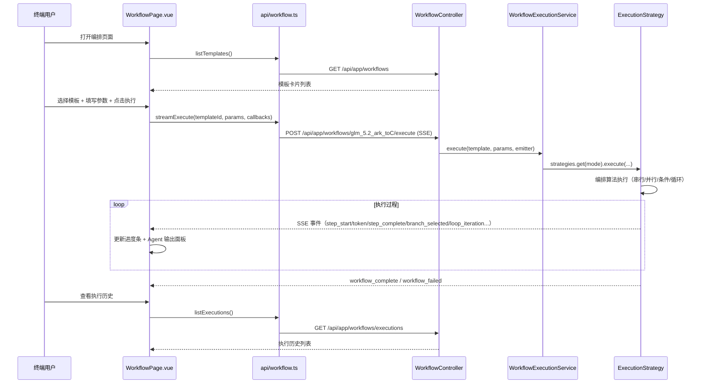

# 技术设计文档: 应用编排层 P2（多模式编排 + 前端管理页面）

## 0. 设计概要 (Design Summary)

*   **功能描述**：在 P1（基础适配层 + 串行编排 + REST API + SSE）基础上，补齐**并行编排**、**条件分支编排**、**循环编排**三种模式，新增**执行历史 API**，并交付**前端编排管理页面**（模板列表、参数表单、执行可视化、执行历史）。
*   **影响范围**：
    - `agent-demo-app`：扩展 `WorkflowTemplate` 数据模型（并行组/分支/循环定义）、扩展 `WorkflowExecutionService`（新增 3 个执行方法 + 执行历史查询）、新增 `WorkflowContext` 状态容器、新增条件/循环谓词注册
    - `agent-demo-web`：`WorkflowController` 新增执行历史列表接口、DTO 扩展
    - `agent-demo-frontend`：新增 `api/workflow.ts`、`components/WorkflowPage.vue` 及相关子组件、`App.vue`/`NavBar.vue` 导航扩展、`types/index.ts` 类型扩展
*   **技术难点**：
    1. 并行编排的 SSE 事件流（多 Agent 同时输出，事件需按 agent 区分且线程安全）
    2. 条件/循环谓词（`Predicate`）无法被 Jackson 序列化，需设计"代码定义 + 展示描述"双轨结构
    3. 前端 SSE 执行可视化（复用现有 fetch + ReadableStream 解析模式）
*   **依赖关系**：P1 已交付（适配层 + 串行 + API + SSE 协议）；`langchain4j-agentic:1.17.2-beta27` 已引入

## 1. 架构概览 (Architecture Overview)

### 1.1 架构分层与模块交互

> **架构核心改进（P2）**：引入**策略模式**替代 switch-case 分发，将编排算法与生命周期管理分离。
> 新增编排模式只需实现 `WorkflowExecutionStrategy` 接口并注册为 `@Component`，无需修改核心类（OCP）。

```mermaid
graph TB
    subgraph "agent-demo-frontend (P2 新增)"
        WP[WorkflowPage.vue]
        WFAPI[api/workflow.ts]
        NAV[NavBar 新增"编排"入口]
    end

    subgraph "agent-demo-web"
        WC[WorkflowController]
        DTO[Workflow DTO 扩展]
    end

    subgraph "agent-demo-app: 协调层"
        SVC[WorkflowExecutionService<br/>薄协调层：生命周期 + 注册表 + 分发]
    end

    subgraph "agent-demo-app: 策略层 (Strategy Pattern)"
        SEQ[SequentialExecutionStrategy]
        PAR[ParallelExecutionStrategy]
        COND[ConditionalExecutionStrategy]
        LOOP[LoopExecutionStrategy]
    end

    subgraph "agent-demo-app: 共享执行基础设施"
        AE[AgentExecutor<br/>Agent 执行 + 重试 + 流式]
        EP[WorkflowEventPublisher<br/>SSE 事件发送]
        CTX[WorkflowContext<br/>状态容器]
    end

    subgraph "agent-demo-app: 领域模型"
        TPL[预置模板扩展]
        CORE[Core Model 扩展]
    end

    WP --> WFAPI
    WFAPI --> WC
    NAV --> WP
    WC --> SVC
    WC --> CORE
    SVC -->|"按 mode 分发"| SEQ
    SVC --> PAR
    SVC --> COND
    SVC --> LOOP
    SEQ --> AE
    PAR --> AE
    COND --> AE
    LOOP --> AE
    SEQ --> EP
    PAR --> EP
    COND --> EP
    LOOP --> EP
    SEQ --> CTX
    PAR --> CTX
    COND --> CTX
    LOOP --> CTX
    TPL --> CORE
```

**分层职责**：

| 层 | 类 | 职责 | 变化频率 |
|:---|:---|:---|:---|
| **协调层** | `WorkflowExecutionService` | 执行实例创建/注册/终止/历史查询、策略分发、统一异常处理 | 低（稳定） |
| **策略层** | `WorkflowExecutionStrategy` 接口 + 4 实现 | 各编排模式的执行算法（串行/并行/条件/循环） | 中（P3 扩展新策略） |
| **执行基础设施** | `AgentExecutor` / `WorkflowEventPublisher` / `WorkflowContext` | Agent 执行（重试+流式）、SSE 事件发送、状态读写 | 低（被复用） |
| **领域模型** | `WorkflowTemplate` / `WorkflowExecution` / `*Definition` | 数据结构定义 | 低 |

### 1.2 数据流向（前端 → 后端 → SSE）



### 1.3 关键设计决策

**决策 1: 策略模式替代 switch-case 分发（架构核心改进）**
*   `WorkflowExecutionStrategy` 接口定义编排算法契约，4 个实现类分别处理 SEQUENTIAL/PARALLEL/CONDITIONAL/LOOP
*   `WorkflowExecutionService` 通过 Spring 自动注入 `List<WorkflowExecutionStrategy>`，构建 `Map<OrchestrationMode, Strategy>` 分发表
*   **新增编排模式**（如 P3 的 SUPERVISOR）：只需新建策略类 + `@Component`，零修改 `WorkflowExecutionService`（OCP）
*   策略实现注入 `AgentExecutor`（共享 Agent 执行逻辑）和 `WorkflowEventPublisher`（共享 SSE 事件发送）

**决策 2: AgentExecutor 抽取共享执行逻辑**
*   将 P1 的 `executeAgentWithRetry()` / `executeAgentStreaming()` 抽取到独立的 `AgentExecutor` 组件
*   所有策略共享同一套 Agent 构建 + 重试 + 流式输出逻辑，避免代码重复
*   测试可独立 Mock `AgentExecutor`，无需 Mock 整个 Service

**决策 3: WorkflowExecutionService 转为薄协调层**
*   仅保留：执行实例创建/注册、策略分发、统一异常处理（终止/超时/失败）、emitter 生命周期回调
*   不再包含具体编排算法（已迁移到策略类）和 Agent 执行细节（已迁移到 AgentExecutor）
*   `getExecution` / `terminate` / `listExecutions` 等查询管理方法保留在此

**决策 4: 延续 P1 自定义执行器，不使用原生 workflow builder**
*   复用 P1 的 `AgenticAgentFactory` + 反射调用 @Agent 方法 + TokenStream 回调（P1 已验证可行）
*   **不使用** `parallelBuilder()`/`conditionalBuilder()`/`loopBuilder()` 原生 API（流式 TokenStream 支持不稳定，与 P1 决策一致）
*   引入轻量 `WorkflowContext` 作为 Agent 间数据传递容器（替代 P1 的单字符串 `currentInput`，支持并行/循环的多值读写）

## 2. API 设计 (API Design)

> 沿用 P1 RESTful 风格，统一返回 `Result<T>`，SSE 使用 `SseEmitter`。

### 2.1 接口列表

| 接口名称 | 方法 | 路径 | 描述 | 对应 AC |
| :--- | :--- | :--- | :--- | :--- |
| 查询模板列表 | GET | /api/app/workflows | 获取所有已注册工作流模板（P1 已有，DTO 扩展 mode 字段） | AC-001 |
| 查询模板详情 | GET | /api/app/workflows/{templateId} | 获取模板完整信息（P1 已有，新增并行组/分支/循环定义） | AC-002 |
| 执行工作流 | POST | /api/app/workflows/{templateId}/execute | 异步执行（P1 已有，新增 mode 分发 + 新 SSE 事件） | AC-004, AC-005, AC-006, AC-029 |
| 查询执行状态 | GET | /api/app/workflows/executions/{executionId} | 查询执行实例状态（P1 已有） | AC-011 |
| **查询执行历史** | **GET** | **/api/app/workflows/executions** | **获取所有执行实例列表** | **AC-027** |
| 终止执行 | DELETE | /api/app/workflows/executions/{executionId} | 终止执行（P1 已有） | AC-022 |

> 注：`GET /api/app/workflows/executions`（列表）与 `GET /api/app/workflows/executions/{executionId}`（详情）路径不冲突，Spring MVC 按路径段精确匹配。

### 2.2 接口详情

#### 接口 1: 查询执行历史（P2 新增）

*   **路径**: `GET /api/app/workflows/executions`
*   **描述**: 获取所有工作流执行实例（内存存储），按开始时间倒序，供前端执行历史列表展示
*   **Response (成功)**:
    ```json
    {
      "success": true,
      "code": 200,
      "data": [
        {
          "executionId": "a1b2c3d4",
          "templateId": "quality-review-loop",
          "templateName": "质量评分-修订",
          "mode": "LOOP",
          "status": "COMPLETED",
          "startTime": "2026-08-13T14:30:00",
          "endTime": "2026-08-13T14:32:15",
          "finalResult": "最终修订稿（第 3 次迭代，评分 92）",
          "iterationCount": 3
        }
      ]
    }
    ```

#### 接口 2: 执行工作流（SSE 事件扩展）

*   **路径**: `POST /api/app/workflows/{templateId}/execute`
*   **描述**: 按模板 `mode` 分发执行。除 P1 已有事件外，P2 新增：
    - `branch_selected`（条件模式）：通知前端选择了哪个分支
    - `loop_iteration`（循环模式）：通知前端当前迭代轮次
    - `group_start` / `group_complete`（并行模式）：通知前端并行分组进度
*   **SSE 事件协议扩展**（详见 2.3 节）

### 2.3 SSE 事件协议（P2 扩展）

| 事件名 | 触发时机 | data 字段 | 所属阶段 |
| :--- | :--- | :--- | :--- |
| `workflow_start` | 工作流开始 | `executionId`, `templateName`, `agentCount`, `mode` | P1 + P2 扩展 mode |
| `step_start` | 某 Agent 开始 | `agentIndex`, `agentName`, `totalAgents`, `groupIndex`(并行), `iteration`(循环) | P1 + P2 |
| `token` | Agent 流式片段 | `agentIndex`, `content` | P1 |
| `step_complete` | Agent 完成 | `agentIndex`, `agentName`, `durationMs`, `outputLength` | P1 |
| `step_retry` | Agent 重试 | `agentIndex`, `retryCount`, `remainingRetries` | P1 |
| `step_error` | 重试耗尽失败 | `agentIndex`, `error`, `retryCount` | P1 |
| `workflow_complete` | 全部完成 | `executionId`, `finalResult`, `totalDurationMs`, `mode`, `iterationCount`(循环) | P1 + P2 |
| `workflow_failed` | 失败/终止/超时 | `executionId`, `failedAgent`, `error`, `status` | P1 |
| **`branch_selected`** | 条件模式选中分支 | `branchIndex`, `branchName`, `agentCount` | **P2 新增** |
| **`loop_iteration`** | 循环模式每轮开始 | `iteration`, `maxIterations`, `agentCount` | **P2 新增** |
| **`group_start`** | 并行模式分组开始 | `groupIndex`, `groupName`, `agentCount` | **P2 新增** |
| **`group_complete`** | 并行模式分组完成 | `groupIndex`, `groupName`, `durationMs`, `outputLength` | **P2 新增** |

## 3. 数据库设计 (Database Schema)

> 与 P1 一致，**不涉及数据库**。所有执行状态存储在内存（`ConcurrentHashMap`），应用重启后丢失（BR-APP-008）。

## 4. 核心逻辑与算法 (Core Logic)

### 4.1 数据模型扩展（agent-demo-app）

#### 4.1.1 WorkflowContext —— 执行上下文（P2 新增）

```java
/**
 * 工作流执行上下文
 * 业务含义：Agent 间数据传递的共享容器，替代 P1 的单字符串 currentInput。
 * 支持：命名状态读写（state）、按 Agent 名记录输出（agentOutputs）、迭代计数（iterationCount）。
 */
public class WorkflowContext {
    private final Map<String, Object> state = new ConcurrentHashMap<>();
    private final Map<String, String> agentOutputs = new ConcurrentHashMap<>();
    private final AtomicInteger iterationCount = new AtomicInteger(0);

    public void write(String key, Object value) { state.put(key, value); }
    public Object read(String key) { return state.get(key); }
    public String readAsString(String key) { Object v = state.get(key); return v != null ? v.toString() : ""; }
    public void recordOutput(String agentName, String output) { agentOutputs.put(agentName, output); }
    public String getOutput(String agentName) { return agentOutputs.getOrDefault(agentName, ""); }
    public Map<String, Object> getState() { return state; }
    public int incrementIteration() { return iterationCount.incrementAndGet(); }
    public int getIterationCount() { return iterationCount.get(); }
}
```

#### 4.1.2 WorkflowTemplate 扩展字段

```java
@Data @Builder
public class WorkflowTemplate {
    private String id;
    private String name;
    private String description;
    private OrchestrationMode mode;   // SEQUENTIAL / PARALLEL / CONDITIONAL / LOOP / SUPERVISOR
    private List<AgentDefinition> agents;        // P1 串行模式使用
    private List<ParameterDefinition> parameters;
    private int maxRetries;

    // ===== P2 新增（按 mode 选择使用，互斥）=====
    private List<ParallelGroup> parallelGroups;  // PARALLEL 模式
    private List<BranchDefinition> branches;     // CONDITIONAL 模式
    private LoopDefinition loop;                 // LOOP 模式
}

/** 并行分组：组内可多个 Agent 串行，组间并行 */
@Data @Builder
public class ParallelGroup {
    private String name;
    private List<AgentDefinition> agents;
}

/** 条件分支定义 */
@Data @Builder
public class BranchDefinition {
    private String name;
    private String conditionDescription;      // 前端展示用（如"问题复杂（预估需拆解）"）
    @com.fasterxml.jackson.annotation.JsonIgnore
    private Predicate<WorkflowContext> condition;   // 运行时评估，不参与 JSON 序列化
    private List<AgentDefinition> agents;
}

/** 循环定义 */
@Data @Builder
public class LoopDefinition {
    private int maxIterations;                // 必须配置，防死循环（AC-029，BR-APP-014）
    private String exitConditionDescription;  // 前端展示用（如"评分 ≥ 90 时退出"）
    @com.fasterxml.jackson.annotation.JsonIgnore
    private Predicate<WorkflowContext> exitCondition; // 运行时评估
    private List<AgentDefinition> agents;     // 循环体
}
```

> **关键设计**：`Predicate` 无法被 Jackson 序列化（`WorkflowDetailResponse` 是手写 DTO，不直接序列化 `WorkflowTemplate`，但为避免隐患统一加 `@JsonIgnore`）。条件逻辑在模板代码定义时以 `Predicate<WorkflowContext>` 提供，执行时从模板对象读取；前端仅展示 `conditionDescription`/`exitConditionDescription` 描述文本。

### 4.2 执行引擎架构（策略模式重构）

> **架构改进核心**：将 P1 的 `WorkflowExecutionService`（God Class）拆分为三层：
> - **协调层** `WorkflowExecutionService`：生命周期管理 + 策略分发 + 异常处理
> - **策略层** `WorkflowExecutionStrategy` 接口 + 4 实现：各编排算法
> - **基础设施** `AgentExecutor` / `WorkflowEventPublisher`：共享 Agent 执行 + SSE 事件

#### 4.2.1 策略接口定义

```java
package com.agentdemo.app.strategy;

/**
 * 工作流执行策略
 * <p>
 * 业务含义：封装不同编排模式（串行/并行/条件/循环）的执行算法。
 * 新增编排模式时只需实现此接口并注册为 @Component，
 * WorkflowExecutionService 通过 Spring 自动注入发现策略，无需修改核心类（OCP）。
 * </p>
 */
public interface WorkflowExecutionStrategy {

    /** 该策略支持的编排模式 */
    OrchestrationMode supportedMode();

    /**
     * 执行编排算法
     *
     * @param template   工作流模板（含 mode 特定的配置：parallelGroups/branches/loop）
     * @param params     执行参数
     * @param emitter    SSE 发射器
     * @param execution  执行实例（用于记录步骤和状态）
     * @param modelId    模型 ID
     * @param cancelFlag 取消标志（每步前检查，AC-022）
     * @return 最终结果文本
     */
    String execute(WorkflowTemplate template, Map<String, Object> params,
                   SseEmitter emitter, WorkflowExecution execution,
                   String modelId, AtomicBoolean cancelFlag);
}
```

#### 4.2.2 AgentExecutor -- 共享 Agent 执行逻辑（从 P1 抽取）

```java
package com.agentdemo.app.execution;

/**
 * Agent 执行器
 * <p>
 * 业务含义：封装单个 Agent 的构建 + 失败重试 + 流式输出，供所有策略复用。
 * 从 P1 的 WorkflowExecutionService 抽取，实现单一职责。
 * </p>
 */
@Component
public class AgentExecutor {

    private final AgenticAgentFactory agentFactory;
    private final long agentTimeoutMinutes;

    public AgentExecutor(AgenticAgentFactory agentFactory) {
        this(agentFactory, 5); // 默认 5 分钟超时
    }

    public AgentExecutor(AgenticAgentFactory agentFactory, long agentTimeoutMinutes) {
        this.agentFactory = agentFactory;
        this.agentTimeoutMinutes = agentTimeoutMinutes;
    }

    /**
     * 执行单个 Agent（含自动重试 + 流式 SSE 推送）
     * 业务含义：首次失败后自动重试（AC-015/AC-026），每次重试推送 step_retry，
     * 重试耗尽后推送 step_error 并抛出异常。
     */
    public String executeWithRetry(AgentDefinition agentDef, String input,
                                   SseEmitter emitter, int agentIndex,
                                   int maxRetries, String modelId) {
        // 逻辑与 P1 executeAgentWithRetry 一致，迁移至此
    }

    /**
     * 执行 Agent 并捕获流式输出（反射调用 @Agent 方法 + TokenStream 回调）
     * 超时抛出 WorkflowTimeoutException（AC-023）。
     */
    String executeStreaming(Object agent, AgentDefinition agentDef,
                            String input, SseEmitter emitter, int agentIndex) {
        // 逻辑与 P1 executeAgentStreaming 一致，迁移至此
    }

    /** 检查取消标志，已取消则抛出 WorkflowCancelledException（AC-022） */
    public static void checkCancelled(AtomicBoolean cancelFlag) {
        if (cancelFlag != null && cancelFlag.get()) {
            throw new WorkflowCancelledException();
        }
    }
}
```

#### 4.2.3 WorkflowEventPublisher -- SSE 事件发送（从 P1 抽取）

```java
package com.agentdemo.app.execution;

/**
 * SSE 事件发布器
 * 业务含义：统一 SSE 事件发送入口，避免各策略重复 try-catch。
 * send 失败时降级为 WARN 日志，不中断后续事件推送。
 */
public final class WorkflowEventPublisher {

    private static final Logger log = LoggerFactory.getLogger(WorkflowEventPublisher.class);

    public static void send(SseEmitter emitter, String eventName, Object data) {
        try {
            emitter.send(SseEmitter.event().name(eventName).data(data));
        } catch (Exception e) {
            log.warn("SSE 发送失败: event={}, reason={}", eventName, e.getMessage());
        }
    }
}
```

#### 4.2.4 WorkflowExecutionService -- 薄协调层（重构）

```java
package com.agentdemo.app.service;

/**
 * 工作流执行协调层
 * <p>
 * 业务含义：负责执行实例的创建/注册/终止/历史查询，按模板 mode 分发到对应策略，
 * 统一处理异常（终止/超时/失败）。不包含具体编排算法（已迁移到策略类）。
 * </p>
 */
@Service
public class WorkflowExecutionService {

    /** 策略注册中心：mode -> strategy（Spring 自动注入所有 @Component 策略） */
    private final Map<OrchestrationMode, WorkflowExecutionStrategy> strategies;

    /** 执行实例存储（内存，BR-APP-008） */
    private final ConcurrentHashMap<String, WorkflowExecution> executions = new ConcurrentHashMap<>();

    /** 取消标志（按 executionId 隔离） */
    private final ConcurrentHashMap<String, AtomicBoolean> cancelFlags = new ConcurrentHashMap<>();

    /**
     * Spring 自动注入所有策略实现，构建分发表
     * 新增模式只需新增 @Component 策略类，此处零修改（OCP）
     */
    public WorkflowExecutionService(List<WorkflowExecutionStrategy> strategyList) {
        this.strategies = strategyList.stream()
                .collect(Collectors.toMap(
                        WorkflowExecutionStrategy::supportedMode, s -> s));
    }

    /**
     * 执行工作流（异步，通过 SSE 推送事件）
     * 业务含义：创建执行实例 -> 查找策略 -> 异步执行 -> 统一异常处理
     */
    public String execute(WorkflowTemplate template, Map<String, Object> parameters,
                          SseEmitter emitter, String modelId) {
        String executionId = generateExecutionId();
        WorkflowExecution execution = new WorkflowExecution(executionId, template.getId(), template.getName());
        execution.setMode(template.getMode()); // P2 新增：记录编排模式
        execution.start();
        executions.put(executionId, execution);

        AtomicBoolean cancelFlag = new AtomicBoolean(false);
        cancelFlags.put(executionId, cancelFlag);

        // 查找策略
        WorkflowExecutionStrategy strategy = strategies.get(template.getMode());
        if (strategy == null) {
            throw new BusinessException(ErrorCode.WORKFLOW_MODE_NOT_SUPPORTED,
                    "不支持的编排模式: " + template.getMode());
        }

        // 异步执行 + 统一异常处理（与 P1 一致）
        CompletableFuture.runAsync(() -> {
            try {
                String result = strategy.execute(template, parameters, emitter,
                        execution, modelId, cancelFlag);
                execution.complete(result);
                emitter.complete();
            } catch (WorkflowCancelledException e) { handleTerminated(emitter, execution, e.getMessage()); }
            catch (WorkflowTimeoutException e)    { handleTimeout(emitter, execution, e.getMessage()); }
            catch (BusinessException e)           { handleFailure(emitter, execution, e.getMessage()); }
            catch (Exception e)                   { handleFailure(emitter, execution, e.getMessage()); }
        });

        emitter.onTimeout(() -> cancel(executionId));
        emitter.onError(e -> cancel(executionId));
        return executionId;
    }

    // getExecution / terminate / cancel / listExecutions 保持不变（与 P1 + 4.3 节一致）
    // handleTerminated / handleTimeout / handleFailure 保留在此（生命周期管理是协调层职责）
}
```

#### 4.2.5 SequentialExecutionStrategy -- 串行（P1 迁移）

```java
package com.agentdemo.app.strategy;

/**
 * 串行编排策略
 * 业务含义：按顺序遍历 Agent，前一个输出传给后一个（AC-003）。
 * 从 P1 的 WorkflowExecutionService.executeSequential 迁移。
 */
@Component
public class SequentialExecutionStrategy implements WorkflowExecutionStrategy {

    private final AgentExecutor agentExecutor;

    public SequentialExecutionStrategy(AgentExecutor agentExecutor) {
        this.agentExecutor = agentExecutor;
    }

    @Override
    public OrchestrationMode supportedMode() { return OrchestrationMode.SEQUENTIAL; }

    @Override
    public String execute(WorkflowTemplate template, Map<String, Object> params,
                          SseEmitter emitter, WorkflowExecution execution,
                          String modelId, AtomicBoolean cancelFlag) {
        WorkflowContext ctx = new WorkflowContext();
        ctx.write("params", params);

        WorkflowEventPublisher.send(emitter, "workflow_start", Map.of(
                "executionId", execution.getExecutionId(),
                "templateName", template.getName(),
                "mode", "SEQUENTIAL",
                "agentCount", template.getAgents().size()));

        String currentInput = params.getOrDefault("topic", "").toString();
        long startTime = System.currentTimeMillis();

        for (int i = 0; i < template.getAgents().size(); i++) {
            AgentExecutor.checkCancelled(cancelFlag);

            AgentDefinition agentDef = template.getAgents().get(i);
            StepExecution step = new StepExecution(agentDef.getName(), i, StepStatus.RUNNING);
            execution.getSteps().add(step);

            WorkflowEventPublisher.send(emitter, "step_start", Map.of(
                    "agentIndex", i, "agentName", agentDef.getName(),
                    "totalAgents", template.getAgents().size()));

            String output = agentExecutor.executeWithRetry(agentDef, currentInput, emitter,
                    i, template.getMaxRetries(), modelId);

            step.complete(output);
            ctx.recordOutput(agentDef.getName(), output);
            currentInput = output;

            WorkflowEventPublisher.send(emitter, "step_complete", Map.of(
                    "agentIndex", i, "agentName", agentDef.getName(),
                    "durationMs", step.getDurationMs(),
                    "outputLength", output.length()));
        }

        WorkflowEventPublisher.send(emitter, "workflow_complete", Map.of(
                "executionId", execution.getExecutionId(),
                "finalResult", currentInput,
                "mode", "SEQUENTIAL",
                "totalDurationMs", System.currentTimeMillis() - startTime));

        return currentInput;
    }
}
```

#### 4.2.6 ParallelExecutionStrategy -- 并行（AC-004）

```java
/**
 * 并行编排策略
 * 业务含义：多个并行分组同时执行，每组内部 Agent 串行，
 * 各组结果写入共享 WorkflowContext，全部完成后汇总（AC-004）。
 */
@Component
public class ParallelExecutionStrategy implements WorkflowExecutionStrategy {

    private final AgentExecutor agentExecutor;

    /** 并行线程池 */
    private final Executor parallelExecutor = Executors.newFixedThreadPool(
            Math.min(4, Runtime.getRuntime().availableProcessors()),
            r -> { Thread t = new Thread(r); t.setName("workflow-parallel-" + t.getId()); return t; });

    @Override
    public OrchestrationMode supportedMode() { return OrchestrationMode.PARALLEL; }

    @Override
    public String execute(WorkflowTemplate template, Map<String, Object> params,
                          SseEmitter emitter, WorkflowExecution execution,
                          String modelId, AtomicBoolean cancelFlag) {
        WorkflowContext ctx = new WorkflowContext();
        ctx.write("params", params);

        WorkflowEventPublisher.send(emitter, "workflow_start", Map.of(
                "executionId", execution.getExecutionId(),
                "templateName", template.getName(),
                "mode", "PARALLEL",
                "agentCount", template.getParallelGroups().stream()
                        .mapToInt(g -> g.getAgents().size()).sum()));

        long startTime = System.currentTimeMillis();
        List<CompletableFuture<String>> futures = new ArrayList<>();
        AtomicInteger groupIdx = new AtomicInteger(0);

        for (ParallelGroup group : template.getParallelGroups()) {
            int gIdx = groupIdx.getAndIncrement();
            futures.add(CompletableFuture.supplyAsync(() -> {
                AgentExecutor.checkCancelled(cancelFlag);
                WorkflowEventPublisher.send(emitter, "group_start", Map.of(
                        "groupIndex", gIdx, "groupName", group.getName(),
                        "agentCount", group.getAgents().size()));

                long gStart = System.currentTimeMillis();
                String groupOutput = "";
                for (int i = 0; i < group.getAgents().size(); i++) {
                    AgentExecutor.checkCancelled(cancelFlag);
                    AgentDefinition agentDef = group.getAgents().get(i);
                    // ... step_start -> executeWithRetry -> step_complete（附加 groupIndex）
                    groupOutput = output;
                }

                WorkflowEventPublisher.send(emitter, "group_complete", Map.of(
                        "groupIndex", gIdx, "groupName", group.getName(),
                        "durationMs", System.currentTimeMillis() - gStart,
                        "outputLength", groupOutput.length()));
                return groupOutput;
            }, parallelExecutor));
        }

        // 等待所有分组完成
        List<String> groupOutputs = futures.stream().map(CompletableFuture::join).toList();
        String finalResult = summarizeParallel(template, groupOutputs);

        WorkflowEventPublisher.send(emitter, "workflow_complete", Map.of(
                "executionId", execution.getExecutionId(),
                "finalResult", finalResult,
                "mode", "PARALLEL",
                "totalDurationMs", System.currentTimeMillis() - startTime));

        return finalResult;
    }

    /** 并行汇总：按分组顺序拼接为综合报告 */
    private String summarizeParallel(WorkflowTemplate template, List<String> groupOutputs) {
        StringBuilder sb = new StringBuilder("【多角度综合审查报告】\n");
        List<ParallelGroup> groups = template.getParallelGroups();
        for (int i = 0; i < groups.size(); i++) {
            sb.append("## ").append(groups.get(i).getName()).append("\n")
              .append(groupOutputs.get(i) == null ? "" : groupOutputs.get(i)).append("\n\n");
        }
        return sb.toString();
    }
}
```

#### 4.2.7 ConditionalExecutionStrategy -- 条件分支（AC-005）

```java
/**
 * 条件分支编排策略
 * 业务含义：依次评估各分支 condition 谓词，命中第一个满足的分支执行其 Agent 序列（AC-005）。
 */
@Component
public class ConditionalExecutionStrategy implements WorkflowExecutionStrategy {

    private final AgentExecutor agentExecutor;

    @Override
    public OrchestrationMode supportedMode() { return OrchestrationMode.CONDITIONAL; }

    @Override
    public String execute(WorkflowTemplate template, Map<String, Object> params,
                          SseEmitter emitter, WorkflowExecution execution,
                          String modelId, AtomicBoolean cancelFlag) {
        WorkflowContext ctx = new WorkflowContext();
        ctx.write("params", params);

        WorkflowEventPublisher.send(emitter, "workflow_start", Map.of(
                "executionId", execution.getExecutionId(),
                "templateName", template.getName(),
                "mode", "CONDITIONAL",
                "agentCount", template.getBranches().size()));

        long startTime = System.currentTimeMillis();
        String finalResult = "";

        for (int b = 0; b < template.getBranches().size(); b++) {
            AgentExecutor.checkCancelled(cancelFlag);
            BranchDefinition branch = template.getBranches().get(b);
            if (branch.getCondition().test(ctx)) {
                WorkflowEventPublisher.send(emitter, "branch_selected", Map.of(
                        "branchIndex", b, "branchName", branch.getName(),
                        "agentCount", branch.getAgents().size()));
                // 顺序执行该分支的 Agent（复用 executeAgentList 公共方法）
                finalResult = executeAgentList(branch.getAgents(), ctx, emitter, execution,
                        template.getMaxRetries(), modelId, cancelFlag, 0);
                break;
            }
        }

        WorkflowEventPublisher.send(emitter, "workflow_complete", Map.of(
                "executionId", execution.getExecutionId(),
                "finalResult", finalResult,
                "mode", "CONDITIONAL",
                "totalDurationMs", System.currentTimeMillis() - startTime));

        return finalResult;
    }
}
```

#### 4.2.8 LoopExecutionStrategy -- 循环（AC-006, AC-029）

```java
/**
 * 循环编排策略
 * 业务含义：执行循环体 Agent，每轮结束后评估 exitCondition；
 * 满足条件或达到 maxIterations 上限则退出（AC-006, AC-029, BR-APP-014）。
 */
@Component
public class LoopExecutionStrategy implements WorkflowExecutionStrategy {

    private final AgentExecutor agentExecutor;

    @Override
    public OrchestrationMode supportedMode() { return OrchestrationMode.LOOP; }

    @Override
    public String execute(WorkflowTemplate template, Map<String, Object> params,
                          SseEmitter emitter, WorkflowExecution execution,
                          String modelId, AtomicBoolean cancelFlag) {
        WorkflowContext ctx = new WorkflowContext();
        ctx.write("params", params);
        LoopDefinition loop = template.getLoop();

        // 校验：maxIterations 必须配置（AC-029）
        if (loop.getMaxIterations() <= 0) {
            throw new BusinessException(ErrorCode.WORKFLOW_PARAM_MISSING,
                    "循环工作流必须配置最大迭代次数");
        }

        WorkflowEventPublisher.send(emitter, "workflow_start", Map.of(
                "executionId", execution.getExecutionId(),
                "templateName", template.getName(),
                "mode", "LOOP",
                "maxIterations", loop.getMaxIterations()));

        long startTime = System.currentTimeMillis();
        String finalResult = "";
        boolean maxReached = false;

        for (int iteration = 1; iteration <= loop.getMaxIterations(); iteration++) {
            AgentExecutor.checkCancelled(cancelFlag);
            ctx.incrementIteration();

            WorkflowEventPublisher.send(emitter, "loop_iteration", Map.of(
                    "iteration", iteration,
                    "maxIterations", loop.getMaxIterations(),
                    "agentCount", loop.getAgents().size()));

            finalResult = executeAgentList(loop.getAgents(), ctx, emitter, execution,
                    template.getMaxRetries(), modelId, cancelFlag, iteration);

            if (loop.getExitCondition().test(ctx)) {
                break;
            }
            if (iteration >= loop.getMaxIterations()) {
                maxReached = true; // AC-029：达到最大迭代次数退出
            }
        }

        execution.setIterationCount(ctx.getIterationCount());
        WorkflowEventPublisher.send(emitter, "workflow_complete", Map.of(
                "executionId", execution.getExecutionId(),
                "finalResult", finalResult,
                "mode", "LOOP",
                "iterationCount", ctx.getIterationCount(),
                "exitReason", maxReached ? "达到最大迭代次数退出" : "退出条件满足",
                "totalDurationMs", System.currentTimeMillis() - startTime));

        return finalResult;
    }
}
```

#### 4.2.9 公共方法 -- executeAgentList

策略类中复用的公共方法（可放在策略基类或工具类中）：

```java
/**
 * 顺序执行 Agent 列表（供条件分支/循环体复用）
 * @param iteration 当前迭代轮次（条件分支传 0）
 */
String executeAgentList(List<AgentDefinition> agents, WorkflowContext ctx,
                        SseEmitter emitter, WorkflowExecution execution,
                        int maxRetries, String modelId,
                        AtomicBoolean cancelFlag, int iteration) {
    String currentInput = ctx.readAsString("lastOutput");
    for (int i = 0; i < agents.size(); i++) {
        AgentExecutor.checkCancelled(cancelFlag);
        AgentDefinition agentDef = agents.get(i);
        // step_start -> executeWithRetry -> step_complete（与串行策略类似）
        String output = agentExecutor.executeWithRetry(agentDef, currentInput, emitter,
                i, maxRetries, modelId);
        ctx.recordOutput(agentDef.getName(), output);
        ctx.write(agentDef.getName(), output);
        ctx.write("lastOutput", output);
        currentInput = output;
    }
    return currentInput;
}
```

> **设计要点**：`executeAgentList` 是条件/循环策略的公共逻辑，可抽取到 `AbstractExecutionStrategy` 基类或 `AgentExecutor` 工具方法中，避免代码重复。串行策略的逻辑与其类似但不完全相同（串行用 `params.topic` 作为初始输入），暂不强行统一。

> 说明：为便于测试注入，`parallelExecutor` 通过构造器可替换（与 `agentTimeoutMinutes` 一致的测试策略）。

### 4.3 执行历史（AC-027）

`WorkflowExecutionService` 新增方法：

```java
/** 获取所有执行实例（按开始时间倒序），供执行历史列表展示（AC-027） */
public List<WorkflowExecution> listExecutions() {
    return executions.values().stream()
            .sorted(Comparator.comparing(WorkflowExecution::getStartTime, Comparator.nullsLast(Comparator.reverseOrder())))
            .collect(Collectors.toList());
}
```

> 说明：`WorkflowExecution` 已有 `executionId/templateId/templateName/status/startTime/endTime/finalResult`，P2 补充 `mode` 与 `iterationCount` 字段（由 execute 分发时写入），供前端历史列表展示。

### 4.4 预置模板扩展（P2 新增 3 个模板）

| 模板 ID | 名称 | 模式 | 分支/循环/分组 | 对应 AC |
| :--- | :--- | :--- | :--- | :--- |
| `quality-review-loop` | 质量评分-修订 | LOOP | 循环体：评分 Agent → 修订 Agent；exitCondition：评分 ≥ 90 或达 maxIterations=5 | AC-006, AC-029 |
| `smart-routing` | 智能路由 | CONDITIONAL | 分支1：简单回答（问题短/无需拆解）；分支2：复杂拆解（研究→分析→总结） | AC-005 |
| `multi-perspective-review` | 多角度审查 | PARALLEL | 分组：安全审查 / 性能审查 / 风格审查 | AC-004 |

> **条件/循环谓词实现**：预置模板中定义匿名 `Predicate<WorkflowContext>`。例如：
> ```java
> // 智能路由分支条件：从 params 读问题文本，长度 > 80 或含"为什么/如何/分析"关键词视为复杂
> branch("简单回答", ctx -> {
>     String question = ctx.readAsString("question");
>     return question.length() <= 80 && !question.matches(".*(为什么|如何|分析|对比|方案).*");
> }, List.of(quickAnswerAgent))
> ```

## 5. 异常处理 (Error Handling)

| 异常场景 | 对应 AC | 处理方案 | 用户提示 |
| :--- | :--- | :--- | :--- |
| 循环未配置 maxIterations | AC-029 | 模板校验时若 LOOP 模式且 `loop.maxIterations <= 0`，抛 `BusinessException(WORKFLOW_PARAM_MISSING)` | "循环工作流必须配置最大迭代次数" |
| 并行分组为空 | AC-004 | 模板校验 `parallelGroups` 非空，否则抛 `WORKFLOW_EXECUTION_FAILED` | "并行工作流未配置任何分组" |
| 条件分支均未命中 | AC-005 | 执行最后一个分支的 Agent（兜底分支），或推送 `workflow_failed` 提示无匹配分支 | "没有匹配任何条件分支" |
| 并行某分组失败 | AC-004 | `CompletableFuture.join()` 抛 CompletionException → 外层 handleFailure，整体 FAILED | "并行执行失败: {groupName}" |
| 循环无限循环风险 | AC-029 | `maxIterations` 强制上限 + 每轮检查取消标志 | 达到上限自动退出 |
| 执行历史为空 | AC-027 | 返回空列表（不报错） | 前端展示空状态"暂无执行记录" |
| 取消/超时 | AC-022, AC-023 | 与 P1 一致：取消标志检查 + `future.get(agentTimeoutMinutes, MINUTES)` | 复用 P1 workflow_failed |

## 6. 安全与性能 (Security & Performance)

*   **鉴权机制**: P2 无鉴权（与 P1 及项目现状一致）
*   **数据校验**: Controller 层 `@Valid` 校验必填参数；Service 层校验 LOOP 的 `maxIterations > 0`、PARALLEL 的 `parallelGroups` 非空、CONDITIONAL 的 `branches` 非空
*   **并发控制**: 并行执行使用固定线程池（max(4, CPU)），每组独立 CompletableFuture；`WorkflowContext` 内部 `ConcurrentHashMap` + `AtomicInteger` 保证线程安全；SSE 事件发送线程安全（`SseEmitter.send` 内部同步）
*   **超时控制**: 复用 P1 的 `agentTimeoutMinutes`（默认 5 分钟）；并行模式下每组的超时由其组内 Agent 的 `future.get` 保证
*   **性能指标**: 并行模式执行时间 = 最慢分组时间（非所有分组之和）；SSE 事件延迟 < 100ms

## 7. 前端设计（agent-demo-frontend）

### 7.1 导航与路由

*   `NavBar.vue`：`ViewKey` 扩展为 `'chat' | 'knowledge' | 'workflow' | 'settings'`，`navItems` 增加 `{ key: 'workflow', label: '编排' }`（AC-032，BR-APP-016）
*   `App.vue`：`currentView` 类型扩展，新增 `<WorkflowPage v-else-if="currentView === 'workflow'" />` 分支

### 7.2 页面组件结构

```
components/
├── WorkflowPage.vue          # 编排主页面（内部分 3 个子视图：列表 / 详情执行 / 历史）
├── WorkflowTemplateCard.vue  # 模板卡片（名称、描述、模式标签、Agent 数量）
├── WorkflowExecuteView.vue   # 执行视图（参数表单 + 步骤进度条 + Agent 输出折叠面板 + SSE）
└── WorkflowHistoryList.vue   # 执行历史列表（executionId、模板名、状态、时间、结果摘要）
```

### 7.3 页面状态与交互

*   **列表视图**：`onMounted` 调 `workflowApi.listTemplates()`，卡片网格展示（复用现有卡片布局样式）；点击卡片 → 切换到执行视图
*   **执行视图**：
    - 参数表单：按模板 `parameters` 动态生成（必填标星、类型提示），复用现有表单样式
    - 点击"执行"→ `new AbortController()` + `workflowApi.streamExecute(templateId, params, callbacks, signal)`（复用 fetch + ReadableStream SSE 解析模式）
    - 进度条：顶部步骤进度（当前步骤/总步骤数，按 mode 区分：并行按分组、循环按迭代、条件按分支）
    - Agent 输出：`Map<agentIndex, panel>` 维护，token 事件实时追加，步骤完成时打勾
    - 执行中按钮变为"停止"（`abortController.abort()`），复用 ChatWindow 模式
    - 状态标签：COMPLETED（绿）/ FAILED（红）/ TERMINATED / TIMEOUT
*   **历史视图**：`workflowApi.listExecutions()` 列表展示，点击可查看该执行的详细步骤

### 7.4 API 封装（api/workflow.ts）

```ts
const API_BASE = '/api/app/workflows';

export async function listTemplates(): Promise<WorkflowTemplateSummary[]>
export async function getTemplate(id: string): Promise<WorkflowTemplateDetail>
export async function listExecutions(): Promise<WorkflowExecutionSummary[]>
export async function getExecution(id: string): Promise<WorkflowExecutionDetail>
export async function terminate(id: string): Promise<void>
export async function streamExecute(
  templateId: string, parameters: Record<string, unknown>, modelId: string,
  callbacks: WorkflowStreamCallbacks, signal: AbortSignal,
): Promise<void>  // 复用 streamChat 的 SSE 解析逻辑
```

### 7.5 类型定义（types/index.ts 扩展）

```ts
export type OrchestrationMode = 'SEQUENTIAL' | 'PARALLEL' | 'CONDITIONAL' | 'LOOP' | 'SUPERVISOR';
export type WorkflowExecutionStatus = 'PENDING' | 'RUNNING' | 'COMPLETED' | 'FAILED' | 'TERMINATED' | 'TIMEOUT';

export interface WorkflowParameter { name: string; type: string; required: boolean; description: string; }
export interface WorkflowTemplateSummary {
  id: string; name: string; description: string; mode: OrchestrationMode;
  agentCount: number; parameters: WorkflowParameter[];
}
export interface WorkflowAgentItem { name: string; description: string; modelId: string | null; tools: string[]; }
export interface WorkflowTemplateDetail {
  id: string; name: string; description: string; mode: OrchestrationMode;
  maxRetries: number; agents: WorkflowAgentItem[]; parameters: WorkflowParameter[];
  parallelGroups?: { name: string; agents: WorkflowAgentItem[] }[];
  branches?: { name: string; conditionDescription: string; agents: WorkflowAgentItem[] }[];
  loop?: { maxIterations: number; exitConditionDescription: string; agents: WorkflowAgentItem[] };
}
export interface WorkflowExecutionSummary {
  executionId: string; templateId: string; templateName: string; mode: OrchestrationMode;
  status: WorkflowExecutionStatus; startTime: string; endTime: string; finalResult: string;
  iterationCount?: number;
}
export interface WorkflowStepItem { agentName: string; status: string; durationMs: number; }
export interface WorkflowExecutionDetail extends WorkflowExecutionSummary { steps: WorkflowStepItem[]; }

export interface WorkflowStreamCallbacks {
  onWorkflowStart: (data: { executionId: string; templateName: string; mode: string; agentCount: number }) => void;
  onStepStart: (data: { agentIndex: number; agentName: string; groupIndex?: number; iteration?: number; totalAgents: number }) => void;
  onToken: (data: { agentIndex: number; content: string }) => void;
  onStepComplete: (data: { agentIndex: number; agentName: string; durationMs: number; outputLength: number }) => void;
  onStepRetry: (data: { agentIndex: number; retryCount: number; remainingRetries: number }) => void;
  onStepError: (data: { agentIndex: number; error: string; retryCount: number }) => void;
  onBranchSelected: (data: { branchIndex: number; branchName: string; agentCount: number }) => void;
  onLoopIteration: (data: { iteration: number; maxIterations: number; agentCount: number }) => void;
  onGroupStart: (data: { groupIndex: number; groupName: string; agentCount: number }) => void;
  onGroupComplete: (data: { groupIndex: number; groupName: string; durationMs: number; outputLength: number }) => void;
  onWorkflowComplete: (data: { executionId: string; finalResult: string; mode: string; totalDurationMs: number; iterationCount?: number; exitReason?: string }) => void;
  onWorkflowFailed: (data: { executionId: string; status: string; error: string }) => void;
  onError: (message: string) => void;
}
```

### 7.6 SSE 解析（复用现有模式）

`streamExecute` 复用 `streamChat` 的 fetch + ReadableStream 手动解析逻辑（`event:` / `data:` / 空行分隔），事件名匹配 `WorkflowStreamCallbacks`。事件 data 为 JSON（`JSON.parse` 后分发到对应回调）。

## 8. 技术决策说明 (Technical Decisions)

### 决策 1: 策略模式替代 switch-case 分发（架构核心改进）
*   **选择**: `WorkflowExecutionStrategy` 接口 + 4 个 `@Component` 实现类，`WorkflowExecutionService` 通过 Spring 自动注入 `List<WorkflowExecutionStrategy>` 构建分发表
*   **理由**:
    1. **开闭原则**：新增编排模式（如 P3 的 SUPERVISOR）只需新建策略类 + `@Component`，零修改 `WorkflowExecutionService`
    2. **单一职责**：协调层（生命周期+异常处理）与策略层（编排算法）分离，每个类 < 150 行
    3. **可测试性**：每个策略独立测试，Mock `AgentExecutor` 即可，无需 Mock 整个 Service
    4. **Spring 原生支持**：`List<WorkflowExecutionStrategy>` 自动注入所有实现，无需手动注册
*   **代价**: 类数量增加（4 个策略类 + 1 个接口），但每个类职责清晰、可独立测试

### 决策 2: AgentExecutor 抽取共享执行逻辑
*   **选择**: 将 P1 的 `executeAgentWithRetry()` / `executeAgentStreaming()` 抽取到独立的 `AgentExecutor` `@Component`
*   **理由**:
    1. 所有策略共享同一套 Agent 构建 + 重试 + 流式输出逻辑，避免 4 个策略类各自重复
    2. 测试时 Mock `AgentExecutor` 即可隔离 LLM 调用，策略测试聚焦编排逻辑本身
    3. `AgentExecutor.checkCancelled()` 作为静态工具方法，供所有策略统一取消检查
*   **代价**: 多一层注入，但逻辑内聚

### 决策 3: WorkflowEventPublisher 统一 SSE 事件发送
*   **选择**: 将 `sendEvent()` 抽取为静态工具类 `WorkflowEventPublisher`
*   **理由**: `sendEvent` 是无状态的 try-catch 包装，不需要 Spring 管理；静态方法调用最简
*   **代价**: 测试中无法直接 spy，但可通过 Mock `SseEmitter` 验证事件

### 决策 4: 延续自定义执行器，不使用原生 workflow builder
*   **选择**: 策略类复用 P1 的 `AgenticAgentFactory` + 反射调用 @Agent 方法 + TokenStream 回调
*   **理由**:
    1. P1 已确认 `sequenceBuilder` + TokenStream 有已知 NPE Bug（beta API 流式不稳定），`parallelBuilder`/`conditionalBuilder`/`loopBuilder` 共用底层执行机制，风险同源
    2. 统一执行引擎：SSE 事件、重试、超时、取消全部复用，避免两套逻辑维护成本
    3. P1 的 `AgenticAgentFactoryTest` 已验证 agentBuilder + 反射调用 + TokenStream 组合可行
*   **代价**: 自研并行/条件/循环编排逻辑，但逻辑简单（CompletableFuture + for 循环 + Predicate）

### 决策 5: WorkflowContext 替代单字符串传递
*   **选择**: 引入 `WorkflowContext`（ConcurrentHashMap 状态容器 + 输出记录 + 迭代计数）
*   **理由**: P1 串行用单字符串 `currentInput` 即可；但并行（多分组输出）、循环（多轮迭代）需要多值读写和迭代计数，单字符串无法表达
*   **代价**: 轻微复杂度，但更通用

### 决策 6: Predicate 与描述文本双轨
*   **选择**: 条件/退出条件用 `Predicate<WorkflowContext>` 代码定义（`@JsonIgnore`），前端展示 `conditionDescription`/`exitConditionDescription`
*   **理由**: Predicate 是 Java 运行时对象，无法 JSON 序列化；但模板定义本身在代码中（BR-APP-001），前端只需看到条件语义描述
*   **代价**: 条件描述与逻辑需手工同步（通过模板代码保证）

### 决策 7: 前端沿用现有自研架构（无 vue-router/axios/组件库）
*   **选择**: `NavBar.vue` 加菜单项 + `App.vue` 加视图分支 + 手写组件 + fetch 原生调用
*   **理由**: 项目前端无任何路由/HTTP/UI 库（纯自研 ref + v-if + CSS 变量暗色主题），必须沿用量身定制的模式，引入 vue-router 会破坏现有架构
*   **代价**: 无，与现有页面完全一致的开发方式

## 9. 风险与注意事项 (Risks & Notes)

### 技术风险

| 风险 | 影响 | 缓解措施 |
| :--- | :--- | :--- |
| 并行模式 SSE 事件线程安全 | 多线程同时 `emitter.send` 可能异常 | `SseEmitter.send` 内部同步；`WorkflowEventPublisher.send` 统一 try-catch 降级 WARN（P1 已验证） |
| 并行模式下取消不即时 | `future.join()` 阻塞等待最慢分组 | 每轮循环前 `AgentExecutor.checkCancelled`；并行分组内 Agent 的 `future.get` 超时兜底 |
| 循环无限循环 | 死循环拖垮线程 | `maxIterations` 强制上限（AC-029）+ 每轮取消检查 + 测试覆盖 |
| 前端 SSE 事件解析遗漏 | 新事件无法显示 | 复用 streamChat 成熟解析器 + `WorkflowStreamCallbacks` 全量事件注册 + 单测 |
| **P1 测试迁移** | `executeSequential`/`executeAgentWithRetry` 迁移到策略类/AgentExecutor，P1 测试需适配 | P1 的 `WorkflowExecutionServiceTest` 改为测试策略类或通过 `execute()` 端到端验证；Mock 目标从 Service 改为 `AgentExecutor` |

### 兼容性

*   **P1 回归**: `executeSequential` 迁移到 `SequentialExecutionStrategy`，P1 的 `WorkflowExecutionServiceTest` 需适配为测试策略类（或通过 `execute()` 端到端验证）
*   **P1 方法迁移**: `executeAgentWithRetry`/`executeAgentStreaming` 迁移到 `AgentExecutor`；`sendEvent` 迁移到 `WorkflowEventPublisher`；`handleTerminated/handleTimeout/handleFailure` 保留在 `WorkflowExecutionService`
*   **现有模板**: "研究-分析-总结"串行模板不变，`WorkflowTemplate` 新字段为可空（`@Builder` 默认 null），不影响 P1 模板
*   **现有 DTO**: `WorkflowTemplateResponse`/`WorkflowDetailResponse` 保持 P1 字段，新增字段向后兼容

### 回滚方案

*   移除策略层（4 个策略类 + 接口 + AgentExecutor + WorkflowEventPublisher）
*   将 `WorkflowExecutionService` 恢复为 P1 状态（`executeSequential` + `executeAgentWithRetry` 等方法回归）
*   移除 `WorkflowTemplate` 新增字段与 `WorkflowContext`
*   移除前端 `WorkflowPage.vue` 及导航入口（`NavBar.vue`/`App.vue` 还原）
*   不影响 P1 串行编排与现有对话功能

## 10. 文件变更清单

### 新增文件

| 模块 | 文件路径 | 类型 |
| :--- | :--- | :--- |
| agent-demo-app | `src/main/java/com/agentdemo/app/strategy/WorkflowExecutionStrategy.java` | 策略接口 |
| agent-demo-app | `src/main/java/com/agentdemo/app/strategy/SequentialExecutionStrategy.java` | 串行策略（P1 迁移） |
| agent-demo-app | `src/main/java/com/agentdemo/app/strategy/ParallelExecutionStrategy.java` | 并行策略 |
| agent-demo-app | `src/main/java/com/agentdemo/app/strategy/ConditionalExecutionStrategy.java` | 条件分支策略 |
| agent-demo-app | `src/main/java/com/agentdemo/app/strategy/LoopExecutionStrategy.java` | 循环策略 |
| agent-demo-app | `src/main/java/com/agentdemo/app/execution/AgentExecutor.java` | 共享 Agent 执行器（P1 抽取） |
| agent-demo-app | `src/main/java/com/agentdemo/app/execution/WorkflowEventPublisher.java` | SSE 事件发布器（P1 抽取） |
| agent-demo-app | `src/main/java/com/agentdemo/app/core/WorkflowContext.java` | 状态容器 |
| agent-demo-app | `src/main/java/com/agentdemo/app/core/ParallelGroup.java` | 数据类 |
| agent-demo-app | `src/main/java/com/agentdemo/app/core/BranchDefinition.java` | 数据类 |
| agent-demo-app | `src/main/java/com/agentdemo/app/core/LoopDefinition.java` | 数据类 |
| agent-demo-app | `src/main/java/com/agentdemo/app/template/QualityReviewLoopTemplate.java` | 预置模板 |
| agent-demo-app | `src/main/java/com/agentdemo/app/template/SmartRoutingTemplate.java` | 预置模板 |
| agent-demo-app | `src/main/java/com/agentdemo/app/template/MultiPerspectiveReviewTemplate.java` | 预置模板 |
| agent-demo-app | `src/main/resources/prompts/scenarios/app-*.txt` | 新增场景提示词（评分/修订/安全/性能/风格等） |
| agent-demo-web | `src/main/java/com/agentdemo/web/dto/WorkflowExecutionSummaryResponse.java` | 执行历史 DTO |
| agent-demo-frontend | `src/api/workflow.ts` | API 封装 |
| agent-demo-frontend | `src/components/WorkflowPage.vue` | 主页面 |
| agent-demo-frontend | `src/components/WorkflowTemplateCard.vue` | 模板卡片 |
| agent-demo-frontend | `src/components/WorkflowExecuteView.vue` | 执行视图 |
| agent-demo-frontend | `src/components/WorkflowHistoryList.vue` | 历史列表 |

### 修改文件

| 模块 | 文件路径 | 变更内容 |
| :--- | :--- | :--- |
| agent-demo-app | `core/WorkflowTemplate.java` | 新增 parallelGroups/branches/loop 字段 |
| agent-demo-app | `core/WorkflowExecution.java` | 新增 mode/iterationCount 字段 |
| agent-demo-app | `service/WorkflowExecutionService.java` | **重构**为薄协调层：移除 executeSequential/executeAgentWithRetry/executeAgentStreaming/sendEvent，新增策略注入+分发+listExecutions |
| agent-demo-web | `controller/WorkflowController.java` | 新增 GET /executions 历史接口 + 执行历史 DTO 映射 |
| agent-demo-web | `dto/WorkflowExecutionResponse.java` | 新增 mode/iterationCount 字段 |
| agent-demo-frontend | `components/NavBar.vue` | ViewKey/navItems 增加"编排" |
| agent-demo-frontend | `App.vue` | currentView 类型 + workflow 分支 |
| agent-demo-frontend | `types/index.ts` | 新增 Workflow 相关类型 |

## 11. 验收标准映射 (AC Mapping)

> P2 阶段 6 条 AC 与 P1 复用 AC 的对应技术实现

| AC ID | 验收标准描述 | 对应技术实现 |
| :--- | :--- | :--- |
| AC-004 | 执行并行工作流 | `executeParallel()` + `ParallelGroup` 数据结构 + 线程池 + `group_start`/`group_complete` SSE 事件 + "多角度审查"模板 |
| AC-005 | 执行条件分支工作流 | `executeConditional()` + `BranchDefinition`（Predicate 分支）+ `branch_selected` SSE 事件 + "智能路由"模板 |
| AC-006 | 执行循环工作流 | `executeLoop()` + `LoopDefinition`（exitCondition）+ `loop_iteration` SSE 事件 + "质量评分-修订"模板 |
| AC-027 | 查看执行历史记录 | `WorkflowExecutionService.listExecutions()` + `GET /api/app/workflows/executions` 接口 + 前端历史列表组件 |
| AC-029 | 循环工作流最大迭代限制 | `LoopDefinition.maxIterations` 强制校验 + `executeLoop()` 迭代上限 + `workflow_complete` 标注退出原因 |
| AC-032 | 前端编排管理页面独立入口 | `NavBar.vue` 新增"编排"菜单 + `App.vue` 视图分支 + `WorkflowPage.vue`（模板列表/参数表单/执行可视化/历史） |

### P1 复用 AC（P2 增强，不新增）

| AC ID | 验收标准描述 | P2 增强点 |
| :--- | :--- | :--- |
| AC-001 | 查看模板列表 | DTO 新增 mode 字段展示编排模式标签 |
| AC-002 | 查看模板详情 | 新增 parallelGroups/branches/loop 结构展示 |
| AC-008 | 实时查看步骤进度 | 前端进度条适配并行（分组）/循环（迭代）/条件（分支） |
| AC-009 | 查看 Agent 流式输出 | 前端折叠面板按 agentIndex 隔离，支持并行多面板 |
| AC-010 | 查看最终结果 | `workflow_complete` 新增 mode/iterationCount/exitReason |
| AC-011 | REST API 调用 | 沿用 P1 execute/getExecution 接口 |
| AC-012 | 开发者定义模板 | 新增 3 个预置模板演示并行/条件/循环定义方式 |
| AC-015 | 失败自动重试 | 3 种新模式复用 `executeAgentWithRetry` |
| AC-020 | 并发执行 | 并行模式额外使用固定线程池，执行实例隔离不变 |
| AC-022 | 用户中止 | `checkCancelled` 抽取复用，3 种新模式均检查 |
| AC-023 | 执行超时 | 复用 `agentTimeoutMinutes` + `future.get` 超时 |
| AC-024 | 模板自动注册 | 新增 3 个 @Bean 模板自动注册 |
| AC-025 | 工具预定义 | 新模板 Agent 工具同样预定义不可修改 |
| AC-026 | 重试次数可配置 | 新模板均可配置 maxRetries |
| AC-030 | 现有对话页面不受影响 | 前端仅新增导航项与页面，不动 ChatWindow/SettingsPage |

## 12. 风险与注意事项补充 (P2 Risks & Notes)

*   **测试重点**：
    - 并行：3 个分组并发执行，验证各分组输出独立、`group_start/group_complete` 事件齐全、汇总正确
    - 条件：命中分支 A 时仅执行 A 的 Agent（不执行 B）；均未命中时兜底分支
    - 循环：评分 < 90 时修订并继续；评分 ≥ 90 提前退出；始终不满足时第 5 次退出并标注"达到最大迭代次数"
    - 前端：`workflow.ts` SSE 解析单测 + `WorkflowPage` 组件渲染/交互测试
*   **P1 回归测试**：P1 全部测试（串行执行、重试、超时、取消、Controller、DTO）保持通过
*   **文档同步**：实现完成后更新 `应用编排层_任务规划.md` 的 P2 任务状态与 KNOWLEDGE_BASE.md
