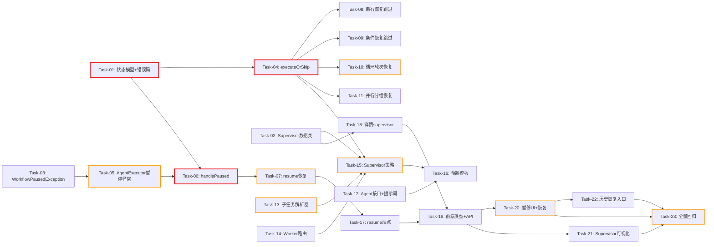

# 开发任务计划: 应用编排层 P3（Supervisor + 断点续执行 + 可视化增强）

## 0. 任务概览 (Task Overview)

* **总任务数**: 23 个
* **预计总工时**: 815 分钟（约 13.6 小时）
* **开发方法**: TDD（测试驱动开发）- 每个任务按 Red-Green-Refactor 循环执行
* **关键里程碑**:
  * 核心模型 + 恢复基础设施完成：Task-01 ~ Task-04（约 105m）
  * 断点续执行后端完成：Task-05 ~ Task-11（约 285m）
  * Supervisor 编排完成：Task-12 ~ Task-16（约 200m）
  * Web 层完成：Task-17 ~ Task-18（约 65m）
  * 前端完成：Task-19 ~ Task-22（约 180m）
  * 集成验证完成：Task-23（约 50m）
* **风险任务**: Task-05（重试耗尽行为变更回归）, Task-07（循环暂停-恢复）, Task-10（LOOP 轮次重放）, Task-13（LLM 输出容错解析）, Task-15（Supervisor 编排核心）, Task-20（前端恢复流切换）, Task-23（全量回归）
* **阻塞任务**: Task-01（PAUSED 状态模型）, Task-04（executeOrSkip 恢复基础设施）, Task-05（WorkflowPausedException 抛出点）, Task-06（handlePaused 暂停机制）, Task-07（resume 恢复机制）, Task-15（Supervisor 策略主流程）
* **Mock 说明**: 技术方案无 Mock 实现（后端先行、前后端同步实现真实接口），跳过 Mock 对接阶段

### 依赖关系图



### 可并行任务组

| 并行组 | 可同时执行的任务 | 说明 |
| :--- | :--- | :--- |
| 并行组 1 | Task-01 + Task-02 + Task-03 | 状态模型、Supervisor 数据类、暂停异常互不依赖 |
| 并行组 2 | Task-08 + Task-09 + Task-10 + Task-11 | 四个既有策略的恢复跳过接入互不依赖，仅依赖 Task-04 的 executeOrSkip |
| 并行组 3 | Task-12 + Task-13 + Task-14 | Agent 接口/提示词、子任务解析器、Worker 路由互不依赖 |
| 并行组 4 | Task-17 + Task-18 | resume 端点与模板详情 supervisor 结构互不依赖 |
| 并行组 5 | Task-20 + Task-21 | 暂停 UI 与 Supervisor 子任务可视化同组件不同功能块（注意文件冲突，建议串行或分区编辑） |

## 1. 准备工作 (Preparation)

- [x] **Prep-01**: 确认功能分支
    * 说明：当前在 main 分支，可直接开发（项目为学习示例项目，与 P1/P2 一致）
    * 验证：分支无冲突
- [x] **Prep-02**: 确认 P2 已交付基线
    * 说明：确认 4 个策略（Sequential/Parallel/Conditional/Loop）+ 策略模式三层架构 + 前端页面已交付且测试全部通过；确认上轮 BUG 修复（三模板初始输入传递）已合入
    * 验证：`agent-demo-app` 现有测试全部通过
- [x] **Prep-03**: 确认测试环境就绪
    * 说明：JUnit 5 + Mockito 已配置；注意沙箱环境下 Maven 需 `-o` 离线模式 + `requires_approval` 运行
    * 验证：能成功运行 agent-demo-app 现有测试套件

## 2. 开发任务 (Development Tasks)

> 按依赖顺序排列，每个任务按 TDD 循环执行：RED（写测试）-> GREEN（写实现）-> REFACTOR（重构）
>
> **项目技术栈提示**：Java 17 + Spring Boot 3.2.5 + Lombok + JUnit 5 + Mockito + 构造器注入；前端 Vue 3 + TypeScript + Vite
>
> **架构说明（P3 核心）**：延续 P2 策略模式三层分离。P3 两条主线：① Supervisor 层级编排（新增第 5 个策略，OCP 零修改协调层）② 断点续执行（确定性重放 + 跳过已完成，横切 AgentExecutor + 5 策略 + 协调层）

### 阶段一：核心模型与基础设施 (Core Model & Infrastructure)

> **阶段完成标准**: PAUSED 状态与 5507 错误码可用，Supervisor 数据类可构建，WorkflowPausedException 可抛出且兼容 BusinessException，executeOrSkip 恢复基础设施就绪

- [x] **Task-01**: 🔒 状态模型与错误码扩展
    * **通俗解释**: 做完这步后，工作流就多了一种"中场休息"状态--遇到故障时不再直接宣告失败，而是进入"暂停待恢复"状态，随时可以接着跑。
    * **说明**: `WorkflowExecutionStatus` 新增 `PAUSED`；`WorkflowExecution` 新增 `context` 字段 + `pause()/resumeFromPause()/attachContext()` 方法；`ErrorCode`（common 模块）新增 `WORKFLOW_NOT_RESUMABLE(5507, "工作流当前状态不支持恢复")`
    * **涉及文件**:
        * `agent-demo-app/src/main/java/com/agentdemo/app/core/WorkflowExecutionStatus.java`（修改）
        * `agent-demo-app/src/main/java/com/agentdemo/app/core/WorkflowExecution.java`（修改）
        * `agent-demo-common/src/main/java/com/agentdemo/common/exception/ErrorCode.java`（修改）
    * **测试文件**: `agent-demo-app/src/test/java/com/agentdemo/app/core/WorkflowExecutionTest.java`（扩展）
    * **参考**: 技术方案 Sec 4.1.2
    * **对应AC**: AC-016（前置）
    * **预估工时**: 30m
    * **依赖**: 无
    * **验证标准**（TDD RED 阶段的测试依据）:
        - [ ] `WorkflowExecutionStatus.PAUSED` 枚举存在且 `name()` 返回 "PAUSED"
        - [ ] RUNNING 状态的 execution 调用 `pause("研究 Agent", "超时")` 后 `getStatus()` 为 PAUSED，`getEndTime()` 为 null（暂停非终态）
        - [ ] PAUSED 状态的 execution 调用 `resumeFromPause()` 后 `getStatus()` 为 RUNNING，`getStartTime()` 保持原值不变
        - [ ] `attachContext(ctx)` 后 `getContext()` 返回同一 ctx 实例；再次 attach 不同 ctx 覆盖
        - [ ] `ErrorCode.WORKFLOW_NOT_RESUMABLE.getCode()` 返回 5507

- [x] **Task-02**: 创建 Supervisor 数据类并扩展 WorkflowTemplate
    * **通俗解释**: 做完这步后，工作流模板的"设计图"上就能画出"主管 + 多个下属员工"的组织架构了，主管负责拆活派活，员工各自干活。
    * **说明**: 创建 `SupervisorDefinition`（planAgent + workers + summarizeAgent + maxSubtasks）与 `Subtask`（id + description + agent）数据类；`WorkflowTemplate` 新增 `supervisor` 字段（@Builder 可空，SUPERVISOR 模式使用）
    * **涉及文件**:
        * `agent-demo-app/src/main/java/com/agentdemo/app/core/SupervisorDefinition.java`（新增）
        * `agent-demo-app/src/main/java/com/agentdemo/app/core/Subtask.java`（新增）
        * `agent-demo-app/src/main/java/com/agentdemo/app/core/WorkflowTemplate.java`（修改）
    * **测试文件**: `agent-demo-app/src/test/java/com/agentdemo/app/core/SupervisorDefinitionTest.java`（新增）
    * **参考**: 技术方案 Sec 4.1.1
    * **对应AC**: AC-007（前置）
    * **预估工时**: 20m
    * **依赖**: 无
    * **验证标准**（TDD RED 阶段的测试依据）:
        - [ ] `SupervisorDefinition.builder().planAgent(p).workers(List.of(w1,w2)).summarizeAgent(s).maxSubtasks(5).build()` 各字段可读取
        - [ ] `Subtask.builder().id(1).description("调研").agent("研究").build()` 各字段可读取
        - [ ] `WorkflowTemplate.builder()...supervisor(sup).build()` 后 `getSupervisor()` 返回 sup；不设置时为 null
        - [ ] 既有模板（P1/P2 的 4 个）构建不受影响（supervisor 为 null，回归既有 WorkflowTemplatesTest）

- [x] **Task-03**: 创建 WorkflowPausedException
    * **通俗解释**: 做完这步后，系统内部就有了一种专门的"中场休息信号"，员工（Agent）干活失败时发这个信号，主管（协调层）收到后就知道该暂停而不是宣告失败。
    * **说明**: 在 service 包创建 `WorkflowPausedException extends BusinessException`，携带 `failedAgentName` 与 `failedIndex`，ErrorCode 复用 `WORKFLOW_EXECUTION_FAILED`
    * **涉及文件**: `agent-demo-app/src/main/java/com/agentdemo/app/service/WorkflowPausedException.java`（新增）
    * **测试文件**: `agent-demo-app/src/test/java/com/agentdemo/app/service/WorkflowPausedExceptionTest.java`（新增）
    * **参考**: 技术方案 Sec 4.3.1
    * **对应AC**: AC-016（前置）
    * **预估工时**: 15m
    * **依赖**: 无
    * **验证标准**（TDD RED 阶段的测试依据）:
        - [ ] 构造后 `getFailedAgentName()`/`getFailedIndex()` 返回构造值
        - [ ] `assertThrows(BusinessException.class, () -> {throw new WorkflowPausedException(...)})` 通过（子类兼容，保证 P1/P2 catch 分支与既有测试不受影响）
        - [ ] `getCode()` 返回 `WORKFLOW_EXECUTION_FAILED` 的 code（5503）

- [x] **Task-04**: 🔒 AbstractExecutionStrategy 恢复基础设施
    * **通俗解释**: 做完这步后，所有工作流模式都获得了一个共同能力：重新跑一遍流程时，能认出"这步我之前已经干过了"，直接用上次的成果跳过去，不浪费时间和钱。
    * **说明**: `AbstractExecutionStrategy` 新增三个成员：`attachOrNewContext(execution)`（取已有 ctx 或新建并挂载）、静态 `resumeKey(iteration, agentName)`（统一 "done:{iteration}:{agentName}" 规则）、`executeOrSkip(...)`（查恢复 key 命中则推 step_skipped 返回历史输出，否则执行 Agent 并写恢复 key）
    * **涉及文件**: `agent-demo-app/src/main/java/com/agentdemo/app/strategy/AbstractExecutionStrategy.java`（修改）
    * **测试文件**: `agent-demo-app/src/test/java/com/agentdemo/app/strategy/AbstractExecutionStrategyTest.java`（新增或扩展）
    * **参考**: 技术方案 Sec 4.3.3
    * **对应AC**: AC-017（前置）
    * **预估工时**: 40m
    * **依赖**: Task-01（WorkflowExecution.context）
    * **验证标准**（TDD RED 阶段的测试依据）:
        - [ ] `attachOrNewContext`: execution 无 context 时新建并挂载（两次调用返回同一实例）；已有 context 时直接返回不覆盖
        - [ ] `resumeKey(0, "研究 Agent")` 返回 "done:0:研究 Agent"；`resumeKey(2, "评分 Agent")` 返回 "done:2:评分 Agent"
        - [ ] `executeOrSkip`: ctx 中已有 "done:0:A" -> 不调用 agentExecutor.executeWithRetry，返回历史值，且 SseEmitter 收到 step_skipped 事件（agentIndex/agentName/reason="断点恢复"）
        - [ ] `executeOrSkip`: ctx 无 key -> 调用 executeWithRetry 返回输出，且 ctx 中写入 key、lastOutput 更新、agentOutputs 记录
        - [ ] `executeOrSkip`: 空字符串输出（key 存在值为 ""）也视为已完成跳过（AC-021 空输出兼容）
        - [ ] `executeOrSkip`: cancelFlag 为 true 时抛 WorkflowCancelledException（跳过判定之前）

### 阶段二：断点续执行核心（后端） (Resumable Execution - Backend)

> **阶段完成标准**: Agent 重试耗尽后工作流进入 PAUSED 并保存快照；resume API 可从断点恢复；4 个既有策略全部支持恢复跳过；相关单元测试全部通过

- [x] **Task-05**: ⚠️ AgentExecutor 重试耗尽抛 WorkflowPausedException
    * **通俗解释**: 做完这步后，员工（Agent）多次重试仍然失败时，发出的信号从"我失败了，全盘结束"变成"我卡住了，请暂停等我恢复"。
    * **说明**: 修改 `AgentExecutor.executeWithRetry` 的重试耗尽分支：`BusinessException` 改为 `WorkflowPausedException`（携带 agentDef.getName() 与 agentIndex）；既有测试兼容性验证（assertThrows(BusinessException) 仍通过）
    * **涉及文件**: `agent-demo-app/src/main/java/com/agentdemo/app/execution/AgentExecutor.java`（修改）
    * **测试文件**: `agent-demo-app/src/test/java/com/agentdemo/app/execution/AgentExecutorTest.java`（扩展）
    * **参考**: 技术方案 Sec 4.3.1
    * **对应AC**: AC-016
    * **预估工时**: 30m
    * **依赖**: Task-03
    * **风险标注**: 行为变更点，P1/P2 依赖 FAILED 语义的测试可能需在 Task-23 统一适配；本任务先验证 AgentExecutor 层兼容
    * **验证标准**（TDD RED 阶段的测试依据）:
        - [ ] maxRetries=1 且 Agent 执行持续抛异常：第 2 次失败后抛出 `WorkflowPausedException`（而非裸 BusinessException）
        - [ ] 抛出的异常 `getFailedAgentName()` = Agent 名，`getFailedIndex()` = 传入的 agentIndex
        - [ ] 异常 message 包含根因信息（延续上轮 BUG 修复："Agent 执行失败: {name}: {cause}"）
        - [ ] 既有测试 `executeWithRetry_exhaustedRetries_shouldThrowBusinessException` 不修改断言仍通过（子类兼容证明）
        - [ ] 重试期间每次失败仍推送 step_retry 事件，耗尽时推送 step_error 事件（行为不变）

- [x] **Task-06**: 🔒 WorkflowExecutionService 暂停处理与快照保存
    * **通俗解释**: 做完这步后，主管（协调层）收到"中场休息信号"时，会把当前进度、原始任务、所用模型都记在小本本上（内存快照），并通知前端"已暂停，可以恢复"。
    * **说明**: 新增 `ResumableExecutionState`（template/params/modelId）；`WorkflowExecutionService.execute` 异步块新增 `catch (WorkflowPausedException)` 分支（置于 BusinessException 之前）-> `handlePaused`：状态 PAUSED + resumableStates.put + workflow_paused 事件（含 failedAgent/failedIndex/error/resumable=true）+ emitter.complete()
    * **涉及文件**:
        * `agent-demo-app/src/main/java/com/agentdemo/app/service/ResumableExecutionState.java`（新增）
        * `agent-demo-app/src/main/java/com/agentdemo/app/service/WorkflowExecutionService.java`（修改）
    * **测试文件**: `agent-demo-app/src/test/java/com/agentdemo/app/service/WorkflowExecutionServiceTest.java`（扩展）
    * **参考**: 技术方案 Sec 4.3.2
    * **对应AC**: AC-016
    * **预估工时**: 50m
    * **依赖**: Task-01, Task-05
    * **验证标准**（TDD RED 阶段的测试依据）:
        - [ ] execute 时策略抛 WorkflowPausedException("研究 Agent", 1, "...")：execution 状态为 PAUSED（不再是 FAILED），endTime 为 null
        - [ ] SSE 流收到 workflow_paused 事件，data 含 executionId/failedAgent="研究 Agent"/failedIndex=1/error/resumable=true
        - [ ] 快照已保存：再次触发（通过 resume 校验间接验证，或暴露包内可见 getter）resumableStates 含该 executionId 且记录原 template/params/modelId
        - [ ] 暂停后 emitter 已 complete（原 SSE 流关闭）
        - [ ] 非暂停类失败（如策略抛普通 RuntimeException）仍走 handleFailure -> FAILED（分流正确）
        - [ ] 配置类失败（buildAgent 抛 WORKFLOW_MODEL_NOT_FOUND）仍为 FAILED 终态

- [x] **Task-07**: ⚠️ WorkflowExecutionService resume 恢复执行
    * **通俗解释**: 做完这步后，用户点"恢复执行"按钮，系统就会拿出小本本上的记录，从中断的地方继续干活，之前干完的步骤直接跳过，不再花冤枉钱。
    * **说明**: 实现 `resume(executionId, emitter)`：校验存在/PAUSED/快照存在（否则 WORKFLOW_NOT_RESUMABLE 5507）-> resumeFromPause + 重建 cancelFlag -> 异步重放 strategy.execute（沿用快照 template/params/modelId，ctx 从 execution.context 恢复）-> 成功 complete+清理快照；再次暂停走 handlePaused（循环恢复）；terminate 补充快照清理
    * **涉及文件**: `agent-demo-app/src/main/java/com/agentdemo/app/service/WorkflowExecutionService.java`（修改）
    * **测试文件**: `agent-demo-app/src/test/java/com/agentdemo/app/service/WorkflowExecutionServiceTest.java`（扩展）
    * **参考**: 技术方案 Sec 4.3.2
    * **对应AC**: AC-017
    * **预估工时**: 60m
    * **依赖**: Task-06
    * **风险标注**: 循环暂停-恢复语义（恢复后再失败再暂停）；异步测试需同步等待技巧（CompletableFuture join/超时轮询）
    * **验证标准**（TDD RED 阶段的测试依据）:
        - [ ] resume 不存在的 executionId 抛 WORKFLOW_NOT_FOUND(5500)
        - [ ] resume COMPLETED 状态的执行抛 WORKFLOW_NOT_RESUMABLE(5507)，message 含 "COMPLETED"
        - [ ] resume PAUSED 且有快照：状态变 RUNNING，策略 execute 被调用且参数为快照中的 template/params/modelId
        - [ ] 恢复成功（策略返回结果）：状态 COMPLETED，快照被清理（再次 resume 抛 5507）
        - [ ] 恢复中策略再次抛 WorkflowPausedException：状态再次 PAUSED，快照仍在（可再次恢复）
        - [ ] PAUSED 状态调用 terminate：状态 TERMINATED，快照清理
        - [ ] 恢复执行传入的 execution 上 ctx 非空（策略可从 execution.getContext() 拿到暂停前状态）

- [x] **Task-08**: SequentialExecutionStrategy 恢复跳过接入
    * **通俗解释**: 做完这步后，"串行流水线"模式的工作流中断后恢复时，前面已经完成的工序直接亮"跳过"灯，从断掉的工序继续。
    * **说明**: 策略首行改用 `attachOrNewContext`；for 循环内改用 `executeOrSkip(agent, input, 0, ...)`（iteration=0）
    * **涉及文件**: `agent-demo-app/src/main/java/com/agentdemo/app/strategy/SequentialExecutionStrategy.java`（修改）
    * **测试文件**: `agent-demo-app/src/test/java/com/agentdemo/app/strategy/SequentialExecutionStrategyTest.java`（扩展）
    * **参考**: 技术方案 Sec 4.3.3
    * **对应AC**: AC-017
    * **预估工时**: 30m
    * **依赖**: Task-04
    * **验证标准**（TDD RED 阶段的测试依据）:
        - [ ] 首次执行（execution.context 为空）行为与 P2 完全一致：3 个 Agent 均真实执行，ctx 写入 done:0:{name} keys（既有测试回归通过）
        - [ ] 恢复场景：ctx 预置 done:0:研究 Agent="历史输出1"，策略执行时研究 Agent 不被调用（verify never），emit step_skipped
        - [ ] 恢复场景：跳过的输出作为下一 Agent 输入（分析 Agent 收到 "历史输出1" 而非重新执行研究）
        - [ ] 恢复场景：断点后的 Agent（无 key）正常执行

- [x] **Task-09**: ConditionalExecutionStrategy 恢复跳过接入
    * **通俗解释**: 做完这步后，"智能分岔路"模式的工作流恢复时，会沿着上次的同一条岔路继续，岔路上已完成的步骤直接跳过。
    * **说明**: 策略首行 attachOrNewContext；`executeAgentList` 内部执行点改用 `executeOrSkip`（iteration=0）；分支谓词基于恢复 ctx 重放（确定性谓词，结果与首次一致）
    * **涉及文件**:
        * `agent-demo-app/src/main/java/com/agentdemo/app/strategy/ConditionalExecutionStrategy.java`（修改）
        * `agent-demo-app/src/main/java/com/agentdemo/app/strategy/AbstractExecutionStrategy.java`（如 executeAgentList 在基类则修改基类）
    * **测试文件**: `agent-demo-app/src/test/java/com/agentdemo/app/strategy/ConditionalExecutionStrategyTest.java`（扩展）
    * **参考**: 技术方案 Sec 4.3.3
    * **对应AC**: AC-017
    * **预估工时**: 30m
    * **依赖**: Task-04
    * **验证标准**（TDD RED 阶段的测试依据）:
        - [ ] 首次执行行为与 P2 一致（既有测试回归通过，含上轮 BUG 修复的初始输入传递测试）
        - [ ] 恢复场景：ctx 预置 done:0:简单回答 Agent="快答历史"，且 question 参数满足简单分支条件：简单 Agent 不被调用、emit step_skipped、直接返回历史输出
        - [ ] 恢复场景：分支条件重放正确（ctx 恢复后 isComplexQuestion 判定与首次一致，走原分支）
        - [ ] 首次执行时 ctx 写入 done keys（为下次恢复做准备）

- [x] **Task-10**: ⚠️ LoopExecutionStrategy 轮次恢复
    * **通俗解释**: 做完这步后，"反复打磨"模式的工作流恢复时，之前打磨完的轮次整轮跳过，只在断掉的那一轮里跳过已完成的工序，接着打磨。
    * **说明**: 策略首行 attachOrNewContext；轮次重放：`pausedIter = ctx.getIterationCount()`，iteration < pausedIter 的完整历史轮整轮跳过（agent 全跳过 + 不评估 exitCondition + 不 incrementIteration）；暂停轮（== pausedIter）轮内 agent 级跳过（executeOrSkip iteration=当前轮）；新轮（> pausedIter）正常执行
    * **涉及文件**: `agent-demo-app/src/main/java/com/agentdemo/app/strategy/LoopExecutionStrategy.java`（修改）
    * **测试文件**: `agent-demo-app/src/test/java/com/agentdemo/app/strategy/LoopExecutionStrategyTest.java`（扩展）
    * **参考**: 技术方案 Sec 4.3.3（LOOP 恢复重放伪代码）
    * **对应AC**: AC-017
    * **预估工时**: 45m
    * **依赖**: Task-04
    * **风险标注**: exitCondition 误判提前退出是核心风险；iterationCount 恢复时不得重复递增
    * **验证标准**（TDD RED 阶段的测试依据）:
        - [ ] 首次执行行为与 P2 一致（既有测试回归通过，含初始输入传递测试）
        - [ ] 恢复场景"第 2 轮修订 Agent 处暂停"：ctx 预置 iterationCount=2、done:1:评分 Agent、done:1:修订 Agent、done:2:评分 Agent（第 2 轮评分已完成）：恢复执行时第 1 轮整轮跳过（2 个 step_skipped，无 LLM 调用）、第 2 轮评分跳过、仅修订 Agent 真实执行
        - [ ] 历史完整轮不评估 exitCondition：即使恢复后 ctx 状态已满足退出条件，仍继续执行暂停轮及后续轮（不提前 break）
        - [ ] iterationCount 恢复正确：暂停轮不再重复 increment（最终 iterationCount 与实际执行轮次一致）
        - [ ] loop_iteration 事件在恢复重放时按轮次正常推送（前端进度完整）

- [x] **Task-11**: ParallelExecutionStrategy 分组恢复跳过
    * **通俗解释**: 做完这步后，"多路同时审查"模式的工作流恢复时，已经审完的分组整组跳过，半途而废的分组只补做没做完的工序。
    * **说明**: 策略首行 attachOrNewContext；`executeGroup` 内组内 agent 执行点改用 `executeOrSkip`（iteration=0）；全跳过分组仍推 group_start/group_complete（前端进度完整）
    * **涉及文件**: `agent-demo-app/src/main/java/com/agentdemo/app/strategy/ParallelExecutionStrategy.java`（修改）
    * **测试文件**: `agent-demo-app/src/test/java/com/agentdemo/app/strategy/ParallelExecutionStrategyTest.java`（扩展）
    * **参考**: 技术方案 Sec 4.3.3
    * **对应AC**: AC-017
    * **预估工时**: 40m
    * **依赖**: Task-04
    * **验证标准**（TDD RED 阶段的测试依据）:
        - [ ] 首次执行行为与 P2 一致（既有测试回归通过，含初始输入传递测试）
        - [ ] 恢复场景"安全分组完成、性能分组第 1 个 Agent 完成"：ctx 预置 done:0:安全 Agent：安全分组 agent 不被调用（step_skipped）但仍推 group_complete；性能组已完成 agent 跳过、未完成 agent 执行
        - [ ] 恢复时汇总 Agent 接收的历史输出拼接正确（跳过分组的历史输出参与汇总）
        - [ ] 并发分组同时读 ctx 恢复 key 无异常（ConcurrentHashMap 保证）

### 阶段三：Supervisor 层级编排 (Supervisor Orchestration)

> **阶段完成标准**: Supervisor 策略可执行"拆解->路由->依次执行->汇总"全流程，SSE 3 个新事件推送正确，预置模板注册且主控/Worker 模型独立配置

- [x] **Task-12**: Supervisor Agent 接口与提示词文件
    * **通俗解释**: 做完这步后，系统里就多了两个新角色：一个"任务拆解主管"（把大任务切成小任务清单）和一个"总结主管"（把各组员的成果汇总成报告），并配好了各自的岗位说明书。
    * **说明**: 创建 `SupervisorPlanAgent`（execute(@V("task"))）、`SupervisorSummarizeAgent`（execute(@V("results"))）接口（单 String + TokenStream 固定模式）；创建提示词 `app-supervisor-plan.txt`（含 Worker 清单、JSON 输出格式约束、maxSubtasks 约束、示例）与 `app-supervisor-summarize.txt`
    * **涉及文件**:
        * `agent-demo-app/src/main/java/com/agentdemo/app/template/SupervisorPlanAgent.java`（新增）
        * `agent-demo-app/src/main/java/com/agentdemo/app/template/SupervisorSummarizeAgent.java`（新增）
        * `agent-demo-app/src/main/resources/prompts/scenarios/app-supervisor-plan.txt`（新增）
        * `agent-demo-app/src/main/resources/prompts/scenarios/app-supervisor-summarize.txt`（新增）
    * **测试文件**: `agent-demo-app/src/test/java/com/agentdemo/app/template/SupervisorAgentsTest.java`（新增，接口注解校验）
    * **参考**: 技术方案 Sec 4.4
    * **对应AC**: AC-007
    * **预估工时**: 25m
    * **依赖**: 无
    * **验证标准**（TDD RED 阶段的测试依据）:
        - [ ] `SupervisorPlanAgent.execute` 方法有 @Agent 注解，参数有 @V("task")，返回 TokenStream（反射校验，与既有 9 接口同模式）
        - [ ] `SupervisorSummarizeAgent.execute` 方法有 @Agent 注解，参数有 @V("results")，返回 TokenStream
        - [ ] `app-supervisor-plan.txt` 存在且内容包含：Worker 清单（研究/分析/总结）、JSON 数组格式说明、`{{task}}` 或对应输入占位说明
        - [ ] `app-supervisor-summarize.txt` 存在且非空
        - [ ] 提示词文件可被 PromptTemplateLoader 按场景名加载（沿用既有场景加载机制测试模式）

- [x] **Task-13**: ⚠️ 子任务 JSON 解析器（三层容错）
    * **通俗解释**: 做完这步后，即使 AI 主管交代任务清单时啰嗦（加了代码块标记、前后废话）或超量（拆了太多），系统也能准确听懂并按上限截取。
    * **说明**: 实现静态解析方法（SupervisorExecutionStrategy 私有或独立工具类 `SubtaskParser`）：① 剥离 markdown 代码块（提取最后一对 ``` 之间内容）② 提取首个 `[` 到最后一个 `]` 区间 ③ Jackson 解析为 List\<Subtask\>（忽略未知字段）④ 过滤 description 空项、id 缺失按下标补齐 ⑤ 超 maxSubtasks 截断 ⑥ 空列表抛 BusinessException
    * **涉及文件**: `agent-demo-app/src/main/java/com/agentdemo/app/strategy/SubtaskParser.java`（新增）或策略内私有方法
    * **测试文件**: `agent-demo-app/src/test/java/com/agentdemo/app/strategy/SubtaskParserTest.java`（新增）
    * **参考**: 技术方案 Sec 4.2.1
    * **对应AC**: AC-007
    * **预估工时**: 45m
    * **依赖**: Task-02
    * **风险标注**: LLM 输出格式漂移是最大不确定性；测试矩阵需覆盖典型变体
    * **验证标准**（TDD RED 阶段的测试依据）:
        - [ ] 标准输入 `[{"id":1,"description":"调研分类算法","agent":"研究"}]` 解析出 1 个 Subtask（各字段正确）
        - [ ] markdown 包裹 "```json\n[...]\n```" 解析成功
        - [ ] 前后缀噪声 "好的，以下是拆解：\n[...]\n希望有帮助" 提取区间解析成功
        - [ ] 7 个子任务 maxSubtasks=5 -> 截断为前 5 个
        - [ ] description 为空项被过滤；id 缺失按下标补齐（1,2,3...）
        - [ ] 输入无 `[` 或 `]`、空数组 `[]`、纯文本 -> 抛 BusinessException（message 含"无法解析"）
        - [ ] JSON 含未知字段（如 {"id":1,"description":"x","agent":"研究","priority":1}）-> 忽略未知字段解析成功

- [x] **Task-14**: Worker 三级路由算法
    * **通俗解释**: 做完这步后，即使 AI 主管点名员工时叫法不标准（"研究 Agent" vs "研究"），系统也能对号入座；实在对不上就派第一个员工顶上，绝不撂挑子。
    * **说明**: 实现路由方法：① 精确匹配（name.equals）② 包含匹配（worker.name 包含 agentName 或反之）③ 兜底第一个 worker + log.warn + 返回 routed 标记（供 SSE 事件用）
    * **涉及文件**: `agent-demo-app/src/main/java/com/agentdemo/app/strategy/SupervisorExecutionStrategy.java`（新增，本任务先建骨架类含路由方法）
    * **测试文件**: `agent-demo-app/src/test/java/com/agentdemo/app/strategy/SupervisorExecutionStrategyTest.java`（新增）
    * **参考**: 技术方案 Sec 4.2.2
    * **对应AC**: AC-007
    * **预估工时**: 30m
    * **依赖**: Task-02
    * **验证标准**（TDD RED 阶段的测试依据）:
        - [ ] workers=[研究,分析,总结]，agent="研究" -> 精确命中"研究"
        - [ ] agent="研究 Agent" -> 包含命中"研究"
        - [ ] agent="不存在的角色" -> 兜底返回第一个"研究"
        - [ ] agent 为 null 或空串 -> 兜底第一个
        - [ ] 兜底时输出 WARN 日志（可验证行为或仅代码评审确认）
        - [ ] 路由方法返回结构能区分精确/包含命中与兜底（routed 布尔标记）

- [x] **Task-15**: ⚠️ SupervisorExecutionStrategy 主流程
    * **通俗解释**: 做完这步后，"任务拆解-执行-汇总"工作流真正能跑了：主管拆活 -> 按名单派活给员工 -> 员工依次干完 -> 主管汇总成最终报告，全过程在前端看得见。
    * **说明**: 实现完整 execute：校验（sup/workers/maxSubtasks）-> 阶段一主控拆解（planWithRetry：调用+解析包装重试；恢复时 ctx 有 supervisor:plan 则跳过）-> supervisor_plan 事件 -> 阶段二子任务循环（supervisor_dispatch 事件 + executeWithRetry + ctx.write("subtask:"+i) + 恢复跳过）-> 阶段三汇总（supervisor_summary 事件 + executeWithRetry，无恢复 key）-> 返回 finalResult；@Component + supportedMode()=SUPERVISOR
    * **涉及文件**: `agent-demo-app/src/main/java/com/agentdemo/app/strategy/SupervisorExecutionStrategy.java`（修改，补全主流程）
    * **测试文件**: `agent-demo-app/src/test/java/com/agentdemo/app/strategy/SupervisorExecutionStrategyTest.java`（扩展）
    * **参考**: 技术方案 Sec 4.2（主流程伪代码 + 注释修正点）
    * **对应AC**: AC-007
    * **预估工时**: 70m
    * **依赖**: Task-04, Task-13, Task-14
    * **风险标注**: 编排核心；注意技术方案 4.2 注：不写 subtask 占位 null（恢复判定以 read!=null 为准）；agentIndex 分配 plan=0/子任务 1..N/汇总 N+1
    * **验证标准**（TDD RED 阶段的测试依据）:
        - [ ] 正常流程：plan 输出 2 个子任务 JSON -> 2 个子任务依次执行（Worker 各自被调用）-> 汇总 Agent 收到含 2 个子任务结果的文本 -> 返回汇总输出
        - [ ] supervisor_plan 事件 data 含 subtasks 数组（id/description/agent）与 totalSubtasks
        - [ ] 每个子任务执行前推送 supervisor_dispatch 事件（subtaskIndex/totalSubtasks/description/agentName/routed）
        - [ ] 汇总前推送 supervisor_summary 事件（subtaskCount）
        - [ ] 子任务输入格式含原始任务与子任务描述（"原始任务：...你负责的子任务：..."）
        - [ ] plan 解析失败重试：第 1 次返回非 JSON、第 2 次返回合法 JSON -> 最终成功（plan 被调用 2 次）
        - [ ] plan 重试耗尽（全部非 JSON）-> 抛 WorkflowPausedException（经 executeWithRetry 路径或策略层包装）
        - [ ] 恢复场景：ctx 预置 supervisor:plan（子任务列表）+ subtask:1（已完成）-> plan 不重新调用（step_skipped）、子任务 1 跳过、子任务 2 执行、汇总执行
        - [ ] Worker 池为空或 sup 为 null -> 抛 BusinessException（"未配置 Worker 池"）
        - [ ] supportedMode() 返回 SUPERVISOR；@Component 注册后协调层 strategies Map 自动包含（策略模式 OCP 验证）

- [x] **Task-16**: TaskBreakdownSupervisorTemplate 预置模板
    * **通俗解释**: 做完这步后，用户在前端模板列表里就能看到"任务拆解-执行-汇总"这个新模板，点开还能看到主管和员工们各自用的 AI 模型。
    * **说明**: 创建预置模板 `task-breakdown-supervisor`（SUPERVISOR 模式，参数 task）：planAgent=SupervisorPlanAgent + pro 模型；workers=[ResearchAgent/AnalysisAgent/SummaryAgent 各 lite 模型]（复用 P1 接口）；summarizeAgent=SupervisorSummarizeAgent + pro 模型；maxSubtasks=5
    * **涉及文件**: `agent-demo-app/src/main/java/com/agentdemo/app/template/TaskBreakdownSupervisorTemplate.java`（新增）
    * **测试文件**: `agent-demo-app/src/test/java/com/agentdemo/app/template/WorkflowTemplatesTest.java`（扩展）
    * **参考**: 技术方案 Sec 4.4
    * **对应AC**: AC-007, AC-031
    * **预估工时**: 30m
    * **依赖**: Task-12, Task-15
    * **验证标准**（TDD RED 阶段的测试依据）:
        - [ ] 模板 ID 为 "task-breakdown-supervisor"，mode 为 SUPERVISOR，名称与描述非空
        - [ ] `supervisor.planAgent.modelId` 为 pro 模型 ID 且 interfaceClass=SupervisorPlanAgent（AC-031）
        - [ ] `supervisor.workers` 含 3 个 Worker（研究/分析/总结）且全部为 lite 模型 ID（AC-031，与主控不同）
        - [ ] `supervisor.summarizeAgent.modelId` 为 pro 模型 ID
        - [ ] maxSubtasks=5；参数定义含 task（string, required）
        - [ ] Worker 的 interfaceClass 分别为 ResearchAgent/AnalysisAgent/SummaryAgent（复用 P1）
        - [ ] 模板在 WorkflowTemplateRegistry 注册后可按 ID 查询（列表测试含 5 个模板）

### 阶段四：Web 层 (Web Layer)

> **阶段完成标准**: resume 端点返回 SSE 流并正确分流错误码；模板详情接口返回 supervisor 结构

- [x] **Task-17**: 🔒 WorkflowController resume 端点
    * **通俗解释**: 做完这步后，前端就有了正式的"恢复执行"接口地址，点恢复按钮就能拿到一条新的事件流，接着看工作流继续跑。
    * **说明**: 新增 `POST /api/app/workflows/executions/{executionId}/resume` 返回 SseEmitter（300s 超时）；调用 service.resume；异常经 GlobalExceptionHandler 转 JSON（5500/5507）
    * **涉及文件**: `agent-demo-web/src/main/java/com/agentdemo/web/controller/WorkflowController.java`（修改）
    * **测试文件**: `agent-demo-web/src/test/java/com/agentdemo/web/controller/WorkflowControllerTest.java`（扩展）
    * **参考**: 技术方案 Sec 2.2 接口 1
    * **对应AC**: AC-017
    * **预估工时**: 35m
    * **依赖**: Task-07
    * **验证标准**（TDD RED 阶段的测试依据）:
        - [ ] POST /executions/{id}/resume 对 PAUSED 执行返回 200 + SseEmitter（Content-Type text/event-stream）
        - [ ] executionId 不存在返回 JSON 错误（code=5500 WORKFLOW_NOT_FOUND）
        - [ ] 对 COMPLETED 执行 resume 返回 JSON 错误（code=5507 WORKFLOW_NOT_RESUMABLE，message 含 "COMPLETED"）
        - [ ] service.resume 被调用且参数为路径 executionId
        - [ ] SSE 超时/错误回调已注册（onTimeout/onError 触发 cancel，与 execute 端点同模式）

- [x] **Task-18**: WorkflowDetailResponse supervisor 结构
    * **通俗解释**: 做完这步后，前端模板详情页就能展示新模板的组织架构图：谁是主管、有哪些员工、各自用什么模型、最多拆几个任务。
    * **说明**: `WorkflowDetailResponse` 新增 `SupervisorItem` 内部类（maxSubtasks/planAgent/workers/summarizeAgent）与 supervisor 字段；`getTemplate` 填充 SUPERVISOR 模板结构（非 SUPERVISOR 模式为 null）
    * **涉及文件**:
        * `agent-demo-web/src/main/java/com/agentdemo/web/dto/WorkflowDetailResponse.java`（修改）
        * `agent-demo-web/src/main/java/com/agentdemo/web/controller/WorkflowController.java`（修改，填充逻辑）
    * **测试文件**: `agent-demo-web/src/test/java/com/agentdemo/web/controller/WorkflowControllerTest.java`（扩展）
    * **参考**: 技术方案 Sec 2.2 接口 2
    * **对应AC**: AC-002（模板详情结构）
    * **预估工时**: 30m
    * **依赖**: Task-02, Task-16
    * **验证标准**（TDD RED 阶段的测试依据）:
        - [ ] GET /workflows/task-breakdown-supervisor 返回 supervisor 对象：maxSubtasks=5、planAgent/workers[3]/summarizeAgent 各含 name/modelId
        - [ ] workers 数组长度 3 且 modelId 为 lite
        - [ ] GET 既有 4 个模板（SEQUENTIAL/PARALLEL/LOOP/CONDITIONAL）supervisor 为 null（回归）
        - [ ] 既有 P2 结构（parallelGroups/branches/loop）不受影响（回归）

### 阶段五：前端 (Frontend)

> **阶段完成标准**: 5 个新 SSE 事件正确解析；暂停 UI 与恢复流程可用；Supervisor 子任务调度可视化；历史列表 PAUSED 标签与恢复入口可用

- [x] **Task-19**: 🔒 前端类型扩展与 API 封装（含路径参数 BUG 修复）
    * **通俗解释**: 做完这步后，前端就"听懂"了后端新说的 5 种事件（暂停/跳过/拆解完成/派活/汇总），并且拿到了"恢复执行"的调用方法；顺带修好了一个接口路径传参的老毛病。
    * **说明**: `types/index.ts`：WorkflowExecutionStatus + 'PAUSED'、SupervisorSubtask/SupervisorDefinitionItem、5 个新回调；`api/workflow.ts`：新增 streamResume（复用 SSE 解析循环）、handleWorkflowEvent 新增 5 个 case、**修复既有 BUG**（getTemplate/getExecution/terminate 路径参数被误替换为字面量 `$glm-5.3_common`，恢复为模板变量）
    * **涉及文件**:
        * `agent-demo-frontend/src/types/index.ts`（修改）
        * `agent-demo-frontend/src/api/workflow.ts`（修改）
    * **测试文件**: `agent-demo-frontend/src/api/__tests__/workflow.spec.ts`（扩展）
    * **参考**: 技术方案 Sec 4.5.1/4.5.2 + Sec 9 兼容性（路径参数 BUG）
    * **对应AC**: AC-016, AC-017（前端前置）
    * **预估工时**: 45m
    * **依赖**: Task-17, Task-18
    * **风险标注**: 路径参数 BUG 修复后需回归模板详情/终止/状态查询功能（此前这些函数请求的 URL 都是错的）
    * **验证标准**（TDD RED 阶段的测试依据）:
        - [ ] SSE 事件 workflow_paused 解析后调用 onWorkflowPaused 回调，data 字段完整（executionId/failedAgent/failedIndex/error/resumable）
        - [ ] step_skipped/supervisor_plan/supervisor_dispatch/supervisor_summary 分别正确分发到对应回调（data 字段映射正确）
        - [ ] 未知新事件不抛错（default 分支静默，向后兼容）
        - [ ] streamResume 发起 POST 到 /api/app/workflows/executions/{id}/resume 且 body 为空
        - [ ] 修复验证：getTemplate('tpl-a') 请求 URL 为 /api/app/workflows/tpl-a（含真实 id，非字面量）；getExecution/terminate 同理
        - [ ] streamResume 的 AbortSignal 中止行为与 streamExecute 一致

- [x] **Task-20**: ⚠️ WorkflowExecuteView 暂停 UI 与恢复流程
    * **通俗解释**: 做完这步后，工作流卡住时用户能一眼看到是哪步红的，点"恢复执行"就接着跑，点"终止"就放弃，恢复后跳过的步骤显示"已跳过"。
    * **说明**: 暂停状态处理（onWorkflowPaused -> isPaused + 失败步骤红色高亮 + 恢复/终止按钮 + 禁用防重复）；恢复调用 streamResume（输出面板继续追加、进度重建）；onStepSkipped -> 面板"⏭ 已跳过（断点恢复）"态；组件支持 resumeExecutionId prop（挂载自动恢复）
    * **涉及文件**: `agent-demo-frontend/src/components/WorkflowExecuteView.vue`（修改）
    * **测试文件**: `agent-demo-frontend/src/components/__tests__/WorkflowExecuteView.spec.ts`（扩展）
    * **参考**: 技术方案 Sec 4.5.3
    * **对应AC**: AC-016, AC-017
    * **预估工时**: 60m
    * **依赖**: Task-19
    * **风险标注**: SSE 流切换（暂停关流/恢复新流）的状态重建是前端核心复杂点；恢复按钮防连点
    * **验证标准**（TDD RED 阶段的测试依据）:
        - [ ] 收到 workflow_paused 事件：状态栏显示"已暂停"，failedIndex 对应步骤面板有红色高亮样式（class 断言），显示错误信息
        - [ ] 暂停态显示"恢复执行"与"终止"两个按钮；点击恢复调用 streamResume 且恢复中按钮禁用
        - [ ] 恢复流收到 step_skipped：对应面板显示"已跳过（断点恢复）"标签（不进入运行态）
        - [ ] 恢复流收到 step_start/step_complete：面板状态正常流转（复用既有渲染）
        - [ ] 恢复成功（workflow_complete）：暂停态退出，显示完成
        - [ ] 恢复后再次 workflow_paused：再次进入暂停态（循环恢复 UI）
        - [ ] 传入 resumeExecutionId prop 挂载时自动发起 streamResume（历史页跳转恢复场景）
        - [ ] 点击"终止"调用 terminate API 且暂停态退出

- [x] **Task-21**: WorkflowExecuteView Supervisor 子任务可视化
    * **通俗解释**: 做完这步后，跑"任务拆解-执行-汇总"模板时，用户能看到主管拆出的任务卡片清单，哪个正在干、哪个干完了、哪个是兜底派的，一目了然。
    * **说明**: onSupervisorPlan -> 渲染子任务卡片列表（编号+描述+目标 Worker+兜底标记）；onSupervisorDispatch -> 当前子任务高亮进行中；完成后打勾；onSupervisorSummary -> "主控汇总中"进度态；主控拆解/汇总 token 流入独立面板（agentIndex=0/N+1）
    * **涉及文件**: `agent-demo-frontend/src/components/WorkflowExecuteView.vue`（修改）
    * **测试文件**: `agent-demo-frontend/src/components/__tests__/WorkflowExecuteView.spec.ts`（扩展）
    * **参考**: 技术方案 Sec 4.5.3 Supervisor 可视化
    * **对应AC**: AC-007（可视化）
    * **预估工时**: 40m
    * **依赖**: Task-19（与 Task-20 同文件，建议其后执行）
    * **验证标准**（TDD RED 阶段的测试依据）:
        - [ ] 收到 supervisor_plan（2 个子任务）：渲染 2 张子任务卡片，各含 id/description/agent 名
        - [ ] routed=false 的子任务卡片显示兜底标记
        - [ ] 收到 supervisor_dispatch（subtaskIndex=1）：第 1 张卡片高亮进行中样式
        - [ ] 对应子任务 step_complete 后卡片打勾；dispatch 2 时第 2 张高亮
        - [ ] 收到 supervisor_summary：显示"主控汇总中"状态
        - [ ] 主控拆解（agentIndex=0）与汇总（agentIndex=N+1）的 token 输出渲染在独立面板，不与子任务面板混淆

- [x] **Task-22**: WorkflowHistoryList 暂停标签与恢复入口
    * **通俗解释**: 做完这步后，历史记录里暂停的工作流显示橙色"已暂停"标签并带"恢复"按钮，点一下就能跳回执行页面接着跑。
    * **说明**: PAUSED 状态标签（橙色样式）；PAUSED 记录行 [恢复] 按钮 -> emit('resume', executionId)；WorkflowPage 监听后切换执行视图并传 resumeExecutionId（联动 Task-20 挂载恢复）
    * **涉及文件**:
        * `agent-demo-frontend/src/components/WorkflowHistoryList.vue`（修改）
        * `agent-demo-frontend/src/components/WorkflowPage.vue`（修改）
    * **测试文件**: `agent-demo-frontend/src/components/__tests__/WorkflowHistoryList.spec.ts`（扩展）
    * **参考**: 技术方案 Sec 4.5.4
    * **对应AC**: AC-016, AC-017（历史恢复入口）, AC-027（状态标签扩展）
    * **预估工时**: 35m
    * **依赖**: Task-20（resumeExecutionId 挂载模式）
    * **验证标准**（TDD RED 阶段的测试依据）:
        - [ ] status=PAUSED 的记录显示橙色"已暂停"标签（class/样式断言）
        - [ ] PAUSED 记录显示"恢复"按钮；COMPLETED/FAILED/TERMINATED/TIMEOUT 记录无恢复按钮
        - [ ] 点击恢复按钮 emit('resume', executionId) 事件（携带正确 id）
        - [ ] WorkflowPage 监听 resume 事件后切换至执行视图组件且传入 resumeExecutionId prop
        - [ ] 既有状态标签（COMPLETED 绿/FAILED 红等）渲染回归不受影响

### 阶段六：集成验证 (Integration Verification)

> **阶段完成标准**: 全模块编译通过 + 全量测试通过 + P3 端到端场景验证 + 既有功能零回归

- [x] **Task-23**: ⚠️ 全量回归与 P3 集成验证
    * **通俗解释**: 做完这步后，整个系统做了次全面体检：老功能没坏，新功能（主管派活、暂停恢复）端到端跑通，测试报告全绿。
    * **说明**: ① 既有 WorkflowExecutionServiceTest 中"重试耗尽 -> FAILED"断言适配为 PAUSED（行为变更专项回归）② 全模块 `mvn test` + 前端 `vitest` + `vue-tsc` 类型检查 ③ P3 集成测试：Supervisor 端到端（execute 走通拆解->执行->汇总）与暂停恢复端到端（暂停 -> resume 状态流转与事件序列）④ 手动验证步骤文档化
    * **涉及文件**:
        * `agent-demo-app/src/test/java/com/agentdemo/app/service/WorkflowExecutionServiceTest.java`（适配）
        * `agent-demo-app/src/test/java/com/agentdemo/app/integration/WorkflowP3IntegrationTest.java`（新增）
    * **测试文件**: 同上
    * **参考**: 技术方案 Sec 5（异常处理）/ Sec 9（回归风险）
    * **对应AC**: AC-007, AC-016, AC-017, AC-031（集成级验证）
    * **预估工时**: 50m
    * **依赖**: Task-20, Task-21, Task-22
    * **风险标注**: FAILED->PAUSED 行为变更可能暴露隐藏的测试耦合；沙箱环境 Maven 用 `-o` 离线模式
    * **验证标准**（TDD RED 阶段的测试依据）:
        - [ ] 既有测试中所有"重试耗尽断言 FAILED"的用例已适配为 PAUSED 且通过（列出适配清单：约 2-3 个）
        - [ ] 全量后端测试：common/app/web 三模块 `mvn test` BUILD SUCCESS（0 Failures 0 Errors）
        - [ ] 前端：`vitest run` 全部通过 + `vue-tsc --noEmit` 无类型错误
        - [ ] 集成测试 1（Supervisor）：注册模板后 execute 返回 SSE，事件序列含 step_start(拆解) -> supervisor_plan -> supervisor_dispatch*N -> step_complete*N -> supervisor_summary -> workflow_complete
        - [ ] 集成测试 2（暂停恢复）：执行中 Agent 失败 -> 状态 PAUSED + workflow_paused 事件 -> resume 后 step_skipped（已完成步骤）+ 失败步骤重执行 -> COMPLETED
        - [ ] 既有 4 模板（串行/并行/循环/条件）手动冒烟步骤无回归（执行/暂停/恢复全走通）
        - [ ] 生成手动验证步骤清单（供 bugfix/验收复用）

## 3. 验收标准检查清单 (AC Checklist)

| 验收标准ID | 验收标准描述 | 对应任务 | 状态 |
| :--- | :--- | :--- | :--- |
| AC-007 | 执行 Supervisor 层级工作流（主控拆解->依次调度->汇总） | Task-02, Task-12, Task-13, Task-14, Task-15, Task-16, Task-21 | ✅ 已完成 |
| AC-016 | 重试耗尽后工作流暂停（非 FAILED），前端可识别 | Task-01, Task-03, Task-05, Task-06, Task-19, Task-20, Task-22 | ✅ 已完成 |
| AC-017 | 断点续执行：从失败步骤恢复，已完成步骤不重复执行 | Task-01, Task-04, Task-07, Task-08, Task-09, Task-10, Task-11, Task-17, Task-19, Task-20, Task-22 | ✅ 已完成 |
| AC-031 | Supervisor 主控与 Worker 使用不同模型 | Task-16 | ✅ 已完成 |
| AC-002（影响） | 模板详情新增 supervisor 结构 | Task-18 | ✅ 已完成 |
| AC-015（影响） | 重试事件行为（异常类型变更，行为兼容） | Task-05, Task-23 | ✅ 已完成 |
| AC-022（影响） | PAUSED 状态可终止（终态化+快照清理） | Task-07 | ✅ 已完成 |
| AC-027（影响） | 历史列表状态含 PAUSED + 恢复入口 | Task-22 | ✅ 已完成 |

## 4. 验证计划 (Verification Plan)

### 4.1 TDD 过程验证（每个任务内部）
- [x] RED：测试编写完成后运行，确认全部失败
- [x] GREEN：实现代码后运行，确认全部通过
- [x] REFACTOR：重构后运行，确认仍全部通过

### 4.2 阶段验证检查点

| 阶段 | 验证动作 | 关联任务 | 通过标准 |
| :--- | :--- | :--- | :--- |
| 阶段一完成后 | 运行模型与基础设施测试 | Task-01~04 | PAUSED/5507/Supervisor 数据类/WorkflowPausedException/executeOrSkip 测试全绿；既有测试无回归 |
| 阶段二完成后 | 运行断点续执行相关测试 | Task-05~11 | 暂停快照/resume 校验/4 策略恢复跳过测试全绿；上轮 BUG 修复测试（初始输入传递）仍通过 |
| 阶段三完成后 | 运行 Supervisor 策略与模板测试 | Task-12~16 | 解析容错矩阵/路由/主流程/模板注册测试全绿 |
| 阶段四完成后 | 运行 Web 层测试 | Task-17~18 | resume 端点 SSE/404/5507 与详情 supervisor 结构测试全绿 |
| 阶段五完成后 | 运行前端测试与类型检查 | Task-19~22 | vitest 全绿 + vue-tsc 无错；路径参数 BUG 修复后模板详情/终止功能回归 |
| 阶段六完成后 | 全量集成验证 | Task-23 | 三模块 mvn test + 前端全绿；两个集成场景通过；手动验证清单产出 |

### 4.3 验收标准逐项验证

| AC | 验证方式 | 关联任务 | 状态 |
| :--- | :--- | :--- | :--- |
| AC-007 | 运行 SupervisorExecutionStrategyTest 全部用例 + 集成测试 1（SSE 事件序列）+ 前端子任务可视化测试 | Task-13~16, Task-21, Task-23 | ✅ 已验证 |
| AC-016 | 运行 AgentExecutor/Service 暂停测试 + 前端暂停 UI 测试（红色高亮/按钮） | Task-05~07, Task-20, Task-22 | ✅ 已验证 |
| AC-017 | 运行 resume 校验测试 + 4 策略恢复跳过测试 + 集成测试 2（step_skipped 序列） | Task-04, Task-07~11, Task-17, Task-20 | ✅ 已验证 |
| AC-031 | 断言模板中 plan/summarize 为 pro 且 workers 全为 lite（Task-16 验证标准） | Task-16 | ✅ 已验证 |

### 4.4 最终验证（所有阶段完成后）
- [x] 后端三模块全量测试 BUILD SUCCESS（含既有 P1/P2 测试适配后全绿）
- [x] 前端 vitest + vue-tsc 全绿
- [ ] 端到端手动验证：Supervisor 模板执行 / 串行模板暂停恢复 / 历史页恢复 三条链路
- [x] 代码规范检查（Linter）

### 4.5 上线前检查
- [ ] 代码审查（重点：行为变更点 Task-05、恢复正确性 Task-10）
- [ ] 文档更新（KNOWLEDGE_BASE.md 状态机与事件协议补充，如项目要求）
- [ ] 回滚方案确认（技术方案 Sec 9 回滚方案可执行）

## 5. 风险与注意事项 (Risks & Notes)

* **技术风险**:
    * Task-13 LLM 拆解输出格式漂移：三层容错 + planWithRetry 重试 + 测试矩阵覆盖典型变体；若线上仍高频失败，可在提示词中追加 few-shot 示例（回退方案）
    * Task-05/23 FAILED->PAUSED 行为变更回归：WorkflowPausedException 子类兼容降低爆炸半径；Task-23 专项适配并产出适配清单
    * Task-10 LOOP 恢复重放：历史轮不评估 exitCondition 是正确性关键，测试必须覆盖"第 2 轮中途暂停"精确场景
    * Task-20 前端流切换：恢复是新 SSE 流，进度重建依赖事件重放；resumeExecutionId 挂载模式与 Task-22 联动需联调
    * Task-19 路径参数 BUG 修复后回归：getTemplate/getExecution/terminate 此前实际不可用，修复后需确认无组件依赖旧的错误行为
* **依赖风险**: Task-04（executeOrSkip）与 Task-15（Supervisor 主流程）是最高扇出阻塞点，优先完成；阶段二/三的并行组仅在 Task-04 完成后可展开
* **时间风险**: 若工时超预期，Task-21（Supervisor 可视化）与 Task-22（历史页恢复入口）可延后--核心 AC（007/016/017/031）不依赖二者全部完成（007 的后端部分与 016/017 执行页入口已覆盖主线）
* **质量保证**: 每任务 TDD 循环；阶段验证检查点把关；Task-23 全量回归兜底；沙箱环境 Maven 需 `-o` 离线 + 审批运行
