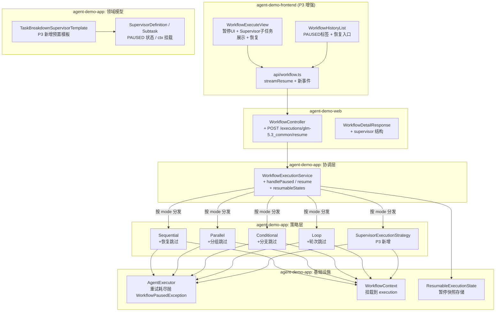
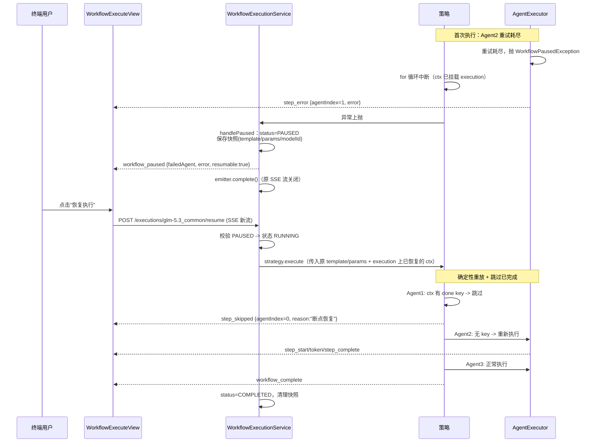

# 技术设计文档: 应用编排层 P3（Supervisor + 断点续执行 + 可视化增强）

## 0. 设计概要 (Design Summary)

* **功能描述**：在 P2（多模式编排 + 前端管理页面）基础上，交付 **Supervisor 层级编排**（主控 Agent 拆解任务 -> 指定 Worker 执行 -> 主控汇总）、**断点续执行**（重试耗尽后暂停，可从失败步骤恢复，已完成步骤不重新执行）和**可视化增强**（暂停状态 UI、Supervisor 子任务调度展示）。

* **影响范围**：

  * `agent-demo-app`：新增 `SupervisorExecutionStrategy` + `SupervisorDefinition` + 暂停/恢复机制（`WorkflowPausedException` / `ResumableExecutionState`）+ Supervisor 预置模板与 Agent 接口；修改 5 个既有策略（恢复跳过逻辑）+ `AgentExecutor`（暂停异常）+ `WorkflowExecutionService`（pause/resume）+ 核心模型（PAUSED 状态、ctx 挂载）

  * `agent-demo-common`：`ErrorCode` 新增 `WORKFLOW_NOT_RESUMABLE(5507)`

  * `agent-demo-web`：`WorkflowController` 新增恢复接口 + `WorkflowDetailResponse` 扩展 supervisor 结构

  * `agent-demo-frontend`：`WorkflowExecuteView`（暂停 UI + Supervisor 子任务可视化 + 恢复流程）、`WorkflowHistoryList`（PAUSED 标签 + 恢复入口）、`api/workflow.ts`（streamResume + 5 个新事件）、`types/index.ts`

* **技术难点**：

  1. Supervisor 主控输出的子任务列表为 LLM 自由文本，需设计 **JSON 协议 + 容错解析 + 路由兜底** 三层防线
  2. 断点续执行需在策略 for 循环中断后重建执行位置，采用 **确定性重放 + 跳过已完成** 机制（各模式恢复粒度不同：agent / 轮次 / 分组 / 子任务）
  3. 行为变更：重试耗尽从 `FAILED`（终态）改为 `PAUSED`（可恢复态），需兼容既有测试与前端状态展示

* **依赖关系**：P1（适配层 + 串行 + API + SSE）、P2（策略模式三层架构 + 4 策略 + 前端页面）已交付；`langchain4j-agentic:1.17.2-beta27` 已引入。**已调研确认**：beta27 无可用 `supervisorBuilder`（supervisor 子包无 Builder 类），Supervisor 自研，与 P1/P2"不用原生 builder"决策一致；不依赖 beta28（beta28 门槛仅针对 HITL 跨进程恢复，超出本次范围）。

## 1. 架构概览 (Architecture Overview)

### 1.1 架构分层与模块交互

> **架构延续 P2 策略模式三层分离**：新增 SUPERVISOR 策略零修改协调层（OCP 兑现）；断点续执行横切协调层 + AgentExecutor + 5 个策略。



**P3 新增/修改职责**：

| 层        | 类                                 | P3 职责                                                           |
| :------- | :-------------------------------- | :-------------------------------------------------------------- |
| **协调层**  | `WorkflowExecutionService`        | +`handlePaused`（暂停快照保存）、+`resume`（恢复执行）、`terminate` 清理快照        |
| **策略层**  | `SupervisorExecutionStrategy`（新增） | 拆解 -> 路由分发 -> 汇总 三阶段编排                                          |
| **策略层**  | 4 个既有策略                           | 各模式"跳过已完成步骤"恢复逻辑                                                |
| **基础设施** | `AgentExecutor`                   | 重试耗尽异常从 `BusinessException` 改为 `WorkflowPausedException`（子类，兼容） |
| **基础设施** | `WorkflowContext`                 | 挂载到 `WorkflowExecution`，暂停时协调层可读取                               |
| **领域模型** | `WorkflowExecution`               | +`PAUSED` 状态、+`pause()/resumeFromPause()`、+`context` 字段         |

### 1.2 Supervisor 执行数据流

```mermaid
sequenceDiagram
    participant U as 终端用户
    participant F as WorkflowExecuteView
    participant C as WorkflowController
    participant S as WorkflowExecutionService
    participant SUP as SupervisorExecutionStrategy
    participant AE as AgentExecutor

    U->>F: 选择"任务拆解-执行-汇总"模板，输入复杂任务
    F->>C: POST /workflows/task-breakdown-supervisor/execute (SSE)
    C->>S: execute(template, params, emitter)
    S->>SUP: 分发（mode=SUPERVISOR）

    rect rgb(60,60,90)
    Note over SUP,AE: 阶段一：主控拆解（强模型）
    SUP->>AE: executeWithRetry(planAgent, task)
    AE-->>F: step_start/token/step_complete（agentIndex=0）
    SUP->>SUP: 解析子任务 JSON -> 路由 Worker
    SUP-->>F: supervisor_plan {subtasks:[{id,description,agent,routed}]}
    end

    rect rgb(60,90,60)
    Note over SUP,AE: 阶段二：依次调度子任务（主控指定的 Worker，快模型）
    loop 每个子任务 i（1..N）
        SUP-->>F: supervisor_dispatch {subtaskIndex=i, agentName, routed}
        SUP->>AE: executeWithRetry(routedWorker, 子任务描述)
        AE-->>F: step_start/token/step_complete（agentIndex=i）
        SUP->>SUP: ctx.write("subtask:"+i, output)
    end
    end

    rect rgb(90,60,60)
    Note over SUP,AE: 阶段三：主控汇总（强模型）
    SUP-->>F: supervisor_summary {subtaskCount}
    SUP->>AE: executeWithRetry(summarizeAgent, 全部子任务结果)
    AE-->>F: step_start/token/step_complete（agentIndex=N+1）
    end

    SUP-->>F: workflow_complete {finalResult}
```



### 1.3 断点续执行数据流



### 1.4 执行状态机（P3 扩展）

```
PENDING ──start()──> RUNNING ──全部完成──> COMPLETED（终态）
                       │ │ └──Agent重试耗尽──> PAUSED ──resume──> RUNNING（可循环：恢复后再暂停）
                       │ │                       └──terminate──> TERMINATED（终态）
                       │ ├──用户终止──────────────> TERMINATED（终态）
                       │ └──执行超时──────────────> TIMEOUT（终态）
                       └──配置类失败(模型不存在等)─> FAILED（终态，不可恢复）
```

> **关键规则（BR-APP-009）**：仅 `PAUSED` 可恢复；`COMPLETED/FAILED/TERMINATED/TIMEOUT` 为终态。Agent 执行失败（重试耗尽）-> PAUSED；配置类失败（模型未找到、提示词缺失）-> FAILED（重试无意义）。

## 2. API 设计 (API Design)

> 沿用 P1/P2 RESTful 风格，SSE 使用 `SseEmitter`（超时 300s，与 execute 一致）。

### 2.1 接口列表

| 接口名称      | 方法       | 路径                                                     | 描述                          | 对应 AC          |
| :-------- | :------- | :----------------------------------------------------- | :-------------------------- | :------------- |
| 执行工作流     | POST     | /api/app/workflows/{templateId}/execute                | P1 已有；SUPERVISOR 模板经此执行     | AC-007, AC-031 |
| 查询模板列表/详情 | GET      | /api/app/workflows\[/{templateId}]                     | P1/P2 已有；详情新增 supervisor 结构 | AC-002         |
| 查询执行状态    | GET      | /api/app/workflows/executions/{executionId}            | P1 已有；status 可能返回 PAUSED    | AC-016         |
| **恢复执行**  | **POST** | **/api/app/workflows/executions/{executionId}/resume** | **从暂停断点恢复执行（SSE）**          | **AC-017**     |
| 终止执行      | DELETE   | /api/app/workflows/executions/{executionId}            | P1 已有；PAUSED 状态允许终止         | AC-016         |
| 查询执行历史    | GET      | /api/app/workflows/executions                          | P2 已有；status 含 PAUSED       | AC-027         |

### 2.2 接口详情

#### 接口 1: 恢复执行（P3 新增）

* **路径**: `POST /api/app/workflows/executions/{executionId}/resume`

* **描述**: 从暂停断点恢复工作流执行，返回新 SSE 流。已完成步骤跳过（推送 `step_skipped`），从失败步骤重新执行。沿用暂停前保存的 modelId（用户已确认）。

* **鉴权**: 无（与现状一致）

* **Request**: 无请求体

* **Response (成功)**: `text/event-stream`，事件序列：

  ```
  step_skipped -> step_skipped -> step_start -> token... -> step_complete
  -> ... -> workflow_complete
  ```

* **Response (失败)**:

  ```json
  { "success": false, "code": 5507, "message": "工作流当前状态不支持恢复: COMPLETED" }
  ```

* **异常处理**:

  * 执行不存在 -> 404 逻辑码 `WORKFLOW_NOT_FOUND(5500)`

  * 状态非 PAUSED -> 400 逻辑码 `WORKFLOW_NOT_RESUMABLE(5507)`（BR-APP-009）

  * 快照缺失（应用内存态异常）-> `WORKFLOW_NOT_RESUMABLE(5507)`

  * 恢复后再次 Agent 失败 -> 新 SSE 流推送 `workflow_paused`（可再次恢复，AC 5.1.3）

  * 恢复后终止/超时 -> 复用现有 `workflow_failed`（TERMINATED/TIMEOUT）

#### 接口 2: 模板详情（P2 扩展 supervisor 结构）

`WorkflowDetailResponse` 新增：

```json
{
  "mode": "SUPERVISOR",
  "agents": [...],
  "supervisor": {
    "maxSubtasks": 5,
    "planAgent": { "name": "任务拆解(主控)", "modelId": "vendor1:doubao-seed-2.0-pro", ... },
    "workers": [
      { "name": "研究", "modelId": "vendor1:doubao-seed-2.0-lite", ... },
      { "name": "分析", "modelId": "vendor1:doubao-seed-2.0-lite", ... },
      { "name": "总结", "modelId": "vendor1:doubao-seed-2.0-lite", ... }
    ],
    "summarizeAgent": { "name": "综合汇总(主控)", "modelId": "vendor1:doubao-seed-2.0-pro", ... }
  }
}
```

### 2.3 SSE 事件协议（P3 扩展）

| 事件名                       | 触发时机                   | data 字段                                                                     | 所属阶段              |
| :------------------------ | :--------------------- | :-------------------------------------------------------------------------- | :---------------- |
| **`workflow_paused`**     | Agent 重试耗尽，工作流暂停       | `executionId`, `failedAgent`, `failedIndex`, `error`, `resumable: true`     | **P3 新增（AC-016）** |
| **`step_skipped`**        | 恢复执行时跳过已完成步骤           | `agentIndex`, `agentName`, `reason: "断点恢复"`                                 | **P3 新增（AC-017）** |
| **`supervisor_plan`**     | 主控拆解完成                 | `subtasks: [{id, description, agent, routed}]`, `totalSubtasks`             | **P3 新增（AC-007）** |
| **`supervisor_dispatch`** | 分发子任务给 Worker          | `subtaskIndex`, `totalSubtasks`, `description`, `agentName`, `routed`(bool) | **P3 新增（AC-007）** |
| **`supervisor_summary`**  | 主控开始汇总                 | `subtaskCount`                                                              | **P3 新增（AC-007）** |
| `workflow_start` 等既有事件    | 恢复执行时**重新推送**（前端重建进度条） | 同 P1/P2                                                                     | P1/P2             |

> **设计要点**：恢复执行是新 SSE 流，前端进度状态需重建。策略重放时对跳过步骤推 `step_skipped`（前端显示"已跳过"态），对实际执行步骤推完整 `step_start/token/step_complete`。

## 3. 数据库设计 (Database Schema)

> 与 P1/P2 一致，**不涉及数据库**。暂停快照（`ResumableExecutionState`）存储在内存（`ConcurrentHashMap`），应用重启后丢失（BR-APP-008，重启后 PAUSED 执行不可恢复，resume 返回 5507）。

## 4. 核心逻辑与算法 (Core Logic)

### 4.1 数据模型扩展（agent-demo-app）

#### 4.1.1 SupervisorDefinition + Subtask（P3 新增）

```java
/**
 * Supervisor 层级编排定义
 * 业务含义：主控 Agent（拆解+汇总）+ Worker 池（主控指定的子任务执行者）+ 子任务上限。
 * BR-APP-012：主控用强模型（拆解/汇总质量），Worker 用快模型（执行成本）。
 */
@Data @Builder
public class SupervisorDefinition {
    /** 主控-拆解 Agent（输入原始任务，输出子任务 JSON 数组） */
    private AgentDefinition planAgent;
    /** Worker 池：子任务路由目标（按 name 精确/包含匹配） */
    private List<AgentDefinition> workers;
    /** 主控-汇总 Agent（输入全部子任务结果，输出综合报告） */
    private AgentDefinition summarizeAgent;
    /** 子任务数量上限（防 LLM 拆解失控，默认 5，超出截断） */
    private int maxSubtasks;
}

/** 子任务模型（主控拆解输出解析后的内存表示） */
@Data @Builder
public class Subtask {
    private int id;
    private String description;   // 子任务描述（Worker 的输入）
    private String agent;         // 主控指定的 Worker 名（路由 key）
}
```

`WorkflowTemplate` 新增字段：`private SupervisorDefinition supervisor;`（SUPERVISOR 模式使用，与 parallelGroups/branches/loop 互斥）。

#### 4.1.2 WorkflowExecution 状态与上下文挂载（P3 修改）

```java
public enum WorkflowExecutionStatus {
    PENDING, RUNNING, COMPLETED, FAILED, TERMINATED, TIMEOUT,
    PAUSED("已暂停（可恢复）");   // P3 新增
}

@Data
public class WorkflowExecution {
    // ... 既有字段 ...

    /** P3 新增：执行上下文（策略创建后挂载；暂停时协调层从此读取恢复所需状态） */
    private WorkflowContext context;

    /** P3 新增：暂停（AC-016）。endTime 不设置（暂停非终态），恢复完成后 complete() 设置 */
    public void pause(String failedAgent, String error) {
        this.status = WorkflowExecutionStatus.PAUSED;
        this.finalResult = null;
        // endTime 保持 null，恢复后重跑再定
    }

    /** P3 新增：从暂停恢复（AC-017）。startTime 保留原值（历史总耗时语义），状态回 RUNNING */
    public void resumeFromPause() {
        this.status = WorkflowExecutionStatus.RUNNING;
    }

    /** P3 新增：挂载执行上下文（策略首行调用，幂等） */
    public void attachContext(WorkflowContext ctx) { this.context = ctx; }
}
```

#### 4.1.3 WorkflowContext 恢复 Key 体系（P3 约定）

断点续执行依赖 ctx 记录"步骤已完成"标记。**统一 key 规则**：

| 模式          | 恢复 key                                     | 写入时机         | 示例                  |
| :---------- | :----------------------------------------- | :----------- | :------------------ |
| SEQUENTIAL  | `done:0:{agentName}`                       | agent 完成时    | `done:0:研究 Agent`   |
| CONDITIONAL | `done:0:{agentName}`（分支 agent 名模板内唯一）      | agent 完成时    | `done:0:简单回答 Agent` |
| PARALLEL    | `done:0:{agentName}`（组内 agent 名模板内唯一）      | agent 完成时    | `done:0:安全 Agent`   |
| LOOP        | `done:{iteration}:{agentName}`             | 每轮 agent 完成时 | `done:2:评分 Agent`   |
| SUPERVISOR  | plan: `supervisor:plan`；子任务: `subtask:{i}` | 拆解完成/子任务完成时  | `subtask:1`         |

> **跳过判定**：`ctx.read(key) != null` 即视为已完成（值可为空字符串，AC-021 空输出也算完成）。汇总步骤（Supervisor summarize）**不写 key**：若汇总失败暂停，恢复时子任务全部跳过、汇总重跑（语义正确）。

### 4.2 SupervisorExecutionStrategy（P3 新增，AC-007/AC-031）

```java
/**
 * Supervisor 层级编排策略
 * 业务含义：主控 Agent 拆解任务为子任务 JSON -> 按 agent 字段路由 Worker 池 ->
 * 依次执行子任务（串行，AC-007 "依次调度"）-> 主控汇总为综合报告。
 * 主控/Worker 模型独立配置（AC-031，BR-APP-012）。
 */
@Component
public class SupervisorExecutionStrategy extends AbstractExecutionStrategy {

    @Override
    public OrchestrationMode supportedMode() { return OrchestrationMode.SUPERVISOR; }

    @Override
    public String execute(WorkflowTemplate template, Map<String, Object> params,
                          SseEmitter emitter, WorkflowExecution execution,
                          String modelId, AtomicBoolean cancelFlag) {
        SupervisorDefinition sup = template.getSupervisor();
        WorkflowContext ctx = attachOrNewContext(execution);   // 恢复兼容（见 4.4.1）
        // ... 校验：sup 非空、workers 非空、maxSubtasks > 0 ...

        String task = params.getOrDefault("task", "").toString();
        long startTime = System.currentTimeMillis();
        // workflow_start 事件

        // ===== 阶段一：主控拆解（agentIndex=0）=====
        List<Subtask> subtasks;
        if (ctx.read("supervisor:plan") != null) {
            subtasks = restoreSubtasks(ctx);                    // 恢复：不重新拆解
            WorkflowEventPublisher.send(emitter, "step_skipped", Map.of(
                    "agentIndex", 0, "agentName", sup.getPlanAgent().getName(), "reason", "断点恢复"));
        } else {
            String planOutput = agentExecutor.executeWithRetry(
                    sup.getPlanAgent(), task, emitter, 0, template.getMaxRetries(), modelId);
            subtasks = parseSubtasks(planOutput, sup.getMaxSubtasks());  // 见 4.2.1
            ctx.write("supervisor:plan", subtasks);             // 保存拆解结果（恢复用）
            subtasks.forEach(s -> ctx.write("subtask:" + s.getId(), null)); // 占位（见注）
        }
        // supervisor_plan 事件（含每个子任务的路由结果）

        // ===== 阶段二：依次调度子任务（agentIndex=1..N）=====
        StringBuilder results = new StringBuilder();
        for (int i = 0; i < subtasks.size(); i++) {
            AgentExecutor.checkCancelled(cancelFlag);
            Subtask st = subtasks.get(i);
            AgentDefinition worker = routeWorker(sup.getWorkers(), st.getAgent());  // 见 4.2.2

            WorkflowEventPublisher.send(emitter, "supervisor_dispatch", Map.of(
                    "subtaskIndex", i + 1, "totalSubtasks", subtasks.size(),
                    "description", st.getDescription(),
                    "agentName", worker.getName(),
                    "routed", worker.getName().equals(st.getAgent())));

            String saved = (String) ctx.read("subtask:" + (i + 1));
            if (saved != null) {                                // 恢复：已完成子任务跳过
                WorkflowEventPublisher.send(emitter, "step_skipped", Map.of(
                        "agentIndex", i + 1, "agentName", worker.getName(), "reason", "断点恢复"));
                results.append(saved);
                continue;
            }
            String workerInput = "原始任务：\n" + task + "\n\n你负责的子任务：\n" + st.getDescription();
            String output = agentExecutor.executeWithRetry(worker, workerInput,
                    emitter, i + 1, template.getMaxRetries(), modelId);
            ctx.write("subtask:" + (i + 1), output);            // 完成 key（实际输出值）
            results.append("## 子任务 ").append(i + 1).append("（").append(st.getDescription()).append("）\n")
                   .append(output).append("\n\n");
        }

        // ===== 阶段三：主控汇总（agentIndex=N+1，无恢复 key，恢复时重跑）=====
        WorkflowEventPublisher.send(emitter, "supervisor_summary", Map.of(
                "subtaskCount", subtasks.size()));
        String finalResult = agentExecutor.executeWithRetry(
                sup.getSummarizeAgent(), results.toString(), emitter,
                subtasks.size() + 1, template.getMaxRetries(), modelId);

        // workflow_complete 事件
        return finalResult;
    }
}
```

> 注：拆解完成后 `subtask:{i}` 占位写 null 会与"跳过判定 read != null"冲突。**修正设计**：不写占位 null；恢复时子任务列表从 `supervisor:plan` 反序列化，逐个查 `subtask:{i}` 是否有值（null = 未完成 -> 执行）。上方伪代码中占位行删除。

#### 4.2.1 子任务 JSON 解析（三层容错）

主控 PlanAgent 的 `@UserMessage` 强约束输出格式（提示词文件 `app-supervisor-plan.txt`）：

```
仅输出 JSON 数组，不要输出任何其他内容，格式：
[{"id":1,"description":"子任务描述","agent":"Worker名"}]
可用的 Worker 及其职责：
- 研究：负责信息检索与事实收集
- 分析：负责数据对比与逻辑推理
- 总结：负责内容归纳与报告撰写
最多拆解为 {maxSubtasks} 个子任务。
任务：{{task}}
```

解析算法（`SubtaskParser`，SupervisorExecutionStrategy 私有方法或独立小工具类）：

````
function parseSubtasks(raw, maxSubtasks):
    1. 剥离 markdown 代码块：若含 ``` 则提取最后一对 ``` 之间的内容
    2. 提取 JSON 数组区间：s = indexOf('['), e = lastIndexOf(']')；任一为 -1 -> 解析失败
    3. Jackson 解析为 List<Subtask>（忽略未知字段）
    4. 过滤 description 为空项；id 缺失时按下标补齐
    5. 超过 maxSubtasks -> 截断前 maxSubtasks 个（防失控）
    6. 空列表 -> 解析失败
    失败 -> 抛 BusinessException(WORKFLOW_EXECUTION_FAILED, "主控拆解输出无法解析...")
    （该异常在 executeWithRetry 之外抛出？不——解析失败应可重试）
````

> **修正**：解析在 `executeWithRetry(planAgent)` **返回后**进行，解析失败时 LLM 未获重试机会。**设计调整**：将"调用 + 解析"包装为可重试单元——策略内自行循环（maxRetries 次）：`输出 = executeWithRetry(...)` 后解析，失败则再调 `executeWithRetry`（复用其内部重试与 step\_retry 事件）。实现为策略内 `planWithRetry()` 私有方法。

#### 4.2.2 Worker 路由算法（用户已确认：主控指定多 Worker）

```
function routeWorker(workers, agentName):
    1. 精确匹配：workers 中 name.equals(agentName) -> 命中
    2. 包含匹配：worker.name 包含 agentName 或 agentName 包含 worker.name
       （LLM 常输出"研究 Agent"/"研究Agent" 等变体）-> 命中
    3. 兜底：返回第一个 worker
       + log.warn("子任务路由兜底: 指定={}, 实际={}", agentName, workers.get(0).getName())
       + supervisor_dispatch 事件 routed=false（前端可标注兜底）
```

### 4.3 断点续执行机制（AC-016/AC-017）

#### 4.3.1 WorkflowPausedException（P3 新增）

```java
package com.agentdemo.app.service;

/**
 * 工作流暂停异常（AC-016）
 * 业务含义：Agent 重试耗尽后抛出，协调层捕获后进入 PAUSED 状态并保存恢复快照。
 * 继承 BusinessException：兼容既有 catch 分支与单元测试（instanceof 语义不变）。
 */
public class WorkflowPausedException extends BusinessException {
    private final String failedAgentName;
    private final int failedIndex;

    public WorkflowPausedException(String failedAgentName, int failedIndex, String message, Throwable cause) {
        super(ErrorCode.WORKFLOW_EXECUTION_FAILED, message, cause);
        this.failedAgentName = failedAgentName;
        this.failedIndex = failedIndex;
    }
    // getter ...
}
```

`AgentExecutor.executeWithRetry` 修改（重试耗尽分支）：

```java
} else {
    WorkflowEventPublisher.send(emitter, "step_error", Map.of(...));
    // P3 变更：BusinessException -> WorkflowPausedException（协调层据此进入 PAUSED 而非 FAILED）
    throw new WorkflowPausedException(agentDef.getName(), agentIndex,
            "Agent 执行失败: " + agentDef.getName() + ": " + e.getMessage(), e);
}
```

> **既有兼容**：`WorkflowPausedException extends BusinessException`，P1/P2 中 `catch (BusinessException e)` 的调用方与测试（`assertThrows(BusinessException.class, ...)`）不受影响。

#### 4.3.2 ResumableExecutionState + 协调层暂停/恢复

```java
/** 暂停快照（内存，BR-APP-008） */
@Data @Builder
public class ResumableExecutionState {
    private WorkflowTemplate template;      // 原模板（策略重放需要）
    private Map<String, Object> params;     // 原参数
    private String modelId;                 // 原模型（恢复沿用，用户已确认）
}
```

`WorkflowExecutionService` 扩展：

```java
/** P3 新增：暂停快照存储 */
private final ConcurrentHashMap<String, ResumableExecutionState> resumableStates = new ConcurrentHashMap<>();

// execute() 的异步块异常处理新增分支（置于 catch BusinessException 之前）：
catch (WorkflowPausedException e) {
    handlePaused(emitter, execution, e);
}

/** 处理暂停（AC-016）：状态 PAUSED + 快照 + workflow_paused 事件 */
private void handlePaused(SseEmitter emitter, WorkflowExecution execution, WorkflowPausedException e) {
    execution.pause(e.getFailedAgentName(), e.getMessage());
    resumableStates.put(execution.getExecutionId(), ResumableExecutionState.builder()
            .template(currentTemplate)      // execute 闭包变量
            .params(currentParams)
            .modelId(currentModelId)
            .build());
    WorkflowEventPublisher.send(emitter, "workflow_paused", Map.of(
            "executionId", execution.getExecutionId(),
            "failedAgent", e.getFailedAgentName(),
            "failedIndex", e.getFailedIndex(),
            "error", e.getMessage(),
            "resumable", true));
    emitter.complete();
}

/**
 * 恢复执行（AC-017）
 * 业务含义：校验 PAUSED -> 重建取消标志 -> 异步重放策略（ctx 从 execution.context 恢复，
 * 已完成步骤由策略跳过）。恢复后再次失败可再次暂停（循环暂停-恢复）。
 */
public String resume(String executionId, SseEmitter emitter) {
    WorkflowExecution execution = executions.get(executionId);
    if (execution == null) {
        throw new BusinessException(ErrorCode.WORKFLOW_NOT_FOUND, executionId);
    }
    if (execution.getStatus() != WorkflowExecutionStatus.PAUSED) {
        throw new BusinessException(ErrorCode.WORKFLOW_NOT_RESUMABLE,
                "工作流当前状态不支持恢复: " + execution.getStatus() + "，仅暂停状态可恢复");
    }
    ResumableExecutionState state = resumableStates.get(executionId);
    if (state == null) {
        throw new BusinessException(ErrorCode.WORKFLOW_NOT_RESUMABLE,
                "恢复快照不存在（应用可能已重启），无法恢复");
    }

    execution.resumeFromPause();
    AtomicBoolean cancelFlag = new AtomicBoolean(false);
    cancelFlags.put(executionId, cancelFlag);   // 重建取消标志

    WorkflowExecutionStrategy strategy = strategies.get(state.getTemplate().getMode());
    CompletableFuture.runAsync(() -> {
        try {
            String result = strategy.execute(state.getTemplate(), state.getParams(),
                    emitter, execution, state.getModelId(), cancelFlag);
            execution.complete(result);
            resumableStates.remove(executionId);    // 成功：清理快照
            emitter.complete();
        } catch (WorkflowPausedException e) { handlePaused(emitter, execution, e); }  // 再次暂停
        catch (WorkflowCancelledException e) { handleTerminated(emitter, execution, e.getMessage()); cleanup(executionId); }
        catch (WorkflowTimeoutException e)    { handleTimeout(emitter, execution, e.getMessage()); cleanup(executionId); }
        catch (Exception e)                   { handleFailure(emitter, execution, e.getMessage()); cleanup(executionId); }
    });
    emitter.onTimeout(() -> cancel(executionId));
    emitter.onError(e -> cancel(executionId));
    return executionId;
}
```

`terminate()` 修改：终止后清理 `resumableStates.remove(executionId)`（PAUSED 状态允许终止，现有校验不阻止 PAUSED，仅补充快照清理）。

#### 4.3.3 各策略恢复跳过逻辑（确定性重放）

**统一模式**：策略首行 `WorkflowContext ctx = attachOrNewContext(execution)`（取已有或新建并挂载）；执行每个 Agent 前查恢复 key，命中则推 `step_skipped` 并以历史输出作为链式输入。

```java
/** AbstractExecutionStrategy 新增辅助方法 */
protected WorkflowContext attachOrNewContext(WorkflowExecution execution) {
    WorkflowContext ctx = execution.getContext();
    if (ctx == null) {
        ctx = new WorkflowContext();
        execution.attachContext(ctx);
    }
    return ctx;
}

/** 统一恢复 key（4.1.3 规则） */
public static String resumeKey(int iteration, String agentName) {
    return "done:" + iteration + ":" + agentName;
}

/**
 * 执行或跳过单个 Agent（恢复支持）
 * @return Agent 输出（执行所得或历史恢复）
 */
protected String executeOrSkip(AgentDefinition agentDef, String input, int iteration,
                               WorkflowContext ctx, SseEmitter emitter,
                               WorkflowExecution execution, int maxRetries,
                               String modelId, AtomicBoolean cancelFlag, int agentIndex) {
    String key = resumeKey(iteration, agentDef.getName());
    String saved = (String) ctx.read(key);
    if (saved != null) {                                    // 已完成：跳过
        WorkflowEventPublisher.send(emitter, "step_skipped", Map.of(
                "agentIndex", agentIndex, "agentName", agentDef.getName(), "reason", "断点恢复"));
        return saved;
    }
    AgentExecutor.checkCancelled(cancelFlag);
    // ... step_start 事件 ...
    String output = agentExecutor.executeWithRetry(agentDef, input, emitter, agentIndex, maxRetries, modelId);
    ctx.write(key, output);                                 // 完成 key（恢复用）
    ctx.recordOutput(agentDef.getName(), output);
    ctx.write("lastOutput", output);
    // ... step_complete 事件 ...
    return output;
}
```

各策略改造点：

| 策略                             | 改造内容                                                                                                                                                                                                            | 恢复粒度            |
| :----------------------------- | :-------------------------------------------------------------------------------------------------------------------------------------------------------------------------------------------------------------- | :-------------- |
| `SequentialExecutionStrategy`  | 自有 for 循环改用 `executeOrSkip`（iteration=0）；首行 attachOrNewContext                                                                                                                                                  | agent 级         |
| `ConditionalExecutionStrategy` | `executeAgentList` 内部改用 `executeOrSkip`（iteration=0）；分支谓词基于恢复 ctx 重放，评估结果与首次一致（确定性谓词）                                                                                                                           | 分支内 agent 级     |
| `LoopExecutionStrategy`        | `executeAgentList` 改用 `executeOrSkip`（iteration=当前轮）；恢复轮次判定：`iteration < ctx.getIterationCount()` 的完整历史轮**整轮跳过（不评估 exitCondition，不 increment）**；暂停轮（`iteration == ctx.getIterationCount()`）轮内 agent 级跳过；后续轮正常执行 | 轮次 + 轮内 agent 级 |
| `ParallelExecutionStrategy`    | `executeGroup` 内组内 agent 改用 `executeOrSkip`（iteration=0）；全跳过分组仍推 `group_complete`（前端进度完整）                                                                                                                       | 分组内 agent 级     |
| `SupervisorExecutionStrategy`  | 4.2 节内建（plan/子任务两级 key）                                                                                                                                                                                         | 子任务级            |

**LOOP 恢复重放伪代码**：

```
pausedIter = ctx.getIterationCount()          // 暂停时的轮次（incrementIteration 在轮首）
for iteration = 1 to maxIterations:
    resumed = iteration <= pausedIter
    if iteration > pausedIter: ctx.incrementIteration()
    推 loop_iteration 事件
    for agent in loop.agents:
        output = executeOrSkip(agent, currentInput, iteration, ...)   // key 命中自动跳过
        currentInput = output
    if resumed and iteration < pausedIter: continue    // 完整历史轮：不评估条件
    if exitCondition.test(ctx): break                  // 暂停轮/新轮：正常评估
```

> **正确性说明**：暂停只可能发生在 Agent 执行中（谓词评估与循环控制不抛业务异常），因此重放必从"暂停的那个 Agent"继续；完整历史轮整轮跳过可避免 exitCondition 在中间状态误判提前退出。

### 4.4 Supervisor 预置模板（P3 新增 1 个）

| 模板 ID                       | 名称         | 模式         | 结构                                                                      | 对应 AC          |
| :-------------------------- | :--------- | :--------- | :---------------------------------------------------------------------- | :------------- |
| `task-breakdown-supervisor` | 任务拆解-执行-汇总 | SUPERVISOR | 主控拆解（pro 模型）+ Worker 池\[研究/分析/总结（lite 模型）] + 主控汇总（pro 模型），maxSubtasks=5 | AC-007, AC-031 |

**Agent 接口**（沿用项目"单 String 参数 + TokenStream"固定模式）：

```java
// template/SupervisorPlanAgent.java（新建）
public interface SupervisorPlanAgent {
    @Agent
    @UserMessage("{{task}}")
    TokenStream execute(@V("task") String task);
}
// 详细拆解指令在提示词文件 prompts/scenarios/app-supervisor-plan.txt（含 Worker 清单与 JSON 格式约束）

// template/SupervisorSummarizeAgent.java（新建）
public interface SupervisorSummarizeAgent {
    @Agent
    @UserMessage("{{results}}")
    TokenStream execute(@V("results") String results);
}
// Worker 复用 P1 既有接口：ResearchAgent / AnalysisAgent / SummaryAgent（仅 modelId 指向 lite）
```

> **设计说明**：`@UserMessage` 仅传变量（与既有 9 个接口一致），复杂指令放 `systemMessageProvider` 场景提示词（`PromptTemplateLoader` 机制），模板定义时通过 `AgentDefinition.scenarioName` 绑定。

### 4.5 前端设计（agent-demo-frontend）

#### 4.5.1 类型扩展（types/index.ts）

```ts
export type WorkflowExecutionStatus = 'PENDING' | 'RUNNING' | 'COMPLETED' | 'FAILED'
  | 'TERMINATED' | 'TIMEOUT' | 'PAUSED';   // + PAUSED

export interface SupervisorSubtask { id: number; description: string; agent: string; routed: boolean; }
export interface SupervisorDefinitionItem {
  maxSubtasks: number;
  planAgent: WorkflowAgentItem;
  workers: WorkflowAgentItem[];
  summarizeAgent: WorkflowAgentItem;
}
// WorkflowTemplateDetail + supervisor?: SupervisorDefinitionItem

// WorkflowStreamCallbacks 新增：
onWorkflowPaused: (data: { executionId: string; failedAgent: string; failedIndex: number; error: string; resumable: boolean }) => void;
onStepSkipped: (data: { agentIndex: number; agentName: string; reason: string }) => void;
onSupervisorPlan: (data: { subtasks: SupervisorSubtask[]; totalSubtasks: number }) => void;
onSupervisorDispatch: (data: { subtaskIndex: number; totalSubtasks: number; description: string; agentName: string; routed: boolean }) => void;
onSupervisorSummary: (data: { subtaskCount: number }) => void;
```

#### 4.5.2 API 扩展（api/workflow\.ts）

```ts
/** 恢复执行（SSE，AC-017）：复用 streamExecute 的 SSE 解析循环 */
export async function streamResume(
  executionId: string, callbacks: WorkflowStreamCallbacks, signal: AbortSignal,
): Promise<void>;  // POST /api/app/workflows/executions/glm-5.3_common/resume

// handleWorkflowEvent 新增 case：workflow_paused / step_skipped / supervisor_plan /
// supervisor_dispatch / supervisor_summary
```

#### 4.5.3 WorkflowExecuteView\.vue 增强

* **暂停状态 UI（AC-016）**：

  * `onWorkflowPaused` -> `isPaused = true`，状态栏显示"已暂停（第 N 步失败）"，失败步骤面板**红色高亮边框** + 错误信息

  * 显示 `[恢复执行]`（主操作，调用 `streamResume` 建新 SSE 流，输出面板继续追加）与 `[终止]`（调 `terminate`）按钮

  * 恢复中按钮禁用防重复提交

* **跳过步骤展示（AC-017）**：`onStepSkipped` -> 对应面板显示"⏭ 已跳过（断点恢复）"状态标签（灰绿色），不请求输出

* **Supervisor 可视化（AC-007）**：

  * `onSupervisorPlan` -> 渲染子任务卡片列表（id + description + 目标 Worker 名 + 兜底标记）

  * `onSupervisorDispatch` -> 当前执行子任务高亮（进行中样式），已完成打勾

  * `onSupervisorSummary` -> 显示"主控汇总中"进度态

  * 主控拆解/汇总的 token 流入独立面板（agentIndex=0 与 N+1）

* **恢复模式挂载**：组件支持 prop `resumeExecutionId`（历史列表跳转恢复用），`onMounted` 时自动调 `streamResume`

#### 4.5.4 WorkflowHistoryList.vue 增强

* PAUSED 状态标签（橙色，区别于 COMPLETED 绿 / FAILED 红）

* PAUSED 记录行显示 `[恢复]` 按钮 -> emit `resume` 事件（携带 executionId）给 `WorkflowPage`

* `WorkflowPage` 监听后切换到执行视图（传入 `resumeExecutionId`，执行视图自动建立恢复 SSE 流）

#### 4.5.5 CR-001: 按编排模式拆分执行视图组件（AC-033）

> **变更背景**：P2/P3 所有模板共用 `WorkflowExecuteView.vue`，仅参数表单不同，布局无差异。CR-001 将执行视图按 5 种编排模式拆分为独立组件，每种模式有针对性布局。

**架构设计**：

```
WorkflowPage.vue
  ├─ getTemplate(templateId) -> template.mode
  ├─ <component :is="modeExecuteView" />  // 动态组件分发
  │   ├─ SequentialExecuteView.vue     // 串行：流水线进度条 + 顺序折叠面板
  │   ├─ ParallelExecuteView.vue       // 并行：多列并排 + 汇总区
  │   ├─ LoopExecuteView.vue           // 循环：轮次时间线 + 评分/修订对比
  │   ├─ ConditionalExecuteView.vue    // 条件：分岔路径图 + 高亮实际分支
  │   └─ SupervisorExecuteView.vue     // Supervisor：子任务卡片 + 调度过程 + 拆解/汇总面板
  └─ <WorkflowHistoryList />           // 历史列表（含 CR-001 详情面板）
```

**共享逻辑提取**：

从 `WorkflowExecuteView` 提取 SSE 事件处理 + 状态管理 + 暂停/恢复逻辑为 `composables/useWorkflowStream.ts`，5 个模式组件共享调用：

```ts
// composables/useWorkflowStream.ts
export function useWorkflowStream() {
  // 状态：isExecuting, isPaused, currentStep, agentOutputs, finalResult, error
  // 方法：streamExecute(templateId, params), streamResume(executionId), terminate(executionId)
  // 回调注册：onStepStart, onToken, onStepComplete, onStepSkipped, onWorkflowPaused,
  //          onSupervisorPlan, onSupervisorDispatch, onSupervisorSummary, onWorkflowComplete, onWorkflowFailed
  // 所有模式组件通过此 composable 获取统一的 SSE 事件处理能力
}
```

**各模式组件布局差异**：

| 模式 | 组件 | 布局特点 | 与现有 WorkflowExecuteView 的差异 |
| :--- | :--- | :--- | :--- |
| SEQUENTIAL | SequentialExecuteView | 水平流水线进度条（Agent 1→2→3）+ 按顺序展开的折叠面板 | 基本保持现有布局，增加流水线可视化进度条 |
| PARALLEL | ParallelExecuteView | 多列并排（CSS Grid），每列一个分组的 Agent 输出；底部汇总区 | 从折叠面板改为多列并排，直观对比各维度结果 |
| LOOP | LoopExecuteView | 垂直时间线（每轮一个节点），节点内评分/修订左右对比 | 从折叠面板改为时间线，直观展示迭代改进过程 |
| CONDITIONAL | ConditionalExecuteView | 顶部分岔路径图（简单↘ / 复杂↙），高亮实际走的分支 | 新增分岔路径可视化，明确展示路由决策 |
| SUPERVISOR | SupervisorExecuteView | 子任务卡片列表 + 调度进度 + 主控拆解/汇总独立面板 | 整合 P3 Task-21 的 Supervisor 可视化内容 |

**暂停/恢复 UI 复用**：各模式组件均通过 `useWorkflowStream` 获取 `isPaused` 状态，在各自布局中渲染恢复/终止按钮（位置可不同，但行为一致）。

#### 4.5.6 CR-001: 执行历史详情面板（AC-034）

> **变更背景**：`WorkflowHistoryList` 仅展示摘要列表（50 字截断），无详情查看。后端 `GET /executions/glm_5.2_ark_toC` 已返回步骤级明细但前端未消费。

**新增组件**：`ExecutionDetailPanel.vue`

* **触发方式**：历史列表记录项点击 -> 展开/收起详情面板（手风琴式，同一时间只展开一条）
* **数据来源**：调用 `getExecution(executionId)` API（已存在，需修复 `workflow.ts` 路径参数 BUG）
* **展示内容**：

```json
{
  "executionId": "...",
  "templateName": "研究-分析-总结",
  "mode": "SEQUENTIAL",
  "status": "COMPLETED",
  "startTime": "...",
  "endTime": "...",
  "iterationCount": 0,
  "finalResult": "完整结果全文...",  // 不截断
  "steps": [
    { "agentName": "研究 Agent", "status": "COMPLETED", "durationMs": 5200, "output": "..." },
    { "agentName": "分析 Agent", "status": "COMPLETED", "durationMs": 3800, "output": "..." },
    { "agentName": "总结 Agent", "status": "COMPLETED", "durationMs": 2100, "output": "..." }
  ]
}
```

* **布局**：
  * 顶部：执行概要（模板名/模式/状态/总耗时）
  * 中部：步骤列表（每步含 Agent 名称、状态标签、耗时、输出内容折叠区）
  * 底部：最终结果全文（可滚动）
* **PAUSED 记录**：详情面板仍显示"恢复"按钮（与列表中的恢复按钮行为一致）
* **加载态**：调用 API 期间显示 skeleton/spinner

## 5. 异常处理 (Error Handling)

| 异常场景               | 对应 AC      | 处理方案                                                                                                                                   | 用户提示                         |
| :----------------- | :--------- | :------------------------------------------------------------------------------------------------------------------------------------- | :--------------------------- |
| 主控拆解输出非法 JSON      | AC-007     | `parseSubtasks` 三层容错（剥代码块/提取区间/Jackson）；解析失败触发 plan 重试（策略内 `planWithRetry`，推 `step_retry`）；重试耗尽 -> `WorkflowPausedException` -> PAUSED | step\_error: "主控拆解输出无法解析"    |
| 主控指定的 Worker 名不存在  | AC-007     | 路由兜底第一个 Worker + WARN 日志 + `supervisor_dispatch.routed=false`                                                                          | 子任务正常执行（前端标注兜底）              |
| 子任务数超过 maxSubtasks | AC-007     | 解析后截断前 maxSubtasks 个                                                                                                                   | 前端子任务列表即截断后结果                |
| Worker 池为空/配置缺失    | AC-007     | 模板校验抛 `WORKFLOW_EXECUTION_FAILED`（启动期模板注册已保证，运行期防御）                                                                                    | "Supervisor 工作流未配置 Worker 池" |
| Agent 重试耗尽（运行时失败）  | AC-016     | `WorkflowPausedException` -> PAUSED + `workflow_paused` 事件 + 快照保存                                                                      | "工作流已暂停，可从失败步骤恢复"            |
| 恢复非 PAUSED 状态执行    | AC-016/017 | `WORKFLOW_NOT_RESUMABLE(5507)`（BR-APP-009）                                                                                             | "工作流当前状态不支持恢复: {status}"     |
| 恢复时快照缺失（重启后）       | AC-017     | `WORKFLOW_NOT_RESUMABLE(5507)`（BR-APP-008 内存态约束）                                                                                       | "恢复快照不存在，无法恢复"               |
| 恢复后再次失败            | AC 5.1.3   | 再次 PAUSED（快照更新），可循环恢复                                                                                                                  | 同 workflow\_paused           |
| 恢复后用户终止/超时         | AC-022/023 | 复用 handleTerminated/handleTimeout（终态）+ 清理快照                                                                                            | 同现有终止/超时提示                   |
| 配置类失败（模型不存在/提示词缺失） | AC-018     | `buildAgent` 抛出（在重试循环外）-> FAILED 终态（重试无意义，不可恢复）                                                                                        | 同 P1 提示                      |
| PAUSED 状态终止        | AC-016     | 现有 terminate 允许（校验不含 PAUSED）+ 清理快照                                                                                                     | "工作流已终止"                     |
| 暂停时浏览器关闭           | -          | 原 SSE 流已 complete；重开页面后从历史列表 PAUSED 项恢复（快照在服务端内存）                                                                                      | 历史页可见"恢复"入口                  |

## 6. 安全与性能 (Security & Performance)

* **鉴权机制**: P3 无鉴权（与 P1/P2 及项目现状一致）

* **数据校验**: Controller 层 resume 无参数体；Service 层校验 PAUSED 状态 + 快照存在；SUPERVISOR 模板注册时校验 workers 非空、maxSubtasks > 0

* **内存控制**: `resumableStates` 快照含 template 引用（单例，无拷贝开销）+ params + ctx（步骤输出文本）。上限控制：复用现有"执行实例无淘汰"现状（BR-APP-008 内存态一致，不新增淘汰策略）；每个快照额外内存 = ctx 中步骤输出总和（KB 级）

* **并发控制**: 恢复执行重建 `AtomicBoolean` cancelFlag（与首次执行同 key 覆盖）；同 executionId 重复 resume 请求：第二次到达时状态已 RUNNING -> 5507 拒绝（天然防并发恢复）

* **超时控制**: resume 的 SseEmitter 超时 300s（同 execute）；单 Agent 超时 5 分钟（复用）

* **性能指标**: Supervisor 总耗时 = 拆解 + Σ子任务（串行）+ 汇总（主控强模型 2 次调用 + Worker 快模型 N 次，符合 BR-APP-012 成本结构）；恢复执行不重复调用已完成步骤的 LLM（确定性重放仅消耗遍历开销）

## 7. 验收标准映射 (AC Mapping)

| AC ID  | 验收标准描述              | 对应技术实现                                                                                                                                                               |
| :----- | :------------------ | :------------------------------------------------------------------------------------------------------------------------------------------------------------------- |
| AC-007 | 执行 Supervisor 层级工作流 | `SupervisorExecutionStrategy`（拆解->路由->依次执行->汇总）+ `SupervisorDefinition`/`Subtask` + 子任务 JSON 协议与容错解析 + `task-breakdown-supervisor` 预置模板                              |
| AC-016 | 重试耗尽后工作流暂停          | `WorkflowPausedException`（AgentExecutor 重试耗尽抛出）+ `WorkflowExecutionStatus.PAUSED` + `handlePaused`（快照保存）+ `workflow_paused` SSE 事件 + 前端失败步骤红色高亮 + 恢复/终止按钮            |
| AC-017 | 断点续执行               | `resume()` + `POST /executions/glm-5.3_common/resume` + ctx 挂载（execution.context）+ 各策略 `executeOrSkip` 确定性重放（agent/轮次/分组/子任务粒度跳过）+ `step_skipped` 事件 + 前端执行页与历史页恢复入口 |
| AC-031 | Supervisor 使用独立主控模型 | 预置模板 planAgent/summarizeAgent 配 pro 模型、workers 配 lite 模型（`AgentDefinition.modelId`，复用 P1 AC-028 机制）+ 测试断言两次 buildAgent 的 modelId 不同                                  |

### P1/P2 复用 AC（P3 影响，不新增）

| AC ID  | P3 影响点                                                              |
| :----- | :------------------------------------------------------------------ |
| AC-015 | 重试耗尽异常类型变更为 WorkflowPausedException（extends BusinessException，行为兼容） |
| AC-022 | PAUSED 状态可被 terminate（终态化 + 快照清理）                                   |
| AC-027 | 历史列表状态含 PAUSED + 恢复入口                                               |
| AC-002 | 模板详情新增 supervisor 结构展示                                              |

## 8. 技术决策说明 (Technical Decisions)

### 决策 1: Supervisor 自研执行引擎（不用原生 API）

* **选择**: 自研 `SupervisorExecutionStrategy`，复用 `AgenticAgentFactory` + 反射调用 + TokenStream

* **理由**: 调研确认 beta27 jar 的 supervisor 子包无任何 Builder 类（无 `supervisorBuilder`），原生 API 不存在可调用形态；且 P1 已验证 `sequenceBuilder` 流式 TokenStream 不稳定（beta NPE Bug），supervisor 同源风险。自研与既有 4 策略架构完全一致（OCP：零修改协调层）

* **代价**: 自研拆解 JSON 协议与解析容错（三层防线已设计），约 200 行核心代码

### 决策 2: 子任务路由 = 主控指定 Worker + 三级路由兜底（用户已确认）

* **选择**: 主控拆解 JSON 含 `agent` 字段指定 Worker 名；路由按 精确匹配 -> 包含匹配 -> 兜底第一个 Worker

* **理由**: 符合 Supervisor 语义（主控决策路由）；包含匹配覆盖 LLM 输出变体（"研究 Agent"/"研究Agent"）；兜底保证子任务永不因路由失败而中断（SSE `routed=false` 标注透明化）

* **代价**: Worker 池的 name 需与提示词中的 Worker 清单严格一致（模板代码单一来源保证）

### 决策 3: 断点续执行 = 确定性重放 + 跳过已完成（而非保存执行计划）

* **选择**: 恢复时重新调用 `strategy.execute`，策略通过 ctx 恢复 key 判断跳过

* **理由**: 策略接口零修改（重放即重新走一遍编排算法）；分支条件/循环退出条件为确定性谓词，基于恢复的 ctx 重放结果与首次一致；相比"序列化剩余步骤计划"方案（需每个策略暴露计划生成能力，且 Supervisor 计划依赖运行时 LLM 输出），重放方案改动集中且各模式恢复粒度自然适配

* **代价**: 重放需遍历已完成步骤（仅内存遍历，无 LLM 调用）；ctx 需补充恢复 key 写入（`executeOrSkip` 统一封装，5 个策略各改 1-2 处调用点）

### 决策 4: WorkflowPausedException 继承 BusinessException

* **选择**: 新异常类型继承 `BusinessException`，`ErrorCode` 复用 `WORKFLOW_EXECUTION_FAILED`

* **理由**: P1/P2 全部 `catch (BusinessException)` 调用方与 `assertThrows` 测试零适配；协调层仅需在既有 catch 之前**优先捕获**子类异常即可分流 PAUSED/FAILED

* **代价**: 无（新增 5507 错误码仅用于 resume 接口校验失败，与异常类型无关）

### 决策 5: 恢复沿用原执行模型（用户已确认）

* **选择**: resume 无请求体，使用快照中保存的 modelId

* **理由**: 恢复语义纯粹（同一配置续跑）；避免"换模型重跑失败步骤"带来的输出风格不一致

* **代价**: 原模型被删除时恢复将失败（buildAgent 抛 WORKFLOW\_MODEL\_NOT\_FOUND -> FAILED，提示明确）

### 决策 6: 暂停后原 SSE 流关闭，恢复建立新流

* **选择**: `handlePaused` 中 `emitter.complete()`；resume 返回新 `SseEmitter`

* **理由**: 长时间暂停会导致 emitter 超时（300s）；新流语义清晰，前端收到 workflow\_paused 后切换到"待恢复"UI，恢复时重放 step\_skipped 重建进度

* **代价**: 前端需处理流切换（streamResume 复用既有 SSE 解析器，改动小）

## 9. 风险与注意事项 (Risks & Notes)

### 技术风险

| 风险                           | 影响                  | 缓解措施                                                                                                                             |
| :--------------------------- | :------------------ | :------------------------------------------------------------------------------------------------------------------------------- |
| LLM 拆解输出不稳定（非 JSON/格式漂移）     | Supervisor 无法解析子任务  | 提示词强约束（仅输出 JSON 数组 + Worker 清单 + 示例）+ 三层解析容错 + plan 级重试 + 兜底单测覆盖（markdown 包裹/前后缀噪声/空数组）                                          |
| 主控指定的 Worker 名与池不匹配          | 子任务路由失败             | 包容匹配 + 兜底第一个 Worker + `routed=false` 事件标注 + WARN 日志                                                                              |
| 重试耗尽行为变更（FAILED -> PAUSED）回归 | P1/P2 既有测试断言 FAILED | WorkflowPausedException extends BusinessException 兼容 assertThrows；受影响测试（如 handleFailure 路径的 Service 测试）需适配断言 PAUSED；任务规划中列专项回归任务 |
| LOOP 恢复重放的 exitCondition 误判  | 恢复后提前退出循环           | 完整历史轮跳过时**不评估**条件（仅暂停轮/新轮评估）；单测覆盖"第 2 轮中途暂停恢复"场景                                                                                 |
| PARALLEL 恢复时多分组重放竞态          | 跳过判定读脏数据            | ctx 为 ConcurrentHashMap；跳过判定只读已完成 key（写发生在完成时刻，无中间态）                                                                             |
| 暂停快照内存泄漏                     | 快照未清理导致内存增长         | resume 成功/terminate/终态化路径统一 `cleanup(executionId)`；与执行实例生命周期一致（BR-APP-008 内存态约定）                                                 |
| 前端流切换丢进度                     | 恢复后步骤面板不完整          | step\_skipped 事件驱动重建 + 恢复时重放 workflow\_start（前端全量重建面板）                                                                           |

### 兼容性

* **P1/P2 回归**: 4 个既有策略增加"取或建 ctx"首行与 `executeOrSkip` 调用（首次执行时 ctx 为空 -> 行为与 P2 完全一致）；`AgentExecutorTest` 既有重试耗尽测试兼容（子类关系）；`WorkflowExecutionServiceTest` 中失败路径断言需从 FAILED 适配为 PAUSED（影响测试约 2-3 个）

* **现有模板**: P1/P2 模板（研究-分析-总结/质量评分-修订/智能路由/多角度审查）自动获得断点续执行能力（无需模板改动）

* **前端**: 既有 4 模板执行流程不变；新增事件未监听时静默跳过（handleWorkflowEvent default 分支）

* **既有 BUG 顺带修复**: `api/workflow.ts` 中 `getTemplate/getExecution/terminate` 的路径参数被误替换为字面量 `$glm-5.3_common`（P3 前端任务中修复为 `$glm-5.3_common` 模板变量）

### 回滚方案

* 移除 `SupervisorExecutionStrategy`/`SupervisorDefinition`/`Subtask`/`WorkflowPausedException`/`ResumableExecutionState`/Supervisor 模板与 Agent 接口/提示词

* `AgentExecutor` 重试耗尽改回抛 `BusinessException`；`WorkflowExecutionService` 移除 handlePaused/resume/resumableStates

* 4 策略移除 executeOrSkip 调用（还原 P2 直接 executeWithRetry）

* `WorkflowExecutionStatus` 移除 PAUSED；`WorkflowExecution` 移除 context/pause/resumeFromPause

* Controller 移除 resume 端点；前端还原（移除暂停 UI/恢复流程/Supervisor 展示，类型回退）

* 不影响 P1/P2 已交付能力

## 10. 文件变更清单

### 新增文件

| 模块             | 文件路径                                                       | 类型            |
| :------------- | :--------------------------------------------------------- | :------------ |
| agent-demo-app | `strategy/SupervisorExecutionStrategy.java`                | Supervisor 策略 |
| agent-demo-app | `core/SupervisorDefinition.java`                           | 数据类           |
| agent-demo-app | `core/Subtask.java`                                        | 数据类           |
| agent-demo-app | `service/WorkflowPausedException.java`                     | 暂停异常          |
| agent-demo-app | `service/ResumableExecutionState.java`                     | 暂停快照          |
| agent-demo-app | `template/SupervisorPlanAgent.java`                        | 主控拆解接口        |
| agent-demo-app | `template/SupervisorSummarizeAgent.java`                   | 主控汇总接口        |
| agent-demo-app | `template/TaskBreakdownSupervisorTemplate.java`            | 预置模板          |
| agent-demo-app | `resources/prompts/scenarios/app-supervisor-plan.txt`      | 拆解提示词         |
| agent-demo-app | `resources/prompts/scenarios/app-supervisor-summarize.txt` | 汇总提示词         |

### 修改文件

| 模块                  | 文件路径                                         | 变更内容                                                        |
| :------------------ | :------------------------------------------- | :---------------------------------------------------------- |
| agent-demo-common   | `exception/ErrorCode.java`                   | +`WORKFLOW_NOT_RESUMABLE(5507)`                             |
| agent-demo-app      | `core/WorkflowExecutionStatus.java`          | +`PAUSED`                                                   |
| agent-demo-app      | `core/WorkflowExecution.java`                | +`context` 字段、+`pause()/resumeFromPause()/attachContext()`  |
| agent-demo-app      | `core/WorkflowTemplate.java`                 | +`supervisor` 字段                                            |
| agent-demo-app      | `execution/AgentExecutor.java`               | 重试耗尽抛 `WorkflowPausedException`                             |
| agent-demo-app      | `strategy/AbstractExecutionStrategy.java`    | +`attachOrNewContext`/`resumeKey`/`executeOrSkip`           |
| agent-demo-app      | `strategy/SequentialExecutionStrategy.java`  | ctx 取或建 + executeOrSkip                                     |
| agent-demo-app      | `strategy/ConditionalExecutionStrategy.java` | 同上                                                          |
| agent-demo-app      | `strategy/LoopExecutionStrategy.java`        | 同上 + 历史轮整轮跳过                                                |
| agent-demo-app      | `strategy/ParallelExecutionStrategy.java`    | 同上 + 全跳过分组推 group\_complete                                 |
| agent-demo-app      | `service/WorkflowExecutionService.java`      | +`handlePaused`/`resume`/快照存储/terminate 清理                  |
| agent-demo-web      | `controller/WorkflowController.java`         | +`POST /executions/glm-5.3_common/resume` + 详情填充 supervisor |
| agent-demo-web      | `dto/WorkflowDetailResponse.java`            | +`SupervisorItem` 内部类                                       |
| agent-demo-frontend | `types/index.ts`                             | +PAUSED/Supervisor 类型/5 个回调                                 |
| agent-demo-frontend | `api/workflow.ts`                            | +`streamResume` + 5 个事件 case + 修复路径参数 BUG                   |
| agent-demo-frontend | `components/WorkflowExecuteView.vue`         | 暂停 UI + 恢复流程 + Supervisor 子任务可视化 + 恢复挂载模式                   |
| agent-demo-frontend | `components/WorkflowHistoryList.vue`         | PAUSED 标签 + 恢复入口                                            |
| agent-demo-frontend | `components/WorkflowPage.vue`                | 历史恢复 -> 执行视图切换（resumeExecutionId 传递）                        |

### 测试文件（任务规划阶段细化）

| 测试                                    | 覆盖点                                                                   |
| :------------------------------------ | :-------------------------------------------------------------------- |
| `SupervisorExecutionStrategyTest`     | 拆解解析（正常/markdown/噪声/空数组/截断）、路由（精确/包含/兜底）、子任务执行与汇总、主控独立模型、plan/子任务恢复跳过 |
| `AgentExecutorTest`（扩展）               | 重试耗尽抛 WorkflowPausedException（兼容 BusinessException 断言）                |
| `WorkflowExecutionServiceTest`（适配+扩展） | 暂停状态与快照保存、resume 状态校验（5507）、恢复成功清理、循环暂停-恢复、PAUSED 终止清理、既有失败路径断言适配     |
| 4 策略 Test（扩展）                         | 各模式恢复跳过（SEQUENTIAL 跳过/LOOP 轮次/PARALLEL 分组/CONDITIONAL 分支重放）           |
| `WorkflowControllerTest`（扩展）          | resume 端点（SSE/404/400）                                                |
| 前端 workflow\.ts 测试                    | 新事件解析 + streamResume                                                  |

---
## 变更日志 (Change Log)
### CR-001: 差异化执行页面 + 执行历史详情查看 (2026-08-14)
**影响范围**: 前端组件（新增 7 个 + 修改 3 个），无后端/API/数据库变更
**变更内容摘要**:
- [新增] Sec 4.5.5: 按编排模式拆分执行视图组件（5 个独立组件 + useWorkflowStream composable）
- [新增] Sec 4.5.6: ExecutionDetailPanel 执行历史详情面板组件
- [修改] WorkflowPage.vue: 按模板 mode 动态分发执行视图组件
- [修改] WorkflowHistoryList.vue: 增加点击查看详情 + 引入 ExecutionDetailPanel
- [依赖] P3 Task-19（workflow.ts 路径参数 BUG 修复）为本 CR 前置
- [协调] SupervisorExecuteView 整合 P3 Task-21（Supervisor 子任务可视化）内容

