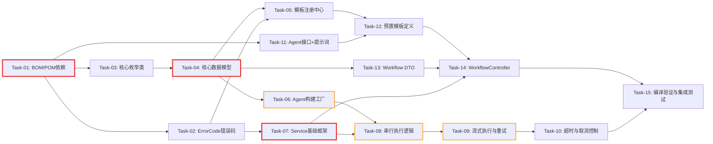

# 开发任务计划: 应用编排层 (agent-demo-app) -- 阶段一

## 0. 任务概览 (Task Overview)

* **总任务数**: 15 个

* **预计总工时**: 460 分钟（约 7.7 小时）

* **开发方法**: TDD（测试驱动开发）- 每个任务按 Red-Green-Refactor 循环执行

* **关键里程碑**:

  * 基础设施 + 核心模型完成：Task-01 \~ Task-04（约 70m）

  * 注册适配 + 执行引擎完成：Task-05 \~ Task-10（约 230m）

  * 模板 + Web + 集成验证完成：Task-11 \~ Task-15（约 160m）

* **风险任务**: Task-06（AgenticAgentFactory 桥接）, Task-08（串行执行核心）, Task-09（流式执行与重试）

* **阻塞任务**: Task-01（BOM/POM 依赖，所有任务前置）, Task-04（数据模型，多个任务依赖）, Task-07（Service 框架，执行逻辑依赖）

### 依赖关系图

### 可并行任务组

| 并行组   | 可同时执行的任务                    | 说明                               |
| :---- | :-------------------------- | :------------------------------- |
| 并行组 1 | Task-02 + Task-03 + Task-11 | ErrorCode、枚举类、Agent 接口互不依赖，可同时开发 |
| 并行组 2 | Task-05 + Task-13           | 模板注册中心与 Web DTO 互不依赖，可同时开发       |
| 并行组 3 | Task-06 + Task-12           | Agent 工厂与预置模板定义可并行（模板注册不依赖工厂）    |

## 1. 准备工作 (Preparation)

* [x] **Prep-01**: 确认功能分支

  * 说明：当前在 main 分支，可直接开发（项目为学习示例项目）

* [x] **Prep-02**: 确认 langchain4j-agentic 版本可用

  * 说明：已调研确认 `1.17.2-beta27` 在 Maven Central 可用，与项目 langchain4j 1.17.2 版本对齐

* [x] **Prep-03**: 确认测试环境就绪

  * 说明：项目已配置 spring-boot-starter-test（JUnit 5），现有测试可正常运行

## 2. 开发任务 (Development Tasks)

> 按依赖顺序排列，每个任务按 TDD 循环执行：RED（写测试）-> GREEN（写实现）-> REFACTOR（重构）
>
> **项目技术栈提示**：Java 17 + Spring Boot 3.2.5 + Lombok + JUnit 5 + 构造器注入

### 阶段一：基础设施层 (Infrastructure)

> **阶段完成标准**: BOM/POM 依赖变更完成且编译通过，ErrorCode 新增错误码可用

* [x] **Task-01**: 🔒 BOM + POM 依赖变更

  * **通俗解释**: 做完这步后，项目就引入了 LangChain4j 的多 Agent 编排能力库，后续代码可以使用它的 API 来构建和编排 Agent。

  * **说明**: 在 BOM 中新增 `langchain4j-agentic` 依赖声明；在 `agent-demo-app/pom.xml` 中引用该依赖；在 `agent-demo-web/pom.xml` 中新增 `agent-demo-app` 模块依赖

  * **涉及文件**:

    * `agent-demo-bom/pom.xml`（修改：dependencyManagement 新增 langchain4j-agentic）

    * `agent-demo-app/pom.xml`（修改：dependencies 新增 langchain4j-agentic）

    * `agent-demo-web/pom.xml`（修改：dependencies 新增 agent-demo-app）

  * **测试文件**: 无（基础设施变更，编译验证即可）

  * **参考**: 技术方案 Sec 10 文件变更清单

  * **对应AC**: AC-012（开发者定义工作流模板的前置条件）

  * **预估工时**: 15m

  * **依赖**: 无

  * **验证标准**（TDD RED 阶段的测试依据）:

    * [ ] `mvn compile -pl agent-demo-app -am` 编译通过，无依赖解析错误

    * [ ] `mvn compile -pl agent-demo-web -am` 编译通过，agent-demo-app 模块被引入

    * [ ] BOM 中 `langchain4j-agentic` 版本为 `${langchain4j.beta.version}`（1.17.2-beta27）

* [x] **Task-02**: 新增 ErrorCode 工作流错误码

  * **通俗解释**: 做完这步后，系统在遇到工作流相关的问题时（比如模板不存在、参数缺失），能用统一的错误码来报告具体原因。

  * **说明**: 在 ErrorCode 枚举中新增 WORKFLOW\_\* 段错误码（5500-5505）

  * **涉及文件**: `agent-demo-common/src/main/java/com/agentdemo/common/exception/ErrorCode.java`（修改）

  * **测试文件**: `agent-demo-common/src/test/java/com/agentdemo/common/exception/ErrorCodeTest.java`

  * **参考**: 技术方案 Sec 5 异常处理

  * **对应AC**: AC-013, AC-014, AC-018, AC-022, AC-023

  * **预估工时**: 10m

  * **依赖**: 无（可与 Task-01 并行，但需 Task-01 完成后才能编译验证）

  * **验证标准**（TDD RED 阶段的测试依据）:

    * [ ] `ErrorCode.WORKFLOW_NOT_FOUND.getCode()` 返回 5500

    * [ ] `ErrorCode.WORKFLOW_PARAM_MISSING.getCode()` 返回 5501

    * [ ] `ErrorCode.WORKFLOW_MODEL_NOT_FOUND.getCode()` 返回 5502

    * [ ] `ErrorCode.WORKFLOW_EXECUTION_FAILED.getCode()` 返回 5503

    * [ ] `ErrorCode.WORKFLOW_TIMEOUT.getCode()` 返回 5504

    * [ ] `ErrorCode.WORKFLOW_ALREADY_TERMINATED.getCode()` 返回 5505

    * [ ] 所有新增错误码的 `getMessage()` 返回非空中文描述

### 阶段二：核心模型层 (Core Model)

> **阶段完成标准**: 所有枚举和数据模型类编译通过，字段完整，Builder 模式可用

* [x] **Task-03**: 🔒 创建核心枚举类

  * **通俗解释**: 做完这步后，系统就有了描述工作流"类型"和"状态"的标准词汇，比如"串行编排"、"执行中"、"已完成"等。

  * **说明**: 创建 3 个枚举类：OrchestrationMode（编排模式）、WorkflowExecutionStatus（工作流执行状态）、StepStatus（步骤执行状态）

  * **涉及文件**:

    * `agent-demo-app/src/main/java/com/agentdemo/app/core/OrchestrationMode.java`（新增）

    * `agent-demo-app/src/main/java/com/agentdemo/app/core/WorkflowExecutionStatus.java`（新增）

    * `agent-demo-app/src/main/java/com/agentdemo/app/core/StepStatus.java`（新增）

  * **测试文件**: `agent-demo-app/src/test/java/com/agentdemo/app/core/EnumsTest.java`

  * **参考**: 技术方案 Sec 4.1 包结构 + Sec 4.3 状态机

  * **对应AC**: AC-001（模板列表含 mode 字段）, AC-022（TERMINATED 状态）, AC-023（TIMEOUT 状态）

  * **预估工时**: 15m

  * **依赖**: Task-01（需要 agentic 依赖才能编译）

  * **验证标准**（TDD RED 阶段的测试依据）:

    * [ ] `OrchestrationMode` 包含 SEQUENTIAL, PARALLEL, CONDITIONAL, LOOP, SUPERVISOR 五个值

    * [ ] `WorkflowExecutionStatus` 包含 PENDING, RUNNING, COMPLETED, FAILED, TERMINATED, TIMEOUT 六个值

    * [ ] `StepStatus` 包含 PENDING, RUNNING, COMPLETED, FAILED 四个值

    * [ ] 每个枚举值有中文描述字段（如 `SEQUENTIAL("串行编排")`）

* [x] **Task-04**: 🔒 创建核心数据模型类

  * **通俗解释**: 做完这步后，系统就有了装"工作流设计图"和"执行记录"的容器，后续所有逻辑都围绕这些数据结构展开。

  * **说明**: 创建 5 个数据模型类（Lombok @Data + @Builder）：ParameterDefinition、AgentDefinition、WorkflowTemplate、StepExecution、WorkflowExecution

  * **涉及文件**:

    * `agent-demo-app/src/main/java/com/agentdemo/app/core/ParameterDefinition.java`（新增）

    * `agent-demo-app/src/main/java/com/agentdemo/app/core/AgentDefinition.java`（新增）

    * `agent-demo-app/src/main/java/com/agentdemo/app/core/WorkflowTemplate.java`（新增）

    * `agent-demo-app/src/main/java/com/agentdemo/app/core/StepExecution.java`（新增）

    * `agent-demo-app/src/main/java/com/agentdemo/app/core/WorkflowExecution.java`（新增）

  * **测试文件**: `agent-demo-app/src/test/java/com/agentdemo/app/core/ModelTest.java`

  * **参考**: 技术方案 Sec 4.1 包结构 + Sec 4.2 核心类设计

  * **对应AC**: AC-002（模板详情含 agents/parameters）, AC-011（执行状态含 steps）, AC-025（工具预定义）, AC-026（maxRetries 可配置）, AC-028（按 Agent 配置 modelId）

  * **预估工时**: 30m

  * **依赖**: Task-03（依赖枚举类）

  * **验证标准**（TDD RED 阶段的测试依据）:

    * [ ] `ParameterDefinition.builder().name("topic").type("string").required(true).description("研究主题").build()` 创建成功，字段值正确

    * [ ] `AgentDefinition.builder().name("研究 Agent").modelId(null).toolIds(List.of("builtin:httpGet")).interfaceClass(ResearchAgent.class).build()` 创建成功

    * [ ] `WorkflowTemplate.builder().id("test").name("测试").mode(OrchestrationMode.SEQUENTIAL).maxRetries(3).agents(List.of()).parameters(List.of()).build()` 创建成功

    * [ ] `StepExecution` 包含 agentName, index, status, output, error, retryCount, startTime, endTime 字段

    * [ ] `WorkflowExecution` 包含 executionId, templateId, templateName, status, steps, finalResult, startTime, endTime 字段

    * [ ] `WorkflowExecution.getStatus()` 初始值为 PENDING

### 阶段三：注册与适配层 (Registry + Adapter)

> **阶段完成标准**: 模板注册中心可注册/查询模板，Agent 构建工厂能桥接 ModelFactory/ToolRegistry/PromptTemplateLoader 构建 Agent

* [x] **Task-05**: 实现 WorkflowTemplateRegistry

  * **通俗解释**: 做完这步后，系统就有了一个"模板仓库"，开发者定义的工作流模板都存放在这里，用户查询和执行时都从这里取。

  * **说明**: 实现 `WorkflowTemplateRegistry` 组件，包含 register/getTemplate/listTemplates 三个方法，使用 ConcurrentHashMap 存储

  * **涉及文件**: `agent-demo-app/src/main/java/com/agentdemo/app/registry/WorkflowTemplateRegistry.java`（新增）

  * **测试文件**: `agent-demo-app/src/test/java/com/agentdemo/app/registry/WorkflowTemplateRegistryTest.java`

  * **参考**: 技术方案 Sec 4.2.3

  * **对应AC**: AC-001（模板列表）, AC-002（模板详情）, AC-013（模板不存在报错）, AC-024（启动时自动注册）

  * **预估工时**: 20m

  * **依赖**: Task-02（ErrorCode）, Task-04（数据模型）

  * **验证标准**（TDD RED 阶段的测试依据）:

    * [ ] `register(template)` 后 `listTemplates()` 返回包含该模板的列表

    * [ ] `getTemplate("test-id")` 返回已注册的模板对象

    * [ ] `getTemplate("non-existent")` 抛出 `BusinessException`，errorCode 为 `WORKFLOW_NOT_FOUND`

    * [ ] `register(重复ID模板)` 抛出 `IllegalStateException`

    * [ ] `listTemplates()` 返回不可变列表（`List.copyOf`）

* [x] **Task-06**: ⚠️ 实现 AgenticAgentFactory

  * **通俗解释**: 做完这步后，系统就能根据配置把一个"Agent 定义"变成真正能运行的 Agent 实例，自动连接好 AI 模型、工具和提示词。

  * **说明**: 实现 `AgenticAgentFactory` 组件，使用 `AgenticServices.agentBuilder()` 构建 Agent，桥接 ModelFactory（获取流式模型）、ToolRegistry（解析工具）、PromptTemplateLoader（组合系统提示词）

  * **涉及文件**: `agent-demo-app/src/main/java/com/agentdemo/app/adapter/AgenticAgentFactory.java`（新增）

  * **测试文件**: `agent-demo-app/src/test/java/com/agentdemo/app/adapter/AgenticAgentFactoryTest.java`

  * **参考**: 技术方案 Sec 4.2.1 + Sec 8 决策 1

  * **对应AC**: AC-018（模型未配置报错）, AC-019（工具未注册 WARNING）, AC-025（工具预定义）, AC-028（按 Agent 配置模型）

  * **预估工时**: 45m

  * **依赖**: Task-04（AgentDefinition 数据模型）

  * **风险标注**: ⚠️ 首次使用 `AgenticServices.agentBuilder()` API，需验证 beta API 兼容性；需 Mock ModelFactory/ToolRegistry/PromptTemplateLoader

  * **验证标准**（TDD RED 阶段的测试依据）:

    * [ ] `buildAgent(agentDef)` 返回非 null 的 Agent 代理对象

    * [ ] 当 `agentDef.modelId` 为 null 时，调用 `modelFactory.getDefaultStreamingChatModel()`

    * [ ] 当 `agentDef.modelId` 为 "vendor1:model1" 时，调用 `modelFactory.getStreamingChatModelByModelId("vendor1:model1")`

    * [ ] 当 `agentDef.toolIds` 为空列表时，不调用 `toolRegistry.resolveTools()`

    * [ ] 当 `agentDef.toolIds` 含 "builtin:httpGet" 时，调用 `toolRegistry.resolveTools(List.of("builtin:httpGet"))`

    * [ ] `systemMessageProvider` 调用 `promptTemplateLoader.composeSystemPrompt(roleName, scenarioName)`

    * [ ] 当 modelId 对应模型不存在时，抛出 `BusinessException`（errorCode=WORKFLOW\_MODEL\_NOT\_FOUND）

### 阶段四：业务逻辑层 (Business Logic)

> **阶段完成标准**: 工作流执行引擎完整可用，包含串行执行、流式输出、重试、超时、取消

* [x] **Task-07**: 🔒 实现 WorkflowExecutionService 基础框架

  * **通俗解释**: 做完这步后，系统就能接收"执行工作流"的请求，创建执行记录并分配执行 ID，后续可以查询执行状态或终止执行。

  * **说明**: 实现 `WorkflowExecutionService` 基础框架：execute() 入口方法（创建执行实例 + 异步执行）、getExecution() 查询、terminate() 终止，使用 ConcurrentHashMap 存储执行实例和取消标志

  * **涉及文件**: `agent-demo-app/src/main/java/com/agentdemo/app/service/WorkflowExecutionService.java`（新增）

  * **测试文件**: `agent-demo-app/src/test/java/com/agentdemo/app/service/WorkflowExecutionServiceTest.java`

  * **参考**: 技术方案 Sec 4.2.2

  * **对应AC**: AC-011（查询执行状态）, AC-020（并发执行）, AC-022（终止执行）

  * **预估工时**: 30m

  * **依赖**: Task-02（ErrorCode）, Task-04（数据模型）

  * **验证标准**（TDD RED 阶段的测试依据）:

    * [ ] `execute(template, params, emitter, null)` 创建 `WorkflowExecution`，生成唯一 executionId，状态为 RUNNING

    * [ ] `getExecution(executionId)` 返回对应的 `WorkflowExecution` 对象

    * [ ] `getExecution("non-existent")` 返回 null 或抛出异常

    * [ ] `terminate(executionId)` 将执行状态设为 TERMINATED

    * [ ] 并发调用 `execute()` 两次，生成两个不同的 executionId，两个执行实例独立存在

* [x] **Task-08**: ⚠️ 实现串行执行核心逻辑

  * **通俗解释**: 做完这步后，系统就能按顺序逐个执行工作流中的 Agent，第一个 Agent 的输出自动传给第二个，用户能看到"正在执行第 X 个 Agent"的进度。

  * **说明**: 实现 `executeSequential()` 方法：遍历 agents 列表，逐个调用 `agentFactory.buildAgent()` + 执行，推送 step\_start/step\_complete SSE 事件，Agent 间通过 currentInput 变量传递输出

  * **涉及文件**: `agent-demo-app/src/main/java/com/agentdemo/app/service/WorkflowExecutionService.java`（修改：新增 executeSequential 方法）

  * **测试文件**: `agent-demo-app/src/test/java/com/agentdemo/app/service/SequentialExecutionTest.java`

  * **参考**: 技术方案 Sec 4.2.2 executeSequential 方法

  * **对应AC**: AC-003（执行串行工作流）, AC-008（实时步骤进度）, AC-010（最终结果）, AC-021（空输出传递）

  * **预估工时**: 45m

  * **依赖**: Task-06（AgentFactory）, Task-07（Service 框架）

  * **风险标注**: ⚠️ 需 Mock Agent 执行（返回固定字符串而非真实 LLM 调用），验证 Agent 间数据传递和 SSE 事件顺序

  * **验证标准**（TDD RED 阶段的测试依据）:

    * [ ] 3 个 Agent 的工作流，按顺序执行，step\_start 事件中 agentIndex 依次为 0, 1, 2

    * [ ] 第 1 个 Agent 的输出作为第 2 个 Agent 的输入（Mock 验证调用参数）

    * [ ] 每个 Agent 执行完成后推送 step\_complete 事件，含 agentName 和 durationMs

    * [ ] 全部完成后推送 workflow\_complete 事件，含 finalResult

    * [ ] 当某个 Agent 返回空字符串时，后续 Agent 正常执行（不抛异常），step\_complete 标注 outputLength=0

* [x] **Task-09**: ⚠️ 实现 Agent 流式执行与重试

  * **通俗解释**: 做完这步后，用户能看到每个 Agent "一边思考一边输出"的打字机效果，而且某个 Agent 出错时会自动重试最多 3 次。

  * **说明**: 实现 `executeAgentStreaming()`（通过反射调用 Agent 的 @Agent 方法，获取 TokenStream，注册 onPartialResponse/onCompleteResponse/onError 回调，推送 token SSE 事件）和 `executeAgentWithRetry()`（重试循环，推送 step\_retry/step\_error 事件）

  * **涉及文件**: `agent-demo-app/src/main/java/com/agentdemo/app/service/WorkflowExecutionService.java`（修改：新增 executeAgentStreaming + executeAgentWithRetry 方法）

  * **测试文件**: `agent-demo-app/src/test/java/com/agentdemo/app/service/AgentStreamingRetryTest.java`

  * **参考**: 技术方案 Sec 4.2.2 executeAgentStreaming + executeAgentWithRetry

  * **对应AC**: AC-009（流式输出）, AC-015（自动重试）, AC-026（重试次数可配置）

  * **预估工时**: 60m

  * **依赖**: Task-08（串行执行框架）

  * **风险标注**: ⚠️ TokenStream 回调机制需验证；CompletableFuture 等待流式完成的异步逻辑需测试；反射调用 @Agent 方法需处理异常

  * **验证标准**（TDD RED 阶段的测试依据）:

    * [ ] Agent 执行时，onPartialResponse 回调推送 token SSE 事件（含 agentIndex 和 content）

    * [ ] 流式完成后，onCompleteResponse 回调完成 CompletableFuture，返回完整文本

    * [ ] Agent 首次执行失败时，推送 step\_retry 事件（retryCount=1, remainingRetries=2）

    * [ ] Agent 重试成功时，不推送 step\_error，正常推送 step\_complete

    * [ ] Agent 重试 maxRetries 次后全部失败，推送 step\_error 事件（retryCount=maxRetries），抛出异常

    * [ ] 当 maxRetries=5 时，重试次数为 5 而非默认 3

* [x] **Task-10**: 实现超时与取消控制

  * **通俗解释**: 做完这步后，如果某个 Agent 执行太久（超过 5 分钟）或者用户手动点击"停止"，工作流会自动终止并通知用户。

  * **说明**: 实现超时控制（`CompletableFuture.get(5, MINUTES)` 超时抛出 WorkflowTimeoutException）和取消控制（`cancelFlags` AtomicBoolean，步骤间检查，推送 workflow\_failed 事件含 status=TERMINATED/TIMEOUT）

  * **涉及文件**: `agent-demo-app/src/main/java/com/agentdemo/app/service/WorkflowExecutionService.java`（修改：完善超时和取消逻辑）

  * **测试文件**: `agent-demo-app/src/test/java/com/agentdemo/app/service/TimeoutCancelTest.java`

  * **参考**: 技术方案 Sec 4.2.2 + Sec 5 异常处理

  * **对应AC**: AC-022（用户中止）, AC-023（执行超时）

  * **预估工时**: 30m

  * **依赖**: Task-09（流式执行框架）

  * **验证标准**（TDD RED 阶段的测试依据）:

    * [ ] Agent 执行超过 5 分钟时，抛出 WorkflowTimeoutException，推送 workflow\_failed 事件（status=TIMEOUT）

    * [ ] 用户调用 terminate(executionId) 后，下一个 Agent 执行前检查 cancelFlags，停止执行

    * [ ] 取消后推送 workflow\_failed 事件（status=TERMINATED），含"用户主动终止"描述

    * [ ] 已完成或已终止的工作流再次调用 terminate() 时，推送 workflow\_failed（status=ALREADY\_TERMINATED）或返回已终止状态

    * [ ] SseEmitter onTimeout/onError 回调触发 cancel()

### 阶段五：模板层 (Template)

> **阶段完成标准**: 预置串行工作流模板"研究-分析-总结"注册成功，3 个 Agent 接口可编译，提示词模板可加载

* [x] **Task-11**: 创建 Agent 接口与提示词模板

  * **通俗解释**: 做完这步后，系统就有了"研究 Agent"、"分析 Agent"、"总结 Agent"三个角色定义，每个角色都知道自己该做什么、怎么做。

  * **说明**: 创建 3 个 Agent 接口（@Agent + @UserMessage + @V 注解，返回 TokenStream）和 3 个场景提示词模板文件

  * **涉及文件**:

    * `agent-demo-app/src/main/java/com/agentdemo/app/template/ResearchAgent.java`（新增）

    * `agent-demo-app/src/main/java/com/agentdemo/app/template/AnalysisAgent.java`（新增）

    * `agent-demo-app/src/main/java/com/agentdemo/app/template/SummaryAgent.java`（新增）

    * `agent-demo-app/src/main/resources/prompts/app/research.txt`（新增）

    * `agent-demo-app/src/main/resources/prompts/app/analysis.txt`（新增）

    * `agent-demo-app/src/main/resources/prompts/app/summary.txt`（新增）

  * **测试文件**: `agent-demo-app/src/test/java/com/agentdemo/app/template/AgentInterfaceTest.java`

  * **参考**: 技术方案 Sec 4.2.4

  * **对应AC**: AC-012（开发者定义模板）

  * **预估工时**: 20m

  * **依赖**: Task-01（langchain4j-agentic 依赖）

  * **验证标准**（TDD RED 阶段的测试依据）:

    * [ ] `ResearchAgent` 接口含 `@Agent` 注解方法和 `@UserMessage` 模板，返回 `TokenStream`

    * [ ] `ResearchAgent.execute()` 方法含 `@V("topic")` 参数

    * [ ] `AnalysisAgent.execute()` 方法含 `@V("researchResult")` 参数

    * [ ] `SummaryAgent.execute()` 方法含 `@V("analysisResult")` 参数

    * [ ] `prompts/app/research.txt` 文件存在于 classpath，内容非空

    * [ ] `prompts/app/analysis.txt` 文件存在于 classpath，内容非空

    * [ ] `prompts/app/summary.txt` 文件存在于 classpath，内容非空

* [x] **Task-12**: 实现 ResearchAnalyzeSummarizeTemplate 预置模板

  * **通俗解释**: 做完这步后，系统启动时自动注册一个"研究-分析-总结"工作流模板，用户可以通过 API 查到它并执行。

  * **说明**: 创建 `@Configuration` 类，定义 `@Bean` 方法构建 `WorkflowTemplate`（3 个 AgentDefinition + 1 个 ParameterDefinition），注册到 WorkflowTemplateRegistry，含工具不存在时的 WARNING 日志

  * **涉及文件**: `agent-demo-app/src/main/java/com/agentdemo/app/template/ResearchAnalyzeSummarizeTemplate.java`（新增）

  * **测试文件**: `agent-demo-app/src/test/java/com/agentdemo/app/template/ResearchAnalyzeSummarizeTemplateTest.java`

  * **参考**: 技术方案 Sec 4.2.5

  * **对应AC**: AC-012（开发者定义模板）, AC-019（工具未注册 WARNING）, AC-024（启动时自动注册）, AC-025（工具预定义）, AC-026（maxRetries=3）

  * **预估工时**: 30m

  * **依赖**: Task-05（Registry）, Task-11（Agent 接口）

  * **验证标准**（TDD RED 阶段的测试依据）:

    * [ ] Spring 启动后 `registry.getTemplate("research-analyze-summarize")` 返回非 null 模板

    * [ ] 模板 name 为"研究-分析-总结"，mode 为 SEQUENTIAL，maxRetries 为 3

    * [ ] 模板 agents 列表大小为 3，依次为"研究 Agent"、"分析 Agent"、"总结 Agent"

    * [ ] "研究 Agent" 的 toolIds 含 "builtin:httpGet"，interfaceClass 为 ResearchAgent.class

    * [ ] 模板 parameters 含 1 个参数（name="topic", required=true）

    * [ ] 当 ToolRegistry 中不存在 "builtin:httpGet" 时，启动日志含 WARNING 信息但不阻塞启动

### 阶段六：表现层 (Web)

> **阶段完成标准**: 5 个 REST API 接口可用，返回格式正确，SSE 事件正常推送

* [x] **Task-13**: 创建 Workflow DTO 类

  * **通俗解释**: 做完这步后，系统就定义好了工作流 API 的"请求格式"和"响应格式"，前端和 API 调用方知道该传什么参数、能收到什么数据。

  * **说明**: 创建 4 个 DTO 类：WorkflowExecuteRequest（含 parameters + modelId）、WorkflowTemplateResponse（模板摘要）、WorkflowDetailResponse（模板详情含 agents）、WorkflowExecutionResponse（执行状态含 steps）

  * **涉及文件**:

    * `agent-demo-web/src/main/java/com/agentdemo/web/dto/WorkflowExecuteRequest.java`（新增）

    * `agent-demo-web/src/main/java/com/agentdemo/web/dto/WorkflowTemplateResponse.java`（新增）

    * `agent-demo-web/src/main/java/com/agentdemo/web/dto/WorkflowDetailResponse.java`（新增）

    * `agent-demo-web/src/main/java/com/agentdemo/web/dto/WorkflowExecutionResponse.java`（新增）

  * **测试文件**: `agent-demo-web/src/test/java/com/agentdemo/web/dto/WorkflowDtoTest.java`

  * **参考**: 技术方案 Sec 2.2 接口详情

  * **对应AC**: AC-001, AC-002, AC-003, AC-011

  * **预估工时**: 20m

  * **依赖**: Task-04（数据模型，DTO 需与模型字段对应）

  * **验证标准**（TDD RED 阶段的测试依据）:

    * [ ] `WorkflowExecuteRequest` 含 `Map<String, Object> parameters` 和 `String modelId` 字段

    * [ ] `WorkflowTemplateResponse` 含 id, name, description, mode, agentCount, parameters 字段

    * [ ] `WorkflowDetailResponse` 含 id, name, description, mode, maxRetries, agents（含 name/description/modelId/tools）, parameters 字段

    * [ ] `WorkflowExecutionResponse` 含 executionId, templateId, templateName, status, startTime, endTime, steps, finalResult 字段

    * [ ] `WorkflowExecuteRequest` 可通过 `@Valid` 校验（parameters 字段 @NotNull）

* [x] **Task-14**: 实现 WorkflowController

  * **通俗解释**: 做完这步后，用户就可以通过 HTTP 接口查看工作流模板列表、查看详情、执行工作流（实时看到进度和输出）、查询执行状态和终止执行。

  * **说明**: 实现 `WorkflowController` @RestController，5 个接口端点：GET 模板列表、GET 模板详情、POST 执行工作流（SSE）、GET 执行状态、DELETE 终止执行

  * **涉及文件**: `agent-demo-web/src/main/java/com/agentdemo/web/controller/WorkflowController.java`（新增）

  * **测试文件**: `agent-demo-web/src/test/java/com/agentdemo/web/controller/WorkflowControllerTest.java`

  * **参考**: 技术方案 Sec 2.2 接口详情 + Sec 2.3 SSE 事件协议

  * **对应AC**: AC-001 \~ AC-003, AC-008 \~ AC-014, AC-018, AC-022, AC-023

  * **预估工时**: 45m

  * **依赖**: Task-05（Registry）, Task-07（Service）, Task-13（DTO）

  * **验证标准**（TDD RED 阶段的测试依据）:

    * [ ] `GET /api/app/workflows` 返回 `Result.success(List<WorkflowTemplateResponse>)`，含已注册模板

    * [ ] `GET /api/app/workflows/research-analyze-summarize` 返回 `Result.success(WorkflowDetailResponse)`，含 3 个 agents

    * [ ] `GET /api/app/workflows/non-existent` 返回 `Result.error(WORKFLOW_NOT_FOUND)`，code=5500

    * [ ] `POST /api/app/workflows/research-analyze-summarize/execute` 返回 `SseEmitter`（produces=text/event-stream）

    * [ ] 执行请求缺少必填参数 topic 时，返回 `Result.error(WORKFLOW_PARAM_MISSING)`，code=5501

    * [ ] `GET /api/app/workflows/executions/{executionId}` 返回 `Result.success(WorkflowExecutionResponse)`

    * [ ] `DELETE /api/app/workflows/executions/{executionId}` 返回 `Result.success()`，执行状态变为 TERMINATED

    * [ ] Controller 使用构造器注入 WorkflowTemplateRegistry 和 WorkflowExecutionService

### 阶段七：集成验证 (Integration)

> **阶段完成标准**: 全部模块编译通过，端到端工作流执行验证通过

* [x] **Task-15**: 编译验证与集成测试

  * **通俗解释**: 做完这步后，整个多 Agent 编排功能就能从头到尾跑通了--从查看模板列表到执行工作流、看到实时输出、查询执行结果。

  * **说明**: 执行全量编译验证（agent-demo-app + agent-demo-web），验证现有功能不受影响（SimpleAgent/AgentController 正常），执行端到端集成测试

  * **涉及文件**: 无新增文件（验证性任务）

  * **测试文件**: `agent-demo-app/src/test/java/com/agentdemo/app/integration/WorkflowIntegrationTest.java`

  * **参考**: 技术方案 Sec 9 风险与注意事项

  * **对应AC**: AC-030（现有对话页面不受影响）, 全部 P1 AC 集成验证

  * **预估工时**: 45m

  * **依赖**: Task-10, Task-12, Task-14（全部功能任务完成）

  * **验证标准**（TDD RED 阶段的测试依据）:

    * [ ] `mvn compile -pl agent-demo-app -am` 编译通过，0 error

    * [ ] `mvn compile -pl agent-demo-web -am` 编译通过，0 error

    * [ ] 现有 `agent-demo-agent` 模块测试全部通过（AC-030 验证）

    * [ ] 现有 `agent-demo-web` 模块现有测试全部通过（无回归）

    * [ ] 集成测试：GET /api/app/workflows 返回含"研究-分析-总结"模板

    * [ ] 集成测试：GET /api/app/workflows/research-analyze-summarize 返回 3 个 Agent 详情

    * [ ] 集成测试：POST execute 返回 SseEmitter，收到 workflow\_start 事件

    * [ ] 集成测试：GET /api/app/workflows/executions/{id} 返回执行状态

## 3. 验收标准检查清单 (AC Checklist)

> P1 阶段 22 条 AC 与任务的映射关系

| 验收标准ID | 验收标准描述            | 对应任务                      | 状态  |
| :----- | :---------------- | :------------------------ | :-- |
| AC-001 | 查看工作流模板列表         | Task-05, Task-14          | 已完成 |
| AC-002 | 查看模板详情            | Task-04, Task-05, Task-14 | 已完成 |
| AC-003 | 执行串行工作流           | Task-08, Task-14          | 已完成 |
| AC-008 | 实时查看步骤进度          | Task-08, Task-14          | 已完成 |
| AC-009 | 查看 Agent 流式输出     | Task-09, Task-14          | 已完成 |
| AC-010 | 查看工作流最终结果         | Task-08, Task-14          | 已完成 |
| AC-011 | 通过 REST API 调用工作流 | Task-07, Task-14          | 已完成 |
| AC-012 | 开发者定义工作流模板        | Task-11, Task-12          | 已完成 |
| AC-013 | 请求不存在的模板          | Task-02, Task-05, Task-14 | 已完成 |
| AC-014 | 缺少必填参数            | Task-02, Task-13, Task-14 | 已完成 |
| AC-015 | Agent 失败触发自动重试    | Task-09                   | 已完成 |
| AC-018 | Agent 模型未配置       | Task-02, Task-06          | 已完成 |
| AC-019 | 模板引用的工具未注册        | Task-06, Task-12          | 已完成 |
| AC-020 | 并发执行多个工作流         | Task-07                   | 已完成 |
| AC-021 | Agent 输出为空        | Task-08                   | 已完成 |
| AC-022 | 用户中止工作流执行         | Task-07, Task-10, Task-14 | 已完成 |
| AC-023 | 工作流执行超时           | Task-10, Task-14          | 已完成 |
| AC-024 | 模板启动时自动注册         | Task-05, Task-12          | 已完成 |
| AC-025 | 工具在模板中预定义不可修改     | Task-04, Task-12, Task-14 | 已完成 |
| AC-026 | 重试次数可配置           | Task-04, Task-09          | 已完成 |
| AC-028 | 按 Agent 配置不同模型    | Task-04, Task-06          | 已完成 |
| AC-030 | 现有对话页面不受影响        | Task-15                   | 已完成 |

## 4. 验证计划 (Verification Plan)

### 4.1 TDD 过程验证（每个任务内部）

* [ ] RED：测试编写完成后运行，确认全部失败

* [ ] GREEN：实现代码后运行，确认全部通过

* [ ] REFACTOR：重构后运行，确认仍全部通过

### 4.2 阶段验证检查点

| 阶段       | 验证动作                                 | 关联任务               | 通过标准                         |
| :------- | :----------------------------------- | :----------------- | :--------------------------- |
| 基础设施层完成后 | `mvn compile -pl agent-demo-app -am` | Task-01, Task-02   | 编译通过，ErrorCode 枚举含 5500-5505 |
| 核心模型层完成后 | 运行 ModelTest + EnumsTest             | Task-03, Task-04   | 枚举值完整，Builder 模式创建数据类成功      |
| 注册适配层完成后 | 运行 RegistryTest + FactoryTest        | Task-05, Task-06   | 模板注册/查询正常，Agent 构建桥接正确       |
| 业务逻辑层完成后 | 运行 ServiceTest 全套                    | Task-07 \~ Task-10 | 串行执行、流式输出、重试、超时、取消全部通过       |
| 模板层完成后   | Spring 上下文启动 + 模板查询                  | Task-11, Task-12   | 模板自动注册，3 个 Agent 接口编译通过      |
| 表现层完成后   | 运行 ControllerTest                    | Task-13, Task-14   | 5 个 API 接口返回格式正确，SSE 事件正常    |
| 集成验证完成后  | 全量编译 + 端到端测试                         | Task-15            | 0 编译错误，现有功能无回归，E2E 流程跑通      |

### 4.3 验收标准逐项验证

| AC     | 验证方式                                                                  | 关联任务             | 状态  |
| :----- | :-------------------------------------------------------------------- | :--------------- | :-- |
| AC-001 | 运行 Task-14 测试：GET /api/app/workflows 返回模板列表                           | Task-05, Task-14 | 已验证 |
| AC-002 | 运行 Task-14 测试：GET /api/app/workflows/glm\_5.2\_ark\_toC 返回含 agents 详情 | Task-04, Task-14 | 已验证 |
| AC-003 | 运行 Task-08 测试：3 个 Agent 顺序执行，输出传递正确                                   | Task-08          | 已验证 |
| AC-008 | 运行 Task-08 测试：step\_start/step\_complete SSE 事件推送                     | Task-08          | 已验证 |
| AC-009 | 运行 Task-09 测试：token SSE 事件推送（onPartialResponse 回调）                    | Task-09          | 已验证 |
| AC-010 | 运行 Task-08 测试：workflow\_complete 事件含 finalResult                      | Task-08          | 已验证 |
| AC-011 | 运行 Task-14 测试：GET executions/glm\_5.2\_ark\_toC 返回执行状态                | Task-07, Task-14 | 已验证 |
| AC-012 | 运行 Task-12 测试：Spring 启动后模板自动注册                                        | Task-11, Task-12 | 已验证 |
| AC-013 | 运行 Task-05 测试：getTemplate(non-existent) 抛 WORKFLOW\_NOT\_FOUND        | Task-05          | 已验证 |
| AC-014 | 运行 Task-14 测试：缺少 topic 参数返回 WORKFLOW\_PARAM\_MISSING                  | Task-14          | 已验证 |
| AC-015 | 运行 Task-09 测试：Agent 失败后重试，推送 step\_retry 事件                           | Task-09          | 已验证 |
| AC-018 | 运行 Task-06 测试：modelId 不存在抛 WORKFLOW\_MODEL\_NOT\_FOUND                | Task-06          | 已验证 |
| AC-019 | 运行 Task-12 测试：工具未注册时 WARNING 日志，不阻塞启动                                 | Task-12          | 已验证 |
| AC-020 | 运行 Task-07 测试：并发 execute 生成不同 executionId                             | Task-07          | 已验证 |
| AC-021 | 运行 Task-08 测试：空输出传递，step\_complete 标注 outputLength=0                  | Task-08          | 已验证 |
| AC-022 | 运行 Task-10 测试：terminate 后 workflow\_failed(TERMINATED)                | Task-10, Task-14 | 已验证 |
| AC-023 | 运行 Task-10 测试：超时后 workflow\_failed(TIMEOUT)                           | Task-10          | 已验证 |
| AC-024 | 运行 Task-12 测试：@Bean 方法注册模板到 Registry                                  | Task-12          | 已验证 |
| AC-025 | 运行 Task-14 测试：执行 API 不接受 tools 参数                                     | Task-14          | 已验证 |
| AC-026 | 运行 Task-09 测试：maxRetries=5 时重试 5 次                                    | Task-09          | 已验证 |
| AC-028 | 运行 Task-06 测试：不同 modelId 调用不同 ModelFactory 方法                         | Task-06          | 已验证 |
| AC-030 | 运行 Task-15 测试：agent-demo-agent 现有测试全部通过                               | Task-15          | 已验证 |

### 4.4 最终验证（所有阶段完成后）

* [ ] `mvn compile` 全量编译通过（0 error）

* [ ] 运行全部新增测试（agent-demo-app + agent-demo-web），覆盖率 > 80%

* [ ] 运行全部现有测试，无回归

* [ ] 按照 22 条 P1 AC 逐项端到端验证

* [ ] Swagger UI 可访问，5 个工作流 API 接口文档正确

## 5. 风险与注意事项 (Risks & Notes)

* **技术风险**:

  * ⚠️ Task-06（AgenticAgentFactory）：首次使用 `AgenticServices.agentBuilder()` beta API，可能遇到 API 不兼容。缓解：准备降级方案，改用 `AiServices.builder()` + 自定义 ReAct 循环

  * ⚠️ Task-09（流式执行与重试）：`TokenStream` + `CompletableFuture` 异步组合可能有线程安全问题。缓解：充分测试回调时序，确保 `onCompleteResponse` 在所有 `onPartialResponse` 之后触发

  * ⚠️ Task-08（串行执行）：`@V` 参数在非 `sequenceBuilder` 场景下行为未知。缓解：如 `@V` 不工作，改用 `@UserMessage` 模板变量或直接方法参数

* **依赖风险**: langchain4j-agentic beta 版本可能在开发期间发布新版本导致 API 变更。缓解：BOM 锁定 `1.17.2-beta27`，不自动升级

* **时间风险**: 如工时超出预期，Task-10（超时与取消）可简化为仅超时控制，取消控制延后到 P2

* **质量保证**: 每个任务通过 TDD 循环保证代码质量，7 个阶段验证检查点保证整体稳定性，22 条 AC 逐项验证保证需求覆盖

