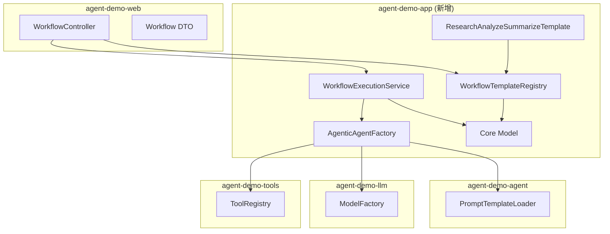
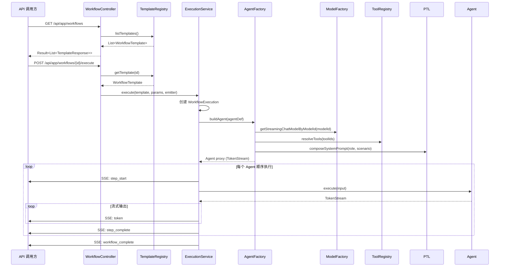

# 技术设计文档: 应用编排层 (agent-demo-app) -- 阶段一

## 0. 设计概要 (Design Summary)

*   **功能描述**：基于 `langchain4j-agentic` 模块构建多 Agent 编排适配层，实现串行工作流编排能力，通过 REST API 和 SSE 提供工作流模板管理与执行可视化
*   **影响范围**：`agent-demo-app`（新增全部代码）、`agent-demo-bom`（新增依赖）、`agent-demo-web`（新增 Controller + DTO）、`agent-demo-common`（新增错误码）
*   **技术难点**：
    1. langchain4j-agentic beta 依赖与项目现有 ModelFactory/ToolRegistry/PromptTemplateLoader 的桥接
    2. AgenticServices.agentBuilder() 构建的 Agent 返回 TokenStream 时的 SSE 事件捕获
    3. 自定义 SequentialWorkflowExecutor 中 Agent 间数据传递与失败重试
*   **依赖关系**：引入 `langchain4j-agentic:1.17.2-beta27`；依赖现有 `ModelFactory`、`ToolRegistry`、`PromptTemplateLoader`

## 1. 架构概览 (Architecture Overview)

### 1.1 模块交互关系



### 1.2 数据流向



### 1.3 关键设计决策

**使用 `AgenticServices.agentBuilder()` + 自定义 `SequentialWorkflowExecutor`**

*   `AgenticServices.agentBuilder()` 负责单个 Agent 构建（桥接 ModelFactory/ToolRegistry/PromptTemplateLoader）
*   自定义 `SequentialWorkflowExecutor` 负责编排执行（SSE 事件推送、重试、超时、取消）
*   **不使用 `sequenceBuilder()`**：其流式输出支持不稳定（beta22 NPE Bug），且 Listener API 对 token 级事件支持不足
*   P2/P3 待 API 成熟后迁移到 `sequenceBuilder()`

## 2. API 设计 (API Design)

> 遵循项目 RESTful 风格，统一返回 `Result<T>`，SSE 使用 `SseEmitter`

### 2.1 接口列表

| 接口名称 | 方法 | 路径 | 描述 | 对应 AC |
| :--- | :--- | :--- | :--- | :--- |
| 查询模板列表 | GET | /api/app/workflows | 获取所有已注册工作流模板 | AC-001 |
| 查询模板详情 | GET | /api/app/workflows/{templateId} | 获取单个模板完整信息 | AC-002 |
| 执行工作流 | POST | /api/app/workflows/{templateId}/execute | 异步执行工作流，返回 SSE 流 | AC-003, AC-008, AC-009, AC-010 |
| 查询执行状态 | GET | /api/app/workflows/executions/{executionId} | 查询执行实例状态和结果 | AC-011 |
| 终止执行 | DELETE | /api/app/workflows/executions/{executionId} | 终止正在执行的工作流 | AC-022 |

### 2.2 接口详情

#### 接口 1: 查询模板列表

*   **路径**: `GET /api/app/workflows`
*   **描述**: 获取所有已注册的工作流模板摘要列表
*   **Request**: 无参数
*   **Response (成功)**:
    ```json
    {
      "success": true,
      "code": 200,
      "data": [
        {
          "id": "research-analyze-summarize",
          "name": "研究-分析-总结",
          "description": "串行工作流：研究 Agent 收集信息 → 分析 Agent 提取洞察 → 总结 Agent 生成报告",
          "mode": "SEQUENTIAL",
          "agentCount": 3,
          "parameters": [
            {"name": "topic", "type": "string", "required": true, "description": "研究主题"}
          ]
        }
      ]
    }
    ```

#### 接口 2: 查询模板详情

*   **路径**: `GET /api/app/workflows/{templateId}`
*   **描述**: 获取单个模板的完整信息，包含每个 Agent 的配置
*   **Response (成功)**:
    ```json
    {
      "success": true,
      "code": 200,
      "data": {
        "id": "research-analyze-summarize",
        "name": "研究-分析-总结",
        "description": "...",
        "mode": "SEQUENTIAL",
        "maxRetries": 3,
        "agents": [
          {
            "name": "研究 Agent",
            "description": "负责收集主题相关的研究信息",
            "modelId": "vendor1:doubao-seed-2.0-pro",
            "tools": ["builtin:httpGet"]
          },
          {
            "name": "分析 Agent",
            "description": "分析研究内容，提取关键洞察",
            "modelId": null,
            "tools": []
          },
          {
            "name": "总结 Agent",
            "description": "将分析结果总结为报告",
            "modelId": null,
            "tools": []
          }
        ],
        "parameters": [
          {"name": "topic", "type": "string", "required": true, "description": "研究主题"}
        ]
      }
    }
    ```
*   **Response (失败)**:
    ```json
    {"success": false, "code": 5500, "message": "工作流模板不存在: non-existent"}
    ```

#### 接口 3: 执行工作流

*   **路径**: `POST /api/app/workflows/{templateId}/execute`
*   **描述**: 异步执行工作流，通过 SSE 推送执行进度和 Agent 流式输出
*   **produces**: `text/event-stream`
*   **Request**:
    ```json
    {
      "parameters": {"topic": "AI Agent 技术趋势"},
      "modelId": null
    }
    ```
*   **Response**: `SseEmitter`（超时 5 分钟），SSE 事件序列：
    ```json
    // 事件: workflow_start
    {"executionId": "a1b2c3d4", "templateName": "研究-分析-总结", "agentCount": 3}

    // 事件: step_start
    {"agentIndex": 0, "agentName": "研究 Agent", "totalAgents": 3}

    // 事件: token (多次)
    {"agentIndex": 0, "content": "近年来"}

    // 事件: step_complete
    {"agentIndex": 0, "agentName": "研究 Agent", "durationMs": 5200, "outputLength": 1523}

    // 事件: step_start
    {"agentIndex": 1, "agentName": "分析 Agent", "totalAgents": 3}

    // ... (重复 token / step_complete)

    // 事件: workflow_complete
    {"executionId": "a1b2c3d4", "finalResult": "...", "totalDurationMs": 15800}
    ```
*   **异常 Response (SSE 事件)**:
    ```json
    // 事件: step_retry
    {"agentIndex": 1, "retryCount": 1, "remainingRetries": 2}

    // 事件: step_error
    {"agentIndex": 1, "error": "LLM 调用超时", "retryCount": 3}

    // 事件: workflow_failed
    {"executionId": "a1b2c3d4", "failedAgent": "分析 Agent", "error": "LLM 调用超时", "status": "FAILED"}
    ```

#### 接口 4: 查询执行状态

*   **路径**: `GET /api/app/workflows/executions/{executionId}`
*   **Response (成功)**:
    ```json
    {
      "success": true,
      "code": 200,
      "data": {
        "executionId": "a1b2c3d4",
        "templateId": "research-analyze-summarize",
        "templateName": "研究-分析-总结",
        "status": "COMPLETED",
        "startTime": "2026-08-13T14:30:00",
        "endTime": "2026-08-13T14:30:15",
        "steps": [
          {"agentName": "研究 Agent", "status": "COMPLETED", "durationMs": 5200},
          {"agentName": "分析 Agent", "status": "COMPLETED", "durationMs": 6800},
          {"agentName": "总结 Agent", "status": "COMPLETED", "durationMs": 3800}
        ],
        "finalResult": "..."
      }
    }
    ```

#### 接口 5: 终止执行

*   **路径**: `DELETE /api/app/workflows/executions/{executionId}`
*   **Response**:
    ```json
    {"success": true, "code": 200, "message": "工作流已终止"}
    ```

### 2.3 SSE 事件协议

| 事件名 | 触发时机 | data 字段 |
| :--- | :--- | :--- |
| `workflow_start` | 工作流开始执行 | `executionId`, `templateName`, `agentCount` |
| `step_start` | 某个 Agent 开始执行 | `agentIndex`, `agentName`, `totalAgents` |
| `token` | Agent 流式输出片段 | `agentIndex`, `content` |
| `step_complete` | Agent 执行完成 | `agentIndex`, `agentName`, `durationMs`, `outputLength` |
| `step_retry` | Agent 重试 | `agentIndex`, `retryCount`, `remainingRetries` |
| `step_error` | Agent 重试耗尽失败 | `agentIndex`, `error`, `retryCount` |
| `workflow_complete` | 工作流全部完成 | `executionId`, `finalResult`, `totalDurationMs` |
| `workflow_failed` | 工作流失败/终止/超时 | `executionId`, `failedAgent`, `error`, `status` |

## 3. 数据库设计 (Database Schema)

> P1 阶段**不涉及数据库**，所有状态存储在内存中（`ConcurrentHashMap`），与项目当前存储形态一致。

## 4. 核心逻辑与算法 (Core Logic)

### 4.1 模块与包结构

```
agent-demo-app/
  pom.xml
  src/main/java/com/agentdemo/app/
    config/
      AppConfig.java                              -- @ConfigurationProperties(prefix="app")
    core/
      OrchestrationMode.java                      -- 枚举: SEQUENTIAL, PARALLEL, CONDITIONAL, LOOP, SUPERVISOR
      WorkflowExecutionStatus.java                -- 枚举: PENDING, RUNNING, COMPLETED, FAILED, TERMINATED, TIMEOUT
      StepStatus.java                             -- 枚举: PENDING, RUNNING, COMPLETED, FAILED
      ParameterDefinition.java                    -- 参数定义 (name, type, required, description)
      AgentDefinition.java                        -- Agent 定义 (name, description, modelId, toolIds, role, scenario, interfaceClass)
      WorkflowTemplate.java                       -- 工作流模板 (id, name, description, mode, agents, parameters, maxRetries)
      StepExecution.java                          -- 步骤执行记录 (agentName, index, status, output, error, retryCount, durationMs)
      WorkflowExecution.java                      -- 执行实例 (executionId, templateId, status, steps, finalResult, startTime, endTime)
    adapter/
      AgenticAgentFactory.java                    -- Agent 构建工厂: 桥接 ModelFactory/ToolRegistry/PromptTemplateLoader
    registry/
      WorkflowTemplateRegistry.java               -- 模板注册中心: 启动时扫描注册, 运行时查询
    service/
      WorkflowExecutionService.java               -- 执行引擎: 创建/执行/查询/终止工作流
    template/
      ResearchAgent.java                          -- 研究 Agent 接口 (@Agent + @UserMessage)
      AnalysisAgent.java                          -- 分析 Agent 接口
      SummaryAgent.java                           -- 总结 Agent 接口
      ResearchAnalyzeSummarizeTemplate.java       -- 预置模板定义 (@Configuration)
  src/main/resources/
    prompts/app/
      research.txt                                -- 研究 Agent 场景提示词
      analysis.txt                                -- 分析 Agent 场景提示词
      summary.txt                                 -- 总结 Agent 场景提示词

agent-demo-web/  (新增文件)
  src/main/java/com/agentdemo/web/
    controller/
      WorkflowController.java                     -- REST API Controller
    dto/
      WorkflowExecuteRequest.java                 -- 执行请求 DTO
      WorkflowTemplateResponse.java               -- 模板响应 DTO
      WorkflowDetailResponse.java                 -- 模板详情响应 DTO
      WorkflowExecutionResponse.java              -- 执行状态响应 DTO
```

### 4.2 核心类设计

#### 4.2.1 AgenticAgentFactory -- Agent 构建工厂

**职责**: 将 `AgentDefinition` 转换为可执行的 Agentic Agent 代理实例

```java
@Component
public class AgenticAgentFactory {

    private final ModelFactory modelFactory;
    private final ToolRegistry toolRegistry;
    private final PromptTemplateLoader promptTemplateLoader;

    /**
     * 构建 Agentic Agent 代理
     * @param agentDef Agent 定义（模型、工具、提示词配置）
     * @return Agent 代理实例（接口类型由 agentDef.interfaceClass 指定）
     */
    public Object buildAgent(AgentDefinition agentDef) {
        // 1. 获取流式模型
        StreamingChatModel streamingModel = (agentDef.getModelId() != null)
                ? modelFactory.getStreamingChatModelByModelId(agentDef.getModelId())
                : modelFactory.getDefaultStreamingChatModel();

        // 2. 解析工具
        List<Object> tools = agentDef.getToolIds().isEmpty()
                ? List.of()
                : toolRegistry.resolveTools(agentDef.getToolIds());

        // 3. 构建系统提示词提供器
        // 使用 PromptTemplateLoader 组合角色 + 场景模板
        // role 默认 "general"，scenario 从 AgentDefinition 获取

        // 4. 通过 AgenticServices.agentBuilder 构建 Agent
        return AgenticServices.agentBuilder(agentDef.getInterfaceClass())
                .streamingChatModel(streamingModel)
                .tools(tools.toArray())
                .systemMessageProvider(memoryId ->
                        promptTemplateLoader.composeSystemPrompt(
                                agentDef.getRoleName(),
                                agentDef.getScenarioName()))
                .build();
    }
}
```

**关键设计**:
- 工具在 build 时固化（与 SimpleAgent 一致），工具变更需重建 Agent
- `systemMessageProvider` 动态提供系统提示词（角色 × 场景模板组合）
- 返回 `Object` 类型，由调用方按需转型为具体 Agent 接口

#### 4.2.2 WorkflowExecutionService -- 执行引擎

**职责**: 工作流执行编排，包含 SSE 事件推送、重试、超时、取消

```java
@Service
public class WorkflowExecutionService {

    private final WorkflowTemplateRegistry registry;
    private final AgenticAgentFactory agentFactory;

    // 执行实例存储（内存）
    private final ConcurrentHashMap<String, WorkflowExecution> executions = new ConcurrentHashMap<>();
    // 执行取消标志
    private final ConcurrentHashMap<String, AtomicBoolean> cancelFlags = new ConcurrentHashMap<>();

    /**
     * 执行工作流（异步，通过 SSE 推送事件）
     */
    public void execute(WorkflowTemplate template, Map<String, Object> parameters,
                        SseEmitter emitter, String modelId) {
        // 1. 创建执行实例
        String executionId = generateExecutionId();
        WorkflowExecution execution = new WorkflowExecution(executionId, template.getId(), ...);
        executions.put(executionId, execution);
        cancelFlags.put(executionId, new AtomicBoolean(false));

        // 2. 异步执行
        CompletableFuture.runAsync(() -> {
            try {
                executeSequential(template, parameters, emitter, execution, modelId);
            } catch (Exception e) {
                handleFailure(emitter, execution, e);
            }
        });

        // 3. 注册 emitter 生命周期回调
        emitter.onTimeout(() -> cancel(executionId));
        emitter.onError(e -> cancel(executionId));
    }

    /**
     * 串行执行核心逻辑
     */
    private void executeSequential(WorkflowTemplate template, Map<String, Object> params,
                                    SseEmitter emitter, WorkflowExecution execution, String modelId) {
        sendEvent(emitter, "workflow_start", Map.of(
                "executionId", execution.getExecutionId(),
                "templateName", template.getName(),
                "agentCount", template.getAgents().size()));

        String currentInput = params.get("topic").toString(); // 首个 Agent 的输入
        long workflowStartTime = System.currentTimeMillis();

        for (int i = 0; i < template.getAgents().size(); i++) {
            // 检查取消
            if (cancelFlags.get(execution.getExecutionId()).get()) {
                throw new WorkflowCancelledException();
            }

            AgentDefinition agentDef = template.getAgents().get(i);
            StepExecution step = new StepExecution(agentDef.getName(), i, StepStatus.RUNNING);
            execution.getSteps().add(step);

            sendEvent(emitter, "step_start", Map.of(
                    "agentIndex", i,
                    "agentName", agentDef.getName(),
                    "totalAgents", template.getAgents().size()));

            // 构建 Agent 并执行（含重试）
            String output = executeAgentWithRetry(agentDef, currentInput, emitter,
                                                    i, template.getMaxRetries(), modelId);

            step.complete(output);
            currentInput = output; // 传递给下一个 Agent

            sendEvent(emitter, "step_complete", Map.of(
                    "agentIndex", i,
                    "agentName", agentDef.getName(),
                    "durationMs", step.getDurationMs(),
                    "outputLength", output.length()));
        }

        execution.complete(currentInput);
        sendEvent(emitter, "workflow_complete", Map.of(
                "executionId", execution.getExecutionId(),
                "finalResult", currentInput,
                "totalDurationMs", System.currentTimeMillis() - workflowStartTime));
        emitter.complete();
    }

    /**
     * 执行单个 Agent（含重试逻辑）
     */
    private String executeAgentWithRetry(AgentDefinition agentDef, String input,
                                          SseEmitter emitter, int agentIndex,
                                          int maxRetries, String modelId) {
        // 构建 Agent
        Object agent = agentFactory.buildAgent(agentDef);

        for (int attempt = 0; attempt <= maxRetries; attempt++) {
            try {
                return executeAgentStreaming(agent, agentDef, input, emitter, agentIndex);
            } catch (Exception e) {
                if (attempt < maxRetries) {
                    sendEvent(emitter, "step_retry", Map.of(
                            "agentIndex", agentIndex,
                            "retryCount", attempt + 1,
                            "remainingRetries", maxRetries - attempt - 1));
                } else {
                    sendEvent(emitter, "step_error", Map.of(
                            "agentIndex", agentIndex,
                            "error", e.getMessage(),
                            "retryCount", maxRetries));
                    throw new WorkflowExecutionException("Agent 执行失败: " + agentDef.getName(), e);
                }
            }
        }
        throw new IllegalStateException("不应到达此处");
    }

    /**
     * 执行 Agent 并捕获流式输出
     * Agent 接口方法返回 TokenStream，通过回调捕获 token 和最终结果
     */
    private String executeAgentStreaming(Object agent, AgentDefinition agentDef,
                                          String input, SseEmitter emitter, int agentIndex) {
        // 通过反射调用 Agent 接口的 @Agent 方法
        // 方法签名: TokenStream execute(@V("input") String input)
        Method executeMethod = Arrays.stream(agentDef.getInterfaceClass().getMethods())
                .filter(m -> m.isAnnotationPresent(Agent.class))
                .findFirst()
                .orElseThrow();

        TokenStream stream = (TokenStream) executeMethod.invoke(agent, input);

        CompletableFuture<String> future = new CompletableFuture<>();

        stream.onPartialResponse(token ->
                        sendEvent(emitter, "token", Map.of("agentIndex", agentIndex, "content", token)))
              .onCompleteResponse(response -> {
                  String fullResponse = response.content().text();
                  future.complete(fullResponse != null ? fullResponse : "");
              })
              .onError(error -> future.completeExceptionally(error))
              .start();

        try {
            // 等待流式完成，超时 5 分钟
            return future.get(5, TimeUnit.MINUTES);
        } catch (TimeoutException e) {
            throw new WorkflowTimeoutException("Agent 执行超时: " + agentDef.getName(), e);
        } catch (ExecutionException e) {
            throw new WorkflowExecutionException("Agent 执行异常: " + agentDef.getName(), e.getCause());
        } catch (InterruptedException e) {
            Thread.currentThread().interrupt();
            throw new WorkflowCancelledException();
        }
    }
}
```

#### 4.2.3 WorkflowTemplateRegistry -- 模板注册中心

```java
@Component
public class WorkflowTemplateRegistry {

    private final ConcurrentHashMap<String, WorkflowTemplate> templates = new ConcurrentHashMap<>();

    /**
     * 注册工作流模板
     */
    public void register(WorkflowTemplate template) {
        // 校验名称唯一性
        if (templates.containsKey(template.getId())) {
            throw new IllegalStateException("工作流模板 ID 已存在: " + template.getId());
        }
        templates.put(template.getId(), template);
    }

    /**
     * 获取模板
     */
    public WorkflowTemplate getTemplate(String templateId) {
        WorkflowTemplate template = templates.get(templateId);
        if (template == null) {
            throw new BusinessException(ErrorCode.WORKFLOW_NOT_FOUND, templateId);
        }
        return template;
    }

    /**
     * 获取所有模板
     */
    public List<WorkflowTemplate> listTemplates() {
        return List.copyOf(templates.values());
    }
}
```

#### 4.2.4 Agent 接口定义示例

```java
// ResearchAgent.java
public interface ResearchAgent {
    @Agent
    @UserMessage("请针对以下主题进行深入研究，收集关键信息和事实：\n\n主题：{{topic}}")
    TokenStream execute(@V("topic") String topic);
}

// AnalysisAgent.java
public interface AnalysisAgent {
    @Agent
    @UserMessage("请分析以下研究内容，提取关键洞察和趋势：\n\n研究内容：{{researchResult}}")
    TokenStream execute(@V("researchResult") String researchResult);
}

// SummaryAgent.java
public interface SummaryAgent {
    @Agent
    @UserMessage("请将以下分析内容总结为简洁明了的结论报告：\n\n分析内容：{{analysisResult}}")
    TokenStream execute(@V("analysisResult") String analysisResult);
}
```

#### 4.2.5 预置模板定义

```java
@Configuration
public class ResearchAnalyzeSummarizeTemplate {

    @Bean
    public WorkflowTemplate researchAnalyzeSummarizeWorkflow(WorkflowTemplateRegistry registry) {
        WorkflowTemplate template = WorkflowTemplate.builder()
                .id("research-analyze-summarize")
                .name("研究-分析-总结")
                .description("串行工作流：研究 Agent 收集信息 → 分析 Agent 提取洞察 → 总结 Agent 生成报告")
                .mode(OrchestrationMode.SEQUENTIAL)
                .maxRetries(3)
                .agents(List.of(
                    AgentDefinition.builder()
                        .name("研究 Agent")
                        .description("负责收集主题相关的研究信息")
                        .modelId(null) // 使用默认模型
                        .toolIds(List.of("builtin:httpGet"))
                        .roleName("general")
                        .scenarioName("app-research")
                        .interfaceClass(ResearchAgent.class)
                        .build(),
                    AgentDefinition.builder()
                        .name("分析 Agent")
                        .description("分析研究内容，提取关键洞察")
                        .modelId(null)
                        .toolIds(List.of())
                        .roleName("general")
                        .scenarioName("app-analysis")
                        .interfaceClass(AnalysisAgent.class)
                        .build(),
                    AgentDefinition.builder()
                        .name("总结 Agent")
                        .description("将分析结果总结为报告")
                        .modelId(null)
                        .toolIds(List.of())
                        .roleName("general")
                        .scenarioName("app-summary")
                        .interfaceClass(SummaryAgent.class)
                        .build()
                ))
                .parameters(List.of(
                    ParameterDefinition.builder()
                        .name("topic")
                        .type("string")
                        .required(true)
                        .description("研究主题")
                        .build()
                ))
                .build();

        // 注册到注册中心
        registry.register(template);
        // 工具不存在时记录 WARNING，不阻塞启动
        logToolWarnings(template);
        return template;
    }
}
```

### 4.3 执行流程状态机

```
[PENDING] --start()--> [RUNNING]
    [RUNNING] --all steps complete--> [COMPLETED]
    [RUNNING] --agent failed (retries exhausted)--> [FAILED]
    [RUNNING] --user cancel--> [TERMINATED]
    [RUNNING] --timeout--> [TIMEOUT]

Step 状态:
    [PENDING] --step_start--> [RUNNING]
    [RUNNING] --step_complete--> [COMPLETED]
    [RUNNING] --step_error (retries exhausted)--> [FAILED]
```

### 4.4 失败重试流程

```
Agent 执行
  ├── 尝试 1: 成功 → 返回结果
  ├── 尝试 1: 失败 → 推送 step_retry → 尝试 2
  ├── 尝试 2: 成功 → 返回结果
  ├── 尝试 2: 失败 → 推送 step_retry → 尝试 3
  ├── 尝试 3: 成功 → 返回结果
  └── 尝试 3: 失败 → 推送 step_error → 抛出异常 → 工作流终止
```

## 5. 异常处理 (Error Handling)

| 异常场景 | 对应 AC | 处理方案 | 用户提示 |
| :--- | :--- | :--- | :--- |
| 模板 ID 不存在 | AC-013 | `BusinessException(WORKFLOW_NOT_FOUND)` | "工作流模板不存在: {id}" |
| 缺少必填参数 | AC-014 | Controller 层 `@Valid` 校验 + 手动校验 | "缺少必填参数: {paramName}" |
| Agent 执行失败（可重试） | AC-015 | 自动重试，推送 `step_retry` 事件 | SSE 事件包含重试次数 |
| 重试全部耗尽 | AC-015 | 推送 `step_error` + `workflow_failed` 事件 | "Agent 执行失败: {name}" |
| Agent 模型未配置 | AC-018 | `BusinessException(WORKFLOW_MODEL_NOT_FOUND)` | "Agent {name} 配置的模型不存在" |
| 工具未注册 | AC-019 | 启动时 WARNING 日志，Agent 构建时跳过该工具 | "工具 {id} 未注册，已跳过" |
| 并发执行 | AC-020 | 每次执行独立 ID + 独立状态，`ConcurrentHashMap` 存储 | 无特殊提示 |
| Agent 输出为空 | AC-021 | 空字符串正常传递给下一 Agent | `step_complete` 事件标注 `outputLength: 0` |
| 用户终止 | AC-022 | `cancelFlags` 设置 true，下一步骤前检查 | SSE 推送 `workflow_failed` (status=TERMINATED) |
| 执行超时 | AC-023 | `CompletableFuture.get(5, MINUTES)` 超时 | SSE 推送 `workflow_failed` (status=TIMEOUT) |

### 新增错误码

```java
// ErrorCode.java 新增
WORKFLOW_NOT_FOUND(5500, "工作流模板不存在"),
WORKFLOW_PARAM_MISSING(5501, "工作流参数缺失"),
WORKFLOW_MODEL_NOT_FOUND(5502, "工作流模型未配置"),
WORKFLOW_EXECUTION_FAILED(5503, "工作流执行失败"),
WORKFLOW_TIMEOUT(5504, "工作流执行超时"),
WORKFLOW_ALREADY_TERMINATED(5505, "工作流已终止"),
```

## 6. 安全与性能 (Security & Performance)

*   **鉴权机制**: P1 无鉴权（与项目当前状态一致，无 Spring Security）
*   **数据校验**: Controller 层 `@Valid` + `@NotBlank` 校验必填参数；Service 层校验模板存在性和模型可用性
*   **并发控制**: `ConcurrentHashMap` 存储执行实例，每个执行独立线程（`CompletableFuture.runAsync`），无共享可变状态
*   **内存管理**: 执行实例在完成后保留在内存中供查询（AC-027 历史记录），后续可加 TTL 自动清理
*   **超时控制**: 单个 Agent 执行超时 5 分钟（`CompletableFuture.get` 超时）；SseEmitter 超时 5 分钟
*   **性能指标**: 工作流执行时间 = 所有 Agent 执行时间之和（串行）；SSE 事件延迟 < 100ms

## 7. 验收标准映射 (AC Mapping)

### P1 阶段 AC（22 条）

| AC ID | 验收标准描述 | 对应技术实现 |
| :--- | :--- | :--- |
| AC-001 | 查看工作流模板列表 | API: `GET /api/app/workflows` → `WorkflowTemplateRegistry.listTemplates()` |
| AC-002 | 查看模板详情 | API: `GET /api/app/workflows/{id}` → `WorkflowTemplateRegistry.getTemplate()` |
| AC-003 | 执行串行工作流 | API: `POST /api/app/workflows/{id}/execute` → `WorkflowExecutionService.executeSequential()` |
| AC-008 | 实时查看步骤进度 | SSE 事件 `step_start`/`step_complete` → 前端进度条 |
| AC-009 | 查看 Agent 流式输出 | SSE 事件 `token` → `TokenStream.onPartialResponse()` 回调 |
| AC-010 | 查看工作流最终结果 | SSE 事件 `workflow_complete` → 含 `finalResult` 和 `totalDurationMs` |
| AC-011 | 通过 REST API 调用 | API: `GET /api/app/workflows/executions/{id}` → 查询执行状态 |
| AC-012 | 开发者定义工作流模板 | `@Configuration` 类 + `WorkflowTemplateRegistry.register()` |
| AC-013 | 请求不存在的模板 | `BusinessException(WORKFLOW_NOT_FOUND)` → 404 |
| AC-014 | 缺少必填参数 | Controller `@Valid` + `BusinessException(WORKFLOW_PARAM_MISSING)` → 400 |
| AC-015 | Agent 失败触发自动重试 | `executeAgentWithRetry()` 循环 + `step_retry` SSE 事件 |
| AC-018 | Agent 模型未配置 | `ModelFactory.getStreamingChatModelByModelId()` 抛异常 → `WORKFLOW_MODEL_NOT_FOUND` |
| AC-019 | 工具未注册 | 启动时 `logToolWarnings()` WARNING 日志，不阻塞启动 |
| AC-020 | 并发执行多个工作流 | `ConcurrentHashMap` + 独立 executionId + 独立线程 |
| AC-021 | Agent 输出为空 | 空字符串正常传递，`step_complete` 标注 `outputLength: 0` |
| AC-022 | 用户中止工作流 | API: `DELETE .../executions/{id}` → `cancelFlags.set(true)` → `workflow_failed` (TERMINATED) |
| AC-023 | 工作流执行超时 | `CompletableFuture.get(5, MINUTES)` 超时 → `workflow_failed` (TIMEOUT) |
| AC-024 | 模板启动时自动注册 | `@Bean` 方法 + `WorkflowTemplateRegistry.register()` 在 Spring 启动时执行 |
| AC-025 | 工具模板预定义不可修改 | `AgentDefinition.toolIds` 在模板中固定，执行 API 不接受工具参数 |
| AC-026 | 重试次数可配置 | `WorkflowTemplate.maxRetries` 字段，默认 3，模板级别可配置 |
| AC-028 | 按 Agent 配置不同模型 | `AgentDefinition.modelId` 字段，`AgenticAgentFactory` 按 modelId 获取模型 |
| AC-030 | 现有对话页面不受影响 | 编排模块独立，不修改 SimpleAgent/AgentController 任何代码 |

### P2 阶段 AC（6 条，本次不实现）

| AC ID | 验收标准描述 | 延后原因 |
| :--- | :--- | :--- |
| AC-004 | 执行并行工作流 | P2 实现 `parallelBuilder` |
| AC-005 | 执行条件分支工作流 | P2 实现 `conditionalBuilder` |
| AC-006 | 执行循环工作流 | P2 实现 `loopBuilder` |
| AC-027 | 查看执行历史记录 | P2 实现执行历史 API + 前端展示 |
| AC-029 | 循环工作流最大迭代限制 | P2 随循环编排一起实现 |
| AC-032 | 前端编排管理页面独立入口 | P2 实现前端页面 |

### P3 阶段 AC（4 条，本次不实现）

| AC ID | 验收标准描述 | 延后原因 |
| :--- | :--- | :--- |
| AC-007 | 执行 Supervisor 工作流 | P3 实现 `supervisorBuilder` |
| AC-016 | 重试耗尽后工作流暂停 | P3 实现断点续执行 |
| AC-017 | 断点续执行 | P3 实现内存版 `AgenticScopeStore` |
| AC-031 | Supervisor 使用独立主控模型 | P3 随 Supervisor 一起实现 |

## 8. 技术决策说明 (Technical Decisions)

### 决策 1: 使用 agentBuilder + 自定义执行器（非 sequenceBuilder）

*   **选择**: `AgenticServices.agentBuilder()` + 自定义 `SequentialWorkflowExecutor`
*   **理由**:
    1. `sequenceBuilder()` + `TokenStream` 组合有已知 NPE Bug（beta22 修复，但稳定性未验证）
    2. `AgentListener` API 对 token 级流式事件支持不足（仅有 before/after 回调）
    3. 自定义执行器可完全控制 SSE 事件推送、重试逻辑、超时处理
    4. P1 优先验证 agentBuilder 桥接可行性，P2/P3 再迁移到 sequenceBuilder
*   **代价**: 需自行实现编排逻辑（约 200 行），但逻辑简单（for 循环 + CompletableFuture）

### 决策 2: Agent 接口返回 TokenStream（非 String）

*   **选择**: Agent 接口方法返回 `TokenStream`
*   **理由**:
    1. AC-009 要求 Agent 流式输出，必须使用 `TokenStream`
    2. `agentBuilder()` 支持 `streamingChatModel()` + `TokenStream` 返回类型
    3. 通过 `TokenStream.onPartialResponse()` 回调直接推送 SSE 事件
*   **代价**: 执行器需使用 `CompletableFuture` 等待流式完成，略增复杂度

### 决策 3: 工具在 Agent build 时固化（非运行时动态注入）

*   **选择**: 与 SimpleAgent 一致，工具在 `agentBuilder().tools()` 时固化
*   **理由**:
    1. langchain4j-agentic 的 `agentBuilder()` 在 build 时绑定工具，不支持运行时增删
    2. 与项目现有 SimpleAgent 的 delegateCache 机制一致
    3. 工具变更（如 MCP Server 断线）通过重建 Agent 实例处理
*   **代价**: 工具变更后需重建 Agent，但 P1 工作流模板中工具预定义，运行时不变更

### 决策 4: 执行状态存储在内存（非数据库）

*   **选择**: `ConcurrentHashMap<String, WorkflowExecution>` 内存存储
*   **理由**:
    1. 与项目当前存储形态一致（SessionManager、ChatMemoryManager 均内存存储）
    2. BR-APP-008 明确"工作流执行状态存储在内存中，应用重启后丢失"
    3. P3 阶段实现断点续执行时再考虑持久化
*   **代价**: 应用重启后执行历史丢失

### 决策 5: 不使用 ChatMemory（工作流 Agent 无状态）

*   **选择**: 工作流中的 Agent 不配置 `chatMemoryProvider`
*   **理由**:
    1. 工作流中每个 Agent 是单次交互（接收输入 → 生成输出），无需多轮对话记忆
    2. Agent 间数据传递通过执行器的 `currentInput` 变量，非 ChatMemory
    3. 减少内存消耗和复杂度
*   **代价**: 工作流执行不支持多轮对话（用户无法追问），P2 可考虑添加

## 9. 风险与注意事项 (Risks & Notes)

### 技术风险

| 风险 | 影响 | 缓解措施 |
| :--- | :--- | :--- |
| langchain4j-agentic beta 版本 API 变更 | 编译失败或运行时异常 | BOM 锁定 `1.17.2-beta27`，CI 加 `dependency:tree` 版本闸门 |
| `agentBuilder()` + `TokenStream` 组合不稳定 | 流式输出中断或 NPE | 充分测试；准备降级方案（返回 String + 非流式输出） |
| `@V` 参数绑定在非 sequenceBuilder 场景下行为未知 | 参数无法传递 | 测试验证；如不工作则改用 `@UserMessage` 模板 + 直接方法参数 |
| 反射调用 Agent 接口方法的性能开销 | 微量延迟 | Agent 数量少（P1 仅 3 个），反射开销可忽略 |

### 兼容性

*   **现有对话页面**: 不修改 SimpleAgent、AgentController、PlanAgent 任何代码，编排模块完全独立
*   **现有 BOM**: 新增 `langchain4j-agentic` 依赖，版本与 `langchain4j.beta.version` 一致
*   **现有错误码**: 新增 5500-5505 段（紧接 MCP 5400-5406 之后）

### 回滚方案

*   移除 `agent-demo-app` 模块中的所有新增代码
*   移除 `agent-demo-web` 中的 `WorkflowController` 和相关 DTO
*   移除 BOM 中 `langchain4j-agentic` 依赖
*   移除 `ErrorCode` 中 5500-5505 段
*   以上操作不影响任何现有功能

## 10. 文件变更清单

### 新增文件

| 模块 | 文件路径 | 类型 |
| :--- | :--- | :--- |
| agent-demo-app | `src/main/java/com/agentdemo/app/config/AppConfig.java` | 配置类 |
| agent-demo-app | `src/main/java/com/agentdemo/app/core/OrchestrationMode.java` | 枚举 |
| agent-demo-app | `src/main/java/com/agentdemo/app/core/WorkflowExecutionStatus.java` | 枚举 |
| agent-demo-app | `src/main/java/com/agentdemo/app/core/StepStatus.java` | 枚举 |
| agent-demo-app | `src/main/java/com/agentdemo/app/core/ParameterDefinition.java` | 数据类 |
| agent-demo-app | `src/main/java/com/agentdemo/app/core/AgentDefinition.java` | 数据类 |
| agent-demo-app | `src/main/java/com/agentdemo/app/core/WorkflowTemplate.java` | 数据类 |
| agent-demo-app | `src/main/java/com/agentdemo/app/core/StepExecution.java` | 数据类 |
| agent-demo-app | `src/main/java/com/agentdemo/app/core/WorkflowExecution.java` | 数据类 |
| agent-demo-app | `src/main/java/com/agentdemo/app/adapter/AgenticAgentFactory.java` | 组件 |
| agent-demo-app | `src/main/java/com/agentdemo/app/registry/WorkflowTemplateRegistry.java` | 组件 |
| agent-demo-app | `src/main/java/com/agentdemo/app/service/WorkflowExecutionService.java` | 服务 |
| agent-demo-app | `src/main/java/com/agentdemo/app/template/ResearchAgent.java` | 接口 |
| agent-demo-app | `src/main/java/com/agentdemo/app/template/AnalysisAgent.java` | 接口 |
| agent-demo-app | `src/main/java/com/agentdemo/app/template/SummaryAgent.java` | 接口 |
| agent-demo-app | `src/main/java/com/agentdemo/app/template/ResearchAnalyzeSummarizeTemplate.java` | 配置类 |
| agent-demo-app | `src/main/resources/prompts/app/research.txt` | 提示词模板 |
| agent-demo-app | `src/main/resources/prompts/app/analysis.txt` | 提示词模板 |
| agent-demo-app | `src/main/resources/prompts/app/summary.txt` | 提示词模板 |
| agent-demo-web | `src/main/java/com/agentdemo/web/controller/WorkflowController.java` | Controller |
| agent-demo-web | `src/main/java/com/agentdemo/web/dto/WorkflowExecuteRequest.java` | DTO |
| agent-demo-web | `src/main/java/com/agentdemo/web/dto/WorkflowTemplateResponse.java` | DTO |
| agent-demo-web | `src/main/java/com/agentdemo/web/dto/WorkflowDetailResponse.java` | DTO |
| agent-demo-web | `src/main/java/com/agentdemo/web/dto/WorkflowExecutionResponse.java` | DTO |

### 修改文件

| 模块 | 文件路径 | 变更内容 |
| :--- | :--- | :--- |
| agent-demo-bom | `pom.xml` | 新增 `langchain4j-agentic` 依赖声明 |
| agent-demo-app | `pom.xml` | 新增 `langchain4j-agentic` 依赖引用 |
| agent-demo-web | `pom.xml` | 新增 `agent-demo-app` 依赖引用 |
| agent-demo-common | `src/.../exception/ErrorCode.java` | 新增 WORKFLOW_* 错误码 (5500-5505) |
