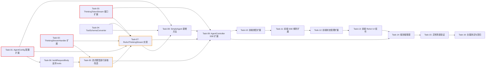

# 开发任务计划: 深度思考模式优化-ReAct与工具调用

## 0. 任务概览 (Task Overview)

*   **总任务数**: 16 个
*   **预计总工时**: 1380 分钟（约 23 小时）
*   **开发方法**: TDD（测试驱动开发）- 每个任务按 Red-Green-Refactor 循环执行
*   **关键里程碑**:
    *   阶段一完成（基础设施层）：约 360 分钟
    *   阶段二完成（LLM 层改造）：约 180 分钟
    *   阶段三完成（Agent 核心层）：约 240 分钟
    *   阶段四完成（Web 接口层）：约 120 分钟
    *   阶段五完成（前端表现层）：约 360 分钟
    *   阶段六完成（集成验证）：约 120 分钟
*   **风险任务**: Task-05 ⚠️（流式读取改造）、Task-07 ⚠️（ReAct 循环实现）
*   **阻塞任务**: Task-01 🔒（配置扩展）、Task-02 🔒（ThinkingStreamHandler 接口扩展）、Task-03 🔒（ThinkingTokenStream 接口扩展）

### 依赖关系图

### 可并行任务组

| 并行组 | 可同时执行的任务 | 说明 |
| :--- | :--- | :--- |
| 并行组 1 | Task-01 + Task-02 + Task-03 + Task-04 | 基础设施层的 4 个任务互不依赖，可同时开发 |
| 并行组 2 | Task-10 + Task-11 | 前端类型扩展和 SSE 解析可先行（不依赖后端联调） |

## 1. 准备工作 (Preparation)

- [x] **Prep-01**: 确认 CR-001 深度思考模式已实现且正常工作
    *   说明：本次改造基于 CR-001 的 `ArkThinkingStreamingChatModel` 基础能力
    *   验证：`enableThinking=true` 时可正常推送 reasoning 事件
- [x] **Prep-02**: 确认编译环境就绪
    *   说明：JDK 17 + Maven 3.9+ + Node.js 18+
    *   验证：`mvn compile` 和 `npm run build` 均成功
- [x] **Prep-03**: 确认测试环境就绪
    *   说明：后端 JUnit 5 + 前端 Vitest 均可正常运行
    *   验证：现有测试套件全部通过

## 2. 开发任务 (Development Tasks)

### 阶段一：基础设施层 (Infrastructure Layer)
> 扩展配置项、接口定义和工具基础设施，为后续核心逻辑提供地基。
>
> **阶段完成标准**: AgentConfig 新增配置可读取、ThinkingStreamHandler/ThinkingTokenStream 接口扩展完成、ToolSchemaConverter 和 ToolExecutor 可独立运行通过测试

- [x] **Task-01**: AgentConfig 新增 thinkingMaxIterations 和 thinkingReactSystemPrompt 配置 🔒
    *   **通俗解释**: 做完这步后，系统就有了"深度思考模式下最多思考几轮"和"如何引导 AI 做推理"的配置开关，管理员可以调节这些参数。
    *   **说明**: 在 `AgentConfig.java` 中新增 `thinkingMaxIterations`（默认 8）和 `thinkingReactSystemPrompt`（含 ReAct 引导 + 工具描述）两个配置字段，绑定 `application.yml` 中的 `agent.thinking-max-iterations` 和 `agent.thinking-react-system-prompt`
    *   **涉及文件**: `agent-demo-agent/src/main/java/com/agentdemo/agent/config/AgentConfig.java`、`agent-demo-bootstrap/src/main/resources/application.yml`
    *   **测试文件**: `agent-demo-agent/src/test/java/com/agentdemo/agent/config/AgentConfigTest.java`
    *   **参考**: 技术方案 Sec 3.1、Sec 7 (AC-018, AC-019)
    *   **对应AC**: AC-018, AC-019
    *   **预估工时**: 60m
    *   **依赖**: 无
    *   **验证标准**（TDD RED 阶段的测试依据）:
        - [ ] `AgentConfig` 实例化后 `getThinkingMaxIterations()` 返回默认值 8
        - [ ] 通过 `@ConfigurationProperties` 绑定 `agent.thinking-max-iterations=5` 后，`getThinkingMaxIterations()` 返回 5
        - [ ] `getThinkingReactSystemPrompt()` 默认值包含 "Thought"、"Action"、"Observation" 关键词
        - [ ] `getThinkingReactSystemPrompt()` 默认值包含工具能力描述

- [x] **Task-02**: ThinkingStreamHandler 接口扩展（新增 onToolCalls + onComplete 改造）🔒
    *   **通俗解释**: 做完这步后，流式模型就能告诉上层"AI 要调用工具了"和"这一轮是调工具还是给最终回答"。
    *   **说明**: 在 `ThinkingStreamHandler` 接口中新增 `onToolCalls(List<ToolCall> toolCalls)` 方法；修改 `onComplete` 方法签名新增 `String finishReason` 参数。同时新建 `ToolCall` 数据类（含 id/functionName/arguments 字段）
    *   **涉及文件**: `agent-demo-llm/src/main/java/com/agentdemo/llm/factory/ThinkingStreamHandler.java`、`agent-demo-llm/src/main/java/com/agentdemo/llm/factory/ToolCall.java`（新建）
    *   **测试文件**: `agent-demo-llm/src/test/java/com/agentdemo/llm/factory/ThinkingStreamHandlerTest.java`
    *   **参考**: 技术方案 Sec 4.3、Sec 10.2
    *   **对应AC**: AC-004, AC-006
    *   **预估工时**: 60m
    *   **依赖**: 无
    *   **验证标准**（TDD RED 阶段的测试依据）:
        - [ ] `ToolCall` 类包含 `id`、`functionName`、`arguments` 三个字段，getter/setter 正常工作
        - [ ] `ThinkingStreamHandler` 接口包含 `onToolCalls(List<ToolCall>)` 方法声明
        - [ ] `ThinkingStreamHandler` 接口的 `onComplete` 方法签名包含 `String finishReason` 参数
        - [ ] 现有 `ArkThinkingTokenStream` 适配新接口签名（向后兼容）

- [x] **Task-03**: ThinkingTokenStream 接口扩展（新增 onPartialThought/onAction/onObservation/onFinalAnswer）🔒
    *   **通俗解释**: 做完这步后，Agent 层就能接收到"推理过程文本"、"工具调用动作"、"工具执行结果"、"最终回答标记"四类事件，分别推给前端展示。
    *   **说明**: 在 `ThinkingTokenStream` 接口中新增 4 个链式回调方法：`onPartialThought(ThoughtConsumer)`、`onAction(ActionConsumer)`、`onObservation(ObservationConsumer)`、`onFinalAnswer(FinalAnswerConsumer)`，每个回调携带 `int iteration` 参数。新增对应的 `@FunctionalInterface` 内部接口
    *   **涉及文件**: `agent-demo-agent/src/main/java/com/agentdemo/agent/core/ThinkingTokenStream.java`
    *   **测试文件**: `agent-demo-agent/src/test/java/com/agentdemo/agent/core/ThinkingTokenStreamTest.java`
    *   **参考**: 技术方案 Sec 8.5、Sec 10.2
    *   **对应AC**: AC-003, AC-004, AC-005, AC-006, AC-023
    *   **预估工时**: 90m
    *   **依赖**: 无
    *   **验证标准**（TDD RED 阶段的测试依据）:
        - [ ] `ThinkingTokenStream` 接口包含 `onPartialThought(ThoughtConsumer)` 方法，返回 `ThinkingTokenStream`（链式）
        - [ ] `ThoughtConsumer` 接口包含 `accept(String thought, int iteration)` 方法
        - [ ] `ThinkingTokenStream` 接口包含 `onAction(ActionConsumer)` 方法
        - [ ] `ActionConsumer` 接口包含 `accept(String toolName, String arguments, int iteration)` 方法
        - [ ] `ThinkingTokenStream` 接口包含 `onObservation(ObservationConsumer)` 方法
        - [ ] `ObservationConsumer` 接口包含 `accept(String result, int iteration)` 方法
        - [ ] `ThinkingTokenStream` 接口包含 `onFinalAnswer(FinalAnswerConsumer)` 方法
        - [ ] `FinalAnswerConsumer` 接口包含 `accept(int iteration)` 方法
        - [ ] 现有 `ArkThinkingTokenStream` 适配新接口（空实现新增方法，向后兼容）

- [x] **Task-04**: ToolSchemaConverter 实现（@Tool -> OpenAI tools JSON Schema）
    *   **通俗解释**: 做完这步后，系统就能自动把所有已注册的工具（如计算器、时间查询等）"翻译"成 AI 能理解的格式，让 AI 知道有哪些工具可以用、每个工具需要什么参数。
    *   **说明**: 新建 `ToolSchemaConverter` 类，遍历 `ToolRegistry.listTools()`，反射扫描 `@Tool` 注解方法，生成 OpenAI 兼容的 tools JSON Schema 字符串（含 name/description/parameters/required）
    *   **涉及文件**: `agent-demo-tools/src/main/java/com/agentdemo/tools/registry/ToolSchemaConverter.java`（新建）
    *   **测试文件**: `agent-demo-tools/src/test/java/com/agentdemo/tools/registry/ToolSchemaConverterTest.java`
    *   **参考**: 技术方案 Sec 4.4
    *   **对应AC**: AC-020
    *   **预估工时**: 90m
    *   **依赖**: 无（ToolRegistry 已存在）
    *   **验证标准**（TDD RED 阶段的测试依据）:
        - [ ] `convertToJson()` 返回有效的 JSON 数组字符串
        - [ ] JSON 数组中每个元素包含 `type: "function"` 和 `function` 对象
        - [ ] `function` 对象包含 `name`（方法名）、`description`（@Tool 注解值）
        - [ ] `function.parameters` 为 JSON Schema 对象，含 `type: "object"`、`properties`、`required`
        - [ ] `CalculatorTool.calculate(String expression)` 对应的 schema 中 properties 包含 `expression` 字段，类型为 `string`
        - [ ] `TimeTool.getCurrentTime()` 对应的 schema 中 properties 为空对象，required 为空数组
        - [ ] Java 类型映射正确：String -> "string"、int/Integer -> "integer"、double/Double -> "number"、boolean/Boolean -> "boolean"

- [x] **Task-04b**: ToolExecutor 实现（解析 tool_calls + 反射调用 + 异常处理）
    *   **通俗解释**: 做完这步后，当 AI 说"我要调用计算器工具"时，系统就能真正执行这个工具并把结果返回给 AI，即使工具出错了也不会崩溃。
    *   **说明**: 新建 `ToolExecutor` 类，接收工具名和参数 JSON，从 `ToolRegistry` 查找对应 `@Tool` 方法，解析参数 JSON，反射调用，返回结果字符串。异常时返回错误信息字符串而非抛出异常
    *   **涉及文件**: `agent-demo-tools/src/main/java/com/agentdemo/tools/registry/ToolExecutor.java`（新建）
    *   **测试文件**: `agent-demo-tools/src/test/java/com/agentdemo/tools/registry/ToolExecutorTest.java`
    *   **参考**: 技术方案 Sec 4.5、Sec 4.7
    *   **对应AC**: AC-005, AC-012, AC-022
    *   **预估工时**: 90m
    *   **依赖**: 无（ToolRegistry 已存在）
    *   **验证标准**（TDD RED 阶段的测试依据）:
        - [ ] `execute("calculate", "{\"expression\":\"2+3\"}")` 返回包含 "2+3" 和 "5" 的字符串
        - [ ] `execute("getCurrentTime", "{}")` 返回包含时间格式的字符串
        - [ ] `execute("nonExistentTool", "{}")` 返回 "工具不存在: nonExistentTool"
        - [ ] 工具方法抛出异常时，`execute()` 不抛出异常，返回以 "工具执行失败:" 开头的字符串
        - [ ] 参数 JSON 缺少必填字段时，对应参数注入 null，方法执行结果取决于工具自身处理

### 阶段二：LLM 层改造 (LLM Layer)
> 改造方舟流式模型，支持逐行实时读取、tools 参数和 tool_calls 解析。
>
> **阶段完成标准**: ArkThinkingStreamingChatModel 支持逐行流式读取、tools 参数传递、tool_calls 解析，原有单轮思考模式不受影响

- [x] **Task-05**: ArkThinkingStreamingChatModel 逐行流式读取改造 ⚠️
    *   **通俗解释**: 做完这步后，AI 的推理过程能像打字一样一个字一个字实时显示出来，而不是等全部想完才一次性显示。
    *   **说明**: 将 `ArkThinkingStreamingChatModel` 的 `stream()` 方法从一次性读取（`fetchSseText` + `parseSseResponse`）改为逐行实时读取（`fetchAndParseSseStream`），使用 `BufferedReader` 逐行解析 SSE data 行，实时回调 `handler.onPartialThinking` 和 `handler.onPartialResponse`。同时解析 `tool_calls` 和 `finish_reason`，回调 `handler.onToolCalls` 和 `handler.onComplete(fullResponse, finishReason)`
    *   **涉及文件**: `agent-demo-llm/src/main/java/com/agentdemo/llm/factory/ArkThinkingStreamingChatModel.java`
    *   **测试文件**: `agent-demo-llm/src/test/java/com/agentdemo/llm/factory/ArkThinkingStreamingChatModelTest.java`
    *   **参考**: 技术方案 Sec 4.3
    *   **对应AC**: AC-002, AC-003, AC-004, AC-013
    *   **预估工时**: 120m
    *   **依赖**: Task-02（ThinkingStreamHandler 接口扩展）
    *   **风险标注**: ⚠️ 从一次性读取改为逐行读取，需确保 SSE 解析完整性；tool_calls 可能分多个 chunk 返回
    *   **验证标准**（TDD RED 阶段的测试依据）:
        - [ ] 模拟 SSE 流包含 3 行 `data: {delta:{reasoning_content:"片段"}}`，`onPartialThinking` 被回调 3 次，每次收到对应片段
        - [ ] 模拟 SSE 流包含 3 行 `data: {delta:{content:"片段"}}`，`onPartialResponse` 被回调 3 次，每次收到对应片段
        - [ ] 模拟 SSE 流包含 `data: {choices:[{delta:{tool_calls:[...]}, finish_reason:"tool_calls"}]}`，`onToolCalls` 被回调 1 次，收到 ToolCall 列表
        - [ ] 模拟 SSE 流最后一行为 `data: {choices:[{delta:{}, finish_reason:"stop"}]}`，`onComplete` 被回调，finishReason="stop"
        - [ ] 模拟 SSE 流包含 `data: [DONE]`，解析正常终止
        - [ ] 模拟 HTTP 连接异常，`onError` 被回调
        - [ ] `fetchAndParseSseStream` 方法为 protected，便于测试 spy/mock

- [x] **Task-06**: ArkThinkingStreamingChatModel.buildRequestBody 支持 tools 参数
    *   **通俗解释**: 做完这步后，系统在调用 AI 时能附带"这些工具你可以用"的信息，AI 就知道它可以调用哪些工具。
    *   **说明**: 修改 `buildRequestBody` 方法签名，新增 `String toolsJson` 参数。当 toolsJson 非空时，将其解析为 JSON 并添加到请求体的 `tools` 字段。`stream()` 方法签名也同步调整为 `stream(messages, toolsJson, handler)`
    *   **涉及文件**: `agent-demo-llm/src/main/java/com/agentdemo/llm/factory/ArkThinkingStreamingChatModel.java`
    *   **测试文件**: `agent-demo-llm/src/test/java/com/agentdemo/llm/factory/ArkThinkingStreamingChatModelTest.java`
    *   **参考**: 技术方案 Sec 4.2
    *   **对应AC**: AC-001, AC-019
    *   **预估工时**: 60m
    *   **依赖**: Task-01（AgentConfig 提供配置）、Task-05（stream 方法改造）
    *   **验证标准**（TDD RED 阶段的测试依据）:
        - [ ] `buildRequestBody(messages, null)` 生成的 JSON 不包含 `tools` 字段
        - [ ] `buildRequestBody(messages, "")` 生成的 JSON 不包含 `tools` 字段
        - [ ] `buildRequestBody(messages, "[{\"type\":\"function\",...}]")` 生成的 JSON 包含 `tools` 字段，值为传入的 JSON 数组
        - [ ] 请求体始终包含 `model`、`stream: true`、`thinking.type: "enabled"` 字段

### 阶段三：Agent 核心层 (Agent Core Layer)
> 实现 ReAct 循环核心逻辑，连接 LLM 层和 Web 层。
>
> **阶段完成标准**: ReActThinkingStream 实现完整 ReAct 循环（推理->工具调用->观察->继续推理->最终回答），SimpleAgent 新增入口方法

- [x] **Task-07**: ReActThinkingStream 实现（ReAct 循环核心逻辑）⚠️
    *   **通俗解释**: 做完这步后，系统就有了"思考-行动-观察"的完整循环能力：AI 先思考要做什么，然后调用工具获取信息，再基于信息继续思考，直到能给出最终回答。
    *   **说明**: 新建 `ReActThinkingStream` 类实现 `ThinkingTokenStream` 接口。`start()` 方法执行 ReAct 循环：调用 `ArkThinkingStreamingChatModel.stream()` -> 解析响应回调 -> 推送 reasoning/thought 事件 -> 收到 tool_calls 时推送 action 事件 + 调用 ToolExecutor + 推送 observation 事件 + 回填消息 -> 收到 stop 时推送 final-answer + done 事件。达到 maxIterations 时强制总结
    *   **涉及文件**: `agent-demo-agent/src/main/java/com/agentdemo/agent/single/ReActThinkingStream.java`（新建）
    *   **测试文件**: `agent-demo-agent/src/test/java/com/agentdemo/agent/single/ReActThinkingStreamTest.java`
    *   **参考**: 技术方案 Sec 4.1、Sec 4.6、Sec 4.7
    *   **对应AC**: AC-001, AC-002, AC-003, AC-004, AC-005, AC-006, AC-008, AC-011, AC-012, AC-022, AC-023
    *   **预估工时**: 150m
    *   **依赖**: Task-02（ThinkingStreamHandler）、Task-03（ThinkingTokenStream）、Task-04（ToolSchemaConverter）、Task-05（流式模型改造）
    *   **风险标注**: ⚠️ ReAct 循环的正确性是核心风险，需覆盖多轮循环、工具失败、强制总结等场景
    *   **验证标准**（TDD RED 阶段的测试依据）:
        - [ ] 单轮无工具调用：模拟 finish_reason=stop，`onFinalAnswer` 被回调，`onComplete` 被回调，无 `onAction`/`onObservation`
        - [ ] 单轮有工具调用：模拟 finish_reason=tool_calls，`onAction` 被回调（含 toolName/arguments/iteration=1），`onObservation` 被回调（含 result/iteration=1）
        - [ ] 两轮循环：第1轮 tool_calls -> 第2轮 stop，iteration 从 1 递增到 2，`onFinalAnswer` 在第2轮触发
        - [ ] 多个 tool_calls 串行执行：模拟 2 个 tool_calls，`onAction`/`onObservation` 按顺序各回调 2 次
        - [ ] 工具执行失败：ToolExecutor 返回错误字符串，`onObservation` 收到错误信息，循环不中断
        - [ ] 达到 maxIterations：iteration > maxIterations 时，调用 `model.stream(messages, null, handler)`（不带 tools），推送 final-answer + done
        - [ ] 所有 thought/action/observation 回调携带正确的 iteration 值（从 1 开始递增）
        - [ ] LLM 调用异常时，`onError` 被回调，循环终止

- [x] **Task-08**: SimpleAgent 新增 chatThinkingReActStream 方法
    *   **通俗解释**: 做完这步后，用户开启深度思考模式发送消息时，系统会自动进入"推理+工具调用"的完整思考流程。
    *   **说明**: 在 `SimpleAgent` 中新增 `chatThinkingReActStream(String sessionId, String message)` 方法。复用 `buildMessagesWithMemory` 但改用 `thinkingReactSystemPrompt`（含 ReAct 引导）。调用 `ToolSchemaConverter.convertToJson()` 获取工具 Schema。构造 `ReActThinkingStream` 实例返回
    *   **涉及文件**: `agent-demo-agent/src/main/java/com/agentdemo/agent/single/SimpleAgent.java`
    *   **测试文件**: `agent-demo-agent/src/test/java/com/agentdemo/agent/single/SimpleAgentTest.java`
    *   **参考**: 技术方案 Sec 1.1、Sec 7 (AC-001, AC-021)
    *   **对应AC**: AC-001, AC-019, AC-020, AC-021
    *   **预估工时**: 90m
    *   **依赖**: Task-01（AgentConfig）、Task-04（ToolSchemaConverter）、Task-07（ReActThinkingStream）
    *   **验证标准**（TDD RED 阶段的测试依据）:
        - [ ] `chatThinkingReActStream(sessionId, message)` 返回非 null 的 `ThinkingTokenStream` 实例
        - [ ] 返回的实例类型为 `ReActThinkingStream`
        - [ ] 消息列表首条为 SystemMessage，内容来自 `thinkingReactSystemPrompt`（含 ReAct 引导关键词）
        - [ ] 消息列表包含历史消息（从 ChatMemoryManager 获取）
        - [ ] 消息列表末尾为当前 UserMessage
        - [ ] 现有 `chatThinkingStream` 方法不受影响（向后兼容）
        - [ ] 现有 `chat` 和 `chatStream` 方法不受影响

### 阶段四：Web 接口层 (Web Layer)
> 扩展 SSE 事件推送，连接 Agent 核心层和前端。
>
> **阶段完成标准**: AgentController 在 enableThinking=true 时调用 chatThinkingReActStream，推送完整的 7 类 SSE 事件

- [x] **Task-09**: AgentController SSE 事件扩展
    *   **通俗解释**: 做完这步后，后端就能向前端推送"AI 在推理什么"、"AI 要调什么工具"、"工具返回了什么结果"、"AI 给出了最终回答"等完整信息。
    *   **说明**: 修改 `AgentController.chatStream` 方法中 `enableThinking=true` 分支，从调用 `chatThinkingStream` 改为调用 `chatThinkingReActStream`。注册新增的 4 个回调（onPartialThought/onAction/onObservation/onFinalAnswer），分别推送 SSE 事件 `thought`/`action`/`observation`/`final-answer`。thought/action/observation 事件的 data 使用 JSON 格式（含 iteration 字段）。onComplete 回调中仅持久化最终回答到记忆
    *   **涉及文件**: `agent-demo-web/src/main/java/com/agentdemo/web/controller/AgentController.java`
    *   **测试文件**: `agent-demo-web/src/test/java/com/agentdemo/web/controller/AgentControllerTest.java`
    *   **参考**: 技术方案 Sec 2.2、Sec 5 (异常处理)、Sec 7 (AC-001~AC-017)
    *   **对应AC**: AC-001~AC-008, AC-013~AC-017, AC-023
    *   **预估工时**: 120m
    *   **依赖**: Task-03（ThinkingTokenStream 接口）、Task-05（流式模型改造）、Task-07（ReActThinkingStream）、Task-08（SimpleAgent 新增方法）
    *   **验证标准**（TDD RED 阶段的测试依据）:
        - [ ] `enableThinking=true` 时调用 `chatThinkingReActStream`（而非 `chatThinkingStream`）
        - [ ] `onPartialThought` 回调推送 SSE 事件 `thought`，data 为 JSON 格式 `{"content":"...","iteration":N}`
        - [ ] `onAction` 回调推送 SSE 事件 `action`，data 为 JSON 格式 `{"toolName":"...","arguments":"...","iteration":N}`
        - [ ] `onObservation` 回调推送 SSE 事件 `observation`，data 为 JSON 格式 `{"result":"...","iteration":N}`
        - [ ] `onFinalAnswer` 回调推送 SSE 事件 `final-answer`，data 为 JSON 格式 `{"iteration":N}`
        - [ ] `onComplete` 回调推送 `done` 事件，且仅调用 `memoryManager.addAssistantMessage`（不持久化推理过程）
        - [ ] `onError` 回调推送 `error` 事件并完成 emitter
        - [ ] 空消息输入时推送 `error` 事件 "消息不能为空"（AC-015）
        - [ ] `enableThinking=false` 时走原有 `chatStream` 路径（零回归）

### 阶段五：前端表现层 (Frontend Layer)
> 扩展前端类型、SSE 解析、状态管理和 UI 组件。
>
> **阶段完成标准**: 前端能接收并渲染全部 7 类 SSE 事件，ReAct 推理过程折叠区块和工具调用卡片正常显示

- [x] **Task-10**: 前端类型扩展（ReactStep / ToolCallInfo / Message / StreamCallbacks）
    *   **通俗解释**: 做完这步后，前端代码就"认识"了 ReAct 推理过程中的各种数据结构，为后续展示做好准备。
    *   **说明**: 在 `types/index.ts` 中新增 `ReactStep` 接口（含 iteration/thought/action/observation 字段）和 `ToolCallInfo` 接口（含 toolName/arguments/result 字段）。扩展 `Message` 接口新增 `reactSteps?: ReactStep[]` 字段。扩展 `StreamCallbacks` 新增 `onThought?`/`onAction?`/`onObservation?`/`onFinalAnswer?` 回调
    *   **涉及文件**: `agent-demo-frontend/src/types/index.ts`
    *   **测试文件**: `agent-demo-frontend/src/types/types.test.ts`
    *   **参考**: 技术方案 Sec 1.3、Sec 10.3
    *   **对应AC**: AC-009, AC-010, AC-023, AC-024
    *   **预估工时**: 60m
    *   **依赖**: 无（可与后端任务并行）
    *   **验证标准**（TDD RED 阶段的测试依据）:
        - [ ] `ReactStep` 接口包含 `iteration: number`、`thought: string`、`toolCalls: ToolCallInfo[]` 字段
        - [ ] `ToolCallInfo` 接口包含 `toolName: string`、`arguments: string`、`result: string` 字段
        - [ ] `Message` 接口新增 `reactSteps?: ReactStep[]` 可选字段
        - [ ] `StreamCallbacks` 新增 `onThought?: (thought: string, iteration: number) => void`
        - [ ] `StreamCallbacks` 新增 `onAction?: (toolName: string, arguments: string, iteration: number) => void`
        - [ ] `StreamCallbacks` 新增 `onObservation?: (result: string, iteration: number) => void`
        - [ ] `StreamCallbacks` 新增 `onFinalAnswer?: (iteration: number) => void`
        - [ ] 现有 `Message` 和 `StreamCallbacks` 的字段不变（向后兼容）

- [x] **Task-11**: 前端 SSE 解析扩展（chat.ts 新增事件处理）
    *   **通俗解释**: 做完这步后，前端就能识别后端发来的"推理过程"、"工具调用"、"工具结果"、"最终回答标记"等新事件了。
    *   **说明**: 在 `api/chat.ts` 的 `handleSseEvent` 函数中新增 `thought`/`action`/`observation`/`final-answer` 四个 case 分支。thought/action/observation 事件的 data 为 JSON 格式，需 `JSON.parse` 后提取字段调用对应回调
    *   **涉及文件**: `agent-demo-frontend/src/api/chat.ts`
    *   **测试文件**: `agent-demo-frontend/src/api/chat.test.ts`
    *   **参考**: 技术方案 Sec 2.2 (SSE 事件格式)
    *   **对应AC**: AC-003, AC-004, AC-005, AC-006, AC-023
    *   **预估工时**: 60m
    *   **依赖**: Task-10（类型扩展）
    *   **验证标准**（TDD RED 阶段的测试依据）:
        - [ ] 收到 `event: thought` + `data: {"content":"片段","iteration":1}` 时，调用 `callbacks.onThought("片段", 1)`
        - [ ] 收到 `event: action` + `data: {"toolName":"getWeather","arguments":"{}","iteration":1}` 时，调用 `callbacks.onAction("getWeather", "{}", 1)`
        - [ ] 收到 `event: observation` + `data: {"result":"25°C","iteration":1}` 时，调用 `callbacks.onObservation("25°C", 1)`
        - [ ] 收到 `event: final-answer` + `data: {"iteration":2}` 时，调用 `callbacks.onFinalAnswer(2)`
        - [ ] JSON 解析失败时不抛出异常，静默跳过（容错）
        - [ ] 现有 `reasoning`/`token`/`done`/`error`/`session` 事件处理不受影响

- [x] **Task-12**: 前端状态管理扩展（session.ts 新增方法 + moveThoughtToContent）
    *   **通俗解释**: 做完这步后，前端就能把 AI 的推理过程、工具调用信息分门别类地存起来，并在 AI 给出最终回答时把推理内容"搬"到正式回答区域。
    *   **说明**: 在 `stores/session.ts` 中新增 `appendThought(messageId, thought, iteration)`、`appendAction(messageId, toolName, arguments, iteration)`、`appendObservation(messageId, result, iteration)`、`moveThoughtToContent(messageId, iteration)` 四个方法。`moveThoughtToContent` 将指定 iteration 的 thought 文本移动到 `message.content`，并清空该轮 thought。localStorage 序列化时不包含 `reactSteps` 字段（仅持久化 content）
    *   **涉及文件**: `agent-demo-frontend/src/stores/session.ts`、`agent-demo-frontend/src/utils/storage.ts`
    *   **测试文件**: `agent-demo-frontend/src/stores/session.test.ts`
    *   **参考**: 技术方案 Sec 1.3、Sec 10.3
    *   **对应AC**: AC-009, AC-024
    *   **预估工时**: 120m
    *   **依赖**: Task-10（类型扩展）、Task-11（SSE 解析）
    *   **验证标准**（TDD RED 阶段的测试依据）:
        - [ ] `appendThought(msgId, "片段", 1)` 后，消息的 `reactSteps[0].thought` 包含 "片段"
        - [ ] 连续调用 `appendThought(msgId, "A", 1)` + `appendThought(msgId, "B", 1)` 后，`reactSteps[0].thought` 为 "AB"
        - [ ] `appendThought(msgId, "C", 2)` 后，`reactSteps` 有 2 个元素，`reactSteps[1].thought` 为 "C"
        - [ ] `appendAction(msgId, "getWeather", "{}", 1)` 后，`reactSteps[0].toolCalls[0].toolName` 为 "getWeather"
        - [ ] `appendObservation(msgId, "25°C", 1)` 后，`reactSteps[0].toolCalls[0].result` 为 "25°C"
        - [ ] `moveThoughtToContent(msgId, 2)` 后，`message.content` 为 `reactSteps[1].thought` 的值，`reactSteps[1].thought` 清空
        - [ ] localStorage 序列化后的 JSON 不包含 `reactSteps` 字段（AC-024）
        - [ ] localStorage 反序列化后的消息 `reactSteps` 为 undefined（向前兼容）

- [x] **Task-13**: 前端 ReAct UI 组件（MessageItem.vue 推理区块 + 工具卡片）
    *   **通俗解释**: 做完这步后，用户在对话界面就能看到 AI 的完整思考过程：上面是"已思考"区块，中间是"ReAct 推理过程"区块（含工具调用卡片），下面是最终回答。
    *   **说明**: 在 `MessageItem.vue` 中新增 ReAct 推理过程折叠区块（位于 thinking-block 下方、bubble 上方）。区块内按 iteration 分组展示 Thought/Action/Observation。Action 渲染为工具调用卡片（含工具图标、工具名、参数），收到 Observation 后在卡片中追加结果。折叠/展开逻辑复用 thinking-block 模式（流式中展开，完成后可折叠）
    *   **涉及文件**: `agent-demo-frontend/src/components/MessageItem.vue`、`agent-demo-frontend/src/components/ChatWindow.vue`
    *   **测试文件**: `agent-demo-frontend/src/components/components.test.ts`
    *   **参考**: 技术方案 Sec 1.3、需求文档 Sec 5.2
    *   **对应AC**: AC-009, AC-010
    *   **预估工时**: 120m
    *   **依赖**: Task-10（类型扩展）、Task-12（状态管理）
    *   **验证标准**（TDD RED 阶段的测试依据）:
        - [ ] 消息有 `reactSteps` 且非空时，渲染 "ReAct 推理过程" 折叠区块
        - [ ] 折叠区块标题流式中显示"推理中..."，完成后显示"ReAct 推理过程"
        - [ ] 区块内按 iteration 分组，每组显示 Thought 文本
        - [ ] Action 渲染为卡片，包含工具图标、工具名、参数 JSON
        - [ ] 收到 Observation 后，卡片中追加展示工具结果
        - [ ] 流式中区块保持展开（status=incomplete），完成后可手动折叠（status=complete）
        - [ ] 消息无 `reactSteps` 时不渲染 ReAct 区块（向前兼容旧消息）
        - [ ] ChatWindow.vue 中注册 `onThought`/`onAction`/`onObservation`/`onFinalAnswer` 回调，调用 store 对应方法

### 阶段六：集成验证 (Integration Verification)
> 端到端联调和异常场景验证。
>
> **阶段完成标准**: 所有 AC 验收标准通过，前后端完整流程跑通

- [x] **Task-14**: 前后端端到端联调
    *   **通俗解释**: 做完这步后，用户开启深度思考模式发消息，就能看到 AI 完整的推理过程和工具调用过程，最终给出回答。
    *   **说明**: 启动后端服务和前端开发服务器，开启深度思考模式发送需要工具调用的消息（如"现在几点"），验证完整 ReAct 流程：reasoning 事件 -> thought 事件 -> action 事件 -> observation 事件 -> final-answer 事件 -> done 事件。前端正确渲染所有区块
    *   **涉及文件**: 全部涉及文件
    *   **测试文件**: 手动验证 + Playwright E2E 测试（可选）
    *   **参考**: 需求文档 Sec 5.1（核心流程）、技术方案 Sec 1.2（时序图）
    *   **对应AC**: AC-001~AC-008, AC-023
    *   **预估工时**: 60m
    *   **依赖**: Task-09（Web 接口层）、Task-13（前端 UI 组件）
    *   **验证标准**（TDD RED 阶段的测试依据）:
        - [ ] 发送"现在几点"，前端依次显示 reasoning（已思考区块）、thought（ReAct 区块第1轮）、action（工具卡片：getCurrentTime）、observation（卡片结果：时间）、final-answer（thought 移到正式回答）、done
        - [ ] 发送"你好"（无需工具），前端显示 reasoning + thought + final-answer + done，无 action/observation
        - [ ] 发送空消息，前端显示错误提示"消息不能为空"
        - [ ] 流式中点击"停止生成"，已推送内容保留，消息标记为不完整
        - [ ] 普通模式（enableThinking=false）正常工作（零回归）

- [x] **Task-15**: 异常场景与边界条件验证
    *   **通俗解释**: 做完这步后，即使在各种出错情况下（工具失败、AI 调用失败、达到思考上限），系统也能优雅处理，不会崩溃。
    *   **说明**: 验证所有异常场景：工具执行失败时回填 Observation、LLM 调用失败时推送 error 事件、达到 maxIterations 时强制总结、ARK_API_KEY 未配置时返回 5004、会话不存在时自动新建
    *   **涉及文件**: 全部涉及文件
    *   **测试文件**: 后端集成测试 + 手动验证
    *   **参考**: 技术方案 Sec 5（异常处理表）
    *   **对应AC**: AC-011, AC-012, AC-013, AC-015, AC-016, AC-017
    *   **预估工时**: 60m
    *   **依赖**: Task-14（端到端联调）
    *   **验证标准**（TDD RED 阶段的测试依据）:
        - [ ] 工具执行失败时，observation 事件包含 "工具执行失败" 文本，ReAct 循环继续（不中断）
        - [ ] LLM 调用失败时，前端收到 error 事件，显示错误提示，循环终止
        - [ ] 达到 maxIterations 时，系统强制总结，前端收到 thought + final-answer + done
        - [ ] ARK_API_KEY 未配置时，前端收到 error 事件 "ARK_API_KEY 未配置"
        - [ ] 传入不存在的 sessionId 时，前端收到 session 事件（新 sessionId），对话正常进行

- [x] **Task-16**: 全量测试与回归验证
    *   **通俗解释**: 做完这步后，确认新功能没有破坏任何现有功能，所有测试都通过。
    *   **说明**: 运行后端全量测试（`mvn test`）和前端全量测试（`npm run test`），确认无回归。检查 AC 覆盖度，确保 24 条 AC 全部有对应测试
    *   **涉及文件**: 无（仅运行测试）
    *   **测试文件**: 全部测试文件
    *   **参考**: 需求文档 Sec 6（全部 AC）
    *   **对应AC**: 全部 AC
    *   **预估工时**: 60m
    *   **依赖**: Task-15（异常场景验证）
    *   **验证标准**（TDD RED 阶段的测试依据）:
        - [ ] 后端 `mvn test` 全部通过，无失败
        - [ ] 前端 `npm run test` 全部通过，无失败
        - [ ] 前端 `npm run build` 成功，无类型错误
        - [ ] CR-001 单轮思考模式（`chatThinkingStream`）仍正常工作
        - [ ] 普通模式（`enableThinking=false`）零回归
        - [ ] 24 条 AC 全部有对应的测试覆盖

### 阶段性集成验证 (Stage Integration Verification)

- [ ] **Verify-01**: 后端编译验证
    *   **说明**: `mvn compile -pl agent-demo-agent -am` 编译通过
    *   **验证标准**: 无编译错误

- [ ] **Verify-02**: 前端构建验证
    *   **说明**: `npm run build` 构建成功
    *   **验证标准**: 无类型错误，无构建失败

## 3. 验收标准检查清单 (AC Checklist)

| 验收标准ID | 验收标准描述 | 对应任务 | 状态 |
| :--- | :--- | :--- | :--- |
| AC-001 | 深度思考模式启动 ReAct + 工具调用循环 | Task-07, Task-08, Task-09 | 待完成 |
| AC-002 | 内部推理逐 Token 流式推送 | Task-05, Task-09 | 待完成 |
| AC-003 | Thought 逐 Token 流式推送 | Task-03, Task-05, Task-07, Task-09, Task-11 | 待完成 |
| AC-004 | 工具调用触发与 action 事件 | Task-02, Task-05, Task-07, Task-09, Task-11 | 待完成 |
| AC-005 | 工具结果回填与 observation 事件 | Task-04b, Task-07, Task-09, Task-11 | 待完成 |
| AC-006 | ReAct 循环终止与最终回答 | Task-03, Task-07, Task-09, Task-11 | 待完成 |
| AC-007 | 仅持久化最终回答到会话记忆 | Task-09 | 待完成 |
| AC-008 | 无需工具调用时的深度思考 | Task-07, Task-09, Task-14 | 待完成 |
| AC-009 | 前端 ReAct 推理过程折叠区块 | Task-10, Task-12, Task-13 | 待完成 |
| AC-010 | 前端工具调用卡片渲染 | Task-10, Task-12, Task-13 | 待完成 |
| AC-011 | 达到最大迭代强制总结 | Task-01, Task-07, Task-15 | 待完成 |
| AC-012 | 工具调用失败回填 Observation | Task-04b, Task-07, Task-15 | 待完成 |
| AC-013 | LLM 调用失败错误推送 | Task-05, Task-09, Task-15 | 待完成 |
| AC-014 | 用户主动停止生成 | Task-09, Task-14 | 待完成 |
| AC-015 | 空消息输入校验 | Task-09, Task-15 | 待完成 |
| AC-016 | ARK_API_KEY 未配置 | Task-09, Task-15 | 待完成 |
| AC-017 | 会话不存在创建新会话 | Task-09, Task-15 | 待完成 |
| AC-018 | 最大迭代次数可配置 | Task-01, Task-15 | 待完成 |
| AC-019 | 系统提示词含 ReAct 引导 | Task-01, Task-08 | 待完成 |
| AC-020 | 工具定义复用 @Tool 注解 | Task-04, Task-08 | 待完成 |
| AC-021 | 会话记忆手动管理 | Task-08 | 待完成 |
| AC-022 | 串行工具调用 | Task-04b, Task-07 | 待完成 |
| AC-023 | SSE 事件携带 iteration | Task-03, Task-07, Task-09, Task-10, Task-11 | 待完成 |
| AC-024 | 推理过程不持久化到 localStorage | Task-12, Task-13 | 待完成 |

## 4. 验证计划 (Verification Plan)

### 4.1 TDD 过程验证（每个任务内部）
- [ ] RED：测试编写完成后运行，确认全部失败
- [ ] GREEN：实现代码后运行，确认全部通过
- [ ] REFACTOR：重构后运行，确认仍全部通过

### 4.2 阶段验证检查点

| 阶段 | 验证动作 | 关联任务 | 通过标准 |
| :--- | :--- | :--- | :--- |
| 阶段一完成后 | 运行基础设施层单元测试 | Task-01~Task-04b | 配置读取正常、接口编译通过、ToolSchemaConverter/ToolExecutor 测试通过 |
| 阶段二完成后 | 运行 LLM 层单元测试 + 编译验证 | Task-05, Task-06 | 逐行流式解析测试通过、buildRequestBody 含 tools 参数测试通过、CR-001 单轮模式不回归 |
| 阶段三完成后 | 运行 Agent 层单元测试 | Task-07, Task-08 | ReAct 循环多轮场景测试通过、SimpleAgent 入口方法测试通过 |
| 阶段四完成后 | 运行 Web 层单元测试 | Task-09 | SSE 事件推送测试通过、异常场景测试通过 |
| 阶段五完成后 | 运行前端测试 + 构建验证 | Task-10~Task-13 | 类型检查通过、SSE 解析测试通过、UI 组件渲染测试通过 |
| 阶段六完成后 | 端到端联调 + 全量测试 | Task-14~Task-16 | 24 条 AC 全部验证通过、前后端无回归 |

### 4.3 验收标准逐项验证

| AC | 验证方式 | 关联任务 | 状态 |
| :--- | :--- | :--- | :--- |
| AC-001 | 运行 Task-07/08/09 测试，验证 ReAct 循环启动 | Task-07, 08, 09 | 待验证 |
| AC-002 | 运行 Task-05 测试，验证 reasoning_content 逐 Token 回调 | Task-05 | 待验证 |
| AC-003 | 运行 Task-07 测试 + Task-11 测试，验证 thought 逐 Token 推送 | Task-07, 11 | 待验证 |
| AC-004 | 运行 Task-07 测试 + Task-09 测试，验证 action 事件推送 | Task-07, 09 | 待验证 |
| AC-005 | 运行 Task-04b/07 测试，验证 observation 事件推送 | Task-04b, 07 | 待验证 |
| AC-006 | 运行 Task-07 测试，验证 final-answer + done 事件 | Task-07 | 待验证 |
| AC-007 | 运行 Task-09 测试，验证仅持久化最终回答 | Task-09 | 待验证 |
| AC-008 | 运行 Task-07/14 测试，验证无工具调用场景 | Task-07, 14 | 待验证 |
| AC-009 | 运行 Task-13 测试，验证 ReAct 折叠区块渲染 | Task-13 | 待验证 |
| AC-010 | 运行 Task-13 测试，验证工具调用卡片渲染 | Task-13 | 待验证 |
| AC-011 | 运行 Task-07/15 测试，验证强制总结 | Task-07, 15 | 待验证 |
| AC-012 | 运行 Task-04b/07/15 测试，验证工具失败回填 | Task-04b, 07, 15 | 待验证 |
| AC-013 | 运行 Task-05/15 测试，验证 LLM 失败错误推送 | Task-05, 15 | 待验证 |
| AC-014 | Task-14 手动验证，验证停止生成 | Task-14 | 待验证 |
| AC-015 | 运行 Task-09/15 测试，验证空消息校验 | Task-09, 15 | 待验证 |
| AC-016 | 运行 Task-15 测试，验证 API Key 未配置 | Task-15 | 待验证 |
| AC-017 | 运行 Task-09/15 测试，验证会话不存在 | Task-09, 15 | 待验证 |
| AC-018 | 运行 Task-01 测试，验证 maxIterations 可配置 | Task-01 | 待验证 |
| AC-019 | 运行 Task-01/08 测试，验证系统提示词 | Task-01, 08 | 待验证 |
| AC-020 | 运行 Task-04 测试，验证 @Tool 复用 | Task-04 | 待验证 |
| AC-021 | 运行 Task-08 测试，验证手动记忆管理 | Task-08 | 待验证 |
| AC-022 | 运行 Task-04b/07 测试，验证串行工具调用 | Task-04b, 07 | 待验证 |
| AC-023 | 运行 Task-07/09/11 测试，验证 iteration 标识 | Task-07, 09, 11 | 待验证 |
| AC-024 | 运行 Task-12 测试，验证 localStorage 不含 reactSteps | Task-12 | 待验证 |

### 4.4 最终验证（所有阶段完成后）
- [ ] 后端 `mvn test` 全部通过
- [ ] 前端 `npm run test` 全部通过
- [ ] 前端 `npm run build` 成功
- [ ] 24 条 AC 逐项端到端验证通过
- [ ] CR-001 单轮思考模式零回归
- [ ] 普通模式（enableThinking=false）零回归

## 5. 风险与注意事项 (Risks & Notes)

*   **技术风险**:
    *   ⚠️ Task-05（流式读取改造）：从一次性读取改为逐行读取，tool_calls 可能分多个 chunk 返回，需累积拼接。缓解：单元测试覆盖各种 chunk 组合
    *   ⚠️ Task-07（ReAct 循环实现）：手动实现多轮循环，需正确管理消息列表和迭代状态。缓解：充分覆盖单轮、多轮、工具失败、强制总结等场景的测试
    *   Java 反射参数名获取：需确认 `-parameters` 编译选项已启用。缓解：使用 Spring `DefaultParameterNameDiscoverer` 兜底
*   **依赖风险**: Task-07 依赖 Task-02/03/04/05 四个前置任务，是关键路径上的核心任务
*   **时间风险**: 如工时超出预期，Task-15（异常场景验证）和 Task-16（全量测试）可适当压缩手动验证范围
*   **质量保证**: 每个任务通过 TDD 循环保证代码质量，阶段性集成验证保证整体稳定性
