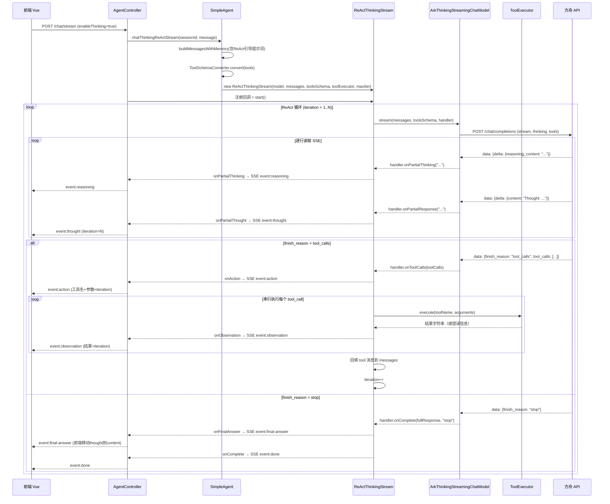

# 技术设计文档: 深度思考模式优化-ReAct与工具调用

## 0. 设计概要 (Design Summary)

*   **功能描述**：在深度思考模式下引入 ReAct 循环和工具调用能力，实现双重推理层（模型内部推理 + 显式 ReAct 推理），让用户能看到 AI 的完整思考与决策过程。
*   **影响范围**：agent-demo-llm（流式模型改造）、agent-demo-agent（ReAct 循环 + 接口扩展）、agent-demo-tools（工具 Schema 转换 + 工具执行器）、agent-demo-web（SSE 事件扩展）、agent-demo-frontend（ReAct 推理区块 + 工具卡片）
*   **技术难点**：
    1. `ArkThinkingStreamingChatModel` 从一次性读取改为逐行实时流式读取
    2. 手动实现 ReAct 循环（不使用 AiServices），管理多轮消息列表和工具调用
    3. `@Tool` 方法到 OpenAI 兼容 `tools` JSON Schema 的反射转换
    4. 流式中 content 字段的分类推送（Thought vs 最终回答）
*   **依赖关系**：依赖 CR-001 已实现的 `ArkThinkingStreamingChatModel` 基础能力、`ToolRegistry` 工具注册中心、`ChatMemoryManager` 记忆管理

## 1. 架构概览 (Architecture Overview)

### 1.1 涉及模块与交互关系

```
┌─────────────────────────────────────────────────────────────────┐
│                        agent-demo-web                            │
│  AgentController                                                 │
│  ├─ enableThinking=true → chatThinkingReActStream()             │
│  └─ SSE 事件: reasoning/thought/final-answer/action/observation │
│              /token/done/error                                   │
└──────────────────────────┬──────────────────────────────────────┘
                           ▼
┌─────────────────────────────────────────────────────────────────┐
│                       agent-demo-agent                           │
│  SimpleAgent                                                     │
│  ├─ chatThinkingReActStream() ← 新增                             │
│  │   ├─ buildMessagesWithMemory()（复用，改造提示词）             │
│  │   ├─ buildToolsSchema()（新增，调用 ToolSchemaConverter）      │
│  │   └─ new ReActThinkingStream(model, messages, tools, ...)     │
│  │                                                                │
│  ReActThinkingStream ← 新增                                       │
│  ├─ 实现 ThinkingTokenStream 接口（扩展版）                       │
│  ├─ start(): ReAct 循环主逻辑                                     │
│  │   ├─ 调用 ArkThinkingStreamingChatModel.stream()              │
│  │   ├─ 解析响应 → 推送 reasoning/thought 事件                    │
│  │   ├─ finish_reason=tool_calls → 推送 action 事件              │
│  │   ├─ ToolExecutor.execute() → 推送 observation 事件            │
│  │   ├─ 回填 tool 消息 → iteration++ → 继续循环                  │
│  │   └─ finish_reason=stop → 推送 final-answer + done 事件       │
│  └─ 达到 maxIterations → 强制总结（不带 tools 的请求）            │
│                                                                │
│  ThinkingTokenStream ← 接口扩展（新增回调）                      │
│  AgentConfig ← 新增 thinkingMaxIterations                       │
└──────────┬──────────────────────────────┬───────────────────────┘
           ▼                              ▼
┌─────────────────────────┐  ┌───────────────────────────────────┐
│    agent-demo-llm       │  │        agent-demo-tools            │
│ ArkThinkingStreaming    │  │ ToolSchemaConverter ← 新增         │
│ ChatModel               │  │ ├─ @Tool → OpenAI tools JSON       │
│ ├─ buildRequestBody()   │  │ ToolExecutor ← 新增               │
│ │   新增 tools 参数      │  │ ├─ 解析 tool_calls                │
│ ├─ stream() 改为逐行    │  │ ├─ 反射调用 @Tool 方法             │
│ │   实时读取             │  │ └─ 异常 → 错误信息字符串           │
│ ├─ 解析 tool_calls      │  │ ToolRegistry（复用 listTools）     │
│ └─ ThinkingStreamHandler│  └───────────────────────────────────┘
│     接口扩展             │
└─────────────────────────┘
```

### 1.2 数据流向（端到端时序图）



### 1.3 前端 UI/逻辑映射

| 前端组件 | 消费的后端 SSE 事件 | UI 表现 |
|---------|-------------------|---------|
| MessageItem.vue - thinking-block | `reasoning` | "已思考"折叠区块（已有，复用） |
| MessageItem.vue - react-block（新增） | `thought` / `action` / `observation` | "ReAct 推理过程"折叠区块 + 工具调用卡片 |
| MessageItem.vue - bubble | `final-answer` + `token` | 正式回答区域（thought 内容移动到此） |
| ChatWindow.vue | `final-answer` | 触发 moveThoughtToContent 逻辑 |
| session.ts | 所有事件 | 状态管理 + localStorage 持久化 |

## 2. API 设计 (API Design)

### 2.1 接口列表

| 接口名称 | 方法 | 路径 | 描述 | 对应验收标准 |
| :--- | :--- | :--- | :--- | :--- |
| 流式对话（SSE） | POST | /api/agent/chat/stream | 扩展 SSE 事件类型，支持 ReAct + 工具调用 | AC-001~AC-017 |

> **注意**：不新增 API 路径，复用现有 `/api/agent/chat/stream` 接口，通过 `enableThinking=true` 触发 ReAct 模式。请求体不变（`sessionId` + `message` + `enableThinking`），仅扩展 SSE 事件类型。

### 2.2 接口详情：流式对话（SSE）

*   **路径**: `POST /api/agent/chat/stream`
*   **描述**: 流式对话接口，`enableThinking=true` 时进入深度思考 ReAct 模式
*   **鉴权**: 无（学习示例工程）
*   **Request**:
    ```json
    {
      "sessionId": "abc123",
      "message": "北京今天天气怎么样",
      "enableThinking": true
    }
    ```
*   **Response (SSE 事件流)**:

| 事件类型 | data 格式 | 触发时机 | 对应 AC |
|---------|----------|---------|---------|
| `session` | 新 sessionId 字符串 | 会话不存在时新建 | AC-017 |
| `reasoning` | 推理文本片段 | 方舟返回 reasoning_content | AC-002 |
| `thought` | `{"content":"...","iteration":1}` | 方舟返回 content（ReAct 推理文本） | AC-003 |
| `action` | `{"toolName":"getWeather","arguments":"{\"city\":\"北京\"}","iteration":1}` | 方舟返回 tool_calls | AC-004 |
| `observation` | `{"result":"北京 25°C","iteration":1}` | 工具执行完成 | AC-005 |
| `final-answer` | `{"iteration":2}` | finish_reason=stop，标记当前轮 thought 为最终回答 | AC-006 |
| `done` | 耗时毫秒数 | ReAct 循环完成 | AC-006 |
| `error` | 错误描述 | 异常发生 | AC-013 |

*   **SSE 事件格式示例**:
    ```
    event: reasoning
    data: 正在分析用户需求

    event: thought
    data: {"content":"Thought: 用户需要查询天气","iteration":1}

    event: action
    data: {"toolName":"getWeather","arguments":"{\"city\":\"北京\"}","iteration":1}

    event: observation
    data: {"result":"北京 25°C 晴","iteration":1}

    event: thought
    data: {"content":"Thought: 可以组织回答了","iteration":2}

    event: final-answer
    data: {"iteration":2}

    event: done
    data: 5234
    ```

*   **异常处理**:
    *   空消息 -> 不启动 ReAct 循环，返回 `error` 事件（AC-015）
    *   ARK_API_KEY 未配置 -> 返回 `error` 事件，错误码 5004（AC-016）
    *   LLM 调用失败 -> 推送 `error` 事件，终止循环（AC-013）
    *   工具执行失败 -> 回填错误信息为 Observation，不终止循环（AC-012）

## 3. 数据库设计 (Database Schema)

> 本项目当前无传统关系数据库，采用纯内存存储。本次改造不涉及数据库设计。

### 3.1 内存数据结构变更

| 数据结构 | 变更类型 | 说明 |
|---------|---------|------|
| `AgentConfig.thinkingMaxIterations` | 新增字段 | 深度思考 ReAct 最大迭代次数，默认 8 |
| `AgentConfig.thinkingReactSystemPrompt` | 新增字段 | ReAct 模式专用系统提示词（含 ReAct 引导，CR-001 修改：移除硬编码工具描述，工具描述改为运行时动态生成） |
| ReAct 循环中的 messages 列表 | 临时变量 | 包含 system/user/assistant/tool 角色，循环结束后仅持久化最终回答 |

## 4. 核心逻辑与算法 (Core Logic)

### 4.1 ReAct 循环主流程（ReActThinkingStream.start()）

*   **触发条件**: 用户开启深度思考模式发送消息，`AgentController` 调用 `SimpleAgent.chatThinkingReActStream()`
*   **处理步骤**:
    1. 初始化 iteration = 0，构建初始 messages（system + history + user）
    2. **循环开始**：iteration++
    3. 判断 iteration > maxIterations？是 -> 跳转到步骤 8（强制总结）
    4. 调用 `ArkThinkingStreamingChatModel.stream(messages, toolsSchema, handler)`
    5. 流式回调：
       - `onPartialThinking(text)` -> 回调 `onPartialThinking` 消费者（推送 reasoning 事件）
       - `onPartialResponse(text)` -> 回调 `onPartialThought` 消费者（推送 thought 事件，携带 iteration）
       - `onToolCalls(toolCalls)` -> 跳转到步骤 6
       - `onComplete(fullResponse, "stop")` -> 跳转到步骤 7
    6. **工具调用处理**：
       - 将 assistant 消息（含 tool_calls）回填到 messages
       - 串行执行每个 tool_call：
         - 回调 `onAction` 消费者（推送 action 事件，携带工具名/参数/iteration）
         - 调用 `ToolExecutor.execute(toolName, arguments)`
         - 回调 `onObservation` 消费者（推送 observation 事件，携带结果/iteration）
         - 将 tool 角色消息（工具结果）回填到 messages
       - 回到步骤 2（继续循环）
    7. **最终回答处理**：
       - 回调 `onFinalAnswer` 消费者（推送 final-answer 事件，携带 iteration）
       - 回调 `onComplete` 消费者（推送 done 事件）
       - 结束循环
    8. **强制总结**（达到 maxIterations）：
       - 调用 `ArkThinkingStreamingChatModel.stream(messages, null, handler)`（不带 tools）
       - `onPartialResponse(text)` -> 回调 `onPartialThought` 消费者（推送 thought 事件）
       - `onComplete(fullResponse, "stop")` -> 回调 `onFinalAnswer` + `onComplete`
       - 结束循环

*   **伪代码**:
    ```java
    function start():
        iteration = 0
        while true:
            iteration++
            if iteration > maxIterations:
                // 强制总结：不带 tools 参数，要求 LLM 生成最终回答
                model.stream(messages, null, handler)
                break

            model.stream(messages, toolsSchema, handler)
            // handler 回调中处理：
            //   onToolCalls -> 执行工具 -> 回填消息 -> continue 循环
            //   onComplete(stop) -> 推送 final-answer -> break 循环
    ```

*   **状态机**:
    ```
    [开始] --> [iteration++] --> [iteration > max?]
                                    |-- 否 --> [调用方舟API(含tools)]
                                    |            |
                                    |            ├── finish_reason=tool_calls
                                    |            |   --> [推送action] --> [执行工具]
                                    |            |   --> [推送observation] --> [回填消息]
                                    |            |   --> [回到 iteration++]
                                    |            |
                                    |            └── finish_reason=stop
                                    |                --> [推送final-answer]
                                    |                --> [推送done] --> [结束]
                                    |
                                    |-- 是 --> [调用方舟API(不含tools)]
                                                --> [推送thought]
                                                --> [推送final-answer]
                                                --> [推送done] --> [结束]
    ```

### 4.2 方舟 API 流式请求构建（含 tools 参数）

*   **触发条件**: ReAct 循环每轮调用方舟 API
*   **改造点**: `ArkThinkingStreamingChatModel.buildRequestBody()` 新增 `tools` 参数

*   **请求体 JSON 结构**:
    ```json
    {
      "model": "doubao-seed-2.0-code",
      "stream": true,
      "thinking": { "type": "enabled" },
      "messages": [
        { "role": "system", "content": "你是一个深度思考的 Agent..." },
        { "role": "user", "content": "北京今天天气怎么样" }
      ],
      "tools": [
        {
          "type": "function",
          "function": {
            "name": "getCurrentTime",
            "description": "获取当前时间",
            "parameters": {
              "type": "object",
              "properties": {},
              "required": []
            }
          }
        }
      ]
    }
    ```

*   **关键改造**:
    ```java
    // 改造前：buildRequestBody(List<ChatMessage> messages)
    // 改造后：buildRequestBody(List<ChatMessage> messages, String toolsJson)
    public String buildRequestBody(List<ChatMessage> messages, String toolsJson) {
        ObjectNode root = objectMapper.createObjectNode();
        root.put("model", modelName);
        root.put("stream", true);
        // thinking 参数（不变）
        ObjectNode thinking = objectMapper.createObjectNode();
        thinking.put("type", "enabled");
        root.set("thinking", thinking);
        // messages（不变）
        // ...
        // 新增：tools 参数（仅在 toolsJson 非空时添加）
        if (toolsJson != null && !toolsJson.isEmpty()) {
            root.set("tools", objectMapper.readTree(toolsJson));
        }
        return objectMapper.writeValueAsString(root);
    }
    ```

### 4.3 SSE 流式实时解析（逐行读取改造）

*   **触发条件**: 方舟 API 返回流式响应
*   **改造点**: `ArkThinkingStreamingChatModel.stream()` 从一次性读取改为逐行实时读取

*   **改造前**（一次性读取）:
    ```java
    public void stream(List<ChatMessage> messages, ThinkingStreamHandler handler) {
        String requestBody = buildRequestBody(messages);
        String sseText = fetchSseText(requestBody);      // 一次性读取完整 SSE 文本
        parseSseResponse(sseText, handler);               // 解析完整文本
    }
    ```

*   **改造后**（逐行实时读取）:
    ```java
    public void stream(List<ChatMessage> messages, String toolsJson, ThinkingStreamHandler handler) {
        String requestBody = buildRequestBody(messages, toolsJson);
        // 逐行读取 SSE 流，实时回调
        fetchAndParseSseStream(requestBody, handler);
    }

    protected void fetchAndParseSseStream(String requestBody, ThinkingStreamHandler handler) {
        HttpURLConnection connection = createConnection(requestBody);
        try (BufferedReader reader = new BufferedReader(
                new InputStreamReader(connection.getInputStream(), StandardCharsets.UTF_8))) {
            String line;
            StringBuilder fullResponse = new StringBuilder();
            while ((line = reader.readLine()) != null) {
                if (!line.startsWith("data:")) continue;
                String data = line.substring(5).trim();
                if (data.equals("[DONE]")) break;
                // 逐行解析并实时回调
                parseSseLine(data, handler, fullResponse);
            }
            handler.onComplete(fullResponse.toString(), currentFinishReason);
        } catch (Exception e) {
            handler.onError(e);
        }
    }

    private void parseSseLine(String json, ThinkingStreamHandler handler, StringBuilder fullResponse) {
        JsonNode root = objectMapper.readTree(json);
        JsonNode choices = root.path("choices");
        if (choices.isEmpty()) return;
        JsonNode delta = choices.get(0).path("delta");

        // reasoning_content -> 实时回调推理内容
        String reasoning = delta.path("reasoning_content").asText("");
        if (!reasoning.isEmpty()) {
            handler.onPartialThinking(reasoning);
        }

        // content -> 实时回调回复内容（Agent 层判断是 thought 还是 answer）
        String content = delta.path("content").asText("");
        if (!content.isEmpty()) {
            handler.onPartialResponse(content);
            fullResponse.append(content);
        }

        // tool_calls -> 工具调用
        JsonNode toolCallsNode = delta.path("tool_calls");
        if (!toolCallsNode.isMissingNode()) {
            List<ToolCall> toolCalls = parseToolCalls(toolCallsNode);
            handler.onToolCalls(toolCalls);
        }

        // finish_reason
        String finishReason = choices.get(0).path("finish_reason").asText("");
        if (!finishReason.isEmpty()) {
            currentFinishReason = finishReason;
        }
    }
    ```

*   **ToolCall 数据结构**（新增内部类）:
    ```java
    public class ToolCall {
        private String id;           // 工具调用 ID（方舟返回）
        private String functionName; // 工具名称
        private String arguments;    // 参数 JSON 字符串
        // getter/setter
    }
    ```

### 4.4 @Tool -> OpenAI tools JSON Schema 转换

*   **触发条件**: ReAct 循环启动前，构建 tools 参数
*   **新建类**: `ToolSchemaConverter`（位于 agent-demo-tools 模块）

*   **处理步骤**:
    1. 遍历 `ToolRegistry.listTools()` 获取所有工具 Bean
    2. 对每个 Bean，反射扫描 `@Tool` 注解方法
    3. 提取方法名、描述（@Tool value）、参数信息
    4. 构建 OpenAI 兼容的 tools JSON Schema

*   **核心逻辑**:
    ```java
    @Component
    public class ToolSchemaConverter {
        private final ToolRegistry toolRegistry;
        private final ObjectMapper objectMapper = new ObjectMapper();

        /**
         * 将所有已注册的 @Tool 方法转换为 OpenAI 兼容的 tools JSON 字符串
         * 业务含义：深度思考模式绕过 AiServices，需手动将工具定义传给方舟 API
         */
        public String convertToJson() {
            ArrayNode toolsArray = objectMapper.createArrayNode();
            for (Object tool : toolRegistry.listTools()) {
                for (Method method : tool.getClass().getDeclaredMethods()) {
                    if (method.isAnnotationPresent(Tool.class)) {
                        toolsArray.add(buildToolSchema(method));
                    }
                }
            }
            return objectMapper.writeValueAsString(toolsArray);
        }

        private ObjectNode buildToolSchema(Method method) {
            Tool toolAnnotation = method.getAnnotation(Tool.class);
            ObjectNode tool = objectMapper.createObjectNode();
            tool.put("type", "function");

            ObjectNode function = objectMapper.createObjectNode();
            function.put("name", method.getName());
            function.put("description", toolAnnotation.value());

            // 参数 Schema 构建
            ObjectNode parameters = objectMapper.createObjectNode();
            parameters.put("type", "object");

            ObjectNode properties = objectMapper.createObjectNode();
            ArrayNode required = objectMapper.createArrayNode();

            for (Parameter param : method.getParameters()) {
                String paramName = param.getName();
                String jsonType = mapJavaTypeToJsonType(param.getType());
                ObjectNode paramSchema = objectMapper.createObjectNode();
                paramSchema.put("type", jsonType);
                properties.set(paramName, paramSchema);
                required.add(paramName);
            }

            parameters.set("properties", properties);
            parameters.set("required", required);
            function.set("parameters", parameters);
            tool.set("function", function);
            return tool;
        }

        private String mapJavaTypeToJsonType(Class<?> type) {
            if (type == String.class) return "string";
            if (type == int.class || type == Integer.class) return "integer";
            if (type == double.class || type == Double.class) return "number";
            if (type == boolean.class || type == Boolean.class) return "boolean";
            return "string"; // 默认按字符串处理
        }
    }
    ```

*   **参数名获取说明**: Java 反射 `Parameter.getName()` 默认返回 `arg0`/`arg1`。需确保编译时启用 `-parameters` 选项（Spring Boot 默认启用），或使用 Spring 的 `DefaultParameterNameDiscoverer` 获取真实参数名。

#### 4.4.1 工具描述文本生成（CR-001 新增）

*   **触发条件**: ReAct 循环启动前，组装系统提示词时
*   **新增方法**: `ToolSchemaConverter.convertToDescriptionText()`（位于 agent-demo-tools 模块）

*   **处理步骤**:
    1. 遍历 `ToolRegistry.listTools()` 获取所有工具 Bean
    2. 对每个 Bean，反射扫描 `@Tool` 注解方法
    3. 提取方法名、描述（@Tool value），生成人类可读的工具描述文本
    4. 返回工具描述文本字符串，由 SimpleAgent 拼接到系统提示词末尾

*   **核心逻辑**:
    ```java
    /**
     * 将所有注册工具的 @Tool 方法转换为人类可读的工具描述文本
     * 业务含义：动态生成工具描述注入系统提示词，替代硬编码的工具描述（CR-001）
     */
    public String convertToDescriptionText() {
        StringBuilder sb = new StringBuilder();
        sb.append("你可以调用以下工具来获取信息：\n");
        for (Object tool : toolRegistry.listTools()) {
            for (Method method : tool.getClass().getDeclaredMethods()) {
                if (method.isAnnotationPresent(Tool.class)) {
                    Tool toolAnnotation = method.getAnnotation(Tool.class);
                    String description = String.join(" ", toolAnnotation.value());
                    sb.append("- ").append(method.getName())
                      .append(": ").append(description).append("\n");
                }
            }
        }
        sb.append("当问题需要实时信息或计算时，请主动调用工具。");
        return sb.toString();
    }
    ```

*   **输出示例**:
    ```
    你可以调用以下工具来获取信息：
    - calculate: 数学表达式计算
    - getCurrentTime: 获取当前时间
    - getCurrentDate: 获取当前日期
    - httpGet: 发送 HTTP GET 请求获取网页内容
    - httpPost: 发送 HTTP POST 请求
    - readFile: 读取本地文件内容
    当问题需要实时信息或计算时，请主动调用工具。
    ```

*   **调用方变更**: `SimpleAgent.buildReActMessagesWithMemory()` 组装系统提示词时，将 `agentConfig.getThinkingReactSystemPrompt()` 与 `toolSchemaConverter.convertToDescriptionText()` 拼接后作为 SystemMessage

### 4.5 工具执行器（ToolExecutor）

*   **触发条件**: ReAct 循环中收到 `finish_reason=tool_calls`
*   **新建类**: `ToolExecutor`（位于 agent-demo-tools 模块）

*   **处理步骤**:
    1. 接收工具名和参数 JSON
    2. 从 `ToolRegistry` 查找对应工具 Bean 和方法
    3. 解析参数 JSON 为方法参数
    4. 反射调用方法
    5. 返回结果字符串（异常时返回错误信息，不抛出）

*   **核心逻辑**:
    ```java
    @Component
    public class ToolExecutor {
        private final ToolRegistry toolRegistry;
        private final ObjectMapper objectMapper = new ObjectMapper();

        /**
         * 执行工具调用
         * 业务含义：ReAct 循环中 LLM 返回 tool_calls 时，通过此方法执行对应工具
         * 异常处理：工具执行失败时返回错误信息字符串，不抛出异常（AC-012）
         */
        public String execute(String toolName, String argumentsJson) {
            try {
                // 1. 查找工具方法
                MethodAndBean target = findToolMethod(toolName);
                if (target == null) {
                    return "工具不存在: " + toolName;
                }

                // 2. 解析参数 JSON
                JsonNode argsNode = objectMapper.readTree(argumentsJson);
                Object[] args = buildMethodArguments(target.method, argsNode);

                // 3. 反射调用
                Object result = target.method.invoke(target.bean, args);
                return result != null ? result.toString() : "null";
            } catch (Exception e) {
                // 工具执行失败：返回错误信息，不抛出异常（AC-012）
                String errorMsg = e.getCause() != null ? e.getCause().getMessage() : e.getMessage();
                return "工具执行失败: " + errorMsg;
            }
        }

        private MethodAndBean findToolMethod(String toolName) {
            for (Object tool : toolRegistry.listTools()) {
                for (Method method : tool.getClass().getDeclaredMethods()) {
                    if (method.isAnnotationPresent(Tool.class) && method.getName().equals(toolName)) {
                        return new MethodAndBean(tool, method);
                    }
                }
            }
            return null;
        }

        private Object[] buildMethodArguments(Method method, JsonNode argsNode) {
            Parameter[] params = method.getParameters();
            Object[] args = new Object[params.length];
            for (int i = 0; i < params.length; i++) {
                String paramName = params[i].getName();
                JsonNode argNode = argsNode.path(paramName);
                args[i] = convertJsonToType(argNode, params[i].getType());
            }
            return args;
        }

        private record MethodAndBean(Object bean, Method method) {}
    }
    ```

### 4.6 达到最大迭代强制总结

*   **触发条件**: ReAct 循环中 iteration > maxIterations
*   **处理逻辑**:
    1. 构建不带 `tools` 参数的请求体
    2. 在 messages 末尾追加一条 user 消息："请基于以上信息，直接给出最终回答"
    3. 调用 `ArkThinkingStreamingChatModel.stream(messages, null, handler)`
    4. 流式推送 thought 事件（content）
    5. finish_reason=stop 时推送 final-answer + done 事件

*   **伪代码**:
    ```java
    if (iteration > maxIterations) {
        // 追加强制总结指令
        messages.add(UserMessage.from("请基于以上信息，直接给出最终回答。"));
        // 不带 tools 参数调用，LLM 无法调用工具，只能生成回答
        model.stream(messages, null, handler);
        break;
    }
    ```

### 4.7 工具失败回填 Observation

*   **触发条件**: `ToolExecutor.execute()` 返回错误信息字符串
*   **处理逻辑**:
    1. `ToolExecutor` 捕获异常，返回 `"工具执行失败: [错误信息]"`
    2. `ReActThinkingStream` 将该字符串作为 Observation 推送 `observation` 事件
    3. 将错误信息作为 `tool` 角色消息回填到 messages
    4. LLM 在下一轮推理中收到错误信息，决定重试或换方案
    5. 不中断 ReAct 循环

## 5. 异常处理 (Error Handling)

| 异常场景 | 对应 AC | 处理方案 | 用户提示 |
| :--- | :--- | :--- | :--- |
| 空消息输入 | AC-015 | Controller 层校验 `message` 为空或纯空白 | SSE error 事件: "消息不能为空" |
| ARK_API_KEY 未配置 | AC-016 | `ModelFactory.validateApiKey()` 校验，抛出 BusinessException(5004) | SSE error 事件: "ARK_API_KEY 未配置" |
| LLM 调用失败（网络/超时/限流） | AC-013 | `ArkThinkingStreamingChatModel` 捕获异常，回调 `handler.onError()` | SSE error 事件: "LLM 调用失败: [原因]" |
| 工具执行失败 | AC-012 | `ToolExecutor` 捕获异常，返回错误信息字符串 | SSE observation 事件: "工具执行失败: [原因]" |
| 达到最大迭代次数 | AC-011 | 发送不带 tools 的请求，要求 LLM 强制总结 | 正常推送 thought + final-answer + done |
| 用户主动停止 | AC-014 | 前端 AbortController.abort()，后端检测连接断开 | 已推送内容保留，消息标记 incomplete |
| 会话不存在 | AC-017 | `SessionManager` 自动新建会话 | SSE session 事件携带新 sessionId |
| 工具不存在 | AC-012 | `ToolExecutor.findToolMethod()` 返回 null | SSE observation 事件: "工具不存在: [名称]" |

## 6. 安全与性能 (Security & Performance)

*   **鉴权机制**: 无（学习示例工程，无认证机制）
*   **数据校验**:
    *   空消息校验（AC-015）
    *   API Key 非空校验（AC-016）
    *   工具参数 JSON 解析校验
*   **限流策略**: 无（受方舟 API 限流约束）
*   **缓存策略**:
    *   `ArkThinkingStreamingChatModel` 实例按 modelName 缓存复用（BR-LLM-004）
    *   `ToolSchemaConverter.convertToJson()` 结果可缓存（工具列表启动后不变）
*   **性能指标**:
    *   ReAct 循环最大 8 轮迭代（可配置）
    *   每轮方舟 API 调用超时 60s
    *   SSE 连接超时 300s（5 分钟，与 Tomcat 对齐）
*   **安全考虑**:
    *   API Key 通过环境变量注入，禁止硬编码（BR-LLM-001）
    *   工具安全防护复用现有机制（SSRF 防护、目录白名单、响应截断）
    *   `ToolExecutor` 反射调用仅限已注册的 `@Tool` 方法，不接受任意类名

## 7. 验收标准映射 (AC Mapping)

| AC ID | 验收标准描述 | 对应技术实现 |
| :--- | :--- | :--- |
| AC-001 | 启动 ReAct + 工具调用循环 | `SimpleAgent.chatThinkingReActStream()` + `ReActThinkingStream.start()` + `ArkThinkingStreamingChatModel.stream(messages, toolsJson, handler)` |
| AC-002 | 内部推理逐 Token 流式推送 | `ArkThinkingStreamingChatModel` 逐行读取 SSE，`reasoning_content` -> `handler.onPartialThinking()` -> SSE `reasoning` 事件 |
| AC-003 | Thought 逐 Token 流式推送 | `content` chunk -> `handler.onPartialResponse()` -> `onPartialThought` 消费者 -> SSE `thought` 事件（携带 iteration） |
| AC-004 | 工具调用触发与 action 事件 | `finish_reason=tool_calls` -> `handler.onToolCalls()` -> `onAction` 消费者 -> SSE `action` 事件 |
| AC-005 | 工具结果回填与 observation 事件 | `ToolExecutor.execute()` -> `onObservation` 消费者 -> SSE `observation` 事件 + 回填 tool 消息 |
| AC-006 | ReAct 循环终止与最终回答 | `finish_reason=stop` -> `onFinalAnswer` 消费者 -> SSE `final-answer` 事件 -> `onComplete` -> SSE `done` 事件 |
| AC-007 | 仅持久化最终回答 | `AgentController` 在 `onComplete` 回调中仅调用 `memoryManager.addAssistantMessage(sessionId, fullResponse)` |
| AC-008 | 无需工具调用时的深度思考 | `finish_reason=stop`（首轮即停止）-> 推送 reasoning + thought + final-answer + done，无 action/observation |
| AC-009 | 前端 ReAct 推理过程折叠区块 | `MessageItem.vue` 新增 `react-block` 区块，按 iteration 分组展示 |
| AC-010 | 前端工具调用卡片渲染 | `MessageItem.vue` 新增 `tool-card` 组件，展示工具名/参数/结果 |
| AC-011 | 达到最大迭代强制总结 | `ReActThinkingStream` 检测 iteration > maxIterations -> 调用 `model.stream(messages, null, handler)` |
| AC-012 | 工具调用失败回填 Observation | `ToolExecutor.execute()` 捕获异常返回错误字符串 -> 推送 observation 事件 -> 回填 tool 消息 |
| AC-013 | LLM 调用失败错误推送 | `ArkThinkingStreamingChatModel` 捕获异常 -> `handler.onError()` -> SSE `error` 事件 |
| AC-014 | 用户主动停止生成 | 前端 `AbortController.abort()` -> 后端检测连接断开 -> `sendEvent` 降级为 WARN 日志 |
| AC-015 | 空消息输入校验 | `AgentController` 校验 `message` 为空 -> SSE `error` 事件 |
| AC-016 | ARK_API_KEY 未配置 | `ModelFactory.validateApiKey()` -> `BusinessException(5004)` -> SSE `error` 事件 |
| AC-017 | 会话不存在创建新会话 | `SessionManager` 自动新建 -> SSE `session` 事件 |
| AC-018 | 最大迭代次数可配置 | `AgentConfig.thinkingMaxIterations` + `@ConfigurationProperties(prefix="agent")` |
| AC-019 | 系统提示词含 ReAct 引导 | `AgentConfig.thinkingReactSystemPrompt`（含 ReAct 引导，CR-001 修改：移除硬编码工具描述）+ `ToolSchemaConverter.convertToDescriptionText()` 动态生成工具描述 + `SimpleAgent.buildReActMessagesWithMemory()` 拼接 |
| AC-020 | 工具定义复用 @Tool 注解 | `ToolSchemaConverter.convertToJson()` 反射扫描 `ToolRegistry.listTools()` |
| AC-021 | 会话记忆手动管理 | `SimpleAgent.buildMessagesWithMemory()` 手动组装消息列表，不使用 AiServices |
| AC-022 | 串行工具调用 | `ReActThinkingStream` 中 for 循环串行执行每个 tool_call |
| AC-023 | SSE 事件携带 iteration | thought/action/observation 事件的 JSON data 包含 `iteration` 字段 |
| AC-024 | 推理过程不持久化到 localStorage | 前端 `Message` 类型新增 `reactSteps` 字段不参与 localStorage 序列化，仅 `content` 持久化 |
| AC-025 | 工具描述与实际注册工具动态一致（CR-001 新增） | `ToolSchemaConverter.convertToDescriptionText()` 反射扫描 `ToolRegistry.listTools()` 的 @Tool 方法，动态生成工具描述文本，新增/移除工具自动同步 |

## 8. 技术决策说明 (Technical Decisions)

### 8.1 方舟 LLM 原生驱动 ReAct（不使用 AiServices）

*   **决策**: 绕过 LangChain4j AiServices，手动实现 ReAct 循环
*   **理由**:
    *   AiServices 的 ReAct 循环不支持透传 `reasoning_content`（BR-LLM-007）
    *   需要同时获得深度推理（reasoning_content）和工具调用（tool_calls）
    *   手动实现可完全控制 SSE 事件推送的时机和格式
*   **风险**: 手动 ReAct 循环的正确性需要充分测试

### 8.2 content 分类推送策略：实时推送 thought + final-answer 标记

*   **决策**: content 逐 chunk 实时推送为 thought 事件，finish_reason=stop 时推送 final-answer 标记
*   **理由**:
    *   thought 真正逐 Token 实时推送，完全满足 AC-003
    *   前端"内容移动"逻辑简单（将 reactSteps[iter].thought 赋值给 message.content）
    *   用户体验最好（推理过程实时输出）
*   **替代方案**: 缓存 content 按 finish_reason 分类推送（已否决，因非真正逐 Token）

### 8.3 工具 Schema 转换使用 Java 反射（不使用 LangChain4j 内部工具类）

*   **决策**: 新建 `ToolSchemaConverter`，使用 Java 反射将 @Tool 方法转为 OpenAI tools JSON Schema
*   **理由**:
    *   LangChain4j 内部的 `ToolSpecifications` 工具类面向 AiServices 场景，不适合直接生成 OpenAI 兼容 JSON
    *   反射方案可控性强，可精确控制 JSON Schema 格式
    *   Spring Boot 默认启用 `-parameters` 编译选项，可获取真实参数名
*   **风险**: Java 基本类型到 JSON Schema 的映射需要覆盖所有常见类型

### 8.4 工具执行器返回错误字符串而非抛出异常

*   **决策**: `ToolExecutor.execute()` 捕获所有异常，返回 `"工具执行失败: [错误信息]"` 字符串
*   **理由**:
    *   ReAct 模式的核心思想是工具失败也是 Observation 的一种
    *   不中断 ReAct 循环，让 LLM 自主决策重试或换方案（AC-012）
    *   与现有 BR-TOOL-006（工具失败抛 BusinessException）的区别：深度思考模式需要将错误信息回填给 LLM，而非直接返回给用户

### 8.5 新建 ReActThinkingStream 类（不扩展 ArkThinkingTokenStream）

*   **决策**: 新建 `ReActThinkingStream` 实现 `ThinkingTokenStream` 接口，不修改 `ArkThinkingTokenStream`
*   **理由**:
    *   `ArkThinkingTokenStream` 是 CR-001 的单轮调用实现，保持不变确保向后兼容
    *   `ReActThinkingStream` 封装多轮 ReAct 循环逻辑，职责清晰
    *   两者都实现 `ThinkingTokenStream` 接口，对上层透明

### 8.6 SSE 事件 data 使用 JSON 格式（thought/action/observation）

*   **决策**: thought/action/observation 事件的 data 字段使用 JSON 格式（`{"content":"...","iteration":1}`），而非纯文本
*   **理由**:
    *   需要携带 iteration 轮次标识（AC-023）
    *   action 事件需要携带工具名和参数（AC-004）
    *   observation 事件需要携带工具结果（AC-005）
    *   JSON 格式可扩展，前端解析方便
*   **兼容性**: 现有 reasoning/token/done/error 事件保持纯文本格式不变

## 9. 风险与注意事项 (Risks & Notes)

### 9.1 技术风险

*   **流式读取改造风险**: `ArkThinkingStreamingChatModel` 从一次性读取改为逐行读取，需确保 SSE 解析的完整性和正确性。特别是 `tool_calls` 的流式解析（方舟可能分多个 chunk 返回 tool_calls 的不同字段）。
    *   **缓解措施**: 单元测试覆盖各种 SSE chunk 组合场景
*   **参数名获取风险**: Java 反射 `Parameter.getName()` 在未启用 `-parameters` 编译选项时返回 `arg0`。
    *   **缓解措施**: 确认 Spring Boot 默认启用 `-parameters`；增加 `DefaultParameterNameDiscoverer` 兜底
*   **多轮消息膨胀风险**: ReAct 循环每轮会追加 assistant + tool 消息，多轮后消息列表可能过长。
    *   **缓解措施**: maxIterations 默认 8 轮，限制最大消息数；后续可接入记忆窗口淘汰

### 9.2 兼容性

*   **CR-001 向后兼容**: `ArkThinkingTokenStream` 和 `ThinkingTokenStream` 接口扩展后，现有 CR-001 的单轮思考模式（`chatThinkingStream`）仍正常工作
*   **普通模式不受影响**: `enableThinking=false` 时走原有 `chatStream` 路径，零回归
*   **前端向后兼容**: 新增 SSE 事件类型（thought/action/observation/final-answer）对旧前端透明（未注册的回调自动忽略）

### 9.3 性能影响

*   **Token 消耗增加**: ReAct 循环每轮都携带完整消息列表 + tools 定义，Token 消耗比单轮调用大
*   **响应时间增加**: 多轮 ReAct 循环的响应时间 = 各轮方舟 API 调用时间之和
*   **缓解措施**: maxIterations 可配置，默认 8 轮；tools JSON 可缓存复用

### 9.4 回滚方案

*   如 ReAct 模式出现问题，可通过 `enableThinking=false` 回退到普通模式
*   `ArkThinkingTokenStream` 和 `chatThinkingStream` 方法保持不变，CR-001 单轮思考模式仍可用
*   前端新增的事件类型不影响现有功能，可安全回滚

## 10. 新建/修改文件清单

### 10.1 新建文件（后端）

| 文件路径 | 说明 |
|---------|------|
| `agent-demo-agent/.../single/ReActThinkingStream.java` | ReAct 思考流式实现，封装多轮 ReAct 循环 |
| `agent-demo-tools/.../registry/ToolSchemaConverter.java` | @Tool 方法 -> OpenAI tools JSON Schema 转换器 |
| `agent-demo-tools/.../registry/ToolExecutor.java` | 工具执行器，解析 tool_calls + 反射调用 |

### 10.2 修改文件（后端）

| 文件路径 | 改动说明 |
|---------|---------|
| `agent-demo-llm/.../factory/ThinkingStreamHandler.java` | 新增 `onToolCalls()` 回调，`onComplete()` 新增 finishReason 参数 |
| `agent-demo-llm/.../factory/ArkThinkingStreamingChatModel.java` | 逐行流式读取改造 + 支持 tools 参数 + 解析 tool_calls |
| `agent-demo-agent/.../core/ThinkingTokenStream.java` | 新增 `onPartialThought`/`onAction`/`onObservation`/`onFinalAnswer` 回调 |
| `agent-demo-agent/.../single/SimpleAgent.java` | 新增 `chatThinkingReActStream()` 方法 |
| `agent-demo-agent/.../config/AgentConfig.java` | 新增 `thinkingMaxIterations` 和 `thinkingReactSystemPrompt` 配置 |
| `agent-demo-web/.../controller/AgentController.java` | 扩展 SSE 事件推送（thought/action/observation/final-answer） |

### 10.3 修改文件（前端）

| 文件路径 | 改动说明 |
|---------|---------|
| `agent-demo-frontend/src/types/index.ts` | 新增 `ReactStep`/`ToolCallInfo` 类型，扩展 `Message` 和 `StreamCallbacks` |
| `agent-demo-frontend/src/api/chat.ts` | SSE 事件处理新增 thought/action/observation/final-answer |
| `agent-demo-frontend/src/stores/session.ts` | 新增 `appendThought`/`appendAction`/`appendObservation`/`moveThoughtToContent` 方法 |
| `agent-demo-frontend/src/components/MessageItem.vue` | 新增 ReAct 推理过程折叠区块 + 工具调用卡片组件 |

---
## 变更日志 (Change Log)
### CR-001: 动态工具声明优化（移除 prompt 硬编码工具描述） (2026-07-23)
**影响范围**: 工具层（ToolSchemaConverter）、Agent 层（SimpleAgent/AgentConfig）、配置（application.yml）
**变更内容摘要**:
- [新增] `ToolSchemaConverter.convertToDescriptionText()` 方法：反射扫描 @Tool 注解方法，生成人类可读的工具描述文本（Sec 4.4.1）
- [修改] `AgentConfig.thinkingReactSystemPrompt` 默认值：移除末尾硬编码的工具描述段（"你可以调用以下工具来获取信息：计算器 calculate..."），仅保留 ReAct 格式引导和约束规则
- [修改] `application.yml` 中 `thinking-react-system-prompt` 配置：同步移除硬编码工具描述
- [修改] `SimpleAgent.buildReActMessagesWithMemory()` 方法：组装系统提示词时，将 `thinkingReactSystemPrompt` 与 `toolSchemaConverter.convertToDescriptionText()` 动态拼接后作为 SystemMessage
- [修改] AC-019 技术映射：从静态提示词改为 `thinkingReactSystemPrompt` + `convertToDescriptionText()` 动态拼接
- [新增] AC-025 技术映射：`convertToDescriptionText()` 反射扫描实现工具描述与实际注册工具动态一致
