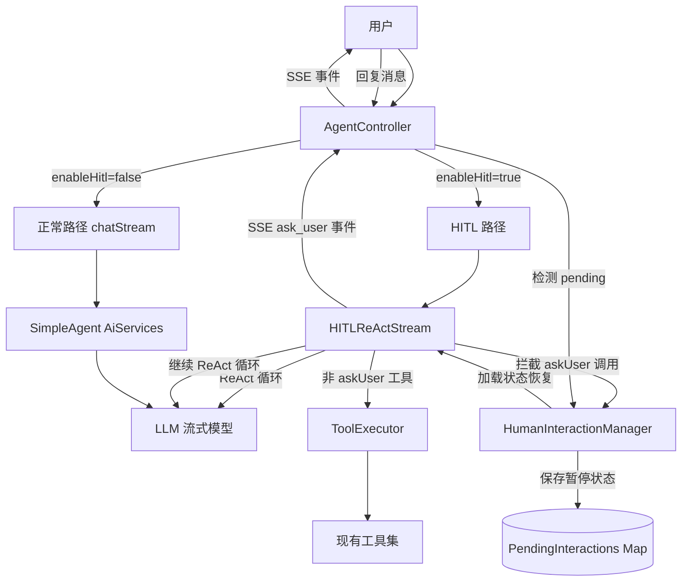
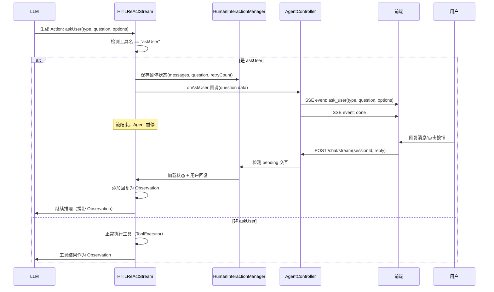
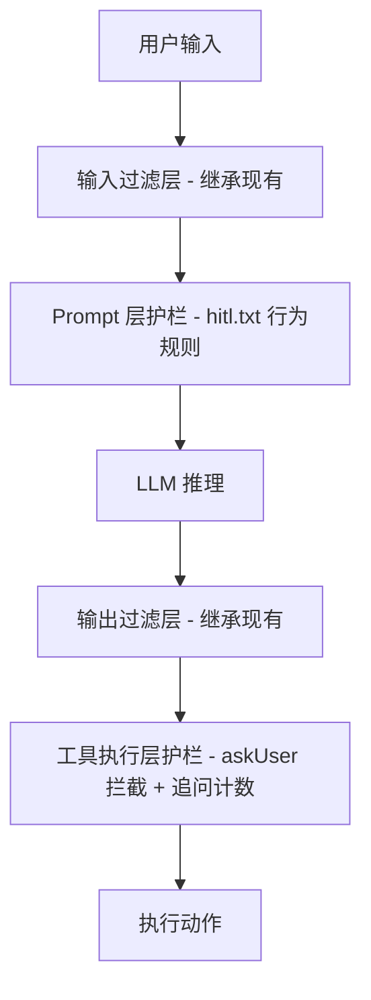

# AI Agent 技术设计文档: Agent-Human 交互能力

| 字段 | 内容 |
|------|------|
| 版本 | v0.1 |
| 作者 | AI Agent 架构师 |
| 日期 | 2026-08-20 |
| 变更记录 | v0.1 \| 2026-08-20 \| 初始版本，基于需求文档和代码库调研生成 \| AI Agent 架构师 |

## 0. 设计概要 (Design Summary)

*   **Agent 描述**：为现有单 Agent ReAct 对话增加 Human-in-the-Loop (HITL) 交互能力，使 Agent 在任务执行中遇到歧义或需执行关键操作时，能主动向用户提问/确认，等待回复后继续执行。
*   **Agent 类型**：混合型（对话澄清 + 任务确认），非独立 Agent，是现有 SimpleAgent 的能力增强
*   **自主性级别**：L2 - 确认后执行
*   **影响范围**：
    *   `agent-demo-agent`：新增 HITLReActStream、HumanInteractionManager、HitlTokenStream 接口
    *   `agent-demo-tools`：新增 AskUserTool
    *   `agent-demo-web`：AgentController 扩展（HITL 路由 + ask_user SSE 事件 + 回复恢复）
    *   `agent-demo-frontend`：chat.ts（ask_user 事件处理）、session.ts（交互状态管理）、MessageItem.vue（结构化卡片）、新增 ConfirmCard.vue 组件
*   **技术难点**：
    *   LangChain4j AiServices 隐式 ReAct 循环无法暂停/恢复 -> 需使用显式 ReAct 路径
    *   askUser 工具需要 sessionId 但工具方法无法直接获取 -> 通过 ReAct 循环拦截工具调用解决
    *   异步暂停-恢复需要跨 HTTP 请求保存状态 -> 通过 HumanInteractionManager 内存存储
*   **依赖关系**：
    *   现有 `ReActThinkingStream` 显式 ReAct 架构（作为 HITLReActStream 的参考范式）
    *   现有 `ToolExecutor` + `ToolSchemaConverter` 工具执行和描述体系
    *   现有 `ChatMemoryManager` + `SessionManager` 记忆和会话管理
    *   现有 SSE 流式通信机制（SseEmitter + sendEvent 统一方法）
    *   现有前端 SSE 解析框架（fetch + ReadableStream + handleSseEvent）

## 1. Agent 架构概览 (Agent Architecture)

### 1.1 编排模式

*   **模式**：单 Agent（复用现有 SimpleAgent）
*   **选择理由**：HITL 是现有单 Agent 的能力增强，不是独立 Agent。不改变现有编排模式，仅在 ReAct 循环中增加人机交互节点。

### 1.2 推理框架

*   **主要框架**：ReAct（推理-行动循环），与现有架构一致
*   **框架选择策略**：
    *   `enableHitl=false`（默认）：使用现有 `chatStream` 路径（AiServices 隐式 ReAct），行为不变
    *   `enableHitl=true`：路由到新的 `chatHITLStream` 路径（显式 ReAct + HITL 暂停-恢复）
*   **最大执行步骤**：复用现有 `agent.max-iterations=10`，askUser 调用不计入迭代次数（暂停状态不消耗迭代）

### 1.3 系统集成架构

*   **部署形态**：服务化（复用现有 Spring Boot 单体架构）
*   **接入方式**：复用现有 SSE 流式接口 + 新增 ask_user SSE 事件
*   **与现有系统的交互关系**：



### 1.4 Agent 生命周期

*   **会话初始化**：复用现有流程（SessionManager 创建/验证会话，ChatMemoryManager 加载记忆）
*   **执行循环（HITL 模式）**：
    1. 构建消息列表（系统提示词 + 历史记忆 + 当前用户消息）
    2. LLM 流式推理（Thought + Action）
    3. 拦截 Action：若工具名为 askUser -> 暂停并保存状态；否则 -> 正常执行工具
    4. 工具结果作为 Observation 回填到消息列表
    5. 回到步骤 2（LLM 继续推理），直到生成最终回答
*   **暂停-恢复周期**：
    *   暂停：保存消息列表 + 追问计数 -> 发送 ask_user SSE 事件 -> 流结束
    *   恢复：用户回复 -> 加载消息列表 -> 添加用户回复为 Observation -> 创建新 HITLReActStream -> 继续循环
    *   **前端展示（CR-001）**：恢复后的流式输出**复用**暂停时承载 HITL 卡片/问题的助手气泡作为流式目标（不新启助手气泡），续写内容在卡片下方同气泡内继续展示；askUser 文本/选项回复与批准/拒绝一致采用 silent 模式（不插入用户气泡，交互卡片锁定态展示答案/决策）
    *   **前端展示（CR-002）**：交互卡片（AskUserCard/ConfirmCard）**内嵌于 ReAct 推理过程区块内对应工具调用步骤处**展示，而非气泡底部；卡片-步骤按 `askUser` / 权限工具 `toolName` 匹配，无匹配回退底部 `ask-user-block`；含 HITL 卡片的消息 `react-block` 恒展开（卡片始终可见可交互/可回看），其他消息维持原折叠语义
    *   **前端数据模型（CR-003）**：`Message` 新增 `askUserHistory?: AskUserData[]` 历史记录数组，`askUserData` 保留为**最新一条镜像**（不破坏 `isWaitingForUserInput` / ChatWindow 恢复检测 / 兜底渲染）。`setToolConfirmData`/`setAskUserData` 追加新记录并同步镜像；`setToolConfirmApproved`/`setAskUserAnswer` 更新最后一条历史并同步镜像。MessageItem 遍历历史逐条内嵌渲染（首个未占用匹配），无匹配兜底底部，保证多次审批记录互不覆盖、可回看
*   **会话终止**：复用现有流程（会话超时 30 分钟清理），HumanInteractionManager 同步清理 pending 状态
*   **超时控制**：SseEmitter 配置为永不超时（`new SseEmitter(0L)`），复用 BR-APP-SSE-001

### 1.5 模型能力要求

| 能力维度 | 要求 | 说明 |
|---------|------|------|
| 上下文窗口 | >= 4096 tokens | 基于系统提示词(~500) + 对话历史(~2000) + 工具描述(~500) + ReAct 上下文(~1000) 估算 |
| 工具调用/Function Calling | 是 | 需要原生函数调用能力（askUser 作为工具被 LLM 选择调用） |
| 结构化输出/JSON Mode | 否 | 不强制 JSON 输出，工具参数由 Function Calling 解析 |
| 多语言能力 | 否 | 中文为主 |
| 推理能力 | 高级 | 需要复杂多步推理（ReAct 循环 + 判断何时需要澄清） |

## 2. Prompt 工程架构 (Prompt Engineering Architecture)

> 本节定义 Prompt 的架构和策略，具体 Prompt 文本由 agent-prompt-designer Skill 实现。

### 2.1 System Prompt 架构

*   **模块划分**：

| 模块 | 内容 | 注入方式 |
|------|------|---------|
| 角色定义 | 复用现有角色模板（general.txt） | 静态 |
| 能力边界 | 增加澄清能力描述：何时应主动追问用户 | 静态 |
| 行为规则 | ReAct 格式引导 + askUser 工具使用规则 + 追问策略（最多 3 次 + 选项引导） | 静态 |
| 护栏规则 | 有副作用操作前必须确认 + 信息不足时不可猜测 | 静态 |
| 输出规范 | 复用现有输出规范 | 静态 |
| 工具描述 | `{{tools}}` 占位符运行时动态注入（含 askUser 工具描述） | 动态 `{{tools}}` |

*   **上下文注入点**：
    *   `{{tools}}`：工具描述文本，由 `ToolSchemaConverter.convertToDescriptionText()` 运行时替换（复用现有机制，BR-AGT-009）
*   **版本管理**：复用现有 PromptTemplateLoader 三级回退策略（角色模板 -> general.txt -> AgentConfig 默认值）
*   **新增场景模板**：新增 `prompts/scenarios/hitl.txt` 场景模板，包含 HITL 行为规则和 askUser 工具使用引导

### 2.2 Tool/Function 描述设计

> 本节仅定义工具描述的结构模板；具体工具描述文本、参数 Schema 细节由 tool-design Skill 在任务规划与实现阶段落地。

| 工具名称 | when-to-use | when-not-to-use | 参数约束要点 | 返回格式要点 | 对应需求文档工具 |
|---------|-------------|-----------------|------------|---------|----------------|
| askUser | 用户指令缺少必要参数/存在歧义/面临多种方案时；即将执行有副作用操作前需确认时 | 信息充足可自主推进时；无副作用的查询/计算操作时 | type: "text"\|"confirm"; question: 非空字符串; options: confirm 类型必填，2-4 个选项 | 用户回复文本（由 HITLReActStream 拦截，不实际执行工具方法） | askUser |

*   **工具消歧策略**：askUser 与其他工具功能无重叠。LLM 通过系统提示词中的行为规则判断何时使用 askUser vs 直接执行其他工具。
*   **工具契约移交**：后续由 tool-design Skill 依据本表落地完整描述文本、参数 Schema 与错误恢复消息

### 2.3 输出格式契约

*   **结构化输出方案**：复用现有 ReAct 输出格式（Thought / Action / Observation 三段式），不新增输出格式
*   **askUser 调用格式**：LLM 通过标准 Function Calling 机制调用 askUser，参数由 LangChain4j 自动解析为 JSON
*   **校验规则**：
    *   type 字段必须为 "text" 或 "confirm"
    *   question 字段非空
    *   confirm 类型必须提供 options 列表
*   **解析失败处理**：参数不合法时，HITLReActStream 返回错误 Observation 提示 LLM 修正参数

### 2.4 Few-shot 示例策略

*   **示例选择原则**：在 hitl.txt 场景模板中包含 2 个示例：
    *   正例：用户说"帮我查订单"但无订单号 -> Agent 调用 askUser(type=text, question="请提供订单号")
    *   确认例：Agent 需要删除文件 -> 调用 askUser(type=confirm, question="确认删除文件XXX？", options=["确认","取消"])
*   **示例数量**：2 个
*   **放置位置**：场景模板文件内（prompts/scenarios/hitl.txt）

## 3. 工具集成设计 (Tool Integration)

### 3.1 工具适配层

| 现有 API/Service | 包装为 Tool 名 | 参数转换逻辑 | 返回值转换逻辑 | 副作用 |
|-----------------|---------------|-------------|---------------|--------|
| 无（新建） | askUser | LLM Function Calling 输出 type/question/options -> HITLReActStream 拦截 | 用户回复文本直接作为 Observation 注入消息列表 | 无（仅暂停 Agent 执行） |

**askUser 工具拦截机制（核心设计）**：



**关键设计决策：拦截而非执行**

AskUserTool 作为 `@Component` + `@Tool` 注册到 ToolRegistry，目的是为 LLM 提供 Function Calling Schema（工具名称、参数描述）。但 `HITLReActStream` 在执行工具前检查工具名：
- 若为 `askUser`：拦截，不调用工具方法，直接处理暂停逻辑
- 若为其他工具：正常委托 `ToolExecutor` 执行

此设计解决了 askUser 工具无法获取 sessionId 的问题（sessionId 在 HITLReActStream 构造时已知，无需传递到工具方法）。

### 3.2 工具执行编排

*   **串行编排**：askUser 与其他工具天然串行（ReAct 循环每次执行一个工具）
*   **并行编排**：不适用（ReAct 循环不支持并行工具调用）
*   **条件分支**：HITLReActStream 根据工具名分支（askUser 拦截 vs 正常执行）
*   **最大调用次数**：复用 `agent.max-iterations=10`，askUser 调用不消耗迭代次数

### 3.3 工具错误处理

| 工具 | 失败场景 | 重试策略 | 降级方案 | 是否转人工 |
|------|---------|---------|---------|-----------|
| askUser | 用户长时间不回复 | 不重试 | 依赖会话超时（30 分钟）清理 pending 状态 | 否 |
| askUser | 用户回复仍模糊 | LLM 自主决定追问（最多 3 次） | 3 次后 HITLReActStream 返回错误 Observation，LLM 终止任务 | 否 |
| askUser | 用户取消 | 不重试 | 清除 pending 状态，Agent 下一轮接收新指令 | 否 |
| askUser | 参数不合法 | 不重试 | 返回错误 Observation 提示 LLM 修正参数 | 否 |
| 其他工具 | 复用现有策略 | 复用现有策略 | 复用现有策略 | 复用现有策略 |

### 3.4 工具权限控制

*   **只读工具**：askUser（无副作用，仅暂停执行）
*   **读写工具**：现有工具中有副作用的操作（httpPost、readFile 等），通过系统提示词引导 LLM 在调用前先 askUser 确认
*   **高风险工具**：由 LLM 自主判断（通过系统提示词行为规则引导），不硬编码工具分类

## 4. 记忆与上下文架构 (Memory & Context)

### 4.1 对话上下文管理

*   **管理策略**：复用现有滑动窗口策略（MessageWindowChatMemory，20 条消息）
*   **策略详情**：不改变现有记忆窗口管理。HITL 暂停-恢复期间，消息列表保存在 HumanInteractionManager 中（独立于 ChatMemory），恢复后合并到 ChatMemory。
*   **上下文构建管道**：

```mermaid
graph LR
    SysPrompt[System Prompt hitl.txt] --> Messages[消息列表]
    Memory[ChatMemory 历史消息] --> Messages
    UserMsg[当前用户消息] --> Messages
    Tools[工具描述 {{tools}}] --> SysPrompt
    Messages --> LLM[LLM 推理]
    
    subgraph 暂停时
        Messages -->|保存| HIM[(HumanInteractionManager)]
    end
    
    subgraph 恢复时
        HIM -->|加载| Messages2[恢复的消息列表]
        UserReply[用户回复] -->|作为 Observation| Messages2
        Messages2 --> LLM
    end
```

### 4.2 短期记忆

*   **存储方案**：复用现有内存存储（ConcurrentHashMap<String, ChatMemory>）
*   **生命周期**：复用现有会话级超时清除（30 分钟 TTL）
*   **数据结构**：复用现有 MessageWindowChatMemory（20 条消息 FIFO）

**HITL 暂停状态存储（新增）**：

| 数据结构 | 类型 | 所属类 | 用途 |
|---------|------|--------|------|
| pendingInteractions | ConcurrentHashMap<String, PendingInteraction> | HumanInteractionManager | 按 sessionId 存储暂停的交互状态 |

**PendingInteraction 数据结构**：

```java
public class PendingInteraction {
    private List<ChatMessage> messages;        // 暂停时的完整消息列表
    private String askUserType;                // text / confirm
    private String question;                   // 问题文本
    private List<String> options;              // 选项列表（confirm 类型）
    private int retryCount;                    // 当前追问次数
    private long timestamp;                    // 暂停时间戳（用于超时清理）
    private String modelId;                     // 使用的模型 ID（恢复时需要）
    private List<Object> tools;                // 工具列表（恢复时需要）
    private String toolsJson;                  // 工具 JSON Schema（恢复时需要）
}
```

### 4.3 长期记忆

*   不适用（本期不实现跨会话记忆，需求文档 3.2 节明确排除）

### 4.4 上下文注入管道

*   **检索 -> 排序 -> 截断 -> 注入**：复用现有机制
*   **Token 预算分配**：
    *   System Prompt (hitl.txt + 工具描述): ~1000 tokens
    *   对话历史 (ChatMemory): ~2000 tokens
    *   ReAct 上下文 (Thought/Action/Observation): ~1000 tokens
    *   预留 LLM 输出: ~1000 tokens
    *   总计: ~5000 tokens（在 4096+ 上下文窗口内）

## 5. 知识与检索设计

> 本功能不涉及知识检索，复用现有 RAG 能力。当 HITL 模式下用户指定知识库时，知识库工具与 askUser 工具共存于工具列表中，LLM 自主选择调用。

## 6. 护栏与安全设计 (Guardrails & Safety)

### 6.1 多层护栏架构



### 6.2 输入过滤层（Pre-processing）

*   **Prompt Injection 防护**：本期不实现（需求文档 6.6 节，信任用户回复）
*   **内容安全过滤**：继承现有 Agent 策略
*   **敏感信息脱敏**：继承现有策略

### 6.3 Prompt 层护栏（In-context）

*   **行为约束规则**（hitl.txt 场景模板）：
    *   必须做：信息不足时调用 askUser 追问；有副作用操作前调用 askUser 确认
    *   禁止做：信息不足时猜测参数并执行；有副作用操作未经确认直接执行
    *   追问策略：同一问题最多追问 3 次，每次提供选项/示例引导
*   **角色锁定策略**：复用现有角色模板
*   **输出格式约束**：复用现有 ReAct 格式约束

### 6.4 输出过滤层（Post-processing）

*   **内容安全检查**：继承现有策略
*   **敏感信息泄露检测**：继承现有策略
*   **格式校验与修复**：askUser 参数校验（type/question/options 合法性），不合法时返回错误 Observation

### 6.5 工具执行层护栏（Action Gating）

*   **确认机制**：askUser 工具本身就是确认机制（L2 级别）
*   **频率限制**：追问计数器，同一会话连续 askUser 调用最多 3 次
*   **参数安全校验**：
    *   Schema 校验：type 必须为 text/confirm，question 非空，confirm 类型 options 必填
    *   参数白名单/黑名单：继承现有策略
    *   工具返回内容隔离：askUser 返回的用户回复作为 Observation 注入消息列表，不进入 System Prompt

### 6.6 降级策略

*   **模型不可用**：复用现有策略（LLM 调用失败时 SSE error 事件）
*   **工具链全面失败**：HITLReActStream 捕获异常，发送 SSE error 事件，清理 pending 状态
*   **护栏触发降级**：追问 3 次后，HITLReActStream 返回错误 Observation（"已达最大追问次数"），LLM 据此终止任务

### 6.7 身份与权限架构

*   **身份传播机制**：继承现有策略（无认证，会话隔离按 sessionId）
*   **工具调用鉴权**：不适用（askUser 无副作用）
*   **数据隔离**：pendingInteractions 按 sessionId 隔离，不同会话互不影响
*   **权限映射**：不适用（无权限分级）

## 7. 评估与可观测性设计 (Evaluation & Observability)

### 7.1 决策链路追踪

*   **追踪日志结构**：

| 字段 | 说明 | 示例 |
|------|------|------|
| trace_id | 会话级追踪 ID（复用 traceId） | sess_abc123 |
| step_id | ReAct 步骤序号 | step_001 |
| timestamp | 时间戳 | 2026-08-20T10:00:00Z |
| input | 当前步骤输入 | 用户消息/工具结果 |
| reasoning | 推理过程（Thought） | "用户未提供订单号，需要追问..." |
| tool_selected | 选择的工具 | askUser |
| tool_params | 工具参数 | {"type":"text","question":"请提供订单号"} |
| tool_result | 工具返回 | 用户回复文本 |
| hitl_event | HITL 事件类型 | ask/pause/resume/cancel/timeout |
| token_consumed | Token 消耗 | input: 500, output: 200 |
| latency_ms | 延迟 | 1500 |

### 7.2 评估框架

*   **评估数据集**：覆盖需求文档六类 AC 场景的测试用例集
*   **评估指标**：

| 指标类别 | 指标名称 | 定义 | 目标值 |
|---------|---------|------|--------|
| 正确性 | 澄清触发率 | 歧义场景中 Agent 正确调用 askUser 的比例 | >= 90% |
| 正确性 | 确认触发率 | 有副作用操作前 Agent 调用 askUser 确认的比例 | >= 95% |
| 安全性 | 追问上限执行率 | 3 次追问后正确终止任务的比例 | 100% |
| 效率 | 平均澄清轮次 | 单次任务中 askUser 调用次数 | <= 2 |
| 效率 | 平均 Token 消耗 | 单次 HITL 交互的平均 Token | <= 3000 |
| 用户体验 | 选项引导率 | 追问时提供选项/示例的比例 | >= 90% |

*   **评估方式**：
    *   自动评估：单元测试（状态管理、工具拦截、追问计数、恢复逻辑）
    *   人工评估：前端交互（卡片展示、按钮点击、文本追问、话题切换）
*   **对抗测试**：本期不实现（学习示例工程，信任用户输入）

### 7.3 监控与告警

*   **实时监控指标**：复用现有日志体系，新增 HITL 事件日志
*   **告警阈值**：不适用（学习示例工程，无生产告警）
*   **行为异常检测**：不适用（学习示例工程）

## 8. 性能与成本设计 (Performance & Cost)

### 8.1 Token 成本优化

*   **上下文裁剪策略**：复用现有 ChatMemory 窗口淘汰（20 条 FIFO）
*   **模型分级调用**：HITL 模式使用会话当前选择的模型（复用现有 ModelSelector 机制）
*   **缓存策略**：HITLReActStream 不缓存（每次创建新实例），SimpleAgent delegate 缓存复用现有机制

### 8.2 延迟优化

*   **流式输出**：复用现有 SSE 流式机制，HITL 模式下 Thought/Action/Observation 均通过 SSE 事件实时推送
*   **工具并行调用**：不适用（ReAct 串行执行）
*   **预计算与异步**：HITLReActStream 使用 `CompletableFuture.runAsync()` 异步执行（复用现有模式，避免 earlySendAttempts 缓存）

### 8.3 并发控制

*   **会话级限制**：同一 sessionId 同时只能有一个 pending HITL 交互（HumanInteractionManager 校验）
*   **全局限流**：不适用（学习示例工程）
*   **资源隔离**：pendingInteractions 按 sessionId 隔离

### 8.4 成本估算

| 场景 | 单次 Token 消耗 | 预估日交互量 | 说明 |
|------|----------------|-------------|------|
| 简单对话（无 HITL） | ~1000 | - | 复用现有路径，无额外消耗 |
| HITL 单次澄清 | ~3000 | - | 系统提示词 + 历史 + ReAct 上下文 + 用户回复 |
| HITL 多轮澄清（3 次） | ~8000 | - | 3 轮 ReAct + 上下文累积 |

> 注：本项目为学习示例，无生产成本预算约束。Token 消耗由 Coding Plan 按次计费。

## 9. 验收标准映射 (AC Mapping)

> 确保每个行为验收标准都有对应的技术实现

| AC ID | AC 描述 | AC 类型 | 对应技术实现 |
|-------|--------|--------|-------------|
| AC-N01 | 歧义检测与主动追问 | 正常交互 | HITLReActStream ReAct 循环 + hitl.txt 系统提示词行为规则 + AskUserTool Function Calling Schema |
| AC-N02 | 关键操作前确认 | 正常交互 | hitl.txt 行为规则引导 LLM 对有副作用操作调用 askUser(type=confirm) + HITLReActStream 拦截 |
| AC-N03 | 用户回复后恢复执行 | 正常交互 | HumanInteractionManager 状态保存 + AgentController 检测 pending + HITLReActStream 恢复（加载消息列表 + 添加 Observation）；**CR-001：前端 sendMessage HITL 恢复分支复用气泡，同气泡续写** |
| AC-N04 | HITL 决策后同气泡续写 | 正常交互 | **CR-001：前端 ChatWindow.vue sendMessage 复用最后一条含 HITL 卡片的气泡 id 作为流式目标；session.ts markStreaming 恢复流式状态；卡片锁定态 + 续写同气泡展示。CR-002：交互卡片内嵌于 ReAct 推理过程区块内对应工具调用步骤处。CR-003：同一气泡内可连续多次交互，记录互不覆盖** |
| AC-N05 | HITL 推理过程区块保持展开 | 正常交互 | **CR-002：前端 MessageItem.vue react-block 折叠逻辑——含 HITL 卡片（askUserData 存在）的消息强制展开；卡片-步骤关联（按 askUser / 权限工具 toolName 匹配），无匹配回退底部 ask-user-block** |
| AC-N06 | 多次审批/追问记录保留 | 正常交互 | **CR-003：Message.askUserHistory 历史记录数组 + askUserData 最新镜像；session.ts 追加/更新历史；MessageItem.vue 遍历历史内嵌渲染（首个未占用匹配），无匹配兜底底部** |
| AC-T01 | 开放式追问使用纯文本形式 | 工具调用 | SSE ask_user 事件(type=text) + 前端 handleSseEvent 新增 onAskUser 回调 + 复用现有消息展示 |
| AC-T02 | 确认型交互使用结构化卡片 | 工具调用 | SSE ask_user 事件(type=confirm, options) + 前端新增 ConfirmCard.vue 组件 + 按钮点击回复 |
| AC-S01 | 追问次数上限 | 安全护栏 | PendingInteraction.retryCount 计数器 + HITLReActStream 检查 retryCount >= 3 时返回错误 Observation |
| AC-S02 | 追问时提供选项引导 | 安全护栏 | hitl.txt 系统提示词行为规则引导 LLM 在追问时提供选项/示例 |
| AC-E01 | 会话超时清理等待状态 | 边界降级 | HumanInteractionManager @Scheduled 清理（复用 30 分钟超时） + SessionManager 清理联动 |
| AC-E02 | 用户在等待期间切换话题 | 边界降级 | hitl.txt 行为规则引导 LLM 识别话题切换 + HITLReActStream 恢复时 LLM 基于上下文判断 |
| AC-M01 | 跨暂停-恢复的上下文保持 | 记忆上下文 | PendingInteraction.messages 保存完整消息列表 + 恢复时合并到 ChatMemory |
| AC-M02 | 连续多轮澄清的上下文连续性 | 记忆上下文 | 消息列表保存所有 Q&A 对 + ChatMemory 窗口保留 + hitl.txt 引导 LLM 保持上下文 |
| AC-H01 | 任务无法完成时的告知 | 人机协作 | HITLReActStream 错误处理 + hitl.txt 行为规则引导 LLM 告知原因和建议 |
| AC-H02 | 用户主动取消等待中的澄清 | 人机协作 | 前端 cancel 机制（confirm 卡片取消按钮 + 文本"取消"检测） + HumanInteractionManager.clearInteraction 清除状态 |

## 10. 技术决策说明 (Technical Decisions)

### 决策 1：HITL 路径选择 -- 显式 ReAct 而非 AiServices 隐式 ReAct

*   **选项 A**：在现有 AiServices chatStream 路径中实现 HITL（通过阻塞式工具 + ThreadLocal 传递 sessionId）
*   **选项 B**：新建显式 ReAct 路径（HITLReActStream），参考现有 ReActThinkingStream 架构
*   **选择**：B
*   **理由**：
    1. AiServices 隐式 ReAct 循环无法暂停/恢复（LangChain4j 不暴露循环控制权）
    2. 工具方法无法获取 sessionId（ThreadLocal 在异步线程中不可靠）
    3. 显式 ReAct 已有成熟参考实现（ReActThinkingStream），架构一致性好
    4. 显式 ReAct 可拦截 askUser 工具调用，避免 sessionId 传递问题
    5. 不影响现有 chatStream 路径（enableHitl=false 时行为零回归）

### 决策 2：askUser 工具拦截机制

*   **选项 A**：AskUserTool 方法阻塞在 CompletableFuture 上等待用户回复
*   **选项 B**：HITLReActStream 拦截 askUser 调用，不走真实工具执行
*   **选择**：B
*   **理由**：
    1. 阻塞式工具占用线程资源，不支持长时间等待
    2. 拦截机制使 sessionId 在 HITLReActStream 构造时已知，无需传递到工具方法
    3. 拦截后可直接保存消息列表状态，恢复时创建新 ReAct 循环，真正异步
    4. AskUserTool 仍需注册为 @Tool（提供 Function Calling Schema），但方法体为占位实现

### 决策 3：状态存储 -- 内存 Map 而非 Redis/数据库

*   **选项 A**：使用 Redis 持久化 pending 状态
*   **选项 B**：使用 ConcurrentHashMap 内存存储（与现有 SessionManager/ChatMemoryManager 一致）
*   **选择**：B
*   **理由**：
    1. 项目为学习示例工程，全部使用内存存储（无 Redis/数据库依赖）
    2. 与现有 SessionManager、ChatMemoryManager 架构一致
    3. 会话超时清理已有成熟机制（@Scheduled + 30 分钟 TTL），可复用
    4. pending 状态生命周期短（用户回复或超时即清理），无需持久化

### 决策 4：前端回复机制 -- 复用现有 chat/stream 端点

*   **选项 A**：新建 `/api/agent/chat/reply` 专用回复端点
*   **选项 B**：复用现有 `/api/agent/chat/stream` 端点，Controller 检测 pending 状态自动恢复
*   **选择**：B
*   **理由**：
    1. 前端无需区分"正常消息"和"HITL 回复"，降低前端复杂度
    2. 复用现有 SSE 流式机制，回复后 Agent 继续执行也通过 SSE 推送
    3. Controller 层判断逻辑简单：有 pending -> 恢复；无 pending -> 正常对话
    4. 减少 API 端点数量，降低维护成本

### 决策 5：追问计数 -- 会话级连续计数

*   **选项 A**：按问题内容匹配计数（需要语义相似度判断）
*   **选项 B**：会话级连续 askUser 调用计数（非 askUser 工具调用或 ReAct 循环完成时重置）
*   **选择**：B
*   **理由**：
    1. 问题内容匹配需要语义分析，复杂度过高
    2. 连续 askUser 调用计数简单可靠，覆盖"同一问题反复追问"场景
    3. 非 askUser 工具调用时重置计数器，避免跨任务误累加
    4. ReAct 循环完成（生成最终回答）时重置计数器

## 11. 风险与注意事项 (Risks & Notes)

*   **技术风险**：
    *   HITLReActStream 是新建的显式 ReAct 循环，与现有 ReActThinkingStream 有代码相似性 -> 可提取公共基类减少重复（但本期不重构现有代码，仅新建）
    *   LLM 可能不稳定地调用 askUser（有时直接回答而不追问）-> 通过 hitl.txt 系统提示词强引导 + Few-shot 示例
    *   用户回复时 pending 状态可能已被超时清理 -> Controller 检测到无 pending 时降级为正常对话（不报错）
*   **兼容性**：
    *   `enableHitl=false`（默认）时行为零回归，不影响现有对话流
    *   AskUserTool 注册到 ToolRegistry 后，在非 HITL 路径中也会出现在工具列表中 -> 通过工具按需加载机制控制（仅 enableHitl=true 时加载）
*   **性能影响**：
    *   HITL 模式使用显式 ReAct，与 thinking ReAct 路径性能相当
    *   pending 状态存储为内存 Map，不增加额外 I/O 开销
*   **安全风险**：本期不实现提示注入防护（需求文档明确排除），用户回复视为可信输入
*   **回滚方案**：
    *   功能降级开关：`enableHitl` 参数（默认 false），前端不显示 HITL 开关即可完全关闭
    *   hitl.txt 模板缺失时回退到 AgentConfig 默认提示词（复用 PromptTemplateLoader 三级回退）
    *   pending 状态超时自动清理，无需手动回滚数据

## 12. 数据隐私与合规 (Data Privacy & Compliance)

*   **数据存储加密**：不适用（学习示例工程，全部内存存储，无敏感数据持久化）
*   **数据传输加密**：复用现有 HTTP 传输（开发环境 HTTP，生产环境建议 HTTPS）
*   **PII 识别与脱敏**：不适用（本期不实现，继承现有策略）
*   **日志保留与审计**：
    *   决策链路日志：复用现有日志体系（logs/agent-demo.log）
    *   HITL 事件日志：新增 ask/pause/resume/cancel/timeout 事件记录
*   **用户数据权利**：不适用（学习示例工程）
*   **合规要求**：不适用（学习示例工程）

---

## 附录：新增文件清单

| 模块 | 文件路径 | 说明 |
|------|---------|------|
| agent-demo-agent | `core/HitlTokenStream.java` | HITL 流式接口（继承 ThinkingTokenStream，新增 onAskUser 回调） |
| agent-demo-agent | `single/HITLReActStream.java` | HITL 显式 ReAct 循环实现（参考 ReActThinkingStream） |
| agent-demo-agent | `core/HumanInteractionManager.java` | 人机交互管理器（pending 状态存储 + 恢复 + 超时清理） |
| agent-demo-agent | `core/PendingInteraction.java` | 暂停交互状态数据结构 |
| agent-demo-tools | `builtin/AskUserTool.java` | askUser 工具（@Component + @Tool，占位实现） |
| agent-demo-web | `controller/AgentController.java`（修改） | 新增 HITL 路由 + ask_user SSE 事件 + 回复恢复逻辑 |
| agent-demo-web | `dto/ChatRequest.java`（修改） | 新增 enableHitl 字段 |
| agent-demo-agent | `single/SimpleAgent.java`（修改） | 新增 chatHITLStream 方法 |
| agent-demo-agent | `prompt/PromptTemplateLoader.java`（修改） | 新增 SCENARIO_HITL 场景常量 |
| agent-demo-agent | `resources/prompts/scenarios/hitl.txt`（新建） | HITL 场景模板 |
| agent-demo-frontend | `api/chat.ts`（修改） | 新增 onAskUser 回调 + enableHitl 参数 |
| agent-demo-frontend | `stores/session.ts`（修改） | 新增 askUser 状态管理 |
| agent-demo-frontend | `types/index.ts`（修改） | 新增 AskUserData 类型 + StreamCallbacks.onAskUser |
| agent-demo-frontend | `components/MessageItem.vue`（修改） | 新增 askUser 卡片渲染 |
| agent-demo-frontend | `components/ConfirmCard.vue`（新建） | 确认型交互结构化卡片组件 |
| agent-demo-frontend | `components/ChatWindow.vue`（修改） | 新增 enableHitl 开关 + askUser 回调处理 |

---

## 变更日志 (Change Log)

### CR-001: HITL 恢复后续写同气泡展示 (2026-08-28)

**影响范围**: 前端交互层（ChatWindow.vue / session.ts / 前端测试）
**变更内容摘要**:
- [新增] 前端 HITL 恢复分支：`sendMessage` 在 HITL 恢复场景（toolApproved 已定义，或存在待回复的 askUser 卡片）复用最后一条含 HITL 卡片/问题的助手气泡 id 作为流式目标，不新启助手气泡（Sec 1.4 暂停-恢复周期）
- [新增] `session.ts` 新增 `markStreaming(messageId)` 方法：把复用气泡 status 置回 `incomplete`（流式续写展示），`onDone` 后 `markComplete`
- [修改] `handleAskUserReply` 改为 silent 模式：askUser 文本/选项回复不再插入用户气泡，答案由 AskUserCard 锁定态展示（与批准/拒绝 silent 设计一致，交互优化）
- [修改] AC-N03 恢复执行的展示约束 + 新增 AC-N04（见 Sec 9 AC 映射表）
- [无影响] 后端 `AgentController.resumeUnifiedStream` / `HITLReActStream` / `AskUserTool` / Prompt 制品均无改动（续写仍走同一套 SSE 事件协议）

### CR-002: HITL 交互卡片内嵌于 ReAct 推理过程区块 (2026-08-28)

**影响范围**: 前端交互层（MessageItem.vue / AskUserCard.vue / ConfirmCard.vue / 前端测试）
**变更内容摘要**:
- [新增] 卡片-步骤关联：`react-block` 内对对应工具调用步骤内嵌渲染 AskUserCard/ConfirmCard——askUser 类按 `toolName === 'askUser'` 匹配；权限确认（kind=permission）按卡片 `toolName` 匹配工具卡片；无匹配回退底部 `ask-user-block`（兜底保留，不丢卡片）
- [新增] 折叠逻辑：含 HITL 卡片（`message.askUserData` 存在）的消息 `react-block` 恒展开（等待态可交互、完成后可回看锁定态）；不含卡片消息维持原折叠语义（isReactExpanded 基于 status 与手动切换）
- [修改] AC-N04 展示约束 + 新增 AC-N05（见 Sec 9 AC 映射表）
- [无影响] 后端 / Prompt 制品无改动（纯前端展示层；沿用 CR-001 不补 toolCallId，前端启发式匹配）

### CR-003: 多次审批/追问记录保留 (2026-08-28)

**影响范围**: 前端交互层（types/index.ts / session.ts / MessageItem.vue / 前端测试）
**变更内容摘要**:
- [新增] 数据模型：`Message.askUserHistory?: AskUserData[]` 历史记录数组；`askUserData` 保留为最新一条镜像（向后兼容旧数据、不破坏 isWaitingForUserInput / ChatWindow 恢复检测 / 兜底渲染）
- [修改] `session.ts`：`setToolConfirmData`/`setAskUserData` 由覆盖写改为"追加历史 + 同步镜像"；`setToolConfirmApproved`/`setAskUserAnswer` 改为"更新最后一条历史 + 同步镜像"
- [修改] `MessageItem.vue`：遍历 `askUserHistory` 逐条内嵌渲染于对应工具步骤（首个未占用匹配，延续 CR-002 内嵌布局）；无匹配记录兜底渲染于底部 `ask-user-block`（不丢记录）
- [修改] AC-N04（同一气泡多次交互不覆盖）+ 新增 AC-N06（见 Sec 9 AC 映射表）
- [无影响] 后端 / Prompt 制品无改动（纯前端数据模型与渲染）
