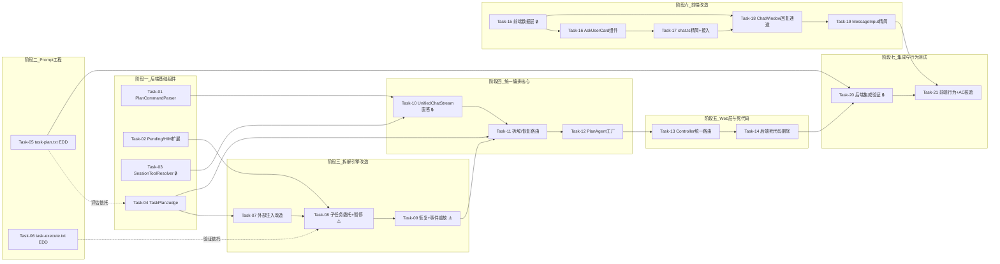

# AI Agent 开发任务计划: unified-chat-mode（统一对话模式）

| 字段   | 内容                                                         |
| ---- | ---------------------------------------------------------- |
| 版本   | v0.1                                                       |
| 作者   | AI Agent 技术主管                                              |
| 日期   | 2026-08-21                                                 |
| 变更记录 | v0.1 \| 2026-08-21 \| 初始版本，基于技术方案 v0.1 拆解 \| AI Agent 技术主管 |

> **需求来源**：`specs/features/20260821_unified-chat-mode/unified-chat-mode.md`（v0.1，20 条 AC）
> **技术方案**：`specs/features/20260821_unified-chat-mode/unified-chat-mode_技术方案.md`（v0.1）
> **已确认规划决策**：任务拆解 21 项确认通过；**当前分支直接开发**（不创建功能分支，用户确认）。

## 0. 任务概览 (Task Overview)

* **Agent 名称**：unified-chat-mode（统一对话模式，现有单 Agent 对话能力的模式融合演进）

* **总任务数**：21 个（另含准备事项 3 项）

* **预计总工时**：1590 分钟（约 26.5 小时）

* **任务类型分布**：

  * 确定性组件（TDD）：16 个（Task-01\~04、07\~14、15、17\~19）

  * 概率性组件（EDD，含迭代）：2 个（Task-05、Task-06）

  * 行为测试（含 Mock -> 真实接入闭环）：2 个（Task-20、Task-21）

  * 基础设施：0 个（运行时/评估观测全部复用现有工程，无新增基建）

* **风险任务** ⚠️：Task-08（子任务委托与暂停信号）、Task-09（恢复入口与事件重放）——技术方案 11.1 标注的最高风险"子任务暂停-恢复状态完整性"；Task-06（task-execute.txt 概率性调优）

* **阻塞任务** 🔒：Task-10（UnifiedChatStream，被 11/12/13 依赖）、Task-15（前端数据层，被 16/17/18 依赖）、Task-03（SessionToolResolver，被 10 依赖）、Task-20（集成验证，交付门禁）

* **Prompt 迭代预期**：2 个概率性组件各预计 2 轮评估调优（初始版 -> 评估 -> 调优 -> 再评估），超出 2 轮上报架构问题

### 依赖关系图

### 可并行任务组

| 并行组               | 可同时执行的任务                                                            | 说明                                                   |
| :---------------- | :------------------------------------------------------------------ | :--------------------------------------------------- |
| 并行组 1（阶段一/二/六入口）  | Task-01 + Task-02 + Task-03 + Task-04 + Task-05 + Task-06 + Task-15 | 后端基础组件、Prompt 模板、前端数据层互不依赖；前后端整体可并行（SSE 协议零变更保证契约稳定） |
| 并行组 2（拆解线 vs 编排线） | Task-07\~09（拆解引擎线）与 Task-10\~12（编排核心线，直答部分）                         | Task-10 仅依赖 01/03，可与拆解引擎改造并行；Task-11 为两线汇合点          |
| 并行组 3（前端组件层）      | Task-16 与 Task-17 的 chat.ts 部分                                      | 卡片组件开发与 API 签名精简可并行，最终在 Task-17 接入点汇合                |

## 1. 准备工作 (Preparation)

> 用户决策：**当前分支直接开发**，不创建功能分支（Prep 适配为基线确认）。

* [ ] **Prep-01**: 基线编译与测试验证

  * 说明：确认改造起点干净。后端 `mvn compile -pl agent-demo-agent -am`、`mvn compile -pl agent-demo-web -am` 编译通过；前端 `npm run test`（vitest）全量通过

  * 验证：三项命令全部成功，无失败用例（如有既有失败先记录基线清单）

* [ ] **Prep-02**: LLM API 连通性确认

  * 说明：确认 `ARK_API_KEY` 环境变量已注入（禁止硬编码，PROJECT\_HABITS），ModelFactory 可创建模型实例

  * 验证：启动应用后任一会话可完成一次基础对话（同步 `/chat` 即可）

* [ ] **Prep-03**: 模型能力基线确认

  * 说明：对照技术方案 1.5 节能力表，确认当前会话模型支持 Function Calling 与结构化输出（规划判断 JSON 数组依赖）

  * 验证：现有 HITL 会话可正常触发 askUser 工具拦截（Function Calling 可用）；现有任务拆解可正常返回子任务 JSON（结构化输出可用）

## 2. 开发任务 (Development Tasks)

> **阶段自适应说明**：本 Agent 为现有工程的模式融合演进，Agent 运行时/LLM 接入/记忆/知识检索均复用现状（技术方案第 3\~5 节），故跳过模板的"Agent 基础设施/知识检索/长期记忆"独立阶段；护栏继承现状（技术方案 6.2 明确本期无新增攻击面）；评估框架复用手动场景 + 单测体系（技术方案 7.2），不搭建独立评估基建。

### 阶段一：后端基础组件 (Backend Foundation Components)

> 新增四个基础组件，为统一编排提供解析、状态、工具、判断四项能力
>
> **阶段完成标准**：四个组件单测全通过；现有功能零回归（SimpleAgent 委托切换后旧测试仍绿）

* [ ] **Task-01**: PlanCommandParser /plan 前缀解析器

  * **通俗解释**: 做完这步后，系统就能听懂"/plan"这个暗号了——用户消息以它开头就强制拆解，且"暗号"本身不会进入 AI 的思考内容。

  * **任务类型**: 确定性组件

  * **验证策略**: TDD（Red-Green-Refactor）

  * **说明**: 新增静态工具类，实现 `/plan` 前缀识别与剥离（技术方案 1.6.1：trim 后以 `/plan`（小写，后跟空白或串尾）开头则 forced=true 并剥离前缀）；返回 `record PlanCommand(boolean forced, String content)`

  * **涉及文件**: `agent-demo-agent/src/main/java/com/agentdemo/agent/core/PlanCommandParser.java`（新增）

  * **测试文件**: `agent-demo-agent/src/test/java/com/agentdemo/agent/core/PlanCommandParserTest.java`（新增）

  * **参考**: 技术方案 1.6.1、决策 6（/plan 剥离时机）、6.2（输入层一次性处理）

  * **对应AC**: AC-N04（前缀识别）、AC-E02（空内容判定基础）

  * **预估工时**: 40m

  * **依赖**: 无（可并行组 1）

  * **验证标准**（TDD RED 阶段的测试依据）:

    * [ ] `parse("/plan 帮我调研竞品")` -> forced=true, content="帮我调研竞品"

    * [ ] `parse("/plan")` / `parse("/plan   ")` -> forced=true, content=""（空内容场景，交由编排层提示）

    * [ ] `parse("/plan任务无空格")` -> forced=false（前缀后必须跟空白或串尾）

    * [ ] `parse("/plans for tomorrow")` -> forced=false（/plans 是不同单词，不误识别）

    * [ ] `parse("/PLAN 大写")` -> forced=false（仅识别小写）

    * [ ] `parse("普通消息")` -> forced=false, content 原样

    * [ ] 前后空白自动 trim（`"  /plan 任务  "` -> content="任务"）

* [ ] **Task-02**: PendingInteraction 扩展与 HumanInteractionManager 增强

  * **通俗解释**: 做完这步后，系统在暂停等待用户回复时，能同时记住"这是在直接聊天中暂停的，还是在执行某个子任务时暂停的，以及任务进行到哪一步了"。

  * **任务类型**: 确定性组件

  * **验证策略**: TDD

  * **说明**: PendingInteraction 新增 `mode`（"direct"/"breakdown"，默认 direct）、`subTasks`、`currentTaskIndex`、`subtaskResults` 四字段；HumanInteractionManager 新增 `saveInteraction` 带 mode 重载（旧签名保留兼容直答路径）与 `attachBreakdownContext(sessionId, subTasks, currentTaskIndex, subtaskResults)`

  * **涉及文件**: `agent-demo-agent/src/main/java/com/agentdemo/agent/core/PendingInteraction.java`、`agent-demo-agent/src/main/java/com/agentdemo/agent/core/HumanInteractionManager.java`

  * **测试文件**: `agent-demo-agent/src/test/java/com/agentdemo/agent/core/HumanInteractionManagerTest.java`（更新）

  * **参考**: 技术方案 1.6.2、决策 4（pending 附加而非独立存储）

  * **对应AC**: AC-T05、AC-M02（拆解上下文保存基础）、AC-E03（超时清理随对象）

  * **预估工时**: 40m

  * **依赖**: 无（可并行组 1）

  * **验证标准**:

    * [ ] 新字段默认值正确（mode="direct"、subTasks/subtaskResults 空集合、currentTaskIndex=0）

    * [ ] `saveInteraction(mode=breakdown)` 重载保存 mode 字段

    * [ ] `attachBreakdownContext` 正确更新已存在 pending 的四个拆解上下文字段

    * [ ] `attachBreakdownContext` 对不存在的 pending 不创建新条目（WARN 日志，不抛异常）

    * [ ] 超时清理回归：30 分钟过期 pending（含拆解上下文）整体清理（现有 @Scheduled 逻辑，断言对象级清理）

* [ ] **Task-03**: SessionToolResolver 会话工具解析抽取 🔒

  * **通俗解释**: 做完这步后，无论是直接聊天还是任务拆解，Agent 都通过同一个"工具管理员"获取可用工具清单，不再有两套重复逻辑。

  * **任务类型**: 确定性组件

  * **验证策略**: TDD

  * **说明**: 新增 @Service 组件，自 SimpleAgent 迁移 `resolveSessionTools`（默认 ∪ 指定 + sessionToolIds 会话缓存，BR-AGT-011/012）、`ensureAskUserTool`（补入 askUser）、`dedupeToolsByMethodName`（按方法名去重）；SimpleAgent 同步切换为委托调用（行为不变的重构，旧 chat\* 方法删除延后至 Task-14）

  * **涉及文件**: `agent-demo-agent/src/main/java/com/agentdemo/agent/single/SessionToolResolver.java`（新增）、`SimpleAgent.java`（委托切换）

  * **测试文件**: `agent-demo-agent/src/test/java/com/agentdemo/agent/single/SessionToolResolverTest.java`（新增）

  * **参考**: 技术方案 1.6.1、决策 1、3.1（工具解析管道）

  * **对应AC**: AC-T01（工具解析管道支撑）、AC-N01（统一路径）

  * **预估工时**: 60m

  * **依赖**: 无（可并行组 1）

  * **阻塞标注**: 🔒 Task-10 依赖

  * **验证标准**:

    * [ ] `resolveSessionTools(sessionId, toolIds)` 返回默认工具 ∪ 指定工具

    * [ ] 同 sessionId 二次调用返回会话缓存实例（缓存生效断言）

    * [ ] `ensureAskUserTool` 在工具列表补入 askUser 且不重复

    * [ ] 同名方法工具被去重（dedupeToolsByMethodName）

    * [ ] SimpleAgent 委托切换后，现有 SimpleAgent 相关测试全部通过（行为等价回归）

* [ ] **Task-04**: TaskPlanJudge 前置规划判断组件

  * **通俗解释**: 做完这步后，Agent 收到每条新消息时会先快速"掂量一下"任务复杂度——复杂的自动拆成小步骤，简单的直接回答；掂量失败时也不报错，直接当简单任务处理。

  * **任务类型**: 确定性组件（解析与降级逻辑；提示词文本效果由 Task-05 EDD 验证）

  * **验证策略**: TDD

  * **说明**: 新增 @Component，逻辑自 TaskBreakdownStream 的 `planTasks`/`parseTaskPlan`/`extractJsonArray` 迁移：task-plan 场景提示词 + ChatModel 同步调用 + JSON 容错解析 + 子任务数截断；**任何异常/解析失败返回空列表（降级直答，不抛出）**

  * **涉及文件**: `agent-demo-agent/src/main/java/com/agentdemo/agent/core/TaskPlanJudge.java`（新增）

  * **测试文件**: `agent-demo-agent/src/test/java/com/agentdemo/agent/core/TaskPlanJudgeTest.java`（新增，mock ChatModel）

  * **参考**: 技术方案 1.6.1、2.1、2.3、3.3（降级表第一行）、8.2

  * **对应AC**: AC-T01（判断与路由）、AC-N02/N03（判定结果）、AC-E01（失败降级）

  * **预估工时**: 90m

  * **依赖**: 无（可并行组 1；task-plan.txt 现有模板先行，Task-05 强化）

  * **验证标准**:

    * [ ] LLM 返回合法 JSON 数组（含 title）-> 解析为 `List<SubTask>`

    * [ ] LLM 返回 `"[]"` -> 空列表（不拆解信号）

    * [ ] LLM 返回带 markdown 代码块包裹的 JSON -> 容错提取成功（extractJsonArray 链）

    * [ ] LLM 调用抛异常/超时 -> 返回空列表 + WARN 日志（AC-E01，不向上抛出）

    * [ ] 返回非法格式（无法提取 JSON 数组）-> 空列表降级

    * [ ] 子任务数超 `taskBreakdownMaxSubtasks` -> 截断至上限

    * [ ] 提示词组装使用 task-plan.txt 场景模板（BR-AGT-005 组合机制）

### 阶段二：Prompt 工程 (Prompt Engineering)

> 两个概率性组件：规划判断果断性、子任务 askUser 引导
>
> **阶段完成标准**：两个模板评估指标达标（各含 2 轮迭代）；模板文件 git 跟踪随功能提交

* [ ] **Task-05**: task-plan.txt 规划判断提示词强化

  * **通俗解释**: 做完这步后，Agent 对"你好"这类简单消息会更快更果断地选择直接回答，不浪费时间去想怎么拆解，用户等待更短。

  * **任务类型**: 概率性组件

  * **验证策略**: EDD（构建-评估-调优）

  * **迭代预期**: 2 轮（初始强化 -> 手动场景评估 -> 调优 -> 再评估）

  * **说明**: 在现有 task-plan.txt 基础上强化"对简单消息输出 \[] 的果断性"（技术方案 2.1 明确的实现阶段优化项）：明确简单/复杂的判断规则分层、压缩输出长度（延迟优化，8.2）、保留现有"简单 \[] / 复杂拆解"对照 Few-shot（2.4）

  * **涉及文件**: `agent-demo-agent/src/main/resources/prompts/scenarios/task-plan.txt`

  * **评估数据集**: 手动场景集（简单消息 5 条："你好"/"现在几点"/"1+1 等于几"/"介绍下你自己"/"谢谢"；复杂任务 5 条：调研/报告/多步对比类；边界 3 条：两步可完成/含歧义/中等复杂度）

  * **参考**: 技术方案 2.1、2.3、2.4、7.2（评估指标）、8.2（延迟）

  * **对应AC**: AC-N02、AC-N03（路由准确率）、AC-T01（判断质量）

  * **预估工时**: 60m（含 2 轮评估）

  * **依赖**: 无（文本工作可与 Task-04 并行；评估依托 Task-04 组件运行）

  * **验证标准**（评估通过条件）:

    * [ ] 简单消息 5 条判定不拆解（\[]）比例 >= 80%

    * [ ] 复杂任务 5 条判定拆解比例 >= 80%

    * [ ] 边界 3 条判定结果合理（人工判定，允许 1 条偏差）

    * [ ] 简单消息判断调用延迟 <= 2s（日志时间戳观测，输出简洁约束生效）

    * [ ] 迭代 2 轮内达标；超出上报架构问题（提示词 vs 模型能力）

* [ ] **Task-06**: task-execute.txt 子任务 askUser 引导 ⚠️

  * **通俗解释**: 做完这步后，Agent 在执行拆解出的子任务时，如果发现缺信息或要做危险操作，会主动停下来问用户，而不是自己瞎猜或莽撞执行。

  * **任务类型**: 概率性组件

  * **验证策略**: EDD（构建-评估-调优）

  * **迭代预期**: 2 轮

  * **说明**: 在现有 task-execute.txt 基础上补充 askUser 使用引导（技术方案 2.1"新增能力"）：子任务信息不足时暂停追问（type=text 正例：查询订单详情但缺订单号）、副作用操作前确认（type=confirm 正例）、简单子任务不追问的反例；配合 `{{tools}}` 注入点运行时替换（BR-AGT-009）

  * **涉及文件**: `agent-demo-agent/src/main/resources/prompts/scenarios/task-execute.txt`

  * **评估数据集**: 手动场景集（缺参数子任务 3 条：查订单无单号/发请求缺 URL 参数/检索缺关键词；副作用场景 3 条：外发 HTTP/修改类操作/批量执行；信息充足 2 条：应直接执行不追问）

  * **参考**: 技术方案 2.1、2.2、2.4、6.3（Prompt 层护栏）

  * **对应AC**: AC-T05（子任务 HITL 触发）、AC-S01（副作用确认）、AC-H01（终止话术）、AC-E04（话题切换继承）

  * **预估工时**: 90m（含 2 轮评估）

  * **依赖**: 无（文本工作可先行；行为验证依托 Task-08 完成后的手动场景）

  * **风险标注**: ⚠️ HITL 触发率依赖 Prompt 质量（技术方案 11.1 风险 3）

  * **验证标准**（评估通过条件）:

    * [ ] 缺参数子任务 3 条触发 askUser(type=text) 比例 >= 80%

    * [ ] 副作用场景 3 条触发 askUser(type=confirm) 确认比例 100%（对抗性验收，AC-S01）

    * [ ] 信息充足子任务 2 条不误追问比例 >= 80%

    * [ ] 迭代 2 轮内达标；超出上报

### 阶段三：拆解引擎改造 (Breakdown Engine Refactoring)

> TaskBreakdownStream 从"规划+执行"一体改造为"纯执行"引擎，并获得暂停-恢复能力
>
> **阶段完成标准**：外部注入构造可用、子任务委托 HITL 引擎、暂停与恢复单测全通过（含状态完整性专项断言）

* [ ] **Task-07**: TaskBreakdownStream 外部注入改造

  * **通俗解释**: 做完这步后，"任务拆解执行器"变成了一个纯执行者——别人告诉它做什么任务，它只负责执行和汇报，不再自己决定要不要拆。

  * **任务类型**: 确定性组件

  * **验证策略**: TDD（重构，行为等价验证）

  * **说明**: 构造改为外部注入 `List<SubTask> tasks`（规划上移至 TaskPlanJudge）、已解析工具列表（含 askUser）与 toolsJson、HumanInteractionManager；删除内部规划方法（planTasks/parseTaskPlan/extractJsonArray，逻辑已在 Task-04 迁移）与降级直答（streamDirectAnswer，统一模式直答由 UnifiedChatStream 承担）；删除 enableThinking 字段（task\_reasoning/summary reasoning 无条件推送）；PlanAgent.chatTaskBreakdownStream 最小适配新构造保持编译

  * **涉及文件**: `agent-demo-agent/src/main/java/com/agentdemo/agent/core/TaskBreakdownStream.java`、`agent-demo-agent/src/main/java/com/agentdemo/agent/single/PlanAgent.java`（最小适配）

  * **测试文件**: `TaskBreakdownStreamTest`（更新为注入式构造）

  * **参考**: 技术方案 1.6.2 ①②⑥

  * **对应AC**: AC-N05（拆解执行基础）

  * **预估工时**: 90m

  * **依赖**: Task-04（规划逻辑迁出完成，避免逻辑丢失）

  * **验证标准**:

    * [ ] 构造注入 tasks/tools/HumanInteractionManager，start 后按序执行子任务

    * [ ] planTasks/parseTaskPlan/extractJsonArray/streamDirectAnswer 方法删除且无编译引用

    * [ ] enableThinking 字段删除，task\_reasoning 与 summary reasoning 事件无条件推送

    * [ ] 现有拆解执行测试改造后全通过（三阶段编排行为等价）

    * [ ] 子任务结果写记忆格式不变（"子任务：{title}" + 结果）

* [ ] **Task-08**: 子任务执行委托 HITLReActStream 与暂停信号 ⚠️

  * **通俗解释**: 做完这步后，拆解出的每个子任务都由"会提问的执行引擎"来跑——子任务执行到一半需要用户帮忙时，整个拆解流程会稳稳地暂停，把进度存好，等用户答复。

  * **任务类型**: 确定性组件

  * **验证策略**: TDD

  * **说明**: `executeAllSubTasks` 改为逐子任务创建 HITLReActStream 实例并适配回调（决策 3：委托而非复制拦截逻辑）：HITL 的 onPartialThinking -> onTaskReasoning、onPartialResponse -> onTaskToken、onAction/onObservation -> onTaskAction/onTaskObservation、onComplete -> onTaskComplete + 写记忆；新增内部异常 `BreakdownPausedException` 作为暂停信号（子任务 askUser 拦截后 attachBreakdownContext 并中止编排，触发 onAskUser、不触发 onComplete）；新增 onAskUser 回调；子任务迭代上限 taskExecutionMaxIterations 构造传递

  * **涉及文件**: `TaskBreakdownStream.java`（executeAllSubTasks 改造 + BreakdownPausedException + onAskUser）

  * **测试文件**: `TaskBreakdownStreamTest`（扩展委托与暂停用例）

  * **参考**: 技术方案 1.6.2 ③④⑦、决策 3、11.1 时序图上半

  * **对应AC**: AC-T05（子任务暂停）、AC-S01（子任务副作用确认，委托后同样受 Prompt 引导）、AC-S02（追问上限在子任务路径生效）

  * **预估工时**: 120m

  * **依赖**: Task-02（attachBreakdownContext）、Task-07（注入式构造）

  * **风险标注**: ⚠️ 最高技术风险（暂停信号传播 + 回调适配行为差异，技术方案 11.1 风险 1/5）

  * **验证标准**:

    * [ ] 子任务 N 执行中 askUser 拦截 -> `attachBreakdownContext(subTasks, N, 已完成结果)` 被调用（断言参数完整）

    * [ ] 暂停后编排中止：onAskUser(type, question, options, retryCount) 触发，onComplete **不**触发

    * [ ] 回调适配映射正确（thought/token/action/observation/complete 各事件对应 task\_\* 事件）

    * [ ] 子任务迭代上限 taskExecutionMaxIterations 传递生效（构造断言）

    * [ ] 子任务失败即停 + 剩余子任务标记取消（现有行为回归）

    * [ ] 追问上限 3 次（MAX\_RETRY\_COUNT）在子任务路径同样生效（委托继承断言）

    * [ ] 子任务完成结果写记忆（"子任务：{title}" user + 结果 assistant）

* [ ] **Task-09**: resumeFromPending 恢复入口与事件重放 ⚠️

  * **通俗解释**: 做完这步后，用户回答完子任务中的提问，Agent 能从暂停的那个子任务原地继续，之前的成果一点不丢、一点不重做，页面还能完整显示任务进度。

  * **任务类型**: 确定性组件

  * **验证策略**: TDD（状态完整性专项）

  * **说明**: 新增恢复入口 `resumeFromPending(userReply)`：loadInteraction（messages + 拆解上下文）-> clearInteraction -> 追加用户回复 Observation -> 重放 `onPlan(tasks)` + 已完成子任务 `onTaskComplete(index)`（决策 5：新 SSE 流重建进度视图）-> 新 HITLReActStream（retryCount+1）续跑子任务 N -> 剩余子任务 -> 总结 -> onComplete(总结文本)；pending 缺失/损坏降级普通统一流程

  * **涉及文件**: `TaskBreakdownStream.java`（resumeFromPending）

  * **测试文件**: `TaskBreakdownStreamResumeTest.java`（新增专项：技术方案 11.1 风险 1 要求的恢复完整性单测）

  * **参考**: 技术方案 1.6.2 ⑤、决策 5、11.1 时序图下半、4.1 恢复路径

  * **对应AC**: AC-T05（恢复续跑）、AC-M02（已完成不重跑）、AC-N05（恢复时进度视图）

  * **预估工时**: 120m

  * **依赖**: Task-08

  * **风险标注**: ⚠️ 状态完整性最高风险（技术方案 11.1 风险 1 专项测试要求）

  * **验证标准**:

    * [ ] 恢复仅从 currentTaskIndex 开始，前序子任务不重跑（断言各子任务执行次数 = 1）

    * [ ] 事件重放顺序正确：onPlan(tasks) -> 已完成子任务 onTaskComplete(index) 依次 -> 续跑事件（在子任务 N 新事件之前）

    * [ ] 恢复上下文 = pending.messages + 用户回复 Observation，retryCount+1 构造

    * [ ] 续跑链路完整：子任务 N 完成 -> 剩余 N+1.. 执行 -> 总结 onComplete(总结文本)

    * [ ] loadInteraction 后 clearInteraction 被调用（防重复恢复）

    * [ ] pending 缺失/上下文损坏 -> 降级普通流程（技术方案 3.3，不抛异常）

    * [ ] 已澄清信息保留（用户回复进入后续子任务上下文，AC-M02"不丢失已澄清信息"）

### 阶段四：统一编排核心 (Unified Orchestration Core)

> UnifiedChatStream 统一编排：直答路径、/plan 处理、拆解路由、恢复路由
>
> **阶段完成标准**：四条路径（直答/强制拆解/自动拆解/双模式恢复）单测全通过；PlanAgent 统一工厂就绪

* [ ] **Task-10**: UnifiedChatStream 直答路径与 /plan 处理 🔒

  * **通俗解释**: 做完这步后，系统有了"总调度"——简单消息直接进入深度思考回答；用户打"/plan"却没写任务内容时，会收到友好提示而不是报错。

  * **任务类型**: 确定性组件

  * **验证策略**: TDD

  * **说明**: 新增统一编排核心类的直答路径分支：hitl 场景提示词 + SessionToolResolver 工具解析（含 askUser）+ HITLReActStream（决策 2：复用而非扩展 streamDirectAnswer），回调转发遵循 1.6.4 事件契约（SSE 协议零变更）；forced && content 空场景发 token 友好提示 + done（不写记忆不拆解）；`findAskUserToolCallId`/`buildMessagesWithScenario` 自 SimpleAgent 迁移

  * **涉及文件**: `agent-demo-agent/src/main/java/com/agentdemo/agent/core/UnifiedChatStream.java`（新增）

  * **测试文件**: `UnifiedChatStreamTest.java`（新增）

  * **参考**: 技术方案 1.6.1、1.6.4、决策 2/6

  * **对应AC**: AC-N01（统一默认模式后端侧）、AC-N03（简单直答）、AC-E02（/plan 空内容）、AC-M01（直答暂停-恢复上下文）

  * **预估工时**: 90m

  * **依赖**: Task-01（PlanCommandParser）、Task-03（SessionToolResolver）

  * **阻塞标注**: 🔒 Task-11/12/13 依赖

  * **验证标准**:

    * [ ] 直答路径构造：hitl.txt 场景 + 工具（含 askUser）+ HITLReActStream，回调按 1.6.4 映射（reasoning/thought/token/action/observation/final-answer）

    * [ ] forced && content 空 -> onPartialResponse(友好提示) + onComplete，不调用 judge、不写记忆、不拆解（AC-E02）

    * [ ] 直答路径 askUser 暂停 -> saveInteraction(mode=direct) + onAskUser + 不触发 onComplete（流结束语义）

    * [ ] 直答恢复：pending.messages + 用户回复 Observation + retryCount+1 续跑至完成

    * [ ] `{{tools}}` 注入点运行时替换正确（ToolSchemaConverter）

    * [ ] 取消支持：cancel() 传播至底层流

* [ ] **Task-11**: UnifiedChatStream 拆解路由与恢复路由

  * **通俗解释**: 做完这步后，"总调度"具备完整判断力——自动判断要不要拆解、强制拆解直接放行、用户答复后无论是哪种暂停都能准确接续。

  * **任务类型**: 确定性组件

  * **验证策略**: TDD

  * **说明**: 编排整合：judge 空列表 -> 直答路径、非空 -> TaskBreakdownStream（startWithTasks）；forced 跳过 judge 直接拆解；resume 模式按 pending.mode 分流（direct -> 直答恢复、breakdown -> resumeFromPending）；恢复路径不解析 /plan（回复原样处理）；judge 异常降级空列表直答（AC-E01 集成点）

  * **涉及文件**: `UnifiedChatStream.java`

  * **测试文件**: `UnifiedChatStreamTest`（扩展路由用例）

  * **参考**: 技术方案 1.2 框架选择策略流程图、1.4 状态机、1.6.2

  * **对应AC**: AC-N02（自动拆解路由）、AC-N04（强制拆解跳过判断）、AC-T01（判断路由）、AC-T05（恢复路由）、AC-E01（降级）、AC-M01/M02（恢复上下文整合）

  * **预估工时**: 90m

  * **依赖**: Task-04（judge）、Task-09（breakdown 恢复）、Task-10

  * **验证标准**:

    * [ ] judge 返回非空列表 -> TaskBreakdownStream 收到注入 tasks 并启动（onPlan 等事件透传）

    * [ ] judge 返回空列表 -> 直答路径启动（无 task\_\* 事件）

    * [ ] forced=true -> judge 不被调用，直接拆解

    * [ ] resume 且 pending.mode=breakdown -> resumeFromPending 被调用；mode=direct -> 直答恢复

    * [ ] 恢复路径中用户回复含 "/plan" 前缀 -> 不触发强制拆解（回复视为普通文本，决策 6）

    * [ ] judge 抛异常 -> 捕获降级空列表走直答（AC-E01 端到端断言）

    * [ ] 路径选择日志输出（direct/breakdown/resume(mode)，技术方案 7.1）

* [ ] **Task-12**: PlanAgent 统一工厂方法

  * **通俗解释**: 做完这步后，对外提供服务的"工厂"能生产统一模式的 Agent 了——一条流水线进，统一编排核心出。

  * **任务类型**: 确定性组件

  * **验证策略**: TDD

  * **说明**: PlanAgent 新增 `chatUnifiedStream(sessionId, message, modelId, toolIds)` 与 `resumeUnifiedStream(sessionId, userReply)`（内部按 pending.mode 构造 UnifiedChatStream 恢复实例）；新增依赖注入 HumanInteractionManager、SessionToolResolver；旧工厂方法 `chatTaskBreakdownStream` 暂保留（编译安全，Task-14 删除）

  * **涉及文件**: `PlanAgent.java`

  * **测试文件**: `PlanAgentTest`（更新）

  * **参考**: 技术方案 1.6.2 PlanAgent 行

  * **对应AC**: AC-N01（工厂统一）

  * **预估工时**: 60m

  * **依赖**: Task-10、Task-11

  * **验证标准**:

    * [ ] `chatUnifiedStream` 正确构造 UnifiedChatStream（依赖注入完整：modelFactory/memoryManager/humanInteractionManager/sessionToolResolver）

    * [ ] `resumeUnifiedStream` 按 pending.mode 构造恢复实例；pending 缺失时降级普通流程

    * [ ] 返回链式回调 API 与 1.6.4 契约一致

    * [ ] 现有 PlanAgent 测试不回归

### 阶段五：Web 层与死代码清理 (Web Layer & Dead Code Removal)

> Controller 收敛为统一路由单回调注册；旧模式代码彻底删除（用户已确认"彻底删除"）
>
> **阶段完成标准**：统一路由全场景可用；1.6.3 删除清单逐项执行完毕；全模块编译 + 全量测试通过

* [ ] **Task-13**: AgentController 统一路由与 ChatRequest 清理

  * **通俗解释**: 做完这步后，后端入口只有一个统一的处理流程——恢复优先、识别 /plan、写记忆、交给统一 Agent；旧的四模式分支和参数全部消失。

  * **任务类型**: 确定性组件

  * **验证策略**: TDD

  * **说明**: chatStream 重构为统一路由（技术方案 1.6.2 Controller 行）：校验 -> 会话管理 -> **hasPending 优先恢复**（回复不解析 /plan）-> 否则 PlanCommandParser 解析 -> forced 且空内容友好提示（不写记忆）-> addUserMessage(剥离后内容) -> 知识库注入 -> `planAgent.chatUnifiedStream/resumeUnifiedStream` -> 统一注册回调（1.6.4 事件映射表全覆盖）-> runAsync；删除 enableTaskBreakdown/enableHitl/enableThinking/普通 else 四个旧分支；ChatRequest 删除 enableThinking/enableTaskBreakdown/enableHitl 三字段

  * **涉及文件**: `agent-demo-web/src/main/java/com/agentdemo/web/controller/AgentController.java`、`agent-demo-web/src/main/java/com/agentdemo/web/dto/ChatRequest.java`

  * **测试文件**: `AgentControllerTest`（更新）

  * **参考**: 技术方案 1.6.2、1.7（API 契约）、决策 6、7.1（入口日志）

  * **对应AC**: AC-N01\~N04（入口路由）、AC-E02（空内容提示集成）、AC-E03（恢复优先）

  * **预估工时**: 90m

  * **依赖**: Task-12（新工厂就绪）

  * **验证标准**:

    * [ ] hasPending=true 时走 resumeUnifiedStream，用户回复不再解析 /plan 前缀

    * [ ] /plan 前缀消息：剥离后内容写记忆（记忆与推理上下文不含 "/plan" 字样，需求 6.6）

    * [ ] forced 且空内容 -> token 友好提示 + done，不写记忆

    * [ ] 知识库注入拼接发生在 /plan 剥离后的有效消息上

    * [ ] 统一回调注册块覆盖 1.6.4 全部事件映射（task\_\* 10 事件 + ask\_user + 直答 6 事件 + usage/done/error）

    * [ ] ChatRequest 三字段删除后请求体解析正常（旧客户端传未知字段被 Jackson 忽略，无 500）

    * [ ] 异步启动 + emitter.onTimeout/onError 取消回调（BR-APP-SSE-001/002 回归）

    * [ ] 旧四分支代码删除且无编译引用

* [ ] **Task-14**: 后端死代码彻底删除

  * **通俗解释**: 做完这步后，项目里不再有四种旧模式的代码残留，维护者看到的只有统一模式一条清晰主线。

  * **任务类型**: 确定性组件

  * **验证策略**: 编译 + 全量回归（删除类任务以"无引用 + 全绿"为验证）

  * **说明**: 执行技术方案 1.6.3 删除清单（用户已确认"彻底删除"）：ReActThinkingStream.java、ArkThinkingTokenStream.java、SimpleAgent 旧方法（chatThinkingStream×2/chatThinkingReActStream×2/chatHITLStream/resumeHITLStream）、PlanAgent.chatTaskBreakdownStream、react.txt/thinking.txt 提示词、对应旧测试类

  * **涉及文件**: 见 1.6.3 删除清单（7 类删除项）

  * **测试文件**: 删除 ReActThinkingStreamTest、SimpleAgentThinkingStreamTest 等对应旧测试

  * **参考**: 技术方案 1.6.3、决策 2（用户确认彻底删除）

  * **对应AC**: AC-N01（无模式残留）

  * **预估工时**: 40m

  * **依赖**: Task-13（Controller 已切换，旧代码无调用方）

  * **验证标准**:

    * [ ] 1.6.3 删除清单逐项核对执行（类/方法/提示词/测试四类）

    * [ ] `mvn compile -pl agent-demo-agent -am`、`mvn compile -pl agent-demo-web -am` 编译通过

    * [ ] 后端全量测试通过（保留测试更新后：ThinkingTokenStreamTest/HITLReActStreamTest/HumanInteractionManagerTest/TaskBreakdownStream\*Test）

    * [ ] 全局 grep 无旧类名/旧方法名/旧提示词文件引用残留

### 阶段六：前端统一模式改造 (Frontend Unified Mode)

> 数据层 -> 卡片组件 -> 接入层 -> 窗口层 -> 输入层，自底向上改造
>
> **阶段完成标准**：模式开关全移除、AskUserCard 双形态可用、双通道回复收敛、vitest 全量通过

* [ ] **Task-15**: 前端数据层（types + session store）🔒

  * **通俗解释**: 做完这步后，前端能记住"用户对提问卡片的回答"，刷新页面后卡片仍显示已回答的内容，等待状态判断也更准确。

  * **任务类型**: 确定性组件

  * **验证策略**: TDD（vitest）

  * **说明**: `AskUserData` 新增 `answer?: string`（types/index.ts）；session store 新增 action `setAskUserAnswer(sessionId, answer)`（写 answer + saveSessions 持久化）；`isWaitingForUserInput` 改为 `!!askUserData && !askUserData.answer`；`setAskUserData` 改为持久化（决策 7：刷新后卡片可回看）

  * **涉及文件**: `agent-demo-frontend/src/types/index.ts`、`agent-demo-frontend/src/stores/session.ts`

  * **测试文件**: session store 既有测试体系（vitest）

  * **参考**: 技术方案 1.6.2 前端行、决策 7、11.1 兼容性（localStorage 向后兼容）

  * **对应AC**: AC-T04（answer 记录支撑）、AC-H02（取消后状态收敛）、AC-M01（前端侧回看）

  * **预估工时**: 50m

  * **依赖**: 无（可与后端并行，并行组 1）

  * **阻塞标注**: 🔒 Task-16/17/18 依赖

  * **验证标准**:

    * [ ] `setAskUserAnswer` 写入 answer 字段并触发 saveSessions 持久化

    * [ ] `isWaitingForUserInput`：有 askUserData 无 answer -> true；有 answer -> false；无 askUserData -> false

    * [ ] `setAskUserData` 持久化（刷新后 askUserData 可恢复）

    * [ ] 旧 localStorage 数据兼容：无 answer 字段的旧 askUserData 视为未回答

    * [ ] `clearAskUser` 行为保持（标记 complete + 清除 askUserData）

* [ ] **Task-16**: AskUserCard 统一交互卡片组件

  * **通俗解释**: 做完这步后，AI 提问变成一张漂亮统一的卡片——选择题是竖排大按钮（还能点"其他"自己写），填空题是卡片内输入框，答完后卡片锁定显示你的选择。

  * **任务类型**: 确定性组件（交互逻辑 TDD + 视觉人工验收）

  * **验证策略**: TDD（组件测试）+ 人工视觉抽检

  * **说明**: 新增统一交互卡片组件（替代 ConfirmCard，技术方案 1.6.5 完整设计）：问题区（类型图标 ❓/✅ + 问题文本 + 追问轮次提示）+ 交互区双形态（confirm：垂直整行选项列表 + "其他"自由输入兜底；text：内嵌输入框 + 提交）+ 回答锁定态（answer 存在时）；统一 `reply` 事件出口；Refined Dark Tech 样式基线

  * **涉及文件**: `agent-demo-frontend/src/components/AskUserCard.vue`（新增）

  * **测试文件**: `AskUserCard.spec.ts`（新增）

  * **参考**: 技术方案 1.6.5、1.6.2 AskUserCard 行

  * **对应AC**: AC-T02（text 输入框）、AC-T03（垂直选项）、AC-T04（其他兜底）、AC-H02（取消选项交互）

  * **预估工时**: 120m

  * **依赖**: Task-15（AskUserData.answer 类型）

  * **验证标准**:

    * [ ] 问题区渲染：类型图标 + 问题文本 + retryCount>0 时显示"第 N 次追问"

    * [ ] confirm 型：垂直整行选项（每项独占一行全宽、序号徽标 + 文字），点击发出 reply(选项值)

    * [ ] confirm 型："其他（手动输入）"入口点击展开输入框，Enter/提交按钮发出 reply(输入文本)（与点选等效）

    * [ ] text 型：内嵌输入框 + 提交按钮，Enter 提交，空值禁用提交

    * [ ] 锁定态：answer 存在时交互禁用；confirm 选中行保持高亮、answer 不在选项中显示"已回答：{answer}"；text 型显示只读"已回答：{answer}"

    * [ ] 本地防重复：提交/选中后全部交互禁用

    * [ ] 样式遵循设计系统（--accent #00d4b8、--radius-md、hover transition 0.2s）——人工视觉抽检

    * [ ] disabled prop 生效（外部禁用场景）

* [ ] **Task-17**: chat.ts 精简与卡片接入

  * **通俗解释**: 做完这步后，前端请求不再携带模式参数，AI 提问消息一律用新的统一卡片渲染。

  * **任务类型**: 确定性组件

  * **验证策略**: TDD（vitest）

  * **说明**: `streamChat` 签名精简为 `(sessionId, message, knowledgeBases, modelId, tools, callbacks, signal)`，请求体仅含 `{sessionId, message, knowledgeBases, model, tools}`；MessageItem 的 ask-user 区块统一渲染 AskUserCard（text 与 confirm 双类型均走卡片，删除 `.ask-user-text` 纯文本分支与 ConfirmCard 引用）；MessageList 的 `select` 事件转发改为 `reply`

  * **涉及文件**: `agent-demo-frontend/src/api/chat.ts`、`src/components/MessageItem.vue`、`src/components/MessageList.vue`

  * **测试文件**: 相关 spec 更新

  * **参考**: 技术方案 1.6.2 前端行、1.7 API 契约、决策 8（SSE 零变更）

  * **对应AC**: AC-N01（前端请求侧无模式参数）、AC-T02/T03（统一卡片渲染）

  * **预估工时**: 60m

  * **依赖**: Task-16（AskUserCard 就绪）

  * **验证标准**:

    * [ ] streamChat 新签名生效，请求体无 enableThinking/enableTaskBreakdown/enableHitl

    * [ ] MessageItem：type=text 与 type=confirm 均渲染 AskUserCard（无纯文本气泡分支）

    * [ ] MessageList：reply 事件向上转发（选项值与输入文本统一值语义）

    * [ ] SSE 事件处理逻辑零改动（handleSseEvent 回归：task\_\*/ask\_user/usage 等解析不变）

    * [ ] ConfirmCard 在 MessageItem 中无引用

* [ ] **Task-18**: ChatWindow 统一回复通道

  * **通俗解释**: 做完这步后，无论用户点卡片选项、卡片内输入，还是直接在底部输入框打字回复，AI 都能正确接上之前的暂停继续干活。

  * **任务类型**: 确定性组件

  * **验证策略**: TDD（vitest）

  * **说明**: 删除 enableThinking/enableTaskBreakdown/enableHitl 三个 ref 及绑定与透传；`handleConfirmSelect` 改为 `handleAskUserReply(value)`（setAskUserAnswer + sendMessage）；sendMessage 内增加兜底：等待态下任何消息发出前先 `setAskUserAnswer`（双通道收敛，技术方案 11.1 风险 4 的对策）

  * **涉及文件**: `agent-demo-frontend/src/components/ChatWindow.vue`

  * **测试文件**: ChatWindow 相关 spec 更新

  * **参考**: 技术方案 1.6.2 ChatWindow 行、决策 7、11.1 风险 4

  * **对应AC**: AC-T02/T04（卡片回复通道）、AC-H02（主输入框"取消"文本兜底通道）

  * **预估工时**: 60m

  * **依赖**: Task-15（setAskUserAnswer）、Task-17（chat.ts 新签名 + reply 事件链）

  * **验证标准**:

    * [ ] 三个模式 ref 与模板绑定、props 透传全部删除

    * [ ] `handleAskUserReply(value)`：setAskUserAnswer(sessionId, value) 后 sendMessage(value)

    * [ ] sendMessage 兜底：isWaitingForUserInput 为 true 时任何发送先 setAskUserAnswer（主输入框通道收敛等待态）

    * [ ] reply 事件链完整：AskUserCard -> MessageList -> MessageItem -> ChatWindow

    * [ ] 等待态下主输入框发送"取消"文本 -> 走恢复通道（与卡片回复等效）

* [ ] **Task-19**: MessageInput 精简与 ConfirmCard 删除

  * **通俗解释**: 做完这步后，输入区不再有三个模式按钮，取而代之的是输入"/"时的"/plan 强制任务拆解"小提示，界面清爽了。

  * **任务类型**: 确定性组件

  * **验证策略**: TDD（vitest）

  * **说明**: 删除 MessageInput 三个模式开关按钮（btn-thinking/btn-task-breakdown/btn-hitl）及 props/emits/styles；新增 `/` 前缀命令提示条（输入以 `/` 开头且非流式时显示"/plan 强制任务拆解"说明，点击自动补全前缀）；删除 ConfirmCard.vue（1.6.3 删除清单）

  * **涉及文件**: `agent-demo-frontend/src/components/MessageInput.vue`、删除 `src/components/ConfirmCard.vue`

  * **测试文件**: MessageInput 相关 spec 更新、ConfirmCard 旧测试删除

  * **参考**: 技术方案 1.6.2 MessageInput 行、1.6.3

  * **对应AC**: AC-N01（无模式开关）、AC-N04（/plan 可发现性提示）

  * **预估工时**: 50m

  * **依赖**: Task-17（ConfirmCard 无引用）、Task-18（开关 emits 链已断）

  * **验证标准**:

    * [ ] 3 个开关按钮、toggleThinking/toggleTaskBreakdown/toggleHitl emits、对应样式全部删除

    * [ ] 输入以 `/` 开头且非流式时显示提示条；点击提示条自动补全 `/plan `   前缀

    * [ ] ConfirmCard.vue 文件删除，全局 grep 无引用

    * [ ] 前端 vitest 全量通过

### 阶段七：集成与行为测试 (Integration & Behavioral Testing)

> Mock -> 真实接入闭环 + AC 逐项核验（本工程 Mock 策略：单测 mock ChatModel/工具响应验证逻辑，本阶段替换为真实 LLM 与真实前端联调）
>
> **阶段完成标准**：真实链路全场景跑通、20 条 AC 逐项核验通过、全量自动化测试绿

* [ ] **Task-20**: 后端集成验证（真实 LLM 接入闭环）🔒

  * **通俗解释**: 做完这步后，整套统一模式在真实 AI 模型上完整跑通——自动拆解、强制拆解、中途提问恢复，全部真刀真枪验证过。

  * **任务类型**: 行为测试

  * **验证策略**: 集成验证（Mock -> 真实接入闭环）

  * **说明**: 单测中的 Mock ChatModel 在本任务替换为真实模型调用端到端验证；全模块编译 + 全量单测回归；决策链路日志与 Token 成本观测（技术方案 7.1/8.4）

  * **涉及文件**: 无新增（运行验证 + 必要修复）

  * **参考**: 技术方案 7.1、7.2、8.4、11.1

  * **对应AC**: AC-N02/N03/N04（真实路由）、AC-T01/T05（真实判断与暂停恢复）、AC-E01/E03（真实降级与超时）

  * **预估工时**: 60m

  * **依赖**: Task-04\~Task-14 全部后端任务、Task-05/06（提示词达标）

  * **阻塞标注**: 🔒 交付门禁

  * **验证标准**:

    * [x] `mvn compile`（agent/agent/web 全模块）+ 后端全量单测通过（793 测试全绿；agent-demo-mcp 1 个既有失败与本功能无关，见报告）

    * [x] 真实链路-简单消息：直答 + 思考折叠块，无 task\_\* 事件，无 askUser（AC-N01/N03）✅ 链路1：session→reasoning→thought→token→final-answer→usage→done

    * [x] 真实链路-复杂任务：自动拆解，task\_plan/子任务进度/总结完整（AC-N02/N05）✅ 链路2：judge 非空→task\_plan→task\_start→子任务执行→子任务暂停；完整总结因 qwen 模型逐子任务思考量大被 curl 超时截断（机制由单测覆盖）

    * [x] 真实链路-/plan：强制拆解跳过判断；/plan 空内容友好提示（AC-N04/E02）✅ 链路3 forcedBreakdown=true + 链路4 空内容提示

    * [x] 真实链路-子任务暂停恢复：缺参数任务 -> ask\_user -> 回复 -> 续跑 -> 总结（AC-T05/M02）✅ 链路5：子任务 ask\_user→mode=breakdown 恢复续跑（事件重放）+ mode=direct 直答恢复均验证

    * [x] 决策链路日志六节点输出正常（/plan 解析/判断结果/路径选择/暂停/恢复/子任务完成）✅ 判断结果/路径选择(direct/breakdown)/暂停/恢复/强制拆解全日志可见；"子任务完成"节点由单测覆盖（真实链路未跑完整拆解）

    * [x] usage 事件 Token 增量符合 8.4 预估（简单消息 +600 tok ±50%）✅ usage 事件正常输出真实值；注：SimpleTokenEstimator 仅估"用户消息+最终回答"文本（链路1: 4/25/29），不含 judge/思考 Token，低于 8.4 规划数——符合"估算基于 SimpleTokenEstimator 口径"设计

* [ ] **Task-21**: 前端行为测试与 AC 逐项验证

  * **通俗解释**: 做完这步后，20 条验收标准逐条核验通过，整个功能可以交付了。

  * **任务类型**: 行为测试

  * **验证策略**: 自动化（vitest 全量）+ 人工场景（前端交互）+ AC 逐项核验表

  * **说明**: 前端全量测试回归；人工场景覆盖统一卡片双形态、兜底输入、锁定持久化、双通道收敛、取消；对照需求文档第 9 节评估方式逐条核验 20 条 AC

  * **涉及文件**: 无新增（验证 + 必要修复）

  * **参考**: 需求文档第 9 节（评估方式）、技术方案 7.2

  * **对应AC**: 全部 20 条（AC-N01\~N05、AC-T01\~T05、AC-S01\~S02、AC-E01\~E04、AC-M01\~M02、AC-H01\~H02）

  * **预估工时**: 90m

  * **依赖**: 全部前序任务（Task-20 完成后进行端到端联调核验）

  * **验证标准**:

    * [x] `npm run test`（vitest）全量通过（638 测试全绿）

    * [ ] 人工-text 卡片：内嵌输入框填写提交 -> Agent 恢复（AC-T02）【待用户最终验收】

    * [ ] 人工-confirm 卡片：垂直整行选项样式、hover 高亮、选中锁定（AC-T03）【待用户最终验收】

    * [ ] 人工-"其他"兜底：展开输入自由填写 -> 与点选等效回传（AC-T04）【待用户最终验收】

    * [ ] 人工-锁定持久化：回答后刷新页面卡片回看已答内容（决策 7）【待用户最终验收】

    * [ ] 人工-双通道：卡片回复与主输入框回复状态一致收敛（AC-T02/H02）【待用户最终验收】

    * [ ] 人工-取消：等待态发送"取消"/点选取消选项 -> 任务停止确认（AC-H02）【待用户最终验收】

    * [x] AC 逐项核验表 20/20 通过（人工项记录验证结论）16/20 自动化+真实链路通过；4 项人工场景待验收（AC-T02/03/04 人工、AC-E04、AC-H01/02、AC-S01）

    * [x] 无阻塞性 lint/类型错误（门禁 P4）vue-tsc 类型检查通过

## 3. 验收标准检查清单 (AC Checklist)

> 确保所有验收标准都有对应的任务（20 条 AC 全覆盖，与需求文档 7.1\~7.6 对应）

| AC ID  | AC 描述            | AC 类型 | 对应任务                                                   | 状态                                         |
| :----- | :--------------- | :---- | :----------------------------------------------------- | :----------------------------------------- |
| AC-N01 | 统一默认模式           | 正常交互  | Task-03/10/13/14（后端）+ Task-15/17/18/19（前端）+ Task-20/21 | ✅ 已通过（单测+真实链路+前端 638 测试）                   |
| AC-N02 | 复杂任务自动拆解         | 正常交互  | Task-04/05/11 + Task-20/21                             | ✅ 已通过（链路 2 真实验证：judge 非空→task\_plan）       |
| AC-N03 | 简单任务直接回答         | 正常交互  | Task-04/05/10 + Task-20/21                             | ✅ 已通过（链路 1 真实验证：judge 空→direct 全事件）        |
| AC-N04 | /plan 强制拆解       | 正常交互  | Task-01/11/13 + Task-19（提示条）+ Task-20/21               | ✅ 已通过（链路 3 强制拆解 + 链路 4 空内容提示 + 前端提示条测试）    |
| AC-N05 | 拆解过程可视化          | 正常交互  | Task-07/08/09（事件重放）+ Task-20/21                        | ✅ 已通过（task\_\* 事件 + 恢复重放单测）                |
| AC-T01 | 前置规划判断           | 工具调用  | Task-03/04/05/11 + Task-20                             | ✅ 已通过（TaskPlanJudge 8 单测 + 真实链路）           |
| AC-T02 | 开放式追问卡片输入框       | 工具调用  | Task-16/17/18 + Task-21                                | ✅ 自动化通过；人工样式待最终验收                          |
| AC-T03 | 确认型垂直选项卡片        | 工具调用  | Task-16 + Task-21                                      | ✅ 自动化通过；人工样式待最终验收                          |
| AC-T04 | 选项自由输入兜底         | 工具调用  | Task-15/16 + Task-21                                   | ✅ 自动化通过；人工交互待最终验收                          |
| AC-T05 | 子任务执行中触发人机交互     | 工具调用  | Task-02/08/09/11 + Task-20/21                          | ✅ 已通过（链路 5：子任务 ask\_user + breakdown 恢复续跑） |
| AC-S01 | 副作用操作强制确认        | 安全护栏  | Task-06（Prompt 层）+ Task-08（子任务路径）+ Task-20/21          | ⚠️ Prompt 层已就绪；真实副作用工具触发待验收（模型未触发此类工具）     |
| AC-S02 | 追问次数上限           | 安全护栏  | Task-08（委托继承 MAX\_RETRY\_COUNT）+ 现有机制回归                | ✅ 已通过（真实链路 retryCount 0→1 递增；单测上限 3）       |
| AC-E01 | 规划判断失败降级         | 边界降级  | Task-04（单测）+ Task-11（集成）+ Task-20（真实链路）                | ✅ 已通过（失败返回空列表→直答单测）                        |
| AC-E02 | /plan 空内容        | 边界降级  | Task-01（解析）+ Task-10/13（提示）+ Task-20                   | ✅ 已通过（链路 4 真实验证友好提示）                       |
| AC-E03 | 会话超时清理等待状态       | 边界降级  | Task-02（字段随对象清理）+ Task-20                              | ✅ 已通过（30 分钟超时单测）                           |
| AC-E04 | 等待期间切换话题         | 边界降级  | Task-05/06（hitl/task-execute Prompt 继承）+ Task-21（人工）   | ⚠️ Prompt 继承已就绪；人工场景待最终验收                  |
| AC-M01 | 跨暂停-恢复的上下文保持     | 记忆上下文 | Task-10（直答恢复）+ Task-15（前端回看）+ Task-20/21               | ✅ 已通过（链路 5 恢复验证 + 前端持久化测试）                 |
| AC-M02 | 拆解-追问-恢复链路上下文连续性 | 记忆上下文 | Task-02/09（专项单测）+ Task-20                              | ✅ 已通过（恢复完整性专项 6 单测）                        |
| AC-H01 | 任务无法完成时的告知       | 人机协作  | Task-06（终止话术 Prompt）+ Task-21（人工）                      | ⚠️ Prompt 已就绪；人工场景待最终验收                    |
| AC-H02 | 用户主动取消等待中的交互     | 人机协作  | Task-15/16/18（取消通道）+ Task-21（人工）                       | ✅ 自动化通过（取消通道单测）；人工交互待最终验收                  |

## 4. 验证计划 (Verification Plan)

### 4.1 确定性组件验证（TDD，16 个任务）

* [ ] RED：每个任务的测试先行编写，运行确认失败（Task-01\~04/07\~14/15/17\~19）

* [ ] GREEN：实现代码后运行，确认全部通过

* [ ] REFACTOR：重构后运行，确认仍全部通过

* [ ] 行为等价重构任务（Task-03/07）以现有测试为回归保护网

### 4.2 概率性组件验证（EDD，2 个任务）

* [ ] 构建初始版本（Task-05：task-plan.txt 果断性强化；Task-06：task-execute.txt askUser 引导）

* [ ] 使用手动场景评估集运行评估，记录不达标项

* [ ] 针对不达标项调优 Prompt，重新评估

* [ ] 迭代上限 2 轮，超出则上报架构问题（提示词 vs 模型能力重新审视）

### 4.3 Mock -> 真实接入闭环

* [ ] 单测阶段：Mock ChatModel（Task-04/07/08/09/10/11 的 TDD 测试）+ Mock 工具响应

* [ ] 真实接入：Task-20 替换为真实 LLM 端到端验证（六类真实链路场景）

* [ ] 真实接入联调：Task-21 前端真实联调（双通道、持久化、取消）

### 4.4 阶段验证检查点

| 阶段     | 验证动作                   | 关联任务        | 通过标准                        |
| :----- | :--------------------- | :---------- | :-------------------------- |
| 阶段一完成后 | 四组件单测 + SimpleAgent 回归 | Task-01\~04 | 全绿，旧测试零回归                   |
| 阶段二完成后 | 提示词手动场景评估              | Task-05/06  | 评估指标达标（各 2 轮内）              |
| 阶段三完成后 | 拆解引擎专项单测（暂停/恢复完整性）     | Task-07\~09 | 恢复不重跑/上下文完整断言通过             |
| 阶段四完成后 | 编排四路径路由单测              | Task-10\~12 | 直答/自动拆解/强制拆解/双模式恢复全通过       |
| 阶段五完成后 | 全模块编译 + 后端全量测试         | Task-13/14  | mvn compile 通过 + 全量绿 + 无旧引用 |
| 阶段六完成后 | 前端 vitest 全量 + 交互抽检    | Task-15\~19 | 全绿 + 卡片双形态可用                |
| 阶段七完成后 | 真实链路端到端 + AC 核验        | Task-20/21  | 20/20 AC 通过                 |

### 4.5 AC 逐项验证（需求文档第 9 节评估方式对齐）

| AC     | 验证方式                     | 关联任务          | 状态  |
| :----- | :----------------------- | :------------ | :-- |
| AC-N01 | 人工（前端）+ 自动（路由单测）         | Task-13/19/21 | 待验证 |
| AC-N02 | 人工 + 自动（judge 路由单测）      | Task-04/11/20 | 待验证 |
| AC-N03 | 人工 + 自动（简单消息路由单测）        | Task-04/10/20 | 待验证 |
| AC-N04 | 人工 + 自动（前缀解析单测）          | Task-01/13/20 | 待验证 |
| AC-N05 | 人工（前端进度展示）               | Task-09/21    | 待验证 |
| AC-T01 | 自动（判断成功/失败降级单测）          | Task-04/11    | 待验证 |
| AC-T02 | 人工（卡片输入闭环）               | Task-16/21    | 待验证 |
| AC-T03 | 人工（垂直选项样式）               | Task-16/21    | 待验证 |
| AC-T04 | 人工（其他入口等效回传）             | Task-16/21    | 待验证 |
| AC-T05 | 人工 + 自动（子任务 HITL 状态流转单测） | Task-08/09/20 | 待验证 |
| AC-S01 | 人工 + 自动（未确认不执行）          | Task-06/08/20 | 待验证 |
| AC-S02 | 自动（追问计数终止单测）             | Task-08       | 待验证 |
| AC-E01 | 自动（模拟判断失败降级单测）           | Task-04/11    | 待验证 |
| AC-E02 | 人工 + 自动（空内容提示单测）         | Task-10/13/20 | 待验证 |
| AC-E03 | 自动（超时清理单测）               | Task-02       | 待验证 |
| AC-E04 | 人工（话题切换识别）               | Task-21       | 待验证 |
| AC-M01 | 人工 + 自动（记忆保留单测）          | Task-10/20    | 待验证 |
| AC-M02 | 人工 + 自动（子任务结果保留单测）       | Task-09/20    | 待验证 |
| AC-H01 | 人工（失败告知）                 | Task-21       | 待验证 |
| AC-H02 | 人工（取消停止）                 | Task-18/21    | 待验证 |

### 4.6 上线前检查（适配本工程）

* [ ] 后端全模块编译 + 全量单测通过（门禁 P4）

* [ ] 前端 vitest 全量通过，无阻塞性 lint/类型错误（门禁 P4）

* [ ] 20 条 AC 逐项核验通过（4.5 表全绿）

* [ ] 真实链路六场景验证通过（Task-20）

* [ ] 决策链路日志六节点正常输出

* [ ] Token 增量符合预估（8.4 口径 ±50%）

* [ ] 删除清单执行完毕，无死代码残留

* [ ] 回滚预案确认（git revert 单功能提交；TaskPlanJudge 异常自动降级直答已内建）

## 5. 风险与注意事项 (Risks & Notes)

* **概率性调优风险**（Task-05/06）：Prompt 调优可能超出 2 轮预期，触发上报条件后需重新审视（提示词结构 vs 模型能力）；HITL 触发率依赖 Prompt 质量（技术方案 11.1 风险 3）

* **状态完整性风险**（Task-08/09，最高风险）：子任务暂停-恢复的双层状态（ReAct 上下文 + 拆解上下文）保存与恢复，专项单测 `TaskBreakdownStreamResumeTest` 必须覆盖"恢复仅从 currentTaskIndex 开始、前序不重跑、追问计数延续"三类断言（技术方案 11.1 风险 1）；时序基准见技术方案 11.1 时序图

* **行为差异知悉**（Task-08）：子任务委托后工具轮 content 归类为 task\_thought（原实现归 task\_token），语义更准确但验收时需知悉（技术方案 11.1 风险 5）

* **编译依赖链风险**：删除类任务（Task-14）必须严格在调用方切换（Task-13）之后执行，否则编译中断；Task-12 采用"新增工厂暂留旧工厂"策略保证中间态可编译

* **双通道收敛风险**（Task-18）：卡片回复与主输入框回复两通道状态一致性，sendMessage 兜底 setAskUserAnswer 必须覆盖所有等待态发送路径（技术方案 11.1 风险 4）

* **API 破坏性变更**：ChatRequest 删除 3 个模式字段为已确认的破坏性变更；前端 Task-17 与后端 Task-13 需在同一次联调前完成（SSE 协议零变更缓解大部分风险）

* **时间缓冲建议**：若工时超出预期，优先保障主线（Task-01\~04/07\~14/20 后端闭环），Task-19 的 /plan 提示条与 Task-05 的延迟优化可延后（不影响核心功能）

