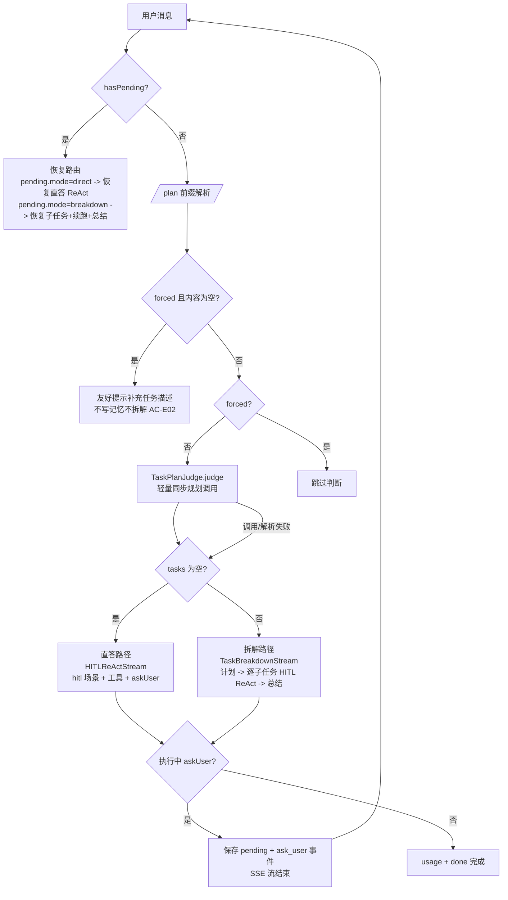
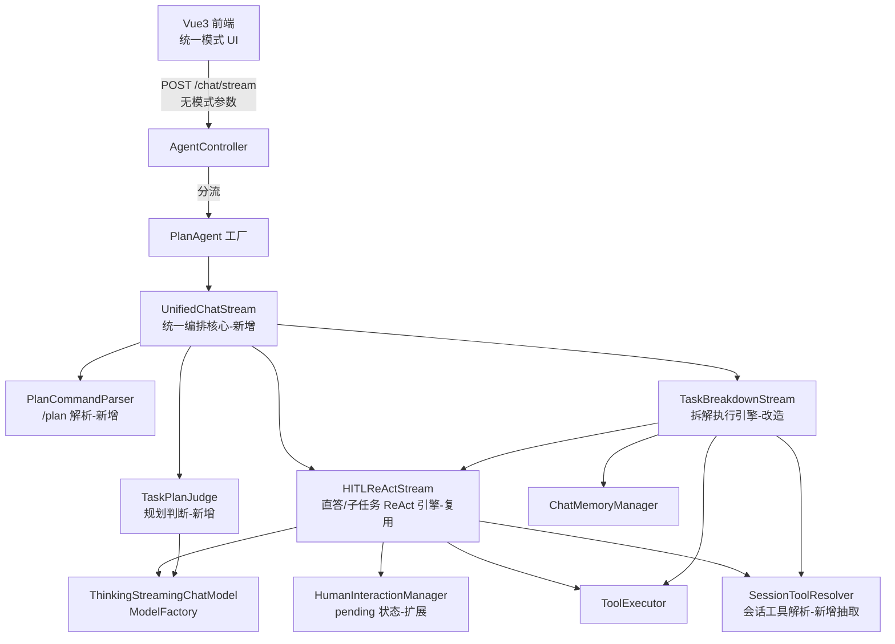
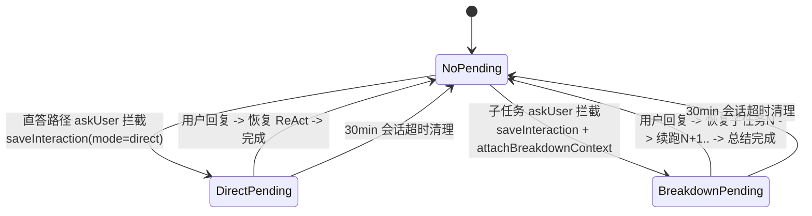
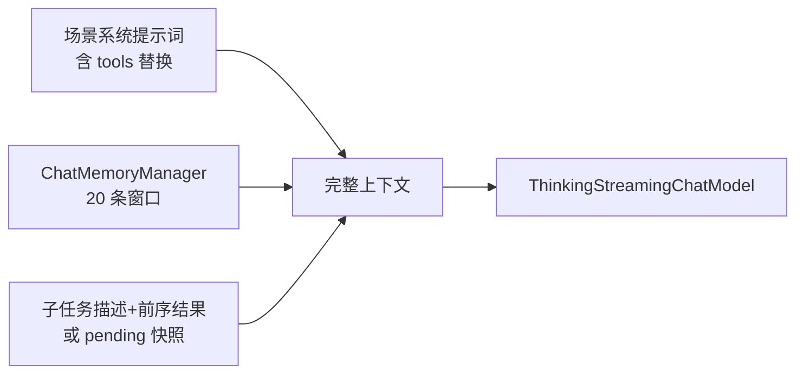
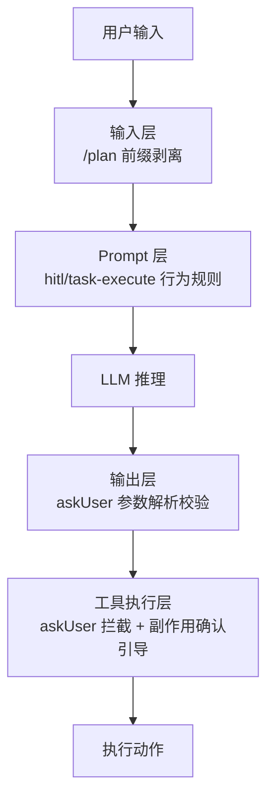
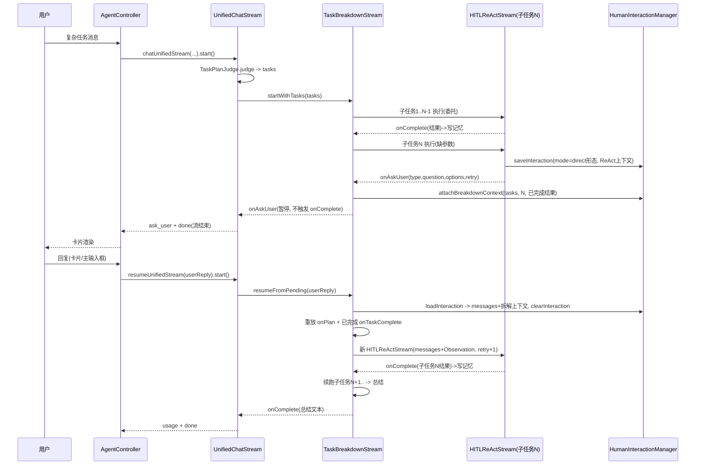

# AI Agent 技术设计文档: unified-chat-mode（统一对话模式）

| 字段 | 内容 |
|------|------|
| 版本 | v0.1 |
| 作者 | AI Agent 架构师 |
| 日期 | 2026-08-21 |
| 变更记录 | v0.1 \| 2026-08-21 \| 初始版本，基于需求说明书 v0.1 设计 \| AI Agent 架构师 |

> **需求来源**：`specs/features/20260821_unified-chat-mode/unified-chat-mode.md`（v0.1，20 条 AC）
> **已确认技术决策**：编排采用 UnifiedChatStream 编排类（agent 模块内聚）；旧模式死代码彻底删除；交互卡片回答后锁定保留并持久化。

## 0. 设计概要 (Design Summary)

*   **Agent 描述**：以深度思考 ReAct 为基础的统一对话模式--前置规划判断动态路由"拆解执行/直接回答"，全路径具备 askUser 人机交互能力（含子任务级暂停-恢复），前端移除全部模式开关。
*   **Agent 类型**：混合型（对话 + 任务拆解执行 + 澄清确认）
*   **自主性级别**：L2 - 确认后执行（与需求文档一致）
*   **影响范围**：
    *   后端：`agent-demo-agent`（核心改造）、`agent-demo-web`（路由重构 + DTO 清理）
    *   前端：`agent-demo-frontend`（MessageInput/ChatWindow/MessageItem/MessageList/chat.ts/session.ts/types + 新组件 AskUserCard）
    *   不涉及：llm/tools/memory/rag/mcp/app 模块（零改动）
*   **技术难点**：
    1.  **子任务级暂停-恢复**（最高难度）：拆解执行中子任务 ReAct 上下文 + 拆解编排上下文的双层状态保存与恢复
    2.  **事件流兼容**：SSE 协议零变更前提下融合三种事件体系（直答 ReAct 事件 / 拆解 task_* 事件 / ask_user 事件）
    3.  **规划判断的延迟成本**：每条消息新增一次同步规划调用，简单消息首 token 延迟增加 0.5~2s
    4.  **前端双通道一致性**：卡片内嵌输入与底部主输入框均为合法回复通道，需保证 askUser 状态一致收敛
*   **依赖关系**：现有 ModelFactory/ThinkingStreamingChatModel（模型）、ToolRegistry/ToolExecutor（工具）、ChatMemoryManager（记忆）、HumanInteractionManager（HITL 状态）、PromptTemplateLoader（提示词）；无新增第三方依赖。

## 1. Agent 架构概览 (Agent Architecture)

### 1.1 编排模式

*   **模式**：单 Agent + 前置路由判断（规划判断决定"拆解执行/直接回答"两条执行路径，两条路径共享同一工具空间与 HITL 机制）
*   **选择理由**：
    *   拆解与直答共用同一 LLM 会话上下文与工具集，无需多 Agent 通信
    *   与需求文档 5.1 推理模式（前置路由判断 + ReAct / Plan-Execute）一致
    *   融入现有 `HITLReActStream`（直答路径引擎）与 `TaskBreakdownStream`（拆解引擎）两个已验证组件，改造而非重写

### 1.2 推理框架

*   **主要框架**：混合模式（前置规划判断 + ReAct / Plan-Execute）
*   **框架选择策略**：

*   **最大执行步骤**：直答路径 ReAct 循环上限 `agent.thinking-max-iterations`（现有值 10）；拆解路径每子任务上限 `agent.task-execution-max-iterations`（现有配置）、子任务数量上限 `taskBreakdownMaxSubtasks`（现有配置）；askUser 暂停不消耗迭代次数（BR-HITL-007，现有机制）
*   **追问上限**：连续 askUser 计数 ≥3 次时返回错误 Observation 强制终止（HITLReActStream 现有 `MAX_RETRY_COUNT=3`，语义保持不变）

### 1.3 系统集成架构

*   **部署形态**：服务化（现有 Spring Boot 单体，不变）
*   **接入方式**：REST + SSE（`POST /api/agent/chat/stream`，协议不变）
*   **与现有系统的交互关系**：LLM 经 ModelFactory 路由（动态配置）；工具经 ToolRegistry/ToolExecutor（按需加载语义不变：默认 ∪ 指定 ∪ askUser）；记忆经 ChatMemoryManager（20 条窗口不变）

### 1.4 Agent 生命周期

*   **会话初始化**：Controller 校验消息 -> 会话管理（无效 sessionId 新建并发 `session` 事件）-> `/plan` 前缀解析 -> 用户消息写记忆（剥离 `/plan` 后的内容，保证控制指令不进入推理上下文，需求 6.6）-> 知识库注入拼接
*   **执行循环**：恢复检查（hasPending 优先，回复不再解析 /plan）-> 规划判断 -> 路径执行（异步 `CompletableFuture.runAsync`，与现状一致）
*   **暂停-恢复**（核心状态机）：

*   **会话终止**：pending 状态随会话超时清理（`@Scheduled` 每 5 分钟，现有机制）
*   **超时控制**：SseEmitter(0L) 永不超时 + emitter.onTimeout/onError 取消回调（现有机制，BR-APP-SSE-001/002）

### 1.5 模型能力要求

> 不指定具体模型版本，仅定义能力基线（沿用现有会话级模型选择，规划判断使用同一 modelId）。

| 能力维度 | 要求 | 说明 |
|---------|------|------|
| 上下文窗口 | ≥ 32K tokens | 系统提示词 + 20 条记忆窗口 + 子任务结果累积 + 工具返回 |
| 工具调用/Function Calling | 是 | askUser + 业务工具（现有 ReAct 引擎依赖原生函数调用） |
| 结构化输出 | 是（软约束） | 规划判断输出 JSON 数组（现有 extractJsonArray 容错解析，失败降级直答） |
| 多语言能力 | 是 | 中文交互 |
| 推理能力 | 高级 | 复杂度判断 + ReAct 多步推理 + 澄清时机决策 |

### 1.6 核心类设计（新增 / 改造 / 删除清单）

#### 1.6.1 新增类

| 类名 | 包 | 职责 | 关键方法/结构 |
|------|----|------|--------------|
| `UnifiedChatStream` | `agent.core` | 统一编排核心：`/plan` 判空提示、规划判断调用、直答/拆解路由、恢复路由、事件回调统一转发 | 链式回调集（见 1.6.4）；`start()`；`cancel()`；工厂入参含 forcedBreakdown 标志或 resume 模式 |
| `TaskPlanJudge` | `agent.core`（@Component） | 前置规划判断：task-plan 场景提示词 + ChatModel 同步调用 + JSON 解析 + 子任务截断；**任何异常/解析失败返回空列表（降级直答）** | `List<SubTask> judge(String sessionId, String message, String modelId)`（逻辑自 TaskBreakdownStream.planTasks/parseTaskPlan/extractJsonArray 迁移） |
| `PlanCommandParser` | `agent.core`（静态工具） | `/plan` 前缀解析：trim 后以 `/plan`（小写，后跟空白或串尾）开头则 forced=true 并剥离前缀 | `static PlanCommand parse(String message)`；`record PlanCommand(boolean forced, String content)` |
| `SessionToolResolver` | `agent.single`（@Service） | 会话级工具解析（自 SimpleAgent 抽取共享）：resolveSessionTools（含 sessionToolIds 会话缓存）、ensureAskUserTool、按方法名去重 | `List<Object> resolveSessionTools(String sessionId, List<String> toolIds)`；`List<Object> ensureAskUserTool(List<Object> tools)` |
| `AskUserCard.vue` | 前端 components | 统一交互卡片（替代 ConfirmCard）：问题区 + 交互区双形态 + "其他"兜底 + 回答锁定态 | 见 1.6.5 |

#### 1.6.2 改造类

| 类名 | 改造内容 |
|------|---------|
| `TaskBreakdownStream` | ① 构造改为外部注入：`List<SubTask> tasks`（规划上移至 TaskPlanJudge）、已解析工具列表（含 askUser）与 toolsJson、HumanInteractionManager；② 删除内部规划（planTasks/parseTaskPlan/extractJsonArray）与降级直答（streamDirectAnswer，统一模式直答由 UnifiedChatStream 承担）；③ 子任务执行改为**委托 HITLReActStream**（构造子任务消息 + 回调适配到 task_* 事件 + taskExecutionMaxIterations）；④ 新增暂停信号（内部异常 `BreakdownPausedException`）：子任务 askUser 拦截后 attachBreakdownContext 并中止编排，触发 onAskUser，不触发 onComplete；⑤ 新增恢复入口 `resumeFromPending(userReply)`：加载 pending（messages + 拆解上下文）-> 追加用户回复 Observation -> 续跑子任务 N -> 剩余子任务 -> 总结；恢复时重放 `onPlan(tasks)` + 已完成子任务的 `onTaskComplete(index)`（新助手消息重建进度视图）；⑥ enableThinking 字段删除（统一模式恒开启，task_reasoning/summary reasoning 无条件推送）；⑦ 新增 onAskUser 回调 |
| `PendingInteraction` | 新增字段：`mode`（"direct"/"breakdown"，默认 direct）、`subTasks`（List\<SubTask\>）、`currentTaskIndex`（int，暂停时正在执行的子任务 index）、`subtaskResults`（List\<String\>，已完成子任务结果按序） |
| `HumanInteractionManager` | 新增 `attachBreakdownContext(String sessionId, List<SubTask> subTasks, int currentTaskIndex, List<String> subtaskResults)`（更新已保存 pending 的拆解上下文）；`saveInteraction` 增加 mode 参数（重载，保持旧签名兼容直答路径） |
| `PlanAgent` | 新增工厂方法：`chatUnifiedStream(sessionId, message, modelId, toolIds)`（首次/强制拆解）与 `resumeUnifiedStream(sessionId, userReply)`（恢复，内部按 pending.mode 构造 UnifiedChatStream 恢复实例）；删除 `chatTaskBreakdownStream`（拆解编排内化为 UnifiedChatStream 内部委托）；新增依赖 HumanInteractionManager、SessionToolResolver |
| `SimpleAgent` | 删除 `chatThinkingStream`（2 重载）、`chatThinkingReActStream`（2 重载）、`chatHITLStream`、`resumeHITLStream`（逻辑迁移至 UnifiedChatStream）；`findAskUserToolCallId`/`buildMessagesWithScenario` 迁移至 UnifiedChatStream（public static / 私有）；工具解析委托 SessionToolResolver；保留 `chat`/`chatStream`（BaseAgent 接口合规 + 同步 /chat 端点使用）与 delegate 缓存体系 |
| `AgentController` | `chatStream` 重构为统一路由（单回调注册块）：校验 -> 会话 -> **hasPending 优先恢复**（回复不解析 /plan）-> 否则 PlanCommandParser 解析 -> forced 且空内容发友好提示（token 事件 + done，不写记忆）-> addUserMessage(剥离后内容) -> 知识库注入 -> `planAgent.chatUnifiedStream/resumeUnifiedStream` -> 统一注册回调 -> runAsync；删除 enableTaskBreakdown/enableHitl/enableThinking/普通 else 四个旧分支 |
| `ChatRequest` | 删除 `enableThinking`、`enableTaskBreakdown`、`enableHitl` 三个字段（需求 8.1 API 清理决策） |
| 前端 `MessageInput.vue` | 删除 3 个模式开关按钮及 props/emits/styles；新增 `/` 前缀命令提示条（输入以 `/` 开头且非流式时显示"/plan 强制任务拆解"说明，点击自动补全前缀） |
| 前端 `ChatWindow.vue` | 删除 enableThinking/enableTaskBreakdown/enableHitl 三个 ref 及绑定与透传；`handleConfirmSelect` 改为 `handleAskUserReply(value)`（setAskUserAnswer + sendMessage）；`sendMessage` 内增加兜底：等待态下任何消息发出前先 `setAskUserAnswer`（覆盖主输入框通道） |
| 前端 `chat.ts` | `streamChat` 签名精简为 `(sessionId, message, knowledgeBases, modelId, tools, callbacks, signal)`；请求体仅含 `{sessionId, message, knowledgeBases, model, tools}` |
| 前端 `session.ts` | `AskUserData` 新增 `answer?: string`；新增 action `setAskUserAnswer(sessionId, answer)`（写 answer + 持久化 saveSessions）；`isWaitingForUserInput` 改为 `!!askUserData && !askUserData.answer`；`setAskUserData` 改为持久化（刷新后卡片可回看） |
| 前端 `MessageItem.vue` | ask-user-block 统一渲染 `AskUserCard`（text 与 confirm 双类型均走卡片，删除 `.ask-user-text` 纯文本分支与 ConfirmCard 引用） |
| 前端 `MessageList.vue` | `select` 事件转发改为 `reply` 事件（值语义扩展为"用户回复"，选项值与输入文本统一） |
| 前端 `types/index.ts` | `AskUserData` 增加 `answer?: string`；`StreamCallbacks` 不变（SSE 事件协议零变更） |

#### 1.6.3 删除清单（已经用户确认"彻底删除"）

| 删除项 | 类型 | 原因 |
|--------|------|------|
| `ReActThinkingStream.java` | 后端类 | 统一模式直答由 HITLReActStream 承担，无调用方 |
| `ArkThinkingTokenStream.java` | 后端类 | chatThinkingStream 删除后无调用方 |
| `SimpleAgent` 中 chatThinkingStream/chatThinkingReActStream/chatHITLStream/resumeHITLStream | 后端方法 | 逻辑迁移/被统一模式吸收 |
| `AgentController` 旧四分支 | 后端代码 | 被统一路由替代 |
| `ChatRequest` 3 个模式字段 | 后端 DTO | 需求 8.1 废弃决策 |
| `prompts/scenarios/react.txt`、`prompts/scenarios/thinking.txt` | 提示词模板 | 使用方（ReActThinkingStream/chatThinkingStream/streamDirectAnswer）全部删除；`chat.txt` 保留（同步 /chat 与 delegate 使用）、`hitl.txt`/`task-plan.txt`/`task-execute.txt`/`task-summary.txt` 保留 |
| `ConfirmCard.vue` | 前端组件 | 被 AskUserCard 替代 |
| 前端 3 个模式开关及状态 | 前端代码 | 统一模式无开关 |
| `ReActThinkingStreamTest`、`SimpleAgentThinkingStreamTest` 等对应旧测试 | 测试 | 随实现删除；保留并更新 ThinkingTokenStreamTest/HITLReActStreamTest/HumanInteractionManagerTest/TaskBreakdownStream*Test |

#### 1.6.4 UnifiedChatStream 回调 API（事件契约）

> 回调签名复用 `ThinkingTokenStream`/`HitlTokenStream`/`TaskBreakdownStream` 已定义的函数式接口，SSE 事件协议**零变更**。

| 回调 | 触发路径 | Controller 映射的 SSE 事件 |
|------|---------|---------------------------|
| onPartialThinking / onPartialThought / onPartialResponse / onAction / onObservation / onFinalAnswer | 直答路径 | reasoning / thought / token / action / observation / final-answer |
| onPlan / onTaskStart / onTaskToken / onTaskReasoning / onTaskThought / onTaskAction / onTaskObservation / onTaskComplete / onTaskFailed / onTaskCancelled | 拆解路径（含恢复时重放） | task_plan / task_start / task_token / task_reasoning / task_thought / task_action / task_observation / task_complete / task_failed / task_cancelled |
| onSummaryToken / onSummaryReasoning | 拆解总结阶段 | token / reasoning |
| onAskUser(type, question, options, retryCount) | 两路径暂停时 | ask_user + done（流结束） |
| onComplete(String fullResponse) | 两路径完成（直答=最终回答；拆解=总结文本） | usage + done（Controller 写记忆） |
| onError(Throwable) | 异常 | error |

#### 1.6.5 AskUserCard 组件设计（前端）

*   **Props**：`askUserData: AskUserData`（type/question/options/retryCount/answer）、`disabled?: boolean`
*   **Emits**：`reply: [value: string]`（选项值或自由输入文本，统一回复通道）
*   **结构**（统一卡片 = 问题区 + 交互区）：
    *   问题区：类型图标（text=❓ / confirm=✅）+ 问题文本 + 追问轮次提示（retryCount > 0 时显示"第 N 次追问"）
    *   confirm 型交互区：**垂直整行选项列表**（每项独占一行全宽：左侧序号徽标 + 选项文字 + 右侧选中标记；hover 高亮上浮 + accent 边框；选中后锁定高亮、其余项禁用半透明）+ 列表末尾"其他（手动输入）"入口（点击展开内嵌输入框 + 提交按钮，Enter 提交）
    *   text 型交互区：内嵌输入框（placeholder 取问题关键信息，如"请输入订单号..."）+ 提交按钮（Enter 提交；空值禁用提交）
    *   回答锁定态（`answer` 存在）：confirm 型选中行保持高亮、若 answer 不在选项中显示"已回答：{answer}"行；text 型输入区替换为"已回答：{answer}"只读展示
*   **样式基线**：遵循 Refined Dark Tech 设计系统（`--accent` #00d4b8、`--bg-sidebar`/`--bg-input`、`--radius-md`、hover transition 0.2s），与消息气泡视觉层级协调
*   **防重复**：本地锁定状态（选中/提交后禁用全部交互），后端 pending 单会话单条约束兜底

### 1.7 API 契约变更

*   **`POST /api/agent/chat/stream` 请求体**：删除 `enableThinking`/`enableTaskBreakdown`/`enableHitl`；保留 `sessionId`/`message`/`model`/`knowledgeBases`/`tools`；强制拆解经消息 `/plan` 前缀表达（前端与 API 调用方通用）
*   **SSE 事件协议**：零变更（session/token/reasoning/thought/action/observation/final-answer/task_*/usage/ask_user/done/error），`ask_user` payload 结构不变（type/question/options/retryCount）
*   **`POST /api/agent/chat`（同步）**：维持现状（需求 3.2 能力禁区）

## 2. Prompt 工程架构 (Prompt Engineering Architecture)

> 本节定义 Prompt 的架构与注入策略；具体文本由 agent-prompt-designer Skill 在实现阶段产出。

### 2.1 System Prompt 架构（场景模板矩阵）

| 场景模板 | 使用方 | 用途 | 结构要点 |
|---------|--------|------|---------|
| `task-plan.txt` | TaskPlanJudge | 前置规划判断（每条消息） | 复杂度判断规则 + JSON 数组输出格式 + "不拆解返回 []"护栏（现有结构保留；实现阶段需强化"对简单消息输出 [] 的果断性"以降低判断延迟） |
| `hitl.txt` | UnifiedChatStream 直答路径 | 深度思考 ReAct + askUser 引导 | 角色与场景规则 + `{{tools}}` 注入点（运行时替换为含 askUser 的工具描述）+ 澄清/确认时机规则 + Few-shot |
| `task-execute.txt` | TaskBreakdownStream 子任务执行 | 子任务 ReAct + askUser 引导（**新增能力**） | 现有结构 + `{{tools}}` 注入点；实现阶段需补充 askUser 使用引导（子任务信息不足时暂停追问，副作用操作前确认） |
| `task-summary.txt` | TaskBreakdownStream 总结 | 汇总子任务结果 | 现有结构不变 |
| `chat.txt` | SimpleAgent delegate（同步 /chat） | 普通对话 | 现有结构不变 |

*   **上下文注入点**：`{{tools}}` 仅出现于 hitl.txt / task-execute.txt，由调用方经 `ToolSchemaConverter.convertToDescriptionText(tools)` 运行时替换（BR-AGT-009 不变）；角色模板（roles/*.txt）× 场景组合机制不变（BR-AGT-005）
*   **版本管理**：模板文件 git 跟踪（现状机制），修改随功能提交

### 2.2 Tool/Function 描述设计

> 工具参数契约不变；描述文本与 Schema 细节由 tool-design Skill 落地。

| 工具名称 | when-to-use | when-not-to-use | 参数约束要点 | 返回格式要点 | 对应需求文档工具 |
|---------|-------------|-----------------|------------|---------|----------------|
| askUser | 信息不足需澄清 / 副作用操作前确认 / 多方案选择 | 信息充足可自主推进；无副作用查询计算 | type ∈ {text, confirm}；question 非空；confirm 携带 2-4 选项 | 无（被拦截暂停，用户回复作为 Observation 回填） | askUser（契约不变） |
| 其余业务工具 | 现有描述 | 现有描述 | 现有约束 | 现有格式 | 不变 |

*   **工具消歧策略**：无功能重叠工具；askUser 与业务工具的边界由 hitl/task-execute 场景模板的行为规则约束（Prompt 层）
*   **工具契约移交**：askUser 描述文本微调（强调子任务中同样可用）+ task-execute 场景的 askUser 引导文本，由 tool-design/agent-prompt-designer 阶段落地

### 2.3 输出格式契约

*   **规划判断输出**：JSON 数组 `[{"title": "..."}...]`，不拆解输出 `[]`；解析策略沿用现有容错链（直接解析 -> 正则提取 `\[...\]` -> 失败返回空列表降级直答）
*   **ask_user SSE payload**：`{type, question, options, retryCount}`（结构不变）；HITLReActStream.handleAskUser 现有参数解析即输出侧校验（type 缺省 text、options 仅 confirm 有效）
*   **解析失败处理**：规划判断失败 -> 降级直答（AC-E01）；askUser 参数异常 -> 默认值兜底 + WARN 日志（现有行为）

### 2.4 Few-shot 示例策略

*   hitl.txt：保留现有 askUser 使用示例（正例：缺参数追问 / 副作用确认；边界反例：简单问题不追问）
*   task-execute.txt：实现阶段补充"子任务信息不足 -> askUser 暂停"的正例（如"查询订单详情但缺订单号 -> 调用 askUser(type=text)"）
*   task-plan.txt：保留现有"简单任务 [] / 复杂任务拆解"对照示例

## 3. 工具集成设计 (Tool Integration)

### 3.1 工具适配层

| 现有组件 | 包装关系 | 参数转换逻辑 | 返回值转换逻辑 | 副作用 |
|---------|---------|-------------|---------------|--------|
| AskUserTool（@Tool 占位） | HITLReActStream 按工具名拦截，不执行方法体（BR-HITL-009） | LLM Function Calling 参数 -> saveInteraction + ask_user 事件 | 用户回复 -> ToolExecutionResultMessage Observation 回填 | 无 |
| 业务工具（builtin/mcp/rag） | ToolExecutor 直接执行（现状不变） | ToolCall.arguments -> 工具入参 | 工具返回文本 -> Observation | 按工具自身 |

*   **工具解析管道（统一路径）**：`SessionToolResolver.resolveSessionTools(sessionId, toolIds)`（默认 ∪ 指定 + 会话级缓存，BR-AGT-011/012）-> `ensureAskUserTool`（补入 askUser + 按方法名去重）-> 生成 toolsJson（Schema）与描述文本（{{tools}} 替换）；**直答路径与拆解子任务路径共用同一份解析结果**（单次请求内一致）

### 3.2 工具执行编排

*   **串行编排**：子任务按序执行（前一子任务结果作为后继上下文，现有机制）；ReAct 内工具串行执行（现状）
*   **并行编排**：不涉及（现状无并行工具）
*   **条件分支**：askUser 拦截即暂停（优先于工具执行）；askUser 与其他工具不在同一 ReAct 步骤混用（askUser 拦截后循环立即返回）
*   **最大调用次数**：直答 `thinking-max-iterations`、子任务 `task-execution-max-iterations`、子任务数 `taskBreakdownMaxSubtasks`（均现有配置）

### 3.3 工具错误处理

| 工具/机制 | 失败场景 | 重试策略 | 降级方案 | 是否转人工 |
|------|---------|---------|---------|-----------|
| TaskPlanJudge | LLM 调用超时/异常/解析失败 | 不重试 | 返回空列表 -> 直答路径（AC-E01）+ WARN 日志 | 否 |
| askUser | 用户长时间不回复 | 不适用 | 会话超时清理（AC-E03） | 否 |
| askUser | 连续追问 3 次无效 | 不适用 | 错误 Observation -> LLM 终止任务（AC-S02） | 否 |
| 子任务业务工具 | 执行失败 | 沿用 ToolExecutor 返回错误字符串（不抛异常） | LLM 基于错误 Observation 决策；子任务异常 -> 失败即停 + 剩余取消（现有 AC-006 机制） | 否 |
| 拆解恢复 | pending 缺失/上下文损坏 | 不适用 | 降级为普通统一流程重新处理该消息 | 否 |

### 3.4 工具权限控制

*   **只读工具**：计算器/时间/知识库检索/MCP 查询类 -- Agent 自主调用
*   **读写工具（副作用）**：HTTP 外发/文件读取边界内操作等 -- Prompt 层引导必须先 askUser(type=confirm)（AC-S01，L2 级别约束）；代码层不强制拦截（与现有 HITL 设计一致，信任 Prompt 引导 + 事后可观测）
*   **高风险**：无（项目无删除类内置工具；FileReadTool 受白名单约束）

### 3.5 身份与权限架构

*   继承现状：无认证机制（学习示例），会话按 sessionId 隔离；pending 状态按 sessionId 隔离（BR-HITL-008）
*   无新增身份传播需求

## 4. 记忆与上下文架构 (Memory & Context)

### 4.1 对话上下文管理

*   **管理策略**：滑动窗口（现状不变：MessageWindowChatMemory 20 条/会话）
*   **上下文构建管道**：
    *   直答路径：hitl 场景系统提示词（含 {{tools}} 替换）+ 记忆消息 + 当前用户消息
    *   子任务路径：task-execute 场景系统提示词 + 记忆消息 + 子任务描述（含前序子任务结果）
    *   恢复路径：pending.messages（暂停时完整 ReAct 上下文快照）+ 用户回复 Observation -- 不重建，直接续用（保证上下文无损，AC-M01/M02）

### 4.2 短期记忆

*   **存储方案**：内存 MessageWindowChatMemory（现状不变）
*   **生命周期**：会话级 + 30 分钟超时清理（现状不变）
*   **写入规则**：用户消息（/plan 剥离后内容）在进入编排前写入；直答最终回答在 onComplete 写入；子任务结果按"子任务：{title}"（user）+ 结果（assistant）逐个写入（现有机制）；/plan 空内容提示不写记忆

### 4.3 长期记忆

*   不涉及（需求 5.4 明确"否"）

### 4.4 上下文注入管道

*   子任务间上下文传递双通道：会话记忆（跨请求持久）+ pending.subtaskResults（恢复时快速重建"之前子任务结果"段）；Token 预算分配沿用现状（无新增注入块）

## 5. 知识与检索设计 (Knowledge & RAG)

*   **完全复用现有 RAG 能力，零改动**：知识库工具（动态 @Tool 注册）、检索策略（Top-5 向量检索）、来源元数据（observation 解析 -> 前端引用条）均不变
*   **知识库选择注入**：Controller 层 knowledgeBases 拼接注入（现状不变），注入发生在 /plan 剥离之后的有效消息上
*   **幻觉防护**：沿用现有策略（需求 6.2 继承声明）

## 6. 护栏与安全设计 (Guardrails & Safety)

### 6.1 多层护栏架构

### 6.2 输入过滤层（Pre-processing）

*   **/plan 指令边界**（需求 6.6）：仅用户消息前缀识别，Controller/UnifiedChatStream 剥离后进入记忆与推理；工具返回/知识库内容中的 "/plan" 字样不触发强制拆解（输入层一次性处理，不进入推理上下文）
*   **空消息/超长校验**：现有机制不变（4000 字符上限）
*   **通用 Prompt Injection 防护**：本期不实现（需求 3.2 能力禁区，与现有安全级别一致）

### 6.3 Prompt 层护栏（In-context）

*   **行为约束**：hitl.txt / task-execute.txt 定义"必须做"（缺参数追问、副作用确认）与"禁止做"（不猜测参数、不未确认执行副作用、简单问题不追问）
*   **角色锁定**：roles 模板现有机制
*   **输出格式约束**：task-plan.txt JSON 数组格式约束

### 6.4 输出过滤层（Post-processing）

*   **askUser 参数校验**：HITLReActStream.handleAskUser 现有解析（type 缺省 text / options 解析容错 / 参数异常 WARN + 默认值）
*   **规划判断输出校验**：extractJsonArray 容错链 + 子任务数截断

### 6.5 工具执行层护栏（Action Gating）

*   **确认机制**：askUser 拦截暂停（BR-HITL-009 现有）；副作用工具确认由 Prompt 层引导（L2）
*   **频率限制**：追问 3 次上限（现有）；ReAct 迭代上限（现有）
*   **参数安全校验**：工具层现有机制（SSRF/白名单/截断，不变）；工具返回内容仅作 Observation 注入，不进入 System Prompt（现状）

### 6.6 降级策略

*   **模型不可用**：规划判断失败降级直答；直答/子任务 LLM 错误经 onError -> SSE error 事件（现状）
*   **工具链全面失败**：子任务失败即停 + 剩余取消（现有）；HITL 恢复缺 pending 降级普通流程
*   **护栏触发降级**：追问超限 -> 错误 Observation 终止任务（现有）

### 6.7 身份与权限架构

*   继承现状（无认证、sessionId 会话隔离、pending 按 sessionId 隔离）；无新增权限映射

## 7. 评估与可观测性设计 (Evaluation & Observability)

### 7.1 决策链路追踪

*   **日志结构**（复用现有 slf4j + MDC traceId，新增关键节点日志）：

| 日志节点 | 内容 | 级别 |
|---------|------|------|
| /plan 解析 | forced 与否、剥离后内容长度 | INFO |
| 规划判断结果 | 子任务数（0=直答）或失败原因 | INFO/WARN |
| 路径选择 | direct / breakdown / resume(mode) | INFO |
| 子任务暂停 | index、retryCount、question 摘要 | INFO |
| 恢复执行 | mode、currentTaskIndex、retryCount+1 | INFO |
| 子任务完成/失败 | index、结果长度/错误 | INFO/ERROR |

### 7.2 评估框架

*   **评估数据集**（手动场景 + 单测用例，覆盖六类 AC）：
    *   简单消息（"你好"/"现在几点"）-> 直答
    *   复杂任务（"调研X并写报告"）-> 自动拆解
    *   "/plan 空内容" / "/plan 任务" -> 提示 / 强制拆解
    *   缺参数任务（查订单无订单号）-> text 卡片
    *   副作用操作 -> confirm 卡片 + 未确认不执行
    *   子任务中缺参数 -> 暂停-恢复-续跑
*   **评估指标**：

| 指标类别 | 指标 | 目标值 | 度量方式 |
|---------|------|--------|---------|
| 正确性 | 拆解路由准确率（复杂拆/简单直） | ≥ 80% | 手动场景抽样 |
| 正确性 | 子任务恢复完整性（不重跑） | 100% | 单测断言 |
| 安全性 | 副作用未确认执行次数 | 0 | 手动 + 单测 |
| 效率 | 简单消息规划判断延迟 | ≤ 2s | 日志时间戳 |
| 效率 | Token 增量 | ≤ 1000 tok/消息 | usage 事件 |

*   **评估方式**：后端逻辑（路由/解析/状态流转）自动化单测；前端交互（卡片/提示）人工评估（与需求 8.3 一致）
*   **对抗测试**：不涉及新增攻击面（/plan 注入已隔离；其余继承现状）

### 7.3 监控与告警

*   学习示例项目，无 APM 接入；以日志 + usage 事件为观测手段（现状）
*   关注告警点：规划判断失败率（WARN 日志频次）、拆解恢复异常（ERROR 日志）

## 8. 性能与成本设计 (Performance & Cost)

### 8.1 Token 成本优化

*   **上下文裁剪**：现状机制不变（20 条窗口）；子任务上下文仅携带前序结果摘要（现有"之前子任务结果"拼接）
*   **模型分级调用**：本期不做（需求 8.2 明确留待后续；规划判断与会话同模型）
*   **缓存策略**：toolsJson 在单次请求内一次生成复用（直答/子任务共享）；模型实例缓存复用（ModelFactory 现状）

### 8.2 延迟优化

*   **流式输出**：直答与总结阶段流式（现状）；子任务执行流式（task_token 现状）
*   **规划判断延迟**：同步调用阻塞首 token，预计 +0.5~2s（轻量输出：JSON 数组或 []）；提示词层面约束输出简洁（实现阶段优化项）
*   **预计算与异步**：工具解析/提示词组装在编排启动前完成（同步开销极小）

### 8.3 并发控制

*   会话级：同一 sessionId 单条 pending 约束（BR-HITL-008）+ SseEmitter 取消回调（现状）
*   全局：`CompletableFuture.runAsync` 公共线程池（现状，学习示例不引入限流）

### 8.4 成本估算

| 场景 | 单次 Token 消耗（估算） | 增量（对比现状） |
|------|----------------------|----------------|
| 简单消息直答 | ~600（判断）+ 1500~3000（ReAct 直答） | +600（原普通/思考模式无判断调用） |
| 复杂任务拆解 | ~800（判断含子任务 JSON）+ 拆解执行（与现状 enableTaskBreakdown 路径一致） | +800（原需手动开启，无自动判断） |
| /plan 强制拆解 | 拆解执行（跳过判断） | 0 |

> 估算基于 SimpleTokenEstimator 口径；实际以 usage 事件观测为准。

## 9. 验收标准映射 (AC Mapping)

| AC ID | AC 描述 | AC 类型 | 对应技术实现 |
|-------|--------|--------|-------------|
| AC-N01 | 统一默认模式 | 正常交互 | 前端删除 3 开关（1.6.2）+ ChatRequest 字段删除 + Controller 统一路由 + 直答路径 HITLReActStream（思考折叠块沿用 reasoning 事件） |
| AC-N02 | 复杂任务自动拆解 | 正常交互 | TaskPlanJudge.judge 非空 -> TaskBreakdownStream（onPlan/task_* 事件沿用） |
| AC-N03 | 简单任务直接回答 | 正常交互 | TaskPlanJudge 空列表 -> 直答路径（无 task_* 事件） |
| AC-N04 | /plan 强制拆解 | 正常交互 | PlanCommandParser 前缀识别 + forced 跳过判断 + 剥离后内容为任务主题 |
| AC-N05 | 拆解过程可视化 | 正常交互 | task_* SSE 事件零变更 + 前端子任务 UI 复用 + 恢复时 onPlan/onTaskComplete 重放（1.6.2 TaskBreakdownStream ⑤） |
| AC-T01 | 前置规划判断 | 工具调用 | TaskPlanJudge（含失败降级空列表 -> AC-E01 同点覆盖） |
| AC-T02 | 开放式追问卡片输入框 | 工具调用 | AskUserCard text 型内嵌输入框 + reply 事件 -> handleAskUserReply -> sendMessage |
| AC-T03 | 确认型垂直选项卡片 | 工具调用 | AskUserCard confirm 型垂直整行选项（序号/hover/锁定） |
| AC-T04 | 选项自由输入兜底 | 工具调用 | AskUserCard"其他"入口展开输入框，reply 与点选等效（后端同为普通用户消息恢复） |
| AC-T05 | 子任务触发 HITL | 工具调用 | TaskBreakdownStream 子任务委托 HITLReActStream + attachBreakdownContext + resumeFromPending（1.4 状态机 + 时序见 11.1） |
| AC-S01 | 副作用强制确认 | 安全护栏 | Prompt 层（hitl/task-execute 行为规则，2.1/6.3）+ askUser 拦截机制（6.5）；/plan 不豁免（拆解子任务同样走 task-execute 规则） |
| AC-S02 | 追问上限 | 安全护栏 | HITLReActStream MAX_RETRY_COUNT=3 现有机制（子任务路径因委托同样生效） |
| AC-E01 | 规划判断失败降级 | 边界降级 | TaskPlanJudge 异常捕获 -> 空列表 -> 直答（3.3 降级表） |
| AC-E02 | /plan 空内容 | 边界降级 | UnifiedChatStream forced && content 空 -> token 事件友好提示 + done，不写记忆不拆解 |
| AC-E03 | 会话超时清理 | 边界降级 | HumanInteractionManager @Scheduled 30min 清理（现有，pending 扩展字段随对象清理） |
| AC-E04 | 等待期切换话题 | 边界降级 | hitl.txt Prompt 层引导（现有行为继承） |
| AC-M01 | 跨暂停-恢复上下文 | 记忆上下文 | pending.messages 快照续用（4.1 恢复路径）+ 记忆双通道（4.2） |
| AC-M02 | 拆解-追问-恢复链路 | 记忆上下 | pending.subtaskResults + currentTaskIndex 恢复续跑，已完成子任务不重跑（单测断言恢复只从 N 开始） |
| AC-H01 | 无法完成告知 | 人机协作 | Prompt 层（hitl/task-execute 终止话术引导）+ 追问超限错误 Observation |
| AC-H02 | 用户主动取消 | 人机协作 | confirm 卡片取消选项（LLM 提供）+ 主输入框兜底通道（"取消"文本经 sendMessage 恢复路径处理，1.6.2 ChatWindow 兜底） |

## 10. 技术决策说明 (Technical Decisions)

*   **决策 1：编排位置 -- UnifiedChatStream 编排类（agent 模块）**
    *   选项：A) Controller 编排（复用 SimpleAgent 工厂，web 层分流）；B) UnifiedChatStream 编排类（agent 模块内聚）
    *   选择：B（用户确认）
    *   理由：模式路由/恢复路由/规划判断均为 Agent 编排领域逻辑，内聚 agent 模块可单测（不依赖 web 层）；Controller 收敛为"一次统一回调注册"；代价是从 SimpleAgent 抽取 SessionToolResolver 共享组件（消重）
*   **决策 2：直答路径引擎 -- 复用 HITLReActStream**
    *   选项：A) 复用 HITLReActStream（思考 + 工具 + askUser 一体）；B) 扩展 TaskBreakdownStream.streamDirectAnswer
    *   选择：A
    *   理由：chatHITLStream 路径已验证"深度思考 ReAct + askUser"能力，直答路径语义与之完全一致；B 方案的 streamDirectAnswer 不带工具且无 HITL，需大改
*   **决策 3：子任务 HITL -- TaskBreakdownStream 委托 HITLReActStream（而非复制拦截逻辑）**
    *   选项：A) 子任务循环内复制 askUser 拦截逻辑；B) 每个子任务创建 HITLReActStream 实例并适配回调
    *   选择：B
    *   理由：拦截/解析/保存/暂停逻辑零复制（DRY）；代价是回调适配层（task_* 事件映射）与暂停信号传播（BreakdownPausedException）；子任务迭代上限语义保留（构造传 taskExecutionMaxIterations）
*   **决策 4：拆解上下文保存 -- pending 附加而非独立存储**
    *   选项：A) PendingInteraction 扩展 breakdown 字段（单对象）；B) 独立 BreakdownState 存储并联
    *   选择：A
    *   理由：单会话单 pending 约束天然覆盖（BR-HITL-008）；恢复路由仅读 mode 字段即可分流；超时清理/会话隔离复用现有机制零额外代码
*   **决策 5：恢复时事件重放（onPlan + 已完成 onTaskComplete）**
    *   理由：恢复创建的是新助手消息（新 SSE 流），前端子任务 UI 挂载在消息上；不重放则新消息无法展示进度；重放已完成状态使续跑视图完整（AC-N05 在恢复场景的延伸）
*   **决策 6：/plan 剥离时机 -- Controller 入口（写记忆前）**
    *   理由：保证记忆与推理上下文均不含控制指令（需求 6.6）；PlanCommandParser 为静态纯函数，web 层调用无依赖问题；hasPending 恢复优先于 /plan 解析（回复中的 /plan 视为普通文本，与现状恢复语义一致）
*   **决策 7：卡片回答后锁定保留 + 持久化**
    *   选项：A) 锁定保留（answer 字段 + localStorage 持久化）；B) 回答后消失（现状）
    *   选择：A（推荐方案，用户未反对）
    *   理由：符合 AC-T03"选中后锁定"；历史消息可回看问题与选择；主输入框兜底通道经 setAskUserAnswer 统一收敛等待态
*   **决策 8：SSE 协议零变更**
    *   理由：前端 chat.ts 事件解析/会话存储/子任务 UI 全部复用，前端改动收敛在输入区与卡片组件，回归风险最小化

## 11. 风险与注意事项 (Risks & Notes)

### 11.1 核心时序（子任务暂停-恢复，实现与测试的基准）

*   **技术风险**：
    1.  子任务暂停-恢复状态完整性（最高风险）-> PendingInteraction 扩展 + 专项单测（恢复仅从 currentTaskIndex 开始、前序结果不重跑、追问计数延续）
    2.  规划判断延迟（简单消息 +0.5~2s）-> 提示词约束输出简洁；日志观测；模型路由优化为后续迭代项
    3.  HITL 触发率依赖 Prompt 质量 -> hitl/task-execute 模板实现阶段含 Few-shot；手动场景评估（7.2）
    4.  双通道回复状态收敛 -> sendMessage 兜底 setAskUserAnswer（1.6.2）+ 单测覆盖主输入框回复场景
    5.  子任务事件适配的行为差异 -> 委托后工具轮 content 归类为 task_thought（原实现归 task_token），语义更准确但需在验收时知悉
*   **兼容性**：
    *   对外 API：ChatRequest 删除 3 个模式字段为**破坏性变更**（需求已确认废弃）；SSE 协议零变更
    *   localStorage：AskUserData 新增 answer 字段向后兼容（旧数据无字段视为未回答）；旧会话中的 askUserData（未持久化）刷新后行为与现状一致（消失）
    *   同步 /chat、工作流页面、知识库/工具/模型选择器：零影响
*   **性能影响**：每消息 +1 次规划判断调用（8.4）；拆解/直答执行成本与现状对应路径一致
*   **安全风险**：无新增攻击面（/plan 输入层隔离已设计，6.2）
*   **回滚方案**：
    *   代码回滚：git revert 单功能分支提交（纯内存状态，无数据迁移）
    *   功能降级：统一路由内预留逻辑分支（TaskPlanJudge 异常即直答），无独立开关需求；如需临时关闭拆解可将 judge 强制返回空列表（配置化留待后续）

## 12. 数据隐私与合规 (Data Privacy & Compliance)

*   **数据存储加密**：纯内存态（会话/记忆/pending），无静态加密需求（现状）；前端 localStorage 仅存对话文本（现状）
*   **数据传输加密**：开发环境 HTTP（现状）；生产部署建议 TLS（沿用项目部署约定）
*   **PII 识别与脱敏**：不涉及（用户回复视为可信输入，与现状一致；日志脱敏遵循 BR-SEC-005）
*   **日志保留与审计**：文件日志现有策略；决策链路日志（7.1）随现有 logback 配置
*   **用户数据权利 / 合规要求**：学习示例工程，不适用（现状）

---

### 设计自检清单

- [x] 需求文档 20 条 AC 全部映射技术实现（第 9 节，无遗漏）
- [x] 自主性级别 L2 / 推理模式 / 工具清单与需求文档一致
- [x] System Prompt 模块划分、注入点、输出契约已定义（第 2 节，无具体 Prompt 文本）
- [x] 每个需求工具（askUser）有适配层设计（第 3 节）
- [x] 上下文管理策略已定义（第 4 节，滑动窗口 + 恢复快照）
- [x] 护栏覆盖输入/Prompt/输出/工具四层（第 6 节）
- [x] 每个工具/机制有失败降级策略（3.3/6.6）
- [x] 决策链路追踪与评估框架已设计（第 7 节）
- [x] Token 成本估算与延迟分析已包含（第 8 节）
- [x] 模型能力基线已定义且未指定具体模型版本（1.5）
- [x] 无"待定"项；遗留优化点均已标注归属阶段（提示词文本 -> prompt-designer；模型路由 -> 后续迭代）
- [x] 核心类设计含新增/改造/删除三清单（1.6），可直接支撑任务规划（P3）
