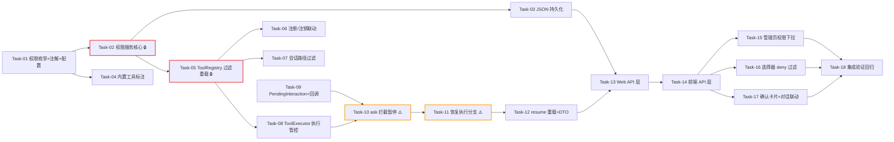

# AI Agent 开发任务计划: 工具权限控制模型

| 字段 | 内容 |
|------|------|
| 版本 | v1.0 |
| 作者 | ai-agent-task-planning |
| 日期 | 2026-08-24 |
| 变更记录 | v1.0 \| 2026-08-24 \| 初始版本：基于技术方案 v1.0 拆解 18 个任务 \| ai-agent-task-planning |

## 0. 任务概览 (Task Overview)

*   **Agent 名称**：tool-permission-control（现有单 Agent 的工具权限管控增强）
*   **总任务数**：18 个
*   **预计总工时**：780 分钟（约 13 小时）
*   **任务类型分布**：
    *   确定性组件（TDD）：13 个（Task-01 ~ Task-13，后端全部）
    *   前端适配（集成验证 + 手动验收）：4 个（Task-14 ~ Task-17）
    *   行为测试（端到端验收）：1 个（Task-18）
*   **风险任务**：Task-10（ask 拦截与多 toolCall 混合场景）、Task-11（恢复执行与 mode 路由）⚠️
*   **阻塞任务**：Task-02（ToolPermissionService 核心，被 5 个任务依赖）、Task-05（ToolRegistry 过滤重载，被 3 个任务依赖）🔒
*   **Prompt 迭代预期**：0 轮——本功能不新增 System Prompt（技术方案 §2 明确），权限约束全部为代码层硬控制，拒绝 Observation 文案为代码固定注入的确定性内容

### 依赖关系图

### 可并行任务组

| 并行组 | 可同时执行的任务 | 说明 |
| :--- | :--- | :--- |
| 并行组 1 | Task-03 + Task-04 | 持久化实现与内置工具注解标注互不依赖（均只依赖 Task-01/02） |
| 并行组 2 | Task-06 + Task-07 + Task-08 | 注册联动、会话过滤、执行器管控三个挂载点互不依赖（均依赖 Task-05）；Task-09 也可在本阶段并行（仅依赖 Task-01/02 的权限概念，实际无代码依赖） |
| 并行组 3 | Task-15 + Task-16 + Task-17 | 前端三个组件适配互不依赖（均依赖 Task-14 API 契约） |

## 1. 准备工作 (Preparation)

- [ ] **Prep-01**: 创建功能分支 `feature/tool-permission-control`
    *   说明：从 main 分支创建新分支
    *   验证：分支创建成功
- [x] **Prep-02**: 确认现有测试基线通过
    *   说明：运行全量后端测试（`mvn test`），记录现有测试通过状态作为回归基准；重点关注 HITLReActStreamTest / SessionToolResolverTest / ToolRegistry 相关现存用例
    *   验证：现有测试全绿，无历史失败用例
- [x] **Prep-03**: 确认前端开发环境就绪
    *   说明：`npm run dev` 可启动，工具管理页与对话页可正常访问
    *   验证：前端页面加载正常，`GET /api/agent/tools` 返回工具清单

> 本功能无新增外部依赖（无新框架/SDK/数据库），Prep-04/05 不适用。

## 2. 开发任务 (Development Tasks)

> **阶段自适应说明**：本功能为横切增强层，阶段按依赖顺序重新组织为：权限核心 → 加载期过滤 → 执行期管控 → ask 拦截与恢复 → Web API → 前端适配 → 集成验证。跳过模板中的 Prompt 工程阶段（无 Prompt 制品）、记忆/RAG 阶段（复用现有）、评估框架阶段（复用单测+手动验收）、优化上线阶段（性能影响已分析为无感知）。无 Mock 阶段（全部复用现有真实基础设施）。

### 阶段一：权限核心基础设施 (Permission Core)

> 搭建权限等级模型、默认分级机制与查询服务
>
> **阶段完成标准**：任意 toolId 可查询出正确的权限等级（注解默认/类别兜底/显式配置/askUser 豁免四条规则全生效）

- [x] **Task-01**: 权限等级枚举 + 默认权限注解 + 配置属性
    *   **通俗解释**: 做完这步后，系统就有了"工具身份证"的雏形——每个工具将来都能被标上"放行 / 需确认 / 禁止"三种身份等级之一。
    *   **任务类型**: 确定性组件
    *   **验证策略**: TDD（Red-Green-Refactor）
    *   **说明**: 创建 `ToolPermissionLevel` 枚举（ALLOW/ASK/DENY）；创建 `@DefaultPermission` 注解（标注在工具类上声明默认等级）；创建 `ToolPermissionProperties` 配置属性（`tools.permission.file-path` 默认 `data/tool-permissions.json`、`tools.permission.enabled` 默认 true，对应技术方案回滚开关）
    *   **涉及文件**: `agent-demo-tools/src/main/java/com/agentdemo/tools/permission/ToolPermissionLevel.java`（新增）、`agent-demo-tools/src/main/java/com/agentdemo/tools/permission/DefaultToolPermission.java`（新增）、`agent-demo-tools/src/main/java/com/agentdemo/tools/permission/ToolPermissionProperties.java`（新增）
    *   **测试文件**: `agent-demo-tools/src/test/java/com/agentdemo/tools/permission/ToolPermissionServiceTest.java`（基础用例随 Task-02 扩充）
    *   **参考**: 技术方案 §3.1、§11 回滚方案
    *   **对应AC**: AC-T03（等级模型基础）
    *   **预估工时**: 30m
    *   **依赖**: 无
    *   **验证标准**（TDD RED 阶段的测试依据）:
        - [ ] `ToolPermissionLevel` 含 ALLOW/ASK/DENY 三个枚举值，可从字符串 "allow"/"ask"/"deny" 解析（大小写不敏感）
        - [ ] `@DefaultPermission` 注解可标注在类上，value 为 ToolPermissionLevel，RUNTIME 保留策略
        - [ ] `ToolPermissionProperties` 绑定 `tools.permission.*` 前缀，filePath 默认 `data/tool-permissions.json`，enabled 默认 true

- [x] **Task-02**: ToolPermissionService 核心查询服务 🔒
    *   **通俗解释**: 做完这步后，系统就有一个"权限裁判"——任何工具来问"我能不能被用"，它都能按规则给出 allow/ask/deny 的裁决，且 askUser 工具永远免检。
    *   **任务类型**: 确定性组件
    *   **验证策略**: TDD
    *   **说明**: 实现权限查询核心：`getPermission(toolId)` 查询优先级为 显式配置 → 注册默认（注解或类别兜底）→ ASK 保守兜底；`askUser` 豁免特判（`builtin:askUser` 固定返回 ALLOW）；`registerDefault(toolId, level)` / `clear(toolIds)` 供 ToolRegistry 联动调用；内存 Map 存储（explicitPermissions / defaultPermissions 两张表）；遵循懒加载模式避免构造期 Bean 扫描（项目历史教训：循环依赖）
    *   **涉及文件**: `agent-demo-tools/src/main/java/com/agentdemo/tools/permission/ToolPermissionService.java`（新增）
    *   **测试文件**: `agent-demo-tools/src/test/java/com/agentdemo/tools/permission/ToolPermissionServiceTest.java`（新增）
    *   **参考**: 技术方案 §3.1、§3.2、§11 注意事项
    *   **对应AC**: AC-T03、AC-S03
    *   **预估工时**: 60m
    *   **依赖**: Task-01
    *   **阻塞标注**: 🔒 被 Task-03/05/08/13 依赖，权限查询的唯一门面
    *   **验证标准**（TDD RED 阶段的测试依据）:
        - [ ] 未注册未配置的未知 toolId 查询返回 ASK（保守兜底）
        - [ ] `registerDefault("builtin:calculator", ALLOW)` 后查询返回 ALLOW
        - [ ] 显式 `setExplicit("builtin:calculator", DENY)` 覆盖默认值，查询返回 DENY
        - [ ] `getPermission("builtin:askUser")` 无论何种配置/注册状态均返回 ALLOW（豁免）
        - [ ] `clear(["mcp:x"])` 后该 toolId 查询回落到兜底 ASK
        - [ ] `enabled=false` 时查询一律返回 ALLOW（功能降级开关，技术方案 §11 回滚）

- [x] **Task-03**: 权限配置 JSON 持久化
    *   **通俗解释**: 做完这步后，管理员设置的权限即使服务器重启也不会丢——权限名单被记在一个小本子（JSON 文件）上。
    *   **任务类型**: 确定性组件
    *   **验证策略**: TDD
    *   **说明**: `setExplicit` 成功后同步写入 JSON 文件（格式 `{"builtin:http": "ask"}`，仅存显式配置）；服务启动时懒加载文件到 explicitPermissions；文件不存在时静默初始化空配置；文件损坏/不可写时降级（读失败→空配置全默认，写失败→WARN 日志不阻断，内存态仍生效）
    *   **涉及文件**: `agent-demo-tools/src/main/java/com/agentdemo/tools/permission/ToolPermissionService.java`（Task-02 文件上扩展持久化逻辑，不新建文件）
    *   **测试文件**: `agent-demo-tools/src/test/java/com/agentdemo/tools/permission/ToolPermissionServiceTest.java`（扩充持久化用例，@TempDir 隔离）
    *   **参考**: 技术方案 §3.1 存储结构、§3.8 降级策略
    *   **对应AC**: AC-N01（持久化部分）
    *   **预估工时**: 45m
    *   **依赖**: Task-02
    *   **验证标准**（TDD RED 阶段的测试依据）:
        - [ ] `setExplicit` 后文件生成且内容为合法 JSON（toolId → level 字符串）
        - [ ] 重新构造服务实例（模拟重启）加载文件后，显式配置查询结果与重启前一致
        - [ ] 文件不存在时启动正常，全部按默认规则
        - [ ] 文件内容非法 JSON 时启动不抛异常，降级为空配置
        - [ ] 写文件异常（只读目录）时 setExplicit 不抛异常，内存权限仍生效，输出 WARN 日志

- [x] **Task-04**: 内置工具默认权限注解标注
    *   **通俗解释**: 做完这步后，每个内置工具出生就自带"安全等级"——计算器和时间工具直接放行，HTTP 请求和文件读取这类有风险的需要先问过用户。
    *   **任务类型**: 确定性组件
    *   **验证策略**: TDD
    *   **说明**: 四个内置工具类标注 `@DefaultPermission`：CalculatorTool/TimeTool → ALLOW（只读安全）；HttpTool/FileReadTool → ASK（有副作用/敏感访问）
    *   **涉及文件**: `agent-demo-tools/src/main/java/com/agentdemo/tools/builtin/CalculatorTool.java`（修改）、`agent-demo-tools/src/main/java/com/agentdemo/tools/builtin/TimeTool.java`（修改）、`agent-demo-tools/src/main/java/com/agentdemo/tools/builtin/HttpTool.java`（修改）、`agent-demo-tools/src/main/java/com/agentdemo/tools/builtin/FileReadTool.java`（修改）
    *   **测试文件**: `agent-demo-tools/src/test/java/com/agentdemo/tools/permission/ToolPermissionServiceTest.java`（注解默认值断言用例）
    *   **参考**: 技术方案 §3.2 默认分级规则表
    *   **对应AC**: AC-T03
    *   **预估工时**: 15m
    *   **依赖**: Task-01
    *   **验证标准**:
        - [ ] 四个工具类注解标注正确（可通过反射断言注解值）
        - [ ] ToolRegistry 扫描注册后（Task-05 联动），`getPermission("builtin:calculator")` = ALLOW、`getPermission("builtin:http")` = ASK

### 阶段二：加载期过滤 (Load-time Filtering)

> ToolRegistry 过滤重载、注册/注销联动、会话路径感知过滤
>
> **阶段完成标准**: deny 工具在任何对话路径不注入 LLM；同步路径 ask 工具不注入；动态注册/注销的权限生命周期闭环

- [x] **Task-05**: ToolRegistry 过滤重载与元数据公开 🔒
    *   **通俗解释**: 做完这步后，Agent"领工具"的窗口有了安检机制——被禁的工具根本不会出现在领用清单上，LLM 连它们的存在都不知道。
    *   **任务类型**: 确定性组件
    *   **验证策略**: TDD
    *   **说明**: 定义 `ToolPermissionFilter` 枚举（NONE/STREAMING/SYNC）；`resolveTools(List<String>)` 原签名委托新重载（NONE 模式，向后兼容）；新增 `resolveTools(List<String>, ToolPermissionFilter)`——逐 identifier 查权限，deny 静默跳过（不报错，AC-M01），SYNC 模式追加剔除 ask；`getDefaultTools(List<String>, ToolPermissionFilter)` 同理（默认工具 deny 时跳过）；扫描/注册时调用 `toolPermissionService.registerDefault` 登记默认等级（注解值或类别兜底：mcp→ASK / rag→ALLOW）；公开 `getToolMeta(String methodName)` 供 ToolExecutor 做 methodName→toolId 映射（内部复用 inferCategory + buildToolId 逻辑）
    *   **涉及文件**: `agent-demo-tools/src/main/java/com/agentdemo/tools/registry/ToolRegistry.java`（修改）
    *   **测试文件**: `agent-demo-tools/src/test/java/com/agentdemo/tools/registry/ToolRegistryPermissionTest.java`（新增）
    *   **参考**: 技术方案 §3.3、§3.4（getToolMeta）、§3.5（注册登记）
    *   **对应AC**: AC-T01、AC-M01、AC-N04（实时查询生效）、AC-T03（默认登记）
    *   **预估工时**: 60m
    *   **依赖**: Task-02
    *   **阻塞标注**: 🔒 被 Task-06/07/08 依赖，加载过滤与元数据映射的唯一底座
    *   **验证标准**（TDD RED 阶段的测试依据）:
        - [ ] deny 工具：`resolveTools(ids, STREAMING)` 与 `resolveTools(ids, SYNC)` 结果均不含该工具，且不抛异常（静默跳过）
        - [ ] ask 工具：STREAMING 模式保留，SYNC 模式剔除
        - [ ] allow 工具：两种模式均保留
        - [ ] NONE 模式（原签名）：与现状行为完全一致（全部解析，不感知权限）——向后兼容断言
        - [ ] 用户显式选择的 toolIds 含 deny 工具时静默剔除（AC-M01）
        - [ ] 扫描注册后 builtin:calculator 默认等级登记为 ALLOW（注解来源）
        - [ ] `getToolMeta("http")` 返回正确的 toolId（builtin:http）与描述
        - [ ] `getToolMeta` 对未知 methodName 返回 Optional.empty 或 null（不抛异常）

- [x] **Task-06**: 动态注册/注销权限生命周期联动
    *   **通俗解释**: 做完这步后，新建知识库或接入新 MCP 服务时，它们带的工具会自动领到"临时通行证"；删除时通行证自动收回，不留垃圾。
    *   **任务类型**: 确定性组件
    *   **验证策略**: TDD
    *   **说明**: `register(tool)` / `register(tool, serverName)` 动态注册路径按类别兜底登记默认等级（mcp 前缀→ASK / rag 前缀→ALLOW）；`unregisterTool` 注销时计算被移除工具对象全部 @Tool 方法的 toolId，调用 `toolPermissionService.clear(toolIds)` 清理显式配置（避免孤儿配置，KB 删除与 MCP 删除两条路径自动覆盖）
    *   **涉及文件**: `agent-demo-tools/src/main/java/com/agentdemo/tools/registry/ToolRegistry.java`（修改，与 Task-05 同文件不同逻辑块）
    *   **测试文件**: `agent-demo-tools/src/test/java/com/agentdemo/tools/registry/ToolRegistryPermissionTest.java`（扩充联动用例）
    *   **参考**: 技术方案 §3.5 生命周期联动表
    *   **对应AC**: AC-E01
    *   **预估工时**: 30m
    *   **依赖**: Task-05
    *   **验证标准**（TDD RED 阶段的测试依据）:
        - [ ] 动态注册 mcp 工具后，其 toolId 默认权限为 ASK
        - [ ] 动态注册 rag 工具（知识库代理）后，其 toolId 默认权限为 ALLOW
        - [ ] 对某工具 setExplicit 后再 unregisterTool，显式配置被清理，再次 register 同名工具回到默认等级
        - [ ] unregisterTool 清理覆盖工具对象全部 @Tool 方法（多方法工具场景）

- [x] **Task-07**: 会话路径感知过滤（同步/流式分流）
    *   **通俗解释**: 做完这步后，普通"一问一答"模式下需确认的工具会自动隐身（因为没法弹确认框），而流式聊天模式下它们正常出现并走确认流程。
    *   **任务类型**: 确定性组件
    *   **验证策略**: TDD
    *   **说明**: `SessionToolResolver.resolveSessionTools(sessionId, toolIds)` 原签名委托新重载并传 askSupported=true（向后兼容）；新增 `resolveSessionTools(sessionId, toolIds, boolean askSupported)`——false 时 ToolRegistry 过滤模式为 SYNC，true 时 STREAMING；`SimpleAgent.chat`（同步路径）传 false；`chatStream` 与 UnifiedChatStream 路径走默认重载（true）
    *   **涉及文件**: `agent-demo-agent/src/main/java/com/agentdemo/agent/single/SessionToolResolver.java`（修改）、`agent-demo-agent/src/main/java/com/agentdemo/agent/single/SimpleAgent.java`（修改）
    *   **测试文件**: `agent-demo-agent/src/test/java/com/agentdemo/agent/single/SessionToolResolverTest.java`（修改，扩充路径过滤用例）
    *   **参考**: 技术方案 §3.3 调用链改造点
    *   **对应AC**: AC-T02、AC-N04（下一轮生效——实时过滤叠加现有缓存机制）
    *   **预估工时**: 45m
    *   **依赖**: Task-05
    *   **验证标准**（TDD RED 阶段的测试依据）:
        - [ ] askSupported=false 时，ask 级工具从解析结果剔除
        - [ ] askSupported=true 时，ask 级工具保留
        - [ ] 原签名（无参重载）行为等同 askSupported=true（向后兼容，现有调用方零适配）
        - [ ] 会话缓存（sessionToolIds）与默认工具合并逻辑不受过滤影响，过滤发生在缓存解析之后
        - [ ] SimpleAgent.chat 调用链传 false（可通过 Mock SessionToolResolver 验证参数）

### 阶段三：执行期管控 (Execution-time Control)

> ToolExecutor 权限检查与 deny 兜底拦截
>
> **阶段完成标准**: deny 工具调用在执行器层被拒绝且方法体零触发；checkPermission 三态查询可用

- [x] **Task-08**: ToolExecutor 权限检查与 deny 兜底拦截
    *   **通俗解释**: 做完这步后，就算有"漏洞"让被禁的工具溜到了执行环节，最后一道闸门也会把它拦下来——被禁工具的代码一行都不会跑。
    *   **任务类型**: 确定性组件
    *   **验证策略**: TDD + 对抗性验证（提示注入诱导场景）
    *   **说明**: 新增 `checkPermission(String toolMethodName)` 返回 `ToolPermissionCheck(level, toolId, toolDescription)`（内部经 `toolRegistry.getToolMeta` 做 methodName→toolId 映射）；`execute(toolName, argumentsJson)` 入口追加兜底：查权限为 DENY 时直接返回权限拒绝提示文案（方法体不触发、不抛异常，回填 LLM）；enabled=false 时跳过检查（回滚开关）
    *   **涉及文件**: `agent-demo-tools/src/main/java/com/agentdemo/tools/registry/ToolExecutor.java`（修改）
    *   **测试文件**: `agent-demo-tools/src/test/java/com/agentdemo/tools/registry/ToolExecutorTest.java`（修改/新增）
    *   **参考**: 技术方案 §3.4 ToolExecutor 扩展、§6.2 第二道防线
    *   **对应AC**: AC-S01、AC-N02（allow 直接执行——现有路径零变更断言）
    *   **预估工时**: 45m
    *   **依赖**: Task-05（getToolMeta）
    *   **验证标准**（TDD RED 阶段的测试依据）:
        - [ ] deny 工具 execute：返回拒绝提示文案，工具方法体不被调用（Mock 工具验证零调用），不抛异常
        - [ ] allow 工具 execute：行为与现状完全一致（直接执行返回结果）
        - [ ] `checkPermission` 对 allow/ask/deny 三级工具分别返回正确 level 与 toolId
        - [ ] `checkPermission` 对未知工具名返回保守结果（level=ASK，不抛异常）
        - [ ] 拒绝文案不包含权限配置细节（仅说明工具被禁用，信息边界断言）
        - [ ] enabled=false 时 deny 工具 execute 正常执行（降级开关）

### 阶段四：ask 拦截与暂停恢复 (Ask Interception & Resume)

> HITL 拦截扩展、PendingInteraction 扩展、恢复执行分支
>
> **阶段完成标准**: 流式对话中 LLM 调用 ask 工具时暂停并发出确认事件；用户批准/拒绝后正确恢复并回填结果

- [x] **Task-09**: PendingInteraction 扩展与回调接口定义
    *   **通俗解释**: 做完这步后，系统的"暂停存档"功能升级了——除了记住"Agent 在问用户问题"，还能记住"Agent 在等用户批准某个工具的使用"，存档格式就绪。
    *   **任务类型**: 确定性组件
    *   **验证策略**: TDD
    *   **说明**: `PendingInteraction` 新增 `MODE_TOOL_CONFIRM` 常量与 `pendingToolCallId` / `pendingToolName` / `pendingToolArguments` 三字段（含 getter/setter 或构造支持）；`HitlTokenStream` 接口新增 `onToolConfirm(toolName, toolDescription, arguments)` 默认方法（不破坏现有实现类）
    *   **涉及文件**: `agent-demo-agent/src/main/java/com/agentdemo/agent/core/PendingInteraction.java`（修改）、`agent-demo-agent/src/main/java/com/agentdemo/agent/core/HitlTokenStream.java`（修改）
    *   **测试文件**: `agent-demo-agent/src/test/java/com/agentdemo/agent/core/PendingInteractionTest.java`（如不存在则新增，扩展字段读写用例）
    *   **参考**: 技术方案 §4.2 PendingInteraction 扩展
    *   **对应AC**: AC-N03（暂停状态载体）
    *   **预估工时**: 30m
    *   **依赖**: Task-01（枚举概念，实际代码无强依赖，可与阶段二并行）
    *   **验证标准**:
        - [ ] MODE_TOOL_CONFIRM 常量值 "tool_confirm" 与现有 mode 值（direct/breakdown）不冲突
        - [ ] 三字段可保存与读取，原样保存参数 JSON 字符串（批准后可直接执行）
        - [ ] HitlTokenStream 新增默认方法后，现有实现类（HITLReActStream 等）编译零修改通过

- [x] **Task-10**: HITLReActStream ask 级拦截与暂停 ⚠️
    *   **通俗解释**: 做完这步后，Agent 遇到"需确认"的工具时会主动踩刹车——暂停干活、记住现场、弹卡片请示，绝不先斩后奏。
    *   **任务类型**: 确定性组件
    *   **验证策略**: TDD（Mock 模型流式响应触发 tool_calls）
    *   **说明**: `executeToolCalls` 扩展：对每个 toolCall 先 `toolExecutor.checkPermission(functionName)`；ASK 级命中时调用新增 `handleToolConfirm`——保存 PendingInteraction（mode=tool_confirm + 三字段，仿 handleAskUser 模式）→ 触发 `onToolConfirm` 回调 → return true 暂停循环（不添加 ToolExecutionResultMessage）；DENY 级防御兜底（加载期已过滤，双保险）回填拒绝 Observation 继续下一 toolCall；ALLOW 级走现有执行逻辑零变更。**多 toolCall 混合场景**：首个 ask 级 toolCall 即暂停，此前已执行的 allow 工具结果已在 messages 中，恢复后继续处理剩余 toolCalls（游标完整性）
    *   **涉及文件**: `agent-demo-agent/src/main/java/com/agentdemo/agent/single/HITLReActStream.java`（修改）
    *   **测试文件**: `agent-demo-agent/src/test/java/com/agentdemo/agent/single/HITLReActStreamTest.java`（修改，新增 ask 拦截用例，保留全部现存 askUser 用例）
    *   **参考**: 技术方案 §3.4 拦截逻辑伪代码、§11 风险（多 toolCall 混合）
    *   **对应AC**: AC-N03、AC-S01（deny 双保险分支）
    *   **预估工时**: 60m
    *   **依赖**: Task-08（checkPermission）、Task-09（pending 载体与回调）
    *   **风险标注**: ⚠️ 多 toolCall 混合场景的游标与 pending 保存完整性；不得影响现有 askUser 拦截逻辑（回归风险）
    *   **验证标准**（TDD RED 阶段的测试依据）:
        - [ ] ask 级 toolCall：循环暂停（不执行该工具），PendingInteraction 保存 mode=tool_confirm 且三字段正确
        - [ ] onToolConfirm 回调被触发且参数含工具名/描述/参数 JSON
        - [ ] 暂停时 messages 不含该工具的 ToolExecutionResultMessage（待恢复时回填）
        - [ ] allow 工具在 ask 工具之前的混合 toolCall 场景：allow 已执行且回填，ask 拦截暂停
        - [ ] deny 级 toolCall（防御分支）：回填拒绝 Observation，不暂停，继续处理后续 toolCall
        - [ ] 现有 askUser 拦截用例全部保持通过（零回归断言）

- [x] **Task-11**: UnifiedChatStream 恢复执行分支 ⚠️
    *   **通俗解释**: 做完这步后，用户点"批准"Agent 就继续干活并带上工具结果，点"拒绝"Agent 就换方案——暂停存档能完美续播了。
    *   **任务类型**: 确定性组件
    *   **验证策略**: TDD
    *   **说明**: `handleResume` 增加 mode 路由：tool_confirm → 新增 `resumeToolConfirm(pending, approved)`；批准分支：`toolExecutor.execute(pendingToolName, pendingToolArguments)` 执行 → 结果作为 ToolExecutionResultMessage 追加；拒绝分支：固定拒绝文案追加（AC-S02）；两分支均：clearInteraction(sessionId) → 续跑 HITLReActStream（复用 resumeDirectAnswer 的模型加载与循环重启逻辑）；AskUser 的 resume 路径零变更
    *   **涉及文件**: `agent-demo-agent/src/main/java/com/agentdemo/agent/core/UnifiedChatStream.java`（修改）
    *   **测试文件**: `agent-demo-agent/src/test/java/com/agentdemo/agent/core/UnifiedChatStreamTest.java`（修改/新增 tool_confirm 恢复用例）
    *   **参考**: 技术方案 §3.4 恢复执行伪代码、§2.2 文案策略
    *   **对应AC**: AC-S02、AC-N03（批准分支）、AC-E02（复用 pending 恢复机制）
    *   **预估工时**: 60m
    *   **依赖**: Task-10
    *   **风险标注**: ⚠️ mode 三态路由不能影响现有 direct/breakdown 恢复路径；批准执行需正确还原 toolCallId（LLM 要求 ToolExecutionResultMessage 与 toolCall 的 id 匹配）
    *   **验证标准**（TDD RED 阶段的测试依据）:
        - [ ] mode=tool_confirm 且 approved=true：工具被执行一次，结果（ToolExecutionResultMessage，id 匹配 pendingToolCallId）追加到 messages，pending 清除，循环续跑
        - [ ] mode=tool_confirm 且 approved=false：工具零执行，拒绝文案回填 messages，pending 清除，循环续跑
        - [ ] 拒绝文案包含"用户拒绝"语义且不含权限配置细节
        - [ ] mode=direct/breakdown 的现有恢复路径行为零变更（回归断言）
        - [ ] pending 不存在时按现有逻辑处理（不因新分支引入 NPE）

- [x] **Task-12**: PlanAgent 恢复重载与 ChatRequest 扩展
    *   **通俗解释**: 做完这步后，"批准/拒绝"这个动作能从界面一路传到 Agent 的续播引擎——消息格式里多了个"工具是否被批准"的官方通道。
    *   **任务类型**: 确定性组件
    *   **验证策略**: TDD
    *   **说明**: `PlanAgent.resumeUnifiedStream(sessionId, message)` 原签名委托新重载；新增 `resumeUnifiedStream(sessionId, message, Boolean approved)` 重载透传给 UnifiedChatStream；`ChatRequest` 新增 `Boolean toolApproved` 可选字段（null=普通消息，现有 HITL askUser 恢复链路零变更）
    *   **涉及文件**: `agent-demo-agent/src/main/java/com/agentdemo/agent/single/PlanAgent.java`（修改）、`agent-demo-web/src/main/java/com/agentdemo/web/dto/ChatRequest.java`（修改）
    *   **测试文件**: `agent-demo-agent/src/test/java/com/agentdemo/agent/single/PlanAgentTest.java`（修改，重载透传断言）
    *   **参考**: 技术方案 §3.4 批准/拒绝传递
    *   **对应AC**: AC-S02（approved 传递通道）
    *   **预估工时**: 30m
    *   **依赖**: Task-11
    *   **验证标准**:
        - [ ] 新重载将 approved 透传至 UnifiedChatStream（Mock 验证）
        - [ ] 原签名委托新重载且 approved=null（向后兼容）
        - [ ] ChatRequest.toolApproved 为 null 时现有 chatStream 流程完全不受影响（反序列化兼容断言：无该字段的旧请求体可正常解析）

### 阶段五：Web API 层 (Web API Layer)

> 权限配置 API、tool_confirm SSE 事件、toolApproved 路由
>
> **阶段完成标准**: 管理页可经 API 读写权限；前端可收到 tool_confirm 事件并回传批准结果

- [x] **Task-13**: AgentController 权限 API 与 SSE 事件集成
    *   **通俗解释**: 做完这步后，设置页能改工具权限存档生效，聊天页能收到"请批准工具使用"的系统通知并把用户的决定传回去——前后端通道全部打通。
    *   **任务类型**: 确定性组件
    *   **验证策略**: TDD（MockMvc）+ 集成验证
    *   **说明**: ① 新增 `PUT /api/agent/tools/{toolId}/permission`（body: UpdateToolPermissionRequest{permission}；askUser 工具返回 400 + 明确错误信息；成功后持久化生效）；② `GET /api/agent/tools` 响应的 ToolInfo 增加 permission 字段；③ `registerUnifiedCallbacks` 增加 onToolConfirm → SSE `tool_confirm` 事件（payload: toolName/toolDescription/arguments），事件后 emitter 保持打开（与 ask_user 一致，等待用户操作）；④ chatStream 路由：`hasPending && request.getToolApproved() != null` → 调用 resumeUnifiedStream 三参重载
    *   **涉及文件**: `agent-demo-web/src/main/java/com/agentdemo/web/controller/AgentController.java`（修改）、`agent-demo-web/src/main/java/com/agentdemo/web/dto/UpdateToolPermissionRequest.java`（新增）、`agent-demo-common/src/main/java/com/agentdemo/common/dto/ToolInfo.java`（修改）
    *   **测试文件**: `agent-demo-web/src/test/java/com/agentdemo/web/controller/AgentControllerTest.java`（修改，新增权限接口与路由用例）
    *   **参考**: 技术方案 §3.6 API 设计、§3.7 SSE 事件设计
    *   **对应AC**: AC-N01（配置 API）、AC-S03（askUser 400）、AC-H01（事件 payload）、AC-H02（permission 字段）
    *   **预估工时**: 45m
    *   **依赖**: Task-03（持久化）、Task-12（三参重载）
    *   **验证标准**（TDD RED 阶段的测试依据）:
        - [ ] PUT 合法 toolId + 合法等级：返回成功，再次 GET 该工具 permission 已更新
        - [ ] PUT askUser 工具：返回 400，配置不变
        - [ ] PUT 非法等级值：返回参数校验错误
        - [ ] GET /api/agent/tools：每个 ToolInfo 含 permission 字段且与权限服务一致
        - [ ] onToolConfirm 触发时 SSE 流发出 tool_confirm 事件，payload 三字段完整，事件后连接不关闭
        - [ ] chatStream 收到 toolApproved != null 且存在 pending：走三参 resume；toolApproved=null：走现有逻辑（回归断言）

### 阶段六：前端适配 (Frontend Adaptation)

> 管理页权限下拉、选择器过滤、权限确认卡片、对话联动
>
> **阶段完成标准**: 管理页可调整权限；对话页 deny 工具不可见；ask 工具触发确认卡片且批准/拒绝可回传

- [x] **Task-14**: 前端 API 层扩展
    *   **通俗解释**: 做完这步后，前端就学会了两个新"词汇"——怎么告诉后端"我要改某工具的权限"、怎么听懂"请批准工具使用"的通知。
    *   **任务类型**: 前端适配
    *   **验证策略**: 集成验证（TS 类型 + 手动联调）
    *   **说明**: `api/tools.ts`：ToolInfo 类型加 permission 字段；新增 `updateToolPermission(toolId, permission)`（PUT 封装）。`api/chat.ts`：streamChat 请求体加可选 toolApproved 字段；SSE 事件分发新增 tool_confirm case → 触发 callbacks.onToolConfirm
    *   **涉及文件**: `agent-demo-frontend/src/api/tools.ts`（修改）、`agent-demo-frontend/src/api/chat.ts`（修改）
    *   **测试文件**: 无独立测试（随 Task-18 手动联调验证）
    *   **参考**: 技术方案 §3.6、§3.7
    *   **对应AC**: AC-N01、AC-H01（前端通道）
    *   **预估工时**: 30m
    *   **依赖**: Task-13（API 契约）
    *   **验证标准**:
        - [ ] TS 编译通过，ToolInfo 类型与后端响应结构一致
        - [ ] tool_confirm SSE 事件可被正确解析并触发 onToolConfirm 回调
        - [ ] streamChat 携带 toolApproved 时请求体序列化正确；不携带时字段不出现（undefined 不序列化）

- [x] **Task-15**: 工具管理页权限配置
    *   **通俗解释**: 做完这步后，管理员在设置页看到每个工具旁多了个三档开关（放行/需确认/禁止），拨一下立即生效并永久记住。
    *   **任务类型**: 前端适配
    *   **验证策略**: 集成验证 + 手动验收
    *   **说明**: `ToolManagementPage.vue` 每个工具行增加权限下拉（allow/ask/deny 三选项，中文标签：放行/需确认/禁止）；变更即调 updateToolPermission API 并刷新本地状态；askUser 工具展示固定"放行"且禁用编辑（豁免可视化）；变更失败回滚显示并提示错误
    *   **涉及文件**: `agent-demo-frontend/src/components/ToolManagementPage.vue`（修改）
    *   **测试文件**: 无独立测试（Task-18 手动验收）
    *   **参考**: 技术方案 §1.6 文件清单 24、AC-N01 交互
    *   **对应AC**: AC-N01、AC-H02（管理页权限可见可改）
    *   **预估工时**: 45m
    *   **依赖**: Task-14
    *   **验证标准**:
        - [ ] 全部工具（内置/MCP/知识库分组）行内展示当前权限等级
        - [ ] 下拉切换后 API 调用成功，页面状态即时更新
        - [ ] askUser 工具下拉禁用（豁免不可改的 UI 表达）
        - [ ] 手动验收：切换后重启服务，管理页回显切换后的值（AC-N01 持久化闭环）

- [x] **Task-16**: 对话页工具选择器 deny 过滤
    *   **通俗解释**: 做完这步后，被禁的工具从聊天页的"可选工具"清单里彻底消失，普通用户根本感知不到它的存在。
    *   **任务类型**: 前端适配
    *   **验证策略**: 集成验证 + 手动验收
    *   **说明**: `ToolSelector.vue` 按 ToolInfo.permission 过滤：deny 工具不展示在下拉面板与已选标签中（用户视角隐藏）；ask 工具正常展示可选（选择后流式路径走确认）
    *   **涉及文件**: `agent-demo-frontend/src/components/ToolSelector.vue`（修改）
    *   **测试文件**: 无独立测试（Task-18 手动验收）
    *   **参考**: 技术方案 §1.6 文件清单 25、需求 AC-H02
    *   **对应AC**: AC-H02（对话页隐藏 deny）
    *   **预估工时**: 20m
    *   **依赖**: Task-14
    *   **验证标准**:
        - [ ] deny 工具不出现在下拉面板任何分组中
        - [ ] allow/ask 工具正常展示与选择，现有选择交互零回归
        - [ ] 已选中的工具被后台调整为 deny 后，重新拉取列表时从已选标签中消失（叠加后端静默剔除双保险）

- [x] **Task-17**: 权限确认卡片与对话联动
    *   **通俗解释**: 做完这步后，Agent 想用"需确认"的工具时，聊天窗口会弹出一张卡片说明它想干什么，用户点"批准"它就继续，点"拒绝"它就换招。
    *   **任务类型**: 前端适配
    *   **验证策略**: 集成验证 + 手动验收
    *   **说明**: `ConfirmCard.vue` 新增权限确认形态（复用现有 HITL 卡片范式）：展示工具名称、用途描述、参数摘要（JSON 格式化）、批准/拒绝两按钮；`ChatWindow.vue` 处理 onToolConfirm → 渲染权限卡片 → 批准/拒绝时 streamChat 携带 toolApproved: true/false（UI 展示用 message 文本一并发送）；`stores/session.ts` askUserData 结构扩展 kind=permission 场景（兼容存量数据：无 kind 字段默认按 askUser 形态渲染）
    *   **涉及文件**: `agent-demo-frontend/src/components/ConfirmCard.vue`（修改）、`agent-demo-frontend/src/components/ChatWindow.vue`（修改）、`agent-demo-frontend/src/stores/session.ts`（修改）
    *   **测试文件**: 无独立测试（Task-18 手动验收）
    *   **参考**: 技术方案 §3.7、§11 兼容性注意事项
    *   **对应AC**: AC-H01（卡片信息完整）、AC-N03/AC-S02（批准/拒绝全流程前端侧）
    *   **预估工时**: 60m
    *   **依赖**: Task-14
    *   **验证标准**:
        - [ ] ask 工具被调用时卡片展示四要素：工具名、描述、参数摘要、批准/拒绝按钮
        - [ ] 点批准：请求体含 toolApproved=true，卡片变为已批准状态，Agent 继续执行并输出结果
        - [ ] 点拒绝：请求体含 toolApproved=false，Agent 换方案回复（不执行原工具）
        - [ ] 卡片样式与现有 askUser 确认卡片视觉一致
        - [ ] 存量会话（旧 askUserData 无 kind 字段）渲染不报错，按 askUser 形态正常显示

### 阶段七：集成验证与回归 (Integration Verification)

> 全量回归 + 15 条 AC 端到端手动验收
>
> **阶段完成标准**: 全量测试通过；15 条 AC 逐项验收通过；现有功能零回归

- [x] **Task-18**: 全量回归与 AC 端到端验收
    *   **通俗解释**: 做完这步后，整个权限功能从头到尾被"体检"一遍——每条验收标准逐项过检，老功能确认没被改坏，可以放心交付。
    *   **任务类型**: 行为测试
    *   **验证策略**: 全量测试 + AC 逐项手动验收（含对抗性场景）
    *   **说明**: ① 运行后端全量测试（`mvn test`）确认零回归；② 按需求文档 15 条 AC 逐项手动验收（验收步骤见需求文档 §8.3 评估方式表）；③ 对抗性场景：提示注入诱导调用 deny 工具（期望 LLM 返回工具不存在或执行期拒绝）、ask 拒绝后诱导同参数重试（期望 LLM 换方案）；④ 现有功能回归：普通对话 / askUser HITL 流程 / 知识库检索 / MCP 工具调用
    *   **涉及文件**: 无新增（验证任务）
    *   **测试文件**: 全量测试套件
    *   **参考**: 技术方案 §7.2 评估框架、§7.3 对抗测试；需求文档 §7 全部 AC
    *   **对应AC**: 全部 15 条（AC-N01~N04 / AC-T01~T03 / AC-S01~S03 / AC-E01~E02 / AC-M01 / AC-H01~H02）
    *   **预估工时**: 60m
    *   **依赖**: Task-15、Task-16、Task-17（全部前序任务）
    *   **验证标准**:
        - [x] `mvn test` 全量通过，无新增失败用例
        - [x] AC-N01：管理页调整权限 → 重启 → 配置保留且页面回显正确
        - [x] AC-N02：allow 工具（calculator）流式对话直接执行，无确认卡片
        - [x] AC-N03：ask 工具（http）流式对话触发卡片，批准后执行且回填结果
        - [x] AC-N04：会话中途调整权限，本轮不变下一轮生效
        - [x] AC-T01：deny 工具（fileRead）所有路径不可见不可调
        - [x] AC-T02：同步 chat 路径 ask 工具不可见；流式路径可见
        - [x] AC-T03：新建知识库工具默认 allow；MCP 工具默认 ask
        - [x] AC-S01：提示注入诱导调用 deny 工具，方法体零触发，返回拒绝
        - [x] AC-S02：拒绝后 LLM 换方案回复，不同参数重试
        - [x] AC-S03：askUser 始终可用，HITL 确认流程无死锁
        - [x] AC-E01：删除知识库后权限配置无残留
        - [x] AC-E02：ask 暂停期间断开重连，确认卡片可恢复操作
        - [x] AC-M01：显式选择 deny 工具发送请求，该工具被静默剔除
        - [x] AC-H01：确认卡片四要素完整（工具名/描述/参数摘要/操作按钮）
        - [x] AC-H02：管理页权限可见可改；对话页 deny 工具隐藏
        - [x] 回归：普通对话 / askUser HITL / 知识库 / MCP 现有流程全部正常

## 3. 验收标准检查清单 (AC Checklist)

| AC ID | AC 描述 | AC 类型 | 对应任务 | 状态 |
| :--- | :--- | :--- | :--- | :--- |
| AC-N01 | 管理页权限配置与持久化 | 正常交互 | Task-03, Task-13, Task-15, Task-18 | ✅ 已完成 |
| AC-N02 | allow 工具直接执行 | 正常交互 | Task-08, Task-18 | ✅ 已完成 |
| AC-N03 | ask 工具批准后执行 | 正常交互 | Task-09, Task-10, Task-11, Task-13, Task-17, Task-18 | ✅ 已完成 |
| AC-N04 | 权限修改下一轮生效 | 正常交互 | Task-05, Task-07, Task-18 | ✅ 已完成 |
| AC-T01 | deny 工具加载期过滤 | 工具调用 | Task-05, Task-18 | ✅ 已完成 |
| AC-T02 | 同步路径 ask 工具不加载 | 工具调用 | Task-07, Task-18 | ✅ 已完成 |
| AC-T03 | 新工具默认权限分级 | 工具调用 | Task-01, Task-02, Task-04, Task-05, Task-18 | ✅ 已完成 |
| AC-S01 | 执行期 deny 兜底拦截 | 安全护栏 | Task-08, Task-10, Task-18 | ✅ 已完成 |
| AC-S02 | ask 拒绝结果回填 | 安全护栏 | Task-11, Task-12, Task-17, Task-18 | ✅ 已完成 |
| AC-S03 | askUser 工具权限豁免 | 安全护栏 | Task-02, Task-13, Task-15, Task-18 | ✅ 已完成 |
| AC-E01 | 动态注册工具权限继承 | 边界降级 | Task-06, Task-18 | ✅ 已完成 |
| AC-E02 | ask 暂停电断恢复 | 边界降级 | Task-11, Task-18 | ✅ 已完成 |
| AC-M01 | 会话选择与权限过滤叠加 | 记忆上下文 | Task-05, Task-18 | ✅ 已完成 |
| AC-H01 | ask 确认卡片信息完整 | 人机协作 | Task-13, Task-17, Task-18 | ✅ 已完成 |
| AC-H02 | 权限等级前端可视化 | 人机协作 | Task-13, Task-15, Task-16, Task-18 | ✅ 已完成 |

## 4. 验证计划 (Verification Plan)

### 4.1 确定性组件验证（TDD）

- [x] RED：测试编写完成后运行，确认全部失败（Task-01 ~ Task-13 后端任务）
- [x] GREEN：实现代码后运行，确认全部通过
- [x] REFACTOR：重构后运行，确认仍全部通过

### 4.2 概率性组件验证（EDD）

> 不适用：本功能无概率性组件（无 System Prompt/Tool 描述变更，拒绝文案为代码固定注入的确定性内容）

### 4.3 阶段验证检查点

| 阶段 | 验证动作 | 关联任务 | 通过标准 |
| :--- | :--- | :--- | :--- |
| 阶段一完成后 | 权限服务单测（四条查询规则 + 持久化） | Task-01 ~ Task-04 | 全部通过；任意 toolId 查询裁决正确 |
| 阶段二完成后 | 过滤重载与联动单测 | Task-05 ~ Task-07 | 三模式过滤正确；原签名零回归 |
| 阶段三完成后 | 执行器拦截单测（含 deny 零调用断言） | Task-08 | deny 方法体零触发；allow 零变更 |
| 阶段四完成后 | 拦截/恢复单测（含 askUser 回归） | Task-09 ~ Task-12 | ask 暂停-恢复全链路；现有 HITL 用例全绿 |
| 阶段五完成后 | MockMvc 接口测试 + SSE 事件联调 | Task-13 | PUT/GET/tool_confirm 事件/toolApproved 路由全部可用 |
| 阶段六完成后 | 前端手动走查（管理页/选择器/卡片） | Task-14 ~ Task-17 | 三组件功能可用且视觉一致 |
| 阶段七完成后 | 全量测试 + 15 条 AC 逐项验收 | Task-18 | 零回归 + AC 全通过 |

### 4.4 验收标准逐项验证

> 见 §3 AC Checklist——每条 AC 均由"实现任务（TDD/集成验证）+ Task-18 端到端验收"双层覆盖。

### 4.5 上线前检查

- [x] 全量测试通过（`mvn test` 零回归）
- [x] 15 条 AC 逐项验收通过（§3 清单全部勾选）
- [x] 对抗性测试通过（提示注入诱导 deny 工具 100% 被拦截）
- [x] 现有功能回归通过（普通对话/askUser HITL/知识库/MCP）
- [x] 权限持久化验证通过（重启不丢失）
- [x] 回滚方案验证（`tools.permission.enabled=false` 退回现状行为）

## 5. 风险与注意事项 (Risks & Notes)

*   **多 toolCall 混合风险**（Task-10 ⚠️）：一轮同时调用 allow+ask 工具时，首个 ask 暂停的游标完整性是难点；测试必须覆盖混合场景，恢复后剩余 toolCalls 正确续跑
*   **HITL 回归风险**（Task-10/11 ⚠️）：拦截逻辑扩展不得影响现有 askUser 流程；HITLReActStreamTest 现存用例全部保留作为回归防线，任何失败立即定位
*   **ToolExecutionResultMessage id 匹配风险**（Task-11）：恢复执行时回填消息的 id 必须与暂停时的 toolCall id 匹配，否则 LLM 会话错乱；从 pendingToolCallId 还原而非重新生成
*   **懒加载依赖风险**（Task-02）：ToolPermissionService 若在构造期触发 ToolRegistry 扫描会引发循环依赖（项目历史教训）；遵循懒加载模式，单测覆盖懒初始化路径
*   **前端存量数据兼容风险**（Task-17）：旧会话 askUserData 无 kind 字段时必须默认按 askUser 形态渲染，不得因新字段缺失报错
*   **文件写竞争风险**（Task-03）：权限文件并发写概率极低（管理操作），同步写 + 对象锁保护足够，不过度设计
*   **时间风险**：若工时超预期，Task-16（选择器过滤，20m）与 Task-09（载体扩展，30m）为最小任务可快速收尾；Task-10/11 为核心链路不可延后
