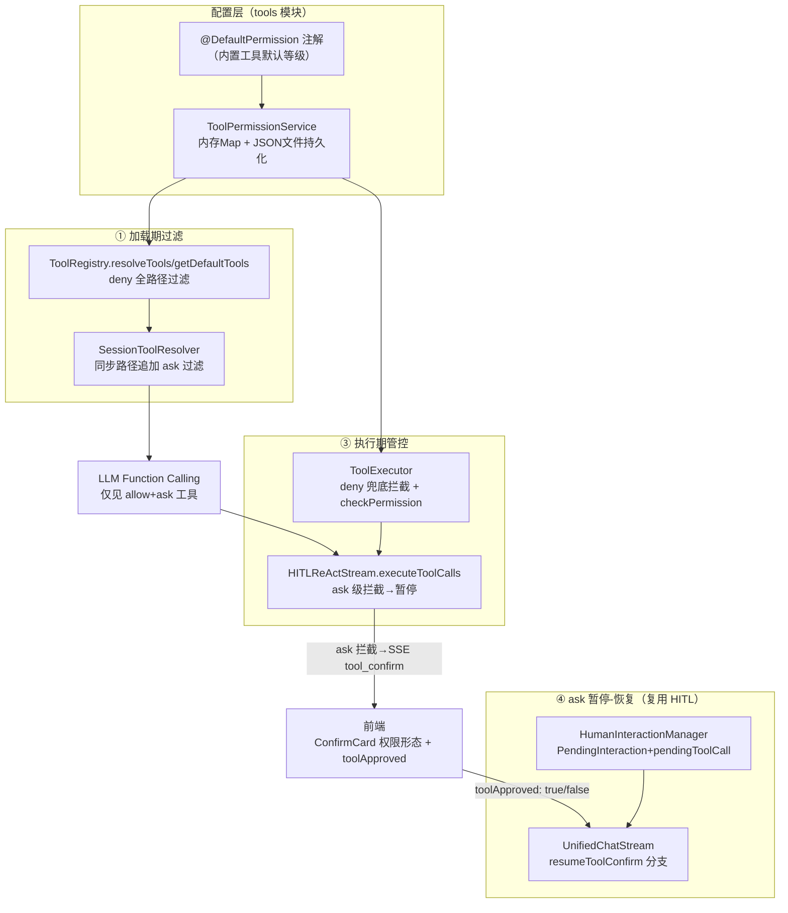
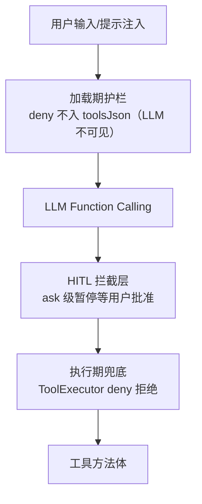

# AI Agent 技术设计文档: 工具权限控制模型

| 字段 | 内容 |
|------|------|
| 版本 | v1.0 |
| 作者 | ai-agent-tech-design |
| 日期 | 2026-08-24 |
| 变更记录 | v1.0 \| 2026-08-24 \| 初始版本：基于需求说明书 v1.0 完成四层拦截链路设计 \| ai-agent-tech-design |

> **关联需求**：[tool-permission-control.md](./tool-permission-control.md)（15 条 AC）
> **代码调研基准**：ToolRegistry / ToolExecutor / SessionToolResolver / HITLReActStream / UnifiedChatStream / PlanAgent / PendingInteraction / AgentController / 前端工具组件，均已实地确认

## 0. 设计概要 (Design Summary)

*   **功能描述**：为现有单 Agent 工具调用链路引入 allow / ask / deny 三级权限模型，实现"加载期过滤 + 执行期管控"双重控制
*   **Agent 类型**：混合型（本功能不新增 Agent，为现有单 Agent 增强权限层）
*   **自主性级别**：按工具粒度混合（allow=L3 自主执行 / ask=L2 确认后执行 / deny=禁区），与需求文档 3.3 节一致
*   **影响范围**：agent-demo-tools（权限核心）、agent-demo-agent（拦截与恢复）、agent-demo-web（API 与 SSE 事件）、agent-demo-common（DTO）、agent-demo-frontend（管理页/选择器/确认卡片）、内置工具类（注解标注）
*   **技术难点**：
    1. ask 级暂停-恢复与现有 HITL askUser 机制的融合（同一 PendingInteraction 载体，两种恢复语义）
    2. 无数据库环境下的权限持久化（项目现状：知识库/MCP 均内存存储）
    3. 默认权限分级的声明机制（内置工具按风险 / 动态工具按类别）
    4. 工具对象与方法名两种标识体系（toolId `category:name` vs methodName）间的权限查询映射
*   **依赖关系**：复用 HITL 暂停-恢复基础设施（HumanInteractionManager / PendingInteraction / SSE ask_user 链路）、工具按需加载机制（resolveTools / sessionToolIds 缓存 / toolsFingerprint）

## 1. 架构概览 (Architecture)

### 1.1 编排模式

*   **模式**：单 Agent（不变），权限模型作为横切层嵌入现有 ReAct 循环
*   **选择理由**：本功能是行为管控增强而非编排能力扩展，不改变现有"统一模式路由（直答/拆解）+ HITLReActStream"结构

### 1.2 推理框架

*   **主要框架**：ReAct（不变）；工具执行环节插入权限判定：`LLM tool_calls → checkPermission → allow 直接执行 / ask 拦截暂停 / deny 兜底拒绝`
*   **最大执行步骤**：`agentConfig.thinkingMaxIterations`（不变，ask 重试无独立限次，依赖全局上限兜底）

### 1.3 系统集成架构



### 1.4 Agent 生命周期（权限视角）

| 阶段 | 权限相关行为 |
|------|-------------|
| 会话初始化 | `resolveSessionTools` 按 `askConfirmationSupported` 参数过滤（同步=false / 流式=true） |
| 执行循环 | `HITLReActStream.executeToolCalls` 对每个 toolCall 先 `toolExecutor.checkPermission` |
| ask 暂停 | 保存 `pendingToolCall` 三字段 + mode=tool_confirm，触发 `onToolConfirm` → SSE `tool_confirm` |
| 恢复 | `resumeToolConfirm`：批准→执行工具回填 / 拒绝→拒绝提示回填，续跑 ReAct |
| 会话终止 | 无新增清理（权限配置为全局单例，非会话级） |

### 1.5 模型能力要求

| 能力维度 | 要求 | 说明 |
|---------|------|------|
| Function Calling | 是（不变） | 权限过滤发生在 toolsJson 构建前，LLM 无感知 |
| 其他能力 | 无新增要求 | 权限控制纯代码层实现，不依赖模型能力 |

### 1.6 代码结构与领域模块设计

**领域模块划分**：
| 模块名 | 职责（一句话） | 不负责（边界） | 复用/新建 | 包含文件 |
| :--- | :--- | :--- | :--- | :--- |
| permission（tools） | 权限等级存储、默认分级推断、显式配置持久化 | 不负责工具解析过滤（ToolRegistry 职责）、不负责执行拦截（ToolExecutor 职责） | 新建 | `tools/permission/` |
| registry（tools） | 工具解析时按过滤模式剔除不可用工具；注销时联动清理权限配置 | 不负责权限等级判定规则 | 复用改造 | `tools/registry/` |
| single/core（agent） | ask 级拦截暂停与恢复执行 | 不负责权限查询（委托 ToolExecutor） | 复用改造 | `agent/single/`、`agent/core/` |
| web 控制层 | 权限配置 API + tool_confirm SSE 事件 + toolApproved 路由 | 不负责权限业务逻辑 | 复用改造 | `web/controller/`、`web/dto/` |
| 前端工具域 | 管理页权限下拉、选择器 deny 过滤、权限确认卡片 | 不负责权限存储 | 复用改造 | `components/`、`api/`、`stores/` |

**目录归属与文件清单**：

*   **目录归属**：权限核心放 `agent-demo-tools` 的 `permission/` 新包（权限是工具域概念，与 registry 平级）；前端复用现有组件文件；遵循"一个文件承载不拆分"原则

*   **文件清单**：

| # | 文件路径 | 操作 | 用途 |
| :--- | :--- | :--- | :--- |
| 后端 | | | |
| 1 | `agent-demo-tools/.../permission/ToolPermissionLevel.java` | 新增 | 权限等级枚举（ALLOW/ASK/DENY） |
| 2 | `agent-demo-tools/.../permission/DefaultToolPermission.java` | 新增 | 内置工具默认权限注解 |
| 3 | `agent-demo-tools/.../permission/ToolPermissionProperties.java` | 新增 | 配置属性（`tools.permission.file-path`，默认 `data/tool-permissions.json`） |
| 4 | `agent-demo-tools/.../permission/ToolPermissionService.java` | 新增 | 权限查询/配置/持久化/默认分级推断/askUser 豁免 |
| 5 | `agent-demo-tools/.../registry/ToolRegistry.java` | 修改 | resolveTools/getDefaultTools 过滤重载；register 时登记默认权限；unregisterTool 联动清理；getAvailableTools 附带 permission；公开 getToolMeta |
| 6 | `agent-demo-tools/.../registry/ToolExecutor.java` | 修改 | 新增 checkPermission(methodName)；execute 前 deny 兜底拦截 |
| 7 | `agent-demo-common/.../dto/ToolInfo.java` | 修改 | 增加 permission 字段 |
| 8 | `agent-demo-tools/.../builtin/HttpTool.java` | 修改 | 标注 `@DefaultPermission(ASK)` |
| 9 | `agent-demo-tools/.../builtin/FileReadTool.java` | 修改 | 标注 `@DefaultPermission(ASK)` |
| 10 | `agent-demo-tools/.../builtin/CalculatorTool.java` | 修改 | 标注 `@DefaultPermission(ALLOW)` |
| 11 | `agent-demo-tools/.../builtin/TimeTool.java` | 修改 | 标注 `@DefaultPermission(ALLOW)` |
| 12 | `agent-demo-agent/.../single/SessionToolResolver.java` | 修改 | resolveSessionTools 增加 askSupported 重载（默认 true 向后兼容） |
| 13 | `agent-demo-agent/.../single/SimpleAgent.java` | 修改 | chat 同步路径传 false |
| 14 | `agent-demo-agent/.../core/HitlTokenStream.java` | 修改 | 新增 onToolConfirm 回调接口定义 |
| 15 | `agent-demo-agent/.../single/HITLReActStream.java` | 修改 | executeToolCalls 增加 ask 级拦截 → handleToolConfirm 暂停 |
| 16 | `agent-demo-agent/.../core/PendingInteraction.java` | 修改 | 新增 MODE_TOOL_CONFIRM + pendingToolCallId/Name/Arguments 字段 |
| 17 | `agent-demo-agent/.../core/UnifiedChatStream.java` | 修改 | handleResume 增加 tool_confirm 路由 + resumeToolConfirm 分支；构造函数/字段扩展 approved |
| 18 | `agent-demo-agent/.../single/PlanAgent.java` | 修改 | resumeUnifiedStream 增加 approved 重载 |
| 19 | `agent-demo-web/.../dto/ChatRequest.java` | 修改 | 新增 toolApproved 字段（Boolean 可选） |
| 20 | `agent-demo-web/.../dto/UpdateToolPermissionRequest.java` | 新增 | 权限更新请求 DTO |
| 21 | `agent-demo-web/.../controller/AgentController.java` | 修改 | chatStream 的 toolApproved 路由；registerUnifiedCallbacks 增加 tool_confirm 事件；新增 `PUT /api/agent/tools/{toolId}/permission` |
| 前端 | | | |
| 22 | `src/api/tools.ts` | 修改 | 新增 updateToolPermission；ToolInfo 类型加 permission |
| 23 | `src/api/chat.ts` | 修改 | 新增 tool_confirm SSE 事件 case；streamChat 请求体加 toolApproved |
| 24 | `src/components/ToolManagementPage.vue` | 修改 | 每工具行增加权限下拉（allow/ask/deny），变更即调 API |
| 25 | `src/components/ToolSelector.vue` | 修改 | 按 permission 过滤 deny 工具 |
| 26 | `src/components/ConfirmCard.vue` | 修改 | 新增权限确认形态（工具名+描述+参数摘要+批准/拒绝） |
| 27 | `src/components/ChatWindow.vue` | 修改 | onToolConfirm 处理 → 权限卡片 → 批准/拒绝发送 toolApproved |
| 28 | `src/stores/session.ts` | 修改 | askUserData 结构扩展（kind=permission 时存工具信息与批准状态） |
| 测试 | | | |
| 29 | `agent-demo-tools/.../permission/ToolPermissionServiceTest.java` | 新增 | 默认分级/持久化/豁免/类别兜底 |
| 30 | `agent-demo-tools/.../registry/ToolRegistryPermissionTest.java` | 新增 | 过滤重载/注销清理 |
| 31 | `agent-demo-tools/.../registry/ToolExecutorTest.java` | 修改/新增 | deny 兜底拦截/checkPermission |
| 32 | `agent-demo-agent/.../single/HITLReActStreamTest.java` | 修改 | ask 级工具拦截暂停用例 |
| 33 | `agent-demo-agent/.../single/SessionToolResolverTest.java` | 修改 | 同步路径 ask 过滤用例 |

## 2. Prompt 工程架构 (Prompt Engineering Architecture)

> 本功能**不新增 System Prompt 模块**，权限约束全部由代码层硬控制（LLM 无感知权限概念）。仅涉及运行时 Observation 文案注入。

### 2.1 System Prompt 架构（无变更）

现有 hitl 场景 System Prompt 保持不变。deny 工具不出现在 `{{tools}}` 占位符注入的工具描述中（加载期已过滤），LLM 自然不知晓该工具存在——这本身就是第一层 Prompt 级防护。

### 2.2 权限相关 Observation 文案策略

以下文案作为工具执行结果（ToolExecutionResultMessage）回填，由代码层固定注入（非 LLM 生成）：

| 场景 | 注入文案要点 | 对应 AC |
|------|-------------|---------|
| deny 兜底拦截 | 说明工具已被禁用、建议换方案或告知用户无法完成；不暴露配置细节 | AC-S01 |
| ask 用户拒绝 | 说明用户拒绝本次调用、禁止同参数立即重试、可调整方案或询问用户 | AC-S02 |

> 具体文案措辞在任务规划/实现阶段细化，本方案约束其信息边界（不暴露配置者/配置时间等管理细节）。

### 2.3 输出格式契约（无变更）

LLM 输出格式不受本功能影响；`tool_confirm` 确认由用户结构化操作（toolApproved 布尔值）表达，不依赖 LLM 文本解析。

## 3. 工具集成设计 (Tool Integration)

### 3.1 权限数据模型

```java
public enum ToolPermissionLevel { ALLOW, ASK, DENY }
```

*   **存储结构**（ToolPermissionService 内部）：
    *   `explicitPermissions: ConcurrentHashMap<String, ToolPermissionLevel>` — 仅存管理员显式配置（toolId → level），持久化到 JSON 文件
    *   `defaultPermissions: ConcurrentHashMap<String, ToolPermissionLevel>` — 注册时登记的默认等级（来自注解或类别兜底），内存态不持久化
*   **查询优先级**：`explicitPermissions.get(toolId)` ?? `defaultPermissions.get(toolId)` ?? `ASK`（未知工具保守兜底）
*   **askUser 豁免**：`getPermission("builtin:askUser")` 特判固定返回 ALLOW（AC-S03 防确认死锁）
*   **持久化文件格式**：`{"builtin:http": "ask", "mcp:mermaid": "allow"}`（仅显式配置，人可读可手工修正）

### 3.2 默认分级规则（AC-T03）

| 工具来源 | 默认等级 | 机制 |
|---------|---------|------|
| 内置工具（标注注解） | 注解值 | `@DefaultPermission` 标注在工具类上；HttpTool/FileReadTool→ASK，CalculatorTool/TimeTool→ALLOW |
| 内置工具（未标注） | ASK | 保守兜底 |
| 知识库动态工具（rag:*） | ALLOW | 只读检索，注册时按类别兜底登记 |
| MCP 动态工具（mcp:*） | ASK | 外部不可控，注册时按类别兜底登记 |
| askUser | ALLOW（豁免） | 查询时特判，管理页展示为固定不可改 |

### 3.3 加载期过滤（AC-T01 / AC-T02 / AC-M01 / AC-N04）

**过滤模式枚举**（ToolRegistry 内定义）：

```java
public enum ToolPermissionFilter {
    NONE,       // 不过滤（校验/管理用途）
    STREAMING,  // 剔除 deny（流式路径）
    SYNC        // 剔除 deny + ask（同步路径，无暂停能力）
}
```

*   **ToolRegistry 层**（deny 统一兜底 + ask 按模式）：
    *   `resolveTools(List<String>)` 保持现有签名（NONE 模式，校验场景兼容）
    *   `resolveTools(List<String>, ToolPermissionFilter)` 新增重载：逐 identifier 查权限，命中剔除项**静默跳过**（AC-M01：deny 被选中不注入、不报错）
    *   `getDefaultTools(List<String>, ToolPermissionFilter)` 同理（默认工具 deny 时跳过）
*   **SessionToolResolver 层**（路径感知）：
    *   `resolveSessionTools(sessionId, toolIds)` 现签名委托新重载并传 `interactive=true`（流式为主流场景，向后兼容）
    *   `resolveSessionTools(sessionId, toolIds, boolean askSupported)` 新增：false 时过滤模式为 SYNC（SimpleAgent.chat 同步路径），true 时 STREAMING
    *   调用链改造点：`SimpleAgent.chat` → false；`UnifiedChatStream.startDirectAnswer/createBreakdownStream`、`SimpleAgent.chatStream` → true（默认重载即 true）
*   **AgentController 两处 `resolveTools(toolIds)` 仅校验调用**：保持 NONE 模式不变（deny 工具校验通过、实际解析时静默剔除，语义一致）
*   **AC-N04 生效时机**：权限查询为实时进行（每次 resolveSessionTools 触发），叠加现有 `sessionToolIds` 会话缓存与 `toolsFingerprint` delegate 重建机制，天然实现"本轮已构建列表不突变、下一轮按新配置构建"

### 3.4 执行期管控（AC-N02 / AC-N03 / AC-S01 / AC-S02）

**ToolExecutor 扩展**（tools 模块内闭环，无循环依赖）：

```java
public record ToolPermissionCheck(ToolPermissionLevel level, String toolId, String toolDescription) {}

// 新增：执行前权限检查（供 HITLReActStream 拦截判断）
public ToolPermissionCheck checkPermission(String toolMethodName)

// 修改：execute 入口追加 deny 兜底拦截
public String execute(String toolName, String argumentsJson)
// → 查权限为 DENY 时直接返回拒绝文案（方法体不触发），覆盖提示注入诱导与旁路调用
```

*   **toolMethodName → toolId 映射**：ToolRegistry 公开 `getToolMeta(String methodName)`（内部复用 inferCategory + serverNamesByMethod + buildToolId + getToolDescription 私有逻辑）

**HITLReActStream.executeToolCalls 拦截逻辑**（ask 级，AC-N03）：

```
对每个 toolCall:
  check = toolExecutor.checkPermission(functionName)
  if (check.level == ASK):
      return handleToolConfirm(tc, check, iteration)   // 拦截暂停
  if (check.level == DENY):                            // 防御兜底（加载期已过滤）
      回填拒绝 Observation，继续下一 toolCall
  else:                                                // ALLOW
      正常执行（现有逻辑不变）
```

**handleToolConfirm 暂停**（仿 handleAskUser 模式）：
1. `humanInteractionManager.saveInteraction(...)` 保存上下文，`mode = MODE_TOOL_CONFIRM`，附加 `pendingToolCallId/pendingToolName/pendingToolArguments`
2. 触发 `onToolConfirm(toolName, toolDescription, arguments)` 回调 → SSE `tool_confirm` 事件
3. `return true` 暂停循环（不添加 ToolExecutionResultMessage，等待恢复时回填）

**恢复执行**（UnifiedChatStream）：

```
handleResume():
  pending.mode == tool_confirm → resumeToolConfirm(pending)
  pending.mode == breakdown   → resumeBreakdown()        （现有）
  else                        → resumeDirectAnswer(pending)（现有）

resumeToolConfirm(pending, approved):
  result = approved
      ? toolExecutor.execute(pending.pendingToolName, pending.pendingToolArguments)
      : "用户拒绝了本次工具调用..."（拒绝文案）
  pending.messages.add(ToolExecutionResultMessage.from(pendingToolCallId, pendingToolName, result))
  clearInteraction(sessionId)
  续跑 HITLReActStream（复用 resumeDirectAnswer 的模型加载与循环重启逻辑）
```

**批准/拒绝传递**（AC-S02）：`ChatRequest` 新增 `Boolean toolApproved`（可选字段，null=普通消息）：
*   AgentController.chatStream：`hasPending && request.getToolApproved() != null` → `planAgent.resumeUnifiedStream(sessionId, message, toolApproved)` 重载
*   前端批准/拒绝按钮发送 `toolApproved: true/false` + UI 展示用 message 文本（后端 tool_confirm 分支忽略 message 内容）
*   普通消息不传该字段，现有 HITL askUser 恢复链路零变更

### 3.5 动态工具生命周期联动（AC-E01）

| 事件 | 权限动作 |
|------|---------|
| 启动扫描（ToolRegistry.scanTools） | 读 @DefaultPermission 注解登记默认等级 |
| 动态注册（register/register(tool, serverName)） | 按类别兜底登记默认等级（mcp→ASK / rag→ALLOW） |
| 动态注销（unregisterTool） | 计算被移除工具对象全部 @Tool 方法的 toolId，联动清理显式配置（避免孤儿配置），KB 删除与 MCP 删除两条路径自动覆盖 |

### 3.6 API 设计

| 端点 | 方法 | 请求/响应 | 对应 AC |
|------|------|----------|---------|
| `/api/agent/tools` | GET（现有改造） | ToolInfo 增加 permission 字段（管理页/选择器共用，前端按视角过滤） | AC-H02 |
| `/api/agent/tools/{toolId}/permission` | PUT（新增） | body: `{permission: "allow"|"ask"|"deny"}`；askUser 工具返回 400（豁免不可改） | AC-N01 |

### 3.7 SSE 事件设计

| 事件 | 触发 | payload | 前端行为 |
|------|------|---------|---------|
| `tool_confirm`（新增） | HITLReActStream 拦截 ask 级工具 | `{toolName, toolDescription, arguments}` | ConfirmCard 渲染权限形态（工具名+描述+参数摘要+批准/拒绝按钮）→ 点击后 streamChat 携带 toolApproved |

> 事件命名独立于 ask_user（语义清晰：一个是 LLM 主动提问、一个是权限确认），但前端复用 ConfirmCard 组件渲染（AC-H01 卡片范式一致）。

### 3.8 工具错误处理（降级策略）

| 场景 | 策略 | 转人工 |
|------|------|--------|
| deny 工具被调用（兜底） | 返回拒绝 Observation 回填，LLM 自主调整 | 否 |
| ask 用户拒绝 | 拒绝 Observation 回填，LLM 换方案/询问/说明 | LLM 决定 |
| ask 暂停期间 SSE 中断 | 复用现有 pending 超时清理与重连恢复（AC-E02，HumanInteractionManager 现有机制） | 否（自助恢复） |
| 权限配置文件损坏/不可写 | 启动加载失败降级为空配置（全部按默认规则），写失败日志 WARN 不阻断对话 | 否 |

## 4. 记忆与上下文架构 (Memory & Context)

### 4.1 对话上下文管理（无变更）

现有滑动窗口记忆（ChatMemoryManager）与会话工具缓存（sessionToolIds）机制不变。权限过滤叠加在 `resolveSessionTools` 输出之后，对记忆层透明。

### 4.2 PendingInteraction 扩展（ask 暂停状态载体）

```java
/** 暂停模式：工具权限确认 */
public static final String MODE_TOOL_CONFIRM = "tool_confirm";
private String pendingToolCallId;        // 被拦截的 toolCall ID
private String pendingToolName;          // 工具方法名
private String pendingToolArguments;     // 参数 JSON（原样保存，批准后执行）
```

*   复用现有"单会话单条 pending + 超时清理"约束（unified-chat-mode 已验证的模式），不新建存储
*   恢复路由三态：direct（askUser 回复）/ breakdown（子任务续跑）/ tool_confirm（权限确认）

## 5. 知识与检索设计

> 不涉及。知识库工具（rag:*）仅作为权限管控对象（默认 ALLOW），检索机制无变更。

## 6. 护栏与安全设计 (Guardrails & Safety)

### 6.1 多层护栏架构（本功能四层映射）



| 护栏层 | 实现机制 | 对应 AC |
|--------|---------|---------|
| 加载期（Prompt 层前置） | deny 工具不出现在 toolsJson 与 {{tools}} 描述中，LLM 无感知 | AC-T01 |
| HITL 拦截层（Action Gating） | ask 级工具执行前强制人工确认 | AC-N03 / AC-H01 |
| 执行期兜底（纵深防御） | ToolExecutor.execute 前查权限，deny 拒绝且方法体不触发（覆盖旁路调用/注入诱导，含 Workflow 路径） | AC-S01 |
| 配置安全层 | 权限配置仅经管理 API 变更，对话内容（含注入指令）无法修改配置 | 需求 6.7 |

### 6.2 提示注入防护（AC-S01）

*   **第一道防线**：deny 工具对 LLM 不可见（注入诱导调用不存在的工具 → LLM 收到"工具不存在"）
*   **第二道防线**：即使 LLM 被诱导生成对 deny 工具的调用请求（如通过 toolsJson 旁路），ToolExecutor 执行前拦截，方法体零触发
*   **注入结果不可提权**：工具返回内容中的恶意指令不能改变权限配置（配置仅管理 API 可写）

### 6.3 身份与权限架构

*   单用户演示系统，无用户鉴权（与现状一致）；权限配置操作入口为设置页（管理员视角）
*   权限映射表：

| 工具/操作 | 所需权限 | 校验位置 | 越权处理 |
|----------|---------|---------|---------|
| deny 工具任意调用 | — | ToolExecutor.execute | 拒绝执行，Observation 回填 |
| ask 工具执行 | 用户批准 | HITLReActStream 拦截 | 未批准不执行 |
| 权限配置变更 | 管理页操作 | PUT 接口（askUser 豁免校验） | askUser 返回 400 |

### 6.4 降级策略

*   **权限文件不可用**：降级空配置全默认规则（安全兜底为 ASK 保守），不阻断服务启动
*   **权限服务异常**：查询异常时按 ASK 处理（宁可多确认不可漏拦截）

## 7. 评估与可观测性设计

### 7.1 决策链路追踪（复用现有日志）

| 追踪点 | 日志内容 | 级别 |
|--------|---------|------|
| 加载过滤 | 过滤模式、剔除的 toolId 列表 | INFO |
| ask 拦截 | sessionId、toolName、arguments（截断） | INFO |
| ask 恢复 | sessionId、approved 布尔值 | INFO |
| deny 兜底 | toolName、调用来源（正常/疑似旁路） | WARN |
| 权限变更 | toolId、oldLevel → newLevel | INFO |

### 7.2 评估框架

*   **评估数据集**（单元测试为主，对应需求 8.3 节）：

| 用例组 | 覆盖 AC | 断言要点 |
|--------|---------|---------|
| ToolPermissionServiceTest | N01/T03/S03 | 注解默认等级、类别兜底、显式覆盖、豁免特判、JSON 读写 |
| ToolRegistryPermissionTest | T01/M01/E01 | NONE/STREAMING/SYNC 三模式过滤、deny 静默跳过、注销清理 |
| ToolExecutorTest | S01/N02 | deny 兜底拒绝、checkPermission 三态返回 |
| HITLReActStreamTest 扩展 | N03/S02 | ask 工具拦截暂停、pendingToolCall 保存、onToolConfirm 触发 |
| SessionToolResolverTest 扩展 | T02 | 同步路径 ask 剔除、流式路径保留 |
| UnifiedChatStream 恢复测试 | S02/E02 | 批准执行回填、拒绝提示回填、mode 路由 |

*   **评估指标**：

| 指标 | 目标值 | 验证方式 |
|------|--------|---------|
| deny 加载过滤命中率 | 100%（deny 工具零注入） | 单测 + toolsJson 断言 |
| ask 拦截正确率 | 100%（ask 工具零未确认执行） | 单测 + 手动流式对话 |
| 同步路径 ask 不可见率 | 100% | 单测 |
| 权限持久化存活率 | 100%（重启后配置保留） | 手动重启验证 |
| 现有功能回归 | 零破坏（普通对话/askUser HITL/知识库/MCP） | 全量单测 + 手动回归 |

*   **对抗测试**（手动）：
    *   提示注入诱导调用 deny 工具 → 期望 LLM 返回工具不存在或执行期拒绝
    *   ask 拒绝后诱导 LLM 同参数重试 → 期望 LLM 换方案（观察行为）

### 7.3 监控（复用现有日志体系，无新增告警）

演示项目不引入 APM；deny 兜底拦截的 WARN 日志作为安全事件留痕（频率异常时可人工排查注入尝试）。

## 8. 性能与成本设计 (Performance & Cost)

### 8.1 Token 成本影响（净减少或持平）

*   deny 工具从 toolsJson 剔除 → 每轮请求 Token 减少（工具定义不发送）
*   ask 拦截增加一轮用户交互（暂停-恢复两段 SSE），对应多一次 LLM 续跑调用——这是确认机制的固有成本，符合设计预期
*   权限查询（ConcurrentHashMap O(1)）对延迟无可测量影响

### 8.2 延迟影响

*   加载期过滤：每轮 resolveSessionTools 增加 N 次内存查询（微秒级）
*   ask 暂停-恢复：复用现有 HITL 机制，无新增序列化开销

### 8.3 并发控制（无变更）

权限配置变更采用"内存先更新 + 异步/同步写文件"策略，读路径始终内存查询（无锁竞争热点）；CopyOnWrite 语义与现有 ToolRegistry 一致。

## 9. 验收标准映射 (AC Mapping)

| AC ID | AC 描述 | AC 类型 | 对应技术实现 |
|-------|--------|--------|-------------|
| AC-N01 | 管理页配置与持久化 | 正常交互 | PUT 权限接口（§3.6）+ ToolPermissionService JSON 持久化（§3.1） |
| AC-N02 | allow 直接执行 | 正常交互 | checkPermission 放行 + 现有 execute 路径零变更（§3.4） |
| AC-N03 | ask 批准后执行 | 正常交互 | HITLReActStream 拦截（§3.4）+ resumeToolConfirm 批准分支（§3.4） |
| AC-N04 | 修改下一轮生效 | 正常交互 | 实时权限查询 + sessionToolIds/toolsFingerprint 现有机制（§3.3） |
| AC-T01 | deny 加载期过滤 | 工具调用 | ToolRegistry 过滤重载 STREAMING/SYNC 模式（§3.3） |
| AC-T02 | 同步路径 ask 不加载 | 工具调用 | resolveSessionTools askSupported=false → SYNC 模式（§3.3） |
| AC-T03 | 新工具默认分级 | 工具调用 | @DefaultPermission 注解 + 类别兜底登记（§3.2 / §3.5） |
| AC-S01 | 执行期 deny 兜底 | 安全护栏 | ToolExecutor.execute 前拦截（§3.4）+ 加载期不可见（§6.1 双防线） |
| AC-S02 | 拒绝结果回填 | 安全护栏 | resumeToolConfirm 拒绝分支 Observation 文案（§2.2 / §3.4） |
| AC-S03 | askUser 豁免 | 安全护栏 | getPermission 特判 + PUT 接口 400（§3.2 / §3.6） |
| AC-E01 | 动态工具权限继承 | 边界降级 | register 兜底登记 + unregisterTool 联动清理（§3.5） |
| AC-E02 | ask 中断恢复 | 边界降级 | 复用 HumanInteractionManager pending 超时与重连机制（§3.8 / §4.2） |
| AC-M01 | 选择与过滤叠加 | 记忆上下文 | resolveTools 过滤模式静默跳过 deny（§3.3） |
| AC-H01 | 确认卡片信息完整 | 人机协作 | tool_confirm 事件 payload + ConfirmCard 权限形态（§3.7 / 文件 26） |
| AC-H02 | 权限等级可视化 | 人机协作 | GET /tools 附 permission + 管理页下拉/选择器过滤（§3.6 / 文件 24-25） |

## 10. 技术决策说明 (Technical Decisions)

*   **决策 1：持久化方案 — JSON 文件而非引入数据库**
    *   选项：A. JSON 文件 / B. 引入 SQLite/H2 / C. 纯内存（重启丢失）
    *   选择：A
    *   理由：项目现状无数据库（知识库/MCP 均内存 + application.yml 静态配置）；AC-N01 要求重启不丢；JSON 文件是满足需求的最小实现；引入 DB 违反 KISS 且超出本功能范围
*   **决策 2：默认分级机制 — 注解声明 + 类别兜底而非配置文件**
    *   选项：A. @DefaultPermission 注解 / B. application.yml 规则配置 / C. 硬编码映射表
    *   选择：A（+ 注册时类别兜底）
    *   理由：与项目 @Tool 声明式风格一致；权限语义内聚在工具类定义处，新增内置工具时不易遗漏；动态工具（ByteBuddy 生成）无法标注注解，按类别兜底天然适配
*   **决策 3：deny 过滤位置 — ToolRegistry 层统一兜底**
    *   选项：A. ToolRegistry.resolveTools / B. SessionToolResolver / C. Controller 层
    *   选择：A（ask 过滤按路径在 B 层参数化）
    *   理由：resolveTools/getDefaultTools 是所有加载路径的唯一底座（含 KB/MCP 动态解析），在此过滤保证零遗漏；路径感知（同步/流式）由上层 SessionToolResolver 以参数传入，职责分层清晰
*   **决策 4：ask 批准传递 — ChatRequest 结构化字段而非文本约定**
    *   选项：A. toolApproved 布尔字段 / B. 约定回复文本（"批准"/"拒绝"）
    *   选择：A
    *   理由：文本匹配脆弱（用户手动输入相同文本会误触发）；结构化字段语义确定，且与现有 tools 字段扩展先例一致；不传字段时现有 askUser 恢复链路零变更
*   **决策 5：SSE 事件 — 新增 tool_confirm 而非扩展 ask_user payload**
    *   选项：A. 新事件 tool_confirm / B. ask_user 事件加字段复用
    *   选择：A
    *   理由：权限确认与 LLM 主动提问语义不同（前者卡片按钮固定批准/拒绝、后者可自由文本回复）；新事件避免污染现有 ask_user 数据结构与前端分发逻辑；前端渲染仍复用 ConfirmCard 组件（卡片范式一致）
*   **决策 6：权限查询门面 — ToolExecutor.checkPermission 而非 HITLReActStream 直查权限服务**
    *   选项：A. HITLReActStream 注入 ToolPermissionService / B. ToolExecutor 封装 checkPermission
    *   选择：B
    *   理由：HITLReActStream 已持有 ToolExecutor，无需扩展构造参数（当前 9 参已偏多）；ToolExecutor 同模块注入权限服务无循环依赖；toolName→toolId 映射逻辑内聚在 tools 模块，避免 agent 模块感知标识转换细节
*   **决策 7：PendingInteraction 复用 — mode 三态扩展而非独立存储**
    *   选项：A. mode 增加 tool_confirm + 三个字段 / B. 独立 ToolConfirmPending 存储
    *   选择：A
    *   理由：unified-chat-mode 已验证"pending 附加而非独立存储"模式（breakdown 先例）；复用单会话单条约束与超时清理，避免两套 pending 状态互斥管理的复杂度

## 11. 风险与注意事项 (Risks & Notes)

*   **技术风险**：
    *   HITLReActStream 拦截逻辑扩展可能影响现有 askUser 拦截 → 回归测试覆盖 askUser 原有用例（HITLReActStreamTest 现存用例全保留）
    *   多 toolCall 同轮混合（一轮同时调用 allow+ask 工具）→ 设计约定：遇到首个 ask 级 toolCall 即暂停，此前已执行的 allow 工具结果已在 messages 中，恢复后继续处理剩余 toolCalls（实现时注意 toolCalls 遍历游标与 pending 保存的完整性）
    *   权限文件写竞争（并发修改）→ 显式配置变更频率极低（管理操作），同步写文件 + 简单锁保护足够
*   **兼容性**：
    *   现有接口签名均保留（resolveTools/getDefaultTools/resolveSessionTools 原签名委托新重载），外部调用方零适配
    *   未标注注解的存量内置工具默认 ASK（保守），上线后管理员可按需下调——首轮管理页配置即完成基线校准
    *   Workflow 路径不接入加载过滤（需求 Out of Scope），但其工具执行若复用 ToolExecutor 则天然获得 deny 兜底（加分项，需实现时确认 Workflow 的工具执行入口）
*   **性能影响**：权限查询 O(1) 内存操作，无可测量延迟；deny 过滤减少 toolsJson Token
*   **回滚方案**：
    *   功能降级开关：`tools.permission.enabled=false` 时过滤模式退化为 NONE（全部放行，等同现状）、ToolExecutor 跳过检查（保留注解与配置代码，仅关闭判定）
    *   数据回滚：权限 JSON 文件独立于业务数据，删除文件即回到全默认状态
*   **注意事项**：
    *   ToolPermissionService 需遵循懒加载模式（与 ToolRegistry 一致），避免构造期触发 Bean 扫描循环依赖（项目已有教训：SimpleAgent ↔ ToolRegistry 循环）
    *   前端 session store 的 askUserData 扩展需兼容存量会话数据（旧数据无 kind 字段时默认按 askUser 形态渲染）
    *   PROJECT_HABITS：接口扩展时现有实现类同步适配；测试先行（TDD）；构造器注入

## 12. 数据隐私与合规 (Data Privacy & Compliance)

*   **数据存储**：权限配置仅含工具标识与等级，无用户数据/PII，无加密要求
*   **日志边界**：deny 兜底 WARN 日志记录 toolName 与参数摘要，不记录完整用户对话（沿用现有日志规范）
*   **传输加密**：权限 API 走现有 HTTP 通道（演示项目，与现状一致）
*   **合规要求**：不适用（学习/演示项目，无生产合规约束）
