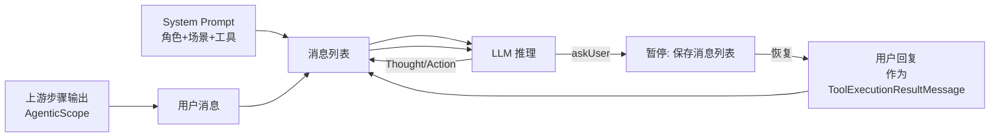
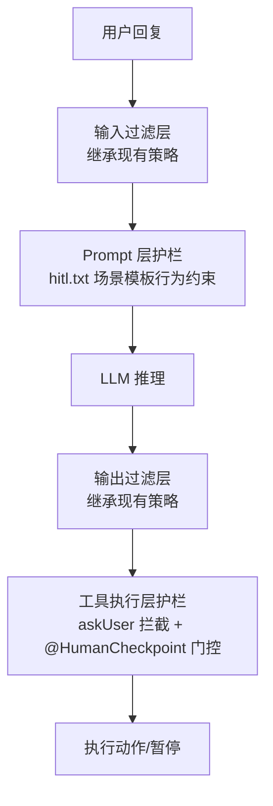

# AI Agent 技术设计文档: 工作流 HITL 交互能力

| 字段 | 内容 |
|------|------|
| 版本 | v0.1 |
| 作者 | AI Agent 架构师 |
| 日期 | 2026-08-24 |
| 变更记录 | v0.1 \| 2026-08-24 \| 初始版本，基于需求文档和代码库调研生成 \| AI Agent 架构师 |

## 0. 设计概要 (Design Summary)

*   **Agent 描述**：将 HITL 人机交互能力从单 Agent 对话扩展到工作流编排层，使工作流执行中任一 Agent 步骤可向用户提问/确认，支持 Agent 主动追问和模板预设检查点两种触发源
*   **Agent 类型**：混合型（对话澄清 + 任务确认 + 工作流编排），非独立 Agent，是现有应用编排层的能力增强
*   **自主性级别**：L2 - 确认后执行
*   **影响范围**：
    *   `agent-demo-app`：新增 @HumanCheckpoint 注解、WorkflowHITLException、扩展 ResumableExecutionState、AgentExecutor HITL 拦截、WorkflowExecutionService WAITING_USER 处理、WorkflowController 新增 hitl-reply 端点
    *   `agent-demo-agent`：HITLReActStream 适配工作流上下文、HumanInteractionManager 支持复合键
    *   `agent-demo-web`：WorkflowController 新增端点 + DTO
    *   `agent-demo-frontend`：useWorkflowStream 事件处理、WorkflowExecuteView 等待 UI、workflow.ts API 扩展
    *   预置模板：1-2 个 @Agent 方法增加 @HumanCheckpoint 注解
*   **技术难点**：
    *   工作流 Agent 使用 AiServices 隐式 ReAct（TokenStream），不支持暂停/恢复 -- askUser 场景需切换为 HITLReActStream 显式 ReAct
    *   HITL 快照需保存 Agent 消息列表 + AgenticScope + 执行位置，跨 HTTP 请求恢复
    *   并行模式下多个 Agent 同时触发 HITL 的并发控制
*   **依赖关系**：
    *   现有 `HITLReActStream` 显式 ReAct 架构（单 Agent HITL 基础设施）
    *   现有 `AgentExecutor` 重试 + 流式回调体系
    *   现有 `WorkflowExecutionService` 暂停-恢复基础设施（executions/cancelFlags/resumableStates）
    *   现有 `WorkflowEventPublisher` SSE 事件发送
    *   现有 `AbstractExecutionStrategy.executeOrSkip` 断点续执行
    *   现有前端 `AskUserCard.vue` / `ConfirmCard.vue` 交互卡片组件

## 1. Agent 架构概览 (Agent Architecture)

### 1.1 编排模式

*   **模式**：工作流编排（复用现有 5 种策略），HITL 作为编排层通用能力注入
*   **选择理由**：HITL 不改变现有编排策略，仅在 AgentExecutor 执行流程中注入暂停-恢复拦截点。策略层零修改（OCP），新增 HITL 只需修改 AgentExecutor 和 Service
*   **HITL 注入点与策略的关系**：

```mermaid
graph TB
    subgraph 策略层
        SEQ[串行策略] --> AE
        PAR[并行策略] --> AE
        COND[条件策略] --> AE
        LOOP[循环策略] --> AE
        SUP[Supervisor策略] --> AE
    end
    AE[AgentExecutor] --> CHK{@HumanCheckpoint?}
    CHK -->|是| PAUSE1[暂停: WAITING_USER]
    CHK -->|否| EXEC[执行Agent]
    EXEC --> HITL{HITL模式?}
    HITL -->|是| REACT[HITLReActStream 显式ReAct]
    HITL -->|否| TOKEN[TokenStream 隐式ReAct]
    REACT --> ASK{调用askUser?}
    ASK -->|是| PAUSE2[暂停: WAITING_USER]
    ASK -->|否| DONE1[返回结果]
    TOKEN --> DONE2[返回结果]
    PAUSE1 --> SVC[Service: 保存快照+推送事件]
    PAUSE2 --> SVC
    SVC --> WAIT[WAITING_USER 状态]
    WAIT --> REPLY[用户回复]
    REPLY --> RESUME[恢复执行]
```

### 1.2 推理框架

*   **主要框架**：
    *   **@HumanCheckpoint 场景**：使用 AiServices 隐式 ReAct（TokenStream），与现有工作流 Agent 执行一致。检查点在方法执行前拦截，不影响 ReAct 循环
    *   **Agent askUser 场景**：使用 HITLReActStream 显式 ReAct，与单 Agent HITL 一致。显式 ReAct 支持工具调用拦截、暂停-恢复
*   **框架选择策略**：
    *   工作流模板定义 `hitlEnabled=true` 时，AgentExecutor 对 askUser 场景使用 HITLReActStream
    *   `hitlEnabled=false`（默认）时，走现有 TokenStream 路径，行为零回归
    *   @HumanCheckpoint 注解检测独立于 hitlEnabled，有注解即触发检查点暂停
*   **最大执行步骤**：复用现有 `agent.max-iterations=10`（每个 Agent 步骤内），askUser 调用不消耗 ReAct 迭代次数

### 1.3 系统集成架构

*   **部署形态**：服务化（复用现有 Spring Boot 单体架构）
*   **接入方式**：复用现有 SSE 流式接口 + 新增 hitl-reply 恢复端点
*   **与现有系统的交互关系**：

```mermaid
graph TB
    User[用户] --> CTL[WorkflowController]
    CTL -->|POST /execute| SVC[WorkflowExecutionService]
    SVC -->|CompletableFuture.runAsync| STR[编排策略]
    STR --> AE[AgentExecutor]
    AE -->|@HumanCheckpoint| HITL_CHK[检查点拦截]
    AE -->|askUser + HITL模式| HITL_REACT[HITLReActStream]
    HITL_REACT --> HIM[HumanInteractionManager]
    HITL_CHK --> SVC2[Service: 保存HITL快照]
    HITL_REACT --> SVC2
    SVC2 --> WEP[WorkflowEventPublisher]
    WEP -->|ask_user + workflow_waiting| User
    CTL2[WorkflowController] -->|POST /hitl-reply| SVC3[Service: 恢复HITL]
    User -->|回复| CTL2
    SVC3 --> STR2[重放策略: 跳过已完成+继续暂停步]
```

### 1.4 Agent 生命周期

*   **会话初始化**：用户选择模板 + 填参数 -> 创建 WorkflowExecution -> 异步启动策略
*   **执行循环**：策略逐步调度 AgentExecutor -> AgentExecutor 检查 @HumanCheckpoint / askUser 拦截 -> 正常执行或暂停
*   **HITL 暂停**：保存 HITL 快照 -> 推送 ask_user + workflow_waiting -> emitter.complete() -> 状态 WAITING_USER
*   **HITL 恢复**：用户回复 -> 加载快照 -> 注入回复 -> 重放策略（跳过已完成步，继续暂停步）-> 推送 workflow_resumed
*   **会话终止**：正常完成/失败/终止/超时/会话超时清理
*   **超时控制**：HITL 暂停不受工作流 5 分钟超时影响，复用会话超时（30 分钟）清理

### 1.5 模型能力要求

> 不指定具体模型版本，仅定义 Agent 运行所需的能力基线。

| 能力维度 | 要求 | 说明 |
|---------|------|------|
| 上下文窗口 | >= 4K tokens | 系统提示词 + Agent 消息列表 + 工具描述 + 用户回复 |
| 工具调用/Function Calling | 是 | askUser 作为工具被 LLM 自主调用 |
| 结构化输出/JSON Mode | 是 | ReAct 循环需要 LLM 输出 Thought/Action/Observation 格式 |
| 流式输出 | 是 | SSE 实时推送 token |
| 推理能力 | 高级 | 需多步推理 + 工具编排 + 自主判断何时提问 |

### 1.6 代码结构与领域模块设计

**领域模块划分**：

| 模块名 | 职责（一句话） | 不负责（边界） | 复用/新建 | 包含文件 |
| :--- | :--- | :--- | :--- | :--- |
| app.core.hitl | HITL 注解定义 + HITL 异常 + HITL 快照数据结构 | 不负责执行逻辑和状态管理 | 新建 | `@HumanCheckpoint` 注解、`WorkflowHITLException`、`WorkflowHITLState` |
| app.execution | Agent 执行器（扩展 HITL 拦截） | 不负责编排策略 | 复用扩展 | `AgentExecutor` 修改 |
| app.service | 工作流执行协调（扩展 WAITING_USER 处理） | 不负责 Agent 执行细节 | 复用扩展 | `WorkflowExecutionService` 修改、`ResumableExecutionState` 修改 |
| app.strategy | 编排策略（零修改，HITL 透明） | 不负责 HITL 拦截 | 复用无修改 | 无改动 |
| agent.core | HITL ReAct 循环（适配工作流上下文） | 不负责工作流编排 | 复用扩展 | `HITLReActStream` 修改、`HumanInteractionManager` 修改 |
| web.controller | 工作流接口（新增 hitl-reply 端点） | 不负责业务逻辑 | 复用扩展 | `WorkflowController` 修改 |
| web.dto | 请求/响应 DTO | 不负责业务逻辑 | 新建 | `HITLReplyRequest` |
| frontend | 前端工作流 HITL 交互 | 不负责后端逻辑 | 复用扩展 | `useWorkflowStream.ts` 修改、`WorkflowExecuteView.vue` 修改、`workflow.ts` 修改 |

**目录归属与文件清单**：

| 文件路径 | 操作 | 用途 |
| :--- | :--- | :--- |
| `agent-demo-app/.../core/HumanCheckpoint.java` | 新增 | @HumanCheckpoint 注解定义 |
| `agent-demo-app/.../core/WorkflowHITLException.java` | 新增 | HITL 暂停信号异常（extends WorkflowPausedException） |
| `agent-demo-app/.../service/WorkflowHITLState.java` | 新增 | HITL 快照数据结构（messages/askUserData/pendingStep/retryCount） |
| `agent-demo-app/.../service/ResumableExecutionState.java` | 修改 | 新增可选 HITL 字段（hitlState） |
| `agent-demo-app/.../service/WorkflowExecutionService.java` | 修改 | 新增 WAITING_USER 处理 + hitlReply 方法 + handleHITLPaused |
| `agent-demo-app/.../execution/AgentExecutor.java` | 修改 | 新增 @HumanCheckpoint 检测 + askUser HITL 拦截 + hitlEnabled 分流 |
| `agent-demo-app/.../core/WorkflowExecutionStatus.java` | 修改 | 新增 WAITING_USER 枚举值 |
| `agent-demo-app/.../core/WorkflowExecution.java` | 修改 | 新增 waitUser 方法 |
| `agent-demo-web/.../controller/WorkflowController.java` | 修改 | 新增 POST /hitl-reply 端点 |
| `agent-demo-web/.../dto/HITLReplyRequest.java` | 新增 | HITL 回复请求 DTO |
| `agent-demo-agent/.../single/HITLReActStream.java` | 修改 | 新增工作流上下文构造器（messages 从外部构建，sessionId 复合键） |
| `agent-demo-agent/.../core/HumanInteractionManager.java` | 修改 | 支持复合键 sessionId（executionId:agentIndex） |
| `agent-demo-app/.../template/` | 修改 | 1-2 个预置模板 @Agent 方法增加 @HumanCheckpoint |
| `agent-demo-frontend/src/composables/useWorkflowStream.ts` | 修改 | 新增 workflow_waiting/workflow_resumed 事件处理 |
| `agent-demo-frontend/src/components/WorkflowExecuteView.vue` | 修改 | 新增等待 banner + AskUserCard/ConfirmCard |
| `agent-demo-frontend/src/api/workflow.ts` | 修改 | 新增 replyToWorkflow API + 事件处理 |

## 2. Prompt 工程架构 (Prompt Engineering Architecture)

> 本节定义 Prompt 的架构和策略，具体 Prompt 文本由 agent-prompt-designer Skill 实现。

### 2.1 System Prompt 架构

*   **模块划分**：

| 模块 | 内容 | 注入方式 |
|------|------|---------|
| 角色定义 | Agent 身份、交互风格（复用现有角色模板） | 静态（prompts/roles/{role}.txt） |
| 能力边界 | 能做什么、不能做什么（复用现有场景模板） | 静态（prompts/scenarios/{scenario}.txt） |
| 行为规则 | ReAct 推理流程、askUser 使用规则、追问策略 | 静态（复用 hitl.txt 场景模板） |
| 护栏规则 | 安全约束、拒绝规则 | 静态（复用现有护栏规则） |
| 工具描述 | 可用工具列表 + askUser 工具说明 | 动态 `{{tools}}` 占位符运行时替换 |
| 上下文注入 | 工作流上游步骤输出（AgenticScope 变量） | 动态，由策略层注入到用户消息 |

*   **上下文注入点**：
    *   `{{tools}}`：工具 JSON Schema，由 `ToolSchemaConverter.convertToDescriptionText()` 运行时替换（复用现有机制）
    *   上游步骤输出：作为用户消息前缀注入（如"上游输出：{previousOutput}"），由策略层在 `executeOrSkip` 调用时传入
*   **版本管理**：复用现有 `PromptTemplateLoader` 模板加载机制，不新增版本管理

### 2.2 Tool/Function 描述设计

> 本节仅定义工具描述的结构模板与消歧策略；具体文本由 tool-design Skill 落地。

| 工具名称 | when-to-use | when-not-to-use | 参数约束要点 | 返回格式要点 | 对应需求文档工具 |
|---------|-------------|-----------------|------------|---------|----------------|
| askUser | 用户指令缺少必要参数/存在歧义/即将执行有副作用操作 | 信息充足可自主推进/无副作用操作 | type: "text"\|"confirm"; question: 非空; options: confirm 必填 2-4 个 | Agent 暂停等待用户回复 | 需求文档 askUser 工具 |
| @HumanCheckpoint | 模板开发者预设的关键决策点 | 非关键操作/无副作用步骤 | 无参数（注解元数据） | 确认型 askUser 数据 | 需求文档 @HumanCheckpoint |

*   **工具消歧策略**：askUser 是工作流中唯一的 HITL 工具，不存在功能重叠。@HumanCheckpoint 不是工具，是注解，由 AgentExecutor 主动检测
*   **工具契约移交**：askUser 工具描述文本复用单 Agent HITL 已有实现（`AskUserTool.java` 的 @Tool 注解），无需额外设计

### 2.3 输出格式契约

*   **结构化输出方案**：复用现有 ReAct 格式（Thought/Action/Observation），HITLReActStream 已实现解析
*   **校验规则**：HITLReActStream 内置格式校验（finish_reason=stop 或 tool_calls）
*   **解析失败处理**：HITLReActStream 内置重试逻辑（格式异常时重新请求 LLM）

### 2.4 Few-shot 示例策略

*   **示例选择原则**：复用现有 `hitl.txt` 场景模板中的 Few-shot 示例（askUser 使用正例 + 边界反例）
*   **示例数量**：复用现有（2-3 个）
*   **放置位置**：场景模板文件内（静态）

## 3. 工具集成设计 (Tool Integration)

### 3.1 工具适配层

| 现有 API/Service | 包装为 Tool 名 | 参数转换逻辑 | 返回值转换逻辑 | 副作用 |
|-----------------|---------------|-------------|---------------|--------|
| AskUserTool（已有） | askUser | 复用单 Agent HITL：LLM 生成 type/question/options | 用户回复文本（作为 Observation 回填） | 无（暂停工作流） |
| @HumanCheckpoint（新增注解） | 非工具 | AgentExecutor 反射检测注解存在 | 构造确认型 askUser 数据（type=confirm） | 无（暂停工作流） |

### 3.2 工具执行编排

*   **@HumanCheckpoint 执行编排**：
    1. 策略调用 `executeOrSkip(agentDef, input, iteration, ctx, ...)` -> AgentExecutor.executeWithRetry()
    2. AgentExecutor 反射查找 @Agent 方法 -> 检测 @HumanCheckpoint 注解
    3. 若有注解：保存 HITL 快照（checkpoint 模式）-> 推送 ask_user + workflow_waiting -> 抛出 WorkflowHITLException
    4. 若无注解：正常执行（TokenStream 路径）
*   **askUser 执行编排**：
    1. AgentExecutor 检测 hitlEnabled=true -> 使用 HITLReActStream 执行 Agent
    2. HITLReActStream 在 executeToolCalls 中拦截工具名 = "askUser"
    3. 保存 HITL 快照（askUser 模式，含消息列表 + askUser 数据）-> 推送 ask_user + workflow_waiting
    4. ReAct 循环暂停（return，不调用 onComplete）
    5. 恢复时：加载消息列表 -> 用户回复作为 ToolExecutionResultMessage -> 新建 HITLReActStream（retryCount+1）-> start()
*   **最大调用次数**：askUser 同一问题最多 3 次（HITLReActStream.MAX_RETRY_COUNT）；@HumanCheckpoint 单次确认（拒绝即终止）

### 3.3 工具错误处理

| 工具/机制 | 失败场景 | 重试策略 | 降级方案 | 是否转人工 |
|---------|---------|---------|---------|-----------|
| askUser | 用户长时间不回复 | 不重试 | 会话超时（30 分钟）清理，状态置 TIMEOUT | 否 |
| askUser | 用户回复模糊/无效 | 最多追问 3 次 | 3 次后返回错误 Observation，Agent 终止任务 | 否 |
| @HumanCheckpoint | 用户拒绝 | 不重试 | 工作流状态置 TERMINATED | 否 |
| @HumanCheckpoint | 用户长时间不回复 | 不重试 | 会话超时（30 分钟）清理 | 否 |
| HITL 恢复后 Agent 失败 | Agent 重试耗尽 | 复用现有重试（maxRetries） | 转为 PAUSED（失败暂停），可通过现有 resume 重试 | 否 |

### 3.4 工具权限控制

*   **只读工具**：askUser（无副作用，仅暂停执行）-- 固定 allow 权限，豁免权限确认（复用单 Agent HITL 策略，AC-S03）
*   **读写工具**：不适用（HITL 工具无写操作）
*   **高风险工具**：@HumanCheckpoint 标注的方法可能有副作用，但确认机制由编排引擎控制（非工具权限层），不经过 ToolPermissionService

## 4. 记忆与上下文架构 (Memory & Context)

### 4.1 对话上下文管理

*   **管理策略**：Agent 消息列表全量保存（HITL 快照），跨暂停-恢复保持完整上下文
*   **上下文构建管道**：



### 4.2 短期记忆

*   **存储方案**：内存（HITL 快照存入 `resumableStates` ConcurrentHashMap，按 executionId 索引）
*   **生命周期**：工作流执行级别 -- HITL 暂停时创建，恢复成功/终止/超时时清理
*   **数据结构**：
    *   `WorkflowHITLState`：hitlMode（askUser/checkpoint）、askUserData（type/question/options/retryCount）、pendingStep（agentIndex/agentName/input/iteration）、messages（List<ChatMessage>，仅 askUser 模式）、retryCount
    *   存入 `ResumableExecutionState.hitlState` 字段（扩展）

### 4.3 长期记忆

*   不适用（需求文档明确不需要跨会话记忆）

### 4.4 上下文注入管道

*   **检索 -> 注入** 完整链路：
    1. 策略从 `WorkflowContext.state` 获取上游步骤输出（`done:{iteration}:{agentName}` key）
    2. 上游输出作为 Agent 输入前缀注入
    3. AgentExecutor 构建 HITLReActStream 时，消息列表 = 系统提示词 + 上游输出 + 用户消息
*   **Token 预算分配**：系统提示词 ~500 tokens + 工具描述 ~500 tokens + 消息列表 ~2000 tokens + 用户回复 ~500 tokens = ~3500 tokens（4K 窗口足够）

## 5. 知识与检索设计

> 本功能不涉及知识检索，省略本节。

## 6. 护栏与安全设计 (Guardrails & Safety)

### 6.1 多层护栏架构



### 6.2 输入过滤层（Pre-processing）

*   **Prompt Injection 防护**：本期不实现，用户回复视为可信输入（继承单 Agent HITL 策略）
*   **内容安全过滤**：继承现有 Agent 的内容安全规则
*   **敏感信息脱敏**：继承现有策略

### 6.3 Prompt 层护栏（In-context）

*   **行为约束规则**：复用 `hitl.txt` 场景模板（"信息不足时必须调用 askUser 追问，不得猜测参数" + "有副作用操作前必须确认" + "同一问题最多追问 3 次"）
*   **角色锁定策略**：复用现有角色模板的角色定义
*   **输出格式约束**：ReAct 格式（Thought/Action/Observation）

### 6.4 输出过滤层（Post-processing）

*   **内容安全检查**：继承现有 Agent 策略
*   **敏感信息泄露检测**：Agent 提问内容不应包含不必要的敏感信息
*   **格式校验与修复**：HITLReActStream 内置 ReAct 格式校验

### 6.5 工具执行层护栏（Action Gating）

*   **askUser 拦截机制**：HITLReActStream 在 `executeToolCalls` 中检测工具名 = "askUser" -> 拦截（不执行方法体）-> 保存状态 -> 推送事件 -> 暂停
*   **@HumanCheckpoint 门控**：AgentExecutor 在方法执行前检测注解 -> 若存在则暂停等待确认
*   **追问次数限制**：`retryCount >= 3` 时不触发暂停，返回错误 Observation 让 LLM 终止任务
*   **WAITING_USER 状态保护**：仅允许 hitl-reply（恢复）和 terminate（终止）操作，拒绝其他操作

### 6.6 降级策略

*   **模型不可用**：Agent 执行失败 -> 重试 -> 重试耗尽转 PAUSED（复用现有机制）
*   **工具链全面失败**：Agent 终止任务并告知用户原因
*   **护栏触发降级**：askUser 追问 3 次后终止任务；@HumanCheckpoint 拒绝后终止工作流

### 6.7 身份与权限架构

*   **身份传播机制**：继承项目现有策略（无认证机制，学习示例工程）
*   **工具调用鉴权**：工作流模板预定义工具集，用户无法在运行时注入未授权工具
*   **数据隔离**：工作流级隔离，WAITING_USER 状态按 executionId 隔离

## 7. 评估与可观测性设计 (Evaluation & Observability)

### 7.1 决策链路追踪

*   **追踪日志结构**：

| 字段 | 说明 | 示例 |
|------|------|------|
| executionId | 工作流执行 ID | exec_abc123 |
| agentIndex | Agent 步骤序号 | 2 |
| agentName | Agent 名称 | researchAgent |
| hitlMode | HITL 模式 | askUser / checkpoint |
| askUserType | 提问类型 | text / confirm |
| question | 问题文本 | "请提供研究主题" |
| retryCount | 追问次数 | 0 |
| userReply | 用户回复 | "AI Agent 架构" |
| resumeKey | 恢复键 | done:0:researchAgent |
| timestamp | 时间戳 | 2026-08-24T10:00:00Z |

### 7.2 评估框架

*   **评估数据集**：覆盖六类 AC 场景的测试用例集
*   **评估指标**：

| 指标类别 | 指标名称 | 定义 | 目标值 |
|---------|---------|------|--------|
| 正确性 | HITL 触发率 | 应触发 HITL 时正确触发的比例 | >= 95% |
| 正确性 | 恢复成功率 | HITL 恢复后工作流正常完成的比例 | >= 90% |
| 安全性 | 检查点拒绝终止率 | 拒绝后工作流正确终止的比例 | 100% |
| 安全性 | 追问上限执行率 | 3 次追问后正确终止的比例 | 100% |
| 效率 | 平均 HITL 暂停次数 | 单次工作流执行中 HITL 暂停次数 | <= 3 |
| 效率 | 平均恢复延迟 | 用户回复到工作流恢复的延迟 | <= 2s |
| 上下文 | AgenticScope 保持率 | 恢复后上下文完整的比例 | 100% |

*   **评估方式**：人工评估（前端交互验证）+ 自动化单元测试（后端状态管理、拦截逻辑、恢复逻辑）

### 7.3 监控与告警

*   **实时监控指标**：HITL 暂停次数、恢复延迟、WAITING_USER 超时清理次数、HITL 恢复失败率
*   **告警阈值**：

| 指标 | 告警阈值 | 告警级别 |
|------|---------|---------|
| HITL 恢复失败率 | > 5% | P1 |
| WAITING_USER 超时清理次数 | > 10/天 | P2 |
| 平均恢复延迟 | > 5s | P2 |

## 8. 性能与成本设计 (Performance & Cost)

### 8.1 Token 成本优化

*   **上下文裁剪策略**：askUser HITL 快照仅保存当前 Agent 的消息列表，不包含完整工作流历史
*   **模型分级调用**：复用现有模板级 modelId 配置，不同 Agent 可用不同模型
*   **缓存策略**：HITL 快照中保存 toolsJson，恢复时复用避免重新计算

### 8.2 延迟优化

*   **流式输出**：HITLReActStream 支持 token 级流式输出（复用现有 onPartialResponse 回调）
*   **恢复延迟优化**：HITL 快照内存存储，恢复时无需磁盘 IO；策略重放跳过已完成步骤

### 8.3 并发控制

*   **工作流级限制**：同一 executionId 同时只能有一个 WAITING_USER 状态
*   **并行 HITL 排队**：`ConcurrentLinkedQueue<HITLRequest>` 按 executionId 隔离，第一个生效其余排队
*   **会话超时清理**：`@Scheduled` 每 5 分钟扫描，清理超 30 分钟未回复的 WAITING_USER 状态

### 8.4 成本估算

| 场景 | 单次 Token 消耗 | 预估日交互量 | 说明 |
|------|----------------|-------------|------|
| @HumanCheckpoint | ~0（暂停不消耗 Token） | 50 | 注解检测无 LLM 调用 |
| askUser 暂停 | ~1000（askUser 工具调用） | 30 | Agent 推理 + askUser 工具调用 |
| askUser 恢复 | ~2000（回复后继续 ReAct） | 30 | 消息列表 + 用户回复 + 后续推理 |
| 合计 | ~3000 | 80 | 工作流 HITL 场景日均成本可控 |

## 9. 验收标准映射 (AC Mapping)

> 确保每个行为验收标准都有对应的技术实现。

| AC ID | AC 描述 | AC 类型 | 对应技术实现 |
|-------|--------|--------|-------------|
| AC-N01 | Agent 主动追问（工作流） | 正常交互 | AgentExecutor HITL 模式分流 -> HITLReActStream askUser 拦截 -> WorkflowHITLState 保存 -> ask_user + workflow_waiting 事件 |
| AC-N02 | 模板预设检查点触发 | 正常交互 | AgentExecutor 反射检测 @HumanCheckpoint -> WorkflowHITLState（checkpoint 模式）保存 -> ask_user(type=confirm) + workflow_waiting 事件 |
| AC-N03 | 用户回复后恢复执行 | 正常交互 | POST /hitl-reply -> Service.hitlReply -> 加载快照 -> askUser 注入回复 / checkpoint 确认执行 -> 重放策略 -> workflow_resumed 事件 |
| AC-N04 | Supervisor 模式检查点 | 正常交互 | SupervisorExecutionStrategy.runStep -> AgentExecutor @HumanCheckpoint 检测（与策略无关，透明） |
| AC-T01 | askUser 拦截机制 | 工具调用 | HITLReActStream.executeToolCalls 拦截工具名=askUser -> 不执行方法体 -> 保存消息列表到 WorkflowHITLState |
| AC-T02 | @HumanCheckpoint 注解检测 | 工具调用 | AgentExecutor 反射查找 @Agent 方法上的 @HumanCheckpoint 注解 -> 存在则暂停 |
| AC-S01 | 检查点拒绝后终止 | 安全护栏 | hitlReply(approved=false) -> Service 设 TERMINATED -> 推送 workflow_terminated |
| AC-S02 | 追问次数上限 | 安全护栏 | HITLReActStream retryCount >= MAX_RETRY_COUNT(3) -> 返回错误 Observation -> Agent 终止任务 |
| AC-S03 | WAITING_USER 操作保护 | 安全护栏 | Service 校验状态：WAITING_USER 时仅允许 hitl-reply 和 terminate，其他操作拒绝 |
| AC-E01 | 会话超时清理 | 边界降级 | HumanInteractionManager @Scheduled 清理 30 分钟超时 -> executions 状态置 TIMEOUT |
| AC-E02 | 并行多 HITL | 边界降级 | synchronized(executionId) + ConcurrentLinkedQueue 排队 -> 第一个 WAITING_USER -> 恢复后按序处理 |
| AC-E03 | 循环 HITL 暂停恢复 | 边界降级 | WorkflowContext.iterationCount 保留 -> 重放策略时历史轮次跳过 + 暂停轮内 Agent 级跳过 |
| AC-M01 | AgenticScope 上下文保持 | 记忆上下文 | WorkflowHITLState 保存 WorkflowContext -> 恢复时加载 -> 后续步骤可访问 |
| AC-M02 | Agent 消息列表保持 | 记忆上下文 | WorkflowHITLState.messages 保存完整 ChatMessage 列表 -> 恢复时新建 HITLReActStream(messages) |
| AC-H01 | 用户终止等待中工作流 | 人机协作 | DELETE /executions/{id}（复用现有 terminate）-> WAITING_USER 允许终止 -> 清理 HITL 快照 |
| AC-H02 | 恢复后 Agent 失败 | 人机协作 | HITL 恢复 -> RUNNING -> Agent 重试耗尽 -> WorkflowPausedException -> PAUSED（失败暂停，非 WAITING_USER） |

## 10. 技术决策说明 (Technical Decisions)

*   **决策 1：askUser 拦截 -- HITLReActStream 复用**
    *   选项 A：复用 HITLReActStream（显式 ReAct） -- AgentExecutor 在 HITL 模式时使用 HITLReActStream 替代 TokenStream
    *   选项 B：AskUserTool 抛异常 + AgentExecutor 捕获 -- 利用异常中断隐式 ReAct，但无法保存中间消息状态
    *   选项 C：自定义 AiServices 工具执行拦截器 -- 侵入 LangChain4j 内部，不可控
    *   选择：A
    *   理由：HITLReActStream 已验证的暂停-恢复能力（单 Agent HITL），显式 ReAct 可完整控制工具拦截、消息列表保存、恢复续跑。B 无法保存中间 ReAct 状态（隐式 ReAct 的 chat memory 不可控）。C 侵入框架内部风险高

*   **决策 2：@HumanCheckpoint -- 反射前置检测**
    *   选项 A：AgentExecutor 反射检测注解，执行前暂停
    *   选项 B：AOP 切面拦截注解方法
    *   选择：A
    *   理由：AgentExecutor 已使用反射查找 @Agent 方法（executeStreaming），在同一处增加 @HumanCheckpoint 检测零额外成本。B 需引入 AOP 依赖且切面执行顺序与 AgentExecutor 的重试逻辑协调复杂

*   **决策 3：HITL 快照存储 -- 扩展 ResumableExecutionState**
    *   选项 A：扩展 ResumableExecutionState 新增可选 hitlState 字段
    *   选项 B：新建独立 map<executionId, WorkflowHITLState>
    *   选择：A
    *   理由：统一存储在 resumableStates 中，resume 时一次加载全部恢复信息。B 需维护两个 map 且需处理一致性（HITL 暂停和失败暂停互斥）

*   **决策 4：恢复端点 -- 新增 POST /hitl-reply**
    *   选项 A：新增独立端点 POST /executions/{id}/hitl-reply
    *   选项 B：扩展现有 POST /executions/{id}/resume 增加可选 body
    *   选择：A
    *   理由：语义清晰 -- resume 是失败恢复（无用户回复），hitl-reply 是 HITL 恢复（携带用户回复/approved）。B 混合两种恢复语义，DTO 校验复杂

*   **决策 5：WAITING_USER 独立状态**
    *   选项 A：新增 WAITING_USER 状态，与 PAUSED 区分
    *   选项 B：复用 PAUSED 状态，通过快照区分暂停原因
    *   选择：A（用户需求决策）
    *   理由：语义清晰，前端可区分"等待用户输入"和"执行失败暂停"，UI 展示不同。B 虽改动小但前端需推断暂停原因

*   **决策 6：并行 HITL -- synchronized + 排队**
    *   选项 A：第一个 HITL 生效，其余排队（ConcurrentLinkedQueue）
    *   选项 B：第一个生效，其余丢弃
    *   选择：A（用户需求决策）
    *   理由：不丢弃 HITL 请求（避免信息丢失），用户回复作为工作流级上下文共享

## 11. 风险与注意事项 (Risks & Notes)

*   **技术风险**：
    *   HITLReActStream 工作流适配风险 -- 需新增构造器接受外部构建的 messages 列表和复合 sessionId -> 缓解：保留原构造器，新增重载，零回归
    *   并行 HITL 排队的线程安全风险 -- 多线程并发请求暂停 -> 缓解：synchronized(executionId) 保证原子性
    *   策略重放时 HITL 暂停步的继续逻辑 -- executeOrSkip 检测 HITL 恢复键而非 done 键 -> 缓解：新增 `hitl:{iteration}:{agentName}` 恢复键
*   **兼容性**：
    *   对现有工作流执行零回归 -- hitlEnabled 默认 false，@HumanCheckpoint 无注解时无影响
    *   对单 Agent HITL 零回归 -- HITLReActStream 新增构造器，不修改原方法
    *   前端 WAITING_USER 状态 -- 新增事件处理，不影响现有 PAUSED 处理
*   **性能影响**：
    *   HITL 暂停不消耗 LLM 调用（仅 AgentExecutor 拦截）
    *   恢复时策略重放已完成步骤跳过（step_skipped），仅暂停步重新执行
    *   HITL 快照内存占用：消息列表 ~2KB + AgenticScope ~1KB = ~3KB/执行，可忽略
*   **安全风险**：用户回复视为可信输入（继承单 Agent HITL 策略），工作流模板预定义工具集防止注入
*   **回滚方案**：
    *   hitlEnabled 默认 false -> 回滚后工作流行为不变
    *   @HumanCheckpoint 注解无标注 -> 无检查点触发
    *   WAITING_USER 状态枚举新增值 -> 不影响现有状态转换逻辑
    *   前端事件可选回调（?. 兼容）-> 不处理新事件不影响现有功能

## 12. 数据隐私与合规 (Data Privacy & Compliance)

*   **数据存储加密**：HITL 快照（消息列表 + askUser 数据）仅内存存储，不持久化，无加密需求
*   **数据传输加密**：SSE 事件通过 HTTP 传输，生产环境应使用 HTTPS（继承项目现有策略）
*   **PII 识别与脱敏**：用户回复可能包含 PII，本期不实现脱敏（继承单 Agent HITL 策略）
*   **日志保留与审计**：HITL 交互日志（executionId/agentIndex/question/userReply）记录到应用日志，保留期限遵循项目现有策略
*   **合规要求**：本项目为学习示例工程，无特定法规合规要求
