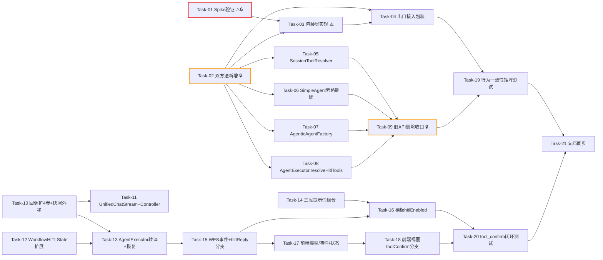

# AI Agent 开发任务计划: 工具权限全域统一管控（tool-permission-unification）

## 0. 任务概览 (Task Overview)

* **功能名称**：工具权限全域统一管控

* **总任务数**：21 个

* **预计总工时**：835 分钟（约 14 小时）

* **任务类型分布**：

  * 确定性组件（TDD）：17 个

  * 概率性组件（EDD，含迭代）：1 个（Task-14 hitl-guidance.txt，轻量 1 轮迭代）

  * 基础设施（Spike/技术验证）：1 个

  * 行为测试：2 个

  * 文档同步：1 个

* **风险任务**：Task-01（ByteBuddy 保真 Spike）⚠️、Task-03（包装层实现）⚠️

* **阻塞任务**：Task-01 🔒（包装层实现依据）、Task-02 🔒（四调用点依赖）、Task-09 🔒（AC-T01 编译期收口）

* **Prompt 迭代预期**：hitl-guidance.txt 预计 1 轮评估调优（Task-20 行为测试不达标时触发）

### 依赖关系图

### 可并行任务组

| 并行组   | 可同时执行的任务                                        | 说明                                 |
| :---- | :---------------------------------------------- | :--------------------------------- |
| 并行组 1 | Task-01 + Task-02 + Task-10 + Task-12 + Task-14 | Spike、双方法、快照外移、状态机、提示词互不依赖，可全部并行启动 |
| 并行组 2 | Task-05 + Task-06 + Task-07 + Task-08           | Task-02 完成后四个调用点适配互不影响，可并行         |
| 并行组 3 | Task-17 + Task-18 与 Task-13/15 后端开发并行           | 前端按技术方案 §3.4 事件契约先行开发（契约已在技术方案冻结）  |

## 1. 准备工作 (Preparation)

* [ ] **Prep-01**: 确认 JDK 17 构建环境

  * 说明：`$env:JAVA_HOME` 指向 `D:\Java\jdk-17.0.7`（PROJECT\_HABITS 构建约定）

  * 验证：`mvn -version` 显示 JDK 17

* [ ] **Prep-02**: 基线编译验证

  * 说明：全链路涉及模块基线编译（tools/agent/app/web）

  * 验证：`mvn compile -pl agent-demo-tools,agent-demo-agent,agent-demo-app -am` 通过

* [ ] **Prep-03**: agent-demo-common 本地仓库安装

  * 说明：agent-demo-tools 测试前置依赖（PROJECT\_HABITS 约定）

  * 验证：`mvn install -pl agent-demo-common -DskipTests` 成功

* [ ] **Prep-04**: 前端测试基线

  * 说明：确认 vitest 基线全绿，避免存量失败干扰

  * 验证：`npm run test` 全部通过

* [ ] **Prep-05**: 权限配置基线确认

  * 说明：确认 `tools.permission.enabled=true` 与 `data/tool-permissions.json` 可读写

  * 验证：管理页 `GET /api/agent/tools` 返回带 permission 字段

## 2. 开发任务 (Development Tasks)

### 阶段一：技术验证 (Spike)

> 前置验证最高风险项，产出实现路线结论

* [ ] **Task-01**: ByteBuddy 包装层 Spike 验证

  * **通俗解释**: 先做一个"技术试验"：给工具套上权限检查外壳后，确认 AI 看到的工具说明书和原来一模一样，不会因为套壳而认不出工具。

  * **任务类型**: 基础设施（Spike 技术验证）

  * **验证策略**: 集成验证

  * **说明**: 编写临时验证测试：用 ByteBuddy subclass 覆写 CalculatorTool/HttpTool（内置形态）与 McpToolFactory 生成类（MCP 嵌套形态）的 @Tool 方法并复制注解；用 LangChain4j ToolSpecifications 对比包装前后 schema 逐字段一致性。产出三选一结论：主方案（subclass+MethodDelegation）/ 备选方案1（defineMethod 显式定义）/ 降级方案2（放弃包装层，记录防线降级决策）。Spike 测试代码保留为 Task-03 的测试基础。

  * **涉及文件**: `agent-demo-tools/pom.xml`（新增 byte-buddy 依赖，BOM 管理版本）

  * **测试文件**: `agent-demo-tools/src/test/java/com/agentdemo/tools/permission/ToolPermissionGuardSpikeTest.java`

  * **参考**: 技术方案 §3.2、§11（风险缓解）

  * **对应AC**: AC-T03, AC-T04（技术可行性验证）

  * **预估工时**: 60m

  * **依赖**: 无

  * **风险标注**: ⚠️ 最高优先级风险项

  * **阻塞标注**: 🔒 Task-03 实现方式依赖本任务结论

  * **验证标准**:

    * [ ] 包装 CalculatorTool 后 ToolSpecification 的 name/description 与原类一致

    * [ ] parameters 参数名与类型与原类一致（非 arg0/arg1）

    * [ ] 包装对象方法调用委托原方法返回正确结果

    * [ ] MCP 代理类（ByteBuddy 生成类）二次包装无异常

    * [ ] 产出书面结论：主方案 / 备选方案1 / 降级方案2（记录于任务执行结果）

### 阶段二：工具域收口 (agent-demo-tools)

> 权限判定权收口到工具域：双方法 + 出口统一包装

* [ ] **Task-02**: ToolRegistry 能力声明双方法新增

  * **通俗解释**: 给工具仓库装上两个新取货口--"能暂停等确认的"和"不能暂停的"，为所有模块统一取工具立下规矩。

  * **任务类型**: 确定性组件

  * **验证策略**: TDD

  * **说明**: 新增 resolveToolsForStreaming/resolveToolsForDirect/getDefaultToolsForStreaming/getDefaultToolsForDirect 四个公开方法；内部私有化 resolveTools(identifiers, askVisible) 承载解析逻辑；isExcludedByPermission(tool, askVisible) 双条件判定（DENY 恒剔除；askVisible=false 时 ASK 剔除）。旧 API（单参重载 + ToolPermissionFilter 枚举）**本任务保留不动**（过渡期调用方未适配，Task-09 统一删除）。

  * **涉及文件**: `agent-demo-tools/src/main/java/com/agentdemo/tools/registry/ToolRegistry.java`

  * **测试文件**: `agent-demo-tools/src/test/java/com/agentdemo/tools/registry/ToolRegistryPermissionFilterTest.java`（新建）

  * **参考**: 技术方案 §3.1

  * **对应AC**: AC-T02

  * **预估工时**: 45m

  * **依赖**: 无

  * **阻塞标注**: 🔒 Task-03\~08 均依赖

  * **验证标准**（TDD RED 阶段测试依据）:

    * [ ] ForStreaming：deny 工具剔除、ask 工具保留

    * [ ] ForDirect：deny + ask 均剔除

    * [ ] askUser 工具（豁免恒 ALLOW）两方法均保留

    * [ ] 通配符 mcp:\* / rag:\* 展开后逐工具过滤生效

    * [ ] 旧单参 API 行为不变（过渡期编译与回归兼容）

* [ ] **Task-03**: ToolPermissionGuard 包装层实现

  * **通俗解释**: 给每个工具配一个"贴身保镖"：就算有人绕过正门把工具塞给 AI，保镖也会在工具真正动手前查权限，被禁的工具一下都不会碰。

  * **任务类型**: 确定性组件

  * **验证策略**: TDD

  * **说明**: 按 Task-01 Spike 结论实现 wrap(tool)：ByteBuddy 生成代理类（覆写全部 @Tool 方法 + 注解逐字复制）+ PermissionGuardInterceptor 拦截器三分支（DENY->DENY\_MESSAGE 零触发+WARN / ALLOW->委托原方法 / ASK->防御拒绝+WARN）。权限等级在包装时**捕获**（技术方案决策 6：运行中不突变）。代理类 Class 按原类缓存、包装实例按原对象缓存。生成失败降级返回原对象（ERROR 日志）。tools.permission.enabled=false 时直通委托。

  * **涉及文件**: `agent-demo-tools/src/main/java/com/agentdemo/tools/permission/ToolPermissionGuard.java`（新增）

  * **测试文件**: `agent-demo-tools/src/test/java/com/agentdemo/tools/permission/ToolPermissionGuardTest.java`

  * **参考**: 技术方案 §3.2、§4.4、McpToolFactory 先例

  * **对应AC**: AC-T03, AC-T04, AC-S01, AC-M01

  * **预估工时**: 90m（含 TDD 三阶段）

  * **依赖**: Task-01, Task-02

  * **风险标注**: ⚠️ 依赖 Spike 结论，注解/参数名保真是核心难点

  * **验证标准**:

    * [ ] deny 工具包装对象调用返回 DENY\_MESSAGE，原方法体零触发（spy 原对象验证零调用）

    * [ ] allow 工具调用委托原方法，返回结果与直调一致

    * [ ] 权限等级包装时捕获：包装后变更权限服务配置，拦截行为不变（AC-M01）

    * [ ] 同一工具对象重复 wrap 返回同一包装实例（缓存生效）

    * [ ] 构造异常场景（不可子类化对象）返回原对象并记 ERROR

    * [ ] enabled=false 时包装对象直通原方法

* [ ] **Task-04**: ToolRegistry 出口接入统一包装

  * **通俗解释**: 把"贴身保镖"安排到工具仓库的发货口，所有模块拿到的工具都自带保镖，谁也拿不到"裸奔"的工具。

  * **任务类型**: 确定性组件

  * **验证策略**: TDD

  * **说明**: 双方法解析过滤后调用 toolPermissionGuard.wrap() 逐工具包装再返回；getAvailableTools（管理/展示接口）不包装。

  * **涉及文件**: `agent-demo-tools/src/main/java/com/agentdemo/tools/registry/ToolRegistry.java`

  * **测试文件**: 扩展 `ToolRegistryPermissionFilterTest.java`

  * **参考**: 技术方案 §3.2

  * **对应AC**: AC-T04

  * **预估工时**: 30m

  * **依赖**: Task-02, Task-03

  * **验证标准**:

    * [ ] ForStreaming/ForDirect 返回的对象均为包装类型（getClass 非 Mrp原类）

    * [ ] 包装对象的 ToolSpecification 与原对象一致（LangChain4j 断言）

    * [ ] getAvailableTools 返回的 ToolInfo 不受影响（管理页字段不变）

### 阶段三：调用方接入与旁路清理

> 四个调用点切换双方法 + 旧 API 删除收口

* [ ] **Task-05**: SessionToolResolver 切换双方法

  * **通俗解释**: 单 Agent 对话的工具管理员改从新入口取工具，自动遵守权限规则。

  * **任务类型**: 确定性组件

  * **验证策略**: TDD

  * **说明**: resolveSessionTools 内 filter 枚举传递改为 askSupported ? resolveToolsForStreaming : resolveToolsForDirect；mergeDefaults 同步适配。

  * **涉及文件**: `agent-demo-agent/src/main/java/com/agentdemo/agent/single/SessionToolResolver.java`

  * **测试文件**: `agent-demo-agent/src/test/java/com/agentdemo/agent/single/SessionToolResolverTest.java`（更新）

  * **参考**: 技术方案 §3.1 调用方适配表

  * **对应AC**: AC-N01（单 Agent 路径一致性）

  * **预估工时**: 20m

  * **依赖**: Task-02

  * **验证标准**:

    * [ ] askSupported=true 走 ForStreaming（deny 剔除、ask 保留），行为与原 STREAMING 等价

    * [ ] askSupported=false 走 ForDirect（deny+ask 剔除），行为与原 SYNC 等价

    * [ ] 现有 SessionToolResolverTest 全部通过

* [ ] **Task-06**: SimpleAgent 3 参旁路删除

  * **通俗解释**: 堵上最后一个不查权限的后门，单 Agent 无论怎么调用都逃不出权限管控。

  * **任务类型**: 确定性组件

  * **验证策略**: TDD（删除后回归）

  * **说明**: 删除 3 参 chat/chatStream 兼容方法与 getDelegate(modelId) 单参方法（NONE 旁路）；同步清理对应测试方法。

  * **涉及文件**: `agent-demo-agent/src/main/java/com/agentdemo/agent/single/SimpleAgent.java`

  * **测试文件**: `SimpleAgentTest.java`、`SimpleAgentStreamingTest.java`（清理对应用例）

  * **参考**: 技术方案 §3.1、决策 3

  * **对应AC**: AC-T01

  * **预估工时**: 20m

  * **依赖**: Task-02

  * **验证标准**:

    * [ ] 3 参方法与 getDelegate(modelId) 删除后全库编译通过（无生产调用方）

    * [ ] 对应测试用例同步删除

    * [ ] 4 参方法行为不变（现有测试通过）

* [ ] **Task-07**: AgenticAgentFactory 接入 ForDirect

  * **通俗解释**: 工作流里不等人确认的那条路取工具也开始查权限：被禁的工具彻底消失，需确认的工具也先不给（这条路没地方弹确认框）。

  * **任务类型**: 确定性组件

  * **验证策略**: TDD

  * **说明**: buildAgent 中 resolveTools(toolIds) 单参调用改为 resolveToolsForDirect(toolIds)。

  * **涉及文件**: `agent-demo-app/src/main/java/com/agentdemo/app/adapter/AgenticAgentFactory.java`

  * **测试文件**: `AgenticAgentFactoryTest.java`（更新）

  * **参考**: 技术方案 §3.1

  * **对应AC**: AC-S01（修复非 HITL 双重绕过）, AC-E01

  * **预估工时**: 15m

  * **依赖**: Task-02

  * **验证标准**:

    * [ ] buildAgent 调用 resolveToolsForDirect（mock 验证）

    * [ ] deny 配置下 httpGet 不注入 tools

    * [ ] ask 配置下 httpGet 不注入 tools

* [ ] **Task-08**: AgentExecutor.resolveHitlTools 接入 ForStreaming

  * **通俗解释**: 工作流里能等人确认的那条路取工具也查权限：被禁的工具消失，需确认的工具保留待新确认机制接管。

  * **任务类型**: 确定性组件

  * **验证策略**: TDD

  * **说明**: resolveHitlTools 中 resolveTools 单参调用改为 resolveToolsForStreaming。

  * **涉及文件**: `agent-demo-app/src/main/java/com/agentdemo/app/execution/AgentExecutor.java`

  * **测试文件**: `AgentExecutorTest.java`（更新）

  * **参考**: 技术方案 §3.1

  * **对应AC**: AC-N01, AC-S01（修复加载期绕过）

  * **预估工时**: 15m

  * **依赖**: Task-02

  * **验证标准**:

    * [ ] resolveHitlTools 调用 resolveToolsForStreaming（mock 验证）

    * [ ] deny 不注入、ask 注入

    * [ ] ensureAskUserTool 行为不变

* [ ] **Task-09**: 旧 API 删除收口

  * **通俗解释**: 拆掉旧的不查权限的取工具入口，程序里只剩两个新入口，想绕都绕不了。

  * **任务类型**: 确定性组件

  * **验证策略**: TDD（删除后全库编译+回归）

  * **说明**: 删除 resolveTools/getDefaultTools 单参重载与 ToolPermissionFilter 枚举；全库搜索确认无残留引用；四个调用方（Task-05\~08）已迁移完毕后执行。

  * **涉及文件**: `agent-demo-tools/src/main/java/com/agentdemo/tools/registry/ToolRegistry.java`

  * **测试文件**: `ToolRegistryPermissionFilterTest.java`（补充无旁路断言）

  * **参考**: 技术方案 §3.1

  * **对应AC**: AC-T01（编译期无绕过入口的最终保证）

  * **预估工时**: 20m

  * **依赖**: Task-05, Task-06, Task-07, Task-08

  * **阻塞标注**: 🔒 AC-T01 收口里程碑

  * **验证标准**:

    * [ ] 单参重载与 ToolPermissionFilter 枚举删除

    * [ ] 全库 `mvn compile` 通过（tools/agent/app/web 四模块）

    * [ ] 全库搜索无 ToolPermissionFilter 引用残留

    * [ ] 代码审查确认：工具解析唯一入口为双方法

### 阶段四：快照职责外移 (agent-demo-agent)

> HITLReActStream 回归纯"流内暂停+通知"，快照机制由宿主决定

* [ ] **Task-10**: ToolConfirmConsumer 扩 4 参 + HITLReActStream 快照外移

  * **通俗解释**: 改造"暂停通知员"：它只负责喊一声"这个工具需要确认"并报出完整信息（含编号），至于暂停现场记在哪里，由听到喊声的人自己决定。

  * **任务类型**: 确定性组件

  * **验证策略**: TDD

  * **说明**: HitlTokenStream.ToolConfirmConsumer 签名扩为 (toolCallId, toolName, toolDescription, arguments)；HITLReActStream.handleToolConfirm 删除内部 saveToolConfirmInteraction 调用，仅触发 4 参回调后返回 true 暂停；askUser 路径（handleAskUser）存量行为不动。

  * **涉及文件**: `agent-demo-agent/src/main/java/com/agentdemo/agent/core/HitlTokenStream.java`、`agent-demo-agent/src/main/java/com/agentdemo/agent/single/HITLReActStream.java`

  * **测试文件**: `HITLReActStreamTest.java`、`HITLReActStreamWorkflowTest.java`（更新）

  * **参考**: 技术方案 §4.2、决策 2

  * **对应AC**: 支撑 AC-M02, AC-H01（架构基础）

  * **预估工时**: 45m

  * **依赖**: 无（可与阶段二并行）

  * **验证标准**:

    * [ ] ToolConfirmConsumer 四参签名生效，回调携带 toolCallId

    * [ ] handleToolConfirm 不再调用 saveToolConfirmInteraction（mock HumanInteractionManager 验证零调用）

    * [ ] 回调触发后 ReAct 循环暂停（不添加 ToolExecutionResultMessage）

    * [ ] askUser 拦截路径行为不变（存量测试通过）

* [ ] **Task-11**: UnifiedChatStream 补保存 + AgentController 适配

  * **通俗解释**: 单 Agent 的"记录员"听到暂停通知后自己把现场记到小本本上，用户批准或拒绝后再从本本恢复--对外行为和以前完全一样。

  * **任务类型**: 确定性组件

  * **验证策略**: TDD

  * **说明**: UnifiedChatStream.registerHitlCallbacks 的 onToolConfirm lambda 内补调 saveToolConfirmInteraction（sessionId/messages/modelId/toolsJson 均为既有上下文）；AgentController 注册处适配 4 参（tool\_confirm 事件载荷保持三字段不变）。

  * **涉及文件**: `agent-demo-agent/src/main/java/com/agentdemo/agent/core/UnifiedChatStream.java`、`agent-demo-web/src/main/java/com/agentdemo/web/controller/AgentController.java`

  * **测试文件**: `UnifiedChatStreamTest.java`（更新）

  * **参考**: 技术方案 §4.2

  * **对应AC**: AC-N02（单 Agent 恢复闭环保持）

  * **预估工时**: 30m

  * **依赖**: Task-10

  * **验证标准**:

    * [ ] ask 级工具暂停时 PendingInteraction 正确保存（mock 验证 mode=tool\_confirm + 三字段 + messages）

    * [ ] resumeToolConfirm 批准/拒绝恢复行为不变（现有测试全通过）

    * [ ] tool\_confirm SSE 事件载荷不变（toolName/toolDescription/arguments）

### 阶段五：工作流 tool\_confirm 状态机 (agent-demo-app)

> MODE\_TOOL\_CONFIRM + 转译 + 事件 + 恢复 + 模板启用

* [ ] **Task-12**: WorkflowHITLState 扩展

  * **通俗解释**: 给工作流的"暂停记录本"加一页新格式，专门记录"哪个工具在等确认"，与原有的"等提问""等检查点"并列。

  * **任务类型**: 确定性组件

  * **验证策略**: TDD

  * **说明**: 新增 MODE\_TOOL\_CONFIRM 常量与内部类 ToolConfirmData(toolCallId/toolName/toolDescription/arguments)；WorkflowHITLState 增加 toolConfirmData 字段（与 askUserData 并列）；构造器与访问器补全。

  * **涉及文件**: `agent-demo-app/src/main/java/com/agentdemo/app/service/WorkflowHITLState.java`

  * **测试文件**: `WorkflowHITLStateTest.java`（更新）

  * **参考**: 技术方案 §4.2

  * **对应AC**: AC-M02, AC-H01（数据结构基础）

  * **预估工时**: 30m

  * **依赖**: 无（可并行）

  * **验证标准**:

    * [ ] MODE\_TOOL\_CONFIRM 常量与 ToolConfirmData 四字段完整

    * [ ] 构造器/访问器可用，hitlMode=toolConfirm 快照可构建

    * [ ] askUser/checkpoint 存量行为不变（现有测试通过）

* [ ] **Task-13**: AgentExecutor 转译 + executeHitlResume toolConfirm 分支

  * **通俗解释**: 工作流的"传令兵"听到工具确认通知后，立即让整个工作流停摆等待并上报原因；用户回复后按批准/拒绝两种方式继续干活。

  * **任务类型**: 确定性组件

  * **验证策略**: TDD

  * **说明**: awaitHitlStream 注册 onToolConfirm 回调（构建 WorkflowHITLState(MODE\_TOOL\_CONFIRM, ToolConfirmData, PendingStep, messages, retryCount) 并抛 WorkflowHITLException，与 onAskUser 同构）；executeHitlResume 新增 toolConfirm 分支：批准 -> toolExecutor.execute 执行 + id 匹配回填；拒绝 -> 固定拒绝文案回填；两分支均 awaitHitlStream 续跑（retryCount 原值传递）。

  * **涉及文件**: `agent-demo-app/src/main/java/com/agentdemo/app/execution/AgentExecutor.java`

  * **测试文件**: `AgentExecutorHITLTest.java`（扩展）

  * **参考**: 技术方案 §3.4 时序图、决策 7

  * **对应AC**: AC-N02, AC-H01, AC-M02, AC-E03

  * **预估工时**: 60m

  * **依赖**: Task-10, Task-12

  * **验证标准**:

    * [ ] ask 工具触发时抛 WorkflowHITLException（hitlMode=toolConfirm，快照含四要素与 messages）

    * [ ] 恢复批准分支：toolExecutor.execute 执行、ToolExecutionResultMessage 以 pendingToolCallId 回填、续跑

    * [ ] 恢复拒绝分支：固定拒绝文案回填、续跑（不终止工作流）

    * [ ] retryCount 原值传递（不因确认 +1）

    * [ ] askUser/checkpoint 存量分支回归通过

* [ ] **Task-14**: hitl-guidance.txt + 三段提示词组合

  * **通俗解释**: 给走"等人确认"路线的工作流 Agent 补上完整自我介绍：角色 + 本职任务说明 + 工具使用守则三段齐全，不再丢任务说明。

  * **任务类型**: 概率性组件（轻量）

  * **验证策略**: EDD（结构 TDD 断言 + 文本行为验证并入 Task-20）

  * **迭代预期**: 1 轮（Task-20 行为测试中 Agent 工具使用异常时调优）

  * **说明**: 新增 hitl-guidance.txt（HITL 工具引导段，含 {{tools}} 占位 + askUser 使用引导）；executeHitlStreaming 的 systemPrompt 改为三段组合：composeSystemPrompt(roleName, scenarioName) + "\n\n" + hitlGuidance.replace("{{tools}}", 工具描述)。PromptTemplateLoader 如需公开单段加载方法则补充。

  * **涉及文件**: `agent-demo-app/src/main/resources/prompts/scenarios/hitl-guidance.txt`（新增）、`agent-demo-app/src/main/java/com/agentdemo/app/execution/AgentExecutor.java`、`agent-demo-agent/src/main/java/com/agentdemo/agent/prompt/PromptTemplateLoader.java`（按需）

  * **测试文件**: `AgentExecutorTest.java`（组合逻辑断言）

  * **参考**: 技术方案 §2.1、决策 5

  * **对应AC**: AC-N03（任务场景不丢失）

  * **预估工时**: 30m

  * **依赖**: 无（可并行）

  * **验证标准**:

    * [ ] systemPrompt 包含 role 段、app-xxx 场景段、hitl-guidance 段（三段顺序正确）

    * [ ] {{tools}} 被替换为工具描述文本（无残留占位符）

    * [ ] 单 Agent 路径提示词不受影响（UnifiedChatStream 现状测试通过）

* [ ] **Task-15**: WorkflowExecutionService 事件 + hitlReply 分支

  * **通俗解释**: 工作流"总调度"学会处理工具确认：停摆时给前端发一张"工具确认卡"，用户回复后按批准/拒绝把工作流重新启动。

  * **任务类型**: 确定性组件

  * **验证策略**: TDD

  * **说明**: handleHITLPaused 在 toolConfirm 模式下推送 tool\_confirm 事件（agentIndex/agentName/toolName/toolDescription/arguments）+ workflow\_waiting 事件（hitlMode=toolConfirm）；hitlReply 新增 toolConfirm 分支：批准/拒绝均走 ctx.write(hitlResumeKey) + resumeFromWait + 策略重放（拒绝不 terminate，区别于 checkpoint 的拒绝终止语义）。

  * **涉及文件**: `agent-demo-app/src/main/java/com/agentdemo/app/service/WorkflowExecutionService.java`

  * **测试文件**: `WorkflowExecutionServiceHITLTest.java`（扩展）

  * **参考**: 技术方案 §3.4、决策 7

  * **对应AC**: AC-H01, AC-H02, AC-N02

  * **预估工时**: 45m

  * **依赖**: Task-12, Task-13

  * **验证标准**:

    * [ ] toolConfirm 暂停推送 tool\_confirm（四要素）+ workflow\_waiting（hitlMode=toolConfirm）双事件

    * [ ] hitlReply 批准：恢复 key 写入 + resumeFromWait + workflow\_resumed + 策略重放

    * [ ] hitlReply 拒绝：同恢复机制（不 terminate），拒绝语义传达到 executeHitlResume

    * [ ] askUser/checkpoint 恢复链路回归通过（checkpoint 拒绝仍终止）

* [ ] **Task-16**: 3 个模板 hitlEnabled(true)

  * **通俗解释**: 三个示例工作流里的所有 AI 助手全部切换到"会等人确认"模式，遇到需确认的工具就停下来问用户。

  * **任务类型**: 确定性组件

  * **验证策略**: TDD（配置断言 + 模板注册回归）

  * **说明**: ResearchAnalyzeSummarizeTemplate/SmartRoutingTemplate/TaskBreakdownSupervisorTemplate 全部 AgentDefinition 显式 .hitlEnabled(true)。

  * **涉及文件**: `agent-demo-app/src/main/java/com/agentdemo/app/template/ResearchAnalyzeSummarizeTemplate.java`、`SmartRoutingTemplate.java`、`TaskBreakdownSupervisorTemplate.java`

  * **测试文件**: `WorkflowTemplatesTest.java`、`ResearchAnalyzeSummarizeTemplateTest.java`、`SupervisorAgentsTest.java`（更新）

  * **参考**: 技术方案 §1.6 文件清单、决策 4

  * **对应AC**: AC-N03

  * **预估工时**: 15m

  * **依赖**: Task-13, Task-14, Task-15（执行链路就绪）

  * **验证标准**:

    * [ ] 3 模板所有 AgentDefinition.hitlEnabled=true（断言遍历）

    * [ ] 模板注册与工具校验正常（现有测试通过）

### 阶段六：前端 (agent-demo-frontend)

> 类型/事件/状态 + 视图确认卡片

* [ ] **Task-17**: 前端类型/事件分发/状态扩展

  * **通俗解释**: 前端的"翻译官"学会听懂新的"工具确认"消息，并把等待状态记下来给界面用。

  * **任务类型**: 确定性组件

  * **验证策略**: TDD（vitest）

  * **说明**: types/index.ts 扩展 WorkflowStreamCallbacks.onToolConfirm（工作流版：agentIndex/agentName/toolName/toolDescription/arguments）与 waitingHitlMode 'toolConfirm'；workflow\.ts handleWorkflowEvent 新增 tool\_confirm 分发；useWorkflowStream 新增 toolConfirmData 状态（onToolConfirm 填充、onWorkflowResumed 清空）。

  * **涉及文件**: `agent-demo-frontend/src/types/index.ts`、`src/api/workflow.ts`、`src/composables/useWorkflowStream.ts`

  * **测试文件**: `workflow.test.ts`、`composables/__tests__/useWorkflowStream.spec.ts`（更新）

  * **参考**: 技术方案 §3.4 事件契约（已冻结，可与后端并行）

  * **对应AC**: AC-H01（前端链路）

  * **预估工时**: 45m

  * **依赖**: 无（按技术方案契约先行，联调在 Task-20）

  * **验证标准**:

    * [ ] tool\_confirm 事件解析并回调 onToolConfirm（含五字段载荷）

    * [ ] hitlMode=toolConfirm 的 workflow\_waiting 置等待态并填充 toolConfirmData

    * [ ] replyToHitl(null, approved) 请求体为 {message: null, approved}

    * [ ] 存量 askUser/checkpoint 分支回归通过

* [ ] **Task-18**: 前端视图 toolConfirm 分支

  * **通俗解释**: 工作流页面出现"工具确认卡片"，和单 Agent 聊天里那张一模一样，用户点批准或拒绝即可让工作流继续。

  * **任务类型**: 确定性组件

  * **验证策略**: TDD（vitest + 组件测试）

  * **说明**: 6 个视图（Sequential/Parallel/Conditional/Loop/Supervisor/WorkflowExecuteView）waiting-banner 新增 hitlMode==='toolConfirm' 分支，复用 ConfirmCard 组件渲染真实 toolConfirmData（工具名+参数摘要），批准/拒绝调用 replyToHitl(null, true/false)。

  * **涉及文件**: `src/components/SequentialExecuteView.vue`、`ParallelExecuteView.vue`、`ConditionalExecuteView.vue`、`LoopExecuteView.vue`、`SupervisorExecuteView.vue`、`WorkflowExecuteView.vue`

  * **测试文件**: 对应 `.spec.ts`（更新）

  * **参考**: 技术方案 §3.4、前端调研（waiting-banner 统一范式）

  * **对应AC**: AC-H01, AC-H02

  * **预估工时**: 45m

  * **依赖**: Task-17

  * **验证标准**:

    * [ ] hitlMode=toolConfirm 时渲染 ConfirmCard（真实 toolName 与格式化参数）

    * [ ] 批准触发 replyToHitl(null, true)，拒绝触发 replyToHitl(null, false)

    * [ ] 6 视图分支行为一致（测试覆盖至少 2 个代表视图 + 抽检其余）

    * [ ] `npm run test` 全部通过

### 阶段七：集成测试与文档 (Integration & Docs)

* [ ] **Task-19**: 行为一致性矩阵集成测试

  * **通俗解释**: 给系统做"权限体检"：同一工具在三种使用场景下表现必须完全一致--该看不见的看不见，该拦住的拦住。

  * **任务类型**: 行为测试

  * **验证策略**: 集成测试矩阵 + 人工抽检

  * **说明**: 构建 3 路径（单 Agent 同步/流式、工作流非 HITL/HITL）× 3 权限等级（allow/ask/deny）行为矩阵断言；覆盖 deny 零触发（spy HttpTool 验证无外呼）、权限变更运行中不突变。

  * **涉及文件**: `agent-demo-app/src/test/java/com/agentdemo/app/integration/`（新增 PermissionConsistencyIntegrationTest）

  * **测试文件**: 同涉及文件

  * **参考**: 技术方案 §7.2 评估框架

  * **对应AC**: AC-N01, AC-T02, AC-T03, AC-S01, AC-S03, AC-E01, AC-M01

  * **预估工时**: 60m

  * **依赖**: Task-04, Task-09

  * **验证标准**:

    * [ ] 9 组合矩阵断言全部一致（deny 三路径均不可见零触发；ask 按路径能力分流；allow 三路径均可用）

    * [ ] httpGet=deny 时非 HITL 工作流执行，HttpTool 方法体零调用（spy 断言）

    * [ ] askUser 三路径恒可用

    * [ ] 工作流解析工具后变更权限配置，本轮已注入工具行为不变（AC-M01）

* [ ] **Task-20**: 工作流 tool\_confirm 闭环集成测试

  * **通俗解释**: 完整走一遍"工作流跑到需确认的工具 -> 停下弹卡 -> 用户批准/拒绝 -> 继续干活"全程，确认不卡死、不丢上下文。

  * **任务类型**: 行为测试

  * **验证策略**: 集成测试 + 人工验收

  * **说明**: 扩展 WorkflowHITLIntegrationTest：3 模板执行至 httpGet 触发暂停 -> WAITING\_USER + 双事件 -> hitlReply 批准/拒绝 -> 续跑断言（上下文完整、拒绝换方案、无超时卡死）；含 hitl-guidance 文本的行为观察（Task-14 迭代触发点）。

  * **涉及文件**: `agent-demo-app/src/test/java/com/agentdemo/app/integration/WorkflowHITLIntegrationTest.java`（扩展）

  * **测试文件**: 同涉及文件

  * **参考**: 技术方案 §7.2、需求文档评估方式

  * **对应AC**: AC-N02, AC-N03, AC-H01, AC-H02, AC-M02, AC-E03, AC-S04

  * **预估工时**: 75m

  * **依赖**: Task-16, Task-18

  * **验证标准**:

    * [ ] 3 模板执行至 httpGet 触发暂停（状态 WAITING\_USER + tool\_confirm/workflow\_waiting 事件）

    * [ ] 批准后续跑：工具结果回填、恢复点续跑（非从头执行）、后续步骤完成

    * [ ] 拒绝后续跑：拒绝文案回填、LLM 换方案（不终止工作流）

    * [ ] ask 卡死缺陷不复现（无 5 分钟 WorkflowTimeoutException）

    * [ ] 拒绝文案不含配置者/时间等细节（AC-S04）

    * [ ] hitl-guidance 下 Agent 正确使用 askUser（Task-14 迭代验证，不达标则调优文本 1 轮）

* [ ] **Task-21**: 文档同步

  * **通俗解释**: 把项目"说明书"更新到最新状态，后来的开发者看到的文档和代码一致。

  * **任务类型**: 确定性组件（文档）

  * **验证策略**: 人工审核

  * **说明**: KNOWLEDGE\_BASE.md 8.5 节更新为全域统一模型（含工作流路径与包装层）；BR-PERM 规则清单新增全域一致性规则；工具调用模块/应用编排模块业务说明书同步。

  * **涉及文件**: `KNOWLEDGE_BASE.md`、`specs/modules/工具调用模块-业务说明书.md`、`specs/modules/应用编排模块-业务说明书.md`

  * **参考**: 技术方案全文

  * **对应AC**: 全部 AC（文档维度）

  * **预估工时**: 30m

  * **依赖**: Task-19, Task-20

  * **验证标准**:

    * [ ] KNOWLEDGE\_BASE 8.5 节反映"双闸门 + 能力声明双方法"全域模型

    * [ ] BR-PERM 规则更新（新增全域一致/包装层防线/工作流 tool\_confirm 恢复模式规则）

    * [ ] 两份模块业务说明书与实现一致

## 3. 验收标准检查清单 (AC Checklist)

> 19 条 AC 全覆盖（六类场景）

| AC ID  | AC 描述        | AC 类型 | 对应任务                    | 状态  |
| :----- | :----------- | :---- | :---------------------- | :-- |
| AC-N01 | 权限全局一致性      | 正常交互  | Task-02, 05, 07, 08, 19 | 待完成 |
| AC-N02 | 工作流确认后续跑     | 正常交互  | Task-13, 15, 20         | 待完成 |
| AC-N03 | 模板开箱可用       | 正常交互  | Task-14, 16, 20         | 待完成 |
| AC-T01 | 权限入口唯一       | 工具调用  | Task-06, 09             | 待完成 |
| AC-T02 | deny 加载期全域剔除 | 工具调用  | Task-02, 19             | 待完成 |
| AC-T03 | deny 执行期零触发  | 工具调用  | Task-01, 03, 19         | 待完成 |
| AC-T04 | 执行链路全域统一     | 工具调用  | Task-01, 03, 04, 19     | 待完成 |
| AC-S01 | deny 全局强制    | 安全护栏  | Task-03, 07, 08, 19     | 待完成 |
| AC-S02 | 配置防篡改        | 安全护栏  | Task-19（架构现状验证）         | 待完成 |
| AC-S03 | askUser 豁免   | 安全护栏  | Task-02, 19             | 待完成 |
| AC-S04 | 拒绝提示脱敏       | 安全护栏  | Task-13, 20             | 待完成 |
| AC-E01 | 无能力路径 ask 语义 | 边界降级  | Task-07, 19             | 待完成 |
| AC-E02 | 孤儿权限清理       | 边界降级  | 现状复用（Task-19 回归断言）      | 待完成 |
| AC-E03 | 暂停超时降级       | 边界降级  | Task-13, 20             | 待完成 |
| AC-E04 | 配置异常降级       | 边界降级  | 现状复用（Task-19 回归断言）      | 待完成 |
| AC-M01 | 变更生效时机       | 记忆上下文 | Task-03, 19             | 待完成 |
| AC-M02 | 暂停上下文保持      | 记忆上下文 | Task-12, 13, 20         | 待完成 |
| AC-H01 | 工作流工具确认交互    | 人机协作  | Task-13, 15, 17, 18, 20 | 待完成 |
| AC-H02 | 确认信息充分       | 人机协作  | Task-15, 18, 20         | 待完成 |

## 4. 验证计划 (Verification Plan)

### 4.1 确定性组件验证（TDD）

* [ ] RED：测试先行编写并运行确认失败（任务验证标准即 RED 依据）

* [ ] GREEN：最小实现使测试通过

* [ ] REFACTOR：重构后测试仍全绿

* [ ] 每任务完成即执行模块编译：`mvn compile -pl {模块} -am`（GUARDRAILS P4 门禁）

### 4.2 概率性组件验证（EDD·轻量）

* [ ] Task-14 hitl-guidance.txt 初版构建（结构断言 TDD）

* [ ] Task-20 行为测试观察 Agent 工具使用行为

* [ ] 不达标（Agent 不用 askUser / 滥用工具）则调优文本，回归测试

* [ ] 迭代上限 1 轮，超出则上报提示词架构问题

### 4.3 阶段验证检查点

| 阶段     | 验证动作              | 关联任务        | 通过标准                       |
| :----- | :---------------- | :---------- | :------------------------- |
| 阶段一完成后 | Spike 结论评审        | Task-01     | 主/备/降级方案明确                 |
| 阶段二完成后 | tools 模块测试 + 编译   | Task-02\~04 | TDD 全绿，包装 schema 一致        |
| 阶段三完成后 | 四模块编译 + 旧 API 无引用 | Task-05\~09 | AC-T01 编译期收口               |
| 阶段四完成后 | agent/web 模块测试    | Task-10\~11 | 单 Agent tool\_confirm 回归不变 |
| 阶段五完成后 | app 模块测试          | Task-12\~16 | 状态机三分支 + 模板启用              |
| 阶段六完成后 | 前端 vitest         | Task-17\~18 | 全绿 + 6 视图分支                |
| 阶段七完成后 | 全量集成 + AC 逐项      | Task-19\~21 | 19 条 AC 全通过                |

### 4.4 验收标准逐项验证

> 见 §3 AC 检查清单，每条 AC 的最终验证落在 Task-19/20 集成测试与人工验收

### 4.5 上线前检查

* [ ] 9 组合行为矩阵一致性 100%（Task-19）

* [ ] tool\_confirm 闭环 3 模板全通过（Task-20）

* [ ] deny 零触发、ask 零卡死（对抗性断言）

* [ ] `mvn compile` 四模块 + `npm run test` 前端全绿

* [ ] 回滚开关验证（tools.permission.enabled=false 退化正常）

* [ ] 文档同步完成（Task-21）

## 5. 风险与注意事项 (Risks & Notes)

* **Spike 失败风险**（最高）：ByteBuddy 注解/参数名保真不达预期 -> 备选方案1（defineMethod 显式定义）仍失败则降级方案2（放弃包装层仅加载期过滤），需回技术方案记录防线降级决策并同步需求方

* **MCP 嵌套代理风险**：MCP 工具二次包装兼容性未知 -> Spike 已覆盖该形态；MCP 默认 ask 在 ForDirect 路径被剔除，实际暴露面小

* **全链路启用 HITL 的回归风险**：3 模板执行链路整体切换（AgenticServices -> HITLReActStream），SSE 事件序列差异 -> Task-20 全模板集成测试 + 前端面板逐事件验证；回滚方式：模板 hitlEnabled 改回 false

* **过渡期并存风险**：Task-02\~08 期间新旧 API 并存（旧单参仍 NONE）-> Task-09 统一删除收口，期间不新增旧 API 调用

* **接口签名变更风险**：ToolConfirmConsumer 3->4 参影响 AgentController -> Task-11 同步适配（全链路仅 1 处调用，已枚举）

* **时间风险**：若工时超预期，Task-19 矩阵可缩减为代表组合（3×3 -> deny 全路径 + ask 双工作流路径），Task-21 文档可延后补

* **成本风险**：集成测试涉及真实 LLM 调用（3 模板执行）-> 优先使用 Mock 模型测试（TestTokenStream 先例），人工验收阶段才用真实模型

