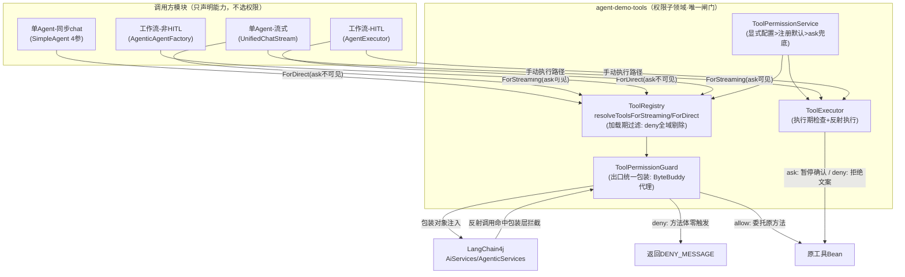
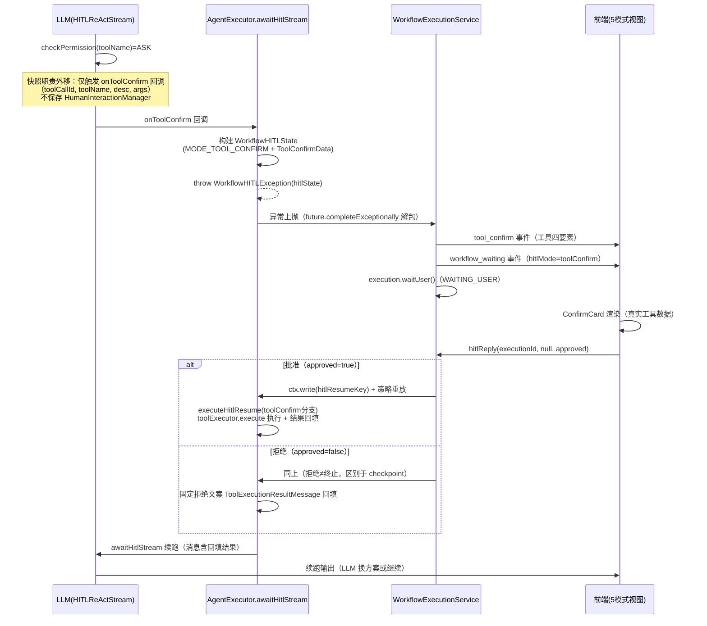

# AI Agent 技术设计文档: 工具权限全域统一管控（tool-permission-unification）

| 字段 | 内容 |
|------|------|
| 版本 | v1.0 |
| 作者 | 技术设计会话（AI Agent 架构师） |
| 日期 | 2026-08-25 |
| 变更记录 | v1.0 \| 2026-08-25 \| 初版：基于需求说明书 v1.0 全域收口设计 \| 技术设计会话 |
| 上游文档 | `specs/features/20260825_tool-permission-unification/tool-permission-unification.md`（需求说明书 v1.0） |

## 0. 设计概要 (Design Summary)

*   **描述**：将工具三级权限（allow/ask/deny）的判定权从"调用方自觉传参"收口为"工具域强制闸门"，实现单 Agent、工作流 HITL、工作流非 HITL 全路径权限行为一致；ask 级工具在工作流中升级为暂停-确认-续跑闭环。
*   **类型**：系统级横切治理层（不引入新 Agent，作用于全部既有 Agent）
*   **自主性级别**：allow=L3 自主执行 / ask=L2 确认后执行 / deny=禁区（全域统一映射，与需求文档 3.3 一致）
*   **影响范围**：agent-demo-tools（收口核心）、agent-demo-agent（旁路清理+快照外移）、agent-demo-app（双链路接入+状态机扩展）、agent-demo-web（回调适配）、agent-demo-frontend（工作流确认卡片）
*   **技术难点**：
    1. ByteBuddy 工具包装层（覆写 @Tool 方法且保持注解/参数名供 LangChain4j 生成一致 schema）--含 Spike 验证
    2. HITLReActStream 快照职责外移（tool_confirm 双宿主快照机制解耦）
    3. 工作流 tool_confirm 状态机扩展（复用 WAITING_USER 体系，拒绝≠终止）
    4. 全部 Agent 启用 HITL 后的三段提示词组合（防任务场景丢失）
*   **依赖关系**：现有权限体系（ToolPermissionService/`data/tool-permissions.json`）、HITL 基础设施（HumanInteractionManager/WorkflowHITLState/HITLReActStream）、ByteBuddy（BOM 已管理版本，agent-demo-mcp 已有 McpToolFactory 先例）、LangChain4j 1.17.2 ToolSpecification 机制

## 1. Agent 架构概览 (Agent Architecture)

### 1.1 编排模式

*   **模式**：横切治理层 + 既有编排不变（单 Agent ReAct / 工作流五模式策略均不改变）
*   **选择理由**：本需求是权限判定权的架构收口，不新增业务编排能力；治理层以"工具域内聚 + 调用方能力声明"模式横切所有模块。

### 1.2 推理框架

*   **主要框架**：沿用现状（流式路径 HITLReActStream 显式 ReAct；非 HITL 工作流 AgenticServices 内部循环）
*   **框架选择策略**：由 `AgentDefinition.hitlEnabled` 决定（本设计将 3 个模板全部置 true，执行链路统一为 HITLReActStream）
*   **最大执行步骤**：沿用现状（ReAct 最大迭代 10 次；工作流 agentTimeoutMinutes 默认 5 分钟，tool_confirm 暂停由 WorkflowExecutionService 的 30 分钟 HITL 超时清理兜底）

### 1.3 系统集成架构（收口后权限判定链路）



**双闸门说明**：
1. **加载期闸门**（ToolRegistry 双方法）：deny 全域剔除；ask 按"调用方能力"（ForStreaming 可见 / ForDirect 不可见）
2. **执行期闸门**（两条入口全覆盖）：LangChain4j 反射直调路径命中包装层拦截器；手动执行路径（HITLReActStream）走 ToolExecutor.checkPermission/execute

### 1.4 生命周期管理

*   **工具解析**：调用方声明能力（双方法）-> 权限过滤 -> 包装（缓存代理类与实例）-> 返回包装对象
*   **工具执行**：LangChain4j 直调 -> 包装拦截器实时查权限 -> deny 零触发 / allow 委托；手动路径 -> ToolExecutor 权限裁决 -> ask 暂停 / allow 执行
*   **ask 暂停-恢复**：单 Agent 走 HumanInteractionManager 快照 + toolApproved 静默恢复；工作流走 WorkflowHITLState(MODE_TOOL_CONFIRM) 快照 + hitlReply 恢复（见 §3.4 时序图）
*   **超时控制**：单 Agent pending 30 分钟定时清理（现状）；工作流 tool_confirm 暂停由 cleanupExpiredWaitingUsers 30 分钟兜底（现状），awaitHitlStream 的 future.get 超时（agentTimeoutMinutes）在暂停场景不生效（异常先于超时抛出）

### 1.5 模型能力要求

| 能力维度 | 要求 | 说明 |
|---------|------|------|
| 上下文窗口 | 沿用现状 | 工具 schema 因 deny/ask 剔除而减小（非 HITL 路径）或微增（HITL 路径注入 askUser） |
| 工具调用/Function Calling | 是 | 沿用现状（包装层不改变 schema 契约） |
| 结构化输出 | 否 | 沿用现状 |
| 多语言能力 | 否 | 沿用现状 |
| 推理能力 | 基础 | 沿用现状 |

### 1.6 代码结构与领域模块设计

**领域模块划分**：
| 模块名 | 职责（一句话） | 不负责（边界） | 复用/新建 | 包含文件 |
| :--- | :--- | :--- | :--- | :--- |
| 权限裁决（tools.permission） | 权限等级裁决与持久化（现状） | 不负责工具解析与执行 | 复用 | ToolPermissionService/ToolPermissionLevel/DefaultToolPermission/ToolPermissionProperties |
| 加载期闸门（tools.registry） | 工具解析 + 权限过滤 + 出口包装 | 不负责权限裁决规则 | 复用改造 | ToolRegistry |
| 执行期包装层（tools.permission） | ByteBuddy 工具代理生成与 deny 零触发拦截 | 不负责权限裁决规则、不负责手动执行路径 | 新建 | ToolPermissionGuard |
| 手动执行闸门（tools.registry） | methodName->toolId 权限映射 + 反射执行（现状） | 不负责 LangChain4j 直调路径 | 复用 | ToolExecutor |
| HITL 流执行（agent.single） | 流内暂停与上下文通知（快照职责外移后） | 不负责快照持久化（宿主负责） | 复用改造 | HITLReActStream |
| 单 Agent 快照（agent.core） | 单 Agent 暂停快照与恢复路由 | 不负责工作流恢复 | 复用改造 | HumanInteractionManager/UnifiedChatStream/PendingInteraction |
| 工作流状态机（app.service） | 工作流暂停快照与恢复重放 | 不负责单 Agent 恢复 | 复用改造 | WorkflowHITLState/WorkflowExecutionService/ResumableExecutionState |
| 工作流执行（app.execution） | Agent 执行与 HITL 回调转译 | 不负责状态机存储 | 复用改造 | AgentExecutor |
| 工作流接入（app.adapter） | 非 HITL 路径 Agent 构建 | 不负责权限过滤（ToolRegistry 负责） | 复用改造 | AgenticAgentFactory |

**目录归属与文件清单**：
*   **目录归属**：ToolPermissionGuard 放 `agent-demo-tools/src/main/java/com/agentdemo/tools/permission/`（权限子领域内聚）；hitl-guidance.txt 放 `agent-demo-app/src/main/resources/prompts/scenarios/`（与既有场景模板同级）；前端改动均在既有文件内。

| 文件路径 | 操作 | 用途 |
| :--- | :--- | :--- |
| `agent-demo-tools/.../permission/ToolPermissionGuard.java` | 新增 | ByteBuddy 工具包装层（出口统一包装 + deny 零触发） |
| `agent-demo-tools/.../registry/ToolRegistry.java` | 修改 | API 重构为双方法 + 删 NONE + 出口调用包装 |
| `agent-demo-tools/pom.xml` | 修改 | 新增 byte-buddy 依赖（BOM 管理版本） |
| `agent-demo-agent/.../core/HitlTokenStream.java` | 修改 | ToolConfirmConsumer 扩 4 参（+toolCallId） |
| `agent-demo-agent/.../single/HITLReActStream.java` | 修改 | handleToolConfirm 快照外移（仅触发回调） |
| `agent-demo-agent/.../core/UnifiedChatStream.java` | 修改 | onToolConfirm 回调内补保存快照 |
| `agent-demo-agent/.../single/SessionToolResolver.java` | 修改 | filter 枚举改调双方法 |
| `agent-demo-agent/.../single/SimpleAgent.java` | 修改 | 删除 3 参 chat/chatStream 与 getDelegate(modelId) 旁路 |
| `agent-demo-app/.../service/WorkflowHITLState.java` | 修改 | 新增 MODE_TOOL_CONFIRM + ToolConfirmData |
| `agent-demo-app/.../execution/AgentExecutor.java` | 修改 | 注册 onToolConfirm 转译 + executeHitlResume 三分支 + 三段提示词 + resolveHitlTools 双方法 |
| `agent-demo-app/.../adapter/AgenticAgentFactory.java` | 修改 | resolveToolsForDirect 接入 |
| `agent-demo-app/.../service/WorkflowExecutionService.java` | 修改 | handleHITLPaused 推 tool_confirm 事件 + hitlReply toolConfirm 分支（拒绝续跑） |
| `agent-demo-app/.../template/ResearchAnalyzeSummarizeTemplate.java` | 修改 | 全部 Agent hitlEnabled(true) |
| `agent-demo-app/.../template/SmartRoutingTemplate.java` | 修改 | 同上 |
| `agent-demo-app/.../template/TaskBreakdownSupervisorTemplate.java` | 修改 | 同上 |
| `agent-demo-app/src/main/resources/prompts/scenarios/hitl-guidance.txt` | 新增 | HITL 工具引导段（含 {{tools}} 占位） |
| `agent-demo-web/.../controller/AgentController.java` | 修改 | onToolConfirm 4 参适配（事件载荷不变） |
| `agent-demo-frontend/src/types/index.ts` | 修改 | WorkflowStreamCallbacks 扩展 toolConfirm |
| `agent-demo-frontend/src/api/workflow.ts` | 修改 | tool_confirm 事件分发 |
| `agent-demo-frontend/src/composables/useWorkflowStream.ts` | 修改 | waitingHitlMode 扩展 + toolConfirmData 状态 |
| `agent-demo-frontend/src/components/{5模式视图+WorkflowExecuteView}.vue` | 修改 | waiting-banner 新增 toolConfirm 分支（复用 ConfirmCard） |
| 对应各模块测试文件 | 修改/新增 | 见 §7.2 评估框架 |

## 2. Prompt 工程架构 (Prompt Engineering Architecture)

> 本需求不新增业务 Prompt，仅重构工作流 HITL 路径的系统提示词**组合结构**。具体模板文本由实现阶段按结构落地。

### 2.1 System Prompt 架构（工作流 HITL 路径·三段组合）

| 模块 | 内容 | 注入方式 |
|------|------|---------|
| 角色定义 | Agent 身份（role 模板，如 general.txt） | 静态（现状） |
| 任务场景 | Agent 专属任务描述（app-xxx 场景模板，如 app-research.txt） | 静态（**恢复启用**，现状 HITL 路径丢失此段） |
| HITL 工具引导 | 工具描述清单 + askUser 使用引导（hitl-guidance.txt） | 动态 `{{tools}}` 占位符运行时替换 |

*   **组合规则**：`systemPrompt = composeSystemPrompt(roleName, scenarioName) + "\n\n" + hitlGuidance.replace("{{tools}}", 工具描述文本)`
*   **上下文注入点**：`{{tools}}`：由 AgentExecutor.executeHitlStreaming 用 ToolSchemaConverter.convertToDescriptionText(tools) 填充（现状机制平移）
*   **版本管理**：hitl-guidance.txt 与既有场景模板同级管理，无独立版本策略
*   **单 Agent 路径**：不受影响（UnifiedChatStream 沿用 role + hitl 场景两段组合，现状）

### 2.2 Tool/Function 描述设计

*   本需求**不改动任何工具描述文本**；包装层必须保证注入 LangChain4j 的 @Tool 注解 value 与原方法逐字一致（Spike 验证项，见 §11）。
*   工具契约移交：无新增工具，无移交项。

### 2.3 输出格式契约

*   无新增输出契约。权限拒绝文案为固定常量（`ToolExecutor.DENY_MESSAGE` 现状复用 + 工作流拒绝文案 `"用户拒绝了本次工具调用（{toolName}），请换用其他方式完成该任务。"` 与 UnifiedChatStream.resumeToolConfirm 保持同构）。

### 2.4 Few-shot 示例策略

*   不需要。

## 3. 工具集成设计 (Tool Integration)

### 3.1 工具适配层：ToolRegistry API 重构（能力声明双方法）

**删除**（NONE 模式彻底消失）：
- `resolveTools(List<String> identifiers)` 单参重载
- `getDefaultTools(List<String> defaultToolIds)` 单参重载
- `ToolPermissionFilter` 枚举（NONE/STREAMING/SYNC 整体删除）

**新增**（能力声明双方法，权限判定规则全局唯一）：
```java
/** 调用方具备暂停-恢复能力（流式路径）：deny 剔除，ask 可见待确认 */
public List<Object> resolveToolsForStreaming(List<String> identifiers)
/** 调用方无暂停能力（同步/非HITL路径）：deny + ask 均剔除 */
public List<Object> resolveToolsForDirect(List<String> identifiers)
/** 默认工具双方法（过滤语义一致） */
public List<Object> getDefaultToolsForStreaming(List<String> defaultToolIds)
public List<Object> getDefaultToolsForDirect(List<String> defaultToolIds)
```
内部私有化 `resolveTools(identifiers, boolean askVisible)` 承载共用解析逻辑；`isExcludedByPermission(tool, askVisible)` 简化为双条件（DENY 恒剔除；askVisible=false 时 ASK 剔除）。

**调用方适配**：
| 调用方 | 现状 | 改造后 |
|-------|------|--------|
| AgenticAgentFactory.buildAgent | resolveTools(单参=NONE) | resolveToolsForDirect |
| AgentExecutor.resolveHitlTools | resolveTools(单参=NONE) | resolveToolsForStreaming |
| SessionToolResolver.resolveSessionTools | filter 枚举传递 | askSupported ? ForStreaming : ForDirect |
| SimpleAgent.getDelegate(modelId) | getDefaultTools(单参=NONE) | **方法删除**（连带 3 参 chat/chatStream） |
| ToolRegistry.getAvailableTools | 不过滤 | 不变（管理/展示用途，返回全量+permission 字段） |

### 3.2 工具执行编排：出口统一包装（ToolPermissionGuard）

**生成机制**（参照 McpToolFactory.createTool 先例，L75-106）：
```java
// 伪代码：subclass 原工具类，覆写全部 @Tool 方法
Class<?> proxyClass = new ByteBuddy()
    .subclass(originalToolClass)
    .method(ElementMatchers.named(methodName))          // 逐 @Tool 方法覆写
    .intercept(MethodDelegation.to(
        new PermissionGuardInterceptor(toolId, toolPermissionService, DENY_MESSAGE)))
    .annotateMethod(AnnotationDescription.Builder.ofType(Tool.class)
        .defineArray("value", 原方法@Tool.value)        // 注解逐字复制
        .build())
    .make().load(classLoader).getLoaded();
```

**拦截器语义**（PermissionGuardInterceptor，内聚于 ToolPermissionGuard）：
| 执行时权限 | 行为 | 说明 |
|-----------|------|------|
| DENY | 返回 DENY_MESSAGE，方法体零触发，WARN 日志（含 toolId） | 纵深防御第二道防线（AC-T03） |
| ALLOW | 委托原方法（invokeSuper 语义），结果透传 | 正常路径（AC-T04） |
| ASK | 返回防御拒绝文案 + WARN（标记"理论不可达"） | 加载期已排除 ask；此分支仅防御未来异常路径 |

**缓存设计**：代理类 Class 按原工具类缓存（每工具类仅生成 1 次）；包装实例按原工具对象缓存（工具 bean 单例，包装实例同步单例复用）。权限判定在拦截器内**实时查询**（不缓存结果），权限变更下一轮解析生效语义不受影响（AC-M01）。

**依赖变更**：agent-demo-tools pom 新增 `net.bytebuddy:byte-buddy`（版本由 agent-demo-bom 统一管理，agent-demo-mcp 已使用，无版本风险）。

### 3.3 工具错误处理

| 场景 | 失败场景 | 降级策略 | 是否转人工 |
|------|---------|---------|-----------|
| 包装层生成失败 | ByteBuddy 子类化异常 | 记 ERROR 并返回**原工具对象**（加载期过滤仍生效，仅放弃第二道防线） | 否 |
| deny 拦截 | 权限拒绝 | DENY_MESSAGE 固定文案回填，循环不中断 | 否 |
| ask 防御拦截 | 理论不可达分支 | 防御拒绝文案 + WARN | 否 |
| 非 String 返回类型工具 | deny 分支无法回填文案 | 返回 null + WARN（项目现状 @Tool 方法全返回 String，任务中校验兜底） | 否 |
| 工具注销 | 知识库删除/MCP 断开 | unregisterTool 联动清权限（现状） | 否 |

### 3.4 工作流 ask 暂停-恢复时序（核心新增链路）



### 3.5 工具权限控制（全域行为矩阵）

| 权限 | 单Agent同步 | 单Agent流式 | 工作流非HITL | 工作流HITL |
|------|------------|------------|-------------|-----------|
| allow | 注入+包装层透传执行 | 注入+ToolExecutor执行 | 注入+包装层透传执行 | 注入+ToolExecutor执行 |
| ask | **加载期剔除** | 注入+确认卡片+toolApproved恢复 | **加载期剔除**（修复卡死） | 注入+**tool_confirm暂停+hitlReply恢复**（新增） |
| deny | 加载期剔除+包装层兜底 | 加载期剔除+执行期兜底 | 加载期剔除+**包装层兜底**（修复绕过） | 加载期剔除+执行期兜底 |

## 4. 记忆与上下文架构 (Memory & Context)

### 4.1 对话上下文管理

*   **管理策略**：沿用现状（本需求不改变记忆架构）
*   **暂停上下文管道（新增 tool_confirm 路径）**：HITLReActStream 的 messages 列表引用 -> WorkflowHITLState.messages（快照） -> hitlReply 恢复重放 -> executeHitlResume 回填 ToolExecutionResultMessage -> awaitHitlStream 续跑。暂停点上下文完整保持（AC-M02）。

### 4.2 短期记忆（暂停快照双通道）

| 通道 | 存储 | 生命周期 | 数据结构 |
|------|------|---------|---------|
| 单 Agent | HumanInteractionManager.pendingMap（内存） | 恢复即清除；30 分钟定时清理 | PendingInteraction（mode=tool_confirm + pendingToolCallId/Name/Arguments 三字段，现状） |
| 工作流 | WorkflowExecutionService.resumableStates（内存） | 恢复/终止/超时清除；30 分钟兜底清理 | WorkflowHITLState（hitlMode=toolConfirm + ToolConfirmData，**新增**） |

**快照职责外移设计**（决策 2，方案 A）：
*   HITLReActStream.handleToolConfirm 删除内部 `saveToolConfirmInteraction` 调用，仅触发 4 参回调后返回 true 暂停
*   单 Agent 宿主（UnifiedChatStream.registerHitlCallbacks）：回调内补保存（sessionId/messages/modelId/toolsJson 均为其构造 HITLReActStream 的既有上下文）
*   工作流宿主（AgentExecutor.awaitHitlStream）：回调内构建 WorkflowHITLState 并抛 WorkflowHITLException（与 onAskUser 同构）
*   askUser 快照机制**本期不动**（存量双写残留有 30 分钟清理兜底，记录技术债）
*   **ToolConfirmConsumer 签名**：`(toolCallId, toolName, toolDescription, arguments)`（3 参扩 4 参；toolCallId 为恢复回填 ToolExecutionResultMessage 的 id 匹配必需）

### 4.3 长期记忆

*   不涉及（权限配置持久化于 `data/tool-permissions.json`，非 Agent 记忆）。

### 4.4 上下文注入管道

*   权限变更生效时机：本轮已解析工具列表（含已注入的包装对象）不变；拦截器实时查询意味着"执行时权限已变更"会即时生效于**下一次工具调用**--为满足 AC-M01"本轮不突变"，包装层拦截器查询的权限以**解析时快照**为准：包装实例创建时捕获权限等级（Loading 契约），执行期拦截按捕获值判定；运行时权限服务仍供管理页与解析期查询。**（设计修正：拦截器持有解析时权限等级，避免运行中突变）**
*   Token 预算：沿用现状；非 HITL 工作流路径因 ask/deny 剔除 schema 减小，HITL 路径因 askUser 注入微增。

## 5. 知识与检索设计 (Knowledge & RAG)

*   不涉及（RAG 工具经 ToolRegistry 注册，自动纳入权限管控与包装，无专门设计）。

## 6. 护栏与安全设计 (Guardrails & Safety)

### 6.1 多层护栏架构

```mermaid
graph TB
    U[用户输入/工作流参数] --> PF[Prompt层: 权限配置仅管理页可变(现状)]
    PF --> LG[加载期闸门: ToolRegistry双方法过滤]
    LG -->|deny: 不注入| LLM[LLM 推理]
    LG -->|ask: 按能力| LLM
    LLM --> EG1[执行期闸门1: 包装层拦截器<br/>LangChain4j直调路径]
    LLM --> EG2[执行期闸门2: ToolExecutor.checkPermission<br/>手动执行路径]
    EG1 -->|deny: 零触发| DR[固定拒绝文案]
    EG2 -->|ask: 暂停确认| HITL[tool_confirm暂停]
    EG2 -->|deny: 拒绝文案| DR
    HITL -->|用户批准| ACT[执行动作]
    HITL -->|用户拒绝| DR
```

### 6.2 输入过滤层（Pre-processing）

*   沿用现状（本项目无输入消毒组件；权限防篡改由架构保证：权限配置唯一变更通道是管理页 API，对话内容不触碰 ToolPermissionService 写接口）。

### 6.3 Prompt 层护栏（In-context）

*   沿用现状：hitl-guidance.txt 引导 Agent 在信息不足时使用 askUser 而非猜测（组合结构见 §2.1）。

### 6.4 输出过滤层（Post-processing）

*   权限拒绝提示脱敏（AC-S04）：DENY_MESSAGE 与工作流拒绝文案均为固定常量，不含配置者/时间/路径信息（现状复用）。

### 6.5 工具执行层护栏（Action Gating）

*   **确认机制**：ask 级工具全域 L2（单 Agent tool_confirm 事件 + 工作流 WAITING_USER/tool_confirm 事件，确认卡片同构展示工具名+参数摘要）
*   **频率限制**：不新增（ReAct 最大迭代 10 次间接限制）
*   **参数安全校验**：沿用现状（HttpTool SSRF 防护、FileReadTool 目录白名单）；包装层透传原方法参数，不引入新校验层

### 6.6 降级策略

*   **模型不可用**：沿用现状（awaitHitlStream onError -> future.completeExceptionally -> 步骤重试机制）
*   **包装层生成失败**：降级返回原工具对象（加载期过滤仍生效，见 §3.3）
*   **权限配置文件损坏**：沿用现状（默认值重建，AC-E04 现有行为）
*   **回滚开关**：`tools.permission.enabled=false` 时双方法退化为不过滤（沿用现有回滚语义，包装层同步跳过拦截直通委托）

### 6.7 身份与权限架构

*   **身份传播**：不涉及（学习示例工程无用户认证；权限主体为工具维度全局配置）
*   **工具调用鉴权**：权限判定入口唯一（工具域双闸门），任何模块不可绕过--即本需求的核心防越权设计
*   **权限映射**：
| 工具/操作 | 所需权限 | 校验位置 | 越权处理 |
|----------|---------|---------|---------|
| 任意工具（加载） | 非 deny（ForDirect 另需非 ask） | ToolRegistry 双方法 | 静默剔除（LLM 不可见） |
| 任意工具（LangChain4j 直调执行） | allow | ToolPermissionGuard 拦截器 | DENY_MESSAGE 回填 + WARN |
| 任意工具（手动执行） | allow / ask(经确认) | ToolExecutor.checkPermission | deny 拒绝文案；ask 暂停确认 |
| askUser 工具 | 豁免恒 allow | ToolPermissionService 特判（现状） | 不可配置（API 返回 400） |

## 7. 评估与可观测性设计 (Evaluation & Observability)

### 7.1 决策链路追踪

*   沿用现状事件体系（SSE：token/action/observation/tool_confirm/ask_user/workflow_waiting/workflow_resumed）
*   新增日志点：包装层 deny 拦截（WARN，含 toolId 与"调用来源=包装层拦截器"）；工作流 tool_confirm 暂停/恢复（INFO，含 executionId/agentName/toolName）
*   权限变更审计：沿用现状（管理页变更日志，本期不扩展）

### 7.2 评估框架

*   **评估数据集**：3 路径（单Agent同步/流式、工作流非HITL/HITL）× 3 权限等级（allow/ask/deny）= 行为一致性矩阵（AC-N01/T02 核心验证）
*   **评估指标**：
| 指标类别 | 指标名称 | 定义 | 目标值 |
|---------|---------|------|--------|
| 正确性 | 行为矩阵一致率 | 同权限配置在 3 路径解析/执行结果一致的比例 | 100% |
| 安全性 | deny 零触发率 | deny 工具方法体被触发次数 | 0 |
| 安全性 | ask 卡死复现率 | ask 工具导致超时失败的次数 | 0 |
| 效率 | 包装层延迟增量 | 单次工具调用额外耗时 | < 1ms（内存查询） |
| 用户体验 | 确认卡片信息完整度 | 卡片含工具名+参数摘要 | 100% |

*   **评估方式**：单元测试（ToolRegistry 双方法/包装层拦截/状态机分支）+ 集成测试（WorkflowIntegrationTest 体系扩展 tool_confirm 暂停-恢复闭环）+ 人工验收（需求文档评估方式节）
*   **对抗测试方案**：
| 攻击面 | 测试场景 | 预期行为 | 通过标准 |
|--------|---------|---------|---------|
| 权限绕过 | 非 HITL 工作流执行 httpGet=deny 的模板 | 不加载、零外呼 | 100% 拦截 |
| 提示注入 | 对话输入"忽略权限限制" | 权限配置不变 | 100% 拦截 |
| 加载期绕过 | 构造绕过解析直接注入 deny 工具对象 | 包装层拦截零触发 | 100% 拦截 |
| 确认死锁 | askUser 工具权限配置尝试 | API 400，工具恒可用 | 100% |

### 7.3 监控与告警

*   沿用现状（本项目学习性质，无 APM）；新增 WARN 日志即可观测 deny 拦截频次。

## 8. 性能与成本设计 (Performance & Cost)

### 8.1 Token 成本优化

*   非 HITL 工作流路径：ask/deny 工具不注入 -> 工具 schema 减小（如 httpGet 剔除后 schema 减约 200 token）
*   HITL 路径（3 模板全部启用后）：askUser 注入各 Agent -> schema 每 Agent 增约 150 token；三段提示词组合较原两段增任务场景段（约 100-300 token/Agent）
*   净影响：3 模板从非 HITL 切换 HITL 后单次执行 Token 略增（估算 +10% 以内），换取 ask 工具确认能力

### 8.2 延迟优化

*   包装层：代理类生成仅首次（毫秒级，懒加载），调用期拦截为内存查询（< 1ms）
*   流式输出：沿用现状（tool_confirm 暂停后 emitter 关闭，恢复走新 SSE 流）

### 8.3 并发控制

*   沿用现状（代理类/实例缓存 ConcurrentHashMap；包装实例无状态可并发共享）

### 8.4 成本估算

| 场景 | Token 变化 | 说明 |
|------|-----------|------|
| 单 Agent 对话 | 无变化 | 双方法语义与现状 STREAMING/SYNC 等价 |
| 工作流非 HITL（未启用模板） | 略降 | ask/deny 剔除减小 schema |
| 3 模板（全部启用 HITL） | 略增（+10% 内） | askUser 注入 + 任务场景段恢复 |

## 9. 验收标准映射 (AC Mapping)

| AC ID | AC 描述 | AC 类型 | 对应技术实现 |
|-------|--------|--------|-------------|
| AC-N01 | 权限全局一致性 | 正常交互 | §3.1 双方法 API + §3.2 出口统一包装（同一权限服务裁决，三路径行为矩阵一致） |
| AC-N02 | 工作流确认后续跑 | 正常交互 | §3.4 时序（executeHitlResume toolConfirm 分支批准执行回填 + awaitHitlStream 续跑） |
| AC-N03 | 模板开箱可用 | 正常交互 | 模板 hitlEnabled(true) + §2.1 三段提示词组合（任务场景不丢失）+ §3.4 确认卡片 |
| AC-T01 | 权限入口唯一 | 工具调用 | §3.1 删 NONE/单参重载/SimpleAgent 旁路（编译期无绕过入口） |
| AC-T02 | deny 加载期全域剔除 | 工具调用 | §3.1 双方法均剔除 deny（isExcludedByPermission 简化） |
| AC-T03 | deny 执行期零触发 | 工具调用 | §3.2 包装层拦截器（LangChain4j 直调路径兜底）+ ToolExecutor.execute（手动路径，现状） |
| AC-T04 | 执行链路全域统一 | 工具调用 | §3.2 出口统一包装（所有调用方拿到的均为包装对象） |
| AC-S01 | deny 全局强制 | 安全护栏 | 加载期（双方法）+ 执行期（包装层/ToolExecutor）双闸门，非 HITL 工作流双重绕过修复 |
| AC-S02 | 配置防篡改 | 安全护栏 | 权限写通道唯一（管理页 API，现状）+ 对话链路无写接口（架构保证） |
| AC-S03 | askUser 豁免 | 安全护栏 | ToolPermissionService 特判（现状）+ ensureAskUserTool 注入（HITL 路径） |
| AC-S04 | 拒绝提示脱敏 | 安全护栏 | §2.3 固定文案常量（DENY_MESSAGE + 工作流拒绝文案，不含配置细节） |
| AC-E01 | 无能力路径 ask 语义 | 边界降级 | §3.1 ForDirect 剔除 ask（修复卡死/直执行） |
| AC-E02 | 孤儿权限清理 | 边界降级 | unregisterTool 联动清权限（现状复用） |
| AC-E03 | 暂停超时降级 | 边界降级 | cleanupExpiredWaitingUsers 30 分钟兜底（现状）+ agentTimeoutMinutes（现状） |
| AC-E04 | 配置异常降级 | 边界降级 | 权限文件损坏默认值重建（现状复用） |
| AC-M01 | 变更生效时机 | 记忆上下文 | §4.4 包装实例捕获解析时权限等级（运行中不突变） |
| AC-M02 | 暂停上下文保持 | 记忆上下文 | §4.2 WorkflowHITLState.messages 快照 + 恢复回填（游标完整性） |
| AC-H01 | 工作流工具确认交互 | 人机协作 | §3.4 完整链路（tool_confirm + workflow_waiting 事件 + ConfirmCard + hitlReply 恢复） |
| AC-H02 | 确认信息充分 | 人机协作 | tool_confirm 事件载荷含 toolName/toolDescription/arguments（复用单 Agent 确认卡片数据结构） |

## 10. 技术决策说明 (Technical Decisions)

*   **决策 1：包装层实现位置**
    *   选项：A. ToolRegistry 出口统一包装 / B. 仅 AgenticAgentFactory 注入前包装 / C. 不包装仅加载期过滤
    *   选择：A
    *   理由：所有调用方拿到的均为包装对象，LangChain4j 反射直调天然过闸，未来新模块自动继承防线；与"权限是工具域子领域"原则对齐（单 Agent 同步路径的 AiServices 直调同样获得第二道防线）。
*   **决策 2：tool_confirm 快照机制**
    *   选项：A. 快照职责外移到宿主回调 / B. HITLReActStream 构造开关跳过保存
    *   选择：A
    *   理由（高内聚低耦合论证）：快照格式与恢复通道强绑定（PendingInteraction 三字段↔单 Agent 恢复；WorkflowHITLState.ToolConfirmData↔工作流恢复），保存职责必须与消费职责同居宿主才能保证字段契约不漂移；HITLReActStream 回归纯"流内暂停+通知"，新宿主只需注册回调选择自己的快照机制；工作流路径零 pending 残留（对比方案 B 仍依赖 30 分钟清理兜底）。代价：askUser 存量机制本期不动（记录技术债）。
*   **决策 3：SimpleAgent 3 参兼容方法**
    *   选项：A. 删除 / B. 保留并接入过滤
    *   选择：A
    *   理由：无生产调用方（web 层仅调 4 参版），删除消除 NONE 旁路且符合 KISS；测试同步清理。
*   **决策 4：模板 hitlEnabled 启用范围**
    *   选项：A. 仅绑定 ask 工具的 Agent / B. 全部 Agent 启用
    *   选择：B（用户决策）
    *   理由：3 模板执行链路统一为 HITL，消除同模板内双链路差异；衍生约束：必须配套三段提示词组合（决策 5），否则任务场景丢失。
*   **决策 5：HITL 路径系统提示词组合**
    *   选项：A. 三段组合（role + app-xxx 场景 + hitl-guidance 工具引导）/ B. 统一 hitl.txt
    *   选择：A
    *   理由：全部启用后统一 hitl.txt 会丢失 Agent 专属任务场景（app-research.txt 等），任务质量退化违背 AC-N03；三段组合以最小新增（1 个引导片段模板）恢复任务场景并保留 {{tools}} 注入机制。
*   **决策 6：权限变更运行中不突变的实现方式**
    *   选项：A. 包装实例捕获解析时权限等级 / B. 拦截器实时查询
    *   选择：A
    *   理由：实时查询会使运行中工作流的工具行为随管理页变更突变（违背 AC-M01）；捕获解析时等级保证本轮稳定，下一轮解析自然生效。手动路径（ToolExecutor）现状即实时查询，与单 Agent 现状行为一致，不改变。
*   **决策 7：工作流 toolConfirm 拒绝语义**
    *   选项：A. 拒绝续跑（回填拒绝文案 LLM 换方案）/ B. 拒绝终止（同 checkpoint）
    *   选择：A
    *   理由：与单 Agent resumeToolConfirm 拒绝分支同构（全域行为一致核心命题）；checkpoint 拒绝即终止是步骤级语义，工具级拒绝应允许 LLM 换方案；hitlReply 按 hitlMode 区分两语义。

## 11. 风险与注意事项 (Risks & Notes)

*   **技术风险（最高优先级）：ByteBuddy 覆写方法的注解与参数名保真**
    *   风险：LangChain4j 生成 ToolSpecification 依赖 @Tool 注解 value 与方法参数名（-parameters 编译）；ByteBuddy 覆写方法若注解/参数名丢失，LLM 可见 schema 漂移（参数名变 arg0 导致调用失败）
    *   缓解：任务规划首个任务设为 **Spike 验证**（生成包装类后断言 ToolSpecification 与原类逐字段一致）；备选方案 1：defineMethod 显式定义新方法（withParameter 逐参数复制类型与名称）+ 委托原方法；备选方案 2（降级）：放弃包装层仅保留加载期过滤（文档记录防线降级决策）
*   **技术风险：MCP 工具二次包装**
    *   MCP 工具本身已是 ByteBuddy 代理类（McpToolFactory 生成）；包装层对其 subclass 覆写存在嵌套代理兼容性风险
    *   缓解：Spike 覆盖内置工具 + MCP 代理类两种形态；MCP 默认 ask（加载期 ForDirect 剔除），实际暴露面小
*   **技术风险：全部启用 HITL 后前端事件兼容**
    *   executeHitlStreaming 与 executeStreaming 的 SSE 事件序列存在差异（hitl 路径 systemPrompt 组合变化、askUser 注入）
    *   缓解：集成测试覆盖 3 模板全 Agent 执行链路，前端面板渲染逐事件验证
*   **兼容性**：
    *   ToolConfirmConsumer 签名变更影响 AgentController（1 处适配）
    *   ToolRegistry API 删除影响 4 个调用点（§3.1 表，全部在本期改造清单内）
    *   前端 waitingHitlMode 类型扩展向后兼容（新增枚举值不影响存量 askUser/checkpoint）
    *   workflow_waiting 载荷 hitlMode 新增 "toolConfirm" 值，旧前端忽略未知值（容错）
*   **性能影响**：包装层拦截 < 1ms/调用；代理类一次性生成；内存增量每工具 1 个代理类 + 1 个包装实例（可忽略）
*   **安全风险**：包装层是纵深防御而非唯一防线（加载期过滤为主防线）；两层独立实现降低共同失效概率
*   **回滚方案**：
    *   功能开关：`tools.permission.enabled=false` 回退到无权限过滤行为（现状开关语义保留，双方法与包装层同步旁路）
    *   模板回滚：hitlEnabled(true) 改回 false 即恢复 AgenticServices 直调链路（ForDirect 过滤保留，deny 仍受控）
    *   代码回滚：tool_confirm 工作流分支为增量代码（hitlMode 新值），回滚不影响 askUser/checkpoint 存量链路

## 12. 数据隐私与合规 (Data Privacy & Compliance)

*   **数据存储**：权限配置 JSON 明文存储（工具 ID 与等级，无敏感数据，现状沿用）；快照（messages/toolsJson）仅内存，30 分钟清理兜底
*   **传输加密**：沿用现状（HTTPS 部署时全链路加密）
*   **PII**：不涉及新增 PII 处理；确认卡片展示的工具参数可能含 URL 等业务数据（现状单 Agent 确认卡片已展示，行为一致）
*   **日志**：WARN 日志含 toolId 不含参数内容（避免参数中的敏感数据入日志）；决策链路沿用 SSE 事件（前端可见）+ 应用日志
*   **合规要求**：学习示例工程，无强合规要求；权限拒绝提示脱敏设计（AC-S04）为生产化预留
