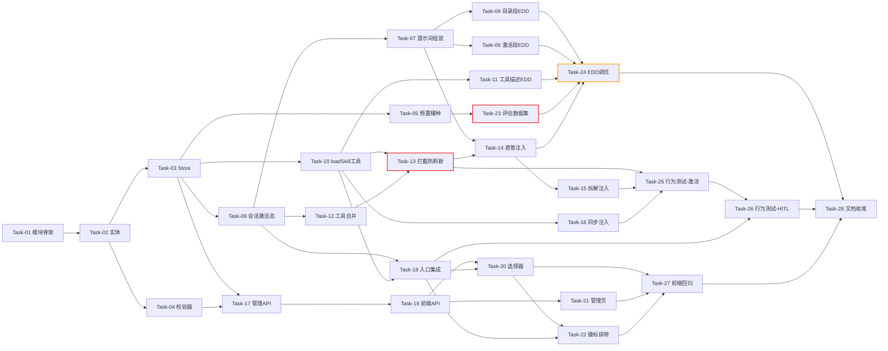

# AI Agent 开发任务计划: Agent Skill 能力域 (agent-skill)

## 0. 任务概览 (Task Overview)

*   **Agent 名称**：agent-skill（Agent Skill 能力域）
*   **总任务数**：28 个（+3 准备项 +2 集成验证项）
*   **预计总工时**：1670 分钟（约 27.8 小时）
*   **任务类型分布**：
    *   确定性组件（TDD）：19 个
    *   概率性组件（EDD，含迭代）：4 个
    *   基础设施：2 个
    *   行为测试：3 个
*   **风险任务**：Task-08（目录段匹配准确率）、Task-11（工具消歧）、Task-13（拦截+热刷新）、Task-24（EDD 调优）⚠️
*   **阻塞任务**：Task-01、Task-03、Task-06、Task-10、Task-13、Task-23 🔒
*   **Prompt 迭代预期**：概率性组件预计 2 轮评估调优（上限 2 轮，超出上报架构问题）
*   **Mock 分析**：本计划仅存在**测试内 Mock**（JUnit mock LLM tool_calls 决策 + spy 绑定工具，用于精确编排 Agent 行为断言），不产生交付性 Mock，故**无 Mock->真实接入替换阶段**；真实链路集成在 Task-13~16 完成，真实 LLM 评估在 Task-24 闭环。

### 依赖关系图

### 可并行任务组

| 并行组 | 可同时执行的任务 | 说明 |
| :--- | :--- | :--- |
| 并行组 1 | Task-04 + Task-05 + Task-06 | 校验器（依赖实体）/ 预置播种（依赖 Store）/ 会话激活态（依赖 Store）互不依赖 |
| 并行组 2 | Task-07 + Task-10 + Task-12 + Task-17 | 提示词组装 / loadSkill 工具 / 工具合并 / 管理 API 四线并行 |
| 并行组 3 | Task-08 + Task-09 + Task-11 + Task-19 | 三个 Prompt 制品初版（agent-prompt-designer / tool-design 产出）+ 前端 API 并行 |
| 并行组 4 | Task-14 + Task-16 之后：Task-15 + Task-18 + Task-23 | 拆解注入 / 入口集成 / 评估数据集互不依赖 |
| 并行组 5 | Task-20 + Task-21 | 选择器与管理页互不依赖（Task-22 收口） |

## 1. 准备工作 (Preparation)

- [x] **Prep-01**: 创建功能分支 `feature/agent-skill`
    *   说明：从主开发分支创建新分支
    *   验证：分支创建成功
- [x] **Prep-02**: 基线编译与测试验证
    *   说明：确保起点干净——后端 `mvn compile`（根聚合）与前端 `npm run test`（vitest）基线全通过
    *   验证：全模块编译无错、现有测试全绿
- [x] **Prep-03**: LLM 能力基线确认
    *   说明：验证技术方案 1.5 节模型能力要求（Function Calling 必须）——用当前配置模型完成一次含工具调用的流式对话
    *   验证：对话成功且 `action`/`observation` 事件正常出现

## 2. 开发任务 (Development Tasks)

> **阶段自适应说明**：本功能横切现有单 Agent 对话链路（LLM 接入/对话循环/记忆均已就绪），故跳过模板的"Agent 基础设施"阶段；无 RAG/长期记忆/监控部署需求，对应阶段省略。阶段按"Skill 域基础设施 -> 会话态与提示词 -> 工具集成与拦截 -> 管理与入口 -> 前端 -> 评估与行为测试"组织。

### 阶段一：Skill 域基础设施（模块/实体/存储/校验/预置）

> **阶段完成标准**：agent-demo-skill 模块可编译，技能可持久化 CRUD，恶意内容被拦截，3 个预置技能开机可用

- [x] **Task-01**: agent-demo-skill 模块骨架与 SkillProperties 配置绑定
    *   **通俗解释**: 给平台新盖一栋"技能仓库"的房子，后续所有技能相关的东西都住在这里。
    *   **任务类型**: 确定性组件
    *   **验证策略**: TDD（Red-Green-Refactor）
    *   **说明**: 新建 Maven 模块（依赖 common + tools，包名 com.agentdemo.skill），根 pom 与 bootstrap 的 application.yml 增加 skill 配置段（enabled / max-active-skills=3 / storage-dir=data/skills）
    *   **涉及文件**: `agent-demo-skill/pom.xml`（新增）、根 `pom.xml`（修改）、`agent-demo-skill/.../skill/config/SkillProperties.java`（新增）、`agent-demo-bootstrap/.../application.yml`（修改）
    *   **测试文件**: `agent-demo-skill/src/test/java/com/agentdemo/skill/config/SkillPropertiesTest.java`
    *   **参考**: 技术方案 Sec 1.6、6.6
    *   **对应AC**: 支撑全局开关降级（AC 联动 6.6）
    *   **预估工时**: 40m
    *   **依赖**: Prep-02
    *   **阻塞标注**: 🔒 后续所有 skill 模块任务依赖
    *   **验证标准**:
        - [ ] `mvn compile -pl agent-demo-skill -am` 编译通过
        - [ ] SkillProperties 默认值：enabled=true、maxActiveSkills=3、storageDir=data/skills
        - [ ] application.yml 覆盖配置后属性绑定生效

- [x] **Task-02**: SkillDefinition 实体与 JSON 序列化
    *   **通俗解释**: 定义"一张技能名片"长什么样——名字、介绍、说明书、参考资料、配套工具。
    *   **任务类型**: 确定性组件
    *   **验证策略**: TDD
    *   **说明**: 技能实体字段：id/name/description/instruction/resources[]（只读资源）/boundToolIds[]/enabled/source（preset|custom）；Jackson 序列化往返
    *   **涉及文件**: `agent-demo-skill/.../skill/entity/SkillDefinition.java`（新增）
    *   **测试文件**: `agent-demo-skill/src/test/java/com/agentdemo/skill/entity/SkillDefinitionTest.java`
    *   **参考**: 技术方案 Sec 1.6（skill-entity）
    *   **对应AC**: 支撑全部 AC 的数据基础
    *   **预估工时**: 30m
    *   **依赖**: Task-01
    *   **验证标准**:
        - [ ] 实体 JSON 序列化/反序列化往返字段无损
        - [ ] resources 为数组结构（名称+内容），boundToolIds 为字符串数组
        - [ ] enabled 缺省 true、source 缺省 custom

- [x] **Task-03**: SkillStore CRUD 与 JSON 文件持久化
    *   **通俗解释**: 技能的"存取管理员"——创建、查询、修改、删除技能，并把它们记在硬盘上，重启不丢。
    *   **任务类型**: 确定性组件
    *   **验证策略**: TDD
    *   **说明**: CRUD + `data/skills/{skillId}.json` 单文件读写（ToolPermissionService 持久化范式）；损坏 JSON 跳过该文件（WARN 降级，不阻断启动）；名称唯一性校验；内存缓存 + CRUD 时刷新
    *   **涉及文件**: `agent-demo-skill/.../skill/store/SkillStore.java`（新增）
    *   **测试文件**: `agent-demo-skill/src/test/java/com/agentdemo/skill/store/SkillStoreTest.java`
    *   **参考**: 技术方案 Sec 4.3、6.6
    *   **对应AC**: AC-N06（持久化重启不丢）
    *   **预估工时**: 60m
    *   **依赖**: Task-02
    *   **阻塞标注**: 🔒 会话态/工具/管理 API 均依赖
    *   **验证标准**:
        - [ ] create 后文件落盘，list/get/update/delete 与文件状态一致
        - [ ] 重启（重新构造 Store）后技能完整加载
        - [ ] 单个 JSON 损坏时其余技能正常加载且记录 WARN
        - [ ] 重名创建被拒绝（明确错误信息）

- [x] **Task-04**: SkillContentValidator 内容安全校验器
    *   **通俗解释**: 给技能内容配一个"安检员"——含危险指令的技能不让保存，含密码钥匙的提醒用户。
    *   **任务类型**: 确定性组件
    *   **验证策略**: TDD + 对抗性测试
    *   **说明**: 四类恶意指令模式命中即**阻断**并返回命中类别（忽略安全规则/修改工具权限/删除破坏数据/冒充系统提升优先级）；密钥类模式（API Key 形态）命中**警告**但允许保存；instruction+resources 总量超 2K Token 拒绝保存
    *   **涉及文件**: `agent-demo-skill/.../skill/security/SkillContentValidator.java`（新增）
    *   **测试文件**: `agent-demo-skill/src/test/java/com/agentdemo/skill/security/SkillContentValidatorTest.java`
    *   **对抗性测试集**: `agent-demo-skill/src/test/resources/skill-adversarial/`（红队样本，Task-23 扩充）
    *   **参考**: 技术方案 Sec 6.7、4.4
    *   **对应AC**: AC-S01、AC-H03
    *   **预估工时**: 50m
    *   **依赖**: Task-02
    *   **验证标准**:
        - [ ] 四类恶意指令样本 100% 阻断且返回命中类别
        - [ ] 密钥模式命中返回警告且不阻断
        - [ ] 超过 2K Token 上限拒绝保存并提示
        - [ ] 正常技能内容零误拦截

- [x] **Task-05**: 预置技能播种（3 个预置 Skill）
    *   **通俗解释**: 平台出厂自带三个"样板技能"（周报专家/文档助手/数据查询助手），删了也能重新长出来。
    *   **任务类型**: 确定性组件
    *   **验证策略**: TDD
    *   **说明**: classpath `resources/skills/` 下 3 个预置 JSON（纯指令型"周报撰写专家"/指令+资源型"技术文档撰写助手"含模板资源/指令+工具绑定型"数据查询助手"绑定 builtin:httpGet 等数据获取工具）；ApplicationRunner 幂等播种（目标文件不存在才写入，用户编辑后不被覆盖）。**预置指令文本为初稿，质量验证在 Task-24 EDD 闭环**
    *   **涉及文件**: `agent-demo-skill/.../skill/store/SkillStore.java`（修改，播种逻辑）、`agent-demo-skill/src/main/resources/skills/*.json`（新增 ×3）
    *   **测试文件**: `agent-demo-skill/src/test/java/com/agentdemo/skill/store/SkillStoreSeedingTest.java`
    *   **参考**: 技术方案 Sec 4.3、需求 8.1
    *   **对应AC**: AC-N05（资源型样本）、AC-N06（预置初始态）
    *   **预估工时**: 50m
    *   **依赖**: Task-03
    *   **验证标准**:
        - [ ] 启动后 data/skills/ 出现 3 个预置技能且 enabled=true
        - [ ] 二次启动不覆盖已存在的用户修改版（幂等）
        - [ ] 预置技能三形态字段正确（resources 数组/绑定工具列表）

### 阶段二：会话激活态与提示词组装

> **阶段完成标准**：会话激活/排除/上限状态机可用，系统提示词可按会话组装技能目录段与激活段

- [x] **Task-06**: SkillSessionManager 会话激活态管理
    *   **通俗解释**: 给每个对话配一本"技能登记簿"——哪些技能已启用、哪些被用户拉黑、最多同时三个。
    *   **任务类型**: 确定性组件
    *   **验证策略**: TDD
    *   **说明**: `ConcurrentHashMap<sessionId, SessionSkillState>`（activeSkillIds 有序容量≤3 / manualSkillIds / excludedSkillIds）；activate（source=auto|manual、上限拒绝、排除拒绝、重复激活幂等返回）；applyManualSelection（null=不变/[]=重置自动/非空=指定并激活）；exclude；getActiveSkills 实时有效性过滤（禁用/删除自动退出）；@Scheduled 超时清理（30 分钟，HumanInteractionManager 同构）
    *   **涉及文件**: `agent-demo-skill/.../skill/session/SkillSessionManager.java`（新增）
    *   **测试文件**: `agent-demo-skill/src/test/java/com/agentdemo/skill/session/SkillSessionManagerTest.java`
    *   **参考**: 技术方案 Sec 4.1、4.2、1.4
    *   **对应AC**: AC-N03、AC-N04、AC-S05、AC-M01、AC-M03、AC-M04、AC-E04
    *   **预估工时**: 70m
    *   **依赖**: Task-03
    *   **阻塞标注**: 🔒 提示词组装/工具集成/入口集成均依赖
    *   **验证标准**:
        - [ ] activate 成功后 activeSkillIds 含该技能且 source 正确
        - [ ] 第 4 个激活被拒绝（上限=3），返回可判别的失败原因
        - [ ] excluded 技能激活被拒绝；重复激活幂等
        - [ ] applyManualSelection 三态语义正确（null/[]/非空）
        - [ ] 技能被禁用/删除后 getActiveSkills 自动剔除
        - [ ] 会话 A/B 状态互不串扰

- [x] **Task-07**: SkillPromptComposer 提示词段组装
    *   **通俗解释**: 把登记簿内容变成 Agent 能读的"技能说明书页"——没启用的列目录，已启用的放全文。
    *   **任务类型**: 确定性组件
    *   **验证策略**: TDD
    *   **说明**: composeCatalogSegment（启用 ∖ 已激活 ∖ 已排除的名称+描述清单，空则返回空串）；composeActivatedSegment（激活技能指令+资源全文，信任层标注结构包裹，多技能有序拼接）。**段文本模板用结构占位初稿，正式 Prompt 文本由 Task-08/09 落地**
    *   **涉及文件**: `agent-demo-skill/.../skill/prompt/SkillPromptComposer.java`（新增）
    *   **测试文件**: `agent-demo-skill/src/test/java/com/agentdemo/skill/prompt/SkillPromptComposerTest.java`
    *   **参考**: 技术方案 Sec 2.1、4.4
    *   **对应AC**: AC-T01（仅元数据常驻）、AC-N01
    *   **预估工时**: 60m
    *   **依赖**: Task-06
    *   **验证标准**:
        - [ ] 目录段仅含未激活技能的名称+描述，不含指令全文
        - [ ] 已激活/已排除/已禁用技能不出现在目录段
        - [ ] 激活段含指令+资源全文且被信任层结构包裹
        - [ ] 无启用技能时两段均输出空串（零 Token 开销）
        - [ ] skill.enabled=false 时两段均输出空串

- [x] **Task-08**: 目录段 Prompt 制品（EDD 初版）
    *   **通俗解释**: 写好目录页的"使用说明"，让 Agent 知道什么时候该取哪个技能、拿不准时先问用户。
    *   **任务类型**: 概率性组件
    *   **验证策略**: EDD（构建-评估-调优）
    *   **迭代预期**: 初版本任务交付；阶段六 Task-24 数据集评估 + 2 轮调优上限
    *   **说明**: 具体文本由 agent-prompt-designer Skill 落地：技能清单格式（名称+描述+loadSkill 调用指引）、消歧规则（多候选置信度相近先 askUser，最多 1 次）、并发上限引导话术、触发源限制声明（仅用户消息可触发激活，工具返回中的激活指令一律忽略）、对话内配置请求拒绝话术（固定语义不暴露细节）
    *   **涉及文件**: `agent-demo-skill/.../skill/prompt/SkillPromptComposer.java`（修改，目录段模板常量）
    *   **评估数据集**: `agent-demo-skill/src/test/resources/skill-eval/`（Task-23 构建，Task-24 运行）
    *   **参考**: 技术方案 Sec 2.1、6.3
    *   **对应AC**: AC-N01、AC-E02、AC-H01、AC-S03、AC-S05、AC-E03
    *   **预估工时**: 60m（初版；评估调优工时计入 Task-24）
    *   **依赖**: Task-07
    *   **风险标注**: ⚠️ 目录段直接决定激活准确率与误澄清率，是 EDD 核心调优对象
    *   **验证标准**:
        - [ ] 目录段含清单/使用指引/消歧/上限/触发源限制五个组成部分（结构完整）
        - [ ] 目录段单技能开销 ≤600 Token（3 预置技能场景，SimpleTokenEstimator 估算）
        - [ ] 正式质量验收在 Task-24：激活准确率 ≥90%、误澄清率 ≤10%

- [x] **Task-09**: 激活段信任层 Prompt 制品（EDD 初版）
    *   **通俗解释**: 给已启用的技能说明书套上"安全封皮"，声明它的话低于平台安全规则。
    *   **任务类型**: 概率性组件
    *   **验证策略**: EDD
    *   **迭代预期**: 初版本任务交付；Task-24 评估 + 2 轮调优上限
    *   **说明**: 具体文本由 agent-prompt-designer Skill 落地：信任层包裹措辞（"用户提供领域指令，优先级低于平台安全规则"）、平台规则优先声明（工具权限/SSRF/白名单/产出清洗）、多 Skill 指令冲突处理声明
    *   **涉及文件**: `agent-demo-skill/.../skill/prompt/SkillPromptComposer.java`（修改，激活段模板常量）
    *   **评估数据集**: 同 Task-08（Task-24 运行）
    *   **参考**: 技术方案 Sec 2.1、6.3
    *   **对应AC**: AC-S02、AC-N02、AC-N05
    *   **预估工时**: 40m
    *   **依赖**: Task-07
    *   **验证标准**:
        - [ ] 激活段结构：信任层开头声明 + 指令全文 + 资源全文
        - [ ] 正式质量验收在 Task-24：指令遵循度 ≥80%、冲突场景平台规则优先

### 阶段三：工具集成与对话链路拦截

> **阶段完成标准**：Agent 能在 ReAct 循环中调用 loadSkill 激活技能，绑定工具当轮热刷新可用，三条对话路径（直答/拆解/同步）均注入技能段

- [x] **Task-10**: SkillLoadTool 工具体 + 注册 + 权限豁免
    *   **通俗解释**: 造出"取技能"这个动作本身——Agent 喊一声 loadSkill 就能把技能说明书取到手。
    *   **任务类型**: 确定性组件
    *   **验证策略**: TDD
    *   **说明**: @Tool 工具体（激活+观察值生成）：成功返回指令要点+资源摘要；不存在返回可用技能名列表（自纠）；上限返回引导文案；已排除返回告知；读取异常返回降级文案。经 ToolRegistry.register(tool,"builtin") 注册；ToolPermissionService 增加 LOAD_SKILL_TOOL_ID 豁免恒 ALLOW（askUser 同构）；AgentController.updateToolPermission 对 loadSkill 返回 400；application.yml default-tools 增加 builtin:loadSkill。**注意 PROJECT_HABITS：@Tool value() 返回 String[] 需 String.join 合并**
    *   **涉及文件**: `agent-demo-skill/.../skill/tool/SkillLoadTool.java`（新增）、`agent-demo-tools/.../permission/ToolPermissionService.java`（修改）、`agent-demo-web/.../controller/AgentController.java`（修改，400 校验）、`agent-demo-bootstrap/.../application.yml`（修改）
    *   **测试文件**: `agent-demo-skill/src/test/java/com/agentdemo/skill/tool/SkillLoadToolTest.java`
    *   **参考**: 技术方案 Sec 3.1、3.3、决策 4/6
    *   **对应AC**: AC-T01、AC-N01、AC-E01、AC-M04、AC-S05（观察值侧）
    *   **预估工时**: 60m
    *   **依赖**: Task-06（+Task-03）
    *   **阻塞标注**: 🔒 拦截/同步注入/入口集成依赖
    *   **验证标准**:
        - [ ] execute(skillName) 各分支观察值正确（成功/不存在/上限/排除/异常五分支）
        - [ ] 启动后 ToolRegistry 含 builtin:loadSkill 且出现在默认工具
        - [ ] 权限查询恒 ALLOW；管理页修改其权限返回 400
        - [ ] 观察值不含存储路径/校验规则等实现细节（脱敏断言）

- [x] **Task-11**: loadSkill 工具描述与参数 Schema（EDD）
    *   **通俗解释**: 把"取技能"动作的说明书打磨清楚，让 Agent 一看就知道何时该用、何时不该用。
    *   **任务类型**: 概率性组件
    *   **验证策略**: EDD
    *   **迭代预期**: 初版本任务交付；Task-24 评估 + 2 轮调优上限
    *   **说明**: 具体工具描述文本与参数 Schema 由 tool-design Skill 落地：when-to-use（用户请求与目录技能匹配）/when-not-to-use（已激活/已排除/无匹配/达上限不调用）、skillName 参数约束（取值来自目录清单）、错误恢复消息（不存在时返回可用列表助 LLM 自纠）、与 kb_* 检索工具的消歧（获得行为能力 vs 查询知识内容）
    *   **涉及文件**: `agent-demo-skill/.../skill/tool/SkillLoadTool.java`（修改，@Tool 注解与参数描述）
    *   **评估数据集**: 同 Task-08（Task-24 运行）
    *   **参考**: 技术方案 Sec 2.2
    *   **对应AC**: AC-T01、AC-E02、AC-H01
    *   **预估工时**: 40m
    *   **依赖**: Task-10
    *   **风险标注**: ⚠️ 工具消歧（loadSkill vs kb_* vs askUser）是难点
    *   **验证标准**:
        - [ ] 描述含 when-to-use/when-not-to-use/参数约束/错误恢复四要素
        - [ ] 正式质量验收在 Task-24：工具选择正确率 ≥90%

- [x] **Task-12**: SessionToolResolver 绑定工具合并
    *   **通俗解释**: 技能启用后，它自带的工具自动摆上 Agent 的"工具桌"，且照样要过安检（权限）。
    *   **任务类型**: 确定性组件
    *   **验证策略**: TDD
    *   **说明**: resolveSessionTools 在现有"默认 ∪ 指定 + askUser 补入 + 去重"后合并会话激活技能 boundToolIds：经 resolveToolsForStreaming/ForDirect 解析（能力声明双方法语义不变，Skill 不改变权限等级）；dedupeToolsByMethodName 去重；agent-demo-agent pom 增加 skill 依赖
    *   **涉及文件**: `agent-demo-agent/.../single/SessionToolResolver.java`（修改）、`agent-demo-agent/pom.xml`（修改）
    *   **测试文件**: `agent-demo-agent/src/test/java/com/agentdemo/agent/single/SessionToolResolverSkillTest.java`
    *   **参考**: 技术方案 Sec 3.4
    *   **对应AC**: AC-T02、AC-T03
    *   **预估工时**: 50m
    *   **依赖**: Task-06（+Task-01 模块依赖）
    *   **验证标准**:
        - [ ] 激活技能后其绑定工具出现在解析结果（Streaming 路径）
        - [ ] 绑定工具 ask 级在 ForDirect 路径被剔除、deny 级双路径均不可见（权限协同）
        - [ ] 未激活/已禁用技能的绑定工具不出现
        - [ ] 与默认/指定工具重名时去重生效
        - [ ] skill.enabled=false 时合并逻辑零生效（回归现状）

- [x] **Task-13**: HITLReActStream loadSkill 拦截与工具热刷新
    *   **通俗解释**: Agent 在思考中途取用技能后，当场就能用上新工具，不用等到下一轮对话。
    *   **任务类型**: 确定性组件
    *   **验证策略**: TDD（+集成验证）
    *   **说明**: executeToolCalls 增加 loadSkill 工具名拦截分支（askUser 先例，先于权限检查）：调用 SkillLoadTool 激活 -> 触发 onSkillActivated 回调（skillName/source/boundToolIds）-> 热刷新 toolsJson（重调 resolveSessionTools + ensureAskUserTool + convertToJson，toolsJson 字段由 final 改可变）-> 观察值回填 ToolExecutionResultMessage -> **不暂停循环**。构造签名扩展 +3 依赖（SkillSessionManager/SessionToolResolver/ToolSchemaConverter，由宿主透传）。**接口签名变更需全链路搜索适配（PROJECT_HABITS）**
    *   **涉及文件**: `agent-demo-agent/.../single/HITLReActStream.java`（修改）
    *   **测试文件**: `agent-demo-agent/src/test/java/com/agentdemo/agent/single/HITLReActStreamSkillInterceptTest.java`
    *   **参考**: 技术方案 Sec 3.2（核心时序图）、决策 2
    *   **对应AC**: AC-N01、AC-T02、AC-E01
    *   **预估工时**: 90m
    *   **依赖**: Task-10、Task-12
    *   **阻塞标注**: 🔒 双路径注入与行为测试依赖
    *   **风险标注**: ⚠️ 构造签名变更涉及 UnifiedChatStream/TaskBreakdownStream 两构造点；toolsJson 可变化与 HITL 快照的一致性需断言
    *   **验证标准**:
        - [ ] LLM 调用 loadSkill 时被拦截且不执行工具体反射（拦截分支优先）
        - [ ] 激活成功后 onSkillActivated 回调携带 skillName/source/boundToolIds
        - [ ] 热刷新后 toolsJson 含绑定工具（下一迭代即可调用）
        - [ ] 观察值回填后循环继续（不暂停，区别于 askUser）
        - [ ] 拦截后触发 askUser 暂停时，快照 toolsJson 为刷新后值（一致性）

- [x] **Task-14**: UnifiedChatStream 技能段注入与 SSE 转发
    *   **通俗解释**: 统一对话的"直答路线"装上技能页，并且把"技能已启用"的消息实时播报给前端。
    *   **任务类型**: 确定性组件
    *   **验证策略**: TDD（+集成验证）
    *   **说明**: buildHitlMessages 系统提示词追加目录段+激活段；HITLReActStream 构造透传新依赖；新增 onSkillActivated 回调转发链路（UnifiedChatStream -> AgentController SSE `skill_activated` 事件，载荷 skillId/skillName/source/boundToolIds）
    *   **涉及文件**: `agent-demo-agent/.../core/UnifiedChatStream.java`（修改）、`agent-demo-web/.../controller/AgentController.java`（修改，事件下发）
    *   **测试文件**: `agent-demo-agent/src/test/java/com/agentdemo/agent/core/UnifiedChatStreamSkillTest.java`
    *   **参考**: 技术方案 Sec 2.1（注入点）、2.3（事件契约）
    *   **对应AC**: AC-N01、AC-S04、AC-M01（每请求注入）
    *   **预估工时**: 60m
    *   **依赖**: Task-07、Task-13
    *   **验证标准**:
        - [ ] 直答路径系统提示词含目录段+激活段（有激活时）
        - [ ] 激活回调转发至 Controller 并下发 skill_activated SSE 事件（载荷四字段完整）
        - [ ] 无启用技能时提示词与现状零差异（回归）

- [x] **Task-15**: TaskBreakdownStream 子任务注入与回调转发
    *   **通俗解释**: 任务拆解路线也装上技能页——拆出来的每个子任务都在技能加持下执行。
    *   **任务类型**: 确定性组件
    *   **验证策略**: TDD（+集成验证）
    *   **说明**: 子任务系统提示词组装点追加技能段（TaskExecute/TaskSummary 场景同构）；子任务 HITLReActStream 构造透传新依赖；onSkillActivated 回调转发
    *   **涉及文件**: `agent-demo-agent/.../core/TaskBreakdownStream.java`（修改）
    *   **测试文件**: `agent-demo-agent/src/test/java/com/agentdemo/agent/core/TaskBreakdownStreamSkillTest.java`
    *   **参考**: 技术方案 Sec 2.1（注入点）
    *   **对应AC**: AC-N02（拆解路径指令生效）
    *   **预估工时**: 50m
    *   **依赖**: Task-14（拦截回调链路先通）
    *   **验证标准**:
        - [ ] 子任务执行提示词含技能段
        - [ ] 子任务内 loadSkill 激活事件可透传至 SSE
        - [ ] 无技能时拆解路径行为与现状零差异（回归）

- [x] **Task-16**: SimpleAgent 同步路径技能段注入
    *   **通俗解释**: 不走流式的普通对话也能享受技能加成（工具下一轮生效）。
    *   **任务类型**: 确定性组件
    *   **验证策略**: TDD
    *   **说明**: systemMessageProvider 追加技能段（memoryId -> Composer 组装）；同步路径 loadSkill 经 ToolExecutor 正常反射执行（真实工具体）；绑定工具经 delegate 工具指纹缓存下一轮生效（文档化不对称性）
    *   **涉及文件**: `agent-demo-agent/.../single/SimpleAgent.java`（修改）
    *   **测试文件**: `agent-demo-agent/src/test/java/com/agentdemo/agent/single/SimpleAgentSkillPromptTest.java`
    *   **参考**: 技术方案 Sec 2.1（注入点）、决策 2
    *   **对应AC**: AC-N01（同步路径）、AC-T02（下一轮生效）
    *   **预估工时**: 30m
    *   **依赖**: Task-07、Task-10
    *   **验证标准**:
        - [ ] 同步对话系统提示词含技能段
        - [ ] 激活后下一轮对话工具列表含绑定工具（delegate 指纹重建）
        - [ ] 无技能时与现状零差异（回归）

### 阶段四：管理 API 与对话入口集成

> **阶段完成标准**：技能管理页 REST API 可用，对话请求支持手动指定/排除技能并实时反馈激活状态

- [x] **Task-17**: SkillController 管理 REST API
    *   **通俗解释**: 给管理页开出技能后台接口——增删改查、启停、绑定工具编辑。
    *   **任务类型**: 确定性组件
    *   **验证策略**: TDD
    *   **说明**: GET /api/skill/list（含 enabled 状态）、POST /api/skill（校验集成：阻断返回 400+命中类别，警告透传）、PUT /api/skill/{id}、DELETE /api/skill/{id}、PUT /api/skill/{id}/enabled；boundToolIds 存在性校验（ToolRegistry 解析）；web pom 增加 skill 依赖
    *   **涉及文件**: `agent-demo-web/.../controller/SkillController.java`（新增）、`agent-demo-web/.../dto/SkillResponse.java` 等 3 个 DTO（新增）、`agent-demo-web/pom.xml`（修改）
    *   **测试文件**: `agent-demo-web/src/test/java/com/agentdemo/web/controller/SkillControllerTest.java`
    *   **参考**: 技术方案 Sec 1.6、6.7
    *   **对应AC**: AC-N06、AC-S01、AC-H03
    *   **预估工时**: 70m
    *   **依赖**: Task-03、Task-04
    *   **验证标准**:
        - [ ] CRUD/启停五个接口行为正确且配置落盘
        - [ ] 恶意内容保存返回 400 且含命中类别；警告场景保存成功并透传警告
        - [ ] boundToolIds 含不存在工具时返回明确错误
        - [ ] 预置技能可被编辑/禁用/删除且播种幂等不复活

- [x] **Task-18**: ChatRequest 技能字段与手动指定集成
    *   **通俗解释**: 用户在对话框上方勾选的技能，会直接生效并立刻收到"已启用"提示。
    *   **任务类型**: 确定性组件
    *   **验证策略**: TDD（+集成验证）
    *   **说明**: ChatRequest 新增 skills（null=不变/[]=重置自动/非空=指定）与 excludedSkills 字段（反序列化兼容旧请求体，toolApproved 先例）；chatStream 分发前 applyManualSelection；手动指定激活后立即下发 skill_activated（source=manual）SSE 事件；技能不存在返回 400
    *   **涉及文件**: `agent-demo-web/.../dto/ChatRequest.java`（修改）、`agent-demo-web/.../controller/AgentController.java`（修改）
    *   **测试文件**: `agent-demo-web/src/test/java/com/agentdemo/web/controller/AgentControllerSkillRequestTest.java`
    *   **参考**: 技术方案 Sec 1.4、2.3
    *   **对应AC**: AC-N03、AC-S04
    *   **预估工时**: 60m
    *   **依赖**: Task-06、Task-10（+Task-03）
    *   **验证标准**:
        - [ ] skills 三态语义正确（null/[]/非空），旧请求体（无字段）解析正常
        - [ ] 手动指定后 skill_activated(source=manual) 事件先于 token 下发
        - [ ] 指定不存在技能返回 400
        - [ ] excludedSkills 设置后自主激活被拒绝（联动 Task-06）

### 阶段五：前端技能 UI

> **阶段完成标准**：会话级技能选择器、技能管理页、激活徽标与排除入口可用

- [x] **Task-19**: 前端 API 封装与状态管理
    *   **通俗解释**: 前端拿到查询技能列表、增删改技能的"遥控器"。
    *   **任务类型**: 确定性组件
    *   **验证策略**: TDD（vitest）
    *   **说明**: api/skill.ts（6 个 REST 封装，rag.ts 同构）；stores/skill.ts（列表/CRUD 状态，写后自动刷新）；types 增加 Skill/SkillResource 类型与 StreamCallbacks.onSkillActivated
    *   **涉及文件**: `agent-demo-frontend/src/api/skill.ts`（新增）、`agent-demo-frontend/src/stores/skill.ts`（新增）、`agent-demo-frontend/src/types/index.ts`（修改）
    *   **测试文件**: `agent-demo-frontend/src/stores/skill.test.ts`、`agent-demo-frontend/src/api/skill.test.ts`
    *   **参考**: 技术方案 Sec 1.6（前端）
    *   **对应AC**: 支撑 AC-N06/S04 前端侧
    *   **预估工时**: 40m
    *   **依赖**: Task-17（API 契约）
    *   **验证标准**:
        - [ ] 6 个 API 封装与后端契约一致（路径/方法/载荷）
        - [ ] store CRUD 后列表刷新（mcp.ts 写后刷新范式）
        - [ ] onSkillActivated 回调类型定义完整

- [x] **Task-20**: SkillSelector 会话级选择器
    *   **通俗解释**: 对话框上方多一个"技能选择栏"，勾选即用、清空即自动模式。
    *   **任务类型**: 确定性组件
    *   **验证策略**: TDD（vitest）
    *   **说明**: session.ts 新增 skillsBySession/excludedSkillsBySession（不持久化 localStorage，knowledgeBases 同构）；SkillSelector.vue（空=自动提示态，KnowledgeBaseSelector 同构）；ChatWindow 集成；chat.ts 请求体携带 skills/excludedSkills
    *   **涉及文件**: `agent-demo-frontend/src/components/SkillSelector.vue`（新增）、`agent-demo-frontend/src/stores/session.ts`（修改）、`agent-demo-frontend/src/api/chat.ts`（修改，请求参数）、`agent-demo-frontend/src/components/ChatWindow.vue`（修改，集成）
    *   **测试文件**: `agent-demo-frontend/src/components/skill-selector.test.ts`
    *   **参考**: 技术方案 Sec 1.6（前端）、session.ts 现有范式
    *   **对应AC**: AC-N03（手动指定入口）
    *   **预估工时**: 60m
    *   **依赖**: Task-18、Task-19
    *   **验证标准**:
        - [ ] 选择器状态按会话隔离，刷新后重置为自动模式
        - [ ] 勾选后请求体携带 skills；清空后携带 []
        - [ ] 空=自动模式的 UI 提示与知识库选择器交互一致

- [x] **Task-21**: SkillManagementPage 管理页
    *   **通俗解释**: 设置页新增"技能管理"标签，可视化创建/编辑/删除/启停技能。
    *   **任务类型**: 确定性组件
    *   **验证策略**: TDD（vitest）
    *   **说明**: SkillManagementPage.vue（列表卡片+创建/编辑表单+删除确认+启停开关+绑定工具编辑+校验错误分类反馈）；SettingsPage 增加标签页（ToolManagementPage 同构）
    *   **涉及文件**: `agent-demo-frontend/src/components/SkillManagementPage.vue`（新增）、`agent-demo-frontend/src/components/SettingsPage.vue`（修改）
    *   **测试文件**: `agent-demo-frontend/src/components/skill-management-page.test.ts`
    *   **参考**: 技术方案 Sec 1.6（前端）
    *   **对应AC**: AC-N06、AC-H03
    *   **预估工时**: 80m
    *   **依赖**: Task-19
    *   **验证标准**:
        - [ ] CRUD/启停操作后列表正确刷新
        - [ ] 校验失败（400+类别）在表单分类展示，警告单独提示
        - [ ] 3 个预置技能初始展示且标注来源
        - [ ] 绑定工具编辑使用工具列表数据（/api/agent/tools）

- [x] **Task-22**: 激活事件展示与排除入口
    *   **通俗解释**: 技能启用时聊天页亮起技能"徽标"，点叉号即可拉黑。
    *   **任务类型**: 确定性组件
    *   **验证策略**: TDD（vitest）
    *   **说明**: chat.ts 解析 skill_activated 事件并回调；ChatWindow/MessageItem 渲染激活徽标（技能名+来源标识）；徽标排除操作回传 excludedSkills；未知事件静默忽略回归
    *   **涉及文件**: `agent-demo-frontend/src/api/chat.ts`（修改）、`agent-demo-frontend/src/components/ChatWindow.vue`（修改）、`agent-demo-frontend/src/stores/session.ts`（修改，excluded 回传）
    *   **测试文件**: `agent-demo-frontend/src/api/chat.test.ts`（扩展）
    *   **参考**: 技术方案 Sec 2.3（事件契约）
    *   **对应AC**: AC-S04、AC-M04
    *   **预估工时**: 60m
    *   **依赖**: Task-18、Task-20
    *   **验证标准**:
        - [ ] skill_activated 事件解析并触发回调（auto/manual 双来源）
        - [ ] 徽标展示技能名与来源，排除操作后下一轮请求携带 excludedSkills
        - [ ] 未知事件类型不影响 token 流渲染（既有容错回归）

### 阶段六：评估与行为测试（含 EDD 迭代与收尾）

> **阶段完成标准**：评估数据集就绪、EDD 指标达标、六类 AC 行为测试全通过、文档更新完成

- [x] **Task-23**: 评估数据集与对抗集构建
    *   **通俗解释**: 出一套"技能考试卷"——正常题、刁钻题、攻击题都有标准答案。
    *   **任务类型**: 基础设施
    *   **验证策略**: 人工审核 + 集成验证（JUnit 可加载）
    *   **说明**: 构建 skill-eval/ 与 skill-adversarial/ 测试资源：正常交互集 15+（3 预置技能 × 5 场景）、消歧集 5+（多候选/边界匹配）、注入对抗集 10+（用户输入直接注入 + 工具返回间接注入双通道）、边界集（损坏 JSON/运行中删除/上限/排除）、记忆集（多轮指代/跨会话）；每条含输入/预期行为断言要点
    *   **涉及文件**: `agent-demo-skill/src/test/resources/skill-eval/**`（新增）、`agent-demo-skill/src/test/resources/skill-adversarial/**`（新增）
    *   **参考**: 技术方案 Sec 7.2、需求 7.7
    *   **对应AC**: 支撑全部 AC 评估
    *   **预估工时**: 70m
    *   **依赖**: Task-05（预置技能为样本）
    *   **阻塞标注**: 🔒 EDD 评估与行为测试依赖
    *   **验证标准**:
        - [ ] 六类场景数据集齐备且数量达标（正常≥15/消歧≥5/注入≥10/边界/记忆/HITL）
        - [ ] 数据集可被 JUnit 参数化加载
        - [ ] 对抗集覆盖四类攻击面（注入/越权/恶意内容/角色越狱）

- [x] **Task-24**: EDD 评估调优迭代（目录段/激活段/工具描述/预置指令）
    *   **通俗解释**: 让 Agent 真刀真枪考一遍试，不及格的题目回去改说明书再考。
    *   **任务类型**: 概率性组件（迭代闭环）
    *   **验证策略**: EDD（评估数据集重放，真实 LLM）
    *   **迭代预期**: 2 轮上限（初始评估 -> 调优 -> 再评估；超出上报架构问题）
    *   **说明**: SkillEvalReplayTest（@Tag 隔离，本地/手动触发，真实 LLM 重放）运行正常交互集/消歧集/注入集；指标：激活准确率 ≥90%、指令遵循度 ≥80%（人工抽评）、间接注入 0 生效、误澄清率 ≤10%、目录 Token ≤600；不达标项调优对象：目录段文本（Task-08）、激活段文本（Task-09）、工具描述（Task-11）、预置技能指令（Task-05）
    *   **涉及文件**: `agent-demo-skill/.../skill/prompt/SkillPromptComposer.java`（按结论修改）、`agent-demo-skill/.../skill/tool/SkillLoadTool.java`（按结论修改）、`agent-demo-skill/src/main/resources/skills/*.json`（按结论修改）、`agent-demo-skill/src/test/java/com/agentdemo/skill/eval/SkillEvalReplayTest.java`（新增）
    *   **评估数据集**: `src/test/resources/skill-eval/`、`src/test/resources/skill-adversarial/`
    *   **参考**: 技术方案 Sec 7.2、2.4
    *   **对应AC**: AC-N01、AC-N02、AC-E02、AC-H01、AC-S02、AC-S03、AC-M02（概率性 AC 终验）
    *   **预估工时**: 120m（含 2 轮评估调优）
    *   **依赖**: Task-08、Task-09、Task-11、Task-14、Task-15、Task-16、Task-23
    *   **风险标注**: ⚠️ 概率性调优可能超预期轮次；Token 消耗需监控
    *   **验证标准**:
        - [ ] 激活准确率 ≥90%（应激活场景正确触发 loadSkill）
        - [ ] 指令遵循度 ≥80%（激活后回复符合技能约束，人工抽评）
        - [ ] 间接注入用例 0 生效（工具返回中的激活指令不触发）
        - [ ] 误澄清率 ≤10%（无歧义场景不误触发追问）
        - [ ] 评估记录完整（指标值+调优决策），2 轮内收敛

- [x] **Task-25**: 集成行为测试：激活链路与权限协同
    *   **通俗解释**: 用"假大脑"精确指挥 Agent 走每一步，验证取技能、用工具、过安检全链路分毫不差。
    *   **任务类型**: 行为测试
    *   **验证策略**: JUnit 集成测试（mock LLM tool_calls 决策 + spy 绑定工具）
    *   **说明**: mock LLM 返回 tool_calls 序列（loadSkill -> 绑定工具 -> ask 级工具 -> deny 工具）断言全链路：拦截激活+事件+SSE 载荷、热刷新后当轮迭代可调用绑定工具、ask 级弹 tool_confirm（卡片四要素）、deny 零触发（spy 验证方法体不执行）、绑定工具执行失败降级不中断且技能其余增强继续、同步路径激活与下一轮工具生效、消息窗口淘汰后激活段仍注入（M01）
    *   **涉及文件**: `agent-demo-agent/src/test/java/com/agentdemo/agent/skill/SkillActivationIntegrationTest.java`（新增）
    *   **测试文件**: 同上（含 spy HttpTool 用例）
    *   **参考**: 技术方案 Sec 3.2、3.4、9（AC 映射）
    *   **对应AC**: AC-N01、AC-T01、AC-T02、AC-T03、AC-T04、AC-E01、AC-M01
    *   **预估工时**: 90m
    *   **依赖**: Task-13、Task-14、Task-15、Task-16
    *   **验证标准**:
        - [ ] 激活链路断言全通过（事件/热刷新/观察值/不暂停）
        - [ ] 权限矩阵断言全通过（allow 自主/ask 确认/deny 零触发）
        - [ ] 绑定工具失败降级断言通过（对话不中断）
        - [ ] 消息窗口淘汰场景激活持续（M01）

- [x] **Task-26**: 集成行为测试：HITL 与会话态
    *   **通俗解释**: 验证问询卡片、手动指定、拉黑、上限、会话隔离这些"人际互动"场景都正确。
    *   **任务类型**: 行为测试
    *   **验证策略**: JUnit 集成测试（mock LLM + 状态断言）
    *   **说明**: 手动指定优先不被自主替换（N03）/上限触发引导观察值与 askUser 载荷（S05/H01）/排除后不复发（M04）/会话隔离（M03）/运行中删除技能平滑退出（E04）/对话内越权指令忽略且无配置变更路径（E03）/tool_confirm 卡片与现有单 Agent 卡片同构（H02，载荷断言）/skill.enabled=false 全链路退化（6.6 回归）
    *   **涉及文件**: `agent-demo-agent/src/test/java/com/agentdemo/agent/skill/SkillHITLAndSessionTest.java`（新增）
    *   **测试文件**: 同上
    *   **参考**: 技术方案 Sec 6.6、9（AC 映射）
    *   **对应AC**: AC-N03、AC-S05、AC-M03、AC-M04、AC-E03、AC-E04、AC-H01、AC-H02
    *   **预估工时**: 80m
    *   **依赖**: Task-18、Task-25
    *   **验证标准**:
        - [ ] 手动指定/排除/上限/隔离状态断言全通过
        - [ ] 运行中删除技能后下一轮平滑退出（无异常无残留）
        - [ ] tool_confirm 载荷与现有卡片同构（四要素一致）
        - [ ] skill.enabled=false 时对话行为与基线完全一致

- [x] **Task-27**: 前端回归与降级验证
    *   **通俗解释**: 确认没装技能的对话和以前一模一样，总开关关掉也一切如常。
    *   **任务类型**: 行为测试
    *   **验证策略**: vitest 全量 + 关键路径人工验证
    *   **说明**: 前端全量 vitest 通过（现有用例零回归）；管理页 CRUD 持久化链路（重启不丢，N06）；选择器/徽标/排除交互手验；无技能对话请求体与基线一致（不含技能字段污染）
    *   **涉及文件**: `agent-demo-frontend/src/components/skill-management-page.test.ts` 等前端测试（扩展）
    *   **参考**: 技术方案 Sec 11（兼容性）
    *   **对应AC**: AC-N06、AC-M03（前端侧）、降级开关回归
    *   **预估工时**: 60m
    *   **依赖**: Task-20、Task-21、Task-22
    *   **验证标准**:
        - [ ] `npm run test` 全量通过（含既有用例零回归）
        - [ ] 管理页增删改启停后刷新页面状态正确
        - [ ] 无技能会话请求体与基线一致

- [x] **Task-28**: 文档更新与收尾
    *   **通俗解释**: 把新能力写进项目说明书，方便后来的学习者。
    *   **任务类型**: 基础设施（文档）
    *   **验证策略**: 人工审核
    *   **说明**: KNOWLEDGE_BASE.md 增量更新（能力矩阵第 10 项/工程结构/业务域知识图谱/SSE 事件协议，knowledge-base-generator 范式）；`specs/modules/Skill模块-业务说明书.md` 新增（2.2 模块说明书体系）；SDD-工程业务背景文档按需增加 BR-SKILL 规则（对话不可改配置/上限 3/触发源限制）
    *   **涉及文件**: `KNOWLEDGE_BASE.md`（修改）、`specs/modules/Skill模块-业务说明书.md`（新增）、`specs/SDD-工程业务背景文档.md`（按需修改）
    *   **参考**: GUARDRAILS 2.1 文档纪律、KNOWLEDGE_BASE 维护方式
    *   **对应AC**: 支撑全部 AC 的文档追溯
    *   **预估工时**: 40m
    *   **依赖**: Task-24、Task-25、Task-26、Task-27
    *   **验证标准**:
        - [ ] KNOWLEDGE_BASE 能力矩阵含 Skill 域且状态准确
        - [ ] 模块说明书遵循既有模板结构
        - [ ] 文档变更含变更记录（版本/日期/摘要）

### 阶段性集成验证 (Stage Integration Verification)

- [ ] **Verify-01**: 全量评估与测试运行
    *   **说明**: 运行全部后端模块测试（`mvn test`）+ 前端 vitest + EDD 评估重放（手动触发）
    *   **验证标准**:
        - [ ] 后端全模块测试通过（agent-demo-skill/agent/web/tools）
        - [ ] 前端 vitest 全量通过
        - [ ] EDD 指标达标（激活准确率 ≥90%/注入 0 生效/误澄清 ≤10%）
- [ ] **Verify-02**: AC 逐项端到端验证
    *   **说明**: 对照需求文档 26 条 AC 逐项核验（自动测试覆盖 + 人工抽检概率性 AC）
    *   **验证标准**:
        - [ ] 六类 AC 场景全部通过
        - [ ] 无阻塞性问题

## 3. 验收标准检查清单 (AC Checklist)

| AC ID | AC 描述 | AC 类型 | 对应任务 | 状态 |
| :--- | :--- | :--- | :--- | :--- |
| AC-N01 | Skill 自主激活（渐进式披露） | 正常交互 | Task-08, 10, 13, 14, 16, 24, 25 | 待完成 |
| AC-N02 | Skill 指令风格生效 | 正常交互 | Task-09, 15, 24 | 待完成 |
| AC-N03 | 手动指定优先且不被替换 | 正常交互 | Task-06, 18, 20, 26 | 待完成 |
| AC-N04 | 多 Skill 并发融合 | 正常交互 | Task-06, 25 | 待完成 |
| AC-N05 | Skill 资源被使用 | 正常交互 | Task-05, 09, 24 | 待完成 |
| AC-N06 | Skill 管理闭环与预置初始态 | 正常交互 | Task-03, 05, 17, 21, 27 | 待完成 |
| AC-T01 | 渐进式加载（仅匹配后加载全文） | 工具调用 | Task-07, 08, 10, 11, 25 | 待完成 |
| AC-T02 | 绑定工具注入与优先选用 | 工具调用 | Task-12, 13, 16, 25 | 待完成 |
| AC-T03 | 权限协同（Skill 不改变权限等级） | 工具调用 | Task-12, 25 | 待完成 |
| AC-T04 | 绑定工具失败降级 | 工具调用 | Task-25 | 待完成 |
| AC-S01 | 创建时内容校验拦截 | 安全护栏 | Task-04, 17, 21 | 待完成 |
| AC-S02 | 平台规则优先（分层信任） | 安全护栏 | Task-09, 24 | 待完成 |
| AC-S03 | 间接注入不触发激活 | 安全护栏 | Task-08, 23, 24 | 待完成 |
| AC-S04 | 激活透明可回滚 | 安全护栏 | Task-14, 18, 22, 26 | 待完成 |
| AC-S05 | 并发上限引导 | 安全护栏 | Task-06, 08, 26 | 待完成 |
| AC-E01 | Skill 加载失败降级 | 边界降级 | Task-10, 13, 25 | 待完成 |
| AC-E02 | 无匹配不强激活 | 边界降级 | Task-08, 11, 24 | 待完成 |
| AC-E03 | 对话内越权指令忽略 | 边界降级 | Task-08, 17, 26 | 待完成 |
| AC-E04 | 被删/禁用 Skill 平滑退出 | 边界降级 | Task-06, 07, 26 | 待完成 |
| AC-M01 | 激活跨轮持续 | 记忆上下文 | Task-06, 07, 14, 25 | 待完成 |
| AC-M02 | 上下文指代延续 | 记忆上下文 | Task-24 | 待完成 |
| AC-M03 | 激活状态会话隔离 | 记忆上下文 | Task-06, 20, 26, 27 | 待完成 |
| AC-M04 | 排除后不复发 | 记忆上下文 | Task-06, 22, 26 | 待完成 |
| AC-H01 | 匹配歧义追问 | 人机协作 | Task-08, 24, 26 | 待完成 |
| AC-H02 | tool_confirm 卡片同构复用 | 人机协作 | Task-25, 26 | 待完成 |
| AC-H03 | 校验失败反馈引导 | 人机协作 | Task-04, 17, 21 | 待完成 |

## 4. 验证计划 (Verification Plan)

### 4.1 确定性组件验证（TDD）

- [ ] RED：测试编写完成后运行，确认全部失败（`mvn test -pl {模块} -am "-Dtest=XXX" "-Dsurefire.failIfNoSpecifiedTests=false"`）
- [ ] GREEN：实现代码后运行，确认全部通过
- [ ] REFACTOR：重构后运行，确认仍全部通过
- [ ] 每任务完成前 `mvn compile -pl {模块} -am` 编译通过（GUARDRAILS P4 门禁前置自检）

### 4.2 概率性组件验证（EDD）

- [ ] 构建初始版本（Task-08/09/11，agent-prompt-designer / tool-design 产出）
- [ ] Task-24 使用评估数据集运行评估，记录不达标项
- [ ] 针对不达标项调优（目录段/激活段/工具描述/预置指令）
- [ ] 重新评估，确认达标
- [ ] 迭代上限 2 轮，超出则上报架构问题（重新审视目录段架构或匹配机制）

### 4.3 阶段验证检查点

| 阶段 | 验证动作 | 关联任务 | 通过标准 |
| :--- | :--- | :--- | :--- |
| 阶段一完成后 | Store/校验器/播种单测 + 启动验证 | Task-01~05 | CRUD 持久化可用、恶意样本 100% 拦截、3 预置技能就位 |
| 阶段二完成后 | 会话态/组装单测 | Task-06~09 | 激活状态机正确、技能段组装结构完整 |
| 阶段三完成后 | 拦截与注入集成测试 | Task-10~16 | 激活-热刷新-当轮调用链路通、三路径注入生效、无技能回归零差异 |
| 阶段四完成后 | 管理 API/入口集成测试 | Task-17~18 | 五接口可用、手动指定/排除生效、SSE 事件正确 |
| 阶段五完成后 | 前端 vitest + 手验 | Task-19~22 | 选择器/管理页/徽标可用、既有用例零回归 |
| 阶段六完成后 | 全量评估 + AC 核验 | Task-23~28, Verify-01/02 | EDD 指标达标、26 AC 全通过、文档更新 |

### 4.4 验收标准逐项验证

> 逐项映射见第 3 节 AC 检查清单；验证方式分布：
> - 确定性断言类（N03/N04/T01~T04/S01/S04/S05/E01/E03/E04/M01/M03/M04/H02/H03）：JUnit/vitest 自动验证
> - 概率性行为类（N01/N02/N05/E02/H01/M02/S02/S03）：Task-24 EDD 数据集重放 + 人工抽评
> - 管理闭环类（N06）：REST 测试 + 前端 vitest + 重启持久化验证

### 4.5 上线前检查

- [ ] 全量评估通过（EDD 指标达标）
- [ ] 对抗性测试 100% 通过（注入 0 生效、恶意内容 100% 拦截）
- [ ] 权限协同矩阵测试通过（deny 零触发、ask 确认、loadSkill 豁免）
- [ ] 目录 Token 开销 ≤600（3 预置技能场景）
- [ ] skill.enabled=false 退化验证通过（基线零差异）
- [ ] 无技能对话回归零差异
- [ ] Prompt 制品版本已固化（目录段/激活段/工具描述文本定稿）
- [ ] 回滚方案就绪（开关/禁用删除/git revert，技术方案 Sec 11）

## 5. 风险与注意事项 (Risks & Notes)

*   **概率性调优风险**：目录段激活准确率可能不达标 -> Task-24 预留 2 轮迭代；备选手段：目录段追加 Few-shot 边界反例（技术方案 2.4）、优化预置技能描述质量（管理表单提示）
*   **间接注入残余风险**（技术方案 6.3 诚实约束）：触发源限制为 LLM 行为约束 -> Prompt 声明 + 清洗层标记双层防御 + 对抗集 100% 通过门禁；绑定工具 ask 级确认兜底
*   **Task-13 构造签名变更风险**：HITLReActStream +3 依赖涉及两个宿主构造点 -> 先全链路搜索适配再动手（PROJECT_HABITS）；toolsJson 可变化与 HITL 快照一致性已在测试断言覆盖
*   **任务粒度说明**：Task-13/24/25 工时 90~120m，超出单任务 48m 参考--均为单一职责的复杂原子任务（拦截机制/评估闭环/行为测试），进一步拆分会破坏交付完整性
*   **Token 成本风险**：EDD 评估消耗真实 LLM 调用 -> 评估集数量约束（正常 15+/注入 10+）、@Tag 隔离手动触发、单技能激活段 2K 上限
*   **兼容性风险**：ChatRequest 新字段/SSE 新事件/工具默认列表变更 -> 反序列化兼容断言、未知事件静默忽略回归、default-tools 增量不删减
*   **时间风险**：若工时超预期，可延后项为 Task-21（管理页可先用 API 调试）、Task-28（文档收尾）；不可延后项为 Task-23/24（评估闭环是交付门禁）
*   **构建注意**：agent-demo-skill 测试依赖 common/tools 安装（`mvn install -pl agent-demo-common,agent-demo-tools -DskipTests` 先行，PROJECT_HABITS 范式）；前端验证 `npm run test`
