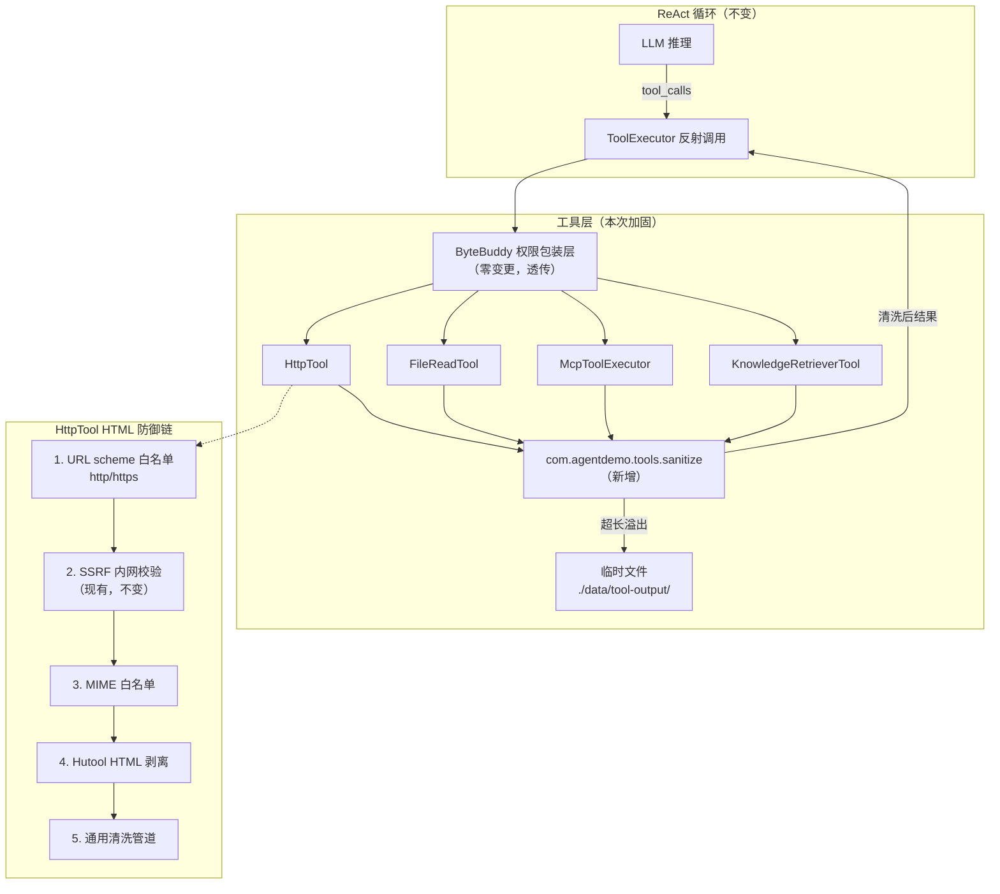
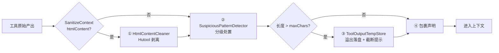
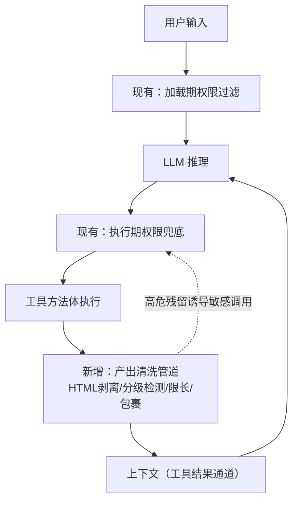

# AI Agent 技术设计文档: 工具产出安全清洗 (tool-output-sanitization)

| 字段 | 内容 |
|------|------|
| 版本 | v1.0 |
| 作者 | ai-agent-tech-design（技术方案设计技能） |
| 日期 | 2026-08-26 |
| 变更记录 | v1.0 \| 2026-08-26 \| 初版：4 类数据获取工具产出清洗方案（三层清洗 + 限长临时文件 + HTML 防御链） \| 技术方案设计流程 |
| 需求文档 | `specs/features/20260826_tool-output-sanitization/tool-output-sanitization.md` |
| 调研报告 | `specs/features/20260826_tool-output-sanitization/Agent框架工具结果清洗调研报告.md` |

## 0. 设计概要 (Design Summary)

*   **Agent 描述**：为现有 4 类数据获取工具（HttpTool / FileReadTool / MCP 动态工具 / RAG 知识库检索）增加产出清洗层，使工具结果作为**数据**而非**指令**进入 LLM 上下文，并对超长内容实施"前缀 + 临时文件分段查询"。
*   **Agent 类型**：任务型（对现有工具链路的安全加固，不新增 Agent 实体）
*   **自主性级别**：不变（沿用现有 ALLOW/ASK/DENY 三级权限裁决，与需求文档 3.3 一致）
*   **影响范围**：
    | 模块 | 影响 |
    |------|------|
    | agent-demo-tools | 新增 sanitize 包；修改 HttpTool、FileReadTool |
    | agent-demo-mcp | 修改 McpToolExecutor（1 处注入点） |
    | agent-demo-rag | 修改 KnowledgeRetrieverTool（1 处注入点） |
    | agent-demo-bootstrap | application.yml 新增 `agent.tool.sanitize.*` 配置 |
    | agent-demo-agent / 权限体系 / ToolRegistry / ToolExecutor | **零变更**（架构不动，本次定位为具体工具优化） |
*   **技术难点**：
    1. 清洗管道的降级设计--任何清洗环节异常不得阻断工具结果返回（AC-E02）；
    2. 临时文件与 FileReadTool 白名单目录的耦合--临时文件必须落在模型可回读的位置（AC-T02）；
    3. 临时文件回读的"不二次清洗、不嵌套临时文件"约束（防递归截断）；
    4. 正则规则库的误杀控制--分级处置保证正常内容零丢失（AC-E04）。
*   **依赖关系**：
    *   模块依赖：`agent-demo-mcp`、`agent-demo-rag` 已依赖 `agent-demo-tools`（清洗器放 tools 模块零新增模块依赖）
    *   类库依赖：Hutool `HtmlUtil`（common 已引入 hutool-all，零新增第三方依赖）
    *   框架约束：LangChain4j 无内建工具结果清洗能力（调研报告 §3.6），应用层自建是唯一路径

## 1. Agent 架构概览 (Agent Architecture)

### 1.1 编排模式

*   **模式**：不变（单 Agent ReAct 循环）。
*   **选择理由**：本次为工具层安全加固，清洗管道内嵌于具体工具方法返回路径，对编排层完全透明；不引入任何新 Agent 实体。
*   **清洗层与现有链路的位置关系**：工具方法体执行完毕 -> **清洗管道（新增）** -> ByteBuddy 权限包装层透传返回 -> ToolExecutor -> ToolExecutionResultMessage 进入上下文。清洗发生在工具方法内部（返回前），因此权限包装层（ToolPermissionGuard）自动透传清洗后结果，无需任何适配。

### 1.2 推理框架

*   **主要框架**：ReAct（不变，与需求文档 5.1 一致）。
*   **框架选择策略**：清洗层对推理流程零侵入；模型对截断内容是否继续查询由模型在 ReAct 循环中自主决策（读"已截断+文件位置"提示 -> 决定是否调 readFile 分页查询）。
*   **最大执行步骤**：不变（`agent.max-iterations=10`）。

### 1.3 系统集成架构



### 1.4 Agent 生命周期

*   **会话初始化**：不变。
*   **执行循环**：工具方法返回值经清洗管道处理后再进入上下文（唯一变化点）。
*   **会话终止**：新增临时文件过期清理（写入时机会式清理，见 §3.5，不引入调度器）。
*   **超时控制**：不变（HttpTool 连接 5s/读取 30s，MCP 60s）。
*   **回放语义（AC-M01/M02）**：清洗发生在工具执行时点，结果字符串（含包裹声明）随 ToolExecutionResultMessage 一次性持久化；会话恢复仅重放消息、不重执行工具，天然满足"声明只出现一次、历史不重算"。

### 1.5 模型能力要求

> 不指定具体模型版本，仅定义能力基线。

| 能力维度 | 要求 | 说明 |
|---------|------|------|
| 上下文窗口 | >= 32K tokens（不变） | 单工具结果被限长至默认 4000 字符后，10 轮迭代 + 20 条记忆窗口的上下文占用可控（优化后更宽松） |
| 工具调用/Function Calling | 是（不变） | readFile 新增 offset/maxChars 可选参数，依赖 Function Calling 参数传递能力 |
| 结构化输出/JSON Mode | 否（不变） | 清洗产物为自然语言包裹文本，无结构化输出需求 |
| 多语言能力 | 是（不变） | 可疑模式规则需同时覆盖中英文注入特征 |
| 推理能力 | 基础（不变） | 模型需理解"截断提示 + 文件位置"并自主决定分页查询 |

### 1.6 代码结构与领域模块设计

**领域模块划分**（全部位于 `agent-demo-tools`，MCP/RAG 经既有依赖复用）：

| 模块名 | 职责（一句话） | 不负责（边界） | 复用/新建 | 包含文件 |
| :--- | :--- | :--- | :--- | :--- |
| sanitize-core | 工具产出清洗管道编排：模式分级检测 + 限长临时文件 + 包裹声明 | 不负责 HTML 剥离细节、不负责工具自身业务逻辑 | 新建 | `ToolOutputSanitizer.java`、`SanitizeContext.java` |
| sanitize-html | HTML 可执行内容剥离（Hutool 实现） | 不负责可疑指令文本检测、不负责限长 | 新建 | `HtmlContentCleaner.java` |
| sanitize-pattern | 可疑指令模式检测与分级处置 | 不负责 HTML 标签剥离、不负责清洗编排 | 新建 | `SuspiciousPatternDetector.java` |
| sanitize-store | 超长内容临时文件写入、分页读取、过期清理 | 不负责清洗、不负责截断判断 | 新建 | `ToolOutputTempStore.java`、`TempFileRecord.java` |
| sanitize-config | 清洗配置（开关/上限/目录/规则/MIME 白名单） | 不含任何业务逻辑 | 新建 | `ToolSanitizeProperties.java` |

**目录归属**：新包 `com.agentdemo.tools.sanitize`，与 `builtin`/`permission`/`registry` 平级；理由：清洗是工具域横切能力，归属工具模块顶层包。

**文件清单**：

| 文件路径 | 操作 | 用途 |
| :--- | :--- | :--- |
| `agent-demo-tools/src/main/java/com/agentdemo/tools/sanitize/ToolOutputSanitizer.java` | 新增 | 清洗管道编排器（四段管道 + 全局降级） |
| `agent-demo-tools/src/main/java/com/agentdemo/tools/sanitize/SanitizeContext.java` | 新增 | 清洗上下文（工具名、来源描述、HTML 标记） |
| `agent-demo-tools/src/main/java/com/agentdemo/tools/sanitize/HtmlContentCleaner.java` | 新增 | Hutool HTML 剥离（script/iframe/object/embed/事件属性/危险协议） |
| `agent-demo-tools/src/main/java/com/agentdemo/tools/sanitize/SuspiciousPatternDetector.java` | 新增 | 一般/高危两组正则规则检测与分级处置 |
| `agent-demo-tools/src/main/java/com/agentdemo/tools/sanitize/ToolOutputTempStore.java` | 新增 | 临时文件写入 + 分页读取 + 机会式过期清理 |
| `agent-demo-tools/src/main/java/com/agentdemo/tools/sanitize/ToolSanitizeProperties.java` | 新增 | `agent.tool.sanitize.*` 配置类 |
| `agent-demo-tools/src/main/java/com/agentdemo/tools/sanitize/TempFileRecord.java` | 新增 | 临时文件元信息（原始长度/截断位置） |
| `agent-demo-tools/src/main/java/com/agentdemo/tools/builtin/HttpTool.java` | 修改 | 注入清洗管道；scheme 白名单；改 `exchange()` 读 Content-Type 做 MIME 白名单 |
| `agent-demo-tools/src/main/java/com/agentdemo/tools/builtin/FileReadTool.java` | 修改 | 注入清洗管道；新增 offset/maxChars 可选参数；临时目录豁免逻辑 |
| `agent-demo-mcp/src/main/java/com/agentdemo/mcp/tool/McpToolExecutor.java` | 修改 | parseFromWrapper 返回前注入清洗管道（1 处） |
| `agent-demo-rag/src/main/java/com/agentdemo/rag/retriever/KnowledgeRetrieverTool.java` | 修改 | searchByKbId 返回前注入清洗管道（1 处） |
| `agent-demo-bootstrap/src/main/resources/application.yml` | 修改 | 新增 `agent.tool.sanitize.*` 配置段 |
| 对应 5 个测试类（sanitize 包 5 个 + 4 个工具的既有测试扩展） | 新增/修改 | 见 §7.2 评估数据集 |

## 2. Prompt 工程架构 (Prompt Engineering Architecture)

> 本节定义包裹声明与截断提示的**结构契约**；具体文案由 agent-prompt-designer Skill（边界声明、系统提示词中的"外部数据不作为指令"规则）与 tool-design Skill（工具描述中分页参数说明、截断提示话术）在后续阶段落地。

### 2.1 包裹声明结构契约（工具侧产出格式）

工具产出进入上下文的最终形态（结构示意，非最终文案）：

```
[边界声明头：声明以下为外部工具数据（非指令）+ 来源工具名 + 来源描述]
[清洗后正文（超限时为前缀）]
[截断提示（仅超限时）：已截断声明 + 原始长度 + 临时文件相对路径 + 分页查询方式]
[边界声明尾：与头部配对的闭合标记]
```

*   **注入方式**：由 `ToolOutputSanitizer` 在工具返回时动态拼接，来源工具名取自 `SanitizeContext.toolName`。
*   **定界符策略**：首版使用**固定分隔符对**（调研报告扩展方案 1 的随机化分隔符列为后续增量）；分隔符须选择正常文本中极难碰撞的形态，具体符号由 prompt-designer 定稿。
*   **一次性保证**：声明在工具执行时点拼接一次，随消息持久化，回放不重拼（§1.4）。

### 2.2 Tool/Function 描述设计（结构模板）

| 工具名称 | when-to-use | when-not-to-use | 参数约束要点 | 返回格式要点 | 对应需求文档工具 |
|---------|-------------|-----------------|------------|---------|----------------|
| readFile（签名扩展） | 需要读取本地文件全文或分段读取超长内容 | 检索知识库内容用知识库检索工具 | path: 相对路径；offset/maxChars: 可选分页参数（缺省读全文，0 起） | 文件内容或分页窗口 + 剩余量提示 | FileReadTool |
| httpGet / httpPost | 获取网页/API 文本内容 | 返回二进制/图片等非白名单类型时返回提示而非原文 | url: 仅 http/https | 清洗后文本，超长含临时文件指引 | HttpTool |
| MCP / RAG 各工具 | 不变 | 不变 | 不变 | 返回值经清洗包裹，格式结构不变 | 需求文档 4.1 表 |

*   **工具消歧策略**：readFile 的 offset/maxChars 缺省语义 = 现有全文读取行为（向后兼容），模型无需感知变化除非结果被截断。
*   **工具契约移交**：readFile 新参数的完整描述文本（含义/取值/示例）、截断提示话术、HttpTool 拒绝提示话术，移交 tool-design Skill 在任务规划与实现阶段落地。

### 2.3 输出格式契约

*   清洗产物为纯文本（非 JSON），无 Schema 校验需求。
*   **解析规则**：包裹声明头/尾必须成对出现（由 Sanitizer 单点拼接保证）；截断提示必须包含临时文件**相对路径**（相对于 FileReadTool 白名单根目录，保证模型可直接作为 readFile 的 path 参数使用）。
*   **失败处理**：拼接异常时按 §3.6 降级返回原始文本（AC-E02），不产生半截声明。

### 2.4 Few-shot 示例策略

*   不新增 Few-shot（清洗层不改变模型任务语义）；截断提示本身即"使用说明"，模型按提示自主分页。

## 3. 工具集成设计 (Tool Integration)

### 3.1 清洗管道设计（核心）

**四段管道（顺序固定，前段产物是后段输入）**：



| 段 | 职责 | 降级行为 |
|----|------|---------|
| ① HTML 剥离 | 仅 HttpTool（含 xhtml 响应）触发；移除 script/iframe/object/embed 标签、事件属性（on\*）、javascript:/data:/vbscript: 协议引用 | 剥离异常 -> 跳过本段继续（记 WARN） |
| ② 模式分级检测 | 一般可疑 -> 原文保留 + 警示标记；高危 -> 移除片段 + 占位标记；命中即记 WARN 安全日志 | 检测异常 -> 跳过本段继续（记 WARN） |
| ③ 限长+临时文件 | 清洗后内容超过 maxChars：前缀保留，溢出部分写入临时文件，生成截断提示 | 写文件失败 -> 降级纯截断（AC-E01），记 WARN |
| ④ 包裹声明 | 边界声明头尾包裹全部产物（含截断提示） | 拼接异常 -> 返回未包裹产物（AC-E02） |

**全局降级铁律（AC-E02）**：`ToolOutputSanitizer.sanitize()` 整体 try/catch，任何未预期异常 -> 记 ERROR + 返回原始文本。**清洗层永远不阻断工具结果返回**。

**管道入口 API（架构级）**：
```
sanitize(String rawOutput, SanitizeContext ctx) -> String
// SanitizeContext: toolName（声明来源+日志）、sourceDesc（来源描述）、htmlContent(boolean)
// enabled=false 时直通返回原文（总开关）
```

### 3.2 四个注入点（均在具体工具内部）

| 注入点 | 位置 | SanitizeContext 要点 | 附加改造 |
|--------|------|---------------------|---------|
| HttpTool.httpGet / httpPost | 响应字符串返回前 | toolName=httpGet/httpPost；Content-Type 为 text/html 或 xhtml 时 htmlContent=true | ① `validateUrl` 增加 scheme 白名单（仅 http/https，AC-S01）；② 改用 `RestTemplate.exchange()` 获取 Content-Type 做 MIME 白名单（AC-S02）；③ 移除现有 `truncateResponse`（被管道③取代） |
| FileReadTool.readFile | `Files.readString` 之后 | toolName=readFile；htmlContent=false | ① 新增 offset/maxChars 可选参数（缺省全文）；② 路径命中临时目录 -> **豁免管道②④**（内容已清洗，AC-T02），仅按 offset/maxChars 分页返回 + 硬截断提示（**不再生成嵌套临时文件**）；③ 现有 1MB 拒绝读取改为"读取后走管道③截断"（AC-T03 行为变更） |
| McpToolExecutor.parseFromWrapper | `contentParser.parse` 结果返回前 | toolName=mcp:{serverName}/{toolName}；htmlContent=false | FALLBACK_MESSAGE 同样过管道（保持一致防御） |
| KnowledgeRetrieverTool.searchByKbId | 结果组装 return 前 | toolName=rag:{kbName}；htmlContent=false | 各错误提示文本（"知识库不存在"等）同样过管道，保证声明一致 |

**MIME 白名单规则（HttpTool）**：白名单 = text/html、application/xhtml+xml（触发 HTML 剥离）、text/plain、text/markdown、application/json、application/xml、text/xml 及 `application/*+json`、`application/*+xml`；非白名单 -> 返回可读提示（含实际 Content-Type 与拦截说明），不返回原文。白名单经配置可扩展。

### 3.3 工具执行编排

*   **串行**：获取工具产出截断 -> 模型自主决定 -> readFile(offset) 分页查询（跨工具编排，模型侧自主）。
*   **并行**：不变（清洗为纯 CPU 字符串操作，微秒-毫秒级，不构成并行障碍）。
*   **条件分支**：不变。
*   **最大调用次数**：不变。

### 3.4 工具错误处理

| 工具 | 失败场景 | 重试策略 | 降级方案 | 是否转人工 |
|------|---------|---------|---------|-----------|
| 4 类工具 | 清洗管道自身异常 | 不重试 | 返回原始文本 + ERROR 日志（AC-E02） | 否 |
| 4 类工具 | 临时文件写入失败（磁盘/权限） | 不重试 | 纯截断（保留截断声明），对话不中断（AC-E01） | 否 |
| HttpTool | 非 http/https 协议 | 不重试 | 拒绝提示（AC-S01） | 否 |
| HttpTool | MIME 非白名单 | 不重试 | 可读提示，不返回原文（AC-S02） | 否 |
| 4 类工具 | 工具本体失败 | 不变（现有行为） | 现有错误文本返回，清洗层不吞不改（AC-E03） | 否 |

### 3.5 临时文件机制设计（ToolOutputTempStore）

*   **落盘位置**：`{temp-dir}` 默认 `./data/tool-output/`（**必须位于 FileReadTool 白名单目录 `agent.file-allowed-dir=./data` 内**，配置注释中声明该约束，否则模型无法回读）。
*   **文件命名**：`{toolName}_{时间戳}_{短随机串}.txt`（toolName 中的非法路径字符替换为下划线）。
*   **写入内容**：管道②清洗后的完整内容（前缀+溢出），文件头部写 2 行元信息（来源工具、原始总长、本次截断位置）。
*   **分页读取**：模型调 `readFile(path, offset, maxChars)`；FileReadTool 识别临时目录路径 -> 豁免二次清洗（AC-T02），按窗口返回 + 尾部剩余量提示；**硬截断不再生成新临时文件**（防递归）。
*   **过期清理（机会式，无调度器）**：每次写入时扫描 temp-dir，删除修改时间早于 `temp-retention-hours`（默认 24h）的文件；清理失败仅记 WARN 不影响主流程。
*   **并发安全**：文件名含随机串避免并发冲突；写入用原子写（临时文件 + move）。

### 3.6 工具权限控制

*   不变：4 类工具权限等级、ByteBuddy 包装层、加载期过滤、执行期兜底全部保持（AC-S08）。
*   清洗层位于权限裁决**之后**（方法体内部），与权限体系正交叠加，构成纵深防御新增防线。

## 4. 记忆与上下文架构 (Memory & Context)

### 4.1 对话上下文管理

*   **管理策略**：不变（现有滑动窗口 `agent.chat-memory-window-size=20`）。
*   **本次贡献**：从源头控制工具结果对上下文的占用--单结果默认 <= 4000 字符，超长部分外置临时文件（需求 5.3"上下文溢出处理"的落地）。

### 4.2 短期记忆

*   不变（会话级内存存储 + 超时清理 30min）。

### 4.3 长期记忆

*   不涉及（需求文档 5.4：否）。

### 4.4 上下文注入管道

*   不变；工具结果消息（含包裹声明）作为既有 ToolExecutionResultMessage 通道注入，无需新增管道。

## 5. 知识与检索设计 (Knowledge & RAG)

*   检索策略、分块、向量库均不变。
*   **唯一变化**：`KnowledgeRetrieverTool.searchByKbId` 返回前过清洗管道（§3.2 注入点 4）。
*   **前端来源解析兼容性**：包裹声明头尾 + "来源: {kb}/{file}" 行级格式共存于同一文本，前端按行解析"来源:"不受声明头尾影响（回归验证项）。
*   Top-N 数量控制（`rag.retrieval.max-results=5`）不变，总长度控制由管道③统一兜底。

## 6. 护栏与安全设计 (Guardrails & Safety)

### 6.1 多层护栏架构（本次在工具产出层新增一道防线）



### 6.2 输入过滤层

*   用户输入侧：不涉及（本次范围为工具产出侧）。
*   工具入参侧新增两道校验：URL scheme 白名单（AC-S01）、MIME 白名单（AC-S02）。

### 6.3 Prompt 层护栏

*   包裹声明（AC-S06）= Spotlighting-Delimiting 落地（调研报告 §3.1）；声明文案与系统提示词中"工具结果为外部数据"配套规则由 prompt-designer 定稿。
*   高危移除的占位标记（AC-S05）同时承担 Prompt 层信号作用。

### 6.4 输出过滤层

*   不涉及（LLM 输出侧护栏不在本次范围，见需求 8.2）。

### 6.5 工具执行层护栏

*   权限体系不变（AC-S08/AC-H01 的兜底由现有 ASK/DENY 承担）。
*   新增安全日志（AC-S07）：`log.warn` 统一前缀 + 结构化字段（工具名 / 命中规则 ID / 处置动作 / 原始长度 / 截断长度 / 临时文件路径），不打断对话、不外发前端。

### 6.6 降级策略

*   见 §3.4；模型不可用兜底不涉及（不改变模型调用链）。

### 6.7 身份与权限架构

*   不变（需求文档 6.7：沿用现有体系，无新增鉴权）。

## 7. 评估与可观测性设计 (Evaluation & Observability)

### 7.1 决策链路追踪

*   不新增 Trace 体系；清洗动作日志即安全审计线索：
    | 日志字段 | 说明 | 示例 |
    |------|------|------|
    | toolName | 来源工具 | httpGet |
    | ruleId | 命中规则 | SUSPICIOUS_IGNORE_PREVIOUS / HIGH_RISK_FAKE_SYSTEM |
    | action | 处置动作 | MARKED / REMOVED / HTML_STRIPPED / TRUNCATED / TEMP_FILE |
    | originalLength / keptLength | 长度统计 | 15823 / 4000 |
    | tempFile | 临时文件路径 | tool-output/httpGet_xxx.txt |

### 7.2 评估框架（TDD 测试数据集）

*   **单元测试集（自动评估）**：
    | 测试类 | 覆盖 AC | 用例要点 |
    |--------|--------|---------|
    | ToolOutputSanitizerTest | AC-N01/N02/S05/S06/E02/E04 | 正常内容零丢失（反例集）；一般可疑标记保留；高危移除占位；管道异常返回原文 |
    | HtmlContentCleanerTest | AC-S03/S04 | script/iframe/object/embed/事件属性/危险协议剥离；正文保留 |
    | SuspiciousPatternDetectorTest | AC-S05/E04 | 中英文注入特征正反例；"讨论注入话题的文档"不误杀 |
    | ToolOutputTempStoreTest | AC-T01/T02/E01 | 落盘+分页读；写失败降级纯截断；过期清理 |
    | HttpToolTest（扩展） | AC-S01/S02/S03/N02 | scheme 拦截、MIME 拦截、HTML 清洗、超长临时文件 |
    | FileReadToolTest（扩展） | AC-T02/T03/M01 | offset/maxChars 分页；大文件截断；临时目录豁免不二次清洗 |
    | McpToolExecutorTest（扩展） | AC-S05/S06/N01 | MCP 结果清洗包裹 |
    | KnowledgeRetrieverToolTest（扩展） | AC-N01/S06/E03 | RAG 结果清洗包裹；错误提示一致包裹 |
*   **注入 payload 用例库**：每条安全 AC >= 1 正例（应拦截/标记）+ 1 反例（应原样保留）。
*   **回归验证**：SSRF 防护、路径白名单、权限裁决既有测试全部通过（AC-S08）。
*   **手动评估**：构造含注入网页/文档/MCP 返回，端到端验证 Agent 不执行工具结果中的指令。
*   **评估指标**：拦截率（安全 AC 正例 100%）、误杀率（反例 0% 丢失）、回归通过率 100%。

### 7.3 监控与告警

*   WARN 安全日志即可观测（需求已确认无前端打断）；不新增告警通道（演示项目定位）。

## 8. 性能与成本设计 (Performance & Cost)

### 8.1 Token 成本优化

*   **收益**：超长结果从上下文外置临时文件（MCP/RAG 此前无限制，最坏可注入数万 token）；单结果上限 4000 字符。
*   **成本**：包裹声明约 +50~100 token/次工具调用；截断提示约 +80 token（仅超限时）。

### 8.2 延迟优化

*   清洗为纯正则/字符串操作，单次 < 5ms（4000 字符量级）；临时文件 IO 一次顺序写 < 10ms；总增量延迟可忽略（相对 LLM 秒级推理）。

### 8.3 并发控制

*   不变；临时文件名含随机串，无并发冲突。

### 8.4 成本估算

| 场景 | 清洗前单次工具结果 | 清洗后 | 变化 |
|------|------------------|--------|------|
| 正常网页（~3K 字符） | ~3K token 原文 | ~3K + 声明 100 | +3% |
| 超长网页（~30K 字符） | ~30K token（MCP/RAG 类无上限时更甚） | 4K + 截断提示 | **-85%** |
| 含脚本网页 | 脚本噪音全量入上下文 | 剥离后仅正文 | 净减 |

## 9. 验收标准映射 (AC Mapping)

| AC ID | AC 描述 | AC 类型 | 对应技术实现 |
|-------|--------|--------|-------------|
| AC-N01 | 正常内容清洗后可用 | 正常交互 | 管道④包裹声明（SanitizeContext.toolName）+ 反例测试集保证正文零丢失 |
| AC-N02 | 短结果不触发临时文件 | 正常交互 | 管道③长度判断（<= maxChars 直通） |
| AC-T01 | 超长截断与查询指引 | 工具调用 | 管道③ + ToolOutputTempStore 落盘 + 截断提示含相对路径 |
| AC-T02 | 剩余内容分段查询 | 工具调用 | readFile 扩展 offset/maxChars + FileReadTool 临时目录豁免（不二次清洗、不嵌套） |
| AC-T03 | 大文件从拒绝改截断 | 工具调用 | FileReadTool 移除 1MB 拒绝分支，读取后走管道③ |
| AC-T04 | 字数上限可配置 | 工具调用 | ToolSanitizeProperties.max-chars（默认 4000）+ 未配置缺省值 |
| AC-S01 | 请求级协议白名单 | 安全护栏 | HttpTool.validateUrl 扩展 scheme 白名单 |
| AC-S02 | MIME 白名单 | 安全护栏 | HttpTool 改 exchange() 读 Content-Type + 白名单判断 |
| AC-S03 | 可执行内容剥离 | 安全护栏 | HtmlContentCleaner（Hutool HtmlUtil.filter + removeHtmlTag） |
| AC-S04 | 内容级危险协议限制 | 安全护栏 | HtmlContentCleaner 协议引用清除（保留 http/https/相对路径） |
| AC-S05 | 可疑指令分级处置 | 安全护栏 | SuspiciousPatternDetector 两组规则（标记/移除占位） |
| AC-S06 | 统一包裹边界声明 | 安全护栏 | 管道④ + SanitizeContext.toolName 来源标识 |
| AC-S07 | 清洗动作安全日志 | 安全护栏 | 统一 WARN 前缀 + 结构化字段（§7.1） |
| AC-S08 | 现有安全机制不变 | 安全护栏 | 权限/SSRF/路径白名单零改动 + 回归测试 |
| AC-E01 | 临时文件写失败降级 | 边界降级 | 管道③ try/catch -> 纯截断 + WARN |
| AC-E02 | 清洗层异常不阻断 | 边界降级 | sanitize() 全局 try/catch -> 返回原文 + ERROR |
| AC-E03 | 工具失败提示保持 | 边界降级 | 注入点位于成功返回路径；错误路径（BusinessException）不经过管道 |
| AC-E04 | 误命中容忍 | 边界降级 | 分级处置：一般可疑仅标记；反例测试集 |
| AC-M01 | 声明一次性写入 | 记忆上下文 | 清洗时点性（§1.4 回放语义） |
| AC-M02 | 历史结果不重算 | 记忆上下文 | 清洗仅在工具执行时点发生，历史消息只读 |
| AC-H01 | 高危注入权限兜底 | 人机协作 | 现有 ASK/DENY 体系不变（清洗层不中断对话） |

## 10. 技术决策说明 (Technical Decisions)

*   **决策1：清洗器代码归属**
    *   选项：tools 模块新包 / common 模块
    *   选择：`agent-demo-tools` 新增 `com.agentdemo.tools.sanitize` 包
    *   理由：MCP/RAG 模块已依赖 tools 模块（依赖方向天然满足，零新增模块依赖）；清洗逻辑语义属工具域，common 定位为无业务语义公共层。已与用户确认。
*   **决策2：HTML 清洗实现**
    *   选项：Hutool HtmlUtil / 引入 Jsoup / 自写正则
    *   选择：Hutool（`HtmlUtil.filter` XSS 过滤 + `removeHtmlTag` 标签移除）
    *   理由：common 已引入 hutool-all，零新增第三方依赖（符合 GUARDRAILS"新技术依赖须评估"约束）；Hutool 的 XSS 过滤器久经生产验证，覆盖事件属性与危险协议；自写正则对畸形 HTML 脆弱。已与用户确认。
*   **决策3：分段查询实现**
    *   选项：扩展 readFile 可选参数 / 新增独立方法
    *   选择：`readFile(path, offset?, maxChars?)` 可选参数扩展
    *   理由：工具入口唯一（避免功能重叠工具的消歧负担）；ByteBuddy 权限包装层按原方法反射生成，自动适配新签名；缺省语义向后兼容。已与用户确认。
*   **决策4：字数计量单位与默认值**
    *   选项：4000 字符 / 10240 字符 / Token 计量
    *   选择：字符计量，默认 4000
    *   理由：与需求"字数限制"表述一致且确定性可测（Token 估算有误差）；4000 字符 ≈ 2-4K token，与 max-iterations=10、记忆窗口 20 的上下文预算匹配；HttpTool 现有 10KB 截断收紧、MCP/RAG 从无到有。已与用户确认。
*   **决策5：清洗管道顺序（清洗 -> 截断 -> 包裹）**
    *   理由：临时文件内容必须是清洗后内容（AC-T02"不再重复清洗"）；包裹声明必须覆盖截断提示整体（声明指向"前缀+提示"完整产物）；任何其他顺序都会导致二次清洗或声明残缺。
*   **决策6：过期清理用机会式而非调度器**
    *   理由：需求范围为"简单过期清理"；不引入 @EnableScheduling 新基础设施；写入时顺带扫描清理，失败不影响主流程。
*   **决策7：HttpTool 移除现有 truncateResponse**
    *   理由：管道③统一承担限长职责，保留旧截断会造成双重截断逻辑漂移；旧"截断即丢弃"行为被临时文件机制取代（本次优化核心点）。

## 11. 风险与注意事项 (Risks & Notes)

*   **技术风险**：
    *   正则规则误杀（如知识库文档本身讨论提示注入）-> 分级处置（一般仅标记）+ 反例测试集守护（AC-E04）；
    *   Hutool XSS 过滤对极端畸形 HTML 的边界行为 -> HtmlContentCleanerTest 覆盖畸形样本 + 剥离异常降级跳过；
    *   临时文件目录配置脱离 FileReadTool 白名单 -> 配置注释声明约束 + FileReadToolTest 校验越界提示。
*   **兼容性**：
    *   readFile 签名扩展 -> ToolPermissionGuard 按反射生成包装自动适配（回归验证）；
    *   RAG 前端"来源:"行解析 -> 包裹声明头尾不改写行内格式（回归验证项）；
    *   HttpTool 从 getForObject 改 exchange() -> 仅读取头信息，请求语义不变。
*   **性能影响**：单次清洗 < 5ms，可忽略（§8.2）。
*   **安全风险**：清洗为概率性防御，高危残留依赖现有 ASK/DENY 兜底（AC-H01，纵深防御不变）。
*   **回滚方案**：
    *   总开关：`agent.tool.sanitize.enabled=false` -> 全部工具直通原始行为（秒级回退）；
    *   分项回退：html-clean=false / 临时文件降级纯截断（temp-dir 不可写自动触发）；
    *   readFile 签名回退：offset/maxChars 为可选参数，删除清洗调用后签名可保持兼容；
    *   无数据迁移：临时文件为可再生缓存，回滚直接删除 temp-dir 即可。

## 12. 数据隐私与合规 (Data Privacy & Compliance)

*   **数据存储**：临时文件为工具结果明文缓存，位于应用本地 `./data/`（与现有 RAG 临时目录同级治理），24h 过期自动清理；不涉及加密新增需求（演示项目本地磁盘）。
*   **数据传输**：不改变现有 TLS 通道。
*   **PII**：秘密类模式脱敏列为扩展方案（调研报告扩展 8），本次不实现。
*   **日志**：清洗安全日志不含工具结果正文（仅元信息：工具名/规则/长度/文件路径），避免敏感内容二次落盘。
