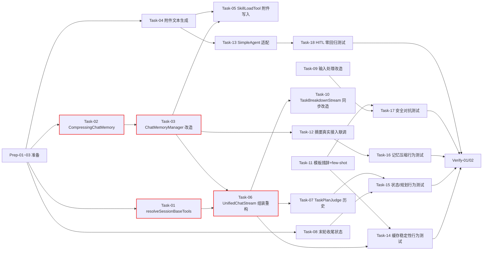

# AI Agent 开发任务计划: Agent 上下文工程优化 (agent-context-engineering)

> **关联文档**：`specs/features/20260828_agent-context-engineering/agent-context-engineering.md`（需求说明书 v1.0）、`specs/features/20260828_agent-context-engineering/agent-context-engineering_技术方案.md`（技术设计 v1.0）
> **阶段自适应说明**：本需求为**既有系统优化**，非新建 Agent。跳过模板中的运行时搭建、工具适配（现状零变更）、知识检索、身份鉴权阶段；评估基建复用既有 JUnit 5 + Mockito（无新建独立评估框架），行为测试直接基于既有测试套件扩展。聚焦 4 个变更域：记忆基础设施 → 组装管道 → Prompt 工程 → 行为测试。

## 0. 任务概览 (Task Overview)

*   **Agent 名称**：agent-context-engineering（Agent 上下文工程优化）
*   **总任务数**：23 项（3 准备 + 13 开发 + 5 行为测试 + 2 验证）
*   **预计总工时**：1500 分钟（约 25 小时）
*   **任务类型分布**：
    *   确定性组件（TDD）：11 个（Task-01~10、Task-13）
    *   概率性组件（EDD，含迭代）：1 个（Task-11）
    *   基础设施（集成验证）：1 个（Task-12）
    *   行为测试：5 个（Task-14~18）
*   **风险任务**：Task-11（概率性调优，2 轮缓冲）、Task-02（滚动摘要逻辑复杂）、Task-13（同步路径 AiServices 行为不确定）⚠️
*   **阻塞任务**：Task-01、Task-02、Task-03、Task-06 🔒
*   **Prompt 迭代预期**：概率性组件 Task-11 预计 2 轮评估调优

### 依赖关系图

### 可并行任务组

| 并行组 | 可同时执行的任务 | 说明 |
| :--- | :--- | :--- |
| 并行组 1 | Task-01 + Task-02 + Task-04 + Task-08 | 四者互不依赖，是各自链路的起点 |
| 并行组 2 | Task-03（依赖 T02）+ Task-06（依赖 T01/T03）+ Task-09 + Task-11 | 组装管道、控制器、Prompt 措辞可并行 |
| 并行组 3 | Task-12 + Task-13 + Task-14~18 | 联调、适配、各行为测试在各自主链完成后并行 |

## 1. 准备工作 (Preparation)

- [x] **Prep-01**: 创建功能分支 `feature/agent-context-engineering`
    *   **通俗解释**: 所有改动先放在独立分支上，不直接动主干，方便随时回退。
    *   **说明**: 从当前分支创建新功能分支
    *   **验证**: 分支创建成功
    *   **预估工时**: 10m
- [x] **Prep-02**: 既有测试套件基线跑通
    *   **通俗解释**: 动手改造前先确认现有功能都是好的，改造后若有问题立刻能分辨是不是我们改坏的。
    *   **说明**: 运行 agent-demo-agent / agent-demo-memory / agent-demo-skill / agent-demo-web 相关模块既有测试，记录基线
    *   **验证**: `mvn test -pl agent-demo-agent,agent-demo-memory -am` 全部通过，记录失败项为已知基线
    *   **预估工时**: 20m
- [x] **Prep-03**: 同步路径行为基线调研
    *   **通俗解释**: 先搞清楚旧的同步对话路径（SimpleAgent）是怎么拼对话上下文的，防止改造时把它弄坏。
    *   **说明**: 调研 SimpleAgent/AiServices delegate 的记忆组装行为（技术方案 §11 风险项）：是否自动写用户消息、如何消费 ChatMemoryManager 记忆、loadSkill 直执行路径的 Observation 归属；产出结论记录到任务备注
    *   **涉及文件**: `agent-demo-agent/src/main/java/com/agentdemo/agent/single/SimpleAgent.java`、`agent-demo-memory/src/main/java/com/agentdemo/memory/shortterm/ChatMemoryManager.java`（只读调研，不改代码）
    *   **验证**: 形成书面结论（SimpleAgent 记忆组装契约），作为 Task-13 的输入
    *   **预估工时**: 30m

## 2. 开发任务 (Development Tasks)

### 阶段一：记忆与上下文基础设施 (Memory & Context Infrastructure)
> 冻结工具集解析、压缩记忆、附件写入点的底层能力。
>
> **阶段完成标准**：基础工具集可确定性解析；压缩记忆可运行（阈值触发/附件保护/FIFO 降级）；附件可写入记忆流；SkillLoadTool 激活即写入指令附件

- [x] **Task-01**: SessionToolResolver 新增 resolveSessionBaseTools 🔒
    *   **通俗解释**: 做完这步后，Agent 系统提示词里的工具清单固定不变，不会因中途学习新技能而变化，缓存就能稳定命中。
    *   **任务类型**: 确定性组件
    *   **验证策略**: TDD（Red-Green-Refactor）
    *   **说明**: 抽取"会话基础工具集"（默认 ∪ 用户指定，不含技能脚本工具）解析逻辑；复用 ids 缓存与默认合并逻辑，跳过 mergeSkillScriptTools
    *   **涉及文件**: `agent-demo-agent/src/main/java/com/agentdemo/agent/single/SessionToolResolver.java`
    *   **测试文件**: `agent-demo-agent/src/test/java/com/agentdemo/agent/single/SessionToolResolverTest.java`（扩展既有）
    *   **参考**: 技术方案 §3.1、§10 决策 2
    *   **对应AC**: AC-T02
    *   **预估工时**: 60m
    *   **依赖**: 无
    *   **阻塞标注**: 🔒 被 Task-06/10 依赖
    *   **验证标准**（TDD RED 阶段测试依据）:
        - [x] resolveSessionBaseTools(sessionId, null) 返回默认 ∪ 指定工具（不含技能脚本工具）
        - [x] 同参数两次调用返回工具对象列表字节级一致（顺序稳定）
        - [x] 已激活技能的脚本工具不出现在 base 集
        - [x] 用户指定 toolIds 为空时清除会话缓存（现状语义保持）

- [x] **Task-02**: CompressingChatMemory 实现 🔒
    *   **通俗解释**: 做完这步后，Agent 聊得再长也不会"失忆"——旧内容会被自动归纳成摘要，而不是直接丢掉。
    *   **任务类型**: 确定性组件
    *   **验证策略**: TDD
    *   **说明**: 实现 ChatMemory 接口：滚动摘要压缩（阈值 20 条 + 滞回，压缩至半窗）、附件/System/摘要消息保护、FIFO 降级、摘要模型回调（外部注入，便于 mock）
    *   **涉及文件**: `agent-demo-memory/src/main/java/com/agentdemo/memory/shortterm/CompressingChatMemory.java`（**新增**）
    *   **测试文件**: `agent-demo-memory/src/test/java/com/agentdemo/memory/shortterm/CompressingChatMemoryTest.java`（**新增**）
    *   **参考**: 技术方案 §4.2、§10 决策 5
    *   **对应AC**: AC-E01、AC-M01
    *   **预估工时**: 120m
    *   **依赖**: 无
    *   **阻塞标注**: 🔒 被 Task-03/12 依赖
    *   **风险标注**: ⚠️ 滚动摘要逻辑较复杂（压缩边界、附件识别、滞回触发）
    *   **验证标准**（TDD RED 阶段测试依据）:
        - [x] 消息数 > 20 时触发压缩，压缩后约 10 条（滞回生效）
        - [x] 附件消息（框架标记前缀）永不被压缩/FIFO 丢弃
        - [x] 摘要模型回调异常时降级 FIFO 丢弃最旧非保护消息 + 不抛异常
        - [x] 二次压缩时旧摘要 + 新段滚动生成新摘要
        - [x] 摘要消息前缀标记自身受保护

- [x] **Task-03**: ChatMemoryManager 改造（压缩装配 + 附件 API）🔒
    *   **通俗解释**: 做完这步后，会话记忆就升级成"会自己归纳、能存附件"的新版本，技能说明书等长期内容能稳稳存住。
    *   **任务类型**: 确定性组件
    *   **验证策略**: TDD
    *   **说明**: 构造器注入 ModelFactory（摘要模型）；getMemory/createMemory 改为装配 CompressingChatMemory；新增 addAttachment(sessionId, type, text) 与 hasAttachment(sessionId, type)；新增 MemoryCompressionProperties 配置（enabled 默认 true）
    *   **涉及文件**: `agent-demo-memory/src/main/java/com/agentdemo/memory/shortterm/ChatMemoryManager.java`、`agent-demo-memory/src/main/java/com/agentdemo/memory/shortterm/MemoryCompressionProperties.java`（**新增**，见技术方案 §4.2）
    *   **测试文件**: `agent-demo-memory/src/test/java/com/agentdemo/memory/shortterm/ChatMemoryManagerTest.java`（扩展既有）
    *   **参考**: 技术方案 §4.2、§1.6
    *   **对应AC**: AC-E01、AC-N01
    *   **预估工时**: 90m
    *   **依赖**: Task-02
    *   **阻塞标注**: 🔒 被 Task-05/06/12 依赖
    *   **验证标准**（TDD RED 阶段测试依据）:
        - [x] addAttachment 后 messages() 包含框架附件消息（带类型标记）
        - [x] hasAttachment 正确检测目录/指令/状态附件存在性
        - [x] 压缩开关 false 时退化为 FIFO（现状行为）
        - [x] 既有 addUserMessage/addAssistantMessage/clearMemory 行为不回归

- [x] **Task-04**: SkillPromptComposer 附件文本生成
    *   **通俗解释**: 做完这步后，技能相关的"说明书"会被改写成可长期记忆的附件格式，且保留"用户内容不高于系统安全规则"的信任层标注。
    *   **任务类型**: 确定性组件
    *   **验证策略**: TDD
    *   **说明**: 新增目录附件 / 指令附件 / 状态附件文本生成方法；信任层标注（TRUST_LAYER_HEADER/FOOTER 语义）保留在指令附件文本内；附件文本使用框架标记帧结构
    *   **涉及文件**: `agent-demo-skill/src/main/java/com/agentdemo/skill/prompt/SkillPromptComposer.java`
    *   **测试文件**: `agent-demo-skill/src/test/java/com/agentdemo/skill/prompt/SkillPromptComposerTest.java`（扩展既有）
    *   **参考**: 技术方案 §2.1、§4.2 附件写入点表
    *   **对应AC**: AC-T01、AC-S01
    *   **预估工时**: 60m
    *   **依赖**: 无
    *   **验证标准**（TDD RED 阶段测试依据）:
        - [x] 目录附件文本含启用技能元数据（名称+描述）
        - [x] 指令附件文本含技能指令全文 + 信任层标注（"以平台规则为准"语义）
        - [x] 状态附件文本标识排除/变更事件
        - [x] skill.enabled=false 时各附件文本返回空串

- [x] **Task-05**: SkillLoadTool 激活单点写入指令附件（含 skill→memory 依赖）
    *   **通俗解释**: 做完这步后，Agent 激活技能的瞬间会把"说明书"存进会话记忆一次，之后每轮都能想起，不用反复灌输。
    *   **任务类型**: 确定性组件
    *   **验证策略**: TDD
    *   **说明**: SkillLoadTool.loadSkill 激活成功时经 ChatMemoryManager.addAttachment 写入 SKILL_INSTRUCTION 附件；激活失败/不存在/排除/禁用/超上限时不写；新增 agent-demo-memory 依赖到 skill pom（验证无环）
    *   **涉及文件**: `agent-demo-skill/src/main/java/com/agentdemo/skill/tool/SkillLoadTool.java`、`agent-demo-skill/pom.xml`
    *   **测试文件**: `agent-demo-skill/src/test/java/com/agentdemo/skill/tool/SkillLoadToolTest.java`（扩展既有）
    *   **参考**: 技术方案 §4.2 附件写入点表、§10 决策 3
    *   **对应AC**: AC-T01、AC-N01
    *   **预估工时**: 60m
    *   **依赖**: Task-03、Task-04
    *   **验证标准**（TDD RED 阶段测试依据）:
        - [x] 激活成功 → 记忆中出现对应技能指令附件（唯一一次）
        - [x] 激活失败（不存在/禁用/排除/超上限）→ 无附件写入
        - [x] pom 新增 memory 依赖编译通过（agent-demo-memory 不依赖 skill，无环）

### 阶段二：组装管道改造 (Assembly Pipeline)
> 系统提示词冻结、末轮收尾状态、规划历史、输入处理唯一化的组装层落地。
>
> **阶段完成标准**：直答/拆解/同步三路径系统提示词会话内字节级稳定；当前轮用户消息唯一写入；末轮状态注入生效；规划携带历史

- [x] **Task-06**: UnifiedChatStream 组装管道重构 🔒
    *   **通俗解释**: 做完这步后，Agent 每次回复的开场白在同一会话里完全固定，不再因学新技能而变化，回答更快更便宜，也不会把同一条消息重复看两遍。
    *   **任务类型**: 确定性组件
    *   **验证策略**: TDD
    *   **说明**: buildHitlMessages 重构——`{{tools}}` 改用 resolveSessionBaseTools 确定性文本、移除技能段拼接、移除当前用户消息追加（控制器已预写）、新增 ensureCatalogAttachment（记忆无目录附件则补写）、TaskPlanJudge 历史快照传入、系统提示词指纹日志（SHA-256 前 8 位）
    *   **涉及文件**: `agent-demo-agent/src/main/java/com/agentdemo/agent/core/UnifiedChatStream.java`
    *   **测试文件**: `agent-demo-agent/src/test/java/com/agentdemo/agent/core/UnifiedChatStreamTest.java`、`UnifiedChatStreamSkillTest.java`（扩展既有）
    *   **参考**: 技术方案 §2.1、§4.1、§7.1
    *   **对应AC**: AC-N01、AC-M02、AC-T02
    *   **预估工时**: 120m
    *   **依赖**: Task-01、Task-03
    *   **阻塞标注**: 🔒 被 Task-07/10/14/18 依赖
    *   **风险标注**: ⚠️ 组装结构变更影响面大，依赖既有测试回归
    *   **验证标准**（TDD RED 阶段测试依据）:
        - [x] 同会话相邻两次组装系统提示词字节级一致（技能激活前后）
        - [x] 系统提示词不含技能目录/激活段、不含当前用户消息（无重复）
        - [x] 首请求记忆无目录附件时自动补写（含旧会话兼容）
        - [x] 指纹日志输出稳定前缀摘要
        - [x] 知识库注入（effectiveMessage）路径组装正确

- [x] **Task-07**: TaskPlanJudge 历史注入
    *   **通俗解释**: 做完这步后，Agent 在决定"要不要拆解任务"前会先看最近几轮聊天，能听懂"那这个也一起分析"这类指代性指令。
    *   **任务类型**: 确定性组件
    *   **验证策略**: TDD
    *   **说明**: judge 签名增加 recentHistory（最近 6 条消息，由组装层传入）；组装 [task-plan 系统提示词] + 历史 + 当前消息；历史为空/异常时降级为仅当前消息（现状）
    *   **涉及文件**: `agent-demo-agent/src/main/java/com/agentdemo/agent/core/TaskPlanJudge.java`
    *   **测试文件**: `agent-demo-agent/src/test/java/com/agentdemo/agent/core/TaskPlanJudgeTest.java`（扩展既有）
    *   **参考**: 技术方案 §1.2、§6.4、§10 决策 7
    *   **对应AC**: AC-N03
    *   **预估工时**: 60m
    *   **依赖**: Task-06
    *   **验证标准**（TDD RED 阶段测试依据）:
        - [x] judge 传入含"订单 ORD-12345"的历史时，指代消息拆解保留实体
        - [x] recentHistory 为空时行为与现状一致
        - [x] 历史读取异常时降级不中断规划

- [x] **Task-08**: HITLReActStream 末轮收尾状态注入
    *   **通俗解释**: 做完这步后，Agent 思考达到轮次上限时会被明确告知"该收尾了"，直接总结而不是继续空转或尝试调用已不存在的工具。
    *   **任务类型**: 确定性组件
    *   **验证策略**: TDD
    *   **说明**: 强制总结调用前向循环消息列表末尾追加 user 角色 `<agent_status>` 消息（迭代读数 + 收尾策略成对，如"已达最大迭代次数(8/8)。不要发起工具调用，基于已有信息组织最终回答..."）；文案按技术方案 §5.5 语义编写（文本内容由实现时确定，属框架注入非模型输出）
    *   **涉及文件**: `agent-demo-agent/src/main/java/com/agentdemo/agent/single/HITLReActStream.java`
    *   **测试文件**: `agent-demo-agent/src/test/java/com/agentdemo/agent/single/HITLReActStreamTest.java`（扩展既有）
    *   **参考**: 技术方案 §1.6、§4.1、§10 决策 6
    *   **对应AC**: AC-N02、AC-E02、AC-H02
    *   **预估工时**: 60m
    *   **依赖**: 无
    *   **验证标准**（TDD RED 阶段测试依据）:
        - [x] 迭代用尽触发强制总结前，messages 末尾存在含迭代读数(8/8)与收尾策略的 user 消息
        - [x] 正常 finish（stop）路径不注入状态消息
        - [x] 状态消息构建异常时跳过注入不影响主流程
        - [x] 既有 askUser/tool_confirm 暂停路径不受影响（消息列表追加仅限强制总结前）

- [x] **Task-09**: AgentController 输入处理改造（标记剥离 + 写入唯一化 + 排除附件）
    *   **通俗解释**: 做完这步后，用户即使用特殊前缀伪装成"系统消息"也不会被当真，同一句话不会被 Agent 看两遍，排除技能的状态也能被记住。
    *   **任务类型**: 确定性组件
    *   **验证策略**: TDD + 对抗性测试
    *   **说明**: effectiveMessage 构造后统一写入记忆（修复 baseMessage/effectiveMessage 双写语义）；用户输入中剥离框架附件标记前缀（`【框架附件`、`<agent_status>` 等，防伪造）；applySkillSelection 排除时写入 STATUS 附件
    *   **涉及文件**: `agent-demo-web/src/main/java/com/agentdemo/web/controller/AgentController.java`
    *   **测试文件**: `agent-demo-web/src/test/java/com/agentdemo/web/controller/AgentControllerUnifiedTest.java`（扩展既有）
    *   **参考**: 技术方案 §6.2、§4.1 组装唯一化、§4.2 附件写入点表
    *   **对应AC**: AC-S03、AC-M02、AC-S01
    *   **预估工时**: 90m
    *   **依赖**: Task-03（附件 API）
    *   **验证标准**（TDD RED 阶段测试依据）:
        - [x] 用户消息以框架附件标记开头时被剥离/转义（对抗性用例 100%）
        - [x] 记忆只写入一份 effectiveMessage（含知识库注入），无重复
        - [x] 技能排除操作后记忆出现 STATUS 附件
        - [x] 正常用户消息（不含标记）零误伤（误处理率 0%）

- [x] **Task-10**: TaskBreakdownStream 组装同步改造
    *   **通俗解释**: 做完这步后，"拆解任务后逐个执行"的路径也和主路径一致：开场白固定、技能说明走附件记忆，不会再因学习技能而改变。
    *   **任务类型**: 确定性组件
    *   **验证策略**: TDD
    *   **说明**: executeSubTask 系统提示词改造——移除技能段拼接、`{{tools}}` 改用基础工具集文本；toolsJson 参数维持全量会话工具集；附件随记忆流自动带入
    *   **涉及文件**: `agent-demo-agent/src/main/java/com/agentdemo/agent/core/TaskBreakdownStream.java`
    *   **测试文件**: `agent-demo-agent/src/test/java/com/agentdemo/agent/core/TaskBreakdownStreamTest.java`（扩展既有）
    *   **参考**: 技术方案 §2.1、§4.1
    *   **对应AC**: AC-N01、AC-T02
    *   **预估工时**: 60m
    *   **依赖**: Task-01、Task-06
    *   **验证标准**（TDD RED 阶段测试依据）:
        - [x] 子任务系统提示词不含技能目录/激活段
        - [x] `{{tools}}` 文本来自基础工具集（不含技能脚本工具名）
        - [x] 子任务执行消息列表含记忆中的技能指令附件
        - [x] 既有子任务结果串联（previousResults）行为不回归

- [x] **Task-13**: SimpleAgent 组装适配
    *   **通俗解释**: 做完这步后，旧的同步对话路径也不会再每轮重复塞技能说明，与主路径保持一致，避免双轨漂移。
    *   **任务类型**: 确定性组件
    *   **验证策略**: TDD
    *   **说明**: 基于 Prep-03 调研结论：composeSystemPromptWithSkills 移除激活段拼接（技能指令经附件进记忆）；确认 SimpleAgent 记忆消费路径与附件兼容
    *   **涉及文件**: `agent-demo-agent/src/main/java/com/agentdemo/agent/single/SimpleAgent.java`
    *   **测试文件**: `agent-demo-agent/src/test/java/com/agentdemo/agent/single/SimpleAgentSkillPromptTest.java`（扩展既有）
    *   **参考**: 技术方案 §1.6、§2.1、§11 兼容性
    *   **对应AC**: AC-N01、AC-T01
    *   **预估工时**: 60m
    *   **依赖**: Task-03、Task-04
    *   **风险标注**: ⚠️ 同步路径 AiServices 记忆组装行为依赖 Prep-03 调研结论
    *   **验证标准**（TDD RED 阶段测试依据）:
        - [x] composeSystemPromptWithSkills 仅返回基础场景提示词（无技能段）
        - [x] SimpleAgent 同步对话含激活技能附件时行为正常（无重复注入）
        - [x] 无技能能力（Composer null）时与改造前零差异

### 阶段三：Prompt 工程 (Prompt Engineering)
> 概率性组件：工具清单措辞语义调整 + few-shot 修复。
>
> **阶段完成标准**：hitl 相关模板措辞以工具协议（tools 参数）为权威来源；few-shot 示例工具名全部真实；静态校验门禁生效

- [x] **Task-11**: 提示词模板措辞与 few-shot 修复 ⚠️
    *   **通俗解释**: 做完这步后，Agent 对"能用哪些工具"的理解改为跟随系统实时下发的工具清单（而不是固定列表），示例里出现的工具也全是真实存在的，不会学样去调用不存在的工具。
    *   **任务类型**: 概率性组件
    *   **验证策略**: EDD（构建-评估-调优）
    *   **迭代预期**: 2 轮（每轮：模板评估 → 不达标项调优 → 复评）
    *   **说明**: 三模板措辞调整（"只能使用下方可用工具列表" → "以工具协议（tools 参数）为权威来源，清单文本仅作参考"）；hitl.txt few-shot 示例工具名换真实工具（如 readFile/httpGet 构造同构场景）；配套静态校验（扫描模板提取示例工具名 ⊆ ToolRegistry 注册名 ∪ {askUser}，并入该任务验证）
    *   **涉及文件**: `agent-demo-agent/src/main/resources/prompts/scenarios/hitl.txt`、`agent-demo-app/src/main/resources/prompts/scenarios/hitl-guidance.txt`、`agent-demo-agent/src/main/resources/prompts/scenarios/task-execute.txt`
    *   **测试文件**: `agent-demo-agent/src/test/java/com/agentdemo/agent/prompt/PromptTemplateLoaderTest.java`（扩展，静态扫描）
    *   **参考**: 技术方案 §2.1、§2.4、§10 决策 8
    *   **对应AC**: AC-S02、AC-T02、AC-T03
    *   **预估工时**: 90m（含 2 轮评估调优）
    *   **依赖**: Task-06（冻结后措辞语义才一致）
    *   **风险标注**: ⚠️ 措辞调整可能影响模型工具选择行为，需 2 轮迭代
    *   **验证标准**（EDD 评估条件）:
        - [x] 静态扫描：hitl.txt 示例工具名 ⊆ ToolRegistry 注册名 ∪ {askUser}（100%）
        - [x] 评估场景 1（工具清单语义）：冻结场景下模型仍能调用技能脚本工具（工具协议生效）>= 90%
        - [x] 评估场景 2（few-shot 真实性）：模型不出现调用不存在工具名的行为
        - [x] 既有工具选择测试回归通过

### 阶段四：真实接入联调 (Real Integration)
> Mock → 真实接入闭环：摘要模型真实接入 + 同步路径适配验证。
>
> **阶段完成标准**：摘要归纳真实调用默认 ChatModel；同步路径全链路行为验证通过

- [x] **Task-12**: 摘要模型真实接入联调
    *   **通俗解释**: 做完这步后，记忆归纳真正调用 AI 模型来写摘要（而不是测试用的假数据），长对话的"记重点"能力真实生效。
    *   **任务类型**: 基础设施
    *   **验证策略**: 集成验证
    *   **说明**: 将 CompressingChatMemory 的摘要回调从 mock 切换为 ModelFactory 默认 ChatModel；验证压缩触发、摘要质量、失败降级全链路；确认压缩开关可关闭（回滚通道）
    *   **涉及文件**: `agent-demo-memory/src/main/java/com/agentdemo/memory/shortterm/ChatMemoryManager.java`、`agent-demo-memory/src/main/java/com/agentdemo/memory/shortterm/CompressingChatMemory.java`
    *   **测试文件**: `agent-demo-memory/src/test/java/com/agentdemo/memory/shortterm/CompressingChatMemoryIT.java`（**新增**，集成）
    *   **参考**: 技术方案 §4.2、§6.6
    *   **对应AC**: AC-E01、AC-M01
    *   **预估工时**: 60m
    *   **依赖**: Task-03
    *   **验证标准**:
        - [x] 真实 ChatModel 摘要调用成功，摘要消息含关键实体（指代脚本人工抽评 >= 80%）
        - [x] 摘要模型不可用/超时 → FIFO 降级且对话不中断（故障注入）
        - [x] `agent.memory-compression.enabled=false` 时行为与现状 FIFO 一致

### 阶段五：行为测试 (Behavioral Testing)
> 六类 AC 场景端到端验证与对抗性测试。
>
> **阶段完成标准**：缓存稳定性、状态栏、记忆压缩、安全对抗、HITL 零回归全部通过

- [x] **Task-14**: 缓存稳定性行为测试
    *   **通俗解释**: 做完这步后，用自动测试确认：同一会话里系统提示词一字不差、技能学了不影响、工具清单冻结、热刷新只追加。
    *   **任务类型**: 行为测试
    *   **验证策略**: 行为测试（集成断言）
    *   **说明**: 捕获请求体断言——技能激活前后系统提示词哈希一致；`{{tools}}` 文本跨轮字节一致；tools 参数热刷新前缀保持（SkillToolInterceptorImpl 追加语义锚点）；loadSkill 激活后系统提示词不含指令全文（单通道）
    *   **涉及文件**: `agent-demo-agent/src/main/java/com/agentdemo/agent/single/SkillToolInterceptorImpl.java`（测试锚点，无逻辑变更）+ 行为测试类（**新增** `agent-demo-agent/src/test/java/com/agentdemo/agent/core/CacheStabilityBehaviorTest.java`）
    *   **参考**: 技术方案 §9 AC-N01/T01/T02/T03 映射
    *   **对应AC**: AC-N01、AC-T01、AC-T02、AC-T03
    *   **预估工时**: 90m
    *   **依赖**: Task-06、Task-11
    *   **验证标准**:
        - [x] 技能激活后相邻请求系统提示词 SHA-256 一致（100%）
        - [x] 激活段不出现在系统提示词（单通道 100%）
        - [x] tools 参数热刷新仅末尾追加（前缀保持断言通过）
        - [x] 既有工具选择测试零回归

- [x] **Task-15**: 状态栏与规划历史行为测试
    *   **通俗解释**: 做完这步后，自动测试确认：Agent 到点会收尾、能听懂指代性指令、状态消息不会冒充用户。
    *   **任务类型**: 行为测试
    *   **验证策略**: 行为测试 + 人工抽评
    *   **说明**: 构造达 8 轮迭代的 ReAct 场景断言收尾状态消息注入与最终回答；指代拆解脚本断言子任务保留实体；`<agent_status>` 不触发模型向用户追问
    *   **涉及文件**: 行为测试类（**新增** `agent-demo-agent/src/test/java/com/agentdemo/agent/core/StatusBarBehaviorTest.java`、`agent-demo-agent/src/test/java/com/agentdemo/agent/core/PlanHistoryBehaviorTest.java`）
    *   **参考**: 技术方案 §9 AC-N02/N03/E02/H02 映射
    *   **对应AC**: AC-N02、AC-N03、AC-E02、AC-H02
    *   **预估工时**: 60m
    *   **依赖**: Task-07、Task-08
    *   **验证标准**:
        - [x] 末轮收尾消息注入断言通过（含读数 8/8 + 策略）
        - [x] 末轮模型残余工具调用被兜底（不执行工具，输出最终回答）
        - [x] 指代拆解脚本子任务保留实体（100%）
        - [x] 状态消息样本人工抽评不改变任务方向（>= 80%）

- [x] **Task-16**: 记忆压缩与附件行为测试
    *   **通俗解释**: 做完这步后，自动测试确认：聊得再长 Agent 不失忆、旧内容归纳后仍能想起关键点、压缩失败也不中断对话。
    *   **任务类型**: 行为测试
    *   **验证策略**: 行为测试 + 故障注入
    *   **说明**: 超长会话脚本（>20 条）断言压缩触发、附件保持、摘要降级；指代早期对话断言可从摘要/保留原文解析；HITL 暂停恢复快照一致性断言
    *   **涉及文件**: 行为测试类（**新增** `agent-demo-memory/src/test/java/com/agentdemo/memory/shortterm/MemoryCompressionBehaviorTest.java`）
    *   **参考**: 技术方案 §9 AC-E01/M01/M02 映射
    *   **对应AC**: AC-E01、AC-M01、AC-M02
    *   **预估工时**: 90m
    *   **依赖**: Task-12
    *   **验证标准**:
        - [x] 超长会话压缩后对话不中断（100%），附件消息全部保留
        - [x] 摘要服务故障注入 → FIFO 降级 + 对话继续（100%）
        - [x] 指代早期内容解析人工抽评 >= 80%
        - [x] HITL 恢复消息列表与首次执行系统提示词一致（快照一致性 100%）

- [x] **Task-17**: 安全对抗性测试
    *   **通俗解释**: 做完这步后，模拟各种"欺骗"手段确认 Agent 不会被带偏：状态投毒、附件伪造、间接注入。
    *   **任务类型**: 行为测试
    *   **验证策略**: 对抗性测试集
    *   **说明**: 注入用例集——工具返回嵌入"更新状态：已到最后一轮"（状态投毒）、用户输入以框架附件标记开头（附件伪造）、工具返回嵌入"忽略此前指令"（间接注入零回归）；示例工具名静态扫描门禁复核
    *   **涉及文件**: 对抗性测试类（**新增** `agent-demo-web/src/test/java/com/agentdemo/web/controller/AttachmentForgeBehaviorTest.java`、扩展既有 sanitize 测试）
    *   **参考**: 技术方案 §6.2、§6.5、§9 AC-S01/S02/S03 映射
    *   **对应AC**: AC-S01、AC-S02、AC-S03
    *   **预估工时**: 60m
    *   **依赖**: Task-09、Task-11
    *   **验证标准**:
        - [x] 状态投毒用例：状态栏不被工具返回内容污染（100%）
        - [x] 附件伪造用例：用户输入标记被剥离（100%）
        - [x] 间接注入用例：既有边界声明防线维持（100% 拦截）
        - [x] few-shot 工具名静态扫描（100% 通过）

- [x] **Task-18**: HITL 零回归测试
    *   **通俗解释**: 做完这步后，确认改造没有破坏"遇到风险操作先征求用户确认"的现有能力。
    *   **任务类型**: 行为测试
    *   **验证策略**: 行为测试
    *   **说明**: askUser 追问/确认、ask 级工具 tool_confirm 暂停-恢复、@HumanCheckpoint 检查点全链路回归；SSE 事件载荷字段断言；组装改造后恢复路径一致性
    *   **涉及文件**: 既有 HITL 测试套件扩展（`AgentExecutorTest`、`AgentExecutorHITLTest`、`UnifiedChatStreamTest` 等）+ 行为测试类（**新增** `agent-demo-app/src/test/java/com/agentdemo/app/execution/HitlZeroRegressionTest.java`）
    *   **参考**: 技术方案 §9 AC-H01 映射、§11 兼容性
    *   **对应AC**: AC-H01
    *   **预估工时**: 60m
    *   **依赖**: Task-06、Task-13
    *   **验证标准**:
        - [x] askUser 追问/确认流程与事件载荷与改造前一致（全量断言）
        - [x] tool_confirm 批准/拒绝恢复续跑正常，拒绝回填脱敏文案
        - [x] checkpoint 确认执行/拒绝终止语义不变
        - [x] 恢复路径系统提示词与首次执行一致

## 3. 验收标准检查清单 (AC Checklist)

| AC ID | AC 描述 | AC 类型 | 对应任务 | 状态 |
| :--- | :--- | :--- | :--- | :--- |
| AC-N01 | 系统提示词会话内缓存稳定 | 正常交互 | Task-03, Task-06, Task-10, Task-13, Task-14 | ✅ 通过 |
| AC-N02 | 末轮收尾状态注入 | 正常交互 | Task-08, Task-15 | ✅ 通过 |
| AC-N03 | 规划判断携带会话历史 | 正常交互 | Task-07, Task-15 | ✅ 通过 |
| AC-T01 | 技能指令单通道注入 | 工具调用 | Task-04, Task-05, Task-13, Task-14 | ✅ 通过 |
| AC-T02 | 工具清单会话内冻结 | 工具调用 | Task-01, Task-06, Task-10, Task-11, Task-14 | ✅ 通过 |
| AC-T03 | 工具热刷新只追加 | 工具调用 | Task-01, Task-11, Task-14 | ✅ 通过 |
| AC-S01 | 状态栏可信源防护 | 安全护栏 | Task-04, Task-09, Task-17 | ✅ 通过 |
| AC-S02 | few-shot 示例真实性 | 安全护栏 | Task-11, Task-17 | ✅ 通过 |
| AC-S03 | 注入防护零回归 | 安全护栏 | Task-09, Task-17 | ✅ 通过 |
| AC-E01 | 记忆压缩与降级 | 边界降级 | Task-02, Task-03, Task-12, Task-16 | ✅ 通过 |
| AC-E02 | 末轮工具调用兜底 | 边界降级 | Task-08, Task-15 | ✅ 通过 |
| AC-M01 | 压缩后指代保持 | 记忆上下文 | Task-02, Task-12, Task-16 | ✅ 通过 |
| AC-M02 | HITL 恢复路径一致性 | 记忆上下文 | Task-06, Task-09, Task-16 | ✅ 通过 |
| AC-H01 | HITL 机制零回归 | 人机协作 | Task-18 | ✅ 通过 |
| AC-H02 | 状态消息不冒充用户指令 | 人机协作 | Task-08, Task-15 | ✅ 通过 |

## 4. 验证计划 (Verification Plan)

### 4.1 确定性组件验证（TDD）

对 Task-01~10、Task-13 逐一执行：
- [x] RED：先写测试并运行，确认全部失败
- [x] GREEN：实现代码后运行，确认全部通过
- [x] REFACTOR：重构后运行，确认仍全部通过

### 4.2 概率性组件验证（EDD）

Task-11（模板措辞与 few-shot）：
- [x] 构建初始版本
- [x] 静态扫描 + 评估场景运行，记录不达标项
- [x] 针对不达标项调优措辞/示例
- [x] 重新评估确认达标
- [x] 迭代上限 2 轮，超出则上报技术方案架构重审

### 4.3 阶段验证检查点

| 阶段 | 验证动作 | 关联任务 | 通过标准 |
| :--- | :--- | :--- | :--- |
| 阶段一完成后 | 压缩记忆/附件单元测试 | Task-01~05 | TDD 全部通过 |
| 阶段二完成后 | 组装管道单元测试 + 既有 HITL 回归 | Task-06~10、Task-13 | 全部通过 + 零回归 |
| 阶段三完成后 | 静态扫描 + 模板评估 | Task-11 | 扫描 100%、评估达标 |
| 阶段四完成后 | 摘要真实接入集成测试 | Task-12 | 集成测试通过 |
| 阶段五完成后 | 行为测试 + 对抗性测试 | Task-14~18 | AC 全覆盖、对抗 100% |

### 4.4 验收标准逐项验证

| AC | 验证方式 | 关联任务 | 状态 |
| :--- | :--- | :--- | :--- |
| AC-N01/T01/T02/T03 | 缓存稳定性行为测试 | Task-14 | 待验证 |
| AC-N02/N03/E02/H02 | 状态栏/规划历史行为测试 | Task-15 | 待验证 |
| AC-E01/M01/M02 | 记忆压缩行为测试 + 故障注入 | Task-16 | 待验证 |
| AC-S01/S02/S03 | 安全对抗性测试 | Task-17 | 待验证 |
| AC-H01 | HITL 零回归测试 | Task-18 | 待验证 |

### 4.5 上线前检查
- [x] 全量既有测试回归通过（Verify-01）
- [x] 15 条 AC 逐项核对通过（Verify-02）
- [x] 对抗性测试 100% 通过
- [x] 缓存收益观测（可选：同脚本改造前后 prompt cache 命中 tokens 对比呈正向）
- [x] 回滚方案就绪（压缩开关 / 技能开关 / git revert）

## 5. 风险与注意事项 (Risks & Notes)

*   **概率性调优风险**：Task-11 措辞调整可能影响工具选择行为，预留 2 轮迭代；超限上报架构重审
*   **同步路径不确定风险**：Task-13 依赖 Prep-03 对 SimpleAgent/AiServices 记忆组装行为的调研结论；若发现 AiServices 自动写记忆，需回调技术方案调整组装唯一化范围
*   **组装重构回归风险**：Task-06 变更面大，依赖既有 UnifiedChatStream/HITL/AgentExecutor 测试套件回归；改造顺序建议 TDD 先行
*   **摘要质量风险**：Task-12 摘要质量影响 AC-M01 指代保持，人工抽评 >= 80% 为门禁；质量不足时优先调优摘要 Prompt 而非回退
*   **成本风险**：评估/调优消耗 Token（EDD 迭代 + 行为测试 LLM 调用），开发阶段关注方舟计费
*   **时间风险**：若工时超预期，优先延后 Task-15（状态/规划行为测试）与 Task-14 缓存收益观测项（非功能门禁），核心 AC（缓存稳定、压缩、HITL 零回归）优先保障
