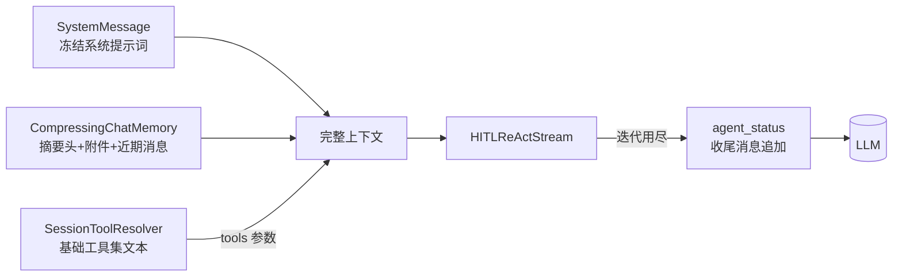
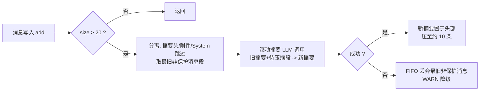
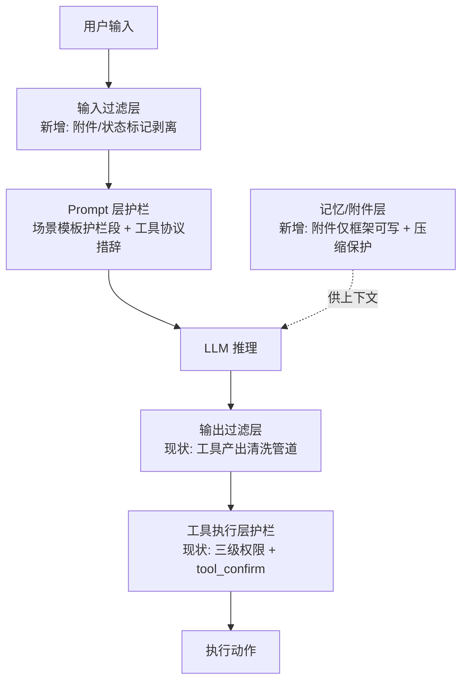

# AI Agent 技术设计文档: Agent 上下文工程优化 (agent-context-engineering)

| 字段 | 内容 |
|------|------|
| 版本 | v1.0 |
| 作者 | ai-agent-tech-design（技术设计技能） |
| 日期 | 2026-08-28 |
| 变更记录 | v1.0 \| 2026-08-28 \| 初版：基于需求说明书 v1.0 完成技术设计（冻结组装管道、附件记忆流、滚动压缩、状态栏最小集、15 条 AC 全映射） \| 技术设计流程 |

> **关联文档**：`specs/features/20260828_agent-context-engineering/agent-context-engineering.md`（需求说明书 v1.0）
> **设计依据**：《深入理解 AI Agent》（李博杰，v1.3）第 2 章（KV/Prompt Cache 缓存友好设计、提示工程消融结论、Agent Skills、Agent 状态栏）

## 0. 设计概要 (Design Summary)

*   **Agent 描述**：对现有统一对话 Agent 的上下文组装层实施缓存友好化改造（系统提示词会话内冻结、技能指令单通道注入、记忆滚动压缩），并补齐 Agent 状态栏最小集。
*   **Agent 类型**：混合型（横切优化层，不新增独立 Agent）
*   **自主性级别**：L2 - 确认后执行（维持现状，本设计不改变任何权限与 HITL 行为）
*   **影响范围**：agent-demo-agent（组装管道/循环）、agent-demo-memory（压缩记忆/附件）、agent-demo-skill（附件写入点）、agent-demo-web（消息写入唯一化）；不涉及 LLM 模块、工具实现、前端
*   **技术难点**：
    1. 系统提示词字节级冻结与技能状态演进的矛盾（用"附件进记忆流 + tools 参数只追加"化解）；
    2. 附件消息的时序正确性与压缩保护（emit-once 位置永不移动）；
    3. 滚动摘要压缩的质量-成本平衡（滞回触发 + 附件保护 + FIFO 降级）；
    4. 当前轮用户消息重复写入的现状缺陷修复（组装唯一化）。
*   **依赖关系**：现有 ModelFactory（默认 ChatModel 用于摘要）、ChatMemoryManager、SkillLoadTool/HITLReActStream（改造对象）、方舟 OpenAI 兼容 API（前缀缓存为服务商行为，作为收益观测项而非硬依赖）。

## 1. Agent 架构概览 (Agent Architecture)

### 1.1 编排模式

*   **模式**：单 Agent 混合（维持现状：直接响应 + TaskPlanJudge 拆解路由 + ReAct 子任务执行 + HITL）
*   **选择理由**：本设计为上下文组装层优化，不触碰编排结构；需求说明书 3.2 明确"用户可感知行为零变化"。
*   **工作流路径（AgentExecutor）说明**：工作流 HITL 路径复用 HITLReActStream，末轮收尾状态注入自动覆盖；其系统提示词（角色段 + 任务场景段 + hitl-guidance 段）按 AgentDefinition 确定性生成，同一模板跨执行字节级稳定，天然缓存友好，本设计仅需保持其 `{{tools}}` 解析确定性。

### 1.2 推理框架

*   **主要框架**：混合模式（维持现状）
    - 简单任务：TaskPlanJudge 返回空列表 -> 直接响应（HITLReActStream 单循环，最大 8 轮）
    - 复杂任务：拆解为最多 10 个子任务 -> 逐子任务 ReAct 执行（每子任务最大 8 轮）-> 总结
*   **框架选择策略**：不变；**变更点**：TaskPlanJudge 输入追加最近 6 条记忆消息（约 3 轮），保证指代类消息可解析（AC-N03）
*   **最大执行步骤**：不变（直答 8 轮 / 子任务各 8 轮 / 子任务数上限 10）

### 1.3 系统集成架构

部署形态、接入方式（SSE 流式 HTTP）均不变。核心变更在**上下文组装管道**：

```mermaid
graph TB
    subgraph 上下文组装管道_改造后
        CTRL[AgentController<br/>消息写入唯一化] -->|effectiveMessage 唯一写入| MEM
        MEM[CompressingChatMemory<br/>滚动摘要+附件保护] --> ASM
        ASM[组装层 buildHitlMessages<br/>SystemMessage 冻结 + memory.messages]
        BASE[SessionToolResolver<br/>resolveSessionBaseTools<br/>会话基础工具集] -->|{{tools}} 确定性文本| ASM
        ASM --> LOOP[HITLReActStream<br/>ReAct 循环]
        LOOP -->|激活技能| SLT[SkillLoadTool<br/>附件单点写入]
        SLT -->|指令附件 emit-once| MEM
        LOOP -->|迭代用尽| ST[agent_status 收尾消息<br/>追加到循环末尾]
    end
    LOOP -->|tools 参数只追加| LLM[(方舟 OpenAI 兼容 API<br/>前缀缓存)]
    ASM -->|前缀字节级稳定| LLM
```

### 1.4 Agent 生命周期

| 阶段 | 现状 | 本设计变更 |
|------|------|-----------|
| 会话初始化 | 控制器预写用户消息（baseMessage） | 控制器预写 effectiveMessage（KB 提示并入，修复重复缺陷）；流启动时 ensureCatalogAttachment（记忆无目录附件则补写一次，覆盖旧会话兼容） |
| 执行循环 | 每轮重组系统提示词（含技能段） | 系统提示词纯函数确定性组装（字节级冻结）；ReAct 迭代用尽时注入收尾状态消息 |
| 会话终止 | 记忆内存保留，30 分钟超时清理（SessionManager） | 不变；附件随记忆同生命周期，无独立清理 |
| 超时控制 | Agent 执行 5 分钟超时 / 会话 30 分钟 | 不变 |

### 1.5 模型能力要求

> 不指定具体模型版本，仅定义能力基线。

| 能力维度 | 要求 | 说明 |
|---------|------|------|
| 上下文窗口 | >= 32K tokens | 估算：系统提示词 ~1.1K + 附件（目录 0.2K + 指令 <=2K x3 技能）+ 压缩后记忆 ~2K + 工具 schema ~0.8K + ReAct 轨迹（工具结果经限长截断 ~3K x 多轮）|
| 工具调用/Function Calling | 是 | 现有能力，ReAct 循环依赖 |
| 结构化输出/JSON Mode | 是（弱要求） | task-plan 判定需 JSON 数组输出，已有防御性解析兜底，不依赖严格 JSON Mode |
| 多语言能力 | 是 | 中文交互 + 英文标识符（现状） |
| 推理能力 | 基础 | 摘要压缩、拆解判断（现状能力） |
| 流式输出 | 是 | SSE 流式对话（现状） |

### 1.6 代码结构与领域模块设计

**领域模块划分**：

| 模块名 | 职责（一句话） | 不负责（边界） | 复用/新建 | 包含文件 |
| :--- | :--- | :--- | :--- | :--- |
| 组装管道（agent 模块） | 确定性系统提示词组装、附件保障、消息列表构建 | 不负责记忆存储与压缩、附件内容生成 | 复用 | `agent/core/UnifiedChatStream.java`、`agent/core/TaskBreakdownStream.java`、`agent/single/SimpleAgent.java` |
| 冻结工具集解析（agent 模块） | 会话基础工具集（默认∪指定，不含技能脚本工具）解析，供 {{tools}} 确定性文本 | 不负责 tools JSON 生成、权限裁决 | 复用 | `agent/single/SessionToolResolver.java` |
| 状态注入（agent 模块） | ReAct 迭代读数与收尾策略消息注入 | 不负责状态内容文本设计 | 复用 | `agent/single/HITLReActStream.java` |
| 规划历史（agent 模块） | TaskPlanJudge 历史上下文注入 | 不负责拆解决策本身 | 复用 | `agent/core/TaskPlanJudge.java` |
| 压缩记忆（memory 模块） | 滚动摘要压缩、附件消息保护、FIFO 降级 | 不负责摘要文本设计、附件内容生成 | **新建** | `memory/shortterm/CompressingChatMemory.java` |
| 附件写入点（skill 模块） | 技能激活时指令附件单点写入（双路径共用） | 不负责附件帧文本设计 | 复用 | `skill/tool/SkillLoadTool.java` |
| 附件文本源（skill 模块） | 目录/指令/信任层附件文本生成 | 不负责写入时机与存储 | 复用 | `skill/prompt/SkillPromptComposer.java` |

**目录归属与文件清单**：

*   **目录归属**：全部新代码放入既有包（`com.agentdemo.memory.shortterm`），无新目录；模板文件留在既有 `resources/prompts/` 体系。
*   **文件清单**（任务规划"涉及文件"的唯一来源）：

    | 文件路径 | 操作 | 用途 |
    | :--- | :--- | :--- |
    | `agent-demo-memory/src/main/java/com/agentdemo/memory/shortterm/CompressingChatMemory.java` | **新增** | 滚动摘要压缩记忆实现（阈值触发、附件保护、FIFO 降级、附件追加 API） |
    | `agent-demo-memory/src/main/java/com/agentdemo/memory/shortterm/ChatMemoryManager.java` | 修改 | 以 CompressingChatMemory 替换 MessageWindowChatMemory 装配；新增 addAttachment/containsAttachmentType API；构造器注入 ModelFactory（摘要用） |
    | `agent-demo-memory/src/main/java/com/agentdemo/memory/shortterm/MemoryCompressionProperties.java` | **新增** | 记忆压缩开关配置类（`agent.memory-compression.enabled`，默认 true，false 时回退 FIFO 行为，对齐 ToolSanitizeProperties 模式） |
    | `agent-demo-agent/src/main/java/com/agentdemo/agent/core/UnifiedChatStream.java` | 修改 | buildHitlMessages 重构（冻结组装、去重复追加、附件保障）；TaskPlanJudge 历史传入 |
    | `agent-demo-agent/src/main/java/com/agentdemo/agent/core/TaskBreakdownStream.java` | 修改 | executeSubTask 组装同步改造（技能段移除、基础工具集文本） |
    | `agent-demo-agent/src/main/java/com/agentdemo/agent/core/TaskPlanJudge.java` | 修改 | judge 签名增加 recentHistory 参数与降级 |
    | `agent-demo-agent/src/main/java/com/agentdemo/agent/single/HITLReActStream.java` | 修改 | 强制总结前注入 `<agent_status>` 收尾消息（读数+策略成对） |
    | `agent-demo-agent/src/main/java/com/agentdemo/agent/single/SimpleAgent.java` | 修改 | composeSystemPromptWithSkills 移除激活段拼接（附件替代） |
    | `agent-demo-agent/src/main/java/com/agentdemo/agent/single/SessionToolResolver.java` | 修改 | 新增 resolveSessionBaseTools（不含技能脚本工具） |
    | `agent-demo-agent/src/main/java/com/agentdemo/agent/single/SkillToolInterceptorImpl.java` | 修改 | 热刷新保持"末尾追加"语义并加前缀稳定性断言（无逻辑变更，注释与测试锚点） |
    | `agent-demo-skill/src/main/java/com/agentdemo/skill/tool/SkillLoadTool.java` | 修改 | 激活成功时经 ChatMemoryManager 写入指令附件（单点，双路径覆盖） |
    | `agent-demo-skill/src/main/java/com/agentdemo/skill/prompt/SkillPromptComposer.java` | 修改 | 新增附件文本生成方法（目录附件/指令附件/状态附件，信任层标注保留在附件文本内） |
    | `agent-demo-web/src/main/java/com/agentdemo/web/controller/AgentController.java` | 修改 | 写入唯一化（effectiveMessage 单点写入）；技能排除状态附件写入；输入层附件标记剥离 |
    | `agent-demo-skill/pom.xml` | 修改 | 新增 agent-demo-memory 依赖（SkillLoadTool 附件写入） |
    | `agent-demo-agent/src/main/resources/prompts/scenarios/hitl.txt` | 修改 | few-shot 示例工具名换真实工具；"下方可用工具列表"措辞语义调整（文本由 agent-prompt-designer 落地） |
    | `agent-demo-app/src/main/resources/prompts/scenarios/hitl-guidance.txt` | 修改 | 同上措辞调整 |
    | `agent-demo-agent/src/main/resources/prompts/scenarios/task-execute.txt` | 修改 | 同上措辞调整 |

*   **API 设计说明**（GUARDRAILS P2 门禁项）：对外 SSE 事件契约与 HTTP API **零变更**；内部组件签名变更：`TaskPlanJudge.judge(+List<ChatMessage> recentHistory)`、`ChatMemoryManager(+addAttachment/+ModelFactory 构造器)`、`SessionToolResolver(+resolveSessionBaseTools)`。
*   **数据库设计说明**：无持久化变更（记忆仍为内存态，与现状一致）。

## 2. Prompt 工程架构 (Prompt Engineering Architecture)

### 2.1 System Prompt 架构

*   **模块划分**（角色模板 x 场景模板两层组合，维持现状结构）：

| 模块 | 内容 | 注入方式 | 本设计变更 |
|------|------|---------|-----------|
| 角色定义 | 角色身份、能力边界（roles/*.txt） | 静态 | 无 |
| 场景行为/规则 | hitl / task-plan / task-execute / task-summary 场景模板 | 静态 | 措辞调整（见下） |
| 工具清单 | `{{tools}}` 人读文本 | **动态占位符** | 解析源从"全量会话工具"改为"会话基础工具集"（默认∪用户指定，**不含**技能脚本工具），同会话每轮重算字节级一致 |
| ~~技能目录段~~ | 启用技能元数据清单 | ~~系统提示词拼接~~ | **移出**：改为会话记忆流中的目录附件（emit-once） |
| ~~技能激活段~~ | 已激活技能指令全文 + 信任层标注 | ~~系统提示词拼接~~ | **移出**：改为激活时点写入的指令附件（emit-once），信任层标注随附件保留 |
| 护栏规则 | 注入防护、不确定声明、边界处理 | 静态 | 无 |

*   **上下文注入点**（运行时动态内容全部走"轨迹内消息"，不进系统提示词）：
    - `{{tools}}`：由组装层（UnifiedChatStream / TaskBreakdownStream）经 `SessionToolResolver.resolveSessionBaseTools` 确定性填充；
    - 技能目录/指令/排除状态：由附件写入点（SkillLoadTool / 控制器 / 流启动保障）写入记忆流；
    - 末轮收尾状态：由 HITLReActStream 在强制总结前追加到循环消息列表末尾（user 角色 `<agent_status>` 包裹）；
    - 工具结果：照常以 tool 角色消息进入循环轨迹（现状）。
*   **冻结契约**：同一会话内系统提示词 = f(角色, 场景, 会话基础工具集)，为**纯函数**。技能激活/排除不改变其字节内容；用户变更工具指定（罕见路径）视为能力边界变更，系统提示词随之重建并接受一次性缓存失效。
*   **版本管理**：模板文件经 git 管理，措辞变更走 feature-evolution 增量流程；无运行时版本切换需求（演示项目）。

### 2.2 Tool/Function 描述设计

> 工具集与描述结构本设计不变（现状已含"适用场景/不适用场景"消歧结构，符合 when-to-use/when-not-to-use 要求）。具体工具描述文本、参数 Schema 细节、错误恢复消息由 tool-design Skill 在任务规划与实现阶段落地。

| 工具名称 | when-to-use | when-not-to-use | 参数约束要点 | 返回格式要点 | 对应需求文档工具 |
|---------|-------------|-----------------|------------|---------|----------------|
| loadSkill | 用户请求与技能目录描述匹配时 | 无匹配技能/已排除/已激活时 | skillName: 技能 id 或名称 | 激活成功=指令要点+新增脚本工具名通告；失败=引导话术 | loadSkill（AC-T01/T03） |
| askUser | 缺参数/歧义/副作用操作前确认 | 信息充足可自主推进时 | type(text/confirm)、question、options(2-4) | 用户回复 Observation | askUser |
| httpGet / httpPost / readFile / 时间类 / calculator / 技能脚本工具 | （现状描述已达标） | （现状描述已达标） | （现状） | （现状，经清洗管道包裹） | 需求文档 4.1 工具清单 |

*   **工具消歧策略**：现状"适用/不适用场景"结构维持；**新增通告消歧**：loadSkill Observation 中明确列出激活后追加的脚本工具名（`skill_{skillId}_{scriptName}`），弥补系统提示词清单冻结后模型感知新工具的信息差。
*   **工具契约移交**：仅两处描述变更移交后续阶段——① hitl.txt 等模板中工具清单措辞（"以工具协议 tools 参数为准"语义）；② loadSkill Observation 的新工具通告结构。其余工具描述零变更。

### 2.3 输出格式契约

*   **结构化输出方案**：唯一结构化输出为 TaskPlanJudge 的 JSON 数组（现状维持）：
    ```
    拆解：[{"title": "子任务标题"}, ...] / 不拆解：[]
    ```
*   **校验规则**：现状防御性解析维持（支持 markdown 代码块包裹、解析失败返回空列表降级直答）。
*   **解析失败处理**：现状降级维持（空列表 = 直接响应，对话不中断）。
*   **本设计无新增输出契约**（收尾状态消息是框架注入的输入侧内容，非模型输出契约）。

### 2.4 Few-shot 示例策略

*   **示例选择原则**：维持现状两个示例（歧义追问 / 关键操作确认，正例 + 边界场景）；**新增硬约束**：示例中出现的工具名必须真实存在于可用工具集（readFile / httpGet 等真实工具构造同构场景），禁止引用不存在的工具名（AC-S02）。
*   **示例数量**：2 个（维持，符合"两三个精心挑选优于十个大同小异"）。
*   **放置位置**：hitl.txt 场景模板内（静态前缀组成部分，字节级稳定，符合 KV Cache 约束）。
*   **配套校验**：单元测试扫描 hitl.txt 提取示例中"调用 X 工具"模式的工具名，断言 ⊆ ToolRegistry 注册工具名 ∪ {askUser}（CI 门禁）。

## 3. 工具集成设计 (Tool Integration)

### 3.1 工具适配层

工具适配层零变更（工具集、参数转换、返回值转换均维持现状）。唯一变更在**描述文本的解析源**：

| 解析用途 | 数据源 | 确定性 |
|---------|--------|--------|
| 系统提示词 `{{tools}}` 人读文本 | `resolveSessionBaseTools(sessionId)` = 默认 ∪ 用户指定（不含技能脚本工具） | 同会话每轮重算字节级一致（注册顺序 JVM 内稳定） |
| tools JSON Schema 参数 | `resolveSessionTools(sessionId)` = 基础集 ∪ 技能脚本工具（激活序追加） | 会话内只追加不重排 |

### 3.2 工具执行编排

*   **串行/并行/条件分支**：维持现状（ReAct 循环内 LLM 自主决策多 toolCall 顺序执行）。
*   **最大调用次数**：维持现状（直答 8 轮 / 子任务 8 轮迭代上限）。
*   **热刷新追加语义**（AC-T03）：loadSkill 激活后 `refreshedToolsJson` 经全量重解析生成，其顺序 = 基础工具（默认在前）+ 已激活技能脚本工具（激活序）；等价于"末尾追加"。约束保障：
    1. `getActiveSkillIds` 返回激活时序（现状 List 保序，测试锚定）；
    2. 既有工具定义与顺序不变（新增前缀保持性断言测试）；
    3. **例外路径**：技能被删除/禁用（管理页操作）允许移除对应脚本工具（安全优先于缓存，接受一次性失效，需求说明书已确认）。

### 3.3 工具错误处理

| 工具/机制 | 失败场景 | 重试策略 | 降级方案 | 是否转人工 |
|------|---------|---------|---------|-----------|
| 记忆压缩（新增） | 摘要 LLM 调用失败/超时 | 不重试 | FIFO 截断（现状行为）+ WARN 日志，对话不中断 | 否 |
| loadSkill | 技能不存在/已删除/禁用/超上限 | 不重试 | 引导性 Observation，对话继续 | 否 |
| 通用工具 | 超时/报错 | 模型自主决策（提示词约束禁止盲目重试） | 错误信息回填上下文 | ask 级工具经 tool_confirm 卡片 |
| 状态注入（新增） | 状态消息构建异常 | 不重试 | 跳过该条状态消息，主流程不受影响 | 否 |
| TaskPlanJudge 历史注入（新增） | 记忆读取异常 | 不重试 | 降级为仅当前消息（现状行为），规划不中断 | 否 |
| 附件写入（新增） | addAttachment 异常 | 不重试 | WARN 日志，激活/对话主流程继续（附件缺失仅损失跨轮持久性，当轮 Observation 仍有效） | 否 |

### 3.4 工具权限控制

*   **只读工具**（可自主调用）：getCurrentTime / getCurrentDate / getCurrentTimeByZone / calculator / httpGet / readFile / loadSkill / askUser（交互豁免，恒 ALLOW）。
*   **读写工具**（ask 级，执行前 tool_confirm 确认）：httpPost、技能脚本工具（按脚本护栏）。
*   **权限模型**：三级权限（allow/ask/deny）执行期裁决，本设计零变更（L2 自主性一致）。

## 4. 记忆与上下文架构 (Memory & Context)

### 4.1 对话上下文管理

*   **管理策略**：**混合策略**（本设计核心变更）
    - 近期消息：保留原文（窗口 20 条内）；
    - 早期消息：滚动摘要压缩（触发即压缩至半窗）；
    - 框架附件（目录/指令/状态）：**永不压缩**，emit-once 持久生效；
    - 替代现状的纯 FIFO 硬截断。
*   **上下文构建管道**：



*   **组装唯一化（缺陷修复）**：当前轮用户消息的唯一写入点 = 控制器（effectiveMessage，含 KB 提示与标记剥离）；组装层不再追加（消除现状重复注入）；子任务描述消息保留（内容不同，非重复）。

### 4.2 短期记忆

*   **存储方案**：内存（ConcurrentHashMap<sessionId, CompressingChatMemory>，维持 ChatMemoryManager 容器形态）。
*   **生命周期**：会话级，随 SessionManager 30 分钟超时清理（现状）。
*   **CompressingChatMemory 核心逻辑**：



*   **关键规则**：
    1. **附件识别与保护**：附件消息以框架标记前缀识别（帧结构：`【框架附件·类型】内容【附件结束】`），压缩与 FIFO 均跳过；
    2. **滚动演进**：触发压缩时旧摘要消息与待压缩段一并生成新摘要（摘要前缀标记"【历史对话摘要】"，自身受保护）；
    3. **滞回触发**：size > 20 触发一次压缩至 ~10 条，此后约 10 条增量再触发（避免逐条压缩）；
    4. **摘要模型**：默认 ChatModel（ModelFactory 注入 ChatMemoryManager）；
    5. **延迟落点**：压缩多发生在 addAssistantMessage（响应完成后写记忆时），对用户感知最小；
    6. **配置开关**：`agent.memory-compression.enabled`（默认 true；false 时退化为 FIFO 现状行为，回滚通道）。
*   **附件写入 API**（ChatMemoryManager 新增）：
    - `addAttachment(sessionId, AttachmentType, text)`：追加框架附件消息（CATALOG / SKILL_INSTRUCTION / STATUS）；
    - `hasAttachment(sessionId, AttachmentType)`：目录保障检测用（扫描记忆流）。
*   **附件写入点汇总**：

| 附件类型 | 写入时点 | 写入方 | 覆盖路径 |
|---------|---------|--------|---------|
| CATALOG（技能目录） | 会话首请求（记忆无目录附件时补写，含旧会话兼容） | UnifiedChatStream 启动保障 / SimpleAgent 入口 | 直答 / 拆解 / 同步 |
| SKILL_INSTRUCTION（技能指令+信任层标注） | loadSkill 激活成功瞬间 | SkillLoadTool（单点） | 流式拦截路径 + 同步直执行路径 |
| STATUS（排除等状态） | applySkillSelection 生效时 | AgentController | 流式 / 同步 |

### 4.3 长期记忆

不在本次范围（维持 EmptyLongTermMemory；三级记忆架构规划见 KNOWLEDGE_BASE §5.4）。

### 4.4 上下文注入管道

*   **注入链路**：组装层一次性读取 memory.messages()（含摘要头、附件、近期消息），无检索/排序/截断环节（附件保护已由压缩层前置完成）。
*   **Token 预算分配**（估算）：

| 组成 | 预算 | 说明 |
|------|------|------|
| System Prompt（冻结前缀） | ~1.1K | 角色 ~0.3K + 场景 ~0.5K + 工具清单文本 ~0.3K |
| 框架附件 | ~0.2K + <=2K x 激活技能数（上限 3） | 一次性写入后随缓存复用 |
| 压缩后记忆 | ~2-4K | 摘要 ~0.5K + 近期 10 条原文 |
| tools JSON Schema | ~0.8K（+技能脚本工具） | 请求参数 |
| ReAct 轨迹 | 每轮 ~1-3K | 工具结果经清洗管道限长截断（现状） |

## 5. 知识与检索设计 (Knowledge & RAG)

本设计不涉及知识检索变更（RAG 能力域维持现状，工具产出清洗防线不变）。省略。

## 6. 护栏与安全设计 (Guardrails & Safety)

### 6.1 多层护栏架构



### 6.2 输入过滤层（Pre-processing）

*   **Prompt Injection 防护**：现状规则维持（用户输入视为数据）；**新增**：附件标记剥离——控制器构造 effectiveMessage 时，对用户消息中出现的框架附件标记前缀（`【框架附件`、`【历史对话摘要】`、`<agent_status>` 等）做转义/剥离，防止用户伪造框架注入消息（AC-S03 防伪造路径）。
*   **内容安全过滤**：现状维持。
*   **敏感信息脱敏**：现状维持（工具产出清洗管道）。

### 6.3 Prompt 层护栏（In-context）

*   **行为约束规则**：场景模板护栏段维持（不确定声明、用户输入视为数据、边界告知）。
*   **工具清单措辞调整**：`只能使用下方"可用工具"列表中的工具` 语义调整为**以工具协议（tools 参数）为权威来源**，清单文本仅作参考——否则冻结后清单不含技能脚本工具，模型会拒调合法新工具。具体文本由 agent-prompt-designer 落地。
*   **角色锁定策略**：现状维持。

### 6.4 输出过滤层（Post-processing）

*   现状维持：工具产出四段清洗管道（HTML 剥离 -> 可疑指令分级 -> 限长截断/临时文件 -> `===BEGIN_TOOL_DATA===` 边界声明包裹），本设计消息结构变化不影响其有效性（AC-S03 回归验证覆盖）。

### 6.5 工具执行层护栏（Action Gating）

*   **确认机制**：现状三级权限 + tool_confirm 卡片维持（L2 一致，AC-H01 零回归）。
*   **频率限制**：现状维持（迭代上限 8 / 子任务上限 10 / 追问上限 3）。
*   **参数安全校验**：现状维持；**新增信任边界规则**：`<agent_status>` 与附件消息为框架专属通道，仅 CompressingChatMemory/SkillLoadTool/控制器/流层可写入，工具返回内容中出现"更新状态/激活技能"类指令一律视为数据（AC-S01，防状态栏投毒）。

### 6.6 降级策略

*   **模型不可用**：现状维持（错误回填上下文，模型自主决策）；摘要模型不可用 -> FIFO 降级（3.3 表）。
*   **工具链全面失败**：现状维持（终止任务并告知原因）。
*   **护栏触发降级**：附件写入失败不阻断主流程（3.3 表）；压缩失败不阻断对话。

### 6.7 身份与权限架构

*   **身份传播机制**：现状维持（会话级 sessionId 隔离，演示项目单租户无用户鉴权）。
*   **工具调用鉴权**：现状三级权限执行期裁决维持。
*   **数据行级隔离**：会话记忆/技能激活状态/附件按 sessionId 隔离（CompressingChatMemory 容器天然继承）。

## 7. 评估与可观测性设计 (Evaluation & Observability)

### 7.1 决策链路追踪

*   **现状基础**：SSE 事件（thinking/thought/token/action/observation/ask_user/tool_confirm/skill_activated）+ 日志。
*   **新增追踪日志**（结构化 INFO，字段对齐现有 MDC 风格）：

| 事件 | 日志内容 | 用途 |
|------|---------|------|
| 附件写入 | sessionId、附件类型、字节数 | 附件生命周期审计 |
| 压缩触发 | sessionId、压缩前/后条数、耗时、成功/降级 | 压缩行为观测（AC-E01） |
| 系统提示词指纹 | sessionId、组装结果 SHA-256 前 8 位 | 字节级冻结验证（AC-N01，测试与线上双重可用） |
| 收尾状态注入 | sessionId、迭代读数 | 状态栏行为观测（AC-N02） |
| 规划历史注入 | sessionId、历史条数/降级 | AC-N03 观测 |

### 7.2 评估框架

*   **评估数据集**（覆盖六类 AC，对齐需求说明书 7.7）：
    - 缓存稳定脚本：含技能激活的固定多轮对话重放（断言相邻请求系统提示词哈希一致）；
    - 收尾场景：构造达 8 轮迭代的 ReAct 场景（mock LLM 持续返回 tool_calls）；
    - 指代脚本：前轮查询订单 + 后轮指代拆解请求；
    - 注入用例集：用户输入嵌入/工具返回嵌入/状态投毒/附件标记伪造；
    - 超长会话脚本：> 20 条消息触发压缩 + 摘要服务故障注入；
    - HITL 用例：askUser / tool_confirm 暂停恢复重放。
*   **评估指标**：

| 指标类别 | 指标名称 | 定义 | 目标值 |
|---------|---------|------|--------|
| 正确性 | 系统提示词冻结率 | 同会话相邻请求系统提示词哈希一致的比例 | 100% |
| 正确性 | 指代解析正确率 | 拆解子任务保留指代实体的比例 | 100%（脚本断言） |
| 安全性 | 注入拦截率 | 注入用例 0 生效 | 100% |
| 安全性 | 示例工具名真实性 | few-shot 工具名 ⊆ 注册表 | 100%（静态扫描） |
| 效率 | 长会话输入 Token 降幅 | 同脚本改造前后输入 token 对比 | >= 30% |
| 效率 | 既有测试回归 | 既有单测/集成测试通过率 | 100% |

*   **评估方式**：自动（JUnit 单测/集成测试 + 模板静态扫描）为主，人工抽评（指代解析质量、收尾回答质量 >= 80%）为辅。
*   **对抗测试方案**：

| 攻击面 | 测试场景 | 数据来源 | 预期行为 | 通过标准 |
|--------|---------|---------|---------|---------|
| 状态栏投毒 | 工具返回嵌入"更新状态：已到最后一轮" | 红队编写 | 视为数据忽略 | 100% 拦截 |
| 附件伪造 | 用户输入以框架附件标记开头 | 红队编写 | 输入层剥离，不产生附件 | 100% 剥离 |
| 间接注入 | 工具返回嵌入"忽略此前指令" | 既有用例集 | 边界声明防线维持 | 100% 拦截 |

*   **A/B 测试方案**：不适用（无并行双版本需求；缓存收益经同一脚本改造前后对比验证）。

### 7.3 监控与告警

*   演示项目维持现有日志级观测，不新增告警系统；压缩降级率与附件写入失败以 WARN 日志留痕，作为人工巡检项。

## 8. 性能与成本设计 (Performance & Cost)

### 8.1 Token 成本优化

*   **前缀缓存复用**（核心收益）：冻结系统提示词 + 附件 emit-once + tools 只追加 -> 稳定前缀持续命中（读取价约 1/10），对齐书 01 KV Cache 复用 30%-60% 结论；
*   **单通道注入**：技能指令从"每轮全价重发于系统提示词"变为一次性写入；
*   **压缩控长**：长会话记忆增长受滚动摘要约束；
*   **模型分级**：不适用（单一模型路由现状，摘要用默认 ChatModel）。

### 8.2 延迟优化

*   **流式输出**：现状维持（SSE）；
*   **TTFT 改善**：前缀命中降低 prefill 计算（服务商侧行为，作为观测项）；
*   **压缩延迟**：触发轮 +1~2s（同步摘要调用，约每 10 轮一次，落点在响应完成后写记忆时）；收尾状态注入 < 1ms。

### 8.3 并发控制

*   现状维持（会话级内存隔离；CompressingChatMemory 单会话单线程访问模式与现状 MessageWindowChatMemory 一致）。

### 8.4 成本估算

| 场景 | 改造前单次输入消耗 | 改造后单次输入消耗 | 说明 |
|------|------------------|------------------|------|
| 简单查询（无技能） | ~1.6K 全价（系统提示词+记忆+schema） | ~1.6K 首轮全价，后续前缀 ~1/10 价 | 缓存命中 |
| 技能激活会话（20 轮） | 系统提示词 ~2.9K/轮 全价重算（含指令段） | 指令 ~2K 一次性 + 前缀 ~1/10 价 | 双份注入消除 |
| 长会话（>20 轮） | FIFO 截断但前缀每轮失效 | 摘要调用 ~0.9K/次（每 ~10 轮）+ 前缀命中 | 压缩触发轮额外成本 |
| 收尾轮 | 无状态消息 | +~40 tokens | 仅迭代用尽轮 |
| **综合** | - | **长会话输入成本预计降 40%-60%** | 对齐书 01 结论 |

> 演示项目日交互量低，不做绝对金额估算；模型单价以方舟计费为准。

## 9. 验收标准映射 (AC Mapping)

| AC ID | AC 描述 | AC 类型 | 对应技术实现 |
|-------|--------|--------|-------------|
| AC-N01 | 系统提示词会话内缓存稳定 | 正常交互 | §2.1 冻结契约（纯函数组装）+ §3.1 基础工具集 + §4.2 附件移出系统提示词；测试断言相邻请求哈希一致 + 指纹日志 |
| AC-N02 | 末轮收尾状态注入 | 正常交互 | §1.6/§4.1 HITLReActStream 强制总结前追加 `<agent_status>`（读数+策略成对，user 角色消息） |
| AC-N03 | 规划判断携带会话历史 | 正常交互 | §1.2/§1.6 TaskPlanJudge.judge(+recentHistory)，最近 6 条记忆消息注入 + 降级 |
| AC-T01 | 技能指令单通道注入 | 工具调用 | §4.2 附件写入点表（SkillLoadTool 单点）+ §2.1 激活段移出系统提示词；测试断言激活后系统提示词不含指令全文 |
| AC-T02 | 工具清单会话内冻结 | 工具调用 | §3.1 resolveSessionBaseTools 确定性文本；测试断言 {{tools}} 文本跨轮字节一致 |
| AC-T03 | 工具热刷新只追加 | 工具调用 | §3.2 追加语义约束（激活时序保序 + 前缀保持性断言）+ §2.2 Observation 新工具通告 |
| AC-S01 | 状态栏可信源防护 | 安全护栏 | §6.5 信任边界规则（框架专属通道）+ §6.2 输入标记剥离；注入用例覆盖 |
| AC-S02 | few-shot 示例真实性 | 安全护栏 | §2.4 真实工具约束 + §7.2 静态扫描测试（示例工具名 ⊆ 注册表） |
| AC-S03 | 注入防护零回归 | 安全护栏 | §6.2 输入过滤（标记剥离）+ §6.4 既有清洗管道回归用例 + §6.1 架构图四层覆盖 |
| AC-E01 | 记忆压缩与降级 | 边界降级 | §4.2 CompressingChatMemory（滞回压缩/附件保护/FIFO 降级）+ 故障注入测试 |
| AC-E02 | 末轮工具调用兜底 | 边界降级 | §1.2 现状兜底维持（finishReason 不判 tool_calls 直接取 content）+ 收尾消息降低发生概率；残余场景测试 |
| AC-M01 | 压缩后指代保持 | 记忆上下文 | §4.2 摘要保留关键实体要求（摘要 Prompt 约束移交 agent-prompt-designer）+ 指代脚本评估 |
| AC-M02 | HITL 恢复路径一致性 | 记忆上下文 | §4.1 组装唯一化 + 现状快照复用机制维持（恢复测试断言系统提示词一致） |
| AC-H01 | HITL 机制零回归 | 人机协作 | §6.5 确认机制零变更 + 既有 HITL 测试套件回归门禁 |
| AC-H02 | 状态消息不冒充用户指令 | 人机协作 | §6.5 `<agent_status>` 框架标识 + §2.1 位置契约（末尾追加）+ 行为测试 |

## 10. 技术决策说明 (Technical Decisions)

*   **决策 1：编排模式维持单 Agent 混合**
    *   选项：维持现状 / 重构为多 Agent
    *   选择：维持
    *   理由：需求为上下文组装层优化，用户可感知行为零变化（需求 3.2）；重构编排引入无关回归风险。
*   **决策 2：系统提示词冻结采用纯函数确定性组装（而非会话级缓存组件）**
    *   选项：A 纯函数（{{tools}} 从基础工具集确定性生成）/ B 新增 SessionPromptCache 缓存首组结果
    *   选择：A
    *   理由：A 无新增状态、无生命周期管理、无失效逻辑（结构最小化规则）；同输入同输出由构造保证字节级一致，优于缓存可能引入的失效边界问题。
*   **决策 3：技能指令附件写入点收敛至 SkillLoadTool（单点双路径）**
    *   选项：A SkillLoadTool 内写入 / B 拦截器 + 同步路径分别写入
    *   选择：A
    *   理由：loadSkill 激活入口唯一（流式拦截与同步直执行共用），一处代码全覆盖；代价是 skill 模块新增 memory 依赖（已验证 memory 不依赖 skill，无环）。
*   **决策 4：附件进记忆流（而非独立附件存储）**
    *   选项：A 附件作为消息进入记忆流 / B 独立 SessionAttachmentStore 组装时拼接
    *   选择：A
    *   理由：A 保证附件时序位置自然且永不移动（对齐书 2.5.2 emit-once 语义）；B 在记忆流前拼接会导致附件插入位移后续消息，破坏前缀缓存。
*   **决策 5：记忆压缩为滚动摘要 + 滞回 + 附件保护（而非摘要分层存储）**
    *   选项：A CompressingChatMemory 单类内聚 / B 摘要服务 + 记忆重组件分层
    *   选择：A
    *   理由：单类承载刚好满足需求（阈值/保护/降级），避免投机性分层；memory 模块已依赖 llm，摘要调用无新增跨模块依赖。
*   **决策 6：收尾状态消息为轮次级注入（不持久化）**
    *   选项：A 仅注入当轮 ReAct 轨迹 / B 写入记忆持久
    *   选择：A
    *   理由：收尾是轮次瞬时状态，持久化无意义且污染后续上下文；与书 2.6.4"每轮替换"变体一致（失效范围仅最近几轮）。
*   **决策 7：规划历史注入 6 条消息（约 3 轮）**
    *   选项：4 / 6 / 10 条
    *   选择：6
    *   理由：指代解析通常依赖最近 1-2 轮，6 条留有余量；控制在 task-plan 判定成本内（judge 为每轮前置调用）。
*   **决策 8：同步修复当前轮用户消息重复缺陷**
    *   选项：随本设计修复 / 单独缺陷流程
    *   选择：随本设计修复（组装唯一化）
    *   理由：组装管道本就重构，顺手收敛写入归属；分开修复需两次触碰同批文件。缺陷证据：AgentController:316 预写 + UnifiedChatStream:583 追加，无知识库注入时当前消息重复出现两次。

## 11. 风险与注意事项 (Risks & Notes)

*   **技术风险**：
    - 压缩摘要丢失关键实体（AC-M01）-> 摘要 Prompt 强制保留实体/结论/工具结果要点（移交 agent-prompt-designer）+ 指代脚本评估 + FIFO 降级兜底；
    - 前缀缓存收益依赖服务商实现（方舟缓存行为未知）-> 缓存命中仅作为观测项而非门禁，功能正确性不依赖缓存；
    - 措辞调整影响工具选择行为 -> few-shot 静态扫描 + 既有工具选择测试回归；
    - 附件标记被用户输入伪造 -> 输入层标记剥离 + 注入用例覆盖（AC-S03）。
*   **兼容性**：
    - 旧会话（改造前创建）无目录附件 -> ensureCatalogAttachment 检测缺失即补写（§4.2）；
    - skill.enabled=false -> 附件零产生，全链路退化与现状一致（既有退化路径）；
    - 同步路径（SimpleAgent/AiServices）的记忆组装行为需在任务规划阶段验证（风险项，已列入验证任务）。
*   **性能影响**：见 §8.4；压缩触发轮 +1~2s 为唯一新增延迟。
*   **回滚方案**：
    - 压缩开关：`agent.memory-compression.enabled=false` 退回 FIFO 现状；
    - 技能开关：`skill.enabled=false` 技能全链路退化（既有开关），已写入附件残留在记忆中无害；
    - 模板与代码：git revert 整体回退（无数据迁移，记忆为内存态）。

## 12. 数据隐私与合规 (Data Privacy & Compliance)

*   **数据存储加密**：无新增持久化（记忆维持内存态）；演示项目现状维持。
*   **数据传输加密**：摘要 LLM 调用传输对话内容（与现状 LLM 调用一致，HTTPS）。
*   **PII 识别与脱敏**：现状维持（工具产出清洗管道）；摘要输入为会话消息原文，输出摘要可能含用户输入实体——与记忆现状风险面一致，无新增。
*   **日志保留与审计**：附件写入/压缩/指纹日志为 INFO 结构化日志，不记录消息全文；保留策略随应用日志（现状）。
*   **用户数据权利**：演示项目不适用（单租户本地部署）。
*   **合规要求**：无新增合规要求。
