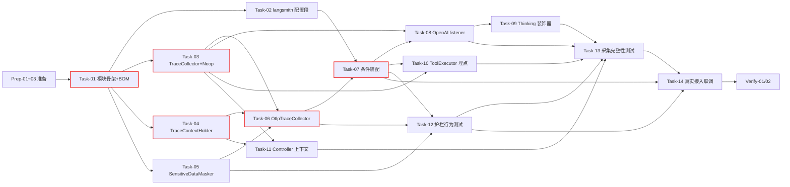

# AI Agent 开发任务计划: LangSmith 可观测子系统 (langsmith-observability)

> **关联文档**：`specs/features/20260829_langsmith-observability/langsmith-observability.md`（需求说明书 v1.0）、`specs/features/20260829_langsmith-observability/langsmith-observability_技术方案.md`（技术设计 v1.0）
> **阶段自适应说明**：本需求为**平台基础设施接入**（旁路采集 + OTel 导出），非新建 Agent。跳过模板中的 Prompt 工程（零 Prompt 制品变更）、记忆与上下文（维持现状）、知识检索、身份鉴权阶段；评估基建复用既有 JUnit 5 + Mockito（无新建独立评估框架），行为测试以 OTel `InMemorySpanExporter` 为无外联测试缝（Mock），Task-14 为真实接入（替换 Mock 为真实 LangSmith 上报）。聚焦 4 个变更域：模块与依赖基建 → 采集核心组件 → 埋点适配 → 行为测试与评估。

## 0. 任务概览 (Task Overview)

*   **Agent 名称**：langsmith-observability（LangSmith 可观测子系统）
*   **总任务数**：19 项（3 准备 + 14 开发 + 2 验证）
*   **预计总工时**：1110 分钟（约 19 小时）
*   **任务类型分布**：
    *   确定性组件（TDD）：8 个（Task-03/04/05/06/08/09/10/11）
    *   概率性组件（EDD，含迭代）：**0 个**（本特性零 Prompt 制品变更，全确定性，无评估调优迭代）
    *   基础设施（集成验证）：3 个（Task-01/02/07）
    *   行为测试：3 个（Task-12/13/14）
*   **风险任务**：Task-09（Thinking 装饰器异步回调时序与 TokenUsage 提取）、Task-14（LangSmith 联调：网络可达/thread 聚合属性键/账号权限）⚠️
*   **阻塞任务**：Task-01、Task-03、Task-04、Task-06、Task-07 🔒
*   **Prompt 迭代预期**：不适用（零概率性组件，无 Prompt 制品，无 EDD 迭代）

### 依赖关系图

### 可并行任务组

| 并行组 | 可同时执行的任务 | 说明 |
| :--- | :--- | :--- |
| 并行组 1 | Task-02 + Task-03 + Task-04 + Task-05 | 模块骨架完成后的四个独立组件：配置段、采集接口、上下文持有、脱敏器互不依赖 |
| 并行组 2 | Task-08 + Task-10 + Task-11 | 三处埋点（ModelFactory listener / ToolExecutor / AgentController）在采集接口就绪后可并行（Task-09 因同改 ModelFactory 依赖 Task-08 串行） |
| 并行组 3 | Task-12 + Task-13 | 两类行为测试（护栏/完整性）可并行推进，各自完成后汇聚到 Task-14 |

## 1. 准备工作 (Preparation)

- [x] **Prep-01**: 创建功能分支 `feature/langsmith-observability`
    *   **通俗解释**: 所有改动先放在独立分支上，不直接动主干，方便随时回退。
    *   **说明**: 从当前分支创建新功能分支
    *   **验证**: 分支创建成功
    *   **预估工时**: 10m
- [x] **Prep-02**: 既有测试套件基线跑通
    *   **通俗解释**: 动手改造前先确认现有功能都是好的，改造后若有问题立刻能分辨是不是我们改坏的。
    *   **说明**: 运行 agent-demo-llm / agent-demo-tools / agent-demo-web 相关模块既有测试，记录基线（项目习惯：编译用 `mvn compile -pl {模块} -am`，测试用 `mvn test -pl {模块} -am "-Dtest=XXX" "-Dsurefire.failIfNoSpecifiedTests=false"`）
    *   **验证**: `mvn test -pl agent-demo-llm,agent-demo-tools,agent-demo-web -am` 全部通过，记录失败项为已知基线
    *   **预估工时**: 20m
- [x] **Prep-03**: LangSmith 云连通性与账号验证
    *   **通俗解释**: 先确认能连上 LangSmith 云服务、有可用的账号密钥，否则最后联调会卡住。
    *   **说明**: 验证 `https://api.smith.langchain.com/otel/` OTLP 端点网络可达（curl 连通性测试，含 https 443 出口）；注册/确认 LangSmith 账号并创建 API Key；确认密钥注入方式（start.ps1 环境变量注入先例）
    *   **验证**: OTLP 端点 TCP/TLS 连通成功；API Key 生成且可经环境变量注入；记录连通性结论作为 Task-14 输入
    *   **预估工时**: 30m

## 2. 开发任务 (Development Tasks)

### 阶段一：模块与依赖基建 (Module & Dependency Infrastructure)
> 搭建新模块骨架、OTel 依赖登记与配置段。
>
> **阶段完成标准**：`agent-demo-observability` 模块可编译；OTel 依赖经 BOM 统一管理；`langsmith` 配置段定义完整（默认关）

- [x] **Task-01**: agent-demo-observability 模块骨架与 OTel 依赖登记 🔒
    *   **通俗解释**: 做完这步后，项目里多出一个专门的"观测模块"，所有追踪代码都有地方放了，并注册好需要用到的观测工具库。
    *   **任务类型**: 基础设施
    *   **验证策略**: 集成验证
    *   **说明**: 创建 `agent-demo-observability` 模块（仅依赖 common + OTel 三 artifact：opentelemetry-api / opentelemetry-sdk / opentelemetry-exporter-otlp + 测试作用域 opentelemetry-sdk-testing）；根 pom `<modules>` 登记；BOM properties 定义 OTel 版本 + dependencyManagement 登记 + 模块登记；llm/tools/web/bootstrap 四个 pom 增加对 observability 的依赖声明
    *   **涉及文件**: `pom.xml`（根）、`agent-demo-bom/pom.xml`、`agent-demo-observability/pom.xml`（新增）、`agent-demo-llm/pom.xml`、`agent-demo-tools/pom.xml`、`agent-demo-web/pom.xml`、`agent-demo-bootstrap/pom.xml`
    *   **参考**: 技术方案 §1.6、§10 决策 1/2/7
    *   **对应AC**: 无直接 AC（基础设施，支撑后续全部）
    *   **预估工时**: 60m
    *   **依赖**: Prep-02、Prep-03
    *   **阻塞标注**: 🔒 后续全部任务依赖
    *   **验证标准**（集成验证）:
        - [ ] `mvn compile -pl agent-demo-observability -am` 编译通过
        - [ ] llm/tools/web/bootstrap 依赖解析正常且编译通过
        - [ ] OTel 版本仅存在于 BOM properties（无硬编码版本散落 pom）

- [x] **Task-02**: langsmith 配置段定义
    *   **通俗解释**: 做完这步后，系统有了一个"开关"配置区，可以控制要不要开观测、连到哪、上报多长内容，默认是关着的。
    *   **任务类型**: 基础设施
    *   **验证策略**: 集成验证
    *   **说明**: application.yml 新增 `langsmith` 段：`enabled`（默认 false）、`api-key`（`${LANGSMITH_API_KEY:}`）、`endpoint`（默认 LangSmith OTLP 端点）、`max-field-chars`（4000）、导出间隔/超时、`proxy`（可选，默认空，预留代理配置）；配置读取在 Task-07 装配时消费
    *   **涉及文件**: `agent-demo-bootstrap/src/main/resources/application.yml`
    *   **参考**: 技术方案 §1.4、§6.2、§10 决策 7、§11 风险 2
    *   **对应AC**: AC-S02（默认关配置承载）、AC-E02（max-field-chars）
    *   **预估工时**: 30m
    *   **依赖**: Task-01
    *   **验证标准**（集成验证）:
        - [ ] 未配置 langsmith 段时应用启动正常（enabled 缺省 false，零外联）
        - [ ] 配置项可被 @Value/装配类读取（启动冒烟）

### 阶段二：采集核心组件 (Collection Core Components)
> 采集接口、上下文持有、脱敏器、OTel span 构建、条件装配。
>
> **阶段完成标准**：采集接口与事件定义就绪；上下文可在异步线程内持有；脱敏截断生效；span 构建与属性正确；装配按开关/密钥自动切换 Noop/Otlp

- [x] **Task-03**: TraceCollector 接口与事件定义 + NoopTraceCollector 🔒
    *   **通俗解释**: 做完这步后，埋点代码有了一份统一的"上报接口"清单，并且自带一个什么都不做的空实现——开关没开时所有采集动作自动变成空操作。
    *   **任务类型**: 确定性组件
    *   **验证策略**: TDD（Red-Green-Refactor）
    *   **说明**: `TraceCollector` 接口（`recordLlm(LlmCallEvent)` / `recordTool(ToolCallEvent)`）+ 嵌套 record（模型名/消息列表/Token 用量/耗时/成败/异常信息/会话与请求上下文字段，与技术方案 §7.1 span 设计表对应）+ `NoopTraceCollector` 空实现
    *   **涉及文件**: `agent-demo-observability/src/main/java/com/agentdemo/observability/TraceCollector.java`（新增）、`agent-demo-observability/src/main/java/com/agentdemo/observability/NoopTraceCollector.java`（新增）
    *   **测试文件**: `agent-demo-observability/src/test/java/com/agentdemo/observability/NoopTraceCollectorTest.java`（新增）
    *   **参考**: 技术方案 §1.6、§3.1、§7.1
    *   **对应AC**: AC-N01/N03/N04（采集接口基础）
    *   **预估工时**: 60m
    *   **依赖**: Task-01
    *   **阻塞标注**: 🔒 被 Task-06/08/09/10/11 依赖
    *   **验证标准**（TDD RED 阶段测试依据）:
        - [ ] NoopTraceCollector 任意方法调用无副作用、不抛异常
        - [ ] LlmCallEvent/ToolCallEvent record 字段与技术方案 span 设计表对应（模型名/消息/Token/耗时/成败/异常/上下文）

- [x] **Task-04**: TraceContextHolder 实现 🔒
    *   **通俗解释**: 做完这步后，一次对话的"身份证"（请求号和会话号）可以在代码里暂时存放，埋点能随时拿到它给每条记录贴上归属。
    *   **任务类型**: 确定性组件
    *   **验证策略**: TDD
    *   **说明**: `TraceContext` record（traceId/sessionId）+ `TraceContextHolder` ThreadLocal 持有（set/get/clear）+ MDC `"traceId"` 键回退（无显式上下文时读取本地日志上下文）
    *   **涉及文件**: `agent-demo-observability/src/main/java/com/agentdemo/observability/TraceContextHolder.java`（新增）
    *   **测试文件**: `agent-demo-observability/src/test/java/com/agentdemo/observability/TraceContextHolderTest.java`（新增）
    *   **参考**: 技术方案 §1.4、§7.1 传播链、§10 决策 5
    *   **对应AC**: AC-M01
    *   **预估工时**: 30m
    *   **依赖**: Task-01
    *   **阻塞标注**: 🔒 被 Task-06/09/11 依赖
    *   **验证标准**（TDD）:
        - [ ] set 后同线程 get 返回一致；clear 后为空
        - [ ] 无显式上下文时回退读取 MDC traceId
        - [ ] 跨线程不串扰（ThreadLocal 隔离，异步线程不继承）

- [x] **Task-05**: SensitiveDataMasker 实现
    *   **通俗解释**: 做完这步后，所有要传出去的记录都会先过一道"橡皮擦"——把疑似密钥、令牌的长串字符擦掉，超长的内容也会截短。
    *   **任务类型**: 确定性组件
    *   **验证策略**: TDD（正例/反例集）
    *   **说明**: 密钥模式正则（`sk-[A-Za-z0-9_-]{16,}`、`Bearer\s+[A-Za-z0-9._-]{16,}` 等）+ 装配时收集非空环境密钥值（LANGSMITH/ARK/BAILIAN_API_KEY）做精确串替换 + 超长截断（max-field-chars + `[TRUNCATED]` 标识）+ `[REDACTED]`/`[MASKED]` 标记；masker 自身异常时保守整字段 `[MASKED]`（需求 6.4 降级表落地）
    *   **涉及文件**: `agent-demo-observability/src/main/java/com/agentdemo/observability/SensitiveDataMasker.java`（新增）
    *   **测试文件**: `agent-demo-observability/src/test/java/com/agentdemo/observability/SensitiveDataMaskerTest.java`（新增）
    *   **参考**: 技术方案 §3.3、§6.2、§10 决策 6
    *   **对应AC**: AC-S01、AC-E02
    *   **预估工时**: 90m
    *   **依赖**: Task-01
    *   **验证标准**（TDD RED 阶段测试依据）:
        - [ ] `sk-` 前缀密钥、`Bearer` 令牌被命中替换为 `[REDACTED]`
        - [ ] 已配置环境密钥值以非标准形态出现时被精确替换
        - [ ] 超长字段截断至阈值并附加 `[TRUNCATED]` 标识
        - [ ] 反例（含 `sk-`/`ignore` 的正常文本）0 误伤
        - [ ] masker 抛异常时整字段替换为 `[MASKED]`（保守策略）

- [x] **Task-06**: OtlpTraceCollector 实现 🔒
    *   **通俗解释**: 做完这步后，采集到的事件会被真正加工成一份份"追踪记录"，按标准格式打上模型/工具/会话等标签，并在发出去前统一脱敏。
    *   **任务类型**: 确定性组件
    *   **验证策略**: TDD（用 InMemorySpanExporter 断言 span 结构）
    *   **说明**: 实现 recordLlm/recordTool → OTel Span 构建（start/end/status OK·ERROR/异常属性）、GenAI 语义约定属性（`gen_ai.*`）、会话聚合属性（`gen_ai.conversation.id`=sessionId + `langsmith.thread.id` 双写）、`log.trace_id` 日志互查键、TokenUsage 属性；脱敏接入单一出口（构建属性前经 SensitiveDataMasker）；导出失败 WARN（技术方案 §3.3 失败表落地）
    *   **涉及文件**: `agent-demo-observability/src/main/java/com/agentdemo/observability/OtlpTraceCollector.java`（新增）
    *   **测试文件**: `agent-demo-observability/src/test/java/com/agentdemo/observability/OtlpTraceCollectorTest.java`（新增，`InMemorySpanExporter` 无外联断言）
    *   **参考**: 技术方案 §3.3、§6.2、§7.1、§10 决策 4/6
    *   **对应AC**: AC-N01/N02/N03/N04、AC-T01/T02/T03、AC-S01、AC-E01
    *   **预估工时**: 120m
    *   **依赖**: Task-03、Task-04、Task-05
    *   **阻塞标注**: 🔒 被 Task-07 依赖
    *   **验证标准**（TDD RED 阶段测试依据）:
        - [ ] LLM 事件 → span 含 `gen_ai.request.model`/消息/Token 属性
        - [ ] 工具事件 → span 含 `tool.name`/arguments/result 且状态 OK/ERROR 正确
        - [ ] span 属性含 `gen_ai.conversation.id`=sessionId、`log.trace_id`=traceId
        - [ ] 构造含密钥输入断言输出属性无明文（脱敏单一出口生效）
        - [ ] 导出失败记录 WARN 且不上抛（AC-S04）

- [x] **Task-07**: ObservabilityAutoConfiguration 条件装配 🔒
    *   **通俗解释**: 做完这步后，系统启动时会自动判断"要不要开观测"——没配密钥就不初始化任何追踪组件（完全静默），配了才启用。
    *   **任务类型**: 基础设施
    *   **验证策略**: 集成验证
    *   **说明**: `@ConditionalOnProperty("langsmith.enabled")` + `LANGSMITH_API_KEY` 非空 → 构建 OpenTelemetry 实例 + OTLP HTTP exporter（认证头组装、端点、导出间隔/超时、proxy） + BatchSpanProcessor + `OtlpTraceCollector` Bean；否则装配 `NoopTraceCollector`；`SensitiveDataMasker` 在此收集环境密钥值
    *   **涉及文件**: `agent-demo-observability/src/main/java/com/agentdemo/observability/ObservabilityAutoConfiguration.java`（新增）
    *   **测试文件**: `agent-demo-observability/src/test/java/com/agentdemo/observability/ObservabilityAutoConfigurationTest.java`（新增，无 Key/启用两态）
    *   **参考**: 技术方案 §1.4、§3.4、§10 决策 2/7
    *   **对应AC**: AC-S02、AC-S03、AC-E03
    *   **预估工时**: 60m
    *   **依赖**: Task-02、Task-03、Task-06
    *   **阻塞标注**: 🔒 被 Task-08~14 依赖
    *   **验证标准**（集成验证）:
        - [ ] 未配置/禁用 → 容器中 TraceCollector 为 Noop 实现，启动日志确认零初始化
        - [ ] 启用且 Key 非空 → Otlp 实现且 exporter 配置正确（认证头含 Key、端点、超时）
        - [ ] 配置切换后重启行为确定，无残留中间态（AC-E03）

### 阶段三：埋点适配 (Instrumentation Adapters)
> ModelFactory 双路 LLM 埋点、ToolExecutor 工具埋点、Controller 上下文捕获。
>
> **阶段完成标准**：OpenAI 系经 listener 全覆盖；Thinking 系经装饰器覆盖主链路（真实 TokenUsage）；工具统一收口埋点；异步边界上下文传播正确

- [x] **Task-08**: ModelFactory OpenAI 系挂 TraceChatModelListener
    *   **通俗解释**: 做完这步后，走标准模型接口的对话（同步聊天、任务规划、工作流）每次调用都会被记录到观测里，能看出调用了哪个模型、花了多少 token。
    *   **任务类型**: 确定性组件
    *   **验证策略**: TDD
    *   **说明**: 新增 `TraceChatModelListener`（实现 ChatModelListener：onRequest/onResponse/onError → TraceCollector，span 句柄经 listener attributes 跨回调传递）；`ModelFactory` 构造器注入 TraceCollector，`createChatModel`/`createStreamingChatModel` 挂 listener（模型实例缓存清空重建时 listener 随构建自动挂载，调研结论：缓存是唯一构建入口）
    *   **涉及文件**: `agent-demo-llm/src/main/java/com/agentdemo/llm/registry/TraceChatModelListener.java`（新增）、`agent-demo-llm/src/main/java/com/agentdemo/llm/registry/ModelFactory.java`（修改）
    *   **测试文件**: `agent-demo-llm/src/test/java/com/agentdemo/llm/registry/TraceChatModelListenerTest.java`（新增）、`ModelFactoryTest`（扩展既有）
    *   **参考**: 技术方案 §3.1、§10 决策 3
    *   **对应AC**: AC-N01/N03、AC-T02
    *   **预估工时**: 60m
    *   **依赖**: Task-03、Task-07
    *   **验证标准**（TDD）:
        - [ ] listener 在请求/响应/错误三路径生成正确事件（模型名/消息/TokenUsage/耗时/错误）
        - [ ] ModelFactory 构建的 OpenAI 系模型带 listener（缓存清空重建后仍在）

- [x] **Task-09**: TracingThinkingStreamingChatModel 装饰器 ⚠️
    *   **通俗解释**: 做完这步后，主对话链路用的那套自定义模型（方舟/百炼思考流）每次调用也会被记录——这是覆盖主链路追踪的关键一步。
    *   **任务类型**: 确定性组件
    *   **验证策略**: TDD（mock delegate + handler）
    *   **说明**: 实现 `ThinkingStreamingChatModel` 装饰器：包装 `stream(messages, toolsJson, handler)`，请求侧记模型名/消息/工具、`handler.onComplete` 取真实 TokenUsage/finishReason → collector（真实 Token 保障，技术难点 3）；onError 路径产 ERROR span；`ModelFactory.createThinkingStreamingChatModel` 返回装饰器包装（覆盖直答/拆解/恢复全部 Thinking 调用方）
    *   **涉及文件**: `agent-demo-llm/src/main/java/com/agentdemo/llm/thinking/TracingThinkingStreamingChatModel.java`（新增）、`agent-demo-llm/src/main/java/com/agentdemo/llm/registry/ModelFactory.java`（修改）
    *   **测试文件**: `agent-demo-llm/src/test/java/com/agentdemo/llm/thinking/TracingThinkingStreamingChatModelTest.java`（新增）
    *   **参考**: 技术方案 §3.1、§7.1、§10 决策 4、§11 风险 3
    *   **对应AC**: AC-N01/N03、AC-T02
    *   **预估工时**: 90m
    *   **依赖**: Task-08（同改 ModelFactory，顺序执行）
    *   **风险标注**: ⚠️ 装饰器需兼容 ThinkingStreamingChatModel 签名与异步回调时序；TokenUsage 提取正确性
    *   **验证标准**（TDD）:
        - [ ] stream() 代理调用 delegate 且行为透传（消息/工具 json 不变）
        - [ ] onComplete 时 collector 收到含真实 TokenUsage 的事件
        - [ ] onError 路径收到 ERROR 事件（AC-T02）
        - [ ] 模型名取当轮实际 modelName（AC-M02）

- [x] **Task-10**: ToolExecutor 工具埋点
    *   **通俗解释**: 做完这步后，每次工具调用（查时间、读文件、调接口、跑脚本）都会记下用了哪个工具、传了什么参数、返回了什么、花了多久、成没成功。
    *   **任务类型**: 确定性组件
    *   **验证策略**: TDD
    *   **说明**: `ToolExecutor.execute` 前后计时，构造 ToolCallEvent（工具名/入参/出参/耗时/成败/异常）→ collector；异常路径先 record 再上抛（AC-T03）；出参为 sanitize 管道后的文本（调研结论：无需重复注入清洗）
    *   **涉及文件**: `agent-demo-tools/src/main/java/com/agentdemo/tools/registry/ToolExecutor.java`（修改）
    *   **测试文件**: `agent-demo-tools/src/test/java/com/agentdemo/tools/registry/ToolExecutorTest.java`（扩展既有）
    *   **参考**: 技术方案 §3.1、§7.1
    *   **对应AC**: AC-N04、AC-T03
    *   **预估工时**: 45m
    *   **依赖**: Task-03、Task-07
    *   **验证标准**（TDD）:
        - [ ] 成功调用 → 事件含五要素（工具名/入参/出参/耗时/成败）
        - [ ] 工具抛异常 → 事件含异常信息且仍上抛给调用方（AC-T03）
        - [ ] 既有执行语义零变化（既有测试零回归）

- [x] **Task-11**: AgentController 异步边界上下文捕获
    *   **通俗解释**: 做完这步后，每次对话开始时会把本次请求的"身份"（请求号+会话号）取出来放进观测上下文，确保后面所有记录都归属正确。
    *   **任务类型**: 确定性组件
    *   **验证策略**: TDD
    *   **说明**: `AgentController.chatStream` 与工具确认恢复入口：捕获 MDC `traceId` + sessionId 构造 TraceContext，`CompletableFuture.runAsync` lambda 内 `TraceContextHolder.set` / finally `clear`（异步边界仅此两处，规避 MDC 不跨线程坑）
    *   **涉及文件**: `agent-demo-web/src/main/java/com/agentdemo/web/controller/AgentController.java`（修改）
    *   **测试文件**: `agent-demo-web/src/test/java/com/agentdemo/web/controller/AgentControllerTest.java`（扩展既有）
    *   **参考**: 技术方案 §7.1 传播链、§10 决策 5、§11 风险 4
    *   **对应AC**: AC-M01、AC-N02
    *   **预估工时**: 45m
    *   **依赖**: Task-03、Task-04
    *   **验证标准**（TDD）:
        - [ ] runAsync 线程内 holder 有值（traceId/sessionId 正确）
        - [ ] 执行结束 finally clear（无泄漏）
        - [ ] 无显式上下文时 MDC 回退生效

### 阶段四：行为测试与评估 (Behavioral Testing & Evaluation)
> 脱敏/护栏行为测试、采集完整性测试、真实接入联调与评估最小闭环。
>
> **阶段完成标准**：安全底线（脱敏/零外联/静默降级）测试通过；采集完整性（ReAct 链路/失败 span/thread 聚合）测试通过；LangSmith 真实接入可见 + 评估最小闭环跑通

- [x] **Task-12**: 脱敏与护栏行为测试
    *   **通俗解释**: 做完这步后，通过自动化测试确认"密钥不会被传出去、开关没开时不联网、上报失败不影响对话、超长内容会被截断"这些安全底线都守住了。
    *   **任务类型**: 行为测试
    *   **验证策略**: 评估数据集（正/反例）+ 故障注入（InMemorySpanExporter 无外联）
    *   **说明**: 覆盖需求 AC-S/E 场景：脱敏正反例集（扩展 Task-05 用例库到行为层）、无 Key 零外联断言、上报失败降级（模拟 exporter 异常 → 主流程无异常 + WARN）、截断标识、启停确定性
    *   **涉及文件**: `agent-demo-observability/src/test/java/com/agentdemo/observability/ObservabilityGuardrailBehaviorTest.java`（新增）
    *   **参考**: 技术方案 §6、需求 AC-S01~S05、E01~E03
    *   **对应AC**: AC-S01/S02/S03/S04/S05、AC-E01/E02/E03
    *   **预估工时**: 90m
    *   **依赖**: Task-05、Task-06、Task-07
    *   **验证标准**（行为测试）:
        - [ ] 脱敏正例 100% 命中、反例 0% 误伤（AC-S01）
        - [ ] 无 Key/禁用时零外联（无 exporter 调用，AC-S02）
        - [ ] 模拟 exporter 异常 → 主流程无异常且 WARN 出现（AC-S04）
        - [ ] 超长字段截断标识正确（AC-E02）
        - [ ] 启停配置切换行为确定（AC-E03）

- [x] **Task-13**: 采集完整性行为测试
    *   **通俗解释**: 做完这步后，通过自动化测试确认对话的完整执行链路都会被记录下来——包括失败的调用、跨多轮的 ReAct 循环、换模型、以及请求号能对上本地日志。
    *   **任务类型**: 行为测试
    *   **验证策略**: 评估数据集 + 集成验证（InMemorySpanExporter 断言）
    *   **说明**: 覆盖 AC-N/T/M：含工具调用的对话 span 完整（LLM+工具按序）；LLM/工具失败 span 不丢（AC-T02/T03）；ReAct 多轮循环 span 完整（AC-T01）；thread 聚合属性（AC-N02，conversation.id=sessionId）；模型切换如实（AC-M02）；traceId 与本地日志互查键（AC-M01）；基于真实对话脚本（复用技术方案 §7.2 评估数据集场景）
    *   **涉及文件**: `agent-demo-observability/src/test/java/com/agentdemo/observability/TraceCompletenessBehaviorTest.java`（新增）
    *   **参考**: 技术方案 §7.1/§7.2、需求 AC-N01~N04、T01~T03、M01/M02
    *   **对应AC**: AC-N01/N02/N03/N04、AC-T01/T02/T03、AC-M01/M02
    *   **预估工时**: 90m
    *   **依赖**: Task-08/09/10/11、Task-12
    *   **验证标准**（行为测试）:
        - [ ] 含工具对话 → span 数量与顺序断言通过（AC-N01/T01）
        - [ ] 失败注入 → LLM/工具失败 span 均存在（AC-T02/T03）
        - [ ] ReAct 多轮 → span 完整无缺失
        - [ ] conversation.id=sessionId；各轮模型名如实（AC-N02/M02）
        - [ ] log.trace_id 与 MDC traceId 一致（AC-M01）

- [ ] **Task-14**: 真实接入联调与评估最小闭环 ⚠️
    *   **通俗解释**: 做完这步后，真正连上 LangSmith 云：跑几段真实对话，在 LangSmith 控制台能看到完整追踪、按会话聚合、Token 统计，并完成一次"从追踪到数据集到评估实验"的最小闭环演练。
    *   **任务类型**: 行为测试（真实接入，替换 Mock 缝）
    *   **验证策略**: 集成验证 + 人工核验（LangSmith 控制台）
    *   **说明**: 配置真实 LANGSMITH_API_KEY 端到端：验证 OTLP 上报、thread 聚合属性键（`gen_ai.conversation.id` vs `langsmith.thread.id` 双写，验证保留生效者，技术方案 §11 风险 1）、Token 统计、LangSmith 面板 trace 结构（LLM+工具 span）；从 trace 建数据集跑一次评估实验（工具选择正确性）；泄漏处置流程演练（AC-H02）并产出处置文档；国内网络可达性为前置（Prep-03）
    *   **涉及文件**: 无新代码（配置 + 手动/脚本）；产出处置流程文档
    *   **参考**: 技术方案 §7.2、§11 风险 1/2/4
    *   **对应AC**: AC-N02（thread 聚合验证）、AC-H01、AC-H02
    *   **预估工时**: 120m
    *   **依赖**: Task-07、Task-12、Task-13
    *   **风险标注**: ⚠️ 国内网络可达性（Prep-03 已验）、LangSmith thread 聚合行为待确认、账号权限
    *   **验证标准**（集成验证 + 人工核验）:
        - [ ] LangSmith 面板可见真实 trace（LLM+工具 span 齐全，AC-N01）
        - [ ] 同一会话多轮聚合为 thread（AC-N02；平台不自动聚合则记录备选属性过滤方案）
        - [ ] Token 统计可见（AC-N03）
        - [ ] 一次评估实验跑通且结果可追溯到原始 trace（AC-H01）
        - [ ] 泄漏处置流程演练通过并文档化（AC-H02）

### 阶段性集成验证 (Stage Integration Verification)

- [x] **Verify-01**: 全量回归与编译验证
    *   **说明**: 全模块编译 + 相关模块测试全绿 + 既有测试零回归 + 实际启动验证（项目习惯：mock 全绿 ≠ 能启动）
    *   **验证标准**:
        - [ ] `mvn compile` 全模块通过
        - [ ] 新测试（Task-03~13 对应测试类）全部通过
        - [ ] 既有测试（llm/tools/web）零回归
        - [ ] `mvn -pl agent-demo-bootstrap spring-boot:run` 实际启动成功（先 `mvn install -pl 依赖模块 -DskipTests`），未配置 Key 时零外联

- [ ] **Verify-02**: AC 逐项端到端验证
    *   **说明**: 对照需求文档 19 条 AC 逐项核验（结合 Task-12/13/14 结果 + LangSmith 侧人工核验），对齐需求 7.7 评估方式与通过标准
    *   **验证标准**:
        - [ ] 六类 AC 场景（N/T/S/E/M/H）全部通过
        - [ ] 无阻塞性问题；评估方式与通过标准达成

## 3. 验收标准检查清单 (AC Checklist)

| AC ID | AC 描述 | AC 类型 | 对应任务 | 状态 |
| :--- | :--- | :--- | :--- | :--- |
| AC-N01 | 含工具调用的对话完整上报 | 正常交互 | Task-06, Task-08, Task-09, Task-10, Task-13, Task-14 | 已验证（自动化测试+启动） |
| AC-N02 | 会话 thread 聚合 | 正常交互 | Task-06, Task-11, Task-13, Task-14 | 部分验证（属性注入已验；LangSmith 侧聚合待 Task-14 联调） |
| AC-N03 | LLM span 必备字段 | 正常交互 | Task-06, Task-08, Task-09, Task-13 | 已验证（自动化测试+启动） |
| AC-N04 | 工具 span 必备字段 | 正常交互 | Task-06, Task-10, Task-13 | 已验证（自动化测试+启动） |
| AC-T01 | ReAct 循环链路完整 | 工具调用 | Task-06, Task-13 | 已验证（自动化测试+启动） |
| AC-T02 | LLM 失败记录不丢失 | 工具调用 | Task-06, Task-08, Task-09, Task-13 | 已验证（自动化测试+启动） |
| AC-T03 | 工具失败记录不丢失 | 工具调用 | Task-10, Task-13 | 已验证（自动化测试+启动） |
| AC-S01 | 密钥脱敏上报 | 安全护栏 | Task-05, Task-06, Task-12 | 已验证（自动化测试+启动） |
| AC-S02 | 默认关闭零外联 | 安全护栏 | Task-02, Task-07, Task-12 | 已验证（自动化测试+启动） |
| AC-S03 | Key 不泄漏 | 安全护栏 | Task-07, Task-12 | 已验证（自动化测试+启动） |
| AC-S04 | 上报失败静默降级 | 安全护栏 | Task-06, Task-12 | 已验证（自动化测试+启动） |
| AC-S05 | trace 数据无执行面 | 安全护栏 | Task-03（只读采集设计）, Task-12 | 已验证（自动化测试+启动） |
| AC-E01 | 上报不阻塞主流程 | 边界降级 | Task-06（BatchSpanProcessor 异步）, Task-12 | 已验证（自动化测试+启动） |
| AC-E02 | 超长内容截断 | 边界降级 | Task-02, Task-05, Task-12 | 已验证（自动化测试+启动） |
| AC-E03 | 启停行为确定性 | 边界降级 | Task-07, Task-12 | 已验证（自动化测试+启动） |
| AC-M01 | 云端 trace 与本地日志互查 | 记忆上下文 | Task-04, Task-06, Task-11, Task-13 | 已验证（自动化测试+启动） |
| AC-M02 | 模型切换如实记录 | 记忆上下文 | Task-06, Task-09, Task-13 | 已验证（自动化测试+启动） |
| AC-H01 | 评估结果可追溯排查 | 人机协作 | Task-14 | 待 Task-14 联调（需真实 Key） |
| AC-H02 | 泄漏处置流程 | 人机协作 | Task-14 | 待 Task-14 联调（需真实 Key） |

## 4. 验证计划 (Verification Plan)

### 4.1 确定性组件验证（TDD）
- [ ] RED：每个任务先写测试并确认失败（Task-03/04/05/06/08/09/10/11）
- [ ] GREEN：实现代码后运行，确认全部通过
- [ ] REFACTOR：重构后运行，确认仍全部通过
- [ ] 单测全绿后，改动 Spring Bean 构造器/装配的模块必须实际启动验证（项目习惯：mock 单测全绿 ≠ 能启动）

### 4.2 概率性组件验证（EDD）
- [ ] 不适用（本特性零 Prompt 制品变更，全确定性组件，无评估调优迭代）

### 4.3 阶段验证检查点

| 阶段 | 验证动作 | 关联任务 | 通过标准 |
| :--- | :--- | :--- | :--- |
| 阶段一完成后 | 模块编译 + 配置加载冒烟 | Task-01, Task-02 | `mvn compile -pl agent-demo-observability -am` 通过；langsmith 配置缺省时启动正常 |
| 阶段二完成后 | 采集核心组件单测全绿 + InMemorySpanExporter 断言 | Task-03~07 | 接口/上下文/脱敏/span/装配单测通过；无 Key 装配 Noop 零外联 |
| 阶段三完成后 | 埋点单测全绿 + 实际启动验证 | Task-08~11 | 双路 LLM/工具/上下文埋点单测通过；bootstrap 实际启动成功 |
| 阶段四完成后 | 行为测试全绿 + LangSmith 真实联调 | Task-12~14 | 护栏/完整性测试通过；LangSmith 可见 trace/thread/Token；评估实验跑通 |

### 4.4 验收标准逐项验证
- [ ] 结合 Verify-02 对照需求文档 AC 清单逐项核验（六类 AC 全覆盖）
- [ ] 需求 7.7 评估方式与通过标准达成（脱敏正例 100%、反例 0%、无 Key 零外联、主流程零异常、必备字段齐全）

### 4.5 上线前检查
- [ ] 全量评估通过（六类 AC 指标达标）
- [ ] 脱敏正例 100% 命中、反例 0% 误伤
- [ ] 无 Key 启动零外联、主流程零异常
- [ ] LangSmith 真实联调通过（trace 结构/thread 聚合/Token 统计）
- [ ] 回滚开关验证（`langsmith.enabled=false` 秒级回退，AC-E03）
- [ ] 泄漏处置流程文档已产出（AC-H02）

## 5. 风险与注意事项 (Risks & Notes)
*   **概率性调优风险**：不适用（零概率性组件，无 EDD 迭代缓冲）。
*   **LangSmith 联调风险**：国内网络可达性（Prep-03 前置验证）、thread 聚合属性键待联调确认（技术方案 §11 风险 1）、账号/API Key 权限——缓解：Prep-03 先行验证；属性双写 + 备选过滤方案；网络不可达时 Task-14 降级为「InMemory 全链路验证 + 网络就绪后再补联调」。
*   **OTel 依赖引入风险**：净新增第三方依赖（全仓库零 otel/micrometer 基线）——缓解：BOM properties 统一版本（GUARDRAILS 新依赖约束），版本冲突风险趋零。
*   **Thinking 装饰器风险**：异步回调时序与 TokenUsage 提取（Task-09 ⚠️）——缓解：mock delegate + handler 的 TDD 用例先行锁定行为契约。
*   **ModelFactory 改造回归风险**：构造器注入变更影响其既有测试——缓解：Task-08/09 同步适配既有测试（Prep-02 基线记录）。
*   **HITL 暂停/恢复 trace 断裂**：跨请求断点为既有 MDC 语义（技术方案 §11 风险 4），本期接受并记录为已知边界，sessionId 保持 thread 级连续。
*   **成本**：LangSmith Developer 免费层 + 上报流量极小（技术方案 §8.4 估算）；对话 Token 成本零增量。
*   **时间风险**：若工时超出预期，可延后 Task-14（真实联调）——其在核心代码（Task-01~13）完成后的验证性任务，不阻塞代码交付；Task-12/13 的行为测试优先于 Task-14 保障安全底线。
