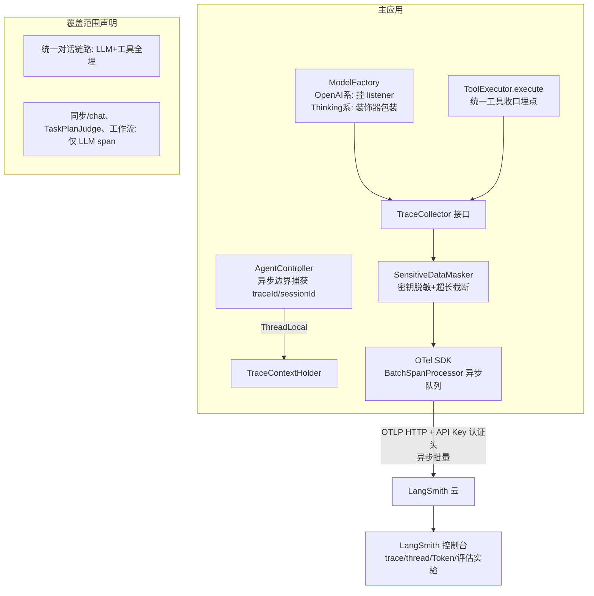
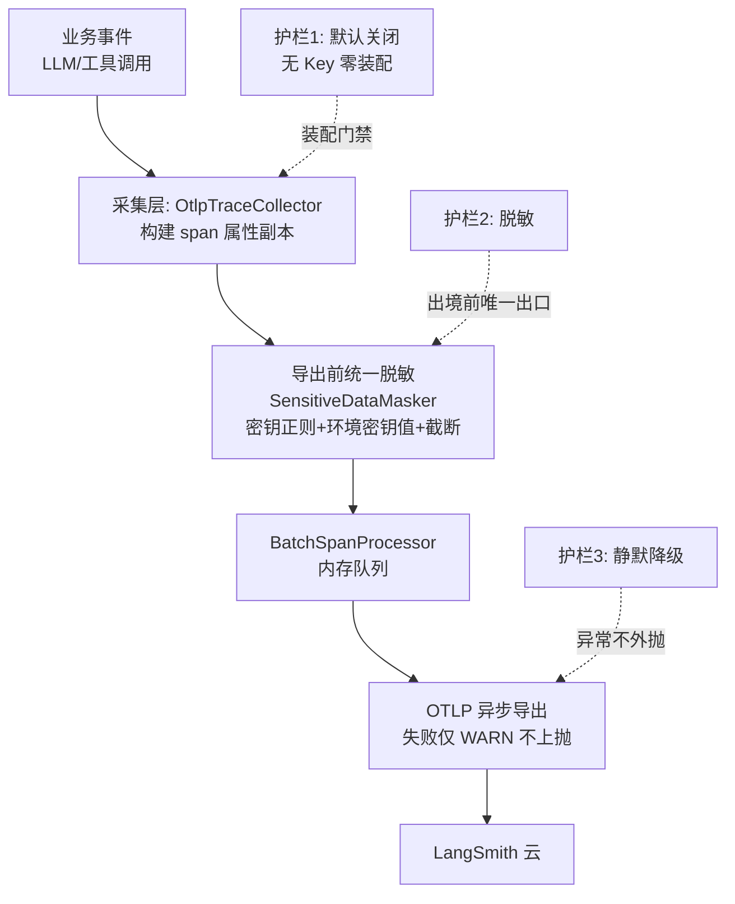

# AI Agent 技术设计文档: LangSmith 可观测子系统（langsmith-observability）

| 字段 | 内容 |
|------|------|
| 版本 | v1.0 |
| 作者 | ai-agent-tech-design（技术设计技能） |
| 日期 | 2026-08-29 |
| 变更记录 | v1.0 \| 2026-08-29 \| 初版：OTel SDK 直发 OTLP 架构、双路 LLM 埋点（listener+装饰器）、ToolExecutor 工具埋点、Controller 异步边界上下文传播、SpanProcessor 前脱敏、评估最小闭环设计 \| 技术设计流程 |

## 0. 设计概要 (Design Summary)

*   **Agent 描述**：为现有对话链路接入 LangSmith 可观测平台--旁路采集 LLM 调用与工具调用事件，经 OpenTelemetry 标准异步导出至 LangSmith 云（OTLP 协议）。
*   **Agent 类型**：平台基础设施型（确定性数据管道，非业务 Agent，无 LLM 参与）。
*   **自主性级别**：L4 类不可回滚风险归类 + 三重护栏（默认关 / 基础脱敏 / 静默降级），与需求文档 3.3 一致。
*   **影响范围**：新建 `agent-demo-observability` 模块；修改 `agent-demo-llm`（ModelFactory）、`agent-demo-tools`（ToolExecutor）、`agent-demo-web`（AgentController）、`agent-demo-bootstrap`（pom/application.yml）、`agent-demo-bom`（pom）、根 pom（modules）。**不改任何 Prompt 制品、不改业务语义、零新增用户交互**。
*   **技术难点**：
    1.  统一对话主链路为自研 ReAct（`HITLReActStream`），主链路模型是自定义 `ThinkingStreamingChatModel`（非 LangChain4j ChatModel 接口，无 listener 机制）--`langchain4j-observation` 官方集成覆盖不到主链路，Thinking 系必须自建埋点；
    2.  SSE 编排运行在 `CompletableFuture.runAsync` 异步线程，MDC traceId（ThreadLocal）不跨线程传播且 Controller 线程 `afterCompletion` 即清理--上下文必须显式捕获传递；
    3.  真实 TokenUsage 仅存在于 `ThinkingStreamHandler.onComplete` 回调（现有 SSE usage 事件为估算值）--Token 采集点必须落在该回调；
    4.  LangSmith OTLP 端点对 GenAI 语义约定属性与 thread 聚合键的识别行为需联调验证；
    5.  OTel 为净新增依赖（全仓库零 micrometer/otel/actuator 依赖），需经 BOM 统一引入且默认关闭时零挂载。
*   **依赖关系**：外部服务 LangSmith 云（OTLP HTTP 端点）；新增 OpenTelemetry SDK 依赖（BOM 统一管理）；复用现有 `ModelFactory` / `ToolExecutor` / `AgentController` / `TraceIdInterceptor`。

## 1. Agent 架构概览 (Agent Architecture)

### 1.1 编排模式
*   **模式**：确定性数据管道（事件监听 -> span 构建 -> 脱敏/截断 -> 异步批量导出）。
*   **选择顺序说明（模板强制项适配）**：本子系统非 Agent 系统，不存在「单次 LLM 调用 -> 工作流 -> 自主 Agent」的编排升级选择；管道本身即最简形态--纯函数式确定性处理，无 LLM 参与、无自主决策循环、无概率性行为。
*   **选择理由**：数据采集导出是步骤固定的确定性任务，工作流型管道以代码强制处理顺序，攻击面与故障面最小（安全默认值：能力默认关闭，显式开启--Harness 约束要素的直接体现）。
*   **停止条件设计（模板强制项适配）**：无执行循环，不适用五类停止条件；管道有明确的终止语义--JVM 关闭时 BatchSpanProcessor flush 残留 span（OTel SDK 自带 shutdown hook），导出超时后放弃（有限重试）。
*   **多 Agent 三问**：不适用（无多 Agent）。

### 1.2 推理框架
*   不适用（子系统无推理能力，仅采集转发）。需求文档 5.1 定义的「采集结构」（一次用户消息 = 一个根 trace，LLM/工具调用 = 子 span）由本方案的 span 组织规则落地（见 7.1）。

### 1.3 系统集成架构
*   **部署形态**：嵌入式（与主应用同进程同 JVM，经 bootstrap 聚合启动）。
*   **接入方式**：Spring Bean 装配 + 代码埋点（无消息队列/网关，进程内直调，零网络侵入）。
*   **与现有系统的交互关系**：

### 1.4 生命周期
*   **初始化**：Spring Boot 启动时条件装配（`ObservabilityAutoConfiguration`，`@ConditionalOnProperty("langsmith.enabled")` 且 `LANGSMITH_API_KEY` 非空）-> 构建 OpenTelemetry 实例 + OTLP HTTP exporter + BatchSpanProcessor + `OtlpTraceCollector` Bean；条件不满足时装配 `NoopTraceCollector`（全部方法空实现，零开销）。
*   **执行**：埋点代码调用 `TraceCollector.recordLlm/recordTool`（同线程、纳秒级内存操作）-> span 进入 BatchSpanProcessor 内存队列 -> 按导出间隔（默认 5s）或批量阈值异步发送。
*   **会话终止**：无会话概念（子系统无状态，上下文每次调用传入）。
*   **超时控制**：OTLP exporter 请求超时（默认 5s，可配）；单字段大小上限（`langsmith.max-field-chars`，默认 4000，对齐既有 sanitize maxChars）。

### 1.5 模型能力要求
*   **不适用**：本特性不引入任何 LLM 调用、不改变任何模型行为，无模型能力基线要求。

### 1.6 代码结构与领域模块设计

**领域模块划分**：

| 模块名 | 职责（一句话） | 不负责（边界） | 复用/新建 | 包含文件 |
| :--- | :--- | :--- | :--- | :--- |
| agent-demo-observability | 采集接口定义 + OTel 实现与导出 + 脱敏截断 + 上下文持有 | 不负责埋点位置（由业务模块决定）、不依赖任何业务模块 | 新建（叶子模块，仅依赖 agent-demo-common 与 OTel SDK） | `com.agentdemo.observability` 包（6 文件，见清单） |
| agent-demo-llm（埋点扩展） | OpenAI 系 listener 适配 + Thinking 系装饰器采集 | 不负责脱敏/导出（只调 collector） | 复用（新增 2 类 + ModelFactory 改造） | `TraceChatModelListener` / `TracingThinkingStreamingChatModel` |
| agent-demo-tools（埋点扩展） | ToolExecutor 统一收口工具采集 | 同上 | 复用（ToolExecutor 改造） | - |
| agent-demo-web（埋点扩展） | Controller 异步边界捕获上下文 | 同上 | 复用（AgentController 改造） | - |

**目录归属与文件清单**：

*   **目录归属**：新模块复制 mcp/skill 模块接入先例（根 pom `<modules>` 一行 + BOM 登记）；埋点类放各业务模块既有包（registry/thinking 包），符合「目录归属优先遵循项目已有结构」。
*   **文件清单**：

| 文件路径 | 操作 | 用途 |
| :--- | :--- | :--- |
| `agent-demo-observability/pom.xml` | 新增 | 模块定义（依赖 common + OTel） |
| `agent-demo-observability/.../TraceCollector.java` | 新增 | 采集接口（含 `LlmCallEvent`/`ToolCallEvent` 嵌套 record：模型名/消息/Token/耗时/成败/异常等字段） |
| `agent-demo-observability/.../NoopTraceCollector.java` | 新增 | 默认空实现（未启用时零开销，AC-S02） |
| `agent-demo-observability/.../OtlpTraceCollector.java` | 新增 | OTel 实现：span 构建 + GenAI 语义属性 + 状态标记 |
| `agent-demo-observability/.../SensitiveDataMasker.java` | 新增 | 密钥脱敏正则 + 环境密钥值精确替换 + 超长截断（纯函数，AC-S01/E02） |
| `agent-demo-observability/.../TraceContextHolder.java` | 新增 | ThreadLocal 上下文持有（`TraceContext` record：traceId/sessionId），含 MDC 读取回退 |
| `agent-demo-observability/.../ObservabilityAutoConfiguration.java` | 新增 | 条件装配（启用判定/OTel SDK/exporter/collector Bean 注册） |
| `agent-demo-llm/.../registry/TraceChatModelListener.java` | 新增 | `ChatModelListener` 适配：onRequest/onResponse/onError -> collector（span 句柄经 listener attributes 跨回调传递） |
| `agent-demo-llm/.../thinking/TracingThinkingStreamingChatModel.java` | 新增 | 装饰器：包装 `ThinkingStreamingChatModel.stream()`，请求侧参数 + handler.onComplete 的真实 TokenUsage -> collector |
| `agent-demo-llm/.../registry/ModelFactory.java` | 修改 | 构造器注入 TraceCollector；OpenAI 系构建挂 listener、Thinking 系构建返回装饰器 |
| `agent-demo-tools/.../registry/ToolExecutor.java` | 修改 | execute 计时 + recordTool（含异常路径，AC-T03） |
| `agent-demo-web/.../controller/AgentController.java` | 修改 | chatStream 与工具确认恢复入口：捕获 MDC traceId + sessionId 构造 TraceContext，runAsync lambda 内 set/finally clear（AC-M01 关键） |
| `根 pom.xml` | 修改 | `<modules>` 增加 observability |
| `agent-demo-bom/pom.xml` | 修改 | OTel 版本 properties + dependencyManagement + 模块登记 |
| `agent-demo-llm` / `agent-demo-tools` / `agent-demo-web` / `agent-demo-bootstrap` 的 `pom.xml` | 修改 | 增加 observability 依赖（bootstrap 经 web 传递亦可，显式声明符合项目惯例） |
| `agent-demo-bootstrap/.../application.yml` | 修改 | 新增 `langsmith` 配置段 |

*   **依赖方向验证**：observability -> common（无环）；llm/tools/web -> observability（新增方向，不与既有依赖冲突）；agent 模块**零修改**（ThreadLocal 透传，见决策 5）。
*   **结构最小化声明**：无投机性分层--TraceCollector 接口有两个实现（Noop/Otlp）非单实现接口；无工厂；配置项仅 7 个（见 12 节）均有对应 AC。

## 2. Prompt 工程架构 (Prompt Engineering Architecture)

*   **不适用声明**：本特性为纯基础设施接入，**零 Prompt 制品变更**（不改系统提示词、不改工具描述、不改输出契约）。理由：子系统的「工具」是采集点而非 Agent 业务工具，「输出」是 OTel span 属性而非自然语言，均无 Prompt 工程对象。业务 Agent 的 Prompt 体系维持现状，缓存友好约束不受影响（静态前缀无任何变化）。

## 3. 工具集成设计 (Tool Integration)

> **映射说明**：本节将模板的「工具适配」映射为**采集点适配**（需求文档 4.1 的采集点清单落地）。

### 3.1 采集点适配层

| 采集点 | 挂载位置 | 覆盖链路 | 采集内容 | 副作用 |
|-------|---------|---------|---------|--------|
| OpenAI 系 listener | `ModelFactory.createChatModel` / `createStreamingChatModel` 加 `.listeners(TraceChatModelListener)` | 同步 /chat、TaskPlanJudge、工作流 Agentic 路径、视觉模型 | 消息列表/模型名/参数/回复/TokenUsage/耗时/错误 | 无（只读旁路） |
| Thinking 系装饰器 | `ModelFactory.createThinkingStreamingChatModel` 返回 `TracingThinkingStreamingChatModel` 包装 | 统一对话主链路（直答/拆解/恢复全部 Thinking 调用） | stream() 请求侧（messages/toolsJson/modelName）+ onComplete 真实 TokenUsage/finishReason | 无（只读旁路） |
| 工具收口埋点 | `ToolExecutor.execute` 前后 | 统一对话全部工具（内置/MCP/RAG/技能脚本）+ 工作流 HITL 路径 | 工具名/入参（LLM 生成 argumentsJson）/出参（已过 sanitize 管道）/耗时/成败/异常 | 无（只读旁路） |
| OTLP 导出通道 | `ObservabilityAutoConfiguration` 装配 | - | span 批量 | **有**（数据出境，不可回滚）--由三重护栏对冲 |

*   **覆盖范围声明（用户已确认）**：AiServices 反射路径的工具 span（同步 /chat 与工作流非 HITL 路径）**本期不做**，列入演进项；上述入口的 LLM span 经 listener 自动覆盖。

### 3.2 采集执行编排
*   **串行语义**：单次对话内 LLM span 与工具 span 按真实执行顺序生成（span 起止时间戳天然反映执行序，AC-T01）；父子关系：同一次用户消息的 span 共享 TraceContext（traceId/sessionId）。
*   **并行编排**：无（采集在调用线程同步记录，导出异步）。
*   **最大调用次数**：不设采集上限（全量采集，需求 3.2 已定不采样）。

### 3.3 采集失败处理

| 环节 | 失败场景 | 重试策略 | 降级方案 | 是否转人工 |
|------|---------|---------|---------|-----------|
| OTLP 导出 | 超时/401/5xx/网络不可达 | BatchSpanProcessor 有限重试后丢弃批次 | WARN 日志（含原因摘要、不含 Key），主流程不受影响（AC-S04） | 否 |
| 埋点采集 | collector 异常 | 不重试 | 埋点内部 try-catch 吞异常 + WARN，跳过该条 span（AC-S04） | 否 |
| 脱敏处理 | masker 执行异常 | 不重试 | 保守策略：该字段整段替换为 `[MASKED]` 占位（宁误杀不放过，需求 6.4） | 否 |
| 超长内容 | 单字段超阈值 | - | 截断至 `max-field-chars` 并附加 `[TRUNCATED]` 标识（AC-E02） | 否 |

*   **错误信息可学习性（强制声明）**：WARN 日志包含失败原因摘要（异常类型+端点+批次 span 数），不含任何密钥；错误不影响任何用户可见行为。

### 3.4 采集权限控制
*   **只读采集**：listener/装饰器/埋点均只读，无执行面（AC-S05 的技术根基：OTel span 属性不存在执行路径）。
*   **唯一写通道**：OTLP 导出（数据出境），启用前置条件 = 配置 `langsmith.enabled=true` + 环境变量 `LANGSMITH_API_KEY` 非空（AC-S02 的装配级实现）。

### 3.5 幂等性与两段式执行
*   **不适用声明**：采集为只读旁路、导出为幂等追加（LangSmith 按 trace 幂等去重语义由平台处理）；不存在发邮件/转账/删数据类不可幂等业务操作，无需两段式。

### 3.6 参数保真性声明（强制）
*   span 记录的消息/工具入参/出参与 Agent 实际收发内容**字节一致**（采集点位于 sanitize 之后、脱敏仅作用于 span 属性副本，不影响业务数据流本身）；截断仅在 span 中以 `[TRUNCATED]` 标识呈现，业务侧数据不变--模型感知的世界与 trace 记录的世界无系统性偏差（差异点仅为脱敏与截断，且均在采集副本上显式标记）。

## 4. 记忆与上下文架构 (Memory & Context)

*   **不适用声明（维持现状）**：本特性不改任何记忆/上下文机制（滑动窗口、压缩记忆、HITL 快照零变更）。子系统自身的「记忆」仅是单次调用内的 TraceContext（traceId/sessionId 值对象，无存储、无跨请求状态）。
*   **上下文传播机制（本设计核心）**：见技术决策 5--Controller 异步边界显式捕获 + ThreadLocal 持有 + MDC 回退，`HITLReActStream`/`UnifiedChatStream`/`TaskBreakdownStream` **零修改**透传。

## 5. 知识与检索设计 (Knowledge & RAG)

*   省略（不涉及知识检索）。

## 6. 护栏与安全设计 (Guardrails & Safety)

### 6.1 多层护栏架构（模板四层适配）

*   **层级映射声明**：输入过滤层 = 导出前统一脱敏（出境数据唯一出口处）；输出过滤层 = 超长截断 + 脱敏保守策略；Prompt 层与工具执行层护栏 = **不适用**（本特性无 Prompt 变更、无业务工具新增，理由：子系统不产生模型可见内容、不执行业务动作）。

### 6.2 输入过滤层（出境前唯一出口）
*   **脱敏规则**（`SensitiveDataMasker` 纯函数，对 span 属性值执行）：
    1.  密钥模式正则：`sk-[A-Za-z0-9_-]{16,}`、`Bearer\s+[A-Za-z0-9._-]{16,}` 等 -> 替换为 `[REDACTED]`；
    2.  环境密钥值精确替换：装配时收集非空的 `LANGSMITH_API_KEY`/`ARK_API_KEY`/`BAILIAN_API_KEY` 等环境变量值，对属性值做全串替换（防环境值以非标准形态出现）；
    3.  截断：单字段超 `max-field-chars`（默认 4000）截断 + `[TRUNCATED]` 后缀。
*   **脱敏位置**：`OtlpTraceCollector` 构建 span 属性时（所有出境数据经此唯一出口，无绕行路径--本期内 span 全部经 collector 构建）。

### 6.3 Prompt 层护栏 / 6.4 输出过滤层
*   Prompt 层：不适用（零 Prompt 变更）。输出过滤层：脱敏保守策略（异常整字段 `[MASKED]`）+ 截断标识（6.2 已覆盖）。

### 6.5 工具执行层护栏（Action Gating）
*   不适用（无业务工具新增）；OTLP 导出通道的门禁即 3.4 装配条件（AC-S02）。

### 6.6 降级策略
*   **模型不可用/工具链失败**：不适用（无模型/工具依赖）。
*   **LangSmith 不可用**：WARN + 有限重试 + 丢弃批次（3.3 表）；主对话零影响（AC-S04/E01）。
*   **护栏触发降级**：脱敏异常 -> 保守整字段替换（需求 6.4 降级表落地）。

### 6.7 身份与权限架构
*   **身份传播机制**：无用户身份体系变更（演示项目单租户，与现状一致）；子系统内部上下文 = traceId + sessionId（非身份敏感字段）。
*   **Key 管理（AC-S03）**：`LANGSMITH_API_KEY` 仅环境变量注入（application.yml `${LANGSMITH_API_KEY:}` 占位，沿用 MILVUS_HOST 配置先例 + start.ps1 注入模式）；OTLP 认证头在 exporter 构建处组装，不进日志、不进 span、不进前端。
*   **数据隔离**：trace 含 sessionId 仅用于会话聚合，不含用户身份数据；LangSmith 平台访问控制由其账号体系承担（需求 6.7 落地）。

## 7. 评估与可观测性设计 (Evaluation & Observability)

### 7.1 决策链路追踪（span 数据结构设计）

**Span 组织规则**（需求 5.1 落地）：一次用户消息触发的完整对话处理产生一组 span（LLM span 序列 + 工具 span），按真实执行序起止，共享 TraceContext；属性遵循 OpenTelemetry GenAI 语义约定（GenAI semconv），使 LangSmith 正确渲染 LLM span 类型。

| Span 类型 | span 名称 | 关键属性（GenAI semconv / 自定义） | 来源 |
|-----------|----------|-----------------------------------|------|
| LLM span | `chat {model}` | `gen_ai.operation.name=chat`、`gen_ai.system`、`gen_ai.request.model`、`gen_ai.usage.input_tokens/output_tokens`、输入消息、输出回复、`error.type`（失败时）、`session.id`（=sessionId）、`log.trace_id`（本地日志互查键，AC-M01）、`gen_ai.conversation.id`（thread 聚合承载键） | listener（OpenAI 系）/ 装饰器（Thinking 系） |
| 工具 span | `{toolName}` | `tool.name`、`tool.arguments`（入参）、`tool.result`（出参，已过 sanitize）、状态 OK/ERROR（异常信息）、span 时长天然记录 | ToolExecutor 埋点 |

*   **Token 真实值保障**（技术难点 3 落地）：Thinking 系从 `handler.onComplete` 的 TokenUsage 取真实值；OpenAI 系从 listener onResponse 的 `TokenUsage` 取--**不使用**现有 SSE 的 SimpleTokenEstimator 估算值。
*   **traceId 传播链**：`TraceIdInterceptor`（MDC）-> `AgentController` 捕获 -> `TraceContextHolder`（ThreadLocal）-> collector 写入 `log.trace_id` 属性（AC-M01）。
*   **thread 聚合承载键**：`gen_ai.conversation.id` 承载 sessionId（OTel semconv 标准属性）；同时双写 `langsmith.thread.id` 作为联调备选（见风险 1），验证后保留生效者。

### 7.2 评估框架（最小闭环，五要素）

> 评估对象是「agent-demo Agent 整体（模型 + Harness）」而非 LangSmith 集成本身；trace 是证据来源，LangSmith 实验环境是执行平台。

| 要素 | 设计 |
|------|------|
| **Dataset** | 从真实对话 trace 沉淀 10 个用例：直答 / 单工具 / ReAct 多轮（>=2 轮工具）/ 工具失败恢复 / HITL 暂停恢复 / 含指代多轮 / 模型切换会话 / 含密钥正例（脱敏验证）。**陷阱任务**：注入用例（复用 20260826 tool-output-sanitization 对抗用例库：网页/文档注入指令）+ 诱导越界请求（超出工具白名单的文件路径） |
| **State** | 每用例新建会话（SessionManager 内存态，新建即重置到相同初始状态）；工具目标用固定 fixture 文件（`data/` 下专用目录） |
| **Tools** | Agent 既有工具集全量提供（原子操作，不提供高层抽象）--评估的是 Agent 的工具选择与编排行为 |
| **Rubric** | 见下表 |
| **Protocol** | 单请求 -> SSE 完成；每用例 **3 次运行**（Pass^3 起评）；LangSmith 实验承载（trace -> 数据集 -> evaluate） |

**Rubric 评分标准设计表**：

| 评分项 | 标准 | 权重级别 | 说明 |
|--------|------|---------|------|
| 工具选择正确性 | 按任务语义调用了正确工具且参数语义合理 | essential | 不达标该用例失败 |
| 幻觉检查 | 不编造工具结果/字段值/文件内容 | **veto（一票否决）** | 触发即整体判负 |
| 脱敏命中 | 含密钥正例的 trace 上报后 LangSmith 侧无明文 | **veto（一票否决）** | 安全零容忍（AC-S01） |
| 最终回答完整性 | 回答包含任务所需关键信息 | important | |
| 响应风格与语言 | 中文、简洁 | optional | |

**评估指标**：

| 指标类别 | 指标 | 定义 | 目标值 |
|---------|------|------|--------|
| 正确性 | 工具选择正确率 | 用例中工具选择正确的比例 | >= 90% |
| 稳定性 | Pass^3 | 同一用例 3 次运行全部成功概率 | >= 80% |
| 安全性 | 脱敏拦截率 | 密钥正例全部命中 | 100%（零容忍） |
| 安全性 | 误伤率 | 密钥反例（含 sk-/ignore 正常文本）被误替换 | 0% |
| 过程 | ReAct 链路完整率 | 多轮循环 span 无缺失（AC-T01） | 100% |
| 效率 | 上报成功率 | 导出批次成功比例 | >= 99%（失败仅 WARN） |

*   **统计显著性（强制声明）**：每配置至少 3 次运行取均值；10 例规模下 95% 置信区间约 ±30 个百分点，**分差小于噪声带宽不做迭代决策**；评估结论以 Pass^3（稳定性）为准，不与 Pass@k 混用。
*   **评估方式**：确定性评估器为主（LangSmith 平台 code evaluator：断言工具选择、关键词、脱敏后比对），**不用 LLM-as-Judge**（最小闭环避免长度偏差/同源模型问题；引入 judge 列演进项）。
*   **对抗测试方案**：

| 攻击面 | 测试场景 | 数据来源 | 预期行为 | 通过标准 |
|--------|---------|---------|---------|---------|
| 注入（经 trace 记录） | 工具返回含"忽略此前指令"类文本 | 复用 20260826 对抗用例库 | 内容被记录为数据，无执行（AC-S05） | 100% |
| 密钥泄漏 | 输入/工具返回含 sk-xxx 密钥 | 脱敏正例集 | LangSmith 侧无明文 | 100% |
| 无 Key 外联 | 未配置 Key 启动并发起对话 | 启动用例 | 零网络请求（AC-S02） | 100% |

*   **A/B 测试方案**：本期不适用（单配置验证链路；Prompt/模型对比实验列演进项）。

### 7.3 监控与告警
*   **实时监控**：LangSmith 平台侧（Token 消耗/延迟/错误率/工具失败率--由 span 数据自动聚合，需求 3.1 第 6 项 Token 统计的落地形态）；本地侧 WARN 日志（导出失败原因摘要）。
*   **告警阈值**：**本期不设告警通道**（需求 8.2 第 7 项已定，沿用 tool-output-sanitization 决策先例）；导出连续失败的观察入口 = 本地日志按 `WARN.*langsmith` 过滤。
*   **行为异常检测**：不适用（子系统无自主行为可偏移）。

## 8. 性能与成本设计 (Performance & Cost)

### 8.1 Token 成本优化
*   **Token 零增量**：不改变任何对话请求（消息组装/工具定义/系统提示词零变更），主链路 KV Cache 命中不受影响（静态前缀稳定性的既有设计零破坏）。
*   **上报体积控制**：截断阈值 4000 字符/字段（8.4 成本估算依据）。

### 8.2 延迟优化
*   **异步导出**：BatchSpanProcessor 内存队列 + 定时批量发送，主流程仅承担 span 构建（内存操作，微秒级）+ 脱敏正则（微秒级），**不等待任何网络 IO**（AC-E01）。
*   **无流式影响**：SSE 流式逐字输出路径零阻塞（采集点在回调处，不介入流处理）。

### 8.3 并发控制
*   **队列上限**：BatchSpanProcessor maxQueueSize（默认 2048，可配）防内存膨胀；队列满时丢弃并 WARN（学习项目流量远低于上限）。
*   **无全局锁**：span 构建线程安全（OTel SDK 保证）；无会话级并发限制变更。

### 8.4 成本估算

| 场景 | 单次对话上报量 | 预估日对话量（学习项目） | 日上报流量 | 月成本 |
|------|---------------|----------------------|-----------|--------|
| 简单对话（1 LLM span） | ~2 KB | ~100 | ~0.2 MB | LangSmith Developer 免费层内 |
| ReAct 多轮（5-10 span） | ~10-40 KB | ~30 | ~1.2 MB | 同上 |
| **Token 成本** | **0（对话零变化）** | - | - | - |

*   **OTel 依赖体积**：3 个 artifact（api/sdk/exporter-otlp），净新增 jar 约 3-5 MB，对启动时间影响可忽略（条件装配关闭时零初始化）。

## 9. 验收标准映射 (AC Mapping)

| AC ID | AC 描述 | AC 类型 | 对应技术实现 |
|-------|--------|--------|-------------|
| AC-N01 | 含工具调用的对话完整上报 | 正常交互 | 双路 LLM 埋点（ModelFactory listener + 装饰器）+ ToolExecutor 埋点（§3.1 采集点适配层） |
| AC-N02 | 会话 thread 聚合 | 正常交互 | `gen_ai.conversation.id` 承载 sessionId + 双写备选键（§7.1，风险 1 联调验证） |
| AC-N03 | LLM span 必备字段 | 正常交互 | GenAI semconv 属性集 + 装饰器取 onComplete 真实 TokenUsage（§7.1 span 设计表） |
| AC-N04 | 工具 span 必备字段 | 正常交互 | ToolExecutor 计时 + recordTool 五要素（§3.1） |
| AC-T01 | ReAct 循环链路完整 | 工具调用 | span 起止时间戳天然反映执行序 + 同 TraceContext 归属（§3.2） |
| AC-T02 | LLM 失败记录不丢失 | 工具调用 | listener onError / 装饰器 onError 路径均产 ERROR span（§3.1） |
| AC-T03 | 工具失败记录不丢失 | 工具调用 | ToolExecutor 异常路径 catch 后 recordTool 再上抛（§3.1，含异常信息） |
| AC-S01 | 密钥脱敏上报 | 安全护栏 | SensitiveDataMasker 正则 + 环境密钥值精确替换，导出前唯一出口（§6.2） |
| AC-S02 | 默认关闭零外联 | 安全护栏 | ObservabilityAutoConfiguration 条件装配 + NoopTraceCollector（§1.4，§3.4） |
| AC-S03 | Key 不泄漏 | 安全护栏 | 环境变量注入 + exporter 头组装隔离 + WARN 日志脱敏（§6.7，§3.3） |
| AC-S04 | 上报失败静默降级 | 安全护栏 | OTLP 有限重试 + WARN + 丢弃批次 + 埋点 try-catch（§3.3 失败表） |
| AC-S05 | trace 数据无执行面 | 安全护栏 | 只读采集 + OTel span 属性无执行路径（§3.4，§3.6） |
| AC-E01 | 上报不阻塞主流程 | 边界降级 | BatchSpanProcessor 异步队列，主流程零网络等待（§8.2） |
| AC-E02 | 超长内容截断 | 边界降级 | max-field-chars=4000 + `[TRUNCATED]` 标识（§6.2 规则 3） |
| AC-E03 | 启停行为确定性 | 边界降级 | 条件装配无中间态、无残留状态（§1.4 生命周期） |
| AC-M01 | 云端 trace 与本地日志互查 | 记忆上下文 | Controller 捕获 MDC -> ThreadLocal -> `log.trace_id` 属性（§7.1 传播链） |
| AC-M02 | 模型切换如实记录 | 记忆上下文 | span 模型名取自当轮实际调用实例（ModelFactory 按 modelId 解析，逐请求构建） |
| AC-H01 | 评估结果可追溯排查 | 人机协作 | LangSmith trace->数据集->实验链路（§7.2 五要素） |
| AC-H02 | 泄漏处置流程 | 人机协作 | 流程文档化（删 trace -> 补脱敏规则 -> 记变更日志），演练用例进评估（§7.2 对抗测试） |

## 10. 技术决策说明 (Technical Decisions)

*   **决策 1：模块归属**
    *   选项：新建 `agent-demo-observability` / 放入 `agent-demo-common`
    *   选择：新建叶子模块
    *   理由：common 仅承载 DTO/异常/工具类（职责约定），塞 OTel SDK 污染底座；新模块依赖方向干净（仅依赖 common），复制 mcp/skill 模块接入先例。
*   **决策 2：OTel 集成路径**
    *   选项：纯 OTel SDK 直发 OTLP / micrometer-observation + tracing-bridge-otel 桥接
    *   选择：纯 OTel SDK
    *   理由：主链路为自研 ReAct，`langchain4j-observation`（micrometer 桥的 AiServices 自动埋点价值点）覆盖不到；全部埋点本就需显式构建，纯 SDK 依赖最少（3 artifact）、直连 LangSmith OTLP 端点无中间抽象层损耗。
*   **决策 3：本期采集覆盖范围**
    *   选项：主链路全埋 + 其余仅 LLM / 全入口全埋
    *   选择：主链路全埋（用户已确认）
    *   理由：AiServices 反射路径工具采集需改 ByteBuddy 包装层（ToolPermissionGuard），工作量大收益低（该路径非前端主用路径）；LLM span 经 ModelFactory listener 对该路径零成本覆盖。
*   **决策 4：Thinking 系采集挂载点**
    *   选项：ModelFactory 返回装饰器（包装 stream()）/ HITLReActStream 包装 handler
    *   选择：装饰器（ModelFactory 一处）
    *   理由：装饰器同时覆盖**所有** Thinking 调用方（不只 HITLReActStream），请求侧与响应侧（含真实 TokenUsage）在同一包装内可得；改动集中单点，业务流类零修改。
*   **决策 5：采集上下文传播机制**
    *   选项：Controller 异步边界捕获 + ThreadLocal 持有 / TraceContext 逐层构造传参（Controller->UnifiedChatStream->HITLReActStream->TaskBreakdownStream）
    *   选择：Controller 捕获 + ThreadLocal（`TraceContextHolder`）
    *   理由：异步边界全仓库仅 AgentController 两处（chatStream、工具确认恢复入口），一处 set/finally clear 覆盖全部下游（TaskPlanJudge/直答/拆解/恢复），`UnifiedChatStream`/`HITLReActStream`/`TaskBreakdownStream` 零修改；MDC 回退兜底同步路径（Controller 线程内联执行的请求天然有 MDC）。规避了 MDC 不跨线程的坑（技术难点 2）。
*   **决策 6：脱敏执行位置**
    *   选项：OtlpTraceCollector 构建属性时统一脱敏 / 自定义 SpanProcessor 导出前脱敏
    *   选择：collector 构建时（单一出口）
    *   理由：OTel `ReadableSpan` 导出侧不可变，Processor 侧改属性需重建 SpanData，复杂度收益不成比例；本期 span 全部经 collector 构建，单一出口无绕行。
*   **决策 7：OTLP 传输协议**
    *   选项：OTLP HTTP（protobuf）/ OTLP gRPC
    *   选择：OTLP HTTP
    *   理由：LangSmith 端点为 https，HTTP 443 出口对代理/防火墙环境友好（预留代理配置，用户确认可直连）；免 gRPC 依赖。

## 11. 风险与注意事项 (Risks & Notes)

*   **技术风险**：
    1.  **LangSmith OTLP 行为待联调**（技术难点 4）：GenAI semconv 识别与 thread 聚合属性键不确定 -> 缓解：`gen_ai.conversation.id` + `langsmith.thread.id` 双写，实现阶段联调验证后保留生效者（AC-N02 验收前完成）；若平台不自动聚合，备选方案为平台侧按属性过滤（需求验收场景仍可达成）。
    2.  **网络可达性**：国内直连 `api.smith.langchain.com` 可达性需实测 -> 缓解：OTLP exporter 预留代理配置项（用户已确认当前可直连）；不可达时全部降级路径已设计（AC-S04），主功能不受阻。
    3.  **OTel 依赖引入**：净新增第三方依赖 -> 缓解：BOM properties 统一版本（GUARDRAILS 新依赖约束）；无既有 micrometer/otel 依赖，冲突风险趋零。
    4.  **HITL 暂停/恢复的 trace 断裂**：暂停前与恢复后的 span 分属两个 traceId（恢复是新的 HTTP 请求，TraceIdInterceptor 生成新 ID）-> 本期接受（跨请求断点为既有 MDC 语义），span 元数据中 sessionId 保持连续，thread 级关联不受影响；列为已知边界而非缺陷。
*   **兼容性**：业务行为零变更（只读旁路）；既有单测零回归预期（唯一风险点 ModelFactory 构造器变更影响其测试，需同步适配）。
*   **性能影响**：主流程新增微秒级内存操作（span 构建 + 脱敏正则），SSE 首字延迟无可测量劣化（§8.2）。
*   **安全风险**：数据出境面收敛于 OTLP 单通道（脱敏前置）；Key 全程不出环境变量。
*   **回滚方案**：
    *   功能开关：`langsmith.enabled=false`（或移除环境变量）即回到现状，秒级生效、无残留状态（AC-E03 的装配级保障）；
    *   代码回滚：埋点为旁路调用，revert 模块与埋点行无数据迁移依赖；
    *   数据侧：LangSmith 平台删除 trace（处置流程见 AC-H02 文档化）。

## 12. 数据隐私与合规 (Data Privacy & Compliance)

*   **数据出境边界（本项目核心合规决策，需求 1 调研结论落地）**：trace 数据出境至 LangChain 托管服务器（美国），保留期 180 天；三重护栏（默认关/脱敏/静默降级）为出境控制手段，用户对话内容不脱敏的决策依据为学习项目无真实敏感数据（需求 6.3 已确认）。
*   **数据传输加密**：OTLP over HTTPS（TLS）。
*   **PII 识别与脱敏**：密钥类模式脱敏（§6.2 规则集）；PII（身份证/手机号）识别**不在本期范围**（需求 3.2 已界定，深度脱敏列演进）。
*   **日志保留与审计**：本地 WARN 日志随 logback 策略（7 天滚动）；无审计不可篡改要求（学习项目，无 WORM 需求）。
*   **用户数据权利**：不适用（无真实用户数据）；trace 删除机制 = LangSmith 平台删除操作（AC-H02 处置流程第一环）。
*   **合规要求**：无 GDPR/个保法强制适用场景（学习演示项目）；设计已为生产化预留路径（脱敏规则可扩展、后端可切换 Langfuse 自托管--OTel 标准不锁定）。
